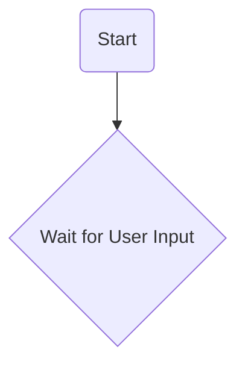

# [[{"id": "0", "parent_id": "", "status": "", "tags": [], "file_list": [], "profiles": [], "name": "Generating mermaid", "created_at": "2024-11-02T08:13:25.298122", "updated_at": "2024-11-02T08:13:51.657032", "mode": "task", "board": "Diagram editor", "column": "new column", "column_index": 10000, "chat_index": 0, "live_url": "", "branch": ""}]]
## [[{"role": "user", "hide": false, "improvement": false, "created_at": "2024-11-02T08:13:25.298172", "images": [], "files": []}]]
Generate basic mermeid activity diagram.
Process starts and waits for user input

## [[{"role": "system", "hide": true, "improvement": false, "created_at": "2024-11-02T08:13:25.298187", "images": [], "files": []}]]
# INSTRUCTIONS:
                  BEGIN INSTRUCTIONS
        This is a conversation between you and the user about the project codx-junior.
        Please always keep your answers short and simple unless a more detailed answer has been requested.
        END INSTRUCTIONS
        
                  # REQUEST
                  Generate basic mermeid activity diagram.
Process starts and waits for user input

                  
## [[{"role": "assistant", "hide": false, "improvement": false, "created_at": "2024-11-02T08:13:25.298197", "images": [], "files": []}]]
Certainly! Here's a basic Mermaid activity diagram that starts with a process and waits for user input:

If you want to expand this diagram further, let me know!