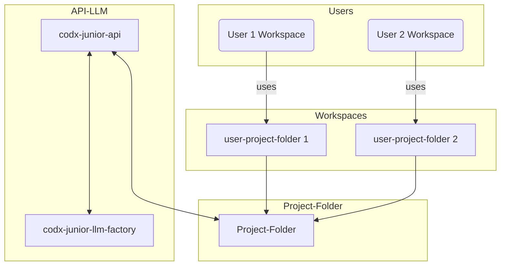
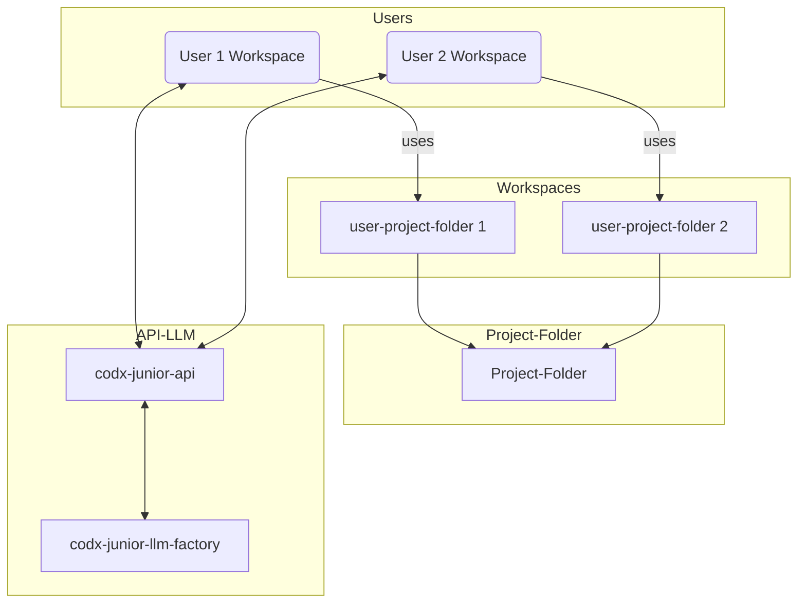
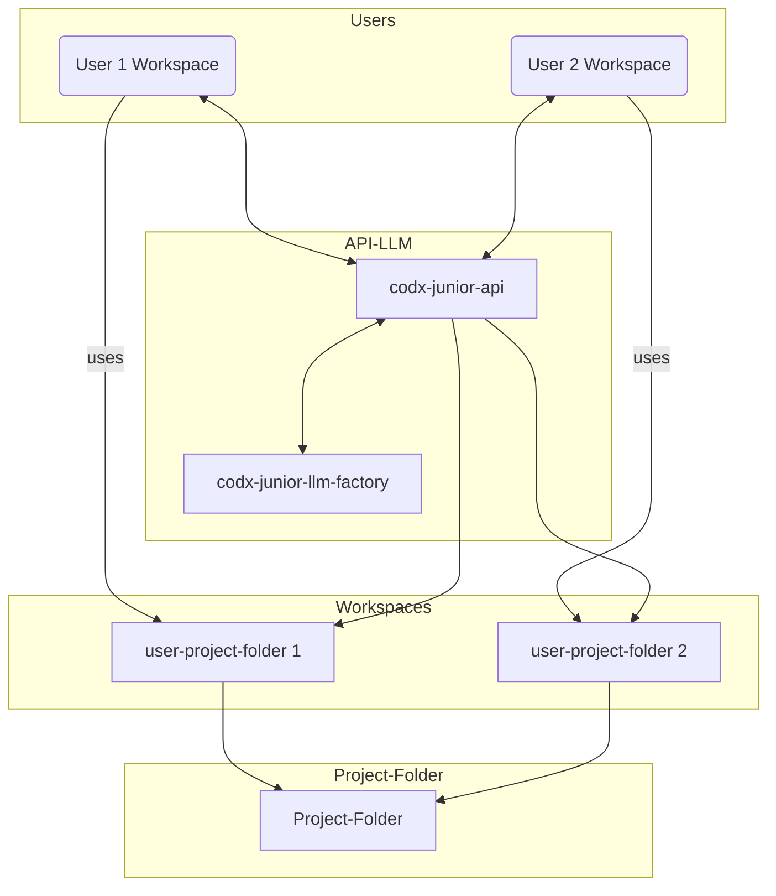

# [[{"id": "58ebd3eb-9ff1-49b4-b066-77ee55ee427b", "doc_id": null, "project_id": null, "parent_id": null, "status": "", "tags": [], "file_list": [], "profiles": ["wiki"], "name": "Architecture", "created_at": "2025-04-05 10:27:24.869413", "updated_at": "2025-04-05T11:14:58.636632", "mode": "chat", "kanban_id": "", "column_id": "", "board": "Docker", "column": "Backlog", "chat_index": 0, "live_url": "", "branch": "", "file_path": "/home/codx-junior/codx-junior/.codx/tasks/Docker/Backlog/Architecture.58ebd3eb-9ff1-49b4-b066-77ee55ee427b.md", "model": ""}]]
## [[{"doc_id": "c9ee3401-f87e-453e-b373-17cf722aa119", "role": "user", "task_item": "", "hide": false, "improvement": false, "created_at": "2025-04-05 10:27:24.867998", "updated_at": "2025-04-05 10:27:24.868023", "images": [], "files": [], "meta_data": {}, "profiles": []}]]
Let's explain codx-junior architecture based on docker containers.
We have these main components:
 * workspace
 * api
 * llm-factory
It works like this, you can have multiple of them depending on your needs.
A typical scenario where a team works in a project, we set up like this:
 * Extend workspace image with all technology needed for the project
 * Create as many copies of the project as needed to keep developments separated: Project_copyA, Project_CopyB
 * Run a workspace for each team member pointing to the Project copy
 * Run an API connected to all project folders
 * Run llm-factory for private models
 * Setup the projects permissions in the API (users.json file)

Explain for users and add a mermaid diagram
## [[{"doc_id": "bb79def4-3519-459d-8602-e11c3c054fb3", "role": "user", "task_item": "", "hide": false, "improvement": false, "created_at": "2025-04-05 10:27:24.867998", "updated_at": "2025-04-05 10:27:24.868023", "images": [], "files": [], "meta_data": {}, "profiles": []}]]
Let's put some names:
 * codx-junior-workspace: Default workspace with basic tools for working. Extendable
 * project-workspace: An extension of codx-junior-workspace with personalised tools and technologies for a project
 * project-folder: A project folder with the project files
 * user-project-folder: A subfolder copy of project-folder for each user
 * user-workspace: A project-workspace's container for each user
 * codx-junior-api: codx-junior AI
 * codx-junior-llm-factory: Engine for private IA models 


Typical setup for a 2 member team is like this:
 * 1 API pointing to Project's root folders
 * 1 LLM-Factory
 * 2 user-workspaces
 * Setup users.json with the projects permissions
## [[{"doc_id": "ce15f1ab-4f81-49b0-9f5b-9287e62ca381", "role": "assistant", "task_item": "", "hide": false, "improvement": false, "created_at": "2025-04-05 10:27:24.867998", "updated_at": "2025-04-05 10:27:24.868023", "images": [], "files": [], "meta_data": {"time_taken": 16.0837824344635, "first_chunk_time_taken": 1.7730786800384521, "model": "gpt-4o"}, "profiles": ["wiki"]}]]
The architecture for codx-junior based on Docker containers involves organizing several components to create a development environment optimized for collaboration and isolation. This setup offers flexibility for teams to work on projects simultaneously while maintaining separate and personalized workspaces. Here is an explanation of the architecture and how it functions, along with a mermaid diagram to visualize the setup:

### Components Overview

1. **codx-junior-workspace**: This is the base Docker image that contains essential development tools. It can be extended to include more tools and technologies required for specific projects.

2. **project-workspace**: This is an extended version of `codx-junior-workspace`, containing all the additional technologies and tools specific to a project.

3. **project-folder**: A directory that contains all of the project's files. This is the main repository where project data is stored.

4. **user-project-folder**: Each team member has their own copy of the project-folder for working independently, preventing conflicts and keeping development isolated.

5. **user-workspace**: It is a Docker container instance running the `project-workspace` setup for each user, linked to their respective `user-project-folder`.

6. **codx-junior-api**: This is a shared API service that allows interaction with the project data and integrates AI functionalities, managing access to project data via a `users.json` permission file.

7. **codx-junior-llm-factory**: Provides a private environment for running AI models, ensuring that private and sensitive data remains secure.

### Typical Setup for a 2-Member Team

For a team of two members, the setup would consist of:

- One instance of **codx-junior-api**, which oversees all project folders and manages user permissions.
- One instance of **codx-junior-llm-factory** for handling AI models.
- Two instances of **user-workspace**, each associated with the corresponding **user-project-folder**.
- The `users.json` file is configured to set permissions for access and interactions with the projects.

### Mermaid Diagram

```mermaid
graph TD;
    subgraph Users
        UWF1(User 1 Workspace)
        UWF2(User 2 Workspace)
    end
    subgraph Workspaces
        PWF1[user-project-folder 1]
        PWF2[user-project-folder 2]
    end
    subgraph Project-Folder
        PF[Project-Folder]
    end
    subgraph API-LLM
        CJAPI[codx-junior-api]
        CJLLM[codx-junior-llm-factory]
    end
    
    UWF1 -- uses --> PWF1
    UWF2 -- uses --> PWF2
    PWF1 --> PF
    PWF2 --> PF
    
    CJAPI <---> PF
    CJAPI <---> CJLLM
    
    classDef box fill:#f9f,stroke:#333,stroke-width:2px;
    Users, Workspaces, Project-Folder, API-LLM class box;
```

### Explanation

- **Users**: Each user has a `user-workspace` running an instance of `project-workspace`, which is personalized for project-specific needs.

- **Workspaces**: The `user-project-folder` is a working copy of the main project-folder. Each user workspace has its own separate copy to avoid conflicts.

- **Project-Folder**: The centralized location where project files are stored and can be updated from user-project-folders as needed.

- **API-LLM**: The `codx-junior-api` manages interactions and permissions via `users.json`, while `codx-junior-llm-factory` ensures private models are executed separately.

This architecture ensures a flexible and secure environment for collaboration on complex projects, scalable to more users or projects as necessary.
## [[{"doc_id": "9e3c346b-e684-411c-b71a-3dedafade2f4", "role": "assistant", "task_item": "", "hide": false, "improvement": false, "created_at": "2025-04-05 10:27:24.867998", "updated_at": "2025-04-05 10:27:24.868023", "images": [], "files": [], "meta_data": {"time_taken": 4.469112873077393, "first_chunk_time_taken": 1.843585729598999, "model": "gpt-4o"}, "profiles": ["wiki"]}]]
I'll provide the updated diagram with the given Mermaid code. Here it is:



### Explanation

- **Users and Workspaces**: Each user (User 1 and User 2) has their own workspace, `UWF1` and `UWF2`, which are instances of `user-workspace` based on `project-workspace`.

- **Workspaces and Project-Folder**: Users work on their individual `user-project-folder`, `PWF1` and `PWF2`, which can sync changes to the main `project-folder` (PF).

- **API-LLM**: The `codx-junior-api` (CJAPI) manages all interactions with the `Project-Folder` (PF) and integrates with the `codx-junior-llm-factory` (CJLLM) to support AI model operations.

This setup diagrams how different components interact within the architecture, facilitating secure, isolated, and collaborative development environments.
## [[{"doc_id": "d1cfbca9-ccfc-4f2d-829e-0d1991370690", "role": "user", "task_item": "", "hide": false, "improvement": false, "created_at": "2025-04-05 10:27:24.867998", "updated_at": "2025-04-05 10:27:24.868023", "images": [], "files": [], "meta_data": {}, "profiles": []}]]
Fix diagram to show a connection between the workspaces and the API. Folders doesn't connect to API
## [[{"doc_id": "8e5e759e-58c0-4e04-a34d-e3069a1e0a35", "role": "assistant", "task_item": "", "hide": false, "improvement": false, "created_at": "2025-04-05 10:27:24.867998", "updated_at": "2025-04-05 10:27:24.868023", "images": [], "files": [], "meta_data": {"time_taken": 5.2327563762664795, "first_chunk_time_taken": 1.863595962524414, "model": "gpt-4o"}, "profiles": ["wiki"]}]]
Let's update the diagram to show a direct connection between the user workspaces and the `codx-junior-api`, while removing direct connections between the project folders and the API:



### Explanation

- **Users and Workspaces**: Each user has their own `user-workspace` (UWF1 and UWF2) that is connected to `codx-junior-api` (CJAPI). This connection allows user applications and interactions with the API.

- **Workspaces and Project-Folder**: Each `user-project-folder` (PWF1 and PWF2) is linked to the main `project-folder` (PF), allowing for updates and synchronization as needed.

- **API-LLM**: The `codx-junior-api` (CJAPI) facilitates communication and integration between user workspaces and any AI functionality provided by the `codx-junior-llm-factory` (CJLLM).

This configuration helps ensure that user interactions with AI services can occur directly through their respective workspaces via the API.
## [[{"doc_id": "5f4caec0-3747-4433-a721-efbd60dc938d", "role": "user", "task_item": "", "hide": false, "improvement": false, "created_at": "2025-04-05 10:27:24.867998", "updated_at": "2025-04-05 10:27:24.868023", "images": [], "files": [], "meta_data": {}, "profiles": []}]]
connect API-LLM with Workspaces
## [[{"doc_id": "c13181d1-96b9-47a7-9794-d0fc0918828c", "role": "assistant", "task_item": "", "hide": false, "improvement": false, "created_at": "2025-04-05 10:27:24.867998", "updated_at": "2025-04-05 10:27:24.868023", "images": [], "files": [], "meta_data": {"time_taken": 4.3254005908966064, "first_chunk_time_taken": 1.8082351684570312, "model": "gpt-4o"}, "profiles": ["wiki"]}]]
Let's revise the diagram to include connections between the API and the workspaces, representing the interaction and data handling between them:



### Explanation

- **Users and Workspaces**: Each user has their own `user-workspace` (UWF1 and UWF2) connected to `codx-junior-api` (CJAPI), enabling each user to interact with the API.

- **Workspaces and Project-Folder**: Users work independently in their `user-project-folder` (PWF1 and PWF2), with each linked to the main `project-folder` (PF) for project file management.

- **API-LLM**: The `codx-junior-api` (CJAPI) is connected to the workspaces and the `codx-junior-llm-factory` (CJLLM) to manage AI operations and interactions, allowing workspaces to request resources or information from the LLM-Factory when needed.

This updated setup clearly shows how the workspaces communicate with the API to take advantage of data management and AI processing capabilities provided by the codx-junior architecture.