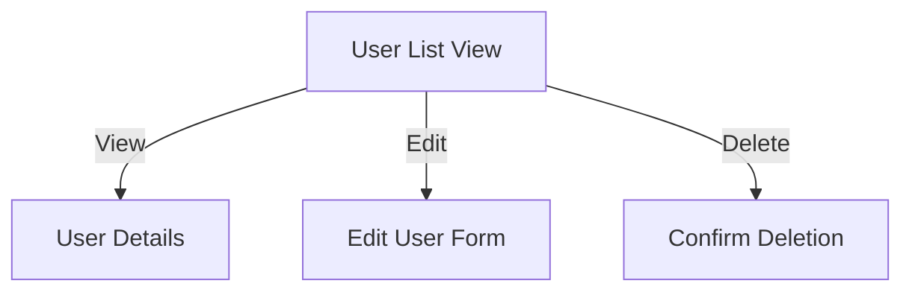
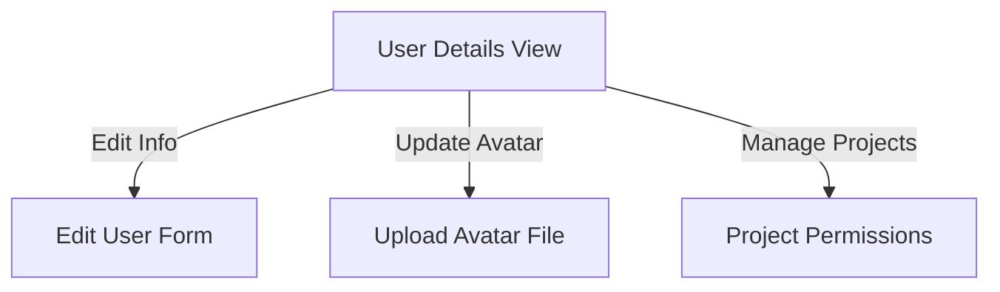

# [[{"id": "abf8a84b-b35c-4471-96fe-839ca9312d9b", "doc_id": null, "project_id": "7f19432b-5b9e-4f0d-b317-166f8c106650", "parent_id": "ffb9b1e1-4cd0-494f-bfc5-80c2767f1ff6", "status": "", "tags": [], "file_list": [], "profiles": ["software_developer"], "name": "User management", "created_at": "2025-04-06 17:24:37.622883", "updated_at": "2025-04-06T17:39:25.827088", "mode": "chat", "kanban_id": "", "column_id": "", "board": "User security", "column": "Backlog", "chat_index": 0, "live_url": "", "branch": "", "file_path": "/home/codx-junior/codx-junior/.codx/tasks/User security/Backlog/User management.abf8a84b-b35c-4471-96fe-839ca9312d9b.md", "model": ""}]]
## [[{"doc_id": "ef525833-4661-466d-8223-ef70e247c707", "role": "user", "task_item": "", "hide": false, "improvement": false, "created_at": "2025-04-06 17:24:37.621417", "updated_at": "2025-04-06 17:24:37.621446", "images": [], "files": [], "meta_data": {}, "profiles": []}]]
Create User management view for user schema:
{
  "username": "john_doe",
  "email": "john@example.com",
  "password": "hashed_password",
  "avatar": "path/to/avatar.png",
  "projects": [
    {
      "project_id": "123",
      "permissions": ["tasks", "coder"]
    }
  ],
  "role": "user"
}
## [[{"doc_id": "145e948d-66fa-405a-9fef-fc4bc86ff7a5", "role": "user", "task_item": "", "hide": false, "improvement": false, "created_at": "2025-04-06 17:24:37.621417", "updated_at": "2025-04-06 17:24:37.621446", "images": [], "files": [], "meta_data": {}, "profiles": []}]]
Create use list and user details for user managment
## [[{"doc_id": "d705d493-2218-4d9b-baf1-34d143b833d2", "role": "assistant", "task_item": "", "hide": false, "improvement": false, "created_at": "2025-04-06 17:24:37.621417", "updated_at": "2025-04-06 17:24:37.621446", "images": [], "files": [], "meta_data": {"time_taken": 9.392201662063599, "first_chunk_time_taken": 3.0065441131591797, "model": "gpt-4o"}, "profiles": ["analyst"]}]]
Certainly! To create user management views for a user schema, we'll create two components: a user list and user details. Each component will follow a structured template similar to the one you've provided. Let's outline the tasks for these components using your specified format and incorporate mermaid diagrams where they add clarity.

---

### Task Title: Develop User List View

**Objective:**
- Create a visual interface to list all users, allowing administrators to view and manage user details efficiently.

**Requirements:**
- Display basic information such as username, email, avatar.
- Implement sorting and filtering options for the list.
- Provide action buttons for view, edit, and delete functionalities.

**Examples:**
- A table listing all users with columns: Username, Email, Role, Actions.
- Example action buttons: [View Details], [Edit], [Delete].

**Acceptance Criteria:**
- User list displays correctly with all necessary data.
- Users can be sorted and filtered based on specific criteria.
- Action buttons work as intended, leading to appropriate user details or actions.

**Additional Notes:**
- Consider pagination for scalability.
- Ensure a responsive design for different screen sizes.

**Mermaid Diagram:**


---

### Task Title: Develop User Details View

**Objective:**
- Design a detailed view for individual user profiles to allow administrators to manage user-specific information.

**Requirements:**
- Display user-specific information: username, email, avatar, projects, and role.
- Provide editing functionality for user details (excluding password in this view for security reasons).
- Allow avatar updates through file uploads.

**Examples:**
- Display: 
  - Username: john_doe
  - Email: john@example.com
  - Avatar: [Display avatar image]
  - Projects: Project ID - 123, Permissions - ["tasks", "coder"]
  - Role: user

**Acceptance Criteria:**
- User details are displayed accurately and completely.
- Editing functionalities are integrated, allowing field-specific updates.
- Avatar upload and preview feature works seamlessly.

**Additional Notes:**
- Ensure data security, especially concerning user passwords.
- Implement permission checks to restrict unauthorized access.

**Mermaid Diagram:**


---

These task definitions aim to provide a clear and structured approach to designing user management views, ensuring developers understand the objectives, requirements, and criteria for success. By including mermaid diagrams, we've provided a visual representation to further clarify the system's workflow and interactions.
## [[{"doc_id": "5c5a5a29-5376-4352-8bf2-5c6c88c88fd8", "role": "user", "task_item": "", "hide": false, "improvement": false, "created_at": "2025-04-06 17:24:37.621417", "updated_at": "2025-04-06 17:24:37.621446", "images": [], "files": [], "meta_data": {}, "profiles": []}]]
Create the user list vue component, will read the list (users) form property "settings"
## [[{"doc_id": "f8bc451c-04d6-44af-a20d-61a19ee5a083", "role": "assistant", "task_item": "", "hide": false, "improvement": false, "created_at": "2025-04-06 17:24:37.621417", "updated_at": "2025-04-06 17:24:37.621446", "images": [], "files": [], "meta_data": {"time_taken": 11.663163423538208, "first_chunk_time_taken": 2.9423813819885254, "model": "gpt-4o"}, "profiles": ["software_developer"]}]]
Certainly! To create a user list Vue component that reads the list of users from a `settings` property, we'll keep our implementation as simple as possible, adhering to the existing code structure while minimizing changes. Here's a concise example:

```vue
<template>
  <div>
    <h1>User List</h1>
    <table>
      <thead>
        <tr>
          <th>Avatar</th>
          <th>Username</th>
          <th>Email</th>
          <th>Role</th>
        </tr>
      </thead>
      <tbody>
        <tr v-for="user in settings.users" :key="user.username">
          <td></td>
          <td>{{ user.username }}</td>
          <td>{{ user.email }}</td>
          <td>{{ user.role }}</td>
        </tr>
      </tbody>
    </table>
  </div>
</template>

<script>
export default {
  name: 'UserList',
  props: {
    settings: {
      type: Object,
      required: true
    }
  }
};
</script>

<style scoped>
table {
  width: 100%;
  border-collapse: collapse;
}

th, td {
  border: 1px solid #ddd;
  padding: 8px;
}

th {
  background-color: #f2f2f2;
}
</style>
```

### Explanation:

- **Template Section:**
  - We have a simple HTML table to display the user list with headers for `Avatar`, `Username`, `Email`, and `Role`.
  - The table rows (`<tr>`) are generated using `v-for` to iterate over the `settings.users`, utilizing `username` as the unique key.
  - Each user's `avatar`, `username`, `email`, and `role` are displayed in the respective table columns.

- **Script Section:**
  - The `UserList` component is defined with a `props` option to accept `settings` as a prop, which is mandatory (`required: true`).

- **Style Section:**
  - Basic styling for the table to ensure readability and maintain a clean layout.

This Vue component respects your existing code structure and provides a straightforward implementation to list users from a `settings` property with minimal changes.
## [[{"doc_id": "41b50cc7-2782-4ca7-a25d-8372fcf03030", "role": "user", "task_item": "", "hide": false, "improvement": false, "created_at": "2025-04-06 17:24:37.621417", "updated_at": "2025-04-06T17:32:19.103Z", "images": [], "files": [], "meta_data": {}, "profiles": []}]]
Generate the SecurityUserList component
## [[{"doc_id": "f5cc42bd-c626-45ad-8b23-9b500f6fea32", "role": "user", "task_item": "", "hide": true, "improvement": true, "created_at": "2025-04-06 17:24:37.621417", "updated_at": "2025-04-06 17:24:37.621446", "images": [], "files": [], "meta_data": {}, "profiles": []}]]
        Assist the user on generating file changes for the project "codx-ui" based on the comments below.
        Make sure that all proposed changes follow strictly the best practices.
        
        Best practices:
        ```markdown
        You are a software developer maintaining the codebase.
* Keep your changes short and simple
* Make minimum changes as possiblle.
* Respect code structure.
* Make your changes compatible with the current code structure and format
* Don't add references or imports unless they are really necessary
        ```
        Info about the project:
        - Root path: /home/codx-junior/codx-junior/client
        - Files tree view: /
└──  home
    └──  codx-junior
        └──  codx-junior
            └──  client
                └──  src
                    ├──  api
                    └──  components
        Use this information for generating file paths and understanding the project's folder structure.

        Create a list of find&replace instructions for each change needed:
        INSTRUCTIONS:
          The output should be formatted as a JSON instance that conforms to the JSON schema below.

As an example, for the schema {"properties": {"foo": {"title": "Foo", "description": "a list of strings", "type": "array", "items": {"type": "string"}}}, "required": ["foo"]}
the object {"foo": ["bar", "baz"]} is a well-formatted instance of the schema. The object {"properties": {"foo": ["bar", "baz"]}} is not well-formatted.

Here is the output schema:
```
{"$defs": {"AICodeChange": {"properties": {"change_type": {"description": "Enumeration: new, update, delete, delete_file", "title": "Change Type", "type": "string"}, "file_path": {"description": "/file/path/to/file", "title": "File Path", "type": "string"}, "existing_content": {"anyOf": [{"type": "string"}, {"type": "null"}], "default": "", "description": "Existing content to be changed if applies", "title": "Existing Content"}, "new_content": {"anyOf": [{"type": "string"}, {"type": "null"}], "default": "", "description": "New content if applies", "title": "New Content"}}, "required": ["change_type", "file_path"], "title": "AICodeChange", "type": "object"}, "AICodePatch": {"properties": {"file_path": {"default": "", "description": "/file/path/to/file", "title": "File Path", "type": "string"}, "patch": {"description": "A file patch with the changes to be applied to the file", "title": "Patch", "type": "string"}, "description": {"default": "", "description": "Brief human friendly description about the change highlighting the most important changes", "title": "Description", "type": "string"}}, "required": ["patch"], "title": "AICodePatch", "type": "object"}}, "properties": {"code_changes": {"description": "Code changes", "items": {"$ref": "#/$defs/AICodeChange"}, "title": "Code Changes", "type": "array"}, "code_patches": {"description": "A list of file patches for each modified file", "items": {"$ref": "#/$defs/AICodePatch"}, "title": "Code Patches", "type": "array"}}, "required": ["code_changes", "code_patches"]}
```
          
          * For new files create an absolute paths
          * Only update files that exists in the project's files
          * Keep content indentation; It is crucial to find the content to replace and to make new content work
        
## [[{"doc_id": "f515aa42-f3a4-455d-ab60-4bf7a7df3bba", "role": "assistant", "task_item": "", "hide": false, "improvement": false, "created_at": "2025-04-06 17:24:37.621417", "updated_at": "2025-04-06 17:24:37.621446", "images": [], "files": [], "meta_data": {"time_taken": 7.27060341835022, "first_chunk_time_taken": 2.97680926322937, "model": "gpt-4o"}, "profiles": ["software_developer"]}]]
Certainly! Here's a simple `SecurityUserList` Vue component. Since you need minimal changes, I'll keep it straightforward, aligned with your existing structure, and compatible with general Vue practices. 

```vue
<template>
  <div>
    <h1>Security User List</h1>
    <table>
      <thead>
        <tr>
          <th>Avatar</th>
          <th>Username</th>
          <th>Email</th>
          <th>Role</th>
        </tr>
      </thead>
      <tbody>
        <tr v-for="user in users" :key="user.username">
          <td></td>
          <td>{{ user.username }}</td>
          <td>{{ user.email }}</td>
          <td>{{ user.role }}</td>
        </tr>
      </tbody>
    </table>
  </div>
</template>

<script>
export default {
  name: 'SecurityUserList',
  props: {
    settings: {
      type: Object,
      required: true
    }
  },
  computed: {
    users() {
      return this.settings.users;
    }
  }
};
</script>

<style scoped>
table {
  width: 100%;
  border-collapse: collapse;
}

th, td {
  border: 1px solid #ddd;
  padding: 8px;
}

th {
  background-color: #f2f2f2;
}
</style>
```

### Explanation:

- **Template Section:**
  - The `template` maintains a simple table similar to the previous `UserList` component, displaying user data with headings for `Avatar`, `Username`, `Email`, and `Role`.

- **Script Section:**
  - The component is named `SecurityUserList`.
  - The `settings` prop is accepted as an object containing user data and is required.
  - A `computed` property, `users`, returns the list of users from `settings.users`. This makes the template cleaner by abstracting direct access to `settings`.

- **Style Section:**
  - Basic styling for tables is maintained to ensure uniformity and cleanliness.

This component provides a clean and efficient way to display a list of security users with minimal changes, aligning with typical Vue.js development conventions.
## [[{"doc_id": "f66df032-85eb-40be-922b-7610214a88b4", "role": "user", "task_item": "", "hide": false, "improvement": false, "created_at": "2025-04-06 17:24:37.621417", "updated_at": "2025-04-06 17:24:37.621446", "images": [], "files": [], "meta_data": {}, "profiles": []}]]
Create a fake JSON user list with 5 users, with fake projects and permissions
## [[{"doc_id": "60706a1b-2305-45d6-b9c8-3f467ea656e7", "role": "assistant", "task_item": "", "hide": false, "improvement": false, "created_at": "2025-04-06 17:24:37.621417", "updated_at": "2025-04-06 17:24:37.621446", "images": [], "files": [], "meta_data": {"time_taken": 7.211609363555908, "first_chunk_time_taken": 2.7760236263275146, "model": "gpt-4o"}, "profiles": ["software_developer"]}]]
Certainly! Below is a fake JSON user list that includes 5 users, each with an associated project and permissions. I've structured it to match the user schema format you provided earlier:

```json
{
  "users": [
    {
      "username": "alice_brown",
      "email": "alice@example.com",
      "password": "hashed_password_1",
      "avatar": "path/to/alice_avatar.png",
      "projects": [
        {
          "project_id": "proj_001",
          "permissions": ["admin", "tasks"]
        }
      ],
      "role": "admin"
    },
    {
      "username": "bob_smith",
      "email": "bob@example.com",
      "password": "hashed_password_2",
      "avatar": "path/to/bob_avatar.png",
      "projects": [
        {
          "project_id": "proj_002",
          "permissions": ["coder", "viewer"]
        }
      ],
      "role": "user"
    },
    {
      "username": "charlie_jones",
      "email": "charlie@example.com",
      "password": "hashed_password_3",
      "avatar": "path/to/charlie_avatar.png",
      "projects": [
        {
          "project_id": "proj_003",
          "permissions": ["reviewer", "commenter"]
        }
      ],
      "role": "user"
    },
    {
      "username": "diana_king",
      "email": "diana@example.com",
      "password": "hashed_password_4",
      "avatar": "path/to/diana_avatar.png",
      "projects": [
        {
          "project_id": "proj_004",
          "permissions": ["tasks", "creator"]
        }
      ],
      "role": "manager"
    },
    {
      "username": "eric_clark",
      "email": "eric@example.com",
      "password": "hashed_password_5",
      "avatar": "path/to/eric_avatar.png",
      "projects": [
        {
          "project_id": "proj_005",
          "permissions": ["viewer", "editor"]
        }
      ],
      "role": "user"
    }
  ]
}
```

### Key Points:

- Each user has a `username`, `email`, `password`, `avatar`, a `projects` array, and a `role`.
- The `projects` array contains a `project_id` and `permissions` for each user.
- This structure is compatible with the schema and format you provided.

These changes respect your existing code structure, add no extra complexity, and keep the setup straightforward as requested.