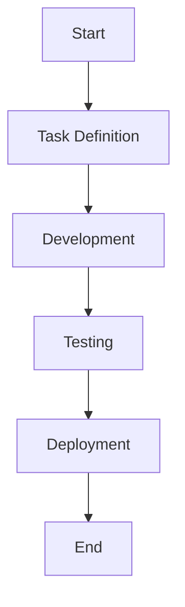

# [[{"id": "35673ca7-438e-4da6-9b09-877a0c67d3b1", "doc_id": null, "project_id": null, "parent_id": null, "status": "", "tags": [], "file_list": [], "profiles": ["analyst"], "name": "Coding flow", "created_at": "2025-02-13 18:52:55.193941", "updated_at": "2025-02-15T09:16:22.134168", "mode": "task", "kanban_id": "", "column_id": "", "board": "codx-agents", "column": "tasks", "chat_index": 0, "live_url": "", "branch": "", "file_path": "/usr/local/codx-junior/.codx/tasks/codx-agents/tasks/Coding flow.35673ca7-438e-4da6-9b09-877a0c67d3b1.md"}]]
## [[{"doc_id": "c059e66e-e7c1-4e58-b7e2-f96b523c0d9f", "role": "user", "task_item": "", "hide": true, "improvement": false, "created_at": "2025-02-13 18:52:55.192194", "updated_at": "2025-02-13 18:52:55.192225", "images": [], "files": [], "meta_data": {}}]]
Creeate a coding agent flow steps. Use mermaid diagrams
## [[{"doc_id": "3cc32cb0-732d-4d45-951e-5c8471a2880f", "role": "assistant", "task_item": "analysis", "hide": false, "improvement": false, "created_at": "2025-02-13 18:52:55.192194", "updated_at": "2025-02-13 18:52:55.192225", "images": [], "files": [], "meta_data": {}}]]
Certainly! Below are the steps to create a coding agent flow using Mermaid diagrams, following the template provided:

```md
**Objective:**
- To design a flowchart for a coding agent using Mermaid diagrams, which visually represents the steps involved in the coding process.

**Requirements:**
- Knowledge of Mermaid syntax for creating diagrams.
- Understanding of the coding agent's workflow and processes.

**Examples:**
- Example of Mermaid syntax for a simple flowchart:
  ```mermaid
  graph TD;
      A[Start] --> B[Task Definition];
      B --> C[Development];
      C --> D[Testing];
      D --> E[Deployment];
      E --> F[End];
  ```

**Acceptance Criteria:**
- [ ] The flowchart must include at least five steps: Start, Task Definition, Development, Testing, Deployment, and End.
- [ ] The diagram should be clear and easy to understand.
- [ ] The flowchart must be created using correct Mermaid syntax.
- [ ] The process flow should logically represent a typical coding workflow.

**Additional Notes:**
- Mermaid is a powerful tool for creating diagrams and flowcharts directly in markdown.
- Ensure that the flowchart is comprehensive and covers all necessary aspects of the coding agent's workflow.
```

Here's how you can visually represent the coding agent flow with a Mermaid diagram:



This flowchart illustrates a basic coding agent workflow from start to end, covering essential phases such as task definition, development, testing, and deployment. Adjust the diagram as needed to fit your specific coding agent processes.null