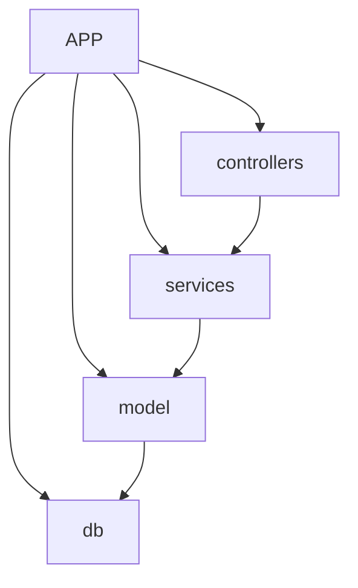
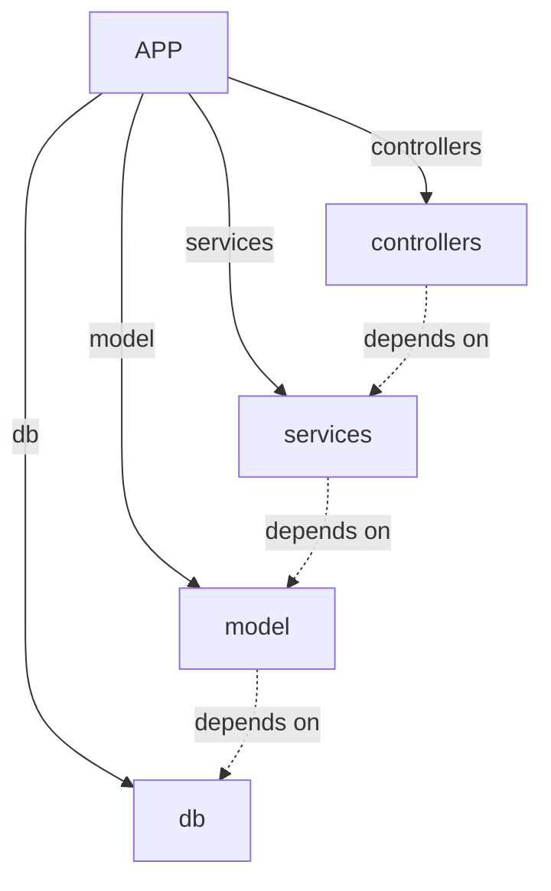
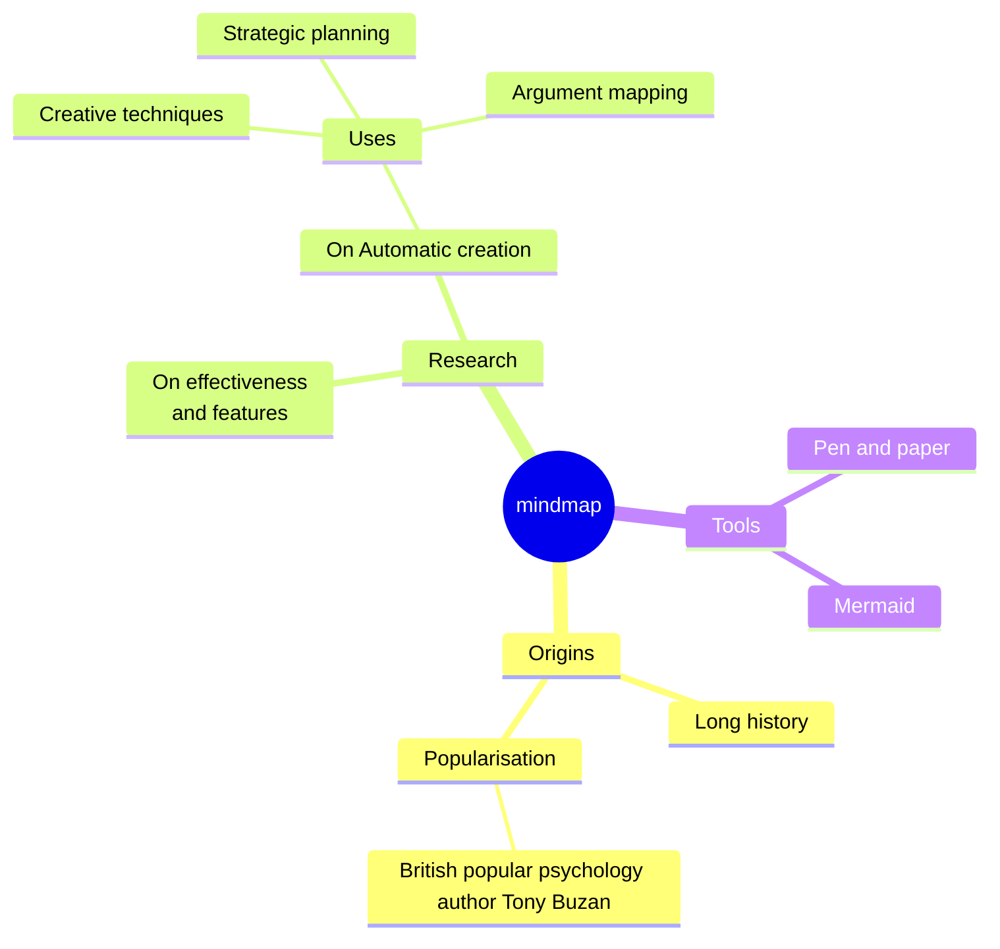

# [[{"id": "26921913-c3d2-43d5-8455-bc10419c5f83", "doc_id": null, "project_id": "ac9804d5-fcb2-4026-81c0-61f2308f6380", "parent_id": null, "status": "", "tags": [], "file_list": [], "profiles": ["software_developer"], "name": "New Analysis Task", "created_at": "2025-03-10 16:47:31.082781", "updated_at": "2025-03-11T10:03:51.000433", "mode": "chat", "kanban_id": "", "column_id": "", "board": "codx-junior-1.0", "column": "Ideas", "chat_index": 0, "live_url": "", "branch": "", "file_path": "/shared/codx-junior/.codx/tasks/codx-junior-1.0/Ideas/New Analysis Task.26921913-c3d2-43d5-8455-bc10419c5f83.md", "model": ""}]]
## [[{"doc_id": "6df6275b-ed9b-4d87-94e5-55eef4dc63fb", "role": "user", "task_item": "", "hide": false, "improvement": false, "created_at": "2025-03-10 16:47:31.080018", "updated_at": "2025-03-10 16:47:31.080066", "images": [], "files": [], "meta_data": {}, "profiles": []}]]
Create a mermaid diagram to show this project structure and dependencies:
* An APP has 4 children: db, model, services, and controllers
* model depend on db
* services depend on model
* controllers depend on services
## [[{"doc_id": "f68f637c-94de-4322-8be6-b7c1a7359b51", "role": "system", "task_item": "", "hide": true, "improvement": false, "created_at": "2025-03-10 16:47:31.080018", "updated_at": "2025-03-10 16:47:31.080066", "images": [], "files": [], "meta_data": {}, "profiles": []}]]
Knowledge search query: 
Create a mermaid diagram to show this project structure and dependencies:
* An APP has 4 children: db, model, services, and controllers
* model depend on db
* services depend on model
* controllers depend on services -> mermaid diagram project structure dependencies APP children db model services controllers model depend db services depend model controllers depend services
## [[{"doc_id": "699af20c-9f14-4bab-b637-1fcb5a9fae32", "role": "assistant", "task_item": "", "hide": true, "improvement": false, "created_at": "2025-03-10 16:47:31.080018", "updated_at": "2025-03-10 16:47:31.080066", "images": [], "files": [], "meta_data": {"time_taken": 102.58807444572449, "first_chunk_time_taken": 93.00057625770569, "model": "gpt-4o"}, "profiles": ["software_developer"]}]]
Certainly! Here's a mermaid diagram reflecting the project structure and dependencies you've described:



### Best Practices and Guidelines

1. **Version Control with Git:**
   - Create a well-structured Git repository.
   - Use meaningful commit messages.
   - Regularly push changes to the remote repository.
   - Use branches for new features or bug fixes to keep the main branch stable.

2. **Clean, Readable, and Maintainable Code:**
   - Follow consistent naming conventions and coding standards.
   - Comment your code where necessary to provide context.
   - Use meaningful variable and function names to reflect their purpose.
   - Refactor code regularly to improve readability and performance.

3. **Unit Testing:**
   - Write unit tests for each component (db, model, services, controllers).
   - Use a testing framework such as Jest, Mocha, or pytest based on your language.
   - Ensure that tests cover both typical cases (happy paths) and edge cases.
   - Run tests automatically using a continuous integration (CI) pipeline.

4. **Documentation:**
   - Keep your README file up-to-date with setup instructions, contribution guidelines, and project structure.
   - Use tools like JSDoc, Sphinx or Docusaurus for automatic documentation generation.
   - Document new features and changes in a changelog or release notes.

5. **Agile Methodologies:**
   - Use task management tools like Jira, Trello, or Asana to track tasks.
   - Break projects into manageable tasks with clear goals and deadlines.
   - Conduct regular stand-ups and retrospective meetings to reflect on the progress and process.

6. **Automatic Documentation Updates:**
   - Integrate your documentation tools with a CI/CD pipeline to ensure the documentation is always up-to-date.
   - Consider using a tool like GitHub Actions for automated documentation deployment.

Incorporating these practices will help maintain a healthy project lifecycle and ensure that the project remains scalable, robust, and easy to maintain.
## [[{"doc_id": "aca373ec-6825-4ab1-b101-79b826eb6500", "role": "user", "task_item": "", "hide": true, "improvement": false, "created_at": "2025-03-10 16:47:31.080018", "updated_at": "2025-03-10 16:47:31.080066", "images": [], "files": [], "meta_data": {}, "profiles": []}]]
Make children connections solid, and dependencies connections dashed
## [[{"doc_id": "e7862dc8-8e7b-4618-98fd-4628ccdf4ed4", "role": "system", "task_item": "", "hide": true, "improvement": false, "created_at": "2025-03-10 16:47:31.080018", "updated_at": "2025-03-10 16:47:31.080066", "images": [], "files": [], "meta_data": {}, "profiles": []}]]
Knowledge search query: Create a mermaid diagram to show this project structure and dependencies:
* An APP has 4 children: db, model, services, and controllers
* model depend on db
* services depend on model
* controllers depend on services
Certainly! Here's a mermaid diagram reflecting the project structure and dependencies you've described:


### Best Practices and Guidelines

1. **Version Control with Git:**
   - Create a well-structured Git repository.
   - Use meaningful commit messages.
   - Regularly push changes to the remote repository.
   - Use branches for new features or bug fixes to keep the main branch stable.

2. **Clean, Readable, and Maintainable Code:**
   - Follow consistent naming conventions and coding standards.
   - Comment your code where necessary to provide context.
   - Use meaningful variable and function names to reflect their purpose.
   - Refactor code regularly to improve readability and performance.

3. **Unit Testing:**
   - Write unit tests for each component (db, model, services, controllers).
   - Use a testing framework such as Jest, Mocha, or pytest based on your language.
   - Ensure that tests cover both typical cases (happy paths) and edge cases.
   - Run tests automatically using a continuous integration (CI) pipeline.

4. **Documentation:**
   - Keep your README file up-to-date with setup instructions, contribution guidelines, and project structure.
   - Use tools like JSDoc, Sphinx or Docusaurus for automatic documentation generation.
   - Document new features and changes in a changelog or release notes.

5. **Agile Methodologies:**
   - Use task management tools like Jira, Trello, or Asana to track tasks.
   - Break projects into manageable tasks with clear goals and deadlines.
   - Conduct regular stand-ups and retrospective meetings to reflect on the progress and process.

6. **Automatic Documentation Updates:**
   - Integrate your documentation tools with a CI/CD pipeline to ensure the documentation is always up-to-date.
   - Consider using a tool like GitHub Actions for automated documentation deployment.

Incorporating these practices will help maintain a healthy project lifecycle and ensure that the project remains scalable, robust, and easy to maintain.
Make children connections solid, and dependencies connections dashed -> mermaid diagram project structure dependencies APP children db model services controllers model depend db services depend model controllers depend services solid connections dashed connections version control Git repository commit messages push changes remote repository branches features bug fixes clean readable maintainable code naming conventions coding standards comment code variable function names refactor code readability performance unit testing component db model services controllers testing framework Jest Mocha pytest tests typical cases edge cases continuous integration CI pipeline documentation README setup instructions contribution guidelines JSDoc Sphinx Docusaurus automatic documentation changelog release notes agile methodologies task management Jira Trello Asana tasks goals deadlines stand-ups retrospective meetings automatic documentation updates CI/CD pipeline GitHub Actions deployment
## [[{"doc_id": "a47e9942-0c3e-4262-becb-a23b51db5a78", "role": "assistant", "task_item": "", "hide": false, "improvement": false, "created_at": "2025-03-10 16:47:31.080018", "updated_at": "2025-03-10 16:47:31.080066", "images": [], "files": [], "meta_data": {"time_taken": 130.83058547973633, "first_chunk_time_taken": 112.1615035533905, "model": "gpt-4o"}, "profiles": ["software_developer"]}]]
Here's the updated mermaid diagram with solid lines for direct connections from the APP to its children and dashed lines for dependencies:



### Best Practices for Project Management and Maintenance

1. **Version Control with Git:**
   - **Branch Strategy:** Use branches like `main` or `master` for stable code, and feature branches for new features. Follow a naming convention like `feature/branch-name` or `bugfix/issue-description`.
   - **Commit Practices:** Write clear and descriptive commit messages. Use a consistent format, e.g., `feat`, `fix`, `docs`, `style`, `refactor`, `test`, and `chore`.

2. **Clean Code:**
   - **Consistency:** Follow a consistent coding style and use linting tools like ESLint, Pylint, or Prettier.
   - **Readability:** Break down complex functions into smaller, easier-to-read functions. Ensure logical naming of variables and methods.

3. **Unit Testing:**
   - **Coverage:** Aim for high test coverage to catch edge cases and ensure the components interact correctly.
   - **Frameworks:** Use well-supported testing frameworks like Jest for JavaScript, PyTest for Python, or JUnit for Java.
   - **Automation:** Integrate tests into a CI/CD pipeline to automatically run tests on push or pull requests.

4. **Documentation:**
   - **README.md:** Keep an updated README file with setup, usage instructions, and features.
   - **Inline Comments:** Use comments to clarify complex logic but avoid over-commenting.
   - **Formal Documentation:** Generate API documentation with tools like Swagger or Postman for API-oriented services.

5. **Agile Methodologies:**
   - **Task Tracking:** Use tools like Jira or Trello to manage backlog, sprints, and task assignments.
   - **Meetings:** Conduct regular standups to sync with the team and retrospectives to review the process and output.

6. **Continuous Integration and Deployment (CI/CD):**
   - **Automation:** Use CI/CD platforms like GitHub Actions, Travis CI, or Jenkins to automate builds, tests, and deployments.
   - **Documentation:** Automate documentation deployment using scripts or plugins to ensure the latest documentation is always accessible.

### Key Takeaways:

- **Organize your codebase:** Maintain a well-structured directory and organize code logically by functionality or module.
- **Be proactive with code reviews:** Regular code reviews improve code quality and knowledge share among the team.
- **Adapt and evolve:** Regularly review processes and tools to ensure they still meet the team’s needs and industry standards. 

Implementing these practices will enhance collaboration, maintainability, and code quality in your project.
## [[{"doc_id": "2b3430d9-b5d3-4742-a9ef-9cba0452d31f", "role": "user", "task_item": "", "hide": false, "improvement": false, "created_at": "2025-03-11 09:39:25.760896", "updated_at": "2025-03-11 09:39:25.760952", "images": [], "files": [], "meta_data": {}, "profiles": []}]]
Create a python script that given a CodxJuniorSettings project enerates the syntax for the diagram follow its project_dependencies and children projects
## [[{"doc_id": "9ad4f40b-a1e7-43f4-b66b-ab306c7d4ec5", "role": "system", "task_item": "", "hide": true, "improvement": false, "created_at": "2025-03-11 09:39:25.760896", "updated_at": "2025-03-11 09:39:25.760952", "images": [], "files": [], "meta_data": {}, "profiles": []}]]
Knowledge search query: Create a mermaid diagram to show this project structure and dependencies:
* An APP has 4 children: db, model, services, and controllers
* model depend on db
* services depend on model
* controllers depend on services
Here's the updated mermaid diagram with solid lines for direct connections from the APP to its children and dashed lines for dependencies:


### Best Practices for Project Management and Maintenance

1. **Version Control with Git:**
   - **Branch Strategy:** Use branches like `main` or `master` for stable code, and feature branches for new features. Follow a naming convention like `feature/branch-name` or `bugfix/issue-description`.
   - **Commit Practices:** Write clear and descriptive commit messages. Use a consistent format, e.g., `feat`, `fix`, `docs`, `style`, `refactor`, `test`, and `chore`.

2. **Clean Code:**
   - **Consistency:** Follow a consistent coding style and use linting tools like ESLint, Pylint, or Prettier.
   - **Readability:** Break down complex functions into smaller, easier-to-read functions. Ensure logical naming of variables and methods.

3. **Unit Testing:**
   - **Coverage:** Aim for high test coverage to catch edge cases and ensure the components interact correctly.
   - **Frameworks:** Use well-supported testing frameworks like Jest for JavaScript, PyTest for Python, or JUnit for Java.
   - **Automation:** Integrate tests into a CI/CD pipeline to automatically run tests on push or pull requests.

4. **Documentation:**
   - **README.md:** Keep an updated README file with setup, usage instructions, and features.
   - **Inline Comments:** Use comments to clarify complex logic but avoid over-commenting.
   - **Formal Documentation:** Generate API documentation with tools like Swagger or Postman for API-oriented services.

5. **Agile Methodologies:**
   - **Task Tracking:** Use tools like Jira or Trello to manage backlog, sprints, and task assignments.
   - **Meetings:** Conduct regular standups to sync with the team and retrospectives to review the process and output.

6. **Continuous Integration and Deployment (CI/CD):**
   - **Automation:** Use CI/CD platforms like GitHub Actions, Travis CI, or Jenkins to automate builds, tests, and deployments.
   - **Documentation:** Automate documentation deployment using scripts or plugins to ensure the latest documentation is always accessible.

### Key Takeaways:

- **Organize your codebase:** Maintain a well-structured directory and organize code logically by functionality or module.
- **Be proactive with code reviews:** Regular code reviews improve code quality and knowledge share among the team.
- **Adapt and evolve:** Regularly review processes and tools to ensure they still meet the team’s needs and industry standards. 

Implementing these practices will enhance collaboration, maintainability, and code quality in your project.
Create a python script that given a CodxJuniorSettings project enerates the syntax for the diagram follow its project_dependencies and children projects -> APP, db, model, services, controllers, dependencies, mermaid diagram, project structure, Version Control, Git, branch strategy, commit practices, Clean Code, consistency, readability, Unit Testing, coverage, frameworks, Jest, PyTest, JUnit, Automation, CI/CD pipeline, Documentation, README.md, comments, Swagger, Postman, Agile Methodologies, Task Tracking, Jira, Trello, meetings, Continuous Integration, Deployment, GitHub Actions, Travis CI, Jenkins, Codebase, code reviews, adaptability, CodxJuniorSettings, project_dependencies, children projects
## [[{"doc_id": "dd8ee83e-8642-4846-811d-8eacfb5e96b0", "role": "assistant", "task_item": "", "hide": false, "improvement": false, "created_at": "2025-03-11 09:39:25.760896", "updated_at": "2025-03-11 09:39:25.760952", "images": [], "files": [], "meta_data": {"time_taken": 28.493889093399048, "first_chunk_time_taken": 17.706347942352295, "model": "gpt-4o"}, "profiles": ["software_developer"]}]]
To help you generate a mermaid diagram syntax based on the `CodxJuniorSettings` project structure, we can create a Python script that takes `project_dependencies` and `children_projects` as input and outputs the desired syntax. Here's how we can do it:

1. **Python Script to Generate Mermaid Diagram:**

```python
class Project:
    def __init__(self, name):
        self.name = name
        self.children = []
        self.dependencies = []

    def add_child(self, child):
        self.children.append(child)

    def add_dependency(self, dependency):
        self.dependencies.append(dependency)

    def mermaid_syntax(self):
        mermaid_lines = []
        for child in self.children:
            mermaid_lines.append(f"    {self.name} --> |{child}| {child}")
        for dependency in self.dependencies:
            mermaid_lines.append(f"    {self.name} -.-> |depends on| {dependency}")
        return "\n".join(mermaid_lines)


def generate_mermaid_diagram(project):
    header = "```mermaid\ngraph TD;\n"
    footer = "\n```"
    content = project.mermaid_syntax()
    return header + content + footer


def main():
    # Create the CodxJuniorSettings project and its structure
    app = Project("APP")

    # Defining children and dependencies
    app.add_child("db")
    app.add_child("model")
    app.add_child("services")
    app.add_child("controllers")

    model = Project("model")
    services = Project("services")
    controllers = Project("controllers")

    # Define dependencies
    model.add_dependency("db")
    services.add_dependency("model")
    controllers.add_dependency("services")

    # Generate mermaid diagram syntax
    mermaid_output = generate_mermaid_diagram(app)
    print(mermaid_output)


if __name__ == "__main__":
    main()
```

2. **Best Practices and Next Steps:**

- **Version Control:** 
  - Initialize a Git repository and commit your code frequently with meaningful commit messages.

- **Unit Tests:**
  - Create unit tests for the `Project` class to ensure its methods correctly manage children and dependencies.
  - Utilize a testing framework like `unittest` or `pytest`.

- **Documentation:**
  - Write a `README.md` file to explain the purpose of the script, how to set it up, and how to run it.
  - Use docstrings in your Python methods and classes to improve readability and maintainability.

- **Agile Methodologies:**
  - Use tools like Trello or Jira to manage tasks, sprints, and progress tracking.

- **Continuous Integration:**
  - Set up a CI pipeline (e.g., GitHub Actions) to automatically run tests and check code quality on new commits or pull requests.

3. **Enhancements:**

- Extend the script to dynamically parse project structure from configuration files (e.g., JSON or YAML) for flexibility.
- Add error handling and input validation to make the script robust against incorrect usage or malformed data.
- Consider generating interactive visualizations or GUI applications for better user interaction and usability.

By following these steps and best practices, you'll ensure the project is both functional and maintainable, facilitating collaboration and future iterations.
## [[{"doc_id": "6751fb51-7b30-48f2-b149-a9d29bf6c4ef", "role": "user", "task_item": "", "hide": false, "improvement": false, "created_at": "2025-03-11 09:39:25.760896", "updated_at": "2025-03-11 09:39:25.760952", "images": [], "files": [], "meta_data": {}, "profiles": []}]]
We must traverse children and generate a mindmap syntax
Example:

## [[{"doc_id": "08ad67a1-e155-4e7b-841e-01744c1491e7", "role": "system", "task_item": "", "hide": true, "improvement": false, "created_at": "2025-03-11 09:39:25.760896", "updated_at": "2025-03-11 09:39:25.760952", "images": [], "files": [], "meta_data": {}, "profiles": []}]]
Knowledge search query: Create a mermaid diagram to show this project structure and dependencies:
* An APP has 4 children: db, model, services, and controllers
* model depend on db
* services depend on model
* controllers depend on services
Here's the updated mermaid diagram with solid lines for direct connections from the APP to its children and dashed lines for dependencies:


### Best Practices for Project Management and Maintenance

1. **Version Control with Git:**
   - **Branch Strategy:** Use branches like `main` or `master` for stable code, and feature branches for new features. Follow a naming convention like `feature/branch-name` or `bugfix/issue-description`.
   - **Commit Practices:** Write clear and descriptive commit messages. Use a consistent format, e.g., `feat`, `fix`, `docs`, `style`, `refactor`, `test`, and `chore`.

2. **Clean Code:**
   - **Consistency:** Follow a consistent coding style and use linting tools like ESLint, Pylint, or Prettier.
   - **Readability:** Break down complex functions into smaller, easier-to-read functions. Ensure logical naming of variables and methods.

3. **Unit Testing:**
   - **Coverage:** Aim for high test coverage to catch edge cases and ensure the components interact correctly.
   - **Frameworks:** Use well-supported testing frameworks like Jest for JavaScript, PyTest for Python, or JUnit for Java.
   - **Automation:** Integrate tests into a CI/CD pipeline to automatically run tests on push or pull requests.

4. **Documentation:**
   - **README.md:** Keep an updated README file with setup, usage instructions, and features.
   - **Inline Comments:** Use comments to clarify complex logic but avoid over-commenting.
   - **Formal Documentation:** Generate API documentation with tools like Swagger or Postman for API-oriented services.

5. **Agile Methodologies:**
   - **Task Tracking:** Use tools like Jira or Trello to manage backlog, sprints, and task assignments.
   - **Meetings:** Conduct regular standups to sync with the team and retrospectives to review the process and output.

6. **Continuous Integration and Deployment (CI/CD):**
   - **Automation:** Use CI/CD platforms like GitHub Actions, Travis CI, or Jenkins to automate builds, tests, and deployments.
   - **Documentation:** Automate documentation deployment using scripts or plugins to ensure the latest documentation is always accessible.

### Key Takeaways:

- **Organize your codebase:** Maintain a well-structured directory and organize code logically by functionality or module.
- **Be proactive with code reviews:** Regular code reviews improve code quality and knowledge share among the team.
- **Adapt and evolve:** Regularly review processes and tools to ensure they still meet the team’s needs and industry standards. 

Implementing these practices will enhance collaboration, maintainability, and code quality in your project.
Create a python script that given a CodxJuniorSettings project enerates the syntax for the diagram follow its project_dependencies and children projects
To help you generate a mermaid diagram syntax based on the `CodxJuniorSettings` project structure, we can create a Python script that takes `project_dependencies` and `children_projects` as input and outputs the desired syntax. Here's how we can do it:

1. **Python Script to Generate Mermaid Diagram:**

```python
class Project:
    def __init__(self, name):
        self.name = name
        self.children = []
        self.dependencies = []

    def add_child(self, child):
        self.children.append(child)

    def add_dependency(self, dependency):
        self.dependencies.append(dependency)

    def mermaid_syntax(self):
        mermaid_lines = []
        for child in self.children:
            mermaid_lines.append(f"    {self.name} --> |{child}| {child}")
        for dependency in self.dependencies:
            mermaid_lines.append(f"    {self.name} -.-> |depends on| {dependency}")
        return "\n".join(mermaid_lines)


def generate_mermaid_diagram(project):
    header = "```mermaid\ngraph TD;\n"
    footer = "\n```"
    content = project.mermaid_syntax()
    return header + content + footer


def main():
    # Create the CodxJuniorSettings project and its structure
    app = Project("APP")

    # Defining children and dependencies
    app.add_child("db")
    app.add_child("model")
    app.add_child("services")
    app.add_child("controllers")

    model = Project("model")
    services = Project("services")
    controllers = Project("controllers")

    # Define dependencies
    model.add_dependency("db")
    services.add_dependency("model")
    controllers.add_dependency("services")

    # Generate mermaid diagram syntax
    mermaid_output = generate_mermaid_diagram(app)
    print(mermaid_output)


if __name__ == "__main__":
    main()
```

2. **Best Practices and Next Steps:**

- **Version Control:** 
  - Initialize a Git repository and commit your code frequently with meaningful commit messages.

- **Unit Tests:**
  - Create unit tests for the `Project` class to ensure its methods correctly manage children and dependencies.
  - Utilize a testing framework like `unittest` or `pytest`.

- **Documentation:**
  - Write a `README.md` file to explain the purpose of the script, how to set it up, and how to run it.
  - Use docstrings in your Python methods and classes to improve readability and maintainability.

- **Agile Methodologies:**
  - Use tools like Trello or Jira to manage tasks, sprints, and progress tracking.

- **Continuous Integration:**
  - Set up a CI pipeline (e.g., GitHub Actions) to automatically run tests and check code quality on new commits or pull requests.

3. **Enhancements:**

- Extend the script to dynamically parse project structure from configuration files (e.g., JSON or YAML) for flexibility.
- Add error handling and input validation to make the script robust against incorrect usage or malformed data.
- Consider generating interactive visualizations or GUI applications for better user interaction and usability.

By following these steps and best practices, you'll ensure the project is both functional and maintainable, facilitating collaboration and future iterations.
We must traverse children and generate a mindmap syntax
Example:
```mermaid
mindmap
  root((mindmap))
    Origins
      Long history
      ::icon(fa fa-book)
      Popularisation
        British popular psychology author Tony Buzan
    Research
      On effectiveness<br/>and features
      On Automatic creation
        Uses
            Creative techniques
            Strategic planning
            Argument mapping
    Tools
      Pen and paper
      Mermaid
``` -> mermaid diagram, project structure, dependencies, APP, db, model, services, controllers, ConversionService, Python script, CodxJuniorSettings, project_dependencies, children_projects, mindmap syntax, git version control, branch strategy, commit practices, clean code, unit testing, documentation, Agile methodologies, CI/CD pipeline, error handling, input validation, interactive visualizations, GUI applications, testing frameworks, README.md, docstrings, Trello, Jira, GitHub Actions, JSON, YAML
## [[{"doc_id": "92f2418f-39c7-4558-9366-fcacf13e4a15", "role": "assistant", "task_item": "", "hide": false, "improvement": false, "created_at": "2025-03-11 09:39:25.760896", "updated_at": "2025-03-11 09:39:25.760952", "images": [], "files": [], "meta_data": {"time_taken": 37.40864658355713, "first_chunk_time_taken": 22.609472513198853, "model": "gpt-4o"}, "profiles": ["software_developer"]}]]
Creating a script that generates a mindmap syntax for the project based on its children and dependencies can be a valuable tool. Before diving into the code, let's establish a plan and best practices for creating a maintainable script:

### Plan and Best Practices

1. **Understand Requirements:**
   - Generate a mindmap syntax for a given project structure.
   - Traverse the project's children to create a hierarchical representation.

2. **Project Structure:**
   - Use Python classes to model projects and their relationships.

3. **Version Control:**
   - Use Git for version control. Create a `.gitignore` file to exclude unnecessary files.
   - Commit code regularly with clear and descriptive messages.

4. **Testing:**
   - Use a testing framework like `unittest` for unit testing.

5. **Documentation:**
   - Document code with docstrings and maintain a `README.md` file.

6. **Continuous Integration:**
   - Set up a CI/CD platform to automate testing and code quality checks.

### Implementation

Here is a Python script that generates a mindmap syntax using the structure you provided as a reference:

```python
class ProjectNode:
    def __init__(self, name, is_root=False):
        self.name = name
        self.children = []
        self.is_root = is_root

    def add_child(self, child):
        self.children.append(child)

    def mindmap_syntax(self, indent=2, level=0):
        indentation = ' ' * (level * indent)
        current_line = f"{indentation}{self.name}\n"
        child_lines = "".join(
            child.mindmap_syntax(indent, level + 1) for child in self.children
        )
        return current_line + child_lines


def generate_mindmap_syntax(root_node):
    header = "```mermaid\nmindmap\n  "
    footer = "\n```"
    content = root_node.mindmap_syntax()
    return header + content + footer


def main():
    # Create project nodes
    app = ProjectNode("APP", is_root=True)
    db = ProjectNode("db")
    model = ProjectNode("model")
    services = ProjectNode("services")
    controllers = ProjectNode("controllers")

    # Build the project hierarchy
    app.add_child(db)
    app.add_child(model)
    app.add_child(services)
    app.add_child(controllers)

    # Generate and print mindmap syntax
    mindmap_output = generate_mindmap_syntax(app)
    print(mindmap_output)


if __name__ == "__main__":
    main()
```

### Best Practices Followed

- **Code Structure:** Used classes and methods to organize code. The `ProjectNode` class models the project structure.
- **Docstrings and Comments:** Although not shown in this snippet, you should add docstrings to methods and classes for clarity.
- **Testing Setup:** Create unit tests under a `tests` directory using a framework like `unittest` or `pytest`.
- **Version Control:**
  - Initialize a Git repository: `git init`.
  - Add meaningful commit messages and version tags.
- **Agile Methodologies:**
  - Use task management tools like Jira or Trello to track progress.
  - Regularly update documentation and keep `README.md` current.

### Next Steps

1. **Expand Testing:**
   - Add test cases for the `mindmap_syntax` function to ensure correct output.

2. **Enhance User Experience:**
   - Allow dynamic input of project structures from configuration files, such as JSON or YAML.

3. **CI/CD Integration:**
   - Set up GitHub Actions or another CI tool to automate testing and linting on pushes or pull requests.

4. **Documentation Updates:**
   - Use `Sphinx` or similar tools to auto-generate documentation from docstrings.

By following these best practices, you'll create a robust and maintainable project tool.