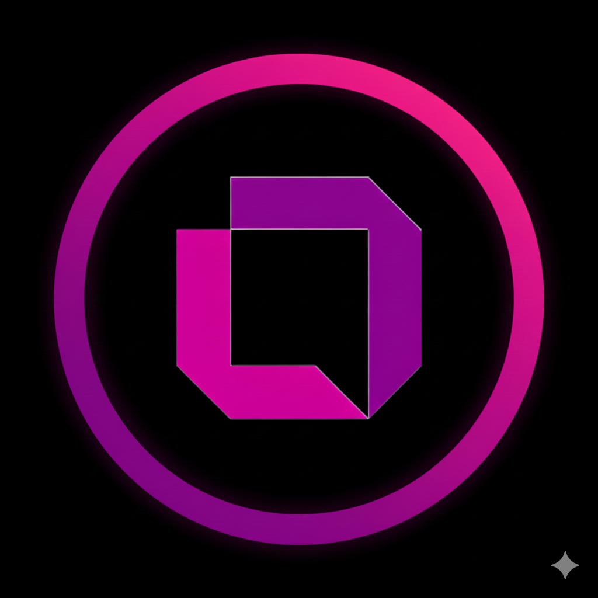
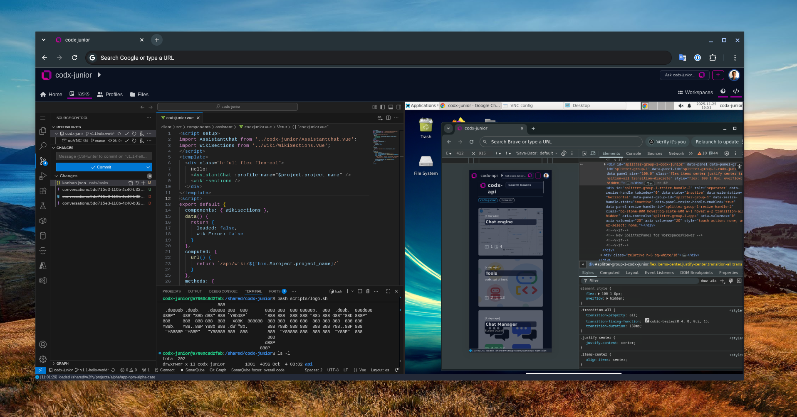
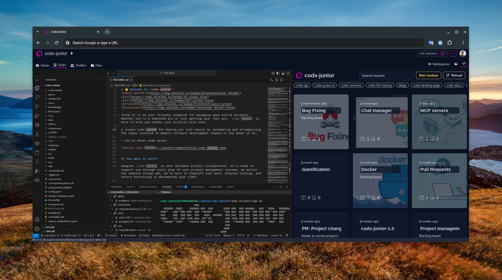
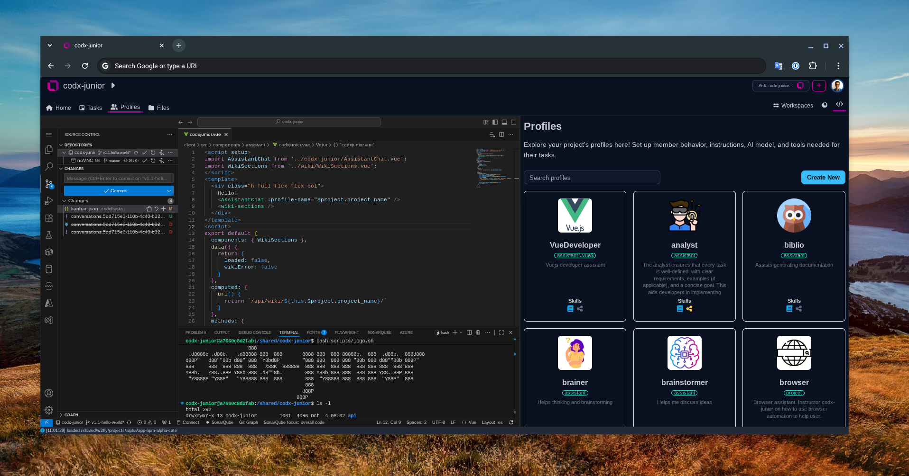
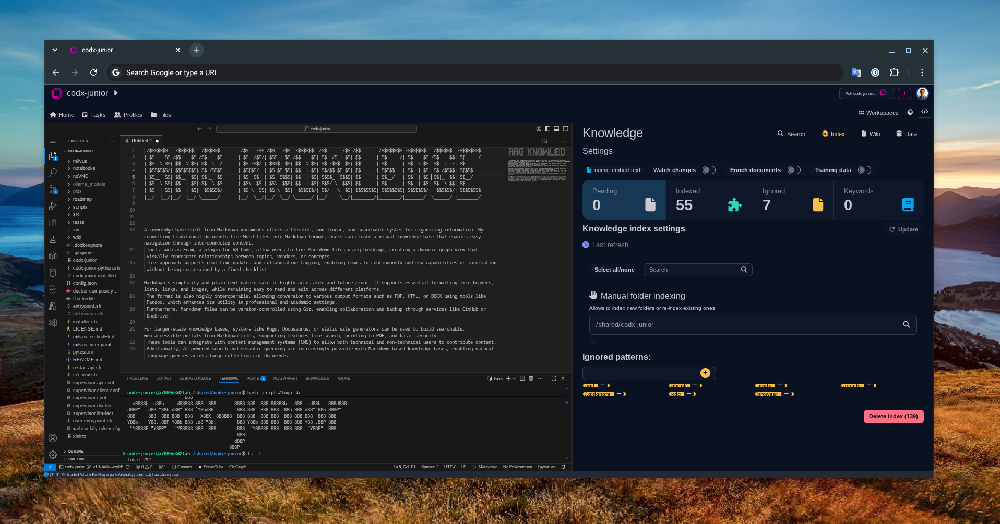

<div style="border-radius:10px;margin-bottom:12px;background-image:url('./assets/images/NOV2025/codx-junior-ai-backgroound.png');background-position:30px">

</div>


# This is codx-junior...
Your trusty sidekick in the vast world of open-source projects. Maintaining these projects is a labor of love, filled with endless tasks and challenges. But that's where I come in—ready to lend a hand and lighten the load!

## Let me introduce myself

Think of me as your go-to collaborator for project management. I'm designed to guide you through every step of your journey. No task is too complex—I'm here to simplify your workflow, enhance testing, and ensure everything is perfectly documented.

### Key Features

- **AI-Powered Assistance**: I automate and streamline tasks with the power of AI, making modern software development a breeze.
- **Project Management**: I keep tasks in sync with your codebase, ensuring consistency and organization.
- **Code Generation and Review**: I automate repetitive tasks and promote a structured code review process.
- **Deployment and Operations**: With Docker support, I simplify deployment and automate related tasks.
- **Collaboration and Communication**: Use mentions to collaborate effectively, and let me manage user profiles to tailor code to your preferences.
- **Knowledge Sharing**: I leverage advanced RAG indexing for improved responses and knowledge dissemination.
- **Development Tools**: I offer a suite of tools to aid in writing, testing, and debugging code.
- **Settings Customization**: Tailor me to fit your project needs.

### How I Learn

I learn from the projects I work on, adapting to the unique styles and preferences of each repo owner. By analyzing profiles, I produce code that aligns with your vision and standards. Plus, I can learn and utilize multiple LLM models to enhance my capabilities and provide the best support possible.

## How to Run Me

Running me, codx-junior, with Docker is straightforward:

```bash
# Run docker-compose with public image
docker-compose -f ./docker-compose-public.yaml up -d
```

> Check out `docker-compose-public.yaml` for custom settings.

### Accessing Me
Once running, access me by navigating to `http://localhost:19981` (or any other port specified in your `.env` file).

## Join the codx-junior <span style="color:#810582">Revolution</span>!

Are you ready to elevate your open-source project management? Streamline tasks, enhance collaboration, and automate your workflow with ease. Whether you're a newbie or a seasoned pro, I'm here to simplify your software journey. Dive into a seamless development experience today and discover how efficient coding can be. Try me now and join our growing community!

## Find Me on ProductHunt

Discover codx-junior, your AI-powered project management sidekick for open-source development. Streamline your workflow, enhance collaboration, and automate tasks with ease. Ideal for developers seeking efficient code management and seamless deployment. Join our community and experience a new era of software development.

```
Note from the author

I've developed codx-junior in the hope that someday it will totally free us from the tedious so we can focus on creativity.


> You'll never code alone!
```

### Wait... heare you jave some nince pics






