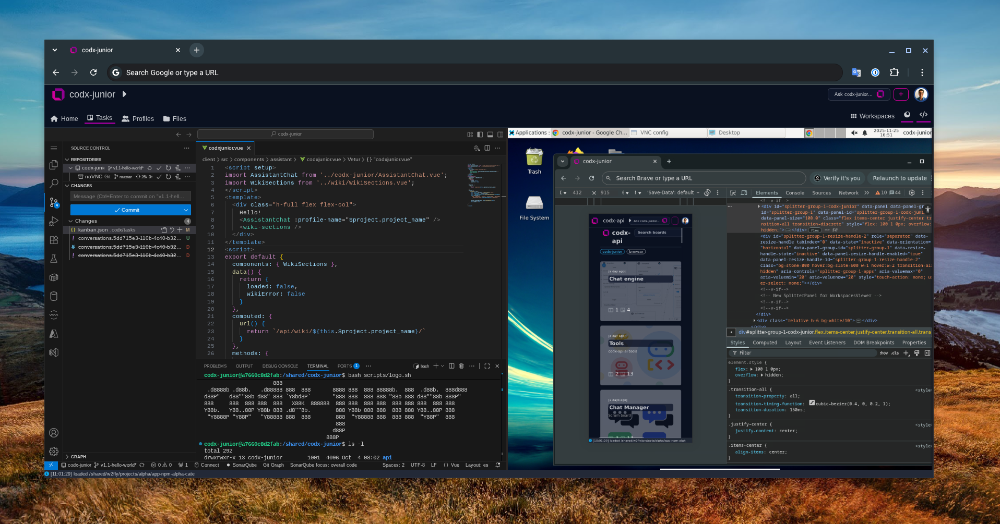
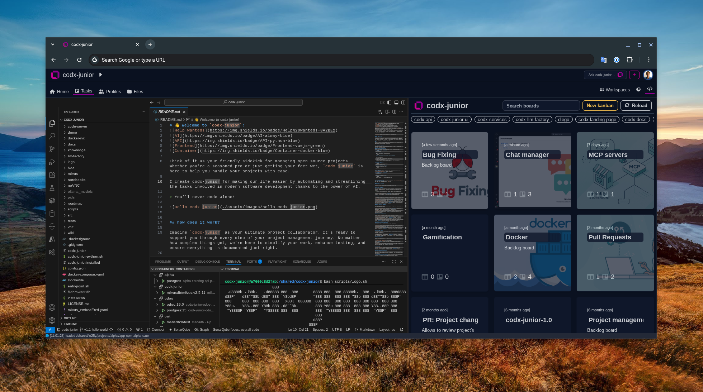
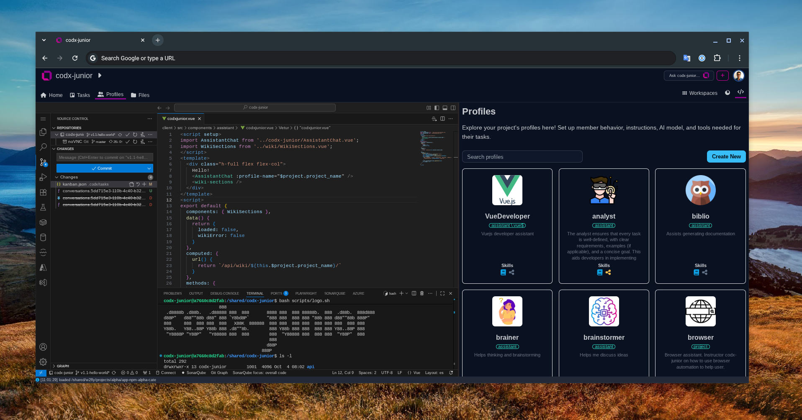
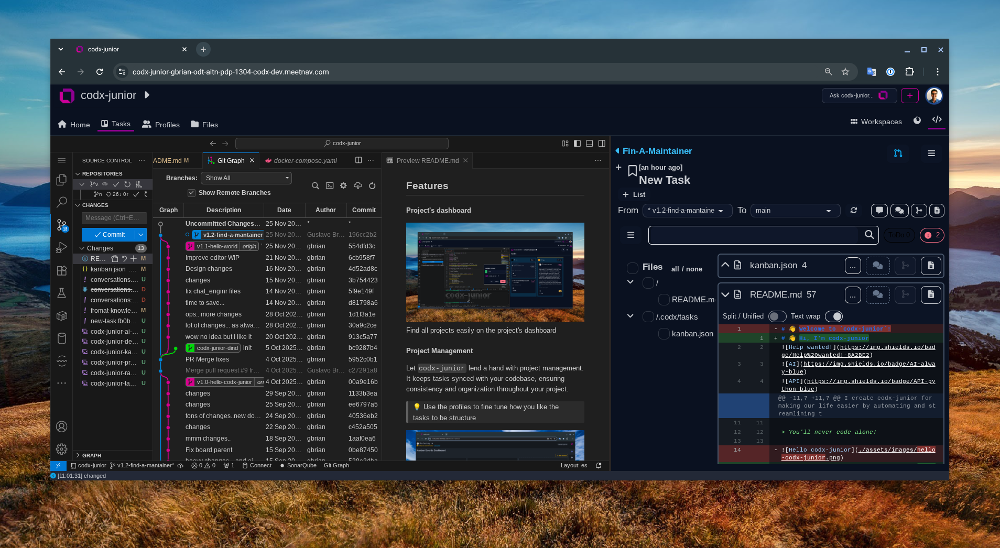
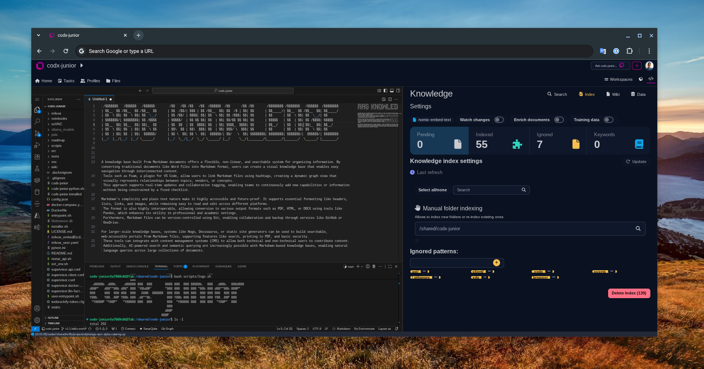
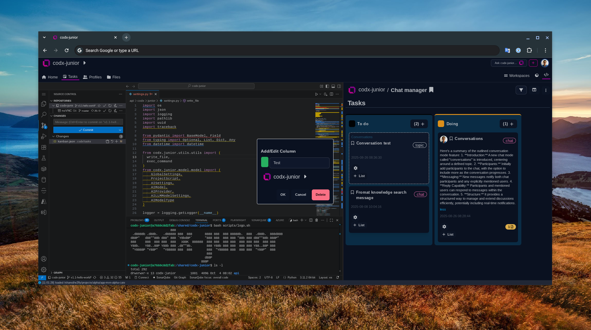

> **● SYSTEM STATUS: ACTIVE BETA // OPEN SOURCE**

# codx-junior

**codx-junior is the open-source workspace transforming how software projects are built.**

We bridge the gap between rapid AI automation and elite human expertise.
Pure AI agents go wild when left unsupervised; we ensure they stay on track.
Our hybrid model pairs cutting-edge AI models with veteran human developers.
A single developer can now lead and ship complex IT projects **4x faster**.

The entire platform runs in the cloud: your team only needs a browser to work.
Manage everything in one tab: **Kanban, dev containers, agents, and team chat.**
Control your budget perfectly with transparent human hours and scalable AI tokens.
Self-host the engine for free, or hire our managed team to execute your roadmap.

We are raising our seed round and onboarding early partners at **[join@codx-junior.ai](mailto:join@codx-junior.ai)**.

📚 **Documentation:** see the [`docs/`](docs/) folder (VitePress site, run it with `npm run docs:dev`).



## What's inside

| Area | What you get |
| --- | --- |
| **Chats & agents** | Project-aware chats with several modes (chat, task, agent, vibe, topic, PR review, browser, slides, tutorial). Agents use tools to search the code, read and write files, apply patches, browse the web, generate images and drive Docker. |
| **Kanban** | Boards and columns where every card is a chat. Tasks can have sub-tasks, checklists, tags, linked files and assigned users and profiles. |
| **Vibe coding** | A split view with the conversation, the live file changes and a preview of the running app side by side. |
| **Workspaces (dev containers)** | Docker Compose based workspaces created from templates (`dev-stack`, `static-site` or custom). They mount your projects and publish apps such as Coder (VS Code in the browser), a virtual desktop (noVNC / Kasm) or your own services, routed through Traefik. |
| **Teams & messenger** | Teams with categories, channels and direct messages, all backed by chats, so humans and AI share the same conversation. |
| **Knowledge (RAG)** | Projects are indexed into Milvus with configurable embeddings, ignore patterns and search settings. AI search, knowledge graph and keyword extraction help agents find the right context. |
| **Profiles** | Reusable instructions (analyst, developer, teacher, wiki, …) that set the model, tools and coding standards. Profiles can be exposed as models through an OpenAI-compatible API (`/api/v1/models`, `/api/v1/completions`). |
| **@codx mentions** | Write `@codx` in any project file and codx-junior edits, explains or improves it in place. |
| **Git & code review** | Branches, commits, diffs and pull-request views with AI comments and change explanations. GitHub issues can be pulled in and turned into tasks. |
| **Wiki** | AI-maintained project documentation, updated as the code changes. |
| **Budget & analytics** | Every AI call is metered in tokens and **cxjcoins**. Per-user wallets, daily/weekly/monthly spending limits, token rules with extension requests, and a dashboard by day, model and user. |
| **Users & security** | Admin and user roles, per-project permissions, per-app access, GitHub OAuth login and a forward-auth gate for every routed app. |
| **AI providers** | Any OpenAI-compatible provider (OpenAI, Ollama, LocalAI, LiteLLM, vLLM, …) with per-purpose models: chat, RAG, embeddings, wiki, vision and image generation. MCP servers can be attached per project. |
| **Plugins** | Python plugins (Azure DevOps pull requests, image editor, …) that extend the UI and the API. |

## Architecture at a glance

```
browser ──► Traefik ──┬──► codx-junior-client  (Vue 3 + Vite, port 19981)
                      ├──► codx-junior-api     (FastAPI + Socket.IO, port 19980)
                      ├──► workspaces          (Docker Compose dev containers)
                      └──► LocalAI / LiteLLM   (model serving, optional)

codx-junior-api ──► codx-junior-api-background (watchers, indexing, long jobs)
                ──► Milvus                     (vector store for knowledge)
```

* `client/`: Vue 3 single page app (Tailwind + daisyUI).
* `api/`: Python 3.11 FastAPI service (`codx.junior`) with the chat engine, agents, tools, knowledge, workspaces, analytics and security.
* `codx-junior-installer/`: Docker images and the Docker Compose stack used to self-host.
* `docs/`: this project's VitePress documentation.

## Self-host it

You need Docker with Docker Compose.

```bash
git clone https://github.com/gbrian/codx-junior.git
cd codx-junior/codx-junior-installer/codx-junior

cp .env.example .env        # set CODX_JUNIOR_DOMAIN, ACME_EMAIL, keys…
bash build.sh               # build the images (or pull codxjunior/codx-junior:*)
docker compose up -d
```

Open `http://localhost` (or the domain set in `CODX_JUNIOR_DOMAIN`), log in as `admin` and choose your password. Then add an AI provider and models in **Global settings**, and add your first project from a Git URL or a local folder.

Full instructions: [Getting started](docs/getting-started.md) and [Initial setup](docs/initial-setup.md).

## Run the docs locally

```bash
cd docs
npm install
npm run docs:dev
```

## Managed team

Prefer to focus on the product? Our managed team of senior developers can run codx-junior for you and execute your roadmap, with transparent human hours and AI token usage. Write to [join@codx-junior.ai](mailto:join@codx-junior.ai).

## Screenshots







## Contributing

Help is wanted! Open an issue or a pull request on [GitHub](https://github.com/gbrian/codx-junior).

## License

codx-junior is released under the [GNU Affero General Public License v3.0](LICENSE.md).

> You'll never code alone! ❤️
