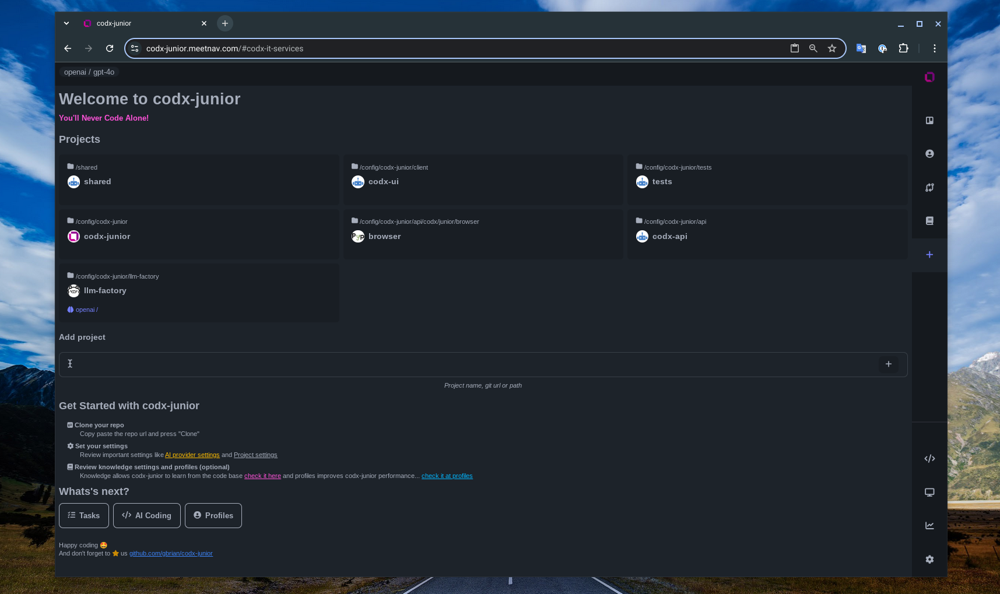
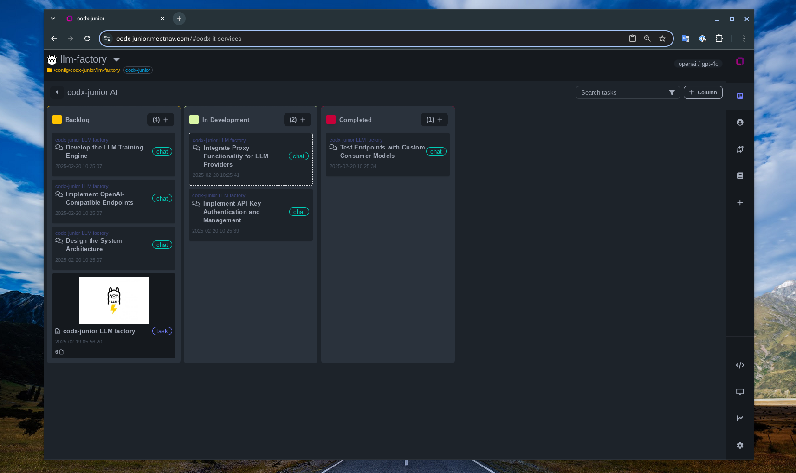

# 👋 Welcome to `codx-junior`! 


Think of it as your friendly sidekick for managing open-source projects. Whether you're a seasoned pro or just getting your feet wet, `codx-junior` is here to help you handle your projects with ease.

I create codx-junior for making our life easier by automating and streamlining the tasks involved in modern software development thanks to the power of AI. 

> You'll never code alone!

## how does it work?

Imagine `codx-junior` as your ultimate project collaborator. It's ready to support you through every step of your project management journey. No matter how complex things get, we're here to simplify your work, enhance testing, and ensure everything is documented just right.

### AI
Mostly is done by AI, codx-junior uses a set of basic flows and profiles to instruct LLM models to achieve the tasks. So please take your time to set the AI settings and profiles for your projects.

### How to run it

```bash
# check .env file to customize setup
git clone https://github.com/gbrian/codx-junior
cd codx-junior
codx-junior install
codx-junior run
```

And then open `http:://localhost:9983` in your browser
 
> Docker comming soon

## Features
#### Project's dashboard

 
Find all projects easily on the project's dashboard

#### Project Management

Let `codx-junior` lend a hand with project management. It keeps tasks synced with your codebase, ensuring consistency and organization throughout your project. 

> 💡 Use the profiles to fine tune how you like the tasks to be structure

: Define and organize your project structure. **Benefit**: Offers a clear overview, making it easier for contributors to understand and contribute effectively.

#### Tasks

`codx-junior` is agile by nature but can adapt to any strategy you prefer. Just let us know your methodology of choice, and watch `codx-junior` adjust.

: Visualize and manage tasks with an integrated Kanban board. **Benefit**: Enhances transparency and task tracking for contributors.
: Break down tasks into manageable subtasks. **Benefit**: Boosts task delegation and workload management in open-source projects.

#### Code Generation and Review

Move seamlessly from analysis to development, straight from tasks, to amp up your development efficiency.

: Automate code generation for repetitive tasks. **Benefit**: Streamlines development, letting contributors focus on impactful coding.
: Review code changes efficiently. **Benefit**: Promotes a structured and consistent code review process, crucial for maintaining code quality in open-source projects.

#### Deployment and Operations

Docker ready, `codx-junior` simplifies your deployment processes.

: Simplify containerization with Docker support. **Benefit**: Provides a consistent testing and deployment environment, reducing configuration discrepancies.
: Generate code specific to Docker tasks. **Benefit**: Automates deployment tasks, making it easier for contributors to deploy and test changes.

#### Collaboration and Communication

Just mention codx on any file to get its help immediately!

: Collaborate with team members through mentions. **Benefit**: Encourages effective communication and collaboration among distributed teams.
: Manage user profiles for better collaboration. **Benefit**: Personalizes the contributor experience, fostering a sense of community.

#### Knowledge Sharing

`codx-junior` leverages advanced RAG indexing for improved AI responses and knowledge dissemination.

: Access and contribute to shared knowledge bases. **Benefit**: Centralizes documentation and knowledge, making it easier for contributors to find and share information.

#### Development Tools

While `codx-junior` defaults to code-server, feel free to use your favorite IDE or tools.

: Manage global configurations and data models. **Benefit**: Ensures consistency across different development environments.
: Integrate custom tools to enhance development. **Benefit**: Allows contributors to use tools they are comfortable with, increasing productivity.

#### Settings

: Customize settings to tailor your project needs. **Benefit**: Offers flexibility in configuration, accommodating different project requirements.

With all these features, `codx-junior` is geared up to help Full Stack Developers manage their projects efficiently, providing significant benefits for maintaining open-source projects.

## Open Source Support

I genuinely hope `codx-junior` becomes your trusty sidekick in maintaining those open-source gems. Whether you're a seasoned pro or just diving into the world of open source, `codx-junior` is here to make your life easier. It's all about helping you keep everything organized, up-to-date, and running smoothly.

Why not give it a whirl? You might just find yourself wondering how you ever managed without it. Let's grow our community together and make project maintenance a breeze!

## Join the `codx-junior` Revolution!

Are you ready to take your open source project management to the next level? Meet `codx-junior`, your AI-powered sidekick in the world of open-source development. Streamline your tasks, enhance collaboration, and automate your workflow with ease. Whether you're a newbie or a seasoned pro, `codx-junior` is here to simplify your software journey. Dive into a seamless development experience today and see how efficient coding can be. Try `codx-junior` now and join our growing community!

## Find us on ProductHunt

Discover `codx-junior`, your AI-powered project management sidekick for open-source development. Streamline your workflow, enhance collaboration, and automate tasks with ease. Ideal for developers seeking efficient code management and seamless deployment. Join our community and experience a new era of software development.