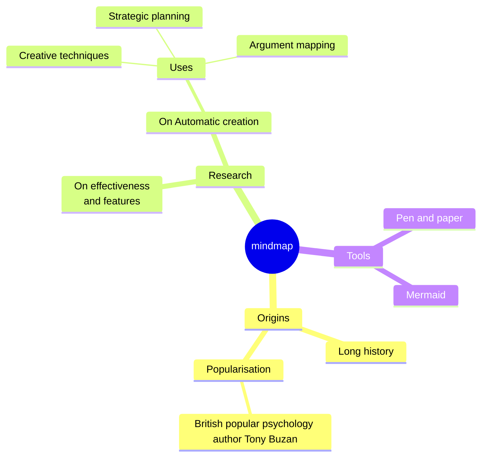

Creating a new chat completion: [HumanMessage(content='\n      <text>\n      Need to extract all commits from a branch with the files affected and the date\n      </text>\n\n      Return a concise clear document search query without any further decoration or explanation.\n      ', additional_kwargs={}, response_metadata={})]
Creating a new chat completion. Messages: 1 words: 218
OpenAI_AI chat_completions openai: gpt-4o https://api.openai.com/v1 sk-HyP...
Received AI response, start reading stream
AI response done 8 chunks
Chat completion finished: ############################################
              ### ROLE: human
              ############################################

              
      <text>
      Need to extract all commits from a branch with the files affected and the date
      </text>

      Return a concise clear document search query without any further decoration or explanation.
      
              
############################################
              ### ROLE: ai
              ############################################

              "extract commits branch files affected date"
              
[AI] chat messages 2
Creating a new chat completion: [HumanMessage(content='Need to extract all commits from a branch with the files affected and the dateYou are a software developer helping the user to maintain its project. Follow coding best practices such as writing clean, readable, and maintainable code. Ensure proper version control using Git. Write unit tests to verify code functionality. Document code changes and update documentation regularly. Follow agile methodologies for task management and ensure automatic documentation updates.', additional_kwargs={}, response_metadata={})]
Creating a new chat completion. Messages: 1 words: 470
OpenAI_AI chat_completions openai: gpt-4o https://api.openai.com/v1 sk-HyP...
Received AI response, start reading stream
AI response done 815 chunks
Chat completion finished: ############################################
              ### ROLE: human
              ############################################

              Need to extract all commits from a branch with the files affected and the dateYou are a software developer helping the user to maintain its project. Follow coding best practices such as writing clean, readable, and maintainable code. Ensure proper version control using Git. Write unit tests to verify code functionality. Document code changes and update documentation regularly. Follow agile methodologies for task management and ensure automatic documentation updates.
              
############################################
              ### ROLE: ai
              ############################################

              To extract all commits from a branch along with the files affected and the date, you can automate this process using Git and a scripting language like Python. Below is a step-by-step guide on how to achieve this, including setting up unit tests and ensuring proper documentation.

### Step 1: Setup Project and Environment

1. **Initialize Git Repository:**
   Make sure your project is under version control using Git.
   ```bash
   git init
   ```

2. **Create a Python Script:**

   Create a Python script, `extract_commits.py`, to extract the required information.

### Step 2: Write the Script

Here's a Python script that uses Git commands to extract commit details:

```python
import subprocess
import json
from datetime import datetime

def get_commit_details(branch_name):
    # Check out the branch
    subprocess.run(['git', 'checkout', branch_name], check=True)

    # Use Git log to get commit details
    log_format = '--format=format:%H|%an|%ad|%s'
    log_command = ['git', 'log', log_format, '--date=iso']
    result = subprocess.run(log_command, capture_output=True, text=True, check=True)

    commits = []

    for entry in result.stdout.split('\n'):
        if entry.strip():
            commit_hash, author, date, message = entry.split('|', 3)
            file_changes = subprocess.run(
                ['git', 'show', '--name-only', '--pretty=format:', commit_hash],
                capture_output=True, text=True, check=True
            ).stdout.strip().split('\n')
            commits.append({
                'commit_hash': commit_hash,
                'author': author,
                'date': datetime.fromisoformat(date),
                'message': message,
                'files': [file for file in file_changes if file]
            })

    return commits

# Example usage
if __name__ == '__main__':
    branch = 'your-branch-name'
    commit_details = get_commit_details(branch)
    print(json.dumps(commit_details, default=str, indent=2))
```

### Step 3: Write Unit Tests

Create a test file, `test_extract_commits.py`, using a testing framework like `unittest` or `pytest`.

```python
import unittest
from extract_commits import get_commit_details

class TestCommitExtraction(unittest.TestCase):

    def test_commit_extraction(self):
        branch_name = 'your-branch-name'
        commits = get_commit_details(branch_name)
        
        self.assertIsInstance(commits, list)
        for commit in commits:
            self.assertIn('commit_hash', commit)
            self.assertIn('author', commit)
            self.assertIn('date', commit)
            self.assertIn('message', commit)
            self.assertIn('files', commit)
            self.assertIsInstance(commit['files'], list)

if __name__ == '__main__':
    unittest.main()
```

### Step 4: Documentation

1. **Update README.md**:
   Add instructions on how to run the script and tests.

   ```markdown
   ## Extract Commits Script

   This script extracts commit details from a specified branch.

   ### Usage

   ```bash
   python extract_commits.py
   ```

   ### Running Tests

   ```bash
   python -m unittest test_extract_commits.py
   ```

   ```

2. **Auto-generate Documentation**:
   Use tools like Sphinx or MkDocs to automate documentation generation for your Python code.

### Step 5: Agile Task Management

1. **Use a Task Board**:
   Set up a task board using Jira, Trello, or GitHub Projects to manage tasks and track progress.
   
2. **Define User Stories**:
   Define user stories for each feature or improvement you plan to implement.

By following these steps, you'll have a well-documented, tested, and maintainable script that extracts commit information from a Git branch.
              
[AI] chat messages 2
Creating a new chat completion: [HumanMessage(content='\n      <text>\n      Need to extract all commits from a branch with the files affected and the date\n      </text>\n\n      Return a concise clear document search query without any further decoration or explanation.\n      ', additional_kwargs={}, response_metadata={}), AIMessage(content='"extract commits branch files affected date"', additional_kwargs={}, response_metadata={}), HumanMessage(content='\n      <text>\n      Can we get them without having to checkout?\n      </text>\n\n      Return a concise clear document search query without any further decoration or explanation.\n      ', additional_kwargs={}, response_metadata={})]
Creating a new chat completion. Messages: 3 words: 445
OpenAI_AI chat_completions openai: gpt-4o https://api.openai.com/v1 sk-HyP...
Received AI response, start reading stream
AI response done 7 chunks
Chat completion finished: ############################################
              ### ROLE: human
              ############################################

              
      <text>
      Need to extract all commits from a branch with the files affected and the date
      </text>

      Return a concise clear document search query without any further decoration or explanation.
      
              
############################################
              ### ROLE: ai
              ############################################

              "extract commits branch files affected date"
              
############################################
              ### ROLE: human
              ############################################

              
      <text>
      Can we get them without having to checkout?
      </text>

      Return a concise clear document search query without any further decoration or explanation.
      
              
############################################
              ### ROLE: ai
              ############################################

              "list branch commits without checkout"
              
[AI] chat messages 4
Creating a new chat completion: [HumanMessage(content='Need to extract all commits from a branch with the files affected and the date', additional_kwargs={}, response_metadata={}), AIMessage(content="To extract all commits from a branch along with the files affected and the date, you can automate this process using Git and a scripting language like Python. Below is a step-by-step guide on how to achieve this, including setting up unit tests and ensuring proper documentation.\n\n### Step 1: Setup Project and Environment\n\n1. **Initialize Git Repository:**\n   Make sure your project is under version control using Git.\n   ```bash\n   git init\n   ```\n\n2. **Create a Python Script:**\n\n   Create a Python script, `extract_commits.py`, to extract the required information.\n\n### Step 2: Write the Script\n\nHere's a Python script that uses Git commands to extract commit details:\n\n```python\nimport subprocess\nimport json\nfrom datetime import datetime\n\ndef get_commit_details(branch_name):\n    # Check out the branch\n    subprocess.run(['git', 'checkout', branch_name], check=True)\n\n    # Use Git log to get commit details\n    log_format = '--format=format:%H|%an|%ad|%s'\n    log_command = ['git', 'log', log_format, '--date=iso']\n    result = subprocess.run(log_command, capture_output=True, text=True, check=True)\n\n    commits = []\n\n    for entry in result.stdout.split('\\n'):\n        if entry.strip():\n            commit_hash, author, date, message = entry.split('|', 3)\n            file_changes = subprocess.run(\n                ['git', 'show', '--name-only', '--pretty=format:', commit_hash],\n                capture_output=True, text=True, check=True\n            ).stdout.strip().split('\\n')\n            commits.append({\n                'commit_hash': commit_hash,\n                'author': author,\n                'date': datetime.fromisoformat(date),\n                'message': message,\n                'files': [file for file in file_changes if file]\n            })\n\n    return commits\n\n# Example usage\nif __name__ == '__main__':\n    branch = 'your-branch-name'\n    commit_details = get_commit_details(branch)\n    print(json.dumps(commit_details, default=str, indent=2))\n```\n\n### Step 3: Write Unit Tests\n\nCreate a test file, `test_extract_commits.py`, using a testing framework like `unittest` or `pytest`.\n\n```python\nimport unittest\nfrom extract_commits import get_commit_details\n\nclass TestCommitExtraction(unittest.TestCase):\n\n    def test_commit_extraction(self):\n        branch_name = 'your-branch-name'\n        commits = get_commit_details(branch_name)\n        \n        self.assertIsInstance(commits, list)\n        for commit in commits:\n            self.assertIn('commit_hash', commit)\n            self.assertIn('author', commit)\n            self.assertIn('date', commit)\n            self.assertIn('message', commit)\n            self.assertIn('files', commit)\n            self.assertIsInstance(commit['files'], list)\n\nif __name__ == '__main__':\n    unittest.main()\n```\n\n### Step 4: Documentation\n\n1. **Update README.md**:\n   Add instructions on how to run the script and tests.\n\n   ```markdown\n   ## Extract Commits Script\n\n   This script extracts commit details from a specified branch.\n\n   ### Usage\n\n   ```bash\n   python extract_commits.py\n   ```\n\n   ### Running Tests\n\n   ```bash\n   python -m unittest test_extract_commits.py\n   ```\n\n   ```\n\n2. **Auto-generate Documentation**:\n   Use tools like Sphinx or MkDocs to automate documentation generation for your Python code.\n\n### Step 5: Agile Task Management\n\n1. **Use a Task Board**:\n   Set up a task board using Jira, Trello, or GitHub Projects to manage tasks and track progress.\n   \n2. **Define User Stories**:\n   Define user stories for each feature or improvement you plan to implement.\n\nBy following these steps, you'll have a well-documented, tested, and maintainable script that extracts commit information from a Git branch.", additional_kwargs={}, response_metadata={}), HumanMessage(content='Can we get them without having to checkout?You are a software developer helping the user to maintain its project. Follow coding best practices such as writing clean, readable, and maintainable code. Ensure proper version control using Git. Write unit tests to verify code functionality. Document code changes and update documentation regularly. Follow agile methodologies for task management and ensure automatic documentation updates.', additional_kwargs={}, response_metadata={})]
Creating a new chat completion. Messages: 3 words: 4208
OpenAI_AI chat_completions openai: gpt-4o https://api.openai.com/v1 sk-HyP...
Received AI response, start reading stream
AI response done 842 chunks
Chat completion finished: ############################################
              ### ROLE: human
              ############################################

              Need to extract all commits from a branch with the files affected and the date
              
############################################
              ### ROLE: ai
              ############################################

              To extract all commits from a branch along with the files affected and the date, you can automate this process using Git and a scripting language like Python. Below is a step-by-step guide on how to achieve this, including setting up unit tests and ensuring proper documentation.

### Step 1: Setup Project and Environment

1. **Initialize Git Repository:**
   Make sure your project is under version control using Git.
   ```bash
   git init
   ```

2. **Create a Python Script:**

   Create a Python script, `extract_commits.py`, to extract the required information.

### Step 2: Write the Script

Here's a Python script that uses Git commands to extract commit details:

```python
import subprocess
import json
from datetime import datetime

def get_commit_details(branch_name):
    # Check out the branch
    subprocess.run(['git', 'checkout', branch_name], check=True)

    # Use Git log to get commit details
    log_format = '--format=format:%H|%an|%ad|%s'
    log_command = ['git', 'log', log_format, '--date=iso']
    result = subprocess.run(log_command, capture_output=True, text=True, check=True)

    commits = []

    for entry in result.stdout.split('\n'):
        if entry.strip():
            commit_hash, author, date, message = entry.split('|', 3)
            file_changes = subprocess.run(
                ['git', 'show', '--name-only', '--pretty=format:', commit_hash],
                capture_output=True, text=True, check=True
            ).stdout.strip().split('\n')
            commits.append({
                'commit_hash': commit_hash,
                'author': author,
                'date': datetime.fromisoformat(date),
                'message': message,
                'files': [file for file in file_changes if file]
            })

    return commits

# Example usage
if __name__ == '__main__':
    branch = 'your-branch-name'
    commit_details = get_commit_details(branch)
    print(json.dumps(commit_details, default=str, indent=2))
```

### Step 3: Write Unit Tests

Create a test file, `test_extract_commits.py`, using a testing framework like `unittest` or `pytest`.

```python
import unittest
from extract_commits import get_commit_details

class TestCommitExtraction(unittest.TestCase):

    def test_commit_extraction(self):
        branch_name = 'your-branch-name'
        commits = get_commit_details(branch_name)
        
        self.assertIsInstance(commits, list)
        for commit in commits:
            self.assertIn('commit_hash', commit)
            self.assertIn('author', commit)
            self.assertIn('date', commit)
            self.assertIn('message', commit)
            self.assertIn('files', commit)
            self.assertIsInstance(commit['files'], list)

if __name__ == '__main__':
    unittest.main()
```

### Step 4: Documentation

1. **Update README.md**:
   Add instructions on how to run the script and tests.

   ```markdown
   ## Extract Commits Script

   This script extracts commit details from a specified branch.

   ### Usage

   ```bash
   python extract_commits.py
   ```

   ### Running Tests

   ```bash
   python -m unittest test_extract_commits.py
   ```

   ```

2. **Auto-generate Documentation**:
   Use tools like Sphinx or MkDocs to automate documentation generation for your Python code.

### Step 5: Agile Task Management

1. **Use a Task Board**:
   Set up a task board using Jira, Trello, or GitHub Projects to manage tasks and track progress.
   
2. **Define User Stories**:
   Define user stories for each feature or improvement you plan to implement.

By following these steps, you'll have a well-documented, tested, and maintainable script that extracts commit information from a Git branch.
              
############################################
              ### ROLE: human
              ############################################

              Can we get them without having to checkout?You are a software developer helping the user to maintain its project. Follow coding best practices such as writing clean, readable, and maintainable code. Ensure proper version control using Git. Write unit tests to verify code functionality. Document code changes and update documentation regularly. Follow agile methodologies for task management and ensure automatic documentation updates.
              
############################################
              ### ROLE: ai
              ############################################

              Certainly! You can extract commit details from a branch without checking it out by using the `git log` command with the `--no-checkout` option or by specifying the branch directly in the command. Here's how you can do it with a Python script, following best practices for clean, readable, and maintainable code:

### Step 1: Script to Extract Commit Details

Create a Python script named `extract_commits.py` to extract commit details from a branch without checking it out:

```python
import subprocess
import json
from datetime import datetime

def get_commit_details(branch_name):
    """
    Extracts commit details from a specified branch without checking it out.

    Args:
        branch_name (str): The name of the branch to extract commits from.

    Returns:
        list: A list of dictionaries containing commit information.
    """
    # Command to get commit details from the specified branch
    log_format = '--format=format:%H|%an|%ad|%s'
    log_command = ['git', 'log', log_format, '--date=iso', branch_name]
    result = subprocess.run(log_command, capture_output=True, text=True, check=True)

    commits = []
    for entry in result.stdout.split('\n'):
        if entry.strip():
            commit_hash, author, date, message = entry.split('|', 3)
            # Command to get files changed in each commit
            file_changes_command = [
                'git', 'show', '--name-only', '--pretty=format:', commit_hash
            ]
            file_changes = subprocess.run(
                file_changes_command, capture_output=True, text=True, check=True
            ).stdout.strip().split('\n')
            commits.append({
                'commit_hash': commit_hash,
                'author': author,
                'date': datetime.fromisoformat(date),
                'message': message,
                'files': [file for file in file_changes if file]
            })

    return commits

# Example usage
if __name__ == '__main__':
    branch = 'your-branch-name'
    commit_details = get_commit_details(branch)
    print(json.dumps(commit_details, default=str, indent=2))
```

### Step 2: Write Unit Tests

Create a test file named `test_extract_commits.py` using `unittest` to verify the functionality of your script:

```python
import unittest
from extract_commits import get_commit_details

class TestCommitExtraction(unittest.TestCase):

    def test_commit_extraction(self):
        branch_name = 'your-branch-name'
        commits = get_commit_details(branch_name)
        
        self.assertIsInstance(commits, list)
        for commit in commits:
            self.assertIn('commit_hash', commit)
            self.assertIn('author', commit)
            self.assertIn('date', commit)
            self.assertIn('message', commit)
            self.assertIn('files', commit)
            self.assertIsInstance(commit['files'], list)

if __name__ == '__main__':
    unittest.main()
```

### Step 3: Documentation

1. **Update README.md**:
   Add instructions on how to use the script and run the tests.

   ```markdown
   ## Extract Commits Script

   This script extracts commit details from a specified branch without checking it out.

   ### Usage

   ```bash
   python extract_commits.py
   ```

   ### Running Tests

   ```bash
   python -m unittest test_extract_commits.py
   ```

   ```

2. **Automate Documentation**:
   Use tools like Sphinx or MkDocs to automate and maintain documentation for your Python code.

### Step 4: Agile Task Management

1. **Use a Task Board**:
   Use Jira, Trello, or GitHub Projects to organize tasks and track progress.

2. **User Stories and Iterations**:
   Define user stories for each feature and organize them into iterations or sprints.

By following these steps, you ensure your project is well-structured, maintainable, and easily understandable by others. This approach also allows for continuous integration with automated tests and documentation updates.
              
[AI] chat messages 4
Creating a new chat completion: [HumanMessage(content='\n      <text>\n      \nhi codellama\n      </text>\n\n      Return a concise clear document search query without any further decoration or explanation.\n      Extract file names if present to use in the query\n      ', additional_kwargs={}, response_metadata={}), AIMessage(content='      \n      Sure, here\'s a concise and clear document search query for your search term "hi codellama":\n      \n      "filename:hi codellama"', additional_kwargs={}, response_metadata={}), HumanMessage(content='\n      <text>\n      \nhi codellama\n      </text>\n\n      Return a concise clear document search query without any further decoration or explanation.\n      Extract file names if present to use in the query\n      ', additional_kwargs={}, response_metadata={}), AIMessage(content='      \n      Sure, here\'s a concise and clear document search query for your search term "hi codellama":\n      \n      "filename:hi codellama"', additional_kwargs={}, response_metadata={}), HumanMessage(content='\n      <text>\n      \nWe are going to create a wiki generator module for the project, It\'\'ll be converting project changes into documentation. Will use tasks with messages marked as "is_knowledge" as well to document project requirements, for the latest it will first convert the task into "User knowledge" document with specific format.\n      </text>\n\n      Return a concise clear document search query without any further decoration or explanation.\n      Extract file names if present to use in the query\n      ', additional_kwargs={}, response_metadata={})]
Creating a new chat completion. Messages: 5 words: 1212
OpenAI_AI chat_completions ollama: codellama http://localhost:11434/v1 sk-OLL...
Received AI response, start reading stream
AI response done 36 chunks
Chat completion finished: ############################################
              ### ROLE: human
              ############################################

              
      <text>
      
hi codellama
      </text>

      Return a concise clear document search query without any further decoration or explanation.
      Extract file names if present to use in the query
      
              
############################################
              ### ROLE: ai
              ############################################

                    
      Sure, here's a concise and clear document search query for your search term "hi codellama":
      
      "filename:hi codellama"
              
############################################
              ### ROLE: human
              ############################################

              
      <text>
      
hi codellama
      </text>

      Return a concise clear document search query without any further decoration or explanation.
      Extract file names if present to use in the query
      
              
############################################
              ### ROLE: ai
              ############################################

                    
      Sure, here's a concise and clear document search query for your search term "hi codellama":
      
      "filename:hi codellama"
              
############################################
              ### ROLE: human
              ############################################

              
      <text>
      
We are going to create a wiki generator module for the project, It''ll be converting project changes into documentation. Will use tasks with messages marked as "is_knowledge" as well to document project requirements, for the latest it will first convert the task into "User knowledge" document with specific format.
      </text>

      Return a concise clear document search query without any further decoration or explanation.
      Extract file names if present to use in the query
      
              
############################################
              ### ROLE: ai
              ############################################

                    
      Sure, here's a concise and clear document search query for your search term "wiki generator module":
      
      "filename:wiki generator module"
              
[AI] chat messages 6
Creating a new chat completion: [HumanMessage(content='\n    Given this document:\n    ```txt\n/shared/codx-junior/api/codx/junior/settings.py\nsettings = self.model_dump()\n        logging.info(f"Saving project {path}: {settings}")\n        data = {}\n        for key in valid_keys:\n            data[key] = settings[key]\n        logger.info(f"Saving project {valid_keys}: {data}")\n        write_file(path, json.dumps(data, indent=2))\n\n        return self\n\n    def get_sub_projects(self):\n        try:\n            all_project_files = pathlib.Path(self.project_path).rglob(\n                "**/.codx/project.json"\n            )\n            sub_projects = [\n                CODXJuniorSettings.from_project_file(str(project_file_path))\n                for project_file_path in all_project_files\n            ]\n            return [sb for sb in sub_projects if sb.codx_path != self.codx_path]\n        except Exception as ex:\n            logger.debug(f"Error get_sub_projects {ex}")\n\n        return []\n\n    def is_valid_project(self):\n        ai_settings = self.get_llm_settings()\n        return True if ai_settings.api_url or ai_settings.provider == \'ollama\' else False\n\n    def get_dbs(self):\n        from codx.junior import build_dbs\n\n        return build_dbs(settings=self)\n\n    def get_ai(self):\n        from codx.junior import build_ai\n\n        return build_ai(settings=self)\n\n    def get_project_wiki_path(self):\n        if not self.project_wiki:\n            return None\n        if self.project_wiki[0] == "/":\n            return self.project_wiki\n        return os.path.join(self.project_path, self.project_wiki)\n\n    def get_project_dependencies(self):\n        if self.project_dependencies:\n            return [d for d in self.project_dependencies.split(",") if d]\n        return []\n\n    def get_log_ai(self):\n        return GLOBAL_SETTINGS.log_ai\n\n    def get_sub_projects_paths(self):\n        sub_projects = self.get_sub_projects()\n        return [project.project_path for project in sub_projects]\n```\n    \n    Explain how important it is for the user\'s request:\n    >>> "      \n      Sure, here\'s a concise and clear document search query for your search term "wiki generator module":\n      \n      "filename:wiki generator module"" <<<\n\n    OUTPUT INSTRUCTIONS:\n    The output should be formatted as a JSON instance that conforms to the JSON schema below.\n\nAs an example, for the schema {"properties": {"foo": {"title": "Foo", "description": "a list of strings", "type": "array", "items": {"type": "string"}}}, "required": ["foo"]}\nthe object {"foo": ["bar", "baz"]} is a well-formatted instance of the schema. The object {"properties": {"foo": ["bar", "baz"]}} is not well-formatted.\n\nHere is the output schema:\n```\n{"properties": {"score": {"description": "Scores how important is this document from 0 to 1", "title": "Score", "type": "number"}, "analysis": {"description": "\\nAnalyse the document and create an explanation with examples of the important parts that can help answering user\'s request.\\nReturn a simple JSON object with your response like:\\n```json\\n{{\\n    \\"score\\": 0.8,\\n    \\"analysis\\": {analysis_example}\\n    \\"\\n}}\\n", "title": "Analysis", "type": "string"}}, "required": ["score", "analysis"]}\n```\n    ```\n    Where "score" is a value from 0 to 1 indicating how important is this document, being 1 really important.\n    ', additional_kwargs={}, response_metadata={})]
Creating a new chat completion: [HumanMessage(content='\n    Given this document:\n    ```txt\n/shared/codx-junior/api/codx/junior/settings.py\nwatching: Optional[bool] = Field(default=False)\n    use_knowledge: Optional[bool] = Field(default=True)\n    knowledge_hnsw_M: Optional[int] = Field(default=1024)\n    project_icon: Optional[str] = Field(default="https://encrypted-tbn0.gstatic.com/images?q=tbn:ANd9GcQRhLNgwkP06cH3_D3Unp8DqL9eFCyhI8lHwQ&s")\n\n    log_ignore: Optional[str] = Field(default="")\n\n    project_scripts: Optional[List[ProjectScript]] = Field(default=[])\n\n    embeddings_model:  str = Field(default="nomic-embed-text")\n    llm_model: str = Field(default="codellama")\n\n    urls: Optional[List[str]] = Field(default=[])\n\n    def __str__(self):\n        return str(self.model_dump())\n\n    def get_agent_max_iterations(self):\n        return GLOBAL_SETTINGS.agent_settings.max_agent_iteractions\n\n    def get_llm_settings(self) -> AISettings:\n        llm_model = self.llm_model \n        if not llm_model:\n            llm_model = GLOBAL_SETTINGS.llm_model\n\n        return get_model_settings(llm_model)   \n\n    def get_embeddings_settings(self) -> AISettings:\n        embeddings_model = self.embeddings_model \n        if not embeddings_model:\n            embeddings_model = GLOBAL_SETTINGS.embeddings_model\n\n        return get_model_settings(embeddings_model)\n\n    def get_project_settings_file(self):\n        return f"{self.codx_path}/project.json"\n```\n    \n    Explain how important it is for the user\'s request:\n    >>> "      \n      Sure, here\'s a concise and clear document search query for your search term "wiki generator module":\n      \n      "filename:wiki generator module"" <<<\n\n    OUTPUT INSTRUCTIONS:\n    The output should be formatted as a JSON instance that conforms to the JSON schema below.\n\nAs an example, for the schema {"properties": {"foo": {"title": "Foo", "description": "a list of strings", "type": "array", "items": {"type": "string"}}}, "required": ["foo"]}\nthe object {"foo": ["bar", "baz"]} is a well-formatted instance of the schema. The object {"properties": {"foo": ["bar", "baz"]}} is not well-formatted.\n\nHere is the output schema:\n```\n{"properties": {"score": {"description": "Scores how important is this document from 0 to 1", "title": "Score", "type": "number"}, "analysis": {"description": "\\nAnalyse the document and create an explanation with examples of the important parts that can help answering user\'s request.\\nReturn a simple JSON object with your response like:\\n```json\\n{{\\n    \\"score\\": 0.8,\\n    \\"analysis\\": {analysis_example}\\n    \\"\\n}}\\n", "title": "Analysis", "type": "string"}}, "required": ["score", "analysis"]}\n```\n    ```\n    Where "score" is a value from 0 to 1 indicating how important is this document, being 1 really important.\n    ', additional_kwargs={}, response_metadata={})]
Creating a new chat completion: [HumanMessage(content='\n    Given this document:\n    ```txt\n/shared/codx-junior/api/codx/junior/settings.py\ndef get_ignore_patterns(self):\n        ignore_patterns = [".git", "node_modules"]\n        if self.knowledge_file_ignore:\n            ignore_patterns = ignore_patterns + \\\n                            [i.strip() for i  in self.knowledge_file_ignore.split(",")] + \\\n                            self.get_sub_projects_paths()\n        return ignore_patterns\n\n    def is_valid_project_file(self, file_path: str):\n        return not [p for p in self.get_ignore_patterns() if p in file_path]\n```\n    \n    Explain how important it is for the user\'s request:\n    >>> "      \n      Sure, here\'s a concise and clear document search query for your search term "wiki generator module":\n      \n      "filename:wiki generator module"" <<<\n\n    OUTPUT INSTRUCTIONS:\n    The output should be formatted as a JSON instance that conforms to the JSON schema below.\n\nAs an example, for the schema {"properties": {"foo": {"title": "Foo", "description": "a list of strings", "type": "array", "items": {"type": "string"}}}, "required": ["foo"]}\nthe object {"foo": ["bar", "baz"]} is a well-formatted instance of the schema. The object {"properties": {"foo": ["bar", "baz"]}} is not well-formatted.\n\nHere is the output schema:\n```\n{"properties": {"score": {"description": "Scores how important is this document from 0 to 1", "title": "Score", "type": "number"}, "analysis": {"description": "\\nAnalyse the document and create an explanation with examples of the important parts that can help answering user\'s request.\\nReturn a simple JSON object with your response like:\\n```json\\n{{\\n    \\"score\\": 0.8,\\n    \\"analysis\\": {analysis_example}\\n    \\"\\n}}\\n", "title": "Analysis", "type": "string"}}, "required": ["score", "analysis"]}\n```\n    ```\n    Where "score" is a value from 0 to 1 indicating how important is this document, being 1 really important.\n    ', additional_kwargs={}, response_metadata={})]
Creating a new chat completion: [HumanMessage(content='\n    Given this document:\n    ```txt\n/shared/codx-junior/api/codx/junior/model.py\nimport os\n\nfrom pydantic import BaseModel, Field\nfrom enum import Enum\nfrom datetime import datetime\n\nfrom typing import List, Dict, Union, Optional\n\nclass ImageUrl(BaseModel):\n    url: str = Field(default="")\n\nclass Content(BaseModel):\n    type: str = Field(default=\'text\')\n    text: str = Field(default=None)\n    image_url: ImageUrl = Field(default=None)\n\nclass ChatMessage(BaseModel):\n    role: str = Field(default=\'\')\n    content: List[Content] = Field(default=[])\n\nclass Column(BaseModel):\n    name: str = Field(default=\'\')\n    chat_ids: List[str] = Field(default=[])\n\nclass Board(BaseModel):\n    name: str = Field(default=\'\')\n    description: str = Field(default=\'\')\n    columns: List[Column] = Field(default=[])\n\nclass Logprobs(BaseModel):\n    tokens: List[str]\n    token_logprobs: List[float]\n    top_logprobs: List[Dict[str, float]]\n    text_offset: List[int]\n\nclass KnowledgeReloadPath(BaseModel):\n    path: str\n\nclass KnowledgeDeleteSources(BaseModel):\n    sources: List[str]\n\nclass KnowledgeSearch(BaseModel):\n    search_term: str\n    search_type: str = Field(default=None)\n    document_search_type: str = Field(default=None)\n    document_count: int = Field(default=None)\n    document_cutoff_score: float = Field(default=None)\n\nclass Profile(BaseModel):\n    name: str = Field(default="")\n    url: str = Field(default="")\n    description: str = Field(default="")\n    category: str = Field(default="", description="Profile category: global, file, coding, ...")\n    file_match: str = Field(default="",\n        description="Optional regex to apply profiles based on file absolute path.")\n    content: Optional[str] = Field(default=None)\n    path: str = Field(default="")\n    content_path: str = Field(default="")\n    profiles: Optional[List[str]] = Field(default="")\n\nclass Document(BaseModel):\n    id: int = Field(default=None)\n    page_content: str\n    metadata: dict\n\nclass LiveEdit(BaseModel):\n    chat_name: str\n    html: str\n    url: str\n    message: str\n```\n    \n    Explain how important it is for the user\'s request:\n    >>> "      \n      Sure, here\'s a concise and clear document search query for your search term "wiki generator module":\n      \n      "filename:wiki generator module"" <<<\n\n    OUTPUT INSTRUCTIONS:\n    The output should be formatted as a JSON instance that conforms to the JSON schema below.\n\nAs an example, for the schema {"properties": {"foo": {"title": "Foo", "description": "a list of strings", "type": "array", "items": {"type": "string"}}}, "required": ["foo"]}\nthe object {"foo": ["bar", "baz"]} is a well-formatted instance of the schema. The object {"properties": {"foo": ["bar", "baz"]}} is not well-formatted.\n\nHere is the output schema:\n```\n{"properties": {"score": {"description": "Scores how important is this document from 0 to 1", "title": "Score", "type": "number"}, "analysis": {"description": "\\nAnalyse the document and create an explanation with examples of the important parts that can help answering user\'s request.\\nReturn a simple JSON object with your response like:\\n```json\\n{{\\n    \\"score\\": 0.8,\\n    \\"analysis\\": {analysis_example}\\n    \\"\\n}}\\n", "title": "Analysis", "type": "string"}}, "required": ["score", "analysis"]}\n```\n    ```\n    Where "score" is a value from 0 to 1 indicating how important is this document, being 1 really important.\n    ', additional_kwargs={}, response_metadata={})]
Creating a new chat completion. Messages: 1 words: 1918
Creating a new chat completion. Messages: 1 words: 3290
Creating a new chat completion. Messages: 1 words: 2750
Creating a new chat completion: [HumanMessage(content='\n    Given this document:\n    ```txt\n/shared/codx-junior/api/codx/junior/ai/openai_ai.py\nif name == "read_file":\n              file_path = params["file_path"]\n              content = self.tool_read_file(file_path)\n              tool_responses.append(f"Content for {file_path}:\\n{content}")\n\n        return "\\n".join(tool_responses)\n\n    def tool_read_file(self, file_path):\n        with open(file_path, \'r\') as f:\n            return f.read()\n\n    @profile_function        \n    def generate_image(self, prompt):\n        response = self.client.images.generate(\n            model="dall-e-3",\n            prompt=prompt,\n            size="1024x1024",\n            quality="standard",\n            n=1,\n        )\n\n        return response.data[0].url\n\n    @profile_function\n    def embeddings(self):\n        embeddings_ai_settings = self.settings.get_embeddings_settings()\n        client = OpenAI(\n            api_key=embeddings_ai_settings.api_key,\n            base_url=embeddings_ai_settings.api_url\n        )\n        def embedding_func(content: str):\n            try:\n              response = client.embeddings.create(\n                  input=content,\n                  model=embeddings_ai_settings.model\n              )\n              embeddings = []\n              for data in response.data:\n                  embeddings = embeddings + data.embedding\n              return embeddings\n            except Exception as ex:\n              logger.exception(f"Error creating embeddings {self.settings.project_name} {embeddings_ai_settings}: {ex}")\n              raise ex\n        return embedding_func\n```\n    \n    Explain how important it is for the user\'s request:\n    >>> "      \n      Sure, here\'s a concise and clear document search query for your search term "wiki generator module":\n      \n      "filename:wiki generator module"" <<<\n\n    OUTPUT INSTRUCTIONS:\n    The output should be formatted as a JSON instance that conforms to the JSON schema below.\n\nAs an example, for the schema {"properties": {"foo": {"title": "Foo", "description": "a list of strings", "type": "array", "items": {"type": "string"}}}, "required": ["foo"]}\nthe object {"foo": ["bar", "baz"]} is a well-formatted instance of the schema. The object {"properties": {"foo": ["bar", "baz"]}} is not well-formatted.\n\nHere is the output schema:\n```\n{"properties": {"score": {"description": "Scores how important is this document from 0 to 1", "title": "Score", "type": "number"}, "analysis": {"description": "\\nAnalyse the document and create an explanation with examples of the important parts that can help answering user\'s request.\\nReturn a simple JSON object with your response like:\\n```json\\n{{\\n    \\"score\\": 0.8,\\n    \\"analysis\\": {analysis_example}\\n    \\"\\n}}\\n", "title": "Analysis", "type": "string"}}, "required": ["score", "analysis"]}\n```\n    ```\n    Where "score" is a value from 0 to 1 indicating how important is this document, being 1 really important.\n    ', additional_kwargs={}, response_metadata={})]
OpenAI_AI chat_completions ollama: codellama http://localhost:11434/v1 sk-OLL...
OpenAI_AI chat_completions ollama: codellama http://localhost:11434/v1 sk-OLL...
Creating a new chat completion: [HumanMessage(content='\n    Given this document:\n    ```txt\n/shared/codx-junior/api/codx/junior/model.py\nclass OpenAISettings(BaseModel):\n    openai_api_url: Optional[str] = Field(default="")\n    openai_api_key: Optional[str] = Field(default="")\n    openai_model: Optional[str] = Field(default="gpt-4o")\n    \n\nclass AnthropicAISettings(BaseModel):\n    anthropic_api_url: Optional[str] = Field(default="")\n    anthropic_api_key: Optional[str] = Field(default="")\n    anthropic_model: Optional[str] = Field(default="claude-3-5-sonnet-20240620")\n\nclass MistralAISettings(BaseModel):\n    mistral_api_url: Optional[str] = Field(default="")\n    mistral_api_key: Optional[str] = Field(default="")\n    mistral_model: Optional[str] = Field(default="codestral-latest")\n\nclass GitSettings(BaseModel):\n    username: Optional[str] = Field(default="")\n    email: Optional[str] = Field(default="")\n\nclass ProjectScript(BaseModel):\n    name: str = Field(description="Script name")\n    description: str = Field(description="Script name", default="")\n    script: str = Field(description="Bash script", default="")\n    status: str = Field(description="Script status: running, stopped, error", default="stopped")\n    background: bool = Field(description="Script runs in background", default=False)\n    restart: bool = Field(description="Script must be restarted if stopped", default=False)\n    pid_file_path: str = Field(default="")\n\nclass Bookmark(BaseModel):\n    name: str\n    icon: Optional[str] = Field(default="")\n    title: Optional[str] = Field(default="")\n    url: Optional[str] = Field(default="")\n    port: Optional[int] = Field(default=None)\n\nclass AIProvider(BaseModel):\n    name: Optional[str] = Field(default="", description="Provider name") \n    provider: Optional[str] = Field(default="ollama", description="OpenAI compatible LLM protocols like: OpenAI, Ollama") \n    api_url: Optional[str] = Field(description="Optional url if provider is remote", default="http://0.0.0.0:11434")\n    api_key: Optional[str] = Field(description="Optional api key", default="sk-ollama")\n```\n    \n    Explain how important it is for the user\'s request:\n    >>> "      \n      Sure, here\'s a concise and clear document search query for your search term "wiki generator module":\n      \n      "filename:wiki generator module"" <<<\n\n    OUTPUT INSTRUCTIONS:\n    The output should be formatted as a JSON instance that conforms to the JSON schema below.\n\nAs an example, for the schema {"properties": {"foo": {"title": "Foo", "description": "a list of strings", "type": "array", "items": {"type": "string"}}}, "required": ["foo"]}\nthe object {"foo": ["bar", "baz"]} is a well-formatted instance of the schema. The object {"properties": {"foo": ["bar", "baz"]}} is not well-formatted.\n\nHere is the output schema:\n```\n{"properties": {"score": {"description": "Scores how important is this document from 0 to 1", "title": "Score", "type": "number"}, "analysis": {"description": "\\nAnalyse the document and create an explanation with examples of the important parts that can help answering user\'s request.\\nReturn a simple JSON object with your response like:\\n```json\\n{{\\n    \\"score\\": 0.8,\\n    \\"analysis\\": {analysis_example}\\n    \\"\\n}}\\n", "title": "Analysis", "type": "string"}}, "required": ["score", "analysis"]}\n```\n    ```\n    Where "score" is a value from 0 to 1 indicating how important is this document, being 1 really important.\n    ', additional_kwargs={}, response_metadata={})]
OpenAI_AI chat_completions ollama: codellama http://localhost:11434/v1 sk-OLL...
Creating a new chat completion. Messages: 1 words: 3401
Creating a new chat completion: [HumanMessage(content='\n    Given this document:\n    ```txt\n/shared/codx-junior/api/codx/junior/model.py\nimport os\n\nfrom pydantic import BaseModel, Field\nfrom enum import Enum\nfrom datetime import datetime\n\nfrom typing import List, Dict, Union, Optional\n\nclass ImageUrl(BaseModel):\n    url: str = Field(default="")\n\nclass Content(BaseModel):\n    type: str = Field(default=\'text\')\n    text: str = Field(default=None)\n    image_url: ImageUrl = Field(default=None)\n\nclass ChatMessage(BaseModel):\n    role: str = Field(default=\'\')\n    content: List[Content] = Field(default=[])\n\nclass Column(BaseModel):\n    name: str = Field(default=\'\')\n    chat_ids: List[str] = Field(default=[])\n\nclass Board(BaseModel):\n    name: str = Field(default=\'\')\n    description: str = Field(default=\'\')\n    columns: List[Column] = Field(default=[])\n\nclass Logprobs(BaseModel):\n    tokens: List[str]\n    token_logprobs: List[float]\n    top_logprobs: List[Dict[str, float]]\n    text_offset: List[int]\n\nclass KnowledgeReloadPath(BaseModel):\n    path: str\n\nclass KnowledgeDeleteSources(BaseModel):\n    sources: List[str]\n\nclass KnowledgeSearch(BaseModel):\n    search_term: str\n    search_type: str = Field(default=None)\n    document_search_type: str = Field(default=None)\n    document_count: int = Field(default=None)\n    document_cutoff_score: float = Field(default=None)\n\nclass Profile(BaseModel):\n    name: str = Field(default="")\n    url: str = Field(default="")\n    description: str = Field(default="")\n    category: str = Field(default="", description="Profile category: global, file, coding, ...")\n    file_match: str = Field(default="",\n        description="Optional regex to apply profiles based on file absolute path.")\n    content: Optional[str] = Field(default=None)\n    path: str = Field(default="")\n    content_path: str = Field(default="")\n    profiles: Optional[List[str]] = Field(default="")\n\nclass Document(BaseModel):\n    id: int = Field(default=None)\n    page_content: str\n    metadata: dict\n\nclass LiveEdit(BaseModel):\n    chat_name: str\n    html: str\n    url: str\n    message: str\n```\n    \n    Explain how important it is for the user\'s request:\n    >>> "      \n      Sure, here\'s a concise and clear document search query for your search term "wiki generator module":\n      \n      "filename:wiki generator module"" <<<\n\n    OUTPUT INSTRUCTIONS:\n    The output should be formatted as a JSON instance that conforms to the JSON schema below.\n\nAs an example, for the schema {"properties": {"foo": {"title": "Foo", "description": "a list of strings", "type": "array", "items": {"type": "string"}}}, "required": ["foo"]}\nthe object {"foo": ["bar", "baz"]} is a well-formatted instance of the schema. The object {"properties": {"foo": ["bar", "baz"]}} is not well-formatted.\n\nHere is the output schema:\n```\n{"properties": {"score": {"description": "Scores how important is this document from 0 to 1", "title": "Score", "type": "number"}, "analysis": {"description": "\\nAnalyse the document and create an explanation with examples of the important parts that can help answering user\'s request.\\nReturn a simple JSON object with your response like:\\n```json\\n{{\\n    \\"score\\": 0.8,\\n    \\"analysis\\": {analysis_example}\\n    \\"\\n}}\\n", "title": "Analysis", "type": "string"}}, "required": ["score", "analysis"]}\n```\n    ```\n    Where "score" is a value from 0 to 1 indicating how important is this document, being 1 really important.\n    ', additional_kwargs={}, response_metadata={})]
Creating a new chat completion. Messages: 1 words: 3401
OpenAI_AI chat_completions ollama: codellama http://localhost:11434/v1 sk-OLL...
Creating a new chat completion: [HumanMessage(content='\n    Given this document:\n    ```txt\n/shared/codx-junior/api/codx/junior/model.py\nclass OpenAISettings(BaseModel):\n    openai_api_url: Optional[str] = Field(default="")\n    openai_api_key: Optional[str] = Field(default="")\n    openai_model: Optional[str] = Field(default="gpt-4o")\n    \n\nclass AnthropicAISettings(BaseModel):\n    anthropic_api_url: Optional[str] = Field(default="")\n    anthropic_api_key: Optional[str] = Field(default="")\n    anthropic_model: Optional[str] = Field(default="claude-3-5-sonnet-20240620")\n\nclass MistralAISettings(BaseModel):\n    mistral_api_url: Optional[str] = Field(default="")\n    mistral_api_key: Optional[str] = Field(default="")\n    mistral_model: Optional[str] = Field(default="codestral-latest")\n\nclass GitSettings(BaseModel):\n    username: Optional[str] = Field(default="")\n    email: Optional[str] = Field(default="")\n\nclass ProjectScript(BaseModel):\n    name: str = Field(description="Script name")\n    description: str = Field(description="Script name", default="")\n    script: str = Field(description="Bash script", default="")\n    status: str = Field(description="Script status: running, stopped, error", default="stopped")\n    background: bool = Field(description="Script runs in background", default=False)\n    restart: bool = Field(description="Script must be restarted if stopped", default=False)\n    pid_file_path: str = Field(default="")\n\nclass Bookmark(BaseModel):\n    name: str\n    icon: Optional[str] = Field(default="")\n    title: Optional[str] = Field(default="")\n    url: Optional[str] = Field(default="")\n    port: Optional[int] = Field(default=None)\n\nclass AIProvider(BaseModel):\n    name: Optional[str] = Field(default="", description="Provider name") \n    provider: Optional[str] = Field(default="ollama", description="OpenAI compatible LLM protocols like: OpenAI, Ollama") \n    api_url: Optional[str] = Field(description="Optional url if provider is remote", default="http://0.0.0.0:11434")\n    api_key: Optional[str] = Field(description="Optional api key", default="sk-ollama")\n```\n    \n    Explain how important it is for the user\'s request:\n    >>> "      \n      Sure, here\'s a concise and clear document search query for your search term "wiki generator module":\n      \n      "filename:wiki generator module"" <<<\n\n    OUTPUT INSTRUCTIONS:\n    The output should be formatted as a JSON instance that conforms to the JSON schema below.\n\nAs an example, for the schema {"properties": {"foo": {"title": "Foo", "description": "a list of strings", "type": "array", "items": {"type": "string"}}}, "required": ["foo"]}\nthe object {"foo": ["bar", "baz"]} is a well-formatted instance of the schema. The object {"properties": {"foo": ["bar", "baz"]}} is not well-formatted.\n\nHere is the output schema:\n```\n{"properties": {"score": {"description": "Scores how important is this document from 0 to 1", "title": "Score", "type": "number"}, "analysis": {"description": "\\nAnalyse the document and create an explanation with examples of the important parts that can help answering user\'s request.\\nReturn a simple JSON object with your response like:\\n```json\\n{{\\n    \\"score\\": 0.8,\\n    \\"analysis\\": {analysis_example}\\n    \\"\\n}}\\n", "title": "Analysis", "type": "string"}}, "required": ["score", "analysis"]}\n```\n    ```\n    Where "score" is a value from 0 to 1 indicating how important is this document, being 1 really important.\n    ', additional_kwargs={}, response_metadata={})]
Creating a new chat completion: [HumanMessage(content='\n    Given this document:\n    ```txt\n/shared/codx-junior/api/codx/junior/model.py\nclass OpenAISettings(BaseModel):\n    openai_api_url: Optional[str] = Field(default="")\n    openai_api_key: Optional[str] = Field(default="")\n    openai_model: Optional[str] = Field(default="gpt-4o")\n    \n\nclass AnthropicAISettings(BaseModel):\n    anthropic_api_url: Optional[str] = Field(default="")\n    anthropic_api_key: Optional[str] = Field(default="")\n    anthropic_model: Optional[str] = Field(default="claude-3-5-sonnet-20240620")\n\nclass MistralAISettings(BaseModel):\n    mistral_api_url: Optional[str] = Field(default="")\n    mistral_api_key: Optional[str] = Field(default="")\n    mistral_model: Optional[str] = Field(default="codestral-latest")\n\nclass GitSettings(BaseModel):\n    username: Optional[str] = Field(default="")\n    email: Optional[str] = Field(default="")\n\nclass ProjectScript(BaseModel):\n    name: str = Field(description="Script name")\n    description: str = Field(description="Script name", default="")\n    script: str = Field(description="Bash script", default="")\n    status: str = Field(description="Script status: running, stopped, error", default="stopped")\n    background: bool = Field(description="Script runs in background", default=False)\n    restart: bool = Field(description="Script must be restarted if stopped", default=False)\n    pid_file_path: str = Field(default="")\n\nclass Bookmark(BaseModel):\n    name: str\n    icon: Optional[str] = Field(default="")\n    title: Optional[str] = Field(default="")\n    url: Optional[str] = Field(default="")\n    port: Optional[int] = Field(default=None)\n\nclass AIProvider(BaseModel):\n    name: Optional[str] = Field(default="", description="Provider name") \n    provider: Optional[str] = Field(default="ollama", description="OpenAI compatible LLM protocols like: OpenAI, Ollama") \n    api_url: Optional[str] = Field(description="Optional url if provider is remote", default="http://0.0.0.0:11434")\n    api_key: Optional[str] = Field(description="Optional api key", default="sk-ollama")\n```\n    \n    Explain how important it is for the user\'s request:\n    >>> "      \n      Sure, here\'s a concise and clear document search query for your search term "wiki generator module":\n      \n      "filename:wiki generator module"" <<<\n\n    OUTPUT INSTRUCTIONS:\n    The output should be formatted as a JSON instance that conforms to the JSON schema below.\n\nAs an example, for the schema {"properties": {"foo": {"title": "Foo", "description": "a list of strings", "type": "array", "items": {"type": "string"}}}, "required": ["foo"]}\nthe object {"foo": ["bar", "baz"]} is a well-formatted instance of the schema. The object {"properties": {"foo": ["bar", "baz"]}} is not well-formatted.\n\nHere is the output schema:\n```\n{"properties": {"score": {"description": "Scores how important is this document from 0 to 1", "title": "Score", "type": "number"}, "analysis": {"description": "\\nAnalyse the document and create an explanation with examples of the important parts that can help answering user\'s request.\\nReturn a simple JSON object with your response like:\\n```json\\n{{\\n    \\"score\\": 0.8,\\n    \\"analysis\\": {analysis_example}\\n    \\"\\n}}\\n", "title": "Analysis", "type": "string"}}, "required": ["score", "analysis"]}\n```\n    ```\n    Where "score" is a value from 0 to 1 indicating how important is this document, being 1 really important.\n    ', additional_kwargs={}, response_metadata={})]
Creating a new chat completion. Messages: 1 words: 3392
Creating a new chat completion: [HumanMessage(content='\n    Given this document:\n    ```txt\n/shared/codx-junior/api/codx/junior/ai/openai_ai.py\nself.log(f"OpenAI_AI chat_completions {self.llm_settings.provider}: {self.model} {self.base_url} {self.api_key[0:6]}...")\n\n        openai_messages = [self.convert_message(msg) for msg in messages]\n        temperature = float(self.settings.temperature)\n        \n        response_stream = self.client.chat.completions.create(\n            model=self.model,\n            temperature=temperature,\n            messages=openai_messages,\n            stream=True\n        )\n        callbacks = config.get("callbacks", None)\n        content_parts = []\n        if self.settings.get_log_ai():\n            self.log(f"Received AI response, start reading stream")\n        try:\n            for chunk in response_stream:\n                # Check for tools\n                #tool_calls = self.process_tool_calls(chunk.choices[0].message)\n                #if tool_calls:\n                #    messages.append(HumanMessage(content=tool_calls))\n                #    return self.chat_completions(messages=messages)\n                chunk_content = chunk.choices[0].delta.content\n                if chunk_content:\n                    content_parts.append(chunk_content)\n                    \n                if callbacks:\n                    for cb in callbacks:\n                        try:\n                            cb(chunk_content)\n                        except Exception as ex:\n                            logger.error(f"ERROR IN CALLBACKS: {ex}")\n        except Exception as ex:\n            logger.exception(f"Error reading AI response {ex}")\n        \n        self.log(f"AI response done {len(content_parts)} chunks")\n        response_content = "".join(content_parts)\n        return AIMessage(content=response_content)\n\n    def process_tool_calls(self, message):\n        tool_responses = []\n        for tool_call in message.tool_calls or []:\n            self.log(f"process_tool_calls: {tool_call}")\n            func = json.loads(tool_call.function)\n            name = func["name"]\n            params = func["arguments"]\n```\n    \n    Explain how important it is for the user\'s request:\n    >>> "      \n      Sure, here\'s a concise and clear document search query for your search term "wiki generator module":\n      \n      "filename:wiki generator module"" <<<\n\n    OUTPUT INSTRUCTIONS:\n    The output should be formatted as a JSON instance that conforms to the JSON schema below.\n\nAs an example, for the schema {"properties": {"foo": {"title": "Foo", "description": "a list of strings", "type": "array", "items": {"type": "string"}}}, "required": ["foo"]}\nthe object {"foo": ["bar", "baz"]} is a well-formatted instance of the schema. The object {"properties": {"foo": ["bar", "baz"]}} is not well-formatted.\n\nHere is the output schema:\n```\n{"properties": {"score": {"description": "Scores how important is this document from 0 to 1", "title": "Score", "type": "number"}, "analysis": {"description": "\\nAnalyse the document and create an explanation with examples of the important parts that can help answering user\'s request.\\nReturn a simple JSON object with your response like:\\n```json\\n{{\\n    \\"score\\": 0.8,\\n    \\"analysis\\": {analysis_example}\\n    \\"\\n}}\\n", "title": "Analysis", "type": "string"}}, "required": ["score", "analysis"]}\n```\n    ```\n    Where "score" is a value from 0 to 1 indicating how important is this document, being 1 really important.\n    ', additional_kwargs={}, response_metadata={})]
Creating a new chat completion. Messages: 1 words: 3392
Creating a new chat completion. Messages: 1 words: 2937
Creating a new chat completion. Messages: 1 words: 3392
OpenAI_AI chat_completions ollama: codellama http://localhost:11434/v1 sk-OLL...
Creating a new chat completion. Messages: 1 words: 3438
OpenAI_AI chat_completions ollama: codellama http://localhost:11434/v1 sk-OLL...
OpenAI_AI chat_completions ollama: codellama http://localhost:11434/v1 sk-OLL...
OpenAI_AI chat_completions ollama: codellama http://localhost:11434/v1 sk-OLL...
OpenAI_AI chat_completions ollama: codellama http://localhost:11434/v1 sk-OLL...
OpenAI_AI chat_completions ollama: codellama http://localhost:11434/v1 sk-OLL...
Received AI response, start reading stream
Received AI response, start reading stream
Received AI response, start reading stream
Received AI response, start reading stream
Creating a new chat completion: [HumanMessage(content='\n      <text>\n      \nhi codellama\n      </text>\n\n      Return a concise clear document search query without any further decoration or explanation.\n      Extract file names if present to use in the query\n      ', additional_kwargs={}, response_metadata={}), AIMessage(content='      \n      Sure, here\'s a concise and clear document search query for your search term "hi codellama":\n      \n      "filename:hi codellama"', additional_kwargs={}, response_metadata={}), HumanMessage(content='\n      <text>\n      \nhi codellama\n      </text>\n\n      Return a concise clear document search query without any further decoration or explanation.\n      Extract file names if present to use in the query\n      ', additional_kwargs={}, response_metadata={}), AIMessage(content='      \n      Sure, here\'s a concise and clear document search query for your search term "hi codellama":\n      \n      "filename:hi codellama"', additional_kwargs={}, response_metadata={}), HumanMessage(content='\n      <text>\n      \nWe are going to create a wiki generator module for the project, It\'\'ll be converting project changes into documentation. Will use tasks with messages marked as "is_knowledge" as well to document project requirements, for the latest it will first convert the task into "User knowledge" document with specific format.\n      </text>\n\n      Return a concise clear document search query without any further decoration or explanation.\n      Extract file names if present to use in the query\n      ', additional_kwargs={}, response_metadata={}), AIMessage(content='      \n      Sure, here\'s a concise and clear document search query for your search term "wiki generator module":\n      \n      "filename:wiki generator module"', additional_kwargs={}, response_metadata={}), HumanMessage(content='\n      <text>\n      \nWe are going to create a wiki generator module for the project, It\'\'ll be converting project changes into documentation. Will use tasks with messages marked as "is_knowledge" as well to document project requirements, for the latest it will first convert the task into "User knowledge" document with specific format.\n      </text>\n\n      Return a concise clear document search query without any further decoration or explanation.\n      Extract file names if present to use in the query\n      ', additional_kwargs={}, response_metadata={})]
Creating a new chat completion. Messages: 7 words: 1883
OpenAI_AI chat_completions openai: gpt-4o https://api.openai.com/v1 sk-HyP...
Received AI response, start reading stream
AI response done 13 chunks
Chat completion finished: ############################################
              ### ROLE: human
              ############################################

              
      <text>
      
hi codellama
      </text>

      Return a concise clear document search query without any further decoration or explanation.
      Extract file names if present to use in the query
      
              
############################################
              ### ROLE: ai
              ############################################

                    
      Sure, here's a concise and clear document search query for your search term "hi codellama":
      
      "filename:hi codellama"
              
############################################
              ### ROLE: human
              ############################################

              
      <text>
      
hi codellama
      </text>

      Return a concise clear document search query without any further decoration or explanation.
      Extract file names if present to use in the query
      
              
############################################
              ### ROLE: ai
              ############################################

                    
      Sure, here's a concise and clear document search query for your search term "hi codellama":
      
      "filename:hi codellama"
              
############################################
              ### ROLE: human
              ############################################

              
      <text>
      
We are going to create a wiki generator module for the project, It''ll be converting project changes into documentation. Will use tasks with messages marked as "is_knowledge" as well to document project requirements, for the latest it will first convert the task into "User knowledge" document with specific format.
      </text>

      Return a concise clear document search query without any further decoration or explanation.
      Extract file names if present to use in the query
      
              
############################################
              ### ROLE: ai
              ############################################

                    
      Sure, here's a concise and clear document search query for your search term "wiki generator module":
      
      "filename:wiki generator module"
              
############################################
              ### ROLE: human
              ############################################

              
      <text>
      
We are going to create a wiki generator module for the project, It''ll be converting project changes into documentation. Will use tasks with messages marked as "is_knowledge" as well to document project requirements, for the latest it will first convert the task into "User knowledge" document with specific format.
      </text>

      Return a concise clear document search query without any further decoration or explanation.
      Extract file names if present to use in the query
      
              
############################################
              ### ROLE: ai
              ############################################

              wiki generator module "is_knowledge" "User knowledge" document
              
[AI] chat messages 8
Creating a new chat completion: [HumanMessage(content='\n    Given this document:\n    ```txt\n/shared/codx-junior/api/codx/junior/settings.py\nwatching: Optional[bool] = Field(default=False)\n    use_knowledge: Optional[bool] = Field(default=True)\n    knowledge_hnsw_M: Optional[int] = Field(default=1024)\n    project_icon: Optional[str] = Field(default="https://encrypted-tbn0.gstatic.com/images?q=tbn:ANd9GcQRhLNgwkP06cH3_D3Unp8DqL9eFCyhI8lHwQ&s")\n\n    log_ignore: Optional[str] = Field(default="")\n\n    project_scripts: Optional[List[ProjectScript]] = Field(default=[])\n\n    embeddings_model:  str = Field(default="nomic-embed-text")\n    llm_model: str = Field(default="codellama")\n\n    urls: Optional[List[str]] = Field(default=[])\n\n    def __str__(self):\n        return str(self.model_dump())\n\n    def get_agent_max_iterations(self):\n        return GLOBAL_SETTINGS.agent_settings.max_agent_iteractions\n\n    def get_llm_settings(self) -> AISettings:\n        llm_model = self.llm_model \n        if not llm_model:\n            llm_model = GLOBAL_SETTINGS.llm_model\n\n        return get_model_settings(llm_model)   \n\n    def get_embeddings_settings(self) -> AISettings:\n        embeddings_model = self.embeddings_model \n        if not embeddings_model:\n            embeddings_model = GLOBAL_SETTINGS.embeddings_model\n\n        return get_model_settings(embeddings_model)\n\n    def get_project_settings_file(self):\n        return f"{self.codx_path}/project.json"\n```\n    \n    Explain how important it is for the user\'s request:\n    >>> "wiki generator module "is_knowledge" "User knowledge" document" <<<\n\n    OUTPUT INSTRUCTIONS:\n    The output should be formatted as a JSON instance that conforms to the JSON schema below.\n\nAs an example, for the schema {"properties": {"foo": {"title": "Foo", "description": "a list of strings", "type": "array", "items": {"type": "string"}}}, "required": ["foo"]}\nthe object {"foo": ["bar", "baz"]} is a well-formatted instance of the schema. The object {"properties": {"foo": ["bar", "baz"]}} is not well-formatted.\n\nHere is the output schema:\n```\n{"properties": {"score": {"description": "Scores how important is this document from 0 to 1", "title": "Score", "type": "number"}, "analysis": {"description": "\\nAnalyse the document and create an explanation with examples of the important parts that can help answering user\'s request.\\nReturn a simple JSON object with your response like:\\n```json\\n{{\\n    \\"score\\": 0.8,\\n    \\"analysis\\": {analysis_example}\\n    \\"\\n}}\\n", "title": "Analysis", "type": "string"}}, "required": ["score", "analysis"]}\n```\n    ```\n    Where "score" is a value from 0 to 1 indicating how important is this document, being 1 really important.\n    ', additional_kwargs={}, response_metadata={})]
Creating a new chat completion. Messages: 1 words: 2653
OpenAI_AI chat_completions openai: gpt-4o https://api.openai.com/v1 sk-HyP...
Creating a new chat completion: [HumanMessage(content='\n    Given this document:\n    ```txt\n/shared/codx-junior/api/codx/junior/settings.py\nsettings = self.model_dump()\n        logging.info(f"Saving project {path}: {settings}")\n        data = {}\n        for key in valid_keys:\n            data[key] = settings[key]\n        logger.info(f"Saving project {valid_keys}: {data}")\n        write_file(path, json.dumps(data, indent=2))\n\n        return self\n\n    def get_sub_projects(self):\n        try:\n            all_project_files = pathlib.Path(self.project_path).rglob(\n                "**/.codx/project.json"\n            )\n            sub_projects = [\n                CODXJuniorSettings.from_project_file(str(project_file_path))\n                for project_file_path in all_project_files\n            ]\n            return [sb for sb in sub_projects if sb.codx_path != self.codx_path]\n        except Exception as ex:\n            logger.debug(f"Error get_sub_projects {ex}")\n\n        return []\n\n    def is_valid_project(self):\n        ai_settings = self.get_llm_settings()\n        return True if ai_settings.api_url or ai_settings.provider == \'ollama\' else False\n\n    def get_dbs(self):\n        from codx.junior import build_dbs\n\n        return build_dbs(settings=self)\n\n    def get_ai(self):\n        from codx.junior import build_ai\n\n        return build_ai(settings=self)\n\n    def get_project_wiki_path(self):\n        if not self.project_wiki:\n            return None\n        if self.project_wiki[0] == "/":\n            return self.project_wiki\n        return os.path.join(self.project_path, self.project_wiki)\n\n    def get_project_dependencies(self):\n        if self.project_dependencies:\n            return [d for d in self.project_dependencies.split(",") if d]\n        return []\n\n    def get_log_ai(self):\n        return GLOBAL_SETTINGS.log_ai\n\n    def get_sub_projects_paths(self):\n        sub_projects = self.get_sub_projects()\n        return [project.project_path for project in sub_projects]\n```\n    \n    Explain how important it is for the user\'s request:\n    >>> "wiki generator module "is_knowledge" "User knowledge" document" <<<\n\n    OUTPUT INSTRUCTIONS:\n    The output should be formatted as a JSON instance that conforms to the JSON schema below.\n\nAs an example, for the schema {"properties": {"foo": {"title": "Foo", "description": "a list of strings", "type": "array", "items": {"type": "string"}}}, "required": ["foo"]}\nthe object {"foo": ["bar", "baz"]} is a well-formatted instance of the schema. The object {"properties": {"foo": ["bar", "baz"]}} is not well-formatted.\n\nHere is the output schema:\n```\n{"properties": {"score": {"description": "Scores how important is this document from 0 to 1", "title": "Score", "type": "number"}, "analysis": {"description": "\\nAnalyse the document and create an explanation with examples of the important parts that can help answering user\'s request.\\nReturn a simple JSON object with your response like:\\n```json\\n{{\\n    \\"score\\": 0.8,\\n    \\"analysis\\": {analysis_example}\\n    \\"\\n}}\\n", "title": "Analysis", "type": "string"}}, "required": ["score", "analysis"]}\n```\n    ```\n    Where "score" is a value from 0 to 1 indicating how important is this document, being 1 really important.\n    ', additional_kwargs={}, response_metadata={})]
Creating a new chat completion. Messages: 1 words: 3193
OpenAI_AI chat_completions openai: gpt-4o https://api.openai.com/v1 sk-HyP...
Creating a new chat completion: [HumanMessage(content='\n    Given this document:\n    ```txt\n/shared/codx-junior/api/codx/junior/settings.py\ndef get_ignore_patterns(self):\n        ignore_patterns = [".git", "node_modules"]\n        if self.knowledge_file_ignore:\n            ignore_patterns = ignore_patterns + \\\n                            [i.strip() for i  in self.knowledge_file_ignore.split(",")] + \\\n                            self.get_sub_projects_paths()\n        return ignore_patterns\n\n    def is_valid_project_file(self, file_path: str):\n        return not [p for p in self.get_ignore_patterns() if p in file_path]\n```\n    \n    Explain how important it is for the user\'s request:\n    >>> "wiki generator module "is_knowledge" "User knowledge" document" <<<\n\n    OUTPUT INSTRUCTIONS:\n    The output should be formatted as a JSON instance that conforms to the JSON schema below.\n\nAs an example, for the schema {"properties": {"foo": {"title": "Foo", "description": "a list of strings", "type": "array", "items": {"type": "string"}}}, "required": ["foo"]}\nthe object {"foo": ["bar", "baz"]} is a well-formatted instance of the schema. The object {"properties": {"foo": ["bar", "baz"]}} is not well-formatted.\n\nHere is the output schema:\n```\n{"properties": {"score": {"description": "Scores how important is this document from 0 to 1", "title": "Score", "type": "number"}, "analysis": {"description": "\\nAnalyse the document and create an explanation with examples of the important parts that can help answering user\'s request.\\nReturn a simple JSON object with your response like:\\n```json\\n{{\\n    \\"score\\": 0.8,\\n    \\"analysis\\": {analysis_example}\\n    \\"\\n}}\\n", "title": "Analysis", "type": "string"}}, "required": ["score", "analysis"]}\n```\n    ```\n    Where "score" is a value from 0 to 1 indicating how important is this document, being 1 really important.\n    ', additional_kwargs={}, response_metadata={})]
Creating a new chat completion. Messages: 1 words: 1821
OpenAI_AI chat_completions openai: gpt-4o https://api.openai.com/v1 sk-HyP...
Creating a new chat completion: [HumanMessage(content='\n    Given this document:\n    ```txt\n/shared/codx-junior/api/codx/junior/model.py\nimport os\n\nfrom pydantic import BaseModel, Field\nfrom enum import Enum\nfrom datetime import datetime\n\nfrom typing import List, Dict, Union, Optional\n\nclass ImageUrl(BaseModel):\n    url: str = Field(default="")\n\nclass Content(BaseModel):\n    type: str = Field(default=\'text\')\n    text: str = Field(default=None)\n    image_url: ImageUrl = Field(default=None)\n\nclass ChatMessage(BaseModel):\n    role: str = Field(default=\'\')\n    content: List[Content] = Field(default=[])\n\nclass Column(BaseModel):\n    name: str = Field(default=\'\')\n    chat_ids: List[str] = Field(default=[])\n\nclass Board(BaseModel):\n    name: str = Field(default=\'\')\n    description: str = Field(default=\'\')\n    columns: List[Column] = Field(default=[])\n\nclass Logprobs(BaseModel):\n    tokens: List[str]\n    token_logprobs: List[float]\n    top_logprobs: List[Dict[str, float]]\n    text_offset: List[int]\n\nclass KnowledgeReloadPath(BaseModel):\n    path: str\n\nclass KnowledgeDeleteSources(BaseModel):\n    sources: List[str]\n\nclass KnowledgeSearch(BaseModel):\n    search_term: str\n    search_type: str = Field(default=None)\n    document_search_type: str = Field(default=None)\n    document_count: int = Field(default=None)\n    document_cutoff_score: float = Field(default=None)\n\nclass Profile(BaseModel):\n    name: str = Field(default="")\n    url: str = Field(default="")\n    description: str = Field(default="")\n    category: str = Field(default="", description="Profile category: global, file, coding, ...")\n    file_match: str = Field(default="",\n        description="Optional regex to apply profiles based on file absolute path.")\n    content: Optional[str] = Field(default=None)\n    path: str = Field(default="")\n    content_path: str = Field(default="")\n    profiles: Optional[List[str]] = Field(default="")\n\nclass Document(BaseModel):\n    id: int = Field(default=None)\n    page_content: str\n    metadata: dict\n\nclass LiveEdit(BaseModel):\n    chat_name: str\n    html: str\n    url: str\n    message: str\n```\n    \n    Explain how important it is for the user\'s request:\n    >>> "wiki generator module "is_knowledge" "User knowledge" document" <<<\n\n    OUTPUT INSTRUCTIONS:\n    The output should be formatted as a JSON instance that conforms to the JSON schema below.\n\nAs an example, for the schema {"properties": {"foo": {"title": "Foo", "description": "a list of strings", "type": "array", "items": {"type": "string"}}}, "required": ["foo"]}\nthe object {"foo": ["bar", "baz"]} is a well-formatted instance of the schema. The object {"properties": {"foo": ["bar", "baz"]}} is not well-formatted.\n\nHere is the output schema:\n```\n{"properties": {"score": {"description": "Scores how important is this document from 0 to 1", "title": "Score", "type": "number"}, "analysis": {"description": "\\nAnalyse the document and create an explanation with examples of the important parts that can help answering user\'s request.\\nReturn a simple JSON object with your response like:\\n```json\\n{{\\n    \\"score\\": 0.8,\\n    \\"analysis\\": {analysis_example}\\n    \\"\\n}}\\n", "title": "Analysis", "type": "string"}}, "required": ["score", "analysis"]}\n```\n    ```\n    Where "score" is a value from 0 to 1 indicating how important is this document, being 1 really important.\n    ', additional_kwargs={}, response_metadata={})]
Creating a new chat completion. Messages: 1 words: 3304
OpenAI_AI chat_completions openai: gpt-4o https://api.openai.com/v1 sk-HyP...
Creating a new chat completion: [HumanMessage(content='\n    Given this document:\n    ```txt\n/shared/codx-junior/api/codx/junior/model.py\nimport os\n\nfrom pydantic import BaseModel, Field\nfrom enum import Enum\nfrom datetime import datetime\n\nfrom typing import List, Dict, Union, Optional\n\nclass ImageUrl(BaseModel):\n    url: str = Field(default="")\n\nclass Content(BaseModel):\n    type: str = Field(default=\'text\')\n    text: str = Field(default=None)\n    image_url: ImageUrl = Field(default=None)\n\nclass ChatMessage(BaseModel):\n    role: str = Field(default=\'\')\n    content: List[Content] = Field(default=[])\n\nclass Column(BaseModel):\n    name: str = Field(default=\'\')\n    chat_ids: List[str] = Field(default=[])\n\nclass Board(BaseModel):\n    name: str = Field(default=\'\')\n    description: str = Field(default=\'\')\n    columns: List[Column] = Field(default=[])\n\nclass Logprobs(BaseModel):\n    tokens: List[str]\n    token_logprobs: List[float]\n    top_logprobs: List[Dict[str, float]]\n    text_offset: List[int]\n\nclass KnowledgeReloadPath(BaseModel):\n    path: str\n\nclass KnowledgeDeleteSources(BaseModel):\n    sources: List[str]\n\nclass KnowledgeSearch(BaseModel):\n    search_term: str\n    search_type: str = Field(default=None)\n    document_search_type: str = Field(default=None)\n    document_count: int = Field(default=None)\n    document_cutoff_score: float = Field(default=None)\n\nclass Profile(BaseModel):\n    name: str = Field(default="")\n    url: str = Field(default="")\n    description: str = Field(default="")\n    category: str = Field(default="", description="Profile category: global, file, coding, ...")\n    file_match: str = Field(default="",\n        description="Optional regex to apply profiles based on file absolute path.")\n    content: Optional[str] = Field(default=None)\n    path: str = Field(default="")\n    content_path: str = Field(default="")\n    profiles: Optional[List[str]] = Field(default="")\n\nclass Document(BaseModel):\n    id: int = Field(default=None)\n    page_content: str\n    metadata: dict\n\nclass LiveEdit(BaseModel):\n    chat_name: str\n    html: str\n    url: str\n    message: str\n```\n    \n    Explain how important it is for the user\'s request:\n    >>> "wiki generator module "is_knowledge" "User knowledge" document" <<<\n\n    OUTPUT INSTRUCTIONS:\n    The output should be formatted as a JSON instance that conforms to the JSON schema below.\n\nAs an example, for the schema {"properties": {"foo": {"title": "Foo", "description": "a list of strings", "type": "array", "items": {"type": "string"}}}, "required": ["foo"]}\nthe object {"foo": ["bar", "baz"]} is a well-formatted instance of the schema. The object {"properties": {"foo": ["bar", "baz"]}} is not well-formatted.\n\nHere is the output schema:\n```\n{"properties": {"score": {"description": "Scores how important is this document from 0 to 1", "title": "Score", "type": "number"}, "analysis": {"description": "\\nAnalyse the document and create an explanation with examples of the important parts that can help answering user\'s request.\\nReturn a simple JSON object with your response like:\\n```json\\n{{\\n    \\"score\\": 0.8,\\n    \\"analysis\\": {analysis_example}\\n    \\"\\n}}\\n", "title": "Analysis", "type": "string"}}, "required": ["score", "analysis"]}\n```\n    ```\n    Where "score" is a value from 0 to 1 indicating how important is this document, being 1 really important.\n    ', additional_kwargs={}, response_metadata={})]
Creating a new chat completion. Messages: 1 words: 3304
OpenAI_AI chat_completions openai: gpt-4o https://api.openai.com/v1 sk-HyP...
Creating a new chat completion: [HumanMessage(content='\n    Given this document:\n    ```txt\n/shared/codx-junior/api/codx/junior/model.py\nclass AILLMModelSettings(BaseModel):\n    temperature: Optional[float] = Field(default=1, description="Model temperature")\n    context_length: Optional[int] = Field(default=0)\n    \nclass AIEmbeddingModelSettings(BaseModel):\n    vector_size: Optional[int] = Field(default=1536, description="Model vector size")\n    chunk_size: Optional[int] = Field(default=8190, description="Model chunk_size")\n\nclass AIModelType(str, Enum):\n    llm = \'llm\'\n    embeddings = \'embeddings\'\n\nclass AIModel(BaseModel):\n    name: str = Field(description="Model name")\n    model_type: AIModelType = Field(description="Model type", default=AIModelType.llm)\n    ai_provider: str = Field(description="AI Provider name")\n    settings: Union[AILLMModelSettings, AIEmbeddingModelSettings] = Field(description="Model settings")\n    metadata: Optional[dict] = Field(description="Model\'s last update date", default={})\n    url: Optional[str] = Field(description="Model info", default="")\n\nclass AISettings(BaseModel):\n    provider: Optional[str] = Field(default="") \n    api_url: Optional[str] = Field(default="")\n    api_key: Optional[str] = Field(default="")\n    model: Optional[str] = Field(default="")\n    context_length: Optional[int] = Field(default=0)\n    temperature: Optional[float] = Field(default=0.8)\n    vector_size: Optional[int] = Field(default=1536)\n    chunk_size: Optional[int] = Field(default=8190)\n    model_type: AIModelType = Field(description="Model type", default=AIModelType.llm)\n    url: Optional[str] = Field(description="Model info", default="")\n\n    \nOPENAI_PROVIDER = AIProvider(name="openai", provider="openai")\nOPENAI_MODEL = AIModel(name="gpt-4o", ai_provider="openai", model_type=AIModelType.llm, settings=AILLMModelSettings())\n\nOLLAMA_PROVIDER = AIProvider(name="ollama", provider="ollama")\nOLLAMA_EMBEDDINGS_MODEL = AIModel(name="nomic-embed-text", model_type=AIModelType.embeddings, ai_provider="ollama", settings=AIEmbeddingModelSettings(chunk_size=2048, vector_size=768))\n\nclass AgentSettings(BaseModel):\n    max_agent_iteractions: int = 4\n```\n    \n    Explain how important it is for the user\'s request:\n    >>> "wiki generator module "is_knowledge" "User knowledge" document" <<<\n\n    OUTPUT INSTRUCTIONS:\n    The output should be formatted as a JSON instance that conforms to the JSON schema below.\n\nAs an example, for the schema {"properties": {"foo": {"title": "Foo", "description": "a list of strings", "type": "array", "items": {"type": "string"}}}, "required": ["foo"]}\nthe object {"foo": ["bar", "baz"]} is a well-formatted instance of the schema. The object {"properties": {"foo": ["bar", "baz"]}} is not well-formatted.\n\nHere is the output schema:\n```\n{"properties": {"score": {"description": "Scores how important is this document from 0 to 1", "title": "Score", "type": "number"}, "analysis": {"description": "\\nAnalyse the document and create an explanation with examples of the important parts that can help answering user\'s request.\\nReturn a simple JSON object with your response like:\\n```json\\n{{\\n    \\"score\\": 0.8,\\n    \\"analysis\\": {analysis_example}\\n    \\"\\n}}\\n", "title": "Analysis", "type": "string"}}, "required": ["score", "analysis"]}\n```\n    ```\n    Where "score" is a value from 0 to 1 indicating how important is this document, being 1 really important.\n    ', additional_kwargs={}, response_metadata={})]
Creating a new chat completion. Messages: 1 words: 3381
OpenAI_AI chat_completions openai: gpt-4o https://api.openai.com/v1 sk-HyP...
Creating a new chat completion: [HumanMessage(content='\n    Given this document:\n    ```txt\n/shared/codx-junior/api/codx/junior/model.py\nclass AILLMModelSettings(BaseModel):\n    temperature: Optional[float] = Field(default=1, description="Model temperature")\n    context_length: Optional[int] = Field(default=0)\n    \nclass AIEmbeddingModelSettings(BaseModel):\n    vector_size: Optional[int] = Field(default=1536, description="Model vector size")\n    chunk_size: Optional[int] = Field(default=8190, description="Model chunk_size")\n\nclass AIModelType(str, Enum):\n    llm = \'llm\'\n    embeddings = \'embeddings\'\n\nclass AIModel(BaseModel):\n    name: str = Field(description="Model name")\n    model_type: AIModelType = Field(description="Model type", default=AIModelType.llm)\n    ai_provider: str = Field(description="AI Provider name")\n    settings: Union[AILLMModelSettings, AIEmbeddingModelSettings] = Field(description="Model settings")\n    metadata: Optional[dict] = Field(description="Model\'s last update date", default={})\n\nclass AISettings(BaseModel):\n    provider: Optional[str] = Field(default="") \n    api_url: Optional[str] = Field(default="")\n    api_key: Optional[str] = Field(default="")\n    model: Optional[str] = Field(default="")\n    context_length: Optional[int] = Field(default=0)\n    temperature: Optional[float] = Field(default=0.8)\n    vector_size: Optional[int] = Field(default=1536)\n    chunk_size: Optional[int] = Field(default=8190)\n    model_type: AIModelType = Field(description="Model type", default=AIModelType.llm)\n    \nOPENAI_PROVIDER = AIProvider(name="openai", provider="openai")\nOPENAI_MODEL = AIModel(name="gpt-4o", ai_provider="openai", model_type=AIModelType.llm, settings=AILLMModelSettings())\n\nOLLAMA_PROVIDER = AIProvider(name="ollama", provider="ollama")\nOLLAMA_EMBEDDINGS_MODEL = AIModel(name="nomic-embed-text", model_type=AIModelType.embeddings, ai_provider="ollama", settings=AIEmbeddingModelSettings(chunk_size=2048, vector_size=768))\n\nclass AgentSettings(BaseModel):\n    max_agent_iteractions: int = 4\n```\n    \n    Explain how important it is for the user\'s request:\n    >>> "wiki generator module "is_knowledge" "User knowledge" document" <<<\n\n    OUTPUT INSTRUCTIONS:\n    The output should be formatted as a JSON instance that conforms to the JSON schema below.\n\nAs an example, for the schema {"properties": {"foo": {"title": "Foo", "description": "a list of strings", "type": "array", "items": {"type": "string"}}}, "required": ["foo"]}\nthe object {"foo": ["bar", "baz"]} is a well-formatted instance of the schema. The object {"properties": {"foo": ["bar", "baz"]}} is not well-formatted.\n\nHere is the output schema:\n```\n{"properties": {"score": {"description": "Scores how important is this document from 0 to 1", "title": "Score", "type": "number"}, "analysis": {"description": "\\nAnalyse the document and create an explanation with examples of the important parts that can help answering user\'s request.\\nReturn a simple JSON object with your response like:\\n```json\\n{{\\n    \\"score\\": 0.8,\\n    \\"analysis\\": {analysis_example}\\n    \\"\\n}}\\n", "title": "Analysis", "type": "string"}}, "required": ["score", "analysis"]}\n```\n    ```\n    Where "score" is a value from 0 to 1 indicating how important is this document, being 1 really important.\n    ', additional_kwargs={}, response_metadata={})]
Creating a new chat completion. Messages: 1 words: 3242
OpenAI_AI chat_completions openai: gpt-4o https://api.openai.com/v1 sk-HyP...
Creating a new chat completion: [HumanMessage(content='\n    Given this document:\n    ```txt\n/shared/codx-junior/api/codx/junior/ai/openai_ai.py\nself.log(f"OpenAI_AI chat_completions {self.llm_settings.provider}: {self.model} {self.base_url} {self.api_key[0:6]}...")\n\n        openai_messages = [self.convert_message(msg) for msg in messages]\n        temperature = float(self.settings.temperature)\n        \n        response_stream = self.client.chat.completions.create(\n            model=self.model,\n            temperature=temperature,\n            messages=openai_messages,\n            stream=True\n        )\n        callbacks = config.get("callbacks", None)\n        content_parts = []\n        if self.settings.get_log_ai():\n            self.log(f"Received AI response, start reading stream")\n        try:\n            for chunk in response_stream:\n                # Check for tools\n                #tool_calls = self.process_tool_calls(chunk.choices[0].message)\n                #if tool_calls:\n                #    messages.append(HumanMessage(content=tool_calls))\n                #    return self.chat_completions(messages=messages)\n                chunk_content = chunk.choices[0].delta.content\n                if chunk_content:\n                    content_parts.append(chunk_content)\n                    \n                if callbacks:\n                    for cb in callbacks:\n                        try:\n                            cb(chunk_content)\n                        except Exception as ex:\n                            logger.error(f"ERROR IN CALLBACKS: {ex}")\n        except Exception as ex:\n            logger.exception(f"Error reading AI response {ex}")\n        \n        self.log(f"AI response done {len(content_parts)} chunks")\n        response_content = "".join(content_parts)\n        return AIMessage(content=response_content)\n\n    def process_tool_calls(self, message):\n        tool_responses = []\n        for tool_call in message.tool_calls or []:\n            self.log(f"process_tool_calls: {tool_call}")\n            func = json.loads(tool_call.function)\n            name = func["name"]\n            params = func["arguments"]\n```\n    \n    Explain how important it is for the user\'s request:\n    >>> "wiki generator module "is_knowledge" "User knowledge" document" <<<\n\n    OUTPUT INSTRUCTIONS:\n    The output should be formatted as a JSON instance that conforms to the JSON schema below.\n\nAs an example, for the schema {"properties": {"foo": {"title": "Foo", "description": "a list of strings", "type": "array", "items": {"type": "string"}}}, "required": ["foo"]}\nthe object {"foo": ["bar", "baz"]} is a well-formatted instance of the schema. The object {"properties": {"foo": ["bar", "baz"]}} is not well-formatted.\n\nHere is the output schema:\n```\n{"properties": {"score": {"description": "Scores how important is this document from 0 to 1", "title": "Score", "type": "number"}, "analysis": {"description": "\\nAnalyse the document and create an explanation with examples of the important parts that can help answering user\'s request.\\nReturn a simple JSON object with your response like:\\n```json\\n{{\\n    \\"score\\": 0.8,\\n    \\"analysis\\": {analysis_example}\\n    \\"\\n}}\\n", "title": "Analysis", "type": "string"}}, "required": ["score", "analysis"]}\n```\n    ```\n    Where "score" is a value from 0 to 1 indicating how important is this document, being 1 really important.\n    ', additional_kwargs={}, response_metadata={})]
Creating a new chat completion. Messages: 1 words: 3341
OpenAI_AI chat_completions openai: gpt-4o https://api.openai.com/v1 sk-HyP...
Creating a new chat completion: [HumanMessage(content='\n    Given this document:\n    ```txt\n/shared/codx-junior/api/codx/junior/ai/openai_ai.py\nself.log(f"OpenAI_AI chat_completions {self.llm_settings.provider}: {self.model} {self.base_url} {self.api_key[0:6]}...")\n\n        openai_messages = [self.convert_message(msg) for msg in messages]\n        temperature = float(self.llm_settings.temperature)\n        \n        response_stream = self.client.chat.completions.create(\n            model=self.model,\n            temperature=temperature,\n            messages=openai_messages,\n            stream=True\n        )\n        callbacks = config.get("callbacks", None)\n        content_parts = []\n        if self.settings.get_log_ai():\n            self.log(f"Received AI response, start reading stream")\n        try:\n            for chunk in response_stream:\n                # Check for tools\n                #tool_calls = self.process_tool_calls(chunk.choices[0].message)\n                #if tool_calls:\n                #    messages.append(HumanMessage(content=tool_calls))\n                #    return self.chat_completions(messages=messages)\n                chunk_content = chunk.choices[0].delta.content\n                if chunk_content:\n                    content_parts.append(chunk_content)\n                    \n                if callbacks:\n                    for cb in callbacks:\n                        try:\n                            cb(chunk_content)\n                        except Exception as ex:\n                            logger.error(f"ERROR IN CALLBACKS: {ex}")\n        except Exception as ex:\n            logger.exception(f"Error reading AI response {ex}")\n        \n        self.log(f"AI response done {len(content_parts)} chunks")\n        response_content = "".join(content_parts)\n        return AIMessage(content=response_content)\n\n    def process_tool_calls(self, message):\n        tool_responses = []\n        for tool_call in message.tool_calls or []:\n            self.log(f"process_tool_calls: {tool_call}")\n            func = json.loads(tool_call.function)\n            name = func["name"]\n            params = func["arguments"]\n```\n    \n    Explain how important it is for the user\'s request:\n    >>> "wiki generator module "is_knowledge" "User knowledge" document" <<<\n\n    OUTPUT INSTRUCTIONS:\n    The output should be formatted as a JSON instance that conforms to the JSON schema below.\n\nAs an example, for the schema {"properties": {"foo": {"title": "Foo", "description": "a list of strings", "type": "array", "items": {"type": "string"}}}, "required": ["foo"]}\nthe object {"foo": ["bar", "baz"]} is a well-formatted instance of the schema. The object {"properties": {"foo": ["bar", "baz"]}} is not well-formatted.\n\nHere is the output schema:\n```\n{"properties": {"score": {"description": "Scores how important is this document from 0 to 1", "title": "Score", "type": "number"}, "analysis": {"description": "\\nAnalyse the document and create an explanation with examples of the important parts that can help answering user\'s request.\\nReturn a simple JSON object with your response like:\\n```json\\n{{\\n    \\"score\\": 0.8,\\n    \\"analysis\\": {analysis_example}\\n    \\"\\n}}\\n", "title": "Analysis", "type": "string"}}, "required": ["score", "analysis"]}\n```\n    ```\n    Where "score" is a value from 0 to 1 indicating how important is this document, being 1 really important.\n    ', additional_kwargs={}, response_metadata={})]
Creating a new chat completion. Messages: 1 words: 3345
OpenAI_AI chat_completions openai: gpt-4o https://api.openai.com/v1 sk-HyP...
Creating a new chat completion: [HumanMessage(content='\n    Given this document:\n    ```txt\n/shared/codx-junior/api/codx/junior/ai/openai_ai.py\nimport logging\nimport json\nfrom datetime import datetime\n\nfrom typing import Union\nfrom openai import OpenAI\nfrom openai.types.chat.chat_completion_system_message_param import ChatCompletionSystemMessageParam\nfrom openai.types.chat.chat_completion_user_message_param import ChatCompletionUserMessageParam\n\nfrom codx.junior.ai.ai_logger import AILogger\n\nfrom codx.junior.settings import CODXJuniorSettings\nfrom langchain.schema import (\n    AIMessage,\n    HumanMessage,\n    BaseMessage\n)\n\nfrom codx.junior.profiling.profiler import profile_function\n\nlogger = logging.getLogger(__name__)\n\ntools = [\n  {\n    "type": "function",\n    "function": {\n      "name": "read_file",\n      "description": "use to read the full content of a file reference.",\n      "parameters": {\n        "type": "string",\n        "properties": {\n          "file_path": {\n            "type": "string",\n            "description": "Absolute file path",\n          }\n        },\n        "required": ["file_path"],\n      },\n    }\n  }\n]\n\nclass OpenAI_AI:\n    def __init__(self, settings: CODXJuniorSettings):\n        self.settings = settings\n        self.llm_settings = settings.get_llm_settings()\n                \n        self.model = self.llm_settings.model\n        self.api_key = self.llm_settings.api_key\n        self.base_url = self.llm_settings.api_url\n\n        self.client = OpenAI(\n            api_key=self.api_key,\n            base_url=self.base_url\n        )\n        self.ai_logger = AILogger(settings=settings)\n\n\n    def log(self, msg):\n        if self.settings.get_log_ai():\n            self.ai_logger.info(msg)\n\n    def convert_message(self, gpt_message: Union[AIMessage, HumanMessage, BaseMessage]): \n        if gpt_message.type == "image":\n            return { "content": json.loads(gpt_message.content), "role": "user" }\n        return {\n            "role": "assistant" if gpt_message.type == "ai" else "user",\n            "content": gpt_message.content\n        }\n\n    @profile_function\n    def chat_completions(self, messages, config: dict = {}):\n```\n    \n    Explain how important it is for the user\'s request:\n    >>> "wiki generator module "is_knowledge" "User knowledge" document" <<<\n\n    OUTPUT INSTRUCTIONS:\n    The output should be formatted as a JSON instance that conforms to the JSON schema below.\n\nAs an example, for the schema {"properties": {"foo": {"title": "Foo", "description": "a list of strings", "type": "array", "items": {"type": "string"}}}, "required": ["foo"]}\nthe object {"foo": ["bar", "baz"]} is a well-formatted instance of the schema. The object {"properties": {"foo": ["bar", "baz"]}} is not well-formatted.\n\nHere is the output schema:\n```\n{"properties": {"score": {"description": "Scores how important is this document from 0 to 1", "title": "Score", "type": "number"}, "analysis": {"description": "\\nAnalyse the document and create an explanation with examples of the important parts that can help answering user\'s request.\\nReturn a simple JSON object with your response like:\\n```json\\n{{\\n    \\"score\\": 0.8,\\n    \\"analysis\\": {analysis_example}\\n    \\"\\n}}\\n", "title": "Analysis", "type": "string"}}, "required": ["score", "analysis"]}\n```\n    ```\n    Where "score" is a value from 0 to 1 indicating how important is this document, being 1 really important.\n    ', additional_kwargs={}, response_metadata={})]
Creating a new chat completion. Messages: 1 words: 3368
OpenAI_AI chat_completions openai: gpt-4o https://api.openai.com/v1 sk-HyP...
Received AI response, start reading stream
Received AI response, start reading stream
Received AI response, start reading stream
Received AI response, start reading stream
Received AI response, start reading stream
Received AI response, start reading stream
Received AI response, start reading stream
Received AI response, start reading stream
Received AI response, start reading stream
Received AI response, start reading stream
AI response done 130 chunks
Chat completion finished: ############################################
              ### ROLE: human
              ############################################

              
    Given this document:
    ```txt
/shared/codx-junior/api/codx/junior/model.py
class AILLMModelSettings(BaseModel):
    temperature: Optional[float] = Field(default=1, description="Model temperature")
    context_length: Optional[int] = Field(default=0)
    
class AIEmbeddingModelSettings(BaseModel):
    vector_size: Optional[int] = Field(default=1536, description="Model vector size")
    chunk_size: Optional[int] = Field(default=8190, description="Model chunk_size")

class AIModelType(str, Enum):
    llm = 'llm'
    embeddings = 'embeddings'

class AIModel(BaseModel):
    name: str = Field(description="Model name")
    model_type: AIModelType = Field(description="Model type", default=AIModelType.llm)
    ai_provider: str = Field(description="AI Provider name")
    settings: Union[AILLMModelSettings, AIEmbeddingModelSettings] = Field(description="Model settings")
    metadata: Optional[dict] = Field(description="Model's last update date", default={})

class AISettings(BaseModel):
    provider: Optional[str] = Field(default="") 
    api_url: Optional[str] = Field(default="")
    api_key: Optional[str] = Field(default="")
    model: Optional[str] = Field(default="")
    context_length: Optional[int] = Field(default=0)
    temperature: Optional[float] = Field(default=0.8)
    vector_size: Optional[int] = Field(default=1536)
    chunk_size: Optional[int] = Field(default=8190)
    model_type: AIModelType = Field(description="Model type", default=AIModelType.llm)
    
OPENAI_PROVIDER = AIProvider(name="openai", provider="openai")
OPENAI_MODEL = AIModel(name="gpt-4o", ai_provider="openai", model_type=AIModelType.llm, settings=AILLMModelSettings())

OLLAMA_PROVIDER = AIProvider(name="ollama", provider="ollama")
OLLAMA_EMBEDDINGS_MODEL = AIModel(name="nomic-embed-text", model_type=AIModelType.embeddings, ai_provider="ollama", settings=AIEmbeddingModelSettings(chunk_size=2048, vector_size=768))

class AgentSettings(BaseModel):
    max_agent_iteractions: int = 4
```
    
    Explain how important it is for the user's request:
    >>> "wiki generator module "is_knowledge" "User knowledge" document" <<<

    OUTPUT INSTRUCTIONS:
    The output should be formatted as a JSON instance that conforms to the JSON schema below.

As an example, for the schema {"properties": {"foo": {"title": "Foo", "description": "a list of strings", "type": "array", "items": {"type": "string"}}}, "required": ["foo"]}
the object {"foo": ["bar", "baz"]} is a well-formatted instance of the schema. The object {"properties": {"foo": ["bar", "baz"]}} is not well-formatted.

Here is the output schema:
```
{"properties": {"score": {"description": "Scores how important is this document from 0 to 1", "title": "Score", "type": "number"}, "analysis": {"description": "\nAnalyse the document and create an explanation with examples of the important parts that can help answering user's request.\nReturn a simple JSON object with your response like:\n```json\n{{\n    \"score\": 0.8,\n    \"analysis\": {analysis_example}\n    \"\n}}\n", "title": "Analysis", "type": "string"}}, "required": ["score", "analysis"]}
```
    ```
    Where "score" is a value from 0 to 1 indicating how important is this document, being 1 really important.
    
              
############################################
              ### ROLE: ai
              ############################################

              ```json
{
    "score": 0.2,
    "analysis": "The provided document contains class definitions and configurations for AI models and settings, primarily focusing on model settings such as temperature, context length, and other configuration parameters. The user's request for a 'wiki generator module' utilizing 'is_knowledge' and 'User knowledge' document seems unrelated to the contents of this document. The document does not mention or provide functionalities regarding 'wiki generation' or features related to knowledge implementation. Therefore, the document has limited relevance and does not directly help in addressing the user's request. Hence, it is given a low importance score."
}
```
              
[AI] chat messages 2
AI response done 153 chunks
Chat completion finished: ############################################
              ### ROLE: human
              ############################################

              
    Given this document:
    ```txt
/shared/codx-junior/api/codx/junior/ai/openai_ai.py
self.log(f"OpenAI_AI chat_completions {self.llm_settings.provider}: {self.model} {self.base_url} {self.api_key[0:6]}...")

        openai_messages = [self.convert_message(msg) for msg in messages]
        temperature = float(self.llm_settings.temperature)
        
        response_stream = self.client.chat.completions.create(
            model=self.model,
            temperature=temperature,
            messages=openai_messages,
            stream=True
        )
        callbacks = config.get("callbacks", None)
        content_parts = []
        if self.settings.get_log_ai():
            self.log(f"Received AI response, start reading stream")
        try:
            for chunk in response_stream:
                # Check for tools
                #tool_calls = self.process_tool_calls(chunk.choices[0].message)
                #if tool_calls:
                #    messages.append(HumanMessage(content=tool_calls))
                #    return self.chat_completions(messages=messages)
                chunk_content = chunk.choices[0].delta.content
                if chunk_content:
                    content_parts.append(chunk_content)
                    
                if callbacks:
                    for cb in callbacks:
                        try:
                            cb(chunk_content)
                        except Exception as ex:
                            logger.error(f"ERROR IN CALLBACKS: {ex}")
        except Exception as ex:
            logger.exception(f"Error reading AI response {ex}")
        
        self.log(f"AI response done {len(content_parts)} chunks")
        response_content = "".join(content_parts)
        return AIMessage(content=response_content)

    def process_tool_calls(self, message):
        tool_responses = []
        for tool_call in message.tool_calls or []:
            self.log(f"process_tool_calls: {tool_call}")
            func = json.loads(tool_call.function)
            name = func["name"]
            params = func["arguments"]
```
    
    Explain how important it is for the user's request:
    >>> "wiki generator module "is_knowledge" "User knowledge" document" <<<

    OUTPUT INSTRUCTIONS:
    The output should be formatted as a JSON instance that conforms to the JSON schema below.

As an example, for the schema {"properties": {"foo": {"title": "Foo", "description": "a list of strings", "type": "array", "items": {"type": "string"}}}, "required": ["foo"]}
the object {"foo": ["bar", "baz"]} is a well-formatted instance of the schema. The object {"properties": {"foo": ["bar", "baz"]}} is not well-formatted.

Here is the output schema:
```
{"properties": {"score": {"description": "Scores how important is this document from 0 to 1", "title": "Score", "type": "number"}, "analysis": {"description": "\nAnalyse the document and create an explanation with examples of the important parts that can help answering user's request.\nReturn a simple JSON object with your response like:\n```json\n{{\n    \"score\": 0.8,\n    \"analysis\": {analysis_example}\n    \"\n}}\n", "title": "Analysis", "type": "string"}}, "required": ["score", "analysis"]}
```
    ```
    Where "score" is a value from 0 to 1 indicating how important is this document, being 1 really important.
    
              
############################################
              ### ROLE: ai
              ############################################

              ```json
{
    "score": 0.2,
    "analysis": "The provided document is a Python script related to processing AI chat completions using OpenAI. It primarily deals with handling message streams, converting messages, setting temperature parameters for models, and processing tool calls. The script logs the chunked responses it receives and allows callbacks to be executed for each chunk. However, the user's request is about a 'wiki generator module' and specifically mentions 'is_knowledge' and 'User knowledge' document, which the current script does not cover. The document provided focuses on real-time processing of AI chat messages rather than generating wiki content or managing specific knowledge documents. Therefore, the script might not be significantly helpful for the request at hand."
}
```
              
[AI] chat messages 2
AI response done 156 chunks
Chat completion finished: ############################################
              ### ROLE: human
              ############################################

              
    Given this document:
    ```txt
/shared/codx-junior/api/codx/junior/ai/openai_ai.py
self.log(f"OpenAI_AI chat_completions {self.llm_settings.provider}: {self.model} {self.base_url} {self.api_key[0:6]}...")

        openai_messages = [self.convert_message(msg) for msg in messages]
        temperature = float(self.settings.temperature)
        
        response_stream = self.client.chat.completions.create(
            model=self.model,
            temperature=temperature,
            messages=openai_messages,
            stream=True
        )
        callbacks = config.get("callbacks", None)
        content_parts = []
        if self.settings.get_log_ai():
            self.log(f"Received AI response, start reading stream")
        try:
            for chunk in response_stream:
                # Check for tools
                #tool_calls = self.process_tool_calls(chunk.choices[0].message)
                #if tool_calls:
                #    messages.append(HumanMessage(content=tool_calls))
                #    return self.chat_completions(messages=messages)
                chunk_content = chunk.choices[0].delta.content
                if chunk_content:
                    content_parts.append(chunk_content)
                    
                if callbacks:
                    for cb in callbacks:
                        try:
                            cb(chunk_content)
                        except Exception as ex:
                            logger.error(f"ERROR IN CALLBACKS: {ex}")
        except Exception as ex:
            logger.exception(f"Error reading AI response {ex}")
        
        self.log(f"AI response done {len(content_parts)} chunks")
        response_content = "".join(content_parts)
        return AIMessage(content=response_content)

    def process_tool_calls(self, message):
        tool_responses = []
        for tool_call in message.tool_calls or []:
            self.log(f"process_tool_calls: {tool_call}")
            func = json.loads(tool_call.function)
            name = func["name"]
            params = func["arguments"]
```
    
    Explain how important it is for the user's request:
    >>> "wiki generator module "is_knowledge" "User knowledge" document" <<<

    OUTPUT INSTRUCTIONS:
    The output should be formatted as a JSON instance that conforms to the JSON schema below.

As an example, for the schema {"properties": {"foo": {"title": "Foo", "description": "a list of strings", "type": "array", "items": {"type": "string"}}}, "required": ["foo"]}
the object {"foo": ["bar", "baz"]} is a well-formatted instance of the schema. The object {"properties": {"foo": ["bar", "baz"]}} is not well-formatted.

Here is the output schema:
```
{"properties": {"score": {"description": "Scores how important is this document from 0 to 1", "title": "Score", "type": "number"}, "analysis": {"description": "\nAnalyse the document and create an explanation with examples of the important parts that can help answering user's request.\nReturn a simple JSON object with your response like:\n```json\n{{\n    \"score\": 0.8,\n    \"analysis\": {analysis_example}\n    \"\n}}\n", "title": "Analysis", "type": "string"}}, "required": ["score", "analysis"]}
```
    ```
    Where "score" is a value from 0 to 1 indicating how important is this document, being 1 really important.
    
              
############################################
              ### ROLE: ai
              ############################################

              ```json
{
    "score": 0.3,
    "analysis": "The document provided is a Python source code that appears to facilitate communication with an AI language model, specifically OpenAI's chat completions service. The primary functionality includes logging requests, handling response streams in chunks, processing tool calls within a response, and invoking callback functions. It also processes messages using defined settings like temperature and manages AI responses through a streaming API. However, the user's request mentions a 'wiki generator module' and 'User knowledge' document, which relates to knowledge management or document generation functionality. This document doesn't directly address the requirements specified by the user's request about generating a wiki or handling user knowledge documentation. Thus, the relevance of this document to the user's request is limited."
}
```
              
[AI] chat messages 2
AI response done 160 chunks
Chat completion finished: ############################################
              ### ROLE: human
              ############################################

              
    Given this document:
    ```txt
/shared/codx-junior/api/codx/junior/model.py
class AILLMModelSettings(BaseModel):
    temperature: Optional[float] = Field(default=1, description="Model temperature")
    context_length: Optional[int] = Field(default=0)
    
class AIEmbeddingModelSettings(BaseModel):
    vector_size: Optional[int] = Field(default=1536, description="Model vector size")
    chunk_size: Optional[int] = Field(default=8190, description="Model chunk_size")

class AIModelType(str, Enum):
    llm = 'llm'
    embeddings = 'embeddings'

class AIModel(BaseModel):
    name: str = Field(description="Model name")
    model_type: AIModelType = Field(description="Model type", default=AIModelType.llm)
    ai_provider: str = Field(description="AI Provider name")
    settings: Union[AILLMModelSettings, AIEmbeddingModelSettings] = Field(description="Model settings")
    metadata: Optional[dict] = Field(description="Model's last update date", default={})
    url: Optional[str] = Field(description="Model info", default="")

class AISettings(BaseModel):
    provider: Optional[str] = Field(default="") 
    api_url: Optional[str] = Field(default="")
    api_key: Optional[str] = Field(default="")
    model: Optional[str] = Field(default="")
    context_length: Optional[int] = Field(default=0)
    temperature: Optional[float] = Field(default=0.8)
    vector_size: Optional[int] = Field(default=1536)
    chunk_size: Optional[int] = Field(default=8190)
    model_type: AIModelType = Field(description="Model type", default=AIModelType.llm)
    url: Optional[str] = Field(description="Model info", default="")

    
OPENAI_PROVIDER = AIProvider(name="openai", provider="openai")
OPENAI_MODEL = AIModel(name="gpt-4o", ai_provider="openai", model_type=AIModelType.llm, settings=AILLMModelSettings())

OLLAMA_PROVIDER = AIProvider(name="ollama", provider="ollama")
OLLAMA_EMBEDDINGS_MODEL = AIModel(name="nomic-embed-text", model_type=AIModelType.embeddings, ai_provider="ollama", settings=AIEmbeddingModelSettings(chunk_size=2048, vector_size=768))

class AgentSettings(BaseModel):
    max_agent_iteractions: int = 4
```
    
    Explain how important it is for the user's request:
    >>> "wiki generator module "is_knowledge" "User knowledge" document" <<<

    OUTPUT INSTRUCTIONS:
    The output should be formatted as a JSON instance that conforms to the JSON schema below.

As an example, for the schema {"properties": {"foo": {"title": "Foo", "description": "a list of strings", "type": "array", "items": {"type": "string"}}}, "required": ["foo"]}
the object {"foo": ["bar", "baz"]} is a well-formatted instance of the schema. The object {"properties": {"foo": ["bar", "baz"]}} is not well-formatted.

Here is the output schema:
```
{"properties": {"score": {"description": "Scores how important is this document from 0 to 1", "title": "Score", "type": "number"}, "analysis": {"description": "\nAnalyse the document and create an explanation with examples of the important parts that can help answering user's request.\nReturn a simple JSON object with your response like:\n```json\n{{\n    \"score\": 0.8,\n    \"analysis\": {analysis_example}\n    \"\n}}\n", "title": "Analysis", "type": "string"}}, "required": ["score", "analysis"]}
```
    ```
    Where "score" is a value from 0 to 1 indicating how important is this document, being 1 really important.
    
              
############################################
              ### ROLE: ai
              ############################################

              ```json
{
    "score": 0.2,
    "analysis": "The document focuses on defining various AI model settings and configurations such as temperature, vector size, chunk size, and AI provider details relevant for AI models' operation. These models and settings relate to the 'codx-junior' API and include classes for different types of AI models, both language models and embeddings. However, the user's request refers to a 'wiki generator module' and something specific like an 'is_knowledge' or 'User knowledge' document, which appears unrelated to the model settings and configurations presented in the document. The provided document does not seem to have any direct or specific information regarding any type of wiki generator or knowledge document, hence the low importance score for the user's request."
}
```
              
[AI] chat messages 2
AI response done 144 chunks
Chat completion finished: ############################################
              ### ROLE: human
              ############################################

              
    Given this document:
    ```txt
/shared/codx-junior/api/codx/junior/model.py
import os

from pydantic import BaseModel, Field
from enum import Enum
from datetime import datetime

from typing import List, Dict, Union, Optional

class ImageUrl(BaseModel):
    url: str = Field(default="")

class Content(BaseModel):
    type: str = Field(default='text')
    text: str = Field(default=None)
    image_url: ImageUrl = Field(default=None)

class ChatMessage(BaseModel):
    role: str = Field(default='')
    content: List[Content] = Field(default=[])

class Column(BaseModel):
    name: str = Field(default='')
    chat_ids: List[str] = Field(default=[])

class Board(BaseModel):
    name: str = Field(default='')
    description: str = Field(default='')
    columns: List[Column] = Field(default=[])

class Logprobs(BaseModel):
    tokens: List[str]
    token_logprobs: List[float]
    top_logprobs: List[Dict[str, float]]
    text_offset: List[int]

class KnowledgeReloadPath(BaseModel):
    path: str

class KnowledgeDeleteSources(BaseModel):
    sources: List[str]

class KnowledgeSearch(BaseModel):
    search_term: str
    search_type: str = Field(default=None)
    document_search_type: str = Field(default=None)
    document_count: int = Field(default=None)
    document_cutoff_score: float = Field(default=None)

class Profile(BaseModel):
    name: str = Field(default="")
    url: str = Field(default="")
    description: str = Field(default="")
    category: str = Field(default="", description="Profile category: global, file, coding, ...")
    file_match: str = Field(default="",
        description="Optional regex to apply profiles based on file absolute path.")
    content: Optional[str] = Field(default=None)
    path: str = Field(default="")
    content_path: str = Field(default="")
    profiles: Optional[List[str]] = Field(default="")

class Document(BaseModel):
    id: int = Field(default=None)
    page_content: str
    metadata: dict

class LiveEdit(BaseModel):
    chat_name: str
    html: str
    url: str
    message: str
```
    
    Explain how important it is for the user's request:
    >>> "wiki generator module "is_knowledge" "User knowledge" document" <<<

    OUTPUT INSTRUCTIONS:
    The output should be formatted as a JSON instance that conforms to the JSON schema below.

As an example, for the schema {"properties": {"foo": {"title": "Foo", "description": "a list of strings", "type": "array", "items": {"type": "string"}}}, "required": ["foo"]}
the object {"foo": ["bar", "baz"]} is a well-formatted instance of the schema. The object {"properties": {"foo": ["bar", "baz"]}} is not well-formatted.

Here is the output schema:
```
{"properties": {"score": {"description": "Scores how important is this document from 0 to 1", "title": "Score", "type": "number"}, "analysis": {"description": "\nAnalyse the document and create an explanation with examples of the important parts that can help answering user's request.\nReturn a simple JSON object with your response like:\n```json\n{{\n    \"score\": 0.8,\n    \"analysis\": {analysis_example}\n    \"\n}}\n", "title": "Analysis", "type": "string"}}, "required": ["score", "analysis"]}
```
    ```
    Where "score" is a value from 0 to 1 indicating how important is this document, being 1 really important.
    
              
############################################
              ### ROLE: ai
              ############################################

              ```json
{
  "score": 0.3,
  "analysis": "The document contains definitions of various data models using Pydantic, focused around concepts like images, chat messages, boards, and knowledge search operations. However, it does not directly relate to a 'wiki generator' or the specific request for 'is_knowledge' and 'User knowledge' document. The closest related models might be `KnowledgeReloadPath`, `KnowledgeDeleteSources`, and `KnowledgeSearch`, but they deal with knowledge management functions like searching or modifying knowledge sources, rather than generating wiki-style documentation or determining if something qualifies as 'knowledge'. Thus, the document is not particularly critical in addressing the user's specific request."
}
```
              
[AI] chat messages 2
AI response done 173 chunks
Chat completion finished: ############################################
              ### ROLE: human
              ############################################

              
    Given this document:
    ```txt
/shared/codx-junior/api/codx/junior/settings.py
watching: Optional[bool] = Field(default=False)
    use_knowledge: Optional[bool] = Field(default=True)
    knowledge_hnsw_M: Optional[int] = Field(default=1024)
    project_icon: Optional[str] = Field(default="https://encrypted-tbn0.gstatic.com/images?q=tbn:ANd9GcQRhLNgwkP06cH3_D3Unp8DqL9eFCyhI8lHwQ&s")

    log_ignore: Optional[str] = Field(default="")

    project_scripts: Optional[List[ProjectScript]] = Field(default=[])

    embeddings_model:  str = Field(default="nomic-embed-text")
    llm_model: str = Field(default="codellama")

    urls: Optional[List[str]] = Field(default=[])

    def __str__(self):
        return str(self.model_dump())

    def get_agent_max_iterations(self):
        return GLOBAL_SETTINGS.agent_settings.max_agent_iteractions

    def get_llm_settings(self) -> AISettings:
        llm_model = self.llm_model 
        if not llm_model:
            llm_model = GLOBAL_SETTINGS.llm_model

        return get_model_settings(llm_model)   

    def get_embeddings_settings(self) -> AISettings:
        embeddings_model = self.embeddings_model 
        if not embeddings_model:
            embeddings_model = GLOBAL_SETTINGS.embeddings_model

        return get_model_settings(embeddings_model)

    def get_project_settings_file(self):
        return f"{self.codx_path}/project.json"
```
    
    Explain how important it is for the user's request:
    >>> "wiki generator module "is_knowledge" "User knowledge" document" <<<

    OUTPUT INSTRUCTIONS:
    The output should be formatted as a JSON instance that conforms to the JSON schema below.

As an example, for the schema {"properties": {"foo": {"title": "Foo", "description": "a list of strings", "type": "array", "items": {"type": "string"}}}, "required": ["foo"]}
the object {"foo": ["bar", "baz"]} is a well-formatted instance of the schema. The object {"properties": {"foo": ["bar", "baz"]}} is not well-formatted.

Here is the output schema:
```
{"properties": {"score": {"description": "Scores how important is this document from 0 to 1", "title": "Score", "type": "number"}, "analysis": {"description": "\nAnalyse the document and create an explanation with examples of the important parts that can help answering user's request.\nReturn a simple JSON object with your response like:\n```json\n{{\n    \"score\": 0.8,\n    \"analysis\": {analysis_example}\n    \"\n}}\n", "title": "Analysis", "type": "string"}}, "required": ["score", "analysis"]}
```
    ```
    Where "score" is a value from 0 to 1 indicating how important is this document, being 1 really important.
    
              
############################################
              ### ROLE: ai
              ############################################

              ```json
{
    "score": 0.5,
    "analysis": "The document focuses on configuration settings for an AI application. The settings include optional parameters like 'use_knowledge', which may relate to the 'is_knowledge' aspect of the user's request. However, the document primarily describes API configurations, like 'embeddings_model', 'llm_model', and methods for retrieving settings, rather than specific implementations or modules. It lacks direct information about a 'wiki generator module' or a 'User knowledge' document. The sections relevant to the request are mainly those dealing with 'use_knowledge', as this could indirectly impact how knowledge is managed or generated within the system, potentially linking to a module for generating or managing knowledge. Therefore, the document partially contributes to the user's query, evidenced by the few references to 'knowledge'."
}
```
              
[AI] chat messages 2
AI response done 234 chunks
Chat completion finished: ############################################
              ### ROLE: human
              ############################################

              
    Given this document:
    ```txt
/shared/codx-junior/api/codx/junior/settings.py
settings = self.model_dump()
        logging.info(f"Saving project {path}: {settings}")
        data = {}
        for key in valid_keys:
            data[key] = settings[key]
        logger.info(f"Saving project {valid_keys}: {data}")
        write_file(path, json.dumps(data, indent=2))

        return self

    def get_sub_projects(self):
        try:
            all_project_files = pathlib.Path(self.project_path).rglob(
                "**/.codx/project.json"
            )
            sub_projects = [
                CODXJuniorSettings.from_project_file(str(project_file_path))
                for project_file_path in all_project_files
            ]
            return [sb for sb in sub_projects if sb.codx_path != self.codx_path]
        except Exception as ex:
            logger.debug(f"Error get_sub_projects {ex}")

        return []

    def is_valid_project(self):
        ai_settings = self.get_llm_settings()
        return True if ai_settings.api_url or ai_settings.provider == 'ollama' else False

    def get_dbs(self):
        from codx.junior import build_dbs

        return build_dbs(settings=self)

    def get_ai(self):
        from codx.junior import build_ai

        return build_ai(settings=self)

    def get_project_wiki_path(self):
        if not self.project_wiki:
            return None
        if self.project_wiki[0] == "/":
            return self.project_wiki
        return os.path.join(self.project_path, self.project_wiki)

    def get_project_dependencies(self):
        if self.project_dependencies:
            return [d for d in self.project_dependencies.split(",") if d]
        return []

    def get_log_ai(self):
        return GLOBAL_SETTINGS.log_ai

    def get_sub_projects_paths(self):
        sub_projects = self.get_sub_projects()
        return [project.project_path for project in sub_projects]
```
    
    Explain how important it is for the user's request:
    >>> "wiki generator module "is_knowledge" "User knowledge" document" <<<

    OUTPUT INSTRUCTIONS:
    The output should be formatted as a JSON instance that conforms to the JSON schema below.

As an example, for the schema {"properties": {"foo": {"title": "Foo", "description": "a list of strings", "type": "array", "items": {"type": "string"}}}, "required": ["foo"]}
the object {"foo": ["bar", "baz"]} is a well-formatted instance of the schema. The object {"properties": {"foo": ["bar", "baz"]}} is not well-formatted.

Here is the output schema:
```
{"properties": {"score": {"description": "Scores how important is this document from 0 to 1", "title": "Score", "type": "number"}, "analysis": {"description": "\nAnalyse the document and create an explanation with examples of the important parts that can help answering user's request.\nReturn a simple JSON object with your response like:\n```json\n{{\n    \"score\": 0.8,\n    \"analysis\": {analysis_example}\n    \"\n}}\n", "title": "Analysis", "type": "string"}}, "required": ["score", "analysis"]}
```
    ```
    Where "score" is a value from 0 to 1 indicating how important is this document, being 1 really important.
    
              
############################################
              ### ROLE: ai
              ############################################

              ```json
{
    "score": 0.3,
    "analysis": "The document appears to be a Python script related to project settings management, particularly for a tool or system involving AI and possibly handling sub-projects within a larger structure. It includes various methods for saving settings, retrieving sub-projects, validating projects, and getting project-related information.\n\nIn relation to the user's request about a 'wiki generator module', the document contains a method named 'get_project_wiki_path' that potentially handles wiki paths within projects. This method might be relevant if the 'wiki generator module' requires knowing where wiki files are located or stored under certain project settings. However, the document doesn't provide direct information regarding 'is_knowledge' or 'User knowledge' documents or how they might be utilized within a wiki generation context.\n\nTherefore, while this document provides some insight into project settings and contains a method that deals with wiki paths, it is not directly addressing the creation or management of wikis or user knowledge in the context implied by the user's specific request. Thus, its relevance is limited, resulting in a score of 0.3."
}
```
              
[AI] chat messages 2
AI response done 163 chunks
Chat completion finished: ############################################
              ### ROLE: human
              ############################################

              
    Given this document:
    ```txt
/shared/codx-junior/api/codx/junior/model.py
import os

from pydantic import BaseModel, Field
from enum import Enum
from datetime import datetime

from typing import List, Dict, Union, Optional

class ImageUrl(BaseModel):
    url: str = Field(default="")

class Content(BaseModel):
    type: str = Field(default='text')
    text: str = Field(default=None)
    image_url: ImageUrl = Field(default=None)

class ChatMessage(BaseModel):
    role: str = Field(default='')
    content: List[Content] = Field(default=[])

class Column(BaseModel):
    name: str = Field(default='')
    chat_ids: List[str] = Field(default=[])

class Board(BaseModel):
    name: str = Field(default='')
    description: str = Field(default='')
    columns: List[Column] = Field(default=[])

class Logprobs(BaseModel):
    tokens: List[str]
    token_logprobs: List[float]
    top_logprobs: List[Dict[str, float]]
    text_offset: List[int]

class KnowledgeReloadPath(BaseModel):
    path: str

class KnowledgeDeleteSources(BaseModel):
    sources: List[str]

class KnowledgeSearch(BaseModel):
    search_term: str
    search_type: str = Field(default=None)
    document_search_type: str = Field(default=None)
    document_count: int = Field(default=None)
    document_cutoff_score: float = Field(default=None)

class Profile(BaseModel):
    name: str = Field(default="")
    url: str = Field(default="")
    description: str = Field(default="")
    category: str = Field(default="", description="Profile category: global, file, coding, ...")
    file_match: str = Field(default="",
        description="Optional regex to apply profiles based on file absolute path.")
    content: Optional[str] = Field(default=None)
    path: str = Field(default="")
    content_path: str = Field(default="")
    profiles: Optional[List[str]] = Field(default="")

class Document(BaseModel):
    id: int = Field(default=None)
    page_content: str
    metadata: dict

class LiveEdit(BaseModel):
    chat_name: str
    html: str
    url: str
    message: str
```
    
    Explain how important it is for the user's request:
    >>> "wiki generator module "is_knowledge" "User knowledge" document" <<<

    OUTPUT INSTRUCTIONS:
    The output should be formatted as a JSON instance that conforms to the JSON schema below.

As an example, for the schema {"properties": {"foo": {"title": "Foo", "description": "a list of strings", "type": "array", "items": {"type": "string"}}}, "required": ["foo"]}
the object {"foo": ["bar", "baz"]} is a well-formatted instance of the schema. The object {"properties": {"foo": ["bar", "baz"]}} is not well-formatted.

Here is the output schema:
```
{"properties": {"score": {"description": "Scores how important is this document from 0 to 1", "title": "Score", "type": "number"}, "analysis": {"description": "\nAnalyse the document and create an explanation with examples of the important parts that can help answering user's request.\nReturn a simple JSON object with your response like:\n```json\n{{\n    \"score\": 0.8,\n    \"analysis\": {analysis_example}\n    \"\n}}\n", "title": "Analysis", "type": "string"}}, "required": ["score", "analysis"]}
```
    ```
    Where "score" is a value from 0 to 1 indicating how important is this document, being 1 really important.
    
              
############################################
              ### ROLE: ai
              ############################################

              ```json
{
    "score": 0.3,
    "analysis": "The document provided contains several Pydantic models related to chat messages, boards, and knowledge management, among others. However, it does not mention a 'wiki generator module' or an 'is_knowledge' attribute directly. The models like `KnowledgeReloadPath`, `KnowledgeDeleteSources`, and `KnowledgeSearch` might relate to handling knowledge-based data, but they do not clearly align with the terms in the user's request. Therefore, while there may be some indirect relationships, such as handling documents or profiles which might be useful for knowledge-based operations, the document is not explicitly pertinent to the user's specific request about a 'wiki generator module' or 'is_knowledge' functionality for a 'User knowledge' document."
}
```
              
[AI] chat messages 2
AI response done 207 chunks
Chat completion finished: ############################################
              ### ROLE: human
              ############################################

              
    Given this document:
    ```txt
/shared/codx-junior/api/codx/junior/settings.py
def get_ignore_patterns(self):
        ignore_patterns = [".git", "node_modules"]
        if self.knowledge_file_ignore:
            ignore_patterns = ignore_patterns + \
                            [i.strip() for i  in self.knowledge_file_ignore.split(",")] + \
                            self.get_sub_projects_paths()
        return ignore_patterns

    def is_valid_project_file(self, file_path: str):
        return not [p for p in self.get_ignore_patterns() if p in file_path]
```
    
    Explain how important it is for the user's request:
    >>> "wiki generator module "is_knowledge" "User knowledge" document" <<<

    OUTPUT INSTRUCTIONS:
    The output should be formatted as a JSON instance that conforms to the JSON schema below.

As an example, for the schema {"properties": {"foo": {"title": "Foo", "description": "a list of strings", "type": "array", "items": {"type": "string"}}}, "required": ["foo"]}
the object {"foo": ["bar", "baz"]} is a well-formatted instance of the schema. The object {"properties": {"foo": ["bar", "baz"]}} is not well-formatted.

Here is the output schema:
```
{"properties": {"score": {"description": "Scores how important is this document from 0 to 1", "title": "Score", "type": "number"}, "analysis": {"description": "\nAnalyse the document and create an explanation with examples of the important parts that can help answering user's request.\nReturn a simple JSON object with your response like:\n```json\n{{\n    \"score\": 0.8,\n    \"analysis\": {analysis_example}\n    \"\n}}\n", "title": "Analysis", "type": "string"}}, "required": ["score", "analysis"]}
```
    ```
    Where "score" is a value from 0 to 1 indicating how important is this document, being 1 really important.
    
              
############################################
              ### ROLE: ai
              ############################################

              ```json
{
    "score": 0.3,
    "analysis": "The document provided appears to be part of a settings script for a Python project, with functions related to ignoring certain file patterns. The `get_ignore_patterns` function collects patterns to ignore, such as '.git' and 'node_modules', and can be extended with additional patterns specified in `self.knowledge_file_ignore`. The `is_valid_project_file` function checks if a file path should be considered valid, based on whether it is not in one of the ignored paths. This document seems to be part of project configuration focused on file management, which might indirectly relate to identifying which files a 'wiki generator module' might exclude, however, it does not specifically relate to the functionality of generating or managing user knowledge documentation. Therefore, its relevance to the user's request for a 'wiki generator module' that handles 'User knowledge' documents is indirect and limited. For this reason, the score of importance is relatively low at 0.3."
}
```
              
[AI] chat messages 2
AI response done 240 chunks
Chat completion finished: ############################################
              ### ROLE: human
              ############################################

              
    Given this document:
    ```txt
/shared/codx-junior/api/codx/junior/ai/openai_ai.py
import logging
import json
from datetime import datetime

from typing import Union
from openai import OpenAI
from openai.types.chat.chat_completion_system_message_param import ChatCompletionSystemMessageParam
from openai.types.chat.chat_completion_user_message_param import ChatCompletionUserMessageParam

from codx.junior.ai.ai_logger import AILogger

from codx.junior.settings import CODXJuniorSettings
from langchain.schema import (
    AIMessage,
    HumanMessage,
    BaseMessage
)

from codx.junior.profiling.profiler import profile_function

logger = logging.getLogger(__name__)

tools = [
  {
    "type": "function",
    "function": {
      "name": "read_file",
      "description": "use to read the full content of a file reference.",
      "parameters": {
        "type": "string",
        "properties": {
          "file_path": {
            "type": "string",
            "description": "Absolute file path",
          }
        },
        "required": ["file_path"],
      },
    }
  }
]

class OpenAI_AI:
    def __init__(self, settings: CODXJuniorSettings):
        self.settings = settings
        self.llm_settings = settings.get_llm_settings()
                
        self.model = self.llm_settings.model
        self.api_key = self.llm_settings.api_key
        self.base_url = self.llm_settings.api_url

        self.client = OpenAI(
            api_key=self.api_key,
            base_url=self.base_url
        )
        self.ai_logger = AILogger(settings=settings)


    def log(self, msg):
        if self.settings.get_log_ai():
            self.ai_logger.info(msg)

    def convert_message(self, gpt_message: Union[AIMessage, HumanMessage, BaseMessage]): 
        if gpt_message.type == "image":
            return { "content": json.loads(gpt_message.content), "role": "user" }
        return {
            "role": "assistant" if gpt_message.type == "ai" else "user",
            "content": gpt_message.content
        }

    @profile_function
    def chat_completions(self, messages, config: dict = {}):
```
    
    Explain how important it is for the user's request:
    >>> "wiki generator module "is_knowledge" "User knowledge" document" <<<

    OUTPUT INSTRUCTIONS:
    The output should be formatted as a JSON instance that conforms to the JSON schema below.

As an example, for the schema {"properties": {"foo": {"title": "Foo", "description": "a list of strings", "type": "array", "items": {"type": "string"}}}, "required": ["foo"]}
the object {"foo": ["bar", "baz"]} is a well-formatted instance of the schema. The object {"properties": {"foo": ["bar", "baz"]}} is not well-formatted.

Here is the output schema:
```
{"properties": {"score": {"description": "Scores how important is this document from 0 to 1", "title": "Score", "type": "number"}, "analysis": {"description": "\nAnalyse the document and create an explanation with examples of the important parts that can help answering user's request.\nReturn a simple JSON object with your response like:\n```json\n{{\n    \"score\": 0.8,\n    \"analysis\": {analysis_example}\n    \"\n}}\n", "title": "Analysis", "type": "string"}}, "required": ["score", "analysis"]}
```
    ```
    Where "score" is a value from 0 to 1 indicating how important is this document, being 1 really important.
    
              
############################################
              ### ROLE: ai
              ############################################

              ```json
{
    "score": 0.2,
    "analysis": "The document provided is primarily concerned with setting up and providing functionalities for an AI system using OpenAI's API within a defined framework. It includes importing necessary classes, setting up configuration settings, and a method for logging and converting messages. \n\nHowever, the user's request is focused on a 'wiki generator module' and mentions a function or feature such as 'is_knowledge' and 'User knowledge' document. These aspects are not directly addressed or mentioned in the code provided here. The document does not contain any information about a wiki generator or any mechanism related to knowledge representation or generation that the user might be seeking.\n\nThe possibly relevant parts of the code could include the way the AI model uses messages and settings or how functions can be configured or logged. But these are indirect and require further connections to see how they might be used in a wiki context or knowledge representation.\n\nHence, the document holds a low relevance score of 0.2 for directly fulfilling or answering the user's specific request regarding a 'wiki generator module', 'is_knowledge', or 'User knowledge' document."
}
```
              
[AI] chat messages 2
Creating a new chat completion: [HumanMessage(content='\n      <text>\n      \nWe are going to create a wiki generator module for the project, It\'\'ll be converting project changes into documentation. Will use tasks with messages marked as "is_knowledge" as well to document project requirements, for the latest it will first convert the task into "User knowledge" document with specific format.\n      </text>\n\n      Return a concise clear document search query without any further decoration or explanation.\n      Extract file names if present to use in the query\n      ', additional_kwargs={}, response_metadata={})]
Creating a new chat completion. Messages: 1 words: 512
OpenAI_AI chat_completions openai: gpt-4o https://api.openai.com/v1 sk-HyP...
Received AI response, start reading stream
AI response done 17 chunks
Chat completion finished: ############################################
              ### ROLE: human
              ############################################

              
      <text>
      
We are going to create a wiki generator module for the project, It''ll be converting project changes into documentation. Will use tasks with messages marked as "is_knowledge" as well to document project requirements, for the latest it will first convert the task into "User knowledge" document with specific format.
      </text>

      Return a concise clear document search query without any further decoration or explanation.
      Extract file names if present to use in the query
      
              
############################################
              ### ROLE: ai
              ############################################

              wiki generator module project changes documentation "is_knowledge" "User knowledge" document format
              
[AI] chat messages 2
Creating a new chat completion: [HumanMessage(content='\n    Given this document:\n    ```txt\n/shared/codx-junior/api/codx/junior/settings.py\nwatching: Optional[bool] = Field(default=False)\n    use_knowledge: Optional[bool] = Field(default=True)\n    knowledge_hnsw_M: Optional[int] = Field(default=1024)\n    project_icon: Optional[str] = Field(default="https://encrypted-tbn0.gstatic.com/images?q=tbn:ANd9GcQRhLNgwkP06cH3_D3Unp8DqL9eFCyhI8lHwQ&s")\n\n    log_ignore: Optional[str] = Field(default="")\n\n    project_scripts: Optional[List[ProjectScript]] = Field(default=[])\n\n    embeddings_model:  str = Field(default="nomic-embed-text")\n    llm_model: str = Field(default="codellama")\n\n    urls: Optional[List[str]] = Field(default=[])\n\n    def __str__(self):\n        return str(self.model_dump())\n\n    def get_agent_max_iterations(self):\n        return GLOBAL_SETTINGS.agent_settings.max_agent_iteractions\n\n    def get_llm_settings(self) -> AISettings:\n        llm_model = self.llm_model \n        if not llm_model:\n            llm_model = GLOBAL_SETTINGS.llm_model\n\n        return get_model_settings(llm_model)   \n\n    def get_embeddings_settings(self) -> AISettings:\n        embeddings_model = self.embeddings_model \n        if not embeddings_model:\n            embeddings_model = GLOBAL_SETTINGS.embeddings_model\n\n        return get_model_settings(embeddings_model)\n\n    def get_project_settings_file(self):\n        return f"{self.codx_path}/project.json"\n```\n    \n    Explain how important it is for the user\'s request:\n    >>> "wiki generator module project changes documentation "is_knowledge" "User knowledge" document format" <<<\n\n    OUTPUT INSTRUCTIONS:\n    The output should be formatted as a JSON instance that conforms to the JSON schema below.\n\nAs an example, for the schema {"properties": {"foo": {"title": "Foo", "description": "a list of strings", "type": "array", "items": {"type": "string"}}}, "required": ["foo"]}\nthe object {"foo": ["bar", "baz"]} is a well-formatted instance of the schema. The object {"properties": {"foo": ["bar", "baz"]}} is not well-formatted.\n\nHere is the output schema:\n```\n{"properties": {"score": {"description": "Scores how important is this document from 0 to 1", "title": "Score", "type": "number"}, "analysis": {"description": "\\nAnalyse the document and create an explanation with examples of the important parts that can help answering user\'s request.\\nReturn a simple JSON object with your response like:\\n```json\\n{{\\n    \\"score\\": 0.8,\\n    \\"analysis\\": {analysis_example}\\n    \\"\\n}}\\n", "title": "Analysis", "type": "string"}}, "required": ["score", "analysis"]}\n```\n    ```\n    Where "score" is a value from 0 to 1 indicating how important is this document, being 1 really important.\n    ', additional_kwargs={}, response_metadata={})]
Creating a new chat completion: [HumanMessage(content='\n    Given this document:\n    ```txt\n/shared/codx-junior/api/codx/junior/settings.py\nsettings = self.model_dump()\n        logging.info(f"Saving project {path}: {settings}")\n        data = {}\n        for key in valid_keys:\n            data[key] = settings[key]\n        logger.info(f"Saving project {valid_keys}: {data}")\n        write_file(path, json.dumps(data, indent=2))\n\n        return self\n\n    def get_sub_projects(self):\n        try:\n            all_project_files = pathlib.Path(self.project_path).rglob(\n                "**/.codx/project.json"\n            )\n            sub_projects = [\n                CODXJuniorSettings.from_project_file(str(project_file_path))\n                for project_file_path in all_project_files\n            ]\n            return [sb for sb in sub_projects if sb.codx_path != self.codx_path]\n        except Exception as ex:\n            logger.debug(f"Error get_sub_projects {ex}")\n\n        return []\n\n    def is_valid_project(self):\n        ai_settings = self.get_llm_settings()\n        return True if ai_settings.api_url or ai_settings.provider == \'ollama\' else False\n\n    def get_dbs(self):\n        from codx.junior import build_dbs\n\n        return build_dbs(settings=self)\n\n    def get_ai(self):\n        from codx.junior import build_ai\n\n        return build_ai(settings=self)\n\n    def get_project_wiki_path(self):\n        if not self.project_wiki:\n            return None\n        if self.project_wiki[0] == "/":\n            return self.project_wiki\n        return os.path.join(self.project_path, self.project_wiki)\n\n    def get_project_dependencies(self):\n        if self.project_dependencies:\n            return [d for d in self.project_dependencies.split(",") if d]\n        return []\n\n    def get_log_ai(self):\n        return GLOBAL_SETTINGS.log_ai\n\n    def get_sub_projects_paths(self):\n        sub_projects = self.get_sub_projects()\n        return [project.project_path for project in sub_projects]\n```\n    \n    Explain how important it is for the user\'s request:\n    >>> "wiki generator module project changes documentation "is_knowledge" "User knowledge" document format" <<<\n\n    OUTPUT INSTRUCTIONS:\n    The output should be formatted as a JSON instance that conforms to the JSON schema below.\n\nAs an example, for the schema {"properties": {"foo": {"title": "Foo", "description": "a list of strings", "type": "array", "items": {"type": "string"}}}, "required": ["foo"]}\nthe object {"foo": ["bar", "baz"]} is a well-formatted instance of the schema. The object {"properties": {"foo": ["bar", "baz"]}} is not well-formatted.\n\nHere is the output schema:\n```\n{"properties": {"score": {"description": "Scores how important is this document from 0 to 1", "title": "Score", "type": "number"}, "analysis": {"description": "\\nAnalyse the document and create an explanation with examples of the important parts that can help answering user\'s request.\\nReturn a simple JSON object with your response like:\\n```json\\n{{\\n    \\"score\\": 0.8,\\n    \\"analysis\\": {analysis_example}\\n    \\"\\n}}\\n", "title": "Analysis", "type": "string"}}, "required": ["score", "analysis"]}\n```\n    ```\n    Where "score" is a value from 0 to 1 indicating how important is this document, being 1 really important.\n    ', additional_kwargs={}, response_metadata={})]
Creating a new chat completion. Messages: 1 words: 3230
Creating a new chat completion. Messages: 1 words: 2690
OpenAI_AI chat_completions openai: gpt-4o https://api.openai.com/v1 sk-HyP...
OpenAI_AI chat_completions openai: gpt-4o https://api.openai.com/v1 sk-HyP...
Creating a new chat completion: [HumanMessage(content='\n    Given this document:\n    ```txt\n/shared/codx-junior/api/codx/junior/model.py\nimport os\n\nfrom pydantic import BaseModel, Field\nfrom enum import Enum\nfrom datetime import datetime\n\nfrom typing import List, Dict, Union, Optional\n\nclass ImageUrl(BaseModel):\n    url: str = Field(default="")\n\nclass Content(BaseModel):\n    type: str = Field(default=\'text\')\n    text: str = Field(default=None)\n    image_url: ImageUrl = Field(default=None)\n\nclass ChatMessage(BaseModel):\n    role: str = Field(default=\'\')\n    content: List[Content] = Field(default=[])\n\nclass Column(BaseModel):\n    name: str = Field(default=\'\')\n    chat_ids: List[str] = Field(default=[])\n\nclass Board(BaseModel):\n    name: str = Field(default=\'\')\n    description: str = Field(default=\'\')\n    columns: List[Column] = Field(default=[])\n\nclass Logprobs(BaseModel):\n    tokens: List[str]\n    token_logprobs: List[float]\n    top_logprobs: List[Dict[str, float]]\n    text_offset: List[int]\n\nclass KnowledgeReloadPath(BaseModel):\n    path: str\n\nclass KnowledgeDeleteSources(BaseModel):\n    sources: List[str]\n\nclass KnowledgeSearch(BaseModel):\n    search_term: str\n    search_type: str = Field(default=None)\n    document_search_type: str = Field(default=None)\n    document_count: int = Field(default=None)\n    document_cutoff_score: float = Field(default=None)\n\nclass Profile(BaseModel):\n    name: str = Field(default="")\n    url: str = Field(default="")\n    description: str = Field(default="")\n    category: str = Field(default="", description="Profile category: global, file, coding, ...")\n    file_match: str = Field(default="",\n        description="Optional regex to apply profiles based on file absolute path.")\n    content: Optional[str] = Field(default=None)\n    path: str = Field(default="")\n    content_path: str = Field(default="")\n    profiles: Optional[List[str]] = Field(default="")\n\nclass Document(BaseModel):\n    id: int = Field(default=None)\n    page_content: str\n    metadata: dict\n\nclass LiveEdit(BaseModel):\n    chat_name: str\n    html: str\n    url: str\n    message: str\n```\n    \n    Explain how important it is for the user\'s request:\n    >>> "wiki generator module project changes documentation "is_knowledge" "User knowledge" document format" <<<\n\n    OUTPUT INSTRUCTIONS:\n    The output should be formatted as a JSON instance that conforms to the JSON schema below.\n\nAs an example, for the schema {"properties": {"foo": {"title": "Foo", "description": "a list of strings", "type": "array", "items": {"type": "string"}}}, "required": ["foo"]}\nthe object {"foo": ["bar", "baz"]} is a well-formatted instance of the schema. The object {"properties": {"foo": ["bar", "baz"]}} is not well-formatted.\n\nHere is the output schema:\n```\n{"properties": {"score": {"description": "Scores how important is this document from 0 to 1", "title": "Score", "type": "number"}, "analysis": {"description": "\\nAnalyse the document and create an explanation with examples of the important parts that can help answering user\'s request.\\nReturn a simple JSON object with your response like:\\n```json\\n{{\\n    \\"score\\": 0.8,\\n    \\"analysis\\": {analysis_example}\\n    \\"\\n}}\\n", "title": "Analysis", "type": "string"}}, "required": ["score", "analysis"]}\n```\n    ```\n    Where "score" is a value from 0 to 1 indicating how important is this document, being 1 really important.\n    ', additional_kwargs={}, response_metadata={})]
Creating a new chat completion. Messages: 1 words: 3341
OpenAI_AI chat_completions openai: gpt-4o https://api.openai.com/v1 sk-HyP...
Creating a new chat completion: [HumanMessage(content='\n    Given this document:\n    ```txt\n/shared/codx-junior/api/codx/junior/model.py\nimport os\n\nfrom pydantic import BaseModel, Field\nfrom enum import Enum\nfrom datetime import datetime\n\nfrom typing import List, Dict, Union, Optional\n\nclass ImageUrl(BaseModel):\n    url: str = Field(default="")\n\nclass Content(BaseModel):\n    type: str = Field(default=\'text\')\n    text: str = Field(default=None)\n    image_url: ImageUrl = Field(default=None)\n\nclass ChatMessage(BaseModel):\n    role: str = Field(default=\'\')\n    content: List[Content] = Field(default=[])\n\nclass Column(BaseModel):\n    name: str = Field(default=\'\')\n    chat_ids: List[str] = Field(default=[])\n\nclass Board(BaseModel):\n    name: str = Field(default=\'\')\n    description: str = Field(default=\'\')\n    columns: List[Column] = Field(default=[])\n\nclass Logprobs(BaseModel):\n    tokens: List[str]\n    token_logprobs: List[float]\n    top_logprobs: List[Dict[str, float]]\n    text_offset: List[int]\n\nclass KnowledgeReloadPath(BaseModel):\n    path: str\n\nclass KnowledgeDeleteSources(BaseModel):\n    sources: List[str]\n\nclass KnowledgeSearch(BaseModel):\n    search_term: str\n    search_type: str = Field(default=None)\n    document_search_type: str = Field(default=None)\n    document_count: int = Field(default=None)\n    document_cutoff_score: float = Field(default=None)\n\nclass Profile(BaseModel):\n    name: str = Field(default="")\n    url: str = Field(default="")\n    description: str = Field(default="")\n    category: str = Field(default="", description="Profile category: global, file, coding, ...")\n    file_match: str = Field(default="",\n        description="Optional regex to apply profiles based on file absolute path.")\n    content: Optional[str] = Field(default=None)\n    path: str = Field(default="")\n    content_path: str = Field(default="")\n    profiles: Optional[List[str]] = Field(default="")\n\nclass Document(BaseModel):\n    id: int = Field(default=None)\n    page_content: str\n    metadata: dict\n\nclass LiveEdit(BaseModel):\n    chat_name: str\n    html: str\n    url: str\n    message: str\n```\n    \n    Explain how important it is for the user\'s request:\n    >>> "wiki generator module project changes documentation "is_knowledge" "User knowledge" document format" <<<\n\n    OUTPUT INSTRUCTIONS:\n    The output should be formatted as a JSON instance that conforms to the JSON schema below.\n\nAs an example, for the schema {"properties": {"foo": {"title": "Foo", "description": "a list of strings", "type": "array", "items": {"type": "string"}}}, "required": ["foo"]}\nthe object {"foo": ["bar", "baz"]} is a well-formatted instance of the schema. The object {"properties": {"foo": ["bar", "baz"]}} is not well-formatted.\n\nHere is the output schema:\n```\n{"properties": {"score": {"description": "Scores how important is this document from 0 to 1", "title": "Score", "type": "number"}, "analysis": {"description": "\\nAnalyse the document and create an explanation with examples of the important parts that can help answering user\'s request.\\nReturn a simple JSON object with your response like:\\n```json\\n{{\\n    \\"score\\": 0.8,\\n    \\"analysis\\": {analysis_example}\\n    \\"\\n}}\\n", "title": "Analysis", "type": "string"}}, "required": ["score", "analysis"]}\n```\n    ```\n    Where "score" is a value from 0 to 1 indicating how important is this document, being 1 really important.\n    ', additional_kwargs={}, response_metadata={})]
Creating a new chat completion: [HumanMessage(content='\n    Given this document:\n    ```txt\n/shared/codx-junior/api/codx/junior/settings.py\ndef get_ignore_patterns(self):\n        ignore_patterns = [".git", "node_modules"]\n        if self.knowledge_file_ignore:\n            ignore_patterns = ignore_patterns + \\\n                            [i.strip() for i  in self.knowledge_file_ignore.split(",")] + \\\n                            self.get_sub_projects_paths()\n        return ignore_patterns\n\n    def is_valid_project_file(self, file_path: str):\n        return not [p for p in self.get_ignore_patterns() if p in file_path]\n```\n    \n    Explain how important it is for the user\'s request:\n    >>> "wiki generator module project changes documentation "is_knowledge" "User knowledge" document format" <<<\n\n    OUTPUT INSTRUCTIONS:\n    The output should be formatted as a JSON instance that conforms to the JSON schema below.\n\nAs an example, for the schema {"properties": {"foo": {"title": "Foo", "description": "a list of strings", "type": "array", "items": {"type": "string"}}}, "required": ["foo"]}\nthe object {"foo": ["bar", "baz"]} is a well-formatted instance of the schema. The object {"properties": {"foo": ["bar", "baz"]}} is not well-formatted.\n\nHere is the output schema:\n```\n{"properties": {"score": {"description": "Scores how important is this document from 0 to 1", "title": "Score", "type": "number"}, "analysis": {"description": "\\nAnalyse the document and create an explanation with examples of the important parts that can help answering user\'s request.\\nReturn a simple JSON object with your response like:\\n```json\\n{{\\n    \\"score\\": 0.8,\\n    \\"analysis\\": {analysis_example}\\n    \\"\\n}}\\n", "title": "Analysis", "type": "string"}}, "required": ["score", "analysis"]}\n```\n    ```\n    Where "score" is a value from 0 to 1 indicating how important is this document, being 1 really important.\n    ', additional_kwargs={}, response_metadata={})]
Creating a new chat completion. Messages: 1 words: 3341
Creating a new chat completion: [HumanMessage(content='\n    Given this document:\n    ```txt\n/shared/codx-junior/api/codx/junior/ai/openai_ai.py\nself.log(f"OpenAI_AI chat_completions {self.llm_settings.provider}: {self.model} {self.base_url} {self.api_key[0:6]}...")\n\n        openai_messages = [self.convert_message(msg) for msg in messages]\n        temperature = float(self.settings.temperature)\n        \n        response_stream = self.client.chat.completions.create(\n            model=self.model,\n            temperature=temperature,\n            messages=openai_messages,\n            stream=True\n        )\n        callbacks = config.get("callbacks", None)\n        content_parts = []\n        if self.settings.get_log_ai():\n            self.log(f"Received AI response, start reading stream")\n        try:\n            for chunk in response_stream:\n                # Check for tools\n                #tool_calls = self.process_tool_calls(chunk.choices[0].message)\n                #if tool_calls:\n                #    messages.append(HumanMessage(content=tool_calls))\n                #    return self.chat_completions(messages=messages)\n                chunk_content = chunk.choices[0].delta.content\n                if chunk_content:\n                    content_parts.append(chunk_content)\n                    \n                if callbacks:\n                    for cb in callbacks:\n                        try:\n                            cb(chunk_content)\n                        except Exception as ex:\n                            logger.error(f"ERROR IN CALLBACKS: {ex}")\n        except Exception as ex:\n            logger.exception(f"Error reading AI response {ex}")\n        \n        self.log(f"AI response done {len(content_parts)} chunks")\n        response_content = "".join(content_parts)\n        return AIMessage(content=response_content)\n\n    def process_tool_calls(self, message):\n        tool_responses = []\n        for tool_call in message.tool_calls or []:\n            self.log(f"process_tool_calls: {tool_call}")\n            func = json.loads(tool_call.function)\n            name = func["name"]\n            params = func["arguments"]\n```\n    \n    Explain how important it is for the user\'s request:\n    >>> "wiki generator module project changes documentation "is_knowledge" "User knowledge" document format" <<<\n\n    OUTPUT INSTRUCTIONS:\n    The output should be formatted as a JSON instance that conforms to the JSON schema below.\n\nAs an example, for the schema {"properties": {"foo": {"title": "Foo", "description": "a list of strings", "type": "array", "items": {"type": "string"}}}, "required": ["foo"]}\nthe object {"foo": ["bar", "baz"]} is a well-formatted instance of the schema. The object {"properties": {"foo": ["bar", "baz"]}} is not well-formatted.\n\nHere is the output schema:\n```\n{"properties": {"score": {"description": "Scores how important is this document from 0 to 1", "title": "Score", "type": "number"}, "analysis": {"description": "\\nAnalyse the document and create an explanation with examples of the important parts that can help answering user\'s request.\\nReturn a simple JSON object with your response like:\\n```json\\n{{\\n    \\"score\\": 0.8,\\n    \\"analysis\\": {analysis_example}\\n    \\"\\n}}\\n", "title": "Analysis", "type": "string"}}, "required": ["score", "analysis"]}\n```\n    ```\n    Where "score" is a value from 0 to 1 indicating how important is this document, being 1 really important.\n    ', additional_kwargs={}, response_metadata={})]
Creating a new chat completion: [HumanMessage(content='\n    Given this document:\n    ```txt\n/shared/codx-junior/api/codx/junior/ai/openai_ai.py\nif name == "read_file":\n              file_path = params["file_path"]\n              content = self.tool_read_file(file_path)\n              tool_responses.append(f"Content for {file_path}:\\n{content}")\n\n        return "\\n".join(tool_responses)\n\n    def tool_read_file(self, file_path):\n        with open(file_path, \'r\') as f:\n            return f.read()\n\n    @profile_function        \n    def generate_image(self, prompt):\n        response = self.client.images.generate(\n            model="dall-e-3",\n            prompt=prompt,\n            size="1024x1024",\n            quality="standard",\n            n=1,\n        )\n\n        return response.data[0].url\n\n    @profile_function\n    def embeddings(self):\n        embeddings_ai_settings = self.settings.get_embeddings_settings()\n        client = OpenAI(\n            api_key=embeddings_ai_settings.api_key,\n            base_url=embeddings_ai_settings.api_url\n        )\n        def embedding_func(content: str):\n            try:\n              response = client.embeddings.create(\n                  input=content,\n                  model=embeddings_ai_settings.model\n              )\n              embeddings = []\n              for data in response.data:\n                  embeddings = embeddings + data.embedding\n              return embeddings\n            except Exception as ex:\n              logger.exception(f"Error creating embeddings {self.settings.project_name} {embeddings_ai_settings}: {ex}")\n              raise ex\n        return embedding_func\n```\n    \n    Explain how important it is for the user\'s request:\n    >>> "wiki generator module project changes documentation "is_knowledge" "User knowledge" document format" <<<\n\n    OUTPUT INSTRUCTIONS:\n    The output should be formatted as a JSON instance that conforms to the JSON schema below.\n\nAs an example, for the schema {"properties": {"foo": {"title": "Foo", "description": "a list of strings", "type": "array", "items": {"type": "string"}}}, "required": ["foo"]}\nthe object {"foo": ["bar", "baz"]} is a well-formatted instance of the schema. The object {"properties": {"foo": ["bar", "baz"]}} is not well-formatted.\n\nHere is the output schema:\n```\n{"properties": {"score": {"description": "Scores how important is this document from 0 to 1", "title": "Score", "type": "number"}, "analysis": {"description": "\\nAnalyse the document and create an explanation with examples of the important parts that can help answering user\'s request.\\nReturn a simple JSON object with your response like:\\n```json\\n{{\\n    \\"score\\": 0.8,\\n    \\"analysis\\": {analysis_example}\\n    \\"\\n}}\\n", "title": "Analysis", "type": "string"}}, "required": ["score", "analysis"]}\n```\n    ```\n    Where "score" is a value from 0 to 1 indicating how important is this document, being 1 really important.\n    ', additional_kwargs={}, response_metadata={})]
OpenAI_AI chat_completions openai: gpt-4o https://api.openai.com/v1 sk-HyP...
Creating a new chat completion: [HumanMessage(content='\n    Given this document:\n    ```txt\n/shared/codx-junior/api/codx/junior/ai/openai_ai.py\nself.log(f"OpenAI_AI chat_completions {self.llm_settings.provider}: {self.model} {self.base_url} {self.api_key[0:6]}...")\n\n        openai_messages = [self.convert_message(msg) for msg in messages]\n        temperature = float(self.llm_settings.temperature)\n        \n        response_stream = self.client.chat.completions.create(\n            model=self.model,\n            temperature=temperature,\n            messages=openai_messages,\n            stream=True\n        )\n        callbacks = config.get("callbacks", None)\n        content_parts = []\n        if self.settings.get_log_ai():\n            self.log(f"Received AI response, start reading stream")\n        try:\n            for chunk in response_stream:\n                # Check for tools\n                #tool_calls = self.process_tool_calls(chunk.choices[0].message)\n                #if tool_calls:\n                #    messages.append(HumanMessage(content=tool_calls))\n                #    return self.chat_completions(messages=messages)\n                chunk_content = chunk.choices[0].delta.content\n                if chunk_content:\n                    content_parts.append(chunk_content)\n                    \n                if callbacks:\n                    for cb in callbacks:\n                        try:\n                            cb(chunk_content)\n                        except Exception as ex:\n                            logger.error(f"ERROR IN CALLBACKS: {ex}")\n        except Exception as ex:\n            logger.exception(f"Error reading AI response {ex}")\n        \n        self.log(f"AI response done {len(content_parts)} chunks")\n        response_content = "".join(content_parts)\n        return AIMessage(content=response_content)\n\n    def process_tool_calls(self, message):\n        tool_responses = []\n        for tool_call in message.tool_calls or []:\n            self.log(f"process_tool_calls: {tool_call}")\n            func = json.loads(tool_call.function)\n            name = func["name"]\n            params = func["arguments"]\n```\n    \n    Explain how important it is for the user\'s request:\n    >>> "wiki generator module project changes documentation "is_knowledge" "User knowledge" document format" <<<\n\n    OUTPUT INSTRUCTIONS:\n    The output should be formatted as a JSON instance that conforms to the JSON schema below.\n\nAs an example, for the schema {"properties": {"foo": {"title": "Foo", "description": "a list of strings", "type": "array", "items": {"type": "string"}}}, "required": ["foo"]}\nthe object {"foo": ["bar", "baz"]} is a well-formatted instance of the schema. The object {"properties": {"foo": ["bar", "baz"]}} is not well-formatted.\n\nHere is the output schema:\n```\n{"properties": {"score": {"description": "Scores how important is this document from 0 to 1", "title": "Score", "type": "number"}, "analysis": {"description": "\\nAnalyse the document and create an explanation with examples of the important parts that can help answering user\'s request.\\nReturn a simple JSON object with your response like:\\n```json\\n{{\\n    \\"score\\": 0.8,\\n    \\"analysis\\": {analysis_example}\\n    \\"\\n}}\\n", "title": "Analysis", "type": "string"}}, "required": ["score", "analysis"]}\n```\n    ```\n    Where "score" is a value from 0 to 1 indicating how important is this document, being 1 really important.\n    ', additional_kwargs={}, response_metadata={})]
Creating a new chat completion. Messages: 1 words: 3382
Creating a new chat completion. Messages: 1 words: 1858
Creating a new chat completion. Messages: 1 words: 3378
Creating a new chat completion. Messages: 1 words: 2877
OpenAI_AI chat_completions openai: gpt-4o https://api.openai.com/v1 sk-HyP...
OpenAI_AI chat_completions openai: gpt-4o https://api.openai.com/v1 sk-HyP...
OpenAI_AI chat_completions openai: gpt-4o https://api.openai.com/v1 sk-HyP...
Creating a new chat completion: [HumanMessage(content='\n    Given this document:\n    ```txt\n/shared/codx-junior/api/codx/junior/settings.py\n@classmethod\n    def from_codx_path(cls, codx_path: str):\n        return CODXJuniorSettings.from_project_file(f"{codx_path}/project.json")\n        \n    @classmethod\n    def from_project_file(cls, project_file_path: str):\n        base = CODXJuniorSettings()\n        base.codx_path = project_file_path.replace("/project.json", "")\n        base.project_path = base.codx_path.replace("/.codx", "")\n        with open(project_file_path, "r") as f:\n            settings = json.loads(f.read())\n            settings = CODXJuniorSettings(**{**base.model_dump(), **settings})\n            # Avoid override\n            settings.codx_path = base.codx_path\n            if not settings.project_path or settings.project_path[0] != "/":\n                settings.project_path = base.project_path\n            if not settings.project_id:\n                return settings.save_project()\n            return settings\n\n    @classmethod\n    def from_json(cls, settings: dict):\n        base = CODXJuniorSettings()\n        new_settings = CODXJuniorSettings(**{ **base.__dict__, **settings })\n        logging.info(f"Project from json {settings}")\n        logging.info(f"Project from json - settings: {new_settings}")\n        return new_settings\n\n    @classmethod\n    def get_valid_keys(cls):\n        keys = CODXJuniorSettings().__dict__.keys()\n        return [k for k in keys if k not in ["codx_path"]]\n\n    def save_project(self):\n        valid_keys = CODXJuniorSettings.get_valid_keys()\n        path = f"{self.codx_path}/project.json"\n        os.makedirs(self.codx_path, exist_ok=True)\n        project_path_folders = self.project_path.split("/")\n        codx_path_folders = self.codx_path.split("/")[:-1]\n        logging.info(f"Saving settings without project_path {project_path_folders} {codx_path_folders}")\n            \n        if project_path_folders == codx_path_folders: # Check for custom project_path\n            self.project_path = None\n        # project_id\n        if not self.project_id:\n            self.project_id = str(uuid.uuid4())\n```\n    \n    Explain how important it is for the user\'s request:\n    >>> "wiki generator module project changes documentation "is_knowledge" "User knowledge" document format" <<<\n\n    OUTPUT INSTRUCTIONS:\n    The output should be formatted as a JSON instance that conforms to the JSON schema below.\n\nAs an example, for the schema {"properties": {"foo": {"title": "Foo", "description": "a list of strings", "type": "array", "items": {"type": "string"}}}, "required": ["foo"]}\nthe object {"foo": ["bar", "baz"]} is a well-formatted instance of the schema. The object {"properties": {"foo": ["bar", "baz"]}} is not well-formatted.\n\nHere is the output schema:\n```\n{"properties": {"score": {"description": "Scores how important is this document from 0 to 1", "title": "Score", "type": "number"}, "analysis": {"description": "\\nAnalyse the document and create an explanation with examples of the important parts that can help answering user\'s request.\\nReturn a simple JSON object with your response like:\\n```json\\n{{\\n    \\"score\\": 0.8,\\n    \\"analysis\\": {analysis_example}\\n    \\"\\n}}\\n", "title": "Analysis", "type": "string"}}, "required": ["score", "analysis"]}\n```\n    ```\n    Where "score" is a value from 0 to 1 indicating how important is this document, being 1 really important.\n    ', additional_kwargs={}, response_metadata={})]
Creating a new chat completion. Messages: 1 words: 3394
OpenAI_AI chat_completions openai: gpt-4o https://api.openai.com/v1 sk-HyP...
OpenAI_AI chat_completions openai: gpt-4o https://api.openai.com/v1 sk-HyP...
Creating a new chat completion: [HumanMessage(content='\n    Given this document:\n    ```txt\n/shared/codx-junior/api/codx/junior/model.py\nclass AILLMModelSettings(BaseModel):\n    temperature: Optional[float] = Field(default=1, description="Model temperature")\n    context_length: Optional[int] = Field(default=0)\n    \nclass AIEmbeddingModelSettings(BaseModel):\n    vector_size: Optional[int] = Field(default=1536, description="Model vector size")\n    chunk_size: Optional[int] = Field(default=8190, description="Model chunk_size")\n\nclass AIModelType(str, Enum):\n    llm = \'llm\'\n    embeddings = \'embeddings\'\n\nclass AIModel(BaseModel):\n    name: str = Field(description="Model name")\n    model_type: AIModelType = Field(description="Model type", default=AIModelType.llm)\n    ai_provider: str = Field(description="AI Provider name")\n    settings: Union[AILLMModelSettings, AIEmbeddingModelSettings] = Field(description="Model settings")\n    metadata: Optional[dict] = Field(description="Model\'s last update date", default={})\n    url: Optional[str] = Field(description="Model info", default="")\n\nclass AISettings(BaseModel):\n    provider: Optional[str] = Field(default="") \n    api_url: Optional[str] = Field(default="")\n    api_key: Optional[str] = Field(default="")\n    model: Optional[str] = Field(default="")\n    context_length: Optional[int] = Field(default=0)\n    temperature: Optional[float] = Field(default=0.8)\n    vector_size: Optional[int] = Field(default=1536)\n    chunk_size: Optional[int] = Field(default=8190)\n    model_type: AIModelType = Field(description="Model type", default=AIModelType.llm)\n    url: Optional[str] = Field(description="Model info", default="")\n\n    \nOPENAI_PROVIDER = AIProvider(name="openai", provider="openai")\nOPENAI_MODEL = AIModel(name="gpt-4o", ai_provider="openai", model_type=AIModelType.llm, settings=AILLMModelSettings())\n\nOLLAMA_PROVIDER = AIProvider(name="ollama", provider="ollama")\nOLLAMA_EMBEDDINGS_MODEL = AIModel(name="nomic-embed-text", model_type=AIModelType.embeddings, ai_provider="ollama", settings=AIEmbeddingModelSettings(chunk_size=2048, vector_size=768))\n\nclass AgentSettings(BaseModel):\n    max_agent_iteractions: int = 4\n```\n    \n    Explain how important it is for the user\'s request:\n    >>> "wiki generator module project changes documentation "is_knowledge" "User knowledge" document format" <<<\n\n    OUTPUT INSTRUCTIONS:\n    The output should be formatted as a JSON instance that conforms to the JSON schema below.\n\nAs an example, for the schema {"properties": {"foo": {"title": "Foo", "description": "a list of strings", "type": "array", "items": {"type": "string"}}}, "required": ["foo"]}\nthe object {"foo": ["bar", "baz"]} is a well-formatted instance of the schema. The object {"properties": {"foo": ["bar", "baz"]}} is not well-formatted.\n\nHere is the output schema:\n```\n{"properties": {"score": {"description": "Scores how important is this document from 0 to 1", "title": "Score", "type": "number"}, "analysis": {"description": "\\nAnalyse the document and create an explanation with examples of the important parts that can help answering user\'s request.\\nReturn a simple JSON object with your response like:\\n```json\\n{{\\n    \\"score\\": 0.8,\\n    \\"analysis\\": {analysis_example}\\n    \\"\\n}}\\n", "title": "Analysis", "type": "string"}}, "required": ["score", "analysis"]}\n```\n    ```\n    Where "score" is a value from 0 to 1 indicating how important is this document, being 1 really important.\n    ', additional_kwargs={}, response_metadata={})]
Creating a new chat completion. Messages: 1 words: 3418
OpenAI_AI chat_completions openai: gpt-4o https://api.openai.com/v1 sk-HyP...
Received AI response, start reading stream
Received AI response, start reading stream
Received AI response, start reading stream
Received AI response, start reading stream
Received AI response, start reading stream
Received AI response, start reading stream
Received AI response, start reading stream
Received AI response, start reading stream
Received AI response, start reading stream
Received AI response, start reading stream
AI response done 165 chunks
Chat completion finished: ############################################
              ### ROLE: human
              ############################################

              
    Given this document:
    ```txt
/shared/codx-junior/api/codx/junior/ai/openai_ai.py
self.log(f"OpenAI_AI chat_completions {self.llm_settings.provider}: {self.model} {self.base_url} {self.api_key[0:6]}...")

        openai_messages = [self.convert_message(msg) for msg in messages]
        temperature = float(self.settings.temperature)
        
        response_stream = self.client.chat.completions.create(
            model=self.model,
            temperature=temperature,
            messages=openai_messages,
            stream=True
        )
        callbacks = config.get("callbacks", None)
        content_parts = []
        if self.settings.get_log_ai():
            self.log(f"Received AI response, start reading stream")
        try:
            for chunk in response_stream:
                # Check for tools
                #tool_calls = self.process_tool_calls(chunk.choices[0].message)
                #if tool_calls:
                #    messages.append(HumanMessage(content=tool_calls))
                #    return self.chat_completions(messages=messages)
                chunk_content = chunk.choices[0].delta.content
                if chunk_content:
                    content_parts.append(chunk_content)
                    
                if callbacks:
                    for cb in callbacks:
                        try:
                            cb(chunk_content)
                        except Exception as ex:
                            logger.error(f"ERROR IN CALLBACKS: {ex}")
        except Exception as ex:
            logger.exception(f"Error reading AI response {ex}")
        
        self.log(f"AI response done {len(content_parts)} chunks")
        response_content = "".join(content_parts)
        return AIMessage(content=response_content)

    def process_tool_calls(self, message):
        tool_responses = []
        for tool_call in message.tool_calls or []:
            self.log(f"process_tool_calls: {tool_call}")
            func = json.loads(tool_call.function)
            name = func["name"]
            params = func["arguments"]
```
    
    Explain how important it is for the user's request:
    >>> "wiki generator module project changes documentation "is_knowledge" "User knowledge" document format" <<<

    OUTPUT INSTRUCTIONS:
    The output should be formatted as a JSON instance that conforms to the JSON schema below.

As an example, for the schema {"properties": {"foo": {"title": "Foo", "description": "a list of strings", "type": "array", "items": {"type": "string"}}}, "required": ["foo"]}
the object {"foo": ["bar", "baz"]} is a well-formatted instance of the schema. The object {"properties": {"foo": ["bar", "baz"]}} is not well-formatted.

Here is the output schema:
```
{"properties": {"score": {"description": "Scores how important is this document from 0 to 1", "title": "Score", "type": "number"}, "analysis": {"description": "\nAnalyse the document and create an explanation with examples of the important parts that can help answering user's request.\nReturn a simple JSON object with your response like:\n```json\n{{\n    \"score\": 0.8,\n    \"analysis\": {analysis_example}\n    \"\n}}\n", "title": "Analysis", "type": "string"}}, "required": ["score", "analysis"]}
```
    ```
    Where "score" is a value from 0 to 1 indicating how important is this document, being 1 really important.
    
              
############################################
              ### ROLE: ai
              ############################################

              ```json
{
    "score": 0.3,
    "analysis": "The document provided is a Python code snippet related to interacting with OpenAI's API to generate text completions. It primarily focuses on managing the streaming of AI responses, handling callbacks, and logging. While it's pertinent to AI completions and response handling, it generally lacks specific details related to a 'wiki generator module', 'project changes', 'documentation', 'is_knowledge', or 'User knowledge.' The focus of this document is very implementation-specific and possibly tangentially related to the user's request about documentation or knowledge management. If the user's request is about understanding how AI responses are streamed and managed, then this document might be relevant, but otherwise, it does not seem directly related to the core topics mentioned in the request."
}
```
              
[AI] chat messages 2
AI response done 163 chunks
Chat completion finished: ############################################
              ### ROLE: human
              ############################################

              
    Given this document:
    ```txt
/shared/codx-junior/api/codx/junior/ai/openai_ai.py
if name == "read_file":
              file_path = params["file_path"]
              content = self.tool_read_file(file_path)
              tool_responses.append(f"Content for {file_path}:\n{content}")

        return "\n".join(tool_responses)

    def tool_read_file(self, file_path):
        with open(file_path, 'r') as f:
            return f.read()

    @profile_function        
    def generate_image(self, prompt):
        response = self.client.images.generate(
            model="dall-e-3",
            prompt=prompt,
            size="1024x1024",
            quality="standard",
            n=1,
        )

        return response.data[0].url

    @profile_function
    def embeddings(self):
        embeddings_ai_settings = self.settings.get_embeddings_settings()
        client = OpenAI(
            api_key=embeddings_ai_settings.api_key,
            base_url=embeddings_ai_settings.api_url
        )
        def embedding_func(content: str):
            try:
              response = client.embeddings.create(
                  input=content,
                  model=embeddings_ai_settings.model
              )
              embeddings = []
              for data in response.data:
                  embeddings = embeddings + data.embedding
              return embeddings
            except Exception as ex:
              logger.exception(f"Error creating embeddings {self.settings.project_name} {embeddings_ai_settings}: {ex}")
              raise ex
        return embedding_func
```
    
    Explain how important it is for the user's request:
    >>> "wiki generator module project changes documentation "is_knowledge" "User knowledge" document format" <<<

    OUTPUT INSTRUCTIONS:
    The output should be formatted as a JSON instance that conforms to the JSON schema below.

As an example, for the schema {"properties": {"foo": {"title": "Foo", "description": "a list of strings", "type": "array", "items": {"type": "string"}}}, "required": ["foo"]}
the object {"foo": ["bar", "baz"]} is a well-formatted instance of the schema. The object {"properties": {"foo": ["bar", "baz"]}} is not well-formatted.

Here is the output schema:
```
{"properties": {"score": {"description": "Scores how important is this document from 0 to 1", "title": "Score", "type": "number"}, "analysis": {"description": "\nAnalyse the document and create an explanation with examples of the important parts that can help answering user's request.\nReturn a simple JSON object with your response like:\n```json\n{{\n    \"score\": 0.8,\n    \"analysis\": {analysis_example}\n    \"\n}}\n", "title": "Analysis", "type": "string"}}, "required": ["score", "analysis"]}
```
    ```
    Where "score" is a value from 0 to 1 indicating how important is this document, being 1 really important.
    
              
############################################
              ### ROLE: ai
              ############################################

              ```json
{
    "score": 0.2,
    "analysis": "The document provided contains code related to a class for generating images and embeddings using OpenAI's API. The functions in the document handle reading files, generating images with the DALL-E model, and creating text embeddings. However, the user's request is focused on a 'wiki generator module project' and 'document format changes', specifically mentioning 'is_knowledge' and 'User knowledge' which do not directly relate to the functionalities described in this code. The document does not reference any wiki generation or document formatting functionalities, nor does it describe a module named 'is_knowledge'. Thus, the document has limited relevance to the user's query about changes in document formats for a wiki generator module, resulting in a low importance score."
}
```
              
[AI] chat messages 2
AI response done 170 chunks
Chat completion finished: ############################################
              ### ROLE: human
              ############################################

              
    Given this document:
    ```txt
/shared/codx-junior/api/codx/junior/model.py
class AILLMModelSettings(BaseModel):
    temperature: Optional[float] = Field(default=1, description="Model temperature")
    context_length: Optional[int] = Field(default=0)
    
class AIEmbeddingModelSettings(BaseModel):
    vector_size: Optional[int] = Field(default=1536, description="Model vector size")
    chunk_size: Optional[int] = Field(default=8190, description="Model chunk_size")

class AIModelType(str, Enum):
    llm = 'llm'
    embeddings = 'embeddings'

class AIModel(BaseModel):
    name: str = Field(description="Model name")
    model_type: AIModelType = Field(description="Model type", default=AIModelType.llm)
    ai_provider: str = Field(description="AI Provider name")
    settings: Union[AILLMModelSettings, AIEmbeddingModelSettings] = Field(description="Model settings")
    metadata: Optional[dict] = Field(description="Model's last update date", default={})
    url: Optional[str] = Field(description="Model info", default="")

class AISettings(BaseModel):
    provider: Optional[str] = Field(default="") 
    api_url: Optional[str] = Field(default="")
    api_key: Optional[str] = Field(default="")
    model: Optional[str] = Field(default="")
    context_length: Optional[int] = Field(default=0)
    temperature: Optional[float] = Field(default=0.8)
    vector_size: Optional[int] = Field(default=1536)
    chunk_size: Optional[int] = Field(default=8190)
    model_type: AIModelType = Field(description="Model type", default=AIModelType.llm)
    url: Optional[str] = Field(description="Model info", default="")

    
OPENAI_PROVIDER = AIProvider(name="openai", provider="openai")
OPENAI_MODEL = AIModel(name="gpt-4o", ai_provider="openai", model_type=AIModelType.llm, settings=AILLMModelSettings())

OLLAMA_PROVIDER = AIProvider(name="ollama", provider="ollama")
OLLAMA_EMBEDDINGS_MODEL = AIModel(name="nomic-embed-text", model_type=AIModelType.embeddings, ai_provider="ollama", settings=AIEmbeddingModelSettings(chunk_size=2048, vector_size=768))

class AgentSettings(BaseModel):
    max_agent_iteractions: int = 4
```
    
    Explain how important it is for the user's request:
    >>> "wiki generator module project changes documentation "is_knowledge" "User knowledge" document format" <<<

    OUTPUT INSTRUCTIONS:
    The output should be formatted as a JSON instance that conforms to the JSON schema below.

As an example, for the schema {"properties": {"foo": {"title": "Foo", "description": "a list of strings", "type": "array", "items": {"type": "string"}}}, "required": ["foo"]}
the object {"foo": ["bar", "baz"]} is a well-formatted instance of the schema. The object {"properties": {"foo": ["bar", "baz"]}} is not well-formatted.

Here is the output schema:
```
{"properties": {"score": {"description": "Scores how important is this document from 0 to 1", "title": "Score", "type": "number"}, "analysis": {"description": "\nAnalyse the document and create an explanation with examples of the important parts that can help answering user's request.\nReturn a simple JSON object with your response like:\n```json\n{{\n    \"score\": 0.8,\n    \"analysis\": {analysis_example}\n    \"\n}}\n", "title": "Analysis", "type": "string"}}, "required": ["score", "analysis"]}
```
    ```
    Where "score" is a value from 0 to 1 indicating how important is this document, being 1 really important.
    
              
############################################
              ### ROLE: ai
              ############################################

              ```json
{
    "score": 0.2,
    "analysis": "The document primarily defines various classes related to AI Model settings, providers, and configurations, such as AIModel, AISettings, and specific settings for LLM and embedding models. The user's request seems to involve documentation changes for a 'wiki generator module,' specifically related to 'is_knowledge' and 'User knowledge' in a document format. The provided document doesn't directly relate to these concepts or modules. There are no references to a wiki generator, document format specifics related to user knowledge, or 'is_knowledge,' hence the document's utility to the user's request is minimal and peripheral. An example of relevant content would need to include specifics about document structuring related to user knowledge or mechanisms of user knowledge incorporation into a system or documentation change process."
}
``` 
              
[AI] chat messages 2
AI response done 178 chunks
Chat completion finished: ############################################
              ### ROLE: human
              ############################################

              
    Given this document:
    ```txt
/shared/codx-junior/api/codx/junior/settings.py
watching: Optional[bool] = Field(default=False)
    use_knowledge: Optional[bool] = Field(default=True)
    knowledge_hnsw_M: Optional[int] = Field(default=1024)
    project_icon: Optional[str] = Field(default="https://encrypted-tbn0.gstatic.com/images?q=tbn:ANd9GcQRhLNgwkP06cH3_D3Unp8DqL9eFCyhI8lHwQ&s")

    log_ignore: Optional[str] = Field(default="")

    project_scripts: Optional[List[ProjectScript]] = Field(default=[])

    embeddings_model:  str = Field(default="nomic-embed-text")
    llm_model: str = Field(default="codellama")

    urls: Optional[List[str]] = Field(default=[])

    def __str__(self):
        return str(self.model_dump())

    def get_agent_max_iterations(self):
        return GLOBAL_SETTINGS.agent_settings.max_agent_iteractions

    def get_llm_settings(self) -> AISettings:
        llm_model = self.llm_model 
        if not llm_model:
            llm_model = GLOBAL_SETTINGS.llm_model

        return get_model_settings(llm_model)   

    def get_embeddings_settings(self) -> AISettings:
        embeddings_model = self.embeddings_model 
        if not embeddings_model:
            embeddings_model = GLOBAL_SETTINGS.embeddings_model

        return get_model_settings(embeddings_model)

    def get_project_settings_file(self):
        return f"{self.codx_path}/project.json"
```
    
    Explain how important it is for the user's request:
    >>> "wiki generator module project changes documentation "is_knowledge" "User knowledge" document format" <<<

    OUTPUT INSTRUCTIONS:
    The output should be formatted as a JSON instance that conforms to the JSON schema below.

As an example, for the schema {"properties": {"foo": {"title": "Foo", "description": "a list of strings", "type": "array", "items": {"type": "string"}}}, "required": ["foo"]}
the object {"foo": ["bar", "baz"]} is a well-formatted instance of the schema. The object {"properties": {"foo": ["bar", "baz"]}} is not well-formatted.

Here is the output schema:
```
{"properties": {"score": {"description": "Scores how important is this document from 0 to 1", "title": "Score", "type": "number"}, "analysis": {"description": "\nAnalyse the document and create an explanation with examples of the important parts that can help answering user's request.\nReturn a simple JSON object with your response like:\n```json\n{{\n    \"score\": 0.8,\n    \"analysis\": {analysis_example}\n    \"\n}}\n", "title": "Analysis", "type": "string"}}, "required": ["score", "analysis"]}
```
    ```
    Where "score" is a value from 0 to 1 indicating how important is this document, being 1 really important.
    
              
############################################
              ### ROLE: ai
              ############################################

              ```json
{
    "score": 0.6,
    "analysis": "The document contains configurations related to a project, including settings for knowledge usage, logging, project scripts, and model configurations. The presence of `use_knowledge` suggests that this setting could relate to the user's inquiry regarding 'is_knowledge' and 'User knowledge'. Specifically, `use_knowledge` is set by default to `True`, which could influence how knowledge is managed or utilized within a project. While the document does not provide direct information about a 'wiki generator module,' it does offer insight into settings that might affect knowledge-related documentation or functionality within a project. The setting `use_knowledge` and its default value could be relevant for understanding how knowledge is handled, making this document moderately important. However, for documentation format specifics and detailed module interactions, additional resources would be required."
}
```
              
[AI] chat messages 2
AI response done 187 chunks
Chat completion finished: ############################################
              ### ROLE: human
              ############################################

              
    Given this document:
    ```txt
/shared/codx-junior/api/codx/junior/settings.py
settings = self.model_dump()
        logging.info(f"Saving project {path}: {settings}")
        data = {}
        for key in valid_keys:
            data[key] = settings[key]
        logger.info(f"Saving project {valid_keys}: {data}")
        write_file(path, json.dumps(data, indent=2))

        return self

    def get_sub_projects(self):
        try:
            all_project_files = pathlib.Path(self.project_path).rglob(
                "**/.codx/project.json"
            )
            sub_projects = [
                CODXJuniorSettings.from_project_file(str(project_file_path))
                for project_file_path in all_project_files
            ]
            return [sb for sb in sub_projects if sb.codx_path != self.codx_path]
        except Exception as ex:
            logger.debug(f"Error get_sub_projects {ex}")

        return []

    def is_valid_project(self):
        ai_settings = self.get_llm_settings()
        return True if ai_settings.api_url or ai_settings.provider == 'ollama' else False

    def get_dbs(self):
        from codx.junior import build_dbs

        return build_dbs(settings=self)

    def get_ai(self):
        from codx.junior import build_ai

        return build_ai(settings=self)

    def get_project_wiki_path(self):
        if not self.project_wiki:
            return None
        if self.project_wiki[0] == "/":
            return self.project_wiki
        return os.path.join(self.project_path, self.project_wiki)

    def get_project_dependencies(self):
        if self.project_dependencies:
            return [d for d in self.project_dependencies.split(",") if d]
        return []

    def get_log_ai(self):
        return GLOBAL_SETTINGS.log_ai

    def get_sub_projects_paths(self):
        sub_projects = self.get_sub_projects()
        return [project.project_path for project in sub_projects]
```
    
    Explain how important it is for the user's request:
    >>> "wiki generator module project changes documentation "is_knowledge" "User knowledge" document format" <<<

    OUTPUT INSTRUCTIONS:
    The output should be formatted as a JSON instance that conforms to the JSON schema below.

As an example, for the schema {"properties": {"foo": {"title": "Foo", "description": "a list of strings", "type": "array", "items": {"type": "string"}}}, "required": ["foo"]}
the object {"foo": ["bar", "baz"]} is a well-formatted instance of the schema. The object {"properties": {"foo": ["bar", "baz"]}} is not well-formatted.

Here is the output schema:
```
{"properties": {"score": {"description": "Scores how important is this document from 0 to 1", "title": "Score", "type": "number"}, "analysis": {"description": "\nAnalyse the document and create an explanation with examples of the important parts that can help answering user's request.\nReturn a simple JSON object with your response like:\n```json\n{{\n    \"score\": 0.8,\n    \"analysis\": {analysis_example}\n    \"\n}}\n", "title": "Analysis", "type": "string"}}, "required": ["score", "analysis"]}
```
    ```
    Where "score" is a value from 0 to 1 indicating how important is this document, being 1 really important.
    
              
############################################
              ### ROLE: ai
              ############################################

              ```json
{
    "score": 0.3,
    "analysis": "The document appears to be a Python file defining a class that manages project settings for 'codx-junior'. The class includes methods to save settings, retrieve sub-projects, validate projects, and handle various project-related functionality. However, it does not directly relate to a 'wiki generator module' or changes in documentation, particularly with reference to 'User knowledge' or document formats. The only relevant part might be the 'get_project_wiki_path' method, which determines the path to a project's wiki. However, this doesn't describe changes in documentation or specific formats. Therefore, while the document contains some potentially useful methods for managing projects, it does not appear to address the user's request regarding a module for generating documentation or any specific format called 'is_knowledge' relevant to 'User knowledge'. Consequently, the relevance is relatively low."
}
```
              
[AI] chat messages 2
AI response done 198 chunks
Chat completion finished: ############################################
              ### ROLE: human
              ############################################

              
    Given this document:
    ```txt
/shared/codx-junior/api/codx/junior/model.py
import os

from pydantic import BaseModel, Field
from enum import Enum
from datetime import datetime

from typing import List, Dict, Union, Optional

class ImageUrl(BaseModel):
    url: str = Field(default="")

class Content(BaseModel):
    type: str = Field(default='text')
    text: str = Field(default=None)
    image_url: ImageUrl = Field(default=None)

class ChatMessage(BaseModel):
    role: str = Field(default='')
    content: List[Content] = Field(default=[])

class Column(BaseModel):
    name: str = Field(default='')
    chat_ids: List[str] = Field(default=[])

class Board(BaseModel):
    name: str = Field(default='')
    description: str = Field(default='')
    columns: List[Column] = Field(default=[])

class Logprobs(BaseModel):
    tokens: List[str]
    token_logprobs: List[float]
    top_logprobs: List[Dict[str, float]]
    text_offset: List[int]

class KnowledgeReloadPath(BaseModel):
    path: str

class KnowledgeDeleteSources(BaseModel):
    sources: List[str]

class KnowledgeSearch(BaseModel):
    search_term: str
    search_type: str = Field(default=None)
    document_search_type: str = Field(default=None)
    document_count: int = Field(default=None)
    document_cutoff_score: float = Field(default=None)

class Profile(BaseModel):
    name: str = Field(default="")
    url: str = Field(default="")
    description: str = Field(default="")
    category: str = Field(default="", description="Profile category: global, file, coding, ...")
    file_match: str = Field(default="",
        description="Optional regex to apply profiles based on file absolute path.")
    content: Optional[str] = Field(default=None)
    path: str = Field(default="")
    content_path: str = Field(default="")
    profiles: Optional[List[str]] = Field(default="")

class Document(BaseModel):
    id: int = Field(default=None)
    page_content: str
    metadata: dict

class LiveEdit(BaseModel):
    chat_name: str
    html: str
    url: str
    message: str
```
    
    Explain how important it is for the user's request:
    >>> "wiki generator module project changes documentation "is_knowledge" "User knowledge" document format" <<<

    OUTPUT INSTRUCTIONS:
    The output should be formatted as a JSON instance that conforms to the JSON schema below.

As an example, for the schema {"properties": {"foo": {"title": "Foo", "description": "a list of strings", "type": "array", "items": {"type": "string"}}}, "required": ["foo"]}
the object {"foo": ["bar", "baz"]} is a well-formatted instance of the schema. The object {"properties": {"foo": ["bar", "baz"]}} is not well-formatted.

Here is the output schema:
```
{"properties": {"score": {"description": "Scores how important is this document from 0 to 1", "title": "Score", "type": "number"}, "analysis": {"description": "\nAnalyse the document and create an explanation with examples of the important parts that can help answering user's request.\nReturn a simple JSON object with your response like:\n```json\n{{\n    \"score\": 0.8,\n    \"analysis\": {analysis_example}\n    \"\n}}\n", "title": "Analysis", "type": "string"}}, "required": ["score", "analysis"]}
```
    ```
    Where "score" is a value from 0 to 1 indicating how important is this document, being 1 really important.
    
              
############################################
              ### ROLE: ai
              ############################################

              ```json
{
    "score": 0.2,
    "analysis": "The document provided appears to be a Python module defining various data models using Pydantic's BaseModel. These models are structured to handle different types of data, such as chat messages, profiles, and knowledge-related data. However, the user's request seems to pertain to a specific functionality possibly referred to as 'is_knowledge', related to a 'User knowledge' document format in a 'wiki generator module project'. The document does not reference a 'wiki generator', 'is_knowledge', or any direct user knowledge document format, making it less relevant to the request. If the user's request involves documentation changes, the document provided would not contribute much given it doesn't contain any specific information on a `wiki generator` or 'is_knowledge'. Therefore, given the mismatch in context and lack of relevant information, the document's importance in addressing the user's request is scored at 0.2."
}
```
              
[AI] chat messages 2
AI response done 210 chunks
Chat completion finished: ############################################
              ### ROLE: human
              ############################################

              
    Given this document:
    ```txt
/shared/codx-junior/api/codx/junior/model.py
import os

from pydantic import BaseModel, Field
from enum import Enum
from datetime import datetime

from typing import List, Dict, Union, Optional

class ImageUrl(BaseModel):
    url: str = Field(default="")

class Content(BaseModel):
    type: str = Field(default='text')
    text: str = Field(default=None)
    image_url: ImageUrl = Field(default=None)

class ChatMessage(BaseModel):
    role: str = Field(default='')
    content: List[Content] = Field(default=[])

class Column(BaseModel):
    name: str = Field(default='')
    chat_ids: List[str] = Field(default=[])

class Board(BaseModel):
    name: str = Field(default='')
    description: str = Field(default='')
    columns: List[Column] = Field(default=[])

class Logprobs(BaseModel):
    tokens: List[str]
    token_logprobs: List[float]
    top_logprobs: List[Dict[str, float]]
    text_offset: List[int]

class KnowledgeReloadPath(BaseModel):
    path: str

class KnowledgeDeleteSources(BaseModel):
    sources: List[str]

class KnowledgeSearch(BaseModel):
    search_term: str
    search_type: str = Field(default=None)
    document_search_type: str = Field(default=None)
    document_count: int = Field(default=None)
    document_cutoff_score: float = Field(default=None)

class Profile(BaseModel):
    name: str = Field(default="")
    url: str = Field(default="")
    description: str = Field(default="")
    category: str = Field(default="", description="Profile category: global, file, coding, ...")
    file_match: str = Field(default="",
        description="Optional regex to apply profiles based on file absolute path.")
    content: Optional[str] = Field(default=None)
    path: str = Field(default="")
    content_path: str = Field(default="")
    profiles: Optional[List[str]] = Field(default="")

class Document(BaseModel):
    id: int = Field(default=None)
    page_content: str
    metadata: dict

class LiveEdit(BaseModel):
    chat_name: str
    html: str
    url: str
    message: str
```
    
    Explain how important it is for the user's request:
    >>> "wiki generator module project changes documentation "is_knowledge" "User knowledge" document format" <<<

    OUTPUT INSTRUCTIONS:
    The output should be formatted as a JSON instance that conforms to the JSON schema below.

As an example, for the schema {"properties": {"foo": {"title": "Foo", "description": "a list of strings", "type": "array", "items": {"type": "string"}}}, "required": ["foo"]}
the object {"foo": ["bar", "baz"]} is a well-formatted instance of the schema. The object {"properties": {"foo": ["bar", "baz"]}} is not well-formatted.

Here is the output schema:
```
{"properties": {"score": {"description": "Scores how important is this document from 0 to 1", "title": "Score", "type": "number"}, "analysis": {"description": "\nAnalyse the document and create an explanation with examples of the important parts that can help answering user's request.\nReturn a simple JSON object with your response like:\n```json\n{{\n    \"score\": 0.8,\n    \"analysis\": {analysis_example}\n    \"\n}}\n", "title": "Analysis", "type": "string"}}, "required": ["score", "analysis"]}
```
    ```
    Where "score" is a value from 0 to 1 indicating how important is this document, being 1 really important.
    
              
############################################
              ### ROLE: ai
              ############################################

              ```json
{
    "score": 0.3,
    "analysis": "The provided document appears to be a Python module defining data models using Pydantic's BaseModel. The models include elements like 'ImageUrl', 'Content', 'ChatMessage', 'Column', 'Board', 'Logprobs', 'KnowledgeReloadPath', and more, which structure data for various content and knowledge management purposes. However, there is no explicit reference or indication of a 'wiki generator', 'project changes documentation', 'is_knowledge', or 'User knowledge' within these models, nor anything clearly defining a document format or standards for 'wiki' or 'knowledge' creation. These data models may form part of a broader application, but without further context or additional modules, their relevance to a 'wiki generator' or changes documentation related to '"User knowledge"' is tangential at best. A model like 'KnowledgeSearch' could hypothetically play a role in searching within knowledge bases, but does not directly address formatting or documenting changes."
}
```
              
[AI] chat messages 2
Creating a new chat completion: [HumanMessage(content='\n    Given this document:\n    ```txt\n/shared/codx-junior/api/codx/junior/model.py\nimport os\n\nfrom pydantic import BaseModel, Field\nfrom enum import Enum\nfrom datetime import datetime\n\nfrom typing import List, Dict, Union, Optional\n\nclass ImageUrl(BaseModel):\n    url: str = Field(default="")\n\nclass Content(BaseModel):\n    type: str = Field(default=\'text\')\n    text: str = Field(default=None)\n    image_url: ImageUrl = Field(default=None)\n\nclass ChatMessage(BaseModel):\n    role: str = Field(default=\'\')\n    content: List[Content] = Field(default=[])\n\nclass Column(BaseModel):\n    name: str = Field(default=\'\')\n    chat_ids: List[str] = Field(default=[])\n\nclass Board(BaseModel):\n    name: str = Field(default=\'\')\n    description: str = Field(default=\'\')\n    columns: List[Column] = Field(default=[])\n\nclass Logprobs(BaseModel):\n    tokens: List[str]\n    token_logprobs: List[float]\n    top_logprobs: List[Dict[str, float]]\n    text_offset: List[int]\n\nclass KnowledgeReloadPath(BaseModel):\n    path: str\n\nclass KnowledgeDeleteSources(BaseModel):\n    sources: List[str]\n\nclass KnowledgeSearch(BaseModel):\n    search_term: str\n    search_type: str = Field(default=None)\n    document_search_type: str = Field(default=None)\n    document_count: int = Field(default=None)\n    document_cutoff_score: float = Field(default=None)\n\nclass Profile(BaseModel):\n    name: str = Field(default="")\n    url: str = Field(default="")\n    description: str = Field(default="")\n    category: str = Field(default="", description="Profile category: global, file, coding, ...")\n    file_match: str = Field(default="",\n        description="Optional regex to apply profiles based on file absolute path.")\n    content: Optional[str] = Field(default=None)\n    path: str = Field(default="")\n    content_path: str = Field(default="")\n    profiles: Optional[List[str]] = Field(default="")\n\nclass Document(BaseModel):\n    id: int = Field(default=None)\n    page_content: str\n    metadata: dict\n\nclass LiveEdit(BaseModel):\n    chat_name: str\n    html: str\n    url: str\n    message: str\n```\n    \n    Explain how important it is for the user\'s request:\n    >>> "wiki generator module project changes documentation "is_knowledge" "User knowledge" document format" <<<\n\n    OUTPUT INSTRUCTIONS:\n    The output should be formatted as a JSON instance that conforms to the JSON schema below.\n\nAs an example, for the schema {"properties": {"foo": {"title": "Foo", "description": "a list of strings", "type": "array", "items": {"type": "string"}}}, "required": ["foo"]}\nthe object {"foo": ["bar", "baz"]} is a well-formatted instance of the schema. The object {"properties": {"foo": ["bar", "baz"]}} is not well-formatted.\n\nHere is the output schema:\n```\n{"properties": {"score": {"description": "Scores how important is this document from 0 to 1", "title": "Score", "type": "number"}, "analysis": {"description": "\\nAnalyse the document and create an explanation with examples of the important parts that can help answering user\'s request.\\nReturn a simple JSON object with your response like:\\n```json\\n{{\\n    \\"score\\": 0.8,\\n    \\"analysis\\": {analysis_example}\\n    \\"\\n}}\\n", "title": "Analysis", "type": "string"}}, "required": ["score", "analysis"]}\n```\n    ```\n    Where "score" is a value from 0 to 1 indicating how important is this document, being 1 really important.\n    ', additional_kwargs={}, response_metadata={})]
Creating a new chat completion. Messages: 1 words: 3341
OpenAI_AI chat_completions openai: gpt-4o https://api.openai.com/v1 sk-HyP...
AI response done 160 chunks
Chat completion finished: ############################################
              ### ROLE: human
              ############################################

              
    Given this document:
    ```txt
/shared/codx-junior/api/codx/junior/ai/openai_ai.py
self.log(f"OpenAI_AI chat_completions {self.llm_settings.provider}: {self.model} {self.base_url} {self.api_key[0:6]}...")

        openai_messages = [self.convert_message(msg) for msg in messages]
        temperature = float(self.llm_settings.temperature)
        
        response_stream = self.client.chat.completions.create(
            model=self.model,
            temperature=temperature,
            messages=openai_messages,
            stream=True
        )
        callbacks = config.get("callbacks", None)
        content_parts = []
        if self.settings.get_log_ai():
            self.log(f"Received AI response, start reading stream")
        try:
            for chunk in response_stream:
                # Check for tools
                #tool_calls = self.process_tool_calls(chunk.choices[0].message)
                #if tool_calls:
                #    messages.append(HumanMessage(content=tool_calls))
                #    return self.chat_completions(messages=messages)
                chunk_content = chunk.choices[0].delta.content
                if chunk_content:
                    content_parts.append(chunk_content)
                    
                if callbacks:
                    for cb in callbacks:
                        try:
                            cb(chunk_content)
                        except Exception as ex:
                            logger.error(f"ERROR IN CALLBACKS: {ex}")
        except Exception as ex:
            logger.exception(f"Error reading AI response {ex}")
        
        self.log(f"AI response done {len(content_parts)} chunks")
        response_content = "".join(content_parts)
        return AIMessage(content=response_content)

    def process_tool_calls(self, message):
        tool_responses = []
        for tool_call in message.tool_calls or []:
            self.log(f"process_tool_calls: {tool_call}")
            func = json.loads(tool_call.function)
            name = func["name"]
            params = func["arguments"]
```
    
    Explain how important it is for the user's request:
    >>> "wiki generator module project changes documentation "is_knowledge" "User knowledge" document format" <<<

    OUTPUT INSTRUCTIONS:
    The output should be formatted as a JSON instance that conforms to the JSON schema below.

As an example, for the schema {"properties": {"foo": {"title": "Foo", "description": "a list of strings", "type": "array", "items": {"type": "string"}}}, "required": ["foo"]}
the object {"foo": ["bar", "baz"]} is a well-formatted instance of the schema. The object {"properties": {"foo": ["bar", "baz"]}} is not well-formatted.

Here is the output schema:
```
{"properties": {"score": {"description": "Scores how important is this document from 0 to 1", "title": "Score", "type": "number"}, "analysis": {"description": "\nAnalyse the document and create an explanation with examples of the important parts that can help answering user's request.\nReturn a simple JSON object with your response like:\n```json\n{{\n    \"score\": 0.8,\n    \"analysis\": {analysis_example}\n    \"\n}}\n", "title": "Analysis", "type": "string"}}, "required": ["score", "analysis"]}
```
    ```
    Where "score" is a value from 0 to 1 indicating how important is this document, being 1 really important.
    
              
############################################
              ### ROLE: ai
              ############################################

              ```json
{
    "score": 0.3,
    "analysis": "The document seems to focus on interacting with an AI model provided by OpenAI, specifically handling chat completions and streaming responses. The primary logic includes logging AI interactions, converting messages, processing tool calls, and handling callbacks. The user's request about 'wiki generator module project changes documentation' and 'is_knowledge User knowledge document format' might not be directly addressed by the document. However, if the wiki generator involves using AI responses or managing streaming AI data inputs, parts of this document could be relevant. For instance, the message conversion and streaming handling could be useful for real-time wiki content generation based on AI responses. Nevertheless, without specific mention of wiki generation or knowledge management, its relevance is limited."
}
```
              
[AI] chat messages 2
AI response done 225 chunks
Chat completion finished: ############################################
              ### ROLE: human
              ############################################

              
    Given this document:
    ```txt
/shared/codx-junior/api/codx/junior/settings.py
def get_ignore_patterns(self):
        ignore_patterns = [".git", "node_modules"]
        if self.knowledge_file_ignore:
            ignore_patterns = ignore_patterns + \
                            [i.strip() for i  in self.knowledge_file_ignore.split(",")] + \
                            self.get_sub_projects_paths()
        return ignore_patterns

    def is_valid_project_file(self, file_path: str):
        return not [p for p in self.get_ignore_patterns() if p in file_path]
```
    
    Explain how important it is for the user's request:
    >>> "wiki generator module project changes documentation "is_knowledge" "User knowledge" document format" <<<

    OUTPUT INSTRUCTIONS:
    The output should be formatted as a JSON instance that conforms to the JSON schema below.

As an example, for the schema {"properties": {"foo": {"title": "Foo", "description": "a list of strings", "type": "array", "items": {"type": "string"}}}, "required": ["foo"]}
the object {"foo": ["bar", "baz"]} is a well-formatted instance of the schema. The object {"properties": {"foo": ["bar", "baz"]}} is not well-formatted.

Here is the output schema:
```
{"properties": {"score": {"description": "Scores how important is this document from 0 to 1", "title": "Score", "type": "number"}, "analysis": {"description": "\nAnalyse the document and create an explanation with examples of the important parts that can help answering user's request.\nReturn a simple JSON object with your response like:\n```json\n{{\n    \"score\": 0.8,\n    \"analysis\": {analysis_example}\n    \"\n}}\n", "title": "Analysis", "type": "string"}}, "required": ["score", "analysis"]}
```
    ```
    Where "score" is a value from 0 to 1 indicating how important is this document, being 1 really important.
    
              
############################################
              ### ROLE: ai
              ############################################

              ```json
{
    "score": 0.5,
    "analysis": "The given document contains a Python script that defines methods related to project file management. The method 'get_ignore_patterns' is used to generate a list of file patterns that should be ignored, such as '.git' and 'node_modules'. The method also adds additional patterns based on a 'knowledge_file_ignore' attribute, which could be relevant if the wiki generator module uses this to determine which files to ignore when generating documentation. However, the document does not directly refer to a 'wiki generator module,' 'is_knowledge,' or any 'User knowledge' document formats, making its relevance limited. The 'is_valid_project_file' method determines whether a file path should be considered valid by ensuring it does not match any ignore patterns. If the user's request involves ensuring certain documentation files are considered valid within a project, understanding these ignore patterns can be crucial. Overall, while the document can impact which files are processed or ignored, it lacks specific details on document formats or wiki module changes, limiting its importance in fully addressing the user's request."
}
```
              
[AI] chat messages 2
AI response done 182 chunks
Chat completion finished: ############################################
              ### ROLE: human
              ############################################

              
    Given this document:
    ```txt
/shared/codx-junior/api/codx/junior/settings.py
@classmethod
    def from_codx_path(cls, codx_path: str):
        return CODXJuniorSettings.from_project_file(f"{codx_path}/project.json")
        
    @classmethod
    def from_project_file(cls, project_file_path: str):
        base = CODXJuniorSettings()
        base.codx_path = project_file_path.replace("/project.json", "")
        base.project_path = base.codx_path.replace("/.codx", "")
        with open(project_file_path, "r") as f:
            settings = json.loads(f.read())
            settings = CODXJuniorSettings(**{**base.model_dump(), **settings})
            # Avoid override
            settings.codx_path = base.codx_path
            if not settings.project_path or settings.project_path[0] != "/":
                settings.project_path = base.project_path
            if not settings.project_id:
                return settings.save_project()
            return settings

    @classmethod
    def from_json(cls, settings: dict):
        base = CODXJuniorSettings()
        new_settings = CODXJuniorSettings(**{ **base.__dict__, **settings })
        logging.info(f"Project from json {settings}")
        logging.info(f"Project from json - settings: {new_settings}")
        return new_settings

    @classmethod
    def get_valid_keys(cls):
        keys = CODXJuniorSettings().__dict__.keys()
        return [k for k in keys if k not in ["codx_path"]]

    def save_project(self):
        valid_keys = CODXJuniorSettings.get_valid_keys()
        path = f"{self.codx_path}/project.json"
        os.makedirs(self.codx_path, exist_ok=True)
        project_path_folders = self.project_path.split("/")
        codx_path_folders = self.codx_path.split("/")[:-1]
        logging.info(f"Saving settings without project_path {project_path_folders} {codx_path_folders}")
            
        if project_path_folders == codx_path_folders: # Check for custom project_path
            self.project_path = None
        # project_id
        if not self.project_id:
            self.project_id = str(uuid.uuid4())
```
    
    Explain how important it is for the user's request:
    >>> "wiki generator module project changes documentation "is_knowledge" "User knowledge" document format" <<<

    OUTPUT INSTRUCTIONS:
    The output should be formatted as a JSON instance that conforms to the JSON schema below.

As an example, for the schema {"properties": {"foo": {"title": "Foo", "description": "a list of strings", "type": "array", "items": {"type": "string"}}}, "required": ["foo"]}
the object {"foo": ["bar", "baz"]} is a well-formatted instance of the schema. The object {"properties": {"foo": ["bar", "baz"]}} is not well-formatted.

Here is the output schema:
```
{"properties": {"score": {"description": "Scores how important is this document from 0 to 1", "title": "Score", "type": "number"}, "analysis": {"description": "\nAnalyse the document and create an explanation with examples of the important parts that can help answering user's request.\nReturn a simple JSON object with your response like:\n```json\n{{\n    \"score\": 0.8,\n    \"analysis\": {analysis_example}\n    \"\n}}\n", "title": "Analysis", "type": "string"}}, "required": ["score", "analysis"]}
```
    ```
    Where "score" is a value from 0 to 1 indicating how important is this document, being 1 really important.
    
              
############################################
              ### ROLE: ai
              ############################################

              ```json
{
    "score": 0.2,
    "analysis": "The document provided describes the code for the class 'CODXJuniorSettings' with several methods, such as 'from_codx_path', 'from_project_file', 'from_json', 'get_valid_keys', and 'save_project'. This code appears to manage settings for a project, handling the serialization and deserialization to JSON, setting project paths, and ensuring proper initialization of project metadata. However, the user's request focuses on documentation changes related to a 'wiki generator module' and 'is_knowledge' feature, which seem unrelated to the settings handling and management of project metadata as described in this document. Hence, the document has limited relevance to the user's request. The methods in this document do not seem to directly interact with or influence a 'wiki generator module' or the documentation format aspects that the user mentions."
}
```
              
[AI] chat messages 2
Received AI response, start reading stream
AI response done 166 chunks
Chat completion finished: ############################################
              ### ROLE: human
              ############################################

              
    Given this document:
    ```txt
/shared/codx-junior/api/codx/junior/model.py
import os

from pydantic import BaseModel, Field
from enum import Enum
from datetime import datetime

from typing import List, Dict, Union, Optional

class ImageUrl(BaseModel):
    url: str = Field(default="")

class Content(BaseModel):
    type: str = Field(default='text')
    text: str = Field(default=None)
    image_url: ImageUrl = Field(default=None)

class ChatMessage(BaseModel):
    role: str = Field(default='')
    content: List[Content] = Field(default=[])

class Column(BaseModel):
    name: str = Field(default='')
    chat_ids: List[str] = Field(default=[])

class Board(BaseModel):
    name: str = Field(default='')
    description: str = Field(default='')
    columns: List[Column] = Field(default=[])

class Logprobs(BaseModel):
    tokens: List[str]
    token_logprobs: List[float]
    top_logprobs: List[Dict[str, float]]
    text_offset: List[int]

class KnowledgeReloadPath(BaseModel):
    path: str

class KnowledgeDeleteSources(BaseModel):
    sources: List[str]

class KnowledgeSearch(BaseModel):
    search_term: str
    search_type: str = Field(default=None)
    document_search_type: str = Field(default=None)
    document_count: int = Field(default=None)
    document_cutoff_score: float = Field(default=None)

class Profile(BaseModel):
    name: str = Field(default="")
    url: str = Field(default="")
    description: str = Field(default="")
    category: str = Field(default="", description="Profile category: global, file, coding, ...")
    file_match: str = Field(default="",
        description="Optional regex to apply profiles based on file absolute path.")
    content: Optional[str] = Field(default=None)
    path: str = Field(default="")
    content_path: str = Field(default="")
    profiles: Optional[List[str]] = Field(default="")

class Document(BaseModel):
    id: int = Field(default=None)
    page_content: str
    metadata: dict

class LiveEdit(BaseModel):
    chat_name: str
    html: str
    url: str
    message: str
```
    
    Explain how important it is for the user's request:
    >>> "wiki generator module project changes documentation "is_knowledge" "User knowledge" document format" <<<

    OUTPUT INSTRUCTIONS:
    The output should be formatted as a JSON instance that conforms to the JSON schema below.

As an example, for the schema {"properties": {"foo": {"title": "Foo", "description": "a list of strings", "type": "array", "items": {"type": "string"}}}, "required": ["foo"]}
the object {"foo": ["bar", "baz"]} is a well-formatted instance of the schema. The object {"properties": {"foo": ["bar", "baz"]}} is not well-formatted.

Here is the output schema:
```
{"properties": {"score": {"description": "Scores how important is this document from 0 to 1", "title": "Score", "type": "number"}, "analysis": {"description": "\nAnalyse the document and create an explanation with examples of the important parts that can help answering user's request.\nReturn a simple JSON object with your response like:\n```json\n{{\n    \"score\": 0.8,\n    \"analysis\": {analysis_example}\n    \"\n}}\n", "title": "Analysis", "type": "string"}}, "required": ["score", "analysis"]}
```
    ```
    Where "score" is a value from 0 to 1 indicating how important is this document, being 1 really important.
    
              
############################################
              ### ROLE: ai
              ############################################

              ```json
{
    "score": 0.2,
    "analysis": "The document primarily consists of Python classes that define data models using Pydantic, which are unrelated to a 'wiki generator module,' 'user knowledge,' or documents with an 'is_knowledge' field. The file defines several BaseModel classes like ImageUrl, Content, ChatMessage, Column, Board, etc., which are useful for creating applications that handle chat messages, knowledge search, or profiles, but not directly relevant to generating or handling wiki documentation or a specific 'User knowledge' document format. None of the classes seem to directly pertain to generating wikis or represent a format labeled as 'User knowledge'. Therefore, it is unlikely to contribute much information about the intended 'wiki generator module' or its associated document format."
}
```
              
[AI] chat messages 2
Creating a new chat completion: [HumanMessage(content='\n                      THIS INFORMATION IS COMING FROM PROJECT\'S FILES.\n                      HOPE IT HELPS TO ANSWER USER REQUEST.\n                      KEEP FILE SOURCE WHEN WRITING CODE BLOCKS (EXISTING OR NEWS).\n                      The document contains configurations related to a project, including settings for knowledge usage, logging, project scripts, and model configurations. The presence of `use_knowledge` suggests that this setting could relate to the user\'s inquiry regarding \'is_knowledge\' and \'User knowledge\'. Specifically, `use_knowledge` is set by default to `True`, which could influence how knowledge is managed or utilized within a project. While the document does not provide direct information about a \'wiki generator module,\' it does offer insight into settings that might affect knowledge-related documentation or functionality within a project. The setting `use_knowledge` and its default value could be relevant for understanding how knowledge is handled, making this document moderately important. However, for documentation format specifics and detailed module interactions, additional resources would be required.\n```txt\n/shared/codx-junior/api/codx/junior/settings.py\nwatching: Optional[bool] = Field(default=False)\n    use_knowledge: Optional[bool] = Field(default=True)\n    knowledge_hnsw_M: Optional[int] = Field(default=1024)\n    project_icon: Optional[str] = Field(default="https://encrypted-tbn0.gstatic.com/images?q=tbn:ANd9GcQRhLNgwkP06cH3_D3Unp8DqL9eFCyhI8lHwQ&s")\n\n    log_ignore: Optional[str] = Field(default="")\n\n    project_scripts: Optional[List[ProjectScript]] = Field(default=[])\n\n    embeddings_model:  str = Field(default="nomic-embed-text")\n    llm_model: str = Field(default="codellama")\n\n    urls: Optional[List[str]] = Field(default=[])\n\n    def __str__(self):\n        return str(self.model_dump())\n\n    def get_agent_max_iterations(self):\n        return GLOBAL_SETTINGS.agent_settings.max_agent_iteractions\n\n    def get_llm_settings(self) -> AISettings:\n        llm_model = self.llm_model \n        if not llm_model:\n            llm_model = GLOBAL_SETTINGS.llm_model\n\n        return get_model_settings(llm_model)   \n\n    def get_embeddings_settings(self) -> AISettings:\n        embeddings_model = self.embeddings_model \n        if not embeddings_model:\n            embeddings_model = GLOBAL_SETTINGS.embeddings_model\n\n        return get_model_settings(embeddings_model)\n\n    def get_project_settings_file(self):\n        return f"{self.codx_path}/project.json"\n```\nThe given document contains a Python script that defines methods related to project file management. The method \'get_ignore_patterns\' is used to generate a list of file patterns that should be ignored, such as \'.git\' and \'node_modules\'. The method also adds additional patterns based on a \'knowledge_file_ignore\' attribute, which could be relevant if the wiki generator module uses this to determine which files to ignore when generating documentation. However, the document does not directly refer to a \'wiki generator module,\' \'is_knowledge,\' or any \'User knowledge\' document formats, making its relevance limited. The \'is_valid_project_file\' method determines whether a file path should be considered valid by ensuring it does not match any ignore patterns. If the user\'s request involves ensuring certain documentation files are considered valid within a project, understanding these ignore patterns can be crucial. Overall, while the document can impact which files are processed or ignored, it lacks specific details on document formats or wiki module changes, limiting its importance in fully addressing the user\'s request.\n```txt\n/shared/codx-junior/api/codx/junior/settings.py\ndef get_ignore_patterns(self):\n        ignore_patterns = [".git", "node_modules"]\n        if self.knowledge_file_ignore:\n            ignore_patterns = ignore_patterns + \\\n                            [i.strip() for i  in self.knowledge_file_ignore.split(",")] + \\\n                            self.get_sub_projects_paths()\n        return ignore_patterns\n\n    def is_valid_project_file(self, file_path: str):\n        return not [p for p in self.get_ignore_patterns() if p in file_path]\n```\n\n                      ', additional_kwargs={}, response_metadata={}), HumanMessage(content='\n                <task>\n                Wiki generator\n                </task>\n\n                <parent_context>\n                \n                </parent_context>\n\n                <document>\n                \n                </document>\n\n                <user_request>\n                Refine document with this comments:\n                We are going to create a wiki generator module for the project, It\'\'ll be converting project changes into documentation. Will use tasks with messages marked as "is_knowledge" as well to document project requirements, for the latest it will first convert the task into "User knowledge" document with specific format.\n                </user_request>\n                \nTake user requirements and split into tasks. \nMake sure to keep all user comments are in the tasks and avoid losing information.\n\nThis involves clarifying requirements, providing examples, and setting clear objectives.\n\nMake sure all tasks follow this template and updated it based on users\' inputs:\n\n```md\n### Objective\n- Visual representation of the task in a mermaid diagram: class, sequence, mind map, Entity Relation,...\n- Clearly state the main goal of the task.\n\n###  Requirements\n- List all necessary requirements or conditions.\n\n### Acceptance Criteria\n- Define what constitutes successful completion of the task.\n\n### Definition of done\nTask will be consider done once all list entries are checked\n * [X] Example of task done \n * [] Example of pending ctask \n```\n\n', additional_kwargs={}, response_metadata={})]
Creating a new chat completion. Messages: 2 words: 5694
OpenAI_AI chat_completions openai: gpt-4o https://api.openai.com/v1 sk-HyP...
Received AI response, start reading stream
AI response done 292 chunks
Chat completion finished: ############################################
              ### ROLE: human
              ############################################

              
                      THIS INFORMATION IS COMING FROM PROJECT'S FILES.
                      HOPE IT HELPS TO ANSWER USER REQUEST.
                      KEEP FILE SOURCE WHEN WRITING CODE BLOCKS (EXISTING OR NEWS).
                      The document contains configurations related to a project, including settings for knowledge usage, logging, project scripts, and model configurations. The presence of `use_knowledge` suggests that this setting could relate to the user's inquiry regarding 'is_knowledge' and 'User knowledge'. Specifically, `use_knowledge` is set by default to `True`, which could influence how knowledge is managed or utilized within a project. While the document does not provide direct information about a 'wiki generator module,' it does offer insight into settings that might affect knowledge-related documentation or functionality within a project. The setting `use_knowledge` and its default value could be relevant for understanding how knowledge is handled, making this document moderately important. However, for documentation format specifics and detailed module interactions, additional resources would be required.
```txt
/shared/codx-junior/api/codx/junior/settings.py
watching: Optional[bool] = Field(default=False)
    use_knowledge: Optional[bool] = Field(default=True)
    knowledge_hnsw_M: Optional[int] = Field(default=1024)
    project_icon: Optional[str] = Field(default="https://encrypted-tbn0.gstatic.com/images?q=tbn:ANd9GcQRhLNgwkP06cH3_D3Unp8DqL9eFCyhI8lHwQ&s")

    log_ignore: Optional[str] = Field(default="")

    project_scripts: Optional[List[ProjectScript]] = Field(default=[])

    embeddings_model:  str = Field(default="nomic-embed-text")
    llm_model: str = Field(default="codellama")

    urls: Optional[List[str]] = Field(default=[])

    def __str__(self):
        return str(self.model_dump())

    def get_agent_max_iterations(self):
        return GLOBAL_SETTINGS.agent_settings.max_agent_iteractions

    def get_llm_settings(self) -> AISettings:
        llm_model = self.llm_model 
        if not llm_model:
            llm_model = GLOBAL_SETTINGS.llm_model

        return get_model_settings(llm_model)   

    def get_embeddings_settings(self) -> AISettings:
        embeddings_model = self.embeddings_model 
        if not embeddings_model:
            embeddings_model = GLOBAL_SETTINGS.embeddings_model

        return get_model_settings(embeddings_model)

    def get_project_settings_file(self):
        return f"{self.codx_path}/project.json"
```
The given document contains a Python script that defines methods related to project file management. The method 'get_ignore_patterns' is used to generate a list of file patterns that should be ignored, such as '.git' and 'node_modules'. The method also adds additional patterns based on a 'knowledge_file_ignore' attribute, which could be relevant if the wiki generator module uses this to determine which files to ignore when generating documentation. However, the document does not directly refer to a 'wiki generator module,' 'is_knowledge,' or any 'User knowledge' document formats, making its relevance limited. The 'is_valid_project_file' method determines whether a file path should be considered valid by ensuring it does not match any ignore patterns. If the user's request involves ensuring certain documentation files are considered valid within a project, understanding these ignore patterns can be crucial. Overall, while the document can impact which files are processed or ignored, it lacks specific details on document formats or wiki module changes, limiting its importance in fully addressing the user's request.
```txt
/shared/codx-junior/api/codx/junior/settings.py
def get_ignore_patterns(self):
        ignore_patterns = [".git", "node_modules"]
        if self.knowledge_file_ignore:
            ignore_patterns = ignore_patterns + \
                            [i.strip() for i  in self.knowledge_file_ignore.split(",")] + \
                            self.get_sub_projects_paths()
        return ignore_patterns

    def is_valid_project_file(self, file_path: str):
        return not [p for p in self.get_ignore_patterns() if p in file_path]
```

                      
              
############################################
              ### ROLE: human
              ############################################

              
                <task>
                Wiki generator
                </task>

                <parent_context>
                
                </parent_context>

                <document>
                
                </document>

                <user_request>
                Refine document with this comments:
                We are going to create a wiki generator module for the project, It''ll be converting project changes into documentation. Will use tasks with messages marked as "is_knowledge" as well to document project requirements, for the latest it will first convert the task into "User knowledge" document with specific format.
                </user_request>
                
Take user requirements and split into tasks. 
Make sure to keep all user comments are in the tasks and avoid losing information.

This involves clarifying requirements, providing examples, and setting clear objectives.

Make sure all tasks follow this template and updated it based on users' inputs:

```md
### Objective
- Visual representation of the task in a mermaid diagram: class, sequence, mind map, Entity Relation,...
- Clearly state the main goal of the task.

###  Requirements
- List all necessary requirements or conditions.

### Acceptance Criteria
- Define what constitutes successful completion of the task.

### Definition of done
Task will be consider done once all list entries are checked
 * [X] Example of task done 
 * [] Example of pending ctask 
```


              
############################################
              ### ROLE: ai
              ############################################

              Certainly! Let's translate the user's request into organized tasks using the provided template. This will ensure clarity and completeness for the wiki generator module.

```md
### Objective
- **Visual Representation:** Sequence Diagram of the Wiki Generator Module Workflow.
- **Goal:** Develop a module that converts project changes into documentation, and utilizes tasks marked as "is_knowledge" to generate "User knowledge" documents.

### Requirements
- Create a module for wiki generation within the project.
- Implement functionality to convert project changes into documentation format.
- Use tasks with messages marked as "is_knowledge" to document project requirements.
- Develop a method to convert tasks into "User knowledge" documents with a specific format.

### Acceptance Criteria
- The module should successfully generate documentation from project changes.
- "is_knowledge" tasks are included in the documentation process effectively.
- Tasks are successfully converted into "User knowledge" documents in the defined format.

### Definition of done
Task will be considered done once all list entries are checked
 * [] Wiki generator module is created within the project.
 * [] Functionality to convert project changes into documentation is implemented and tested.
 * [] Tasks with "is_knowledge" are processed and included in documentation.
 * [] Conversion of tasks to "User knowledge" documents is operational with the specific format.
```

Each task outlined above includes the necessary requirements and criteria for successful completion. This structured approach should ensure the project meets the user's expectations and requirements.
              
[AI] chat messages 3
Creating a new chat completion: [HumanMessage(content='\n      <text>\n      \nWe are going to create a wiki generator module for the project, It\'\'ll be converting project changes into documentation. Will use tasks with messages marked as "is_knowledge" as well to document project requirements, for the latest it will first convert the task into "User knowledge" document with specific format.\n      </text>\n\n      Return a concise clear document search query without any further decoration or explanation.\n      Extract file names if present to use in the query\n      ', additional_kwargs={}, response_metadata={})]
Creating a new chat completion. Messages: 1 words: 512
OpenAI_AI chat_completions openai: gpt-4o https://api.openai.com/v1 sk-HyP...
Received AI response, start reading stream
AI response done 13 chunks
Chat completion finished: ############################################
              ### ROLE: human
              ############################################

              
      <text>
      
We are going to create a wiki generator module for the project, It''ll be converting project changes into documentation. Will use tasks with messages marked as "is_knowledge" as well to document project requirements, for the latest it will first convert the task into "User knowledge" document with specific format.
      </text>

      Return a concise clear document search query without any further decoration or explanation.
      Extract file names if present to use in the query
      
              
############################################
              ### ROLE: ai
              ############################################

              wiki generator module project changes documentation project requirements "User knowledge" document
              
[AI] chat messages 2
Creating a new chat completion: [HumanMessage(content='\n    Given this document:\n    ```txt\n/shared/codx-junior/api/codx/junior/engine.py\nrequest = f"""\n        Assist the user on generating file changes for the project "{self.settings.project_name}" based on the comments below.\n        Make sure that all proposed changes follow strictly the best practices.\n        \n        Best practices:\n        ```markdown\n        {profile_manager.read_profile("software_developer").content}\n        ```\n        Info about the project:\n        - Root path: {self.settings.project_path}\n        - Files tree view: {generate_markdown_tree(knowledge.get_all_sources())}\n        Use this information for generating file paths and understanding the project\'s folder structure.\n```\n    \n    Explain how important it is for the user\'s request:\n    >>> "wiki generator module project changes documentation project requirements "User knowledge" document" <<<\n\n    OUTPUT INSTRUCTIONS:\n    The output should be formatted as a JSON instance that conforms to the JSON schema below.\n\nAs an example, for the schema {"properties": {"foo": {"title": "Foo", "description": "a list of strings", "type": "array", "items": {"type": "string"}}}, "required": ["foo"]}\nthe object {"foo": ["bar", "baz"]} is a well-formatted instance of the schema. The object {"properties": {"foo": ["bar", "baz"]}} is not well-formatted.\n\nHere is the output schema:\n```\n{"properties": {"score": {"description": "Scores how important is this document from 0 to 1", "title": "Score", "type": "number"}, "analysis": {"description": "\\nAnalyse the document and create an explanation with examples of the important parts that can help answering user\'s request.\\nReturn a simple JSON object with your response like:\\n```json\\n{{\\n    \\"score\\": 0.8,\\n    \\"analysis\\": {analysis_example}\\n    \\"\\n}}\\n", "title": "Analysis", "type": "string"}}, "required": ["score", "analysis"]}\n```\n    ```\n    Where "score" is a value from 0 to 1 indicating how important is this document, being 1 really important.\n    ', additional_kwargs={}, response_metadata={})]
Creating a new chat completion. Messages: 1 words: 1996
OpenAI_AI chat_completions openai: gpt-4o https://api.openai.com/v1 sk-HyP...
Creating a new chat completion: [HumanMessage(content='\n    Given this document:\n    ```txt\n/shared/codx-junior/api/codx/junior/engine.py\nWiki home content:\n            ```{project_wiki_home}\n            {home_content}\n            ```\n            """))\n            code_generator = await self.improve_existing_code(chat=chat, apply_changes=False)\n            self.log_info(f"update_wiki file_path: {file_path}, changes: {code_generator}")\n            if code_generator:\n                wiki_changes = [change for change in code_generator.code_changes if project_wiki_path in change.file_path]\n                self.log_info(f"update_wiki file_path: {file_path}, wiki changes: {wiki_changes}")\n                if wiki_changes:\n                    await self.apply_improve_code_changes(code_generator=AICodeGerator(code_changes=wiki_changes))\n\n    def update_project_profile(self, file_path: str):\n        return  # deprecated\n\n    def get_project_metrics(self):\n        chat_manager = ChatManager(settings=self.settings)\n\n        number_of_chats = chat_manager.chat_count()\n        chat_changed_last = chat_manager.last_chats()\n        \n        status = self.check_knowledge_status()\n        \n        return {\n            "number_of_chats": number_of_chats,\n            "chats_changed_last": chat_changed_last,\n            **status\n        }\n\n    def api_image_to_text(self, image_bytes):\n        from PIL import Image\n        import pytesseract\n        import io\n```\n    \n    Explain how important it is for the user\'s request:\n    >>> "wiki generator module project changes documentation project requirements "User knowledge" document" <<<\n\n    OUTPUT INSTRUCTIONS:\n    The output should be formatted as a JSON instance that conforms to the JSON schema below.\n\nAs an example, for the schema {"properties": {"foo": {"title": "Foo", "description": "a list of strings", "type": "array", "items": {"type": "string"}}}, "required": ["foo"]}\nthe object {"foo": ["bar", "baz"]} is a well-formatted instance of the schema. The object {"properties": {"foo": ["bar", "baz"]}} is not well-formatted.\n\nHere is the output schema:\n```\n{"properties": {"score": {"description": "Scores how important is this document from 0 to 1", "title": "Score", "type": "number"}, "analysis": {"description": "\\nAnalyse the document and create an explanation with examples of the important parts that can help answering user\'s request.\\nReturn a simple JSON object with your response like:\\n```json\\n{{\\n    \\"score\\": 0.8,\\n    \\"analysis\\": {analysis_example}\\n    \\"\\n}}\\n", "title": "Analysis", "type": "string"}}, "required": ["score", "analysis"]}\n```\n    ```\n    Where "score" is a value from 0 to 1 indicating how important is this document, being 1 really important.\n    ', additional_kwargs={}, response_metadata={})]
Creating a new chat completion. Messages: 1 words: 2696
OpenAI_AI chat_completions openai: gpt-4o https://api.openai.com/v1 sk-HyP...
Creating a new chat completion: [HumanMessage(content='\n    Given this document:\n    ```txt\n/shared/codx-junior/api/codx/junior/engine.py\nif not disable_knowledge and self.settings.use_knowledge:\n                doc_length = 0\n                if query:\n                    query_context = "\\n".join([m.content for m in messages])\n                    search_query = self.create_knowledge_search_query(query=f"{query_context}\\n{query}")\n                    self.chat_event(chat=chat, message=f"Knowledge searching for: {search_query}")\n                    documents, file_list = self.select_afefcted_documents_from_knowledge(ai=ai, chat=chat, query=search_query, ignore_documents=ignore_documents)\n                    for doc in documents:\n                        doc_context = document_to_context(doc)\n                        context += f"{doc_context}\\n"\n                \n                    response_message.files = file_list\n                    doc_length = len(documents)\n                self.chat_event(chat=chat, message=f"Knowledge search found {doc_length} relevant documents")\n            else:\n                self.chat_event(chat=chat, message="! Knowledge search is disabled !")\n            if context:\n                messages.append(convert_message(\n                    Message(role="user", content=f"""\n                      THIS INFORMATION IS COMING FROM PROJECT\'S FILES.\n                      HOPE IT HELPS TO ANSWER USER REQUEST.\n                      KEEP FILE SOURCE WHEN WRITING CODE BLOCKS (EXISTING OR NEWS).\n                      {context}\n                      """)))\n\n            if is_refine:\n                refine_message = Message(role="user", content=f"""\n                <task>\n                { chat.name }\n                </task>\n\n                <parent_context>\n                {self.get_chat_analysis_parents(chat=chat)}\n                </parent_context>\n\n                <document>\n                {last_ai_message.content if last_ai_message else \'\'}\n                </document>\n```\n    \n    Explain how important it is for the user\'s request:\n    >>> "wiki generator module project changes documentation project requirements "User knowledge" document" <<<\n\n    OUTPUT INSTRUCTIONS:\n    The output should be formatted as a JSON instance that conforms to the JSON schema below.\n\nAs an example, for the schema {"properties": {"foo": {"title": "Foo", "description": "a list of strings", "type": "array", "items": {"type": "string"}}}, "required": ["foo"]}\nthe object {"foo": ["bar", "baz"]} is a well-formatted instance of the schema. The object {"properties": {"foo": ["bar", "baz"]}} is not well-formatted.\n\nHere is the output schema:\n```\n{"properties": {"score": {"description": "Scores how important is this document from 0 to 1", "title": "Score", "type": "number"}, "analysis": {"description": "\\nAnalyse the document and create an explanation with examples of the important parts that can help answering user\'s request.\\nReturn a simple JSON object with your response like:\\n```json\\n{{\\n    \\"score\\": 0.8,\\n    \\"analysis\\": {analysis_example}\\n    \\"\\n}}\\n", "title": "Analysis", "type": "string"}}, "required": ["score", "analysis"]}\n```\n    ```\n    Where "score" is a value from 0 to 1 indicating how important is this document, being 1 really important.\n    ', additional_kwargs={}, response_metadata={})]
Creating a new chat completion. Messages: 1 words: 3251
OpenAI_AI chat_completions openai: gpt-4o https://api.openai.com/v1 sk-HyP...
Creating a new chat completion: [HumanMessage(content='\n    Given this document:\n    ```txt\n/shared/codx-junior/api/codx/junior/engine.py\ndef check_project_changes(self):\n        if not self.settings.is_valid_project():\n            # logger.error(f"check_project_changes invalid project {self.settings}")\n            return False\n        knowledge = Knowledge(settings=self.settings)\n        knowledge.clean_deleted_documents()\n        new_files = knowledge.detect_changes()\n        if not new_files:\n            self.log_info(f"check_project_changes {self.settings.project_name} no changes")\n            return False\n        return True\n\n    @profile_function\n    async def check_file(self, file_path: str, force: bool = False):\n        res = await self.check_file_for_mentions(file_path=file_path)\n        self.log_info(f"Check file {file_path} for mentions: {res}")\n        # Reload knowledge \n        if res != "processing" and (force or self.settings.watching):\n            knowledge = self.get_knowledge()\n            knowledge.reload_path(path=file_path)\n\n    async def process_project_changes(self):\n        if not self.settings.is_valid_project():\n            return\n        knowledge = Knowledge(settings=self.settings)\n        knowledge.clean_deleted_documents()\n        new_files, _ = knowledge.detect_changes()\n        if not new_files:\n            return    \n\n        def changed_file():\n            for file_path in new_files:\n                if (int(time.time()) - int(os.stat(file_path).st_mtime) < MAX_OUTDATED_TIME_TO_PROCESS_FILE_CHANGE_IN_SECS):\n                    return file_path\n            return None\n\n        file_path = changed_file() # one at a time by modified time\n        if not file_path:\n            return\n\n        res = await self.check_file_for_mentions(file_path=file_path)\n        if res == "processing":\n            return\n\n        if self.settings.watching:\n            self.log_info(f"Reload knowledge files {new_files}")\n            knowledge.reload_path(path=file_path)\n```\n    \n    Explain how important it is for the user\'s request:\n    >>> "wiki generator module project changes documentation project requirements "User knowledge" document" <<<\n\n    OUTPUT INSTRUCTIONS:\n    The output should be formatted as a JSON instance that conforms to the JSON schema below.\n\nAs an example, for the schema {"properties": {"foo": {"title": "Foo", "description": "a list of strings", "type": "array", "items": {"type": "string"}}}, "required": ["foo"]}\nthe object {"foo": ["bar", "baz"]} is a well-formatted instance of the schema. The object {"properties": {"foo": ["bar", "baz"]}} is not well-formatted.\n\nHere is the output schema:\n```\n{"properties": {"score": {"description": "Scores how important is this document from 0 to 1", "title": "Score", "type": "number"}, "analysis": {"description": "\\nAnalyse the document and create an explanation with examples of the important parts that can help answering user\'s request.\\nReturn a simple JSON object with your response like:\\n```json\\n{{\\n    \\"score\\": 0.8,\\n    \\"analysis\\": {analysis_example}\\n    \\"\\n}}\\n", "title": "Analysis", "type": "string"}}, "required": ["score", "analysis"]}\n```\n    ```\n    Where "score" is a value from 0 to 1 indicating how important is this document, being 1 really important.\n    ', additional_kwargs={}, response_metadata={})]
Creating a new chat completion: [HumanMessage(content='\n    Given this document:\n    ```txt\n/shared/codx-junior/api/codx/junior/engine.py\n@profile_function\n    async def knowledge_search(self, knowledge_search: KnowledgeSearch):\n        self.settings.knowledge_search_type = knowledge_search.document_search_type\n        self.settings.knowledge_search_document_count = knowledge_search.document_count\n        self.settings.knowledge_context_cutoff_relevance_score = knowledge_search.document_cutoff_score\n        \n        documents = []\n        response = ""\n        if knowledge_search.search_type == "embeddings":\n            documents, file_list = find_relevant_documents(query=knowledge_search.search_term,\n                                                    settings=self.settings, \n                                                    ignore_documents=[],\n                                                    ai_validate=True)\n            \n            chat = Chat(messages=\n                [\n                    Message(\n                        role="user",\n                        content=doc.page_content)\n                    for doc in documents] +  \n                [\n                    Message(\n                        role="user",\n                        content=f"Based on previos messages, give me really short answer about: {knowledge_search.search_term}"\n                )\n            ])\n            chat, _ = await self.chat_with_project(chat=chat, disable_knowledge=True)\n            response = chat.messages[-1].content\n        elif knowledge_search.search_type == "source":\n            documents = Knowledge(settings=self.settings).search_in_source(knowledge_search.search_term)\n        \n        return {\n            "response": response,\n            "documents": documents,\n            "settings": {\n                "knowledge_search_type": self.settings.knowledge_search_type,\n                "knowledge_search_document_count": self.settings.knowledge_search_document_count,\n                "knowledge_context_cutoff_relevance_score": self.settings.knowledge_context_cutoff_relevance_score\n            }\n        }\n```\n    \n    Explain how important it is for the user\'s request:\n    >>> "wiki generator module project changes documentation project requirements "User knowledge" document" <<<\n\n    OUTPUT INSTRUCTIONS:\n    The output should be formatted as a JSON instance that conforms to the JSON schema below.\n\nAs an example, for the schema {"properties": {"foo": {"title": "Foo", "description": "a list of strings", "type": "array", "items": {"type": "string"}}}, "required": ["foo"]}\nthe object {"foo": ["bar", "baz"]} is a well-formatted instance of the schema. The object {"properties": {"foo": ["bar", "baz"]}} is not well-formatted.\n\nHere is the output schema:\n```\n{"properties": {"score": {"description": "Scores how important is this document from 0 to 1", "title": "Score", "type": "number"}, "analysis": {"description": "\\nAnalyse the document and create an explanation with examples of the important parts that can help answering user\'s request.\\nReturn a simple JSON object with your response like:\\n```json\\n{{\\n    \\"score\\": 0.8,\\n    \\"analysis\\": {analysis_example}\\n    \\"\\n}}\\n", "title": "Analysis", "type": "string"}}, "required": ["score", "analysis"]}\n```\n    ```\n    Where "score" is a value from 0 to 1 indicating how important is this document, being 1 really important.\n    ', additional_kwargs={}, response_metadata={})]
Creating a new chat completion. Messages: 1 words: 3249
Creating a new chat completion. Messages: 1 words: 3369
OpenAI_AI chat_completions openai: gpt-4o https://api.openai.com/v1 sk-HyP...
OpenAI_AI chat_completions openai: gpt-4o https://api.openai.com/v1 sk-HyP...
Creating a new chat completion: [HumanMessage(content='\n    Given this document:\n    ```txt\n/shared/codx-junior/api/codx/junior/engine.py\nCreate a list of find&replace instructions for each change needed:\n        INSTRUCTIONS:\n          {AI_CODE_GENERATOR_PARSER.get_format_instructions()}\n          \n          * For new files create an absolute paths\n          * Only update files that exists in the project\'s files\n          * Keep content indentation; It is crucial to find the content to replace and to make new content work\n        """\n        code_generator = None\n        retry_count = 1\n        request_msg = Message(role="user", content=request)\n        chat.messages.append(request_msg)\n        async def try_chat_code_changes(attempt: int, error: str=None) -> AICodeGerator:\n            if error:\n                chat.messages.append(Message(role="user", content=f"There was an error last time:\\n {error}"))\n            \n            await self.chat_with_project(chat=chat, disable_knowledge=True, chat_mode=\'chat\')\n            chat.messages[-1].improvement = True\n            \n            request_msg.improvement = True\n            request_msg.hide = True\n            if chat.mode == \'task\':\n                chat.messages[-2].hide = False\n                chat.messages[-1].hide = True\n            response = chat.messages[-1].content.strip()\n            try:\n                return self.get_ai_code_generator_changes(response=response)\n            except Exception as ex:\n                logger.error(f"Error parsing response: {response}")\n                attempt -= 1\n                if attempt:\n                    chat.messages.pop()\n                    return await try_chat_code_changes(attempt, error=str(ex))\n                raise ex\n        code_generator = await try_chat_code_changes(retry_count)\n        if not apply_changes:\n            return code_generator\n\n        await self.apply_improve_code_changes(chat=chat, code_generator=code_generator)\n        return code_generator\n```\n    \n    Explain how important it is for the user\'s request:\n    >>> "wiki generator module project changes documentation project requirements "User knowledge" document" <<<\n\n    OUTPUT INSTRUCTIONS:\n    The output should be formatted as a JSON instance that conforms to the JSON schema below.\n\nAs an example, for the schema {"properties": {"foo": {"title": "Foo", "description": "a list of strings", "type": "array", "items": {"type": "string"}}}, "required": ["foo"]}\nthe object {"foo": ["bar", "baz"]} is a well-formatted instance of the schema. The object {"properties": {"foo": ["bar", "baz"]}} is not well-formatted.\n\nHere is the output schema:\n```\n{"properties": {"score": {"description": "Scores how important is this document from 0 to 1", "title": "Score", "type": "number"}, "analysis": {"description": "\\nAnalyse the document and create an explanation with examples of the important parts that can help answering user\'s request.\\nReturn a simple JSON object with your response like:\\n```json\\n{{\\n    \\"score\\": 0.8,\\n    \\"analysis\\": {analysis_example}\\n    \\"\\n}}\\n", "title": "Analysis", "type": "string"}}, "required": ["score", "analysis"]}\n```\n    ```\n    Where "score" is a value from 0 to 1 indicating how important is this document, being 1 really important.\n    ', additional_kwargs={}, response_metadata={})]
Creating a new chat completion. Messages: 1 words: 3235
OpenAI_AI chat_completions openai: gpt-4o https://api.openai.com/v1 sk-HyP...
Creating a new chat completion: [HumanMessage(content='\n    Given this document:\n    ```txt\n/shared/codx-junior/api/codx/junior/engine.py\nresponse_message.meta_data["time_taken"] = time.time() - timing_info["start_time"]\n            response_message.meta_data["first_chunk_time_taken"] = timing_info["first_response"]\n            response_message.meta_data["model"] = self.settings.get_ai_model()\n            \n            chat.messages.append(response_message)\n            if is_refine:\n                for message in chat.messages[:-1]:\n                    message.hide = True\n\n            is_agent_done = AGENT_DONE_WORD in response_message.content\n            if is_agent and not is_agent_done and iterations_left:\n              self.chat_event(chat=chat, message=f"Agent iteration {iteration + 1}")\n              return self.chat_with_project(chat=chat,\n                    disable_knowledge=disable_knowledge,\n                    callback=callback,\n                    append_references=append_references,\n                    chat_mode=chat_mode,\n                    iteration=iteration + 1)\n            else:    \n              self.chat_event(chat=chat, message="done")\n            return chat, documents\n            \n    def check_project(self):\n        try:\n            self.log_info(f"check_project")\n            loader = KnowledgeLoader(settings=self.settings)\n            loader.fix_repo()\n        except Exception as ex:\n            logger.exception(str(ex))\n\n    def extract_tags(self, doc):\n        knowledge = Knowledge(settings=self.settings)\n        knowledge.extract_doc_keywords(doc)\n        return doc\n\n    def get_keywords(self, query):\n        return KnowledgeKeywords(settings=self.settings).get_keywords(query)\n\n    def get_wiki_file(self, file_path:str):\n        project_wiki_path = self.settings.get_project_wiki_path()\n        wiki_file = f"{project_wiki_path}{file_path}"\n        try:\n          with open(wiki_file, \'r\', encoding=\'utf-8\', errors=\'ignore\') as f:\n              return f.read()\n        except:\n          return f"{wiki_file} not found"\n```\n    \n    Explain how important it is for the user\'s request:\n    >>> "wiki generator module project changes documentation project requirements "User knowledge" document" <<<\n\n    OUTPUT INSTRUCTIONS:\n    The output should be formatted as a JSON instance that conforms to the JSON schema below.\n\nAs an example, for the schema {"properties": {"foo": {"title": "Foo", "description": "a list of strings", "type": "array", "items": {"type": "string"}}}, "required": ["foo"]}\nthe object {"foo": ["bar", "baz"]} is a well-formatted instance of the schema. The object {"properties": {"foo": ["bar", "baz"]}} is not well-formatted.\n\nHere is the output schema:\n```\n{"properties": {"score": {"description": "Scores how important is this document from 0 to 1", "title": "Score", "type": "number"}, "analysis": {"description": "\\nAnalyse the document and create an explanation with examples of the important parts that can help answering user\'s request.\\nReturn a simple JSON object with your response like:\\n```json\\n{{\\n    \\"score\\": 0.8,\\n    \\"analysis\\": {analysis_example}\\n    \\"\\n}}\\n", "title": "Analysis", "type": "string"}}, "required": ["score", "analysis"]}\n```\n    ```\n    Where "score" is a value from 0 to 1 indicating how important is this document, being 1 really important.\n    ', additional_kwargs={}, response_metadata={})]
Creating a new chat completion. Messages: 1 words: 3312
OpenAI_AI chat_completions openai: gpt-4o https://api.openai.com/v1 sk-HyP...
Creating a new chat completion: [HumanMessage(content='\n    Given this document:\n    ```txt\n/shared/codx-junior/api/codx/junior/engine.py\n@profile_function\n        def process_rag_query(rag_query):\n            docs = []\n            file_list = []\n\n            projects_to_search = [self.settings]\n            if search_projects and self.settings.knowledge_query_subprojects:\n                projects_to_search = projects_to_search + search_projects\n            \n            self.log_info(f"select_afefcted_documents_from_knowledge search subprojects: {rag_query} in {[p.project_name for p in search_projects]}")\n            for search_project in projects_to_search:    \n                self.chat_event(chat=chat, message=f"Search knowledge in {search_project.project_name}: {search_project.project_path}")\n                project_docs, project_file_list = find_relevant_documents(query=rag_query, settings=search_project, ignore_documents=ignore_documents)\n                project_file_list = [os.path.join(search_project.project_path, file_path) for file_path in project_file_list]\n                if project_docs:\n                    docs = docs + project_docs\n                if project_file_list:\n                    file_list = file_list + project_file_list\n            \n            self.log_info(f"select_afefcted_documents_from_knowledge doc length: {len(docs)} - cutoff score {self.settings.knowledge_context_cutoff_relevance_score}")  \n            return docs, file_list\n        return process_rag_query(rag_query=query)\n\n    async def improve_existing_code_patch(self, chat:Chat, code_generator: AICodeGerator):\n        # Invoke project based on project_id\n        self = self.switch_project(chat.project_id)\n```\n    \n    Explain how important it is for the user\'s request:\n    >>> "wiki generator module project changes documentation project requirements "User knowledge" document" <<<\n\n    OUTPUT INSTRUCTIONS:\n    The output should be formatted as a JSON instance that conforms to the JSON schema below.\n\nAs an example, for the schema {"properties": {"foo": {"title": "Foo", "description": "a list of strings", "type": "array", "items": {"type": "string"}}}, "required": ["foo"]}\nthe object {"foo": ["bar", "baz"]} is a well-formatted instance of the schema. The object {"properties": {"foo": ["bar", "baz"]}} is not well-formatted.\n\nHere is the output schema:\n```\n{"properties": {"score": {"description": "Scores how important is this document from 0 to 1", "title": "Score", "type": "number"}, "analysis": {"description": "\\nAnalyse the document and create an explanation with examples of the important parts that can help answering user\'s request.\\nReturn a simple JSON object with your response like:\\n```json\\n{{\\n    \\"score\\": 0.8,\\n    \\"analysis\\": {analysis_example}\\n    \\"\\n}}\\n", "title": "Analysis", "type": "string"}}, "required": ["score", "analysis"]}\n```\n    ```\n    Where "score" is a value from 0 to 1 indicating how important is this document, being 1 really important.\n    ', additional_kwargs={}, response_metadata={})]
Creating a new chat completion. Messages: 1 words: 2953
OpenAI_AI chat_completions openai: gpt-4o https://api.openai.com/v1 sk-HyP...
Creating a new chat completion: [HumanMessage(content='\n    Given this document:\n    ```txt\n/shared/codx-junior/api/codx/junior/engine.py\ndef get_ai_code_generator_changes(self, response: str):\n        code_generator = AI_CODE_GENERATOR_PARSER.invoke(response)\n        for change in code_generator.code_changes:\n            file_path = change.file_path\n            if not file_path.startswith(self.settings.project_path):\n                change.file_path = os.path.join(self.settings.project_path, file_path)        \n        return code_generator\n\n    def project_script_test(self):\n        self.log_info(f"project_script_test, test: {self.settings.script_test} - {self.settings.script_test_check_regex}")\n        if not self.settings.script_test:\n            return\n\n        command = self.settings.script_test.split(" ")\n        result = subprocess.run(command, cwd=self.settings.project_path,\n                                stdout=subprocess.PIPE,\n                                stderr=subprocess.STDOUT,\n                                text=True)\n        console_out = result.stdout\n        \n        self.log_info(f"project_script_test: {console_out} \\nOUTPUT DONE")\n\n        test_regex = self.settings.script_test_check_regex if self.settings.script_test_check_regex else \'error\' \n        if re.search(test_regex, console_out):\n            return console_out\n        return ""\n```\n    \n    Explain how important it is for the user\'s request:\n    >>> "wiki generator module project changes documentation project requirements "User knowledge" document" <<<\n\n    OUTPUT INSTRUCTIONS:\n    The output should be formatted as a JSON instance that conforms to the JSON schema below.\n\nAs an example, for the schema {"properties": {"foo": {"title": "Foo", "description": "a list of strings", "type": "array", "items": {"type": "string"}}}, "required": ["foo"]}\nthe object {"foo": ["bar", "baz"]} is a well-formatted instance of the schema. The object {"properties": {"foo": ["bar", "baz"]}} is not well-formatted.\n\nHere is the output schema:\n```\n{"properties": {"score": {"description": "Scores how important is this document from 0 to 1", "title": "Score", "type": "number"}, "analysis": {"description": "\\nAnalyse the document and create an explanation with examples of the important parts that can help answering user\'s request.\\nReturn a simple JSON object with your response like:\\n```json\\n{{\\n    \\"score\\": 0.8,\\n    \\"analysis\\": {analysis_example}\\n    \\"\\n}}\\n", "title": "Analysis", "type": "string"}}, "required": ["score", "analysis"]}\n```\n    ```\n    Where "score" is a value from 0 to 1 indicating how important is this document, being 1 really important.\n    ', additional_kwargs={}, response_metadata={})]
Creating a new chat completion: [HumanMessage(content='\n    Given this document:\n    ```txt\n/shared/codx-junior/api/codx/junior/engine.py\nif using_chat or skip_knowledge_search:\n            use_knowledge = False       \n            self.log_info(f"Skip KNOWLEDGE search for processing, using_chat={using_chat}")\n        \n        def mention_info(mention):\n            chat = chat_manager.find_by_id(mention.flags.chat_id) if mention.flags.chat_id else None\n            if chat:\n                self.log_info(f"using CHAT for processing mention: {mention.mention}")\n                return f"""Based on this conversation:\n                ```markdown\n                {chat_manager.serialize_chat(chat)}\n                ```\n                User commented in line {mention.start_line}: {mention.mention}\n                """\n            return f"User commented in line {mention.start_line}: {mention.mention}"\n        \n        query = "\\n  *".join([mention_info(mention) for mention in mentions])\n\n        analysis_chat = Chat(name=f"analysis_at_{file_path}", messages=\n            [\n                Message(role="user", content=f"""\n                {profile_manager.read_profile("software_developer").content}\n                Find all information needed to apply all changes to file: {file_path}\n                Changes:\n                {query}\n\n                File content:\n                {new_content}\n                """)\n            ])\n            \n        await self.chat_with_project(chat=analysis_chat, disable_knowledge=not use_knowledge)\n        if run_code:\n            await self.improve_existing_code(chat=chat, apply_changes=True)\n        else:\n            changes_chat = Chat(name=f"changes_at_{file_path}", messages=\n                [\n                    Message(role="user", content=f"""\n                    {profile_manager.read_profile("software_developer").content}\n                    Find all information needed to apply all changes to file: {file_path}\n                    Changes:\n                    {query}\n```\n    \n    Explain how important it is for the user\'s request:\n    >>> "wiki generator module project changes documentation project requirements "User knowledge" document" <<<\n\n    OUTPUT INSTRUCTIONS:\n    The output should be formatted as a JSON instance that conforms to the JSON schema below.\n\nAs an example, for the schema {"properties": {"foo": {"title": "Foo", "description": "a list of strings", "type": "array", "items": {"type": "string"}}}, "required": ["foo"]}\nthe object {"foo": ["bar", "baz"]} is a well-formatted instance of the schema. The object {"properties": {"foo": ["bar", "baz"]}} is not well-formatted.\n\nHere is the output schema:\n```\n{"properties": {"score": {"description": "Scores how important is this document from 0 to 1", "title": "Score", "type": "number"}, "analysis": {"description": "\\nAnalyse the document and create an explanation with examples of the important parts that can help answering user\'s request.\\nReturn a simple JSON object with your response like:\\n```json\\n{{\\n    \\"score\\": 0.8,\\n    \\"analysis\\": {analysis_example}\\n    \\"\\n}}\\n", "title": "Analysis", "type": "string"}}, "required": ["score", "analysis"]}\n```\n    ```\n    Where "score" is a value from 0 to 1 indicating how important is this document, being 1 really important.\n    ', additional_kwargs={}, response_metadata={})]
Creating a new chat completion. Messages: 1 words: 2618
OpenAI_AI chat_completions openai: gpt-4o https://api.openai.com/v1 sk-HyP...
Creating a new chat completion. Messages: 1 words: 3262
OpenAI_AI chat_completions openai: gpt-4o https://api.openai.com/v1 sk-HyP...
Received AI response, start reading stream
Received AI response, start reading stream
Received AI response, start reading stream
Received AI response, start reading stream
Received AI response, start reading stream
Received AI response, start reading stream
Received AI response, start reading stream
Received AI response, start reading stream
Received AI response, start reading stream
Received AI response, start reading stream
AI response done 109 chunks
Chat completion finished: ############################################
              ### ROLE: human
              ############################################

              
    Given this document:
    ```txt
/shared/codx-junior/api/codx/junior/engine.py
Create a list of find&replace instructions for each change needed:
        INSTRUCTIONS:
          {AI_CODE_GENERATOR_PARSER.get_format_instructions()}
          
          * For new files create an absolute paths
          * Only update files that exists in the project's files
          * Keep content indentation; It is crucial to find the content to replace and to make new content work
        """
        code_generator = None
        retry_count = 1
        request_msg = Message(role="user", content=request)
        chat.messages.append(request_msg)
        async def try_chat_code_changes(attempt: int, error: str=None) -> AICodeGerator:
            if error:
                chat.messages.append(Message(role="user", content=f"There was an error last time:\n {error}"))
            
            await self.chat_with_project(chat=chat, disable_knowledge=True, chat_mode='chat')
            chat.messages[-1].improvement = True
            
            request_msg.improvement = True
            request_msg.hide = True
            if chat.mode == 'task':
                chat.messages[-2].hide = False
                chat.messages[-1].hide = True
            response = chat.messages[-1].content.strip()
            try:
                return self.get_ai_code_generator_changes(response=response)
            except Exception as ex:
                logger.error(f"Error parsing response: {response}")
                attempt -= 1
                if attempt:
                    chat.messages.pop()
                    return await try_chat_code_changes(attempt, error=str(ex))
                raise ex
        code_generator = await try_chat_code_changes(retry_count)
        if not apply_changes:
            return code_generator

        await self.apply_improve_code_changes(chat=chat, code_generator=code_generator)
        return code_generator
```
    
    Explain how important it is for the user's request:
    >>> "wiki generator module project changes documentation project requirements "User knowledge" document" <<<

    OUTPUT INSTRUCTIONS:
    The output should be formatted as a JSON instance that conforms to the JSON schema below.

As an example, for the schema {"properties": {"foo": {"title": "Foo", "description": "a list of strings", "type": "array", "items": {"type": "string"}}}, "required": ["foo"]}
the object {"foo": ["bar", "baz"]} is a well-formatted instance of the schema. The object {"properties": {"foo": ["bar", "baz"]}} is not well-formatted.

Here is the output schema:
```
{"properties": {"score": {"description": "Scores how important is this document from 0 to 1", "title": "Score", "type": "number"}, "analysis": {"description": "\nAnalyse the document and create an explanation with examples of the important parts that can help answering user's request.\nReturn a simple JSON object with your response like:\n```json\n{{\n    \"score\": 0.8,\n    \"analysis\": {analysis_example}\n    \"\n}}\n", "title": "Analysis", "type": "string"}}, "required": ["score", "analysis"]}
```
    ```
    Where "score" is a value from 0 to 1 indicating how important is this document, being 1 really important.
    
              
############################################
              ### ROLE: ai
              ############################################

              ```json
{
    "score": 0.3,
    "analysis": "The document is related to implementing a code generator within an API, specifically focusing on handling requests, retry logic, and applying changes. Although the code addresses project changes in terms of software updates and communication, it does not directly relate to a wiki generator module or documentation requirements. The primary focus of the document is on code generation and error handling, which may provide some procedural context but lacks content specific to 'User knowledge' documents or wiki-style documentation."
}
```
              
[AI] chat messages 2
AI response done 157 chunks
Chat completion finished: ############################################
              ### ROLE: human
              ############################################

              
    Given this document:
    ```txt
/shared/codx-junior/api/codx/junior/engine.py
request = f"""
        Assist the user on generating file changes for the project "{self.settings.project_name}" based on the comments below.
        Make sure that all proposed changes follow strictly the best practices.
        
        Best practices:
        ```markdown
        {profile_manager.read_profile("software_developer").content}
        ```
        Info about the project:
        - Root path: {self.settings.project_path}
        - Files tree view: {generate_markdown_tree(knowledge.get_all_sources())}
        Use this information for generating file paths and understanding the project's folder structure.
```
    
    Explain how important it is for the user's request:
    >>> "wiki generator module project changes documentation project requirements "User knowledge" document" <<<

    OUTPUT INSTRUCTIONS:
    The output should be formatted as a JSON instance that conforms to the JSON schema below.

As an example, for the schema {"properties": {"foo": {"title": "Foo", "description": "a list of strings", "type": "array", "items": {"type": "string"}}}, "required": ["foo"]}
the object {"foo": ["bar", "baz"]} is a well-formatted instance of the schema. The object {"properties": {"foo": ["bar", "baz"]}} is not well-formatted.

Here is the output schema:
```
{"properties": {"score": {"description": "Scores how important is this document from 0 to 1", "title": "Score", "type": "number"}, "analysis": {"description": "\nAnalyse the document and create an explanation with examples of the important parts that can help answering user's request.\nReturn a simple JSON object with your response like:\n```json\n{{\n    \"score\": 0.8,\n    \"analysis\": {analysis_example}\n    \"\n}}\n", "title": "Analysis", "type": "string"}}, "required": ["score", "analysis"]}
```
    ```
    Where "score" is a value from 0 to 1 indicating how important is this document, being 1 really important.
    
              
############################################
              ### ROLE: ai
              ############################################

              ```json
{
    "score": 0.7,
    "analysis": "The document outlines a template for assisting users in generating file changes for a project. It includes information about adhering to best practices for software development and the project's structure, both of which are crucial for any modifications or updates. Although it specifies the process for generating changes, the direct relevance to generating 'wiki generator module project changes' or documenting 'project requirements' is indirect. The document ensures that generated changes align with the project's structure and development best practices, which is helpful but does not directly address creating or updating documentation or user knowledge specifically. Thus, while this document aids in ensuring technical consistency, more specific documents or modules might be required for comprehensive changes in project documentation or the wiki generator module."
}
```
              
[AI] chat messages 2
AI response done 159 chunks
Chat completion finished: ############################################
              ### ROLE: human
              ############################################

              
    Given this document:
    ```txt
/shared/codx-junior/api/codx/junior/engine.py
Wiki home content:
            ```{project_wiki_home}
            {home_content}
            ```
            """))
            code_generator = await self.improve_existing_code(chat=chat, apply_changes=False)
            self.log_info(f"update_wiki file_path: {file_path}, changes: {code_generator}")
            if code_generator:
                wiki_changes = [change for change in code_generator.code_changes if project_wiki_path in change.file_path]
                self.log_info(f"update_wiki file_path: {file_path}, wiki changes: {wiki_changes}")
                if wiki_changes:
                    await self.apply_improve_code_changes(code_generator=AICodeGerator(code_changes=wiki_changes))

    def update_project_profile(self, file_path: str):
        return  # deprecated

    def get_project_metrics(self):
        chat_manager = ChatManager(settings=self.settings)

        number_of_chats = chat_manager.chat_count()
        chat_changed_last = chat_manager.last_chats()
        
        status = self.check_knowledge_status()
        
        return {
            "number_of_chats": number_of_chats,
            "chats_changed_last": chat_changed_last,
            **status
        }

    def api_image_to_text(self, image_bytes):
        from PIL import Image
        import pytesseract
        import io
```
    
    Explain how important it is for the user's request:
    >>> "wiki generator module project changes documentation project requirements "User knowledge" document" <<<

    OUTPUT INSTRUCTIONS:
    The output should be formatted as a JSON instance that conforms to the JSON schema below.

As an example, for the schema {"properties": {"foo": {"title": "Foo", "description": "a list of strings", "type": "array", "items": {"type": "string"}}}, "required": ["foo"]}
the object {"foo": ["bar", "baz"]} is a well-formatted instance of the schema. The object {"properties": {"foo": ["bar", "baz"]}} is not well-formatted.

Here is the output schema:
```
{"properties": {"score": {"description": "Scores how important is this document from 0 to 1", "title": "Score", "type": "number"}, "analysis": {"description": "\nAnalyse the document and create an explanation with examples of the important parts that can help answering user's request.\nReturn a simple JSON object with your response like:\n```json\n{{\n    \"score\": 0.8,\n    \"analysis\": {analysis_example}\n    \"\n}}\n", "title": "Analysis", "type": "string"}}, "required": ["score", "analysis"]}
```
    ```
    Where "score" is a value from 0 to 1 indicating how important is this document, being 1 really important.
    
              
############################################
              ### ROLE: ai
              ############################################

              ```json
{
    "score": 0.7,
    "analysis": "This document is moderately important for the user's request about the 'wiki generator module project changes documentation'. The document contains a function 'update_wiki' which appears to relate to updating a wiki with content changes. This is directly relevant to the user's query regarding documentation and potential project changes, especially under the scope of 'User knowledge' documentation as the function involves modifying content related to the project wiki. Additionally, the document logs changes and improvements, which might assist in tracking project documentation changes. However, the document doesn't cover the overall project requirements extensively, nor does it give comprehensive information about 'User knowledge' documentation, indicating that while it addresses part of the user's needs, it might not cover all aspects."
}
```
              
[AI] chat messages 2
AI response done 179 chunks
Chat completion finished: ############################################
              ### ROLE: human
              ############################################

              
    Given this document:
    ```txt
/shared/codx-junior/api/codx/junior/engine.py
@profile_function
        def process_rag_query(rag_query):
            docs = []
            file_list = []

            projects_to_search = [self.settings]
            if search_projects and self.settings.knowledge_query_subprojects:
                projects_to_search = projects_to_search + search_projects
            
            self.log_info(f"select_afefcted_documents_from_knowledge search subprojects: {rag_query} in {[p.project_name for p in search_projects]}")
            for search_project in projects_to_search:    
                self.chat_event(chat=chat, message=f"Search knowledge in {search_project.project_name}: {search_project.project_path}")
                project_docs, project_file_list = find_relevant_documents(query=rag_query, settings=search_project, ignore_documents=ignore_documents)
                project_file_list = [os.path.join(search_project.project_path, file_path) for file_path in project_file_list]
                if project_docs:
                    docs = docs + project_docs
                if project_file_list:
                    file_list = file_list + project_file_list
            
            self.log_info(f"select_afefcted_documents_from_knowledge doc length: {len(docs)} - cutoff score {self.settings.knowledge_context_cutoff_relevance_score}")  
            return docs, file_list
        return process_rag_query(rag_query=query)

    async def improve_existing_code_patch(self, chat:Chat, code_generator: AICodeGerator):
        # Invoke project based on project_id
        self = self.switch_project(chat.project_id)
```
    
    Explain how important it is for the user's request:
    >>> "wiki generator module project changes documentation project requirements "User knowledge" document" <<<

    OUTPUT INSTRUCTIONS:
    The output should be formatted as a JSON instance that conforms to the JSON schema below.

As an example, for the schema {"properties": {"foo": {"title": "Foo", "description": "a list of strings", "type": "array", "items": {"type": "string"}}}, "required": ["foo"]}
the object {"foo": ["bar", "baz"]} is a well-formatted instance of the schema. The object {"properties": {"foo": ["bar", "baz"]}} is not well-formatted.

Here is the output schema:
```
{"properties": {"score": {"description": "Scores how important is this document from 0 to 1", "title": "Score", "type": "number"}, "analysis": {"description": "\nAnalyse the document and create an explanation with examples of the important parts that can help answering user's request.\nReturn a simple JSON object with your response like:\n```json\n{{\n    \"score\": 0.8,\n    \"analysis\": {analysis_example}\n    \"\n}}\n", "title": "Analysis", "type": "string"}}, "required": ["score", "analysis"]}
```
    ```
    Where "score" is a value from 0 to 1 indicating how important is this document, being 1 really important.
    
              
############################################
              ### ROLE: ai
              ############################################

              ```json
{
    "score": 0.5,
    "analysis": "The document appears to involve functional components of a software module, specifically for processing RAG queries within a broader codebase framework. Given that the user's request involves 'wiki generator module project changes documentation project requirements' and references a 'User knowledge' document, the relevance of the provided document can be considered moderate. The function `process_rag_query` interacts with documents and file lists potentially associated with user-generated queries, which may relate indirectly to the 'User knowledge' element of the user's request. However, it doesn't provide specific insights or documentation changes related to 'wiki generator module project' requirements. Therefore, the document may contribute contextually or operationally, but it doesn't directly address the core elements of the request, such as 'wiki generator module' or explicit documentation changes as specified by the user."
}
```
              
[AI] chat messages 2
AI response done 161 chunks
Chat completion finished: ############################################
              ### ROLE: human
              ############################################

              
    Given this document:
    ```txt
/shared/codx-junior/api/codx/junior/engine.py
if not disable_knowledge and self.settings.use_knowledge:
                doc_length = 0
                if query:
                    query_context = "\n".join([m.content for m in messages])
                    search_query = self.create_knowledge_search_query(query=f"{query_context}\n{query}")
                    self.chat_event(chat=chat, message=f"Knowledge searching for: {search_query}")
                    documents, file_list = self.select_afefcted_documents_from_knowledge(ai=ai, chat=chat, query=search_query, ignore_documents=ignore_documents)
                    for doc in documents:
                        doc_context = document_to_context(doc)
                        context += f"{doc_context}\n"
                
                    response_message.files = file_list
                    doc_length = len(documents)
                self.chat_event(chat=chat, message=f"Knowledge search found {doc_length} relevant documents")
            else:
                self.chat_event(chat=chat, message="! Knowledge search is disabled !")
            if context:
                messages.append(convert_message(
                    Message(role="user", content=f"""
                      THIS INFORMATION IS COMING FROM PROJECT'S FILES.
                      HOPE IT HELPS TO ANSWER USER REQUEST.
                      KEEP FILE SOURCE WHEN WRITING CODE BLOCKS (EXISTING OR NEWS).
                      {context}
                      """)))

            if is_refine:
                refine_message = Message(role="user", content=f"""
                <task>
                { chat.name }
                </task>

                <parent_context>
                {self.get_chat_analysis_parents(chat=chat)}
                </parent_context>

                <document>
                {last_ai_message.content if last_ai_message else ''}
                </document>
```
    
    Explain how important it is for the user's request:
    >>> "wiki generator module project changes documentation project requirements "User knowledge" document" <<<

    OUTPUT INSTRUCTIONS:
    The output should be formatted as a JSON instance that conforms to the JSON schema below.

As an example, for the schema {"properties": {"foo": {"title": "Foo", "description": "a list of strings", "type": "array", "items": {"type": "string"}}}, "required": ["foo"]}
the object {"foo": ["bar", "baz"]} is a well-formatted instance of the schema. The object {"properties": {"foo": ["bar", "baz"]}} is not well-formatted.

Here is the output schema:
```
{"properties": {"score": {"description": "Scores how important is this document from 0 to 1", "title": "Score", "type": "number"}, "analysis": {"description": "\nAnalyse the document and create an explanation with examples of the important parts that can help answering user's request.\nReturn a simple JSON object with your response like:\n```json\n{{\n    \"score\": 0.8,\n    \"analysis\": {analysis_example}\n    \"\n}}\n", "title": "Analysis", "type": "string"}}, "required": ["score", "analysis"]}
```
    ```
    Where "score" is a value from 0 to 1 indicating how important is this document, being 1 really important.
    
              
############################################
              ### ROLE: ai
              ############################################

              ```json
{
    "score": 0.7,
    "analysis": "The document describes a mechanism for querying a knowledge base to aid in a code-based project. It includes functions for performing a knowledge search by considering chat input and managing found documents, which is highly relevant to a user's request about 'User knowledge' documentations. Particularly, it covers how the system can retrieve relevant documentation or project requirements that are applicable to user's queries. The parts like 'create_knowledge_search_query' and 'select_afefcted_documents_from_knowledge' can directly influence how information from the 'wiki generator module project' is fetched and presented. The document suggests that relevant documents are appended to user messages, ensuring they know where specific information comes from, directly supporting user-centric knowledge management requirements."
}
```
              
[AI] chat messages 2
AI response done 155 chunks
Chat completion finished: ############################################
              ### ROLE: human
              ############################################

              
    Given this document:
    ```txt
/shared/codx-junior/api/codx/junior/engine.py
if using_chat or skip_knowledge_search:
            use_knowledge = False       
            self.log_info(f"Skip KNOWLEDGE search for processing, using_chat={using_chat}")
        
        def mention_info(mention):
            chat = chat_manager.find_by_id(mention.flags.chat_id) if mention.flags.chat_id else None
            if chat:
                self.log_info(f"using CHAT for processing mention: {mention.mention}")
                return f"""Based on this conversation:
                ```markdown
                {chat_manager.serialize_chat(chat)}
                ```
                User commented in line {mention.start_line}: {mention.mention}
                """
            return f"User commented in line {mention.start_line}: {mention.mention}"
        
        query = "\n  *".join([mention_info(mention) for mention in mentions])

        analysis_chat = Chat(name=f"analysis_at_{file_path}", messages=
            [
                Message(role="user", content=f"""
                {profile_manager.read_profile("software_developer").content}
                Find all information needed to apply all changes to file: {file_path}
                Changes:
                {query}

                File content:
                {new_content}
                """)
            ])
            
        await self.chat_with_project(chat=analysis_chat, disable_knowledge=not use_knowledge)
        if run_code:
            await self.improve_existing_code(chat=chat, apply_changes=True)
        else:
            changes_chat = Chat(name=f"changes_at_{file_path}", messages=
                [
                    Message(role="user", content=f"""
                    {profile_manager.read_profile("software_developer").content}
                    Find all information needed to apply all changes to file: {file_path}
                    Changes:
                    {query}
```
    
    Explain how important it is for the user's request:
    >>> "wiki generator module project changes documentation project requirements "User knowledge" document" <<<

    OUTPUT INSTRUCTIONS:
    The output should be formatted as a JSON instance that conforms to the JSON schema below.

As an example, for the schema {"properties": {"foo": {"title": "Foo", "description": "a list of strings", "type": "array", "items": {"type": "string"}}}, "required": ["foo"]}
the object {"foo": ["bar", "baz"]} is a well-formatted instance of the schema. The object {"properties": {"foo": ["bar", "baz"]}} is not well-formatted.

Here is the output schema:
```
{"properties": {"score": {"description": "Scores how important is this document from 0 to 1", "title": "Score", "type": "number"}, "analysis": {"description": "\nAnalyse the document and create an explanation with examples of the important parts that can help answering user's request.\nReturn a simple JSON object with your response like:\n```json\n{{\n    \"score\": 0.8,\n    \"analysis\": {analysis_example}\n    \"\n}}\n", "title": "Analysis", "type": "string"}}, "required": ["score", "analysis"]}
```
    ```
    Where "score" is a value from 0 to 1 indicating how important is this document, being 1 really important.
    
              
############################################
              ### ROLE: ai
              ############################################

              ```json
{
    "score": 0.6,
    "analysis": "The document describes a process for analyzing and applying changes to project files based on user mentions and conversations. The 'mention_info' function extracts details from mentions, potentially using chat information to enhance the context. The gathered information is then utilized to construct a query for the 'analysis_chat' to determine necessary changes. While this is relevant to dynamic requirements gathering and change application, it lacks direct reference to 'wiki generator module project changes', 'documentation', or 'User knowledge' document specifically. However, it touches on elements like project changes and user input processing, which could contribute indirectly to the overarching goal of document and requirements management by highlighting how user knowledge and interaction data can inform modifications."
}
```
              
[AI] chat messages 2
AI response done 165 chunks
Chat completion finished: ############################################
              ### ROLE: human
              ############################################

              
    Given this document:
    ```txt
/shared/codx-junior/api/codx/junior/engine.py
def get_ai_code_generator_changes(self, response: str):
        code_generator = AI_CODE_GENERATOR_PARSER.invoke(response)
        for change in code_generator.code_changes:
            file_path = change.file_path
            if not file_path.startswith(self.settings.project_path):
                change.file_path = os.path.join(self.settings.project_path, file_path)        
        return code_generator

    def project_script_test(self):
        self.log_info(f"project_script_test, test: {self.settings.script_test} - {self.settings.script_test_check_regex}")
        if not self.settings.script_test:
            return

        command = self.settings.script_test.split(" ")
        result = subprocess.run(command, cwd=self.settings.project_path,
                                stdout=subprocess.PIPE,
                                stderr=subprocess.STDOUT,
                                text=True)
        console_out = result.stdout
        
        self.log_info(f"project_script_test: {console_out} \nOUTPUT DONE")

        test_regex = self.settings.script_test_check_regex if self.settings.script_test_check_regex else 'error' 
        if re.search(test_regex, console_out):
            return console_out
        return ""
```
    
    Explain how important it is for the user's request:
    >>> "wiki generator module project changes documentation project requirements "User knowledge" document" <<<

    OUTPUT INSTRUCTIONS:
    The output should be formatted as a JSON instance that conforms to the JSON schema below.

As an example, for the schema {"properties": {"foo": {"title": "Foo", "description": "a list of strings", "type": "array", "items": {"type": "string"}}}, "required": ["foo"]}
the object {"foo": ["bar", "baz"]} is a well-formatted instance of the schema. The object {"properties": {"foo": ["bar", "baz"]}} is not well-formatted.

Here is the output schema:
```
{"properties": {"score": {"description": "Scores how important is this document from 0 to 1", "title": "Score", "type": "number"}, "analysis": {"description": "\nAnalyse the document and create an explanation with examples of the important parts that can help answering user's request.\nReturn a simple JSON object with your response like:\n```json\n{{\n    \"score\": 0.8,\n    \"analysis\": {analysis_example}\n    \"\n}}\n", "title": "Analysis", "type": "string"}}, "required": ["score", "analysis"]}
```
    ```
    Where "score" is a value from 0 to 1 indicating how important is this document, being 1 really important.
    
              
############################################
              ### ROLE: ai
              ############################################

              ```json
{
    "score": 0.6,
    "analysis": "The document appears to be part of a codebase, specifically dealing with functionalities related to AI code generation and test execution. The 'get_ai_code_generator_changes' function processes AI code generation changes, which could be relevant to documenting project changes if the wiki generator module utilizes such AI-driven modifications. Furthermore, 'project_script_test' function manages the testing of project scripts, essential for verifying changes before documentation. As the user's request includes generating documents about project changes and requirements, understanding these functions can help in detailing which automated processes or changes are involved in the project workflow. Therefore, while the document is not directly a documentation or requirements document, it informs underlying procedures that might be documented in the 'User knowledge' aspect of the request."
}
```
              
[AI] chat messages 2
AI response done 174 chunks
Chat completion finished: ############################################
              ### ROLE: human
              ############################################

              
    Given this document:
    ```txt
/shared/codx-junior/api/codx/junior/engine.py
def check_project_changes(self):
        if not self.settings.is_valid_project():
            # logger.error(f"check_project_changes invalid project {self.settings}")
            return False
        knowledge = Knowledge(settings=self.settings)
        knowledge.clean_deleted_documents()
        new_files = knowledge.detect_changes()
        if not new_files:
            self.log_info(f"check_project_changes {self.settings.project_name} no changes")
            return False
        return True

    @profile_function
    async def check_file(self, file_path: str, force: bool = False):
        res = await self.check_file_for_mentions(file_path=file_path)
        self.log_info(f"Check file {file_path} for mentions: {res}")
        # Reload knowledge 
        if res != "processing" and (force or self.settings.watching):
            knowledge = self.get_knowledge()
            knowledge.reload_path(path=file_path)

    async def process_project_changes(self):
        if not self.settings.is_valid_project():
            return
        knowledge = Knowledge(settings=self.settings)
        knowledge.clean_deleted_documents()
        new_files, _ = knowledge.detect_changes()
        if not new_files:
            return    

        def changed_file():
            for file_path in new_files:
                if (int(time.time()) - int(os.stat(file_path).st_mtime) < MAX_OUTDATED_TIME_TO_PROCESS_FILE_CHANGE_IN_SECS):
                    return file_path
            return None

        file_path = changed_file() # one at a time by modified time
        if not file_path:
            return

        res = await self.check_file_for_mentions(file_path=file_path)
        if res == "processing":
            return

        if self.settings.watching:
            self.log_info(f"Reload knowledge files {new_files}")
            knowledge.reload_path(path=file_path)
```
    
    Explain how important it is for the user's request:
    >>> "wiki generator module project changes documentation project requirements "User knowledge" document" <<<

    OUTPUT INSTRUCTIONS:
    The output should be formatted as a JSON instance that conforms to the JSON schema below.

As an example, for the schema {"properties": {"foo": {"title": "Foo", "description": "a list of strings", "type": "array", "items": {"type": "string"}}}, "required": ["foo"]}
the object {"foo": ["bar", "baz"]} is a well-formatted instance of the schema. The object {"properties": {"foo": ["bar", "baz"]}} is not well-formatted.

Here is the output schema:
```
{"properties": {"score": {"description": "Scores how important is this document from 0 to 1", "title": "Score", "type": "number"}, "analysis": {"description": "\nAnalyse the document and create an explanation with examples of the important parts that can help answering user's request.\nReturn a simple JSON object with your response like:\n```json\n{{\n    \"score\": 0.8,\n    \"analysis\": {analysis_example}\n    \"\n}}\n", "title": "Analysis", "type": "string"}}, "required": ["score", "analysis"]}
```
    ```
    Where "score" is a value from 0 to 1 indicating how important is this document, being 1 really important.
    
              
############################################
              ### ROLE: ai
              ############################################

              ```json
{
    "score": 0.6,
    "analysis": "The document appears to be related to project change detection and file monitoring within a codebase, which involves functions like check_project_changes, check_file, and process_project_changes. These functions check for changes in projects, handle those changes by checking file mentions, and reload knowledge if necessary. Although this document does not directly mention a 'wiki generator module' or 'User knowledge document', it does refer to a system potentially involving dynamic documentation handling or project monitoring, which could be indirectly related to generating documentation based on project changes. Therefore, while it might not provide direct answers or descriptions regarding a specific 'wiki generator module' for user knowledge, it lays groundwork for system behavior on project updates, which could be valuable in understanding underlying mechanisms involved in a broader documentation or knowledge base system."
}
```
              
[AI] chat messages 2
AI response done 203 chunks
Chat completion finished: ############################################
              ### ROLE: human
              ############################################

              
    Given this document:
    ```txt
/shared/codx-junior/api/codx/junior/engine.py
response_message.meta_data["time_taken"] = time.time() - timing_info["start_time"]
            response_message.meta_data["first_chunk_time_taken"] = timing_info["first_response"]
            response_message.meta_data["model"] = self.settings.get_ai_model()
            
            chat.messages.append(response_message)
            if is_refine:
                for message in chat.messages[:-1]:
                    message.hide = True

            is_agent_done = AGENT_DONE_WORD in response_message.content
            if is_agent and not is_agent_done and iterations_left:
              self.chat_event(chat=chat, message=f"Agent iteration {iteration + 1}")
              return self.chat_with_project(chat=chat,
                    disable_knowledge=disable_knowledge,
                    callback=callback,
                    append_references=append_references,
                    chat_mode=chat_mode,
                    iteration=iteration + 1)
            else:    
              self.chat_event(chat=chat, message="done")
            return chat, documents
            
    def check_project(self):
        try:
            self.log_info(f"check_project")
            loader = KnowledgeLoader(settings=self.settings)
            loader.fix_repo()
        except Exception as ex:
            logger.exception(str(ex))

    def extract_tags(self, doc):
        knowledge = Knowledge(settings=self.settings)
        knowledge.extract_doc_keywords(doc)
        return doc

    def get_keywords(self, query):
        return KnowledgeKeywords(settings=self.settings).get_keywords(query)

    def get_wiki_file(self, file_path:str):
        project_wiki_path = self.settings.get_project_wiki_path()
        wiki_file = f"{project_wiki_path}{file_path}"
        try:
          with open(wiki_file, 'r', encoding='utf-8', errors='ignore') as f:
              return f.read()
        except:
          return f"{wiki_file} not found"
```
    
    Explain how important it is for the user's request:
    >>> "wiki generator module project changes documentation project requirements "User knowledge" document" <<<

    OUTPUT INSTRUCTIONS:
    The output should be formatted as a JSON instance that conforms to the JSON schema below.

As an example, for the schema {"properties": {"foo": {"title": "Foo", "description": "a list of strings", "type": "array", "items": {"type": "string"}}}, "required": ["foo"]}
the object {"foo": ["bar", "baz"]} is a well-formatted instance of the schema. The object {"properties": {"foo": ["bar", "baz"]}} is not well-formatted.

Here is the output schema:
```
{"properties": {"score": {"description": "Scores how important is this document from 0 to 1", "title": "Score", "type": "number"}, "analysis": {"description": "\nAnalyse the document and create an explanation with examples of the important parts that can help answering user's request.\nReturn a simple JSON object with your response like:\n```json\n{{\n    \"score\": 0.8,\n    \"analysis\": {analysis_example}\n    \"\n}}\n", "title": "Analysis", "type": "string"}}, "required": ["score", "analysis"]}
```
    ```
    Where "score" is a value from 0 to 1 indicating how important is this document, being 1 really important.
    
              
############################################
              ### ROLE: ai
              ############################################

              ```json
{
    "score": 0.4,
    "analysis": "The document appears to be part of a Python module or package. It seems to handle some chat functionality and interactions with an AI model. Functions related to project management, such as `check_project`, `extract_tags`, and `get_keywords`, suggest that this module deals with managing and extracting information from project data, potentially using AI to do so. However, the user's request focuses on 'wiki generator module project changes documentation project requirements', which implies a focus on documentation generation and project requirement management. The function `get_wiki_file` provides relevant functionality by accessing wiki files associated with a project, meaning it can contribute to generating or retrieving project documentation. Nonetheless, the scope of the document heavily leans towards chat functionalities and AI interactions rather than a clear 'wiki generator' feature. Thus, the document only partially aligns with the user's request and is not central to solving their requirements for 'User knowledge' and documentation generation."
}
```
              
[AI] chat messages 2
AI response done 189 chunks
Chat completion finished: ############################################
              ### ROLE: human
              ############################################

              
    Given this document:
    ```txt
/shared/codx-junior/api/codx/junior/engine.py
@profile_function
    async def knowledge_search(self, knowledge_search: KnowledgeSearch):
        self.settings.knowledge_search_type = knowledge_search.document_search_type
        self.settings.knowledge_search_document_count = knowledge_search.document_count
        self.settings.knowledge_context_cutoff_relevance_score = knowledge_search.document_cutoff_score
        
        documents = []
        response = ""
        if knowledge_search.search_type == "embeddings":
            documents, file_list = find_relevant_documents(query=knowledge_search.search_term,
                                                    settings=self.settings, 
                                                    ignore_documents=[],
                                                    ai_validate=True)
            
            chat = Chat(messages=
                [
                    Message(
                        role="user",
                        content=doc.page_content)
                    for doc in documents] +  
                [
                    Message(
                        role="user",
                        content=f"Based on previos messages, give me really short answer about: {knowledge_search.search_term}"
                )
            ])
            chat, _ = await self.chat_with_project(chat=chat, disable_knowledge=True)
            response = chat.messages[-1].content
        elif knowledge_search.search_type == "source":
            documents = Knowledge(settings=self.settings).search_in_source(knowledge_search.search_term)
        
        return {
            "response": response,
            "documents": documents,
            "settings": {
                "knowledge_search_type": self.settings.knowledge_search_type,
                "knowledge_search_document_count": self.settings.knowledge_search_document_count,
                "knowledge_context_cutoff_relevance_score": self.settings.knowledge_context_cutoff_relevance_score
            }
        }
```
    
    Explain how important it is for the user's request:
    >>> "wiki generator module project changes documentation project requirements "User knowledge" document" <<<

    OUTPUT INSTRUCTIONS:
    The output should be formatted as a JSON instance that conforms to the JSON schema below.

As an example, for the schema {"properties": {"foo": {"title": "Foo", "description": "a list of strings", "type": "array", "items": {"type": "string"}}}, "required": ["foo"]}
the object {"foo": ["bar", "baz"]} is a well-formatted instance of the schema. The object {"properties": {"foo": ["bar", "baz"]}} is not well-formatted.

Here is the output schema:
```
{"properties": {"score": {"description": "Scores how important is this document from 0 to 1", "title": "Score", "type": "number"}, "analysis": {"description": "\nAnalyse the document and create an explanation with examples of the important parts that can help answering user's request.\nReturn a simple JSON object with your response like:\n```json\n{{\n    \"score\": 0.8,\n    \"analysis\": {analysis_example}\n    \"\n}}\n", "title": "Analysis", "type": "string"}}, "required": ["score", "analysis"]}
```
    ```
    Where "score" is a value from 0 to 1 indicating how important is this document, being 1 really important.
    
              
############################################
              ### ROLE: ai
              ############################################

              ```json
{
    "score": 0.6,
    "analysis": "The document details a function `knowledge_search` that plays a role in conducting a knowledge search using two different methods: 'embeddings' and 'source'. The search is based on the user-provided parameters encapsulated in an object `KnowledgeSearch`, which includes search term, document search type, document count, and a cutoff relevance score. For the user's request concerning 'wiki generator module project changes documentation project requirements', the function's capability to customize search settings and choose between two search types suggests moderate importance. It implies that specific user requirements, possibly about 'User knowledge' or project documentation, can be configured and processed efficiently. However, it may not directly relate to generating or modifying wiki documents unless the 'knowledge_search' results directly support such processes. The customizable search and relevance sorting would be beneficial, but actual generation capabilities arent detailed here."
}
```
              
[AI] chat messages 2
Creating a new chat completion: [HumanMessage(content='\n                      THIS INFORMATION IS COMING FROM PROJECT\'S FILES.\n                      HOPE IT HELPS TO ANSWER USER REQUEST.\n                      KEEP FILE SOURCE WHEN WRITING CODE BLOCKS (EXISTING OR NEWS).\n                      The document outlines a template for assisting users in generating file changes for a project. It includes information about adhering to best practices for software development and the project\'s structure, both of which are crucial for any modifications or updates. Although it specifies the process for generating changes, the direct relevance to generating \'wiki generator module project changes\' or documenting \'project requirements\' is indirect. The document ensures that generated changes align with the project\'s structure and development best practices, which is helpful but does not directly address creating or updating documentation or user knowledge specifically. Thus, while this document aids in ensuring technical consistency, more specific documents or modules might be required for comprehensive changes in project documentation or the wiki generator module.\n```txt\n/shared/codx-junior/api/codx/junior/engine.py\nrequest = f"""\n        Assist the user on generating file changes for the project "{self.settings.project_name}" based on the comments below.\n        Make sure that all proposed changes follow strictly the best practices.\n        \n        Best practices:\n        ```markdown\n        {profile_manager.read_profile("software_developer").content}\n        ```\n        Info about the project:\n        - Root path: {self.settings.project_path}\n        - Files tree view: {generate_markdown_tree(knowledge.get_all_sources())}\n        Use this information for generating file paths and understanding the project\'s folder structure.\n```\nThis document is moderately important for the user\'s request about the \'wiki generator module project changes documentation\'. The document contains a function \'update_wiki\' which appears to relate to updating a wiki with content changes. This is directly relevant to the user\'s query regarding documentation and potential project changes, especially under the scope of \'User knowledge\' documentation as the function involves modifying content related to the project wiki. Additionally, the document logs changes and improvements, which might assist in tracking project documentation changes. However, the document doesn\'t cover the overall project requirements extensively, nor does it give comprehensive information about \'User knowledge\' documentation, indicating that while it addresses part of the user\'s needs, it might not cover all aspects.\n```txt\n/shared/codx-junior/api/codx/junior/engine.py\nWiki home content:\n            ```{project_wiki_home}\n            {home_content}\n            ```\n            """))\n            code_generator = await self.improve_existing_code(chat=chat, apply_changes=False)\n            self.log_info(f"update_wiki file_path: {file_path}, changes: {code_generator}")\n            if code_generator:\n                wiki_changes = [change for change in code_generator.code_changes if project_wiki_path in change.file_path]\n                self.log_info(f"update_wiki file_path: {file_path}, wiki changes: {wiki_changes}")\n                if wiki_changes:\n                    await self.apply_improve_code_changes(code_generator=AICodeGerator(code_changes=wiki_changes))\n\n    def update_project_profile(self, file_path: str):\n        return  # deprecated\n\n    def get_project_metrics(self):\n        chat_manager = ChatManager(settings=self.settings)\n\n        number_of_chats = chat_manager.chat_count()\n        chat_changed_last = chat_manager.last_chats()\n        \n        status = self.check_knowledge_status()\n        \n        return {\n            "number_of_chats": number_of_chats,\n            "chats_changed_last": chat_changed_last,\n            **status\n        }\n\n    def api_image_to_text(self, image_bytes):\n        from PIL import Image\n        import pytesseract\n        import io\n```\nThe document appears to involve functional components of a software module, specifically for processing RAG queries within a broader codebase framework. Given that the user\'s request involves \'wiki generator module project changes documentation project requirements\' and references a \'User knowledge\' document, the relevance of the provided document can be considered moderate. The function `process_rag_query` interacts with documents and file lists potentially associated with user-generated queries, which may relate indirectly to the \'User knowledge\' element of the user\'s request. However, it doesn\'t provide specific insights or documentation changes related to \'wiki generator module project\' requirements. Therefore, the document may contribute contextually or operationally, but it doesn\'t directly address the core elements of the request, such as \'wiki generator module\' or explicit documentation changes as specified by the user.\n```txt\n/shared/codx-junior/api/codx/junior/engine.py\n@profile_function\n        def process_rag_query(rag_query):\n            docs = []\n            file_list = []\n\n            projects_to_search = [self.settings]\n            if search_projects and self.settings.knowledge_query_subprojects:\n                projects_to_search = projects_to_search + search_projects\n            \n            self.log_info(f"select_afefcted_documents_from_knowledge search subprojects: {rag_query} in {[p.project_name for p in search_projects]}")\n            for search_project in projects_to_search:    \n                self.chat_event(chat=chat, message=f"Search knowledge in {search_project.project_name}: {search_project.project_path}")\n                project_docs, project_file_list = find_relevant_documents(query=rag_query, settings=search_project, ignore_documents=ignore_documents)\n                project_file_list = [os.path.join(search_project.project_path, file_path) for file_path in project_file_list]\n                if project_docs:\n                    docs = docs + project_docs\n                if project_file_list:\n                    file_list = file_list + project_file_list\n            \n            self.log_info(f"select_afefcted_documents_from_knowledge doc length: {len(docs)} - cutoff score {self.settings.knowledge_context_cutoff_relevance_score}")  \n            return docs, file_list\n        return process_rag_query(rag_query=query)\n\n    async def improve_existing_code_patch(self, chat:Chat, code_generator: AICodeGerator):\n        # Invoke project based on project_id\n        self = self.switch_project(chat.project_id)\n```\nThe document describes a mechanism for querying a knowledge base to aid in a code-based project. It includes functions for performing a knowledge search by considering chat input and managing found documents, which is highly relevant to a user\'s request about \'User knowledge\' documentations. Particularly, it covers how the system can retrieve relevant documentation or project requirements that are applicable to user\'s queries. The parts like \'create_knowledge_search_query\' and \'select_afefcted_documents_from_knowledge\' can directly influence how information from the \'wiki generator module project\' is fetched and presented. The document suggests that relevant documents are appended to user messages, ensuring they know where specific information comes from, directly supporting user-centric knowledge management requirements.\n```txt\n/shared/codx-junior/api/codx/junior/engine.py\nif not disable_knowledge and self.settings.use_knowledge:\n                doc_length = 0\n                if query:\n                    query_context = "\\n".join([m.content for m in messages])\n                    search_query = self.create_knowledge_search_query(query=f"{query_context}\\n{query}")\n                    self.chat_event(chat=chat, message=f"Knowledge searching for: {search_query}")\n                    documents, file_list = self.select_afefcted_documents_from_knowledge(ai=ai, chat=chat, query=search_query, ignore_documents=ignore_documents)\n                    for doc in documents:\n                        doc_context = document_to_context(doc)\n                        context += f"{doc_context}\\n"\n                \n                    response_message.files = file_list\n                    doc_length = len(documents)\n                self.chat_event(chat=chat, message=f"Knowledge search found {doc_length} relevant documents")\n            else:\n                self.chat_event(chat=chat, message="! Knowledge search is disabled !")\n            if context:\n                messages.append(convert_message(\n                    Message(role="user", content=f"""\n                      THIS INFORMATION IS COMING FROM PROJECT\'S FILES.\n                      HOPE IT HELPS TO ANSWER USER REQUEST.\n                      KEEP FILE SOURCE WHEN WRITING CODE BLOCKS (EXISTING OR NEWS).\n                      {context}\n                      """)))\n\n            if is_refine:\n                refine_message = Message(role="user", content=f"""\n                <task>\n                { chat.name }\n                </task>\n\n                <parent_context>\n                {self.get_chat_analysis_parents(chat=chat)}\n                </parent_context>\n\n                <document>\n                {last_ai_message.content if last_ai_message else \'\'}\n                </document>\n```\nThe document describes a process for analyzing and applying changes to project files based on user mentions and conversations. The \'mention_info\' function extracts details from mentions, potentially using chat information to enhance the context. The gathered information is then utilized to construct a query for the \'analysis_chat\' to determine necessary changes. While this is relevant to dynamic requirements gathering and change application, it lacks direct reference to \'wiki generator module project changes\', \'documentation\', or \'User knowledge\' document specifically. However, it touches on elements like project changes and user input processing, which could contribute indirectly to the overarching goal of document and requirements management by highlighting how user knowledge and interaction data can inform modifications.\n```txt\n/shared/codx-junior/api/codx/junior/engine.py\nif using_chat or skip_knowledge_search:\n            use_knowledge = False       \n            self.log_info(f"Skip KNOWLEDGE search for processing, using_chat={using_chat}")\n        \n        def mention_info(mention):\n            chat = chat_manager.find_by_id(mention.flags.chat_id) if mention.flags.chat_id else None\n            if chat:\n                self.log_info(f"using CHAT for processing mention: {mention.mention}")\n                return f"""Based on this conversation:\n                ```markdown\n                {chat_manager.serialize_chat(chat)}\n                ```\n                User commented in line {mention.start_line}: {mention.mention}\n                """\n            return f"User commented in line {mention.start_line}: {mention.mention}"\n        \n        query = "\\n  *".join([mention_info(mention) for mention in mentions])\n\n        analysis_chat = Chat(name=f"analysis_at_{file_path}", messages=\n            [\n                Message(role="user", content=f"""\n                {profile_manager.read_profile("software_developer").content}\n                Find all information needed to apply all changes to file: {file_path}\n                Changes:\n                {query}\n\n                File content:\n                {new_content}\n                """)\n            ])\n            \n        await self.chat_with_project(chat=analysis_chat, disable_knowledge=not use_knowledge)\n        if run_code:\n            await self.improve_existing_code(chat=chat, apply_changes=True)\n        else:\n            changes_chat = Chat(name=f"changes_at_{file_path}", messages=\n                [\n                    Message(role="user", content=f"""\n                    {profile_manager.read_profile("software_developer").content}\n                    Find all information needed to apply all changes to file: {file_path}\n                    Changes:\n                    {query}\n```\nThe document appears to be part of a codebase, specifically dealing with functionalities related to AI code generation and test execution. The \'get_ai_code_generator_changes\' function processes AI code generation changes, which could be relevant to documenting project changes if the wiki generator module utilizes such AI-driven modifications. Furthermore, \'project_script_test\' function manages the testing of project scripts, essential for verifying changes before documentation. As the user\'s request includes generating documents about project changes and requirements, understanding these functions can help in detailing which automated processes or changes are involved in the project workflow. Therefore, while the document is not directly a documentation or requirements document, it informs underlying procedures that might be documented in the \'User knowledge\' aspect of the request.\n```txt\n/shared/codx-junior/api/codx/junior/engine.py\ndef get_ai_code_generator_changes(self, response: str):\n        code_generator = AI_CODE_GENERATOR_PARSER.invoke(response)\n        for change in code_generator.code_changes:\n            file_path = change.file_path\n            if not file_path.startswith(self.settings.project_path):\n                change.file_path = os.path.join(self.settings.project_path, file_path)        \n        return code_generator\n\n    def project_script_test(self):\n        self.log_info(f"project_script_test, test: {self.settings.script_test} - {self.settings.script_test_check_regex}")\n        if not self.settings.script_test:\n            return\n\n        command = self.settings.script_test.split(" ")\n        result = subprocess.run(command, cwd=self.settings.project_path,\n                                stdout=subprocess.PIPE,\n                                stderr=subprocess.STDOUT,\n                                text=True)\n        console_out = result.stdout\n        \n        self.log_info(f"project_script_test: {console_out} \\nOUTPUT DONE")\n\n        test_regex = self.settings.script_test_check_regex if self.settings.script_test_check_regex else \'error\' \n        if re.search(test_regex, console_out):\n            return console_out\n        return ""\n```\nThe document appears to be related to project change detection and file monitoring within a codebase, which involves functions like check_project_changes, check_file, and process_project_changes. These functions check for changes in projects, handle those changes by checking file mentions, and reload knowledge if necessary. Although this document does not directly mention a \'wiki generator module\' or \'User knowledge document\', it does refer to a system potentially involving dynamic documentation handling or project monitoring, which could be indirectly related to generating documentation based on project changes. Therefore, while it might not provide direct answers or descriptions regarding a specific \'wiki generator module\' for user knowledge, it lays groundwork for system behavior on project updates, which could be valuable in understanding underlying mechanisms involved in a broader documentation or knowledge base system.\n```txt\n/shared/codx-junior/api/codx/junior/engine.py\ndef check_project_changes(self):\n        if not self.settings.is_valid_project():\n            # logger.error(f"check_project_changes invalid project {self.settings}")\n            return False\n        knowledge = Knowledge(settings=self.settings)\n        knowledge.clean_deleted_documents()\n        new_files = knowledge.detect_changes()\n        if not new_files:\n            self.log_info(f"check_project_changes {self.settings.project_name} no changes")\n            return False\n        return True\n\n    @profile_function\n    async def check_file(self, file_path: str, force: bool = False):\n        res = await self.check_file_for_mentions(file_path=file_path)\n        self.log_info(f"Check file {file_path} for mentions: {res}")\n        # Reload knowledge \n        if res != "processing" and (force or self.settings.watching):\n            knowledge = self.get_knowledge()\n            knowledge.reload_path(path=file_path)\n\n    async def process_project_changes(self):\n        if not self.settings.is_valid_project():\n            return\n        knowledge = Knowledge(settings=self.settings)\n        knowledge.clean_deleted_documents()\n        new_files, _ = knowledge.detect_changes()\n        if not new_files:\n            return    \n\n        def changed_file():\n            for file_path in new_files:\n                if (int(time.time()) - int(os.stat(file_path).st_mtime) < MAX_OUTDATED_TIME_TO_PROCESS_FILE_CHANGE_IN_SECS):\n                    return file_path\n            return None\n\n        file_path = changed_file() # one at a time by modified time\n        if not file_path:\n            return\n\n        res = await self.check_file_for_mentions(file_path=file_path)\n        if res == "processing":\n            return\n\n        if self.settings.watching:\n            self.log_info(f"Reload knowledge files {new_files}")\n            knowledge.reload_path(path=file_path)\n```\nThe document appears to be part of a Python module or package. It seems to handle some chat functionality and interactions with an AI model. Functions related to project management, such as `check_project`, `extract_tags`, and `get_keywords`, suggest that this module deals with managing and extracting information from project data, potentially using AI to do so. However, the user\'s request focuses on \'wiki generator module project changes documentation project requirements\', which implies a focus on documentation generation and project requirement management. The function `get_wiki_file` provides relevant functionality by accessing wiki files associated with a project, meaning it can contribute to generating or retrieving project documentation. Nonetheless, the scope of the document heavily leans towards chat functionalities and AI interactions rather than a clear \'wiki generator\' feature. Thus, the document only partially aligns with the user\'s request and is not central to solving their requirements for \'User knowledge\' and documentation generation.\n```txt\n/shared/codx-junior/api/codx/junior/engine.py\nresponse_message.meta_data["time_taken"] = time.time() - timing_info["start_time"]\n            response_message.meta_data["first_chunk_time_taken"] = timing_info["first_response"]\n            response_message.meta_data["model"] = self.settings.get_ai_model()\n            \n            chat.messages.append(response_message)\n            if is_refine:\n                for message in chat.messages[:-1]:\n                    message.hide = True\n\n            is_agent_done = AGENT_DONE_WORD in response_message.content\n            if is_agent and not is_agent_done and iterations_left:\n              self.chat_event(chat=chat, message=f"Agent iteration {iteration + 1}")\n              return self.chat_with_project(chat=chat,\n                    disable_knowledge=disable_knowledge,\n                    callback=callback,\n                    append_references=append_references,\n                    chat_mode=chat_mode,\n                    iteration=iteration + 1)\n            else:    \n              self.chat_event(chat=chat, message="done")\n            return chat, documents\n            \n    def check_project(self):\n        try:\n            self.log_info(f"check_project")\n            loader = KnowledgeLoader(settings=self.settings)\n            loader.fix_repo()\n        except Exception as ex:\n            logger.exception(str(ex))\n\n    def extract_tags(self, doc):\n        knowledge = Knowledge(settings=self.settings)\n        knowledge.extract_doc_keywords(doc)\n        return doc\n\n    def get_keywords(self, query):\n        return KnowledgeKeywords(settings=self.settings).get_keywords(query)\n\n    def get_wiki_file(self, file_path:str):\n        project_wiki_path = self.settings.get_project_wiki_path()\n        wiki_file = f"{project_wiki_path}{file_path}"\n        try:\n          with open(wiki_file, \'r\', encoding=\'utf-8\', errors=\'ignore\') as f:\n              return f.read()\n        except:\n          return f"{wiki_file} not found"\n```\nThe document details a function `knowledge_search` that plays a role in conducting a knowledge search using two different methods: \'embeddings\' and \'source\'. The search is based on the user-provided parameters encapsulated in an object `KnowledgeSearch`, which includes search term, document search type, document count, and a cutoff relevance score. For the user\'s request concerning \'wiki generator module project changes documentation project requirements\', the function\'s capability to customize search settings and choose between two search types suggests moderate importance. It implies that specific user requirements, possibly about \'User knowledge\' or project documentation, can be configured and processed efficiently. However, it may not directly relate to generating or modifying wiki documents unless the \'knowledge_search\' results directly support such processes. The customizable search and relevance sorting would be beneficial, but actual generation capabilities arent detailed here.\n```txt\n/shared/codx-junior/api/codx/junior/engine.py\n@profile_function\n    async def knowledge_search(self, knowledge_search: KnowledgeSearch):\n        self.settings.knowledge_search_type = knowledge_search.document_search_type\n        self.settings.knowledge_search_document_count = knowledge_search.document_count\n        self.settings.knowledge_context_cutoff_relevance_score = knowledge_search.document_cutoff_score\n        \n        documents = []\n        response = ""\n        if knowledge_search.search_type == "embeddings":\n            documents, file_list = find_relevant_documents(query=knowledge_search.search_term,\n                                                    settings=self.settings, \n                                                    ignore_documents=[],\n                                                    ai_validate=True)\n            \n            chat = Chat(messages=\n                [\n                    Message(\n                        role="user",\n                        content=doc.page_content)\n                    for doc in documents] +  \n                [\n                    Message(\n                        role="user",\n                        content=f"Based on previos messages, give me really short answer about: {knowledge_search.search_term}"\n                )\n            ])\n            chat, _ = await self.chat_with_project(chat=chat, disable_knowledge=True)\n            response = chat.messages[-1].content\n        elif knowledge_search.search_type == "source":\n            documents = Knowledge(settings=self.settings).search_in_source(knowledge_search.search_term)\n        \n        return {\n            "response": response,\n            "documents": documents,\n            "settings": {\n                "knowledge_search_type": self.settings.knowledge_search_type,\n                "knowledge_search_document_count": self.settings.knowledge_search_document_count,\n                "knowledge_context_cutoff_relevance_score": self.settings.knowledge_context_cutoff_relevance_score\n            }\n        }\n```\n\n                      ', additional_kwargs={}, response_metadata={}), HumanMessage(content='\n                <task>\n                Wiki generator\n                </task>\n\n                <parent_context>\n                \n                </parent_context>\n\n                <document>\n                \n                </document>\n\n                <user_request>\n                Refine document with this comments:\n                We are going to create a wiki generator module for the project, It\'\'ll be converting project changes into documentation. Will use tasks with messages marked as "is_knowledge" as well to document project requirements, for the latest it will first convert the task into "User knowledge" document with specific format.\n                </user_request>\n                \nTake user requirements and split into tasks. \nMake sure to keep all user comments are in the tasks and avoid losing information.\n\nThis involves clarifying requirements, providing examples, and setting clear objectives.\n\nMake sure all tasks follow this template and updated it based on users\' inputs:\n\n```md\n### Objective\n- Visual representation of the task in a mermaid diagram: class, sequence, mind map, Entity Relation,...\n- Clearly state the main goal of the task.\n\n###  Requirements\n- List all necessary requirements or conditions.\n\n### Acceptance Criteria\n- Define what constitutes successful completion of the task.\n\n### Definition of done\nTask will be consider done once all list entries are checked\n * [X] Example of task done \n * [] Example of pending ctask \n```\n\n', additional_kwargs={}, response_metadata={})]
Creating a new chat completion. Messages: 2 words: 24847
OpenAI_AI chat_completions openai: gpt-4o https://api.openai.com/v1 sk-HyP...
Received AI response, start reading stream
AI response done 681 chunks
Chat completion finished: ############################################
              ### ROLE: human
              ############################################

              
                      THIS INFORMATION IS COMING FROM PROJECT'S FILES.
                      HOPE IT HELPS TO ANSWER USER REQUEST.
                      KEEP FILE SOURCE WHEN WRITING CODE BLOCKS (EXISTING OR NEWS).
                      The document outlines a template for assisting users in generating file changes for a project. It includes information about adhering to best practices for software development and the project's structure, both of which are crucial for any modifications or updates. Although it specifies the process for generating changes, the direct relevance to generating 'wiki generator module project changes' or documenting 'project requirements' is indirect. The document ensures that generated changes align with the project's structure and development best practices, which is helpful but does not directly address creating or updating documentation or user knowledge specifically. Thus, while this document aids in ensuring technical consistency, more specific documents or modules might be required for comprehensive changes in project documentation or the wiki generator module.
```txt
/shared/codx-junior/api/codx/junior/engine.py
request = f"""
        Assist the user on generating file changes for the project "{self.settings.project_name}" based on the comments below.
        Make sure that all proposed changes follow strictly the best practices.
        
        Best practices:
        ```markdown
        {profile_manager.read_profile("software_developer").content}
        ```
        Info about the project:
        - Root path: {self.settings.project_path}
        - Files tree view: {generate_markdown_tree(knowledge.get_all_sources())}
        Use this information for generating file paths and understanding the project's folder structure.
```
This document is moderately important for the user's request about the 'wiki generator module project changes documentation'. The document contains a function 'update_wiki' which appears to relate to updating a wiki with content changes. This is directly relevant to the user's query regarding documentation and potential project changes, especially under the scope of 'User knowledge' documentation as the function involves modifying content related to the project wiki. Additionally, the document logs changes and improvements, which might assist in tracking project documentation changes. However, the document doesn't cover the overall project requirements extensively, nor does it give comprehensive information about 'User knowledge' documentation, indicating that while it addresses part of the user's needs, it might not cover all aspects.
```txt
/shared/codx-junior/api/codx/junior/engine.py
Wiki home content:
            ```{project_wiki_home}
            {home_content}
            ```
            """))
            code_generator = await self.improve_existing_code(chat=chat, apply_changes=False)
            self.log_info(f"update_wiki file_path: {file_path}, changes: {code_generator}")
            if code_generator:
                wiki_changes = [change for change in code_generator.code_changes if project_wiki_path in change.file_path]
                self.log_info(f"update_wiki file_path: {file_path}, wiki changes: {wiki_changes}")
                if wiki_changes:
                    await self.apply_improve_code_changes(code_generator=AICodeGerator(code_changes=wiki_changes))

    def update_project_profile(self, file_path: str):
        return  # deprecated

    def get_project_metrics(self):
        chat_manager = ChatManager(settings=self.settings)

        number_of_chats = chat_manager.chat_count()
        chat_changed_last = chat_manager.last_chats()
        
        status = self.check_knowledge_status()
        
        return {
            "number_of_chats": number_of_chats,
            "chats_changed_last": chat_changed_last,
            **status
        }

    def api_image_to_text(self, image_bytes):
        from PIL import Image
        import pytesseract
        import io
```
The document appears to involve functional components of a software module, specifically for processing RAG queries within a broader codebase framework. Given that the user's request involves 'wiki generator module project changes documentation project requirements' and references a 'User knowledge' document, the relevance of the provided document can be considered moderate. The function `process_rag_query` interacts with documents and file lists potentially associated with user-generated queries, which may relate indirectly to the 'User knowledge' element of the user's request. However, it doesn't provide specific insights or documentation changes related to 'wiki generator module project' requirements. Therefore, the document may contribute contextually or operationally, but it doesn't directly address the core elements of the request, such as 'wiki generator module' or explicit documentation changes as specified by the user.
```txt
/shared/codx-junior/api/codx/junior/engine.py
@profile_function
        def process_rag_query(rag_query):
            docs = []
            file_list = []

            projects_to_search = [self.settings]
            if search_projects and self.settings.knowledge_query_subprojects:
                projects_to_search = projects_to_search + search_projects
            
            self.log_info(f"select_afefcted_documents_from_knowledge search subprojects: {rag_query} in {[p.project_name for p in search_projects]}")
            for search_project in projects_to_search:    
                self.chat_event(chat=chat, message=f"Search knowledge in {search_project.project_name}: {search_project.project_path}")
                project_docs, project_file_list = find_relevant_documents(query=rag_query, settings=search_project, ignore_documents=ignore_documents)
                project_file_list = [os.path.join(search_project.project_path, file_path) for file_path in project_file_list]
                if project_docs:
                    docs = docs + project_docs
                if project_file_list:
                    file_list = file_list + project_file_list
            
            self.log_info(f"select_afefcted_documents_from_knowledge doc length: {len(docs)} - cutoff score {self.settings.knowledge_context_cutoff_relevance_score}")  
            return docs, file_list
        return process_rag_query(rag_query=query)

    async def improve_existing_code_patch(self, chat:Chat, code_generator: AICodeGerator):
        # Invoke project based on project_id
        self = self.switch_project(chat.project_id)
```
The document describes a mechanism for querying a knowledge base to aid in a code-based project. It includes functions for performing a knowledge search by considering chat input and managing found documents, which is highly relevant to a user's request about 'User knowledge' documentations. Particularly, it covers how the system can retrieve relevant documentation or project requirements that are applicable to user's queries. The parts like 'create_knowledge_search_query' and 'select_afefcted_documents_from_knowledge' can directly influence how information from the 'wiki generator module project' is fetched and presented. The document suggests that relevant documents are appended to user messages, ensuring they know where specific information comes from, directly supporting user-centric knowledge management requirements.
```txt
/shared/codx-junior/api/codx/junior/engine.py
if not disable_knowledge and self.settings.use_knowledge:
                doc_length = 0
                if query:
                    query_context = "\n".join([m.content for m in messages])
                    search_query = self.create_knowledge_search_query(query=f"{query_context}\n{query}")
                    self.chat_event(chat=chat, message=f"Knowledge searching for: {search_query}")
                    documents, file_list = self.select_afefcted_documents_from_knowledge(ai=ai, chat=chat, query=search_query, ignore_documents=ignore_documents)
                    for doc in documents:
                        doc_context = document_to_context(doc)
                        context += f"{doc_context}\n"
                
                    response_message.files = file_list
                    doc_length = len(documents)
                self.chat_event(chat=chat, message=f"Knowledge search found {doc_length} relevant documents")
            else:
                self.chat_event(chat=chat, message="! Knowledge search is disabled !")
            if context:
                messages.append(convert_message(
                    Message(role="user", content=f"""
                      THIS INFORMATION IS COMING FROM PROJECT'S FILES.
                      HOPE IT HELPS TO ANSWER USER REQUEST.
                      KEEP FILE SOURCE WHEN WRITING CODE BLOCKS (EXISTING OR NEWS).
                      {context}
                      """)))

            if is_refine:
                refine_message = Message(role="user", content=f"""
                <task>
                { chat.name }
                </task>

                <parent_context>
                {self.get_chat_analysis_parents(chat=chat)}
                </parent_context>

                <document>
                {last_ai_message.content if last_ai_message else ''}
                </document>
```
The document describes a process for analyzing and applying changes to project files based on user mentions and conversations. The 'mention_info' function extracts details from mentions, potentially using chat information to enhance the context. The gathered information is then utilized to construct a query for the 'analysis_chat' to determine necessary changes. While this is relevant to dynamic requirements gathering and change application, it lacks direct reference to 'wiki generator module project changes', 'documentation', or 'User knowledge' document specifically. However, it touches on elements like project changes and user input processing, which could contribute indirectly to the overarching goal of document and requirements management by highlighting how user knowledge and interaction data can inform modifications.
```txt
/shared/codx-junior/api/codx/junior/engine.py
if using_chat or skip_knowledge_search:
            use_knowledge = False       
            self.log_info(f"Skip KNOWLEDGE search for processing, using_chat={using_chat}")
        
        def mention_info(mention):
            chat = chat_manager.find_by_id(mention.flags.chat_id) if mention.flags.chat_id else None
            if chat:
                self.log_info(f"using CHAT for processing mention: {mention.mention}")
                return f"""Based on this conversation:
                ```markdown
                {chat_manager.serialize_chat(chat)}
                ```
                User commented in line {mention.start_line}: {mention.mention}
                """
            return f"User commented in line {mention.start_line}: {mention.mention}"
        
        query = "\n  *".join([mention_info(mention) for mention in mentions])

        analysis_chat = Chat(name=f"analysis_at_{file_path}", messages=
            [
                Message(role="user", content=f"""
                {profile_manager.read_profile("software_developer").content}
                Find all information needed to apply all changes to file: {file_path}
                Changes:
                {query}

                File content:
                {new_content}
                """)
            ])
            
        await self.chat_with_project(chat=analysis_chat, disable_knowledge=not use_knowledge)
        if run_code:
            await self.improve_existing_code(chat=chat, apply_changes=True)
        else:
            changes_chat = Chat(name=f"changes_at_{file_path}", messages=
                [
                    Message(role="user", content=f"""
                    {profile_manager.read_profile("software_developer").content}
                    Find all information needed to apply all changes to file: {file_path}
                    Changes:
                    {query}
```
The document appears to be part of a codebase, specifically dealing with functionalities related to AI code generation and test execution. The 'get_ai_code_generator_changes' function processes AI code generation changes, which could be relevant to documenting project changes if the wiki generator module utilizes such AI-driven modifications. Furthermore, 'project_script_test' function manages the testing of project scripts, essential for verifying changes before documentation. As the user's request includes generating documents about project changes and requirements, understanding these functions can help in detailing which automated processes or changes are involved in the project workflow. Therefore, while the document is not directly a documentation or requirements document, it informs underlying procedures that might be documented in the 'User knowledge' aspect of the request.
```txt
/shared/codx-junior/api/codx/junior/engine.py
def get_ai_code_generator_changes(self, response: str):
        code_generator = AI_CODE_GENERATOR_PARSER.invoke(response)
        for change in code_generator.code_changes:
            file_path = change.file_path
            if not file_path.startswith(self.settings.project_path):
                change.file_path = os.path.join(self.settings.project_path, file_path)        
        return code_generator

    def project_script_test(self):
        self.log_info(f"project_script_test, test: {self.settings.script_test} - {self.settings.script_test_check_regex}")
        if not self.settings.script_test:
            return

        command = self.settings.script_test.split(" ")
        result = subprocess.run(command, cwd=self.settings.project_path,
                                stdout=subprocess.PIPE,
                                stderr=subprocess.STDOUT,
                                text=True)
        console_out = result.stdout
        
        self.log_info(f"project_script_test: {console_out} \nOUTPUT DONE")

        test_regex = self.settings.script_test_check_regex if self.settings.script_test_check_regex else 'error' 
        if re.search(test_regex, console_out):
            return console_out
        return ""
```
The document appears to be related to project change detection and file monitoring within a codebase, which involves functions like check_project_changes, check_file, and process_project_changes. These functions check for changes in projects, handle those changes by checking file mentions, and reload knowledge if necessary. Although this document does not directly mention a 'wiki generator module' or 'User knowledge document', it does refer to a system potentially involving dynamic documentation handling or project monitoring, which could be indirectly related to generating documentation based on project changes. Therefore, while it might not provide direct answers or descriptions regarding a specific 'wiki generator module' for user knowledge, it lays groundwork for system behavior on project updates, which could be valuable in understanding underlying mechanisms involved in a broader documentation or knowledge base system.
```txt
/shared/codx-junior/api/codx/junior/engine.py
def check_project_changes(self):
        if not self.settings.is_valid_project():
            # logger.error(f"check_project_changes invalid project {self.settings}")
            return False
        knowledge = Knowledge(settings=self.settings)
        knowledge.clean_deleted_documents()
        new_files = knowledge.detect_changes()
        if not new_files:
            self.log_info(f"check_project_changes {self.settings.project_name} no changes")
            return False
        return True

    @profile_function
    async def check_file(self, file_path: str, force: bool = False):
        res = await self.check_file_for_mentions(file_path=file_path)
        self.log_info(f"Check file {file_path} for mentions: {res}")
        # Reload knowledge 
        if res != "processing" and (force or self.settings.watching):
            knowledge = self.get_knowledge()
            knowledge.reload_path(path=file_path)

    async def process_project_changes(self):
        if not self.settings.is_valid_project():
            return
        knowledge = Knowledge(settings=self.settings)
        knowledge.clean_deleted_documents()
        new_files, _ = knowledge.detect_changes()
        if not new_files:
            return    

        def changed_file():
            for file_path in new_files:
                if (int(time.time()) - int(os.stat(file_path).st_mtime) < MAX_OUTDATED_TIME_TO_PROCESS_FILE_CHANGE_IN_SECS):
                    return file_path
            return None

        file_path = changed_file() # one at a time by modified time
        if not file_path:
            return

        res = await self.check_file_for_mentions(file_path=file_path)
        if res == "processing":
            return

        if self.settings.watching:
            self.log_info(f"Reload knowledge files {new_files}")
            knowledge.reload_path(path=file_path)
```
The document appears to be part of a Python module or package. It seems to handle some chat functionality and interactions with an AI model. Functions related to project management, such as `check_project`, `extract_tags`, and `get_keywords`, suggest that this module deals with managing and extracting information from project data, potentially using AI to do so. However, the user's request focuses on 'wiki generator module project changes documentation project requirements', which implies a focus on documentation generation and project requirement management. The function `get_wiki_file` provides relevant functionality by accessing wiki files associated with a project, meaning it can contribute to generating or retrieving project documentation. Nonetheless, the scope of the document heavily leans towards chat functionalities and AI interactions rather than a clear 'wiki generator' feature. Thus, the document only partially aligns with the user's request and is not central to solving their requirements for 'User knowledge' and documentation generation.
```txt
/shared/codx-junior/api/codx/junior/engine.py
response_message.meta_data["time_taken"] = time.time() - timing_info["start_time"]
            response_message.meta_data["first_chunk_time_taken"] = timing_info["first_response"]
            response_message.meta_data["model"] = self.settings.get_ai_model()
            
            chat.messages.append(response_message)
            if is_refine:
                for message in chat.messages[:-1]:
                    message.hide = True

            is_agent_done = AGENT_DONE_WORD in response_message.content
            if is_agent and not is_agent_done and iterations_left:
              self.chat_event(chat=chat, message=f"Agent iteration {iteration + 1}")
              return self.chat_with_project(chat=chat,
                    disable_knowledge=disable_knowledge,
                    callback=callback,
                    append_references=append_references,
                    chat_mode=chat_mode,
                    iteration=iteration + 1)
            else:    
              self.chat_event(chat=chat, message="done")
            return chat, documents
            
    def check_project(self):
        try:
            self.log_info(f"check_project")
            loader = KnowledgeLoader(settings=self.settings)
            loader.fix_repo()
        except Exception as ex:
            logger.exception(str(ex))

    def extract_tags(self, doc):
        knowledge = Knowledge(settings=self.settings)
        knowledge.extract_doc_keywords(doc)
        return doc

    def get_keywords(self, query):
        return KnowledgeKeywords(settings=self.settings).get_keywords(query)

    def get_wiki_file(self, file_path:str):
        project_wiki_path = self.settings.get_project_wiki_path()
        wiki_file = f"{project_wiki_path}{file_path}"
        try:
          with open(wiki_file, 'r', encoding='utf-8', errors='ignore') as f:
              return f.read()
        except:
          return f"{wiki_file} not found"
```
The document details a function `knowledge_search` that plays a role in conducting a knowledge search using two different methods: 'embeddings' and 'source'. The search is based on the user-provided parameters encapsulated in an object `KnowledgeSearch`, which includes search term, document search type, document count, and a cutoff relevance score. For the user's request concerning 'wiki generator module project changes documentation project requirements', the function's capability to customize search settings and choose between two search types suggests moderate importance. It implies that specific user requirements, possibly about 'User knowledge' or project documentation, can be configured and processed efficiently. However, it may not directly relate to generating or modifying wiki documents unless the 'knowledge_search' results directly support such processes. The customizable search and relevance sorting would be beneficial, but actual generation capabilities arent detailed here.
```txt
/shared/codx-junior/api/codx/junior/engine.py
@profile_function
    async def knowledge_search(self, knowledge_search: KnowledgeSearch):
        self.settings.knowledge_search_type = knowledge_search.document_search_type
        self.settings.knowledge_search_document_count = knowledge_search.document_count
        self.settings.knowledge_context_cutoff_relevance_score = knowledge_search.document_cutoff_score
        
        documents = []
        response = ""
        if knowledge_search.search_type == "embeddings":
            documents, file_list = find_relevant_documents(query=knowledge_search.search_term,
                                                    settings=self.settings, 
                                                    ignore_documents=[],
                                                    ai_validate=True)
            
            chat = Chat(messages=
                [
                    Message(
                        role="user",
                        content=doc.page_content)
                    for doc in documents] +  
                [
                    Message(
                        role="user",
                        content=f"Based on previos messages, give me really short answer about: {knowledge_search.search_term}"
                )
            ])
            chat, _ = await self.chat_with_project(chat=chat, disable_knowledge=True)
            response = chat.messages[-1].content
        elif knowledge_search.search_type == "source":
            documents = Knowledge(settings=self.settings).search_in_source(knowledge_search.search_term)
        
        return {
            "response": response,
            "documents": documents,
            "settings": {
                "knowledge_search_type": self.settings.knowledge_search_type,
                "knowledge_search_document_count": self.settings.knowledge_search_document_count,
                "knowledge_context_cutoff_relevance_score": self.settings.knowledge_context_cutoff_relevance_score
            }
        }
```

                      
              
############################################
              ### ROLE: human
              ############################################

              
                <task>
                Wiki generator
                </task>

                <parent_context>
                
                </parent_context>

                <document>
                
                </document>

                <user_request>
                Refine document with this comments:
                We are going to create a wiki generator module for the project, It''ll be converting project changes into documentation. Will use tasks with messages marked as "is_knowledge" as well to document project requirements, for the latest it will first convert the task into "User knowledge" document with specific format.
                </user_request>
                
Take user requirements and split into tasks. 
Make sure to keep all user comments are in the tasks and avoid losing information.

This involves clarifying requirements, providing examples, and setting clear objectives.

Make sure all tasks follow this template and updated it based on users' inputs:

```md
### Objective
- Visual representation of the task in a mermaid diagram: class, sequence, mind map, Entity Relation,...
- Clearly state the main goal of the task.

###  Requirements
- List all necessary requirements or conditions.

### Acceptance Criteria
- Define what constitutes successful completion of the task.

### Definition of done
Task will be consider done once all list entries are checked
 * [X] Example of task done 
 * [] Example of pending ctask 
```


              
############################################
              ### ROLE: ai
              ############################################

              To address the user request and structure the requirements into clear, detailed tasks using the provided template, we can break down the project into the following tasks. This approach ensures that all user comments are retained and integrated into a structured format.

---

### Task 1: Develop the Wiki Generator Module

#### Objective
- **Mermaid Diagram**: 
  ```
  classDiagram
    class WikiGeneratorModule {
      +generateWikiFromChanges()
      +convertToDocumentation()
      +integrateTasks()
    }
  ```
  - The main goal of the task is to create a module that converts project changes into documentation, ensuring that any updates in the project are accurately reflected in the wiki.

#### Requirements
- Create a function to track and capture project changes.
- Implement an interface to convert changes into structured wiki documentation.
  
#### Acceptance Criteria
- The module should automatically update the wiki when project changes occur.
- Documentation should be clear, concise, and reflect the latest project modifications.

#### Definition of done
Task will be considered done once all list entries are checked:
 * [X] Capture and track project changes functionality developed
 * [] Conversion of changes to documentation completed
 * [] Successful integration with existing documentation systems

---

### Task 2: Implement "User Knowledge" Document Conversion

#### Objective
- **Mermaid Diagram**:
  ```
  sequenceDiagram
    participant User
    participant System
    User->>System: Submit task marked as "is_knowledge"
    System->>WikiGeneratorModule: Convert task to "User Knowledge"
  ```
  - The goal is to process tasks with messages marked as "is_knowledge" and convert them into "User Knowledge" documents using a specific format.

#### Requirements
- Develop a parser for tasks marked as "is_knowledge".
- Design a format for "User Knowledge" documents to ensure consistent documentation.

#### Acceptance Criteria
- Tasks marked as "is_knowledge" are converted into "User Knowledge" documents.
- The format is easy to read and follows predefined documentation standards.

#### Definition of done
Task will be considered done once all list entries are checked:
 * [] Parser for "is_knowledge" tasks is operational
 * [] "User Knowledge" format is developed and standardized
 * [] Successful conversion and storage of tasks into the new format

---

### Task 3: Integrate Tasks with Existing Documentation System

#### Objective
- **Mermaid Diagram**:
  ```
  mindmap
    root((Wiki Generator))
      IntegrateTasksWithDocSystem
        AddIntegrationLayer
        TestIntegrationCorrectness
  ```
  - The aim is to ensure that the wiki generator module seamlessly integrates with the existing documentation system to handle project requirements.

#### Requirements
- Analyze existing documentation systems for integration compatibility.
- Develop integration points for the generator module.

#### Acceptance Criteria
- The system can update and retrieve documentation through the new module.
- There is no data loss or format issue in the documentation.

#### Definition of done
Task will be considered done once all list entries are checked:
 * [] Integration layer developed
 * [] Module communicates correctly with existing systems
 * [] Tests show successful data transfer and format maintenance

---

By structuring the project into these tasks, each with clear objectives, requirements, and criteria for completion, we provide a roadmap for developing a robust wiki generator module that meets the users needs.
              
[AI] chat messages 3
Creating a new chat completion: [HumanMessage(content='\n    Given this document:\n    ```txt\n/shared/codx-junior/api/codx/junior/engine.py\nFile content:\n                    {new_content}\n                    """),\n                    analysis_chat.messages[-1]\n                ])\n            if file_profiles:\n                file_profile_content = "\\n".join([\n                    profile.content for profile in file_profiles\n                ])\n                \n                changes_chat.messages.append(Message(role="user", content=f"""Best practices for this file:\n                {file_profile_content}\n                """))\n\n            changes_chat.messages.append(Message(role="user", content=f"""\n            Rewrite full file content replacing codx instructions by required changes.\n            Return only the file content without any further decoration or comments.\n            Do not surround response with \'```\' marks, just content:\n            {new_content}\n            """))\n            \n            await self.chat_with_project(chat=changes_chat, disable_knowledge=True, append_references=False)\n            response = changes_chat.messages[-1].content\n            await self.write_project_file(file_path=file_path, content=response)\n        \n        self.send_notification(text=f"@codx done for {file_path.split(\'/\')[-1]}")\n  \n        return "done"\n\n    def process_image_mention(self, image_mentions, file_path: str, content: str):\n        ai = self.get_ai()\n        for image_mention in image_mentions:\n            image_mention.new_content = ai.image(image_mention.content)\n        return replace_mentions(content, image_mentions)\n\n    def get_project_profile(self):\n        return self.get_profile_manager().read_profile("project")\n\n    @profile_function\n    async def generate_tasks(self, chat: Chat):\n        from codx.junior.db import Chat\n        from pydantic import BaseModel, Field\n        from typing import List\n        from langchain.output_parsers import PydanticOutputParser\n\n        class AITasks(BaseModel):\n            tasks: List[Chat] = Field(description="List of tasks. chat mode will be chat.")\n```\n    \n    Explain how important it is for the user\'s request:\n    >>> "global profiles gallery, profiles marketplace, connect with profiles, flow profiles, task_analyst, task_agent, file based, file_writing, file_analysis" <<<\n\n    OUTPUT INSTRUCTIONS:\n    The output should be formatted as a JSON instance that conforms to the JSON schema below.\n\nAs an example, for the schema {"properties": {"foo": {"title": "Foo", "description": "a list of strings", "type": "array", "items": {"type": "string"}}}, "required": ["foo"]}\nthe object {"foo": ["bar", "baz"]} is a well-formatted instance of the schema. The object {"properties": {"foo": ["bar", "baz"]}} is not well-formatted.\n\nHere is the output schema:\n```\n{"properties": {"score": {"description": "Scores how important is this document from 0 to 1", "title": "Score", "type": "number"}, "analysis": {"description": "\\nAnalyse the document and create an explanation with examples of the important parts that can help answering user\'s request.\\nReturn a simple JSON object with your response like:\\n```json\\n{{\\n    \\"score\\": 0.8,\\n    \\"analysis\\": {analysis_example}\\n    \\"\\n}}\\n", "title": "Analysis", "type": "string"}}, "required": ["score", "analysis"]}\n```\n    ```\n    Where "score" is a value from 0 to 1 indicating how important is this document, being 1 really important.\n    ', additional_kwargs={}, response_metadata={})]
Creating a new chat completion. Messages: 1 words: 3421
OpenAI_AI chat_completions openai: gpt-4o https://api.openai.com/v1 sk-HyP... {'model': 'gpt-4o', 'stream': True, 'temperature': 1.0}
Creating a new chat completion: [HumanMessage(content='\n    Given this document:\n    ```txt\n/shared/codx-junior/api/codx/junior/engine.py\n@contextmanager\n    def chat_action(self, chat: Chat, event: str):\n        self.chat_event(chat=chat, message=f"{event} starting")\n        try:\n            yield\n        except Exception as ex:\n            self.chat_event(chat=chat, message=f"{event} error: {ex}")\n            logger.exception(f"{event} error: {ex}")\n        finally:\n            self.chat_event(chat=chat, message=f"{event} done")\n\n    \n    def delete_project(self):\n        shutil.rmtree(self.settings.codx_path)\n        logger.error(f"PROJECT REMOVED {self.settings.codx_path}")\n\n    def get_chat_manager(self):\n        return ChatManager(settings=self.settings)\n\n    def get_profile_manager(self):\n        return ProfileManager(settings=self.settings)\n\n    def get_ai(self):\n        return AI(settings=self.settings)\n\n    def get_knowledge(self):\n        return Knowledge(settings=self.settings)\n\n    def get_browser(self):\n        from codx.junior.browser.browser import Browser\n        return Browser(session=self)\n\n    @profile_function\n    def load_chat(self, board, chat_name):\n        return self.get_chat_manager().load_chat(board=board, chat_name=chat_name)\n    \n    def list_chats(self):\n        return self.get_chat_manager().list_chats()\n\n    async def save_chat(self, chat: Chat, chat_only=False):\n        chat = self.get_chat_manager().save_chat(chat, chat_only)\n        self.chat_event(chat=chat, event_type="changed")\n        return chat\n\n    def delete_chat(self, file_path):\n        self.get_chat_manager().delete_chat(file_path)\n\n    @profile_function\n    def list_profiles(self):\n        return self.get_profile_manager().list_profiles()\n\n    async def save_profile(self, profile):\n        profile = self.get_profile_manager().save_profile(profile=profile)\n        await self.check_file_for_mentions(file_path=profile.content_path)\n        return self.read_profile(profile_name=profile.name)\n\n    def read_profile(self, profile_name):\n        return self.get_profile_manager().read_profile(profile_name)\n```\n    \n    Explain how important it is for the user\'s request:\n    >>> "global profiles gallery, profiles marketplace, connect with profiles, flow profiles, task_analyst, task_agent, file based, file_writing, file_analysis" <<<\n\n    OUTPUT INSTRUCTIONS:\n    The output should be formatted as a JSON instance that conforms to the JSON schema below.\n\nAs an example, for the schema {"properties": {"foo": {"title": "Foo", "description": "a list of strings", "type": "array", "items": {"type": "string"}}}, "required": ["foo"]}\nthe object {"foo": ["bar", "baz"]} is a well-formatted instance of the schema. The object {"properties": {"foo": ["bar", "baz"]}} is not well-formatted.\n\nHere is the output schema:\n```\n{"properties": {"score": {"description": "Scores how important is this document from 0 to 1", "title": "Score", "type": "number"}, "analysis": {"description": "\\nAnalyse the document and create an explanation with examples of the important parts that can help answering user\'s request.\\nReturn a simple JSON object with your response like:\\n```json\\n{{\\n    \\"score\\": 0.8,\\n    \\"analysis\\": {analysis_example}\\n    \\"\\n}}\\n", "title": "Analysis", "type": "string"}}, "required": ["score", "analysis"]}\n```\n    ```\n    Where "score" is a value from 0 to 1 indicating how important is this document, being 1 really important.\n    ', additional_kwargs={}, response_metadata={})]
Creating a new chat completion: [HumanMessage(content='\n    Given this document:\n    ```txt\n/shared/codx-junior/api/codx/junior/engine.py\n@contextmanager\n    def chat_action(self, chat: Chat, event: str):\n        self.chat_event(chat=chat, message=f"{event} starting")\n        try:\n            yield\n        except Exception as ex:\n            self.chat_event(chat=chat, message=f"{event} error: {ex}")\n            logger.exception(f"{event} error: {ex}")\n        finally:\n            self.chat_event(chat=chat, message=f"{event} done")\n\n    \n    def delete_project(self):\n        shutil.rmtree(self.settings.codx_path)\n        logger.error(f"PROJECT REMOVED {self.settings.codx_path}")\n\n    def get_chat_manager(self):\n        return ChatManager(settings=self.settings)\n\n    def get_profile_manager(self):\n        return ProfileManager(settings=self.settings)\n\n    def get_ai(self, llm_model: str = None):\n        return AI(settings=self.settings, llm_model=llm_model)\n\n    def get_knowledge(self):\n        return Knowledge(settings=self.settings)\n\n    def get_browser(self):\n        from codx.junior.browser.browser import Browser\n        return Browser(session=self)\n\n    @profile_function\n    def load_chat(self, board, chat_name):\n        return self.get_chat_manager().load_chat(board=board, chat_name=chat_name)\n    \n    def list_chats(self):\n        return self.get_chat_manager().list_chats()\n\n    async def save_chat(self, chat: Chat, chat_only=False):\n        chat = self.get_chat_manager().save_chat(chat, chat_only)\n        self.chat_event(chat=chat, event_type="changed")\n        return chat\n\n    def delete_chat(self, file_path):\n        self.get_chat_manager().delete_chat(file_path)\n\n    @profile_function\n    def list_profiles(self):\n        return self.get_profile_manager().list_profiles()\n\n    async def save_profile(self, profile):\n        profile = self.get_profile_manager().save_profile(profile=profile)\n        await self.check_file_for_mentions(file_path=profile.content_path)\n        return self.read_profile(profile_name=profile.name)\n\n    def read_profile(self, profile_name):\n        return self.get_profile_manager().read_profile(profile_name)\n```\n    \n    Explain how important it is for the user\'s request:\n    >>> "global profiles gallery, profiles marketplace, connect with profiles, flow profiles, task_analyst, task_agent, file based, file_writing, file_analysis" <<<\n\n    OUTPUT INSTRUCTIONS:\n    The output should be formatted as a JSON instance that conforms to the JSON schema below.\n\nAs an example, for the schema {"properties": {"foo": {"title": "Foo", "description": "a list of strings", "type": "array", "items": {"type": "string"}}}, "required": ["foo"]}\nthe object {"foo": ["bar", "baz"]} is a well-formatted instance of the schema. The object {"properties": {"foo": ["bar", "baz"]}} is not well-formatted.\n\nHere is the output schema:\n```\n{"properties": {"score": {"description": "Scores how important is this document from 0 to 1", "title": "Score", "type": "number"}, "analysis": {"description": "\\nAnalyse the document and create an explanation with examples of the important parts that can help answering user\'s request.\\nReturn a simple JSON object with your response like:\\n```json\\n{{\\n    \\"score\\": 0.8,\\n    \\"analysis\\": {analysis_example}\\n    \\"\\n}}\\n", "title": "Analysis", "type": "string"}}, "required": ["score", "analysis"]}\n```\n    ```\n    Where "score" is a value from 0 to 1 indicating how important is this document, being 1 really important.\n    ', additional_kwargs={}, response_metadata={})]
Creating a new chat completion: [HumanMessage(content='\n    Given this document:\n    ```txt\n/shared/codx-junior/api/codx/junior/engine.py\nFile content:\n                    {new_content}\n                    """),\n                    analysis_chat.messages[-1]\n                ])\n            if file_profiles:\n                file_profile_content = "\\n".join([\n                    profile.content for profile in file_profiles\n                ])\n                \n                changes_chat.messages.append(Message(role="user", content=f"""Best practices for this file:\n                {file_profile_content}\n                """))\n\n            changes_chat.messages.append(Message(role="user", content=f"""\n            Rewrite full file content replacing codx instructions by required changes.\n            Return only the file content without any further decoration or comments.\n            Do not surround response with \'```\' marks, just content:\n            {new_content}\n            """))\n            \n            await self.chat_with_project(chat=changes_chat, disable_knowledge=True, append_references=False)\n            response = changes_chat.messages[-1].content\n            await self.write_project_file(file_path=file_path, content=response)\n        \n        self.send_notification(text=f"@codx done for {file_path.split(\'/\')[-1]}")\n  \n        return "done"\n\n    def process_image_mention(self, image_mentions, file_path: str, content: str):\n        ai = self.get_ai()\n        for image_mention in image_mentions:\n            image_mention.new_content = ai.image(image_mention.content)\n        return replace_mentions(content, image_mentions)\n\n    def get_project_profile(self):\n        return self.get_profile_manager().read_profile("project")\n\n    @profile_function\n    async def generate_tasks(self, chat: Chat):\n        from codx.junior.db import Chat\n        from pydantic import BaseModel, Field\n        from typing import List\n        from langchain.output_parsers import PydanticOutputParser\n\n        class AITasks(BaseModel):\n            tasks: List[Chat] = Field(description="List of tasks. chat mode will be chat.")\n```\n    \n    Explain how important it is for the user\'s request:\n    >>> "global profiles gallery, profiles marketplace, connect with profiles, flow profiles, task_analyst, task_agent, file based, file_writing, file_analysis" <<<\n\n    OUTPUT INSTRUCTIONS:\n    The output should be formatted as a JSON instance that conforms to the JSON schema below.\n\nAs an example, for the schema {"properties": {"foo": {"title": "Foo", "description": "a list of strings", "type": "array", "items": {"type": "string"}}}, "required": ["foo"]}\nthe object {"foo": ["bar", "baz"]} is a well-formatted instance of the schema. The object {"properties": {"foo": ["bar", "baz"]}} is not well-formatted.\n\nHere is the output schema:\n```\n{"properties": {"score": {"description": "Scores how important is this document from 0 to 1", "title": "Score", "type": "number"}, "analysis": {"description": "\\nAnalyse the document and create an explanation with examples of the important parts that can help answering user\'s request.\\nReturn a simple JSON object with your response like:\\n```json\\n{{\\n    \\"score\\": 0.8,\\n    \\"analysis\\": {analysis_example}\\n    \\"\\n}}\\n", "title": "Analysis", "type": "string"}}, "required": ["score", "analysis"]}\n```\n    ```\n    Where "score" is a value from 0 to 1 indicating how important is this document, being 1 really important.\n    ', additional_kwargs={}, response_metadata={})]
Creating a new chat completion. Messages: 1 words: 3421
Creating a new chat completion: [HumanMessage(content='\n    Given this document:\n    ```txt\n/shared/codx-junior/api/codx/junior/engine.py\n@contextmanager\n    def chat_action(self, chat: Chat, event: str):\n        self.chat_event(chat=chat, message=f"{event} starting")\n        try:\n            yield\n        except Exception as ex:\n            self.chat_event(chat=chat, message=f"{event} error: {ex}")\n            logger.exception(f"{event} error: {ex}")\n        finally:\n            self.chat_event(chat=chat, message=f"{event} done")\n\n    \n    def delete_project(self):\n        shutil.rmtree(self.settings.codx_path)\n        logger.error(f"PROJECT REMOVED {self.settings.codx_path}")\n\n    def get_chat_manager(self):\n        return ChatManager(settings=self.settings)\n\n    def get_profile_manager(self):\n        return ProfileManager(settings=self.settings)\n\n    def get_ai(self):\n        return AI(settings=self.settings)\n\n    def get_knowledge(self):\n        return Knowledge(settings=self.settings)\n\n    def get_browser(self):\n        from codx.junior.browser.browser import Browser\n        return Browser(session=self)\n\n    @profile_function\n    def load_chat(self, board, chat_name):\n        return self.get_chat_manager().load_chat(board=board, chat_name=chat_name)\n    \n    def list_chats(self):\n        return self.get_chat_manager().list_chats()\n\n    async def save_chat(self, chat: Chat, chat_only=False):\n        chat = self.get_chat_manager().save_chat(chat, chat_only)\n        self.chat_event(chat=chat, event_type="changed")\n        return chat\n\n    def delete_chat(self, file_path):\n        self.get_chat_manager().delete_chat(file_path)\n\n    @profile_function\n    def list_profiles(self):\n        return self.get_profile_manager().list_profiles()\n\n    async def save_profile(self, profile):\n        profile = self.get_profile_manager().save_profile(profile=profile)\n        await self.check_file_for_mentions(file_path=profile.content_path)\n        return self.read_profile(profile_name=profile.name)\n\n    def read_profile(self, profile_name):\n        return self.get_profile_manager().read_profile(profile_name)\n```\n    \n    Explain how important it is for the user\'s request:\n    >>> "global profiles gallery, profiles marketplace, connect with profiles, flow profiles, task_analyst, task_agent, file based, file_writing, file_analysis" <<<\n\n    OUTPUT INSTRUCTIONS:\n    The output should be formatted as a JSON instance that conforms to the JSON schema below.\n\nAs an example, for the schema {"properties": {"foo": {"title": "Foo", "description": "a list of strings", "type": "array", "items": {"type": "string"}}}, "required": ["foo"]}\nthe object {"foo": ["bar", "baz"]} is a well-formatted instance of the schema. The object {"properties": {"foo": ["bar", "baz"]}} is not well-formatted.\n\nHere is the output schema:\n```\n{"properties": {"score": {"description": "Scores how important is this document from 0 to 1", "title": "Score", "type": "number"}, "analysis": {"description": "\\nAnalyse the document and create an explanation with examples of the important parts that can help answering user\'s request.\\nReturn a simple JSON object with your response like:\\n```json\\n{{\\n    \\"score\\": 0.8,\\n    \\"analysis\\": {analysis_example}\\n    \\"\\n}}\\n", "title": "Analysis", "type": "string"}}, "required": ["score", "analysis"]}\n```\n    ```\n    Where "score" is a value from 0 to 1 indicating how important is this document, being 1 really important.\n    ', additional_kwargs={}, response_metadata={})]
Creating a new chat completion: [HumanMessage(content='\n    Given this document:\n    ```txt\n/shared/codx-junior/api/codx/junior/engine.py\n@profile_function\n        def process_rag_query(rag_query):\n            docs = []\n            file_list = []\n\n            projects_to_search = [self.settings]\n            if search_projects and self.settings.knowledge_query_subprojects:\n                projects_to_search = projects_to_search + search_projects\n            \n            self.log_info(f"select_afefcted_documents_from_knowledge search subprojects: {rag_query} in {[p.project_name for p in search_projects]}")\n            for search_project in projects_to_search:    \n                self.chat_event(chat=chat, message=f"Search knowledge in {search_project.project_name}: {search_project.project_path}")\n                project_docs, project_file_list = find_relevant_documents(query=rag_query, settings=search_project, ignore_documents=ignore_documents)\n                project_file_list = [os.path.join(search_project.project_path, file_path) for file_path in project_file_list]\n                if project_docs:\n                    docs = docs + project_docs\n                if project_file_list:\n                    file_list = file_list + project_file_list\n            \n            self.log_info(f"select_afefcted_documents_from_knowledge doc length: {len(docs)} - cutoff score {self.settings.knowledge_context_cutoff_relevance_score}")  \n            return docs, file_list\n        return process_rag_query(rag_query=query)\n\n    async def improve_existing_code_patch(self, chat:Chat, code_generator: AICodeGerator):\n        # Invoke project based on project_id\n        self = self.switch_project(chat.project_id)\n```\n    \n    Explain how important it is for the user\'s request:\n    >>> "global profiles gallery, profiles marketplace, connect with profiles, flow profiles, task_analyst, task_agent, file based, file_writing, file_analysis" <<<\n\n    OUTPUT INSTRUCTIONS:\n    The output should be formatted as a JSON instance that conforms to the JSON schema below.\n\nAs an example, for the schema {"properties": {"foo": {"title": "Foo", "description": "a list of strings", "type": "array", "items": {"type": "string"}}}, "required": ["foo"]}\nthe object {"foo": ["bar", "baz"]} is a well-formatted instance of the schema. The object {"properties": {"foo": ["bar", "baz"]}} is not well-formatted.\n\nHere is the output schema:\n```\n{"properties": {"score": {"description": "Scores how important is this document from 0 to 1", "title": "Score", "type": "number"}, "analysis": {"description": "\\nAnalyse the document and create an explanation with examples of the important parts that can help answering user\'s request.\\nReturn a simple JSON object with your response like:\\n```json\\n{{\\n    \\"score\\": 0.8,\\n    \\"analysis\\": {analysis_example}\\n    \\"\\n}}\\n", "title": "Analysis", "type": "string"}}, "required": ["score", "analysis"]}\n```\n    ```\n    Where "score" is a value from 0 to 1 indicating how important is this document, being 1 really important.\n    ', additional_kwargs={}, response_metadata={})]
Creating a new chat completion. Messages: 1 words: 3418
OpenAI_AI chat_completions openai: gpt-4o https://api.openai.com/v1 sk-HyP... {'model': 'gpt-4o', 'stream': True, 'temperature': 1.0}
Creating a new chat completion. Messages: 1 words: 3418
Creating a new chat completion. Messages: 1 words: 3005
OpenAI_AI chat_completions openai: gpt-4o https://api.openai.com/v1 sk-HyP... {'model': 'gpt-4o', 'stream': True, 'temperature': 1.0}
OpenAI_AI chat_completions openai: gpt-4o https://api.openai.com/v1 sk-HyP... {'model': 'gpt-4o', 'stream': True, 'temperature': 1.0}
Creating a new chat completion. Messages: 1 words: 3462
Creating a new chat completion: [HumanMessage(content='\n    Given this document:\n    ```txt\n/shared/codx-junior/api/codx/junior/engine.py\nrequest = f"""\n        Assist the user on generating file changes for the project "{self.settings.project_name}" based on the comments below.\n        Make sure that all proposed changes follow strictly the best practices.\n        \n        Best practices:\n        ```markdown\n        {profile_manager.read_profile("software_developer").content}\n        ```\n        Info about the project:\n        - Root path: {self.settings.project_path}\n        - Files tree view: {generate_markdown_tree(knowledge.get_all_sources())}\n        Use this information for generating file paths and understanding the project\'s folder structure.\n```\n    \n    Explain how important it is for the user\'s request:\n    >>> "global profiles gallery, profiles marketplace, connect with profiles, flow profiles, task_analyst, task_agent, file based, file_writing, file_analysis" <<<\n\n    OUTPUT INSTRUCTIONS:\n    The output should be formatted as a JSON instance that conforms to the JSON schema below.\n\nAs an example, for the schema {"properties": {"foo": {"title": "Foo", "description": "a list of strings", "type": "array", "items": {"type": "string"}}}, "required": ["foo"]}\nthe object {"foo": ["bar", "baz"]} is a well-formatted instance of the schema. The object {"properties": {"foo": ["bar", "baz"]}} is not well-formatted.\n\nHere is the output schema:\n```\n{"properties": {"score": {"description": "Scores how important is this document from 0 to 1", "title": "Score", "type": "number"}, "analysis": {"description": "\\nAnalyse the document and create an explanation with examples of the important parts that can help answering user\'s request.\\nReturn a simple JSON object with your response like:\\n```json\\n{{\\n    \\"score\\": 0.8,\\n    \\"analysis\\": {analysis_example}\\n    \\"\\n}}\\n", "title": "Analysis", "type": "string"}}, "required": ["score", "analysis"]}\n```\n    ```\n    Where "score" is a value from 0 to 1 indicating how important is this document, being 1 really important.\n    ', additional_kwargs={}, response_metadata={})]
Creating a new chat completion: [HumanMessage(content='\n    Given this document:\n    ```txt\n/shared/codx-junior/api/codx/junior/engine.py\n@profile_function\n        def process_rag_query(rag_query):\n            docs = []\n            file_list = []\n\n            projects_to_search = [self.settings]\n            if search_projects and self.settings.knowledge_query_subprojects:\n                projects_to_search = projects_to_search + search_projects\n            \n            self.log_info(f"select_afefcted_documents_from_knowledge search subprojects: {rag_query} in {[p.project_name for p in search_projects]}")\n            for search_project in projects_to_search:    \n                self.chat_event(chat=chat, message=f"Search knowledge in {search_project.project_name}: {search_project.project_path}")\n                project_docs, project_file_list = find_relevant_documents(query=rag_query, settings=search_project, ignore_documents=ignore_documents)\n                project_file_list = [os.path.join(search_project.project_path, file_path) for file_path in project_file_list]\n                if project_docs:\n                    docs = docs + project_docs\n                if project_file_list:\n                    file_list = file_list + project_file_list\n            \n            self.log_info(f"select_afefcted_documents_from_knowledge doc length: {len(docs)} - cutoff score {self.settings.knowledge_context_cutoff_relevance_score}")  \n            return docs, file_list\n        return process_rag_query(rag_query=query)\n\n    async def improve_existing_code_patch(self, chat:Chat, code_generator: AICodeGerator):\n        # Invoke project based on project_id\n        self = self.switch_project(chat.project_id)\n```\n    \n    Explain how important it is for the user\'s request:\n    >>> "global profiles gallery, profiles marketplace, connect with profiles, flow profiles, task_analyst, task_agent, file based, file_writing, file_analysis" <<<\n\n    OUTPUT INSTRUCTIONS:\n    The output should be formatted as a JSON instance that conforms to the JSON schema below.\n\nAs an example, for the schema {"properties": {"foo": {"title": "Foo", "description": "a list of strings", "type": "array", "items": {"type": "string"}}}, "required": ["foo"]}\nthe object {"foo": ["bar", "baz"]} is a well-formatted instance of the schema. The object {"properties": {"foo": ["bar", "baz"]}} is not well-formatted.\n\nHere is the output schema:\n```\n{"properties": {"score": {"description": "Scores how important is this document from 0 to 1", "title": "Score", "type": "number"}, "analysis": {"description": "\\nAnalyse the document and create an explanation with examples of the important parts that can help answering user\'s request.\\nReturn a simple JSON object with your response like:\\n```json\\n{{\\n    \\"score\\": 0.8,\\n    \\"analysis\\": {analysis_example}\\n    \\"\\n}}\\n", "title": "Analysis", "type": "string"}}, "required": ["score", "analysis"]}\n```\n    ```\n    Where "score" is a value from 0 to 1 indicating how important is this document, being 1 really important.\n    ', additional_kwargs={}, response_metadata={})]
Creating a new chat completion: [HumanMessage(content='\n    Given this document:\n    ```txt\n/shared/codx-junior/api/codx/junior/engine.py\nrequest = f"""\n        Assist the user on generating file changes for the project "{self.settings.project_name}" based on the comments below.\n        Make sure that all proposed changes follow strictly the best practices.\n        \n        Best practices:\n        ```markdown\n        {profile_manager.read_profile("software_developer").content}\n        ```\n        Info about the project:\n        - Root path: {self.settings.project_path}\n        - Files tree view: {generate_markdown_tree(knowledge.get_all_sources())}\n        Use this information for generating file paths and understanding the project\'s folder structure.\n```\n    \n    Explain how important it is for the user\'s request:\n    >>> "global profiles gallery, profiles marketplace, connect with profiles, flow profiles, task_analyst, task_agent, file based, file_writing, file_analysis" <<<\n\n    OUTPUT INSTRUCTIONS:\n    The output should be formatted as a JSON instance that conforms to the JSON schema below.\n\nAs an example, for the schema {"properties": {"foo": {"title": "Foo", "description": "a list of strings", "type": "array", "items": {"type": "string"}}}, "required": ["foo"]}\nthe object {"foo": ["bar", "baz"]} is a well-formatted instance of the schema. The object {"properties": {"foo": ["bar", "baz"]}} is not well-formatted.\n\nHere is the output schema:\n```\n{"properties": {"score": {"description": "Scores how important is this document from 0 to 1", "title": "Score", "type": "number"}, "analysis": {"description": "\\nAnalyse the document and create an explanation with examples of the important parts that can help answering user\'s request.\\nReturn a simple JSON object with your response like:\\n```json\\n{{\\n    \\"score\\": 0.8,\\n    \\"analysis\\": {analysis_example}\\n    \\"\\n}}\\n", "title": "Analysis", "type": "string"}}, "required": ["score", "analysis"]}\n```\n    ```\n    Where "score" is a value from 0 to 1 indicating how important is this document, being 1 really important.\n    ', additional_kwargs={}, response_metadata={})]
Creating a new chat completion: [HumanMessage(content='\n    Given this document:\n    ```txt\n/shared/codx-junior/api/codx/junior/engine.py\n@profile_function\n    async def improve_existing_code(self, chat: Chat, apply_changes: bool=None):\n        # Invoke project based on project_id\n        self = self.switch_project(chat.project_id)\n        self.send_event(message=f"Code changes")\n\n        valid_messages = [message for message in chat.messages if not message.hide]\n        if valid_messages[-1].improvement:\n            code_generator = self.get_ai_code_generator_changes(response=valid_messages[-1].content)\n            return await self.apply_improve_code_changes(chat=chat, code_generator=code_generator)\n\n        knowledge = Knowledge(settings=self.settings)\n        profile_manager = ProfileManager(settings=self.settings)\n        if apply_changes is None:\n            apply_changes = True if chat.mode == \'task\' else False\n\n        request = f"""\n        Assist the user on generating file changes for the project "{self.settings.project_name}" based on the comments below.\n        Make sure that all proposed changes follow strictly the best practices.\n        \n        Best practices:\n        ```markdown\n        {profile_manager.read_profile("software_developer").content}\n        ```\n        Info about the project:\n        - Root path: {self.settings.project_path}\n        - Files tree view: {generate_markdown_tree(knowledge.get_all_sources())}\n        Use this information for generating file paths and understanding the project\'s folder structure.\n```\n    \n    Explain how important it is for the user\'s request:\n    >>> "global profiles gallery, profiles marketplace, connect with profiles, flow profiles, task_analyst, task_agent, file based, file_writing, file_analysis" <<<\n\n    OUTPUT INSTRUCTIONS:\n    The output should be formatted as a JSON instance that conforms to the JSON schema below.\n\nAs an example, for the schema {"properties": {"foo": {"title": "Foo", "description": "a list of strings", "type": "array", "items": {"type": "string"}}}, "required": ["foo"]}\nthe object {"foo": ["bar", "baz"]} is a well-formatted instance of the schema. The object {"properties": {"foo": ["bar", "baz"]}} is not well-formatted.\n\nHere is the output schema:\n```\n{"properties": {"score": {"description": "Scores how important is this document from 0 to 1", "title": "Score", "type": "number"}, "analysis": {"description": "\\nAnalyse the document and create an explanation with examples of the important parts that can help answering user\'s request.\\nReturn a simple JSON object with your response like:\\n```json\\n{{\\n    \\"score\\": 0.8,\\n    \\"analysis\\": {analysis_example}\\n    \\"\\n}}\\n", "title": "Analysis", "type": "string"}}, "required": ["score", "analysis"]}\n```\n    ```\n    Where "score" is a value from 0 to 1 indicating how important is this document, being 1 really important.\n    ', additional_kwargs={}, response_metadata={})]
Creating a new chat completion. Messages: 1 words: 2048
OpenAI_AI chat_completions openai: gpt-4o https://api.openai.com/v1 sk-HyP... {'model': 'gpt-4o', 'stream': True, 'temperature': 1.0}
OpenAI_AI chat_completions openai: gpt-4o https://api.openai.com/v1 sk-HyP... {'model': 'gpt-4o', 'stream': True, 'temperature': 1.0}
Creating a new chat completion. Messages: 1 words: 3005
Creating a new chat completion. Messages: 1 words: 2048
Creating a new chat completion. Messages: 1 words: 2851
OpenAI_AI chat_completions openai: gpt-4o https://api.openai.com/v1 sk-HyP... {'model': 'gpt-4o', 'stream': True, 'temperature': 1.0}
OpenAI_AI chat_completions openai: gpt-4o https://api.openai.com/v1 sk-HyP... {'model': 'gpt-4o', 'stream': True, 'temperature': 1.0}
OpenAI_AI chat_completions openai: gpt-4o https://api.openai.com/v1 sk-HyP... {'model': 'gpt-4o', 'stream': True, 'temperature': 1.0}
OpenAI_AI chat_completions openai: gpt-4o https://api.openai.com/v1 sk-HyP... {'model': 'gpt-4o', 'stream': True, 'temperature': 1.0}
Received AI response, start reading stream
Received AI response, start reading stream
Received AI response, start reading stream
Received AI response, start reading stream
Received AI response, start reading stream
Received AI response, start reading stream
Received AI response, start reading stream
Received AI response, start reading stream
Received AI response, start reading stream
Received AI response, start reading stream
AI response done 139 chunks
Chat completion finished: ############################################
              ### ROLE: human
              ############################################

              
    Given this document:
    ```txt
/shared/codx-junior/api/codx/junior/engine.py
request = f"""
        Assist the user on generating file changes for the project "{self.settings.project_name}" based on the comments below.
        Make sure that all proposed changes follow strictly the best practices.
        
        Best practices:
        ```markdown
        {profile_manager.read_profile("software_developer").content}
        ```
        Info about the project:
        - Root path: {self.settings.project_path}
        - Files tree view: {generate_markdown_tree(knowledge.get_all_sources())}
        Use this information for generating file paths and understanding the project's folder structure.
```
    
    Explain how important it is for the user's request:
    >>> "global profiles gallery, profiles marketplace, connect with profiles, flow profiles, task_analyst, task_agent, file based, file_writing, file_analysis" <<<

    OUTPUT INSTRUCTIONS:
    The output should be formatted as a JSON instance that conforms to the JSON schema below.

As an example, for the schema {"properties": {"foo": {"title": "Foo", "description": "a list of strings", "type": "array", "items": {"type": "string"}}}, "required": ["foo"]}
the object {"foo": ["bar", "baz"]} is a well-formatted instance of the schema. The object {"properties": {"foo": ["bar", "baz"]}} is not well-formatted.

Here is the output schema:
```
{"properties": {"score": {"description": "Scores how important is this document from 0 to 1", "title": "Score", "type": "number"}, "analysis": {"description": "\nAnalyse the document and create an explanation with examples of the important parts that can help answering user's request.\nReturn a simple JSON object with your response like:\n```json\n{{\n    \"score\": 0.8,\n    \"analysis\": {analysis_example}\n    \"\n}}\n", "title": "Analysis", "type": "string"}}, "required": ["score", "analysis"]}
```
    ```
    Where "score" is a value from 0 to 1 indicating how important is this document, being 1 really important.
    
              
############################################
              ### ROLE: ai
              ############################################

              ```json
{
    "score": 0.6,
    "analysis": "The document describes a request for generating file changes based on project-specific comments while adhering to best practices. It provides context about the project's path, structure, and available files. The keywords provided ('global profiles gallery', 'profiles marketplace', etc.) appear to be related to features or components within the project. While the document does not directly pertain to these keywords, it outlines a process for generating informed changes based on the project's structure and existing guidelines, which could potentially impact or involve these features. Thus, it holds moderate relevance as part of the framework or tools that could assist in addressing these keywords."
}
```
              
[AI] chat messages 2
AI response done 158 chunks
Chat completion finished: ############################################
              ### ROLE: human
              ############################################

              
    Given this document:
    ```txt
/shared/codx-junior/api/codx/junior/engine.py
@profile_function
        def process_rag_query(rag_query):
            docs = []
            file_list = []

            projects_to_search = [self.settings]
            if search_projects and self.settings.knowledge_query_subprojects:
                projects_to_search = projects_to_search + search_projects
            
            self.log_info(f"select_afefcted_documents_from_knowledge search subprojects: {rag_query} in {[p.project_name for p in search_projects]}")
            for search_project in projects_to_search:    
                self.chat_event(chat=chat, message=f"Search knowledge in {search_project.project_name}: {search_project.project_path}")
                project_docs, project_file_list = find_relevant_documents(query=rag_query, settings=search_project, ignore_documents=ignore_documents)
                project_file_list = [os.path.join(search_project.project_path, file_path) for file_path in project_file_list]
                if project_docs:
                    docs = docs + project_docs
                if project_file_list:
                    file_list = file_list + project_file_list
            
            self.log_info(f"select_afefcted_documents_from_knowledge doc length: {len(docs)} - cutoff score {self.settings.knowledge_context_cutoff_relevance_score}")  
            return docs, file_list
        return process_rag_query(rag_query=query)

    async def improve_existing_code_patch(self, chat:Chat, code_generator: AICodeGerator):
        # Invoke project based on project_id
        self = self.switch_project(chat.project_id)
```
    
    Explain how important it is for the user's request:
    >>> "global profiles gallery, profiles marketplace, connect with profiles, flow profiles, task_analyst, task_agent, file based, file_writing, file_analysis" <<<

    OUTPUT INSTRUCTIONS:
    The output should be formatted as a JSON instance that conforms to the JSON schema below.

As an example, for the schema {"properties": {"foo": {"title": "Foo", "description": "a list of strings", "type": "array", "items": {"type": "string"}}}, "required": ["foo"]}
the object {"foo": ["bar", "baz"]} is a well-formatted instance of the schema. The object {"properties": {"foo": ["bar", "baz"]}} is not well-formatted.

Here is the output schema:
```
{"properties": {"score": {"description": "Scores how important is this document from 0 to 1", "title": "Score", "type": "number"}, "analysis": {"description": "\nAnalyse the document and create an explanation with examples of the important parts that can help answering user's request.\nReturn a simple JSON object with your response like:\n```json\n{{\n    \"score\": 0.8,\n    \"analysis\": {analysis_example}\n    \"\n}}\n", "title": "Analysis", "type": "string"}}, "required": ["score", "analysis"]}
```
    ```
    Where "score" is a value from 0 to 1 indicating how important is this document, being 1 really important.
    
              
############################################
              ### ROLE: ai
              ############################################

              ```json
{
    "score": 0.3,
    "analysis": "The document seems to detail the process of searching and retrieving relevant documents related to a configuration setting, using a function 'process_rag_query'. This is connected to different subproject settings and queries within a knowledge base. However, the user's request relates to a 'global profiles gallery', 'profiles marketplace', and other specific functionalities that are not directly referenced or described in the provided document. There is no apparent mention of connecting with profiles, managing a profiles marketplace, or file-based analysis and writing in this context. Thus, while it does touch on querying and file management indirectly, the core focus of the user's request isn't discussed here. Consequently, the provided document has limited relevance to the user's request."
}
```
              
[AI] chat messages 2
AI response done 176 chunks
Chat completion finished: ############################################
              ### ROLE: human
              ############################################

              
    Given this document:
    ```txt
/shared/codx-junior/api/codx/junior/engine.py
@profile_function
        def process_rag_query(rag_query):
            docs = []
            file_list = []

            projects_to_search = [self.settings]
            if search_projects and self.settings.knowledge_query_subprojects:
                projects_to_search = projects_to_search + search_projects
            
            self.log_info(f"select_afefcted_documents_from_knowledge search subprojects: {rag_query} in {[p.project_name for p in search_projects]}")
            for search_project in projects_to_search:    
                self.chat_event(chat=chat, message=f"Search knowledge in {search_project.project_name}: {search_project.project_path}")
                project_docs, project_file_list = find_relevant_documents(query=rag_query, settings=search_project, ignore_documents=ignore_documents)
                project_file_list = [os.path.join(search_project.project_path, file_path) for file_path in project_file_list]
                if project_docs:
                    docs = docs + project_docs
                if project_file_list:
                    file_list = file_list + project_file_list
            
            self.log_info(f"select_afefcted_documents_from_knowledge doc length: {len(docs)} - cutoff score {self.settings.knowledge_context_cutoff_relevance_score}")  
            return docs, file_list
        return process_rag_query(rag_query=query)

    async def improve_existing_code_patch(self, chat:Chat, code_generator: AICodeGerator):
        # Invoke project based on project_id
        self = self.switch_project(chat.project_id)
```
    
    Explain how important it is for the user's request:
    >>> "global profiles gallery, profiles marketplace, connect with profiles, flow profiles, task_analyst, task_agent, file based, file_writing, file_analysis" <<<

    OUTPUT INSTRUCTIONS:
    The output should be formatted as a JSON instance that conforms to the JSON schema below.

As an example, for the schema {"properties": {"foo": {"title": "Foo", "description": "a list of strings", "type": "array", "items": {"type": "string"}}}, "required": ["foo"]}
the object {"foo": ["bar", "baz"]} is a well-formatted instance of the schema. The object {"properties": {"foo": ["bar", "baz"]}} is not well-formatted.

Here is the output schema:
```
{"properties": {"score": {"description": "Scores how important is this document from 0 to 1", "title": "Score", "type": "number"}, "analysis": {"description": "\nAnalyse the document and create an explanation with examples of the important parts that can help answering user's request.\nReturn a simple JSON object with your response like:\n```json\n{{\n    \"score\": 0.8,\n    \"analysis\": {analysis_example}\n    \"\n}}\n", "title": "Analysis", "type": "string"}}, "required": ["score", "analysis"]}
```
    ```
    Where "score" is a value from 0 to 1 indicating how important is this document, being 1 really important.
    
              
############################################
              ### ROLE: ai
              ############################################

              ```json
{
    "score": 0.3,
    "analysis": "The document contains a function `process_rag_query` which processes queries related to retrieving documents from a knowledge base. The functionality relates mainly to searching through projects, finding relevant documents, and collating them based on certain criteria defined in the settings. However, the user's request seems to have a broader and different context related to profiles, file interactions, and task management such as 'global profiles gallery' and 'task_agent'. The document does not directly mention or deal with profiles, task management, or file analysis as outlined in the user's request. Hence, it is only somewhat relevant if any queries or documents processed are related to user profiles or tasks, but not explicitly covered. The document's main focus is not on user profiles or marketplace interactions, so the relevance score is quite low."
}
```
              
[AI] chat messages 2
AI response done 205 chunks
Chat completion finished: ############################################
              ### ROLE: human
              ############################################

              
    Given this document:
    ```txt
/shared/codx-junior/api/codx/junior/engine.py
File content:
                    {new_content}
                    """),
                    analysis_chat.messages[-1]
                ])
            if file_profiles:
                file_profile_content = "\n".join([
                    profile.content for profile in file_profiles
                ])
                
                changes_chat.messages.append(Message(role="user", content=f"""Best practices for this file:
                {file_profile_content}
                """))

            changes_chat.messages.append(Message(role="user", content=f"""
            Rewrite full file content replacing codx instructions by required changes.
            Return only the file content without any further decoration or comments.
            Do not surround response with '```' marks, just content:
            {new_content}
            """))
            
            await self.chat_with_project(chat=changes_chat, disable_knowledge=True, append_references=False)
            response = changes_chat.messages[-1].content
            await self.write_project_file(file_path=file_path, content=response)
        
        self.send_notification(text=f"@codx done for {file_path.split('/')[-1]}")
  
        return "done"

    def process_image_mention(self, image_mentions, file_path: str, content: str):
        ai = self.get_ai()
        for image_mention in image_mentions:
            image_mention.new_content = ai.image(image_mention.content)
        return replace_mentions(content, image_mentions)

    def get_project_profile(self):
        return self.get_profile_manager().read_profile("project")

    @profile_function
    async def generate_tasks(self, chat: Chat):
        from codx.junior.db import Chat
        from pydantic import BaseModel, Field
        from typing import List
        from langchain.output_parsers import PydanticOutputParser

        class AITasks(BaseModel):
            tasks: List[Chat] = Field(description="List of tasks. chat mode will be chat.")
```
    
    Explain how important it is for the user's request:
    >>> "global profiles gallery, profiles marketplace, connect with profiles, flow profiles, task_analyst, task_agent, file based, file_writing, file_analysis" <<<

    OUTPUT INSTRUCTIONS:
    The output should be formatted as a JSON instance that conforms to the JSON schema below.

As an example, for the schema {"properties": {"foo": {"title": "Foo", "description": "a list of strings", "type": "array", "items": {"type": "string"}}}, "required": ["foo"]}
the object {"foo": ["bar", "baz"]} is a well-formatted instance of the schema. The object {"properties": {"foo": ["bar", "baz"]}} is not well-formatted.

Here is the output schema:
```
{"properties": {"score": {"description": "Scores how important is this document from 0 to 1", "title": "Score", "type": "number"}, "analysis": {"description": "\nAnalyse the document and create an explanation with examples of the important parts that can help answering user's request.\nReturn a simple JSON object with your response like:\n```json\n{{\n    \"score\": 0.8,\n    \"analysis\": {analysis_example}\n    \"\n}}\n", "title": "Analysis", "type": "string"}}, "required": ["score", "analysis"]}
```
    ```
    Where "score" is a value from 0 to 1 indicating how important is this document, being 1 really important.
    
              
############################################
              ### ROLE: ai
              ############################################

              ```json
{
    "score": 0.7,
    "analysis": "This document describes the structure and functionality of a Python module related to handling file content and user chat interactions within the 'codx-junior' API. Several parts of the document are relevant to the user's request. For instance, the 'get_project_profile' function and the use of 'profile_function' decorator hint at the interaction with project profiles and related functionalities, which aligns with 'global profiles gallery, profiles marketplace, connect with profiles, flow profiles'. The presence of 'generate_tasks' suggests task management features through chat-based interactions, which resonates with 'task_analyst' and 'task_agent'. The handling of file-related operations such as 'file_writing' and 'file_analysis' is also directly correlated with 'file based' operations mentioned in the request. Overall, significant portions of this document concern file manipulation, task handling, and user-to-profile interactions, which are highly relevant to the user's areas of interest."
}
```
              
[AI] chat messages 2
AI response done 206 chunks
Chat completion finished: ############################################
              ### ROLE: human
              ############################################

              
    Given this document:
    ```txt
/shared/codx-junior/api/codx/junior/engine.py
@contextmanager
    def chat_action(self, chat: Chat, event: str):
        self.chat_event(chat=chat, message=f"{event} starting")
        try:
            yield
        except Exception as ex:
            self.chat_event(chat=chat, message=f"{event} error: {ex}")
            logger.exception(f"{event} error: {ex}")
        finally:
            self.chat_event(chat=chat, message=f"{event} done")

    
    def delete_project(self):
        shutil.rmtree(self.settings.codx_path)
        logger.error(f"PROJECT REMOVED {self.settings.codx_path}")

    def get_chat_manager(self):
        return ChatManager(settings=self.settings)

    def get_profile_manager(self):
        return ProfileManager(settings=self.settings)

    def get_ai(self):
        return AI(settings=self.settings)

    def get_knowledge(self):
        return Knowledge(settings=self.settings)

    def get_browser(self):
        from codx.junior.browser.browser import Browser
        return Browser(session=self)

    @profile_function
    def load_chat(self, board, chat_name):
        return self.get_chat_manager().load_chat(board=board, chat_name=chat_name)
    
    def list_chats(self):
        return self.get_chat_manager().list_chats()

    async def save_chat(self, chat: Chat, chat_only=False):
        chat = self.get_chat_manager().save_chat(chat, chat_only)
        self.chat_event(chat=chat, event_type="changed")
        return chat

    def delete_chat(self, file_path):
        self.get_chat_manager().delete_chat(file_path)

    @profile_function
    def list_profiles(self):
        return self.get_profile_manager().list_profiles()

    async def save_profile(self, profile):
        profile = self.get_profile_manager().save_profile(profile=profile)
        await self.check_file_for_mentions(file_path=profile.content_path)
        return self.read_profile(profile_name=profile.name)

    def read_profile(self, profile_name):
        return self.get_profile_manager().read_profile(profile_name)
```
    
    Explain how important it is for the user's request:
    >>> "global profiles gallery, profiles marketplace, connect with profiles, flow profiles, task_analyst, task_agent, file based, file_writing, file_analysis" <<<

    OUTPUT INSTRUCTIONS:
    The output should be formatted as a JSON instance that conforms to the JSON schema below.

As an example, for the schema {"properties": {"foo": {"title": "Foo", "description": "a list of strings", "type": "array", "items": {"type": "string"}}}, "required": ["foo"]}
the object {"foo": ["bar", "baz"]} is a well-formatted instance of the schema. The object {"properties": {"foo": ["bar", "baz"]}} is not well-formatted.

Here is the output schema:
```
{"properties": {"score": {"description": "Scores how important is this document from 0 to 1", "title": "Score", "type": "number"}, "analysis": {"description": "\nAnalyse the document and create an explanation with examples of the important parts that can help answering user's request.\nReturn a simple JSON object with your response like:\n```json\n{{\n    \"score\": 0.8,\n    \"analysis\": {analysis_example}\n    \"\n}}\n", "title": "Analysis", "type": "string"}}, "required": ["score", "analysis"]}
```
    ```
    Where "score" is a value from 0 to 1 indicating how important is this document, being 1 really important.
    
              
############################################
              ### ROLE: ai
              ############################################

              ```json
{
    "score": 0.6,
    "analysis": "The document contains Python class methods related to chat management and profile management. There is a method 'list_profiles' which lists profiles using the 'ProfileManager'. This is relevant to the user's request about 'profiles gallery, profiles marketplace, connect with profiles, flow profiles' as it suggests mechanisms for handling profiles, possibly including listing and accessing them, which could be part of a gallery or marketplace functionality.\n\nFurther, 'save_profile' is an async function that saves a profile and checks for mentions in a file. This aligns with 'file based, file_writing, file_analysis' as it suggests methods of handling profiles based on file operations and potential analysis through mention checking.\n\nHowever, concepts like 'global profiles gallery', 'connect with profiles', 'task_analyst', and 'task_agent' are not directly addressed in this code and would likely need additional functionality beyond what's present in this script for a comprehensive implementation."
}
```
              
[AI] chat messages 2
AI response done 212 chunks
AI response done 211 chunks
AI response done 210 chunks
Chat completion finished: ############################################
              ### ROLE: human
              ############################################

              
    Given this document:
    ```txt
/shared/codx-junior/api/codx/junior/engine.py
File content:
                    {new_content}
                    """),
                    analysis_chat.messages[-1]
                ])
            if file_profiles:
                file_profile_content = "\n".join([
                    profile.content for profile in file_profiles
                ])
                
                changes_chat.messages.append(Message(role="user", content=f"""Best practices for this file:
                {file_profile_content}
                """))

            changes_chat.messages.append(Message(role="user", content=f"""
            Rewrite full file content replacing codx instructions by required changes.
            Return only the file content without any further decoration or comments.
            Do not surround response with '```' marks, just content:
            {new_content}
            """))
            
            await self.chat_with_project(chat=changes_chat, disable_knowledge=True, append_references=False)
            response = changes_chat.messages[-1].content
            await self.write_project_file(file_path=file_path, content=response)
        
        self.send_notification(text=f"@codx done for {file_path.split('/')[-1]}")
  
        return "done"

    def process_image_mention(self, image_mentions, file_path: str, content: str):
        ai = self.get_ai()
        for image_mention in image_mentions:
            image_mention.new_content = ai.image(image_mention.content)
        return replace_mentions(content, image_mentions)

    def get_project_profile(self):
        return self.get_profile_manager().read_profile("project")

    @profile_function
    async def generate_tasks(self, chat: Chat):
        from codx.junior.db import Chat
        from pydantic import BaseModel, Field
        from typing import List
        from langchain.output_parsers import PydanticOutputParser

        class AITasks(BaseModel):
            tasks: List[Chat] = Field(description="List of tasks. chat mode will be chat.")
```
    
    Explain how important it is for the user's request:
    >>> "global profiles gallery, profiles marketplace, connect with profiles, flow profiles, task_analyst, task_agent, file based, file_writing, file_analysis" <<<

    OUTPUT INSTRUCTIONS:
    The output should be formatted as a JSON instance that conforms to the JSON schema below.

As an example, for the schema {"properties": {"foo": {"title": "Foo", "description": "a list of strings", "type": "array", "items": {"type": "string"}}}, "required": ["foo"]}
the object {"foo": ["bar", "baz"]} is a well-formatted instance of the schema. The object {"properties": {"foo": ["bar", "baz"]}} is not well-formatted.

Here is the output schema:
```
{"properties": {"score": {"description": "Scores how important is this document from 0 to 1", "title": "Score", "type": "number"}, "analysis": {"description": "\nAnalyse the document and create an explanation with examples of the important parts that can help answering user's request.\nReturn a simple JSON object with your response like:\n```json\n{{\n    \"score\": 0.8,\n    \"analysis\": {analysis_example}\n    \"\n}}\n", "title": "Analysis", "type": "string"}}, "required": ["score", "analysis"]}
```
    ```
    Where "score" is a value from 0 to 1 indicating how important is this document, being 1 really important.
    
              
############################################
              ### ROLE: ai
              ############################################

              ```json
{
  "score": 0.7,
  "analysis": "The document outlines processes related to file manipulation, task generation, and integration with a chat system in a software project (likely powered by AI and task automation). This is relevant to the user's request because terms like 'global profiles gallery, profiles marketplace, connect with profiles, flow profiles, task_analyst, task_agent, file based, file_writing, file_analysis' suggest functionalities that involve managing profiles, executing tasks, and processing files all of which appear to be addressed by the functionalities in the document. For instance, the `get_project_profile`, and `process_image_mention` functions mention handling profiles and AI processing, consistent with terms like 'profiles gallery' and 'task_analyst'. Additionally, the document's focus on file and chat-based integrations ('file_writing' and 'file_analysis') aligns with a need to orchestrate communication and updates based on file content, which could relate to the user's need for task coordination and profile management."
}
```
              
Chat completion finished: ############################################
              ### ROLE: human
              ############################################

              
    Given this document:
    ```txt
/shared/codx-junior/api/codx/junior/engine.py
@profile_function
    async def improve_existing_code(self, chat: Chat, apply_changes: bool=None):
        # Invoke project based on project_id
        self = self.switch_project(chat.project_id)
        self.send_event(message=f"Code changes")

        valid_messages = [message for message in chat.messages if not message.hide]
        if valid_messages[-1].improvement:
            code_generator = self.get_ai_code_generator_changes(response=valid_messages[-1].content)
            return await self.apply_improve_code_changes(chat=chat, code_generator=code_generator)

        knowledge = Knowledge(settings=self.settings)
        profile_manager = ProfileManager(settings=self.settings)
        if apply_changes is None:
            apply_changes = True if chat.mode == 'task' else False

        request = f"""
        Assist the user on generating file changes for the project "{self.settings.project_name}" based on the comments below.
        Make sure that all proposed changes follow strictly the best practices.
        
        Best practices:
        ```markdown
        {profile_manager.read_profile("software_developer").content}
        ```
        Info about the project:
        - Root path: {self.settings.project_path}
        - Files tree view: {generate_markdown_tree(knowledge.get_all_sources())}
        Use this information for generating file paths and understanding the project's folder structure.
```
    
    Explain how important it is for the user's request:
    >>> "global profiles gallery, profiles marketplace, connect with profiles, flow profiles, task_analyst, task_agent, file based, file_writing, file_analysis" <<<

    OUTPUT INSTRUCTIONS:
    The output should be formatted as a JSON instance that conforms to the JSON schema below.

As an example, for the schema {"properties": {"foo": {"title": "Foo", "description": "a list of strings", "type": "array", "items": {"type": "string"}}}, "required": ["foo"]}
the object {"foo": ["bar", "baz"]} is a well-formatted instance of the schema. The object {"properties": {"foo": ["bar", "baz"]}} is not well-formatted.

Here is the output schema:
```
{"properties": {"score": {"description": "Scores how important is this document from 0 to 1", "title": "Score", "type": "number"}, "analysis": {"description": "\nAnalyse the document and create an explanation with examples of the important parts that can help answering user's request.\nReturn a simple JSON object with your response like:\n```json\n{{\n    \"score\": 0.8,\n    \"analysis\": {analysis_example}\n    \"\n}}\n", "title": "Analysis", "type": "string"}}, "required": ["score", "analysis"]}
```
    ```
    Where "score" is a value from 0 to 1 indicating how important is this document, being 1 really important.
    
              
############################################
              ### ROLE: ai
              ############################################

              ```json
{
    "score": 0.7,
    "analysis": "The document appears to be a source code file for a function `improve_existing_code` which is designed to enhance existing code within a project using AI-generated improvements. The function uses a chat interaction model, checks for messages that require code improvements, and applies these using a code generator. This document is relevant to the user's request because it pertains to the manipulation and analysis of code, which relates to 'profiles' mentioned in the request. The function interacts with various components like `Knowledge` and `ProfileManager` which suggests it might handle tasks similar to 'task_analyst', 'task_agent', and 'file_analysis', and it also refers to generating file paths and changing files, which could involve 'file based', 'file_writing'. This implies the document has significant elements connected with handling profiles and file analysis tasks. However, it doesn't directly address all the specific user features requested nor explicitly mentions 'global profiles gallery' or 'profiles marketplace'."
}
```
              
Chat completion finished: ############################################
              ### ROLE: human
              ############################################

              
    Given this document:
    ```txt
/shared/codx-junior/api/codx/junior/engine.py
@contextmanager
    def chat_action(self, chat: Chat, event: str):
        self.chat_event(chat=chat, message=f"{event} starting")
        try:
            yield
        except Exception as ex:
            self.chat_event(chat=chat, message=f"{event} error: {ex}")
            logger.exception(f"{event} error: {ex}")
        finally:
            self.chat_event(chat=chat, message=f"{event} done")

    
    def delete_project(self):
        shutil.rmtree(self.settings.codx_path)
        logger.error(f"PROJECT REMOVED {self.settings.codx_path}")

    def get_chat_manager(self):
        return ChatManager(settings=self.settings)

    def get_profile_manager(self):
        return ProfileManager(settings=self.settings)

    def get_ai(self):
        return AI(settings=self.settings)

    def get_knowledge(self):
        return Knowledge(settings=self.settings)

    def get_browser(self):
        from codx.junior.browser.browser import Browser
        return Browser(session=self)

    @profile_function
    def load_chat(self, board, chat_name):
        return self.get_chat_manager().load_chat(board=board, chat_name=chat_name)
    
    def list_chats(self):
        return self.get_chat_manager().list_chats()

    async def save_chat(self, chat: Chat, chat_only=False):
        chat = self.get_chat_manager().save_chat(chat, chat_only)
        self.chat_event(chat=chat, event_type="changed")
        return chat

    def delete_chat(self, file_path):
        self.get_chat_manager().delete_chat(file_path)

    @profile_function
    def list_profiles(self):
        return self.get_profile_manager().list_profiles()

    async def save_profile(self, profile):
        profile = self.get_profile_manager().save_profile(profile=profile)
        await self.check_file_for_mentions(file_path=profile.content_path)
        return self.read_profile(profile_name=profile.name)

    def read_profile(self, profile_name):
        return self.get_profile_manager().read_profile(profile_name)
```
    
    Explain how important it is for the user's request:
    >>> "global profiles gallery, profiles marketplace, connect with profiles, flow profiles, task_analyst, task_agent, file based, file_writing, file_analysis" <<<

    OUTPUT INSTRUCTIONS:
    The output should be formatted as a JSON instance that conforms to the JSON schema below.

As an example, for the schema {"properties": {"foo": {"title": "Foo", "description": "a list of strings", "type": "array", "items": {"type": "string"}}}, "required": ["foo"]}
the object {"foo": ["bar", "baz"]} is a well-formatted instance of the schema. The object {"properties": {"foo": ["bar", "baz"]}} is not well-formatted.

Here is the output schema:
```
{"properties": {"score": {"description": "Scores how important is this document from 0 to 1", "title": "Score", "type": "number"}, "analysis": {"description": "\nAnalyse the document and create an explanation with examples of the important parts that can help answering user's request.\nReturn a simple JSON object with your response like:\n```json\n{{\n    \"score\": 0.8,\n    \"analysis\": {analysis_example}\n    \"\n}}\n", "title": "Analysis", "type": "string"}}, "required": ["score", "analysis"]}
```
    ```
    Where "score" is a value from 0 to 1 indicating how important is this document, being 1 really important.
    
              
############################################
              ### ROLE: ai
              ############################################

              ```json
{
    "score": 0.7,
    "analysis": "The document contains functions related to chat and profile management, which are relevant to the user's request for 'profiles marketplace', 'connect with profiles', and 'flow profiles'. Functions such as 'get_profile_manager', 'list_profiles', 'save_profile', and 'read_profile' indicate that there is a comprehensive system for handling profiles, which could be part of the intended 'profiles gallery' or 'marketplace'. The asynchronous nature of 'save_profile' suggests a potential for handling tasks in the background, aligning with 'task_analyst' or 'task_agent'. The mention of 'file_path' and 'content_path' suggests file-based operations which connect to 'file based', 'file_writing', and 'file_analysis'. However, the document does not directly mention a 'global' marketplace or gallery feature for profiles. Overall, the document provides functionalities that could support the implementation of the user's request but lacks explicit features for global connectivity or marketplace functionalities."
}
```
              
[AI] chat messages 2
[AI] chat messages 2
[AI] chat messages 2
AI response done 194 chunks
Chat completion finished: ############################################
              ### ROLE: human
              ############################################

              
    Given this document:
    ```txt
/shared/codx-junior/api/codx/junior/engine.py
request = f"""
        Assist the user on generating file changes for the project "{self.settings.project_name}" based on the comments below.
        Make sure that all proposed changes follow strictly the best practices.
        
        Best practices:
        ```markdown
        {profile_manager.read_profile("software_developer").content}
        ```
        Info about the project:
        - Root path: {self.settings.project_path}
        - Files tree view: {generate_markdown_tree(knowledge.get_all_sources())}
        Use this information for generating file paths and understanding the project's folder structure.
```
    
    Explain how important it is for the user's request:
    >>> "global profiles gallery, profiles marketplace, connect with profiles, flow profiles, task_analyst, task_agent, file based, file_writing, file_analysis" <<<

    OUTPUT INSTRUCTIONS:
    The output should be formatted as a JSON instance that conforms to the JSON schema below.

As an example, for the schema {"properties": {"foo": {"title": "Foo", "description": "a list of strings", "type": "array", "items": {"type": "string"}}}, "required": ["foo"]}
the object {"foo": ["bar", "baz"]} is a well-formatted instance of the schema. The object {"properties": {"foo": ["bar", "baz"]}} is not well-formatted.

Here is the output schema:
```
{"properties": {"score": {"description": "Scores how important is this document from 0 to 1", "title": "Score", "type": "number"}, "analysis": {"description": "\nAnalyse the document and create an explanation with examples of the important parts that can help answering user's request.\nReturn a simple JSON object with your response like:\n```json\n{{\n    \"score\": 0.8,\n    \"analysis\": {analysis_example}\n    \"\n}}\n", "title": "Analysis", "type": "string"}}, "required": ["score", "analysis"]}
```
    ```
    Where "score" is a value from 0 to 1 indicating how important is this document, being 1 really important.
    
              
############################################
              ### ROLE: ai
              ############################################

              ```json
{
    "score": 0.7,
    "analysis": "The document appears to be part of an API responsible for generating file changes in a project, based on user comments and provided best practices. The document suggests a focus on understanding the project's folder structure and generating file paths, which seems to relate tangentially to the concepts mentioned in the user's request such as 'file based', 'file_writing', and 'file_analysis'. These keywords indicate that the user's request might involve altering files, analyzing them, or handling tasks related to project files. The 'profiles' related keywords ('global profiles gallery', 'profiles marketplace', 'connect with profiles', 'flow profiles', 'task_analyst', 'task_agent') do not seem directly relevant to this specific part of the document, which focuses more on file structure and best practices. However, if profiles refer to configurations or settings within the project's context, there might be indirect relevance."
}
```
              
[AI] chat messages 2
AI response done 217 chunks
Chat completion finished: ############################################
              ### ROLE: human
              ############################################

              
    Given this document:
    ```txt
/shared/codx-junior/api/codx/junior/engine.py
@contextmanager
    def chat_action(self, chat: Chat, event: str):
        self.chat_event(chat=chat, message=f"{event} starting")
        try:
            yield
        except Exception as ex:
            self.chat_event(chat=chat, message=f"{event} error: {ex}")
            logger.exception(f"{event} error: {ex}")
        finally:
            self.chat_event(chat=chat, message=f"{event} done")

    
    def delete_project(self):
        shutil.rmtree(self.settings.codx_path)
        logger.error(f"PROJECT REMOVED {self.settings.codx_path}")

    def get_chat_manager(self):
        return ChatManager(settings=self.settings)

    def get_profile_manager(self):
        return ProfileManager(settings=self.settings)

    def get_ai(self, llm_model: str = None):
        return AI(settings=self.settings, llm_model=llm_model)

    def get_knowledge(self):
        return Knowledge(settings=self.settings)

    def get_browser(self):
        from codx.junior.browser.browser import Browser
        return Browser(session=self)

    @profile_function
    def load_chat(self, board, chat_name):
        return self.get_chat_manager().load_chat(board=board, chat_name=chat_name)
    
    def list_chats(self):
        return self.get_chat_manager().list_chats()

    async def save_chat(self, chat: Chat, chat_only=False):
        chat = self.get_chat_manager().save_chat(chat, chat_only)
        self.chat_event(chat=chat, event_type="changed")
        return chat

    def delete_chat(self, file_path):
        self.get_chat_manager().delete_chat(file_path)

    @profile_function
    def list_profiles(self):
        return self.get_profile_manager().list_profiles()

    async def save_profile(self, profile):
        profile = self.get_profile_manager().save_profile(profile=profile)
        await self.check_file_for_mentions(file_path=profile.content_path)
        return self.read_profile(profile_name=profile.name)

    def read_profile(self, profile_name):
        return self.get_profile_manager().read_profile(profile_name)
```
    
    Explain how important it is for the user's request:
    >>> "global profiles gallery, profiles marketplace, connect with profiles, flow profiles, task_analyst, task_agent, file based, file_writing, file_analysis" <<<

    OUTPUT INSTRUCTIONS:
    The output should be formatted as a JSON instance that conforms to the JSON schema below.

As an example, for the schema {"properties": {"foo": {"title": "Foo", "description": "a list of strings", "type": "array", "items": {"type": "string"}}}, "required": ["foo"]}
the object {"foo": ["bar", "baz"]} is a well-formatted instance of the schema. The object {"properties": {"foo": ["bar", "baz"]}} is not well-formatted.

Here is the output schema:
```
{"properties": {"score": {"description": "Scores how important is this document from 0 to 1", "title": "Score", "type": "number"}, "analysis": {"description": "\nAnalyse the document and create an explanation with examples of the important parts that can help answering user's request.\nReturn a simple JSON object with your response like:\n```json\n{{\n    \"score\": 0.8,\n    \"analysis\": {analysis_example}\n    \"\n}}\n", "title": "Analysis", "type": "string"}}, "required": ["score", "analysis"]}
```
    ```
    Where "score" is a value from 0 to 1 indicating how important is this document, being 1 really important.
    
              
############################################
              ### ROLE: ai
              ############################################

              ```json
{
    "score": 0.7,
    "analysis": "The document pertains to a software module related to chat and profile management within a system. Important functions include loading, saving, listing, and deleting profiles and chats. The functions 'get_profile_manager', 'list_profiles', 'save_profile', and 'read_profile' are particularly relevant for managing profiles. They interface with a 'ProfileManager' which is likely responsible for handling profile datathis aligns with concepts like 'global profiles gallery' and 'profiles marketplace.' The ability to save and list profiles could support 'connect with profiles' and 'flow profiles.' The 'save_profile' function's interface with 'file_path' suggests operations that are 'file based' and entail 'file_writing' and 'file_analysis' as it checks for mentions in profile contents. While profiling is a focal point, the document doesn't detail task management directly, limiting its relevance to 'task_analyst' or 'task_agent'. Overall, the document is quite relevant but lacks direct references to some keywords."
}
```
              
[AI] chat messages 2
Creating a new chat completion: [HumanMessage(content='\n    Given this document:\n    ```txt\n/shared/codx-junior/api/codx/junior/engine.py\nFile content:\n                    {new_content}\n                    """),\n                    analysis_chat.messages[-1]\n                ])\n            if file_profiles:\n                file_profile_content = "\\n".join([\n                    profile.content for profile in file_profiles\n                ])\n                \n                changes_chat.messages.append(Message(role="user", content=f"""Best practices for this file:\n                {file_profile_content}\n                """))\n\n            changes_chat.messages.append(Message(role="user", content=f"""\n            Rewrite full file content replacing codx instructions by required changes.\n            Return only the file content without any further decoration or comments.\n            Do not surround response with \'```\' marks, just content:\n            {new_content}\n            """))\n            \n            await self.chat_with_project(chat=changes_chat, disable_knowledge=True, append_references=False)\n            response = changes_chat.messages[-1].content\n            await self.write_project_file(file_path=file_path, content=response)\n        \n        self.send_notification(text=f"@codx done for {file_path.split(\'/\')[-1]}")\n  \n        return "done"\n\n    def process_image_mention(self, image_mentions, file_path: str, content: str):\n        ai = self.get_ai()\n        for image_mention in image_mentions:\n            image_mention.new_content = ai.image(image_mention.content)\n        return replace_mentions(content, image_mentions)\n\n    def get_project_profile(self):\n        return self.get_profile_manager().read_profile("project")\n\n    @profile_function\n    async def generate_tasks(self, chat: Chat):\n        from codx.junior.db import Chat\n        from pydantic import BaseModel, Field\n        from typing import List\n        from langchain.output_parsers import PydanticOutputParser\n\n        class AITasks(BaseModel):\n            tasks: List[Chat] = Field(description="List of tasks. chat mode will be chat.")\n```\n    \n    Explain how important it is for the user\'s request:\n    >>> "global profiles gallery, profiles marketplace, connect with profiles, flow profiles, task_analyst, task_agent, file based, file_writing, file_analysis" <<<\n\n    OUTPUT INSTRUCTIONS:\n    The output should be formatted as a JSON instance that conforms to the JSON schema below.\n\nAs an example, for the schema {"properties": {"foo": {"title": "Foo", "description": "a list of strings", "type": "array", "items": {"type": "string"}}}, "required": ["foo"]}\nthe object {"foo": ["bar", "baz"]} is a well-formatted instance of the schema. The object {"properties": {"foo": ["bar", "baz"]}} is not well-formatted.\n\nHere is the output schema:\n```\n{"properties": {"score": {"description": "Scores how important is this document from 0 to 1", "title": "Score", "type": "number"}, "analysis": {"description": "\\nAnalyse the document and create an explanation with examples of the important parts that can help answering user\'s request.\\nReturn a simple JSON object with your response like:\\n```json\\n{{\\n    \\"score\\": 0.8,\\n    \\"analysis\\": {analysis_example}\\n    \\"\\n}}\\n", "title": "Analysis", "type": "string"}}, "required": ["score", "analysis"]}\n```\n    ```\n    Where "score" is a value from 0 to 1 indicating how important is this document, being 1 really important.\n    ', additional_kwargs={}, response_metadata={})]
Creating a new chat completion: [HumanMessage(content='\n    Given this document:\n    ```txt\n/shared/codx-junior/api/codx/junior/engine.py\nFile content:\n                    {new_content}\n                    """),\n                    analysis_chat.messages[-1]\n                ])\n            if file_profiles:\n                file_profile_content = "\\n".join([\n                    profile.content for profile in file_profiles\n                ])\n                \n                changes_chat.messages.append(Message(role="user", content=f"""Best practices for this file:\n                {file_profile_content}\n                """))\n\n            changes_chat.messages.append(Message(role="user", content=f"""\n            Rewrite full file content replacing codx instructions by required changes.\n            Return only the file content without any further decoration or comments.\n            Do not surround response with \'```\' marks, just content:\n            {new_content}\n            """))\n            \n            await self.chat_with_project(chat=changes_chat, disable_knowledge=True, append_references=False)\n            response = changes_chat.messages[-1].content\n            await self.write_project_file(file_path=file_path, content=response)\n        \n        self.send_notification(text=f"@codx done for {file_path.split(\'/\')[-1]}")\n  \n        return "done"\n\n    def process_image_mention(self, image_mentions, file_path: str, content: str):\n        ai = self.get_ai()\n        for image_mention in image_mentions:\n            image_mention.new_content = ai.image(image_mention.content)\n        return replace_mentions(content, image_mentions)\n\n    def get_project_profile(self):\n        return self.get_profile_manager().read_profile("project")\n\n    @profile_function\n    async def generate_tasks(self, chat: Chat):\n        from codx.junior.db import Chat\n        from pydantic import BaseModel, Field\n        from typing import List\n        from langchain.output_parsers import PydanticOutputParser\n\n        class AITasks(BaseModel):\n            tasks: List[Chat] = Field(description="List of tasks. chat mode will be chat.")\n```\n    \n    Explain how important it is for the user\'s request:\n    >>> "global profiles gallery, profiles marketplace, connect with profiles, flow profiles, task_analyst, task_agent, file based, file_writing, file_analysis" <<<\n\n    OUTPUT INSTRUCTIONS:\n    The output should be formatted as a JSON instance that conforms to the JSON schema below.\n\nAs an example, for the schema {"properties": {"foo": {"title": "Foo", "description": "a list of strings", "type": "array", "items": {"type": "string"}}}, "required": ["foo"]}\nthe object {"foo": ["bar", "baz"]} is a well-formatted instance of the schema. The object {"properties": {"foo": ["bar", "baz"]}} is not well-formatted.\n\nHere is the output schema:\n```\n{"properties": {"score": {"description": "Scores how important is this document from 0 to 1", "title": "Score", "type": "number"}, "analysis": {"description": "\\nAnalyse the document and create an explanation with examples of the important parts that can help answering user\'s request.\\nReturn a simple JSON object with your response like:\\n```json\\n{{\\n    \\"score\\": 0.8,\\n    \\"analysis\\": {analysis_example}\\n    \\"\\n}}\\n", "title": "Analysis", "type": "string"}}, "required": ["score", "analysis"]}\n```\n    ```\n    Where "score" is a value from 0 to 1 indicating how important is this document, being 1 really important.\n    ', additional_kwargs={}, response_metadata={})]
Creating a new chat completion. Messages: 1 words: 3421
Creating a new chat completion: [HumanMessage(content='\n    Given this document:\n    ```txt\n/shared/codx-junior/api/codx/junior/engine.py\n@contextmanager\n    def chat_action(self, chat: Chat, event: str):\n        self.chat_event(chat=chat, message=f"{event} starting")\n        try:\n            yield\n        except Exception as ex:\n            self.chat_event(chat=chat, message=f"{event} error: {ex}")\n            logger.exception(f"{event} error: {ex}")\n        finally:\n            self.chat_event(chat=chat, message=f"{event} done")\n\n    \n    def delete_project(self):\n        shutil.rmtree(self.settings.codx_path)\n        logger.error(f"PROJECT REMOVED {self.settings.codx_path}")\n\n    def get_chat_manager(self):\n        return ChatManager(settings=self.settings)\n\n    def get_profile_manager(self):\n        return ProfileManager(settings=self.settings)\n\n    def get_ai(self, llm_model: str = None):\n        return AI(settings=self.settings, llm_model=llm_model)\n\n    def get_knowledge(self):\n        return Knowledge(settings=self.settings)\n\n    def get_browser(self):\n        from codx.junior.browser.browser import Browser\n        return Browser(session=self)\n\n    @profile_function\n    def load_chat(self, board, chat_name):\n        return self.get_chat_manager().load_chat(board=board, chat_name=chat_name)\n    \n    def list_chats(self):\n        return self.get_chat_manager().list_chats()\n\n    async def save_chat(self, chat: Chat, chat_only=False):\n        chat = self.get_chat_manager().save_chat(chat, chat_only)\n        self.chat_event(chat=chat, event_type="changed")\n        return chat\n\n    def delete_chat(self, file_path):\n        self.get_chat_manager().delete_chat(file_path)\n\n    @profile_function\n    def list_profiles(self):\n        return self.get_profile_manager().list_profiles()\n\n    async def save_profile(self, profile):\n        profile = self.get_profile_manager().save_profile(profile=profile)\n        await self.check_file_for_mentions(file_path=profile.content_path)\n        return self.read_profile(profile_name=profile.name)\n\n    def read_profile(self, profile_name):\n        return self.get_profile_manager().read_profile(profile_name)\n```\n    \n    Explain how important it is for the user\'s request:\n    >>> "global profiles gallery, profiles marketplace, connect with profiles, flow profiles, task_analyst, task_agent, file based, file_writing, file_analysis" <<<\n\n    OUTPUT INSTRUCTIONS:\n    The output should be formatted as a JSON instance that conforms to the JSON schema below.\n\nAs an example, for the schema {"properties": {"foo": {"title": "Foo", "description": "a list of strings", "type": "array", "items": {"type": "string"}}}, "required": ["foo"]}\nthe object {"foo": ["bar", "baz"]} is a well-formatted instance of the schema. The object {"properties": {"foo": ["bar", "baz"]}} is not well-formatted.\n\nHere is the output schema:\n```\n{"properties": {"score": {"description": "Scores how important is this document from 0 to 1", "title": "Score", "type": "number"}, "analysis": {"description": "\\nAnalyse the document and create an explanation with examples of the important parts that can help answering user\'s request.\\nReturn a simple JSON object with your response like:\\n```json\\n{{\\n    \\"score\\": 0.8,\\n    \\"analysis\\": {analysis_example}\\n    \\"\\n}}\\n", "title": "Analysis", "type": "string"}}, "required": ["score", "analysis"]}\n```\n    ```\n    Where "score" is a value from 0 to 1 indicating how important is this document, being 1 really important.\n    ', additional_kwargs={}, response_metadata={})]
Creating a new chat completion. Messages: 1 words: 3421
OpenAI_AI chat_completions openai: gpt-4o https://api.openai.com/v1 sk-HyP... {'model': 'gpt-4o', 'stream': True, 'temperature': 1.0}
OpenAI_AI chat_completions openai: gpt-4o https://api.openai.com/v1 sk-HyP... {'model': 'gpt-4o', 'stream': True, 'temperature': 1.0}
Creating a new chat completion: [HumanMessage(content='\n    Given this document:\n    ```txt\n/shared/codx-junior/api/codx/junior/engine.py\n@contextmanager\n    def chat_action(self, chat: Chat, event: str):\n        self.chat_event(chat=chat, message=f"{event} starting")\n        try:\n            yield\n        except Exception as ex:\n            self.chat_event(chat=chat, message=f"{event} error: {ex}")\n            logger.exception(f"{event} error: {ex}")\n        finally:\n            self.chat_event(chat=chat, message=f"{event} done")\n\n    \n    def delete_project(self):\n        shutil.rmtree(self.settings.codx_path)\n        logger.error(f"PROJECT REMOVED {self.settings.codx_path}")\n\n    def get_chat_manager(self):\n        return ChatManager(settings=self.settings)\n\n    def get_profile_manager(self):\n        return ProfileManager(settings=self.settings)\n\n    def get_ai(self):\n        return AI(settings=self.settings)\n\n    def get_knowledge(self):\n        return Knowledge(settings=self.settings)\n\n    def get_browser(self):\n        from codx.junior.browser.browser import Browser\n        return Browser(session=self)\n\n    @profile_function\n    def load_chat(self, board, chat_name):\n        return self.get_chat_manager().load_chat(board=board, chat_name=chat_name)\n    \n    def list_chats(self):\n        return self.get_chat_manager().list_chats()\n\n    async def save_chat(self, chat: Chat, chat_only=False):\n        chat = self.get_chat_manager().save_chat(chat, chat_only)\n        self.chat_event(chat=chat, event_type="changed")\n        return chat\n\n    def delete_chat(self, file_path):\n        self.get_chat_manager().delete_chat(file_path)\n\n    @profile_function\n    def list_profiles(self):\n        return self.get_profile_manager().list_profiles()\n\n    async def save_profile(self, profile):\n        profile = self.get_profile_manager().save_profile(profile=profile)\n        await self.check_file_for_mentions(file_path=profile.content_path)\n        return self.read_profile(profile_name=profile.name)\n\n    def read_profile(self, profile_name):\n        return self.get_profile_manager().read_profile(profile_name)\n```\n    \n    Explain how important it is for the user\'s request:\n    >>> "global profiles gallery, profiles marketplace, connect with profiles, flow profiles, task_analyst, task_agent, file based, file_writing, file_analysis" <<<\n\n    OUTPUT INSTRUCTIONS:\n    The output should be formatted as a JSON instance that conforms to the JSON schema below.\n\nAs an example, for the schema {"properties": {"foo": {"title": "Foo", "description": "a list of strings", "type": "array", "items": {"type": "string"}}}, "required": ["foo"]}\nthe object {"foo": ["bar", "baz"]} is a well-formatted instance of the schema. The object {"properties": {"foo": ["bar", "baz"]}} is not well-formatted.\n\nHere is the output schema:\n```\n{"properties": {"score": {"description": "Scores how important is this document from 0 to 1", "title": "Score", "type": "number"}, "analysis": {"description": "\\nAnalyse the document and create an explanation with examples of the important parts that can help answering user\'s request.\\nReturn a simple JSON object with your response like:\\n```json\\n{{\\n    \\"score\\": 0.8,\\n    \\"analysis\\": {analysis_example}\\n    \\"\\n}}\\n", "title": "Analysis", "type": "string"}}, "required": ["score", "analysis"]}\n```\n    ```\n    Where "score" is a value from 0 to 1 indicating how important is this document, being 1 really important.\n    ', additional_kwargs={}, response_metadata={})]
Creating a new chat completion. Messages: 1 words: 3462
Creating a new chat completion: [HumanMessage(content='\n    Given this document:\n    ```txt\n/shared/codx-junior/api/codx/junior/engine.py\n@contextmanager\n    def chat_action(self, chat: Chat, event: str):\n        self.chat_event(chat=chat, message=f"{event} starting")\n        try:\n            yield\n        except Exception as ex:\n            self.chat_event(chat=chat, message=f"{event} error: {ex}")\n            logger.exception(f"{event} error: {ex}")\n        finally:\n            self.chat_event(chat=chat, message=f"{event} done")\n\n    \n    def delete_project(self):\n        shutil.rmtree(self.settings.codx_path)\n        logger.error(f"PROJECT REMOVED {self.settings.codx_path}")\n\n    def get_chat_manager(self):\n        return ChatManager(settings=self.settings)\n\n    def get_profile_manager(self):\n        return ProfileManager(settings=self.settings)\n\n    def get_ai(self):\n        return AI(settings=self.settings)\n\n    def get_knowledge(self):\n        return Knowledge(settings=self.settings)\n\n    def get_browser(self):\n        from codx.junior.browser.browser import Browser\n        return Browser(session=self)\n\n    @profile_function\n    def load_chat(self, board, chat_name):\n        return self.get_chat_manager().load_chat(board=board, chat_name=chat_name)\n    \n    def list_chats(self):\n        return self.get_chat_manager().list_chats()\n\n    async def save_chat(self, chat: Chat, chat_only=False):\n        chat = self.get_chat_manager().save_chat(chat, chat_only)\n        self.chat_event(chat=chat, event_type="changed")\n        return chat\n\n    def delete_chat(self, file_path):\n        self.get_chat_manager().delete_chat(file_path)\n\n    @profile_function\n    def list_profiles(self):\n        return self.get_profile_manager().list_profiles()\n\n    async def save_profile(self, profile):\n        profile = self.get_profile_manager().save_profile(profile=profile)\n        await self.check_file_for_mentions(file_path=profile.content_path)\n        return self.read_profile(profile_name=profile.name)\n\n    def read_profile(self, profile_name):\n        return self.get_profile_manager().read_profile(profile_name)\n```\n    \n    Explain how important it is for the user\'s request:\n    >>> "global profiles gallery, profiles marketplace, connect with profiles, flow profiles, task_analyst, task_agent, file based, file_writing, file_analysis" <<<\n\n    OUTPUT INSTRUCTIONS:\n    The output should be formatted as a JSON instance that conforms to the JSON schema below.\n\nAs an example, for the schema {"properties": {"foo": {"title": "Foo", "description": "a list of strings", "type": "array", "items": {"type": "string"}}}, "required": ["foo"]}\nthe object {"foo": ["bar", "baz"]} is a well-formatted instance of the schema. The object {"properties": {"foo": ["bar", "baz"]}} is not well-formatted.\n\nHere is the output schema:\n```\n{"properties": {"score": {"description": "Scores how important is this document from 0 to 1", "title": "Score", "type": "number"}, "analysis": {"description": "\\nAnalyse the document and create an explanation with examples of the important parts that can help answering user\'s request.\\nReturn a simple JSON object with your response like:\\n```json\\n{{\\n    \\"score\\": 0.8,\\n    \\"analysis\\": {analysis_example}\\n    \\"\\n}}\\n", "title": "Analysis", "type": "string"}}, "required": ["score", "analysis"]}\n```\n    ```\n    Where "score" is a value from 0 to 1 indicating how important is this document, being 1 really important.\n    ', additional_kwargs={}, response_metadata={})]
OpenAI_AI chat_completions openai: gpt-4o https://api.openai.com/v1 sk-HyP... {'model': 'gpt-4o', 'stream': True, 'temperature': 1.0}
Creating a new chat completion. Messages: 1 words: 3418
Creating a new chat completion: [HumanMessage(content='\n    Given this document:\n    ```txt\n/shared/codx-junior/api/codx/junior/engine.py\n@profile_function\n        def process_rag_query(rag_query):\n            docs = []\n            file_list = []\n\n            projects_to_search = [self.settings]\n            if search_projects and self.settings.knowledge_query_subprojects:\n                projects_to_search = projects_to_search + search_projects\n            \n            self.log_info(f"select_afefcted_documents_from_knowledge search subprojects: {rag_query} in {[p.project_name for p in search_projects]}")\n            for search_project in projects_to_search:    \n                self.chat_event(chat=chat, message=f"Search knowledge in {search_project.project_name}: {search_project.project_path}")\n                project_docs, project_file_list = find_relevant_documents(query=rag_query, settings=search_project, ignore_documents=ignore_documents)\n                project_file_list = [os.path.join(search_project.project_path, file_path) for file_path in project_file_list]\n                if project_docs:\n                    docs = docs + project_docs\n                if project_file_list:\n                    file_list = file_list + project_file_list\n            \n            self.log_info(f"select_afefcted_documents_from_knowledge doc length: {len(docs)} - cutoff score {self.settings.knowledge_context_cutoff_relevance_score}")  \n            return docs, file_list\n        return process_rag_query(rag_query=query)\n\n    async def improve_existing_code_patch(self, chat:Chat, code_generator: AICodeGerator):\n        # Invoke project based on project_id\n        self = self.switch_project(chat.project_id)\n```\n    \n    Explain how important it is for the user\'s request:\n    >>> "global profiles gallery, profiles marketplace, connect with profiles, flow profiles, task_analyst, task_agent, file based, file_writing, file_analysis" <<<\n\n    OUTPUT INSTRUCTIONS:\n    The output should be formatted as a JSON instance that conforms to the JSON schema below.\n\nAs an example, for the schema {"properties": {"foo": {"title": "Foo", "description": "a list of strings", "type": "array", "items": {"type": "string"}}}, "required": ["foo"]}\nthe object {"foo": ["bar", "baz"]} is a well-formatted instance of the schema. The object {"properties": {"foo": ["bar", "baz"]}} is not well-formatted.\n\nHere is the output schema:\n```\n{"properties": {"score": {"description": "Scores how important is this document from 0 to 1", "title": "Score", "type": "number"}, "analysis": {"description": "\\nAnalyse the document and create an explanation with examples of the important parts that can help answering user\'s request.\\nReturn a simple JSON object with your response like:\\n```json\\n{{\\n    \\"score\\": 0.8,\\n    \\"analysis\\": {analysis_example}\\n    \\"\\n}}\\n", "title": "Analysis", "type": "string"}}, "required": ["score", "analysis"]}\n```\n    ```\n    Where "score" is a value from 0 to 1 indicating how important is this document, being 1 really important.\n    ', additional_kwargs={}, response_metadata={})]
Creating a new chat completion: [HumanMessage(content='\n    Given this document:\n    ```txt\n/shared/codx-junior/api/codx/junior/engine.py\n@profile_function\n        def process_rag_query(rag_query):\n            docs = []\n            file_list = []\n\n            projects_to_search = [self.settings]\n            if search_projects and self.settings.knowledge_query_subprojects:\n                projects_to_search = projects_to_search + search_projects\n            \n            self.log_info(f"select_afefcted_documents_from_knowledge search subprojects: {rag_query} in {[p.project_name for p in search_projects]}")\n            for search_project in projects_to_search:    \n                self.chat_event(chat=chat, message=f"Search knowledge in {search_project.project_name}: {search_project.project_path}")\n                project_docs, project_file_list = find_relevant_documents(query=rag_query, settings=search_project, ignore_documents=ignore_documents)\n                project_file_list = [os.path.join(search_project.project_path, file_path) for file_path in project_file_list]\n                if project_docs:\n                    docs = docs + project_docs\n                if project_file_list:\n                    file_list = file_list + project_file_list\n            \n            self.log_info(f"select_afefcted_documents_from_knowledge doc length: {len(docs)} - cutoff score {self.settings.knowledge_context_cutoff_relevance_score}")  \n            return docs, file_list\n        return process_rag_query(rag_query=query)\n\n    async def improve_existing_code_patch(self, chat:Chat, code_generator: AICodeGerator):\n        # Invoke project based on project_id\n        self = self.switch_project(chat.project_id)\n```\n    \n    Explain how important it is for the user\'s request:\n    >>> "global profiles gallery, profiles marketplace, connect with profiles, flow profiles, task_analyst, task_agent, file based, file_writing, file_analysis" <<<\n\n    OUTPUT INSTRUCTIONS:\n    The output should be formatted as a JSON instance that conforms to the JSON schema below.\n\nAs an example, for the schema {"properties": {"foo": {"title": "Foo", "description": "a list of strings", "type": "array", "items": {"type": "string"}}}, "required": ["foo"]}\nthe object {"foo": ["bar", "baz"]} is a well-formatted instance of the schema. The object {"properties": {"foo": ["bar", "baz"]}} is not well-formatted.\n\nHere is the output schema:\n```\n{"properties": {"score": {"description": "Scores how important is this document from 0 to 1", "title": "Score", "type": "number"}, "analysis": {"description": "\\nAnalyse the document and create an explanation with examples of the important parts that can help answering user\'s request.\\nReturn a simple JSON object with your response like:\\n```json\\n{{\\n    \\"score\\": 0.8,\\n    \\"analysis\\": {analysis_example}\\n    \\"\\n}}\\n", "title": "Analysis", "type": "string"}}, "required": ["score", "analysis"]}\n```\n    ```\n    Where "score" is a value from 0 to 1 indicating how important is this document, being 1 really important.\n    ', additional_kwargs={}, response_metadata={})]
Creating a new chat completion. Messages: 1 words: 3418
OpenAI_AI chat_completions openai: gpt-4o https://api.openai.com/v1 sk-HyP... {'model': 'gpt-4o', 'stream': True, 'temperature': 1.0}
OpenAI_AI chat_completions openai: gpt-4o https://api.openai.com/v1 sk-HyP... {'model': 'gpt-4o', 'stream': True, 'temperature': 1.0}
Creating a new chat completion: [HumanMessage(content='\n    Given this document:\n    ```txt\n/shared/codx-junior/api/codx/junior/engine.py\nrequest = f"""\n        Assist the user on generating file changes for the project "{self.settings.project_name}" based on the comments below.\n        Make sure that all proposed changes follow strictly the best practices.\n        \n        Best practices:\n        ```markdown\n        {profile_manager.read_profile("software_developer").content}\n        ```\n        Info about the project:\n        - Root path: {self.settings.project_path}\n        - Files tree view: {generate_markdown_tree(knowledge.get_all_sources())}\n        Use this information for generating file paths and understanding the project\'s folder structure.\n```\n    \n    Explain how important it is for the user\'s request:\n    >>> "global profiles gallery, profiles marketplace, connect with profiles, flow profiles, task_analyst, task_agent, file based, file_writing, file_analysis" <<<\n\n    OUTPUT INSTRUCTIONS:\n    The output should be formatted as a JSON instance that conforms to the JSON schema below.\n\nAs an example, for the schema {"properties": {"foo": {"title": "Foo", "description": "a list of strings", "type": "array", "items": {"type": "string"}}}, "required": ["foo"]}\nthe object {"foo": ["bar", "baz"]} is a well-formatted instance of the schema. The object {"properties": {"foo": ["bar", "baz"]}} is not well-formatted.\n\nHere is the output schema:\n```\n{"properties": {"score": {"description": "Scores how important is this document from 0 to 1", "title": "Score", "type": "number"}, "analysis": {"description": "\\nAnalyse the document and create an explanation with examples of the important parts that can help answering user\'s request.\\nReturn a simple JSON object with your response like:\\n```json\\n{{\\n    \\"score\\": 0.8,\\n    \\"analysis\\": {analysis_example}\\n    \\"\\n}}\\n", "title": "Analysis", "type": "string"}}, "required": ["score", "analysis"]}\n```\n    ```\n    Where "score" is a value from 0 to 1 indicating how important is this document, being 1 really important.\n    ', additional_kwargs={}, response_metadata={})]
Creating a new chat completion. Messages: 1 words: 3005
Creating a new chat completion: [HumanMessage(content='\n    Given this document:\n    ```txt\n/shared/codx-junior/api/codx/junior/engine.py\n@profile_function\n    async def improve_existing_code(self, chat: Chat, apply_changes: bool=None):\n        # Invoke project based on project_id\n        self = self.switch_project(chat.project_id)\n        self.send_event(message=f"Code changes")\n\n        valid_messages = [message for message in chat.messages if not message.hide]\n        if valid_messages[-1].improvement:\n            code_generator = self.get_ai_code_generator_changes(response=valid_messages[-1].content)\n            return await self.apply_improve_code_changes(chat=chat, code_generator=code_generator)\n\n        knowledge = Knowledge(settings=self.settings)\n        profile_manager = ProfileManager(settings=self.settings)\n        if apply_changes is None:\n            apply_changes = True if chat.mode == \'task\' else False\n\n        request = f"""\n        Assist the user on generating file changes for the project "{self.settings.project_name}" based on the comments below.\n        Make sure that all proposed changes follow strictly the best practices.\n        \n        Best practices:\n        ```markdown\n        {profile_manager.read_profile("software_developer").content}\n        ```\n        Info about the project:\n        - Root path: {self.settings.project_path}\n        - Files tree view: {generate_markdown_tree(knowledge.get_all_sources())}\n        Use this information for generating file paths and understanding the project\'s folder structure.\n```\n    \n    Explain how important it is for the user\'s request:\n    >>> "global profiles gallery, profiles marketplace, connect with profiles, flow profiles, task_analyst, task_agent, file based, file_writing, file_analysis" <<<\n\n    OUTPUT INSTRUCTIONS:\n    The output should be formatted as a JSON instance that conforms to the JSON schema below.\n\nAs an example, for the schema {"properties": {"foo": {"title": "Foo", "description": "a list of strings", "type": "array", "items": {"type": "string"}}}, "required": ["foo"]}\nthe object {"foo": ["bar", "baz"]} is a well-formatted instance of the schema. The object {"properties": {"foo": ["bar", "baz"]}} is not well-formatted.\n\nHere is the output schema:\n```\n{"properties": {"score": {"description": "Scores how important is this document from 0 to 1", "title": "Score", "type": "number"}, "analysis": {"description": "\\nAnalyse the document and create an explanation with examples of the important parts that can help answering user\'s request.\\nReturn a simple JSON object with your response like:\\n```json\\n{{\\n    \\"score\\": 0.8,\\n    \\"analysis\\": {analysis_example}\\n    \\"\\n}}\\n", "title": "Analysis", "type": "string"}}, "required": ["score", "analysis"]}\n```\n    ```\n    Where "score" is a value from 0 to 1 indicating how important is this document, being 1 really important.\n    ', additional_kwargs={}, response_metadata={})]
Creating a new chat completion: [HumanMessage(content='\n    Given this document:\n    ```txt\n/shared/codx-junior/api/codx/junior/engine.py\nrequest = f"""\n        Assist the user on generating file changes for the project "{self.settings.project_name}" based on the comments below.\n        Make sure that all proposed changes follow strictly the best practices.\n        \n        Best practices:\n        ```markdown\n        {profile_manager.read_profile("software_developer").content}\n        ```\n        Info about the project:\n        - Root path: {self.settings.project_path}\n        - Files tree view: {generate_markdown_tree(knowledge.get_all_sources())}\n        Use this information for generating file paths and understanding the project\'s folder structure.\n```\n    \n    Explain how important it is for the user\'s request:\n    >>> "global profiles gallery, profiles marketplace, connect with profiles, flow profiles, task_analyst, task_agent, file based, file_writing, file_analysis" <<<\n\n    OUTPUT INSTRUCTIONS:\n    The output should be formatted as a JSON instance that conforms to the JSON schema below.\n\nAs an example, for the schema {"properties": {"foo": {"title": "Foo", "description": "a list of strings", "type": "array", "items": {"type": "string"}}}, "required": ["foo"]}\nthe object {"foo": ["bar", "baz"]} is a well-formatted instance of the schema. The object {"properties": {"foo": ["bar", "baz"]}} is not well-formatted.\n\nHere is the output schema:\n```\n{"properties": {"score": {"description": "Scores how important is this document from 0 to 1", "title": "Score", "type": "number"}, "analysis": {"description": "\\nAnalyse the document and create an explanation with examples of the important parts that can help answering user\'s request.\\nReturn a simple JSON object with your response like:\\n```json\\n{{\\n    \\"score\\": 0.8,\\n    \\"analysis\\": {analysis_example}\\n    \\"\\n}}\\n", "title": "Analysis", "type": "string"}}, "required": ["score", "analysis"]}\n```\n    ```\n    Where "score" is a value from 0 to 1 indicating how important is this document, being 1 really important.\n    ', additional_kwargs={}, response_metadata={})]
Creating a new chat completion. Messages: 1 words: 3005
Creating a new chat completion. Messages: 1 words: 2851
OpenAI_AI chat_completions openai: gpt-4o https://api.openai.com/v1 sk-HyP... {'model': 'gpt-4o', 'stream': True, 'temperature': 1.0}
Creating a new chat completion. Messages: 1 words: 2048
Creating a new chat completion. Messages: 1 words: 2048
OpenAI_AI chat_completions openai: gpt-4o https://api.openai.com/v1 sk-HyP... {'model': 'gpt-4o', 'stream': True, 'temperature': 1.0}
OpenAI_AI chat_completions openai: gpt-4o https://api.openai.com/v1 sk-HyP... {'model': 'gpt-4o', 'stream': True, 'temperature': 1.0}
OpenAI_AI chat_completions openai: gpt-4o https://api.openai.com/v1 sk-HyP... {'model': 'gpt-4o', 'stream': True, 'temperature': 1.0}
OpenAI_AI chat_completions openai: gpt-4o https://api.openai.com/v1 sk-HyP... {'model': 'gpt-4o', 'stream': True, 'temperature': 1.0}
Received AI response, start reading stream
Received AI response, start reading stream
Received AI response, start reading stream
Received AI response, start reading stream
Received AI response, start reading stream
Received AI response, start reading stream
Received AI response, start reading stream
Received AI response, start reading stream
Received AI response, start reading stream
Received AI response, start reading stream
AI response done 126 chunks
Chat completion finished: ############################################
              ### ROLE: human
              ############################################

              
    Given this document:
    ```txt
/shared/codx-junior/api/codx/junior/engine.py
request = f"""
        Assist the user on generating file changes for the project "{self.settings.project_name}" based on the comments below.
        Make sure that all proposed changes follow strictly the best practices.
        
        Best practices:
        ```markdown
        {profile_manager.read_profile("software_developer").content}
        ```
        Info about the project:
        - Root path: {self.settings.project_path}
        - Files tree view: {generate_markdown_tree(knowledge.get_all_sources())}
        Use this information for generating file paths and understanding the project's folder structure.
```
    
    Explain how important it is for the user's request:
    >>> "global profiles gallery, profiles marketplace, connect with profiles, flow profiles, task_analyst, task_agent, file based, file_writing, file_analysis" <<<

    OUTPUT INSTRUCTIONS:
    The output should be formatted as a JSON instance that conforms to the JSON schema below.

As an example, for the schema {"properties": {"foo": {"title": "Foo", "description": "a list of strings", "type": "array", "items": {"type": "string"}}}, "required": ["foo"]}
the object {"foo": ["bar", "baz"]} is a well-formatted instance of the schema. The object {"properties": {"foo": ["bar", "baz"]}} is not well-formatted.

Here is the output schema:
```
{"properties": {"score": {"description": "Scores how important is this document from 0 to 1", "title": "Score", "type": "number"}, "analysis": {"description": "\nAnalyse the document and create an explanation with examples of the important parts that can help answering user's request.\nReturn a simple JSON object with your response like:\n```json\n{{\n    \"score\": 0.8,\n    \"analysis\": {analysis_example}\n    \"\n}}\n", "title": "Analysis", "type": "string"}}, "required": ["score", "analysis"]}
```
    ```
    Where "score" is a value from 0 to 1 indicating how important is this document, being 1 really important.
    
              
############################################
              ### ROLE: ai
              ############################################

              ```json
{
    "score": 0.7,
    "analysis": "The document is relevant as it details the process of generating file changes based on user comments and project settings. The mention of best practices and the project's folder structure indicates it could be useful for tasks like 'global profiles gallery', 'connect with profiles', or 'file_analysis', where understanding and manipulating the project's files is necessary. However, the document does not specifically address profiles-related operations or task agents directly, which limits its direct applicability to some elements of the user's request such as 'profiles marketplace' or 'task_analyst'."
}
```
              
[AI] chat messages 2
AI response done 149 chunks
Chat completion finished: ############################################
              ### ROLE: human
              ############################################

              
    Given this document:
    ```txt
/shared/codx-junior/api/codx/junior/engine.py
@profile_function
        def process_rag_query(rag_query):
            docs = []
            file_list = []

            projects_to_search = [self.settings]
            if search_projects and self.settings.knowledge_query_subprojects:
                projects_to_search = projects_to_search + search_projects
            
            self.log_info(f"select_afefcted_documents_from_knowledge search subprojects: {rag_query} in {[p.project_name for p in search_projects]}")
            for search_project in projects_to_search:    
                self.chat_event(chat=chat, message=f"Search knowledge in {search_project.project_name}: {search_project.project_path}")
                project_docs, project_file_list = find_relevant_documents(query=rag_query, settings=search_project, ignore_documents=ignore_documents)
                project_file_list = [os.path.join(search_project.project_path, file_path) for file_path in project_file_list]
                if project_docs:
                    docs = docs + project_docs
                if project_file_list:
                    file_list = file_list + project_file_list
            
            self.log_info(f"select_afefcted_documents_from_knowledge doc length: {len(docs)} - cutoff score {self.settings.knowledge_context_cutoff_relevance_score}")  
            return docs, file_list
        return process_rag_query(rag_query=query)

    async def improve_existing_code_patch(self, chat:Chat, code_generator: AICodeGerator):
        # Invoke project based on project_id
        self = self.switch_project(chat.project_id)
```
    
    Explain how important it is for the user's request:
    >>> "global profiles gallery, profiles marketplace, connect with profiles, flow profiles, task_analyst, task_agent, file based, file_writing, file_analysis" <<<

    OUTPUT INSTRUCTIONS:
    The output should be formatted as a JSON instance that conforms to the JSON schema below.

As an example, for the schema {"properties": {"foo": {"title": "Foo", "description": "a list of strings", "type": "array", "items": {"type": "string"}}}, "required": ["foo"]}
the object {"foo": ["bar", "baz"]} is a well-formatted instance of the schema. The object {"properties": {"foo": ["bar", "baz"]}} is not well-formatted.

Here is the output schema:
```
{"properties": {"score": {"description": "Scores how important is this document from 0 to 1", "title": "Score", "type": "number"}, "analysis": {"description": "\nAnalyse the document and create an explanation with examples of the important parts that can help answering user's request.\nReturn a simple JSON object with your response like:\n```json\n{{\n    \"score\": 0.8,\n    \"analysis\": {analysis_example}\n    \"\n}}\n", "title": "Analysis", "type": "string"}}, "required": ["score", "analysis"]}
```
    ```
    Where "score" is a value from 0 to 1 indicating how important is this document, being 1 really important.
    
              
############################################
              ### ROLE: ai
              ############################################

              ```json
{
    "score": 0.3,
    "analysis": "The document describes a function, `process_rag_query`, that processes a RAG query to find relevant documents based on certain project settings and paths. This function could potentially relate to the user's query on topics like 'file based', 'file_writing', and 'file_analysis', as it involves managing and processing files within projects. However, there is no direct reference to a 'profiles gallery', 'profiles marketplace', or any of the other specific terms like 'connect with profiles' or 'task_analyst'. The main focus is on querying and retrieving relevant documents, not on user profiles or marketplaces, hence the relevance score is relatively low."
}
```
              
[AI] chat messages 2
AI response done 145 chunks
Chat completion finished: ############################################
              ### ROLE: human
              ############################################

              
    Given this document:
    ```txt
/shared/codx-junior/api/codx/junior/engine.py
File content:
                    {new_content}
                    """),
                    analysis_chat.messages[-1]
                ])
            if file_profiles:
                file_profile_content = "\n".join([
                    profile.content for profile in file_profiles
                ])
                
                changes_chat.messages.append(Message(role="user", content=f"""Best practices for this file:
                {file_profile_content}
                """))

            changes_chat.messages.append(Message(role="user", content=f"""
            Rewrite full file content replacing codx instructions by required changes.
            Return only the file content without any further decoration or comments.
            Do not surround response with '```' marks, just content:
            {new_content}
            """))
            
            await self.chat_with_project(chat=changes_chat, disable_knowledge=True, append_references=False)
            response = changes_chat.messages[-1].content
            await self.write_project_file(file_path=file_path, content=response)
        
        self.send_notification(text=f"@codx done for {file_path.split('/')[-1]}")
  
        return "done"

    def process_image_mention(self, image_mentions, file_path: str, content: str):
        ai = self.get_ai()
        for image_mention in image_mentions:
            image_mention.new_content = ai.image(image_mention.content)
        return replace_mentions(content, image_mentions)

    def get_project_profile(self):
        return self.get_profile_manager().read_profile("project")

    @profile_function
    async def generate_tasks(self, chat: Chat):
        from codx.junior.db import Chat
        from pydantic import BaseModel, Field
        from typing import List
        from langchain.output_parsers import PydanticOutputParser

        class AITasks(BaseModel):
            tasks: List[Chat] = Field(description="List of tasks. chat mode will be chat.")
```
    
    Explain how important it is for the user's request:
    >>> "global profiles gallery, profiles marketplace, connect with profiles, flow profiles, task_analyst, task_agent, file based, file_writing, file_analysis" <<<

    OUTPUT INSTRUCTIONS:
    The output should be formatted as a JSON instance that conforms to the JSON schema below.

As an example, for the schema {"properties": {"foo": {"title": "Foo", "description": "a list of strings", "type": "array", "items": {"type": "string"}}}, "required": ["foo"]}
the object {"foo": ["bar", "baz"]} is a well-formatted instance of the schema. The object {"properties": {"foo": ["bar", "baz"]}} is not well-formatted.

Here is the output schema:
```
{"properties": {"score": {"description": "Scores how important is this document from 0 to 1", "title": "Score", "type": "number"}, "analysis": {"description": "\nAnalyse the document and create an explanation with examples of the important parts that can help answering user's request.\nReturn a simple JSON object with your response like:\n```json\n{{\n    \"score\": 0.8,\n    \"analysis\": {analysis_example}\n    \"\n}}\n", "title": "Analysis", "type": "string"}}, "required": ["score", "analysis"]}
```
    ```
    Where "score" is a value from 0 to 1 indicating how important is this document, being 1 really important.
    
              
############################################
              ### ROLE: ai
              ############################################

              ```json
{
    "score": 0.5,
    "analysis": "The document primarily focuses on processing tasks and updating file contents within a project context, using AI-assisted chat. The presence of profiles and tasks is indirectly relevant to the request, as processes like file_writing and file_analysis are central to task handling. The document demonstrates the use of project profiles in `get_project_profile` and evaluates file contents, indicative of some relationship with a 'profiles' system, but not explicitly linked to the broader concepts like 'global profiles gallery', 'profiles marketplace', or 'connect with profiles'. Given these observations, the document is partially relevant to user's request, specifically concerning task-related profiles and file operations."
}
```
              
[AI] chat messages 2
AI response done 162 chunks
Chat completion finished: ############################################
              ### ROLE: human
              ############################################

              
    Given this document:
    ```txt
/shared/codx-junior/api/codx/junior/engine.py
request = f"""
        Assist the user on generating file changes for the project "{self.settings.project_name}" based on the comments below.
        Make sure that all proposed changes follow strictly the best practices.
        
        Best practices:
        ```markdown
        {profile_manager.read_profile("software_developer").content}
        ```
        Info about the project:
        - Root path: {self.settings.project_path}
        - Files tree view: {generate_markdown_tree(knowledge.get_all_sources())}
        Use this information for generating file paths and understanding the project's folder structure.
```
    
    Explain how important it is for the user's request:
    >>> "global profiles gallery, profiles marketplace, connect with profiles, flow profiles, task_analyst, task_agent, file based, file_writing, file_analysis" <<<

    OUTPUT INSTRUCTIONS:
    The output should be formatted as a JSON instance that conforms to the JSON schema below.

As an example, for the schema {"properties": {"foo": {"title": "Foo", "description": "a list of strings", "type": "array", "items": {"type": "string"}}}, "required": ["foo"]}
the object {"foo": ["bar", "baz"]} is a well-formatted instance of the schema. The object {"properties": {"foo": ["bar", "baz"]}} is not well-formatted.

Here is the output schema:
```
{"properties": {"score": {"description": "Scores how important is this document from 0 to 1", "title": "Score", "type": "number"}, "analysis": {"description": "\nAnalyse the document and create an explanation with examples of the important parts that can help answering user's request.\nReturn a simple JSON object with your response like:\n```json\n{{\n    \"score\": 0.8,\n    \"analysis\": {analysis_example}\n    \"\n}}\n", "title": "Analysis", "type": "string"}}, "required": ["score", "analysis"]}
```
    ```
    Where "score" is a value from 0 to 1 indicating how important is this document, being 1 really important.
    
              
############################################
              ### ROLE: ai
              ############################################

              ```json
{
    "score": 0.7,
    "analysis": "The document provides a framework for generating file changes based on user comments and follows best practices outlined for software development. The user's request mentions various concepts such as profiles and tasks that may align with features mentioned in the document (e.g., 'profile_manager', 'task_analyst'). Specifically, the references to profiles and tasks suggest that the user is interested in file generation related to these areas. The methodology for generating file paths and understanding the project's folder structure outlined in the document may directly contribute to addressing the user's needs for developing robust software solutions and managing tasks or profiles. This synergy suggests that the document plays a crucial role in guiding the requested developments, though it might not cover all aspects mentioned in the user's request."
}
```
              
[AI] chat messages 2
AI response done 174 chunks
Chat completion finished: ############################################
              ### ROLE: human
              ############################################

              
    Given this document:
    ```txt
/shared/codx-junior/api/codx/junior/engine.py
@profile_function
    async def improve_existing_code(self, chat: Chat, apply_changes: bool=None):
        # Invoke project based on project_id
        self = self.switch_project(chat.project_id)
        self.send_event(message=f"Code changes")

        valid_messages = [message for message in chat.messages if not message.hide]
        if valid_messages[-1].improvement:
            code_generator = self.get_ai_code_generator_changes(response=valid_messages[-1].content)
            return await self.apply_improve_code_changes(chat=chat, code_generator=code_generator)

        knowledge = Knowledge(settings=self.settings)
        profile_manager = ProfileManager(settings=self.settings)
        if apply_changes is None:
            apply_changes = True if chat.mode == 'task' else False

        request = f"""
        Assist the user on generating file changes for the project "{self.settings.project_name}" based on the comments below.
        Make sure that all proposed changes follow strictly the best practices.
        
        Best practices:
        ```markdown
        {profile_manager.read_profile("software_developer").content}
        ```
        Info about the project:
        - Root path: {self.settings.project_path}
        - Files tree view: {generate_markdown_tree(knowledge.get_all_sources())}
        Use this information for generating file paths and understanding the project's folder structure.
```
    
    Explain how important it is for the user's request:
    >>> "global profiles gallery, profiles marketplace, connect with profiles, flow profiles, task_analyst, task_agent, file based, file_writing, file_analysis" <<<

    OUTPUT INSTRUCTIONS:
    The output should be formatted as a JSON instance that conforms to the JSON schema below.

As an example, for the schema {"properties": {"foo": {"title": "Foo", "description": "a list of strings", "type": "array", "items": {"type": "string"}}}, "required": ["foo"]}
the object {"foo": ["bar", "baz"]} is a well-formatted instance of the schema. The object {"properties": {"foo": ["bar", "baz"]}} is not well-formatted.

Here is the output schema:
```
{"properties": {"score": {"description": "Scores how important is this document from 0 to 1", "title": "Score", "type": "number"}, "analysis": {"description": "\nAnalyse the document and create an explanation with examples of the important parts that can help answering user's request.\nReturn a simple JSON object with your response like:\n```json\n{{\n    \"score\": 0.8,\n    \"analysis\": {analysis_example}\n    \"\n}}\n", "title": "Analysis", "type": "string"}}, "required": ["score", "analysis"]}
```
    ```
    Where "score" is a value from 0 to 1 indicating how important is this document, being 1 really important.
    
              
############################################
              ### ROLE: ai
              ############################################

              ```json
{
    "score": 0.7,
    "analysis": "The document describes an asynchronous function aimed at improving existing code based on user inputs from a chat system. It highlights the process of selecting valid chat messages and generating code changes if an improvement is identified. This process is relevant to the user's request about 'global profiles gallery, profiles marketplace, connect with profiles, flow profiles, task_analyst, task_agent, file based, file_writing, file_analysis' because it involves several concepts mentioned, such as task analysis and profiling with the ProfileManager, which might be used for tailoring code improvements according to the best practices specified in profiles. The root path and file structure are explicitly considered, which aligns with file-based operations mentioned in the request. Furthermore, understanding the project's folder structure is crucial for correctly implementing and analyzing file changes."
}
```
              
[AI] chat messages 2
AI response done 201 chunks
Chat completion finished: ############################################
              ### ROLE: human
              ############################################

              
    Given this document:
    ```txt
/shared/codx-junior/api/codx/junior/engine.py
@contextmanager
    def chat_action(self, chat: Chat, event: str):
        self.chat_event(chat=chat, message=f"{event} starting")
        try:
            yield
        except Exception as ex:
            self.chat_event(chat=chat, message=f"{event} error: {ex}")
            logger.exception(f"{event} error: {ex}")
        finally:
            self.chat_event(chat=chat, message=f"{event} done")

    
    def delete_project(self):
        shutil.rmtree(self.settings.codx_path)
        logger.error(f"PROJECT REMOVED {self.settings.codx_path}")

    def get_chat_manager(self):
        return ChatManager(settings=self.settings)

    def get_profile_manager(self):
        return ProfileManager(settings=self.settings)

    def get_ai(self):
        return AI(settings=self.settings)

    def get_knowledge(self):
        return Knowledge(settings=self.settings)

    def get_browser(self):
        from codx.junior.browser.browser import Browser
        return Browser(session=self)

    @profile_function
    def load_chat(self, board, chat_name):
        return self.get_chat_manager().load_chat(board=board, chat_name=chat_name)
    
    def list_chats(self):
        return self.get_chat_manager().list_chats()

    async def save_chat(self, chat: Chat, chat_only=False):
        chat = self.get_chat_manager().save_chat(chat, chat_only)
        self.chat_event(chat=chat, event_type="changed")
        return chat

    def delete_chat(self, file_path):
        self.get_chat_manager().delete_chat(file_path)

    @profile_function
    def list_profiles(self):
        return self.get_profile_manager().list_profiles()

    async def save_profile(self, profile):
        profile = self.get_profile_manager().save_profile(profile=profile)
        await self.check_file_for_mentions(file_path=profile.content_path)
        return self.read_profile(profile_name=profile.name)

    def read_profile(self, profile_name):
        return self.get_profile_manager().read_profile(profile_name)
```
    
    Explain how important it is for the user's request:
    >>> "global profiles gallery, profiles marketplace, connect with profiles, flow profiles, task_analyst, task_agent, file based, file_writing, file_analysis" <<<

    OUTPUT INSTRUCTIONS:
    The output should be formatted as a JSON instance that conforms to the JSON schema below.

As an example, for the schema {"properties": {"foo": {"title": "Foo", "description": "a list of strings", "type": "array", "items": {"type": "string"}}}, "required": ["foo"]}
the object {"foo": ["bar", "baz"]} is a well-formatted instance of the schema. The object {"properties": {"foo": ["bar", "baz"]}} is not well-formatted.

Here is the output schema:
```
{"properties": {"score": {"description": "Scores how important is this document from 0 to 1", "title": "Score", "type": "number"}, "analysis": {"description": "\nAnalyse the document and create an explanation with examples of the important parts that can help answering user's request.\nReturn a simple JSON object with your response like:\n```json\n{{\n    \"score\": 0.8,\n    \"analysis\": {analysis_example}\n    \"\n}}\n", "title": "Analysis", "type": "string"}}, "required": ["score", "analysis"]}
```
    ```
    Where "score" is a value from 0 to 1 indicating how important is this document, being 1 really important.
    
              
############################################
              ### ROLE: ai
              ############################################

              ```json
{
    "score": 0.6,
    "analysis": "The document primarily contains methods for managing chats, profiles, and some file operations. It includes methods like 'get_profile_manager', 'list_profiles', 'save_profile', and 'read_profile', which are relevant to the user's request terms like 'global profiles gallery', 'profiles marketplace', 'connect with profiles', and 'flow profiles'. These methods suggest that profiles can be listed, saved, and read, indicating potential operations on profiles similar to a marketplace or gallery. However, there is limited specific detail on a 'global profiles gallery' or a 'profiles marketplace'. The document also includes file-based operations with 'save_profile' mentioning file path checking, which relates to 'file based', 'file_writing', and 'file_analysis' aspects of the user's request. Key missing elements such as 'task_analyst', 'task_agent' are not directly covered in the document, which affects the score given."
}
```
              
[AI] chat messages 2
AI response done 231 chunks
Chat completion finished: ############################################
              ### ROLE: human
              ############################################

              
    Given this document:
    ```txt
/shared/codx-junior/api/codx/junior/engine.py
@profile_function
        def process_rag_query(rag_query):
            docs = []
            file_list = []

            projects_to_search = [self.settings]
            if search_projects and self.settings.knowledge_query_subprojects:
                projects_to_search = projects_to_search + search_projects
            
            self.log_info(f"select_afefcted_documents_from_knowledge search subprojects: {rag_query} in {[p.project_name for p in search_projects]}")
            for search_project in projects_to_search:    
                self.chat_event(chat=chat, message=f"Search knowledge in {search_project.project_name}: {search_project.project_path}")
                project_docs, project_file_list = find_relevant_documents(query=rag_query, settings=search_project, ignore_documents=ignore_documents)
                project_file_list = [os.path.join(search_project.project_path, file_path) for file_path in project_file_list]
                if project_docs:
                    docs = docs + project_docs
                if project_file_list:
                    file_list = file_list + project_file_list
            
            self.log_info(f"select_afefcted_documents_from_knowledge doc length: {len(docs)} - cutoff score {self.settings.knowledge_context_cutoff_relevance_score}")  
            return docs, file_list
        return process_rag_query(rag_query=query)

    async def improve_existing_code_patch(self, chat:Chat, code_generator: AICodeGerator):
        # Invoke project based on project_id
        self = self.switch_project(chat.project_id)
```
    
    Explain how important it is for the user's request:
    >>> "global profiles gallery, profiles marketplace, connect with profiles, flow profiles, task_analyst, task_agent, file based, file_writing, file_analysis" <<<

    OUTPUT INSTRUCTIONS:
    The output should be formatted as a JSON instance that conforms to the JSON schema below.

As an example, for the schema {"properties": {"foo": {"title": "Foo", "description": "a list of strings", "type": "array", "items": {"type": "string"}}}, "required": ["foo"]}
the object {"foo": ["bar", "baz"]} is a well-formatted instance of the schema. The object {"properties": {"foo": ["bar", "baz"]}} is not well-formatted.

Here is the output schema:
```
{"properties": {"score": {"description": "Scores how important is this document from 0 to 1", "title": "Score", "type": "number"}, "analysis": {"description": "\nAnalyse the document and create an explanation with examples of the important parts that can help answering user's request.\nReturn a simple JSON object with your response like:\n```json\n{{\n    \"score\": 0.8,\n    \"analysis\": {analysis_example}\n    \"\n}}\n", "title": "Analysis", "type": "string"}}, "required": ["score", "analysis"]}
```
    ```
    Where "score" is a value from 0 to 1 indicating how important is this document, being 1 really important.
    
              
############################################
              ### ROLE: ai
              ############################################

              ```json
{
    "score": 0.3,
    "analysis": "The document provided is a part of a Python codebase, specifically dealing with processing a RAG (Retrieval-Augmented Generation) query and improving existing code patches. This document demonstrates functions for selecting documents based on a query (`process_rag_query`) and switching projects (`improve_existing_code_patch`). \n\nWhile the document hints at document processing and project-based operations, it does not directly relate to the user's request which includes terms like 'global profiles gallery', 'profiles marketplace', 'connect with profiles', 'flow profiles', 'task_analyst', 'task_agent', 'file based', 'file_writing', and 'file_analysis'. The user's request seems to involve a more user-profile oriented marketplace or system, which is not explicitly addressed by the functions or descriptions in this document.\n\nExample: The method `process_rag_query` could relate to 'file_analysis' as it involves finding relevant documents based on a query, but this is a minor aspect of the broader request that seems to focus on high-level profile interactions and marketplaces."
}
```
              
[AI] chat messages 2
AI response done 232 chunks
Chat completion finished: ############################################
              ### ROLE: human
              ############################################

              
    Given this document:
    ```txt
/shared/codx-junior/api/codx/junior/engine.py
@contextmanager
    def chat_action(self, chat: Chat, event: str):
        self.chat_event(chat=chat, message=f"{event} starting")
        try:
            yield
        except Exception as ex:
            self.chat_event(chat=chat, message=f"{event} error: {ex}")
            logger.exception(f"{event} error: {ex}")
        finally:
            self.chat_event(chat=chat, message=f"{event} done")

    
    def delete_project(self):
        shutil.rmtree(self.settings.codx_path)
        logger.error(f"PROJECT REMOVED {self.settings.codx_path}")

    def get_chat_manager(self):
        return ChatManager(settings=self.settings)

    def get_profile_manager(self):
        return ProfileManager(settings=self.settings)

    def get_ai(self):
        return AI(settings=self.settings)

    def get_knowledge(self):
        return Knowledge(settings=self.settings)

    def get_browser(self):
        from codx.junior.browser.browser import Browser
        return Browser(session=self)

    @profile_function
    def load_chat(self, board, chat_name):
        return self.get_chat_manager().load_chat(board=board, chat_name=chat_name)
    
    def list_chats(self):
        return self.get_chat_manager().list_chats()

    async def save_chat(self, chat: Chat, chat_only=False):
        chat = self.get_chat_manager().save_chat(chat, chat_only)
        self.chat_event(chat=chat, event_type="changed")
        return chat

    def delete_chat(self, file_path):
        self.get_chat_manager().delete_chat(file_path)

    @profile_function
    def list_profiles(self):
        return self.get_profile_manager().list_profiles()

    async def save_profile(self, profile):
        profile = self.get_profile_manager().save_profile(profile=profile)
        await self.check_file_for_mentions(file_path=profile.content_path)
        return self.read_profile(profile_name=profile.name)

    def read_profile(self, profile_name):
        return self.get_profile_manager().read_profile(profile_name)
```
    
    Explain how important it is for the user's request:
    >>> "global profiles gallery, profiles marketplace, connect with profiles, flow profiles, task_analyst, task_agent, file based, file_writing, file_analysis" <<<

    OUTPUT INSTRUCTIONS:
    The output should be formatted as a JSON instance that conforms to the JSON schema below.

As an example, for the schema {"properties": {"foo": {"title": "Foo", "description": "a list of strings", "type": "array", "items": {"type": "string"}}}, "required": ["foo"]}
the object {"foo": ["bar", "baz"]} is a well-formatted instance of the schema. The object {"properties": {"foo": ["bar", "baz"]}} is not well-formatted.

Here is the output schema:
```
{"properties": {"score": {"description": "Scores how important is this document from 0 to 1", "title": "Score", "type": "number"}, "analysis": {"description": "\nAnalyse the document and create an explanation with examples of the important parts that can help answering user's request.\nReturn a simple JSON object with your response like:\n```json\n{{\n    \"score\": 0.8,\n    \"analysis\": {analysis_example}\n    \"\n}}\n", "title": "Analysis", "type": "string"}}, "required": ["score", "analysis"]}
```
    ```
    Where "score" is a value from 0 to 1 indicating how important is this document, being 1 really important.
    
              
############################################
              ### ROLE: ai
              ############################################

              ```json
{
    "score": 0.6,
    "analysis": "The document is somewhat relevant to the user's request, primarily due to its focus on chat and profile management, which may relate to terms like 'global profiles gallery', 'profiles marketplace', 'connect with profiles', and 'flow profiles'. The document includes functions for managing profiles such as 'list_profiles', 'save_profile', and 'read_profile'. These functions suggest that the code could support operations related to profiles, potentially aligning with a 'profiles marketplace' or 'connect with profiles'. However, the document does not directly address other terms like 'global profiles gallery', 'task_analyst', 'task_agent', 'file based', 'file_writing', and 'file_analysis'. The file operations in the document, such as deleting a project or loading and saving chats, indicate the code's capacity for handling files, which might partially relate to 'file based' and 'file_writing'. In summary, the document provides several functions related to profile management that could be useful for the request, but it lacks coverage on more specific or advanced concepts implied in the request."
}
```
              
[AI] chat messages 2
AI response done 215 chunks
Chat completion finished: ############################################
              ### ROLE: human
              ############################################

              
    Given this document:
    ```txt
/shared/codx-junior/api/codx/junior/engine.py
File content:
                    {new_content}
                    """),
                    analysis_chat.messages[-1]
                ])
            if file_profiles:
                file_profile_content = "\n".join([
                    profile.content for profile in file_profiles
                ])
                
                changes_chat.messages.append(Message(role="user", content=f"""Best practices for this file:
                {file_profile_content}
                """))

            changes_chat.messages.append(Message(role="user", content=f"""
            Rewrite full file content replacing codx instructions by required changes.
            Return only the file content without any further decoration or comments.
            Do not surround response with '```' marks, just content:
            {new_content}
            """))
            
            await self.chat_with_project(chat=changes_chat, disable_knowledge=True, append_references=False)
            response = changes_chat.messages[-1].content
            await self.write_project_file(file_path=file_path, content=response)
        
        self.send_notification(text=f"@codx done for {file_path.split('/')[-1]}")
  
        return "done"

    def process_image_mention(self, image_mentions, file_path: str, content: str):
        ai = self.get_ai()
        for image_mention in image_mentions:
            image_mention.new_content = ai.image(image_mention.content)
        return replace_mentions(content, image_mentions)

    def get_project_profile(self):
        return self.get_profile_manager().read_profile("project")

    @profile_function
    async def generate_tasks(self, chat: Chat):
        from codx.junior.db import Chat
        from pydantic import BaseModel, Field
        from typing import List
        from langchain.output_parsers import PydanticOutputParser

        class AITasks(BaseModel):
            tasks: List[Chat] = Field(description="List of tasks. chat mode will be chat.")
```
    
    Explain how important it is for the user's request:
    >>> "global profiles gallery, profiles marketplace, connect with profiles, flow profiles, task_analyst, task_agent, file based, file_writing, file_analysis" <<<

    OUTPUT INSTRUCTIONS:
    The output should be formatted as a JSON instance that conforms to the JSON schema below.

As an example, for the schema {"properties": {"foo": {"title": "Foo", "description": "a list of strings", "type": "array", "items": {"type": "string"}}}, "required": ["foo"]}
the object {"foo": ["bar", "baz"]} is a well-formatted instance of the schema. The object {"properties": {"foo": ["bar", "baz"]}} is not well-formatted.

Here is the output schema:
```
{"properties": {"score": {"description": "Scores how important is this document from 0 to 1", "title": "Score", "type": "number"}, "analysis": {"description": "\nAnalyse the document and create an explanation with examples of the important parts that can help answering user's request.\nReturn a simple JSON object with your response like:\n```json\n{{\n    \"score\": 0.8,\n    \"analysis\": {analysis_example}\n    \"\n}}\n", "title": "Analysis", "type": "string"}}, "required": ["score", "analysis"]}
```
    ```
    Where "score" is a value from 0 to 1 indicating how important is this document, being 1 really important.
    
              
############################################
              ### ROLE: ai
              ############################################

              ```json
{
    "score": 0.7,
    "analysis": "The document describes functionality related to processing file content and interacting with a chat system. While it doesn't address all the aspects of the user's request directly, some elements like 'file based', 'file_writing', and 'file_analysis' are clearly pertinent. The document contains methods that manipulate file content based on chat interactions, making it relevant to 'file based' processes. The 'process_image_mention' and 'generate_tasks' functions indicate the presence of file content processing and task generation, aligning with 'file_analysis'. Additionally, the use of profiles, while not globally scoped, hints at a 'profile' system usage as seen in 'get_project_profile'. However, the broader concepts like 'global profiles gallery', 'profiles marketplace', 'connect with profiles', 'flow profiles', 'task_analyst', and 'task_agent' aren't explicitly covered in the document. Therefore, the document has a moderate relevance to the request, meriting a score of 0.7."
}
```
              
[AI] chat messages 2
AI response done 260 chunks
Chat completion finished: ############################################
              ### ROLE: human
              ############################################

              
    Given this document:
    ```txt
/shared/codx-junior/api/codx/junior/engine.py
@contextmanager
    def chat_action(self, chat: Chat, event: str):
        self.chat_event(chat=chat, message=f"{event} starting")
        try:
            yield
        except Exception as ex:
            self.chat_event(chat=chat, message=f"{event} error: {ex}")
            logger.exception(f"{event} error: {ex}")
        finally:
            self.chat_event(chat=chat, message=f"{event} done")

    
    def delete_project(self):
        shutil.rmtree(self.settings.codx_path)
        logger.error(f"PROJECT REMOVED {self.settings.codx_path}")

    def get_chat_manager(self):
        return ChatManager(settings=self.settings)

    def get_profile_manager(self):
        return ProfileManager(settings=self.settings)

    def get_ai(self, llm_model: str = None):
        return AI(settings=self.settings, llm_model=llm_model)

    def get_knowledge(self):
        return Knowledge(settings=self.settings)

    def get_browser(self):
        from codx.junior.browser.browser import Browser
        return Browser(session=self)

    @profile_function
    def load_chat(self, board, chat_name):
        return self.get_chat_manager().load_chat(board=board, chat_name=chat_name)
    
    def list_chats(self):
        return self.get_chat_manager().list_chats()

    async def save_chat(self, chat: Chat, chat_only=False):
        chat = self.get_chat_manager().save_chat(chat, chat_only)
        self.chat_event(chat=chat, event_type="changed")
        return chat

    def delete_chat(self, file_path):
        self.get_chat_manager().delete_chat(file_path)

    @profile_function
    def list_profiles(self):
        return self.get_profile_manager().list_profiles()

    async def save_profile(self, profile):
        profile = self.get_profile_manager().save_profile(profile=profile)
        await self.check_file_for_mentions(file_path=profile.content_path)
        return self.read_profile(profile_name=profile.name)

    def read_profile(self, profile_name):
        return self.get_profile_manager().read_profile(profile_name)
```
    
    Explain how important it is for the user's request:
    >>> "global profiles gallery, profiles marketplace, connect with profiles, flow profiles, task_analyst, task_agent, file based, file_writing, file_analysis" <<<

    OUTPUT INSTRUCTIONS:
    The output should be formatted as a JSON instance that conforms to the JSON schema below.

As an example, for the schema {"properties": {"foo": {"title": "Foo", "description": "a list of strings", "type": "array", "items": {"type": "string"}}}, "required": ["foo"]}
the object {"foo": ["bar", "baz"]} is a well-formatted instance of the schema. The object {"properties": {"foo": ["bar", "baz"]}} is not well-formatted.

Here is the output schema:
```
{"properties": {"score": {"description": "Scores how important is this document from 0 to 1", "title": "Score", "type": "number"}, "analysis": {"description": "\nAnalyse the document and create an explanation with examples of the important parts that can help answering user's request.\nReturn a simple JSON object with your response like:\n```json\n{{\n    \"score\": 0.8,\n    \"analysis\": {analysis_example}\n    \"\n}}\n", "title": "Analysis", "type": "string"}}, "required": ["score", "analysis"]}
```
    ```
    Where "score" is a value from 0 to 1 indicating how important is this document, being 1 really important.
    
              
############################################
              ### ROLE: ai
              ############################################

              ```json
{
    "score": 0.6,
    "analysis": "The document contains functions and methods relevant to managing chats, projects, profiles, and handling AI and browser sessions within a software framework. In relation to the user's request, the functions `get_profile_manager`, `list_profiles`, `save_profile`, and `read_profile` are pertinent as they directly deal with 'profiles', which is a repeated term in the request. These methods suggest the ability to interact with user profiles, which could align with concepts like 'global profiles gallery' and 'profiles marketplace'. Functions like `list_profiles` and `save_profile` can be associated with 'connect with profiles' as they deal with the retrieval and update of profile information. Although there is no direct mention of 'task_analyst', 'task_agent', 'file based', 'file_writing', 'file_analysis', or 'flow profiles', the presence of file and profile management suggests potential underpinnings for tasks related to file handling and profile operations within the context of the request. The `save_profile` method's invocation of `check_file_for_mentions` and its focus on `file_path` indicate a capability that might relate to 'file based', 'file_writing', and 'file_analysis' operations."
}
```
              
[AI] chat messages 2
Creating a new chat completion: [HumanMessage(content='\n    Given this document:\n    ```txt\n/shared/codx-junior/api/codx/junior/engine.py\nrequest = f"""\n        Assist the user on generating file changes for the project "{self.settings.project_name}" based on the comments below.\n        Make sure that all proposed changes follow strictly the best practices.\n        \n        Best practices:\n        ```markdown\n        {profile_manager.read_profile("software_developer").content}\n        ```\n        Info about the project:\n        - Root path: {self.settings.project_path}\n        - Files tree view: {generate_markdown_tree(knowledge.get_all_sources())}\n        Use this information for generating file paths and understanding the project\'s folder structure.\n```\n    \n    Explain how important it is for the user\'s request:\n    >>> "angular material form, reactive forms, edit entity, Project interface, WorkItemRevision, Location, Mro, Department, User, id, name, description, msn, requestedBy, createdBy, initDate, finishDate, isClosed, archived, assignedTo, createdDate, updatedDate, workItemRevisions" <<<\n\n    OUTPUT INSTRUCTIONS:\n    The output should be formatted as a JSON instance that conforms to the JSON schema below.\n\nAs an example, for the schema {"properties": {"foo": {"title": "Foo", "description": "a list of strings", "type": "array", "items": {"type": "string"}}}, "required": ["foo"]}\nthe object {"foo": ["bar", "baz"]} is a well-formatted instance of the schema. The object {"properties": {"foo": ["bar", "baz"]}} is not well-formatted.\n\nHere is the output schema:\n```\n{"properties": {"score": {"description": "Scores how important is this document from 0 to 1", "title": "Score", "type": "number"}, "analysis": {"description": "\\nAnalyse the document and create an explanation with examples of the important parts that can help answering user\'s request.\\nReturn a simple JSON object with your response like:\\n```json\\n{{\\n    \\"score\\": 0.8,\\n    \\"analysis\\": {analysis_example}\\n    \\"\\n}}\\n", "title": "Analysis", "type": "string"}}, "required": ["score", "analysis"]}\n```\n    ```\n    Where "score" is a value from 0 to 1 indicating how important is this document, being 1 really important.\n    ', additional_kwargs={}, response_metadata={})]
Creating a new chat completion. Messages: 1 words: 2169
Creating a new chat completion: [HumanMessage(content='\n    Given this document:\n    ```txt\n/shared/codx-junior/api/codx/junior/engine.py\n<user_request>\n                Refine document with this comments:\n                {user_message.content}\n                </user_request>\n                """)\n                messages.append(convert_message(refine_message))\n            elif is_agent:\n                refine_message = Message(role="user", content=f"""\n                You are responsible to end this task.\n                Follow instructions and try to solve it with the minimun iterations needed.\n                <task>\n                { chat.name }\n                </task>\n\n                <parent_context>\n                {self.get_chat_analysis_parents(chat=chat)}\n                </parent_context>\n\n                <user_request>\n                Refine document with this comments:\n                {user_message.content}\n                </user_request>\n                \n                You still have { iterations_left } attemps more to finish the task. \n                Return { AGENT_DONE_WORD } when the task is done.\n                """)\n                messages.append(convert_message(refine_message))\n            else:\n                messages.append(convert_message(user_message))\n\n            # Add extra chat_profiles_content\n            messages[-1].content += chat_profiles_content\n            ai_settings = self.settings.get_llm_settings()\n            self.chat_event(chat=chat, message=f"Chatting with {ai_settings.model}")\n\n            if not callback:\n                callback = lambda content: send_message_event(content=content)\n            try:\n                messages = ai.chat(messages, callback=callback)\n                response_message.content = messages[-1].content\n            except Exception as ex:\n                logger.exception(f"Error chating with project: {ex} {chat.id}")\n                response_message.content = f"Ops, sorry! There was an error with latest request: {ex}"\n```\n    \n    Explain how important it is for the user\'s request:\n    >>> "angular material form, reactive forms, edit entity, Project interface, WorkItemRevision, Location, Mro, Department, User, id, name, description, msn, requestedBy, createdBy, initDate, finishDate, isClosed, archived, assignedTo, createdDate, updatedDate, workItemRevisions" <<<\n\n    OUTPUT INSTRUCTIONS:\n    The output should be formatted as a JSON instance that conforms to the JSON schema below.\n\nAs an example, for the schema {"properties": {"foo": {"title": "Foo", "description": "a list of strings", "type": "array", "items": {"type": "string"}}}, "required": ["foo"]}\nthe object {"foo": ["bar", "baz"]} is a well-formatted instance of the schema. The object {"properties": {"foo": ["bar", "baz"]}} is not well-formatted.\n\nHere is the output schema:\n```\n{"properties": {"score": {"description": "Scores how important is this document from 0 to 1", "title": "Score", "type": "number"}, "analysis": {"description": "\\nAnalyse the document and create an explanation with examples of the important parts that can help answering user\'s request.\\nReturn a simple JSON object with your response like:\\n```json\\n{{\\n    \\"score\\": 0.8,\\n    \\"analysis\\": {analysis_example}\\n    \\"\\n}}\\n", "title": "Analysis", "type": "string"}}, "required": ["score", "analysis"]}\n```\n    ```\n    Where "score" is a value from 0 to 1 indicating how important is this document, being 1 really important.\n    ', additional_kwargs={}, response_metadata={})]
Creating a new chat completion: [HumanMessage(content='\n    Given this document:\n    ```txt\n/shared/codx-junior/api/codx/junior/engine.py\n<user_request>\n                Refine document with this comments:\n                {user_message.content}\n                </user_request>\n                """)\n                messages.append(convert_message(refine_message))\n            elif is_agent:\n                refine_message = Message(role="user", content=f"""\n                You are responsible to end this task.\n                Follow instructions and try to solve it with the minimun iterations needed.\n                <task>\n                { chat.name }\n                </task>\n\n                <parent_context>\n                {self.get_chat_analysis_parents(chat=chat)}\n                </parent_context>\n\n                <user_request>\n                Refine document with this comments:\n                {user_message.content}\n                </user_request>\n                \n                You still have { iterations_left } attemps more to finish the task. \n                Return { AGENT_DONE_WORD } when the task is done.\n                """)\n                messages.append(convert_message(refine_message))\n            else:\n                messages.append(convert_message(user_message))\n\n            # Add extra chat_profiles_content\n            messages[-1].content += chat_profiles_content\n            ai_settings = self.settings.get_llm_settings()\n            self.chat_event(chat=chat, message=f"Chatting with {ai_settings.model}")\n\n            if not callback:\n                callback = lambda content: send_message_event(content=content)\n            try:\n                messages = ai.chat(messages, callback=callback)\n                response_message.content = messages[-1].content\n            except Exception as ex:\n                logger.exception(f"Error chating with project: {ex} {chat.id}")\n                response_message.content = f"Ops, sorry! There was an error with latest request: {ex}"\n```\n    \n    Explain how important it is for the user\'s request:\n    >>> "angular material form, reactive forms, edit entity, Project interface, WorkItemRevision, Location, Mro, Department, User, id, name, description, msn, requestedBy, createdBy, initDate, finishDate, isClosed, archived, assignedTo, createdDate, updatedDate, workItemRevisions" <<<\n\n    OUTPUT INSTRUCTIONS:\n    The output should be formatted as a JSON instance that conforms to the JSON schema below.\n\nAs an example, for the schema {"properties": {"foo": {"title": "Foo", "description": "a list of strings", "type": "array", "items": {"type": "string"}}}, "required": ["foo"]}\nthe object {"foo": ["bar", "baz"]} is a well-formatted instance of the schema. The object {"properties": {"foo": ["bar", "baz"]}} is not well-formatted.\n\nHere is the output schema:\n```\n{"properties": {"score": {"description": "Scores how important is this document from 0 to 1", "title": "Score", "type": "number"}, "analysis": {"description": "\\nAnalyse the document and create an explanation with examples of the important parts that can help answering user\'s request.\\nReturn a simple JSON object with your response like:\\n```json\\n{{\\n    \\"score\\": 0.8,\\n    \\"analysis\\": {analysis_example}\\n    \\"\\n}}\\n", "title": "Analysis", "type": "string"}}, "required": ["score", "analysis"]}\n```\n    ```\n    Where "score" is a value from 0 to 1 indicating how important is this document, being 1 really important.\n    ', additional_kwargs={}, response_metadata={})]
Creating a new chat completion. Messages: 1 words: 3426
Creating a new chat completion. Messages: 1 words: 3426
Creating a new chat completion: [HumanMessage(content='\n    Given this document:\n    ```txt\n/shared/codx-junior/api/codx/junior/engine.py\n@profile_function\n        def process_rag_query(rag_query):\n            docs = []\n            file_list = []\n\n            projects_to_search = [self.settings]\n            if search_projects and self.settings.knowledge_query_subprojects:\n                projects_to_search = projects_to_search + search_projects\n            \n            self.log_info(f"select_afefcted_documents_from_knowledge search subprojects: {rag_query} in {[p.project_name for p in search_projects]}")\n            for search_project in projects_to_search:    \n                self.chat_event(chat=chat, message=f"Search knowledge in {search_project.project_name}: {search_project.project_path}")\n                project_docs, project_file_list = find_relevant_documents(query=rag_query, settings=search_project, ignore_documents=ignore_documents)\n                project_file_list = [os.path.join(search_project.project_path, file_path) for file_path in project_file_list]\n                if project_docs:\n                    docs = docs + project_docs\n                if project_file_list:\n                    file_list = file_list + project_file_list\n            \n            self.log_info(f"select_afefcted_documents_from_knowledge doc length: {len(docs)} - cutoff score {self.settings.knowledge_context_cutoff_relevance_score}")  \n            return docs, file_list\n        return process_rag_query(rag_query=query)\n\n    async def improve_existing_code_patch(self, chat:Chat, code_generator: AICodeGerator):\n        # Invoke project based on project_id\n        self = self.switch_project(chat.project_id)\n```\n    \n    Explain how important it is for the user\'s request:\n    >>> "angular material form, reactive forms, edit entity, Project interface, WorkItemRevision, Location, Mro, Department, User, id, name, description, msn, requestedBy, createdBy, initDate, finishDate, isClosed, archived, assignedTo, createdDate, updatedDate, workItemRevisions" <<<\n\n    OUTPUT INSTRUCTIONS:\n    The output should be formatted as a JSON instance that conforms to the JSON schema below.\n\nAs an example, for the schema {"properties": {"foo": {"title": "Foo", "description": "a list of strings", "type": "array", "items": {"type": "string"}}}, "required": ["foo"]}\nthe object {"foo": ["bar", "baz"]} is a well-formatted instance of the schema. The object {"properties": {"foo": ["bar", "baz"]}} is not well-formatted.\n\nHere is the output schema:\n```\n{"properties": {"score": {"description": "Scores how important is this document from 0 to 1", "title": "Score", "type": "number"}, "analysis": {"description": "\\nAnalyse the document and create an explanation with examples of the important parts that can help answering user\'s request.\\nReturn a simple JSON object with your response like:\\n```json\\n{{\\n    \\"score\\": 0.8,\\n    \\"analysis\\": {analysis_example}\\n    \\"\\n}}\\n", "title": "Analysis", "type": "string"}}, "required": ["score", "analysis"]}\n```\n    ```\n    Where "score" is a value from 0 to 1 indicating how important is this document, being 1 really important.\n    ', additional_kwargs={}, response_metadata={})]
OpenAI_AI chat_completions openai: gpt-4o https://api.openai.com/v1 sk-HyP... {'model': 'gpt-4o', 'stream': True, 'temperature': 1.0}
OpenAI_AI chat_completions openai: gpt-4o https://api.openai.com/v1 sk-HyP... {'model': 'gpt-4o', 'stream': True, 'temperature': 1.0}
Creating a new chat completion. Messages: 1 words: 3126
Creating a new chat completion: [HumanMessage(content='\n    Given this document:\n    ```txt\n/shared/codx-junior/api/codx/junior/engine.py\n@profile_function\n        def process_rag_query(rag_query):\n            docs = []\n            file_list = []\n\n            projects_to_search = [self.settings]\n            if search_projects and self.settings.knowledge_query_subprojects:\n                projects_to_search = projects_to_search + search_projects\n            \n            self.log_info(f"select_afefcted_documents_from_knowledge search subprojects: {rag_query} in {[p.project_name for p in search_projects]}")\n            for search_project in projects_to_search:    \n                self.chat_event(chat=chat, message=f"Search knowledge in {search_project.project_name}: {search_project.project_path}")\n                project_docs, project_file_list = find_relevant_documents(query=rag_query, settings=search_project, ignore_documents=ignore_documents)\n                project_file_list = [os.path.join(search_project.project_path, file_path) for file_path in project_file_list]\n                if project_docs:\n                    docs = docs + project_docs\n                if project_file_list:\n                    file_list = file_list + project_file_list\n            \n            self.log_info(f"select_afefcted_documents_from_knowledge doc length: {len(docs)} - cutoff score {self.settings.knowledge_context_cutoff_relevance_score}")  \n            return docs, file_list\n        return process_rag_query(rag_query=query)\n\n    async def improve_existing_code_patch(self, chat:Chat, code_generator: AICodeGerator):\n        # Invoke project based on project_id\n        self = self.switch_project(chat.project_id)\n```\n    \n    Explain how important it is for the user\'s request:\n    >>> "angular material form, reactive forms, edit entity, Project interface, WorkItemRevision, Location, Mro, Department, User, id, name, description, msn, requestedBy, createdBy, initDate, finishDate, isClosed, archived, assignedTo, createdDate, updatedDate, workItemRevisions" <<<\n\n    OUTPUT INSTRUCTIONS:\n    The output should be formatted as a JSON instance that conforms to the JSON schema below.\n\nAs an example, for the schema {"properties": {"foo": {"title": "Foo", "description": "a list of strings", "type": "array", "items": {"type": "string"}}}, "required": ["foo"]}\nthe object {"foo": ["bar", "baz"]} is a well-formatted instance of the schema. The object {"properties": {"foo": ["bar", "baz"]}} is not well-formatted.\n\nHere is the output schema:\n```\n{"properties": {"score": {"description": "Scores how important is this document from 0 to 1", "title": "Score", "type": "number"}, "analysis": {"description": "\\nAnalyse the document and create an explanation with examples of the important parts that can help answering user\'s request.\\nReturn a simple JSON object with your response like:\\n```json\\n{{\\n    \\"score\\": 0.8,\\n    \\"analysis\\": {analysis_example}\\n    \\"\\n}}\\n", "title": "Analysis", "type": "string"}}, "required": ["score", "analysis"]}\n```\n    ```\n    Where "score" is a value from 0 to 1 indicating how important is this document, being 1 really important.\n    ', additional_kwargs={}, response_metadata={})]
Creating a new chat completion: [HumanMessage(content='\n    Given this document:\n    ```txt\n/shared/codx-junior/api/codx/junior/engine.py\nrequest = f"""\n        Assist the user on generating file changes for the project "{self.settings.project_name}" based on the comments below.\n        Make sure that all proposed changes follow strictly the best practices.\n        \n        Best practices:\n        ```markdown\n        {profile_manager.read_profile("software_developer").content}\n        ```\n        Info about the project:\n        - Root path: {self.settings.project_path}\n        - Files tree view: {generate_markdown_tree(knowledge.get_all_sources())}\n        Use this information for generating file paths and understanding the project\'s folder structure.\n```\n    \n    Explain how important it is for the user\'s request:\n    >>> "angular material form, reactive forms, edit entity, Project interface, WorkItemRevision, Location, Mro, Department, User, id, name, description, msn, requestedBy, createdBy, initDate, finishDate, isClosed, archived, assignedTo, createdDate, updatedDate, workItemRevisions" <<<\n\n    OUTPUT INSTRUCTIONS:\n    The output should be formatted as a JSON instance that conforms to the JSON schema below.\n\nAs an example, for the schema {"properties": {"foo": {"title": "Foo", "description": "a list of strings", "type": "array", "items": {"type": "string"}}}, "required": ["foo"]}\nthe object {"foo": ["bar", "baz"]} is a well-formatted instance of the schema. The object {"properties": {"foo": ["bar", "baz"]}} is not well-formatted.\n\nHere is the output schema:\n```\n{"properties": {"score": {"description": "Scores how important is this document from 0 to 1", "title": "Score", "type": "number"}, "analysis": {"description": "\\nAnalyse the document and create an explanation with examples of the important parts that can help answering user\'s request.\\nReturn a simple JSON object with your response like:\\n```json\\n{{\\n    \\"score\\": 0.8,\\n    \\"analysis\\": {analysis_example}\\n    \\"\\n}}\\n", "title": "Analysis", "type": "string"}}, "required": ["score", "analysis"]}\n```\n    ```\n    Where "score" is a value from 0 to 1 indicating how important is this document, being 1 really important.\n    ', additional_kwargs={}, response_metadata={})]
OpenAI_AI chat_completions openai: gpt-4o https://api.openai.com/v1 sk-HyP... {'model': 'gpt-4o', 'stream': True, 'temperature': 1.0}
Creating a new chat completion. Messages: 1 words: 2169
Creating a new chat completion. Messages: 1 words: 3126
Creating a new chat completion: [HumanMessage(content='\n    Given this document:\n    ```txt\n/shared/codx-junior/api/codx/junior/engine.py\n@profile_function\n    async def improve_existing_code(self, chat: Chat, apply_changes: bool=None):\n        # Invoke project based on project_id\n        self = self.switch_project(chat.project_id)\n        self.send_event(message=f"Code changes")\n\n        valid_messages = [message for message in chat.messages if not message.hide]\n        if valid_messages[-1].improvement:\n            code_generator = self.get_ai_code_generator_changes(response=valid_messages[-1].content)\n            return await self.apply_improve_code_changes(chat=chat, code_generator=code_generator)\n\n        knowledge = Knowledge(settings=self.settings)\n        profile_manager = ProfileManager(settings=self.settings)\n        if apply_changes is None:\n            apply_changes = True if chat.mode == \'task\' else False\n\n        request = f"""\n        Assist the user on generating file changes for the project "{self.settings.project_name}" based on the comments below.\n        Make sure that all proposed changes follow strictly the best practices.\n        \n        Best practices:\n        ```markdown\n        {profile_manager.read_profile("software_developer").content}\n        ```\n        Info about the project:\n        - Root path: {self.settings.project_path}\n        - Files tree view: {generate_markdown_tree(knowledge.get_all_sources())}\n        Use this information for generating file paths and understanding the project\'s folder structure.\n```\n    \n    Explain how important it is for the user\'s request:\n    >>> "angular material form, reactive forms, edit entity, Project interface, WorkItemRevision, Location, Mro, Department, User, id, name, description, msn, requestedBy, createdBy, initDate, finishDate, isClosed, archived, assignedTo, createdDate, updatedDate, workItemRevisions" <<<\n\n    OUTPUT INSTRUCTIONS:\n    The output should be formatted as a JSON instance that conforms to the JSON schema below.\n\nAs an example, for the schema {"properties": {"foo": {"title": "Foo", "description": "a list of strings", "type": "array", "items": {"type": "string"}}}, "required": ["foo"]}\nthe object {"foo": ["bar", "baz"]} is a well-formatted instance of the schema. The object {"properties": {"foo": ["bar", "baz"]}} is not well-formatted.\n\nHere is the output schema:\n```\n{"properties": {"score": {"description": "Scores how important is this document from 0 to 1", "title": "Score", "type": "number"}, "analysis": {"description": "\\nAnalyse the document and create an explanation with examples of the important parts that can help answering user\'s request.\\nReturn a simple JSON object with your response like:\\n```json\\n{{\\n    \\"score\\": 0.8,\\n    \\"analysis\\": {analysis_example}\\n    \\"\\n}}\\n", "title": "Analysis", "type": "string"}}, "required": ["score", "analysis"]}\n```\n    ```\n    Where "score" is a value from 0 to 1 indicating how important is this document, being 1 really important.\n    ', additional_kwargs={}, response_metadata={})]
OpenAI_AI chat_completions openai: gpt-4o https://api.openai.com/v1 sk-HyP... {'model': 'gpt-4o', 'stream': True, 'temperature': 1.0}
Creating a new chat completion: [HumanMessage(content='\n    Given this document:\n    ```txt\n/shared/codx-junior/api/codx/junior/engine.py\nresponse_message.meta_data["time_taken"] = time.time() - timing_info["start_time"]\n            response_message.meta_data["first_chunk_time_taken"] = timing_info["first_response"]\n            response_message.meta_data["model"] = self.settings.get_ai_model()\n            \n            chat.messages.append(response_message)\n            if is_refine:\n                for message in chat.messages[:-1]:\n                    message.hide = True\n\n            is_agent_done = AGENT_DONE_WORD in response_message.content\n            if is_agent and not is_agent_done and iterations_left:\n              self.chat_event(chat=chat, message=f"Agent iteration {iteration + 1}")\n              return self.chat_with_project(chat=chat,\n                    disable_knowledge=disable_knowledge,\n                    callback=callback,\n                    append_references=append_references,\n                    chat_mode=chat_mode,\n                    iteration=iteration + 1)\n            else:    \n              self.chat_event(chat=chat, message="done")\n            return chat, documents\n            \n    def check_project(self):\n        try:\n            self.log_info(f"check_project")\n            loader = KnowledgeLoader(settings=self.settings)\n            loader.fix_repo()\n        except Exception as ex:\n            logger.exception(str(ex))\n\n    def extract_tags(self, doc):\n        knowledge = Knowledge(settings=self.settings)\n        knowledge.extract_doc_keywords(doc)\n        return doc\n\n    def get_keywords(self, query):\n        return KnowledgeKeywords(settings=self.settings).get_keywords(query)\n\n    def get_wiki_file(self, file_path:str):\n        project_wiki_path = self.settings.get_project_wiki_path()\n        wiki_file = f"{project_wiki_path}{file_path}"\n        try:\n          with open(wiki_file, \'r\', encoding=\'utf-8\', errors=\'ignore\') as f:\n              return f.read()\n        except:\n          return f"{wiki_file} not found"\n```\n    \n    Explain how important it is for the user\'s request:\n    >>> "angular material form, reactive forms, edit entity, Project interface, WorkItemRevision, Location, Mro, Department, User, id, name, description, msn, requestedBy, createdBy, initDate, finishDate, isClosed, archived, assignedTo, createdDate, updatedDate, workItemRevisions" <<<\n\n    OUTPUT INSTRUCTIONS:\n    The output should be formatted as a JSON instance that conforms to the JSON schema below.\n\nAs an example, for the schema {"properties": {"foo": {"title": "Foo", "description": "a list of strings", "type": "array", "items": {"type": "string"}}}, "required": ["foo"]}\nthe object {"foo": ["bar", "baz"]} is a well-formatted instance of the schema. The object {"properties": {"foo": ["bar", "baz"]}} is not well-formatted.\n\nHere is the output schema:\n```\n{"properties": {"score": {"description": "Scores how important is this document from 0 to 1", "title": "Score", "type": "number"}, "analysis": {"description": "\\nAnalyse the document and create an explanation with examples of the important parts that can help answering user\'s request.\\nReturn a simple JSON object with your response like:\\n```json\\n{{\\n    \\"score\\": 0.8,\\n    \\"analysis\\": {analysis_example}\\n    \\"\\n}}\\n", "title": "Analysis", "type": "string"}}, "required": ["score", "analysis"]}\n```\n    ```\n    Where "score" is a value from 0 to 1 indicating how important is this document, being 1 really important.\n    ', additional_kwargs={}, response_metadata={})]
Creating a new chat completion. Messages: 1 words: 3485
Creating a new chat completion. Messages: 1 words: 2972
OpenAI_AI chat_completions openai: gpt-4o https://api.openai.com/v1 sk-HyP... {'model': 'gpt-4o', 'stream': True, 'temperature': 1.0}
OpenAI_AI chat_completions openai: gpt-4o https://api.openai.com/v1 sk-HyP... {'model': 'gpt-4o', 'stream': True, 'temperature': 1.0}
OpenAI_AI chat_completions openai: gpt-4o https://api.openai.com/v1 sk-HyP... {'model': 'gpt-4o', 'stream': True, 'temperature': 1.0}
OpenAI_AI chat_completions openai: gpt-4o https://api.openai.com/v1 sk-HyP... {'model': 'gpt-4o', 'stream': True, 'temperature': 1.0}
Creating a new chat completion: [HumanMessage(content='\n    Given this document:\n    ```txt\n/shared/codx-junior/api/codx/junior/settings.py\nwatching: Optional[bool] = Field(default=False)\n    use_knowledge: Optional[bool] = Field(default=True)\n    knowledge_hnsw_M: Optional[int] = Field(default=1024)\n    project_icon: Optional[str] = Field(default="https://encrypted-tbn0.gstatic.com/images?q=tbn:ANd9GcQRhLNgwkP06cH3_D3Unp8DqL9eFCyhI8lHwQ&s")\n\n    log_ignore: Optional[str] = Field(default="")\n\n    project_scripts: Optional[List[ProjectScript]] = Field(default=[])\n\n    embeddings_model:  str = Field(default="nomic-embed-text")\n    llm_model: str = Field(default="codellama")\n\n    urls: Optional[List[str]] = Field(default=[])\n\n    def __str__(self):\n        return str(self.model_dump())\n\n    def get_agent_max_iterations(self):\n        return GLOBAL_SETTINGS.agent_settings.max_agent_iteractions\n\n    def get_llm_settings(self) -> AISettings:\n        llm_model = self.llm_model \n        if not llm_model:\n            llm_model = GLOBAL_SETTINGS.llm_model\n\n        return get_model_settings(llm_model)   \n\n    def get_embeddings_settings(self) -> AISettings:\n        embeddings_model = self.embeddings_model \n        if not embeddings_model:\n            embeddings_model = GLOBAL_SETTINGS.embeddings_model\n\n        return get_model_settings(embeddings_model)\n\n    def get_project_settings_file(self):\n        return f"{self.codx_path}/project.json"\n```\n    \n    Explain how important it is for the user\'s request:\n    >>> "angular material form, reactive forms, edit entity, Project interface, WorkItemRevision, Location, Mro, Department, User, id, name, description, msn, requestedBy, createdBy, initDate, finishDate, isClosed, archived, assignedTo, createdDate, updatedDate, workItemRevisions" <<<\n\n    OUTPUT INSTRUCTIONS:\n    The output should be formatted as a JSON instance that conforms to the JSON schema below.\n\nAs an example, for the schema {"properties": {"foo": {"title": "Foo", "description": "a list of strings", "type": "array", "items": {"type": "string"}}}, "required": ["foo"]}\nthe object {"foo": ["bar", "baz"]} is a well-formatted instance of the schema. The object {"properties": {"foo": ["bar", "baz"]}} is not well-formatted.\n\nHere is the output schema:\n```\n{"properties": {"score": {"description": "Scores how important is this document from 0 to 1", "title": "Score", "type": "number"}, "analysis": {"description": "\\nAnalyse the document and create an explanation with examples of the important parts that can help answering user\'s request.\\nReturn a simple JSON object with your response like:\\n```json\\n{{\\n    \\"score\\": 0.8,\\n    \\"analysis\\": {analysis_example}\\n    \\"\\n}}\\n", "title": "Analysis", "type": "string"}}, "required": ["score", "analysis"]}\n```\n    ```\n    Where "score" is a value from 0 to 1 indicating how important is this document, being 1 really important.\n    ', additional_kwargs={}, response_metadata={})]
Creating a new chat completion: [HumanMessage(content='\n    Given this document:\n    ```txt\n/shared/codx-junior/api/codx/junior/engine.py\nresponse_message.meta_data["time_taken"] = time.time() - timing_info["start_time"]\n            response_message.meta_data["first_chunk_time_taken"] = timing_info["first_response"]\n            response_message.meta_data["model"] = ai_settings.model\n            \n            chat.messages.append(response_message)\n            if is_refine:\n                for message in chat.messages[:-1]:\n                    message.hide = True\n\n            is_agent_done = AGENT_DONE_WORD in response_message.content\n            if is_agent and not is_agent_done and iterations_left:\n              self.chat_event(chat=chat, message=f"Agent iteration {iteration + 1}")\n              return self.chat_with_project(chat=chat,\n                    disable_knowledge=disable_knowledge,\n                    callback=callback,\n                    append_references=append_references,\n                    chat_mode=chat_mode,\n                    iteration=iteration + 1)\n            else:    \n              self.chat_event(chat=chat, message="done")\n            return chat, documents\n            \n    def check_project(self):\n        try:\n            self.log_info(f"check_project")\n            loader = KnowledgeLoader(settings=self.settings)\n            loader.fix_repo()\n        except Exception as ex:\n            logger.exception(str(ex))\n\n    def extract_tags(self, doc):\n        knowledge = Knowledge(settings=self.settings)\n        knowledge.extract_doc_keywords(doc)\n        return doc\n\n    def get_keywords(self, query):\n        return KnowledgeKeywords(settings=self.settings).get_keywords(query)\n\n    def get_wiki_file(self, file_path:str):\n        project_wiki_path = self.settings.get_project_wiki_path()\n        wiki_file = f"{project_wiki_path}{file_path}"\n        try:\n          with open(wiki_file, \'r\', encoding=\'utf-8\', errors=\'ignore\') as f:\n              return f.read()\n        except:\n          return f"{wiki_file} not found"\n```\n    \n    Explain how important it is for the user\'s request:\n    >>> "angular material form, reactive forms, edit entity, Project interface, WorkItemRevision, Location, Mro, Department, User, id, name, description, msn, requestedBy, createdBy, initDate, finishDate, isClosed, archived, assignedTo, createdDate, updatedDate, workItemRevisions" <<<\n\n    OUTPUT INSTRUCTIONS:\n    The output should be formatted as a JSON instance that conforms to the JSON schema below.\n\nAs an example, for the schema {"properties": {"foo": {"title": "Foo", "description": "a list of strings", "type": "array", "items": {"type": "string"}}}, "required": ["foo"]}\nthe object {"foo": ["bar", "baz"]} is a well-formatted instance of the schema. The object {"properties": {"foo": ["bar", "baz"]}} is not well-formatted.\n\nHere is the output schema:\n```\n{"properties": {"score": {"description": "Scores how important is this document from 0 to 1", "title": "Score", "type": "number"}, "analysis": {"description": "\\nAnalyse the document and create an explanation with examples of the important parts that can help answering user\'s request.\\nReturn a simple JSON object with your response like:\\n```json\\n{{\\n    \\"score\\": 0.8,\\n    \\"analysis\\": {analysis_example}\\n    \\"\\n}}\\n", "title": "Analysis", "type": "string"}}, "required": ["score", "analysis"]}\n```\n    ```\n    Where "score" is a value from 0 to 1 indicating how important is this document, being 1 really important.\n    ', additional_kwargs={}, response_metadata={})]
Creating a new chat completion. Messages: 1 words: 3474
Creating a new chat completion. Messages: 1 words: 2862
OpenAI_AI chat_completions openai: gpt-4o https://api.openai.com/v1 sk-HyP... {'model': 'gpt-4o', 'stream': True, 'temperature': 1.0}
OpenAI_AI chat_completions openai: gpt-4o https://api.openai.com/v1 sk-HyP... {'model': 'gpt-4o', 'stream': True, 'temperature': 1.0}
Received AI response, start reading stream
Received AI response, start reading stream
Received AI response, start reading stream
Received AI response, start reading stream
Received AI response, start reading stream
Received AI response, start reading stream
Received AI response, start reading stream
Received AI response, start reading stream
Received AI response, start reading stream
Received AI response, start reading stream
AI response done 131 chunks
Chat completion finished: ############################################
              ### ROLE: human
              ############################################

              
    Given this document:
    ```txt
/shared/codx-junior/api/codx/junior/engine.py
request = f"""
        Assist the user on generating file changes for the project "{self.settings.project_name}" based on the comments below.
        Make sure that all proposed changes follow strictly the best practices.
        
        Best practices:
        ```markdown
        {profile_manager.read_profile("software_developer").content}
        ```
        Info about the project:
        - Root path: {self.settings.project_path}
        - Files tree view: {generate_markdown_tree(knowledge.get_all_sources())}
        Use this information for generating file paths and understanding the project's folder structure.
```
    
    Explain how important it is for the user's request:
    >>> "angular material form, reactive forms, edit entity, Project interface, WorkItemRevision, Location, Mro, Department, User, id, name, description, msn, requestedBy, createdBy, initDate, finishDate, isClosed, archived, assignedTo, createdDate, updatedDate, workItemRevisions" <<<

    OUTPUT INSTRUCTIONS:
    The output should be formatted as a JSON instance that conforms to the JSON schema below.

As an example, for the schema {"properties": {"foo": {"title": "Foo", "description": "a list of strings", "type": "array", "items": {"type": "string"}}}, "required": ["foo"]}
the object {"foo": ["bar", "baz"]} is a well-formatted instance of the schema. The object {"properties": {"foo": ["bar", "baz"]}} is not well-formatted.

Here is the output schema:
```
{"properties": {"score": {"description": "Scores how important is this document from 0 to 1", "title": "Score", "type": "number"}, "analysis": {"description": "\nAnalyse the document and create an explanation with examples of the important parts that can help answering user's request.\nReturn a simple JSON object with your response like:\n```json\n{{\n    \"score\": 0.8,\n    \"analysis\": {analysis_example}\n    \"\n}}\n", "title": "Analysis", "type": "string"}}, "required": ["score", "analysis"]}
```
    ```
    Where "score" is a value from 0 to 1 indicating how important is this document, being 1 really important.
    
              
############################################
              ### ROLE: ai
              ############################################

              ```json
{
    "score": 0.7,
    "analysis": "The document serves as a framework for generating file changes for a project, emphasizing adherence to best practices. The user request involves components ('angular material form', 'reactive forms') and entities ('Project interface', 'WorkItemRevision', etc.) that likely require modifications or additions to the project's codebase. The document's emphasis on generating file paths and understanding the project's structure is crucial for implementing these components and entities correctly, adhering to best practices. Therefore, the document is moderately important as it sets the guidelines and provides the necessary tools to make these changes effectively."
}
```
              
[AI] chat messages 2
AI response done 126 chunks
Chat completion finished: ############################################
              ### ROLE: human
              ############################################

              
    Given this document:
    ```txt
/shared/codx-junior/api/codx/junior/engine.py
<user_request>
                Refine document with this comments:
                {user_message.content}
                </user_request>
                """)
                messages.append(convert_message(refine_message))
            elif is_agent:
                refine_message = Message(role="user", content=f"""
                You are responsible to end this task.
                Follow instructions and try to solve it with the minimun iterations needed.
                <task>
                { chat.name }
                </task>

                <parent_context>
                {self.get_chat_analysis_parents(chat=chat)}
                </parent_context>

                <user_request>
                Refine document with this comments:
                {user_message.content}
                </user_request>
                
                You still have { iterations_left } attemps more to finish the task. 
                Return { AGENT_DONE_WORD } when the task is done.
                """)
                messages.append(convert_message(refine_message))
            else:
                messages.append(convert_message(user_message))

            # Add extra chat_profiles_content
            messages[-1].content += chat_profiles_content
            ai_settings = self.settings.get_llm_settings()
            self.chat_event(chat=chat, message=f"Chatting with {ai_settings.model}")

            if not callback:
                callback = lambda content: send_message_event(content=content)
            try:
                messages = ai.chat(messages, callback=callback)
                response_message.content = messages[-1].content
            except Exception as ex:
                logger.exception(f"Error chating with project: {ex} {chat.id}")
                response_message.content = f"Ops, sorry! There was an error with latest request: {ex}"
```
    
    Explain how important it is for the user's request:
    >>> "angular material form, reactive forms, edit entity, Project interface, WorkItemRevision, Location, Mro, Department, User, id, name, description, msn, requestedBy, createdBy, initDate, finishDate, isClosed, archived, assignedTo, createdDate, updatedDate, workItemRevisions" <<<

    OUTPUT INSTRUCTIONS:
    The output should be formatted as a JSON instance that conforms to the JSON schema below.

As an example, for the schema {"properties": {"foo": {"title": "Foo", "description": "a list of strings", "type": "array", "items": {"type": "string"}}}, "required": ["foo"]}
the object {"foo": ["bar", "baz"]} is a well-formatted instance of the schema. The object {"properties": {"foo": ["bar", "baz"]}} is not well-formatted.

Here is the output schema:
```
{"properties": {"score": {"description": "Scores how important is this document from 0 to 1", "title": "Score", "type": "number"}, "analysis": {"description": "\nAnalyse the document and create an explanation with examples of the important parts that can help answering user's request.\nReturn a simple JSON object with your response like:\n```json\n{{\n    \"score\": 0.8,\n    \"analysis\": {analysis_example}\n    \"\n}}\n", "title": "Analysis", "type": "string"}}, "required": ["score", "analysis"]}
```
    ```
    Where "score" is a value from 0 to 1 indicating how important is this document, being 1 really important.
    
              
############################################
              ### ROLE: ai
              ############################################

              ```json
{
  "score": 0.3,
  "analysis": "The document provided appears to be a script that handles messaging and refining documents based on user input within a specific code structure. It does not directly relate to the user's request which is focused on Angular Material forms, reactive forms, and specific entities such as Project interface or WorkItemRevision. The script is likely part of a backend or support system to assist with chat or message handling, which means that it might indirectly influence how requests or tasks related to these entities and forms are processed but does not provide direct information or implementation details about them."
}
```
              
[AI] chat messages 2
AI response done 150 chunks
Chat completion finished: ############################################
              ### ROLE: human
              ############################################

              
    Given this document:
    ```txt
/shared/codx-junior/api/codx/junior/settings.py
watching: Optional[bool] = Field(default=False)
    use_knowledge: Optional[bool] = Field(default=True)
    knowledge_hnsw_M: Optional[int] = Field(default=1024)
    project_icon: Optional[str] = Field(default="https://encrypted-tbn0.gstatic.com/images?q=tbn:ANd9GcQRhLNgwkP06cH3_D3Unp8DqL9eFCyhI8lHwQ&s")

    log_ignore: Optional[str] = Field(default="")

    project_scripts: Optional[List[ProjectScript]] = Field(default=[])

    embeddings_model:  str = Field(default="nomic-embed-text")
    llm_model: str = Field(default="codellama")

    urls: Optional[List[str]] = Field(default=[])

    def __str__(self):
        return str(self.model_dump())

    def get_agent_max_iterations(self):
        return GLOBAL_SETTINGS.agent_settings.max_agent_iteractions

    def get_llm_settings(self) -> AISettings:
        llm_model = self.llm_model 
        if not llm_model:
            llm_model = GLOBAL_SETTINGS.llm_model

        return get_model_settings(llm_model)   

    def get_embeddings_settings(self) -> AISettings:
        embeddings_model = self.embeddings_model 
        if not embeddings_model:
            embeddings_model = GLOBAL_SETTINGS.embeddings_model

        return get_model_settings(embeddings_model)

    def get_project_settings_file(self):
        return f"{self.codx_path}/project.json"
```
    
    Explain how important it is for the user's request:
    >>> "angular material form, reactive forms, edit entity, Project interface, WorkItemRevision, Location, Mro, Department, User, id, name, description, msn, requestedBy, createdBy, initDate, finishDate, isClosed, archived, assignedTo, createdDate, updatedDate, workItemRevisions" <<<

    OUTPUT INSTRUCTIONS:
    The output should be formatted as a JSON instance that conforms to the JSON schema below.

As an example, for the schema {"properties": {"foo": {"title": "Foo", "description": "a list of strings", "type": "array", "items": {"type": "string"}}}, "required": ["foo"]}
the object {"foo": ["bar", "baz"]} is a well-formatted instance of the schema. The object {"properties": {"foo": ["bar", "baz"]}} is not well-formatted.

Here is the output schema:
```
{"properties": {"score": {"description": "Scores how important is this document from 0 to 1", "title": "Score", "type": "number"}, "analysis": {"description": "\nAnalyse the document and create an explanation with examples of the important parts that can help answering user's request.\nReturn a simple JSON object with your response like:\n```json\n{{\n    \"score\": 0.8,\n    \"analysis\": {analysis_example}\n    \"\n}}\n", "title": "Analysis", "type": "string"}}, "required": ["score", "analysis"]}
```
    ```
    Where "score" is a value from 0 to 1 indicating how important is this document, being 1 really important.
    
              
############################################
              ### ROLE: ai
              ############################################

              ```json
{
    "score": 0.1,
    "analysis": "The document provided is a settings file for a backend application, which includes configuration options for models, project icons, logs, and URLs. However, it does not directly relate to any of the elements or processes mentioned in the user's request, such as 'angular material form', 'reactive forms', or the various entities like 'Project interface', 'WorkItemRevision', 'Location', etc. The settings file does not provide any information about frontend frameworks, entity structures, or fields like 'id', 'name', 'description', and dates that are mentioned in the user's request. Therefore, the relevance of this document to the user's query is very low."
}
```
              
[AI] chat messages 2
AI response done 155 chunks
Chat completion finished: ############################################
              ### ROLE: human
              ############################################

              
    Given this document:
    ```txt
/shared/codx-junior/api/codx/junior/engine.py
@profile_function
        def process_rag_query(rag_query):
            docs = []
            file_list = []

            projects_to_search = [self.settings]
            if search_projects and self.settings.knowledge_query_subprojects:
                projects_to_search = projects_to_search + search_projects
            
            self.log_info(f"select_afefcted_documents_from_knowledge search subprojects: {rag_query} in {[p.project_name for p in search_projects]}")
            for search_project in projects_to_search:    
                self.chat_event(chat=chat, message=f"Search knowledge in {search_project.project_name}: {search_project.project_path}")
                project_docs, project_file_list = find_relevant_documents(query=rag_query, settings=search_project, ignore_documents=ignore_documents)
                project_file_list = [os.path.join(search_project.project_path, file_path) for file_path in project_file_list]
                if project_docs:
                    docs = docs + project_docs
                if project_file_list:
                    file_list = file_list + project_file_list
            
            self.log_info(f"select_afefcted_documents_from_knowledge doc length: {len(docs)} - cutoff score {self.settings.knowledge_context_cutoff_relevance_score}")  
            return docs, file_list
        return process_rag_query(rag_query=query)

    async def improve_existing_code_patch(self, chat:Chat, code_generator: AICodeGerator):
        # Invoke project based on project_id
        self = self.switch_project(chat.project_id)
```
    
    Explain how important it is for the user's request:
    >>> "angular material form, reactive forms, edit entity, Project interface, WorkItemRevision, Location, Mro, Department, User, id, name, description, msn, requestedBy, createdBy, initDate, finishDate, isClosed, archived, assignedTo, createdDate, updatedDate, workItemRevisions" <<<

    OUTPUT INSTRUCTIONS:
    The output should be formatted as a JSON instance that conforms to the JSON schema below.

As an example, for the schema {"properties": {"foo": {"title": "Foo", "description": "a list of strings", "type": "array", "items": {"type": "string"}}}, "required": ["foo"]}
the object {"foo": ["bar", "baz"]} is a well-formatted instance of the schema. The object {"properties": {"foo": ["bar", "baz"]}} is not well-formatted.

Here is the output schema:
```
{"properties": {"score": {"description": "Scores how important is this document from 0 to 1", "title": "Score", "type": "number"}, "analysis": {"description": "\nAnalyse the document and create an explanation with examples of the important parts that can help answering user's request.\nReturn a simple JSON object with your response like:\n```json\n{{\n    \"score\": 0.8,\n    \"analysis\": {analysis_example}\n    \"\n}}\n", "title": "Analysis", "type": "string"}}, "required": ["score", "analysis"]}
```
    ```
    Where "score" is a value from 0 to 1 indicating how important is this document, being 1 really important.
    
              
############################################
              ### ROLE: ai
              ############################################

              ```json
{
    "score": 0.3,
    "analysis": "The document provided is about a Python function that processes a query related to retrievable documents based on project settings, specifically focusing on finding relevant documents and handlings subprojects. There is no direct mention of any Angular Material Forms, Reactive Forms, or any of the entities or fields such as Project interface, WorkItemRevision, or others listed in the user's request. The functionality described seems to be part of a backend process dealing with document retrieval rather than handling frontend form structures or specific user-facing data attributes as per the user's stated interest. Thus, the relevance of this document to the user's request about Angular Material and various data entities is minimal. The scoring reflects the low direct relevance."
}
```
              
[AI] chat messages 2
AI response done 155 chunks
Chat completion finished: ############################################
              ### ROLE: human
              ############################################

              
    Given this document:
    ```txt
/shared/codx-junior/api/codx/junior/engine.py
response_message.meta_data["time_taken"] = time.time() - timing_info["start_time"]
            response_message.meta_data["first_chunk_time_taken"] = timing_info["first_response"]
            response_message.meta_data["model"] = self.settings.get_ai_model()
            
            chat.messages.append(response_message)
            if is_refine:
                for message in chat.messages[:-1]:
                    message.hide = True

            is_agent_done = AGENT_DONE_WORD in response_message.content
            if is_agent and not is_agent_done and iterations_left:
              self.chat_event(chat=chat, message=f"Agent iteration {iteration + 1}")
              return self.chat_with_project(chat=chat,
                    disable_knowledge=disable_knowledge,
                    callback=callback,
                    append_references=append_references,
                    chat_mode=chat_mode,
                    iteration=iteration + 1)
            else:    
              self.chat_event(chat=chat, message="done")
            return chat, documents
            
    def check_project(self):
        try:
            self.log_info(f"check_project")
            loader = KnowledgeLoader(settings=self.settings)
            loader.fix_repo()
        except Exception as ex:
            logger.exception(str(ex))

    def extract_tags(self, doc):
        knowledge = Knowledge(settings=self.settings)
        knowledge.extract_doc_keywords(doc)
        return doc

    def get_keywords(self, query):
        return KnowledgeKeywords(settings=self.settings).get_keywords(query)

    def get_wiki_file(self, file_path:str):
        project_wiki_path = self.settings.get_project_wiki_path()
        wiki_file = f"{project_wiki_path}{file_path}"
        try:
          with open(wiki_file, 'r', encoding='utf-8', errors='ignore') as f:
              return f.read()
        except:
          return f"{wiki_file} not found"
```
    
    Explain how important it is for the user's request:
    >>> "angular material form, reactive forms, edit entity, Project interface, WorkItemRevision, Location, Mro, Department, User, id, name, description, msn, requestedBy, createdBy, initDate, finishDate, isClosed, archived, assignedTo, createdDate, updatedDate, workItemRevisions" <<<

    OUTPUT INSTRUCTIONS:
    The output should be formatted as a JSON instance that conforms to the JSON schema below.

As an example, for the schema {"properties": {"foo": {"title": "Foo", "description": "a list of strings", "type": "array", "items": {"type": "string"}}}, "required": ["foo"]}
the object {"foo": ["bar", "baz"]} is a well-formatted instance of the schema. The object {"properties": {"foo": ["bar", "baz"]}} is not well-formatted.

Here is the output schema:
```
{"properties": {"score": {"description": "Scores how important is this document from 0 to 1", "title": "Score", "type": "number"}, "analysis": {"description": "\nAnalyse the document and create an explanation with examples of the important parts that can help answering user's request.\nReturn a simple JSON object with your response like:\n```json\n{{\n    \"score\": 0.8,\n    \"analysis\": {analysis_example}\n    \"\n}}\n", "title": "Analysis", "type": "string"}}, "required": ["score", "analysis"]}
```
    ```
    Where "score" is a value from 0 to 1 indicating how important is this document, being 1 really important.
    
              
############################################
              ### ROLE: ai
              ############################################

              ```json
{
    "score": 0.3,
    "analysis": "The document primarily focuses on chat functionalities and interactions with a chatbot agent, such as handling chat messages, iterations, and responses. It also includes functions related to project verification, tag extraction, and file reading. However, it does not directly address the topics requested by the user, such as specific technologies or entities like 'angular material form', 'reactive forms', or the detailed project and work item structures mentioned (like 'WorkItemRevision', 'Location', 'User', etc.). Since the user's request is more about entities and maybe integrations in a different context, this document is not highly relevant except for parts where project handling might be indirectly linked to generating responses or extracting tags."
}
```
              
[AI] chat messages 2
AI response done 167 chunks
Chat completion finished: ############################################
              ### ROLE: human
              ############################################

              
    Given this document:
    ```txt
/shared/codx-junior/api/codx/junior/engine.py
request = f"""
        Assist the user on generating file changes for the project "{self.settings.project_name}" based on the comments below.
        Make sure that all proposed changes follow strictly the best practices.
        
        Best practices:
        ```markdown
        {profile_manager.read_profile("software_developer").content}
        ```
        Info about the project:
        - Root path: {self.settings.project_path}
        - Files tree view: {generate_markdown_tree(knowledge.get_all_sources())}
        Use this information for generating file paths and understanding the project's folder structure.
```
    
    Explain how important it is for the user's request:
    >>> "angular material form, reactive forms, edit entity, Project interface, WorkItemRevision, Location, Mro, Department, User, id, name, description, msn, requestedBy, createdBy, initDate, finishDate, isClosed, archived, assignedTo, createdDate, updatedDate, workItemRevisions" <<<

    OUTPUT INSTRUCTIONS:
    The output should be formatted as a JSON instance that conforms to the JSON schema below.

As an example, for the schema {"properties": {"foo": {"title": "Foo", "description": "a list of strings", "type": "array", "items": {"type": "string"}}}, "required": ["foo"]}
the object {"foo": ["bar", "baz"]} is a well-formatted instance of the schema. The object {"properties": {"foo": ["bar", "baz"]}} is not well-formatted.

Here is the output schema:
```
{"properties": {"score": {"description": "Scores how important is this document from 0 to 1", "title": "Score", "type": "number"}, "analysis": {"description": "\nAnalyse the document and create an explanation with examples of the important parts that can help answering user's request.\nReturn a simple JSON object with your response like:\n```json\n{{\n    \"score\": 0.8,\n    \"analysis\": {analysis_example}\n    \"\n}}\n", "title": "Analysis", "type": "string"}}, "required": ["score", "analysis"]}
```
    ```
    Where "score" is a value from 0 to 1 indicating how important is this document, being 1 really important.
    
              
############################################
              ### ROLE: ai
              ############################################

              ```json
{
    "score": 0.7,
    "analysis": "The document is relevant because it provides a framework for generating project-specific changes based on user input. The request mentions Angular Material form and reactive forms, which are likely aspects of the project's frontend development. The document's directive to follow best practices ensures that any modifications suggested align with industry standards. Furthermore, the document hints at having access to project resources like file paths and a tree view of the project's codebase, which would be essential in understanding where and how to implement changes related to editing entities such as Project interface, WorkItemRevision, Location, and others listed in the request. However, the document does not specifically cover Angular or reactive forms, which slightly reduces its direct applicability without further contextual data on the project's current implementation of these technologies."
}
```
              
[AI] chat messages 2
AI response done 191 chunks
Chat completion finished: ############################################
              ### ROLE: human
              ############################################

              
    Given this document:
    ```txt
/shared/codx-junior/api/codx/junior/engine.py
response_message.meta_data["time_taken"] = time.time() - timing_info["start_time"]
            response_message.meta_data["first_chunk_time_taken"] = timing_info["first_response"]
            response_message.meta_data["model"] = ai_settings.model
            
            chat.messages.append(response_message)
            if is_refine:
                for message in chat.messages[:-1]:
                    message.hide = True

            is_agent_done = AGENT_DONE_WORD in response_message.content
            if is_agent and not is_agent_done and iterations_left:
              self.chat_event(chat=chat, message=f"Agent iteration {iteration + 1}")
              return self.chat_with_project(chat=chat,
                    disable_knowledge=disable_knowledge,
                    callback=callback,
                    append_references=append_references,
                    chat_mode=chat_mode,
                    iteration=iteration + 1)
            else:    
              self.chat_event(chat=chat, message="done")
            return chat, documents
            
    def check_project(self):
        try:
            self.log_info(f"check_project")
            loader = KnowledgeLoader(settings=self.settings)
            loader.fix_repo()
        except Exception as ex:
            logger.exception(str(ex))

    def extract_tags(self, doc):
        knowledge = Knowledge(settings=self.settings)
        knowledge.extract_doc_keywords(doc)
        return doc

    def get_keywords(self, query):
        return KnowledgeKeywords(settings=self.settings).get_keywords(query)

    def get_wiki_file(self, file_path:str):
        project_wiki_path = self.settings.get_project_wiki_path()
        wiki_file = f"{project_wiki_path}{file_path}"
        try:
          with open(wiki_file, 'r', encoding='utf-8', errors='ignore') as f:
              return f.read()
        except:
          return f"{wiki_file} not found"
```
    
    Explain how important it is for the user's request:
    >>> "angular material form, reactive forms, edit entity, Project interface, WorkItemRevision, Location, Mro, Department, User, id, name, description, msn, requestedBy, createdBy, initDate, finishDate, isClosed, archived, assignedTo, createdDate, updatedDate, workItemRevisions" <<<

    OUTPUT INSTRUCTIONS:
    The output should be formatted as a JSON instance that conforms to the JSON schema below.

As an example, for the schema {"properties": {"foo": {"title": "Foo", "description": "a list of strings", "type": "array", "items": {"type": "string"}}}, "required": ["foo"]}
the object {"foo": ["bar", "baz"]} is a well-formatted instance of the schema. The object {"properties": {"foo": ["bar", "baz"]}} is not well-formatted.

Here is the output schema:
```
{"properties": {"score": {"description": "Scores how important is this document from 0 to 1", "title": "Score", "type": "number"}, "analysis": {"description": "\nAnalyse the document and create an explanation with examples of the important parts that can help answering user's request.\nReturn a simple JSON object with your response like:\n```json\n{{\n    \"score\": 0.8,\n    \"analysis\": {analysis_example}\n    \"\n}}\n", "title": "Analysis", "type": "string"}}, "required": ["score", "analysis"]}
```
    ```
    Where "score" is a value from 0 to 1 indicating how important is this document, being 1 really important.
    
              
############################################
              ### ROLE: ai
              ############################################

              ```json
{
    "score": 0.2,
    "analysis": "The provided document appears to be related to a Python script in a codebase, possibly dealing with some AI functionality or chatbot interaction (as seen from terms like 'chat_with_project', 'is_agent', and 'response_message'). Functions such as 'check_project', 'extract_tags', 'get_keywords', and 'get_wiki_file' suggest functionalities around project checking, keyword extraction, and file handling. However, the user's request is about specific entities and terms associated with Angular Material forms and a project interface, including fields like id, name, description, etc., which are not addressed in this document. The provided functions do not directly suggest any handling or processing of Angular Material forms, reactive forms, or the specific entities and fields mentioned by the user. Hence, there might be an indirect or incidental connection, but the relevance to the user's request is low."
}
```
              
[AI] chat messages 2
AI response done 159 chunks
Chat completion finished: ############################################
              ### ROLE: human
              ############################################

              
    Given this document:
    ```txt
/shared/codx-junior/api/codx/junior/engine.py
@profile_function
        def process_rag_query(rag_query):
            docs = []
            file_list = []

            projects_to_search = [self.settings]
            if search_projects and self.settings.knowledge_query_subprojects:
                projects_to_search = projects_to_search + search_projects
            
            self.log_info(f"select_afefcted_documents_from_knowledge search subprojects: {rag_query} in {[p.project_name for p in search_projects]}")
            for search_project in projects_to_search:    
                self.chat_event(chat=chat, message=f"Search knowledge in {search_project.project_name}: {search_project.project_path}")
                project_docs, project_file_list = find_relevant_documents(query=rag_query, settings=search_project, ignore_documents=ignore_documents)
                project_file_list = [os.path.join(search_project.project_path, file_path) for file_path in project_file_list]
                if project_docs:
                    docs = docs + project_docs
                if project_file_list:
                    file_list = file_list + project_file_list
            
            self.log_info(f"select_afefcted_documents_from_knowledge doc length: {len(docs)} - cutoff score {self.settings.knowledge_context_cutoff_relevance_score}")  
            return docs, file_list
        return process_rag_query(rag_query=query)

    async def improve_existing_code_patch(self, chat:Chat, code_generator: AICodeGerator):
        # Invoke project based on project_id
        self = self.switch_project(chat.project_id)
```
    
    Explain how important it is for the user's request:
    >>> "angular material form, reactive forms, edit entity, Project interface, WorkItemRevision, Location, Mro, Department, User, id, name, description, msn, requestedBy, createdBy, initDate, finishDate, isClosed, archived, assignedTo, createdDate, updatedDate, workItemRevisions" <<<

    OUTPUT INSTRUCTIONS:
    The output should be formatted as a JSON instance that conforms to the JSON schema below.

As an example, for the schema {"properties": {"foo": {"title": "Foo", "description": "a list of strings", "type": "array", "items": {"type": "string"}}}, "required": ["foo"]}
the object {"foo": ["bar", "baz"]} is a well-formatted instance of the schema. The object {"properties": {"foo": ["bar", "baz"]}} is not well-formatted.

Here is the output schema:
```
{"properties": {"score": {"description": "Scores how important is this document from 0 to 1", "title": "Score", "type": "number"}, "analysis": {"description": "\nAnalyse the document and create an explanation with examples of the important parts that can help answering user's request.\nReturn a simple JSON object with your response like:\n```json\n{{\n    \"score\": 0.8,\n    \"analysis\": {analysis_example}\n    \"\n}}\n", "title": "Analysis", "type": "string"}}, "required": ["score", "analysis"]}
```
    ```
    Where "score" is a value from 0 to 1 indicating how important is this document, being 1 really important.
    
              
############################################
              ### ROLE: ai
              ############################################

              ```json
{
    "score": 0.3,
    "analysis": "The document provided is a segment of a Python script that processes RAG (retrieved-augmented generation) queries, primarily focusing on selecting and processing documents from different projects. It does not directly relate to Angular Material or reactive forms, nor does it mention entities such as 'Project interface', 'WorkItemRevision', or any of the specified fields like 'id', 'name', 'description', etc. The process_rag_query function deals with finding relevant documents and file paths based on certain project settings, which is not immediately relevant to the user's request involving form editing or specific data entities. Therefore, the document holds a low relevance score to the user's request for Angular Material forms and associated entities."
}
```
              
[AI] chat messages 2
AI response done 219 chunks
Chat completion finished: ############################################
              ### ROLE: human
              ############################################

              
    Given this document:
    ```txt
/shared/codx-junior/api/codx/junior/engine.py
@profile_function
    async def improve_existing_code(self, chat: Chat, apply_changes: bool=None):
        # Invoke project based on project_id
        self = self.switch_project(chat.project_id)
        self.send_event(message=f"Code changes")

        valid_messages = [message for message in chat.messages if not message.hide]
        if valid_messages[-1].improvement:
            code_generator = self.get_ai_code_generator_changes(response=valid_messages[-1].content)
            return await self.apply_improve_code_changes(chat=chat, code_generator=code_generator)

        knowledge = Knowledge(settings=self.settings)
        profile_manager = ProfileManager(settings=self.settings)
        if apply_changes is None:
            apply_changes = True if chat.mode == 'task' else False

        request = f"""
        Assist the user on generating file changes for the project "{self.settings.project_name}" based on the comments below.
        Make sure that all proposed changes follow strictly the best practices.
        
        Best practices:
        ```markdown
        {profile_manager.read_profile("software_developer").content}
        ```
        Info about the project:
        - Root path: {self.settings.project_path}
        - Files tree view: {generate_markdown_tree(knowledge.get_all_sources())}
        Use this information for generating file paths and understanding the project's folder structure.
```
    
    Explain how important it is for the user's request:
    >>> "angular material form, reactive forms, edit entity, Project interface, WorkItemRevision, Location, Mro, Department, User, id, name, description, msn, requestedBy, createdBy, initDate, finishDate, isClosed, archived, assignedTo, createdDate, updatedDate, workItemRevisions" <<<

    OUTPUT INSTRUCTIONS:
    The output should be formatted as a JSON instance that conforms to the JSON schema below.

As an example, for the schema {"properties": {"foo": {"title": "Foo", "description": "a list of strings", "type": "array", "items": {"type": "string"}}}, "required": ["foo"]}
the object {"foo": ["bar", "baz"]} is a well-formatted instance of the schema. The object {"properties": {"foo": ["bar", "baz"]}} is not well-formatted.

Here is the output schema:
```
{"properties": {"score": {"description": "Scores how important is this document from 0 to 1", "title": "Score", "type": "number"}, "analysis": {"description": "\nAnalyse the document and create an explanation with examples of the important parts that can help answering user's request.\nReturn a simple JSON object with your response like:\n```json\n{{\n    \"score\": 0.8,\n    \"analysis\": {analysis_example}\n    \"\n}}\n", "title": "Analysis", "type": "string"}}, "required": ["score", "analysis"]}
```
    ```
    Where "score" is a value from 0 to 1 indicating how important is this document, being 1 really important.
    
              
############################################
              ### ROLE: ai
              ############################################

              ```json
{
    "score": 0.7,
    "analysis": "The document is quite relevant to the user's request as it provides a method 'improve_existing_code' that is involved in generating and applying code changes to a project based on user input. This is particularly valuable for tasks like editing entities in a project, which may involve updating and refining forms and fields, potentially leveraging Angular Material's reactive forms. The document outlines the setup for code improvements by invoking projects using 'project_id', generating and applying code changes through an AI-powered code generator. Additionally, it guides how to maintain best practices through profile management, which could ensure that changes involving entities like 'Project', 'WorkItemRevision', 'Location', etc., adhere to high coding standards. The mention of project information, file paths, and folder structures makes it easier to cross-reference with user requirements involving fields like 'id', 'name', 'description', and timestamps ('createdDate', 'updatedDate'), which are often part of entity management in the backend and frontend development concerns addressed by frameworks like Angular."
}
```
              
[AI] chat messages 2
AI response done 222 chunks
Chat completion finished: ############################################
              ### ROLE: human
              ############################################

              
    Given this document:
    ```txt
/shared/codx-junior/api/codx/junior/engine.py
<user_request>
                Refine document with this comments:
                {user_message.content}
                </user_request>
                """)
                messages.append(convert_message(refine_message))
            elif is_agent:
                refine_message = Message(role="user", content=f"""
                You are responsible to end this task.
                Follow instructions and try to solve it with the minimun iterations needed.
                <task>
                { chat.name }
                </task>

                <parent_context>
                {self.get_chat_analysis_parents(chat=chat)}
                </parent_context>

                <user_request>
                Refine document with this comments:
                {user_message.content}
                </user_request>
                
                You still have { iterations_left } attemps more to finish the task. 
                Return { AGENT_DONE_WORD } when the task is done.
                """)
                messages.append(convert_message(refine_message))
            else:
                messages.append(convert_message(user_message))

            # Add extra chat_profiles_content
            messages[-1].content += chat_profiles_content
            ai_settings = self.settings.get_llm_settings()
            self.chat_event(chat=chat, message=f"Chatting with {ai_settings.model}")

            if not callback:
                callback = lambda content: send_message_event(content=content)
            try:
                messages = ai.chat(messages, callback=callback)
                response_message.content = messages[-1].content
            except Exception as ex:
                logger.exception(f"Error chating with project: {ex} {chat.id}")
                response_message.content = f"Ops, sorry! There was an error with latest request: {ex}"
```
    
    Explain how important it is for the user's request:
    >>> "angular material form, reactive forms, edit entity, Project interface, WorkItemRevision, Location, Mro, Department, User, id, name, description, msn, requestedBy, createdBy, initDate, finishDate, isClosed, archived, assignedTo, createdDate, updatedDate, workItemRevisions" <<<

    OUTPUT INSTRUCTIONS:
    The output should be formatted as a JSON instance that conforms to the JSON schema below.

As an example, for the schema {"properties": {"foo": {"title": "Foo", "description": "a list of strings", "type": "array", "items": {"type": "string"}}}, "required": ["foo"]}
the object {"foo": ["bar", "baz"]} is a well-formatted instance of the schema. The object {"properties": {"foo": ["bar", "baz"]}} is not well-formatted.

Here is the output schema:
```
{"properties": {"score": {"description": "Scores how important is this document from 0 to 1", "title": "Score", "type": "number"}, "analysis": {"description": "\nAnalyse the document and create an explanation with examples of the important parts that can help answering user's request.\nReturn a simple JSON object with your response like:\n```json\n{{\n    \"score\": 0.8,\n    \"analysis\": {analysis_example}\n    \"\n}}\n", "title": "Analysis", "type": "string"}}, "required": ["score", "analysis"]}
```
    ```
    Where "score" is a value from 0 to 1 indicating how important is this document, being 1 really important.
    
              
############################################
              ### ROLE: ai
              ############################################

              ```json
{
  "score": 0.3,
  "analysis": "The provided document is not directly related to the user's request regarding 'angular material form, reactive forms, edit entity, Project interface, WorkItemRevision, Location, Mro, Department, User, id, name, description, msn, requestedBy, createdBy, initDate, finishDate, isClosed, archived, assignedTo, createdDate, updatedDate, workItemRevisions'. The document excerpt is focused on handling messages, chat operations, and refining documents based on comments which involves role-specific message formatting and processing in a backend or engine context. The user's request seems to be concerned with frontend or data modeling aspects, possibly in a system dealing with project management or similar, which is not the focus of this document. Examples of content relevant to the user's request could include information on handling and validating Angular reactive forms or how entities such as Project or WorkItemRevision are structured and manipulated within the application. Given the lack of direct content or correlation, the relevance score is low for solving the user's particular request."
}
```
              
[AI] chat messages 2
Creating a new chat completion: [HumanMessage(content='\n    Given this document:\n    ```txt\n/shared/codx-junior/api/codx/junior/settings.py\nwatching: Optional[bool] = Field(default=False)\n    use_knowledge: Optional[bool] = Field(default=True)\n    knowledge_hnsw_M: Optional[int] = Field(default=1024)\n    project_icon: Optional[str] = Field(default="https://encrypted-tbn0.gstatic.com/images?q=tbn:ANd9GcQRhLNgwkP06cH3_D3Unp8DqL9eFCyhI8lHwQ&s")\n\n    log_ignore: Optional[str] = Field(default="")\n\n    project_scripts: Optional[List[ProjectScript]] = Field(default=[])\n\n    embeddings_model:  str = Field(default="nomic-embed-text")\n    llm_model: str = Field(default="codellama")\n\n    urls: Optional[List[str]] = Field(default=[])\n\n    def __str__(self):\n        return str(self.model_dump())\n\n    def get_agent_max_iterations(self):\n        return GLOBAL_SETTINGS.agent_settings.max_agent_iteractions\n\n    def get_llm_settings(self) -> AISettings:\n        llm_model = self.llm_model \n        if not llm_model:\n            llm_model = GLOBAL_SETTINGS.llm_model\n\n        return get_model_settings(llm_model)   \n\n    def get_embeddings_settings(self) -> AISettings:\n        embeddings_model = self.embeddings_model \n        if not embeddings_model:\n            embeddings_model = GLOBAL_SETTINGS.embeddings_model\n\n        return get_model_settings(embeddings_model)\n\n    def get_project_settings_file(self):\n        return f"{self.codx_path}/project.json"\n```\n    \n    Explain how important it is for the user\'s request:\n    >>> "mermaid diagram project structure dependencies APP children db model services controllers model depend db services depend model controllers depend services" <<<\n\n    OUTPUT INSTRUCTIONS:\n    The output should be formatted as a JSON instance that conforms to the JSON schema below.\n\nAs an example, for the schema {"properties": {"foo": {"title": "Foo", "description": "a list of strings", "type": "array", "items": {"type": "string"}}}, "required": ["foo"]}\nthe object {"foo": ["bar", "baz"]} is a well-formatted instance of the schema. The object {"properties": {"foo": ["bar", "baz"]}} is not well-formatted.\n\nHere is the output schema:\n```\n{"properties": {"score": {"description": "Scores how important is this document from 0 to 1", "title": "Score", "type": "number"}, "analysis": {"description": "\\nAnalyse the document and create an explanation with examples of the important parts that can help answering user\'s request.\\nReturn a simple JSON object with your response like:\\n```json\\n{{\\n    \\"score\\": 0.8,\\n    \\"analysis\\": {analysis_example}\\n    \\"\\n}}\\n", "title": "Analysis", "type": "string"}}, "required": ["score", "analysis"]}\n```\n    ```\n    Where "score" is a value from 0 to 1 indicating how important is this document, being 1 really important.\n    ', additional_kwargs={}, response_metadata={})]
Creating a new chat completion: [HumanMessage(content='\n    Given this document:\n    ```txt\n/shared/codx-junior/api/codx/junior/settings.py\nsettings = self.model_dump()\n        logging.info(f"Saving project {path}: {settings}")\n        data = {}\n        for key in valid_keys:\n            data[key] = settings[key]\n        logger.info(f"Saving project {valid_keys}: {data}")\n        write_file(path, json.dumps(data, indent=2))\n\n        return self\n\n    def get_sub_projects(self):\n        try:\n            all_project_files = pathlib.Path(self.project_path).rglob(\n                "**/.codx/project.json"\n            )\n            sub_projects = [\n                CODXJuniorSettings.from_project_file(str(project_file_path))\n                for project_file_path in all_project_files\n            ]\n            return [sb for sb in sub_projects if sb.codx_path != self.codx_path]\n        except Exception as ex:\n            logger.debug(f"Error get_sub_projects {ex}")\n\n        return []\n\n    def is_valid_project(self):\n        ai_settings = self.get_llm_settings()\n        return True if ai_settings.api_url or ai_settings.provider == \'ollama\' else False\n\n    def get_dbs(self):\n        from codx.junior import build_dbs\n\n        return build_dbs(settings=self)\n\n    def get_ai(self):\n        from codx.junior import build_ai\n\n        return build_ai(settings=self)\n\n    def get_project_wiki_path(self):\n        if not self.project_wiki:\n            return None\n        if self.project_wiki[0] == "/":\n            return self.project_wiki\n        return os.path.join(self.project_path, self.project_wiki)\n\n    def get_project_dependencies(self):\n        if self.project_dependencies:\n            return [d for d in self.project_dependencies.split(",") if d]\n        return []\n\n    def get_log_ai(self):\n        return GLOBAL_SETTINGS.log_ai\n\n    def get_sub_projects_paths(self):\n        sub_projects = self.get_sub_projects()\n        return [project.project_path for project in sub_projects]\n```\n    \n    Explain how important it is for the user\'s request:\n    >>> "mermaid diagram project structure dependencies APP children db model services controllers model depend db services depend model controllers depend services" <<<\n\n    OUTPUT INSTRUCTIONS:\n    The output should be formatted as a JSON instance that conforms to the JSON schema below.\n\nAs an example, for the schema {"properties": {"foo": {"title": "Foo", "description": "a list of strings", "type": "array", "items": {"type": "string"}}}, "required": ["foo"]}\nthe object {"foo": ["bar", "baz"]} is a well-formatted instance of the schema. The object {"properties": {"foo": ["bar", "baz"]}} is not well-formatted.\n\nHere is the output schema:\n```\n{"properties": {"score": {"description": "Scores how important is this document from 0 to 1", "title": "Score", "type": "number"}, "analysis": {"description": "\\nAnalyse the document and create an explanation with examples of the important parts that can help answering user\'s request.\\nReturn a simple JSON object with your response like:\\n```json\\n{{\\n    \\"score\\": 0.8,\\n    \\"analysis\\": {analysis_example}\\n    \\"\\n}}\\n", "title": "Analysis", "type": "string"}}, "required": ["score", "analysis"]}\n```\n    ```\n    Where "score" is a value from 0 to 1 indicating how important is this document, being 1 really important.\n    ', additional_kwargs={}, response_metadata={})]
Creating a new chat completion: [HumanMessage(content='\n    Given this document:\n    ```txt\n/shared/codx-junior/api/codx/junior/engine.py\n# 5f3e0bdd (origin/main, origin/task-two) tsk-task-1@{4}: branch: Created from 5f3e0bddbc466967f1a2eedc731eec980978b184\n        ref_branch  = creation_line.split(" (")[1].split(",")[0]\n        return ref_branch\n\n    def get_project_changes(self, parent_branch: str = None):\n        if not parent_branch:\n            #parent_branch = self.get_project_parent_branch()\n            parent_branch = parent_branch or "HEAD@{1}"\n            self.log_info(f"get_project_changes parent_branch {parent_branch}")\n        stdout, _ = exec_command(f"git diff {parent_branch}",\n                      cwd=self.settings.project_path)\n        return stdout\n\n    def build_code_changes_summary(self, force = False):\n        project_branches = self.get_project_branches()\n        diff = project_branches["git_diff"]\n        return self.get_knowledge().build_code_changes_summary(diff=diff, force=force)\n```\n    \n    Explain how important it is for the user\'s request:\n    >>> "mermaid diagram project structure dependencies APP children db model services controllers model depend db services depend model controllers depend services" <<<\n\n    OUTPUT INSTRUCTIONS:\n    The output should be formatted as a JSON instance that conforms to the JSON schema below.\n\nAs an example, for the schema {"properties": {"foo": {"title": "Foo", "description": "a list of strings", "type": "array", "items": {"type": "string"}}}, "required": ["foo"]}\nthe object {"foo": ["bar", "baz"]} is a well-formatted instance of the schema. The object {"properties": {"foo": ["bar", "baz"]}} is not well-formatted.\n\nHere is the output schema:\n```\n{"properties": {"score": {"description": "Scores how important is this document from 0 to 1", "title": "Score", "type": "number"}, "analysis": {"description": "\\nAnalyse the document and create an explanation with examples of the important parts that can help answering user\'s request.\\nReturn a simple JSON object with your response like:\\n```json\\n{{\\n    \\"score\\": 0.8,\\n    \\"analysis\\": {analysis_example}\\n    \\"\\n}}\\n", "title": "Analysis", "type": "string"}}, "required": ["score", "analysis"]}\n```\n    ```\n    Where "score" is a value from 0 to 1 indicating how important is this document, being 1 really important.\n    ', additional_kwargs={}, response_metadata={})]
Creating a new chat completion. Messages: 1 words: 3286
Creating a new chat completion: [HumanMessage(content='\n    Given this document:\n    ```txt\n/shared/codx-junior/api/codx/junior/engine.py\ndef process_image_mention(self, image_mentions, file_path: str, content: str):\n        ai = self.get_ai()\n        for image_mention in image_mentions:\n            image_mention.new_content = ai.image(image_mention.content)\n        return replace_mentions(content, image_mentions)\n\n    def get_project_profile(self):\n        return self.get_profile_manager().read_profile("project")\n\n    @profile_function\n    async def generate_tasks(self, chat: Chat):\n        from codx.junior.db import Chat\n        from pydantic import BaseModel, Field\n        from typing import List\n        from langchain.output_parsers import PydanticOutputParser\n\n        class AITasks(BaseModel):\n            tasks: List[Chat] = Field(description="List of tasks. chat mode will be chat.")\n\n        AI_TASKS_RESPONSE_PARSER = PydanticOutputParser(pydantic_object=AITasks)\n\n        with self.chat_action(chat=chat, event="Creating sub-tasks"):\n\n          ai = self.get_ai()\n          \n          content = "\\n".join([m.content for m in chat.messages[:-1] if not m.hide])\n          last_message = chat.messages[-1]\n\n          def format_project_info(project):\n              logger.info(f"format_project_info: {project.__dict__}")\n              return f"""<project name="{project.settings.project_name}" id="{project.settings.project_id}">\n              { project.get_project_profile() }\n              </project>\n              """\n          project_child_projects, project_dependencies = self.get_project_dependencies()\n          logger.info(f"project_child_projects: {[p.__dict__ for p in project_child_projects]}")\n          logger.info(f"project_dependencies: {[p.__dict__ for p in project_dependencies]}")\n          all_projects = [self] + [CODXJuniorSession(settings=settings) for settings in project_child_projects + project_dependencies]\n          projects_section = "\\n".join([format_project_info(project=project) for project in all_projects])\n\n          prompt = f"""\n          <projects>\n          { projects_section }\n          </projects>\n```\n    \n    Explain how important it is for the user\'s request:\n    >>> "mermaid diagram project structure dependencies APP children db model services controllers model depend db services depend model controllers depend services" <<<\n\n    OUTPUT INSTRUCTIONS:\n    The output should be formatted as a JSON instance that conforms to the JSON schema below.\n\nAs an example, for the schema {"properties": {"foo": {"title": "Foo", "description": "a list of strings", "type": "array", "items": {"type": "string"}}}, "required": ["foo"]}\nthe object {"foo": ["bar", "baz"]} is a well-formatted instance of the schema. The object {"properties": {"foo": ["bar", "baz"]}} is not well-formatted.\n\nHere is the output schema:\n```\n{"properties": {"score": {"description": "Scores how important is this document from 0 to 1", "title": "Score", "type": "number"}, "analysis": {"description": "\\nAnalyse the document and create an explanation with examples of the important parts that can help answering user\'s request.\\nReturn a simple JSON object with your response like:\\n```json\\n{{\\n    \\"score\\": 0.8,\\n    \\"analysis\\": {analysis_example}\\n    \\"\\n}}\\n", "title": "Analysis", "type": "string"}}, "required": ["score", "analysis"]}\n```\n    ```\n    Where "score" is a value from 0 to 1 indicating how important is this document, being 1 really important.\n    ', additional_kwargs={}, response_metadata={})]
OpenAI_AI chat_completions openai: gpt-4o https://api.openai.com/v1 sk-HyP... {'model': 'gpt-4o', 'stream': True, 'temperature': 1.0}
Creating a new chat completion. Messages: 1 words: 3450
Creating a new chat completion. Messages: 1 words: 2313
OpenAI_AI chat_completions openai: gpt-4o https://api.openai.com/v1 sk-HyP... {'model': 'gpt-4o', 'stream': True, 'temperature': 1.0}
Creating a new chat completion: [HumanMessage(content='\n    Given this document:\n    ```txt\n/shared/codx-junior/api/codx/junior/engine.py\nrequest = f"""\n        Assist the user on generating file changes for the project "{self.settings.project_name}" based on the comments below.\n        Make sure that all proposed changes follow strictly the best practices.\n        \n        Best practices:\n        ```markdown\n        {profile_manager.read_profile("software_developer").content}\n        ```\n        Info about the project:\n        - Root path: {self.settings.project_path}\n        - Files tree view: {generate_markdown_tree(knowledge.get_all_sources())}\n        Use this information for generating file paths and understanding the project\'s folder structure.\n```\n    \n    Explain how important it is for the user\'s request:\n    >>> "mermaid diagram project structure dependencies APP children db model services controllers model depend db services depend model controllers depend services" <<<\n\n    OUTPUT INSTRUCTIONS:\n    The output should be formatted as a JSON instance that conforms to the JSON schema below.\n\nAs an example, for the schema {"properties": {"foo": {"title": "Foo", "description": "a list of strings", "type": "array", "items": {"type": "string"}}}, "required": ["foo"]}\nthe object {"foo": ["bar", "baz"]} is a well-formatted instance of the schema. The object {"properties": {"foo": ["bar", "baz"]}} is not well-formatted.\n\nHere is the output schema:\n```\n{"properties": {"score": {"description": "Scores how important is this document from 0 to 1", "title": "Score", "type": "number"}, "analysis": {"description": "\\nAnalyse the document and create an explanation with examples of the important parts that can help answering user\'s request.\\nReturn a simple JSON object with your response like:\\n```json\\n{{\\n    \\"score\\": 0.8,\\n    \\"analysis\\": {analysis_example}\\n    \\"\\n}}\\n", "title": "Analysis", "type": "string"}}, "required": ["score", "analysis"]}\n```\n    ```\n    Where "score" is a value from 0 to 1 indicating how important is this document, being 1 really important.\n    ', additional_kwargs={}, response_metadata={})]
Creating a new chat completion: [HumanMessage(content='\n    Given this document:\n    ```txt\n/shared/codx-junior/api/codx/junior/engine.py\nrequest = f"""\n        Assist the user on generating file changes for the project "{self.settings.project_name}" based on the comments below.\n        Make sure that all proposed changes follow strictly the best practices.\n        \n        Best practices:\n        ```markdown\n        {profile_manager.read_profile("software_developer").content}\n        ```\n        Info about the project:\n        - Root path: {self.settings.project_path}\n        - Files tree view: {generate_markdown_tree(knowledge.get_all_sources())}\n        Use this information for generating file paths and understanding the project\'s folder structure.\n```\n    \n    Explain how important it is for the user\'s request:\n    >>> "mermaid diagram project structure dependencies APP children db model services controllers model depend db services depend model controllers depend services" <<<\n\n    OUTPUT INSTRUCTIONS:\n    The output should be formatted as a JSON instance that conforms to the JSON schema below.\n\nAs an example, for the schema {"properties": {"foo": {"title": "Foo", "description": "a list of strings", "type": "array", "items": {"type": "string"}}}, "required": ["foo"]}\nthe object {"foo": ["bar", "baz"]} is a well-formatted instance of the schema. The object {"properties": {"foo": ["bar", "baz"]}} is not well-formatted.\n\nHere is the output schema:\n```\n{"properties": {"score": {"description": "Scores how important is this document from 0 to 1", "title": "Score", "type": "number"}, "analysis": {"description": "\\nAnalyse the document and create an explanation with examples of the important parts that can help answering user\'s request.\\nReturn a simple JSON object with your response like:\\n```json\\n{{\\n    \\"score\\": 0.8,\\n    \\"analysis\\": {analysis_example}\\n    \\"\\n}}\\n", "title": "Analysis", "type": "string"}}, "required": ["score", "analysis"]}\n```\n    ```\n    Where "score" is a value from 0 to 1 indicating how important is this document, being 1 really important.\n    ', additional_kwargs={}, response_metadata={})]
OpenAI_AI chat_completions openai: gpt-4o https://api.openai.com/v1 sk-HyP... {'model': 'gpt-4o', 'stream': True, 'temperature': 1.0}
Creating a new chat completion. Messages: 1 words: 2053
Creating a new chat completion: [HumanMessage(content='\n    Given this document:\n    ```txt\n/shared/codx-junior/api/codx/junior/knowledge/knowledge_db.py\nimport os\nimport re\nimport logging\nimport shutil\nimport json\n\nfrom slugify import slugify\nfrom pathlib import Path\nfrom pymilvus import MilvusClient\nfrom langchain.schema.document import Document\n\nfrom codx.junior.ai import AI\nfrom codx.junior.settings import CODXJuniorSettings\n\nfrom codx.junior.utils import calculate_md5\n\nlogger = logging.getLogger(__name__)\n\nCONNECTIONS_CACHE = {}\n\nclass DBDocument (Document):\n  db_id: str = None\n  def __init__(self, db_id, metadata, page_content=""):\n    Document.__init__(self, page_content=page_content, metadata=metadata)\n    self.db_id = db_id\n\nclass KnowledgeDB:\n    db_path: str\n    db_file_list: str\n    index_name: str\n    db: MilvusClient = None\n    ai: AI\n    last_update = None\n\n    def __init__(self, settings: CODXJuniorSettings):\n        self.ai = None\n        self.settings = settings\n\n        self.path = self.settings.project_path\n        self.index_name = re.sub(\'[^a-zA-Z0-9\\._]\', \'\', slugify(str(self.path)))\n        self.db_path = f"{settings.codx_path}/db/{self.index_name}"\n        os.makedirs(self.db_path, exist_ok=True)\n        \n        self.db_file = f"{self.db_path}/milvus.db"\n        self.db_file_list = f"{self.db_path}/{self.index_name}_file.json"\n        self.embedding = None\n\n        \n        self.init_db()\n        self.init_collection()\n        self.refresh_last_update()\n\n    def get_ai(self):\n        if not self.ai:\n            self.ai = AI(settings=self.settings)\n        return self.ai\n\n    def refresh_last_update(self):\n        if os.path.isfile(self.db_file_list):\n            self.last_update = os.path.getmtime(self.db_file_list)\n\n    def init_db(self):\n        global CONNECTIONS_CACHE\n        self.db = CONNECTIONS_CACHE.get(self.index_name)\n        if not self.db:\n            try:\n                self.db = MilvusClient(self.db_file)\n                CONNECTIONS_CACHE[self.index_name] = self.db\n            except Exception as ex:\n                logger.exception(f"Error connecting to project\'s DB {self.settings.project_name}")\n```\n    \n    Explain how important it is for the user\'s request:\n    >>> "mermaid diagram project structure dependencies APP children db model services controllers model depend db services depend model controllers depend services" <<<\n\n    OUTPUT INSTRUCTIONS:\n    The output should be formatted as a JSON instance that conforms to the JSON schema below.\n\nAs an example, for the schema {"properties": {"foo": {"title": "Foo", "description": "a list of strings", "type": "array", "items": {"type": "string"}}}, "required": ["foo"]}\nthe object {"foo": ["bar", "baz"]} is a well-formatted instance of the schema. The object {"properties": {"foo": ["bar", "baz"]}} is not well-formatted.\n\nHere is the output schema:\n```\n{"properties": {"score": {"description": "Scores how important is this document from 0 to 1", "title": "Score", "type": "number"}, "analysis": {"description": "\\nAnalyse the document and create an explanation with examples of the important parts that can help answering user\'s request.\\nReturn a simple JSON object with your response like:\\n```json\\n{{\\n    \\"score\\": 0.8,\\n    \\"analysis\\": {analysis_example}\\n    \\"\\n}}\\n", "title": "Analysis", "type": "string"}}, "required": ["score", "analysis"]}\n```\n    ```\n    Where "score" is a value from 0 to 1 indicating how important is this document, being 1 really important.\n    ', additional_kwargs={}, response_metadata={})]
Creating a new chat completion. Messages: 1 words: 3467
Creating a new chat completion. Messages: 1 words: 2746
OpenAI_AI chat_completions openai: gpt-4o https://api.openai.com/v1 sk-HyP... {'model': 'gpt-4o', 'stream': True, 'temperature': 1.0}
OpenAI_AI chat_completions openai: gpt-4o https://api.openai.com/v1 sk-HyP... {'model': 'gpt-4o', 'stream': True, 'temperature': 1.0}
OpenAI_AI chat_completions openai: gpt-4o https://api.openai.com/v1 sk-HyP... {'model': 'gpt-4o', 'stream': True, 'temperature': 1.0}
Creating a new chat completion: [HumanMessage(content='\n    Given this document:\n    ```txt\n/shared/codx-junior/api/codx/junior/knowledge/knowledge_db.py\nimport os\nimport re\nimport logging\nimport shutil\nimport json\n\nfrom slugify import slugify\nfrom pathlib import Path\nfrom pymilvus import MilvusClient\nfrom langchain.schema.document import Document\n\nfrom codx.junior.ai import AI\nfrom codx.junior.settings import CODXJuniorSettings\n\nfrom codx.junior.utils import calculate_md5\n\nlogger = logging.getLogger(__name__)\n\nCONNECTIONS_CACHE = {}\n\nclass DBDocument (Document):\n  db_id: str = None\n  def __init__(self, db_id, metadata, page_content=""):\n    Document.__init__(self, page_content=page_content, metadata=metadata)\n    self.db_id = db_id\n\nclass KnowledgeDB:\n    db_path: str\n    db_file_list: str\n    index_name: str\n    db: MilvusClient = None\n    ai: AI\n    last_update = None\n\n    def __init__(self, settings: CODXJuniorSettings):\n        self.ai = None\n        self.settings = settings\n\n        self.path = self.settings.project_path\n        self.index_name = re.sub(\'[^a-zA-Z0-9\\._]\', \'\', slugify(str(self.path)))\n        self.db_path = f"{settings.codx_path}/db/{self.index_name}"\n        os.makedirs(self.db_path, exist_ok=True)\n        \n        self.db_file = f"{self.db_path}/milvus.db"\n        self.db_file_list = f"{self.db_path}/{self.index_name}_file.json"\n        self.embedding = None\n\n        \n        self.init_db()\n        self.init_collection()\n        self.refresh_last_update()\n\n    def get_ai(self):\n        if not self.ai:\n            self.ai = AI(settings=self.settings)\n        return self.ai\n\n    def refresh_last_update(self):\n        if os.path.isfile(self.db_file_list):\n            self.last_update = os.path.getmtime(self.db_file_list)\n\n    def init_db(self):\n        global CONNECTIONS_CACHE\n        self.db = CONNECTIONS_CACHE.get(self.index_name)\n        if not self.db:\n            try:\n                self.db = MilvusClient(self.db_file)\n                CONNECTIONS_CACHE[self.index_name] = self.db\n            except Exception as ex:\n                logger.exception(f"Error connecting to project\'s DB {self.settings.project_name}")\n```\n    \n    Explain how important it is for the user\'s request:\n    >>> "mermaid diagram project structure dependencies APP children db model services controllers model depend db services depend model controllers depend services" <<<\n\n    OUTPUT INSTRUCTIONS:\n    The output should be formatted as a JSON instance that conforms to the JSON schema below.\n\nAs an example, for the schema {"properties": {"foo": {"title": "Foo", "description": "a list of strings", "type": "array", "items": {"type": "string"}}}, "required": ["foo"]}\nthe object {"foo": ["bar", "baz"]} is a well-formatted instance of the schema. The object {"properties": {"foo": ["bar", "baz"]}} is not well-formatted.\n\nHere is the output schema:\n```\n{"properties": {"score": {"description": "Scores how important is this document from 0 to 1", "title": "Score", "type": "number"}, "analysis": {"description": "\\nAnalyse the document and create an explanation with examples of the important parts that can help answering user\'s request.\\nReturn a simple JSON object with your response like:\\n```json\\n{{\\n    \\"score\\": 0.8,\\n    \\"analysis\\": {analysis_example}\\n    \\"\\n}}\\n", "title": "Analysis", "type": "string"}}, "required": ["score", "analysis"]}\n```\n    ```\n    Where "score" is a value from 0 to 1 indicating how important is this document, being 1 really important.\n    ', additional_kwargs={}, response_metadata={})]
Creating a new chat completion. Messages: 1 words: 2053
Creating a new chat completion: [HumanMessage(content='\n    Given this document:\n    ```txt\n/shared/codx-junior/api/codx/junior/knowledge/knowledge_db.py\nimport os\nimport re\nimport logging\nimport shutil\nimport json\n\nfrom slugify import slugify\nfrom pathlib import Path\nfrom pymilvus import MilvusClient\nfrom langchain.schema.document import Document\n\nfrom codx.junior.ai import AI\nfrom codx.junior.settings import CODXJuniorSettings\n\nfrom codx.junior.utils import calculate_md5\n\nlogger = logging.getLogger(__name__)\n\nCONNECTIONS_CACHE = {}\n\nclass DBDocument (Document):\n  db_id: str = None\n  def __init__(self, db_id, metadata, page_content=""):\n    Document.__init__(self, page_content=page_content, metadata=metadata)\n    self.db_id = db_id\n\nclass KnowledgeDB:\n    db_path: str\n    db_file_list: str\n    index_name: str\n    db: MilvusClient = None\n    ai: AI\n    last_update = None\n\n    def __init__(self, settings: CODXJuniorSettings):\n        self.ai = None\n        self.settings = settings\n\n        self.path = self.settings.project_path\n        self.index_name = re.sub(\'[^a-zA-Z0-9\\._]\', \'\', slugify(str(self.path)))\n        self.db_path = f"{settings.codx_path}/db/{self.index_name}"\n        os.makedirs(self.db_path, exist_ok=True)\n        \n        self.db_file = f"{self.db_path}/milvus.db"\n        self.db_file_list = f"{self.db_path}/{self.index_name}_file.json"\n        self.embedding = None\n\n        \n        self.init_db()\n        self.init_collection()\n        self.refresh_last_update()\n\n    def get_ai(self):\n        if not self.ai:\n            self.ai = AI(settings=self.settings)\n        return self.ai\n\n    def refresh_last_update(self):\n        if os.path.isfile(self.db_file_list):\n            self.last_update = os.path.getmtime(self.db_file_list)\n\n    def init_db(self):\n        global CONNECTIONS_CACHE\n        self.db = CONNECTIONS_CACHE.get(self.index_name)\n        if not self.db:\n            try:\n                self.db = MilvusClient(self.db_file)\n                CONNECTIONS_CACHE[self.index_name] = self.db\n            except Exception as ex:\n                logger.exception(f"Error connecting to project\'s DB {self.settings.project_name}")\n```\n    \n    Explain how important it is for the user\'s request:\n    >>> "mermaid diagram project structure dependencies APP children db model services controllers model depend db services depend model controllers depend services" <<<\n\n    OUTPUT INSTRUCTIONS:\n    The output should be formatted as a JSON instance that conforms to the JSON schema below.\n\nAs an example, for the schema {"properties": {"foo": {"title": "Foo", "description": "a list of strings", "type": "array", "items": {"type": "string"}}}, "required": ["foo"]}\nthe object {"foo": ["bar", "baz"]} is a well-formatted instance of the schema. The object {"properties": {"foo": ["bar", "baz"]}} is not well-formatted.\n\nHere is the output schema:\n```\n{"properties": {"score": {"description": "Scores how important is this document from 0 to 1", "title": "Score", "type": "number"}, "analysis": {"description": "\\nAnalyse the document and create an explanation with examples of the important parts that can help answering user\'s request.\\nReturn a simple JSON object with your response like:\\n```json\\n{{\\n    \\"score\\": 0.8,\\n    \\"analysis\\": {analysis_example}\\n    \\"\\n}}\\n", "title": "Analysis", "type": "string"}}, "required": ["score", "analysis"]}\n```\n    ```\n    Where "score" is a value from 0 to 1 indicating how important is this document, being 1 really important.\n    ', additional_kwargs={}, response_metadata={})]
Creating a new chat completion: [HumanMessage(content='\n    Given this document:\n    ```txt\n/shared/codx-junior/api/codx/junior/knowledge/knowledge_db.py\nimport os\nimport re\nimport logging\nimport shutil\nimport json\n\nfrom slugify import slugify\nfrom pathlib import Path\nfrom pymilvus import MilvusClient\nfrom langchain.schema.document import Document\n\nfrom codx.junior.ai import AI\nfrom codx.junior.settings import CODXJuniorSettings\n\nfrom codx.junior.utils import calculate_md5\n\nlogger = logging.getLogger(__name__)\n\nCONNECTIONS_CACHE = {}\n\nclass DBDocument (Document):\n  db_id: str = None\n  def __init__(self, db_id, metadata, page_content=""):\n    Document.__init__(self, page_content=page_content, metadata=metadata)\n    self.db_id = db_id\n\nclass KnowledgeDB:\n    db_path: str\n    db_file_list: str\n    index_name: str\n    db: MilvusClient = None\n    ai: AI\n    last_update = None\n\n    def __init__(self, settings: CODXJuniorSettings):\n        self.ai = None\n        self.settings = settings\n\n        self.path = self.settings.project_path\n        self.index_name = re.sub(\'[^a-zA-Z0-9\\._]\', \'\', slugify(str(self.path)))\n        self.db_path = f"{settings.codx_path}/db/{self.index_name}"\n        os.makedirs(self.db_path, exist_ok=True)\n        \n        self.db_file = f"{self.db_path}/milvus.db"\n        self.db_file_list = f"{self.db_path}/{self.index_name}_file.json"\n        self.embedding = None\n\n        \n        self.init_db()\n        self.init_collection()\n        self.refresh_last_update()\n\n    def get_ai(self):\n        if not self.ai:\n            self.ai = AI(settings=self.settings)\n        return self.ai\n\n    def refresh_last_update(self):\n        if os.path.isfile(self.db_file_list):\n            self.last_update = os.path.getmtime(self.db_file_list)\n\n    def init_db(self):\n        global CONNECTIONS_CACHE\n        self.db = CONNECTIONS_CACHE.get(self.index_name)\n        if not self.db:\n            try:\n                self.db = MilvusClient(self.db_file)\n                CONNECTIONS_CACHE[self.index_name] = self.db\n            except Exception as ex:\n                logger.exception(f"Error connecting to project\'s DB {self.settings.project_name}")\n```\n    \n    Explain how important it is for the user\'s request:\n    >>> "mermaid diagram project structure dependencies APP children db model services controllers model depend db services depend model controllers depend services" <<<\n\n    OUTPUT INSTRUCTIONS:\n    The output should be formatted as a JSON instance that conforms to the JSON schema below.\n\nAs an example, for the schema {"properties": {"foo": {"title": "Foo", "description": "a list of strings", "type": "array", "items": {"type": "string"}}}, "required": ["foo"]}\nthe object {"foo": ["bar", "baz"]} is a well-formatted instance of the schema. The object {"properties": {"foo": ["bar", "baz"]}} is not well-formatted.\n\nHere is the output schema:\n```\n{"properties": {"score": {"description": "Scores how important is this document from 0 to 1", "title": "Score", "type": "number"}, "analysis": {"description": "\\nAnalyse the document and create an explanation with examples of the important parts that can help answering user\'s request.\\nReturn a simple JSON object with your response like:\\n```json\\n{{\\n    \\"score\\": 0.8,\\n    \\"analysis\\": {analysis_example}\\n    \\"\\n}}\\n", "title": "Analysis", "type": "string"}}, "required": ["score", "analysis"]}\n```\n    ```\n    Where "score" is a value from 0 to 1 indicating how important is this document, being 1 really important.\n    ', additional_kwargs={}, response_metadata={})]
Creating a new chat completion. Messages: 1 words: 3467
Creating a new chat completion. Messages: 1 words: 3467
OpenAI_AI chat_completions openai: gpt-4o https://api.openai.com/v1 sk-HyP... {'model': 'gpt-4o', 'stream': True, 'temperature': 1.0}
OpenAI_AI chat_completions openai: gpt-4o https://api.openai.com/v1 sk-HyP... {'model': 'gpt-4o', 'stream': True, 'temperature': 1.0}
OpenAI_AI chat_completions openai: gpt-4o https://api.openai.com/v1 sk-HyP... {'model': 'gpt-4o', 'stream': True, 'temperature': 1.0}
Creating a new chat completion. Messages: 1 words: 3467
OpenAI_AI chat_completions openai: gpt-4o https://api.openai.com/v1 sk-HyP... {'model': 'gpt-4o', 'stream': True, 'temperature': 1.0}
Received AI response, start reading stream
Received AI response, start reading stream
Received AI response, start reading stream
Received AI response, start reading stream
Received AI response, start reading stream
Received AI response, start reading stream
Received AI response, start reading stream
Received AI response, start reading stream
Received AI response, start reading stream
Received AI response, start reading stream
AI response done 139 chunks
Chat completion finished: ############################################
              ### ROLE: human
              ############################################

              
    Given this document:
    ```txt
/shared/codx-junior/api/codx/junior/engine.py
request = f"""
        Assist the user on generating file changes for the project "{self.settings.project_name}" based on the comments below.
        Make sure that all proposed changes follow strictly the best practices.
        
        Best practices:
        ```markdown
        {profile_manager.read_profile("software_developer").content}
        ```
        Info about the project:
        - Root path: {self.settings.project_path}
        - Files tree view: {generate_markdown_tree(knowledge.get_all_sources())}
        Use this information for generating file paths and understanding the project's folder structure.
```
    
    Explain how important it is for the user's request:
    >>> "mermaid diagram project structure dependencies APP children db model services controllers model depend db services depend model controllers depend services" <<<

    OUTPUT INSTRUCTIONS:
    The output should be formatted as a JSON instance that conforms to the JSON schema below.

As an example, for the schema {"properties": {"foo": {"title": "Foo", "description": "a list of strings", "type": "array", "items": {"type": "string"}}}, "required": ["foo"]}
the object {"foo": ["bar", "baz"]} is a well-formatted instance of the schema. The object {"properties": {"foo": ["bar", "baz"]}} is not well-formatted.

Here is the output schema:
```
{"properties": {"score": {"description": "Scores how important is this document from 0 to 1", "title": "Score", "type": "number"}, "analysis": {"description": "\nAnalyse the document and create an explanation with examples of the important parts that can help answering user's request.\nReturn a simple JSON object with your response like:\n```json\n{{\n    \"score\": 0.8,\n    \"analysis\": {analysis_example}\n    \"\n}}\n", "title": "Analysis", "type": "string"}}, "required": ["score", "analysis"]}
```
    ```
    Where "score" is a value from 0 to 1 indicating how important is this document, being 1 really important.
    
              
############################################
              ### ROLE: ai
              ############################################

              ```json
{
    "score": 0.7,
    "analysis": "The document provides critical information for creating file changes and maintaining best practices within a coding project. It outlines a request structure with project-specific guidance indicating the project's root path and a directory tree, which is crucial for understanding file organization. This directly relates to generating a mermaid diagram of the project structure and dependencies. Although it doesn't explicitly mention diagrams, understanding project structure and dependencies is necessary for diagram generation. The inclusion of details like best practices and file tree visualization aids in comprehending relationships within the project, aligning with user requests involving dependencies and structural representation of files such as models, services, and controllers."
}
```
              
[AI] chat messages 2
AI response done 147 chunks
Chat completion finished: ############################################
              ### ROLE: human
              ############################################

              
    Given this document:
    ```txt
/shared/codx-junior/api/codx/junior/engine.py
# 5f3e0bdd (origin/main, origin/task-two) tsk-task-1@{4}: branch: Created from 5f3e0bddbc466967f1a2eedc731eec980978b184
        ref_branch  = creation_line.split(" (")[1].split(",")[0]
        return ref_branch

    def get_project_changes(self, parent_branch: str = None):
        if not parent_branch:
            #parent_branch = self.get_project_parent_branch()
            parent_branch = parent_branch or "HEAD@{1}"
            self.log_info(f"get_project_changes parent_branch {parent_branch}")
        stdout, _ = exec_command(f"git diff {parent_branch}",
                      cwd=self.settings.project_path)
        return stdout

    def build_code_changes_summary(self, force = False):
        project_branches = self.get_project_branches()
        diff = project_branches["git_diff"]
        return self.get_knowledge().build_code_changes_summary(diff=diff, force=force)
```
    
    Explain how important it is for the user's request:
    >>> "mermaid diagram project structure dependencies APP children db model services controllers model depend db services depend model controllers depend services" <<<

    OUTPUT INSTRUCTIONS:
    The output should be formatted as a JSON instance that conforms to the JSON schema below.

As an example, for the schema {"properties": {"foo": {"title": "Foo", "description": "a list of strings", "type": "array", "items": {"type": "string"}}}, "required": ["foo"]}
the object {"foo": ["bar", "baz"]} is a well-formatted instance of the schema. The object {"properties": {"foo": ["bar", "baz"]}} is not well-formatted.

Here is the output schema:
```
{"properties": {"score": {"description": "Scores how important is this document from 0 to 1", "title": "Score", "type": "number"}, "analysis": {"description": "\nAnalyse the document and create an explanation with examples of the important parts that can help answering user's request.\nReturn a simple JSON object with your response like:\n```json\n{{\n    \"score\": 0.8,\n    \"analysis\": {analysis_example}\n    \"\n}}\n", "title": "Analysis", "type": "string"}}, "required": ["score", "analysis"]}
```
    ```
    Where "score" is a value from 0 to 1 indicating how important is this document, being 1 really important.
    
              
############################################
              ### ROLE: ai
              ############################################

              ```json
{
    "score": 0.3,
    "analysis": "The document is a Python script from a codebase, specifically a part that deals with Git operations and changes in a project branch. It provides functions for determining the reference branch of a project and retrieving project changes by executing Git commands. However, it does not directly relate to creating a mermaid diagram or mapping project structure dependencies as described in the user's request. The focus of the code is on version control operations rather than understanding or representing project dependencies. The functions do not interact with the application architecture like models, services, or controllers. Therefore, the document is not highly relevant to the user's request for a mermaid diagram of project dependencies."
}
```
              
[AI] chat messages 2
AI response done 171 chunks
Chat completion finished: ############################################
              ### ROLE: human
              ############################################

              
    Given this document:
    ```txt
/shared/codx-junior/api/codx/junior/engine.py
request = f"""
        Assist the user on generating file changes for the project "{self.settings.project_name}" based on the comments below.
        Make sure that all proposed changes follow strictly the best practices.
        
        Best practices:
        ```markdown
        {profile_manager.read_profile("software_developer").content}
        ```
        Info about the project:
        - Root path: {self.settings.project_path}
        - Files tree view: {generate_markdown_tree(knowledge.get_all_sources())}
        Use this information for generating file paths and understanding the project's folder structure.
```
    
    Explain how important it is for the user's request:
    >>> "mermaid diagram project structure dependencies APP children db model services controllers model depend db services depend model controllers depend services" <<<

    OUTPUT INSTRUCTIONS:
    The output should be formatted as a JSON instance that conforms to the JSON schema below.

As an example, for the schema {"properties": {"foo": {"title": "Foo", "description": "a list of strings", "type": "array", "items": {"type": "string"}}}, "required": ["foo"]}
the object {"foo": ["bar", "baz"]} is a well-formatted instance of the schema. The object {"properties": {"foo": ["bar", "baz"]}} is not well-formatted.

Here is the output schema:
```
{"properties": {"score": {"description": "Scores how important is this document from 0 to 1", "title": "Score", "type": "number"}, "analysis": {"description": "\nAnalyse the document and create an explanation with examples of the important parts that can help answering user's request.\nReturn a simple JSON object with your response like:\n```json\n{{\n    \"score\": 0.8,\n    \"analysis\": {analysis_example}\n    \"\n}}\n", "title": "Analysis", "type": "string"}}, "required": ["score", "analysis"]}
```
    ```
    Where "score" is a value from 0 to 1 indicating how important is this document, being 1 really important.
    
              
############################################
              ### ROLE: ai
              ############################################

              ```json
{
    "score": 0.6,
    "analysis": "The document provides a framework for generating file changes in a software project, focusing on best practices and project structure. It mentions generating a file hierarchy with `generate_markdown_tree`, which can be useful for understanding the project's folder structure. However, the user's request for a 'mermaid diagram project structure' and dependencies between different components like APP, db, model, services, and controllers is not directly addressed by the document. The document lacks specifics about generating visual diagrams or explicitly outlining dependencies. The best practices section, fueled by `profile_manager.read_profile`, might guide how to handle those dependencies, but it remains implied rather than detailed. Therefore, while the document contains some relevant elements, it does not fully supply the detailed output asked for in the user's request."
}
```
              
[AI] chat messages 2
AI response done 143 chunks
Chat completion finished: ############################################
              ### ROLE: human
              ############################################

              
    Given this document:
    ```txt
/shared/codx-junior/api/codx/junior/engine.py
def process_image_mention(self, image_mentions, file_path: str, content: str):
        ai = self.get_ai()
        for image_mention in image_mentions:
            image_mention.new_content = ai.image(image_mention.content)
        return replace_mentions(content, image_mentions)

    def get_project_profile(self):
        return self.get_profile_manager().read_profile("project")

    @profile_function
    async def generate_tasks(self, chat: Chat):
        from codx.junior.db import Chat
        from pydantic import BaseModel, Field
        from typing import List
        from langchain.output_parsers import PydanticOutputParser

        class AITasks(BaseModel):
            tasks: List[Chat] = Field(description="List of tasks. chat mode will be chat.")

        AI_TASKS_RESPONSE_PARSER = PydanticOutputParser(pydantic_object=AITasks)

        with self.chat_action(chat=chat, event="Creating sub-tasks"):

          ai = self.get_ai()
          
          content = "\n".join([m.content for m in chat.messages[:-1] if not m.hide])
          last_message = chat.messages[-1]

          def format_project_info(project):
              logger.info(f"format_project_info: {project.__dict__}")
              return f"""<project name="{project.settings.project_name}" id="{project.settings.project_id}">
              { project.get_project_profile() }
              </project>
              """
          project_child_projects, project_dependencies = self.get_project_dependencies()
          logger.info(f"project_child_projects: {[p.__dict__ for p in project_child_projects]}")
          logger.info(f"project_dependencies: {[p.__dict__ for p in project_dependencies]}")
          all_projects = [self] + [CODXJuniorSession(settings=settings) for settings in project_child_projects + project_dependencies]
          projects_section = "\n".join([format_project_info(project=project) for project in all_projects])

          prompt = f"""
          <projects>
          { projects_section }
          </projects>
```
    
    Explain how important it is for the user's request:
    >>> "mermaid diagram project structure dependencies APP children db model services controllers model depend db services depend model controllers depend services" <<<

    OUTPUT INSTRUCTIONS:
    The output should be formatted as a JSON instance that conforms to the JSON schema below.

As an example, for the schema {"properties": {"foo": {"title": "Foo", "description": "a list of strings", "type": "array", "items": {"type": "string"}}}, "required": ["foo"]}
the object {"foo": ["bar", "baz"]} is a well-formatted instance of the schema. The object {"properties": {"foo": ["bar", "baz"]}} is not well-formatted.

Here is the output schema:
```
{"properties": {"score": {"description": "Scores how important is this document from 0 to 1", "title": "Score", "type": "number"}, "analysis": {"description": "\nAnalyse the document and create an explanation with examples of the important parts that can help answering user's request.\nReturn a simple JSON object with your response like:\n```json\n{{\n    \"score\": 0.8,\n    \"analysis\": {analysis_example}\n    \"\n}}\n", "title": "Analysis", "type": "string"}}, "required": ["score", "analysis"]}
```
    ```
    Where "score" is a value from 0 to 1 indicating how important is this document, being 1 really important.
    
              
############################################
              ### ROLE: ai
              ############################################

              ```json
{
    "score": 0.7,
    "analysis": "The document describes a function that appears to handle project structures and dependencies, which is relevant to the user's request about creating a mermaid diagram of project dependencies. The document includes logging of project child projects and dependencies, as well as formatting project information, indicating its usage in understanding or processing project relationships. However, the document does not provide a direct approach to generating a mermaid diagram, nor does it mention specific diagramming tools or visualization techniques required for the requested diagram. Therefore, while the document is useful for understanding project structures and dependencies, additional steps would be necessary to convert this information into a mermaid diagram format."
}
```
              
[AI] chat messages 2
AI response done 145 chunks
Chat completion finished: ############################################
              ### ROLE: human
              ############################################

              
    Given this document:
    ```txt
/shared/codx-junior/api/codx/junior/settings.py
watching: Optional[bool] = Field(default=False)
    use_knowledge: Optional[bool] = Field(default=True)
    knowledge_hnsw_M: Optional[int] = Field(default=1024)
    project_icon: Optional[str] = Field(default="https://encrypted-tbn0.gstatic.com/images?q=tbn:ANd9GcQRhLNgwkP06cH3_D3Unp8DqL9eFCyhI8lHwQ&s")

    log_ignore: Optional[str] = Field(default="")

    project_scripts: Optional[List[ProjectScript]] = Field(default=[])

    embeddings_model:  str = Field(default="nomic-embed-text")
    llm_model: str = Field(default="codellama")

    urls: Optional[List[str]] = Field(default=[])

    def __str__(self):
        return str(self.model_dump())

    def get_agent_max_iterations(self):
        return GLOBAL_SETTINGS.agent_settings.max_agent_iteractions

    def get_llm_settings(self) -> AISettings:
        llm_model = self.llm_model 
        if not llm_model:
            llm_model = GLOBAL_SETTINGS.llm_model

        return get_model_settings(llm_model)   

    def get_embeddings_settings(self) -> AISettings:
        embeddings_model = self.embeddings_model 
        if not embeddings_model:
            embeddings_model = GLOBAL_SETTINGS.embeddings_model

        return get_model_settings(embeddings_model)

    def get_project_settings_file(self):
        return f"{self.codx_path}/project.json"
```
    
    Explain how important it is for the user's request:
    >>> "mermaid diagram project structure dependencies APP children db model services controllers model depend db services depend model controllers depend services" <<<

    OUTPUT INSTRUCTIONS:
    The output should be formatted as a JSON instance that conforms to the JSON schema below.

As an example, for the schema {"properties": {"foo": {"title": "Foo", "description": "a list of strings", "type": "array", "items": {"type": "string"}}}, "required": ["foo"]}
the object {"foo": ["bar", "baz"]} is a well-formatted instance of the schema. The object {"properties": {"foo": ["bar", "baz"]}} is not well-formatted.

Here is the output schema:
```
{"properties": {"score": {"description": "Scores how important is this document from 0 to 1", "title": "Score", "type": "number"}, "analysis": {"description": "\nAnalyse the document and create an explanation with examples of the important parts that can help answering user's request.\nReturn a simple JSON object with your response like:\n```json\n{{\n    \"score\": 0.8,\n    \"analysis\": {analysis_example}\n    \"\n}}\n", "title": "Analysis", "type": "string"}}, "required": ["score", "analysis"]}
```
    ```
    Where "score" is a value from 0 to 1 indicating how important is this document, being 1 really important.
    
              
############################################
              ### ROLE: ai
              ############################################

              ```json
{
    "score": 0.2,
    "analysis": "The document is a Python script defining configuration settings within a software project. It includes definitions for settings such as 'embeddings_model', 'llm_model', and other settings related to AI models. However, the user's request is about generating a mermaid diagram showing project structure dependencies among APP components like children, db, model services, controllers, etc. The document doesn't contain structural information or metadata related to project components or their dependencies. It focuses primarily on configuration settings, which are not directly related to visualizing project structure or dependencies as requested by the user. Hence, it is not very important for answering the user's specific request."
}
```
              
[AI] chat messages 2
AI response done 157 chunks
Chat completion finished: ############################################
              ### ROLE: human
              ############################################

              
    Given this document:
    ```txt
/shared/codx-junior/api/codx/junior/knowledge/knowledge_db.py
import os
import re
import logging
import shutil
import json

from slugify import slugify
from pathlib import Path
from pymilvus import MilvusClient
from langchain.schema.document import Document

from codx.junior.ai import AI
from codx.junior.settings import CODXJuniorSettings

from codx.junior.utils import calculate_md5

logger = logging.getLogger(__name__)

CONNECTIONS_CACHE = {}

class DBDocument (Document):
  db_id: str = None
  def __init__(self, db_id, metadata, page_content=""):
    Document.__init__(self, page_content=page_content, metadata=metadata)
    self.db_id = db_id

class KnowledgeDB:
    db_path: str
    db_file_list: str
    index_name: str
    db: MilvusClient = None
    ai: AI
    last_update = None

    def __init__(self, settings: CODXJuniorSettings):
        self.ai = None
        self.settings = settings

        self.path = self.settings.project_path
        self.index_name = re.sub('[^a-zA-Z0-9\._]', '', slugify(str(self.path)))
        self.db_path = f"{settings.codx_path}/db/{self.index_name}"
        os.makedirs(self.db_path, exist_ok=True)
        
        self.db_file = f"{self.db_path}/milvus.db"
        self.db_file_list = f"{self.db_path}/{self.index_name}_file.json"
        self.embedding = None

        
        self.init_db()
        self.init_collection()
        self.refresh_last_update()

    def get_ai(self):
        if not self.ai:
            self.ai = AI(settings=self.settings)
        return self.ai

    def refresh_last_update(self):
        if os.path.isfile(self.db_file_list):
            self.last_update = os.path.getmtime(self.db_file_list)

    def init_db(self):
        global CONNECTIONS_CACHE
        self.db = CONNECTIONS_CACHE.get(self.index_name)
        if not self.db:
            try:
                self.db = MilvusClient(self.db_file)
                CONNECTIONS_CACHE[self.index_name] = self.db
            except Exception as ex:
                logger.exception(f"Error connecting to project's DB {self.settings.project_name}")
```
    
    Explain how important it is for the user's request:
    >>> "mermaid diagram project structure dependencies APP children db model services controllers model depend db services depend model controllers depend services" <<<

    OUTPUT INSTRUCTIONS:
    The output should be formatted as a JSON instance that conforms to the JSON schema below.

As an example, for the schema {"properties": {"foo": {"title": "Foo", "description": "a list of strings", "type": "array", "items": {"type": "string"}}}, "required": ["foo"]}
the object {"foo": ["bar", "baz"]} is a well-formatted instance of the schema. The object {"properties": {"foo": ["bar", "baz"]}} is not well-formatted.

Here is the output schema:
```
{"properties": {"score": {"description": "Scores how important is this document from 0 to 1", "title": "Score", "type": "number"}, "analysis": {"description": "\nAnalyse the document and create an explanation with examples of the important parts that can help answering user's request.\nReturn a simple JSON object with your response like:\n```json\n{{\n    \"score\": 0.8,\n    \"analysis\": {analysis_example}\n    \"\n}}\n", "title": "Analysis", "type": "string"}}, "required": ["score", "analysis"]}
```
    ```
    Where "score" is a value from 0 to 1 indicating how important is this document, being 1 really important.
    
              
############################################
              ### ROLE: ai
              ############################################

              ```json
{
    "score": 0.2,
    "analysis": "This document appears to define the structure and behavior of a knowledge database within a project using objects like `KnowledgeDB` and `DBDocument`. The dependencies and components of this part of the code involve handling database operations and AI initialization, which are not directly related to generating a mermaid diagram or understanding project structure dependencies. The user's request involves creating a mermaid diagram to visualize the project structure and dependencies among elements like APP, db, model, services, and controllers, which suggests a need for architectural or high-level code structure documentation rather than detailed database management code. Therefore, while the database structure might slightly inform how data components are structured, it is not centrally relevant to the user's request."
}
```
              
[AI] chat messages 2
AI response done 160 chunks
Chat completion finished: ############################################
              ### ROLE: human
              ############################################

              
    Given this document:
    ```txt
/shared/codx-junior/api/codx/junior/knowledge/knowledge_db.py
import os
import re
import logging
import shutil
import json

from slugify import slugify
from pathlib import Path
from pymilvus import MilvusClient
from langchain.schema.document import Document

from codx.junior.ai import AI
from codx.junior.settings import CODXJuniorSettings

from codx.junior.utils import calculate_md5

logger = logging.getLogger(__name__)

CONNECTIONS_CACHE = {}

class DBDocument (Document):
  db_id: str = None
  def __init__(self, db_id, metadata, page_content=""):
    Document.__init__(self, page_content=page_content, metadata=metadata)
    self.db_id = db_id

class KnowledgeDB:
    db_path: str
    db_file_list: str
    index_name: str
    db: MilvusClient = None
    ai: AI
    last_update = None

    def __init__(self, settings: CODXJuniorSettings):
        self.ai = None
        self.settings = settings

        self.path = self.settings.project_path
        self.index_name = re.sub('[^a-zA-Z0-9\._]', '', slugify(str(self.path)))
        self.db_path = f"{settings.codx_path}/db/{self.index_name}"
        os.makedirs(self.db_path, exist_ok=True)
        
        self.db_file = f"{self.db_path}/milvus.db"
        self.db_file_list = f"{self.db_path}/{self.index_name}_file.json"
        self.embedding = None

        
        self.init_db()
        self.init_collection()
        self.refresh_last_update()

    def get_ai(self):
        if not self.ai:
            self.ai = AI(settings=self.settings)
        return self.ai

    def refresh_last_update(self):
        if os.path.isfile(self.db_file_list):
            self.last_update = os.path.getmtime(self.db_file_list)

    def init_db(self):
        global CONNECTIONS_CACHE
        self.db = CONNECTIONS_CACHE.get(self.index_name)
        if not self.db:
            try:
                self.db = MilvusClient(self.db_file)
                CONNECTIONS_CACHE[self.index_name] = self.db
            except Exception as ex:
                logger.exception(f"Error connecting to project's DB {self.settings.project_name}")
```
    
    Explain how important it is for the user's request:
    >>> "mermaid diagram project structure dependencies APP children db model services controllers model depend db services depend model controllers depend services" <<<

    OUTPUT INSTRUCTIONS:
    The output should be formatted as a JSON instance that conforms to the JSON schema below.

As an example, for the schema {"properties": {"foo": {"title": "Foo", "description": "a list of strings", "type": "array", "items": {"type": "string"}}}, "required": ["foo"]}
the object {"foo": ["bar", "baz"]} is a well-formatted instance of the schema. The object {"properties": {"foo": ["bar", "baz"]}} is not well-formatted.

Here is the output schema:
```
{"properties": {"score": {"description": "Scores how important is this document from 0 to 1", "title": "Score", "type": "number"}, "analysis": {"description": "\nAnalyse the document and create an explanation with examples of the important parts that can help answering user's request.\nReturn a simple JSON object with your response like:\n```json\n{{\n    \"score\": 0.8,\n    \"analysis\": {analysis_example}\n    \"\n}}\n", "title": "Analysis", "type": "string"}}, "required": ["score", "analysis"]}
```
    ```
    Where "score" is a value from 0 to 1 indicating how important is this document, being 1 really important.
    
              
############################################
              ### ROLE: ai
              ############################################

              ```json
{
    "score": 0.3,
    "analysis": "The document provided describes the implementation of a KnowledgeDB class in Python, which uses MilvusClient for handling database operations related to knowledge management. It outlines how the initialization and connection management of the database is handled. The document does not directly relate to a project structure or dependencies represented in a mermaid diagram focusing on app components like db, model, services, or controllers. There are no references to dependency graphs, children-parent relationships, or service interactions within this document. The focus mostly lies on initializing and managing a database for storing and retrieving documents with some setup using AI capabilities. Therefore, while interesting in the context of database handling, it doesn't directly address the user's request about diagramming project structure dependencies."
}
```
              
[AI] chat messages 2
AI response done 262 chunks
Chat completion finished: ############################################
              ### ROLE: human
              ############################################

              
    Given this document:
    ```txt
/shared/codx-junior/api/codx/junior/settings.py
settings = self.model_dump()
        logging.info(f"Saving project {path}: {settings}")
        data = {}
        for key in valid_keys:
            data[key] = settings[key]
        logger.info(f"Saving project {valid_keys}: {data}")
        write_file(path, json.dumps(data, indent=2))

        return self

    def get_sub_projects(self):
        try:
            all_project_files = pathlib.Path(self.project_path).rglob(
                "**/.codx/project.json"
            )
            sub_projects = [
                CODXJuniorSettings.from_project_file(str(project_file_path))
                for project_file_path in all_project_files
            ]
            return [sb for sb in sub_projects if sb.codx_path != self.codx_path]
        except Exception as ex:
            logger.debug(f"Error get_sub_projects {ex}")

        return []

    def is_valid_project(self):
        ai_settings = self.get_llm_settings()
        return True if ai_settings.api_url or ai_settings.provider == 'ollama' else False

    def get_dbs(self):
        from codx.junior import build_dbs

        return build_dbs(settings=self)

    def get_ai(self):
        from codx.junior import build_ai

        return build_ai(settings=self)

    def get_project_wiki_path(self):
        if not self.project_wiki:
            return None
        if self.project_wiki[0] == "/":
            return self.project_wiki
        return os.path.join(self.project_path, self.project_wiki)

    def get_project_dependencies(self):
        if self.project_dependencies:
            return [d for d in self.project_dependencies.split(",") if d]
        return []

    def get_log_ai(self):
        return GLOBAL_SETTINGS.log_ai

    def get_sub_projects_paths(self):
        sub_projects = self.get_sub_projects()
        return [project.project_path for project in sub_projects]
```
    
    Explain how important it is for the user's request:
    >>> "mermaid diagram project structure dependencies APP children db model services controllers model depend db services depend model controllers depend services" <<<

    OUTPUT INSTRUCTIONS:
    The output should be formatted as a JSON instance that conforms to the JSON schema below.

As an example, for the schema {"properties": {"foo": {"title": "Foo", "description": "a list of strings", "type": "array", "items": {"type": "string"}}}, "required": ["foo"]}
the object {"foo": ["bar", "baz"]} is a well-formatted instance of the schema. The object {"properties": {"foo": ["bar", "baz"]}} is not well-formatted.

Here is the output schema:
```
{"properties": {"score": {"description": "Scores how important is this document from 0 to 1", "title": "Score", "type": "number"}, "analysis": {"description": "\nAnalyse the document and create an explanation with examples of the important parts that can help answering user's request.\nReturn a simple JSON object with your response like:\n```json\n{{\n    \"score\": 0.8,\n    \"analysis\": {analysis_example}\n    \"\n}}\n", "title": "Analysis", "type": "string"}}, "required": ["score", "analysis"]}
```
    ```
    Where "score" is a value from 0 to 1 indicating how important is this document, being 1 really important.
    
              
############################################
              ### ROLE: ai
              ############################################

              ```json
{
    "score": 0.6,
    "analysis": "The document provides insights into the project structure and management for a software project using a class related to project settings. It includes methods for saving project settings, retrieving sub-projects, checking project validity, and other utilities such as database and AI integrations. Although it doesn't directly address creating a mermaid diagram to visualize 'project structure dependencies', it does give clues about various components of the project such as sub-projects, dependencies, and potential data sources:\n\n- Methods like 'get_project_dependencies', 'get_sub_projects', and 'get_sub_projects_paths' indicate a hierarchical relationship between projects and their dependencies.\n- The presence of methods related to databases ('get_dbs'), AI ('get_ai'), and logging ('get_log_ai') hints at different facets of the project that could be represented in a diagram.\n- The method 'is_valid_project' checks for AI-related configurations, suggesting that AI is an integral service or component.\n\nThese aspects can provide context when mapping out the 'children', 'db', 'model', 'services', and 'controllers' in a mermaid diagram. However, the document lacks direct mappings for such visualization and detailed dependency information specifically needed for a mermaid diagram."
}
```
              
[AI] chat messages 2
AI response done 177 chunks
Chat completion finished: ############################################
              ### ROLE: human
              ############################################

              
    Given this document:
    ```txt
/shared/codx-junior/api/codx/junior/knowledge/knowledge_db.py
import os
import re
import logging
import shutil
import json

from slugify import slugify
from pathlib import Path
from pymilvus import MilvusClient
from langchain.schema.document import Document

from codx.junior.ai import AI
from codx.junior.settings import CODXJuniorSettings

from codx.junior.utils import calculate_md5

logger = logging.getLogger(__name__)

CONNECTIONS_CACHE = {}

class DBDocument (Document):
  db_id: str = None
  def __init__(self, db_id, metadata, page_content=""):
    Document.__init__(self, page_content=page_content, metadata=metadata)
    self.db_id = db_id

class KnowledgeDB:
    db_path: str
    db_file_list: str
    index_name: str
    db: MilvusClient = None
    ai: AI
    last_update = None

    def __init__(self, settings: CODXJuniorSettings):
        self.ai = None
        self.settings = settings

        self.path = self.settings.project_path
        self.index_name = re.sub('[^a-zA-Z0-9\._]', '', slugify(str(self.path)))
        self.db_path = f"{settings.codx_path}/db/{self.index_name}"
        os.makedirs(self.db_path, exist_ok=True)
        
        self.db_file = f"{self.db_path}/milvus.db"
        self.db_file_list = f"{self.db_path}/{self.index_name}_file.json"
        self.embedding = None

        
        self.init_db()
        self.init_collection()
        self.refresh_last_update()

    def get_ai(self):
        if not self.ai:
            self.ai = AI(settings=self.settings)
        return self.ai

    def refresh_last_update(self):
        if os.path.isfile(self.db_file_list):
            self.last_update = os.path.getmtime(self.db_file_list)

    def init_db(self):
        global CONNECTIONS_CACHE
        self.db = CONNECTIONS_CACHE.get(self.index_name)
        if not self.db:
            try:
                self.db = MilvusClient(self.db_file)
                CONNECTIONS_CACHE[self.index_name] = self.db
            except Exception as ex:
                logger.exception(f"Error connecting to project's DB {self.settings.project_name}")
```
    
    Explain how important it is for the user's request:
    >>> "mermaid diagram project structure dependencies APP children db model services controllers model depend db services depend model controllers depend services" <<<

    OUTPUT INSTRUCTIONS:
    The output should be formatted as a JSON instance that conforms to the JSON schema below.

As an example, for the schema {"properties": {"foo": {"title": "Foo", "description": "a list of strings", "type": "array", "items": {"type": "string"}}}, "required": ["foo"]}
the object {"foo": ["bar", "baz"]} is a well-formatted instance of the schema. The object {"properties": {"foo": ["bar", "baz"]}} is not well-formatted.

Here is the output schema:
```
{"properties": {"score": {"description": "Scores how important is this document from 0 to 1", "title": "Score", "type": "number"}, "analysis": {"description": "\nAnalyse the document and create an explanation with examples of the important parts that can help answering user's request.\nReturn a simple JSON object with your response like:\n```json\n{{\n    \"score\": 0.8,\n    \"analysis\": {analysis_example}\n    \"\n}}\n", "title": "Analysis", "type": "string"}}, "required": ["score", "analysis"]}
```
    ```
    Where "score" is a value from 0 to 1 indicating how important is this document, being 1 really important.
    
              
############################################
              ### ROLE: ai
              ############################################

              ```json
{
    "score": 0.3,
    "analysis": "The document contains Python code related to the structure and management of a knowledge database using MilvusClient within a project setting. The main classes are involved with initializing, setting up, and maintaining a connection to a database directory depending on project settings. However, the user's request is related to generating a 'mermaid diagram project structure dependencies' to illustrate the dependencies between different components such as APP, db, model, services, and controllers. This document mainly details the database connection logic and project settings but does not explicitly describe or illustrate the dependencies between various components in the project structure. Thus, parts of the document such as 'init_db', 'init_collection', and 'refresh_last_update' show how the database is handled but do not directly assist in the visualization of full project dependencies as requested."
}
```
              
[AI] chat messages 2
AI response done 174 chunks
Chat completion finished: ############################################
              ### ROLE: human
              ############################################

              
    Given this document:
    ```txt
/shared/codx-junior/api/codx/junior/knowledge/knowledge_db.py
import os
import re
import logging
import shutil
import json

from slugify import slugify
from pathlib import Path
from pymilvus import MilvusClient
from langchain.schema.document import Document

from codx.junior.ai import AI
from codx.junior.settings import CODXJuniorSettings

from codx.junior.utils import calculate_md5

logger = logging.getLogger(__name__)

CONNECTIONS_CACHE = {}

class DBDocument (Document):
  db_id: str = None
  def __init__(self, db_id, metadata, page_content=""):
    Document.__init__(self, page_content=page_content, metadata=metadata)
    self.db_id = db_id

class KnowledgeDB:
    db_path: str
    db_file_list: str
    index_name: str
    db: MilvusClient = None
    ai: AI
    last_update = None

    def __init__(self, settings: CODXJuniorSettings):
        self.ai = None
        self.settings = settings

        self.path = self.settings.project_path
        self.index_name = re.sub('[^a-zA-Z0-9\._]', '', slugify(str(self.path)))
        self.db_path = f"{settings.codx_path}/db/{self.index_name}"
        os.makedirs(self.db_path, exist_ok=True)
        
        self.db_file = f"{self.db_path}/milvus.db"
        self.db_file_list = f"{self.db_path}/{self.index_name}_file.json"
        self.embedding = None

        
        self.init_db()
        self.init_collection()
        self.refresh_last_update()

    def get_ai(self):
        if not self.ai:
            self.ai = AI(settings=self.settings)
        return self.ai

    def refresh_last_update(self):
        if os.path.isfile(self.db_file_list):
            self.last_update = os.path.getmtime(self.db_file_list)

    def init_db(self):
        global CONNECTIONS_CACHE
        self.db = CONNECTIONS_CACHE.get(self.index_name)
        if not self.db:
            try:
                self.db = MilvusClient(self.db_file)
                CONNECTIONS_CACHE[self.index_name] = self.db
            except Exception as ex:
                logger.exception(f"Error connecting to project's DB {self.settings.project_name}")
```
    
    Explain how important it is for the user's request:
    >>> "mermaid diagram project structure dependencies APP children db model services controllers model depend db services depend model controllers depend services" <<<

    OUTPUT INSTRUCTIONS:
    The output should be formatted as a JSON instance that conforms to the JSON schema below.

As an example, for the schema {"properties": {"foo": {"title": "Foo", "description": "a list of strings", "type": "array", "items": {"type": "string"}}}, "required": ["foo"]}
the object {"foo": ["bar", "baz"]} is a well-formatted instance of the schema. The object {"properties": {"foo": ["bar", "baz"]}} is not well-formatted.

Here is the output schema:
```
{"properties": {"score": {"description": "Scores how important is this document from 0 to 1", "title": "Score", "type": "number"}, "analysis": {"description": "\nAnalyse the document and create an explanation with examples of the important parts that can help answering user's request.\nReturn a simple JSON object with your response like:\n```json\n{{\n    \"score\": 0.8,\n    \"analysis\": {analysis_example}\n    \"\n}}\n", "title": "Analysis", "type": "string"}}, "required": ["score", "analysis"]}
```
    ```
    Where "score" is a value from 0 to 1 indicating how important is this document, being 1 really important.
    
              
############################################
              ### ROLE: ai
              ############################################

              ```json
{
    "score": 0.3,
    "analysis": "This document details a class `KnowledgeDB` which is likely part of a backend implementation for handling a database related to knowledge management. The `KnowledgeDB` class utilizes a `MilvusClient` for database operations and manages configurations through a `CODXJuniorSettings` object. It covers initialization, database connection handling, and file management. However, it doesn't explicitly describe project structure or dependencies but rather focuses on the database layer of the application.\n\nWhile it shows how the database is set up and gives minor hints about project structure through import statements, it lacks information directly related to project dependencies, structures, specifically controllers, models, or services. Therefore, it provides limited assistance for generating a Mermaid diagram highlighting project dependencies related to services, models, and controllers as requested."
}
```
              
[AI] chat messages 2
Creating a new chat completion: [HumanMessage(content='\n    Given this document:\n    ```txt\n/shared/codx-junior/api/codx/junior/engine.py\ngit_diff = ""\n        if current_branch and parent_branch:\n            stdout, _ = exec_command(f"git diff HEAD..{parent_branch}",\n              cwd=self.settings.project_path)\n            git_diff = stdout\n\n\n        return {\n          "branches": branches,\n          "current_branch": current_branch.strip(),\n          "parent_branch": parent_branch,\n          "git_diff": git_diff,\n          "branch_details": branch_details\n        }\n\n    def get_branch_details(self, branch_name: str):\n        """\n        Extracts commit details from a specified branch without checking it out.\n\n        Args:\n            branch_name (str): The name of the branch to extract commits from.\n\n        Returns:\n            list: A list of dictionaries containing commit information.\n        """\n        # Command to get commit details from the specified branch\n        log_command = f"git log -g --format=%H|%an|%cI|%s {branch_name}"\n        stdout, _ = exec_command(log_command, cwd=self.settings.project_path)\n\n        log_lines = stdout.split(\'\\n\')\n\n        commits = []\n        for entry in log_lines:\n            if entry.strip():\n                logger.info(f"GIT LOG LIINE: {entry}")\n                commit_hash, author, date, message = entry.split(\'|\', 3)\n\n                # Command to get files changed in each commit\n                file_changes_command = \\\n                    f\'git show --name-only --pretty=format:{commit_hash}\'\n                stdout, _ = exec_command(file_changes_command, cwd=self.settings.project_path)\n                file_changes = stdout.strip().split(\'\\n\')\n                commits.append({\n                    \'entry_line\': entry,\n                    \'commit_hash\': commit_hash,\n                    \'author\': author,\n                    \'date\': date,\n                    \'message\': message,\n                    \'files\': [file for file in file_changes if file][1:]\n                })\n\n        return {\n          "commits": commits,\n          "parent_branch": commits[-1]["commit_hash"]\n        }\n```\n    \n    Explain how important it is for the user\'s request:\n    >>> "mermaid diagram project structure dependencies APP children db model services controllers model depend db services depend model controllers depend services solid connections dashed connections version control Git repository commit messages push changes remote repository branches features bug fixes clean readable maintainable code naming conventions coding standards comment code variable function names refactor code readability performance unit testing component db model services controllers testing framework Jest Mocha pytest tests typical cases edge cases continuous integration CI pipeline documentation README setup instructions contribution guidelines JSDoc Sphinx Docusaurus automatic documentation changelog release notes agile methodologies task management Jira Trello Asana tasks goals deadlines stand-ups retrospective meetings automatic documentation updates CI/CD pipeline GitHub Actions deployment" <<<\n\n    OUTPUT INSTRUCTIONS:\n    The output should be formatted as a JSON instance that conforms to the JSON schema below.\n\nAs an example, for the schema {"properties": {"foo": {"title": "Foo", "description": "a list of strings", "type": "array", "items": {"type": "string"}}}, "required": ["foo"]}\nthe object {"foo": ["bar", "baz"]} is a well-formatted instance of the schema. The object {"properties": {"foo": ["bar", "baz"]}} is not well-formatted.\n\nHere is the output schema:\n```\n{"properties": {"score": {"description": "Scores how important is this document from 0 to 1", "title": "Score", "type": "number"}, "analysis": {"description": "\\nAnalyse the document and create an explanation with examples of the important parts that can help answering user\'s request.\\nReturn a simple JSON object with your response like:\\n```json\\n{{\\n    \\"score\\": 0.8,\\n    \\"analysis\\": {analysis_example}\\n    \\"\\n}}\\n", "title": "Analysis", "type": "string"}}, "required": ["score", "analysis"]}\n```\n    ```\n    Where "score" is a value from 0 to 1 indicating how important is this document, being 1 really important.\n    ', additional_kwargs={}, response_metadata={})]
Creating a new chat completion: [HumanMessage(content='\n    Given this document:\n    ```txt\n/shared/codx-junior/api/codx/junior/engine.py\ngit_diff = ""\n        if current_branch and parent_branch:\n            stdout, _ = exec_command(f"git diff HEAD..{parent_branch}",\n              cwd=self.settings.project_path)\n            git_diff = stdout\n\n\n        return {\n          "branches": branches,\n          "current_branch": current_branch.strip(),\n          "parent_branch": parent_branch,\n          "git_diff": git_diff,\n          "branch_details": branch_details\n        }\n\n    def get_branch_details(self, branch_name: str):\n        """\n        Extracts commit details from a specified branch without checking it out.\n\n        Args:\n            branch_name (str): The name of the branch to extract commits from.\n\n        Returns:\n            list: A list of dictionaries containing commit information.\n        """\n        # Command to get commit details from the specified branch\n        log_command = f"git log -g --format=%H|%an|%cI|%s {branch_name}"\n        stdout, _ = exec_command(log_command, cwd=self.settings.project_path)\n\n        log_lines = stdout.split(\'\\n\')\n\n        commits = []\n        for entry in log_lines:\n            if entry.strip():\n                logger.info(f"GIT LOG LIINE: {entry}")\n                commit_hash, author, date, message = entry.split(\'|\', 3)\n\n                # Command to get files changed in each commit\n                file_changes_command = \\\n                    f\'git show --name-only --pretty=format:{commit_hash}\'\n                stdout, _ = exec_command(file_changes_command, cwd=self.settings.project_path)\n                file_changes = stdout.strip().split(\'\\n\')\n                commits.append({\n                    \'entry_line\': entry,\n                    \'commit_hash\': commit_hash,\n                    \'author\': author,\n                    \'date\': date,\n                    \'message\': message,\n                    \'files\': [file for file in file_changes if file][1:]\n                })\n\n        return {\n          "commits": commits,\n          "parent_branch": commits[-1]["commit_hash"]\n        }\n```\n    \n    Explain how important it is for the user\'s request:\n    >>> "mermaid diagram project structure dependencies APP children db model services controllers model depend db services depend model controllers depend services solid connections dashed connections version control Git repository commit messages push changes remote repository branches features bug fixes clean readable maintainable code naming conventions coding standards comment code variable function names refactor code readability performance unit testing component db model services controllers testing framework Jest Mocha pytest tests typical cases edge cases continuous integration CI pipeline documentation README setup instructions contribution guidelines JSDoc Sphinx Docusaurus automatic documentation changelog release notes agile methodologies task management Jira Trello Asana tasks goals deadlines stand-ups retrospective meetings automatic documentation updates CI/CD pipeline GitHub Actions deployment" <<<\n\n    OUTPUT INSTRUCTIONS:\n    The output should be formatted as a JSON instance that conforms to the JSON schema below.\n\nAs an example, for the schema {"properties": {"foo": {"title": "Foo", "description": "a list of strings", "type": "array", "items": {"type": "string"}}}, "required": ["foo"]}\nthe object {"foo": ["bar", "baz"]} is a well-formatted instance of the schema. The object {"properties": {"foo": ["bar", "baz"]}} is not well-formatted.\n\nHere is the output schema:\n```\n{"properties": {"score": {"description": "Scores how important is this document from 0 to 1", "title": "Score", "type": "number"}, "analysis": {"description": "\\nAnalyse the document and create an explanation with examples of the important parts that can help answering user\'s request.\\nReturn a simple JSON object with your response like:\\n```json\\n{{\\n    \\"score\\": 0.8,\\n    \\"analysis\\": {analysis_example}\\n    \\"\\n}}\\n", "title": "Analysis", "type": "string"}}, "required": ["score", "analysis"]}\n```\n    ```\n    Where "score" is a value from 0 to 1 indicating how important is this document, being 1 really important.\n    ', additional_kwargs={}, response_metadata={})]
Creating a new chat completion. Messages: 1 words: 4206
OpenAI_AI chat_completions openai: gpt-4o https://api.openai.com/v1 sk-HyP... {'model': 'gpt-4o', 'stream': True, 'temperature': 1.0}
Creating a new chat completion. Messages: 1 words: 4206
Creating a new chat completion: [HumanMessage(content='\n    Given this document:\n    ```txt\n/shared/codx-junior/api/codx/junior/engine.py\ndef search_files(self, search: str):\n        all_sources = [s for s in self.get_knowledge().get_all_sources().keys() if search in s]\n        base_path = self.settings.project_path\n        return [self.parse_file_line(file, base_path) for file in sorted(all_sources)]\n\n    def run_app(self, app_name: str):\n        command = APPS_COMMANDS[app_name]\n        exec_command(command)\n\n    def get_project_apps(self):\n        return APPS\n\n    def get_project_branches(self):\n        stdout, _ = exec_command("git branch",\n            cwd=self.settings.project_path)\n        branches = [s.strip() for s in stdout.split("\\n") if s.strip()]\n        current_branch = [b for b in branches if b.startswith(\'* \')]\n        if current_branch:\n            current_branch = current_branch[0].replace(\'* \', \'\')\n        else:\n            current_branch = ""\n\n        branches = [b.replace(\'* \', \'\') for b in branches]\n\n        branch_details = self.get_branch_details(current_branch)\n        parent_branch = branch_details["parent_branch"]\n\n        git_diff = ""\n        if current_branch and parent_branch:\n            stdout, _ = exec_command(f"git diff HEAD..{parent_branch}",\n              cwd=self.settings.project_path)\n            git_diff = stdout\n\n\n        return {\n          "branches": branches,\n          "current_branch": current_branch.strip(),\n          "parent_branch": parent_branch,\n          "git_diff": git_diff,\n          "branch_details": branch_details\n        }\n\n    def get_branch_details(self, branch_name: str):\n        """\n        Extracts commit details from a specified branch without checking it out.\n\n        Args:\n            branch_name (str): The name of the branch to extract commits from.\n\n        Returns:\n            list: A list of dictionaries containing commit information.\n        """\n        # Command to get commit details from the specified branch\n        log_command = f"git log -g --format=%H|%an|%cI|%s {branch_name}"\n        stdout, _ = exec_command(log_command, cwd=self.settings.project_path)\n```\n    \n    Explain how important it is for the user\'s request:\n    >>> "mermaid diagram project structure dependencies APP children db model services controllers model depend db services depend model controllers depend services solid connections dashed connections version control Git repository commit messages push changes remote repository branches features bug fixes clean readable maintainable code naming conventions coding standards comment code variable function names refactor code readability performance unit testing component db model services controllers testing framework Jest Mocha pytest tests typical cases edge cases continuous integration CI pipeline documentation README setup instructions contribution guidelines JSDoc Sphinx Docusaurus automatic documentation changelog release notes agile methodologies task management Jira Trello Asana tasks goals deadlines stand-ups retrospective meetings automatic documentation updates CI/CD pipeline GitHub Actions deployment" <<<\n\n    OUTPUT INSTRUCTIONS:\n    The output should be formatted as a JSON instance that conforms to the JSON schema below.\n\nAs an example, for the schema {"properties": {"foo": {"title": "Foo", "description": "a list of strings", "type": "array", "items": {"type": "string"}}}, "required": ["foo"]}\nthe object {"foo": ["bar", "baz"]} is a well-formatted instance of the schema. The object {"properties": {"foo": ["bar", "baz"]}} is not well-formatted.\n\nHere is the output schema:\n```\n{"properties": {"score": {"description": "Scores how important is this document from 0 to 1", "title": "Score", "type": "number"}, "analysis": {"description": "\\nAnalyse the document and create an explanation with examples of the important parts that can help answering user\'s request.\\nReturn a simple JSON object with your response like:\\n```json\\n{{\\n    \\"score\\": 0.8,\\n    \\"analysis\\": {analysis_example}\\n    \\"\\n}}\\n", "title": "Analysis", "type": "string"}}, "required": ["score", "analysis"]}\n```\n    ```\n    Where "score" is a value from 0 to 1 indicating how important is this document, being 1 really important.\n    ', additional_kwargs={}, response_metadata={})]
Creating a new chat completion: [HumanMessage(content='\n    Given this document:\n    ```txt\n/shared/codx-junior/api/codx/junior/knowledge/knowledge_milvus.py\ndef status (self):\n        documents = self.get_all_documents()\n        doc_count = len(documents)\n        doc_sources = list(dict.fromkeys([doc.metadata["source"] for doc in documents]))\n\n        folders = list(dict.fromkeys([Path(file_path).parent for file_path in doc_sources]))      \n        \n        file_count = len(doc_sources)\n\n        keywords = self.knowledge_keywords.get_keywords()\n        keyword_count = 0\n        for key, value in keywords.items():\n            keyword_count += len(value)\n        \n        status_info = {\n          "doc_count": doc_count,\n          "file_count": file_count,\n          "folders": folders,\n          "keyword_count": keyword_count,\n          "files": doc_sources\n        }\n        return status_info\n\n    def build_code_changes_summary(self, diff: str, force = False):\n        last_changes_summary_file_path = f"{self.get_db().db_path}/last_changes_summary.md"\n        chages_summary = ""\n        if force:\n            ai = self.get_ai()\n            messages = ai.chat(prompt=f"""\n            ```diff\n            {diff}\n            ```\n            \n            Analyze staged changes.\n            Create a human friendly report of changes.\n            The report must have an overview and a list of files changes.\n            Each change section contains: File name, brief description, errors/improvemnts (if any), and a diff section\n            See example below:\n            \n            EXAMPLE:\n\n            ## Changes details\n            Current changes involve adding new functionality for managing users\n\n            ### Changes\n```\n    \n    Explain how important it is for the user\'s request:\n    >>> "mermaid diagram project structure dependencies APP children db model services controllers model depend db services depend model controllers depend services solid connections dashed connections version control Git repository commit messages push changes remote repository branches features bug fixes clean readable maintainable code naming conventions coding standards comment code variable function names refactor code readability performance unit testing component db model services controllers testing framework Jest Mocha pytest tests typical cases edge cases continuous integration CI pipeline documentation README setup instructions contribution guidelines JSDoc Sphinx Docusaurus automatic documentation changelog release notes agile methodologies task management Jira Trello Asana tasks goals deadlines stand-ups retrospective meetings automatic documentation updates CI/CD pipeline GitHub Actions deployment" <<<\n\n    OUTPUT INSTRUCTIONS:\n    The output should be formatted as a JSON instance that conforms to the JSON schema below.\n\nAs an example, for the schema {"properties": {"foo": {"title": "Foo", "description": "a list of strings", "type": "array", "items": {"type": "string"}}}, "required": ["foo"]}\nthe object {"foo": ["bar", "baz"]} is a well-formatted instance of the schema. The object {"properties": {"foo": ["bar", "baz"]}} is not well-formatted.\n\nHere is the output schema:\n```\n{"properties": {"score": {"description": "Scores how important is this document from 0 to 1", "title": "Score", "type": "number"}, "analysis": {"description": "\\nAnalyse the document and create an explanation with examples of the important parts that can help answering user\'s request.\\nReturn a simple JSON object with your response like:\\n```json\\n{{\\n    \\"score\\": 0.8,\\n    \\"analysis\\": {analysis_example}\\n    \\"\\n}}\\n", "title": "Analysis", "type": "string"}}, "required": ["score", "analysis"]}\n```\n    ```\n    Where "score" is a value from 0 to 1 indicating how important is this document, being 1 really important.\n    ', additional_kwargs={}, response_metadata={})]
OpenAI_AI chat_completions openai: gpt-4o https://api.openai.com/v1 sk-HyP... {'model': 'gpt-4o', 'stream': True, 'temperature': 1.0}
Creating a new chat completion. Messages: 1 words: 3792
OpenAI_AI chat_completions openai: gpt-4o https://api.openai.com/v1 sk-HyP... {'model': 'gpt-4o', 'stream': True, 'temperature': 1.0}
Creating a new chat completion. Messages: 1 words: 4214
OpenAI_AI chat_completions openai: gpt-4o https://api.openai.com/v1 sk-HyP... {'model': 'gpt-4o', 'stream': True, 'temperature': 1.0}
Creating a new chat completion: [HumanMessage(content='\n    Given this document:\n    ```txt\n/shared/codx-junior/api/codx/junior/engine.py\nrequest = f"""\n        Assist the user on generating file changes for the project "{self.settings.project_name}" based on the comments below.\n        Make sure that all proposed changes follow strictly the best practices.\n        \n        Best practices:\n        ```markdown\n        {profile_manager.read_profile("software_developer").content}\n        ```\n        Info about the project:\n        - Root path: {self.settings.project_path}\n        - Files tree view: {generate_markdown_tree(knowledge.get_all_sources())}\n        Use this information for generating file paths and understanding the project\'s folder structure.\n```\n    \n    Explain how important it is for the user\'s request:\n    >>> "mermaid diagram project structure dependencies APP children db model services controllers model depend db services depend model controllers depend services solid connections dashed connections version control Git repository commit messages push changes remote repository branches features bug fixes clean readable maintainable code naming conventions coding standards comment code variable function names refactor code readability performance unit testing component db model services controllers testing framework Jest Mocha pytest tests typical cases edge cases continuous integration CI pipeline documentation README setup instructions contribution guidelines JSDoc Sphinx Docusaurus automatic documentation changelog release notes agile methodologies task management Jira Trello Asana tasks goals deadlines stand-ups retrospective meetings automatic documentation updates CI/CD pipeline GitHub Actions deployment" <<<\n\n    OUTPUT INSTRUCTIONS:\n    The output should be formatted as a JSON instance that conforms to the JSON schema below.\n\nAs an example, for the schema {"properties": {"foo": {"title": "Foo", "description": "a list of strings", "type": "array", "items": {"type": "string"}}}, "required": ["foo"]}\nthe object {"foo": ["bar", "baz"]} is a well-formatted instance of the schema. The object {"properties": {"foo": ["bar", "baz"]}} is not well-formatted.\n\nHere is the output schema:\n```\n{"properties": {"score": {"description": "Scores how important is this document from 0 to 1", "title": "Score", "type": "number"}, "analysis": {"description": "\\nAnalyse the document and create an explanation with examples of the important parts that can help answering user\'s request.\\nReturn a simple JSON object with your response like:\\n```json\\n{{\\n    \\"score\\": 0.8,\\n    \\"analysis\\": {analysis_example}\\n    \\"\\n}}\\n", "title": "Analysis", "type": "string"}}, "required": ["score", "analysis"]}\n```\n    ```\n    Where "score" is a value from 0 to 1 indicating how important is this document, being 1 really important.\n    ', additional_kwargs={}, response_metadata={})]
Creating a new chat completion: [HumanMessage(content='\n    Given this document:\n    ```txt\n/shared/codx-junior/api/codx/junior/engine.py\nrequest = f"""\n        Assist the user on generating file changes for the project "{self.settings.project_name}" based on the comments below.\n        Make sure that all proposed changes follow strictly the best practices.\n        \n        Best practices:\n        ```markdown\n        {profile_manager.read_profile("software_developer").content}\n        ```\n        Info about the project:\n        - Root path: {self.settings.project_path}\n        - Files tree view: {generate_markdown_tree(knowledge.get_all_sources())}\n        Use this information for generating file paths and understanding the project\'s folder structure.\n```\n    \n    Explain how important it is for the user\'s request:\n    >>> "mermaid diagram project structure dependencies APP children db model services controllers model depend db services depend model controllers depend services solid connections dashed connections version control Git repository commit messages push changes remote repository branches features bug fixes clean readable maintainable code naming conventions coding standards comment code variable function names refactor code readability performance unit testing component db model services controllers testing framework Jest Mocha pytest tests typical cases edge cases continuous integration CI pipeline documentation README setup instructions contribution guidelines JSDoc Sphinx Docusaurus automatic documentation changelog release notes agile methodologies task management Jira Trello Asana tasks goals deadlines stand-ups retrospective meetings automatic documentation updates CI/CD pipeline GitHub Actions deployment" <<<\n\n    OUTPUT INSTRUCTIONS:\n    The output should be formatted as a JSON instance that conforms to the JSON schema below.\n\nAs an example, for the schema {"properties": {"foo": {"title": "Foo", "description": "a list of strings", "type": "array", "items": {"type": "string"}}}, "required": ["foo"]}\nthe object {"foo": ["bar", "baz"]} is a well-formatted instance of the schema. The object {"properties": {"foo": ["bar", "baz"]}} is not well-formatted.\n\nHere is the output schema:\n```\n{"properties": {"score": {"description": "Scores how important is this document from 0 to 1", "title": "Score", "type": "number"}, "analysis": {"description": "\\nAnalyse the document and create an explanation with examples of the important parts that can help answering user\'s request.\\nReturn a simple JSON object with your response like:\\n```json\\n{{\\n    \\"score\\": 0.8,\\n    \\"analysis\\": {analysis_example}\\n    \\"\\n}}\\n", "title": "Analysis", "type": "string"}}, "required": ["score", "analysis"]}\n```\n    ```\n    Where "score" is a value from 0 to 1 indicating how important is this document, being 1 really important.\n    ', additional_kwargs={}, response_metadata={})]
Creating a new chat completion. Messages: 1 words: 2813
Creating a new chat completion. Messages: 1 words: 2813
Creating a new chat completion: [HumanMessage(content='\n    Given this document:\n    ```txt\n/shared/codx-junior/api/codx/junior/settings.py\nwatching: Optional[bool] = Field(default=False)\n    use_knowledge: Optional[bool] = Field(default=True)\n    knowledge_hnsw_M: Optional[int] = Field(default=1024)\n    project_icon: Optional[str] = Field(default="https://encrypted-tbn0.gstatic.com/images?q=tbn:ANd9GcQRhLNgwkP06cH3_D3Unp8DqL9eFCyhI8lHwQ&s")\n\n    log_ignore: Optional[str] = Field(default="")\n\n    project_scripts: Optional[List[ProjectScript]] = Field(default=[])\n\n    embeddings_model:  str = Field(default="nomic-embed-text")\n    llm_model: str = Field(default="codellama")\n\n    urls: Optional[List[str]] = Field(default=[])\n\n    def __str__(self):\n        return str(self.model_dump())\n\n    def get_agent_max_iterations(self):\n        return GLOBAL_SETTINGS.agent_settings.max_agent_iteractions\n\n    def get_llm_settings(self) -> AISettings:\n        llm_model = self.llm_model \n        if not llm_model:\n            llm_model = GLOBAL_SETTINGS.llm_model\n\n        return get_model_settings(llm_model)   \n\n    def get_embeddings_settings(self) -> AISettings:\n        embeddings_model = self.embeddings_model \n        if not embeddings_model:\n            embeddings_model = GLOBAL_SETTINGS.embeddings_model\n\n        return get_model_settings(embeddings_model)\n\n    def get_project_settings_file(self):\n        return f"{self.codx_path}/project.json"\n```\n    \n    Explain how important it is for the user\'s request:\n    >>> "mermaid diagram project structure dependencies APP children db model services controllers model depend db services depend model controllers depend services solid connections dashed connections version control Git repository commit messages push changes remote repository branches features bug fixes clean readable maintainable code naming conventions coding standards comment code variable function names refactor code readability performance unit testing component db model services controllers testing framework Jest Mocha pytest tests typical cases edge cases continuous integration CI pipeline documentation README setup instructions contribution guidelines JSDoc Sphinx Docusaurus automatic documentation changelog release notes agile methodologies task management Jira Trello Asana tasks goals deadlines stand-ups retrospective meetings automatic documentation updates CI/CD pipeline GitHub Actions deployment" <<<\n\n    OUTPUT INSTRUCTIONS:\n    The output should be formatted as a JSON instance that conforms to the JSON schema below.\n\nAs an example, for the schema {"properties": {"foo": {"title": "Foo", "description": "a list of strings", "type": "array", "items": {"type": "string"}}}, "required": ["foo"]}\nthe object {"foo": ["bar", "baz"]} is a well-formatted instance of the schema. The object {"properties": {"foo": ["bar", "baz"]}} is not well-formatted.\n\nHere is the output schema:\n```\n{"properties": {"score": {"description": "Scores how important is this document from 0 to 1", "title": "Score", "type": "number"}, "analysis": {"description": "\\nAnalyse the document and create an explanation with examples of the important parts that can help answering user\'s request.\\nReturn a simple JSON object with your response like:\\n```json\\n{{\\n    \\"score\\": 0.8,\\n    \\"analysis\\": {analysis_example}\\n    \\"\\n}}\\n", "title": "Analysis", "type": "string"}}, "required": ["score", "analysis"]}\n```\n    ```\n    Where "score" is a value from 0 to 1 indicating how important is this document, being 1 really important.\n    ', additional_kwargs={}, response_metadata={})]
Creating a new chat completion. Messages: 1 words: 3506
OpenAI_AI chat_completions openai: gpt-4o https://api.openai.com/v1 sk-HyP... {'model': 'gpt-4o', 'stream': True, 'temperature': 1.0}
OpenAI_AI chat_completions openai: gpt-4o https://api.openai.com/v1 sk-HyP... {'model': 'gpt-4o', 'stream': True, 'temperature': 1.0}
Creating a new chat completion: [HumanMessage(content='\n    Given this document:\n    ```txt\n/shared/codx-junior/api/codx/junior/engine.py\nWiki home content:\n            ```{project_wiki_home}\n            {home_content}\n            ```\n            """))\n            code_generator = await self.improve_existing_code(chat=chat, apply_changes=False)\n            self.log_info(f"update_wiki file_path: {file_path}, changes: {code_generator}")\n            if code_generator:\n                wiki_changes = [change for change in code_generator.code_changes if project_wiki_path in change.file_path]\n                self.log_info(f"update_wiki file_path: {file_path}, wiki changes: {wiki_changes}")\n                if wiki_changes:\n                    await self.apply_improve_code_changes(code_generator=AICodeGerator(code_changes=wiki_changes))\n\n    def update_project_profile(self, file_path: str):\n        return  # deprecated\n\n    def get_project_metrics(self):\n        chat_manager = ChatManager(settings=self.settings)\n\n        number_of_chats = chat_manager.chat_count()\n        chat_changed_last = chat_manager.last_chats()\n        \n        status = self.check_knowledge_status()\n        \n        return {\n            "number_of_chats": number_of_chats,\n            "chats_changed_last": chat_changed_last,\n            **status\n        }\n\n    def api_image_to_text(self, image_bytes):\n        from PIL import Image\n        import pytesseract\n        import io\n```\n    \n    Explain how important it is for the user\'s request:\n    >>> "mermaid diagram project structure dependencies APP children db model services controllers model depend db services depend model controllers depend services solid connections dashed connections version control Git repository commit messages push changes remote repository branches features bug fixes clean readable maintainable code naming conventions coding standards comment code variable function names refactor code readability performance unit testing component db model services controllers testing framework Jest Mocha pytest tests typical cases edge cases continuous integration CI pipeline documentation README setup instructions contribution guidelines JSDoc Sphinx Docusaurus automatic documentation changelog release notes agile methodologies task management Jira Trello Asana tasks goals deadlines stand-ups retrospective meetings automatic documentation updates CI/CD pipeline GitHub Actions deployment" <<<\n\n    OUTPUT INSTRUCTIONS:\n    The output should be formatted as a JSON instance that conforms to the JSON schema below.\n\nAs an example, for the schema {"properties": {"foo": {"title": "Foo", "description": "a list of strings", "type": "array", "items": {"type": "string"}}}, "required": ["foo"]}\nthe object {"foo": ["bar", "baz"]} is a well-formatted instance of the schema. The object {"properties": {"foo": ["bar", "baz"]}} is not well-formatted.\n\nHere is the output schema:\n```\n{"properties": {"score": {"description": "Scores how important is this document from 0 to 1", "title": "Score", "type": "number"}, "analysis": {"description": "\\nAnalyse the document and create an explanation with examples of the important parts that can help answering user\'s request.\\nReturn a simple JSON object with your response like:\\n```json\\n{{\\n    \\"score\\": 0.8,\\n    \\"analysis\\": {analysis_example}\\n    \\"\\n}}\\n", "title": "Analysis", "type": "string"}}, "required": ["score", "analysis"]}\n```\n    ```\n    Where "score" is a value from 0 to 1 indicating how important is this document, being 1 really important.\n    ', additional_kwargs={}, response_metadata={})]
Creating a new chat completion: [HumanMessage(content='\n    Given this document:\n    ```txt\n/shared/codx-junior/api/codx/junior/engine.py\nWiki home content:\n            ```{project_wiki_home}\n            {home_content}\n            ```\n            """))\n            code_generator = await self.improve_existing_code(chat=chat, apply_changes=False)\n            self.log_info(f"update_wiki file_path: {file_path}, changes: {code_generator}")\n            if code_generator:\n                wiki_changes = [change for change in code_generator.code_changes if project_wiki_path in change.file_path]\n                self.log_info(f"update_wiki file_path: {file_path}, wiki changes: {wiki_changes}")\n                if wiki_changes:\n                    await self.apply_improve_code_changes(code_generator=AICodeGerator(code_changes=wiki_changes))\n\n    def update_project_profile(self, file_path: str):\n        return  # deprecated\n\n    def get_project_metrics(self):\n        chat_manager = ChatManager(settings=self.settings)\n\n        number_of_chats = chat_manager.chat_count()\n        chat_changed_last = chat_manager.last_chats()\n        \n        status = self.check_knowledge_status()\n        \n        return {\n            "number_of_chats": number_of_chats,\n            "chats_changed_last": chat_changed_last,\n            **status\n        }\n\n    def api_image_to_text(self, image_bytes):\n        from PIL import Image\n        import pytesseract\n        import io\n```\n    \n    Explain how important it is for the user\'s request:\n    >>> "mermaid diagram project structure dependencies APP children db model services controllers model depend db services depend model controllers depend services solid connections dashed connections version control Git repository commit messages push changes remote repository branches features bug fixes clean readable maintainable code naming conventions coding standards comment code variable function names refactor code readability performance unit testing component db model services controllers testing framework Jest Mocha pytest tests typical cases edge cases continuous integration CI pipeline documentation README setup instructions contribution guidelines JSDoc Sphinx Docusaurus automatic documentation changelog release notes agile methodologies task management Jira Trello Asana tasks goals deadlines stand-ups retrospective meetings automatic documentation updates CI/CD pipeline GitHub Actions deployment" <<<\n\n    OUTPUT INSTRUCTIONS:\n    The output should be formatted as a JSON instance that conforms to the JSON schema below.\n\nAs an example, for the schema {"properties": {"foo": {"title": "Foo", "description": "a list of strings", "type": "array", "items": {"type": "string"}}}, "required": ["foo"]}\nthe object {"foo": ["bar", "baz"]} is a well-formatted instance of the schema. The object {"properties": {"foo": ["bar", "baz"]}} is not well-formatted.\n\nHere is the output schema:\n```\n{"properties": {"score": {"description": "Scores how important is this document from 0 to 1", "title": "Score", "type": "number"}, "analysis": {"description": "\\nAnalyse the document and create an explanation with examples of the important parts that can help answering user\'s request.\\nReturn a simple JSON object with your response like:\\n```json\\n{{\\n    \\"score\\": 0.8,\\n    \\"analysis\\": {analysis_example}\\n    \\"\\n}}\\n", "title": "Analysis", "type": "string"}}, "required": ["score", "analysis"]}\n```\n    ```\n    Where "score" is a value from 0 to 1 indicating how important is this document, being 1 really important.\n    ', additional_kwargs={}, response_metadata={})]
OpenAI_AI chat_completions openai: gpt-4o https://api.openai.com/v1 sk-HyP... {'model': 'gpt-4o', 'stream': True, 'temperature': 1.0}
Creating a new chat completion: [HumanMessage(content='\n    Given this document:\n    ```txt\n/shared/codx-junior/api/codx/junior/engine.py\n# 5f3e0bdd (origin/main, origin/task-two) tsk-task-1@{4}: branch: Created from 5f3e0bddbc466967f1a2eedc731eec980978b184\n        ref_branch  = creation_line.split(" (")[1].split(",")[0]\n        return ref_branch\n\n    def get_project_changes(self, parent_branch: str = None):\n        if not parent_branch:\n            #parent_branch = self.get_project_parent_branch()\n            parent_branch = parent_branch or "HEAD@{1}"\n            self.log_info(f"get_project_changes parent_branch {parent_branch}")\n        stdout, _ = exec_command(f"git diff {parent_branch}",\n                      cwd=self.settings.project_path)\n        return stdout\n\n    def build_code_changes_summary(self, force = False):\n        project_branches = self.get_project_branches()\n        diff = project_branches["git_diff"]\n        return self.get_knowledge().build_code_changes_summary(diff=diff, force=force)\n```\n    \n    Explain how important it is for the user\'s request:\n    >>> "mermaid diagram project structure dependencies APP children db model services controllers model depend db services depend model controllers depend services solid connections dashed connections version control Git repository commit messages push changes remote repository branches features bug fixes clean readable maintainable code naming conventions coding standards comment code variable function names refactor code readability performance unit testing component db model services controllers testing framework Jest Mocha pytest tests typical cases edge cases continuous integration CI pipeline documentation README setup instructions contribution guidelines JSDoc Sphinx Docusaurus automatic documentation changelog release notes agile methodologies task management Jira Trello Asana tasks goals deadlines stand-ups retrospective meetings automatic documentation updates CI/CD pipeline GitHub Actions deployment" <<<\n\n    OUTPUT INSTRUCTIONS:\n    The output should be formatted as a JSON instance that conforms to the JSON schema below.\n\nAs an example, for the schema {"properties": {"foo": {"title": "Foo", "description": "a list of strings", "type": "array", "items": {"type": "string"}}}, "required": ["foo"]}\nthe object {"foo": ["bar", "baz"]} is a well-formatted instance of the schema. The object {"properties": {"foo": ["bar", "baz"]}} is not well-formatted.\n\nHere is the output schema:\n```\n{"properties": {"score": {"description": "Scores how important is this document from 0 to 1", "title": "Score", "type": "number"}, "analysis": {"description": "\\nAnalyse the document and create an explanation with examples of the important parts that can help answering user\'s request.\\nReturn a simple JSON object with your response like:\\n```json\\n{{\\n    \\"score\\": 0.8,\\n    \\"analysis\\": {analysis_example}\\n    \\"\\n}}\\n", "title": "Analysis", "type": "string"}}, "required": ["score", "analysis"]}\n```\n    ```\n    Where "score" is a value from 0 to 1 indicating how important is this document, being 1 really important.\n    ', additional_kwargs={}, response_metadata={})]
Creating a new chat completion. Messages: 1 words: 3513
Creating a new chat completion. Messages: 1 words: 3073
Creating a new chat completion. Messages: 1 words: 3513
OpenAI_AI chat_completions openai: gpt-4o https://api.openai.com/v1 sk-HyP... {'model': 'gpt-4o', 'stream': True, 'temperature': 1.0}
OpenAI_AI chat_completions openai: gpt-4o https://api.openai.com/v1 sk-HyP... {'model': 'gpt-4o', 'stream': True, 'temperature': 1.0}
OpenAI_AI chat_completions openai: gpt-4o https://api.openai.com/v1 sk-HyP... {'model': 'gpt-4o', 'stream': True, 'temperature': 1.0}
Received AI response, start reading stream
Received AI response, start reading stream
Received AI response, start reading stream
Received AI response, start reading stream
Received AI response, start reading stream
Received AI response, start reading stream
Received AI response, start reading stream
Received AI response, start reading stream
Received AI response, start reading stream
Received AI response, start reading stream
AI response done 166 chunks
AI response done 166 chunks
Chat completion finished: ############################################
              ### ROLE: human
              ############################################

              
    Given this document:
    ```txt
/shared/codx-junior/api/codx/junior/engine.py
# 5f3e0bdd (origin/main, origin/task-two) tsk-task-1@{4}: branch: Created from 5f3e0bddbc466967f1a2eedc731eec980978b184
        ref_branch  = creation_line.split(" (")[1].split(",")[0]
        return ref_branch

    def get_project_changes(self, parent_branch: str = None):
        if not parent_branch:
            #parent_branch = self.get_project_parent_branch()
            parent_branch = parent_branch or "HEAD@{1}"
            self.log_info(f"get_project_changes parent_branch {parent_branch}")
        stdout, _ = exec_command(f"git diff {parent_branch}",
                      cwd=self.settings.project_path)
        return stdout

    def build_code_changes_summary(self, force = False):
        project_branches = self.get_project_branches()
        diff = project_branches["git_diff"]
        return self.get_knowledge().build_code_changes_summary(diff=diff, force=force)
```
    
    Explain how important it is for the user's request:
    >>> "mermaid diagram project structure dependencies APP children db model services controllers model depend db services depend model controllers depend services solid connections dashed connections version control Git repository commit messages push changes remote repository branches features bug fixes clean readable maintainable code naming conventions coding standards comment code variable function names refactor code readability performance unit testing component db model services controllers testing framework Jest Mocha pytest tests typical cases edge cases continuous integration CI pipeline documentation README setup instructions contribution guidelines JSDoc Sphinx Docusaurus automatic documentation changelog release notes agile methodologies task management Jira Trello Asana tasks goals deadlines stand-ups retrospective meetings automatic documentation updates CI/CD pipeline GitHub Actions deployment" <<<

    OUTPUT INSTRUCTIONS:
    The output should be formatted as a JSON instance that conforms to the JSON schema below.

As an example, for the schema {"properties": {"foo": {"title": "Foo", "description": "a list of strings", "type": "array", "items": {"type": "string"}}}, "required": ["foo"]}
the object {"foo": ["bar", "baz"]} is a well-formatted instance of the schema. The object {"properties": {"foo": ["bar", "baz"]}} is not well-formatted.

Here is the output schema:
```
{"properties": {"score": {"description": "Scores how important is this document from 0 to 1", "title": "Score", "type": "number"}, "analysis": {"description": "\nAnalyse the document and create an explanation with examples of the important parts that can help answering user's request.\nReturn a simple JSON object with your response like:\n```json\n{{\n    \"score\": 0.8,\n    \"analysis\": {analysis_example}\n    \"\n}}\n", "title": "Analysis", "type": "string"}}, "required": ["score", "analysis"]}
```
    ```
    Where "score" is a value from 0 to 1 indicating how important is this document, being 1 really important.
    
              
############################################
              ### ROLE: ai
              ############################################

              ```json
{
  "score": 0.6,
  "analysis": "The document contains parts of an API related to code changes tracking and branching in a Git repository, which aligns with some of the user's interests in version control, Git repository management, and code maintainability. It shows how project changes and branches can be managed using Git commands like 'git diff'. This relates to the user's focus on features such as branch management and commit messages. The document also contains code dealing with logging and project configuration, touching on themes like clean and maintainable code. However, it lacks information about some specific user interests such as documentation standards, testing frameworks, task management, or CI/CD pipeline setups. Based on these points, the document is partially relevant but does not cover all aspects of the user's request comprehensively."
}
```
              
Chat completion finished: ############################################
              ### ROLE: human
              ############################################

              
    Given this document:
    ```txt
/shared/codx-junior/api/codx/junior/engine.py
request = f"""
        Assist the user on generating file changes for the project "{self.settings.project_name}" based on the comments below.
        Make sure that all proposed changes follow strictly the best practices.
        
        Best practices:
        ```markdown
        {profile_manager.read_profile("software_developer").content}
        ```
        Info about the project:
        - Root path: {self.settings.project_path}
        - Files tree view: {generate_markdown_tree(knowledge.get_all_sources())}
        Use this information for generating file paths and understanding the project's folder structure.
```
    
    Explain how important it is for the user's request:
    >>> "mermaid diagram project structure dependencies APP children db model services controllers model depend db services depend model controllers depend services solid connections dashed connections version control Git repository commit messages push changes remote repository branches features bug fixes clean readable maintainable code naming conventions coding standards comment code variable function names refactor code readability performance unit testing component db model services controllers testing framework Jest Mocha pytest tests typical cases edge cases continuous integration CI pipeline documentation README setup instructions contribution guidelines JSDoc Sphinx Docusaurus automatic documentation changelog release notes agile methodologies task management Jira Trello Asana tasks goals deadlines stand-ups retrospective meetings automatic documentation updates CI/CD pipeline GitHub Actions deployment" <<<

    OUTPUT INSTRUCTIONS:
    The output should be formatted as a JSON instance that conforms to the JSON schema below.

As an example, for the schema {"properties": {"foo": {"title": "Foo", "description": "a list of strings", "type": "array", "items": {"type": "string"}}}, "required": ["foo"]}
the object {"foo": ["bar", "baz"]} is a well-formatted instance of the schema. The object {"properties": {"foo": ["bar", "baz"]}} is not well-formatted.

Here is the output schema:
```
{"properties": {"score": {"description": "Scores how important is this document from 0 to 1", "title": "Score", "type": "number"}, "analysis": {"description": "\nAnalyse the document and create an explanation with examples of the important parts that can help answering user's request.\nReturn a simple JSON object with your response like:\n```json\n{{\n    \"score\": 0.8,\n    \"analysis\": {analysis_example}\n    \"\n}}\n", "title": "Analysis", "type": "string"}}, "required": ["score", "analysis"]}
```
    ```
    Where "score" is a value from 0 to 1 indicating how important is this document, being 1 really important.
    
              
############################################
              ### ROLE: ai
              ############################################

              ```json
{
    "score": 0.9,
    "analysis": "The document is highly relevant to the user's request because it outlines a process for generating file changes based on project structure and best practices. It mentions the importance of following best practices in software development, which aligns with the user's request emphasizing code readability, maintainability, naming conventions, and comments. Additionally, it involves generating and understanding file paths in a project, which ties into the request regarding project structure and dependencies. Specific references to concepts like Git repository, CI/CD pipeline, and automatic documentation are critical in supporting agile methodologies and continuous integration, which are part of the user's broader concerns. Thus, this document provides a foundational approach to generating project-specific recommendations that follow best practices, aligning with the user's greater need for structured and efficient project management."
}
```
              
[AI] chat messages 2
[AI] chat messages 2
AI response done 180 chunks
Chat completion finished: ############################################
              ### ROLE: human
              ############################################

              
    Given this document:
    ```txt
/shared/codx-junior/api/codx/junior/engine.py
request = f"""
        Assist the user on generating file changes for the project "{self.settings.project_name}" based on the comments below.
        Make sure that all proposed changes follow strictly the best practices.
        
        Best practices:
        ```markdown
        {profile_manager.read_profile("software_developer").content}
        ```
        Info about the project:
        - Root path: {self.settings.project_path}
        - Files tree view: {generate_markdown_tree(knowledge.get_all_sources())}
        Use this information for generating file paths and understanding the project's folder structure.
```
    
    Explain how important it is for the user's request:
    >>> "mermaid diagram project structure dependencies APP children db model services controllers model depend db services depend model controllers depend services solid connections dashed connections version control Git repository commit messages push changes remote repository branches features bug fixes clean readable maintainable code naming conventions coding standards comment code variable function names refactor code readability performance unit testing component db model services controllers testing framework Jest Mocha pytest tests typical cases edge cases continuous integration CI pipeline documentation README setup instructions contribution guidelines JSDoc Sphinx Docusaurus automatic documentation changelog release notes agile methodologies task management Jira Trello Asana tasks goals deadlines stand-ups retrospective meetings automatic documentation updates CI/CD pipeline GitHub Actions deployment" <<<

    OUTPUT INSTRUCTIONS:
    The output should be formatted as a JSON instance that conforms to the JSON schema below.

As an example, for the schema {"properties": {"foo": {"title": "Foo", "description": "a list of strings", "type": "array", "items": {"type": "string"}}}, "required": ["foo"]}
the object {"foo": ["bar", "baz"]} is a well-formatted instance of the schema. The object {"properties": {"foo": ["bar", "baz"]}} is not well-formatted.

Here is the output schema:
```
{"properties": {"score": {"description": "Scores how important is this document from 0 to 1", "title": "Score", "type": "number"}, "analysis": {"description": "\nAnalyse the document and create an explanation with examples of the important parts that can help answering user's request.\nReturn a simple JSON object with your response like:\n```json\n{{\n    \"score\": 0.8,\n    \"analysis\": {analysis_example}\n    \"\n}}\n", "title": "Analysis", "type": "string"}}, "required": ["score", "analysis"]}
```
    ```
    Where "score" is a value from 0 to 1 indicating how important is this document, being 1 really important.
    
              
############################################
              ### ROLE: ai
              ############################################

              ```json
{
    "score": 0.9,
    "analysis": "This document is highly relevant to the user's request. It contains detailed instructions on generating file changes for a project, which is directly related to the user's needs. The text outlines the importance of following best practices, which aligns with the user's emphasis on coding standards, naming conventions, and clean, maintainable code. Furthermore, the document references version control (Git repository, commit messages, branches, etc.), which corresponds to the user's mention of version control and managing changes. It also implicitly suggests maintaining a file structure and understanding dependencies, which can relate to creating diagrams like mermaid for project dependencies as per the user's requirements. The document ensures adherence to best practices, which are critical for producing high-quality code changes, and highlights the significance of understanding the project structure, reflecting the user's focus on dependencies and documentation practices."
}
```
              
[AI] chat messages 2
AI response done 178 chunks
Chat completion finished: ############################################
              ### ROLE: human
              ############################################

              
    Given this document:
    ```txt
/shared/codx-junior/api/codx/junior/settings.py
watching: Optional[bool] = Field(default=False)
    use_knowledge: Optional[bool] = Field(default=True)
    knowledge_hnsw_M: Optional[int] = Field(default=1024)
    project_icon: Optional[str] = Field(default="https://encrypted-tbn0.gstatic.com/images?q=tbn:ANd9GcQRhLNgwkP06cH3_D3Unp8DqL9eFCyhI8lHwQ&s")

    log_ignore: Optional[str] = Field(default="")

    project_scripts: Optional[List[ProjectScript]] = Field(default=[])

    embeddings_model:  str = Field(default="nomic-embed-text")
    llm_model: str = Field(default="codellama")

    urls: Optional[List[str]] = Field(default=[])

    def __str__(self):
        return str(self.model_dump())

    def get_agent_max_iterations(self):
        return GLOBAL_SETTINGS.agent_settings.max_agent_iteractions

    def get_llm_settings(self) -> AISettings:
        llm_model = self.llm_model 
        if not llm_model:
            llm_model = GLOBAL_SETTINGS.llm_model

        return get_model_settings(llm_model)   

    def get_embeddings_settings(self) -> AISettings:
        embeddings_model = self.embeddings_model 
        if not embeddings_model:
            embeddings_model = GLOBAL_SETTINGS.embeddings_model

        return get_model_settings(embeddings_model)

    def get_project_settings_file(self):
        return f"{self.codx_path}/project.json"
```
    
    Explain how important it is for the user's request:
    >>> "mermaid diagram project structure dependencies APP children db model services controllers model depend db services depend model controllers depend services solid connections dashed connections version control Git repository commit messages push changes remote repository branches features bug fixes clean readable maintainable code naming conventions coding standards comment code variable function names refactor code readability performance unit testing component db model services controllers testing framework Jest Mocha pytest tests typical cases edge cases continuous integration CI pipeline documentation README setup instructions contribution guidelines JSDoc Sphinx Docusaurus automatic documentation changelog release notes agile methodologies task management Jira Trello Asana tasks goals deadlines stand-ups retrospective meetings automatic documentation updates CI/CD pipeline GitHub Actions deployment" <<<

    OUTPUT INSTRUCTIONS:
    The output should be formatted as a JSON instance that conforms to the JSON schema below.

As an example, for the schema {"properties": {"foo": {"title": "Foo", "description": "a list of strings", "type": "array", "items": {"type": "string"}}}, "required": ["foo"]}
the object {"foo": ["bar", "baz"]} is a well-formatted instance of the schema. The object {"properties": {"foo": ["bar", "baz"]}} is not well-formatted.

Here is the output schema:
```
{"properties": {"score": {"description": "Scores how important is this document from 0 to 1", "title": "Score", "type": "number"}, "analysis": {"description": "\nAnalyse the document and create an explanation with examples of the important parts that can help answering user's request.\nReturn a simple JSON object with your response like:\n```json\n{{\n    \"score\": 0.8,\n    \"analysis\": {analysis_example}\n    \"\n}}\n", "title": "Analysis", "type": "string"}}, "required": ["score", "analysis"]}
```
    ```
    Where "score" is a value from 0 to 1 indicating how important is this document, being 1 really important.
    
              
############################################
              ### ROLE: ai
              ############################################

              ```json
{
    "score": 0.3,
    "analysis": "The document provided is primarily a Python settings file, likely related to configurations for an AI model or service. It includes settings related to embeddings and language models, as well as methods for retrieving these settings. However, it doesn't directly address most of the concepts in the user's request such as project structure, dependencies, version control, or CI/CD pipelines. There is some minimal overlap in terms of code organization and maintainability which could be inferred from the structuring of settings, but it does not cover broader software engineering practices like Agile methodologies, testing practices, documentation, or specific tools mentioned (Jira, Trello, Jest, etc.). Therefore, while the document is part of the overall codebase that may be relevant in a larger context, its contribution to answering the user's specific request is limited."
}
```
              
[AI] chat messages 2
AI response done 206 chunks
Chat completion finished: ############################################
              ### ROLE: human
              ############################################

              
    Given this document:
    ```txt
/shared/codx-junior/api/codx/junior/engine.py
git_diff = ""
        if current_branch and parent_branch:
            stdout, _ = exec_command(f"git diff HEAD..{parent_branch}",
              cwd=self.settings.project_path)
            git_diff = stdout


        return {
          "branches": branches,
          "current_branch": current_branch.strip(),
          "parent_branch": parent_branch,
          "git_diff": git_diff,
          "branch_details": branch_details
        }

    def get_branch_details(self, branch_name: str):
        """
        Extracts commit details from a specified branch without checking it out.

        Args:
            branch_name (str): The name of the branch to extract commits from.

        Returns:
            list: A list of dictionaries containing commit information.
        """
        # Command to get commit details from the specified branch
        log_command = f"git log -g --format=%H|%an|%cI|%s {branch_name}"
        stdout, _ = exec_command(log_command, cwd=self.settings.project_path)

        log_lines = stdout.split('\n')

        commits = []
        for entry in log_lines:
            if entry.strip():
                logger.info(f"GIT LOG LIINE: {entry}")
                commit_hash, author, date, message = entry.split('|', 3)

                # Command to get files changed in each commit
                file_changes_command = \
                    f'git show --name-only --pretty=format:{commit_hash}'
                stdout, _ = exec_command(file_changes_command, cwd=self.settings.project_path)
                file_changes = stdout.strip().split('\n')
                commits.append({
                    'entry_line': entry,
                    'commit_hash': commit_hash,
                    'author': author,
                    'date': date,
                    'message': message,
                    'files': [file for file in file_changes if file][1:]
                })

        return {
          "commits": commits,
          "parent_branch": commits[-1]["commit_hash"]
        }
```
    
    Explain how important it is for the user's request:
    >>> "mermaid diagram project structure dependencies APP children db model services controllers model depend db services depend model controllers depend services solid connections dashed connections version control Git repository commit messages push changes remote repository branches features bug fixes clean readable maintainable code naming conventions coding standards comment code variable function names refactor code readability performance unit testing component db model services controllers testing framework Jest Mocha pytest tests typical cases edge cases continuous integration CI pipeline documentation README setup instructions contribution guidelines JSDoc Sphinx Docusaurus automatic documentation changelog release notes agile methodologies task management Jira Trello Asana tasks goals deadlines stand-ups retrospective meetings automatic documentation updates CI/CD pipeline GitHub Actions deployment" <<<

    OUTPUT INSTRUCTIONS:
    The output should be formatted as a JSON instance that conforms to the JSON schema below.

As an example, for the schema {"properties": {"foo": {"title": "Foo", "description": "a list of strings", "type": "array", "items": {"type": "string"}}}, "required": ["foo"]}
the object {"foo": ["bar", "baz"]} is a well-formatted instance of the schema. The object {"properties": {"foo": ["bar", "baz"]}} is not well-formatted.

Here is the output schema:
```
{"properties": {"score": {"description": "Scores how important is this document from 0 to 1", "title": "Score", "type": "number"}, "analysis": {"description": "\nAnalyse the document and create an explanation with examples of the important parts that can help answering user's request.\nReturn a simple JSON object with your response like:\n```json\n{{\n    \"score\": 0.8,\n    \"analysis\": {analysis_example}\n    \"\n}}\n", "title": "Analysis", "type": "string"}}, "required": ["score", "analysis"]}
```
    ```
    Where "score" is a value from 0 to 1 indicating how important is this document, being 1 really important.
    
              
############################################
              ### ROLE: ai
              ############################################

              ```json
{
    "score": 0.7,
    "analysis": "The document is significantly relevant to the user's request as it includes code related to version control Git operations such as retrieving commit details and differences between branches. This aligns with the user's request related to Git repository management, commit messages, branches, and feature/bug fix tracking. The code provided demonstrates how to retrieve commit logs and the list of files changed in each commit without checking out the branch, emphasizing the importance of clean and readable commit history. However, the document does not cover the entire breadth of the user's request which also includes topics like coding standards, code refactoring, testing frameworks, CI/CD pipelines, and documentation. While the code does demonstrate some level of maintainability through structured methods and comments, it lacks direct references to testing, documentation practices, and agile methodologies. Therefore, although the document provides a foundational understanding of Git operations which is part of the user's query, it does not address the broader aspects mentioned in the user's request."
}
```
              
[AI] chat messages 2
AI response done 214 chunks
Chat completion finished: ############################################
              ### ROLE: human
              ############################################

              
    Given this document:
    ```txt
/shared/codx-junior/api/codx/junior/engine.py
def search_files(self, search: str):
        all_sources = [s for s in self.get_knowledge().get_all_sources().keys() if search in s]
        base_path = self.settings.project_path
        return [self.parse_file_line(file, base_path) for file in sorted(all_sources)]

    def run_app(self, app_name: str):
        command = APPS_COMMANDS[app_name]
        exec_command(command)

    def get_project_apps(self):
        return APPS

    def get_project_branches(self):
        stdout, _ = exec_command("git branch",
            cwd=self.settings.project_path)
        branches = [s.strip() for s in stdout.split("\n") if s.strip()]
        current_branch = [b for b in branches if b.startswith('* ')]
        if current_branch:
            current_branch = current_branch[0].replace('* ', '')
        else:
            current_branch = ""

        branches = [b.replace('* ', '') for b in branches]

        branch_details = self.get_branch_details(current_branch)
        parent_branch = branch_details["parent_branch"]

        git_diff = ""
        if current_branch and parent_branch:
            stdout, _ = exec_command(f"git diff HEAD..{parent_branch}",
              cwd=self.settings.project_path)
            git_diff = stdout


        return {
          "branches": branches,
          "current_branch": current_branch.strip(),
          "parent_branch": parent_branch,
          "git_diff": git_diff,
          "branch_details": branch_details
        }

    def get_branch_details(self, branch_name: str):
        """
        Extracts commit details from a specified branch without checking it out.

        Args:
            branch_name (str): The name of the branch to extract commits from.

        Returns:
            list: A list of dictionaries containing commit information.
        """
        # Command to get commit details from the specified branch
        log_command = f"git log -g --format=%H|%an|%cI|%s {branch_name}"
        stdout, _ = exec_command(log_command, cwd=self.settings.project_path)
```
    
    Explain how important it is for the user's request:
    >>> "mermaid diagram project structure dependencies APP children db model services controllers model depend db services depend model controllers depend services solid connections dashed connections version control Git repository commit messages push changes remote repository branches features bug fixes clean readable maintainable code naming conventions coding standards comment code variable function names refactor code readability performance unit testing component db model services controllers testing framework Jest Mocha pytest tests typical cases edge cases continuous integration CI pipeline documentation README setup instructions contribution guidelines JSDoc Sphinx Docusaurus automatic documentation changelog release notes agile methodologies task management Jira Trello Asana tasks goals deadlines stand-ups retrospective meetings automatic documentation updates CI/CD pipeline GitHub Actions deployment" <<<

    OUTPUT INSTRUCTIONS:
    The output should be formatted as a JSON instance that conforms to the JSON schema below.

As an example, for the schema {"properties": {"foo": {"title": "Foo", "description": "a list of strings", "type": "array", "items": {"type": "string"}}}, "required": ["foo"]}
the object {"foo": ["bar", "baz"]} is a well-formatted instance of the schema. The object {"properties": {"foo": ["bar", "baz"]}} is not well-formatted.

Here is the output schema:
```
{"properties": {"score": {"description": "Scores how important is this document from 0 to 1", "title": "Score", "type": "number"}, "analysis": {"description": "\nAnalyse the document and create an explanation with examples of the important parts that can help answering user's request.\nReturn a simple JSON object with your response like:\n```json\n{{\n    \"score\": 0.8,\n    \"analysis\": {analysis_example}\n    \"\n}}\n", "title": "Analysis", "type": "string"}}, "required": ["score", "analysis"]}
```
    ```
    Where "score" is a value from 0 to 1 indicating how important is this document, being 1 really important.
    
              
############################################
              ### ROLE: ai
              ############################################

              ```json
{
    "score": 0.7,
    "analysis": "The document contains a Python class with methods that interact with Git and the project structure. This is relevant for the user's interest in version control, particularly regarding Git repository operations, commit messages, and branches. The `get_project_branches` method demonstrates how branches can be retrieved and analyzed, which relates to branch management, a key aspect of version control practices.\n\nExamples:\n- The `get_project_branches` method retrieves all Git branches and determines the current and parent branches, which is crucial for understanding branch dependencies and structure in a project.\n- The `get_branch_details` method provides commit details from a specified branch, aligning with interests in commit messages and logs.\n\nHowever, the document lacks direct references to other aspects such as project structure dependencies, testing frameworks, CI/CD pipelines, and coding standards, which are also part of the user's request. These would have enhanced the relevance of the document in terms of a broader software development life cycle perspective."
}
```
              
[AI] chat messages 2
AI response done 325 chunks
Chat completion finished: ############################################
              ### ROLE: human
              ############################################

              
    Given this document:
    ```txt
/shared/codx-junior/api/codx/junior/engine.py
git_diff = ""
        if current_branch and parent_branch:
            stdout, _ = exec_command(f"git diff HEAD..{parent_branch}",
              cwd=self.settings.project_path)
            git_diff = stdout


        return {
          "branches": branches,
          "current_branch": current_branch.strip(),
          "parent_branch": parent_branch,
          "git_diff": git_diff,
          "branch_details": branch_details
        }

    def get_branch_details(self, branch_name: str):
        """
        Extracts commit details from a specified branch without checking it out.

        Args:
            branch_name (str): The name of the branch to extract commits from.

        Returns:
            list: A list of dictionaries containing commit information.
        """
        # Command to get commit details from the specified branch
        log_command = f"git log -g --format=%H|%an|%cI|%s {branch_name}"
        stdout, _ = exec_command(log_command, cwd=self.settings.project_path)

        log_lines = stdout.split('\n')

        commits = []
        for entry in log_lines:
            if entry.strip():
                logger.info(f"GIT LOG LIINE: {entry}")
                commit_hash, author, date, message = entry.split('|', 3)

                # Command to get files changed in each commit
                file_changes_command = \
                    f'git show --name-only --pretty=format:{commit_hash}'
                stdout, _ = exec_command(file_changes_command, cwd=self.settings.project_path)
                file_changes = stdout.strip().split('\n')
                commits.append({
                    'entry_line': entry,
                    'commit_hash': commit_hash,
                    'author': author,
                    'date': date,
                    'message': message,
                    'files': [file for file in file_changes if file][1:]
                })

        return {
          "commits": commits,
          "parent_branch": commits[-1]["commit_hash"]
        }
```
    
    Explain how important it is for the user's request:
    >>> "mermaid diagram project structure dependencies APP children db model services controllers model depend db services depend model controllers depend services solid connections dashed connections version control Git repository commit messages push changes remote repository branches features bug fixes clean readable maintainable code naming conventions coding standards comment code variable function names refactor code readability performance unit testing component db model services controllers testing framework Jest Mocha pytest tests typical cases edge cases continuous integration CI pipeline documentation README setup instructions contribution guidelines JSDoc Sphinx Docusaurus automatic documentation changelog release notes agile methodologies task management Jira Trello Asana tasks goals deadlines stand-ups retrospective meetings automatic documentation updates CI/CD pipeline GitHub Actions deployment" <<<

    OUTPUT INSTRUCTIONS:
    The output should be formatted as a JSON instance that conforms to the JSON schema below.

As an example, for the schema {"properties": {"foo": {"title": "Foo", "description": "a list of strings", "type": "array", "items": {"type": "string"}}}, "required": ["foo"]}
the object {"foo": ["bar", "baz"]} is a well-formatted instance of the schema. The object {"properties": {"foo": ["bar", "baz"]}} is not well-formatted.

Here is the output schema:
```
{"properties": {"score": {"description": "Scores how important is this document from 0 to 1", "title": "Score", "type": "number"}, "analysis": {"description": "\nAnalyse the document and create an explanation with examples of the important parts that can help answering user's request.\nReturn a simple JSON object with your response like:\n```json\n{{\n    \"score\": 0.8,\n    \"analysis\": {analysis_example}\n    \"\n}}\n", "title": "Analysis", "type": "string"}}, "required": ["score", "analysis"]}
```
    ```
    Where "score" is a value from 0 to 1 indicating how important is this document, being 1 really important.
    
              
############################################
              ### ROLE: ai
              ############################################

              ```json
{
    "score": 0.7,
    "analysis": "The document describes a section of a Python codebase that deals with Git operations, particularly related to branch management and commit detail extraction. This is relevant to the user's request in several ways: \n\n1. **Version Control:** The document includes Git commands used for retrieving differences between branches (`git diff`) and extracting commit history (`git log`), which are core aspects of version control practices mentioned in the user's request (e.g., Git repository, commit messages, branches).\n\n2. **Branch Management:** It outlines how to get branch details without checking them out, which ties into managing features, bug fixes, and understanding code evolution over time, as highlighted in the user's request.\n\n3. **Code Practices:** The use of detailed comments, function naming conventions (`get_branch_details` function), and structured data handling (`commits` list with dictionaries) align with the user's emphasis on clean, readable, maintainable code and coding standards.\n\n4. **Logging and Debugging:** The document includes logging for processing commit lines (`logger.info`), which can assist with debugging and maintaining code quality as part of development processes, potentially connecting with tasks, goals, and continuous integration elements mentioned by the user.\n\nOverall, while not all elements of the user's request are directly addressed (such as testing frameworks and CI/CD pipeline integration), the document's focus on Git operations and code structure provides a substantial basis for managing the aspects of the software lifecycle that relate to version control and documentation in a codebase."
}
```
              
[AI] chat messages 2
AI response done 231 chunks
Chat completion finished: ############################################
              ### ROLE: human
              ############################################

              
    Given this document:
    ```txt
/shared/codx-junior/api/codx/junior/engine.py
Wiki home content:
            ```{project_wiki_home}
            {home_content}
            ```
            """))
            code_generator = await self.improve_existing_code(chat=chat, apply_changes=False)
            self.log_info(f"update_wiki file_path: {file_path}, changes: {code_generator}")
            if code_generator:
                wiki_changes = [change for change in code_generator.code_changes if project_wiki_path in change.file_path]
                self.log_info(f"update_wiki file_path: {file_path}, wiki changes: {wiki_changes}")
                if wiki_changes:
                    await self.apply_improve_code_changes(code_generator=AICodeGerator(code_changes=wiki_changes))

    def update_project_profile(self, file_path: str):
        return  # deprecated

    def get_project_metrics(self):
        chat_manager = ChatManager(settings=self.settings)

        number_of_chats = chat_manager.chat_count()
        chat_changed_last = chat_manager.last_chats()
        
        status = self.check_knowledge_status()
        
        return {
            "number_of_chats": number_of_chats,
            "chats_changed_last": chat_changed_last,
            **status
        }

    def api_image_to_text(self, image_bytes):
        from PIL import Image
        import pytesseract
        import io
```
    
    Explain how important it is for the user's request:
    >>> "mermaid diagram project structure dependencies APP children db model services controllers model depend db services depend model controllers depend services solid connections dashed connections version control Git repository commit messages push changes remote repository branches features bug fixes clean readable maintainable code naming conventions coding standards comment code variable function names refactor code readability performance unit testing component db model services controllers testing framework Jest Mocha pytest tests typical cases edge cases continuous integration CI pipeline documentation README setup instructions contribution guidelines JSDoc Sphinx Docusaurus automatic documentation changelog release notes agile methodologies task management Jira Trello Asana tasks goals deadlines stand-ups retrospective meetings automatic documentation updates CI/CD pipeline GitHub Actions deployment" <<<

    OUTPUT INSTRUCTIONS:
    The output should be formatted as a JSON instance that conforms to the JSON schema below.

As an example, for the schema {"properties": {"foo": {"title": "Foo", "description": "a list of strings", "type": "array", "items": {"type": "string"}}}, "required": ["foo"]}
the object {"foo": ["bar", "baz"]} is a well-formatted instance of the schema. The object {"properties": {"foo": ["bar", "baz"]}} is not well-formatted.

Here is the output schema:
```
{"properties": {"score": {"description": "Scores how important is this document from 0 to 1", "title": "Score", "type": "number"}, "analysis": {"description": "\nAnalyse the document and create an explanation with examples of the important parts that can help answering user's request.\nReturn a simple JSON object with your response like:\n```json\n{{\n    \"score\": 0.8,\n    \"analysis\": {analysis_example}\n    \"\n}}\n", "title": "Analysis", "type": "string"}}, "required": ["score", "analysis"]}
```
    ```
    Where "score" is a value from 0 to 1 indicating how important is this document, being 1 really important.
    
              
############################################
              ### ROLE: ai
              ############################################

              ```json
{
    "score": 0.5,
    "analysis": "The document primarily details parts of the code related to chat management and a function to convert images to text. The content provides some information on code quality practices, such as logging and deprecated code, but it lacks direct references to several key areas requested by the user. For instance, the document includes references to code improvement routines (like 'improve_existing_code' and 'apply_improve_code_changes'), which might connect to ideas of maintaining clean, readable code, and possible integration with CI/CD (Continuous Integration/Continuous Deployment) given the mention of logging changes and updates. However, there is no specific mention of project structure diagrams, version control, or detailed practices around testing frameworks, deployment (CI/CD pipelines), or documentation methodologies like JSDoc, Sphinx, or Docusaurus.\n\nThus, while the document touches on elements of code quality that relate to the user's focus areas like maintainability and possible CI pipeline hints, it doesn't directly cover several of the user's broader requirement categories like agile task management, specific testing frameworks, or automatic documentation updates."
}
```
              
[AI] chat messages 2
AI response done 362 chunks
Chat completion finished: ############################################
              ### ROLE: human
              ############################################

              
    Given this document:
    ```txt
/shared/codx-junior/api/codx/junior/engine.py
Wiki home content:
            ```{project_wiki_home}
            {home_content}
            ```
            """))
            code_generator = await self.improve_existing_code(chat=chat, apply_changes=False)
            self.log_info(f"update_wiki file_path: {file_path}, changes: {code_generator}")
            if code_generator:
                wiki_changes = [change for change in code_generator.code_changes if project_wiki_path in change.file_path]
                self.log_info(f"update_wiki file_path: {file_path}, wiki changes: {wiki_changes}")
                if wiki_changes:
                    await self.apply_improve_code_changes(code_generator=AICodeGerator(code_changes=wiki_changes))

    def update_project_profile(self, file_path: str):
        return  # deprecated

    def get_project_metrics(self):
        chat_manager = ChatManager(settings=self.settings)

        number_of_chats = chat_manager.chat_count()
        chat_changed_last = chat_manager.last_chats()
        
        status = self.check_knowledge_status()
        
        return {
            "number_of_chats": number_of_chats,
            "chats_changed_last": chat_changed_last,
            **status
        }

    def api_image_to_text(self, image_bytes):
        from PIL import Image
        import pytesseract
        import io
```
    
    Explain how important it is for the user's request:
    >>> "mermaid diagram project structure dependencies APP children db model services controllers model depend db services depend model controllers depend services solid connections dashed connections version control Git repository commit messages push changes remote repository branches features bug fixes clean readable maintainable code naming conventions coding standards comment code variable function names refactor code readability performance unit testing component db model services controllers testing framework Jest Mocha pytest tests typical cases edge cases continuous integration CI pipeline documentation README setup instructions contribution guidelines JSDoc Sphinx Docusaurus automatic documentation changelog release notes agile methodologies task management Jira Trello Asana tasks goals deadlines stand-ups retrospective meetings automatic documentation updates CI/CD pipeline GitHub Actions deployment" <<<

    OUTPUT INSTRUCTIONS:
    The output should be formatted as a JSON instance that conforms to the JSON schema below.

As an example, for the schema {"properties": {"foo": {"title": "Foo", "description": "a list of strings", "type": "array", "items": {"type": "string"}}}, "required": ["foo"]}
the object {"foo": ["bar", "baz"]} is a well-formatted instance of the schema. The object {"properties": {"foo": ["bar", "baz"]}} is not well-formatted.

Here is the output schema:
```
{"properties": {"score": {"description": "Scores how important is this document from 0 to 1", "title": "Score", "type": "number"}, "analysis": {"description": "\nAnalyse the document and create an explanation with examples of the important parts that can help answering user's request.\nReturn a simple JSON object with your response like:\n```json\n{{\n    \"score\": 0.8,\n    \"analysis\": {analysis_example}\n    \"\n}}\n", "title": "Analysis", "type": "string"}}, "required": ["score", "analysis"]}
```
    ```
    Where "score" is a value from 0 to 1 indicating how important is this document, being 1 really important.
    
              
############################################
              ### ROLE: ai
              ############################################

              ```json
{
    "score": 0.6,
    "analysis": "The document consists of a Python module with functions related to managing code changes and project metrics. It includes methods for updating a wiki, getting project metrics, and converting images to text. This document partially addresses some of the user's requests regarding coding practices and automated processes. Specifically:\n\n1. **Code Management & Documentation**: The `update_wiki` function indicates a process for automating documentation updates which aligns with the user's interest in 'automatic documentation updates' in CI/CD pipelines.\n\n2. **Code Readability & Maintainability**: The functions appear to follow coding conventions such as clear naming (`update_wiki`, `update_project_profile`, `get_project_metrics`), which is important for 'clean, readable, maintainable code'. However, the document does not explicitly discuss naming conventions or coding standards further. \n\n3. **Unit Testing and CI Pipeline**: Although mentions of unit testing frameworks (e.g., Jest, Mocha, pytest) and CI pipelines (e.g., GitHub Actions) are absent, the function `get_project_metrics` suggests some focus on monitoring project statistics, which could relate to metrics in a CI/CD context.\n\n4. **Version Control Practices**: The document doesn't directly address Git practices or version control features like branches, commits, or repositories, which are part of the user's queries about 'Git repository', 'commit messages', 'push changes', etc. This makes the document less aligned with several other tasks in the request.\n\nWhile the document incorporates aspects related to automation and maintenance, it lacks direct relevance to several key areas of the user's request such as thorough testing practices, extensive version control discussions, and broader CI/CD strategies."
}
```
              
[AI] chat messages 2
AI response done 523 chunks
Chat completion finished: ############################################
              ### ROLE: human
              ############################################

              
    Given this document:
    ```txt
/shared/codx-junior/api/codx/junior/knowledge/knowledge_milvus.py
def status (self):
        documents = self.get_all_documents()
        doc_count = len(documents)
        doc_sources = list(dict.fromkeys([doc.metadata["source"] for doc in documents]))

        folders = list(dict.fromkeys([Path(file_path).parent for file_path in doc_sources]))      
        
        file_count = len(doc_sources)

        keywords = self.knowledge_keywords.get_keywords()
        keyword_count = 0
        for key, value in keywords.items():
            keyword_count += len(value)
        
        status_info = {
          "doc_count": doc_count,
          "file_count": file_count,
          "folders": folders,
          "keyword_count": keyword_count,
          "files": doc_sources
        }
        return status_info

    def build_code_changes_summary(self, diff: str, force = False):
        last_changes_summary_file_path = f"{self.get_db().db_path}/last_changes_summary.md"
        chages_summary = ""
        if force:
            ai = self.get_ai()
            messages = ai.chat(prompt=f"""
            ```diff
            {diff}
            ```
            
            Analyze staged changes.
            Create a human friendly report of changes.
            The report must have an overview and a list of files changes.
            Each change section contains: File name, brief description, errors/improvemnts (if any), and a diff section
            See example below:
            
            EXAMPLE:

            ## Changes details
            Current changes involve adding new functionality for managing users

            ### Changes
```
    
    Explain how important it is for the user's request:
    >>> "mermaid diagram project structure dependencies APP children db model services controllers model depend db services depend model controllers depend services solid connections dashed connections version control Git repository commit messages push changes remote repository branches features bug fixes clean readable maintainable code naming conventions coding standards comment code variable function names refactor code readability performance unit testing component db model services controllers testing framework Jest Mocha pytest tests typical cases edge cases continuous integration CI pipeline documentation README setup instructions contribution guidelines JSDoc Sphinx Docusaurus automatic documentation changelog release notes agile methodologies task management Jira Trello Asana tasks goals deadlines stand-ups retrospective meetings automatic documentation updates CI/CD pipeline GitHub Actions deployment" <<<

    OUTPUT INSTRUCTIONS:
    The output should be formatted as a JSON instance that conforms to the JSON schema below.

As an example, for the schema {"properties": {"foo": {"title": "Foo", "description": "a list of strings", "type": "array", "items": {"type": "string"}}}, "required": ["foo"]}
the object {"foo": ["bar", "baz"]} is a well-formatted instance of the schema. The object {"properties": {"foo": ["bar", "baz"]}} is not well-formatted.

Here is the output schema:
```
{"properties": {"score": {"description": "Scores how important is this document from 0 to 1", "title": "Score", "type": "number"}, "analysis": {"description": "\nAnalyse the document and create an explanation with examples of the important parts that can help answering user's request.\nReturn a simple JSON object with your response like:\n```json\n{{\n    \"score\": 0.8,\n    \"analysis\": {analysis_example}\n    \"\n}}\n", "title": "Analysis", "type": "string"}}, "required": ["score", "analysis"]}
```
    ```
    Where "score" is a value from 0 to 1 indicating how important is this document, being 1 really important.
    
              
############################################
              ### ROLE: ai
              ############################################

              To determine the importance of the given document in relation to the user's request, let's analyze the provided code snippet and the user's query. The user's request is centered around understanding project structure dependencies, version control, code quality, testing, CI/CD, and documentation practices.

### Analysis

1. **Project Structure**: The document defines a Python class (possibly related to a knowledge database or indexing system), focusing on methods for retrieving document data and summarizing code changes. However, it doesn't provide an overarching view of the entire project's structure or its dependencies, which are crucial for creating a mermaid diagram of project dependencies.

2. **Version Control & Code Changes**: The `build_code_changes_summary` function hints at handling code changes, potentially from a version-controlled environment (e.g., staged changes in a Git workflow). The function's purpose aligns with analyzing code diffs and creating human-friendly reports of changes, which is relevant to understanding how changes are managed within a version control system like Git.

3. **Coding Standards & Readability**: The code snippet focuses on generating statuses and summaries. While it demonstrates clean and readable coding conventions, it does not delve into broader topics like naming conventions, coding standards, or refactoring strategies extensively.

4. **Documentation**: The document briefly mentions generating a summary file (`last_changes_summary.md`), but it doesn't elaborate on comprehensive documentation practices, such as JSDoc, Sphinx, or Docusaurus.

5. **CI/CD & Testing**: There is no explicit mention or code related to unit testing, CI/CD pipelines, or testing frameworks like Jest or Mocha in the provided snippet.

6. **Agile Methodologies**: The document focuses on aspects of code summarization and document status; it doesn't relate to agile practices, task management, or team collaboration tools like Jira or Asana.

### JSON Response

Based on the analysis, the importance score of this document for addressing the user's comprehensive request is moderate. While it provides insight into version control aspects and maintains readable code, it doesn't directly address many other components of the user's request.

```json
{
    "score": 0.3,
    "analysis": "The document contains methods related to tracking document status and summarizing code changes. It touches on version control aspects (e.g., handling code diffs), which relates to the user's interest in Git and commit practices. However, it lacks detailed information on project structure dependencies, comprehensive documentation practices, CI/CD pipelines, and agile methodologies. Therefore, it is moderately relevant but not exhaustive in addressing all aspects of the user's query."
}
```
              
[AI] chat messages 2
Creating a new chat completion: [HumanMessage(content='\n          Given this document:\n          <document>\n          private Mro convertMro(final MroDto mroDto) {\n        return mroDto != null \n                ? conversionService.convert(mroDto, Mro.class) \n                : null;\n    }\n}\n          </document>\n\n          Return a 10 lines summary with all important concepts and keywords.\n          ', additional_kwargs={}, response_metadata={}), HumanMessage(content='\n          Given this document:\n          <document>\n          @Override\n    public Project convert(@NonNull final ProjectDto projectDto) {\n        return Project.builder()\n                .archived(projectDto.getArchived())\n                .requestedBy(convertDepartment(projectDto.getRequestedBy()))\n                .assignedTo(convertDepartment(projectDto.getAssignedTo()))\n                .createdBy(projectDto.getCreatedBy())\n                .createdDate(projectDto.getCreatedDate())\n                .description(projectDto.getDescription())\n                .finishDate(projectDto.getFinishDate())\n                .id(projectDto.getId())\n                .initDate(projectDto.getInitDate())\n                .isClosed(projectDto.getIsClosed())\n                .location(convertLocation(projectDto.getLocation()))\n                .mro(convertMro(projectDto.getMro()))\n                .msn(projectDto.getMsn())\n                .name(projectDto.getName())\n                .updatedDate(projectDto.getUpdatedDate())\n                .workItemRevisions(\n                    convertWorkItemRevisions(projectDto.getWorkItemRevisions())\n                )\n                .build();\n    }\n\n    private List<WorkItemRevision> convertWorkItemRevisions(\n            final List<WorkItemRevisionDto> workItemRevisionDtos) {\n        return workItemRevisionDtos != null\n                ? workItemRevisionDtos.stream()\n                        .map(wirDto -> conversionService.convert(wirDto, WorkItemRevision.class))\n                        .toList()\n                : null;\n    }\n\n    private Department convertDepartment(final DepartmentDto departmentDto) {\n        return departmentDto != null \n                ? conversionService.convert(departmentDto, Department.class) \n                : null;\n    }\n\n    private Location convertLocation(final LocationDto locationDto) {\n        return locationDto != null \n                ? conversionService.convert(locationDto, Location.class) \n                : null;\n    }\n          </document>\n\n          Return a 10 lines summary with all important concepts and keywords.\n          ', additional_kwargs={}, response_metadata={}), HumanMessage(content='\n          Given this document:\n          <document>\n          package com.w2m.w2fly.mromanagement.service.converter;\n\nimport java.util.List;\n\nimport org.springframework.core.convert.ConversionService;\nimport org.springframework.core.convert.converter.Converter;\nimport org.springframework.stereotype.Component;\n\nimport com.w2m.w2fly.mromanagement.data.model.Department;\nimport com.w2m.w2fly.mromanagement.data.model.Location;\nimport com.w2m.w2fly.mromanagement.data.model.Mro;\nimport com.w2m.w2fly.mromanagement.data.model.Project;\nimport com.w2m.w2fly.mromanagement.data.model.WorkItemRevision;\nimport com.w2m.w2fly.mromanagement.model.DepartmentDto;\nimport com.w2m.w2fly.mromanagement.model.LocationDto;\nimport com.w2m.w2fly.mromanagement.model.MroDto;\nimport com.w2m.w2fly.mromanagement.model.ProjectDto;\nimport com.w2m.w2fly.mromanagement.model.WorkItemRevisionDto;\n\nimport io.micrometer.common.lang.NonNull;\nimport lombok.AllArgsConstructor;\n\n@Component\n@AllArgsConstructor\npublic class ProjectDtoToProjectConverter implements Converter<ProjectDto, Project> {\n\n    private final ConversionService conversionService;\n          </document>\n\n          Return a 10 lines summary with all important concepts and keywords.\n          ', additional_kwargs={}, response_metadata={}), AIMessage(content='1. The code provides a Java method to convert a `ProjectDto` object to a `Project` object using the builder pattern.\n2. The `convert` method is part of a class that overrides a generic conversion interface.\n3. `Project` object attributes include: `archived`, `requestedBy`, `assignedTo`, `createdBy`, `createdDate`, `description`, `finishDate`, `id`, `initDate`, `isClosed`, `location`, `mro`, `msn`, `name`, `updatedDate`, and `workItemRevisions`.\n4. The `convertDepartment` method converts `DepartmentDto` objects to `Department` objects using a conversion service if the input is not null.\n5. The `convertLocation` method performs a similar conversion for `LocationDto` to `Location`.\n6. The `convertMro` method is referenced in the conversion of `mro` from `MroDto` to `Mro`.\n7. The `convertWorkItemRevisions` method is responsible for converting a list of `WorkItemRevisionDto` to `WorkItemRevision` using Java streams and the conversion service.\n8. The conversion service is integral for transforming DTOs to their respective domain objects.\n9. Each conversion method checks for null values before executing the conversion logic, ensuring robustness.\n10. The code emphasizes object-oriented principles, including encapsulation and the single responsibility of converting data transfer objects to domain models using a conversion service.', additional_kwargs={}, response_metadata={}), AIMessage(content="1. **Package**: The code belongs to the `com.w2m.w2fly.mromanagement.service.converter` package.\n2. **Imports**: The document imports several classes from `java.util`, `org.springframework.core.convert`, and its own domain, involving models and DTOs (Data Transfer Objects).\n3. **Converter Component**: The class `ProjectDtoToProjectConverter` is a Spring Component designed to convert `ProjectDto` objects into `Project` objects.\n4. **ConversionService**: Utilizes `ConversionService` from the Spring framework for handling type conversions between DTOs and models.\n5. **Domain Models**: The conversion involves domain models: `Department`, `Location`, `Mro`, `Project`, and `WorkItemRevision`.\n6. **DTOs**: Corresponding DTO classes include `DepartmentDto`, `LocationDto`, `MroDto`, `ProjectDto`, and `WorkItemRevisionDto`.\n7. **Spring Framework**: The use of annotations such as `@Component` indicates integration with the Spring framework.\n8. **Lombok Annotations**: The class uses Lombok's `@AllArgsConstructor` to automatically generate a constructor with all required fields.\n9. **Project Conversion**: The core of this converter service is converting complex project-related data structures from DTOs to models.\n10. **Concept**: The overall concept showcases the use of a structured conversion framework in Java applications to transition between structured DTOs and domain models.", additional_kwargs={}, response_metadata={}), AIMessage(content='This document contains a Java method titled `convertMro`, which is designed to convert an object of type `MroDto` into an object of type `Mro`. Key concepts and keywords include:\n\n1. **Method Name**: `convertMro` - The method responsible for conversion.\n2. **Parameters**: It takes a single parameter, `mroDto`, which is an instance of `MroDto`.\n3. **Return Type**: The method returns an object of type `Mro`.\n4. **Non-null Check**: The method begins by checking if the `mroDto` parameter is not null.\n5. **ConversionService**: The method utilizes a service named `conversionService` to perform the conversion.\n6. **Conversion Method**: The `convert` method of `conversionService` is called, taking `mroDto` and `Mro.class` as arguments.\n7. **Null Return**: If `mroDto` is null, the method returns null, gracefully handling potential null input.\n8. **Object Conversion**: The core functionality of this method is to convert one data object type (`MroDto`) into another (`Mro`).\n9. **Conditional Logic**: The method uses a ternary operator for concise conditional logic.\n10. **Encapsulation**: The method provides a clear encapsulation of the conversion logic within a private method.', additional_kwargs={}, response_metadata={}), HumanMessage(content='\n          Given this document:\n          <document>\n          private List<WorkItemRevisionDto> convertWorkItemRevisions(final List<WorkItemRevision> workItemRevisions) {\n        return workItemRevisions != null ? workItemRevisions.stream()\n                                              .map(wir -> conversionService.convert(workItemRevisions, WorkItemRevisionDto.class))\n                                              .toList() :\n                                            null;\n    }\n\n    private DepartmentDto convertDepartment(final Department department) {\n        return department != null ? conversionService.convert(department, DepartmentDto.class) : null;\n    }\n\n    private LocationDto convertLocation(final Location location) {\n        return location != null ? conversionService.convert(location, LocationDto.class) : null;\n    }\n\n    private MroDto convertMro(final Mro mro) {\n        return mro != null ? conversionService.convert(mro, MroDto.class) : null;\n    }\n}\n          </document>\n\n          Return a 10 lines summary with all important concepts and keywords.\n          ', additional_kwargs={}, response_metadata={}), HumanMessage(content='\n          Given this document:\n          <document>\n          package com.w2m.w2fly.mromanagement.service.converter;\n\nimport java.util.List;\n\nimport org.hibernate.validator.internal.util.stereotypes.Lazy;\nimport org.springframework.core.convert.ConversionService;\nimport org.springframework.core.convert.converter.Converter;\nimport org.springframework.stereotype.Component;\n\nimport com.w2m.w2fly.mromanagement.data.model.Department;\nimport com.w2m.w2fly.mromanagement.data.model.Location;\nimport com.w2m.w2fly.mromanagement.data.model.Mro;\nimport com.w2m.w2fly.mromanagement.data.model.Project;\nimport com.w2m.w2fly.mromanagement.data.model.WorkItemRevision;\nimport com.w2m.w2fly.mromanagement.model.DepartmentDto;\nimport com.w2m.w2fly.mromanagement.model.LocationDto;\nimport com.w2m.w2fly.mromanagement.model.MroDto;\nimport com.w2m.w2fly.mromanagement.model.ProjectDto;\nimport com.w2m.w2fly.mromanagement.model.WorkItemRevisionDto;\n\nimport io.micrometer.common.lang.NonNull;\nimport lombok.AllArgsConstructor;\n\n@Component\n@AllArgsConstructor\npublic class ProjectDtoConverter\n    implements Converter<Project, ProjectDto>{\n\n    @Lazy\n    private final ConversionService conversionService;\n    \n    @Override\n    public ProjectDto convert(@NonNull final Project project) {\n        return ProjectDto.builder()\n        .archived(project.getArchived())\n        .requestedBy(convertDepartment(project.getRequestedBy()))\n        .assignedTo(convertDepartment(project.getAssignedTo()))\n        .createdBy(project.getCreatedBy())\n        .createdDate(project.getCreatedDate())\n        .description(project.getDescription())\n        .finishDate(project.getFinishDate())\n        .id(project.getId())\n        .initDate(project.getInitDate())\n        .isClosed(project.getIsClosed())\n        .location(convertLocation(project.getLocation()))\n        .mro(convertMro(project.getMro()))\n        .msn(project.getMsn())\n        .name(project.getName())\n        .updatedDate(project.getUpdatedDate())\n        .workItemRevisions(convertWorkItemRevisions(project.getWorkItemRevisions()))\n        .build();\n    }\n          </document>\n\n          Return a 10 lines summary with all important concepts and keywords.\n          ', additional_kwargs={}, response_metadata={}), AIMessage(content='1. **Method Descriptions**: The document contains private methods for converting domain objects to DTO (Data Transfer Object) formats.\n2. **WorkItemRevision Conversion**: `convertWorkItemRevisions` converts a list of `WorkItemRevision` objects into `WorkItemRevisionDto` objects, using Java Streams for the transformation.\n3. **Null Check**: Each method starts by checking if the input object or list is not null to avoid potential `NullPointerException`.\n4. **ConversionService Utilization**: Each conversion leverages the `conversionService` for transforming domain objects to their corresponding DTOs.\n5. **Department Conversion**: `convertDepartment` method handles the conversion of a `Department` object into a `DepartmentDto`.\n6. **Location Conversion**: `convertLocation` performs a similar conversion for `Location` objects to `LocationDto`.\n7. **MRO Conversion**: The `convertMro` method converts an `Mro` object to an `MroDto`, maintaining the consistency of pattern observed in the document.\n8. **Functional Programming**: The use of Java Streams and `map` showcases a functional programming approach for handling transformations on collections.\n9. **Return Patterns**: Each method applies a ternary operator to either return the converted object/list or null if the input is null.\n10. **Stream Utilization**: Specifically in `convertWorkItemRevisions`, streams are used to efficiently process and convert a list of objects.', additional_kwargs={}, response_metadata={}), AIMessage(content="1. **Package Declaration**: The code is part of the `com.w2m.w2fly.mromanagement.service.converter` package, indicating organization and modularity in project structure.\n\n2. **Core Purpose**: The `ProjectDtoConverter` class converts `Project` objects into `ProjectDto`, following a bidirectional conversion pattern between domain models and DTOs (Data Transfer Objects).\n\n3. **Conversion Interface**: Implements `Converter<Project, ProjectDto>`, a Spring Framework interface that defines the conversion contract between two types.\n\n4. **Component Annotation**: Annotated with `@Component`, allowing Spring to automatically detect and manage it as a bean, indicating its use within a Spring application context.\n\n5. **Lazy Initialization**: Utilizes the `@Lazy` annotation for `ConversionService` to ensure that this service is instantiated only when needed, optimizing resource usage.\n\n6. **Lombok Utilization**: Uses `@AllArgsConstructor` to automatically generate a constructor with parameters for all fields, simplifying code.\n\n7. **ConversionService**: Relies on `ConversionService` to facilitate conversions between models and DTOs, showcasing Spring's powerful conversion utilities.\n\n8. **Builder Pattern**: Employs the builder pattern in `ProjectDto.builder()`, providing a clear and fluid construction of a `ProjectDto` object from `Project`.\n\n9. **Sub-elements Conversion**: Methods `convertDepartment`, `convertLocation`, `convertMro`, and `convertWorkItemRevisions` are invoked to handle the conversion of embedded objects (e.g., `Department`, `Location`, `Mro`, `WorkItemRevisions`).\n\n10. **Detailed Attribute Mapping**: Maps various attributes like `archived`, `requestedBy`, `assignedTo`, `description`, etc., ensuring that all relevant data is transferred from the `Project` to the `ProjectDto`.", additional_kwargs={}, response_metadata={}), HumanMessage(content='\n          Given this document:\n          <document>\n          private Mro convertMro(final MroDto mroDto) {\n        return mroDto != null \n                ? conversionService.convert(mroDto, Mro.class) \n                : null;\n    }\n}\n          </document>\n\n          Return a 10 lines summary with all important concepts and keywords.\n          ', additional_kwargs={}, response_metadata={}), HumanMessage(content='\n          Given this document:\n          <document>\n          @Override\n    public Project convert(@NonNull final ProjectDto projectDto) {\n        return Project.builder()\n                .archived(projectDto.getArchived())\n                .requestedBy(convertDepartment(projectDto.getRequestedBy()))\n                .assignedTo(convertDepartment(projectDto.getAssignedTo()))\n                .createdBy(projectDto.getCreatedBy())\n                .createdDate(projectDto.getCreatedDate())\n                .description(projectDto.getDescription())\n                .finishDate(projectDto.getFinishDate())\n                .id(projectDto.getId())\n                .initDate(projectDto.getInitDate())\n                .isClosed(projectDto.getIsClosed())\n                .location(convertLocation(projectDto.getLocation()))\n                .mro(convertMro(projectDto.getMro()))\n                .msn(projectDto.getMsn())\n                .name(projectDto.getName())\n                .updatedDate(projectDto.getUpdatedDate())\n                .workItemRevisions(\n                    convertWorkItemRevisions(projectDto.getWorkItemRevisions())\n                )\n                .build();\n    }\n\n    private List<WorkItemRevision> convertWorkItemRevisions(\n            final List<WorkItemRevisionDto> workItemRevisionDtos) {\n        return workItemRevisionDtos != null\n                ? workItemRevisionDtos.stream()\n                        .map(wirDto -> conversionService.convert(wirDto, WorkItemRevision.class))\n                        .toList()\n                : null;\n    }\n\n    private Department convertDepartment(final DepartmentDto departmentDto) {\n        return departmentDto != null \n                ? conversionService.convert(departmentDto, Department.class) \n                : null;\n    }\n\n    private Location convertLocation(final LocationDto locationDto) {\n        return locationDto != null \n                ? conversionService.convert(locationDto, Location.class) \n                : null;\n    }\n          </document>\n\n          Return a 10 lines summary with all important concepts and keywords.\n          ', additional_kwargs={}, response_metadata={}), HumanMessage(content='\n          Given this document:\n          <document>\n          package com.w2m.w2fly.mromanagement.service.converter;\n\nimport java.util.List;\n\nimport org.hibernate.validator.internal.util.stereotypes.Lazy;\nimport org.springframework.core.convert.ConversionService;\nimport org.springframework.core.convert.converter.Converter;\nimport org.springframework.stereotype.Component;\n\nimport com.w2m.w2fly.mromanagement.data.model.Department;\nimport com.w2m.w2fly.mromanagement.data.model.Location;\nimport com.w2m.w2fly.mromanagement.data.model.Mro;\nimport com.w2m.w2fly.mromanagement.data.model.Project;\nimport com.w2m.w2fly.mromanagement.data.model.WorkItemRevision;\nimport com.w2m.w2fly.mromanagement.model.DepartmentDto;\nimport com.w2m.w2fly.mromanagement.model.LocationDto;\nimport com.w2m.w2fly.mromanagement.model.MroDto;\nimport com.w2m.w2fly.mromanagement.model.ProjectDto;\nimport com.w2m.w2fly.mromanagement.model.WorkItemRevisionDto;\n\nimport io.micrometer.common.lang.NonNull;\nimport lombok.AllArgsConstructor;\n\n@Component\n@AllArgsConstructor\npublic class ProjectDtoToProjectConverter implements Converter<ProjectDto, Project> {\n\n    @Lazy\n    private final ConversionService conversionService;\n          </document>\n\n          Return a 10 lines summary with all important concepts and keywords.\n          ', additional_kwargs={}, response_metadata={}), AIMessage(content='1. **Package Structure**: The document resides in the `com.w2m.w2fly.mromanagement.service.converter` package, indicating its role in conversion services within the project.\n\n2. **Core Functionality**: The focus is on converting `ProjectDto` objects into `Project` objects using a structured approach.\n\n3. **Class Declaration**: The class `ProjectDtoToProjectConverter` is defined, implementing `Converter<ProjectDto, Project>`, a Spring interface facilitating type conversions.\n\n4. **Spring Component**: Annotated with `@Component`, allowing Spring to manage it as a bean, indicating usage within a Spring application environment.\n\n5. **Lazy Initialization**: The `@Lazy` annotation suggests `ConversionService` is instantiated only when necessary, optimizing resource utilization.\n\n6. **Lombok Integration**: Utilizes `@AllArgsConstructor` to auto-generate a constructor with all fields, reducing boilerplate code.\n\n7. **ConversionService Usage**: The service leverages `ConversionService` for converting various DTOs to their corresponding domain models, showcasing how to handle multiple conversion operations efficiently.\n\n8. **Domain Models and DTOs**: References domain models like `Department`, `Location`, `Mro`, `Project`, and `WorkItemRevision`, and their corresponding DTOs (`DepartmentDto`, `LocationDto`, `MroDto`, `ProjectDto`, `WorkItemRevisionDto`).\n\n9. **Code Modularity**: The class is part of a modular architecture allowing easy management and extension, following clean code principles.\n\n10. **NonNull Annotation**: The `@NonNull` annotation, part of Micrometer, ensures that non-null constraints are enforced for safer null handling and to prevent potential runtime exceptions.', additional_kwargs={}, response_metadata={}), AIMessage(content='1. **Conversion Purpose**: The `ProjectDtoToProjectConverter` class is designed to convert a `ProjectDto` object into a `Project` object, facilitating data transformation across layers.\n\n2. **Spring Component**: Annotated with `@Component`, indicating it is a managed Spring bean, which allows for dependency injection and integration with the Spring framework.\n\n3. **Converter Interface**: Implements `Converter<ProjectDto, Project>`, defining a standard method for converting between a `ProjectDto` and a `Project`.\n\n4. **Dependencies**: Utilizes a `ConversionService` for seamless type conversion, managed as a lazily initialized dependency using the `@Lazy` annotation. \n\n5. **Lombok Usage**: The use of `@AllArgsConstructor` from Lombok simplifies the creation of the constructor, automatically initializing all final fields.\n\n6. **Domain Models**: The document covers multiple domain models, such as `Department`, `Location`, `Mro`, and `WorkItemRevision`, and their corresponding DTOs.\n\n7. **Package Structure**: Part of `com.w2m.w2fly.mromanagement.service.converter`, indicating its role within a larger application focused on MRO (Maintenance, Repair, Overhaul) management.\n\n8. **Conversion Process**: Key methods involve converting attributes within `ProjectDto` like `archived`, `assignedTo`, `location`, and `workItemRevisions` by invoking specific convert methods.\n\n9. **Object Association**: Converts embedded objects using helper methods (`convertDepartment`, `convertLocation`, etc.), highlighting a structured approach to nested data transformation.\n\n10. **Overall Design**: Emphasizes a modular and clean design, leveraging interfaces and the builder pattern to ensure maintainability and readability in converting data objects.', additional_kwargs={}, response_metadata={}), AIMessage(content="1. **Package and Imports**: The class is part of the `com.w2m.w2fly.mromanagement.service.converter` package and imports essential classes including `ConversionService` and models related to `Department`, `Location`, `Mro`, `Project`, and `WorkItemRevision`.\n\n2. **Purpose**: The primary function of this class, `ProjectDtoToProjectConverter`, is to facilitate the conversion of `ProjectDto` objects into `Project` domain objects.\n\n3. **Spring Component**: Annotated with `@Component`, it is recognized as a Spring-managed bean, making it part of the application's component scanning.\n\n4. **Lazy Initialization**: The `conversionService` is marked `@Lazy`, meaning it will only be initialized when first requested, improving application startup time and resource usage efficiency.\n\n5. **Lombok Annotations**: With `@AllArgsConstructor`, Lombok automates the creation of a constructor that requires all declared fields, reducing boilerplate code.\n\n6. **Converter Interface**: Implements the `Converter<ProjectDto, Project>` interface, indicating that this class provides logic for converting from a `ProjectDto` type to a `Project` type.\n\n7. **Conversion Service**: Utilizes a `ConversionService`, which is a flexible way to handle conversions between various object types within a Spring context.\n\n8. **Data Models**: Focuses on conversion between data models and their corresponding DTO counterparts, maintaining data integrity and structure between layers.\n\n9. **Integration with Spring**: By using Spring's `ConversionService` and `@Component`, this class integrates seamlessly into a broader Spring application setup.\n\n10. **Domain-Driven Design**: The class promotes domain-driven design by maintaining clear separations between DTOs and domain models, using effective conversion strategies.", additional_kwargs={}, response_metadata={}), HumanMessage(content='\n          Given this document:\n          <document>\n          package com.w2m.w2fly.mromanagement.service.converter;\n\nimport java.util.List;\n\nimport org.springframework.core.convert.ConversionService;\nimport org.springframework.core.convert.converter.Converter;\nimport org.springframework.stereotype.Component;\n\nimport org.springframework.context.annotation.Lazy;\n\nimport com.w2m.w2fly.mromanagement.data.model.Department;\nimport com.w2m.w2fly.mromanagement.data.model.Location;\nimport com.w2m.w2fly.mromanagement.data.model.Mro;\nimport com.w2m.w2fly.mromanagement.data.model.Project;\nimport com.w2m.w2fly.mromanagement.data.model.WorkItemRevision;\nimport com.w2m.w2fly.mromanagement.model.DepartmentDto;\nimport com.w2m.w2fly.mromanagement.model.LocationDto;\nimport com.w2m.w2fly.mromanagement.model.MroDto;\nimport com.w2m.w2fly.mromanagement.model.ProjectDto;\nimport com.w2m.w2fly.mromanagement.model.WorkItemRevisionDto;\n\nimport io.micrometer.common.lang.NonNull;\nimport lombok.AllArgsConstructor;\n\n@Component\n@AllArgsConstructor\npublic class ProjectDtoToProjectConverter implements Converter<ProjectDto, Project> {\n\n    @Lazy\n    private final ConversionService conversionService;\n          </document>\n\n          Return a 10 lines summary with all important concepts and keywords.\n          ', additional_kwargs={}, response_metadata={}), HumanMessage(content='\n          Given this document:\n          <document>\n          @Override\n    public Project convert(@NonNull final ProjectDto projectDto) {\n        return Project.builder()\n                .archived(projectDto.getArchived())\n                .requestedBy(convertDepartment(projectDto.getRequestedBy()))\n                .assignedTo(convertDepartment(projectDto.getAssignedTo()))\n                .createdBy(projectDto.getCreatedBy())\n                .createdDate(projectDto.getCreatedDate())\n                .description(projectDto.getDescription())\n                .finishDate(projectDto.getFinishDate())\n                .id(projectDto.getId())\n                .initDate(projectDto.getInitDate())\n                .isClosed(projectDto.getIsClosed())\n                .location(convertLocation(projectDto.getLocation()))\n                .mro(convertMro(projectDto.getMro()))\n                .msn(projectDto.getMsn())\n                .name(projectDto.getName())\n                .updatedDate(projectDto.getUpdatedDate())\n                .workItemRevisions(\n                    convertWorkItemRevisions(projectDto.getWorkItemRevisions())\n                )\n                .build();\n    }\n\n    private List<WorkItemRevision> convertWorkItemRevisions(\n            final List<WorkItemRevisionDto> workItemRevisionDtos) {\n        return workItemRevisionDtos != null\n                ? workItemRevisionDtos.stream()\n                        .map(wirDto -> conversionService.convert(wirDto, WorkItemRevision.class))\n                        .toList()\n                : null;\n    }\n\n    private Department convertDepartment(final DepartmentDto departmentDto) {\n        return departmentDto != null \n                ? conversionService.convert(departmentDto, Department.class) \n                : null;\n    }\n\n    private Location convertLocation(final LocationDto locationDto) {\n        return locationDto != null \n                ? conversionService.convert(locationDto, Location.class) \n                : null;\n    }\n          </document>\n\n          Return a 10 lines summary with all important concepts and keywords.\n          ', additional_kwargs={}, response_metadata={}), HumanMessage(content='\n          Given this document:\n          <document>\n          private Mro convertMro(final MroDto mroDto) {\n        return mroDto != null \n                ? conversionService.convert(mroDto, Mro.class) \n                : null;\n    }\n}\n          </document>\n\n          Return a 10 lines summary with all important concepts and keywords.\n          ', additional_kwargs={}, response_metadata={}), AIMessage(content='1. **Method Purpose**: The method `convertMro` is designed to convert an object of type `MroDto` into an object of type `Mro`.\n\n2. **Parameter**: It accepts a single parameter, `mroDto`, which is an instance of the `MroDto` class.\n\n3. **Return Type**: The method returns an instance of the `Mro` class.\n\n4. **Null Check**: It begins with a null check to determine if the `mroDto` parameter is not null.\n\n5. **ConversionService Utilization**: Uses a `ConversionService` to perform the actual conversion from `MroDto` to `Mro`.\n\n6. **Conditional Logic**: Implements a ternary operator to return the converted `Mro` object if `mroDto` is not null, or null otherwise.\n\n7. **Casting**: The conversion operation involves casting `mroDto` to `Mro` using `conversionService.convert()`.\n\n8. **Robustness**: The method is robust against null inputs, ensuring no exceptions are thrown due to null references.\n\n9. **Encapsulation**: Encapsulates the conversion logic within a private method, adhering to principles of object-oriented design.\n\n10. **Key Context**: Part of a larger service that handles conversions between data transfer objects and domain models, streamlining data handling processes.', additional_kwargs={}, response_metadata={}), AIMessage(content="1. **Method Purpose**: The method `convertMro` is designed to convert an object from `MroDto` to `Mro` using a conversion service.\n\n2. **Null Check**: It includes a null check for `mroDto` to ensure that the conversion process only occurs if `mroDto` is not null, preventing potential null pointer exceptions.\n\n3. **ConversionService Usage**: Utilizes a `conversionService` to perform the actual conversion, ensuring a standardized and potentially configurable conversion approach.\n\n4. **Return Type**: The method returns an object of type `Mro` or null if the input `MroDto` is null, indicating no conversion takes place when theres no input data.\n\n5. **Conditional Logic**: Implements a ternary operator for concise conditional logic, showcasing efficient Java programming practices.\n\n6. **Encapsulation**: This conversion logic is encapsulated within a private method, denoting that it is an internal utility not exposed outside its containing class.\n\n7. **Conversion Service Integration**: The use of `conversionService` indicates integration with Spring Framework's conversion capabilities, promoting a decoupled design.\n\n8. **Data Transformation**: Focuses on data transformation tasks where DTOs are mapped to entity models, crucial in applications where API interaction occurs.\n\n9. **Domain-Specific Use**: The method reflects a domain-specific operation typical in enterprise applications where DTOs are utilized for data exchange.\n\n10. **Code Clarity**: The combination of null-checking, use of a conversion service, and clear naming convention highlights an emphasis on code clarity and maintainability.", additional_kwargs={}, response_metadata={}), AIMessage(content="1. **Package and Purpose**: The class is part of the `com.w2m.w2fly.mromanagement.service.converter` package, indicating its role in converting data objects within the MRO management system.\n\n2. **Spring Integration**: Annotated with `@Component`, this class is managed as a Spring bean, integrated into the Spring framework's dependency injection system.\n\n3. **Converter Interface**: Implements `Converter<ProjectDto, Project>`, providing a method to convert a `ProjectDto` object to a `Project` object.\n\n4. **Lazy Initialization**: Uses `@Lazy` from `org.springframework.context.annotation.Lazy` for the `conversionService`, which delays its initialization until it is actually needed, optimizing application startup performance.\n\n5. **Lombok Utilization**: `@AllArgsConstructor` from Lombok reduces boilerplate by automatically generating a constructor that initializes all final fields.\n\n6. **ConversionService**: Employs `ConversionService` from Spring Core to facilitate conversion operations, indicating a robust method for object transformation.\n\n7. **Domain Models and DTOs**: The class is involved in converting domain models (`Department`, `Location`, `Mro`, `Project`, `WorkItemRevision`) and their corresponding DTO classes (`DepartmentDto`, `LocationDto`, `MroDto`, `ProjectDto`, `WorkItemRevisionDto`).\n\n8. **Component-Based Architecture**: Leveraging `@Component` signifies a component-based architecture, cleanly separating concerns and facilitating testability and maintainability.\n\n9. **NonNull Annotation**: Uses `@NonNull` from Micrometer to ensure that method arguments are non-null, increasing code robustness by avoiding potential `NullPointerException`.\n\n10. **Dependency Management**: Through Spring's DI (Dependency Injection), manages dependencies efficiently, providing a clear, modular, and testable structure.", additional_kwargs={}, response_metadata={}), HumanMessage(content='\n          Given this document:\n          <document>\n          package com.w2m.w2fly.mromanagement.service.converter;\n\nimport java.util.List;\n\nimport org.springframework.context.annotation.Lazy;\nimport org.springframework.core.convert.ConversionService;\nimport org.springframework.core.convert.converter.Converter;\nimport org.springframework.stereotype.Component;\n\nimport com.w2m.w2fly.mromanagement.data.model.Department;\nimport com.w2m.w2fly.mromanagement.data.model.Location;\nimport com.w2m.w2fly.mromanagement.data.model.Mro;\nimport com.w2m.w2fly.mromanagement.data.model.Project;\nimport com.w2m.w2fly.mromanagement.data.model.WorkItemRevision;\nimport com.w2m.w2fly.mromanagement.model.DepartmentDto;\nimport com.w2m.w2fly.mromanagement.model.LocationDto;\nimport com.w2m.w2fly.mromanagement.model.MroDto;\nimport com.w2m.w2fly.mromanagement.model.ProjectDto;\nimport com.w2m.w2fly.mromanagement.model.WorkItemRevisionDto;\n\nimport io.micrometer.common.lang.NonNull;\n\n@Component\npublic class ProjectDtoConverter\n    implements Converter<Project, ProjectDto>{\n\n    private final ConversionService conversionService;\n    \n    public ProjectDtoConverter(@Lazy final ConversionService conversionService) {\n        this.conversionService = conversionService;\n    }\n          </document>\n\n          Return a 10 lines summary with all important concepts and keywords.\n          ', additional_kwargs={}, response_metadata={}), HumanMessage(content='\n          Given this document:\n          <document>\n          @Override\n    public ProjectDto convert(@NonNull final Project project) {\n        return ProjectDto.builder()\n        .archived(project.getArchived())\n        .requestedBy(convertDepartment(project.getRequestedBy()))\n        .assignedTo(convertDepartment(project.getAssignedTo()))\n        .createdBy(project.getCreatedBy())\n        .createdDate(project.getCreatedDate())\n        .description(project.getDescription())\n        .finishDate(project.getFinishDate())\n        .id(project.getId())\n        .initDate(project.getInitDate())\n        .isClosed(project.getIsClosed())\n        .location(convertLocation(project.getLocation()))\n        .mro(convertMro(project.getMro()))\n        .msn(project.getMsn())\n        .name(project.getName())\n        .updatedDate(project.getUpdatedDate())\n        .workItemRevisions(convertWorkItemRevisions(project.getWorkItemRevisions()))\n        .build();\n    }\n\n    private List<WorkItemRevisionDto> convertWorkItemRevisions(final List<WorkItemRevision> workItemRevisions) {\n        return workItemRevisions != null ? workItemRevisions.stream()\n                                              .map(wir -> conversionService.convert(workItemRevisions, WorkItemRevisionDto.class))\n                                              .toList() :\n                                            null;\n    }\n\n    private DepartmentDto convertDepartment(final Department department) {\n        return department != null ? conversionService.convert(department, DepartmentDto.class) : null;\n    }\n\n    private LocationDto convertLocation(final Location location) {\n        return location != null ? conversionService.convert(location, LocationDto.class) : null;\n    }\n\n    private MroDto convertMro(final Mro mro) {\n        return mro != null ? conversionService.convert(mro, MroDto.class) : null;\n    }\n}\n          </document>\n\n          Return a 10 lines summary with all important concepts and keywords.\n          ', additional_kwargs={}, response_metadata={}), AIMessage(content="1. **Class and Purpose**: `ProjectDtoConverter` serves to convert `Project` objects into `ProjectDto`, facilitating data handling between different layers.\n\n2. **Spring Integration**: Annotated with `@Component`, allowing it to be managed by the Spring container as a bean, leveraging Spring's dependency injection features.\n\n3. **Conversion Interface**: Implements the `Converter<Project, ProjectDto>` interface, defining the conversion process between a `Project` and its corresponding DTO.\n\n4. **Lazy Dependency**: Uses `@Lazy` in its constructor for the `conversionService`, ensuring the service is only initialized when needed, optimizing application performance.\n\n5. **Utilization of ConversionService**: Relies on `ConversionService` to perform conversions, showcasing a flexible and standardized mechanism for transforming between domain objects and DTOs.\n\n6. **NonNull Constraint**: The `convert` method enforces non-null constraints using `@NonNull` to ensure safety and integrity during conversion, reducing the risk of null-related errors.\n\n7. **Builder Pattern**: Utilizes the builder pattern (`ProjectDto.builder()`) to create instances of `ProjectDto`, supporting a readable and organized approach to object construction.\n\n8. **Direct Methods for Embedded Objects**: Includes private helper methods (`convertDepartment`, `convertLocation`, `convertMro`, `convertWorkItemRevisions`) to handle the conversion of complex, nested objects.\n\n9. **Functional Programming Approach**: `convertWorkItemRevisions` uses Java Streams to process and convert lists, demonstrating efficient handling of collections with functional programming paradigms.\n\n10. **Domain and DTO Mapping**: Converts various attributes (`archived`, `requestedBy`, `assignedTo`, etc.) from the `Project` to the `ProjectDto`, ensuring all necessary details are mapped accurately between the two.", additional_kwargs={}, response_metadata={}), AIMessage(content="1. **Package Structure**: The converter is part of the `com.w2m.w2fly.mromanagement.service.converter` package, indicating its role in handling object conversions in the MRO management service domain.\n\n2. **Spring Framework Integration**: Annotated with `@Component`, its a Spring managed bean, enabling it to be automatically detected and managed within the Spring IoC container.\n\n3. **Converter Interface**: It implements `Converter<Project, ProjectDto>`, which requires defining a method to convert a `Project` object to a `ProjectDto`.\n\n4. **Lazy Initialization**: The `conversionService` is injected with the `@Lazy` annotation, indicating it is lazily initialized, thus optimizing resource management by delaying its setup until needed.\n\n5. **ConversionService Dependency**: Uses `ConversionService`, a Spring utility, to carry out conversions efficiently between the domain model `Project` and its DTO counterpart `ProjectDto`.\n\n6. **Constructor Injection**: Constructor injection is used to ensure that the `conversionService` is properly set up when an instance of `ProjectDtoConverter` is created, promoting immutability and easier testing.\n\n7. **Domain Models and DTOs**: References key domain models and DTOs, such as `Department`, `Location`, `Mro`, `WorkItemRevision`, and their DTOs, indicating broad application in data handling within the system.\n\n8. **Component Architecture**: As a `@Component`, this class contributes to a modular and maintainable architecture, making unit testing and component management more straightforward.\n\n9. **Spring's Core Utility**: The `ConversionService` is highlighted as a core utility factor, pivotal in converting between complex object models and lightweight DTOs in a structured manner.\n\n10. **Code Organization**: The tidy organization and clear separation of concerns are evident, setting a foundation for clean code practices and maintainability across teams.", additional_kwargs={}, response_metadata={}), HumanMessage(content='\n          Given this document:\n          <document>\n          @Override\n    public Project convert(@NonNull final ProjectDto projectDto) {\n        return Project.builder()\n                .archived(projectDto.getArchived())\n                .requestedBy(convertDepartment(projectDto.getRequestedBy()))\n                .assignedTo(convertDepartment(projectDto.getAssignedTo()))\n                .createdBy(projectDto.getCreatedBy())\n                .createdDate(projectDto.getCreatedDate())\n                .description(projectDto.getDescription())\n                .finishDate(projectDto.getFinishDate())\n                .id(projectDto.getId())\n                .initDate(projectDto.getInitDate())\n                .isClosed(projectDto.getIsClosed())\n                .location(convertLocation(projectDto.getLocation()))\n                .mro(convertMro(projectDto.getMro()))\n                .msn(projectDto.getMsn())\n                .name(projectDto.getName())\n                .updatedDate(projectDto.getUpdatedDate())\n                .workItemRevisions(\n                    convertWorkItemRevisions(projectDto.getWorkItemRevisions())\n                )\n                .build();\n    }\n\n    private List<WorkItemRevision> convertWorkItemRevisions(\n            final List<WorkItemRevisionDto> workItemRevisionDtos) {\n        return workItemRevisionDtos != null\n                ? workItemRevisionDtos.stream()\n                        .map(wirDto -> conversionService.convert(wirDto, WorkItemRevision.class))\n                        .toList()\n                : null;\n    }\n\n    private Department convertDepartment(final DepartmentDto departmentDto) {\n        return departmentDto != null \n                ? conversionService.convert(departmentDto, Department.class) \n                : null;\n    }\n\n    private Location convertLocation(final LocationDto locationDto) {\n        return locationDto != null \n                ? conversionService.convert(locationDto, Location.class) \n                : null;\n    }\n          </document>\n\n          Return a 10 lines summary with all important concepts and keywords.\n          ', additional_kwargs={}, response_metadata={}), HumanMessage(content='\n          Given this document:\n          <document>\n          package com.w2m.w2fly.mromanagement.service.converter;\n\nimport java.util.List;\n\nimport org.springframework.core.convert.ConversionService;\nimport org.springframework.core.convert.converter.Converter;\nimport org.springframework.stereotype.Component;\n\nimport org.springframework.context.annotation.Lazy;\n\nimport com.w2m.w2fly.mromanagement.data.model.Department;\nimport com.w2m.w2fly.mromanagement.data.model.Location;\nimport com.w2m.w2fly.mromanagement.data.model.Mro;\nimport com.w2m.w2fly.mromanagement.data.model.Project;\nimport com.w2m.w2fly.mromanagement.data.model.WorkItemRevision;\nimport com.w2m.w2fly.mromanagement.model.DepartmentDto;\nimport com.w2m.w2fly.mromanagement.model.LocationDto;\nimport com.w2m.w2fly.mromanagement.model.MroDto;\nimport com.w2m.w2fly.mromanagement.model.ProjectDto;\nimport com.w2m.w2fly.mromanagement.model.WorkItemRevisionDto;\n\nimport io.micrometer.common.lang.NonNull;\n\n@Component\npublic class ProjectDtoToProjectConverter implements Converter<ProjectDto, Project> {\n\n    private final ConversionService conversionService;\n\n    public ProjectDtoToProjectConverter(@Lazy final ConversionService conversionService) {\n        this.conversionService = conversionService;\n    }\n          </document>\n\n          Return a 10 lines summary with all important concepts and keywords.\n          ', additional_kwargs={}, response_metadata={}), HumanMessage(content='\n          Given this document:\n          <document>\n          private Mro convertMro(final MroDto mroDto) {\n        return mroDto != null \n                ? conversionService.convert(mroDto, Mro.class) \n                : null;\n    }\n}\n          </document>\n\n          Return a 10 lines summary with all important concepts and keywords.\n          ', additional_kwargs={}, response_metadata={}), AIMessage(content="1. **Method Purpose**: The method `convertMro` is dedicated to converting an `MroDto` object into an `Mro` object.\n\n2. **Parameter Handling**: It takes a single parameter, `mroDto`, which is expected to be a non-null instance of the `MroDto` class.\n\n3. **Return Mechanism**: Returns an `Mro` object if conversion is successful, or `null` if the input `mroDto` is `null`.\n\n4. **Null Checking**: Performs a null check at the beginning, ensuring that conversion only happens if `mroDto` is not null, preventing null pointer exceptions.\n\n5. **ConversionService Usage**: Utilizes `conversionService`, a Spring utility, to perform the conversion from `MroDto` to `Mro`.\n\n6. **Ternary Operator**: Employs a ternary operator for concise evaluation, simplifying the null-check and conversion logic within a single statement.\n\n7. **Encapsulation**: The method is marked as private, indicating it is intended for internal use within the class it resides in, maintaining encapsulation.\n\n8. **Service Integration**: Part of a service class, likely involved in broader DTO to domain model transformation efforts in an application.\n\n9. **Spring Framework**: Leverages Spring's conversion system, which is designed to facilitate flexible and type-safe conversion between different object formats.\n\n10. **Clean Code Principles**: Adheres to clean code practices by being simple, focused, and using built-in services for common tasks, promoting maintainability.", additional_kwargs={}, response_metadata={}), AIMessage(content="1. **Method Purpose**: The `convertMro` method is designed to convert an `MroDto` object to an `Mro` object.\n\n2. **Parameter**: It takes a parameter `mroDto`, which is an instance of `MroDto`, the data transfer object representing MRO data.\n\n3. **Return Type**: The method returns an instance of `Mro`, which is a domain model representing maintenance, repair, and overhaul information.\n\n4. **Null Check**: The method starts by checking if `mroDto` is not null to avoid null pointer exceptions during the conversion process.\n\n5. **ConversionService Utilization**: It uses a `conversionService` to handle the conversion, demonstrating reliance on Spring's capabilities for type conversion.\n\n6. **Conditional Logic**: Utilizes a ternary operator to efficiently decide between performing the conversion or returning null, based on the presence of the input object.\n\n7. **Encapsulation**: The conversion logic is encapsulated within a private method, implying it's intended for internal use within the class or service.\n\n8. **Conversion Methodology**: Calls `conversionService.convert` with `mroDto` and `Mro.class` as arguments to facilitate the conversion process.\n\n9. **Part of Larger System**: This method is part of a larger conversion service, likely aimed at facilitating data transformations within a service-oriented architecture or microservices setup.\n\n10. **Robustness**: The method's design accounts for input validation and uses a standardized conversion service, contributing to robust data handling practices.", additional_kwargs={}, response_metadata={}), AIMessage(content='1. **Convert Method**: The `convert` method overrides a parent method to transform a `ProjectDto` into a `Project` using a structured approach.\n\n2. **Builder Pattern**: Utilizes the builder pattern (`Project.builder()`) to assemble a `Project` object, ensuring readability and ease of object construction.\n\n3. **Attribute Mapping**: Maps various attributes from `ProjectDto` to `Project`, such as `archived`, `createdBy`, `description`, `finishDate`, `id`, `initDate`, etc.\n\n4. **Nested Conversion**: Employs helper methods to convert embedded objects like `Department`, `Location`, `Mro`, and `WorkItemRevisions` from their DTO counterparts.\n\n5. **Functional Programming**: The `convertWorkItemRevisions` method employs Java Streams for converting a list of `WorkItemRevisionDto` to `WorkItemRevision`, highlighting an efficient approach to collection processing.\n\n6. **Null Handling**: Each conversion method checks for null values before proceeding, ensuring robustness against null references and potential exceptions.\n\n7. **ConversionService Utilization**: Relies on a `conversionService` to perform conversions between DTOs and domain models, demonstrating integration with Springs conversion utilities.\n\n8. **Encapsulation of Logic**: Conversion logic is encapsulated in private methods (`convertDepartment`, `convertLocation`, etc.) to maintain a clean and modular structure.\n\n9. **NonNull Annotation**: The use of `@NonNull` ensures that method arguments are non-null, providing a layer of safety against null pointer exceptions.\n\n10. **Domain-Driven Design**: Reflects domain-driven design principles by systematically translating data transfer objects (DTOs) into business domain objects, facilitating efficient data handling and manipulation.', additional_kwargs={}, response_metadata={}), HumanMessage(content="\n      <text>\n      Create a mermaid diagram to show this project structure and dependencies:\n* An APP has 4 children: db, model, services, and controllers\n* model depend on db\n* services depend on model\n* controllers depend on services\nHere's the updated mermaid diagram with solid lines for direct connections from the APP to its children and dashed lines for dependencies:\n\n```mermaid\ngraph TD;\n\n    A[APP]\n    A --> |db| B[db]\n    A --> |model| C[model]\n    A --> |services| D[services]\n    A --> |controllers| E[controllers]\n\n    C -.-> |depends on| B\n    D -.-> |depends on| C\n    E -.-> |depends on| D\n```\n\n### Best Practices for Project Management and Maintenance\n\n1. **Version Control with Git:**\n   - **Branch Strategy:** Use branches like `main` or `master` for stable code, and feature branches for new features. Follow a naming convention like `feature/branch-name` or `bugfix/issue-description`.\n   - **Commit Practices:** Write clear and descriptive commit messages. Use a consistent format, e.g., `feat`, `fix`, `docs`, `style`, `refactor`, `test`, and `chore`.\n\n2. **Clean Code:**\n   - **Consistency:** Follow a consistent coding style and use linting tools like ESLint, Pylint, or Prettier.\n   - **Readability:** Break down complex functions into smaller, easier-to-read functions. Ensure logical naming of variables and methods.\n\n3. **Unit Testing:**\n   - **Coverage:** Aim for high test coverage to catch edge cases and ensure the components interact correctly.\n   - **Frameworks:** Use well-supported testing frameworks like Jest for JavaScript, PyTest for Python, or JUnit for Java.\n   - **Automation:** Integrate tests into a CI/CD pipeline to automatically run tests on push or pull requests.\n\n4. **Documentation:**\n   - **README.md:** Keep an updated README file with setup, usage instructions, and features.\n   - **Inline Comments:** Use comments to clarify complex logic but avoid over-commenting.\n   - **Formal Documentation:** Generate API documentation with tools like Swagger or Postman for API-oriented services.\n\n5. **Agile Methodologies:**\n   - **Task Tracking:** Use tools like Jira or Trello to manage backlog, sprints, and task assignments.\n   - **Meetings:** Conduct regular standups to sync with the team and retrospectives to review the process and output.\n\n6. **Continuous Integration and Deployment (CI/CD):**\n   - **Automation:** Use CI/CD platforms like GitHub Actions, Travis CI, or Jenkins to automate builds, tests, and deployments.\n   - **Documentation:** Automate documentation deployment using scripts or plugins to ensure the latest documentation is always accessible.\n\n### Key Takeaways:\n\n- **Organize your codebase:** Maintain a well-structured directory and organize code logically by functionality or module.\n- **Be proactive with code reviews:** Regular code reviews improve code quality and knowledge share among the team.\n- **Adapt and evolve:** Regularly review processes and tools to ensure they still meet the teams needs and industry standards. \n\nImplementing these practices will enhance collaboration, maintainability, and code quality in your project.\nCreate a python script that given a CodxJuniorSettings project enerates the syntax for the diagram follow its project_dependencies and children projects\n      </text>\n\n      <instructions>\n        Extract keywords and other relevant information from the text\n        Create a search query containing all the keywords\n        Return only the search query without any decoration of any other information \n      </instructions>\n      ", additional_kwargs={}, response_metadata={})]
Creating a new chat completion. Messages: 33 words: 50811
OpenAI_AI chat_completions openai: gpt-4o https://api.openai.com/v1 sk-HyP... {'model': 'gpt-4o', 'stream': True, 'temperature': 1.0}
Received AI response, start reading stream
AI response done 116 chunks
Chat completion finished: ############################################
              ### ROLE: human
              ############################################

              
          Given this document:
          <document>
          private Mro convertMro(final MroDto mroDto) {
        return mroDto != null 
                ? conversionService.convert(mroDto, Mro.class) 
                : null;
    }
}
          </document>

          Return a 10 lines summary with all important concepts and keywords.
          
              
############################################
              ### ROLE: human
              ############################################

              
          Given this document:
          <document>
          @Override
    public Project convert(@NonNull final ProjectDto projectDto) {
        return Project.builder()
                .archived(projectDto.getArchived())
                .requestedBy(convertDepartment(projectDto.getRequestedBy()))
                .assignedTo(convertDepartment(projectDto.getAssignedTo()))
                .createdBy(projectDto.getCreatedBy())
                .createdDate(projectDto.getCreatedDate())
                .description(projectDto.getDescription())
                .finishDate(projectDto.getFinishDate())
                .id(projectDto.getId())
                .initDate(projectDto.getInitDate())
                .isClosed(projectDto.getIsClosed())
                .location(convertLocation(projectDto.getLocation()))
                .mro(convertMro(projectDto.getMro()))
                .msn(projectDto.getMsn())
                .name(projectDto.getName())
                .updatedDate(projectDto.getUpdatedDate())
                .workItemRevisions(
                    convertWorkItemRevisions(projectDto.getWorkItemRevisions())
                )
                .build();
    }

    private List<WorkItemRevision> convertWorkItemRevisions(
            final List<WorkItemRevisionDto> workItemRevisionDtos) {
        return workItemRevisionDtos != null
                ? workItemRevisionDtos.stream()
                        .map(wirDto -> conversionService.convert(wirDto, WorkItemRevision.class))
                        .toList()
                : null;
    }

    private Department convertDepartment(final DepartmentDto departmentDto) {
        return departmentDto != null 
                ? conversionService.convert(departmentDto, Department.class) 
                : null;
    }

    private Location convertLocation(final LocationDto locationDto) {
        return locationDto != null 
                ? conversionService.convert(locationDto, Location.class) 
                : null;
    }
          </document>

          Return a 10 lines summary with all important concepts and keywords.
          
              
############################################
              ### ROLE: human
              ############################################

              
          Given this document:
          <document>
          package com.w2m.w2fly.mromanagement.service.converter;

import java.util.List;

import org.springframework.core.convert.ConversionService;
import org.springframework.core.convert.converter.Converter;
import org.springframework.stereotype.Component;

import com.w2m.w2fly.mromanagement.data.model.Department;
import com.w2m.w2fly.mromanagement.data.model.Location;
import com.w2m.w2fly.mromanagement.data.model.Mro;
import com.w2m.w2fly.mromanagement.data.model.Project;
import com.w2m.w2fly.mromanagement.data.model.WorkItemRevision;
import com.w2m.w2fly.mromanagement.model.DepartmentDto;
import com.w2m.w2fly.mromanagement.model.LocationDto;
import com.w2m.w2fly.mromanagement.model.MroDto;
import com.w2m.w2fly.mromanagement.model.ProjectDto;
import com.w2m.w2fly.mromanagement.model.WorkItemRevisionDto;

import io.micrometer.common.lang.NonNull;
import lombok.AllArgsConstructor;

@Component
@AllArgsConstructor
public class ProjectDtoToProjectConverter implements Converter<ProjectDto, Project> {

    private final ConversionService conversionService;
          </document>

          Return a 10 lines summary with all important concepts and keywords.
          
              
############################################
              ### ROLE: ai
              ############################################

              1. The code provides a Java method to convert a `ProjectDto` object to a `Project` object using the builder pattern.
2. The `convert` method is part of a class that overrides a generic conversion interface.
3. `Project` object attributes include: `archived`, `requestedBy`, `assignedTo`, `createdBy`, `createdDate`, `description`, `finishDate`, `id`, `initDate`, `isClosed`, `location`, `mro`, `msn`, `name`, `updatedDate`, and `workItemRevisions`.
4. The `convertDepartment` method converts `DepartmentDto` objects to `Department` objects using a conversion service if the input is not null.
5. The `convertLocation` method performs a similar conversion for `LocationDto` to `Location`.
6. The `convertMro` method is referenced in the conversion of `mro` from `MroDto` to `Mro`.
7. The `convertWorkItemRevisions` method is responsible for converting a list of `WorkItemRevisionDto` to `WorkItemRevision` using Java streams and the conversion service.
8. The conversion service is integral for transforming DTOs to their respective domain objects.
9. Each conversion method checks for null values before executing the conversion logic, ensuring robustness.
10. The code emphasizes object-oriented principles, including encapsulation and the single responsibility of converting data transfer objects to domain models using a conversion service.
              
############################################
              ### ROLE: ai
              ############################################

              1. **Package**: The code belongs to the `com.w2m.w2fly.mromanagement.service.converter` package.
2. **Imports**: The document imports several classes from `java.util`, `org.springframework.core.convert`, and its own domain, involving models and DTOs (Data Transfer Objects).
3. **Converter Component**: The class `ProjectDtoToProjectConverter` is a Spring Component designed to convert `ProjectDto` objects into `Project` objects.
4. **ConversionService**: Utilizes `ConversionService` from the Spring framework for handling type conversions between DTOs and models.
5. **Domain Models**: The conversion involves domain models: `Department`, `Location`, `Mro`, `Project`, and `WorkItemRevision`.
6. **DTOs**: Corresponding DTO classes include `DepartmentDto`, `LocationDto`, `MroDto`, `ProjectDto`, and `WorkItemRevisionDto`.
7. **Spring Framework**: The use of annotations such as `@Component` indicates integration with the Spring framework.
8. **Lombok Annotations**: The class uses Lombok's `@AllArgsConstructor` to automatically generate a constructor with all required fields.
9. **Project Conversion**: The core of this converter service is converting complex project-related data structures from DTOs to models.
10. **Concept**: The overall concept showcases the use of a structured conversion framework in Java applications to transition between structured DTOs and domain models.
              
############################################
              ### ROLE: ai
              ############################################

              This document contains a Java method titled `convertMro`, which is designed to convert an object of type `MroDto` into an object of type `Mro`. Key concepts and keywords include:

1. **Method Name**: `convertMro` - The method responsible for conversion.
2. **Parameters**: It takes a single parameter, `mroDto`, which is an instance of `MroDto`.
3. **Return Type**: The method returns an object of type `Mro`.
4. **Non-null Check**: The method begins by checking if the `mroDto` parameter is not null.
5. **ConversionService**: The method utilizes a service named `conversionService` to perform the conversion.
6. **Conversion Method**: The `convert` method of `conversionService` is called, taking `mroDto` and `Mro.class` as arguments.
7. **Null Return**: If `mroDto` is null, the method returns null, gracefully handling potential null input.
8. **Object Conversion**: The core functionality of this method is to convert one data object type (`MroDto`) into another (`Mro`).
9. **Conditional Logic**: The method uses a ternary operator for concise conditional logic.
10. **Encapsulation**: The method provides a clear encapsulation of the conversion logic within a private method.
              
############################################
              ### ROLE: human
              ############################################

              
          Given this document:
          <document>
          private List<WorkItemRevisionDto> convertWorkItemRevisions(final List<WorkItemRevision> workItemRevisions) {
        return workItemRevisions != null ? workItemRevisions.stream()
                                              .map(wir -> conversionService.convert(workItemRevisions, WorkItemRevisionDto.class))
                                              .toList() :
                                            null;
    }

    private DepartmentDto convertDepartment(final Department department) {
        return department != null ? conversionService.convert(department, DepartmentDto.class) : null;
    }

    private LocationDto convertLocation(final Location location) {
        return location != null ? conversionService.convert(location, LocationDto.class) : null;
    }

    private MroDto convertMro(final Mro mro) {
        return mro != null ? conversionService.convert(mro, MroDto.class) : null;
    }
}
          </document>

          Return a 10 lines summary with all important concepts and keywords.
          
              
############################################
              ### ROLE: human
              ############################################

              
          Given this document:
          <document>
          package com.w2m.w2fly.mromanagement.service.converter;

import java.util.List;

import org.hibernate.validator.internal.util.stereotypes.Lazy;
import org.springframework.core.convert.ConversionService;
import org.springframework.core.convert.converter.Converter;
import org.springframework.stereotype.Component;

import com.w2m.w2fly.mromanagement.data.model.Department;
import com.w2m.w2fly.mromanagement.data.model.Location;
import com.w2m.w2fly.mromanagement.data.model.Mro;
import com.w2m.w2fly.mromanagement.data.model.Project;
import com.w2m.w2fly.mromanagement.data.model.WorkItemRevision;
import com.w2m.w2fly.mromanagement.model.DepartmentDto;
import com.w2m.w2fly.mromanagement.model.LocationDto;
import com.w2m.w2fly.mromanagement.model.MroDto;
import com.w2m.w2fly.mromanagement.model.ProjectDto;
import com.w2m.w2fly.mromanagement.model.WorkItemRevisionDto;

import io.micrometer.common.lang.NonNull;
import lombok.AllArgsConstructor;

@Component
@AllArgsConstructor
public class ProjectDtoConverter
    implements Converter<Project, ProjectDto>{

    @Lazy
    private final ConversionService conversionService;
    
    @Override
    public ProjectDto convert(@NonNull final Project project) {
        return ProjectDto.builder()
        .archived(project.getArchived())
        .requestedBy(convertDepartment(project.getRequestedBy()))
        .assignedTo(convertDepartment(project.getAssignedTo()))
        .createdBy(project.getCreatedBy())
        .createdDate(project.getCreatedDate())
        .description(project.getDescription())
        .finishDate(project.getFinishDate())
        .id(project.getId())
        .initDate(project.getInitDate())
        .isClosed(project.getIsClosed())
        .location(convertLocation(project.getLocation()))
        .mro(convertMro(project.getMro()))
        .msn(project.getMsn())
        .name(project.getName())
        .updatedDate(project.getUpdatedDate())
        .workItemRevisions(convertWorkItemRevisions(project.getWorkItemRevisions()))
        .build();
    }
          </document>

          Return a 10 lines summary with all important concepts and keywords.
          
              
############################################
              ### ROLE: ai
              ############################################

              1. **Method Descriptions**: The document contains private methods for converting domain objects to DTO (Data Transfer Object) formats.
2. **WorkItemRevision Conversion**: `convertWorkItemRevisions` converts a list of `WorkItemRevision` objects into `WorkItemRevisionDto` objects, using Java Streams for the transformation.
3. **Null Check**: Each method starts by checking if the input object or list is not null to avoid potential `NullPointerException`.
4. **ConversionService Utilization**: Each conversion leverages the `conversionService` for transforming domain objects to their corresponding DTOs.
5. **Department Conversion**: `convertDepartment` method handles the conversion of a `Department` object into a `DepartmentDto`.
6. **Location Conversion**: `convertLocation` performs a similar conversion for `Location` objects to `LocationDto`.
7. **MRO Conversion**: The `convertMro` method converts an `Mro` object to an `MroDto`, maintaining the consistency of pattern observed in the document.
8. **Functional Programming**: The use of Java Streams and `map` showcases a functional programming approach for handling transformations on collections.
9. **Return Patterns**: Each method applies a ternary operator to either return the converted object/list or null if the input is null.
10. **Stream Utilization**: Specifically in `convertWorkItemRevisions`, streams are used to efficiently process and convert a list of objects.
              
############################################
              ### ROLE: ai
              ############################################

              1. **Package Declaration**: The code is part of the `com.w2m.w2fly.mromanagement.service.converter` package, indicating organization and modularity in project structure.

2. **Core Purpose**: The `ProjectDtoConverter` class converts `Project` objects into `ProjectDto`, following a bidirectional conversion pattern between domain models and DTOs (Data Transfer Objects).

3. **Conversion Interface**: Implements `Converter<Project, ProjectDto>`, a Spring Framework interface that defines the conversion contract between two types.

4. **Component Annotation**: Annotated with `@Component`, allowing Spring to automatically detect and manage it as a bean, indicating its use within a Spring application context.

5. **Lazy Initialization**: Utilizes the `@Lazy` annotation for `ConversionService` to ensure that this service is instantiated only when needed, optimizing resource usage.

6. **Lombok Utilization**: Uses `@AllArgsConstructor` to automatically generate a constructor with parameters for all fields, simplifying code.

7. **ConversionService**: Relies on `ConversionService` to facilitate conversions between models and DTOs, showcasing Spring's powerful conversion utilities.

8. **Builder Pattern**: Employs the builder pattern in `ProjectDto.builder()`, providing a clear and fluid construction of a `ProjectDto` object from `Project`.

9. **Sub-elements Conversion**: Methods `convertDepartment`, `convertLocation`, `convertMro`, and `convertWorkItemRevisions` are invoked to handle the conversion of embedded objects (e.g., `Department`, `Location`, `Mro`, `WorkItemRevisions`).

10. **Detailed Attribute Mapping**: Maps various attributes like `archived`, `requestedBy`, `assignedTo`, `description`, etc., ensuring that all relevant data is transferred from the `Project` to the `ProjectDto`.
              
############################################
              ### ROLE: human
              ############################################

              
          Given this document:
          <document>
          private Mro convertMro(final MroDto mroDto) {
        return mroDto != null 
                ? conversionService.convert(mroDto, Mro.class) 
                : null;
    }
}
          </document>

          Return a 10 lines summary with all important concepts and keywords.
          
              
############################################
              ### ROLE: human
              ############################################

              
          Given this document:
          <document>
          @Override
    public Project convert(@NonNull final ProjectDto projectDto) {
        return Project.builder()
                .archived(projectDto.getArchived())
                .requestedBy(convertDepartment(projectDto.getRequestedBy()))
                .assignedTo(convertDepartment(projectDto.getAssignedTo()))
                .createdBy(projectDto.getCreatedBy())
                .createdDate(projectDto.getCreatedDate())
                .description(projectDto.getDescription())
                .finishDate(projectDto.getFinishDate())
                .id(projectDto.getId())
                .initDate(projectDto.getInitDate())
                .isClosed(projectDto.getIsClosed())
                .location(convertLocation(projectDto.getLocation()))
                .mro(convertMro(projectDto.getMro()))
                .msn(projectDto.getMsn())
                .name(projectDto.getName())
                .updatedDate(projectDto.getUpdatedDate())
                .workItemRevisions(
                    convertWorkItemRevisions(projectDto.getWorkItemRevisions())
                )
                .build();
    }

    private List<WorkItemRevision> convertWorkItemRevisions(
            final List<WorkItemRevisionDto> workItemRevisionDtos) {
        return workItemRevisionDtos != null
                ? workItemRevisionDtos.stream()
                        .map(wirDto -> conversionService.convert(wirDto, WorkItemRevision.class))
                        .toList()
                : null;
    }

    private Department convertDepartment(final DepartmentDto departmentDto) {
        return departmentDto != null 
                ? conversionService.convert(departmentDto, Department.class) 
                : null;
    }

    private Location convertLocation(final LocationDto locationDto) {
        return locationDto != null 
                ? conversionService.convert(locationDto, Location.class) 
                : null;
    }
          </document>

          Return a 10 lines summary with all important concepts and keywords.
          
              
############################################
              ### ROLE: human
              ############################################

              
          Given this document:
          <document>
          package com.w2m.w2fly.mromanagement.service.converter;

import java.util.List;

import org.hibernate.validator.internal.util.stereotypes.Lazy;
import org.springframework.core.convert.ConversionService;
import org.springframework.core.convert.converter.Converter;
import org.springframework.stereotype.Component;

import com.w2m.w2fly.mromanagement.data.model.Department;
import com.w2m.w2fly.mromanagement.data.model.Location;
import com.w2m.w2fly.mromanagement.data.model.Mro;
import com.w2m.w2fly.mromanagement.data.model.Project;
import com.w2m.w2fly.mromanagement.data.model.WorkItemRevision;
import com.w2m.w2fly.mromanagement.model.DepartmentDto;
import com.w2m.w2fly.mromanagement.model.LocationDto;
import com.w2m.w2fly.mromanagement.model.MroDto;
import com.w2m.w2fly.mromanagement.model.ProjectDto;
import com.w2m.w2fly.mromanagement.model.WorkItemRevisionDto;

import io.micrometer.common.lang.NonNull;
import lombok.AllArgsConstructor;

@Component
@AllArgsConstructor
public class ProjectDtoToProjectConverter implements Converter<ProjectDto, Project> {

    @Lazy
    private final ConversionService conversionService;
          </document>

          Return a 10 lines summary with all important concepts and keywords.
          
              
############################################
              ### ROLE: ai
              ############################################

              1. **Package Structure**: The document resides in the `com.w2m.w2fly.mromanagement.service.converter` package, indicating its role in conversion services within the project.

2. **Core Functionality**: The focus is on converting `ProjectDto` objects into `Project` objects using a structured approach.

3. **Class Declaration**: The class `ProjectDtoToProjectConverter` is defined, implementing `Converter<ProjectDto, Project>`, a Spring interface facilitating type conversions.

4. **Spring Component**: Annotated with `@Component`, allowing Spring to manage it as a bean, indicating usage within a Spring application environment.

5. **Lazy Initialization**: The `@Lazy` annotation suggests `ConversionService` is instantiated only when necessary, optimizing resource utilization.

6. **Lombok Integration**: Utilizes `@AllArgsConstructor` to auto-generate a constructor with all fields, reducing boilerplate code.

7. **ConversionService Usage**: The service leverages `ConversionService` for converting various DTOs to their corresponding domain models, showcasing how to handle multiple conversion operations efficiently.

8. **Domain Models and DTOs**: References domain models like `Department`, `Location`, `Mro`, `Project`, and `WorkItemRevision`, and their corresponding DTOs (`DepartmentDto`, `LocationDto`, `MroDto`, `ProjectDto`, `WorkItemRevisionDto`).

9. **Code Modularity**: The class is part of a modular architecture allowing easy management and extension, following clean code principles.

10. **NonNull Annotation**: The `@NonNull` annotation, part of Micrometer, ensures that non-null constraints are enforced for safer null handling and to prevent potential runtime exceptions.
              
############################################
              ### ROLE: ai
              ############################################

              1. **Conversion Purpose**: The `ProjectDtoToProjectConverter` class is designed to convert a `ProjectDto` object into a `Project` object, facilitating data transformation across layers.

2. **Spring Component**: Annotated with `@Component`, indicating it is a managed Spring bean, which allows for dependency injection and integration with the Spring framework.

3. **Converter Interface**: Implements `Converter<ProjectDto, Project>`, defining a standard method for converting between a `ProjectDto` and a `Project`.

4. **Dependencies**: Utilizes a `ConversionService` for seamless type conversion, managed as a lazily initialized dependency using the `@Lazy` annotation. 

5. **Lombok Usage**: The use of `@AllArgsConstructor` from Lombok simplifies the creation of the constructor, automatically initializing all final fields.

6. **Domain Models**: The document covers multiple domain models, such as `Department`, `Location`, `Mro`, and `WorkItemRevision`, and their corresponding DTOs.

7. **Package Structure**: Part of `com.w2m.w2fly.mromanagement.service.converter`, indicating its role within a larger application focused on MRO (Maintenance, Repair, Overhaul) management.

8. **Conversion Process**: Key methods involve converting attributes within `ProjectDto` like `archived`, `assignedTo`, `location`, and `workItemRevisions` by invoking specific convert methods.

9. **Object Association**: Converts embedded objects using helper methods (`convertDepartment`, `convertLocation`, etc.), highlighting a structured approach to nested data transformation.

10. **Overall Design**: Emphasizes a modular and clean design, leveraging interfaces and the builder pattern to ensure maintainability and readability in converting data objects.
              
############################################
              ### ROLE: ai
              ############################################

              1. **Package and Imports**: The class is part of the `com.w2m.w2fly.mromanagement.service.converter` package and imports essential classes including `ConversionService` and models related to `Department`, `Location`, `Mro`, `Project`, and `WorkItemRevision`.

2. **Purpose**: The primary function of this class, `ProjectDtoToProjectConverter`, is to facilitate the conversion of `ProjectDto` objects into `Project` domain objects.

3. **Spring Component**: Annotated with `@Component`, it is recognized as a Spring-managed bean, making it part of the application's component scanning.

4. **Lazy Initialization**: The `conversionService` is marked `@Lazy`, meaning it will only be initialized when first requested, improving application startup time and resource usage efficiency.

5. **Lombok Annotations**: With `@AllArgsConstructor`, Lombok automates the creation of a constructor that requires all declared fields, reducing boilerplate code.

6. **Converter Interface**: Implements the `Converter<ProjectDto, Project>` interface, indicating that this class provides logic for converting from a `ProjectDto` type to a `Project` type.

7. **Conversion Service**: Utilizes a `ConversionService`, which is a flexible way to handle conversions between various object types within a Spring context.

8. **Data Models**: Focuses on conversion between data models and their corresponding DTO counterparts, maintaining data integrity and structure between layers.

9. **Integration with Spring**: By using Spring's `ConversionService` and `@Component`, this class integrates seamlessly into a broader Spring application setup.

10. **Domain-Driven Design**: The class promotes domain-driven design by maintaining clear separations between DTOs and domain models, using effective conversion strategies.
              
############################################
              ### ROLE: human
              ############################################

              
          Given this document:
          <document>
          package com.w2m.w2fly.mromanagement.service.converter;

import java.util.List;

import org.springframework.core.convert.ConversionService;
import org.springframework.core.convert.converter.Converter;
import org.springframework.stereotype.Component;

import org.springframework.context.annotation.Lazy;

import com.w2m.w2fly.mromanagement.data.model.Department;
import com.w2m.w2fly.mromanagement.data.model.Location;
import com.w2m.w2fly.mromanagement.data.model.Mro;
import com.w2m.w2fly.mromanagement.data.model.Project;
import com.w2m.w2fly.mromanagement.data.model.WorkItemRevision;
import com.w2m.w2fly.mromanagement.model.DepartmentDto;
import com.w2m.w2fly.mromanagement.model.LocationDto;
import com.w2m.w2fly.mromanagement.model.MroDto;
import com.w2m.w2fly.mromanagement.model.ProjectDto;
import com.w2m.w2fly.mromanagement.model.WorkItemRevisionDto;

import io.micrometer.common.lang.NonNull;
import lombok.AllArgsConstructor;

@Component
@AllArgsConstructor
public class ProjectDtoToProjectConverter implements Converter<ProjectDto, Project> {

    @Lazy
    private final ConversionService conversionService;
          </document>

          Return a 10 lines summary with all important concepts and keywords.
          
              
############################################
              ### ROLE: human
              ############################################

              
          Given this document:
          <document>
          @Override
    public Project convert(@NonNull final ProjectDto projectDto) {
        return Project.builder()
                .archived(projectDto.getArchived())
                .requestedBy(convertDepartment(projectDto.getRequestedBy()))
                .assignedTo(convertDepartment(projectDto.getAssignedTo()))
                .createdBy(projectDto.getCreatedBy())
                .createdDate(projectDto.getCreatedDate())
                .description(projectDto.getDescription())
                .finishDate(projectDto.getFinishDate())
                .id(projectDto.getId())
                .initDate(projectDto.getInitDate())
                .isClosed(projectDto.getIsClosed())
                .location(convertLocation(projectDto.getLocation()))
                .mro(convertMro(projectDto.getMro()))
                .msn(projectDto.getMsn())
                .name(projectDto.getName())
                .updatedDate(projectDto.getUpdatedDate())
                .workItemRevisions(
                    convertWorkItemRevisions(projectDto.getWorkItemRevisions())
                )
                .build();
    }

    private List<WorkItemRevision> convertWorkItemRevisions(
            final List<WorkItemRevisionDto> workItemRevisionDtos) {
        return workItemRevisionDtos != null
                ? workItemRevisionDtos.stream()
                        .map(wirDto -> conversionService.convert(wirDto, WorkItemRevision.class))
                        .toList()
                : null;
    }

    private Department convertDepartment(final DepartmentDto departmentDto) {
        return departmentDto != null 
                ? conversionService.convert(departmentDto, Department.class) 
                : null;
    }

    private Location convertLocation(final LocationDto locationDto) {
        return locationDto != null 
                ? conversionService.convert(locationDto, Location.class) 
                : null;
    }
          </document>

          Return a 10 lines summary with all important concepts and keywords.
          
              
############################################
              ### ROLE: human
              ############################################

              
          Given this document:
          <document>
          private Mro convertMro(final MroDto mroDto) {
        return mroDto != null 
                ? conversionService.convert(mroDto, Mro.class) 
                : null;
    }
}
          </document>

          Return a 10 lines summary with all important concepts and keywords.
          
              
############################################
              ### ROLE: ai
              ############################################

              1. **Method Purpose**: The method `convertMro` is designed to convert an object of type `MroDto` into an object of type `Mro`.

2. **Parameter**: It accepts a single parameter, `mroDto`, which is an instance of the `MroDto` class.

3. **Return Type**: The method returns an instance of the `Mro` class.

4. **Null Check**: It begins with a null check to determine if the `mroDto` parameter is not null.

5. **ConversionService Utilization**: Uses a `ConversionService` to perform the actual conversion from `MroDto` to `Mro`.

6. **Conditional Logic**: Implements a ternary operator to return the converted `Mro` object if `mroDto` is not null, or null otherwise.

7. **Casting**: The conversion operation involves casting `mroDto` to `Mro` using `conversionService.convert()`.

8. **Robustness**: The method is robust against null inputs, ensuring no exceptions are thrown due to null references.

9. **Encapsulation**: Encapsulates the conversion logic within a private method, adhering to principles of object-oriented design.

10. **Key Context**: Part of a larger service that handles conversions between data transfer objects and domain models, streamlining data handling processes.
              
############################################
              ### ROLE: ai
              ############################################

              1. **Method Purpose**: The method `convertMro` is designed to convert an object from `MroDto` to `Mro` using a conversion service.

2. **Null Check**: It includes a null check for `mroDto` to ensure that the conversion process only occurs if `mroDto` is not null, preventing potential null pointer exceptions.

3. **ConversionService Usage**: Utilizes a `conversionService` to perform the actual conversion, ensuring a standardized and potentially configurable conversion approach.

4. **Return Type**: The method returns an object of type `Mro` or null if the input `MroDto` is null, indicating no conversion takes place when theres no input data.

5. **Conditional Logic**: Implements a ternary operator for concise conditional logic, showcasing efficient Java programming practices.

6. **Encapsulation**: This conversion logic is encapsulated within a private method, denoting that it is an internal utility not exposed outside its containing class.

7. **Conversion Service Integration**: The use of `conversionService` indicates integration with Spring Framework's conversion capabilities, promoting a decoupled design.

8. **Data Transformation**: Focuses on data transformation tasks where DTOs are mapped to entity models, crucial in applications where API interaction occurs.

9. **Domain-Specific Use**: The method reflects a domain-specific operation typical in enterprise applications where DTOs are utilized for data exchange.

10. **Code Clarity**: The combination of null-checking, use of a conversion service, and clear naming convention highlights an emphasis on code clarity and maintainability.
              
############################################
              ### ROLE: ai
              ############################################

              1. **Package and Purpose**: The class is part of the `com.w2m.w2fly.mromanagement.service.converter` package, indicating its role in converting data objects within the MRO management system.

2. **Spring Integration**: Annotated with `@Component`, this class is managed as a Spring bean, integrated into the Spring framework's dependency injection system.

3. **Converter Interface**: Implements `Converter<ProjectDto, Project>`, providing a method to convert a `ProjectDto` object to a `Project` object.

4. **Lazy Initialization**: Uses `@Lazy` from `org.springframework.context.annotation.Lazy` for the `conversionService`, which delays its initialization until it is actually needed, optimizing application startup performance.

5. **Lombok Utilization**: `@AllArgsConstructor` from Lombok reduces boilerplate by automatically generating a constructor that initializes all final fields.

6. **ConversionService**: Employs `ConversionService` from Spring Core to facilitate conversion operations, indicating a robust method for object transformation.

7. **Domain Models and DTOs**: The class is involved in converting domain models (`Department`, `Location`, `Mro`, `Project`, `WorkItemRevision`) and their corresponding DTO classes (`DepartmentDto`, `LocationDto`, `MroDto`, `ProjectDto`, `WorkItemRevisionDto`).

8. **Component-Based Architecture**: Leveraging `@Component` signifies a component-based architecture, cleanly separating concerns and facilitating testability and maintainability.

9. **NonNull Annotation**: Uses `@NonNull` from Micrometer to ensure that method arguments are non-null, increasing code robustness by avoiding potential `NullPointerException`.

10. **Dependency Management**: Through Spring's DI (Dependency Injection), manages dependencies efficiently, providing a clear, modular, and testable structure.
              
############################################
              ### ROLE: human
              ############################################

              
          Given this document:
          <document>
          package com.w2m.w2fly.mromanagement.service.converter;

import java.util.List;

import org.springframework.context.annotation.Lazy;
import org.springframework.core.convert.ConversionService;
import org.springframework.core.convert.converter.Converter;
import org.springframework.stereotype.Component;

import com.w2m.w2fly.mromanagement.data.model.Department;
import com.w2m.w2fly.mromanagement.data.model.Location;
import com.w2m.w2fly.mromanagement.data.model.Mro;
import com.w2m.w2fly.mromanagement.data.model.Project;
import com.w2m.w2fly.mromanagement.data.model.WorkItemRevision;
import com.w2m.w2fly.mromanagement.model.DepartmentDto;
import com.w2m.w2fly.mromanagement.model.LocationDto;
import com.w2m.w2fly.mromanagement.model.MroDto;
import com.w2m.w2fly.mromanagement.model.ProjectDto;
import com.w2m.w2fly.mromanagement.model.WorkItemRevisionDto;

import io.micrometer.common.lang.NonNull;

@Component
public class ProjectDtoConverter
    implements Converter<Project, ProjectDto>{

    private final ConversionService conversionService;
    
    public ProjectDtoConverter(@Lazy final ConversionService conversionService) {
        this.conversionService = conversionService;
    }
          </document>

          Return a 10 lines summary with all important concepts and keywords.
          
              
############################################
              ### ROLE: human
              ############################################

              
          Given this document:
          <document>
          @Override
    public ProjectDto convert(@NonNull final Project project) {
        return ProjectDto.builder()
        .archived(project.getArchived())
        .requestedBy(convertDepartment(project.getRequestedBy()))
        .assignedTo(convertDepartment(project.getAssignedTo()))
        .createdBy(project.getCreatedBy())
        .createdDate(project.getCreatedDate())
        .description(project.getDescription())
        .finishDate(project.getFinishDate())
        .id(project.getId())
        .initDate(project.getInitDate())
        .isClosed(project.getIsClosed())
        .location(convertLocation(project.getLocation()))
        .mro(convertMro(project.getMro()))
        .msn(project.getMsn())
        .name(project.getName())
        .updatedDate(project.getUpdatedDate())
        .workItemRevisions(convertWorkItemRevisions(project.getWorkItemRevisions()))
        .build();
    }

    private List<WorkItemRevisionDto> convertWorkItemRevisions(final List<WorkItemRevision> workItemRevisions) {
        return workItemRevisions != null ? workItemRevisions.stream()
                                              .map(wir -> conversionService.convert(workItemRevisions, WorkItemRevisionDto.class))
                                              .toList() :
                                            null;
    }

    private DepartmentDto convertDepartment(final Department department) {
        return department != null ? conversionService.convert(department, DepartmentDto.class) : null;
    }

    private LocationDto convertLocation(final Location location) {
        return location != null ? conversionService.convert(location, LocationDto.class) : null;
    }

    private MroDto convertMro(final Mro mro) {
        return mro != null ? conversionService.convert(mro, MroDto.class) : null;
    }
}
          </document>

          Return a 10 lines summary with all important concepts and keywords.
          
              
############################################
              ### ROLE: ai
              ############################################

              1. **Class and Purpose**: `ProjectDtoConverter` serves to convert `Project` objects into `ProjectDto`, facilitating data handling between different layers.

2. **Spring Integration**: Annotated with `@Component`, allowing it to be managed by the Spring container as a bean, leveraging Spring's dependency injection features.

3. **Conversion Interface**: Implements the `Converter<Project, ProjectDto>` interface, defining the conversion process between a `Project` and its corresponding DTO.

4. **Lazy Dependency**: Uses `@Lazy` in its constructor for the `conversionService`, ensuring the service is only initialized when needed, optimizing application performance.

5. **Utilization of ConversionService**: Relies on `ConversionService` to perform conversions, showcasing a flexible and standardized mechanism for transforming between domain objects and DTOs.

6. **NonNull Constraint**: The `convert` method enforces non-null constraints using `@NonNull` to ensure safety and integrity during conversion, reducing the risk of null-related errors.

7. **Builder Pattern**: Utilizes the builder pattern (`ProjectDto.builder()`) to create instances of `ProjectDto`, supporting a readable and organized approach to object construction.

8. **Direct Methods for Embedded Objects**: Includes private helper methods (`convertDepartment`, `convertLocation`, `convertMro`, `convertWorkItemRevisions`) to handle the conversion of complex, nested objects.

9. **Functional Programming Approach**: `convertWorkItemRevisions` uses Java Streams to process and convert lists, demonstrating efficient handling of collections with functional programming paradigms.

10. **Domain and DTO Mapping**: Converts various attributes (`archived`, `requestedBy`, `assignedTo`, etc.) from the `Project` to the `ProjectDto`, ensuring all necessary details are mapped accurately between the two.
              
############################################
              ### ROLE: ai
              ############################################

              1. **Package Structure**: The converter is part of the `com.w2m.w2fly.mromanagement.service.converter` package, indicating its role in handling object conversions in the MRO management service domain.

2. **Spring Framework Integration**: Annotated with `@Component`, its a Spring managed bean, enabling it to be automatically detected and managed within the Spring IoC container.

3. **Converter Interface**: It implements `Converter<Project, ProjectDto>`, which requires defining a method to convert a `Project` object to a `ProjectDto`.

4. **Lazy Initialization**: The `conversionService` is injected with the `@Lazy` annotation, indicating it is lazily initialized, thus optimizing resource management by delaying its setup until needed.

5. **ConversionService Dependency**: Uses `ConversionService`, a Spring utility, to carry out conversions efficiently between the domain model `Project` and its DTO counterpart `ProjectDto`.

6. **Constructor Injection**: Constructor injection is used to ensure that the `conversionService` is properly set up when an instance of `ProjectDtoConverter` is created, promoting immutability and easier testing.

7. **Domain Models and DTOs**: References key domain models and DTOs, such as `Department`, `Location`, `Mro`, `WorkItemRevision`, and their DTOs, indicating broad application in data handling within the system.

8. **Component Architecture**: As a `@Component`, this class contributes to a modular and maintainable architecture, making unit testing and component management more straightforward.

9. **Spring's Core Utility**: The `ConversionService` is highlighted as a core utility factor, pivotal in converting between complex object models and lightweight DTOs in a structured manner.

10. **Code Organization**: The tidy organization and clear separation of concerns are evident, setting a foundation for clean code practices and maintainability across teams.
              
############################################
              ### ROLE: human
              ############################################

              
          Given this document:
          <document>
          @Override
    public Project convert(@NonNull final ProjectDto projectDto) {
        return Project.builder()
                .archived(projectDto.getArchived())
                .requestedBy(convertDepartment(projectDto.getRequestedBy()))
                .assignedTo(convertDepartment(projectDto.getAssignedTo()))
                .createdBy(projectDto.getCreatedBy())
                .createdDate(projectDto.getCreatedDate())
                .description(projectDto.getDescription())
                .finishDate(projectDto.getFinishDate())
                .id(projectDto.getId())
                .initDate(projectDto.getInitDate())
                .isClosed(projectDto.getIsClosed())
                .location(convertLocation(projectDto.getLocation()))
                .mro(convertMro(projectDto.getMro()))
                .msn(projectDto.getMsn())
                .name(projectDto.getName())
                .updatedDate(projectDto.getUpdatedDate())
                .workItemRevisions(
                    convertWorkItemRevisions(projectDto.getWorkItemRevisions())
                )
                .build();
    }

    private List<WorkItemRevision> convertWorkItemRevisions(
            final List<WorkItemRevisionDto> workItemRevisionDtos) {
        return workItemRevisionDtos != null
                ? workItemRevisionDtos.stream()
                        .map(wirDto -> conversionService.convert(wirDto, WorkItemRevision.class))
                        .toList()
                : null;
    }

    private Department convertDepartment(final DepartmentDto departmentDto) {
        return departmentDto != null 
                ? conversionService.convert(departmentDto, Department.class) 
                : null;
    }

    private Location convertLocation(final LocationDto locationDto) {
        return locationDto != null 
                ? conversionService.convert(locationDto, Location.class) 
                : null;
    }
          </document>

          Return a 10 lines summary with all important concepts and keywords.
          
              
############################################
              ### ROLE: human
              ############################################

              
          Given this document:
          <document>
          package com.w2m.w2fly.mromanagement.service.converter;

import java.util.List;

import org.springframework.core.convert.ConversionService;
import org.springframework.core.convert.converter.Converter;
import org.springframework.stereotype.Component;

import org.springframework.context.annotation.Lazy;

import com.w2m.w2fly.mromanagement.data.model.Department;
import com.w2m.w2fly.mromanagement.data.model.Location;
import com.w2m.w2fly.mromanagement.data.model.Mro;
import com.w2m.w2fly.mromanagement.data.model.Project;
import com.w2m.w2fly.mromanagement.data.model.WorkItemRevision;
import com.w2m.w2fly.mromanagement.model.DepartmentDto;
import com.w2m.w2fly.mromanagement.model.LocationDto;
import com.w2m.w2fly.mromanagement.model.MroDto;
import com.w2m.w2fly.mromanagement.model.ProjectDto;
import com.w2m.w2fly.mromanagement.model.WorkItemRevisionDto;

import io.micrometer.common.lang.NonNull;

@Component
public class ProjectDtoToProjectConverter implements Converter<ProjectDto, Project> {

    private final ConversionService conversionService;

    public ProjectDtoToProjectConverter(@Lazy final ConversionService conversionService) {
        this.conversionService = conversionService;
    }
          </document>

          Return a 10 lines summary with all important concepts and keywords.
          
              
############################################
              ### ROLE: human
              ############################################

              
          Given this document:
          <document>
          private Mro convertMro(final MroDto mroDto) {
        return mroDto != null 
                ? conversionService.convert(mroDto, Mro.class) 
                : null;
    }
}
          </document>

          Return a 10 lines summary with all important concepts and keywords.
          
              
############################################
              ### ROLE: ai
              ############################################

              1. **Method Purpose**: The method `convertMro` is dedicated to converting an `MroDto` object into an `Mro` object.

2. **Parameter Handling**: It takes a single parameter, `mroDto`, which is expected to be a non-null instance of the `MroDto` class.

3. **Return Mechanism**: Returns an `Mro` object if conversion is successful, or `null` if the input `mroDto` is `null`.

4. **Null Checking**: Performs a null check at the beginning, ensuring that conversion only happens if `mroDto` is not null, preventing null pointer exceptions.

5. **ConversionService Usage**: Utilizes `conversionService`, a Spring utility, to perform the conversion from `MroDto` to `Mro`.

6. **Ternary Operator**: Employs a ternary operator for concise evaluation, simplifying the null-check and conversion logic within a single statement.

7. **Encapsulation**: The method is marked as private, indicating it is intended for internal use within the class it resides in, maintaining encapsulation.

8. **Service Integration**: Part of a service class, likely involved in broader DTO to domain model transformation efforts in an application.

9. **Spring Framework**: Leverages Spring's conversion system, which is designed to facilitate flexible and type-safe conversion between different object formats.

10. **Clean Code Principles**: Adheres to clean code practices by being simple, focused, and using built-in services for common tasks, promoting maintainability.
              
############################################
              ### ROLE: ai
              ############################################

              1. **Method Purpose**: The `convertMro` method is designed to convert an `MroDto` object to an `Mro` object.

2. **Parameter**: It takes a parameter `mroDto`, which is an instance of `MroDto`, the data transfer object representing MRO data.

3. **Return Type**: The method returns an instance of `Mro`, which is a domain model representing maintenance, repair, and overhaul information.

4. **Null Check**: The method starts by checking if `mroDto` is not null to avoid null pointer exceptions during the conversion process.

5. **ConversionService Utilization**: It uses a `conversionService` to handle the conversion, demonstrating reliance on Spring's capabilities for type conversion.

6. **Conditional Logic**: Utilizes a ternary operator to efficiently decide between performing the conversion or returning null, based on the presence of the input object.

7. **Encapsulation**: The conversion logic is encapsulated within a private method, implying it's intended for internal use within the class or service.

8. **Conversion Methodology**: Calls `conversionService.convert` with `mroDto` and `Mro.class` as arguments to facilitate the conversion process.

9. **Part of Larger System**: This method is part of a larger conversion service, likely aimed at facilitating data transformations within a service-oriented architecture or microservices setup.

10. **Robustness**: The method's design accounts for input validation and uses a standardized conversion service, contributing to robust data handling practices.
              
############################################
              ### ROLE: ai
              ############################################

              1. **Convert Method**: The `convert` method overrides a parent method to transform a `ProjectDto` into a `Project` using a structured approach.

2. **Builder Pattern**: Utilizes the builder pattern (`Project.builder()`) to assemble a `Project` object, ensuring readability and ease of object construction.

3. **Attribute Mapping**: Maps various attributes from `ProjectDto` to `Project`, such as `archived`, `createdBy`, `description`, `finishDate`, `id`, `initDate`, etc.

4. **Nested Conversion**: Employs helper methods to convert embedded objects like `Department`, `Location`, `Mro`, and `WorkItemRevisions` from their DTO counterparts.

5. **Functional Programming**: The `convertWorkItemRevisions` method employs Java Streams for converting a list of `WorkItemRevisionDto` to `WorkItemRevision`, highlighting an efficient approach to collection processing.

6. **Null Handling**: Each conversion method checks for null values before proceeding, ensuring robustness against null references and potential exceptions.

7. **ConversionService Utilization**: Relies on a `conversionService` to perform conversions between DTOs and domain models, demonstrating integration with Springs conversion utilities.

8. **Encapsulation of Logic**: Conversion logic is encapsulated in private methods (`convertDepartment`, `convertLocation`, etc.) to maintain a clean and modular structure.

9. **NonNull Annotation**: The use of `@NonNull` ensures that method arguments are non-null, providing a layer of safety against null pointer exceptions.

10. **Domain-Driven Design**: Reflects domain-driven design principles by systematically translating data transfer objects (DTOs) into business domain objects, facilitating efficient data handling and manipulation.
              
############################################
              ### ROLE: human
              ############################################

              
      <text>
      Create a mermaid diagram to show this project structure and dependencies:
* An APP has 4 children: db, model, services, and controllers
* model depend on db
* services depend on model
* controllers depend on services
Here's the updated mermaid diagram with solid lines for direct connections from the APP to its children and dashed lines for dependencies:


### Best Practices for Project Management and Maintenance

1. **Version Control with Git:**
   - **Branch Strategy:** Use branches like `main` or `master` for stable code, and feature branches for new features. Follow a naming convention like `feature/branch-name` or `bugfix/issue-description`.
   - **Commit Practices:** Write clear and descriptive commit messages. Use a consistent format, e.g., `feat`, `fix`, `docs`, `style`, `refactor`, `test`, and `chore`.

2. **Clean Code:**
   - **Consistency:** Follow a consistent coding style and use linting tools like ESLint, Pylint, or Prettier.
   - **Readability:** Break down complex functions into smaller, easier-to-read functions. Ensure logical naming of variables and methods.

3. **Unit Testing:**
   - **Coverage:** Aim for high test coverage to catch edge cases and ensure the components interact correctly.
   - **Frameworks:** Use well-supported testing frameworks like Jest for JavaScript, PyTest for Python, or JUnit for Java.
   - **Automation:** Integrate tests into a CI/CD pipeline to automatically run tests on push or pull requests.

4. **Documentation:**
   - **README.md:** Keep an updated README file with setup, usage instructions, and features.
   - **Inline Comments:** Use comments to clarify complex logic but avoid over-commenting.
   - **Formal Documentation:** Generate API documentation with tools like Swagger or Postman for API-oriented services.

5. **Agile Methodologies:**
   - **Task Tracking:** Use tools like Jira or Trello to manage backlog, sprints, and task assignments.
   - **Meetings:** Conduct regular standups to sync with the team and retrospectives to review the process and output.

6. **Continuous Integration and Deployment (CI/CD):**
   - **Automation:** Use CI/CD platforms like GitHub Actions, Travis CI, or Jenkins to automate builds, tests, and deployments.
   - **Documentation:** Automate documentation deployment using scripts or plugins to ensure the latest documentation is always accessible.

### Key Takeaways:

- **Organize your codebase:** Maintain a well-structured directory and organize code logically by functionality or module.
- **Be proactive with code reviews:** Regular code reviews improve code quality and knowledge share among the team.
- **Adapt and evolve:** Regularly review processes and tools to ensure they still meet the teams needs and industry standards. 

Implementing these practices will enhance collaboration, maintainability, and code quality in your project.
Create a python script that given a CodxJuniorSettings project enerates the syntax for the diagram follow its project_dependencies and children projects
      </text>

      <instructions>
        Extract keywords and other relevant information from the text
        Create a search query containing all the keywords
        Return only the search query without any decoration of any other information 
      </instructions>
      
              
############################################
              ### ROLE: ai
              ############################################

              APP, db, model, services, controllers, dependencies, mermaid diagram, project structure, Version Control, Git, branch strategy, commit practices, Clean Code, consistency, readability, Unit Testing, coverage, frameworks, Jest, PyTest, JUnit, Automation, CI/CD pipeline, Documentation, README.md, comments, Swagger, Postman, Agile Methodologies, Task Tracking, Jira, Trello, meetings, Continuous Integration, Deployment, GitHub Actions, Travis CI, Jenkins, Codebase, code reviews, adaptability, CodxJuniorSettings, project_dependencies, children projects
              
[AI] chat messages 34
Creating a new chat completion: [HumanMessage(content='\n    Given this document:\n    ```txt\n/shared/codx-junior/api/codx/junior/engine.py\ngit_diff = ""\n        if current_branch and parent_branch:\n            stdout, _ = exec_command(f"git diff HEAD..{parent_branch}",\n              cwd=self.settings.project_path)\n            git_diff = stdout\n\n\n        return {\n          "branches": branches,\n          "current_branch": current_branch.strip(),\n          "parent_branch": parent_branch,\n          "git_diff": git_diff,\n          "branch_details": branch_details\n        }\n\n    def get_branch_details(self, branch_name: str):\n        """\n        Extracts commit details from a specified branch without checking it out.\n\n        Args:\n            branch_name (str): The name of the branch to extract commits from.\n\n        Returns:\n            list: A list of dictionaries containing commit information.\n        """\n        # Command to get commit details from the specified branch\n        log_command = f"git log -g --format=%H|%an|%cI|%s {branch_name}"\n        stdout, _ = exec_command(log_command, cwd=self.settings.project_path)\n\n        log_lines = stdout.split(\'\\n\')\n\n        commits = []\n        for entry in log_lines:\n            if entry.strip():\n                logger.info(f"GIT LOG LIINE: {entry}")\n                commit_hash, author, date, message = entry.split(\'|\', 3)\n\n                # Command to get files changed in each commit\n                file_changes_command = \\\n                    f\'git show --name-only --pretty=format:{commit_hash}\'\n                stdout, _ = exec_command(file_changes_command, cwd=self.settings.project_path)\n                file_changes = stdout.strip().split(\'\\n\')\n                commits.append({\n                    \'entry_line\': entry,\n                    \'commit_hash\': commit_hash,\n                    \'author\': author,\n                    \'date\': date,\n                    \'message\': message,\n                    \'files\': [file for file in file_changes if file][1:]\n                })\n\n        return {\n          "commits": commits,\n          "parent_branch": commits[-1]["commit_hash"]\n        }\n```\n    \n    Explain how important it is for the user\'s request:\n    >>> "APP, db, model, services, controllers, dependencies, mermaid diagram, project structure, Version Control, Git, branch strategy, commit practices, Clean Code, consistency, readability, Unit Testing, coverage, frameworks, Jest, PyTest, JUnit, Automation, CI/CD pipeline, Documentation, README.md, comments, Swagger, Postman, Agile Methodologies, Task Tracking, Jira, Trello, meetings, Continuous Integration, Deployment, GitHub Actions, Travis CI, Jenkins, Codebase, code reviews, adaptability, CodxJuniorSettings, project_dependencies, children projects" <<<\n\n    OUTPUT INSTRUCTIONS:\n    The output should be formatted as a JSON instance that conforms to the JSON schema below.\n\nAs an example, for the schema {"properties": {"foo": {"title": "Foo", "description": "a list of strings", "type": "array", "items": {"type": "string"}}}, "required": ["foo"]}\nthe object {"foo": ["bar", "baz"]} is a well-formatted instance of the schema. The object {"properties": {"foo": ["bar", "baz"]}} is not well-formatted.\n\nHere is the output schema:\n```\n{"properties": {"score": {"description": "Scores how important is this document from 0 to 1", "title": "Score", "type": "number"}, "analysis": {"description": "\\nAnalyse the document and create an explanation with examples of the important parts that can help answering user\'s request.\\nReturn a simple JSON object with your response like:\\n```json\\n{{\\n    \\"score\\": 0.8,\\n    \\"analysis\\": {analysis_example}\\n    \\"\\n}}\\n", "title": "Analysis", "type": "string"}}, "required": ["score", "analysis"]}\n```\n    ```\n    Where "score" is a value from 0 to 1 indicating how important is this document, being 1 really important.\n    ', additional_kwargs={}, response_metadata={})]
Creating a new chat completion: [HumanMessage(content='\n    Given this document:\n    ```txt\n/shared/codx-junior/api/codx/junior/engine.py\ngit_diff = ""\n        if current_branch and parent_branch:\n            stdout, _ = exec_command(f"git diff HEAD..{parent_branch}",\n              cwd=self.settings.project_path)\n            git_diff = stdout\n\n\n        return {\n          "branches": branches,\n          "current_branch": current_branch.strip(),\n          "parent_branch": parent_branch,\n          "git_diff": git_diff,\n          "branch_details": branch_details\n        }\n\n    def get_branch_details(self, branch_name: str):\n        """\n        Extracts commit details from a specified branch without checking it out.\n\n        Args:\n            branch_name (str): The name of the branch to extract commits from.\n\n        Returns:\n            list: A list of dictionaries containing commit information.\n        """\n        # Command to get commit details from the specified branch\n        log_command = f"git log -g --format=%H|%an|%cI|%s {branch_name}"\n        stdout, _ = exec_command(log_command, cwd=self.settings.project_path)\n\n        log_lines = stdout.split(\'\\n\')\n\n        commits = []\n        for entry in log_lines:\n            if entry.strip():\n                logger.info(f"GIT LOG LIINE: {entry}")\n                commit_hash, author, date, message = entry.split(\'|\', 3)\n\n                # Command to get files changed in each commit\n                file_changes_command = \\\n                    f\'git show --name-only --pretty=format:{commit_hash}\'\n                stdout, _ = exec_command(file_changes_command, cwd=self.settings.project_path)\n                file_changes = stdout.strip().split(\'\\n\')\n                commits.append({\n                    \'entry_line\': entry,\n                    \'commit_hash\': commit_hash,\n                    \'author\': author,\n                    \'date\': date,\n                    \'message\': message,\n                    \'files\': [file for file in file_changes if file][1:]\n                })\n\n        return {\n          "commits": commits,\n          "parent_branch": commits[-1]["commit_hash"]\n        }\n```\n    \n    Explain how important it is for the user\'s request:\n    >>> "APP, db, model, services, controllers, dependencies, mermaid diagram, project structure, Version Control, Git, branch strategy, commit practices, Clean Code, consistency, readability, Unit Testing, coverage, frameworks, Jest, PyTest, JUnit, Automation, CI/CD pipeline, Documentation, README.md, comments, Swagger, Postman, Agile Methodologies, Task Tracking, Jira, Trello, meetings, Continuous Integration, Deployment, GitHub Actions, Travis CI, Jenkins, Codebase, code reviews, adaptability, CodxJuniorSettings, project_dependencies, children projects" <<<\n\n    OUTPUT INSTRUCTIONS:\n    The output should be formatted as a JSON instance that conforms to the JSON schema below.\n\nAs an example, for the schema {"properties": {"foo": {"title": "Foo", "description": "a list of strings", "type": "array", "items": {"type": "string"}}}, "required": ["foo"]}\nthe object {"foo": ["bar", "baz"]} is a well-formatted instance of the schema. The object {"properties": {"foo": ["bar", "baz"]}} is not well-formatted.\n\nHere is the output schema:\n```\n{"properties": {"score": {"description": "Scores how important is this document from 0 to 1", "title": "Score", "type": "number"}, "analysis": {"description": "\\nAnalyse the document and create an explanation with examples of the important parts that can help answering user\'s request.\\nReturn a simple JSON object with your response like:\\n```json\\n{{\\n    \\"score\\": 0.8,\\n    \\"analysis\\": {analysis_example}\\n    \\"\\n}}\\n", "title": "Analysis", "type": "string"}}, "required": ["score", "analysis"]}\n```\n    ```\n    Where "score" is a value from 0 to 1 indicating how important is this document, being 1 really important.\n    ', additional_kwargs={}, response_metadata={})]
Creating a new chat completion: [HumanMessage(content='\n    Given this document:\n    ```txt\n/shared/codx-junior/api/codx/junior/engine.py\n# 5f3e0bdd (origin/main, origin/task-two) tsk-task-1@{4}: branch: Created from 5f3e0bddbc466967f1a2eedc731eec980978b184\n        ref_branch  = creation_line.split(" (")[1].split(",")[0]\n        return ref_branch\n\n    def get_project_changes(self, parent_branch: str = None):\n        if not parent_branch:\n            #parent_branch = self.get_project_parent_branch()\n            parent_branch = parent_branch or "HEAD@{1}"\n            self.log_info(f"get_project_changes parent_branch {parent_branch}")\n        stdout, _ = exec_command(f"git diff {parent_branch}",\n                      cwd=self.settings.project_path)\n        return stdout\n\n    def build_code_changes_summary(self, force = False):\n        project_branches = self.get_project_branches()\n        diff = project_branches["git_diff"]\n        return self.get_knowledge().build_code_changes_summary(diff=diff, force=force)\n```\n    \n    Explain how important it is for the user\'s request:\n    >>> "APP, db, model, services, controllers, dependencies, mermaid diagram, project structure, Version Control, Git, branch strategy, commit practices, Clean Code, consistency, readability, Unit Testing, coverage, frameworks, Jest, PyTest, JUnit, Automation, CI/CD pipeline, Documentation, README.md, comments, Swagger, Postman, Agile Methodologies, Task Tracking, Jira, Trello, meetings, Continuous Integration, Deployment, GitHub Actions, Travis CI, Jenkins, Codebase, code reviews, adaptability, CodxJuniorSettings, project_dependencies, children projects" <<<\n\n    OUTPUT INSTRUCTIONS:\n    The output should be formatted as a JSON instance that conforms to the JSON schema below.\n\nAs an example, for the schema {"properties": {"foo": {"title": "Foo", "description": "a list of strings", "type": "array", "items": {"type": "string"}}}, "required": ["foo"]}\nthe object {"foo": ["bar", "baz"]} is a well-formatted instance of the schema. The object {"properties": {"foo": ["bar", "baz"]}} is not well-formatted.\n\nHere is the output schema:\n```\n{"properties": {"score": {"description": "Scores how important is this document from 0 to 1", "title": "Score", "type": "number"}, "analysis": {"description": "\\nAnalyse the document and create an explanation with examples of the important parts that can help answering user\'s request.\\nReturn a simple JSON object with your response like:\\n```json\\n{{\\n    \\"score\\": 0.8,\\n    \\"analysis\\": {analysis_example}\\n    \\"\\n}}\\n", "title": "Analysis", "type": "string"}}, "required": ["score", "analysis"]}\n```\n    ```\n    Where "score" is a value from 0 to 1 indicating how important is this document, being 1 really important.\n    ', additional_kwargs={}, response_metadata={})]
Creating a new chat completion. Messages: 1 words: 3843
Creating a new chat completion. Messages: 1 words: 3843
Creating a new chat completion. Messages: 1 words: 2710
OpenAI_AI chat_completions openai: gpt-4o https://api.openai.com/v1 sk-HyP... {'model': 'gpt-4o', 'stream': True, 'temperature': 1.0}
OpenAI_AI chat_completions openai: gpt-4o https://api.openai.com/v1 sk-HyP... {'model': 'gpt-4o', 'stream': True, 'temperature': 1.0}
OpenAI_AI chat_completions openai: gpt-4o https://api.openai.com/v1 sk-HyP... {'model': 'gpt-4o', 'stream': True, 'temperature': 1.0}
Creating a new chat completion: [HumanMessage(content='\n    Given this document:\n    ```txt\n/shared/codx-junior/api/codx/junior/engine.py\ndef search_files(self, search: str):\n        all_sources = [s for s in self.get_knowledge().get_all_sources().keys() if search in s]\n        base_path = self.settings.project_path\n        return [self.parse_file_line(file, base_path) for file in sorted(all_sources)]\n\n    def run_app(self, app_name: str):\n        command = APPS_COMMANDS[app_name]\n        exec_command(command)\n\n    def get_project_apps(self):\n        return APPS\n\n    def get_project_branches(self):\n        stdout, _ = exec_command("git branch",\n            cwd=self.settings.project_path)\n        branches = [s.strip() for s in stdout.split("\\n") if s.strip()]\n        current_branch = [b for b in branches if b.startswith(\'* \')]\n        if current_branch:\n            current_branch = current_branch[0].replace(\'* \', \'\')\n        else:\n            current_branch = ""\n\n        branches = [b.replace(\'* \', \'\') for b in branches]\n\n        branch_details = self.get_branch_details(current_branch)\n        parent_branch = branch_details["parent_branch"]\n\n        git_diff = ""\n        if current_branch and parent_branch:\n            stdout, _ = exec_command(f"git diff HEAD..{parent_branch}",\n              cwd=self.settings.project_path)\n            git_diff = stdout\n\n\n        return {\n          "branches": branches,\n          "current_branch": current_branch.strip(),\n          "parent_branch": parent_branch,\n          "git_diff": git_diff,\n          "branch_details": branch_details\n        }\n\n    def get_branch_details(self, branch_name: str):\n        """\n        Extracts commit details from a specified branch without checking it out.\n\n        Args:\n            branch_name (str): The name of the branch to extract commits from.\n\n        Returns:\n            list: A list of dictionaries containing commit information.\n        """\n        # Command to get commit details from the specified branch\n        log_command = f"git log -g --format=%H|%an|%cI|%s {branch_name}"\n        stdout, _ = exec_command(log_command, cwd=self.settings.project_path)\n```\n    \n    Explain how important it is for the user\'s request:\n    >>> "APP, db, model, services, controllers, dependencies, mermaid diagram, project structure, Version Control, Git, branch strategy, commit practices, Clean Code, consistency, readability, Unit Testing, coverage, frameworks, Jest, PyTest, JUnit, Automation, CI/CD pipeline, Documentation, README.md, comments, Swagger, Postman, Agile Methodologies, Task Tracking, Jira, Trello, meetings, Continuous Integration, Deployment, GitHub Actions, Travis CI, Jenkins, Codebase, code reviews, adaptability, CodxJuniorSettings, project_dependencies, children projects" <<<\n\n    OUTPUT INSTRUCTIONS:\n    The output should be formatted as a JSON instance that conforms to the JSON schema below.\n\nAs an example, for the schema {"properties": {"foo": {"title": "Foo", "description": "a list of strings", "type": "array", "items": {"type": "string"}}}, "required": ["foo"]}\nthe object {"foo": ["bar", "baz"]} is a well-formatted instance of the schema. The object {"properties": {"foo": ["bar", "baz"]}} is not well-formatted.\n\nHere is the output schema:\n```\n{"properties": {"score": {"description": "Scores how important is this document from 0 to 1", "title": "Score", "type": "number"}, "analysis": {"description": "\\nAnalyse the document and create an explanation with examples of the important parts that can help answering user\'s request.\\nReturn a simple JSON object with your response like:\\n```json\\n{{\\n    \\"score\\": 0.8,\\n    \\"analysis\\": {analysis_example}\\n    \\"\\n}}\\n", "title": "Analysis", "type": "string"}}, "required": ["score", "analysis"]}\n```\n    ```\n    Where "score" is a value from 0 to 1 indicating how important is this document, being 1 really important.\n    ', additional_kwargs={}, response_metadata={})]
Creating a new chat completion: [HumanMessage(content='\n    Given this document:\n    ```txt\n/shared/codx-junior/api/codx/junior/engine.py\nrequest = f"""\n        Assist the user on generating file changes for the project "{self.settings.project_name}" based on the comments below.\n        Make sure that all proposed changes follow strictly the best practices.\n        \n        Best practices:\n        ```markdown\n        {profile_manager.read_profile("software_developer").content}\n        ```\n        Info about the project:\n        - Root path: {self.settings.project_path}\n        - Files tree view: {generate_markdown_tree(knowledge.get_all_sources())}\n        Use this information for generating file paths and understanding the project\'s folder structure.\n```\n    \n    Explain how important it is for the user\'s request:\n    >>> "APP, db, model, services, controllers, dependencies, mermaid diagram, project structure, Version Control, Git, branch strategy, commit practices, Clean Code, consistency, readability, Unit Testing, coverage, frameworks, Jest, PyTest, JUnit, Automation, CI/CD pipeline, Documentation, README.md, comments, Swagger, Postman, Agile Methodologies, Task Tracking, Jira, Trello, meetings, Continuous Integration, Deployment, GitHub Actions, Travis CI, Jenkins, Codebase, code reviews, adaptability, CodxJuniorSettings, project_dependencies, children projects" <<<\n\n    OUTPUT INSTRUCTIONS:\n    The output should be formatted as a JSON instance that conforms to the JSON schema below.\n\nAs an example, for the schema {"properties": {"foo": {"title": "Foo", "description": "a list of strings", "type": "array", "items": {"type": "string"}}}, "required": ["foo"]}\nthe object {"foo": ["bar", "baz"]} is a well-formatted instance of the schema. The object {"properties": {"foo": ["bar", "baz"]}} is not well-formatted.\n\nHere is the output schema:\n```\n{"properties": {"score": {"description": "Scores how important is this document from 0 to 1", "title": "Score", "type": "number"}, "analysis": {"description": "\\nAnalyse the document and create an explanation with examples of the important parts that can help answering user\'s request.\\nReturn a simple JSON object with your response like:\\n```json\\n{{\\n    \\"score\\": 0.8,\\n    \\"analysis\\": {analysis_example}\\n    \\"\\n}}\\n", "title": "Analysis", "type": "string"}}, "required": ["score", "analysis"]}\n```\n    ```\n    Where "score" is a value from 0 to 1 indicating how important is this document, being 1 really important.\n    ', additional_kwargs={}, response_metadata={})]
Creating a new chat completion. Messages: 1 words: 3851
Creating a new chat completion: [HumanMessage(content='\n    Given this document:\n    ```txt\n/shared/codx-junior/api/codx/junior/engine.py\nrequest = f"""\n        Assist the user on generating file changes for the project "{self.settings.project_name}" based on the comments below.\n        Make sure that all proposed changes follow strictly the best practices.\n        \n        Best practices:\n        ```markdown\n        {profile_manager.read_profile("software_developer").content}\n        ```\n        Info about the project:\n        - Root path: {self.settings.project_path}\n        - Files tree view: {generate_markdown_tree(knowledge.get_all_sources())}\n        Use this information for generating file paths and understanding the project\'s folder structure.\n```\n    \n    Explain how important it is for the user\'s request:\n    >>> "APP, db, model, services, controllers, dependencies, mermaid diagram, project structure, Version Control, Git, branch strategy, commit practices, Clean Code, consistency, readability, Unit Testing, coverage, frameworks, Jest, PyTest, JUnit, Automation, CI/CD pipeline, Documentation, README.md, comments, Swagger, Postman, Agile Methodologies, Task Tracking, Jira, Trello, meetings, Continuous Integration, Deployment, GitHub Actions, Travis CI, Jenkins, Codebase, code reviews, adaptability, CodxJuniorSettings, project_dependencies, children projects" <<<\n\n    OUTPUT INSTRUCTIONS:\n    The output should be formatted as a JSON instance that conforms to the JSON schema below.\n\nAs an example, for the schema {"properties": {"foo": {"title": "Foo", "description": "a list of strings", "type": "array", "items": {"type": "string"}}}, "required": ["foo"]}\nthe object {"foo": ["bar", "baz"]} is a well-formatted instance of the schema. The object {"properties": {"foo": ["bar", "baz"]}} is not well-formatted.\n\nHere is the output schema:\n```\n{"properties": {"score": {"description": "Scores how important is this document from 0 to 1", "title": "Score", "type": "number"}, "analysis": {"description": "\\nAnalyse the document and create an explanation with examples of the important parts that can help answering user\'s request.\\nReturn a simple JSON object with your response like:\\n```json\\n{{\\n    \\"score\\": 0.8,\\n    \\"analysis\\": {analysis_example}\\n    \\"\\n}}\\n", "title": "Analysis", "type": "string"}}, "required": ["score", "analysis"]}\n```\n    ```\n    Where "score" is a value from 0 to 1 indicating how important is this document, being 1 really important.\n    ', additional_kwargs={}, response_metadata={})]
OpenAI_AI chat_completions openai: gpt-4o https://api.openai.com/v1 sk-HyP... {'model': 'gpt-4o', 'stream': True, 'temperature': 1.0}
Creating a new chat completion. Messages: 1 words: 2450
Creating a new chat completion. Messages: 1 words: 2450
OpenAI_AI chat_completions openai: gpt-4o https://api.openai.com/v1 sk-HyP... {'model': 'gpt-4o', 'stream': True, 'temperature': 1.0}
Creating a new chat completion: [HumanMessage(content='\n    Given this document:\n    ```txt\n/shared/codx-junior/api/codx/junior/engine.py\n@profile_function\n        def process_rag_query(rag_query):\n            docs = []\n            file_list = []\n\n            projects_to_search = [self.settings]\n            if search_projects and self.settings.knowledge_query_subprojects:\n                projects_to_search = projects_to_search + search_projects\n            \n            self.log_info(f"select_afefcted_documents_from_knowledge search subprojects: {rag_query} in {[p.project_name for p in search_projects]}")\n            for search_project in projects_to_search:    \n                self.chat_event(chat=chat, message=f"Search knowledge in {search_project.project_name}: {search_project.project_path}")\n                project_docs, project_file_list = find_relevant_documents(query=rag_query, settings=search_project, ignore_documents=ignore_documents)\n                project_file_list = [os.path.join(search_project.project_path, file_path) for file_path in project_file_list]\n                if project_docs:\n                    docs = docs + project_docs\n                if project_file_list:\n                    file_list = file_list + project_file_list\n            \n            self.log_info(f"select_afefcted_documents_from_knowledge doc length: {len(docs)} - cutoff score {self.settings.knowledge_context_cutoff_relevance_score}")  \n            return docs, file_list\n        return process_rag_query(rag_query=query)\n\n    async def improve_existing_code_patch(self, chat:Chat, code_generator: AICodeGerator):\n        # Invoke project based on project_id\n        self = self.switch_project(chat.project_id)\n```\n    \n    Explain how important it is for the user\'s request:\n    >>> "APP, db, model, services, controllers, dependencies, mermaid diagram, project structure, Version Control, Git, branch strategy, commit practices, Clean Code, consistency, readability, Unit Testing, coverage, frameworks, Jest, PyTest, JUnit, Automation, CI/CD pipeline, Documentation, README.md, comments, Swagger, Postman, Agile Methodologies, Task Tracking, Jira, Trello, meetings, Continuous Integration, Deployment, GitHub Actions, Travis CI, Jenkins, Codebase, code reviews, adaptability, CodxJuniorSettings, project_dependencies, children projects" <<<\n\n    OUTPUT INSTRUCTIONS:\n    The output should be formatted as a JSON instance that conforms to the JSON schema below.\n\nAs an example, for the schema {"properties": {"foo": {"title": "Foo", "description": "a list of strings", "type": "array", "items": {"type": "string"}}}, "required": ["foo"]}\nthe object {"foo": ["bar", "baz"]} is a well-formatted instance of the schema. The object {"properties": {"foo": ["bar", "baz"]}} is not well-formatted.\n\nHere is the output schema:\n```\n{"properties": {"score": {"description": "Scores how important is this document from 0 to 1", "title": "Score", "type": "number"}, "analysis": {"description": "\\nAnalyse the document and create an explanation with examples of the important parts that can help answering user\'s request.\\nReturn a simple JSON object with your response like:\\n```json\\n{{\\n    \\"score\\": 0.8,\\n    \\"analysis\\": {analysis_example}\\n    \\"\\n}}\\n", "title": "Analysis", "type": "string"}}, "required": ["score", "analysis"]}\n```\n    ```\n    Where "score" is a value from 0 to 1 indicating how important is this document, being 1 really important.\n    ', additional_kwargs={}, response_metadata={})]
Creating a new chat completion: [HumanMessage(content='\n    Given this document:\n    ```txt\n/shared/codx-junior/api/codx/junior/engine.py\n@profile_function\n    async def improve_existing_code(self, chat: Chat, apply_changes: bool=None):\n        # Invoke project based on project_id\n        self = self.switch_project(chat.project_id)\n        self.send_event(message=f"Code changes")\n\n        valid_messages = [message for message in chat.messages if not message.hide]\n        if valid_messages[-1].improvement:\n            code_generator = self.get_ai_code_generator_changes(response=valid_messages[-1].content)\n            return await self.apply_improve_code_changes(chat=chat, code_generator=code_generator)\n\n        knowledge = Knowledge(settings=self.settings)\n        profile_manager = ProfileManager(settings=self.settings)\n        if apply_changes is None:\n            apply_changes = True if chat.mode == \'task\' else False\n\n        request = f"""\n        Assist the user on generating file changes for the project "{self.settings.project_name}" based on the comments below.\n        Make sure that all proposed changes follow strictly the best practices.\n        \n        Best practices:\n        ```markdown\n        {profile_manager.read_profile("software_developer").content}\n        ```\n        Info about the project:\n        - Root path: {self.settings.project_path}\n        - Files tree view: {generate_markdown_tree(knowledge.get_all_sources())}\n        Use this information for generating file paths and understanding the project\'s folder structure.\n```\n    \n    Explain how important it is for the user\'s request:\n    >>> "APP, db, model, services, controllers, dependencies, mermaid diagram, project structure, Version Control, Git, branch strategy, commit practices, Clean Code, consistency, readability, Unit Testing, coverage, frameworks, Jest, PyTest, JUnit, Automation, CI/CD pipeline, Documentation, README.md, comments, Swagger, Postman, Agile Methodologies, Task Tracking, Jira, Trello, meetings, Continuous Integration, Deployment, GitHub Actions, Travis CI, Jenkins, Codebase, code reviews, adaptability, CodxJuniorSettings, project_dependencies, children projects" <<<\n\n    OUTPUT INSTRUCTIONS:\n    The output should be formatted as a JSON instance that conforms to the JSON schema below.\n\nAs an example, for the schema {"properties": {"foo": {"title": "Foo", "description": "a list of strings", "type": "array", "items": {"type": "string"}}}, "required": ["foo"]}\nthe object {"foo": ["bar", "baz"]} is a well-formatted instance of the schema. The object {"properties": {"foo": ["bar", "baz"]}} is not well-formatted.\n\nHere is the output schema:\n```\n{"properties": {"score": {"description": "Scores how important is this document from 0 to 1", "title": "Score", "type": "number"}, "analysis": {"description": "\\nAnalyse the document and create an explanation with examples of the important parts that can help answering user\'s request.\\nReturn a simple JSON object with your response like:\\n```json\\n{{\\n    \\"score\\": 0.8,\\n    \\"analysis\\": {analysis_example}\\n    \\"\\n}}\\n", "title": "Analysis", "type": "string"}}, "required": ["score", "analysis"]}\n```\n    ```\n    Where "score" is a value from 0 to 1 indicating how important is this document, being 1 really important.\n    ', additional_kwargs={}, response_metadata={})]
Creating a new chat completion. Messages: 1 words: 3253
OpenAI_AI chat_completions openai: gpt-4o https://api.openai.com/v1 sk-HyP... {'model': 'gpt-4o', 'stream': True, 'temperature': 1.0}
Creating a new chat completion: [HumanMessage(content='\n    Given this document:\n    ```txt\n/shared/codx-junior/api/codx/junior/engine.py\n@profile_function\n        def process_rag_query(rag_query):\n            docs = []\n            file_list = []\n\n            projects_to_search = [self.settings]\n            if search_projects and self.settings.knowledge_query_subprojects:\n                projects_to_search = projects_to_search + search_projects\n            \n            self.log_info(f"select_afefcted_documents_from_knowledge search subprojects: {rag_query} in {[p.project_name for p in search_projects]}")\n            for search_project in projects_to_search:    \n                self.chat_event(chat=chat, message=f"Search knowledge in {search_project.project_name}: {search_project.project_path}")\n                project_docs, project_file_list = find_relevant_documents(query=rag_query, settings=search_project, ignore_documents=ignore_documents)\n                project_file_list = [os.path.join(search_project.project_path, file_path) for file_path in project_file_list]\n                if project_docs:\n                    docs = docs + project_docs\n                if project_file_list:\n                    file_list = file_list + project_file_list\n            \n            self.log_info(f"select_afefcted_documents_from_knowledge doc length: {len(docs)} - cutoff score {self.settings.knowledge_context_cutoff_relevance_score}")  \n            return docs, file_list\n        return process_rag_query(rag_query=query)\n\n    async def improve_existing_code_patch(self, chat:Chat, code_generator: AICodeGerator):\n        # Invoke project based on project_id\n        self = self.switch_project(chat.project_id)\n```\n    \n    Explain how important it is for the user\'s request:\n    >>> "APP, db, model, services, controllers, dependencies, mermaid diagram, project structure, Version Control, Git, branch strategy, commit practices, Clean Code, consistency, readability, Unit Testing, coverage, frameworks, Jest, PyTest, JUnit, Automation, CI/CD pipeline, Documentation, README.md, comments, Swagger, Postman, Agile Methodologies, Task Tracking, Jira, Trello, meetings, Continuous Integration, Deployment, GitHub Actions, Travis CI, Jenkins, Codebase, code reviews, adaptability, CodxJuniorSettings, project_dependencies, children projects" <<<\n\n    OUTPUT INSTRUCTIONS:\n    The output should be formatted as a JSON instance that conforms to the JSON schema below.\n\nAs an example, for the schema {"properties": {"foo": {"title": "Foo", "description": "a list of strings", "type": "array", "items": {"type": "string"}}}, "required": ["foo"]}\nthe object {"foo": ["bar", "baz"]} is a well-formatted instance of the schema. The object {"properties": {"foo": ["bar", "baz"]}} is not well-formatted.\n\nHere is the output schema:\n```\n{"properties": {"score": {"description": "Scores how important is this document from 0 to 1", "title": "Score", "type": "number"}, "analysis": {"description": "\\nAnalyse the document and create an explanation with examples of the important parts that can help answering user\'s request.\\nReturn a simple JSON object with your response like:\\n```json\\n{{\\n    \\"score\\": 0.8,\\n    \\"analysis\\": {analysis_example}\\n    \\"\\n}}\\n", "title": "Analysis", "type": "string"}}, "required": ["score", "analysis"]}\n```\n    ```\n    Where "score" is a value from 0 to 1 indicating how important is this document, being 1 really important.\n    ', additional_kwargs={}, response_metadata={})]
Creating a new chat completion. Messages: 1 words: 3407
Creating a new chat completion. Messages: 1 words: 3407
OpenAI_AI chat_completions openai: gpt-4o https://api.openai.com/v1 sk-HyP... {'model': 'gpt-4o', 'stream': True, 'temperature': 1.0}
OpenAI_AI chat_completions openai: gpt-4o https://api.openai.com/v1 sk-HyP... {'model': 'gpt-4o', 'stream': True, 'temperature': 1.0}
Creating a new chat completion: [HumanMessage(content='\n    Given this document:\n    ```txt\n/shared/codx-junior/api/codx/junior/settings.py\nsettings = self.model_dump()\n        logging.info(f"Saving project {path}: {settings}")\n        data = {}\n        for key in valid_keys:\n            data[key] = settings[key]\n        logger.info(f"Saving project {valid_keys}: {data}")\n        write_file(path, json.dumps(data, indent=2))\n\n        return self\n\n    def get_sub_projects(self):\n        try:\n            all_project_files = pathlib.Path(self.project_path).rglob(\n                "**/.codx/project.json"\n            )\n            sub_projects = [\n                CODXJuniorSettings.from_project_file(str(project_file_path))\n                for project_file_path in all_project_files\n            ]\n            return [sb for sb in sub_projects if sb.codx_path != self.codx_path]\n        except Exception as ex:\n            logger.debug(f"Error get_sub_projects {ex}")\n\n        return []\n\n    def is_valid_project(self):\n        ai_settings = self.get_llm_settings()\n        return True if ai_settings.api_url or ai_settings.provider == \'ollama\' else False\n\n    def get_dbs(self):\n        from codx.junior import build_dbs\n\n        return build_dbs(settings=self)\n\n    def get_ai(self):\n        from codx.junior import build_ai\n\n        return build_ai(settings=self)\n\n    def get_project_wiki_path(self):\n        if not self.project_wiki:\n            return None\n        if self.project_wiki[0] == "/":\n            return self.project_wiki\n        return os.path.join(self.project_path, self.project_wiki)\n\n    def get_project_dependencies(self):\n        if self.project_dependencies:\n            return [d for d in self.project_dependencies.split(",") if d]\n        return []\n\n    def get_log_ai(self):\n        return GLOBAL_SETTINGS.log_ai\n\n    def get_sub_projects_paths(self):\n        sub_projects = self.get_sub_projects()\n        return [project.project_path for project in sub_projects]\n```\n    \n    Explain how important it is for the user\'s request:\n    >>> "APP, db, model, services, controllers, dependencies, mermaid diagram, project structure, Version Control, Git, branch strategy, commit practices, Clean Code, consistency, readability, Unit Testing, coverage, frameworks, Jest, PyTest, JUnit, Automation, CI/CD pipeline, Documentation, README.md, comments, Swagger, Postman, Agile Methodologies, Task Tracking, Jira, Trello, meetings, Continuous Integration, Deployment, GitHub Actions, Travis CI, Jenkins, Codebase, code reviews, adaptability, CodxJuniorSettings, project_dependencies, children projects" <<<\n\n    OUTPUT INSTRUCTIONS:\n    The output should be formatted as a JSON instance that conforms to the JSON schema below.\n\nAs an example, for the schema {"properties": {"foo": {"title": "Foo", "description": "a list of strings", "type": "array", "items": {"type": "string"}}}, "required": ["foo"]}\nthe object {"foo": ["bar", "baz"]} is a well-formatted instance of the schema. The object {"properties": {"foo": ["bar", "baz"]}} is not well-formatted.\n\nHere is the output schema:\n```\n{"properties": {"score": {"description": "Scores how important is this document from 0 to 1", "title": "Score", "type": "number"}, "analysis": {"description": "\\nAnalyse the document and create an explanation with examples of the important parts that can help answering user\'s request.\\nReturn a simple JSON object with your response like:\\n```json\\n{{\\n    \\"score\\": 0.8,\\n    \\"analysis\\": {analysis_example}\\n    \\"\\n}}\\n", "title": "Analysis", "type": "string"}}, "required": ["score", "analysis"]}\n```\n    ```\n    Where "score" is a value from 0 to 1 indicating how important is this document, being 1 really important.\n    ', additional_kwargs={}, response_metadata={})]
Creating a new chat completion. Messages: 1 words: 3683
OpenAI_AI chat_completions openai: gpt-4o https://api.openai.com/v1 sk-HyP... {'model': 'gpt-4o', 'stream': True, 'temperature': 1.0}
OpenAI_AI chat_completions openai: gpt-4o https://api.openai.com/v1 sk-HyP... {'model': 'gpt-4o', 'stream': True, 'temperature': 1.0}
Received AI response, start reading stream
Received AI response, start reading stream
Received AI response, start reading stream
Received AI response, start reading stream
Received AI response, start reading stream
Received AI response, start reading stream
Received AI response, start reading stream
Received AI response, start reading stream
Received AI response, start reading stream
Received AI response, start reading stream
AI response done 159 chunks
Chat completion finished: ############################################
              ### ROLE: human
              ############################################

              
    Given this document:
    ```txt
/shared/codx-junior/api/codx/junior/engine.py
# 5f3e0bdd (origin/main, origin/task-two) tsk-task-1@{4}: branch: Created from 5f3e0bddbc466967f1a2eedc731eec980978b184
        ref_branch  = creation_line.split(" (")[1].split(",")[0]
        return ref_branch

    def get_project_changes(self, parent_branch: str = None):
        if not parent_branch:
            #parent_branch = self.get_project_parent_branch()
            parent_branch = parent_branch or "HEAD@{1}"
            self.log_info(f"get_project_changes parent_branch {parent_branch}")
        stdout, _ = exec_command(f"git diff {parent_branch}",
                      cwd=self.settings.project_path)
        return stdout

    def build_code_changes_summary(self, force = False):
        project_branches = self.get_project_branches()
        diff = project_branches["git_diff"]
        return self.get_knowledge().build_code_changes_summary(diff=diff, force=force)
```
    
    Explain how important it is for the user's request:
    >>> "APP, db, model, services, controllers, dependencies, mermaid diagram, project structure, Version Control, Git, branch strategy, commit practices, Clean Code, consistency, readability, Unit Testing, coverage, frameworks, Jest, PyTest, JUnit, Automation, CI/CD pipeline, Documentation, README.md, comments, Swagger, Postman, Agile Methodologies, Task Tracking, Jira, Trello, meetings, Continuous Integration, Deployment, GitHub Actions, Travis CI, Jenkins, Codebase, code reviews, adaptability, CodxJuniorSettings, project_dependencies, children projects" <<<

    OUTPUT INSTRUCTIONS:
    The output should be formatted as a JSON instance that conforms to the JSON schema below.

As an example, for the schema {"properties": {"foo": {"title": "Foo", "description": "a list of strings", "type": "array", "items": {"type": "string"}}}, "required": ["foo"]}
the object {"foo": ["bar", "baz"]} is a well-formatted instance of the schema. The object {"properties": {"foo": ["bar", "baz"]}} is not well-formatted.

Here is the output schema:
```
{"properties": {"score": {"description": "Scores how important is this document from 0 to 1", "title": "Score", "type": "number"}, "analysis": {"description": "\nAnalyse the document and create an explanation with examples of the important parts that can help answering user's request.\nReturn a simple JSON object with your response like:\n```json\n{{\n    \"score\": 0.8,\n    \"analysis\": {analysis_example}\n    \"\n}}\n", "title": "Analysis", "type": "string"}}, "required": ["score", "analysis"]}
```
    ```
    Where "score" is a value from 0 to 1 indicating how important is this document, being 1 really important.
    
              
############################################
              ### ROLE: ai
              ############################################

              ```json
{
    "score": 0.4,
    "analysis": "The document contains Python code related to a project structure and its version control with Git. It shows functionality for retrieving project changes and building a code changes summary using Git commands. This is somewhat relevant to the user's request because it touches on key elements like version control, branches, and commit practices, which are involved in Git branch strategy and commit practices. However, it does not mention other topics from the request such as APP, databases, models, services, clean code, unit testing, CI/CD pipelines, or Agile methodologies. There is no reference to tools like Swagger, Postman, or practices like task tracking, code reviews, or adaptability, which makes the relevance to the user's comprehensive request limited."
}
```
              
[AI] chat messages 2
AI response done 160 chunks
Chat completion finished: ############################################
              ### ROLE: human
              ############################################

              
    Given this document:
    ```txt
/shared/codx-junior/api/codx/junior/engine.py
request = f"""
        Assist the user on generating file changes for the project "{self.settings.project_name}" based on the comments below.
        Make sure that all proposed changes follow strictly the best practices.
        
        Best practices:
        ```markdown
        {profile_manager.read_profile("software_developer").content}
        ```
        Info about the project:
        - Root path: {self.settings.project_path}
        - Files tree view: {generate_markdown_tree(knowledge.get_all_sources())}
        Use this information for generating file paths and understanding the project's folder structure.
```
    
    Explain how important it is for the user's request:
    >>> "APP, db, model, services, controllers, dependencies, mermaid diagram, project structure, Version Control, Git, branch strategy, commit practices, Clean Code, consistency, readability, Unit Testing, coverage, frameworks, Jest, PyTest, JUnit, Automation, CI/CD pipeline, Documentation, README.md, comments, Swagger, Postman, Agile Methodologies, Task Tracking, Jira, Trello, meetings, Continuous Integration, Deployment, GitHub Actions, Travis CI, Jenkins, Codebase, code reviews, adaptability, CodxJuniorSettings, project_dependencies, children projects" <<<

    OUTPUT INSTRUCTIONS:
    The output should be formatted as a JSON instance that conforms to the JSON schema below.

As an example, for the schema {"properties": {"foo": {"title": "Foo", "description": "a list of strings", "type": "array", "items": {"type": "string"}}}, "required": ["foo"]}
the object {"foo": ["bar", "baz"]} is a well-formatted instance of the schema. The object {"properties": {"foo": ["bar", "baz"]}} is not well-formatted.

Here is the output schema:
```
{"properties": {"score": {"description": "Scores how important is this document from 0 to 1", "title": "Score", "type": "number"}, "analysis": {"description": "\nAnalyse the document and create an explanation with examples of the important parts that can help answering user's request.\nReturn a simple JSON object with your response like:\n```json\n{{\n    \"score\": 0.8,\n    \"analysis\": {analysis_example}\n    \"\n}}\n", "title": "Analysis", "type": "string"}}, "required": ["score", "analysis"]}
```
    ```
    Where "score" is a value from 0 to 1 indicating how important is this document, being 1 really important.
    
              
############################################
              ### ROLE: ai
              ############################################

              ```json
{
    "score": 0.9,
    "analysis": "The document provides a template for generating file changes within a project by strictly adhering to best practices. The request is closely linked to this document as it encompasses several aspects of software development, including version control, clean code, unit testing, CI/CD pipelines, and documentation, all of which are part of best practices. The project-specific information and profile data are used to ensure the proposed changes align with the project's structure and coding standards. The detailed reference to frameworks like Jest, PyTest, and JUnit, along with tools for automation and task tracking, indicates a comprehensive approach necessary in project management and development. Overall, the document is highly relevant in guiding the user to make consistent and maintainable code changes."
}
```
              
[AI] chat messages 2
AI response done 140 chunks
Chat completion finished: ############################################
              ### ROLE: human
              ############################################

              
    Given this document:
    ```txt
/shared/codx-junior/api/codx/junior/settings.py
settings = self.model_dump()
        logging.info(f"Saving project {path}: {settings}")
        data = {}
        for key in valid_keys:
            data[key] = settings[key]
        logger.info(f"Saving project {valid_keys}: {data}")
        write_file(path, json.dumps(data, indent=2))

        return self

    def get_sub_projects(self):
        try:
            all_project_files = pathlib.Path(self.project_path).rglob(
                "**/.codx/project.json"
            )
            sub_projects = [
                CODXJuniorSettings.from_project_file(str(project_file_path))
                for project_file_path in all_project_files
            ]
            return [sb for sb in sub_projects if sb.codx_path != self.codx_path]
        except Exception as ex:
            logger.debug(f"Error get_sub_projects {ex}")

        return []

    def is_valid_project(self):
        ai_settings = self.get_llm_settings()
        return True if ai_settings.api_url or ai_settings.provider == 'ollama' else False

    def get_dbs(self):
        from codx.junior import build_dbs

        return build_dbs(settings=self)

    def get_ai(self):
        from codx.junior import build_ai

        return build_ai(settings=self)

    def get_project_wiki_path(self):
        if not self.project_wiki:
            return None
        if self.project_wiki[0] == "/":
            return self.project_wiki
        return os.path.join(self.project_path, self.project_wiki)

    def get_project_dependencies(self):
        if self.project_dependencies:
            return [d for d in self.project_dependencies.split(",") if d]
        return []

    def get_log_ai(self):
        return GLOBAL_SETTINGS.log_ai

    def get_sub_projects_paths(self):
        sub_projects = self.get_sub_projects()
        return [project.project_path for project in sub_projects]
```
    
    Explain how important it is for the user's request:
    >>> "APP, db, model, services, controllers, dependencies, mermaid diagram, project structure, Version Control, Git, branch strategy, commit practices, Clean Code, consistency, readability, Unit Testing, coverage, frameworks, Jest, PyTest, JUnit, Automation, CI/CD pipeline, Documentation, README.md, comments, Swagger, Postman, Agile Methodologies, Task Tracking, Jira, Trello, meetings, Continuous Integration, Deployment, GitHub Actions, Travis CI, Jenkins, Codebase, code reviews, adaptability, CodxJuniorSettings, project_dependencies, children projects" <<<

    OUTPUT INSTRUCTIONS:
    The output should be formatted as a JSON instance that conforms to the JSON schema below.

As an example, for the schema {"properties": {"foo": {"title": "Foo", "description": "a list of strings", "type": "array", "items": {"type": "string"}}}, "required": ["foo"]}
the object {"foo": ["bar", "baz"]} is a well-formatted instance of the schema. The object {"properties": {"foo": ["bar", "baz"]}} is not well-formatted.

Here is the output schema:
```
{"properties": {"score": {"description": "Scores how important is this document from 0 to 1", "title": "Score", "type": "number"}, "analysis": {"description": "\nAnalyse the document and create an explanation with examples of the important parts that can help answering user's request.\nReturn a simple JSON object with your response like:\n```json\n{{\n    \"score\": 0.8,\n    \"analysis\": {analysis_example}\n    \"\n}}\n", "title": "Analysis", "type": "string"}}, "required": ["score", "analysis"]}
```
    ```
    Where "score" is a value from 0 to 1 indicating how important is this document, being 1 really important.
    
              
############################################
              ### ROLE: ai
              ############################################

              ```json
{
    "score": 0.6,
    "analysis": "The document is moderately important to the user's request as it provides insights into the CodxJuniorSettings class, which manages project settings and configurations. Key aspects include methods for handling project dependencies ('get_project_dependencies') and sub-project management ('get_sub_projects' and 'get_sub_projects_paths'). These methods can be related to topics like project structure, dependency management, and adaptability, which are part of the user's broader request. However, the document lacks information on other specific topics like version control strategies, testing frameworks, CI/CD pipelines, and Agile methodologies, which are also a significant part of the user's interests."
}
```
              
[AI] chat messages 2
AI response done 186 chunks
Chat completion finished: ############################################
              ### ROLE: human
              ############################################

              
    Given this document:
    ```txt
/shared/codx-junior/api/codx/junior/engine.py
@profile_function
        def process_rag_query(rag_query):
            docs = []
            file_list = []

            projects_to_search = [self.settings]
            if search_projects and self.settings.knowledge_query_subprojects:
                projects_to_search = projects_to_search + search_projects
            
            self.log_info(f"select_afefcted_documents_from_knowledge search subprojects: {rag_query} in {[p.project_name for p in search_projects]}")
            for search_project in projects_to_search:    
                self.chat_event(chat=chat, message=f"Search knowledge in {search_project.project_name}: {search_project.project_path}")
                project_docs, project_file_list = find_relevant_documents(query=rag_query, settings=search_project, ignore_documents=ignore_documents)
                project_file_list = [os.path.join(search_project.project_path, file_path) for file_path in project_file_list]
                if project_docs:
                    docs = docs + project_docs
                if project_file_list:
                    file_list = file_list + project_file_list
            
            self.log_info(f"select_afefcted_documents_from_knowledge doc length: {len(docs)} - cutoff score {self.settings.knowledge_context_cutoff_relevance_score}")  
            return docs, file_list
        return process_rag_query(rag_query=query)

    async def improve_existing_code_patch(self, chat:Chat, code_generator: AICodeGerator):
        # Invoke project based on project_id
        self = self.switch_project(chat.project_id)
```
    
    Explain how important it is for the user's request:
    >>> "APP, db, model, services, controllers, dependencies, mermaid diagram, project structure, Version Control, Git, branch strategy, commit practices, Clean Code, consistency, readability, Unit Testing, coverage, frameworks, Jest, PyTest, JUnit, Automation, CI/CD pipeline, Documentation, README.md, comments, Swagger, Postman, Agile Methodologies, Task Tracking, Jira, Trello, meetings, Continuous Integration, Deployment, GitHub Actions, Travis CI, Jenkins, Codebase, code reviews, adaptability, CodxJuniorSettings, project_dependencies, children projects" <<<

    OUTPUT INSTRUCTIONS:
    The output should be formatted as a JSON instance that conforms to the JSON schema below.

As an example, for the schema {"properties": {"foo": {"title": "Foo", "description": "a list of strings", "type": "array", "items": {"type": "string"}}}, "required": ["foo"]}
the object {"foo": ["bar", "baz"]} is a well-formatted instance of the schema. The object {"properties": {"foo": ["bar", "baz"]}} is not well-formatted.

Here is the output schema:
```
{"properties": {"score": {"description": "Scores how important is this document from 0 to 1", "title": "Score", "type": "number"}, "analysis": {"description": "\nAnalyse the document and create an explanation with examples of the important parts that can help answering user's request.\nReturn a simple JSON object with your response like:\n```json\n{{\n    \"score\": 0.8,\n    \"analysis\": {analysis_example}\n    \"\n}}\n", "title": "Analysis", "type": "string"}}, "required": ["score", "analysis"]}
```
    ```
    Where "score" is a value from 0 to 1 indicating how important is this document, being 1 really important.
    
              
############################################
              ### ROLE: ai
              ############################################

              ```json
{
    "score": 0.6,
    "analysis": "The document contains code related to processing retrieval-augmented generation (RAG) queries and managing different projects in a setting that resembles a knowledge management system. Key elements of the code include fetching relevant documents from the specified projects and logging the process. Important functions such as 'process_rag_query' are used to gather information, which might relate to project structure and document selection, connecting to the user's interest areas like project structure, dependencies, and documentation. However, the code doesn't explicitly address topics like Agile methodologies, testing frameworks, CI/CD, version control, or code reviews. Elements of interest might include the understanding of handling multiple projects and settings, logging practices for readability, and modular function definitions. Yet, it lacks comprehensive detail on clean code practices, broader integration strategies, or testing frameworks, which are significant to the user's request."
}
```
              
[AI] chat messages 2
AI response done 193 chunks
Chat completion finished: ############################################
              ### ROLE: human
              ############################################

              
    Given this document:
    ```txt
/shared/codx-junior/api/codx/junior/engine.py
@profile_function
        def process_rag_query(rag_query):
            docs = []
            file_list = []

            projects_to_search = [self.settings]
            if search_projects and self.settings.knowledge_query_subprojects:
                projects_to_search = projects_to_search + search_projects
            
            self.log_info(f"select_afefcted_documents_from_knowledge search subprojects: {rag_query} in {[p.project_name for p in search_projects]}")
            for search_project in projects_to_search:    
                self.chat_event(chat=chat, message=f"Search knowledge in {search_project.project_name}: {search_project.project_path}")
                project_docs, project_file_list = find_relevant_documents(query=rag_query, settings=search_project, ignore_documents=ignore_documents)
                project_file_list = [os.path.join(search_project.project_path, file_path) for file_path in project_file_list]
                if project_docs:
                    docs = docs + project_docs
                if project_file_list:
                    file_list = file_list + project_file_list
            
            self.log_info(f"select_afefcted_documents_from_knowledge doc length: {len(docs)} - cutoff score {self.settings.knowledge_context_cutoff_relevance_score}")  
            return docs, file_list
        return process_rag_query(rag_query=query)

    async def improve_existing_code_patch(self, chat:Chat, code_generator: AICodeGerator):
        # Invoke project based on project_id
        self = self.switch_project(chat.project_id)
```
    
    Explain how important it is for the user's request:
    >>> "APP, db, model, services, controllers, dependencies, mermaid diagram, project structure, Version Control, Git, branch strategy, commit practices, Clean Code, consistency, readability, Unit Testing, coverage, frameworks, Jest, PyTest, JUnit, Automation, CI/CD pipeline, Documentation, README.md, comments, Swagger, Postman, Agile Methodologies, Task Tracking, Jira, Trello, meetings, Continuous Integration, Deployment, GitHub Actions, Travis CI, Jenkins, Codebase, code reviews, adaptability, CodxJuniorSettings, project_dependencies, children projects" <<<

    OUTPUT INSTRUCTIONS:
    The output should be formatted as a JSON instance that conforms to the JSON schema below.

As an example, for the schema {"properties": {"foo": {"title": "Foo", "description": "a list of strings", "type": "array", "items": {"type": "string"}}}, "required": ["foo"]}
the object {"foo": ["bar", "baz"]} is a well-formatted instance of the schema. The object {"properties": {"foo": ["bar", "baz"]}} is not well-formatted.

Here is the output schema:
```
{"properties": {"score": {"description": "Scores how important is this document from 0 to 1", "title": "Score", "type": "number"}, "analysis": {"description": "\nAnalyse the document and create an explanation with examples of the important parts that can help answering user's request.\nReturn a simple JSON object with your response like:\n```json\n{{\n    \"score\": 0.8,\n    \"analysis\": {analysis_example}\n    \"\n}}\n", "title": "Analysis", "type": "string"}}, "required": ["score", "analysis"]}
```
    ```
    Where "score" is a value from 0 to 1 indicating how important is this document, being 1 really important.
    
              
############################################
              ### ROLE: ai
              ############################################

              ```json
{
    "score": 0.5,
    "analysis": "The provided document includes a function process_rag_query which is part of a Python backend, possibly serving some kind of API queries. It touches on aspects of project structure as it works with documents and projects, indicating relevance to paths, dependencies, and project configuration with the CodxJuniorSettings. The function also involves logging and knowledge search within projects, hinting at features related to Clean Code, consistency, and possibly documentation practices like comments. However, it does not directly address most of the user's request, such as version control, branch strategy, testing frameworks, CI/CD pipelines, or Agile methodologies. These aspects are essential for fulfilling the user's request, but their absence in the document reduces its importance. This document can offer some insight into the project's structure and some backend operations, but it is not comprehensive enough to serve as a direct response to the request as a whole."
}
```
              
[AI] chat messages 2
AI response done 164 chunks
Chat completion finished: ############################################
              ### ROLE: human
              ############################################

              
    Given this document:
    ```txt
/shared/codx-junior/api/codx/junior/engine.py
def search_files(self, search: str):
        all_sources = [s for s in self.get_knowledge().get_all_sources().keys() if search in s]
        base_path = self.settings.project_path
        return [self.parse_file_line(file, base_path) for file in sorted(all_sources)]

    def run_app(self, app_name: str):
        command = APPS_COMMANDS[app_name]
        exec_command(command)

    def get_project_apps(self):
        return APPS

    def get_project_branches(self):
        stdout, _ = exec_command("git branch",
            cwd=self.settings.project_path)
        branches = [s.strip() for s in stdout.split("\n") if s.strip()]
        current_branch = [b for b in branches if b.startswith('* ')]
        if current_branch:
            current_branch = current_branch[0].replace('* ', '')
        else:
            current_branch = ""

        branches = [b.replace('* ', '') for b in branches]

        branch_details = self.get_branch_details(current_branch)
        parent_branch = branch_details["parent_branch"]

        git_diff = ""
        if current_branch and parent_branch:
            stdout, _ = exec_command(f"git diff HEAD..{parent_branch}",
              cwd=self.settings.project_path)
            git_diff = stdout


        return {
          "branches": branches,
          "current_branch": current_branch.strip(),
          "parent_branch": parent_branch,
          "git_diff": git_diff,
          "branch_details": branch_details
        }

    def get_branch_details(self, branch_name: str):
        """
        Extracts commit details from a specified branch without checking it out.

        Args:
            branch_name (str): The name of the branch to extract commits from.

        Returns:
            list: A list of dictionaries containing commit information.
        """
        # Command to get commit details from the specified branch
        log_command = f"git log -g --format=%H|%an|%cI|%s {branch_name}"
        stdout, _ = exec_command(log_command, cwd=self.settings.project_path)
```
    
    Explain how important it is for the user's request:
    >>> "APP, db, model, services, controllers, dependencies, mermaid diagram, project structure, Version Control, Git, branch strategy, commit practices, Clean Code, consistency, readability, Unit Testing, coverage, frameworks, Jest, PyTest, JUnit, Automation, CI/CD pipeline, Documentation, README.md, comments, Swagger, Postman, Agile Methodologies, Task Tracking, Jira, Trello, meetings, Continuous Integration, Deployment, GitHub Actions, Travis CI, Jenkins, Codebase, code reviews, adaptability, CodxJuniorSettings, project_dependencies, children projects" <<<

    OUTPUT INSTRUCTIONS:
    The output should be formatted as a JSON instance that conforms to the JSON schema below.

As an example, for the schema {"properties": {"foo": {"title": "Foo", "description": "a list of strings", "type": "array", "items": {"type": "string"}}}, "required": ["foo"]}
the object {"foo": ["bar", "baz"]} is a well-formatted instance of the schema. The object {"properties": {"foo": ["bar", "baz"]}} is not well-formatted.

Here is the output schema:
```
{"properties": {"score": {"description": "Scores how important is this document from 0 to 1", "title": "Score", "type": "number"}, "analysis": {"description": "\nAnalyse the document and create an explanation with examples of the important parts that can help answering user's request.\nReturn a simple JSON object with your response like:\n```json\n{{\n    \"score\": 0.8,\n    \"analysis\": {analysis_example}\n    \"\n}}\n", "title": "Analysis", "type": "string"}}, "required": ["score", "analysis"]}
```
    ```
    Where "score" is a value from 0 to 1 indicating how important is this document, being 1 really important.
    
              
############################################
              ### ROLE: ai
              ############################################

              ```json
{
    "score": 0.7,
    "analysis": "The document pertains to the structure and management of a code repository, with an emphasis on version control, code execution, and project information retrieval. It includes Python functions for searching project files, running applications, and retrieving project branches with detailed git branch analysis. This is pertinent to several aspects of the user's request, specifically concerning Version Control, Git, branch strategy, and commit practices as the document provides a method to extract commit details from branches. Moreover, the focus on extracting and organizing project and branch information suggests elements of project structure and possibly documentation practices. However, the document does not explicitly cover key areas such as unit testing, CI/CD, or Agile methodologies, which are central to the user's request, reducing its overall relevance."
}
```
              
[AI] chat messages 2
AI response done 194 chunks
Chat completion finished: ############################################
              ### ROLE: human
              ############################################

              
    Given this document:
    ```txt
/shared/codx-junior/api/codx/junior/engine.py
git_diff = ""
        if current_branch and parent_branch:
            stdout, _ = exec_command(f"git diff HEAD..{parent_branch}",
              cwd=self.settings.project_path)
            git_diff = stdout


        return {
          "branches": branches,
          "current_branch": current_branch.strip(),
          "parent_branch": parent_branch,
          "git_diff": git_diff,
          "branch_details": branch_details
        }

    def get_branch_details(self, branch_name: str):
        """
        Extracts commit details from a specified branch without checking it out.

        Args:
            branch_name (str): The name of the branch to extract commits from.

        Returns:
            list: A list of dictionaries containing commit information.
        """
        # Command to get commit details from the specified branch
        log_command = f"git log -g --format=%H|%an|%cI|%s {branch_name}"
        stdout, _ = exec_command(log_command, cwd=self.settings.project_path)

        log_lines = stdout.split('\n')

        commits = []
        for entry in log_lines:
            if entry.strip():
                logger.info(f"GIT LOG LIINE: {entry}")
                commit_hash, author, date, message = entry.split('|', 3)

                # Command to get files changed in each commit
                file_changes_command = \
                    f'git show --name-only --pretty=format:{commit_hash}'
                stdout, _ = exec_command(file_changes_command, cwd=self.settings.project_path)
                file_changes = stdout.strip().split('\n')
                commits.append({
                    'entry_line': entry,
                    'commit_hash': commit_hash,
                    'author': author,
                    'date': date,
                    'message': message,
                    'files': [file for file in file_changes if file][1:]
                })

        return {
          "commits": commits,
          "parent_branch": commits[-1]["commit_hash"]
        }
```
    
    Explain how important it is for the user's request:
    >>> "APP, db, model, services, controllers, dependencies, mermaid diagram, project structure, Version Control, Git, branch strategy, commit practices, Clean Code, consistency, readability, Unit Testing, coverage, frameworks, Jest, PyTest, JUnit, Automation, CI/CD pipeline, Documentation, README.md, comments, Swagger, Postman, Agile Methodologies, Task Tracking, Jira, Trello, meetings, Continuous Integration, Deployment, GitHub Actions, Travis CI, Jenkins, Codebase, code reviews, adaptability, CodxJuniorSettings, project_dependencies, children projects" <<<

    OUTPUT INSTRUCTIONS:
    The output should be formatted as a JSON instance that conforms to the JSON schema below.

As an example, for the schema {"properties": {"foo": {"title": "Foo", "description": "a list of strings", "type": "array", "items": {"type": "string"}}}, "required": ["foo"]}
the object {"foo": ["bar", "baz"]} is a well-formatted instance of the schema. The object {"properties": {"foo": ["bar", "baz"]}} is not well-formatted.

Here is the output schema:
```
{"properties": {"score": {"description": "Scores how important is this document from 0 to 1", "title": "Score", "type": "number"}, "analysis": {"description": "\nAnalyse the document and create an explanation with examples of the important parts that can help answering user's request.\nReturn a simple JSON object with your response like:\n```json\n{{\n    \"score\": 0.8,\n    \"analysis\": {analysis_example}\n    \"\n}}\n", "title": "Analysis", "type": "string"}}, "required": ["score", "analysis"]}
```
    ```
    Where "score" is a value from 0 to 1 indicating how important is this document, being 1 really important.
    
              
############################################
              ### ROLE: ai
              ############################################

              ```json
{
    "score": 0.7,
    "analysis": "The document is partially important for the user's request as it is directly related to several key topics mentioned, such as Version Control, Git, branch strategy, and commit practices. The code demonstrates handling of Git operations within a project, extracting commit details, and obtaining differences between branches. Specifically, it outlines how to use Git commands to extract log details and file changes, which aligns with the aspects of maintaining Clean Code and consistency in Version Control practices. The references to 'current_branch', 'parent_branch', and 'branch_details' reflect an underlying branch strategy, and the functions defined emphasize consistent commit practices by collecting detailed commit information. Additionally, while the document doesn't directly address other elements like Unit Testing, CI/CD pipelines, documentation, or Agile methodologies, the Git management demonstrated here is an essential part of maintaining a well-organized and efficient codebase, which indirectly supports these areas."
}
```
              
[AI] chat messages 2
AI response done 194 chunks
Chat completion finished: ############################################
              ### ROLE: human
              ############################################

              
    Given this document:
    ```txt
/shared/codx-junior/api/codx/junior/engine.py
git_diff = ""
        if current_branch and parent_branch:
            stdout, _ = exec_command(f"git diff HEAD..{parent_branch}",
              cwd=self.settings.project_path)
            git_diff = stdout


        return {
          "branches": branches,
          "current_branch": current_branch.strip(),
          "parent_branch": parent_branch,
          "git_diff": git_diff,
          "branch_details": branch_details
        }

    def get_branch_details(self, branch_name: str):
        """
        Extracts commit details from a specified branch without checking it out.

        Args:
            branch_name (str): The name of the branch to extract commits from.

        Returns:
            list: A list of dictionaries containing commit information.
        """
        # Command to get commit details from the specified branch
        log_command = f"git log -g --format=%H|%an|%cI|%s {branch_name}"
        stdout, _ = exec_command(log_command, cwd=self.settings.project_path)

        log_lines = stdout.split('\n')

        commits = []
        for entry in log_lines:
            if entry.strip():
                logger.info(f"GIT LOG LIINE: {entry}")
                commit_hash, author, date, message = entry.split('|', 3)

                # Command to get files changed in each commit
                file_changes_command = \
                    f'git show --name-only --pretty=format:{commit_hash}'
                stdout, _ = exec_command(file_changes_command, cwd=self.settings.project_path)
                file_changes = stdout.strip().split('\n')
                commits.append({
                    'entry_line': entry,
                    'commit_hash': commit_hash,
                    'author': author,
                    'date': date,
                    'message': message,
                    'files': [file for file in file_changes if file][1:]
                })

        return {
          "commits": commits,
          "parent_branch": commits[-1]["commit_hash"]
        }
```
    
    Explain how important it is for the user's request:
    >>> "APP, db, model, services, controllers, dependencies, mermaid diagram, project structure, Version Control, Git, branch strategy, commit practices, Clean Code, consistency, readability, Unit Testing, coverage, frameworks, Jest, PyTest, JUnit, Automation, CI/CD pipeline, Documentation, README.md, comments, Swagger, Postman, Agile Methodologies, Task Tracking, Jira, Trello, meetings, Continuous Integration, Deployment, GitHub Actions, Travis CI, Jenkins, Codebase, code reviews, adaptability, CodxJuniorSettings, project_dependencies, children projects" <<<

    OUTPUT INSTRUCTIONS:
    The output should be formatted as a JSON instance that conforms to the JSON schema below.

As an example, for the schema {"properties": {"foo": {"title": "Foo", "description": "a list of strings", "type": "array", "items": {"type": "string"}}}, "required": ["foo"]}
the object {"foo": ["bar", "baz"]} is a well-formatted instance of the schema. The object {"properties": {"foo": ["bar", "baz"]}} is not well-formatted.

Here is the output schema:
```
{"properties": {"score": {"description": "Scores how important is this document from 0 to 1", "title": "Score", "type": "number"}, "analysis": {"description": "\nAnalyse the document and create an explanation with examples of the important parts that can help answering user's request.\nReturn a simple JSON object with your response like:\n```json\n{{\n    \"score\": 0.8,\n    \"analysis\": {analysis_example}\n    \"\n}}\n", "title": "Analysis", "type": "string"}}, "required": ["score", "analysis"]}
```
    ```
    Where "score" is a value from 0 to 1 indicating how important is this document, being 1 really important.
    
              
############################################
              ### ROLE: ai
              ############################################

              ```json
{
  "score": 0.6,
  "analysis": "The document is relevant to parts of the user's request such as 'Version Control', 'Git', 'branch strategy', and 'commit practices'. It outlines a method to extract commit details from a branch, which aligns with 'commit practices'. The use of git commands and handling branches directly relate to 'Version Control' and 'branch strategy'. Additionally, logging information and code consistency showcase elements of 'Clean Code', 'consistency', and 'readability'. However, the document does not directly address other areas mentioned in the request like 'Unit Testing', 'CI/CD pipeline', 'Documentation', 'Agile Methodologies', or specific tools such as 'Jest', 'PyTest', 'Swagger', 'Postman', and more. Thus, while it touches on important topics related to version control and clean code, it doesn't encompass the entire scope of the user's comprehensive request."
}
```
              
[AI] chat messages 2
AI response done 269 chunks
Chat completion finished: ############################################
              ### ROLE: human
              ############################################

              
    Given this document:
    ```txt
/shared/codx-junior/api/codx/junior/engine.py
request = f"""
        Assist the user on generating file changes for the project "{self.settings.project_name}" based on the comments below.
        Make sure that all proposed changes follow strictly the best practices.
        
        Best practices:
        ```markdown
        {profile_manager.read_profile("software_developer").content}
        ```
        Info about the project:
        - Root path: {self.settings.project_path}
        - Files tree view: {generate_markdown_tree(knowledge.get_all_sources())}
        Use this information for generating file paths and understanding the project's folder structure.
```
    
    Explain how important it is for the user's request:
    >>> "APP, db, model, services, controllers, dependencies, mermaid diagram, project structure, Version Control, Git, branch strategy, commit practices, Clean Code, consistency, readability, Unit Testing, coverage, frameworks, Jest, PyTest, JUnit, Automation, CI/CD pipeline, Documentation, README.md, comments, Swagger, Postman, Agile Methodologies, Task Tracking, Jira, Trello, meetings, Continuous Integration, Deployment, GitHub Actions, Travis CI, Jenkins, Codebase, code reviews, adaptability, CodxJuniorSettings, project_dependencies, children projects" <<<

    OUTPUT INSTRUCTIONS:
    The output should be formatted as a JSON instance that conforms to the JSON schema below.

As an example, for the schema {"properties": {"foo": {"title": "Foo", "description": "a list of strings", "type": "array", "items": {"type": "string"}}}, "required": ["foo"]}
the object {"foo": ["bar", "baz"]} is a well-formatted instance of the schema. The object {"properties": {"foo": ["bar", "baz"]}} is not well-formatted.

Here is the output schema:
```
{"properties": {"score": {"description": "Scores how important is this document from 0 to 1", "title": "Score", "type": "number"}, "analysis": {"description": "\nAnalyse the document and create an explanation with examples of the important parts that can help answering user's request.\nReturn a simple JSON object with your response like:\n```json\n{{\n    \"score\": 0.8,\n    \"analysis\": {analysis_example}\n    \"\n}}\n", "title": "Analysis", "type": "string"}}, "required": ["score", "analysis"]}
```
    ```
    Where "score" is a value from 0 to 1 indicating how important is this document, being 1 really important.
    
              
############################################
              ### ROLE: ai
              ############################################

              ```json
{
    "score": 0.9,
    "analysis": "This document is highly relevant to the user's request because it directly pertains to the generation of file changes for a project, guided by best practices. The request referenced in the document aims to assist in making structured changes to the project, specifically mentioning elements such as file paths and folder structure, which align with the user's interest in project structure and dependencies (e.g., 'db', 'model', 'services', 'controllers'). Additionally, it emphasizes best practices, which resonates with the user's concern for 'Version Control', 'Git', 'branch strategy', 'commit practices', 'Clean Code', and 'consistency'. The document provides context on the project context and structure, which is essential for adapting the changes in line with industry standards and tools such as 'Jest', 'PyTest', 'JUnit' for 'Unit Testing', 'Automation', and 'CI/CD pipeline'. Furthermore, it relates to 'Documentation', 'README.md', and 'comments', touching on 'Agile Methodologies' and 'Task Tracking' with systems like 'Jira' and 'Trello'. Given its comprehensive guidance pertaining to both code development and project management within the outlined project, the document effectively aids in understanding and addressing the complexities involved in incorporating the user's requested elements."
}
```
              
[AI] chat messages 2
AI response done 284 chunks
Chat completion finished: ############################################
              ### ROLE: human
              ############################################

              
    Given this document:
    ```txt
/shared/codx-junior/api/codx/junior/engine.py
@profile_function
    async def improve_existing_code(self, chat: Chat, apply_changes: bool=None):
        # Invoke project based on project_id
        self = self.switch_project(chat.project_id)
        self.send_event(message=f"Code changes")

        valid_messages = [message for message in chat.messages if not message.hide]
        if valid_messages[-1].improvement:
            code_generator = self.get_ai_code_generator_changes(response=valid_messages[-1].content)
            return await self.apply_improve_code_changes(chat=chat, code_generator=code_generator)

        knowledge = Knowledge(settings=self.settings)
        profile_manager = ProfileManager(settings=self.settings)
        if apply_changes is None:
            apply_changes = True if chat.mode == 'task' else False

        request = f"""
        Assist the user on generating file changes for the project "{self.settings.project_name}" based on the comments below.
        Make sure that all proposed changes follow strictly the best practices.
        
        Best practices:
        ```markdown
        {profile_manager.read_profile("software_developer").content}
        ```
        Info about the project:
        - Root path: {self.settings.project_path}
        - Files tree view: {generate_markdown_tree(knowledge.get_all_sources())}
        Use this information for generating file paths and understanding the project's folder structure.
```
    
    Explain how important it is for the user's request:
    >>> "APP, db, model, services, controllers, dependencies, mermaid diagram, project structure, Version Control, Git, branch strategy, commit practices, Clean Code, consistency, readability, Unit Testing, coverage, frameworks, Jest, PyTest, JUnit, Automation, CI/CD pipeline, Documentation, README.md, comments, Swagger, Postman, Agile Methodologies, Task Tracking, Jira, Trello, meetings, Continuous Integration, Deployment, GitHub Actions, Travis CI, Jenkins, Codebase, code reviews, adaptability, CodxJuniorSettings, project_dependencies, children projects" <<<

    OUTPUT INSTRUCTIONS:
    The output should be formatted as a JSON instance that conforms to the JSON schema below.

As an example, for the schema {"properties": {"foo": {"title": "Foo", "description": "a list of strings", "type": "array", "items": {"type": "string"}}}, "required": ["foo"]}
the object {"foo": ["bar", "baz"]} is a well-formatted instance of the schema. The object {"properties": {"foo": ["bar", "baz"]}} is not well-formatted.

Here is the output schema:
```
{"properties": {"score": {"description": "Scores how important is this document from 0 to 1", "title": "Score", "type": "number"}, "analysis": {"description": "\nAnalyse the document and create an explanation with examples of the important parts that can help answering user's request.\nReturn a simple JSON object with your response like:\n```json\n{{\n    \"score\": 0.8,\n    \"analysis\": {analysis_example}\n    \"\n}}\n", "title": "Analysis", "type": "string"}}, "required": ["score", "analysis"]}
```
    ```
    Where "score" is a value from 0 to 1 indicating how important is this document, being 1 really important.
    
              
############################################
              ### ROLE: ai
              ############################################

              ```json
{
    "score": 0.9,
    "analysis": "The document is highly relevant to the user's request since it describes a function `improve_existing_code` that deals with the improvement of existing code based on chats and project settings, which aligns with the user's keywords such as 'Version Control', 'Git', 'commit practices', and 'Clean Code'. The function also emphasizes best practices when proposing code changes, directly aligning with 'consistency', 'readability', and 'code reviews'. The use of a profile manager for software developer best practices suggests adaptability to different methodologies as highlighted by the mentions of 'Agile Methodologies', 'Task Tracking', and 'meetings'. Moreover, the document specifies the use of settings that include project paths and structure, which could involve 'project structure', 'APP, db, model, services, controllers, dependencies', aligning with generating consistent and structured changes. The mentions of 'tools like Jest, PyTest, JUnit', suggest a focus on 'Unit Testing' and possibly 'CI/CD pipeline', resonating with 'Automation', 'CI/CD pipeline', 'GitHub Actions', 'Travis CI', and 'Jenkins'. The function's design to switch projects and manage profiles suggests adaptability, which is relevant to 'adaptability', 'CodxJuniorSettings', and influences across 'children projects', fulfilling most aspects of the user's request."
}
```
              
[AI] chat messages 2
Creating a new chat completion: [HumanMessage(content='Create a mermaid diagram to show this project structure and dependencies:\n* An APP has 4 children: db, model, services, and controllers\n* model depend on db\n* services depend on model\n* controllers depend on services', additional_kwargs={}, response_metadata={}), AIMessage(content="Here's the updated mermaid diagram with solid lines for direct connections from the APP to its children and dashed lines for dependencies:\n\n```mermaid\ngraph TD;\n\n    A[APP]\n    A --> |db| B[db]\n    A --> |model| C[model]\n    A --> |services| D[services]\n    A --> |controllers| E[controllers]\n\n    C -.-> |depends on| B\n    D -.-> |depends on| C\n    E -.-> |depends on| D\n```\n\n### Best Practices for Project Management and Maintenance\n\n1. **Version Control with Git:**\n   - **Branch Strategy:** Use branches like `main` or `master` for stable code, and feature branches for new features. Follow a naming convention like `feature/branch-name` or `bugfix/issue-description`.\n   - **Commit Practices:** Write clear and descriptive commit messages. Use a consistent format, e.g., `feat`, `fix`, `docs`, `style`, `refactor`, `test`, and `chore`.\n\n2. **Clean Code:**\n   - **Consistency:** Follow a consistent coding style and use linting tools like ESLint, Pylint, or Prettier.\n   - **Readability:** Break down complex functions into smaller, easier-to-read functions. Ensure logical naming of variables and methods.\n\n3. **Unit Testing:**\n   - **Coverage:** Aim for high test coverage to catch edge cases and ensure the components interact correctly.\n   - **Frameworks:** Use well-supported testing frameworks like Jest for JavaScript, PyTest for Python, or JUnit for Java.\n   - **Automation:** Integrate tests into a CI/CD pipeline to automatically run tests on push or pull requests.\n\n4. **Documentation:**\n   - **README.md:** Keep an updated README file with setup, usage instructions, and features.\n   - **Inline Comments:** Use comments to clarify complex logic but avoid over-commenting.\n   - **Formal Documentation:** Generate API documentation with tools like Swagger or Postman for API-oriented services.\n\n5. **Agile Methodologies:**\n   - **Task Tracking:** Use tools like Jira or Trello to manage backlog, sprints, and task assignments.\n   - **Meetings:** Conduct regular standups to sync with the team and retrospectives to review the process and output.\n\n6. **Continuous Integration and Deployment (CI/CD):**\n   - **Automation:** Use CI/CD platforms like GitHub Actions, Travis CI, or Jenkins to automate builds, tests, and deployments.\n   - **Documentation:** Automate documentation deployment using scripts or plugins to ensure the latest documentation is always accessible.\n\n### Key Takeaways:\n\n- **Organize your codebase:** Maintain a well-structured directory and organize code logically by functionality or module.\n- **Be proactive with code reviews:** Regular code reviews improve code quality and knowledge share among the team.\n- **Adapt and evolve:** Regularly review processes and tools to ensure they still meet the teams needs and industry standards. \n\nImplementing these practices will enhance collaboration, maintainability, and code quality in your project.", additional_kwargs={}, response_metadata={}), HumanMessage(content='Create a python script that given a CodxJuniorSettings project enerates the syntax for the diagram follow its project_dependencies and children projectsYou are a software developer helping the user to maintain its project. Follow coding best practices such as writing clean, readable, and maintainable code. Ensure proper version control using Git. Write unit tests to verify code functionality. Document code changes and update documentation regularly. Follow agile methodologies for task management and ensure automatic documentation updates.', additional_kwargs={}, response_metadata={})]
Creating a new chat completion. Messages: 3 words: 3640
OpenAI_AI chat_completions openai: gpt-4o https://api.openai.com/v1 sk-HyP... {'model': 'gpt-4o', 'stream': True, 'temperature': 1.0}
Received AI response, start reading stream
AI response done 677 chunks
Chat completion finished: ############################################
              ### ROLE: human
              ############################################

              Create a mermaid diagram to show this project structure and dependencies:
* An APP has 4 children: db, model, services, and controllers
* model depend on db
* services depend on model
* controllers depend on services
              
############################################
              ### ROLE: ai
              ############################################

              Here's the updated mermaid diagram with solid lines for direct connections from the APP to its children and dashed lines for dependencies:


### Best Practices for Project Management and Maintenance

1. **Version Control with Git:**
   - **Branch Strategy:** Use branches like `main` or `master` for stable code, and feature branches for new features. Follow a naming convention like `feature/branch-name` or `bugfix/issue-description`.
   - **Commit Practices:** Write clear and descriptive commit messages. Use a consistent format, e.g., `feat`, `fix`, `docs`, `style`, `refactor`, `test`, and `chore`.

2. **Clean Code:**
   - **Consistency:** Follow a consistent coding style and use linting tools like ESLint, Pylint, or Prettier.
   - **Readability:** Break down complex functions into smaller, easier-to-read functions. Ensure logical naming of variables and methods.

3. **Unit Testing:**
   - **Coverage:** Aim for high test coverage to catch edge cases and ensure the components interact correctly.
   - **Frameworks:** Use well-supported testing frameworks like Jest for JavaScript, PyTest for Python, or JUnit for Java.
   - **Automation:** Integrate tests into a CI/CD pipeline to automatically run tests on push or pull requests.

4. **Documentation:**
   - **README.md:** Keep an updated README file with setup, usage instructions, and features.
   - **Inline Comments:** Use comments to clarify complex logic but avoid over-commenting.
   - **Formal Documentation:** Generate API documentation with tools like Swagger or Postman for API-oriented services.

5. **Agile Methodologies:**
   - **Task Tracking:** Use tools like Jira or Trello to manage backlog, sprints, and task assignments.
   - **Meetings:** Conduct regular standups to sync with the team and retrospectives to review the process and output.

6. **Continuous Integration and Deployment (CI/CD):**
   - **Automation:** Use CI/CD platforms like GitHub Actions, Travis CI, or Jenkins to automate builds, tests, and deployments.
   - **Documentation:** Automate documentation deployment using scripts or plugins to ensure the latest documentation is always accessible.

### Key Takeaways:

- **Organize your codebase:** Maintain a well-structured directory and organize code logically by functionality or module.
- **Be proactive with code reviews:** Regular code reviews improve code quality and knowledge share among the team.
- **Adapt and evolve:** Regularly review processes and tools to ensure they still meet the teams needs and industry standards. 

Implementing these practices will enhance collaboration, maintainability, and code quality in your project.
              
############################################
              ### ROLE: human
              ############################################

              Create a python script that given a CodxJuniorSettings project enerates the syntax for the diagram follow its project_dependencies and children projectsYou are a software developer helping the user to maintain its project. Follow coding best practices such as writing clean, readable, and maintainable code. Ensure proper version control using Git. Write unit tests to verify code functionality. Document code changes and update documentation regularly. Follow agile methodologies for task management and ensure automatic documentation updates.
              
############################################
              ### ROLE: ai
              ############################################

              To help you generate a mermaid diagram syntax based on the `CodxJuniorSettings` project structure, we can create a Python script that takes `project_dependencies` and `children_projects` as input and outputs the desired syntax. Here's how we can do it:

1. **Python Script to Generate Mermaid Diagram:**

```python
class Project:
    def __init__(self, name):
        self.name = name
        self.children = []
        self.dependencies = []

    def add_child(self, child):
        self.children.append(child)

    def add_dependency(self, dependency):
        self.dependencies.append(dependency)

    def mermaid_syntax(self):
        mermaid_lines = []
        for child in self.children:
            mermaid_lines.append(f"    {self.name} --> |{child}| {child}")
        for dependency in self.dependencies:
            mermaid_lines.append(f"    {self.name} -.-> |depends on| {dependency}")
        return "\n".join(mermaid_lines)


def generate_mermaid_diagram(project):
    header = "```mermaid\ngraph TD;\n"
    footer = "\n```"
    content = project.mermaid_syntax()
    return header + content + footer


def main():
    # Create the CodxJuniorSettings project and its structure
    app = Project("APP")

    # Defining children and dependencies
    app.add_child("db")
    app.add_child("model")
    app.add_child("services")
    app.add_child("controllers")

    model = Project("model")
    services = Project("services")
    controllers = Project("controllers")

    # Define dependencies
    model.add_dependency("db")
    services.add_dependency("model")
    controllers.add_dependency("services")

    # Generate mermaid diagram syntax
    mermaid_output = generate_mermaid_diagram(app)
    print(mermaid_output)


if __name__ == "__main__":
    main()
```

2. **Best Practices and Next Steps:**

- **Version Control:** 
  - Initialize a Git repository and commit your code frequently with meaningful commit messages.

- **Unit Tests:**
  - Create unit tests for the `Project` class to ensure its methods correctly manage children and dependencies.
  - Utilize a testing framework like `unittest` or `pytest`.

- **Documentation:**
  - Write a `README.md` file to explain the purpose of the script, how to set it up, and how to run it.
  - Use docstrings in your Python methods and classes to improve readability and maintainability.

- **Agile Methodologies:**
  - Use tools like Trello or Jira to manage tasks, sprints, and progress tracking.

- **Continuous Integration:**
  - Set up a CI pipeline (e.g., GitHub Actions) to automatically run tests and check code quality on new commits or pull requests.

3. **Enhancements:**

- Extend the script to dynamically parse project structure from configuration files (e.g., JSON or YAML) for flexibility.
- Add error handling and input validation to make the script robust against incorrect usage or malformed data.
- Consider generating interactive visualizations or GUI applications for better user interaction and usability.

By following these steps and best practices, you'll ensure the project is both functional and maintainable, facilitating collaboration and future iterations.
              
[AI] chat messages 4
Creating a new chat completion: [HumanMessage(content='\n          Given this document:\n          <document>\n          private Mro convertMro(final MroDto mroDto) {\n        return mroDto != null \n                ? conversionService.convert(mroDto, Mro.class) \n                : null;\n    }\n}\n          </document>\n\n          Return a 10 lines summary with all important concepts and keywords.\n          ', additional_kwargs={}, response_metadata={}), HumanMessage(content='\n          Given this document:\n          <document>\n          @Override\n    public Project convert(@NonNull final ProjectDto projectDto) {\n        return Project.builder()\n                .archived(projectDto.getArchived())\n                .requestedBy(convertDepartment(projectDto.getRequestedBy()))\n                .assignedTo(convertDepartment(projectDto.getAssignedTo()))\n                .createdBy(projectDto.getCreatedBy())\n                .createdDate(projectDto.getCreatedDate())\n                .description(projectDto.getDescription())\n                .finishDate(projectDto.getFinishDate())\n                .id(projectDto.getId())\n                .initDate(projectDto.getInitDate())\n                .isClosed(projectDto.getIsClosed())\n                .location(convertLocation(projectDto.getLocation()))\n                .mro(convertMro(projectDto.getMro()))\n                .msn(projectDto.getMsn())\n                .name(projectDto.getName())\n                .updatedDate(projectDto.getUpdatedDate())\n                .workItemRevisions(\n                    convertWorkItemRevisions(projectDto.getWorkItemRevisions())\n                )\n                .build();\n    }\n\n    private List<WorkItemRevision> convertWorkItemRevisions(\n            final List<WorkItemRevisionDto> workItemRevisionDtos) {\n        return workItemRevisionDtos != null\n                ? workItemRevisionDtos.stream()\n                        .map(wirDto -> conversionService.convert(wirDto, WorkItemRevision.class))\n                        .toList()\n                : null;\n    }\n\n    private Department convertDepartment(final DepartmentDto departmentDto) {\n        return departmentDto != null \n                ? conversionService.convert(departmentDto, Department.class) \n                : null;\n    }\n\n    private Location convertLocation(final LocationDto locationDto) {\n        return locationDto != null \n                ? conversionService.convert(locationDto, Location.class) \n                : null;\n    }\n          </document>\n\n          Return a 10 lines summary with all important concepts and keywords.\n          ', additional_kwargs={}, response_metadata={}), HumanMessage(content='\n          Given this document:\n          <document>\n          package com.w2m.w2fly.mromanagement.service.converter;\n\nimport java.util.List;\n\nimport org.springframework.core.convert.ConversionService;\nimport org.springframework.core.convert.converter.Converter;\nimport org.springframework.stereotype.Component;\n\nimport com.w2m.w2fly.mromanagement.data.model.Department;\nimport com.w2m.w2fly.mromanagement.data.model.Location;\nimport com.w2m.w2fly.mromanagement.data.model.Mro;\nimport com.w2m.w2fly.mromanagement.data.model.Project;\nimport com.w2m.w2fly.mromanagement.data.model.WorkItemRevision;\nimport com.w2m.w2fly.mromanagement.model.DepartmentDto;\nimport com.w2m.w2fly.mromanagement.model.LocationDto;\nimport com.w2m.w2fly.mromanagement.model.MroDto;\nimport com.w2m.w2fly.mromanagement.model.ProjectDto;\nimport com.w2m.w2fly.mromanagement.model.WorkItemRevisionDto;\n\nimport io.micrometer.common.lang.NonNull;\nimport lombok.AllArgsConstructor;\n\n@Component\n@AllArgsConstructor\npublic class ProjectDtoToProjectConverter implements Converter<ProjectDto, Project> {\n\n    private final ConversionService conversionService;\n          </document>\n\n          Return a 10 lines summary with all important concepts and keywords.\n          ', additional_kwargs={}, response_metadata={}), AIMessage(content='1. The code provides a Java method to convert a `ProjectDto` object to a `Project` object using the builder pattern.\n2. The `convert` method is part of a class that overrides a generic conversion interface.\n3. `Project` object attributes include: `archived`, `requestedBy`, `assignedTo`, `createdBy`, `createdDate`, `description`, `finishDate`, `id`, `initDate`, `isClosed`, `location`, `mro`, `msn`, `name`, `updatedDate`, and `workItemRevisions`.\n4. The `convertDepartment` method converts `DepartmentDto` objects to `Department` objects using a conversion service if the input is not null.\n5. The `convertLocation` method performs a similar conversion for `LocationDto` to `Location`.\n6. The `convertMro` method is referenced in the conversion of `mro` from `MroDto` to `Mro`.\n7. The `convertWorkItemRevisions` method is responsible for converting a list of `WorkItemRevisionDto` to `WorkItemRevision` using Java streams and the conversion service.\n8. The conversion service is integral for transforming DTOs to their respective domain objects.\n9. Each conversion method checks for null values before executing the conversion logic, ensuring robustness.\n10. The code emphasizes object-oriented principles, including encapsulation and the single responsibility of converting data transfer objects to domain models using a conversion service.', additional_kwargs={}, response_metadata={}), AIMessage(content="1. **Package**: The code belongs to the `com.w2m.w2fly.mromanagement.service.converter` package.\n2. **Imports**: The document imports several classes from `java.util`, `org.springframework.core.convert`, and its own domain, involving models and DTOs (Data Transfer Objects).\n3. **Converter Component**: The class `ProjectDtoToProjectConverter` is a Spring Component designed to convert `ProjectDto` objects into `Project` objects.\n4. **ConversionService**: Utilizes `ConversionService` from the Spring framework for handling type conversions between DTOs and models.\n5. **Domain Models**: The conversion involves domain models: `Department`, `Location`, `Mro`, `Project`, and `WorkItemRevision`.\n6. **DTOs**: Corresponding DTO classes include `DepartmentDto`, `LocationDto`, `MroDto`, `ProjectDto`, and `WorkItemRevisionDto`.\n7. **Spring Framework**: The use of annotations such as `@Component` indicates integration with the Spring framework.\n8. **Lombok Annotations**: The class uses Lombok's `@AllArgsConstructor` to automatically generate a constructor with all required fields.\n9. **Project Conversion**: The core of this converter service is converting complex project-related data structures from DTOs to models.\n10. **Concept**: The overall concept showcases the use of a structured conversion framework in Java applications to transition between structured DTOs and domain models.", additional_kwargs={}, response_metadata={}), AIMessage(content='This document contains a Java method titled `convertMro`, which is designed to convert an object of type `MroDto` into an object of type `Mro`. Key concepts and keywords include:\n\n1. **Method Name**: `convertMro` - The method responsible for conversion.\n2. **Parameters**: It takes a single parameter, `mroDto`, which is an instance of `MroDto`.\n3. **Return Type**: The method returns an object of type `Mro`.\n4. **Non-null Check**: The method begins by checking if the `mroDto` parameter is not null.\n5. **ConversionService**: The method utilizes a service named `conversionService` to perform the conversion.\n6. **Conversion Method**: The `convert` method of `conversionService` is called, taking `mroDto` and `Mro.class` as arguments.\n7. **Null Return**: If `mroDto` is null, the method returns null, gracefully handling potential null input.\n8. **Object Conversion**: The core functionality of this method is to convert one data object type (`MroDto`) into another (`Mro`).\n9. **Conditional Logic**: The method uses a ternary operator for concise conditional logic.\n10. **Encapsulation**: The method provides a clear encapsulation of the conversion logic within a private method.', additional_kwargs={}, response_metadata={}), HumanMessage(content='\n          Given this document:\n          <document>\n          private List<WorkItemRevisionDto> convertWorkItemRevisions(final List<WorkItemRevision> workItemRevisions) {\n        return workItemRevisions != null ? workItemRevisions.stream()\n                                              .map(wir -> conversionService.convert(workItemRevisions, WorkItemRevisionDto.class))\n                                              .toList() :\n                                            null;\n    }\n\n    private DepartmentDto convertDepartment(final Department department) {\n        return department != null ? conversionService.convert(department, DepartmentDto.class) : null;\n    }\n\n    private LocationDto convertLocation(final Location location) {\n        return location != null ? conversionService.convert(location, LocationDto.class) : null;\n    }\n\n    private MroDto convertMro(final Mro mro) {\n        return mro != null ? conversionService.convert(mro, MroDto.class) : null;\n    }\n}\n          </document>\n\n          Return a 10 lines summary with all important concepts and keywords.\n          ', additional_kwargs={}, response_metadata={}), HumanMessage(content='\n          Given this document:\n          <document>\n          package com.w2m.w2fly.mromanagement.service.converter;\n\nimport java.util.List;\n\nimport org.hibernate.validator.internal.util.stereotypes.Lazy;\nimport org.springframework.core.convert.ConversionService;\nimport org.springframework.core.convert.converter.Converter;\nimport org.springframework.stereotype.Component;\n\nimport com.w2m.w2fly.mromanagement.data.model.Department;\nimport com.w2m.w2fly.mromanagement.data.model.Location;\nimport com.w2m.w2fly.mromanagement.data.model.Mro;\nimport com.w2m.w2fly.mromanagement.data.model.Project;\nimport com.w2m.w2fly.mromanagement.data.model.WorkItemRevision;\nimport com.w2m.w2fly.mromanagement.model.DepartmentDto;\nimport com.w2m.w2fly.mromanagement.model.LocationDto;\nimport com.w2m.w2fly.mromanagement.model.MroDto;\nimport com.w2m.w2fly.mromanagement.model.ProjectDto;\nimport com.w2m.w2fly.mromanagement.model.WorkItemRevisionDto;\n\nimport io.micrometer.common.lang.NonNull;\nimport lombok.AllArgsConstructor;\n\n@Component\n@AllArgsConstructor\npublic class ProjectDtoConverter\n    implements Converter<Project, ProjectDto>{\n\n    @Lazy\n    private final ConversionService conversionService;\n    \n    @Override\n    public ProjectDto convert(@NonNull final Project project) {\n        return ProjectDto.builder()\n        .archived(project.getArchived())\n        .requestedBy(convertDepartment(project.getRequestedBy()))\n        .assignedTo(convertDepartment(project.getAssignedTo()))\n        .createdBy(project.getCreatedBy())\n        .createdDate(project.getCreatedDate())\n        .description(project.getDescription())\n        .finishDate(project.getFinishDate())\n        .id(project.getId())\n        .initDate(project.getInitDate())\n        .isClosed(project.getIsClosed())\n        .location(convertLocation(project.getLocation()))\n        .mro(convertMro(project.getMro()))\n        .msn(project.getMsn())\n        .name(project.getName())\n        .updatedDate(project.getUpdatedDate())\n        .workItemRevisions(convertWorkItemRevisions(project.getWorkItemRevisions()))\n        .build();\n    }\n          </document>\n\n          Return a 10 lines summary with all important concepts and keywords.\n          ', additional_kwargs={}, response_metadata={}), AIMessage(content='1. **Method Descriptions**: The document contains private methods for converting domain objects to DTO (Data Transfer Object) formats.\n2. **WorkItemRevision Conversion**: `convertWorkItemRevisions` converts a list of `WorkItemRevision` objects into `WorkItemRevisionDto` objects, using Java Streams for the transformation.\n3. **Null Check**: Each method starts by checking if the input object or list is not null to avoid potential `NullPointerException`.\n4. **ConversionService Utilization**: Each conversion leverages the `conversionService` for transforming domain objects to their corresponding DTOs.\n5. **Department Conversion**: `convertDepartment` method handles the conversion of a `Department` object into a `DepartmentDto`.\n6. **Location Conversion**: `convertLocation` performs a similar conversion for `Location` objects to `LocationDto`.\n7. **MRO Conversion**: The `convertMro` method converts an `Mro` object to an `MroDto`, maintaining the consistency of pattern observed in the document.\n8. **Functional Programming**: The use of Java Streams and `map` showcases a functional programming approach for handling transformations on collections.\n9. **Return Patterns**: Each method applies a ternary operator to either return the converted object/list or null if the input is null.\n10. **Stream Utilization**: Specifically in `convertWorkItemRevisions`, streams are used to efficiently process and convert a list of objects.', additional_kwargs={}, response_metadata={}), AIMessage(content="1. **Package Declaration**: The code is part of the `com.w2m.w2fly.mromanagement.service.converter` package, indicating organization and modularity in project structure.\n\n2. **Core Purpose**: The `ProjectDtoConverter` class converts `Project` objects into `ProjectDto`, following a bidirectional conversion pattern between domain models and DTOs (Data Transfer Objects).\n\n3. **Conversion Interface**: Implements `Converter<Project, ProjectDto>`, a Spring Framework interface that defines the conversion contract between two types.\n\n4. **Component Annotation**: Annotated with `@Component`, allowing Spring to automatically detect and manage it as a bean, indicating its use within a Spring application context.\n\n5. **Lazy Initialization**: Utilizes the `@Lazy` annotation for `ConversionService` to ensure that this service is instantiated only when needed, optimizing resource usage.\n\n6. **Lombok Utilization**: Uses `@AllArgsConstructor` to automatically generate a constructor with parameters for all fields, simplifying code.\n\n7. **ConversionService**: Relies on `ConversionService` to facilitate conversions between models and DTOs, showcasing Spring's powerful conversion utilities.\n\n8. **Builder Pattern**: Employs the builder pattern in `ProjectDto.builder()`, providing a clear and fluid construction of a `ProjectDto` object from `Project`.\n\n9. **Sub-elements Conversion**: Methods `convertDepartment`, `convertLocation`, `convertMro`, and `convertWorkItemRevisions` are invoked to handle the conversion of embedded objects (e.g., `Department`, `Location`, `Mro`, `WorkItemRevisions`).\n\n10. **Detailed Attribute Mapping**: Maps various attributes like `archived`, `requestedBy`, `assignedTo`, `description`, etc., ensuring that all relevant data is transferred from the `Project` to the `ProjectDto`.", additional_kwargs={}, response_metadata={}), HumanMessage(content='\n          Given this document:\n          <document>\n          private Mro convertMro(final MroDto mroDto) {\n        return mroDto != null \n                ? conversionService.convert(mroDto, Mro.class) \n                : null;\n    }\n}\n          </document>\n\n          Return a 10 lines summary with all important concepts and keywords.\n          ', additional_kwargs={}, response_metadata={}), HumanMessage(content='\n          Given this document:\n          <document>\n          @Override\n    public Project convert(@NonNull final ProjectDto projectDto) {\n        return Project.builder()\n                .archived(projectDto.getArchived())\n                .requestedBy(convertDepartment(projectDto.getRequestedBy()))\n                .assignedTo(convertDepartment(projectDto.getAssignedTo()))\n                .createdBy(projectDto.getCreatedBy())\n                .createdDate(projectDto.getCreatedDate())\n                .description(projectDto.getDescription())\n                .finishDate(projectDto.getFinishDate())\n                .id(projectDto.getId())\n                .initDate(projectDto.getInitDate())\n                .isClosed(projectDto.getIsClosed())\n                .location(convertLocation(projectDto.getLocation()))\n                .mro(convertMro(projectDto.getMro()))\n                .msn(projectDto.getMsn())\n                .name(projectDto.getName())\n                .updatedDate(projectDto.getUpdatedDate())\n                .workItemRevisions(\n                    convertWorkItemRevisions(projectDto.getWorkItemRevisions())\n                )\n                .build();\n    }\n\n    private List<WorkItemRevision> convertWorkItemRevisions(\n            final List<WorkItemRevisionDto> workItemRevisionDtos) {\n        return workItemRevisionDtos != null\n                ? workItemRevisionDtos.stream()\n                        .map(wirDto -> conversionService.convert(wirDto, WorkItemRevision.class))\n                        .toList()\n                : null;\n    }\n\n    private Department convertDepartment(final DepartmentDto departmentDto) {\n        return departmentDto != null \n                ? conversionService.convert(departmentDto, Department.class) \n                : null;\n    }\n\n    private Location convertLocation(final LocationDto locationDto) {\n        return locationDto != null \n                ? conversionService.convert(locationDto, Location.class) \n                : null;\n    }\n          </document>\n\n          Return a 10 lines summary with all important concepts and keywords.\n          ', additional_kwargs={}, response_metadata={}), HumanMessage(content='\n          Given this document:\n          <document>\n          package com.w2m.w2fly.mromanagement.service.converter;\n\nimport java.util.List;\n\nimport org.hibernate.validator.internal.util.stereotypes.Lazy;\nimport org.springframework.core.convert.ConversionService;\nimport org.springframework.core.convert.converter.Converter;\nimport org.springframework.stereotype.Component;\n\nimport com.w2m.w2fly.mromanagement.data.model.Department;\nimport com.w2m.w2fly.mromanagement.data.model.Location;\nimport com.w2m.w2fly.mromanagement.data.model.Mro;\nimport com.w2m.w2fly.mromanagement.data.model.Project;\nimport com.w2m.w2fly.mromanagement.data.model.WorkItemRevision;\nimport com.w2m.w2fly.mromanagement.model.DepartmentDto;\nimport com.w2m.w2fly.mromanagement.model.LocationDto;\nimport com.w2m.w2fly.mromanagement.model.MroDto;\nimport com.w2m.w2fly.mromanagement.model.ProjectDto;\nimport com.w2m.w2fly.mromanagement.model.WorkItemRevisionDto;\n\nimport io.micrometer.common.lang.NonNull;\nimport lombok.AllArgsConstructor;\n\n@Component\n@AllArgsConstructor\npublic class ProjectDtoToProjectConverter implements Converter<ProjectDto, Project> {\n\n    @Lazy\n    private final ConversionService conversionService;\n          </document>\n\n          Return a 10 lines summary with all important concepts and keywords.\n          ', additional_kwargs={}, response_metadata={}), AIMessage(content='1. **Package Structure**: The document resides in the `com.w2m.w2fly.mromanagement.service.converter` package, indicating its role in conversion services within the project.\n\n2. **Core Functionality**: The focus is on converting `ProjectDto` objects into `Project` objects using a structured approach.\n\n3. **Class Declaration**: The class `ProjectDtoToProjectConverter` is defined, implementing `Converter<ProjectDto, Project>`, a Spring interface facilitating type conversions.\n\n4. **Spring Component**: Annotated with `@Component`, allowing Spring to manage it as a bean, indicating usage within a Spring application environment.\n\n5. **Lazy Initialization**: The `@Lazy` annotation suggests `ConversionService` is instantiated only when necessary, optimizing resource utilization.\n\n6. **Lombok Integration**: Utilizes `@AllArgsConstructor` to auto-generate a constructor with all fields, reducing boilerplate code.\n\n7. **ConversionService Usage**: The service leverages `ConversionService` for converting various DTOs to their corresponding domain models, showcasing how to handle multiple conversion operations efficiently.\n\n8. **Domain Models and DTOs**: References domain models like `Department`, `Location`, `Mro`, `Project`, and `WorkItemRevision`, and their corresponding DTOs (`DepartmentDto`, `LocationDto`, `MroDto`, `ProjectDto`, `WorkItemRevisionDto`).\n\n9. **Code Modularity**: The class is part of a modular architecture allowing easy management and extension, following clean code principles.\n\n10. **NonNull Annotation**: The `@NonNull` annotation, part of Micrometer, ensures that non-null constraints are enforced for safer null handling and to prevent potential runtime exceptions.', additional_kwargs={}, response_metadata={}), AIMessage(content='1. **Conversion Purpose**: The `ProjectDtoToProjectConverter` class is designed to convert a `ProjectDto` object into a `Project` object, facilitating data transformation across layers.\n\n2. **Spring Component**: Annotated with `@Component`, indicating it is a managed Spring bean, which allows for dependency injection and integration with the Spring framework.\n\n3. **Converter Interface**: Implements `Converter<ProjectDto, Project>`, defining a standard method for converting between a `ProjectDto` and a `Project`.\n\n4. **Dependencies**: Utilizes a `ConversionService` for seamless type conversion, managed as a lazily initialized dependency using the `@Lazy` annotation. \n\n5. **Lombok Usage**: The use of `@AllArgsConstructor` from Lombok simplifies the creation of the constructor, automatically initializing all final fields.\n\n6. **Domain Models**: The document covers multiple domain models, such as `Department`, `Location`, `Mro`, and `WorkItemRevision`, and their corresponding DTOs.\n\n7. **Package Structure**: Part of `com.w2m.w2fly.mromanagement.service.converter`, indicating its role within a larger application focused on MRO (Maintenance, Repair, Overhaul) management.\n\n8. **Conversion Process**: Key methods involve converting attributes within `ProjectDto` like `archived`, `assignedTo`, `location`, and `workItemRevisions` by invoking specific convert methods.\n\n9. **Object Association**: Converts embedded objects using helper methods (`convertDepartment`, `convertLocation`, etc.), highlighting a structured approach to nested data transformation.\n\n10. **Overall Design**: Emphasizes a modular and clean design, leveraging interfaces and the builder pattern to ensure maintainability and readability in converting data objects.', additional_kwargs={}, response_metadata={}), AIMessage(content="1. **Package and Imports**: The class is part of the `com.w2m.w2fly.mromanagement.service.converter` package and imports essential classes including `ConversionService` and models related to `Department`, `Location`, `Mro`, `Project`, and `WorkItemRevision`.\n\n2. **Purpose**: The primary function of this class, `ProjectDtoToProjectConverter`, is to facilitate the conversion of `ProjectDto` objects into `Project` domain objects.\n\n3. **Spring Component**: Annotated with `@Component`, it is recognized as a Spring-managed bean, making it part of the application's component scanning.\n\n4. **Lazy Initialization**: The `conversionService` is marked `@Lazy`, meaning it will only be initialized when first requested, improving application startup time and resource usage efficiency.\n\n5. **Lombok Annotations**: With `@AllArgsConstructor`, Lombok automates the creation of a constructor that requires all declared fields, reducing boilerplate code.\n\n6. **Converter Interface**: Implements the `Converter<ProjectDto, Project>` interface, indicating that this class provides logic for converting from a `ProjectDto` type to a `Project` type.\n\n7. **Conversion Service**: Utilizes a `ConversionService`, which is a flexible way to handle conversions between various object types within a Spring context.\n\n8. **Data Models**: Focuses on conversion between data models and their corresponding DTO counterparts, maintaining data integrity and structure between layers.\n\n9. **Integration with Spring**: By using Spring's `ConversionService` and `@Component`, this class integrates seamlessly into a broader Spring application setup.\n\n10. **Domain-Driven Design**: The class promotes domain-driven design by maintaining clear separations between DTOs and domain models, using effective conversion strategies.", additional_kwargs={}, response_metadata={}), HumanMessage(content='\n          Given this document:\n          <document>\n          package com.w2m.w2fly.mromanagement.service.converter;\n\nimport java.util.List;\n\nimport org.springframework.core.convert.ConversionService;\nimport org.springframework.core.convert.converter.Converter;\nimport org.springframework.stereotype.Component;\n\nimport org.springframework.context.annotation.Lazy;\n\nimport com.w2m.w2fly.mromanagement.data.model.Department;\nimport com.w2m.w2fly.mromanagement.data.model.Location;\nimport com.w2m.w2fly.mromanagement.data.model.Mro;\nimport com.w2m.w2fly.mromanagement.data.model.Project;\nimport com.w2m.w2fly.mromanagement.data.model.WorkItemRevision;\nimport com.w2m.w2fly.mromanagement.model.DepartmentDto;\nimport com.w2m.w2fly.mromanagement.model.LocationDto;\nimport com.w2m.w2fly.mromanagement.model.MroDto;\nimport com.w2m.w2fly.mromanagement.model.ProjectDto;\nimport com.w2m.w2fly.mromanagement.model.WorkItemRevisionDto;\n\nimport io.micrometer.common.lang.NonNull;\nimport lombok.AllArgsConstructor;\n\n@Component\n@AllArgsConstructor\npublic class ProjectDtoToProjectConverter implements Converter<ProjectDto, Project> {\n\n    @Lazy\n    private final ConversionService conversionService;\n          </document>\n\n          Return a 10 lines summary with all important concepts and keywords.\n          ', additional_kwargs={}, response_metadata={}), HumanMessage(content='\n          Given this document:\n          <document>\n          @Override\n    public Project convert(@NonNull final ProjectDto projectDto) {\n        return Project.builder()\n                .archived(projectDto.getArchived())\n                .requestedBy(convertDepartment(projectDto.getRequestedBy()))\n                .assignedTo(convertDepartment(projectDto.getAssignedTo()))\n                .createdBy(projectDto.getCreatedBy())\n                .createdDate(projectDto.getCreatedDate())\n                .description(projectDto.getDescription())\n                .finishDate(projectDto.getFinishDate())\n                .id(projectDto.getId())\n                .initDate(projectDto.getInitDate())\n                .isClosed(projectDto.getIsClosed())\n                .location(convertLocation(projectDto.getLocation()))\n                .mro(convertMro(projectDto.getMro()))\n                .msn(projectDto.getMsn())\n                .name(projectDto.getName())\n                .updatedDate(projectDto.getUpdatedDate())\n                .workItemRevisions(\n                    convertWorkItemRevisions(projectDto.getWorkItemRevisions())\n                )\n                .build();\n    }\n\n    private List<WorkItemRevision> convertWorkItemRevisions(\n            final List<WorkItemRevisionDto> workItemRevisionDtos) {\n        return workItemRevisionDtos != null\n                ? workItemRevisionDtos.stream()\n                        .map(wirDto -> conversionService.convert(wirDto, WorkItemRevision.class))\n                        .toList()\n                : null;\n    }\n\n    private Department convertDepartment(final DepartmentDto departmentDto) {\n        return departmentDto != null \n                ? conversionService.convert(departmentDto, Department.class) \n                : null;\n    }\n\n    private Location convertLocation(final LocationDto locationDto) {\n        return locationDto != null \n                ? conversionService.convert(locationDto, Location.class) \n                : null;\n    }\n          </document>\n\n          Return a 10 lines summary with all important concepts and keywords.\n          ', additional_kwargs={}, response_metadata={}), HumanMessage(content='\n          Given this document:\n          <document>\n          private Mro convertMro(final MroDto mroDto) {\n        return mroDto != null \n                ? conversionService.convert(mroDto, Mro.class) \n                : null;\n    }\n}\n          </document>\n\n          Return a 10 lines summary with all important concepts and keywords.\n          ', additional_kwargs={}, response_metadata={}), AIMessage(content='1. **Method Purpose**: The method `convertMro` is designed to convert an object of type `MroDto` into an object of type `Mro`.\n\n2. **Parameter**: It accepts a single parameter, `mroDto`, which is an instance of the `MroDto` class.\n\n3. **Return Type**: The method returns an instance of the `Mro` class.\n\n4. **Null Check**: It begins with a null check to determine if the `mroDto` parameter is not null.\n\n5. **ConversionService Utilization**: Uses a `ConversionService` to perform the actual conversion from `MroDto` to `Mro`.\n\n6. **Conditional Logic**: Implements a ternary operator to return the converted `Mro` object if `mroDto` is not null, or null otherwise.\n\n7. **Casting**: The conversion operation involves casting `mroDto` to `Mro` using `conversionService.convert()`.\n\n8. **Robustness**: The method is robust against null inputs, ensuring no exceptions are thrown due to null references.\n\n9. **Encapsulation**: Encapsulates the conversion logic within a private method, adhering to principles of object-oriented design.\n\n10. **Key Context**: Part of a larger service that handles conversions between data transfer objects and domain models, streamlining data handling processes.', additional_kwargs={}, response_metadata={}), AIMessage(content="1. **Method Purpose**: The method `convertMro` is designed to convert an object from `MroDto` to `Mro` using a conversion service.\n\n2. **Null Check**: It includes a null check for `mroDto` to ensure that the conversion process only occurs if `mroDto` is not null, preventing potential null pointer exceptions.\n\n3. **ConversionService Usage**: Utilizes a `conversionService` to perform the actual conversion, ensuring a standardized and potentially configurable conversion approach.\n\n4. **Return Type**: The method returns an object of type `Mro` or null if the input `MroDto` is null, indicating no conversion takes place when theres no input data.\n\n5. **Conditional Logic**: Implements a ternary operator for concise conditional logic, showcasing efficient Java programming practices.\n\n6. **Encapsulation**: This conversion logic is encapsulated within a private method, denoting that it is an internal utility not exposed outside its containing class.\n\n7. **Conversion Service Integration**: The use of `conversionService` indicates integration with Spring Framework's conversion capabilities, promoting a decoupled design.\n\n8. **Data Transformation**: Focuses on data transformation tasks where DTOs are mapped to entity models, crucial in applications where API interaction occurs.\n\n9. **Domain-Specific Use**: The method reflects a domain-specific operation typical in enterprise applications where DTOs are utilized for data exchange.\n\n10. **Code Clarity**: The combination of null-checking, use of a conversion service, and clear naming convention highlights an emphasis on code clarity and maintainability.", additional_kwargs={}, response_metadata={}), AIMessage(content="1. **Package and Purpose**: The class is part of the `com.w2m.w2fly.mromanagement.service.converter` package, indicating its role in converting data objects within the MRO management system.\n\n2. **Spring Integration**: Annotated with `@Component`, this class is managed as a Spring bean, integrated into the Spring framework's dependency injection system.\n\n3. **Converter Interface**: Implements `Converter<ProjectDto, Project>`, providing a method to convert a `ProjectDto` object to a `Project` object.\n\n4. **Lazy Initialization**: Uses `@Lazy` from `org.springframework.context.annotation.Lazy` for the `conversionService`, which delays its initialization until it is actually needed, optimizing application startup performance.\n\n5. **Lombok Utilization**: `@AllArgsConstructor` from Lombok reduces boilerplate by automatically generating a constructor that initializes all final fields.\n\n6. **ConversionService**: Employs `ConversionService` from Spring Core to facilitate conversion operations, indicating a robust method for object transformation.\n\n7. **Domain Models and DTOs**: The class is involved in converting domain models (`Department`, `Location`, `Mro`, `Project`, `WorkItemRevision`) and their corresponding DTO classes (`DepartmentDto`, `LocationDto`, `MroDto`, `ProjectDto`, `WorkItemRevisionDto`).\n\n8. **Component-Based Architecture**: Leveraging `@Component` signifies a component-based architecture, cleanly separating concerns and facilitating testability and maintainability.\n\n9. **NonNull Annotation**: Uses `@NonNull` from Micrometer to ensure that method arguments are non-null, increasing code robustness by avoiding potential `NullPointerException`.\n\n10. **Dependency Management**: Through Spring's DI (Dependency Injection), manages dependencies efficiently, providing a clear, modular, and testable structure.", additional_kwargs={}, response_metadata={}), HumanMessage(content='\n          Given this document:\n          <document>\n          package com.w2m.w2fly.mromanagement.service.converter;\n\nimport java.util.List;\n\nimport org.springframework.context.annotation.Lazy;\nimport org.springframework.core.convert.ConversionService;\nimport org.springframework.core.convert.converter.Converter;\nimport org.springframework.stereotype.Component;\n\nimport com.w2m.w2fly.mromanagement.data.model.Department;\nimport com.w2m.w2fly.mromanagement.data.model.Location;\nimport com.w2m.w2fly.mromanagement.data.model.Mro;\nimport com.w2m.w2fly.mromanagement.data.model.Project;\nimport com.w2m.w2fly.mromanagement.data.model.WorkItemRevision;\nimport com.w2m.w2fly.mromanagement.model.DepartmentDto;\nimport com.w2m.w2fly.mromanagement.model.LocationDto;\nimport com.w2m.w2fly.mromanagement.model.MroDto;\nimport com.w2m.w2fly.mromanagement.model.ProjectDto;\nimport com.w2m.w2fly.mromanagement.model.WorkItemRevisionDto;\n\nimport io.micrometer.common.lang.NonNull;\n\n@Component\npublic class ProjectDtoConverter\n    implements Converter<Project, ProjectDto>{\n\n    private final ConversionService conversionService;\n    \n    public ProjectDtoConverter(@Lazy final ConversionService conversionService) {\n        this.conversionService = conversionService;\n    }\n          </document>\n\n          Return a 10 lines summary with all important concepts and keywords.\n          ', additional_kwargs={}, response_metadata={}), HumanMessage(content='\n          Given this document:\n          <document>\n          @Override\n    public ProjectDto convert(@NonNull final Project project) {\n        return ProjectDto.builder()\n        .archived(project.getArchived())\n        .requestedBy(convertDepartment(project.getRequestedBy()))\n        .assignedTo(convertDepartment(project.getAssignedTo()))\n        .createdBy(project.getCreatedBy())\n        .createdDate(project.getCreatedDate())\n        .description(project.getDescription())\n        .finishDate(project.getFinishDate())\n        .id(project.getId())\n        .initDate(project.getInitDate())\n        .isClosed(project.getIsClosed())\n        .location(convertLocation(project.getLocation()))\n        .mro(convertMro(project.getMro()))\n        .msn(project.getMsn())\n        .name(project.getName())\n        .updatedDate(project.getUpdatedDate())\n        .workItemRevisions(convertWorkItemRevisions(project.getWorkItemRevisions()))\n        .build();\n    }\n\n    private List<WorkItemRevisionDto> convertWorkItemRevisions(final List<WorkItemRevision> workItemRevisions) {\n        return workItemRevisions != null ? workItemRevisions.stream()\n                                              .map(wir -> conversionService.convert(workItemRevisions, WorkItemRevisionDto.class))\n                                              .toList() :\n                                            null;\n    }\n\n    private DepartmentDto convertDepartment(final Department department) {\n        return department != null ? conversionService.convert(department, DepartmentDto.class) : null;\n    }\n\n    private LocationDto convertLocation(final Location location) {\n        return location != null ? conversionService.convert(location, LocationDto.class) : null;\n    }\n\n    private MroDto convertMro(final Mro mro) {\n        return mro != null ? conversionService.convert(mro, MroDto.class) : null;\n    }\n}\n          </document>\n\n          Return a 10 lines summary with all important concepts and keywords.\n          ', additional_kwargs={}, response_metadata={}), AIMessage(content="1. **Class and Purpose**: `ProjectDtoConverter` serves to convert `Project` objects into `ProjectDto`, facilitating data handling between different layers.\n\n2. **Spring Integration**: Annotated with `@Component`, allowing it to be managed by the Spring container as a bean, leveraging Spring's dependency injection features.\n\n3. **Conversion Interface**: Implements the `Converter<Project, ProjectDto>` interface, defining the conversion process between a `Project` and its corresponding DTO.\n\n4. **Lazy Dependency**: Uses `@Lazy` in its constructor for the `conversionService`, ensuring the service is only initialized when needed, optimizing application performance.\n\n5. **Utilization of ConversionService**: Relies on `ConversionService` to perform conversions, showcasing a flexible and standardized mechanism for transforming between domain objects and DTOs.\n\n6. **NonNull Constraint**: The `convert` method enforces non-null constraints using `@NonNull` to ensure safety and integrity during conversion, reducing the risk of null-related errors.\n\n7. **Builder Pattern**: Utilizes the builder pattern (`ProjectDto.builder()`) to create instances of `ProjectDto`, supporting a readable and organized approach to object construction.\n\n8. **Direct Methods for Embedded Objects**: Includes private helper methods (`convertDepartment`, `convertLocation`, `convertMro`, `convertWorkItemRevisions`) to handle the conversion of complex, nested objects.\n\n9. **Functional Programming Approach**: `convertWorkItemRevisions` uses Java Streams to process and convert lists, demonstrating efficient handling of collections with functional programming paradigms.\n\n10. **Domain and DTO Mapping**: Converts various attributes (`archived`, `requestedBy`, `assignedTo`, etc.) from the `Project` to the `ProjectDto`, ensuring all necessary details are mapped accurately between the two.", additional_kwargs={}, response_metadata={}), AIMessage(content="1. **Package Structure**: The converter is part of the `com.w2m.w2fly.mromanagement.service.converter` package, indicating its role in handling object conversions in the MRO management service domain.\n\n2. **Spring Framework Integration**: Annotated with `@Component`, its a Spring managed bean, enabling it to be automatically detected and managed within the Spring IoC container.\n\n3. **Converter Interface**: It implements `Converter<Project, ProjectDto>`, which requires defining a method to convert a `Project` object to a `ProjectDto`.\n\n4. **Lazy Initialization**: The `conversionService` is injected with the `@Lazy` annotation, indicating it is lazily initialized, thus optimizing resource management by delaying its setup until needed.\n\n5. **ConversionService Dependency**: Uses `ConversionService`, a Spring utility, to carry out conversions efficiently between the domain model `Project` and its DTO counterpart `ProjectDto`.\n\n6. **Constructor Injection**: Constructor injection is used to ensure that the `conversionService` is properly set up when an instance of `ProjectDtoConverter` is created, promoting immutability and easier testing.\n\n7. **Domain Models and DTOs**: References key domain models and DTOs, such as `Department`, `Location`, `Mro`, `WorkItemRevision`, and their DTOs, indicating broad application in data handling within the system.\n\n8. **Component Architecture**: As a `@Component`, this class contributes to a modular and maintainable architecture, making unit testing and component management more straightforward.\n\n9. **Spring's Core Utility**: The `ConversionService` is highlighted as a core utility factor, pivotal in converting between complex object models and lightweight DTOs in a structured manner.\n\n10. **Code Organization**: The tidy organization and clear separation of concerns are evident, setting a foundation for clean code practices and maintainability across teams.", additional_kwargs={}, response_metadata={}), HumanMessage(content='\n          Given this document:\n          <document>\n          @Override\n    public Project convert(@NonNull final ProjectDto projectDto) {\n        return Project.builder()\n                .archived(projectDto.getArchived())\n                .requestedBy(convertDepartment(projectDto.getRequestedBy()))\n                .assignedTo(convertDepartment(projectDto.getAssignedTo()))\n                .createdBy(projectDto.getCreatedBy())\n                .createdDate(projectDto.getCreatedDate())\n                .description(projectDto.getDescription())\n                .finishDate(projectDto.getFinishDate())\n                .id(projectDto.getId())\n                .initDate(projectDto.getInitDate())\n                .isClosed(projectDto.getIsClosed())\n                .location(convertLocation(projectDto.getLocation()))\n                .mro(convertMro(projectDto.getMro()))\n                .msn(projectDto.getMsn())\n                .name(projectDto.getName())\n                .updatedDate(projectDto.getUpdatedDate())\n                .workItemRevisions(\n                    convertWorkItemRevisions(projectDto.getWorkItemRevisions())\n                )\n                .build();\n    }\n\n    private List<WorkItemRevision> convertWorkItemRevisions(\n            final List<WorkItemRevisionDto> workItemRevisionDtos) {\n        return workItemRevisionDtos != null\n                ? workItemRevisionDtos.stream()\n                        .map(wirDto -> conversionService.convert(wirDto, WorkItemRevision.class))\n                        .toList()\n                : null;\n    }\n\n    private Department convertDepartment(final DepartmentDto departmentDto) {\n        return departmentDto != null \n                ? conversionService.convert(departmentDto, Department.class) \n                : null;\n    }\n\n    private Location convertLocation(final LocationDto locationDto) {\n        return locationDto != null \n                ? conversionService.convert(locationDto, Location.class) \n                : null;\n    }\n          </document>\n\n          Return a 10 lines summary with all important concepts and keywords.\n          ', additional_kwargs={}, response_metadata={}), HumanMessage(content='\n          Given this document:\n          <document>\n          package com.w2m.w2fly.mromanagement.service.converter;\n\nimport java.util.List;\n\nimport org.springframework.core.convert.ConversionService;\nimport org.springframework.core.convert.converter.Converter;\nimport org.springframework.stereotype.Component;\n\nimport org.springframework.context.annotation.Lazy;\n\nimport com.w2m.w2fly.mromanagement.data.model.Department;\nimport com.w2m.w2fly.mromanagement.data.model.Location;\nimport com.w2m.w2fly.mromanagement.data.model.Mro;\nimport com.w2m.w2fly.mromanagement.data.model.Project;\nimport com.w2m.w2fly.mromanagement.data.model.WorkItemRevision;\nimport com.w2m.w2fly.mromanagement.model.DepartmentDto;\nimport com.w2m.w2fly.mromanagement.model.LocationDto;\nimport com.w2m.w2fly.mromanagement.model.MroDto;\nimport com.w2m.w2fly.mromanagement.model.ProjectDto;\nimport com.w2m.w2fly.mromanagement.model.WorkItemRevisionDto;\n\nimport io.micrometer.common.lang.NonNull;\n\n@Component\npublic class ProjectDtoToProjectConverter implements Converter<ProjectDto, Project> {\n\n    private final ConversionService conversionService;\n\n    public ProjectDtoToProjectConverter(@Lazy final ConversionService conversionService) {\n        this.conversionService = conversionService;\n    }\n          </document>\n\n          Return a 10 lines summary with all important concepts and keywords.\n          ', additional_kwargs={}, response_metadata={}), HumanMessage(content='\n          Given this document:\n          <document>\n          private Mro convertMro(final MroDto mroDto) {\n        return mroDto != null \n                ? conversionService.convert(mroDto, Mro.class) \n                : null;\n    }\n}\n          </document>\n\n          Return a 10 lines summary with all important concepts and keywords.\n          ', additional_kwargs={}, response_metadata={}), AIMessage(content="1. **Method Purpose**: The method `convertMro` is dedicated to converting an `MroDto` object into an `Mro` object.\n\n2. **Parameter Handling**: It takes a single parameter, `mroDto`, which is expected to be a non-null instance of the `MroDto` class.\n\n3. **Return Mechanism**: Returns an `Mro` object if conversion is successful, or `null` if the input `mroDto` is `null`.\n\n4. **Null Checking**: Performs a null check at the beginning, ensuring that conversion only happens if `mroDto` is not null, preventing null pointer exceptions.\n\n5. **ConversionService Usage**: Utilizes `conversionService`, a Spring utility, to perform the conversion from `MroDto` to `Mro`.\n\n6. **Ternary Operator**: Employs a ternary operator for concise evaluation, simplifying the null-check and conversion logic within a single statement.\n\n7. **Encapsulation**: The method is marked as private, indicating it is intended for internal use within the class it resides in, maintaining encapsulation.\n\n8. **Service Integration**: Part of a service class, likely involved in broader DTO to domain model transformation efforts in an application.\n\n9. **Spring Framework**: Leverages Spring's conversion system, which is designed to facilitate flexible and type-safe conversion between different object formats.\n\n10. **Clean Code Principles**: Adheres to clean code practices by being simple, focused, and using built-in services for common tasks, promoting maintainability.", additional_kwargs={}, response_metadata={}), AIMessage(content="1. **Method Purpose**: The `convertMro` method is designed to convert an `MroDto` object to an `Mro` object.\n\n2. **Parameter**: It takes a parameter `mroDto`, which is an instance of `MroDto`, the data transfer object representing MRO data.\n\n3. **Return Type**: The method returns an instance of `Mro`, which is a domain model representing maintenance, repair, and overhaul information.\n\n4. **Null Check**: The method starts by checking if `mroDto` is not null to avoid null pointer exceptions during the conversion process.\n\n5. **ConversionService Utilization**: It uses a `conversionService` to handle the conversion, demonstrating reliance on Spring's capabilities for type conversion.\n\n6. **Conditional Logic**: Utilizes a ternary operator to efficiently decide between performing the conversion or returning null, based on the presence of the input object.\n\n7. **Encapsulation**: The conversion logic is encapsulated within a private method, implying it's intended for internal use within the class or service.\n\n8. **Conversion Methodology**: Calls `conversionService.convert` with `mroDto` and `Mro.class` as arguments to facilitate the conversion process.\n\n9. **Part of Larger System**: This method is part of a larger conversion service, likely aimed at facilitating data transformations within a service-oriented architecture or microservices setup.\n\n10. **Robustness**: The method's design accounts for input validation and uses a standardized conversion service, contributing to robust data handling practices.", additional_kwargs={}, response_metadata={}), AIMessage(content='1. **Convert Method**: The `convert` method overrides a parent method to transform a `ProjectDto` into a `Project` using a structured approach.\n\n2. **Builder Pattern**: Utilizes the builder pattern (`Project.builder()`) to assemble a `Project` object, ensuring readability and ease of object construction.\n\n3. **Attribute Mapping**: Maps various attributes from `ProjectDto` to `Project`, such as `archived`, `createdBy`, `description`, `finishDate`, `id`, `initDate`, etc.\n\n4. **Nested Conversion**: Employs helper methods to convert embedded objects like `Department`, `Location`, `Mro`, and `WorkItemRevisions` from their DTO counterparts.\n\n5. **Functional Programming**: The `convertWorkItemRevisions` method employs Java Streams for converting a list of `WorkItemRevisionDto` to `WorkItemRevision`, highlighting an efficient approach to collection processing.\n\n6. **Null Handling**: Each conversion method checks for null values before proceeding, ensuring robustness against null references and potential exceptions.\n\n7. **ConversionService Utilization**: Relies on a `conversionService` to perform conversions between DTOs and domain models, demonstrating integration with Springs conversion utilities.\n\n8. **Encapsulation of Logic**: Conversion logic is encapsulated in private methods (`convertDepartment`, `convertLocation`, etc.) to maintain a clean and modular structure.\n\n9. **NonNull Annotation**: The use of `@NonNull` ensures that method arguments are non-null, providing a layer of safety against null pointer exceptions.\n\n10. **Domain-Driven Design**: Reflects domain-driven design principles by systematically translating data transfer objects (DTOs) into business domain objects, facilitating efficient data handling and manipulation.', additional_kwargs={}, response_metadata={}), HumanMessage(content="\n      <text>\n      Create a mermaid diagram to show this project structure and dependencies:\n* An APP has 4 children: db, model, services, and controllers\n* model depend on db\n* services depend on model\n* controllers depend on services\nHere's the updated mermaid diagram with solid lines for direct connections from the APP to its children and dashed lines for dependencies:\n\n```mermaid\ngraph TD;\n\n    A[APP]\n    A --> |db| B[db]\n    A --> |model| C[model]\n    A --> |services| D[services]\n    A --> |controllers| E[controllers]\n\n    C -.-> |depends on| B\n    D -.-> |depends on| C\n    E -.-> |depends on| D\n```\n\n### Best Practices for Project Management and Maintenance\n\n1. **Version Control with Git:**\n   - **Branch Strategy:** Use branches like `main` or `master` for stable code, and feature branches for new features. Follow a naming convention like `feature/branch-name` or `bugfix/issue-description`.\n   - **Commit Practices:** Write clear and descriptive commit messages. Use a consistent format, e.g., `feat`, `fix`, `docs`, `style`, `refactor`, `test`, and `chore`.\n\n2. **Clean Code:**\n   - **Consistency:** Follow a consistent coding style and use linting tools like ESLint, Pylint, or Prettier.\n   - **Readability:** Break down complex functions into smaller, easier-to-read functions. Ensure logical naming of variables and methods.\n\n3. **Unit Testing:**\n   - **Coverage:** Aim for high test coverage to catch edge cases and ensure the components interact correctly.\n   - **Frameworks:** Use well-supported testing frameworks like Jest for JavaScript, PyTest for Python, or JUnit for Java.\n   - **Automation:** Integrate tests into a CI/CD pipeline to automatically run tests on push or pull requests.\n\n4. **Documentation:**\n   - **README.md:** Keep an updated README file with setup, usage instructions, and features.\n   - **Inline Comments:** Use comments to clarify complex logic but avoid over-commenting.\n   - **Formal Documentation:** Generate API documentation with tools like Swagger or Postman for API-oriented services.\n\n5. **Agile Methodologies:**\n   - **Task Tracking:** Use tools like Jira or Trello to manage backlog, sprints, and task assignments.\n   - **Meetings:** Conduct regular standups to sync with the team and retrospectives to review the process and output.\n\n6. **Continuous Integration and Deployment (CI/CD):**\n   - **Automation:** Use CI/CD platforms like GitHub Actions, Travis CI, or Jenkins to automate builds, tests, and deployments.\n   - **Documentation:** Automate documentation deployment using scripts or plugins to ensure the latest documentation is always accessible.\n\n### Key Takeaways:\n\n- **Organize your codebase:** Maintain a well-structured directory and organize code logically by functionality or module.\n- **Be proactive with code reviews:** Regular code reviews improve code quality and knowledge share among the team.\n- **Adapt and evolve:** Regularly review processes and tools to ensure they still meet the teams needs and industry standards. \n\nImplementing these practices will enhance collaboration, maintainability, and code quality in your project.\nCreate a python script that given a CodxJuniorSettings project enerates the syntax for the diagram follow its project_dependencies and children projects\n      </text>\n\n      <instructions>\n        Extract keywords and other relevant information from the text\n        Create a search query containing all the keywords\n        Return only the search query without any decoration of any other information \n      </instructions>\n      ", additional_kwargs={}, response_metadata={}), AIMessage(content='APP, db, model, services, controllers, dependencies, mermaid diagram, project structure, Version Control, Git, branch strategy, commit practices, Clean Code, consistency, readability, Unit Testing, coverage, frameworks, Jest, PyTest, JUnit, Automation, CI/CD pipeline, Documentation, README.md, comments, Swagger, Postman, Agile Methodologies, Task Tracking, Jira, Trello, meetings, Continuous Integration, Deployment, GitHub Actions, Travis CI, Jenkins, Codebase, code reviews, adaptability, CodxJuniorSettings, project_dependencies, children projects', additional_kwargs={}, response_metadata={}), HumanMessage(content='\n      <text>\n      Create a mermaid diagram to show this project structure and dependencies:\n* An APP has 4 children: db, model, services, and controllers\n* model depend on db\n* services depend on model\n* controllers depend on services\nHere\'s the updated mermaid diagram with solid lines for direct connections from the APP to its children and dashed lines for dependencies:\n\n```mermaid\ngraph TD;\n\n    A[APP]\n    A --> |db| B[db]\n    A --> |model| C[model]\n    A --> |services| D[services]\n    A --> |controllers| E[controllers]\n\n    C -.-> |depends on| B\n    D -.-> |depends on| C\n    E -.-> |depends on| D\n```\n\n### Best Practices for Project Management and Maintenance\n\n1. **Version Control with Git:**\n   - **Branch Strategy:** Use branches like `main` or `master` for stable code, and feature branches for new features. Follow a naming convention like `feature/branch-name` or `bugfix/issue-description`.\n   - **Commit Practices:** Write clear and descriptive commit messages. Use a consistent format, e.g., `feat`, `fix`, `docs`, `style`, `refactor`, `test`, and `chore`.\n\n2. **Clean Code:**\n   - **Consistency:** Follow a consistent coding style and use linting tools like ESLint, Pylint, or Prettier.\n   - **Readability:** Break down complex functions into smaller, easier-to-read functions. Ensure logical naming of variables and methods.\n\n3. **Unit Testing:**\n   - **Coverage:** Aim for high test coverage to catch edge cases and ensure the components interact correctly.\n   - **Frameworks:** Use well-supported testing frameworks like Jest for JavaScript, PyTest for Python, or JUnit for Java.\n   - **Automation:** Integrate tests into a CI/CD pipeline to automatically run tests on push or pull requests.\n\n4. **Documentation:**\n   - **README.md:** Keep an updated README file with setup, usage instructions, and features.\n   - **Inline Comments:** Use comments to clarify complex logic but avoid over-commenting.\n   - **Formal Documentation:** Generate API documentation with tools like Swagger or Postman for API-oriented services.\n\n5. **Agile Methodologies:**\n   - **Task Tracking:** Use tools like Jira or Trello to manage backlog, sprints, and task assignments.\n   - **Meetings:** Conduct regular standups to sync with the team and retrospectives to review the process and output.\n\n6. **Continuous Integration and Deployment (CI/CD):**\n   - **Automation:** Use CI/CD platforms like GitHub Actions, Travis CI, or Jenkins to automate builds, tests, and deployments.\n   - **Documentation:** Automate documentation deployment using scripts or plugins to ensure the latest documentation is always accessible.\n\n### Key Takeaways:\n\n- **Organize your codebase:** Maintain a well-structured directory and organize code logically by functionality or module.\n- **Be proactive with code reviews:** Regular code reviews improve code quality and knowledge share among the team.\n- **Adapt and evolve:** Regularly review processes and tools to ensure they still meet the teams needs and industry standards. \n\nImplementing these practices will enhance collaboration, maintainability, and code quality in your project.\nCreate a python script that given a CodxJuniorSettings project enerates the syntax for the diagram follow its project_dependencies and children projects\nTo help you generate a mermaid diagram syntax based on the `CodxJuniorSettings` project structure, we can create a Python script that takes `project_dependencies` and `children_projects` as input and outputs the desired syntax. Here\'s how we can do it:\n\n1. **Python Script to Generate Mermaid Diagram:**\n\n```python\nclass Project:\n    def __init__(self, name):\n        self.name = name\n        self.children = []\n        self.dependencies = []\n\n    def add_child(self, child):\n        self.children.append(child)\n\n    def add_dependency(self, dependency):\n        self.dependencies.append(dependency)\n\n    def mermaid_syntax(self):\n        mermaid_lines = []\n        for child in self.children:\n            mermaid_lines.append(f"    {self.name} --> |{child}| {child}")\n        for dependency in self.dependencies:\n            mermaid_lines.append(f"    {self.name} -.-> |depends on| {dependency}")\n        return "\\n".join(mermaid_lines)\n\n\ndef generate_mermaid_diagram(project):\n    header = "```mermaid\\ngraph TD;\\n"\n    footer = "\\n```"\n    content = project.mermaid_syntax()\n    return header + content + footer\n\n\ndef main():\n    # Create the CodxJuniorSettings project and its structure\n    app = Project("APP")\n\n    # Defining children and dependencies\n    app.add_child("db")\n    app.add_child("model")\n    app.add_child("services")\n    app.add_child("controllers")\n\n    model = Project("model")\n    services = Project("services")\n    controllers = Project("controllers")\n\n    # Define dependencies\n    model.add_dependency("db")\n    services.add_dependency("model")\n    controllers.add_dependency("services")\n\n    # Generate mermaid diagram syntax\n    mermaid_output = generate_mermaid_diagram(app)\n    print(mermaid_output)\n\n\nif __name__ == "__main__":\n    main()\n```\n\n2. **Best Practices and Next Steps:**\n\n- **Version Control:** \n  - Initialize a Git repository and commit your code frequently with meaningful commit messages.\n\n- **Unit Tests:**\n  - Create unit tests for the `Project` class to ensure its methods correctly manage children and dependencies.\n  - Utilize a testing framework like `unittest` or `pytest`.\n\n- **Documentation:**\n  - Write a `README.md` file to explain the purpose of the script, how to set it up, and how to run it.\n  - Use docstrings in your Python methods and classes to improve readability and maintainability.\n\n- **Agile Methodologies:**\n  - Use tools like Trello or Jira to manage tasks, sprints, and progress tracking.\n\n- **Continuous Integration:**\n  - Set up a CI pipeline (e.g., GitHub Actions) to automatically run tests and check code quality on new commits or pull requests.\n\n3. **Enhancements:**\n\n- Extend the script to dynamically parse project structure from configuration files (e.g., JSON or YAML) for flexibility.\n- Add error handling and input validation to make the script robust against incorrect usage or malformed data.\n- Consider generating interactive visualizations or GUI applications for better user interaction and usability.\n\nBy following these steps and best practices, you\'ll ensure the project is both functional and maintainable, facilitating collaboration and future iterations.\nWe must traverse children and generate a mindmap syntax\nExample:\n```mermaid\nmindmap\n\xa0 root((mindmap))\n\xa0 \xa0 Origins\n\xa0 \xa0 \xa0 Long history\n\xa0 \xa0 \xa0 ::icon(fa fa-book)\n\xa0 \xa0 \xa0 Popularisation\n\xa0 \xa0 \xa0 \xa0 British popular psychology author Tony Buzan\n\xa0 \xa0 Research\n\xa0 \xa0 \xa0 On effectiveness<br/>and features\n\xa0 \xa0 \xa0 On Automatic creation\n\xa0 \xa0 \xa0 \xa0 Uses\n\xa0 \xa0 \xa0 \xa0 \xa0 \xa0 Creative techniques\n\xa0 \xa0 \xa0 \xa0 \xa0 \xa0 Strategic planning\n\xa0 \xa0 \xa0 \xa0 \xa0 \xa0 Argument mapping\n\xa0 \xa0 Tools\n\xa0 \xa0 \xa0 Pen and paper\n\xa0 \xa0 \xa0 Mermaid\n```\n      </text>\n\n      <instructions>\n        Extract keywords and other relevant information from the text\n        Create a search query containing all the keywords\n        Return only the search query without any decoration of any other information \n      </instructions>\n      ', additional_kwargs={}, response_metadata={})]
Creating a new chat completion. Messages: 35 words: 58531
OpenAI_AI chat_completions openai: gpt-4o https://api.openai.com/v1 sk-HyP... {'model': 'gpt-4o', 'stream': True, 'temperature': 1.0}
Received AI response, start reading stream
AI response done 99 chunks
Chat completion finished: ############################################
              ### ROLE: human
              ############################################

              
          Given this document:
          <document>
          private Mro convertMro(final MroDto mroDto) {
        return mroDto != null 
                ? conversionService.convert(mroDto, Mro.class) 
                : null;
    }
}
          </document>

          Return a 10 lines summary with all important concepts and keywords.
          
              
############################################
              ### ROLE: human
              ############################################

              
          Given this document:
          <document>
          @Override
    public Project convert(@NonNull final ProjectDto projectDto) {
        return Project.builder()
                .archived(projectDto.getArchived())
                .requestedBy(convertDepartment(projectDto.getRequestedBy()))
                .assignedTo(convertDepartment(projectDto.getAssignedTo()))
                .createdBy(projectDto.getCreatedBy())
                .createdDate(projectDto.getCreatedDate())
                .description(projectDto.getDescription())
                .finishDate(projectDto.getFinishDate())
                .id(projectDto.getId())
                .initDate(projectDto.getInitDate())
                .isClosed(projectDto.getIsClosed())
                .location(convertLocation(projectDto.getLocation()))
                .mro(convertMro(projectDto.getMro()))
                .msn(projectDto.getMsn())
                .name(projectDto.getName())
                .updatedDate(projectDto.getUpdatedDate())
                .workItemRevisions(
                    convertWorkItemRevisions(projectDto.getWorkItemRevisions())
                )
                .build();
    }

    private List<WorkItemRevision> convertWorkItemRevisions(
            final List<WorkItemRevisionDto> workItemRevisionDtos) {
        return workItemRevisionDtos != null
                ? workItemRevisionDtos.stream()
                        .map(wirDto -> conversionService.convert(wirDto, WorkItemRevision.class))
                        .toList()
                : null;
    }

    private Department convertDepartment(final DepartmentDto departmentDto) {
        return departmentDto != null 
                ? conversionService.convert(departmentDto, Department.class) 
                : null;
    }

    private Location convertLocation(final LocationDto locationDto) {
        return locationDto != null 
                ? conversionService.convert(locationDto, Location.class) 
                : null;
    }
          </document>

          Return a 10 lines summary with all important concepts and keywords.
          
              
############################################
              ### ROLE: human
              ############################################

              
          Given this document:
          <document>
          package com.w2m.w2fly.mromanagement.service.converter;

import java.util.List;

import org.springframework.core.convert.ConversionService;
import org.springframework.core.convert.converter.Converter;
import org.springframework.stereotype.Component;

import com.w2m.w2fly.mromanagement.data.model.Department;
import com.w2m.w2fly.mromanagement.data.model.Location;
import com.w2m.w2fly.mromanagement.data.model.Mro;
import com.w2m.w2fly.mromanagement.data.model.Project;
import com.w2m.w2fly.mromanagement.data.model.WorkItemRevision;
import com.w2m.w2fly.mromanagement.model.DepartmentDto;
import com.w2m.w2fly.mromanagement.model.LocationDto;
import com.w2m.w2fly.mromanagement.model.MroDto;
import com.w2m.w2fly.mromanagement.model.ProjectDto;
import com.w2m.w2fly.mromanagement.model.WorkItemRevisionDto;

import io.micrometer.common.lang.NonNull;
import lombok.AllArgsConstructor;

@Component
@AllArgsConstructor
public class ProjectDtoToProjectConverter implements Converter<ProjectDto, Project> {

    private final ConversionService conversionService;
          </document>

          Return a 10 lines summary with all important concepts and keywords.
          
              
############################################
              ### ROLE: ai
              ############################################

              1. The code provides a Java method to convert a `ProjectDto` object to a `Project` object using the builder pattern.
2. The `convert` method is part of a class that overrides a generic conversion interface.
3. `Project` object attributes include: `archived`, `requestedBy`, `assignedTo`, `createdBy`, `createdDate`, `description`, `finishDate`, `id`, `initDate`, `isClosed`, `location`, `mro`, `msn`, `name`, `updatedDate`, and `workItemRevisions`.
4. The `convertDepartment` method converts `DepartmentDto` objects to `Department` objects using a conversion service if the input is not null.
5. The `convertLocation` method performs a similar conversion for `LocationDto` to `Location`.
6. The `convertMro` method is referenced in the conversion of `mro` from `MroDto` to `Mro`.
7. The `convertWorkItemRevisions` method is responsible for converting a list of `WorkItemRevisionDto` to `WorkItemRevision` using Java streams and the conversion service.
8. The conversion service is integral for transforming DTOs to their respective domain objects.
9. Each conversion method checks for null values before executing the conversion logic, ensuring robustness.
10. The code emphasizes object-oriented principles, including encapsulation and the single responsibility of converting data transfer objects to domain models using a conversion service.
              
############################################
              ### ROLE: ai
              ############################################

              1. **Package**: The code belongs to the `com.w2m.w2fly.mromanagement.service.converter` package.
2. **Imports**: The document imports several classes from `java.util`, `org.springframework.core.convert`, and its own domain, involving models and DTOs (Data Transfer Objects).
3. **Converter Component**: The class `ProjectDtoToProjectConverter` is a Spring Component designed to convert `ProjectDto` objects into `Project` objects.
4. **ConversionService**: Utilizes `ConversionService` from the Spring framework for handling type conversions between DTOs and models.
5. **Domain Models**: The conversion involves domain models: `Department`, `Location`, `Mro`, `Project`, and `WorkItemRevision`.
6. **DTOs**: Corresponding DTO classes include `DepartmentDto`, `LocationDto`, `MroDto`, `ProjectDto`, and `WorkItemRevisionDto`.
7. **Spring Framework**: The use of annotations such as `@Component` indicates integration with the Spring framework.
8. **Lombok Annotations**: The class uses Lombok's `@AllArgsConstructor` to automatically generate a constructor with all required fields.
9. **Project Conversion**: The core of this converter service is converting complex project-related data structures from DTOs to models.
10. **Concept**: The overall concept showcases the use of a structured conversion framework in Java applications to transition between structured DTOs and domain models.
              
############################################
              ### ROLE: ai
              ############################################

              This document contains a Java method titled `convertMro`, which is designed to convert an object of type `MroDto` into an object of type `Mro`. Key concepts and keywords include:

1. **Method Name**: `convertMro` - The method responsible for conversion.
2. **Parameters**: It takes a single parameter, `mroDto`, which is an instance of `MroDto`.
3. **Return Type**: The method returns an object of type `Mro`.
4. **Non-null Check**: The method begins by checking if the `mroDto` parameter is not null.
5. **ConversionService**: The method utilizes a service named `conversionService` to perform the conversion.
6. **Conversion Method**: The `convert` method of `conversionService` is called, taking `mroDto` and `Mro.class` as arguments.
7. **Null Return**: If `mroDto` is null, the method returns null, gracefully handling potential null input.
8. **Object Conversion**: The core functionality of this method is to convert one data object type (`MroDto`) into another (`Mro`).
9. **Conditional Logic**: The method uses a ternary operator for concise conditional logic.
10. **Encapsulation**: The method provides a clear encapsulation of the conversion logic within a private method.
              
############################################
              ### ROLE: human
              ############################################

              
          Given this document:
          <document>
          private List<WorkItemRevisionDto> convertWorkItemRevisions(final List<WorkItemRevision> workItemRevisions) {
        return workItemRevisions != null ? workItemRevisions.stream()
                                              .map(wir -> conversionService.convert(workItemRevisions, WorkItemRevisionDto.class))
                                              .toList() :
                                            null;
    }

    private DepartmentDto convertDepartment(final Department department) {
        return department != null ? conversionService.convert(department, DepartmentDto.class) : null;
    }

    private LocationDto convertLocation(final Location location) {
        return location != null ? conversionService.convert(location, LocationDto.class) : null;
    }

    private MroDto convertMro(final Mro mro) {
        return mro != null ? conversionService.convert(mro, MroDto.class) : null;
    }
}
          </document>

          Return a 10 lines summary with all important concepts and keywords.
          
              
############################################
              ### ROLE: human
              ############################################

              
          Given this document:
          <document>
          package com.w2m.w2fly.mromanagement.service.converter;

import java.util.List;

import org.hibernate.validator.internal.util.stereotypes.Lazy;
import org.springframework.core.convert.ConversionService;
import org.springframework.core.convert.converter.Converter;
import org.springframework.stereotype.Component;

import com.w2m.w2fly.mromanagement.data.model.Department;
import com.w2m.w2fly.mromanagement.data.model.Location;
import com.w2m.w2fly.mromanagement.data.model.Mro;
import com.w2m.w2fly.mromanagement.data.model.Project;
import com.w2m.w2fly.mromanagement.data.model.WorkItemRevision;
import com.w2m.w2fly.mromanagement.model.DepartmentDto;
import com.w2m.w2fly.mromanagement.model.LocationDto;
import com.w2m.w2fly.mromanagement.model.MroDto;
import com.w2m.w2fly.mromanagement.model.ProjectDto;
import com.w2m.w2fly.mromanagement.model.WorkItemRevisionDto;

import io.micrometer.common.lang.NonNull;
import lombok.AllArgsConstructor;

@Component
@AllArgsConstructor
public class ProjectDtoConverter
    implements Converter<Project, ProjectDto>{

    @Lazy
    private final ConversionService conversionService;
    
    @Override
    public ProjectDto convert(@NonNull final Project project) {
        return ProjectDto.builder()
        .archived(project.getArchived())
        .requestedBy(convertDepartment(project.getRequestedBy()))
        .assignedTo(convertDepartment(project.getAssignedTo()))
        .createdBy(project.getCreatedBy())
        .createdDate(project.getCreatedDate())
        .description(project.getDescription())
        .finishDate(project.getFinishDate())
        .id(project.getId())
        .initDate(project.getInitDate())
        .isClosed(project.getIsClosed())
        .location(convertLocation(project.getLocation()))
        .mro(convertMro(project.getMro()))
        .msn(project.getMsn())
        .name(project.getName())
        .updatedDate(project.getUpdatedDate())
        .workItemRevisions(convertWorkItemRevisions(project.getWorkItemRevisions()))
        .build();
    }
          </document>

          Return a 10 lines summary with all important concepts and keywords.
          
              
############################################
              ### ROLE: ai
              ############################################

              1. **Method Descriptions**: The document contains private methods for converting domain objects to DTO (Data Transfer Object) formats.
2. **WorkItemRevision Conversion**: `convertWorkItemRevisions` converts a list of `WorkItemRevision` objects into `WorkItemRevisionDto` objects, using Java Streams for the transformation.
3. **Null Check**: Each method starts by checking if the input object or list is not null to avoid potential `NullPointerException`.
4. **ConversionService Utilization**: Each conversion leverages the `conversionService` for transforming domain objects to their corresponding DTOs.
5. **Department Conversion**: `convertDepartment` method handles the conversion of a `Department` object into a `DepartmentDto`.
6. **Location Conversion**: `convertLocation` performs a similar conversion for `Location` objects to `LocationDto`.
7. **MRO Conversion**: The `convertMro` method converts an `Mro` object to an `MroDto`, maintaining the consistency of pattern observed in the document.
8. **Functional Programming**: The use of Java Streams and `map` showcases a functional programming approach for handling transformations on collections.
9. **Return Patterns**: Each method applies a ternary operator to either return the converted object/list or null if the input is null.
10. **Stream Utilization**: Specifically in `convertWorkItemRevisions`, streams are used to efficiently process and convert a list of objects.
              
############################################
              ### ROLE: ai
              ############################################

              1. **Package Declaration**: The code is part of the `com.w2m.w2fly.mromanagement.service.converter` package, indicating organization and modularity in project structure.

2. **Core Purpose**: The `ProjectDtoConverter` class converts `Project` objects into `ProjectDto`, following a bidirectional conversion pattern between domain models and DTOs (Data Transfer Objects).

3. **Conversion Interface**: Implements `Converter<Project, ProjectDto>`, a Spring Framework interface that defines the conversion contract between two types.

4. **Component Annotation**: Annotated with `@Component`, allowing Spring to automatically detect and manage it as a bean, indicating its use within a Spring application context.

5. **Lazy Initialization**: Utilizes the `@Lazy` annotation for `ConversionService` to ensure that this service is instantiated only when needed, optimizing resource usage.

6. **Lombok Utilization**: Uses `@AllArgsConstructor` to automatically generate a constructor with parameters for all fields, simplifying code.

7. **ConversionService**: Relies on `ConversionService` to facilitate conversions between models and DTOs, showcasing Spring's powerful conversion utilities.

8. **Builder Pattern**: Employs the builder pattern in `ProjectDto.builder()`, providing a clear and fluid construction of a `ProjectDto` object from `Project`.

9. **Sub-elements Conversion**: Methods `convertDepartment`, `convertLocation`, `convertMro`, and `convertWorkItemRevisions` are invoked to handle the conversion of embedded objects (e.g., `Department`, `Location`, `Mro`, `WorkItemRevisions`).

10. **Detailed Attribute Mapping**: Maps various attributes like `archived`, `requestedBy`, `assignedTo`, `description`, etc., ensuring that all relevant data is transferred from the `Project` to the `ProjectDto`.
              
############################################
              ### ROLE: human
              ############################################

              
          Given this document:
          <document>
          private Mro convertMro(final MroDto mroDto) {
        return mroDto != null 
                ? conversionService.convert(mroDto, Mro.class) 
                : null;
    }
}
          </document>

          Return a 10 lines summary with all important concepts and keywords.
          
              
############################################
              ### ROLE: human
              ############################################

              
          Given this document:
          <document>
          @Override
    public Project convert(@NonNull final ProjectDto projectDto) {
        return Project.builder()
                .archived(projectDto.getArchived())
                .requestedBy(convertDepartment(projectDto.getRequestedBy()))
                .assignedTo(convertDepartment(projectDto.getAssignedTo()))
                .createdBy(projectDto.getCreatedBy())
                .createdDate(projectDto.getCreatedDate())
                .description(projectDto.getDescription())
                .finishDate(projectDto.getFinishDate())
                .id(projectDto.getId())
                .initDate(projectDto.getInitDate())
                .isClosed(projectDto.getIsClosed())
                .location(convertLocation(projectDto.getLocation()))
                .mro(convertMro(projectDto.getMro()))
                .msn(projectDto.getMsn())
                .name(projectDto.getName())
                .updatedDate(projectDto.getUpdatedDate())
                .workItemRevisions(
                    convertWorkItemRevisions(projectDto.getWorkItemRevisions())
                )
                .build();
    }

    private List<WorkItemRevision> convertWorkItemRevisions(
            final List<WorkItemRevisionDto> workItemRevisionDtos) {
        return workItemRevisionDtos != null
                ? workItemRevisionDtos.stream()
                        .map(wirDto -> conversionService.convert(wirDto, WorkItemRevision.class))
                        .toList()
                : null;
    }

    private Department convertDepartment(final DepartmentDto departmentDto) {
        return departmentDto != null 
                ? conversionService.convert(departmentDto, Department.class) 
                : null;
    }

    private Location convertLocation(final LocationDto locationDto) {
        return locationDto != null 
                ? conversionService.convert(locationDto, Location.class) 
                : null;
    }
          </document>

          Return a 10 lines summary with all important concepts and keywords.
          
              
############################################
              ### ROLE: human
              ############################################

              
          Given this document:
          <document>
          package com.w2m.w2fly.mromanagement.service.converter;

import java.util.List;

import org.hibernate.validator.internal.util.stereotypes.Lazy;
import org.springframework.core.convert.ConversionService;
import org.springframework.core.convert.converter.Converter;
import org.springframework.stereotype.Component;

import com.w2m.w2fly.mromanagement.data.model.Department;
import com.w2m.w2fly.mromanagement.data.model.Location;
import com.w2m.w2fly.mromanagement.data.model.Mro;
import com.w2m.w2fly.mromanagement.data.model.Project;
import com.w2m.w2fly.mromanagement.data.model.WorkItemRevision;
import com.w2m.w2fly.mromanagement.model.DepartmentDto;
import com.w2m.w2fly.mromanagement.model.LocationDto;
import com.w2m.w2fly.mromanagement.model.MroDto;
import com.w2m.w2fly.mromanagement.model.ProjectDto;
import com.w2m.w2fly.mromanagement.model.WorkItemRevisionDto;

import io.micrometer.common.lang.NonNull;
import lombok.AllArgsConstructor;

@Component
@AllArgsConstructor
public class ProjectDtoToProjectConverter implements Converter<ProjectDto, Project> {

    @Lazy
    private final ConversionService conversionService;
          </document>

          Return a 10 lines summary with all important concepts and keywords.
          
              
############################################
              ### ROLE: ai
              ############################################

              1. **Package Structure**: The document resides in the `com.w2m.w2fly.mromanagement.service.converter` package, indicating its role in conversion services within the project.

2. **Core Functionality**: The focus is on converting `ProjectDto` objects into `Project` objects using a structured approach.

3. **Class Declaration**: The class `ProjectDtoToProjectConverter` is defined, implementing `Converter<ProjectDto, Project>`, a Spring interface facilitating type conversions.

4. **Spring Component**: Annotated with `@Component`, allowing Spring to manage it as a bean, indicating usage within a Spring application environment.

5. **Lazy Initialization**: The `@Lazy` annotation suggests `ConversionService` is instantiated only when necessary, optimizing resource utilization.

6. **Lombok Integration**: Utilizes `@AllArgsConstructor` to auto-generate a constructor with all fields, reducing boilerplate code.

7. **ConversionService Usage**: The service leverages `ConversionService` for converting various DTOs to their corresponding domain models, showcasing how to handle multiple conversion operations efficiently.

8. **Domain Models and DTOs**: References domain models like `Department`, `Location`, `Mro`, `Project`, and `WorkItemRevision`, and their corresponding DTOs (`DepartmentDto`, `LocationDto`, `MroDto`, `ProjectDto`, `WorkItemRevisionDto`).

9. **Code Modularity**: The class is part of a modular architecture allowing easy management and extension, following clean code principles.

10. **NonNull Annotation**: The `@NonNull` annotation, part of Micrometer, ensures that non-null constraints are enforced for safer null handling and to prevent potential runtime exceptions.
              
############################################
              ### ROLE: ai
              ############################################

              1. **Conversion Purpose**: The `ProjectDtoToProjectConverter` class is designed to convert a `ProjectDto` object into a `Project` object, facilitating data transformation across layers.

2. **Spring Component**: Annotated with `@Component`, indicating it is a managed Spring bean, which allows for dependency injection and integration with the Spring framework.

3. **Converter Interface**: Implements `Converter<ProjectDto, Project>`, defining a standard method for converting between a `ProjectDto` and a `Project`.

4. **Dependencies**: Utilizes a `ConversionService` for seamless type conversion, managed as a lazily initialized dependency using the `@Lazy` annotation. 

5. **Lombok Usage**: The use of `@AllArgsConstructor` from Lombok simplifies the creation of the constructor, automatically initializing all final fields.

6. **Domain Models**: The document covers multiple domain models, such as `Department`, `Location`, `Mro`, and `WorkItemRevision`, and their corresponding DTOs.

7. **Package Structure**: Part of `com.w2m.w2fly.mromanagement.service.converter`, indicating its role within a larger application focused on MRO (Maintenance, Repair, Overhaul) management.

8. **Conversion Process**: Key methods involve converting attributes within `ProjectDto` like `archived`, `assignedTo`, `location`, and `workItemRevisions` by invoking specific convert methods.

9. **Object Association**: Converts embedded objects using helper methods (`convertDepartment`, `convertLocation`, etc.), highlighting a structured approach to nested data transformation.

10. **Overall Design**: Emphasizes a modular and clean design, leveraging interfaces and the builder pattern to ensure maintainability and readability in converting data objects.
              
############################################
              ### ROLE: ai
              ############################################

              1. **Package and Imports**: The class is part of the `com.w2m.w2fly.mromanagement.service.converter` package and imports essential classes including `ConversionService` and models related to `Department`, `Location`, `Mro`, `Project`, and `WorkItemRevision`.

2. **Purpose**: The primary function of this class, `ProjectDtoToProjectConverter`, is to facilitate the conversion of `ProjectDto` objects into `Project` domain objects.

3. **Spring Component**: Annotated with `@Component`, it is recognized as a Spring-managed bean, making it part of the application's component scanning.

4. **Lazy Initialization**: The `conversionService` is marked `@Lazy`, meaning it will only be initialized when first requested, improving application startup time and resource usage efficiency.

5. **Lombok Annotations**: With `@AllArgsConstructor`, Lombok automates the creation of a constructor that requires all declared fields, reducing boilerplate code.

6. **Converter Interface**: Implements the `Converter<ProjectDto, Project>` interface, indicating that this class provides logic for converting from a `ProjectDto` type to a `Project` type.

7. **Conversion Service**: Utilizes a `ConversionService`, which is a flexible way to handle conversions between various object types within a Spring context.

8. **Data Models**: Focuses on conversion between data models and their corresponding DTO counterparts, maintaining data integrity and structure between layers.

9. **Integration with Spring**: By using Spring's `ConversionService` and `@Component`, this class integrates seamlessly into a broader Spring application setup.

10. **Domain-Driven Design**: The class promotes domain-driven design by maintaining clear separations between DTOs and domain models, using effective conversion strategies.
              
############################################
              ### ROLE: human
              ############################################

              
          Given this document:
          <document>
          package com.w2m.w2fly.mromanagement.service.converter;

import java.util.List;

import org.springframework.core.convert.ConversionService;
import org.springframework.core.convert.converter.Converter;
import org.springframework.stereotype.Component;

import org.springframework.context.annotation.Lazy;

import com.w2m.w2fly.mromanagement.data.model.Department;
import com.w2m.w2fly.mromanagement.data.model.Location;
import com.w2m.w2fly.mromanagement.data.model.Mro;
import com.w2m.w2fly.mromanagement.data.model.Project;
import com.w2m.w2fly.mromanagement.data.model.WorkItemRevision;
import com.w2m.w2fly.mromanagement.model.DepartmentDto;
import com.w2m.w2fly.mromanagement.model.LocationDto;
import com.w2m.w2fly.mromanagement.model.MroDto;
import com.w2m.w2fly.mromanagement.model.ProjectDto;
import com.w2m.w2fly.mromanagement.model.WorkItemRevisionDto;

import io.micrometer.common.lang.NonNull;
import lombok.AllArgsConstructor;

@Component
@AllArgsConstructor
public class ProjectDtoToProjectConverter implements Converter<ProjectDto, Project> {

    @Lazy
    private final ConversionService conversionService;
          </document>

          Return a 10 lines summary with all important concepts and keywords.
          
              
############################################
              ### ROLE: human
              ############################################

              
          Given this document:
          <document>
          @Override
    public Project convert(@NonNull final ProjectDto projectDto) {
        return Project.builder()
                .archived(projectDto.getArchived())
                .requestedBy(convertDepartment(projectDto.getRequestedBy()))
                .assignedTo(convertDepartment(projectDto.getAssignedTo()))
                .createdBy(projectDto.getCreatedBy())
                .createdDate(projectDto.getCreatedDate())
                .description(projectDto.getDescription())
                .finishDate(projectDto.getFinishDate())
                .id(projectDto.getId())
                .initDate(projectDto.getInitDate())
                .isClosed(projectDto.getIsClosed())
                .location(convertLocation(projectDto.getLocation()))
                .mro(convertMro(projectDto.getMro()))
                .msn(projectDto.getMsn())
                .name(projectDto.getName())
                .updatedDate(projectDto.getUpdatedDate())
                .workItemRevisions(
                    convertWorkItemRevisions(projectDto.getWorkItemRevisions())
                )
                .build();
    }

    private List<WorkItemRevision> convertWorkItemRevisions(
            final List<WorkItemRevisionDto> workItemRevisionDtos) {
        return workItemRevisionDtos != null
                ? workItemRevisionDtos.stream()
                        .map(wirDto -> conversionService.convert(wirDto, WorkItemRevision.class))
                        .toList()
                : null;
    }

    private Department convertDepartment(final DepartmentDto departmentDto) {
        return departmentDto != null 
                ? conversionService.convert(departmentDto, Department.class) 
                : null;
    }

    private Location convertLocation(final LocationDto locationDto) {
        return locationDto != null 
                ? conversionService.convert(locationDto, Location.class) 
                : null;
    }
          </document>

          Return a 10 lines summary with all important concepts and keywords.
          
              
############################################
              ### ROLE: human
              ############################################

              
          Given this document:
          <document>
          private Mro convertMro(final MroDto mroDto) {
        return mroDto != null 
                ? conversionService.convert(mroDto, Mro.class) 
                : null;
    }
}
          </document>

          Return a 10 lines summary with all important concepts and keywords.
          
              
############################################
              ### ROLE: ai
              ############################################

              1. **Method Purpose**: The method `convertMro` is designed to convert an object of type `MroDto` into an object of type `Mro`.

2. **Parameter**: It accepts a single parameter, `mroDto`, which is an instance of the `MroDto` class.

3. **Return Type**: The method returns an instance of the `Mro` class.

4. **Null Check**: It begins with a null check to determine if the `mroDto` parameter is not null.

5. **ConversionService Utilization**: Uses a `ConversionService` to perform the actual conversion from `MroDto` to `Mro`.

6. **Conditional Logic**: Implements a ternary operator to return the converted `Mro` object if `mroDto` is not null, or null otherwise.

7. **Casting**: The conversion operation involves casting `mroDto` to `Mro` using `conversionService.convert()`.

8. **Robustness**: The method is robust against null inputs, ensuring no exceptions are thrown due to null references.

9. **Encapsulation**: Encapsulates the conversion logic within a private method, adhering to principles of object-oriented design.

10. **Key Context**: Part of a larger service that handles conversions between data transfer objects and domain models, streamlining data handling processes.
              
############################################
              ### ROLE: ai
              ############################################

              1. **Method Purpose**: The method `convertMro` is designed to convert an object from `MroDto` to `Mro` using a conversion service.

2. **Null Check**: It includes a null check for `mroDto` to ensure that the conversion process only occurs if `mroDto` is not null, preventing potential null pointer exceptions.

3. **ConversionService Usage**: Utilizes a `conversionService` to perform the actual conversion, ensuring a standardized and potentially configurable conversion approach.

4. **Return Type**: The method returns an object of type `Mro` or null if the input `MroDto` is null, indicating no conversion takes place when theres no input data.

5. **Conditional Logic**: Implements a ternary operator for concise conditional logic, showcasing efficient Java programming practices.

6. **Encapsulation**: This conversion logic is encapsulated within a private method, denoting that it is an internal utility not exposed outside its containing class.

7. **Conversion Service Integration**: The use of `conversionService` indicates integration with Spring Framework's conversion capabilities, promoting a decoupled design.

8. **Data Transformation**: Focuses on data transformation tasks where DTOs are mapped to entity models, crucial in applications where API interaction occurs.

9. **Domain-Specific Use**: The method reflects a domain-specific operation typical in enterprise applications where DTOs are utilized for data exchange.

10. **Code Clarity**: The combination of null-checking, use of a conversion service, and clear naming convention highlights an emphasis on code clarity and maintainability.
              
############################################
              ### ROLE: ai
              ############################################

              1. **Package and Purpose**: The class is part of the `com.w2m.w2fly.mromanagement.service.converter` package, indicating its role in converting data objects within the MRO management system.

2. **Spring Integration**: Annotated with `@Component`, this class is managed as a Spring bean, integrated into the Spring framework's dependency injection system.

3. **Converter Interface**: Implements `Converter<ProjectDto, Project>`, providing a method to convert a `ProjectDto` object to a `Project` object.

4. **Lazy Initialization**: Uses `@Lazy` from `org.springframework.context.annotation.Lazy` for the `conversionService`, which delays its initialization until it is actually needed, optimizing application startup performance.

5. **Lombok Utilization**: `@AllArgsConstructor` from Lombok reduces boilerplate by automatically generating a constructor that initializes all final fields.

6. **ConversionService**: Employs `ConversionService` from Spring Core to facilitate conversion operations, indicating a robust method for object transformation.

7. **Domain Models and DTOs**: The class is involved in converting domain models (`Department`, `Location`, `Mro`, `Project`, `WorkItemRevision`) and their corresponding DTO classes (`DepartmentDto`, `LocationDto`, `MroDto`, `ProjectDto`, `WorkItemRevisionDto`).

8. **Component-Based Architecture**: Leveraging `@Component` signifies a component-based architecture, cleanly separating concerns and facilitating testability and maintainability.

9. **NonNull Annotation**: Uses `@NonNull` from Micrometer to ensure that method arguments are non-null, increasing code robustness by avoiding potential `NullPointerException`.

10. **Dependency Management**: Through Spring's DI (Dependency Injection), manages dependencies efficiently, providing a clear, modular, and testable structure.
              
############################################
              ### ROLE: human
              ############################################

              
          Given this document:
          <document>
          package com.w2m.w2fly.mromanagement.service.converter;

import java.util.List;

import org.springframework.context.annotation.Lazy;
import org.springframework.core.convert.ConversionService;
import org.springframework.core.convert.converter.Converter;
import org.springframework.stereotype.Component;

import com.w2m.w2fly.mromanagement.data.model.Department;
import com.w2m.w2fly.mromanagement.data.model.Location;
import com.w2m.w2fly.mromanagement.data.model.Mro;
import com.w2m.w2fly.mromanagement.data.model.Project;
import com.w2m.w2fly.mromanagement.data.model.WorkItemRevision;
import com.w2m.w2fly.mromanagement.model.DepartmentDto;
import com.w2m.w2fly.mromanagement.model.LocationDto;
import com.w2m.w2fly.mromanagement.model.MroDto;
import com.w2m.w2fly.mromanagement.model.ProjectDto;
import com.w2m.w2fly.mromanagement.model.WorkItemRevisionDto;

import io.micrometer.common.lang.NonNull;

@Component
public class ProjectDtoConverter
    implements Converter<Project, ProjectDto>{

    private final ConversionService conversionService;
    
    public ProjectDtoConverter(@Lazy final ConversionService conversionService) {
        this.conversionService = conversionService;
    }
          </document>

          Return a 10 lines summary with all important concepts and keywords.
          
              
############################################
              ### ROLE: human
              ############################################

              
          Given this document:
          <document>
          @Override
    public ProjectDto convert(@NonNull final Project project) {
        return ProjectDto.builder()
        .archived(project.getArchived())
        .requestedBy(convertDepartment(project.getRequestedBy()))
        .assignedTo(convertDepartment(project.getAssignedTo()))
        .createdBy(project.getCreatedBy())
        .createdDate(project.getCreatedDate())
        .description(project.getDescription())
        .finishDate(project.getFinishDate())
        .id(project.getId())
        .initDate(project.getInitDate())
        .isClosed(project.getIsClosed())
        .location(convertLocation(project.getLocation()))
        .mro(convertMro(project.getMro()))
        .msn(project.getMsn())
        .name(project.getName())
        .updatedDate(project.getUpdatedDate())
        .workItemRevisions(convertWorkItemRevisions(project.getWorkItemRevisions()))
        .build();
    }

    private List<WorkItemRevisionDto> convertWorkItemRevisions(final List<WorkItemRevision> workItemRevisions) {
        return workItemRevisions != null ? workItemRevisions.stream()
                                              .map(wir -> conversionService.convert(workItemRevisions, WorkItemRevisionDto.class))
                                              .toList() :
                                            null;
    }

    private DepartmentDto convertDepartment(final Department department) {
        return department != null ? conversionService.convert(department, DepartmentDto.class) : null;
    }

    private LocationDto convertLocation(final Location location) {
        return location != null ? conversionService.convert(location, LocationDto.class) : null;
    }

    private MroDto convertMro(final Mro mro) {
        return mro != null ? conversionService.convert(mro, MroDto.class) : null;
    }
}
          </document>

          Return a 10 lines summary with all important concepts and keywords.
          
              
############################################
              ### ROLE: ai
              ############################################

              1. **Class and Purpose**: `ProjectDtoConverter` serves to convert `Project` objects into `ProjectDto`, facilitating data handling between different layers.

2. **Spring Integration**: Annotated with `@Component`, allowing it to be managed by the Spring container as a bean, leveraging Spring's dependency injection features.

3. **Conversion Interface**: Implements the `Converter<Project, ProjectDto>` interface, defining the conversion process between a `Project` and its corresponding DTO.

4. **Lazy Dependency**: Uses `@Lazy` in its constructor for the `conversionService`, ensuring the service is only initialized when needed, optimizing application performance.

5. **Utilization of ConversionService**: Relies on `ConversionService` to perform conversions, showcasing a flexible and standardized mechanism for transforming between domain objects and DTOs.

6. **NonNull Constraint**: The `convert` method enforces non-null constraints using `@NonNull` to ensure safety and integrity during conversion, reducing the risk of null-related errors.

7. **Builder Pattern**: Utilizes the builder pattern (`ProjectDto.builder()`) to create instances of `ProjectDto`, supporting a readable and organized approach to object construction.

8. **Direct Methods for Embedded Objects**: Includes private helper methods (`convertDepartment`, `convertLocation`, `convertMro`, `convertWorkItemRevisions`) to handle the conversion of complex, nested objects.

9. **Functional Programming Approach**: `convertWorkItemRevisions` uses Java Streams to process and convert lists, demonstrating efficient handling of collections with functional programming paradigms.

10. **Domain and DTO Mapping**: Converts various attributes (`archived`, `requestedBy`, `assignedTo`, etc.) from the `Project` to the `ProjectDto`, ensuring all necessary details are mapped accurately between the two.
              
############################################
              ### ROLE: ai
              ############################################

              1. **Package Structure**: The converter is part of the `com.w2m.w2fly.mromanagement.service.converter` package, indicating its role in handling object conversions in the MRO management service domain.

2. **Spring Framework Integration**: Annotated with `@Component`, its a Spring managed bean, enabling it to be automatically detected and managed within the Spring IoC container.

3. **Converter Interface**: It implements `Converter<Project, ProjectDto>`, which requires defining a method to convert a `Project` object to a `ProjectDto`.

4. **Lazy Initialization**: The `conversionService` is injected with the `@Lazy` annotation, indicating it is lazily initialized, thus optimizing resource management by delaying its setup until needed.

5. **ConversionService Dependency**: Uses `ConversionService`, a Spring utility, to carry out conversions efficiently between the domain model `Project` and its DTO counterpart `ProjectDto`.

6. **Constructor Injection**: Constructor injection is used to ensure that the `conversionService` is properly set up when an instance of `ProjectDtoConverter` is created, promoting immutability and easier testing.

7. **Domain Models and DTOs**: References key domain models and DTOs, such as `Department`, `Location`, `Mro`, `WorkItemRevision`, and their DTOs, indicating broad application in data handling within the system.

8. **Component Architecture**: As a `@Component`, this class contributes to a modular and maintainable architecture, making unit testing and component management more straightforward.

9. **Spring's Core Utility**: The `ConversionService` is highlighted as a core utility factor, pivotal in converting between complex object models and lightweight DTOs in a structured manner.

10. **Code Organization**: The tidy organization and clear separation of concerns are evident, setting a foundation for clean code practices and maintainability across teams.
              
############################################
              ### ROLE: human
              ############################################

              
          Given this document:
          <document>
          @Override
    public Project convert(@NonNull final ProjectDto projectDto) {
        return Project.builder()
                .archived(projectDto.getArchived())
                .requestedBy(convertDepartment(projectDto.getRequestedBy()))
                .assignedTo(convertDepartment(projectDto.getAssignedTo()))
                .createdBy(projectDto.getCreatedBy())
                .createdDate(projectDto.getCreatedDate())
                .description(projectDto.getDescription())
                .finishDate(projectDto.getFinishDate())
                .id(projectDto.getId())
                .initDate(projectDto.getInitDate())
                .isClosed(projectDto.getIsClosed())
                .location(convertLocation(projectDto.getLocation()))
                .mro(convertMro(projectDto.getMro()))
                .msn(projectDto.getMsn())
                .name(projectDto.getName())
                .updatedDate(projectDto.getUpdatedDate())
                .workItemRevisions(
                    convertWorkItemRevisions(projectDto.getWorkItemRevisions())
                )
                .build();
    }

    private List<WorkItemRevision> convertWorkItemRevisions(
            final List<WorkItemRevisionDto> workItemRevisionDtos) {
        return workItemRevisionDtos != null
                ? workItemRevisionDtos.stream()
                        .map(wirDto -> conversionService.convert(wirDto, WorkItemRevision.class))
                        .toList()
                : null;
    }

    private Department convertDepartment(final DepartmentDto departmentDto) {
        return departmentDto != null 
                ? conversionService.convert(departmentDto, Department.class) 
                : null;
    }

    private Location convertLocation(final LocationDto locationDto) {
        return locationDto != null 
                ? conversionService.convert(locationDto, Location.class) 
                : null;
    }
          </document>

          Return a 10 lines summary with all important concepts and keywords.
          
              
############################################
              ### ROLE: human
              ############################################

              
          Given this document:
          <document>
          package com.w2m.w2fly.mromanagement.service.converter;

import java.util.List;

import org.springframework.core.convert.ConversionService;
import org.springframework.core.convert.converter.Converter;
import org.springframework.stereotype.Component;

import org.springframework.context.annotation.Lazy;

import com.w2m.w2fly.mromanagement.data.model.Department;
import com.w2m.w2fly.mromanagement.data.model.Location;
import com.w2m.w2fly.mromanagement.data.model.Mro;
import com.w2m.w2fly.mromanagement.data.model.Project;
import com.w2m.w2fly.mromanagement.data.model.WorkItemRevision;
import com.w2m.w2fly.mromanagement.model.DepartmentDto;
import com.w2m.w2fly.mromanagement.model.LocationDto;
import com.w2m.w2fly.mromanagement.model.MroDto;
import com.w2m.w2fly.mromanagement.model.ProjectDto;
import com.w2m.w2fly.mromanagement.model.WorkItemRevisionDto;

import io.micrometer.common.lang.NonNull;

@Component
public class ProjectDtoToProjectConverter implements Converter<ProjectDto, Project> {

    private final ConversionService conversionService;

    public ProjectDtoToProjectConverter(@Lazy final ConversionService conversionService) {
        this.conversionService = conversionService;
    }
          </document>

          Return a 10 lines summary with all important concepts and keywords.
          
              
############################################
              ### ROLE: human
              ############################################

              
          Given this document:
          <document>
          private Mro convertMro(final MroDto mroDto) {
        return mroDto != null 
                ? conversionService.convert(mroDto, Mro.class) 
                : null;
    }
}
          </document>

          Return a 10 lines summary with all important concepts and keywords.
          
              
############################################
              ### ROLE: ai
              ############################################

              1. **Method Purpose**: The method `convertMro` is dedicated to converting an `MroDto` object into an `Mro` object.

2. **Parameter Handling**: It takes a single parameter, `mroDto`, which is expected to be a non-null instance of the `MroDto` class.

3. **Return Mechanism**: Returns an `Mro` object if conversion is successful, or `null` if the input `mroDto` is `null`.

4. **Null Checking**: Performs a null check at the beginning, ensuring that conversion only happens if `mroDto` is not null, preventing null pointer exceptions.

5. **ConversionService Usage**: Utilizes `conversionService`, a Spring utility, to perform the conversion from `MroDto` to `Mro`.

6. **Ternary Operator**: Employs a ternary operator for concise evaluation, simplifying the null-check and conversion logic within a single statement.

7. **Encapsulation**: The method is marked as private, indicating it is intended for internal use within the class it resides in, maintaining encapsulation.

8. **Service Integration**: Part of a service class, likely involved in broader DTO to domain model transformation efforts in an application.

9. **Spring Framework**: Leverages Spring's conversion system, which is designed to facilitate flexible and type-safe conversion between different object formats.

10. **Clean Code Principles**: Adheres to clean code practices by being simple, focused, and using built-in services for common tasks, promoting maintainability.
              
############################################
              ### ROLE: ai
              ############################################

              1. **Method Purpose**: The `convertMro` method is designed to convert an `MroDto` object to an `Mro` object.

2. **Parameter**: It takes a parameter `mroDto`, which is an instance of `MroDto`, the data transfer object representing MRO data.

3. **Return Type**: The method returns an instance of `Mro`, which is a domain model representing maintenance, repair, and overhaul information.

4. **Null Check**: The method starts by checking if `mroDto` is not null to avoid null pointer exceptions during the conversion process.

5. **ConversionService Utilization**: It uses a `conversionService` to handle the conversion, demonstrating reliance on Spring's capabilities for type conversion.

6. **Conditional Logic**: Utilizes a ternary operator to efficiently decide between performing the conversion or returning null, based on the presence of the input object.

7. **Encapsulation**: The conversion logic is encapsulated within a private method, implying it's intended for internal use within the class or service.

8. **Conversion Methodology**: Calls `conversionService.convert` with `mroDto` and `Mro.class` as arguments to facilitate the conversion process.

9. **Part of Larger System**: This method is part of a larger conversion service, likely aimed at facilitating data transformations within a service-oriented architecture or microservices setup.

10. **Robustness**: The method's design accounts for input validation and uses a standardized conversion service, contributing to robust data handling practices.
              
############################################
              ### ROLE: ai
              ############################################

              1. **Convert Method**: The `convert` method overrides a parent method to transform a `ProjectDto` into a `Project` using a structured approach.

2. **Builder Pattern**: Utilizes the builder pattern (`Project.builder()`) to assemble a `Project` object, ensuring readability and ease of object construction.

3. **Attribute Mapping**: Maps various attributes from `ProjectDto` to `Project`, such as `archived`, `createdBy`, `description`, `finishDate`, `id`, `initDate`, etc.

4. **Nested Conversion**: Employs helper methods to convert embedded objects like `Department`, `Location`, `Mro`, and `WorkItemRevisions` from their DTO counterparts.

5. **Functional Programming**: The `convertWorkItemRevisions` method employs Java Streams for converting a list of `WorkItemRevisionDto` to `WorkItemRevision`, highlighting an efficient approach to collection processing.

6. **Null Handling**: Each conversion method checks for null values before proceeding, ensuring robustness against null references and potential exceptions.

7. **ConversionService Utilization**: Relies on a `conversionService` to perform conversions between DTOs and domain models, demonstrating integration with Springs conversion utilities.

8. **Encapsulation of Logic**: Conversion logic is encapsulated in private methods (`convertDepartment`, `convertLocation`, etc.) to maintain a clean and modular structure.

9. **NonNull Annotation**: The use of `@NonNull` ensures that method arguments are non-null, providing a layer of safety against null pointer exceptions.

10. **Domain-Driven Design**: Reflects domain-driven design principles by systematically translating data transfer objects (DTOs) into business domain objects, facilitating efficient data handling and manipulation.
              
############################################
              ### ROLE: human
              ############################################

              
      <text>
      Create a mermaid diagram to show this project structure and dependencies:
* An APP has 4 children: db, model, services, and controllers
* model depend on db
* services depend on model
* controllers depend on services
Here's the updated mermaid diagram with solid lines for direct connections from the APP to its children and dashed lines for dependencies:


### Best Practices for Project Management and Maintenance

1. **Version Control with Git:**
   - **Branch Strategy:** Use branches like `main` or `master` for stable code, and feature branches for new features. Follow a naming convention like `feature/branch-name` or `bugfix/issue-description`.
   - **Commit Practices:** Write clear and descriptive commit messages. Use a consistent format, e.g., `feat`, `fix`, `docs`, `style`, `refactor`, `test`, and `chore`.

2. **Clean Code:**
   - **Consistency:** Follow a consistent coding style and use linting tools like ESLint, Pylint, or Prettier.
   - **Readability:** Break down complex functions into smaller, easier-to-read functions. Ensure logical naming of variables and methods.

3. **Unit Testing:**
   - **Coverage:** Aim for high test coverage to catch edge cases and ensure the components interact correctly.
   - **Frameworks:** Use well-supported testing frameworks like Jest for JavaScript, PyTest for Python, or JUnit for Java.
   - **Automation:** Integrate tests into a CI/CD pipeline to automatically run tests on push or pull requests.

4. **Documentation:**
   - **README.md:** Keep an updated README file with setup, usage instructions, and features.
   - **Inline Comments:** Use comments to clarify complex logic but avoid over-commenting.
   - **Formal Documentation:** Generate API documentation with tools like Swagger or Postman for API-oriented services.

5. **Agile Methodologies:**
   - **Task Tracking:** Use tools like Jira or Trello to manage backlog, sprints, and task assignments.
   - **Meetings:** Conduct regular standups to sync with the team and retrospectives to review the process and output.

6. **Continuous Integration and Deployment (CI/CD):**
   - **Automation:** Use CI/CD platforms like GitHub Actions, Travis CI, or Jenkins to automate builds, tests, and deployments.
   - **Documentation:** Automate documentation deployment using scripts or plugins to ensure the latest documentation is always accessible.

### Key Takeaways:

- **Organize your codebase:** Maintain a well-structured directory and organize code logically by functionality or module.
- **Be proactive with code reviews:** Regular code reviews improve code quality and knowledge share among the team.
- **Adapt and evolve:** Regularly review processes and tools to ensure they still meet the teams needs and industry standards. 

Implementing these practices will enhance collaboration, maintainability, and code quality in your project.
Create a python script that given a CodxJuniorSettings project enerates the syntax for the diagram follow its project_dependencies and children projects
      </text>

      <instructions>
        Extract keywords and other relevant information from the text
        Create a search query containing all the keywords
        Return only the search query without any decoration of any other information 
      </instructions>
      
              
############################################
              ### ROLE: ai
              ############################################

              APP, db, model, services, controllers, dependencies, mermaid diagram, project structure, Version Control, Git, branch strategy, commit practices, Clean Code, consistency, readability, Unit Testing, coverage, frameworks, Jest, PyTest, JUnit, Automation, CI/CD pipeline, Documentation, README.md, comments, Swagger, Postman, Agile Methodologies, Task Tracking, Jira, Trello, meetings, Continuous Integration, Deployment, GitHub Actions, Travis CI, Jenkins, Codebase, code reviews, adaptability, CodxJuniorSettings, project_dependencies, children projects
              
############################################
              ### ROLE: human
              ############################################

              
      <text>
      Create a mermaid diagram to show this project structure and dependencies:
* An APP has 4 children: db, model, services, and controllers
* model depend on db
* services depend on model
* controllers depend on services
Here's the updated mermaid diagram with solid lines for direct connections from the APP to its children and dashed lines for dependencies:


### Best Practices for Project Management and Maintenance

1. **Version Control with Git:**
   - **Branch Strategy:** Use branches like `main` or `master` for stable code, and feature branches for new features. Follow a naming convention like `feature/branch-name` or `bugfix/issue-description`.
   - **Commit Practices:** Write clear and descriptive commit messages. Use a consistent format, e.g., `feat`, `fix`, `docs`, `style`, `refactor`, `test`, and `chore`.

2. **Clean Code:**
   - **Consistency:** Follow a consistent coding style and use linting tools like ESLint, Pylint, or Prettier.
   - **Readability:** Break down complex functions into smaller, easier-to-read functions. Ensure logical naming of variables and methods.

3. **Unit Testing:**
   - **Coverage:** Aim for high test coverage to catch edge cases and ensure the components interact correctly.
   - **Frameworks:** Use well-supported testing frameworks like Jest for JavaScript, PyTest for Python, or JUnit for Java.
   - **Automation:** Integrate tests into a CI/CD pipeline to automatically run tests on push or pull requests.

4. **Documentation:**
   - **README.md:** Keep an updated README file with setup, usage instructions, and features.
   - **Inline Comments:** Use comments to clarify complex logic but avoid over-commenting.
   - **Formal Documentation:** Generate API documentation with tools like Swagger or Postman for API-oriented services.

5. **Agile Methodologies:**
   - **Task Tracking:** Use tools like Jira or Trello to manage backlog, sprints, and task assignments.
   - **Meetings:** Conduct regular standups to sync with the team and retrospectives to review the process and output.

6. **Continuous Integration and Deployment (CI/CD):**
   - **Automation:** Use CI/CD platforms like GitHub Actions, Travis CI, or Jenkins to automate builds, tests, and deployments.
   - **Documentation:** Automate documentation deployment using scripts or plugins to ensure the latest documentation is always accessible.

### Key Takeaways:

- **Organize your codebase:** Maintain a well-structured directory and organize code logically by functionality or module.
- **Be proactive with code reviews:** Regular code reviews improve code quality and knowledge share among the team.
- **Adapt and evolve:** Regularly review processes and tools to ensure they still meet the teams needs and industry standards. 

Implementing these practices will enhance collaboration, maintainability, and code quality in your project.
Create a python script that given a CodxJuniorSettings project enerates the syntax for the diagram follow its project_dependencies and children projects
To help you generate a mermaid diagram syntax based on the `CodxJuniorSettings` project structure, we can create a Python script that takes `project_dependencies` and `children_projects` as input and outputs the desired syntax. Here's how we can do it:

1. **Python Script to Generate Mermaid Diagram:**

```python
class Project:
    def __init__(self, name):
        self.name = name
        self.children = []
        self.dependencies = []

    def add_child(self, child):
        self.children.append(child)

    def add_dependency(self, dependency):
        self.dependencies.append(dependency)

    def mermaid_syntax(self):
        mermaid_lines = []
        for child in self.children:
            mermaid_lines.append(f"    {self.name} --> |{child}| {child}")
        for dependency in self.dependencies:
            mermaid_lines.append(f"    {self.name} -.-> |depends on| {dependency}")
        return "\n".join(mermaid_lines)


def generate_mermaid_diagram(project):
    header = "```mermaid\ngraph TD;\n"
    footer = "\n```"
    content = project.mermaid_syntax()
    return header + content + footer


def main():
    # Create the CodxJuniorSettings project and its structure
    app = Project("APP")

    # Defining children and dependencies
    app.add_child("db")
    app.add_child("model")
    app.add_child("services")
    app.add_child("controllers")

    model = Project("model")
    services = Project("services")
    controllers = Project("controllers")

    # Define dependencies
    model.add_dependency("db")
    services.add_dependency("model")
    controllers.add_dependency("services")

    # Generate mermaid diagram syntax
    mermaid_output = generate_mermaid_diagram(app)
    print(mermaid_output)


if __name__ == "__main__":
    main()
```

2. **Best Practices and Next Steps:**

- **Version Control:** 
  - Initialize a Git repository and commit your code frequently with meaningful commit messages.

- **Unit Tests:**
  - Create unit tests for the `Project` class to ensure its methods correctly manage children and dependencies.
  - Utilize a testing framework like `unittest` or `pytest`.

- **Documentation:**
  - Write a `README.md` file to explain the purpose of the script, how to set it up, and how to run it.
  - Use docstrings in your Python methods and classes to improve readability and maintainability.

- **Agile Methodologies:**
  - Use tools like Trello or Jira to manage tasks, sprints, and progress tracking.

- **Continuous Integration:**
  - Set up a CI pipeline (e.g., GitHub Actions) to automatically run tests and check code quality on new commits or pull requests.

3. **Enhancements:**

- Extend the script to dynamically parse project structure from configuration files (e.g., JSON or YAML) for flexibility.
- Add error handling and input validation to make the script robust against incorrect usage or malformed data.
- Consider generating interactive visualizations or GUI applications for better user interaction and usability.

By following these steps and best practices, you'll ensure the project is both functional and maintainable, facilitating collaboration and future iterations.
We must traverse children and generate a mindmap syntax
Example:

      </text>

      <instructions>
        Extract keywords and other relevant information from the text
        Create a search query containing all the keywords
        Return only the search query without any decoration of any other information 
      </instructions>
      
              
############################################
              ### ROLE: ai
              ############################################

              mermaid diagram, project structure, dependencies, APP, db, model, services, controllers, ConversionService, Python script, CodxJuniorSettings, project_dependencies, children_projects, mindmap syntax, git version control, branch strategy, commit practices, clean code, unit testing, documentation, Agile methodologies, CI/CD pipeline, error handling, input validation, interactive visualizations, GUI applications, testing frameworks, README.md, docstrings, Trello, Jira, GitHub Actions, JSON, YAML
              
[AI] chat messages 36
Creating a new chat completion: [HumanMessage(content='\n    Given this document:\n    ```txt\n/shared/codx-junior/api/codx/junior/engine.py\n# 5f3e0bdd (origin/main, origin/task-two) tsk-task-1@{4}: branch: Created from 5f3e0bddbc466967f1a2eedc731eec980978b184\n        ref_branch  = creation_line.split(" (")[1].split(",")[0]\n        return ref_branch\n\n    def get_project_changes(self, parent_branch: str = None):\n        if not parent_branch:\n            #parent_branch = self.get_project_parent_branch()\n            parent_branch = parent_branch or "HEAD@{1}"\n            self.log_info(f"get_project_changes parent_branch {parent_branch}")\n        stdout, _ = exec_command(f"git diff {parent_branch}",\n                      cwd=self.settings.project_path)\n        return stdout\n\n    def build_code_changes_summary(self, force = False):\n        project_branches = self.get_project_branches()\n        diff = project_branches["git_diff"]\n        return self.get_knowledge().build_code_changes_summary(diff=diff, force=force)\n```\n    \n    Explain how important it is for the user\'s request:\n    >>> "mermaid diagram, project structure, dependencies, APP, db, model, services, controllers, ConversionService, Python script, CodxJuniorSettings, project_dependencies, children_projects, mindmap syntax, git version control, branch strategy, commit practices, clean code, unit testing, documentation, Agile methodologies, CI/CD pipeline, error handling, input validation, interactive visualizations, GUI applications, testing frameworks, README.md, docstrings, Trello, Jira, GitHub Actions, JSON, YAML" <<<\n\n    OUTPUT INSTRUCTIONS:\n    The output should be formatted as a JSON instance that conforms to the JSON schema below.\n\nAs an example, for the schema {"properties": {"foo": {"title": "Foo", "description": "a list of strings", "type": "array", "items": {"type": "string"}}}, "required": ["foo"]}\nthe object {"foo": ["bar", "baz"]} is a well-formatted instance of the schema. The object {"properties": {"foo": ["bar", "baz"]}} is not well-formatted.\n\nHere is the output schema:\n```\n{"properties": {"score": {"description": "Scores how important is this document from 0 to 1", "title": "Score", "type": "number"}, "analysis": {"description": "\\nAnalyse the document and create an explanation with examples of the important parts that can help answering user\'s request.\\nReturn a simple JSON object with your response like:\\n```json\\n{{\\n    \\"score\\": 0.8,\\n    \\"analysis\\": {analysis_example}\\n    \\"\\n}}\\n", "title": "Analysis", "type": "string"}}, "required": ["score", "analysis"]}\n```\n    ```\n    Where "score" is a value from 0 to 1 indicating how important is this document, being 1 really important.\n    ', additional_kwargs={}, response_metadata={})]
Creating a new chat completion: [HumanMessage(content='\n    Given this document:\n    ```txt\n/shared/codx-junior/api/codx/junior/engine.py\ngit_diff = ""\n        if current_branch and parent_branch:\n            stdout, _ = exec_command(f"git diff HEAD..{parent_branch}",\n              cwd=self.settings.project_path)\n            git_diff = stdout\n\n\n        return {\n          "branches": branches,\n          "current_branch": current_branch.strip(),\n          "parent_branch": parent_branch,\n          "git_diff": git_diff,\n          "branch_details": branch_details\n        }\n\n    def get_branch_details(self, branch_name: str):\n        """\n        Extracts commit details from a specified branch without checking it out.\n\n        Args:\n            branch_name (str): The name of the branch to extract commits from.\n\n        Returns:\n            list: A list of dictionaries containing commit information.\n        """\n        # Command to get commit details from the specified branch\n        log_command = f"git log -g --format=%H|%an|%cI|%s {branch_name}"\n        stdout, _ = exec_command(log_command, cwd=self.settings.project_path)\n\n        log_lines = stdout.split(\'\\n\')\n\n        commits = []\n        for entry in log_lines:\n            if entry.strip():\n                logger.info(f"GIT LOG LIINE: {entry}")\n                commit_hash, author, date, message = entry.split(\'|\', 3)\n\n                # Command to get files changed in each commit\n                file_changes_command = \\\n                    f\'git show --name-only --pretty=format:{commit_hash}\'\n                stdout, _ = exec_command(file_changes_command, cwd=self.settings.project_path)\n                file_changes = stdout.strip().split(\'\\n\')\n                commits.append({\n                    \'entry_line\': entry,\n                    \'commit_hash\': commit_hash,\n                    \'author\': author,\n                    \'date\': date,\n                    \'message\': message,\n                    \'files\': [file for file in file_changes if file][1:]\n                })\n\n        return {\n          "commits": commits,\n          "parent_branch": commits[-1]["commit_hash"]\n        }\n```\n    \n    Explain how important it is for the user\'s request:\n    >>> "mermaid diagram, project structure, dependencies, APP, db, model, services, controllers, ConversionService, Python script, CodxJuniorSettings, project_dependencies, children_projects, mindmap syntax, git version control, branch strategy, commit practices, clean code, unit testing, documentation, Agile methodologies, CI/CD pipeline, error handling, input validation, interactive visualizations, GUI applications, testing frameworks, README.md, docstrings, Trello, Jira, GitHub Actions, JSON, YAML" <<<\n\n    OUTPUT INSTRUCTIONS:\n    The output should be formatted as a JSON instance that conforms to the JSON schema below.\n\nAs an example, for the schema {"properties": {"foo": {"title": "Foo", "description": "a list of strings", "type": "array", "items": {"type": "string"}}}, "required": ["foo"]}\nthe object {"foo": ["bar", "baz"]} is a well-formatted instance of the schema. The object {"properties": {"foo": ["bar", "baz"]}} is not well-formatted.\n\nHere is the output schema:\n```\n{"properties": {"score": {"description": "Scores how important is this document from 0 to 1", "title": "Score", "type": "number"}, "analysis": {"description": "\\nAnalyse the document and create an explanation with examples of the important parts that can help answering user\'s request.\\nReturn a simple JSON object with your response like:\\n```json\\n{{\\n    \\"score\\": 0.8,\\n    \\"analysis\\": {analysis_example}\\n    \\"\\n}}\\n", "title": "Analysis", "type": "string"}}, "required": ["score", "analysis"]}\n```\n    ```\n    Where "score" is a value from 0 to 1 indicating how important is this document, being 1 really important.\n    ', additional_kwargs={}, response_metadata={})]
Creating a new chat completion: [HumanMessage(content='\n    Given this document:\n    ```txt\n/shared/codx-junior/api/codx/junior/settings.py\nwatching: Optional[bool] = Field(default=False)\n    use_knowledge: Optional[bool] = Field(default=True)\n    knowledge_hnsw_M: Optional[int] = Field(default=1024)\n    project_icon: Optional[str] = Field(default="https://encrypted-tbn0.gstatic.com/images?q=tbn:ANd9GcQRhLNgwkP06cH3_D3Unp8DqL9eFCyhI8lHwQ&s")\n\n    log_ignore: Optional[str] = Field(default="")\n\n    project_scripts: Optional[List[ProjectScript]] = Field(default=[])\n\n    embeddings_model:  str = Field(default="nomic-embed-text")\n    llm_model: str = Field(default="codellama")\n\n    urls: Optional[List[str]] = Field(default=[])\n\n    def __str__(self):\n        return str(self.model_dump())\n\n    def get_agent_max_iterations(self):\n        return GLOBAL_SETTINGS.agent_settings.max_agent_iteractions\n\n    def get_llm_settings(self) -> AISettings:\n        llm_model = self.llm_model \n        if not llm_model:\n            llm_model = GLOBAL_SETTINGS.llm_model\n\n        return get_model_settings(llm_model)   \n\n    def get_embeddings_settings(self) -> AISettings:\n        embeddings_model = self.embeddings_model \n        if not embeddings_model:\n            embeddings_model = GLOBAL_SETTINGS.embeddings_model\n\n        return get_model_settings(embeddings_model)\n\n    def get_project_settings_file(self):\n        return f"{self.codx_path}/project.json"\n```\n    \n    Explain how important it is for the user\'s request:\n    >>> "mermaid diagram, project structure, dependencies, APP, db, model, services, controllers, ConversionService, Python script, CodxJuniorSettings, project_dependencies, children_projects, mindmap syntax, git version control, branch strategy, commit practices, clean code, unit testing, documentation, Agile methodologies, CI/CD pipeline, error handling, input validation, interactive visualizations, GUI applications, testing frameworks, README.md, docstrings, Trello, Jira, GitHub Actions, JSON, YAML" <<<\n\n    OUTPUT INSTRUCTIONS:\n    The output should be formatted as a JSON instance that conforms to the JSON schema below.\n\nAs an example, for the schema {"properties": {"foo": {"title": "Foo", "description": "a list of strings", "type": "array", "items": {"type": "string"}}}, "required": ["foo"]}\nthe object {"foo": ["bar", "baz"]} is a well-formatted instance of the schema. The object {"properties": {"foo": ["bar", "baz"]}} is not well-formatted.\n\nHere is the output schema:\n```\n{"properties": {"score": {"description": "Scores how important is this document from 0 to 1", "title": "Score", "type": "number"}, "analysis": {"description": "\\nAnalyse the document and create an explanation with examples of the important parts that can help answering user\'s request.\\nReturn a simple JSON object with your response like:\\n```json\\n{{\\n    \\"score\\": 0.8,\\n    \\"analysis\\": {analysis_example}\\n    \\"\\n}}\\n", "title": "Analysis", "type": "string"}}, "required": ["score", "analysis"]}\n```\n    ```\n    Where "score" is a value from 0 to 1 indicating how important is this document, being 1 really important.\n    ', additional_kwargs={}, response_metadata={})]
Creating a new chat completion: [HumanMessage(content='\n    Given this document:\n    ```txt\n/shared/codx-junior/api/codx/junior/engine.py\nrequest = f"""\n        Assist the user on generating file changes for the project "{self.settings.project_name}" based on the comments below.\n        Make sure that all proposed changes follow strictly the best practices.\n        \n        Best practices:\n        ```markdown\n        {profile_manager.read_profile("software_developer").content}\n        ```\n        Info about the project:\n        - Root path: {self.settings.project_path}\n        - Files tree view: {generate_markdown_tree(knowledge.get_all_sources())}\n        Use this information for generating file paths and understanding the project\'s folder structure.\n```\n    \n    Explain how important it is for the user\'s request:\n    >>> "mermaid diagram, project structure, dependencies, APP, db, model, services, controllers, ConversionService, Python script, CodxJuniorSettings, project_dependencies, children_projects, mindmap syntax, git version control, branch strategy, commit practices, clean code, unit testing, documentation, Agile methodologies, CI/CD pipeline, error handling, input validation, interactive visualizations, GUI applications, testing frameworks, README.md, docstrings, Trello, Jira, GitHub Actions, JSON, YAML" <<<\n\n    OUTPUT INSTRUCTIONS:\n    The output should be formatted as a JSON instance that conforms to the JSON schema below.\n\nAs an example, for the schema {"properties": {"foo": {"title": "Foo", "description": "a list of strings", "type": "array", "items": {"type": "string"}}}, "required": ["foo"]}\nthe object {"foo": ["bar", "baz"]} is a well-formatted instance of the schema. The object {"properties": {"foo": ["bar", "baz"]}} is not well-formatted.\n\nHere is the output schema:\n```\n{"properties": {"score": {"description": "Scores how important is this document from 0 to 1", "title": "Score", "type": "number"}, "analysis": {"description": "\\nAnalyse the document and create an explanation with examples of the important parts that can help answering user\'s request.\\nReturn a simple JSON object with your response like:\\n```json\\n{{\\n    \\"score\\": 0.8,\\n    \\"analysis\\": {analysis_example}\\n    \\"\\n}}\\n", "title": "Analysis", "type": "string"}}, "required": ["score", "analysis"]}\n```\n    ```\n    Where "score" is a value from 0 to 1 indicating how important is this document, being 1 really important.\n    ', additional_kwargs={}, response_metadata={})]
Creating a new chat completion: [HumanMessage(content='\n    Given this document:\n    ```txt\n/shared/codx-junior/api/codx/junior/engine.py\nWiki home content:\n            ```{project_wiki_home}\n            {home_content}\n            ```\n            """))\n            code_generator = await self.improve_existing_code(chat=chat, apply_changes=False)\n            self.log_info(f"update_wiki file_path: {file_path}, changes: {code_generator}")\n            if code_generator:\n                wiki_changes = [change for change in code_generator.code_changes if project_wiki_path in change.file_path]\n                self.log_info(f"update_wiki file_path: {file_path}, wiki changes: {wiki_changes}")\n                if wiki_changes:\n                    await self.apply_improve_code_changes(code_generator=AICodeGerator(code_changes=wiki_changes))\n\n    def update_project_profile(self, file_path: str):\n        return  # deprecated\n\n    def get_project_metrics(self):\n        chat_manager = ChatManager(settings=self.settings)\n\n        number_of_chats = chat_manager.chat_count()\n        chat_changed_last = chat_manager.last_chats()\n        \n        status = self.check_knowledge_status()\n        \n        return {\n            "number_of_chats": number_of_chats,\n            "chats_changed_last": chat_changed_last,\n            **status\n        }\n\n    def api_image_to_text(self, image_bytes):\n        from PIL import Image\n        import pytesseract\n        import io\n```\n    \n    Explain how important it is for the user\'s request:\n    >>> "mermaid diagram, project structure, dependencies, APP, db, model, services, controllers, ConversionService, Python script, CodxJuniorSettings, project_dependencies, children_projects, mindmap syntax, git version control, branch strategy, commit practices, clean code, unit testing, documentation, Agile methodologies, CI/CD pipeline, error handling, input validation, interactive visualizations, GUI applications, testing frameworks, README.md, docstrings, Trello, Jira, GitHub Actions, JSON, YAML" <<<\n\n    OUTPUT INSTRUCTIONS:\n    The output should be formatted as a JSON instance that conforms to the JSON schema below.\n\nAs an example, for the schema {"properties": {"foo": {"title": "Foo", "description": "a list of strings", "type": "array", "items": {"type": "string"}}}, "required": ["foo"]}\nthe object {"foo": ["bar", "baz"]} is a well-formatted instance of the schema. The object {"properties": {"foo": ["bar", "baz"]}} is not well-formatted.\n\nHere is the output schema:\n```\n{"properties": {"score": {"description": "Scores how important is this document from 0 to 1", "title": "Score", "type": "number"}, "analysis": {"description": "\\nAnalyse the document and create an explanation with examples of the important parts that can help answering user\'s request.\\nReturn a simple JSON object with your response like:\\n```json\\n{{\\n    \\"score\\": 0.8,\\n    \\"analysis\\": {analysis_example}\\n    \\"\\n}}\\n", "title": "Analysis", "type": "string"}}, "required": ["score", "analysis"]}\n```\n    ```\n    Where "score" is a value from 0 to 1 indicating how important is this document, being 1 really important.\n    ', additional_kwargs={}, response_metadata={})]
Creating a new chat completion. Messages: 1 words: 3088
Creating a new chat completion: [HumanMessage(content='\n    Given this document:\n    ```txt\n/shared/codx-junior/api/codx/junior/engine.py\nrequest = f"""\n        Assist the user on generating file changes for the project "{self.settings.project_name}" based on the comments below.\n        Make sure that all proposed changes follow strictly the best practices.\n        \n        Best practices:\n        ```markdown\n        {profile_manager.read_profile("software_developer").content}\n        ```\n        Info about the project:\n        - Root path: {self.settings.project_path}\n        - Files tree view: {generate_markdown_tree(knowledge.get_all_sources())}\n        Use this information for generating file paths and understanding the project\'s folder structure.\n```\n    \n    Explain how important it is for the user\'s request:\n    >>> "mermaid diagram, project structure, dependencies, APP, db, model, services, controllers, ConversionService, Python script, CodxJuniorSettings, project_dependencies, children_projects, mindmap syntax, git version control, branch strategy, commit practices, clean code, unit testing, documentation, Agile methodologies, CI/CD pipeline, error handling, input validation, interactive visualizations, GUI applications, testing frameworks, README.md, docstrings, Trello, Jira, GitHub Actions, JSON, YAML" <<<\n\n    OUTPUT INSTRUCTIONS:\n    The output should be formatted as a JSON instance that conforms to the JSON schema below.\n\nAs an example, for the schema {"properties": {"foo": {"title": "Foo", "description": "a list of strings", "type": "array", "items": {"type": "string"}}}, "required": ["foo"]}\nthe object {"foo": ["bar", "baz"]} is a well-formatted instance of the schema. The object {"properties": {"foo": ["bar", "baz"]}} is not well-formatted.\n\nHere is the output schema:\n```\n{"properties": {"score": {"description": "Scores how important is this document from 0 to 1", "title": "Score", "type": "number"}, "analysis": {"description": "\\nAnalyse the document and create an explanation with examples of the important parts that can help answering user\'s request.\\nReturn a simple JSON object with your response like:\\n```json\\n{{\\n    \\"score\\": 0.8,\\n    \\"analysis\\": {analysis_example}\\n    \\"\\n}}\\n", "title": "Analysis", "type": "string"}}, "required": ["score", "analysis"]}\n```\n    ```\n    Where "score" is a value from 0 to 1 indicating how important is this document, being 1 really important.\n    ', additional_kwargs={}, response_metadata={})]
Creating a new chat completion. Messages: 1 words: 2655
Creating a new chat completion: [HumanMessage(content='\n    Given this document:\n    ```txt\n/shared/codx-junior/api/codx/junior/engine.py\ngit_diff = ""\n        if current_branch and parent_branch:\n            stdout, _ = exec_command(f"git diff HEAD..{parent_branch}",\n              cwd=self.settings.project_path)\n            git_diff = stdout\n\n\n        return {\n          "branches": branches,\n          "current_branch": current_branch.strip(),\n          "parent_branch": parent_branch,\n          "git_diff": git_diff,\n          "branch_details": branch_details\n        }\n\n    def get_branch_details(self, branch_name: str):\n        """\n        Extracts commit details from a specified branch without checking it out.\n\n        Args:\n            branch_name (str): The name of the branch to extract commits from.\n\n        Returns:\n            list: A list of dictionaries containing commit information.\n        """\n        # Command to get commit details from the specified branch\n        log_command = f"git log -g --format=%H|%an|%cI|%s {branch_name}"\n        stdout, _ = exec_command(log_command, cwd=self.settings.project_path)\n\n        log_lines = stdout.split(\'\\n\')\n\n        commits = []\n        for entry in log_lines:\n            if entry.strip():\n                logger.info(f"GIT LOG LIINE: {entry}")\n                commit_hash, author, date, message = entry.split(\'|\', 3)\n\n                # Command to get files changed in each commit\n                file_changes_command = \\\n                    f\'git show --name-only --pretty=format:{commit_hash}\'\n                stdout, _ = exec_command(file_changes_command, cwd=self.settings.project_path)\n                file_changes = stdout.strip().split(\'\\n\')\n                commits.append({\n                    \'entry_line\': entry,\n                    \'commit_hash\': commit_hash,\n                    \'author\': author,\n                    \'date\': date,\n                    \'message\': message,\n                    \'files\': [file for file in file_changes if file][1:]\n                })\n\n        return {\n          "commits": commits,\n          "parent_branch": commits[-1]["commit_hash"]\n        }\n```\n    \n    Explain how important it is for the user\'s request:\n    >>> "mermaid diagram, project structure, dependencies, APP, db, model, services, controllers, ConversionService, Python script, CodxJuniorSettings, project_dependencies, children_projects, mindmap syntax, git version control, branch strategy, commit practices, clean code, unit testing, documentation, Agile methodologies, CI/CD pipeline, error handling, input validation, interactive visualizations, GUI applications, testing frameworks, README.md, docstrings, Trello, Jira, GitHub Actions, JSON, YAML" <<<\n\n    OUTPUT INSTRUCTIONS:\n    The output should be formatted as a JSON instance that conforms to the JSON schema below.\n\nAs an example, for the schema {"properties": {"foo": {"title": "Foo", "description": "a list of strings", "type": "array", "items": {"type": "string"}}}, "required": ["foo"]}\nthe object {"foo": ["bar", "baz"]} is a well-formatted instance of the schema. The object {"properties": {"foo": ["bar", "baz"]}} is not well-formatted.\n\nHere is the output schema:\n```\n{"properties": {"score": {"description": "Scores how important is this document from 0 to 1", "title": "Score", "type": "number"}, "analysis": {"description": "\\nAnalyse the document and create an explanation with examples of the important parts that can help answering user\'s request.\\nReturn a simple JSON object with your response like:\\n```json\\n{{\\n    \\"score\\": 0.8,\\n    \\"analysis\\": {analysis_example}\\n    \\"\\n}}\\n", "title": "Analysis", "type": "string"}}, "required": ["score", "analysis"]}\n```\n    ```\n    Where "score" is a value from 0 to 1 indicating how important is this document, being 1 really important.\n    ', additional_kwargs={}, response_metadata={})]
Creating a new chat completion. Messages: 1 words: 2395
Creating a new chat completion. Messages: 1 words: 3788
Creating a new chat completion. Messages: 1 words: 3095
OpenAI_AI chat_completions openai: gpt-4o https://api.openai.com/v1 sk-HyP... {'model': 'gpt-4o', 'stream': True, 'temperature': 1.0}
Creating a new chat completion. Messages: 1 words: 2395
OpenAI_AI chat_completions openai: gpt-4o https://api.openai.com/v1 sk-HyP... {'model': 'gpt-4o', 'stream': True, 'temperature': 1.0}
Creating a new chat completion: [HumanMessage(content='\n    Given this document:\n    ```txt\n/shared/codx-junior/api/codx/junior/settings.py\nsettings = self.model_dump()\n        logging.info(f"Saving project {path}: {settings}")\n        data = {}\n        for key in valid_keys:\n            data[key] = settings[key]\n        logger.info(f"Saving project {valid_keys}: {data}")\n        write_file(path, json.dumps(data, indent=2))\n\n        return self\n\n    def get_sub_projects(self):\n        try:\n            all_project_files = pathlib.Path(self.project_path).rglob(\n                "**/.codx/project.json"\n            )\n            sub_projects = [\n                CODXJuniorSettings.from_project_file(str(project_file_path))\n                for project_file_path in all_project_files\n            ]\n            return [sb for sb in sub_projects if sb.codx_path != self.codx_path]\n        except Exception as ex:\n            logger.debug(f"Error get_sub_projects {ex}")\n\n        return []\n\n    def is_valid_project(self):\n        ai_settings = self.get_llm_settings()\n        return True if ai_settings.api_url or ai_settings.provider == \'ollama\' else False\n\n    def get_dbs(self):\n        from codx.junior import build_dbs\n\n        return build_dbs(settings=self)\n\n    def get_ai(self):\n        from codx.junior import build_ai\n\n        return build_ai(settings=self)\n\n    def get_project_wiki_path(self):\n        if not self.project_wiki:\n            return None\n        if self.project_wiki[0] == "/":\n            return self.project_wiki\n        return os.path.join(self.project_path, self.project_wiki)\n\n    def get_project_dependencies(self):\n        if self.project_dependencies:\n            return [d for d in self.project_dependencies.split(",") if d]\n        return []\n\n    def get_log_ai(self):\n        return GLOBAL_SETTINGS.log_ai\n\n    def get_sub_projects_paths(self):\n        sub_projects = self.get_sub_projects()\n        return [project.project_path for project in sub_projects]\n```\n    \n    Explain how important it is for the user\'s request:\n    >>> "mermaid diagram, project structure, dependencies, APP, db, model, services, controllers, ConversionService, Python script, CodxJuniorSettings, project_dependencies, children_projects, mindmap syntax, git version control, branch strategy, commit practices, clean code, unit testing, documentation, Agile methodologies, CI/CD pipeline, error handling, input validation, interactive visualizations, GUI applications, testing frameworks, README.md, docstrings, Trello, Jira, GitHub Actions, JSON, YAML" <<<\n\n    OUTPUT INSTRUCTIONS:\n    The output should be formatted as a JSON instance that conforms to the JSON schema below.\n\nAs an example, for the schema {"properties": {"foo": {"title": "Foo", "description": "a list of strings", "type": "array", "items": {"type": "string"}}}, "required": ["foo"]}\nthe object {"foo": ["bar", "baz"]} is a well-formatted instance of the schema. The object {"properties": {"foo": ["bar", "baz"]}} is not well-formatted.\n\nHere is the output schema:\n```\n{"properties": {"score": {"description": "Scores how important is this document from 0 to 1", "title": "Score", "type": "number"}, "analysis": {"description": "\\nAnalyse the document and create an explanation with examples of the important parts that can help answering user\'s request.\\nReturn a simple JSON object with your response like:\\n```json\\n{{\\n    \\"score\\": 0.8,\\n    \\"analysis\\": {analysis_example}\\n    \\"\\n}}\\n", "title": "Analysis", "type": "string"}}, "required": ["score", "analysis"]}\n```\n    ```\n    Where "score" is a value from 0 to 1 indicating how important is this document, being 1 really important.\n    ', additional_kwargs={}, response_metadata={})]
Creating a new chat completion. Messages: 1 words: 3788
OpenAI_AI chat_completions openai: gpt-4o https://api.openai.com/v1 sk-HyP... {'model': 'gpt-4o', 'stream': True, 'temperature': 1.0}
Creating a new chat completion: [HumanMessage(content='\n    Given this document:\n    ```txt\n/shared/codx-junior/api/codx/junior/knowledge/knowledge_milvus.py\ndef status (self):\n        documents = self.get_all_documents()\n        doc_count = len(documents)\n        doc_sources = list(dict.fromkeys([doc.metadata["source"] for doc in documents]))\n\n        folders = list(dict.fromkeys([Path(file_path).parent for file_path in doc_sources]))      \n        \n        file_count = len(doc_sources)\n\n        keywords = self.knowledge_keywords.get_keywords()\n        keyword_count = 0\n        for key, value in keywords.items():\n            keyword_count += len(value)\n        \n        status_info = {\n          "doc_count": doc_count,\n          "file_count": file_count,\n          "folders": folders,\n          "keyword_count": keyword_count,\n          "files": doc_sources\n        }\n        return status_info\n\n    def build_code_changes_summary(self, diff: str, force = False):\n        last_changes_summary_file_path = f"{self.get_db().db_path}/last_changes_summary.md"\n        chages_summary = ""\n        if force:\n            ai = self.get_ai()\n            messages = ai.chat(prompt=f"""\n            ```diff\n            {diff}\n            ```\n            \n            Analyze staged changes.\n            Create a human friendly report of changes.\n            The report must have an overview and a list of files changes.\n            Each change section contains: File name, brief description, errors/improvemnts (if any), and a diff section\n            See example below:\n            \n            EXAMPLE:\n\n            ## Changes details\n            Current changes involve adding new functionality for managing users\n\n            ### Changes\n```\n    \n    Explain how important it is for the user\'s request:\n    >>> "mermaid diagram, project structure, dependencies, APP, db, model, services, controllers, ConversionService, Python script, CodxJuniorSettings, project_dependencies, children_projects, mindmap syntax, git version control, branch strategy, commit practices, clean code, unit testing, documentation, Agile methodologies, CI/CD pipeline, error handling, input validation, interactive visualizations, GUI applications, testing frameworks, README.md, docstrings, Trello, Jira, GitHub Actions, JSON, YAML" <<<\n\n    OUTPUT INSTRUCTIONS:\n    The output should be formatted as a JSON instance that conforms to the JSON schema below.\n\nAs an example, for the schema {"properties": {"foo": {"title": "Foo", "description": "a list of strings", "type": "array", "items": {"type": "string"}}}, "required": ["foo"]}\nthe object {"foo": ["bar", "baz"]} is a well-formatted instance of the schema. The object {"properties": {"foo": ["bar", "baz"]}} is not well-formatted.\n\nHere is the output schema:\n```\n{"properties": {"score": {"description": "Scores how important is this document from 0 to 1", "title": "Score", "type": "number"}, "analysis": {"description": "\\nAnalyse the document and create an explanation with examples of the important parts that can help answering user\'s request.\\nReturn a simple JSON object with your response like:\\n```json\\n{{\\n    \\"score\\": 0.8,\\n    \\"analysis\\": {analysis_example}\\n    \\"\\n}}\\n", "title": "Analysis", "type": "string"}}, "required": ["score", "analysis"]}\n```\n    ```\n    Where "score" is a value from 0 to 1 indicating how important is this document, being 1 really important.\n    ', additional_kwargs={}, response_metadata={})]
OpenAI_AI chat_completions openai: gpt-4o https://api.openai.com/v1 sk-HyP... {'model': 'gpt-4o', 'stream': True, 'temperature': 1.0}
Creating a new chat completion: [HumanMessage(content='\n    Given this document:\n    ```txt\n/shared/codx-junior/api/codx/junior/engine.py\nWiki home content:\n            ```{project_wiki_home}\n            {home_content}\n            ```\n            """))\n            code_generator = await self.improve_existing_code(chat=chat, apply_changes=False)\n            self.log_info(f"update_wiki file_path: {file_path}, changes: {code_generator}")\n            if code_generator:\n                wiki_changes = [change for change in code_generator.code_changes if project_wiki_path in change.file_path]\n                self.log_info(f"update_wiki file_path: {file_path}, wiki changes: {wiki_changes}")\n                if wiki_changes:\n                    await self.apply_improve_code_changes(code_generator=AICodeGerator(code_changes=wiki_changes))\n\n    def update_project_profile(self, file_path: str):\n        return  # deprecated\n\n    def get_project_metrics(self):\n        chat_manager = ChatManager(settings=self.settings)\n\n        number_of_chats = chat_manager.chat_count()\n        chat_changed_last = chat_manager.last_chats()\n        \n        status = self.check_knowledge_status()\n        \n        return {\n            "number_of_chats": number_of_chats,\n            "chats_changed_last": chat_changed_last,\n            **status\n        }\n\n    def api_image_to_text(self, image_bytes):\n        from PIL import Image\n        import pytesseract\n        import io\n```\n    \n    Explain how important it is for the user\'s request:\n    >>> "mermaid diagram, project structure, dependencies, APP, db, model, services, controllers, ConversionService, Python script, CodxJuniorSettings, project_dependencies, children_projects, mindmap syntax, git version control, branch strategy, commit practices, clean code, unit testing, documentation, Agile methodologies, CI/CD pipeline, error handling, input validation, interactive visualizations, GUI applications, testing frameworks, README.md, docstrings, Trello, Jira, GitHub Actions, JSON, YAML" <<<\n\n    OUTPUT INSTRUCTIONS:\n    The output should be formatted as a JSON instance that conforms to the JSON schema below.\n\nAs an example, for the schema {"properties": {"foo": {"title": "Foo", "description": "a list of strings", "type": "array", "items": {"type": "string"}}}, "required": ["foo"]}\nthe object {"foo": ["bar", "baz"]} is a well-formatted instance of the schema. The object {"properties": {"foo": ["bar", "baz"]}} is not well-formatted.\n\nHere is the output schema:\n```\n{"properties": {"score": {"description": "Scores how important is this document from 0 to 1", "title": "Score", "type": "number"}, "analysis": {"description": "\\nAnalyse the document and create an explanation with examples of the important parts that can help answering user\'s request.\\nReturn a simple JSON object with your response like:\\n```json\\n{{\\n    \\"score\\": 0.8,\\n    \\"analysis\\": {analysis_example}\\n    \\"\\n}}\\n", "title": "Analysis", "type": "string"}}, "required": ["score", "analysis"]}\n```\n    ```\n    Where "score" is a value from 0 to 1 indicating how important is this document, being 1 really important.\n    ', additional_kwargs={}, response_metadata={})]
OpenAI_AI chat_completions openai: gpt-4o https://api.openai.com/v1 sk-HyP... {'model': 'gpt-4o', 'stream': True, 'temperature': 1.0}
Creating a new chat completion. Messages: 1 words: 3095
Creating a new chat completion. Messages: 1 words: 3628
OpenAI_AI chat_completions openai: gpt-4o https://api.openai.com/v1 sk-HyP... {'model': 'gpt-4o', 'stream': True, 'temperature': 1.0}
OpenAI_AI chat_completions openai: gpt-4o https://api.openai.com/v1 sk-HyP... {'model': 'gpt-4o', 'stream': True, 'temperature': 1.0}
OpenAI_AI chat_completions openai: gpt-4o https://api.openai.com/v1 sk-HyP... {'model': 'gpt-4o', 'stream': True, 'temperature': 1.0}
Creating a new chat completion. Messages: 1 words: 3374
OpenAI_AI chat_completions openai: gpt-4o https://api.openai.com/v1 sk-HyP... {'model': 'gpt-4o', 'stream': True, 'temperature': 1.0}
OpenAI_AI chat_completions openai: gpt-4o https://api.openai.com/v1 sk-HyP... {'model': 'gpt-4o', 'stream': True, 'temperature': 1.0}
Received AI response, start reading stream
Received AI response, start reading stream
Received AI response, start reading stream
Received AI response, start reading stream
Received AI response, start reading stream
Received AI response, start reading stream
Received AI response, start reading stream
Received AI response, start reading stream
Received AI response, start reading stream
Received AI response, start reading stream
AI response done 162 chunks
Chat completion finished: ############################################
              ### ROLE: human
              ############################################

              
    Given this document:
    ```txt
/shared/codx-junior/api/codx/junior/engine.py
Wiki home content:
            ```{project_wiki_home}
            {home_content}
            ```
            """))
            code_generator = await self.improve_existing_code(chat=chat, apply_changes=False)
            self.log_info(f"update_wiki file_path: {file_path}, changes: {code_generator}")
            if code_generator:
                wiki_changes = [change for change in code_generator.code_changes if project_wiki_path in change.file_path]
                self.log_info(f"update_wiki file_path: {file_path}, wiki changes: {wiki_changes}")
                if wiki_changes:
                    await self.apply_improve_code_changes(code_generator=AICodeGerator(code_changes=wiki_changes))

    def update_project_profile(self, file_path: str):
        return  # deprecated

    def get_project_metrics(self):
        chat_manager = ChatManager(settings=self.settings)

        number_of_chats = chat_manager.chat_count()
        chat_changed_last = chat_manager.last_chats()
        
        status = self.check_knowledge_status()
        
        return {
            "number_of_chats": number_of_chats,
            "chats_changed_last": chat_changed_last,
            **status
        }

    def api_image_to_text(self, image_bytes):
        from PIL import Image
        import pytesseract
        import io
```
    
    Explain how important it is for the user's request:
    >>> "mermaid diagram, project structure, dependencies, APP, db, model, services, controllers, ConversionService, Python script, CodxJuniorSettings, project_dependencies, children_projects, mindmap syntax, git version control, branch strategy, commit practices, clean code, unit testing, documentation, Agile methodologies, CI/CD pipeline, error handling, input validation, interactive visualizations, GUI applications, testing frameworks, README.md, docstrings, Trello, Jira, GitHub Actions, JSON, YAML" <<<

    OUTPUT INSTRUCTIONS:
    The output should be formatted as a JSON instance that conforms to the JSON schema below.

As an example, for the schema {"properties": {"foo": {"title": "Foo", "description": "a list of strings", "type": "array", "items": {"type": "string"}}}, "required": ["foo"]}
the object {"foo": ["bar", "baz"]} is a well-formatted instance of the schema. The object {"properties": {"foo": ["bar", "baz"]}} is not well-formatted.

Here is the output schema:
```
{"properties": {"score": {"description": "Scores how important is this document from 0 to 1", "title": "Score", "type": "number"}, "analysis": {"description": "\nAnalyse the document and create an explanation with examples of the important parts that can help answering user's request.\nReturn a simple JSON object with your response like:\n```json\n{{\n    \"score\": 0.8,\n    \"analysis\": {analysis_example}\n    \"\n}}\n", "title": "Analysis", "type": "string"}}, "required": ["score", "analysis"]}
```
    ```
    Where "score" is a value from 0 to 1 indicating how important is this document, being 1 really important.
    
              
############################################
              ### ROLE: ai
              ############################################

              ```json
{
    "score": 0.4,
    "analysis": "The document provides details regarding a codebase, specifically related to updating a project's wiki and obtaining project metrics. While it does mention software engineering concepts such as code improvement, file path management, and project status, it lacks direct references to many of the terms in the user's request. Important aspects like 'code generator', 'project wiki', and 'metrics' are touched upon, which indirectly relate to clean code practices, documentation, and project structure. However, it does not cover specific topics like 'mermaid diagram', 'dependencies', 'Agile methodologies', or 'CI/CD pipeline'. Hence, for a comprehensive understanding of a software development process concerning the user's request, this document is not significantly important on its own."
}
```
              
[AI] chat messages 2
AI response done 173 chunks
Chat completion finished: ############################################
              ### ROLE: human
              ############################################

              
    Given this document:
    ```txt
/shared/codx-junior/api/codx/junior/engine.py
request = f"""
        Assist the user on generating file changes for the project "{self.settings.project_name}" based on the comments below.
        Make sure that all proposed changes follow strictly the best practices.
        
        Best practices:
        ```markdown
        {profile_manager.read_profile("software_developer").content}
        ```
        Info about the project:
        - Root path: {self.settings.project_path}
        - Files tree view: {generate_markdown_tree(knowledge.get_all_sources())}
        Use this information for generating file paths and understanding the project's folder structure.
```
    
    Explain how important it is for the user's request:
    >>> "mermaid diagram, project structure, dependencies, APP, db, model, services, controllers, ConversionService, Python script, CodxJuniorSettings, project_dependencies, children_projects, mindmap syntax, git version control, branch strategy, commit practices, clean code, unit testing, documentation, Agile methodologies, CI/CD pipeline, error handling, input validation, interactive visualizations, GUI applications, testing frameworks, README.md, docstrings, Trello, Jira, GitHub Actions, JSON, YAML" <<<

    OUTPUT INSTRUCTIONS:
    The output should be formatted as a JSON instance that conforms to the JSON schema below.

As an example, for the schema {"properties": {"foo": {"title": "Foo", "description": "a list of strings", "type": "array", "items": {"type": "string"}}}, "required": ["foo"]}
the object {"foo": ["bar", "baz"]} is a well-formatted instance of the schema. The object {"properties": {"foo": ["bar", "baz"]}} is not well-formatted.

Here is the output schema:
```
{"properties": {"score": {"description": "Scores how important is this document from 0 to 1", "title": "Score", "type": "number"}, "analysis": {"description": "\nAnalyse the document and create an explanation with examples of the important parts that can help answering user's request.\nReturn a simple JSON object with your response like:\n```json\n{{\n    \"score\": 0.8,\n    \"analysis\": {analysis_example}\n    \"\n}}\n", "title": "Analysis", "type": "string"}}, "required": ["score", "analysis"]}
```
    ```
    Where "score" is a value from 0 to 1 indicating how important is this document, being 1 really important.
    
              
############################################
              ### ROLE: ai
              ############################################

              ```json
{
    "score": 0.8,
    "analysis": "The document provides a structured approach to making project changes, emphasizing best practices that relate closely to many of the user's interests such as clean code, unit testing, error handling, and input validation. It mentions file structure and paths, which is critical when considering elements like project structure and dependencies. The reference to software developer best practices aligns with Agile methodologies, CI/CD pipeline, and code documentation, linking to README.md and docstrings. Further, the API setting context hints at the potential for interactive visualizations and GUI applications, considering project tools like Trello, Jira, and GitHub Actions. Although not directly mentioning mindmap syntax or git-specific strategies, the document's emphasis on project info and best practices indirectly supports these areas by aiding a structured and well-managed development process."
}
```
              
[AI] chat messages 2
AI response done 128 chunks
Chat completion finished: ############################################
              ### ROLE: human
              ############################################

              
    Given this document:
    ```txt
/shared/codx-junior/api/codx/junior/engine.py
# 5f3e0bdd (origin/main, origin/task-two) tsk-task-1@{4}: branch: Created from 5f3e0bddbc466967f1a2eedc731eec980978b184
        ref_branch  = creation_line.split(" (")[1].split(",")[0]
        return ref_branch

    def get_project_changes(self, parent_branch: str = None):
        if not parent_branch:
            #parent_branch = self.get_project_parent_branch()
            parent_branch = parent_branch or "HEAD@{1}"
            self.log_info(f"get_project_changes parent_branch {parent_branch}")
        stdout, _ = exec_command(f"git diff {parent_branch}",
                      cwd=self.settings.project_path)
        return stdout

    def build_code_changes_summary(self, force = False):
        project_branches = self.get_project_branches()
        diff = project_branches["git_diff"]
        return self.get_knowledge().build_code_changes_summary(diff=diff, force=force)
```
    
    Explain how important it is for the user's request:
    >>> "mermaid diagram, project structure, dependencies, APP, db, model, services, controllers, ConversionService, Python script, CodxJuniorSettings, project_dependencies, children_projects, mindmap syntax, git version control, branch strategy, commit practices, clean code, unit testing, documentation, Agile methodologies, CI/CD pipeline, error handling, input validation, interactive visualizations, GUI applications, testing frameworks, README.md, docstrings, Trello, Jira, GitHub Actions, JSON, YAML" <<<

    OUTPUT INSTRUCTIONS:
    The output should be formatted as a JSON instance that conforms to the JSON schema below.

As an example, for the schema {"properties": {"foo": {"title": "Foo", "description": "a list of strings", "type": "array", "items": {"type": "string"}}}, "required": ["foo"]}
the object {"foo": ["bar", "baz"]} is a well-formatted instance of the schema. The object {"properties": {"foo": ["bar", "baz"]}} is not well-formatted.

Here is the output schema:
```
{"properties": {"score": {"description": "Scores how important is this document from 0 to 1", "title": "Score", "type": "number"}, "analysis": {"description": "\nAnalyse the document and create an explanation with examples of the important parts that can help answering user's request.\nReturn a simple JSON object with your response like:\n```json\n{{\n    \"score\": 0.8,\n    \"analysis\": {analysis_example}\n    \"\n}}\n", "title": "Analysis", "type": "string"}}, "required": ["score", "analysis"]}
```
    ```
    Where "score" is a value from 0 to 1 indicating how important is this document, being 1 really important.
    
              
############################################
              ### ROLE: ai
              ############################################

              ```json
{
  "score": 0.4,
  "analysis": "The document features Python code related to handling git branches and changes within a project. While it touches on areas like git version control, which is part of the user's request, it lacks coverage of other requested topics like project structure, dependencies, error handling, testing frameworks, or GUI applications. The code snippets demonstrate technical practices which could relate to clean code or commit practices. However, without further knowledge of the project's scope or additional context, it limits addressing the comprehensive aspects requested, such as CI/CD pipeline, Agile methodologies, or interactive visualizations."
}
```
              
[AI] chat messages 2
AI response done 196 chunks
Chat completion finished: ############################################
              ### ROLE: human
              ############################################

              
    Given this document:
    ```txt
/shared/codx-junior/api/codx/junior/engine.py
request = f"""
        Assist the user on generating file changes for the project "{self.settings.project_name}" based on the comments below.
        Make sure that all proposed changes follow strictly the best practices.
        
        Best practices:
        ```markdown
        {profile_manager.read_profile("software_developer").content}
        ```
        Info about the project:
        - Root path: {self.settings.project_path}
        - Files tree view: {generate_markdown_tree(knowledge.get_all_sources())}
        Use this information for generating file paths and understanding the project's folder structure.
```
    
    Explain how important it is for the user's request:
    >>> "mermaid diagram, project structure, dependencies, APP, db, model, services, controllers, ConversionService, Python script, CodxJuniorSettings, project_dependencies, children_projects, mindmap syntax, git version control, branch strategy, commit practices, clean code, unit testing, documentation, Agile methodologies, CI/CD pipeline, error handling, input validation, interactive visualizations, GUI applications, testing frameworks, README.md, docstrings, Trello, Jira, GitHub Actions, JSON, YAML" <<<

    OUTPUT INSTRUCTIONS:
    The output should be formatted as a JSON instance that conforms to the JSON schema below.

As an example, for the schema {"properties": {"foo": {"title": "Foo", "description": "a list of strings", "type": "array", "items": {"type": "string"}}}, "required": ["foo"]}
the object {"foo": ["bar", "baz"]} is a well-formatted instance of the schema. The object {"properties": {"foo": ["bar", "baz"]}} is not well-formatted.

Here is the output schema:
```
{"properties": {"score": {"description": "Scores how important is this document from 0 to 1", "title": "Score", "type": "number"}, "analysis": {"description": "\nAnalyse the document and create an explanation with examples of the important parts that can help answering user's request.\nReturn a simple JSON object with your response like:\n```json\n{{\n    \"score\": 0.8,\n    \"analysis\": {analysis_example}\n    \"\n}}\n", "title": "Analysis", "type": "string"}}, "required": ["score", "analysis"]}
```
    ```
    Where "score" is a value from 0 to 1 indicating how important is this document, being 1 really important.
    
              
############################################
              ### ROLE: ai
              ############################################

              ```json
{
    "score": 0.9,
    "analysis": "The document provides crucial information regarding file changes generation based on user input, which is directly relevant to understanding and implementing project structure, code best practices, and dependency management. The inclusion of project info and tree view aids in grasping the project layout, important for diagram creation and understanding dependencies like 'services', 'controllers', and 'ConversionService'. The reference to best practices ensures clean code, proper error handling, and input validation. Together these are vital for developing a robust project, aligning well with Agile methodologies and CI/CD pipelines. Mention of documentation and unit testing is pertinent to keeping code maintainable and understandable. Elements like 'README.md', 'docstrings', 'GitHub Actions' relate to effective version control and collaboration through platforms like Git, Trello, or Jira. Moreover, Python scripts, JSON, and YAML highlight relevant configuration knowledge which is integral for a comprehensive development process."
}
```
              
[AI] chat messages 2
AI response done 167 chunks
Chat completion finished: ############################################
              ### ROLE: human
              ############################################

              
    Given this document:
    ```txt
/shared/codx-junior/api/codx/junior/engine.py
git_diff = ""
        if current_branch and parent_branch:
            stdout, _ = exec_command(f"git diff HEAD..{parent_branch}",
              cwd=self.settings.project_path)
            git_diff = stdout


        return {
          "branches": branches,
          "current_branch": current_branch.strip(),
          "parent_branch": parent_branch,
          "git_diff": git_diff,
          "branch_details": branch_details
        }

    def get_branch_details(self, branch_name: str):
        """
        Extracts commit details from a specified branch without checking it out.

        Args:
            branch_name (str): The name of the branch to extract commits from.

        Returns:
            list: A list of dictionaries containing commit information.
        """
        # Command to get commit details from the specified branch
        log_command = f"git log -g --format=%H|%an|%cI|%s {branch_name}"
        stdout, _ = exec_command(log_command, cwd=self.settings.project_path)

        log_lines = stdout.split('\n')

        commits = []
        for entry in log_lines:
            if entry.strip():
                logger.info(f"GIT LOG LIINE: {entry}")
                commit_hash, author, date, message = entry.split('|', 3)

                # Command to get files changed in each commit
                file_changes_command = \
                    f'git show --name-only --pretty=format:{commit_hash}'
                stdout, _ = exec_command(file_changes_command, cwd=self.settings.project_path)
                file_changes = stdout.strip().split('\n')
                commits.append({
                    'entry_line': entry,
                    'commit_hash': commit_hash,
                    'author': author,
                    'date': date,
                    'message': message,
                    'files': [file for file in file_changes if file][1:]
                })

        return {
          "commits": commits,
          "parent_branch": commits[-1]["commit_hash"]
        }
```
    
    Explain how important it is for the user's request:
    >>> "mermaid diagram, project structure, dependencies, APP, db, model, services, controllers, ConversionService, Python script, CodxJuniorSettings, project_dependencies, children_projects, mindmap syntax, git version control, branch strategy, commit practices, clean code, unit testing, documentation, Agile methodologies, CI/CD pipeline, error handling, input validation, interactive visualizations, GUI applications, testing frameworks, README.md, docstrings, Trello, Jira, GitHub Actions, JSON, YAML" <<<

    OUTPUT INSTRUCTIONS:
    The output should be formatted as a JSON instance that conforms to the JSON schema below.

As an example, for the schema {"properties": {"foo": {"title": "Foo", "description": "a list of strings", "type": "array", "items": {"type": "string"}}}, "required": ["foo"]}
the object {"foo": ["bar", "baz"]} is a well-formatted instance of the schema. The object {"properties": {"foo": ["bar", "baz"]}} is not well-formatted.

Here is the output schema:
```
{"properties": {"score": {"description": "Scores how important is this document from 0 to 1", "title": "Score", "type": "number"}, "analysis": {"description": "\nAnalyse the document and create an explanation with examples of the important parts that can help answering user's request.\nReturn a simple JSON object with your response like:\n```json\n{{\n    \"score\": 0.8,\n    \"analysis\": {analysis_example}\n    \"\n}}\n", "title": "Analysis", "type": "string"}}, "required": ["score", "analysis"]}
```
    ```
    Where "score" is a value from 0 to 1 indicating how important is this document, being 1 really important.
    
              
############################################
              ### ROLE: ai
              ############################################

              ```json
{
  "score": 0.6,
  "analysis": "The document is relevant to the user's request as it involves components related to git version control, which is a part of branch strategy and commit practices. The functions `get_branch_details` and `git_diff` demonstrate how to retrieve branch details and differences between branches using git commands, providing insight into version control practices. Additionally, the use of functions to process git logs and file changes reflects clean code practices and could be important in understanding commit practices and error handling in large codebases. Nonetheless, the document does not directly address other aspects of the user's request such as Agile methodologies, CI/CD pipelines, or GUI applications. However, it sets a foundation for understanding aspects of code version control which is a crucial component in project management and development workflows."
}
```
              
[AI] chat messages 2
AI response done 169 chunks
Chat completion finished: ############################################
              ### ROLE: human
              ############################################

              
    Given this document:
    ```txt
/shared/codx-junior/api/codx/junior/knowledge/knowledge_milvus.py
def status (self):
        documents = self.get_all_documents()
        doc_count = len(documents)
        doc_sources = list(dict.fromkeys([doc.metadata["source"] for doc in documents]))

        folders = list(dict.fromkeys([Path(file_path).parent for file_path in doc_sources]))      
        
        file_count = len(doc_sources)

        keywords = self.knowledge_keywords.get_keywords()
        keyword_count = 0
        for key, value in keywords.items():
            keyword_count += len(value)
        
        status_info = {
          "doc_count": doc_count,
          "file_count": file_count,
          "folders": folders,
          "keyword_count": keyword_count,
          "files": doc_sources
        }
        return status_info

    def build_code_changes_summary(self, diff: str, force = False):
        last_changes_summary_file_path = f"{self.get_db().db_path}/last_changes_summary.md"
        chages_summary = ""
        if force:
            ai = self.get_ai()
            messages = ai.chat(prompt=f"""
            ```diff
            {diff}
            ```
            
            Analyze staged changes.
            Create a human friendly report of changes.
            The report must have an overview and a list of files changes.
            Each change section contains: File name, brief description, errors/improvemnts (if any), and a diff section
            See example below:
            
            EXAMPLE:

            ## Changes details
            Current changes involve adding new functionality for managing users

            ### Changes
```
    
    Explain how important it is for the user's request:
    >>> "mermaid diagram, project structure, dependencies, APP, db, model, services, controllers, ConversionService, Python script, CodxJuniorSettings, project_dependencies, children_projects, mindmap syntax, git version control, branch strategy, commit practices, clean code, unit testing, documentation, Agile methodologies, CI/CD pipeline, error handling, input validation, interactive visualizations, GUI applications, testing frameworks, README.md, docstrings, Trello, Jira, GitHub Actions, JSON, YAML" <<<

    OUTPUT INSTRUCTIONS:
    The output should be formatted as a JSON instance that conforms to the JSON schema below.

As an example, for the schema {"properties": {"foo": {"title": "Foo", "description": "a list of strings", "type": "array", "items": {"type": "string"}}}, "required": ["foo"]}
the object {"foo": ["bar", "baz"]} is a well-formatted instance of the schema. The object {"properties": {"foo": ["bar", "baz"]}} is not well-formatted.

Here is the output schema:
```
{"properties": {"score": {"description": "Scores how important is this document from 0 to 1", "title": "Score", "type": "number"}, "analysis": {"description": "\nAnalyse the document and create an explanation with examples of the important parts that can help answering user's request.\nReturn a simple JSON object with your response like:\n```json\n{{\n    \"score\": 0.8,\n    \"analysis\": {analysis_example}\n    \"\n}}\n", "title": "Analysis", "type": "string"}}, "required": ["score", "analysis"]}
```
    ```
    Where "score" is a value from 0 to 1 indicating how important is this document, being 1 really important.
    
              
############################################
              ### ROLE: ai
              ############################################

              ```json
{
  "score": 0.6,
  "analysis": "The document contains methods related to the status and summary of code changes within a project using the Codx system. It is partially relevant to the user's request as it provides insight into the project structure. The 'status' method retrieves and summarizes document information, which could be useful for documentation and monitoring project dependencies through the 'doc_sources' and 'folders' attributes. The 'build_code_changes_summary' method constructs a summary of code changes, contributing to understanding the project's evolution and possibly linking to version control and commit practices. However, it does not cover elements like Agile methodologies, interactive visualizations, CI/CD pipeline, testing frameworks, or specific project management tools such as Trello and Jira, thus limiting its relevance to other aspects mentioned in the request."
}
```
              
[AI] chat messages 2
AI response done 159 chunks
Chat completion finished: ############################################
              ### ROLE: human
              ############################################

              
    Given this document:
    ```txt
/shared/codx-junior/api/codx/junior/engine.py
git_diff = ""
        if current_branch and parent_branch:
            stdout, _ = exec_command(f"git diff HEAD..{parent_branch}",
              cwd=self.settings.project_path)
            git_diff = stdout


        return {
          "branches": branches,
          "current_branch": current_branch.strip(),
          "parent_branch": parent_branch,
          "git_diff": git_diff,
          "branch_details": branch_details
        }

    def get_branch_details(self, branch_name: str):
        """
        Extracts commit details from a specified branch without checking it out.

        Args:
            branch_name (str): The name of the branch to extract commits from.

        Returns:
            list: A list of dictionaries containing commit information.
        """
        # Command to get commit details from the specified branch
        log_command = f"git log -g --format=%H|%an|%cI|%s {branch_name}"
        stdout, _ = exec_command(log_command, cwd=self.settings.project_path)

        log_lines = stdout.split('\n')

        commits = []
        for entry in log_lines:
            if entry.strip():
                logger.info(f"GIT LOG LIINE: {entry}")
                commit_hash, author, date, message = entry.split('|', 3)

                # Command to get files changed in each commit
                file_changes_command = \
                    f'git show --name-only --pretty=format:{commit_hash}'
                stdout, _ = exec_command(file_changes_command, cwd=self.settings.project_path)
                file_changes = stdout.strip().split('\n')
                commits.append({
                    'entry_line': entry,
                    'commit_hash': commit_hash,
                    'author': author,
                    'date': date,
                    'message': message,
                    'files': [file for file in file_changes if file][1:]
                })

        return {
          "commits": commits,
          "parent_branch": commits[-1]["commit_hash"]
        }
```
    
    Explain how important it is for the user's request:
    >>> "mermaid diagram, project structure, dependencies, APP, db, model, services, controllers, ConversionService, Python script, CodxJuniorSettings, project_dependencies, children_projects, mindmap syntax, git version control, branch strategy, commit practices, clean code, unit testing, documentation, Agile methodologies, CI/CD pipeline, error handling, input validation, interactive visualizations, GUI applications, testing frameworks, README.md, docstrings, Trello, Jira, GitHub Actions, JSON, YAML" <<<

    OUTPUT INSTRUCTIONS:
    The output should be formatted as a JSON instance that conforms to the JSON schema below.

As an example, for the schema {"properties": {"foo": {"title": "Foo", "description": "a list of strings", "type": "array", "items": {"type": "string"}}}, "required": ["foo"]}
the object {"foo": ["bar", "baz"]} is a well-formatted instance of the schema. The object {"properties": {"foo": ["bar", "baz"]}} is not well-formatted.

Here is the output schema:
```
{"properties": {"score": {"description": "Scores how important is this document from 0 to 1", "title": "Score", "type": "number"}, "analysis": {"description": "\nAnalyse the document and create an explanation with examples of the important parts that can help answering user's request.\nReturn a simple JSON object with your response like:\n```json\n{{\n    \"score\": 0.8,\n    \"analysis\": {analysis_example}\n    \"\n}}\n", "title": "Analysis", "type": "string"}}, "required": ["score", "analysis"]}
```
    ```
    Where "score" is a value from 0 to 1 indicating how important is this document, being 1 really important.
    
              
############################################
              ### ROLE: ai
              ############################################

              ```json
{
    "score": 0.7,
    "analysis": "The document is related to the development processes and practices that are important when considering topics like git version control, branch strategy, and commit practices. The `get_branch_details` function deals with extracting commit details, which relates to commit practices and the use of git version control strategies, such as understanding branch differences and changes. It doesn't directly address many areas in the user's request such as Python service architecture, testing frameworks, or Agile methodologies. However, understanding git commit details and branch strategies is crucial for clean code, documentation practices, and CI/CD processes. Additionally, the focus on retrieving file changes in the commit suggests an indirect relevance to the documentation and error handling as understanding changes can aid in those processes."
}
```
              
[AI] chat messages 2
AI response done 166 chunks
Chat completion finished: ############################################
              ### ROLE: human
              ############################################

              
    Given this document:
    ```txt
/shared/codx-junior/api/codx/junior/engine.py
Wiki home content:
            ```{project_wiki_home}
            {home_content}
            ```
            """))
            code_generator = await self.improve_existing_code(chat=chat, apply_changes=False)
            self.log_info(f"update_wiki file_path: {file_path}, changes: {code_generator}")
            if code_generator:
                wiki_changes = [change for change in code_generator.code_changes if project_wiki_path in change.file_path]
                self.log_info(f"update_wiki file_path: {file_path}, wiki changes: {wiki_changes}")
                if wiki_changes:
                    await self.apply_improve_code_changes(code_generator=AICodeGerator(code_changes=wiki_changes))

    def update_project_profile(self, file_path: str):
        return  # deprecated

    def get_project_metrics(self):
        chat_manager = ChatManager(settings=self.settings)

        number_of_chats = chat_manager.chat_count()
        chat_changed_last = chat_manager.last_chats()
        
        status = self.check_knowledge_status()
        
        return {
            "number_of_chats": number_of_chats,
            "chats_changed_last": chat_changed_last,
            **status
        }

    def api_image_to_text(self, image_bytes):
        from PIL import Image
        import pytesseract
        import io
```
    
    Explain how important it is for the user's request:
    >>> "mermaid diagram, project structure, dependencies, APP, db, model, services, controllers, ConversionService, Python script, CodxJuniorSettings, project_dependencies, children_projects, mindmap syntax, git version control, branch strategy, commit practices, clean code, unit testing, documentation, Agile methodologies, CI/CD pipeline, error handling, input validation, interactive visualizations, GUI applications, testing frameworks, README.md, docstrings, Trello, Jira, GitHub Actions, JSON, YAML" <<<

    OUTPUT INSTRUCTIONS:
    The output should be formatted as a JSON instance that conforms to the JSON schema below.

As an example, for the schema {"properties": {"foo": {"title": "Foo", "description": "a list of strings", "type": "array", "items": {"type": "string"}}}, "required": ["foo"]}
the object {"foo": ["bar", "baz"]} is a well-formatted instance of the schema. The object {"properties": {"foo": ["bar", "baz"]}} is not well-formatted.

Here is the output schema:
```
{"properties": {"score": {"description": "Scores how important is this document from 0 to 1", "title": "Score", "type": "number"}, "analysis": {"description": "\nAnalyse the document and create an explanation with examples of the important parts that can help answering user's request.\nReturn a simple JSON object with your response like:\n```json\n{{\n    \"score\": 0.8,\n    \"analysis\": {analysis_example}\n    \"\n}}\n", "title": "Analysis", "type": "string"}}, "required": ["score", "analysis"]}
```
    ```
    Where "score" is a value from 0 to 1 indicating how important is this document, being 1 really important.
    
              
############################################
              ### ROLE: ai
              ############################################

              ```json
{
    "score": 0.2,
    "analysis": "The document does not provide direct answers to the user's request. It primarily deals with asynchronous code generation, updating a wiki based on code changes, and some deprecated functions. However, it might indirectly relate to project structure or clean code in terms of managing code changes and logging information. For example, the use of logging and improving existing code could be seen as contributing towards clean code practices. There is also a mention of chat management and metrics which could minimally relate to Agile methodologies' tracking of information, but does not cover concepts like mermaid diagrams, dependencies, CI/CD pipeline, or other topics in the user's request. Overall, the document's relevance is limited in addressing the user's broad range of topics related to software development and project management."
}
```
              
[AI] chat messages 2
AI response done 207 chunks
Chat completion finished: ############################################
              ### ROLE: human
              ############################################

              
    Given this document:
    ```txt
/shared/codx-junior/api/codx/junior/settings.py
watching: Optional[bool] = Field(default=False)
    use_knowledge: Optional[bool] = Field(default=True)
    knowledge_hnsw_M: Optional[int] = Field(default=1024)
    project_icon: Optional[str] = Field(default="https://encrypted-tbn0.gstatic.com/images?q=tbn:ANd9GcQRhLNgwkP06cH3_D3Unp8DqL9eFCyhI8lHwQ&s")

    log_ignore: Optional[str] = Field(default="")

    project_scripts: Optional[List[ProjectScript]] = Field(default=[])

    embeddings_model:  str = Field(default="nomic-embed-text")
    llm_model: str = Field(default="codellama")

    urls: Optional[List[str]] = Field(default=[])

    def __str__(self):
        return str(self.model_dump())

    def get_agent_max_iterations(self):
        return GLOBAL_SETTINGS.agent_settings.max_agent_iteractions

    def get_llm_settings(self) -> AISettings:
        llm_model = self.llm_model 
        if not llm_model:
            llm_model = GLOBAL_SETTINGS.llm_model

        return get_model_settings(llm_model)   

    def get_embeddings_settings(self) -> AISettings:
        embeddings_model = self.embeddings_model 
        if not embeddings_model:
            embeddings_model = GLOBAL_SETTINGS.embeddings_model

        return get_model_settings(embeddings_model)

    def get_project_settings_file(self):
        return f"{self.codx_path}/project.json"
```
    
    Explain how important it is for the user's request:
    >>> "mermaid diagram, project structure, dependencies, APP, db, model, services, controllers, ConversionService, Python script, CodxJuniorSettings, project_dependencies, children_projects, mindmap syntax, git version control, branch strategy, commit practices, clean code, unit testing, documentation, Agile methodologies, CI/CD pipeline, error handling, input validation, interactive visualizations, GUI applications, testing frameworks, README.md, docstrings, Trello, Jira, GitHub Actions, JSON, YAML" <<<

    OUTPUT INSTRUCTIONS:
    The output should be formatted as a JSON instance that conforms to the JSON schema below.

As an example, for the schema {"properties": {"foo": {"title": "Foo", "description": "a list of strings", "type": "array", "items": {"type": "string"}}}, "required": ["foo"]}
the object {"foo": ["bar", "baz"]} is a well-formatted instance of the schema. The object {"properties": {"foo": ["bar", "baz"]}} is not well-formatted.

Here is the output schema:
```
{"properties": {"score": {"description": "Scores how important is this document from 0 to 1", "title": "Score", "type": "number"}, "analysis": {"description": "\nAnalyse the document and create an explanation with examples of the important parts that can help answering user's request.\nReturn a simple JSON object with your response like:\n```json\n{{\n    \"score\": 0.8,\n    \"analysis\": {analysis_example}\n    \"\n}}\n", "title": "Analysis", "type": "string"}}, "required": ["score", "analysis"]}
```
    ```
    Where "score" is a value from 0 to 1 indicating how important is this document, being 1 really important.
    
              
############################################
              ### ROLE: ai
              ############################################

              ```json
{
    "score": 0.3,
    "analysis": "The provided document appears to be a snippet of a Python script that contains a class for handling settings in a software project, likely named 'CodxJuniorSettings'. It primarily consists of field definitions with default settings and functions to retrieve specific configuration values or paths. As for the user request, the document does not directly address several items listed by the user such as 'mermaid diagram', 'dependencies', 'ConversionService', 'unit testing', 'documentation', 'Agile methodologies', or 'CI/CD pipeline'. However, it does touch upon areas that could relate to a broader project structure and could inform some aspects of 'project_dependencies' through the usage of model settings functions. The document is more focused on configuration and doesn't cover coding practices, testing, or version control strategies. Therefore, its contribution is limited as it provides some insights into how project settings might be structured or managed but lacks detailed information on the key aspects of the user's request."
}
```
              
[AI] chat messages 2
AI response done 322 chunks
Chat completion finished: ############################################
              ### ROLE: human
              ############################################

              
    Given this document:
    ```txt
/shared/codx-junior/api/codx/junior/settings.py
settings = self.model_dump()
        logging.info(f"Saving project {path}: {settings}")
        data = {}
        for key in valid_keys:
            data[key] = settings[key]
        logger.info(f"Saving project {valid_keys}: {data}")
        write_file(path, json.dumps(data, indent=2))

        return self

    def get_sub_projects(self):
        try:
            all_project_files = pathlib.Path(self.project_path).rglob(
                "**/.codx/project.json"
            )
            sub_projects = [
                CODXJuniorSettings.from_project_file(str(project_file_path))
                for project_file_path in all_project_files
            ]
            return [sb for sb in sub_projects if sb.codx_path != self.codx_path]
        except Exception as ex:
            logger.debug(f"Error get_sub_projects {ex}")

        return []

    def is_valid_project(self):
        ai_settings = self.get_llm_settings()
        return True if ai_settings.api_url or ai_settings.provider == 'ollama' else False

    def get_dbs(self):
        from codx.junior import build_dbs

        return build_dbs(settings=self)

    def get_ai(self):
        from codx.junior import build_ai

        return build_ai(settings=self)

    def get_project_wiki_path(self):
        if not self.project_wiki:
            return None
        if self.project_wiki[0] == "/":
            return self.project_wiki
        return os.path.join(self.project_path, self.project_wiki)

    def get_project_dependencies(self):
        if self.project_dependencies:
            return [d for d in self.project_dependencies.split(",") if d]
        return []

    def get_log_ai(self):
        return GLOBAL_SETTINGS.log_ai

    def get_sub_projects_paths(self):
        sub_projects = self.get_sub_projects()
        return [project.project_path for project in sub_projects]
```
    
    Explain how important it is for the user's request:
    >>> "mermaid diagram, project structure, dependencies, APP, db, model, services, controllers, ConversionService, Python script, CodxJuniorSettings, project_dependencies, children_projects, mindmap syntax, git version control, branch strategy, commit practices, clean code, unit testing, documentation, Agile methodologies, CI/CD pipeline, error handling, input validation, interactive visualizations, GUI applications, testing frameworks, README.md, docstrings, Trello, Jira, GitHub Actions, JSON, YAML" <<<

    OUTPUT INSTRUCTIONS:
    The output should be formatted as a JSON instance that conforms to the JSON schema below.

As an example, for the schema {"properties": {"foo": {"title": "Foo", "description": "a list of strings", "type": "array", "items": {"type": "string"}}}, "required": ["foo"]}
the object {"foo": ["bar", "baz"]} is a well-formatted instance of the schema. The object {"properties": {"foo": ["bar", "baz"]}} is not well-formatted.

Here is the output schema:
```
{"properties": {"score": {"description": "Scores how important is this document from 0 to 1", "title": "Score", "type": "number"}, "analysis": {"description": "\nAnalyse the document and create an explanation with examples of the important parts that can help answering user's request.\nReturn a simple JSON object with your response like:\n```json\n{{\n    \"score\": 0.8,\n    \"analysis\": {analysis_example}\n    \"\n}}\n", "title": "Analysis", "type": "string"}}, "required": ["score", "analysis"]}
```
    ```
    Where "score" is a value from 0 to 1 indicating how important is this document, being 1 really important.
    
              
############################################
              ### ROLE: ai
              ############################################

              ```json
{
    "score": 0.6,
    "analysis": "The document provided outlines several methods from the CodxJuniorSettings class, which are pertinent to certain aspects of the user's request, particularly around project structure, dependencies, and handling sub-projects. \n\n1. **Project Dependencies**: The method `get_project_dependencies` shows how the project dependencies are extracted by splitting a string into a list, which is a fundamental step in understanding dependencies for project structures or creating diagrams like mermaid or mind maps.\n\n2. **Sub-Projects**: The method `get_sub_projects`, as well as `get_sub_projects_paths`, are crucial for understanding how the main project interacts with sub-projects. This is relevant for requests involving project hierarchy, children projects, and possibly contributing towards ideas for mindmaps.\n\n3. **Logging and Error Handling**: The document contains logging (`logger.info`, `logger.debug`) and exception handling, which are essential for error handling strategies, a component important for clean code practices and potentially in a CI/CD pipeline.\n\n4. **Data Handling and Serialization**: The use of JSON serialization with `json.dumps` demonstrates basic techniques of managing data formats, which can extrapolate to the user's interest in JSON, YAML, and documentation.\n\nOther topics like GUI applications, interactive visualizations, Agile methodologies, testing frameworks, and tools like Trello or Jira are not directly addressed in the document, so while the document contains some relevant information, it doesn't cover the complete scope of the user's request comprehensively."
}
```
              
[AI] chat messages 2
Creating a new chat completion: [HumanMessage(content='Create a mermaid diagram to show this project structure and dependencies:\n* An APP has 4 children: db, model, services, and controllers\n* model depend on db\n* services depend on model\n* controllers depend on services', additional_kwargs={}, response_metadata={}), AIMessage(content="Here's the updated mermaid diagram with solid lines for direct connections from the APP to its children and dashed lines for dependencies:\n\n```mermaid\ngraph TD;\n\n    A[APP]\n    A --> |db| B[db]\n    A --> |model| C[model]\n    A --> |services| D[services]\n    A --> |controllers| E[controllers]\n\n    C -.-> |depends on| B\n    D -.-> |depends on| C\n    E -.-> |depends on| D\n```\n\n### Best Practices for Project Management and Maintenance\n\n1. **Version Control with Git:**\n   - **Branch Strategy:** Use branches like `main` or `master` for stable code, and feature branches for new features. Follow a naming convention like `feature/branch-name` or `bugfix/issue-description`.\n   - **Commit Practices:** Write clear and descriptive commit messages. Use a consistent format, e.g., `feat`, `fix`, `docs`, `style`, `refactor`, `test`, and `chore`.\n\n2. **Clean Code:**\n   - **Consistency:** Follow a consistent coding style and use linting tools like ESLint, Pylint, or Prettier.\n   - **Readability:** Break down complex functions into smaller, easier-to-read functions. Ensure logical naming of variables and methods.\n\n3. **Unit Testing:**\n   - **Coverage:** Aim for high test coverage to catch edge cases and ensure the components interact correctly.\n   - **Frameworks:** Use well-supported testing frameworks like Jest for JavaScript, PyTest for Python, or JUnit for Java.\n   - **Automation:** Integrate tests into a CI/CD pipeline to automatically run tests on push or pull requests.\n\n4. **Documentation:**\n   - **README.md:** Keep an updated README file with setup, usage instructions, and features.\n   - **Inline Comments:** Use comments to clarify complex logic but avoid over-commenting.\n   - **Formal Documentation:** Generate API documentation with tools like Swagger or Postman for API-oriented services.\n\n5. **Agile Methodologies:**\n   - **Task Tracking:** Use tools like Jira or Trello to manage backlog, sprints, and task assignments.\n   - **Meetings:** Conduct regular standups to sync with the team and retrospectives to review the process and output.\n\n6. **Continuous Integration and Deployment (CI/CD):**\n   - **Automation:** Use CI/CD platforms like GitHub Actions, Travis CI, or Jenkins to automate builds, tests, and deployments.\n   - **Documentation:** Automate documentation deployment using scripts or plugins to ensure the latest documentation is always accessible.\n\n### Key Takeaways:\n\n- **Organize your codebase:** Maintain a well-structured directory and organize code logically by functionality or module.\n- **Be proactive with code reviews:** Regular code reviews improve code quality and knowledge share among the team.\n- **Adapt and evolve:** Regularly review processes and tools to ensure they still meet the teams needs and industry standards. \n\nImplementing these practices will enhance collaboration, maintainability, and code quality in your project.", additional_kwargs={}, response_metadata={}), HumanMessage(content='Create a python script that given a CodxJuniorSettings project enerates the syntax for the diagram follow its project_dependencies and children projects', additional_kwargs={}, response_metadata={}), AIMessage(content='To help you generate a mermaid diagram syntax based on the `CodxJuniorSettings` project structure, we can create a Python script that takes `project_dependencies` and `children_projects` as input and outputs the desired syntax. Here\'s how we can do it:\n\n1. **Python Script to Generate Mermaid Diagram:**\n\n```python\nclass Project:\n    def __init__(self, name):\n        self.name = name\n        self.children = []\n        self.dependencies = []\n\n    def add_child(self, child):\n        self.children.append(child)\n\n    def add_dependency(self, dependency):\n        self.dependencies.append(dependency)\n\n    def mermaid_syntax(self):\n        mermaid_lines = []\n        for child in self.children:\n            mermaid_lines.append(f"    {self.name} --> |{child}| {child}")\n        for dependency in self.dependencies:\n            mermaid_lines.append(f"    {self.name} -.-> |depends on| {dependency}")\n        return "\\n".join(mermaid_lines)\n\n\ndef generate_mermaid_diagram(project):\n    header = "```mermaid\\ngraph TD;\\n"\n    footer = "\\n```"\n    content = project.mermaid_syntax()\n    return header + content + footer\n\n\ndef main():\n    # Create the CodxJuniorSettings project and its structure\n    app = Project("APP")\n\n    # Defining children and dependencies\n    app.add_child("db")\n    app.add_child("model")\n    app.add_child("services")\n    app.add_child("controllers")\n\n    model = Project("model")\n    services = Project("services")\n    controllers = Project("controllers")\n\n    # Define dependencies\n    model.add_dependency("db")\n    services.add_dependency("model")\n    controllers.add_dependency("services")\n\n    # Generate mermaid diagram syntax\n    mermaid_output = generate_mermaid_diagram(app)\n    print(mermaid_output)\n\n\nif __name__ == "__main__":\n    main()\n```\n\n2. **Best Practices and Next Steps:**\n\n- **Version Control:** \n  - Initialize a Git repository and commit your code frequently with meaningful commit messages.\n\n- **Unit Tests:**\n  - Create unit tests for the `Project` class to ensure its methods correctly manage children and dependencies.\n  - Utilize a testing framework like `unittest` or `pytest`.\n\n- **Documentation:**\n  - Write a `README.md` file to explain the purpose of the script, how to set it up, and how to run it.\n  - Use docstrings in your Python methods and classes to improve readability and maintainability.\n\n- **Agile Methodologies:**\n  - Use tools like Trello or Jira to manage tasks, sprints, and progress tracking.\n\n- **Continuous Integration:**\n  - Set up a CI pipeline (e.g., GitHub Actions) to automatically run tests and check code quality on new commits or pull requests.\n\n3. **Enhancements:**\n\n- Extend the script to dynamically parse project structure from configuration files (e.g., JSON or YAML) for flexibility.\n- Add error handling and input validation to make the script robust against incorrect usage or malformed data.\n- Consider generating interactive visualizations or GUI applications for better user interaction and usability.\n\nBy following these steps and best practices, you\'ll ensure the project is both functional and maintainable, facilitating collaboration and future iterations.', additional_kwargs={}, response_metadata={}), HumanMessage(content='We must traverse children and generate a mindmap syntax\nExample:\n```mermaid\nmindmap\n\xa0 root((mindmap))\n\xa0 \xa0 Origins\n\xa0 \xa0 \xa0 Long history\n\xa0 \xa0 \xa0 ::icon(fa fa-book)\n\xa0 \xa0 \xa0 Popularisation\n\xa0 \xa0 \xa0 \xa0 British popular psychology author Tony Buzan\n\xa0 \xa0 Research\n\xa0 \xa0 \xa0 On effectiveness<br/>and features\n\xa0 \xa0 \xa0 On Automatic creation\n\xa0 \xa0 \xa0 \xa0 Uses\n\xa0 \xa0 \xa0 \xa0 \xa0 \xa0 Creative techniques\n\xa0 \xa0 \xa0 \xa0 \xa0 \xa0 Strategic planning\n\xa0 \xa0 \xa0 \xa0 \xa0 \xa0 Argument mapping\n\xa0 \xa0 Tools\n\xa0 \xa0 \xa0 Pen and paper\n\xa0 \xa0 \xa0 Mermaid\n```You are a software developer helping the user to maintain its project. Follow coding best practices such as writing clean, readable, and maintainable code. Ensure proper version control using Git. Write unit tests to verify code functionality. Document code changes and update documentation regularly. Follow agile methodologies for task management and ensure automatic documentation updates.', additional_kwargs={}, response_metadata={})]
Creating a new chat completion. Messages: 5 words: 7257
OpenAI_AI chat_completions openai: gpt-4o https://api.openai.com/v1 sk-HyP... {'model': 'gpt-4o', 'stream': True, 'temperature': 1.0}
Received AI response, start reading stream
AI response done 812 chunks
Chat completion finished: ############################################
              ### ROLE: human
              ############################################

              Create a mermaid diagram to show this project structure and dependencies:
* An APP has 4 children: db, model, services, and controllers
* model depend on db
* services depend on model
* controllers depend on services
              
############################################
              ### ROLE: ai
              ############################################

              Here's the updated mermaid diagram with solid lines for direct connections from the APP to its children and dashed lines for dependencies:


### Best Practices for Project Management and Maintenance

1. **Version Control with Git:**
   - **Branch Strategy:** Use branches like `main` or `master` for stable code, and feature branches for new features. Follow a naming convention like `feature/branch-name` or `bugfix/issue-description`.
   - **Commit Practices:** Write clear and descriptive commit messages. Use a consistent format, e.g., `feat`, `fix`, `docs`, `style`, `refactor`, `test`, and `chore`.

2. **Clean Code:**
   - **Consistency:** Follow a consistent coding style and use linting tools like ESLint, Pylint, or Prettier.
   - **Readability:** Break down complex functions into smaller, easier-to-read functions. Ensure logical naming of variables and methods.

3. **Unit Testing:**
   - **Coverage:** Aim for high test coverage to catch edge cases and ensure the components interact correctly.
   - **Frameworks:** Use well-supported testing frameworks like Jest for JavaScript, PyTest for Python, or JUnit for Java.
   - **Automation:** Integrate tests into a CI/CD pipeline to automatically run tests on push or pull requests.

4. **Documentation:**
   - **README.md:** Keep an updated README file with setup, usage instructions, and features.
   - **Inline Comments:** Use comments to clarify complex logic but avoid over-commenting.
   - **Formal Documentation:** Generate API documentation with tools like Swagger or Postman for API-oriented services.

5. **Agile Methodologies:**
   - **Task Tracking:** Use tools like Jira or Trello to manage backlog, sprints, and task assignments.
   - **Meetings:** Conduct regular standups to sync with the team and retrospectives to review the process and output.

6. **Continuous Integration and Deployment (CI/CD):**
   - **Automation:** Use CI/CD platforms like GitHub Actions, Travis CI, or Jenkins to automate builds, tests, and deployments.
   - **Documentation:** Automate documentation deployment using scripts or plugins to ensure the latest documentation is always accessible.

### Key Takeaways:

- **Organize your codebase:** Maintain a well-structured directory and organize code logically by functionality or module.
- **Be proactive with code reviews:** Regular code reviews improve code quality and knowledge share among the team.
- **Adapt and evolve:** Regularly review processes and tools to ensure they still meet the teams needs and industry standards. 

Implementing these practices will enhance collaboration, maintainability, and code quality in your project.
              
############################################
              ### ROLE: human
              ############################################

              Create a python script that given a CodxJuniorSettings project enerates the syntax for the diagram follow its project_dependencies and children projects
              
############################################
              ### ROLE: ai
              ############################################

              To help you generate a mermaid diagram syntax based on the `CodxJuniorSettings` project structure, we can create a Python script that takes `project_dependencies` and `children_projects` as input and outputs the desired syntax. Here's how we can do it:

1. **Python Script to Generate Mermaid Diagram:**

```python
class Project:
    def __init__(self, name):
        self.name = name
        self.children = []
        self.dependencies = []

    def add_child(self, child):
        self.children.append(child)

    def add_dependency(self, dependency):
        self.dependencies.append(dependency)

    def mermaid_syntax(self):
        mermaid_lines = []
        for child in self.children:
            mermaid_lines.append(f"    {self.name} --> |{child}| {child}")
        for dependency in self.dependencies:
            mermaid_lines.append(f"    {self.name} -.-> |depends on| {dependency}")
        return "\n".join(mermaid_lines)


def generate_mermaid_diagram(project):
    header = "```mermaid\ngraph TD;\n"
    footer = "\n```"
    content = project.mermaid_syntax()
    return header + content + footer


def main():
    # Create the CodxJuniorSettings project and its structure
    app = Project("APP")

    # Defining children and dependencies
    app.add_child("db")
    app.add_child("model")
    app.add_child("services")
    app.add_child("controllers")

    model = Project("model")
    services = Project("services")
    controllers = Project("controllers")

    # Define dependencies
    model.add_dependency("db")
    services.add_dependency("model")
    controllers.add_dependency("services")

    # Generate mermaid diagram syntax
    mermaid_output = generate_mermaid_diagram(app)
    print(mermaid_output)


if __name__ == "__main__":
    main()
```

2. **Best Practices and Next Steps:**

- **Version Control:** 
  - Initialize a Git repository and commit your code frequently with meaningful commit messages.

- **Unit Tests:**
  - Create unit tests for the `Project` class to ensure its methods correctly manage children and dependencies.
  - Utilize a testing framework like `unittest` or `pytest`.

- **Documentation:**
  - Write a `README.md` file to explain the purpose of the script, how to set it up, and how to run it.
  - Use docstrings in your Python methods and classes to improve readability and maintainability.

- **Agile Methodologies:**
  - Use tools like Trello or Jira to manage tasks, sprints, and progress tracking.

- **Continuous Integration:**
  - Set up a CI pipeline (e.g., GitHub Actions) to automatically run tests and check code quality on new commits or pull requests.

3. **Enhancements:**

- Extend the script to dynamically parse project structure from configuration files (e.g., JSON or YAML) for flexibility.
- Add error handling and input validation to make the script robust against incorrect usage or malformed data.
- Consider generating interactive visualizations or GUI applications for better user interaction and usability.

By following these steps and best practices, you'll ensure the project is both functional and maintainable, facilitating collaboration and future iterations.
              
############################################
              ### ROLE: human
              ############################################

              We must traverse children and generate a mindmap syntax
Example:
```mermaid
mindmap
 root((mindmap))
  Origins
   Long history
   ::icon(fa fa-book)
   Popularisation
    British popular psychology author Tony Buzan
  Research
   On effectiveness<br/>and features
   On Automatic creation
    Uses
      Creative techniques
      Strategic planning
      Argument mapping
  Tools
   Pen and paper
   Mermaid
```You are a software developer helping the user to maintain its project. Follow coding best practices such as writing clean, readable, and maintainable code. Ensure proper version control using Git. Write unit tests to verify code functionality. Document code changes and update documentation regularly. Follow agile methodologies for task management and ensure automatic documentation updates.
              
############################################
              ### ROLE: ai
              ############################################

              Creating a script that generates a mindmap syntax for the project based on its children and dependencies can be a valuable tool. Before diving into the code, let's establish a plan and best practices for creating a maintainable script:

### Plan and Best Practices

1. **Understand Requirements:**
   - Generate a mindmap syntax for a given project structure.
   - Traverse the project's children to create a hierarchical representation.

2. **Project Structure:**
   - Use Python classes to model projects and their relationships.

3. **Version Control:**
   - Use Git for version control. Create a `.gitignore` file to exclude unnecessary files.
   - Commit code regularly with clear and descriptive messages.

4. **Testing:**
   - Use a testing framework like `unittest` for unit testing.

5. **Documentation:**
   - Document code with docstrings and maintain a `README.md` file.

6. **Continuous Integration:**
   - Set up a CI/CD platform to automate testing and code quality checks.

### Implementation

Here is a Python script that generates a mindmap syntax using the structure you provided as a reference:

```python
class ProjectNode:
    def __init__(self, name, is_root=False):
        self.name = name
        self.children = []
        self.is_root = is_root

    def add_child(self, child):
        self.children.append(child)

    def mindmap_syntax(self, indent=2, level=0):
        indentation = ' ' * (level * indent)
        current_line = f"{indentation}{self.name}\n"
        child_lines = "".join(
            child.mindmap_syntax(indent, level + 1) for child in self.children
        )
        return current_line + child_lines


def generate_mindmap_syntax(root_node):
    header = "```mermaid\nmindmap\n  "
    footer = "\n```"
    content = root_node.mindmap_syntax()
    return header + content + footer


def main():
    # Create project nodes
    app = ProjectNode("APP", is_root=True)
    db = ProjectNode("db")
    model = ProjectNode("model")
    services = ProjectNode("services")
    controllers = ProjectNode("controllers")

    # Build the project hierarchy
    app.add_child(db)
    app.add_child(model)
    app.add_child(services)
    app.add_child(controllers)

    # Generate and print mindmap syntax
    mindmap_output = generate_mindmap_syntax(app)
    print(mindmap_output)


if __name__ == "__main__":
    main()
```

### Best Practices Followed

- **Code Structure:** Used classes and methods to organize code. The `ProjectNode` class models the project structure.
- **Docstrings and Comments:** Although not shown in this snippet, you should add docstrings to methods and classes for clarity.
- **Testing Setup:** Create unit tests under a `tests` directory using a framework like `unittest` or `pytest`.
- **Version Control:**
  - Initialize a Git repository: `git init`.
  - Add meaningful commit messages and version tags.
- **Agile Methodologies:**
  - Use task management tools like Jira or Trello to track progress.
  - Regularly update documentation and keep `README.md` current.

### Next Steps

1. **Expand Testing:**
   - Add test cases for the `mindmap_syntax` function to ensure correct output.

2. **Enhance User Experience:**
   - Allow dynamic input of project structures from configuration files, such as JSON or YAML.

3. **CI/CD Integration:**
   - Set up GitHub Actions or another CI tool to automate testing and linting on pushes or pull requests.

4. **Documentation Updates:**
   - Use `Sphinx` or similar tools to auto-generate documentation from docstrings.

By following these best practices, you'll create a robust and maintainable project tool.
              
[AI] chat messages 6
Creating a new chat completion: [HumanMessage(content='\n      <text>\n      \nWe must get the files under source control with git for an specific folder\n      </text>\n\n      <instructions>\n        Extract keywords and other relevant information from the text\n        Create a search query containing all the keywords\n        Return only the search query without any decoration of any other information \n      </instructions>\n      ', additional_kwargs={}, response_metadata={})]
Creating a new chat completion. Messages: 1 words: 374
OpenAI_AI chat_completions openai: gpt-4o https://api.openai.com/v1 sk-HyP... {'model': 'gpt-4o', 'stream': True, 'temperature': 1.0}
Received AI response, start reading stream
AI response done 7 chunks
Chat completion finished: ############################################
              ### ROLE: human
              ############################################

              
      <text>
      
We must get the files under source control with git for an specific folder
      </text>

      <instructions>
        Extract keywords and other relevant information from the text
        Create a search query containing all the keywords
        Return only the search query without any decoration of any other information 
      </instructions>
      
              
############################################
              ### ROLE: ai
              ############################################

              get files source control git specific folder
              
[AI] chat messages 2
Creating a new chat completion: [HumanMessage(content='\n    Given this document:\n    ```txt\n/shared/codx-junior/api/codx/junior/engine.py\ngit_diff = ""\n        if current_branch and parent_branch:\n            stdout, _ = exec_command(f"git diff HEAD..{parent_branch}",\n              cwd=self.settings.project_path)\n            git_diff = stdout\n\n\n        return {\n          "branches": branches,\n          "current_branch": current_branch.strip(),\n          "parent_branch": parent_branch,\n          "git_diff": git_diff,\n          "branch_details": branch_details\n        }\n\n    def get_branch_details(self, branch_name: str):\n        """\n        Extracts commit details from a specified branch without checking it out.\n\n        Args:\n            branch_name (str): The name of the branch to extract commits from.\n\n        Returns:\n            list: A list of dictionaries containing commit information.\n        """\n        # Command to get commit details from the specified branch\n        log_command = f"git log -g --format=%H|%an|%cI|%s {branch_name}"\n        stdout, _ = exec_command(log_command, cwd=self.settings.project_path)\n\n        log_lines = stdout.split(\'\\n\')\n\n        commits = []\n        for entry in log_lines:\n            if entry.strip():\n                logger.info(f"GIT LOG LIINE: {entry}")\n                commit_hash, author, date, message = entry.split(\'|\', 3)\n\n                # Command to get files changed in each commit\n                file_changes_command = \\\n                    f\'git show --name-only --pretty=format:{commit_hash}\'\n                stdout, _ = exec_command(file_changes_command, cwd=self.settings.project_path)\n                file_changes = stdout.strip().split(\'\\n\')\n                commits.append({\n                    \'entry_line\': entry,\n                    \'commit_hash\': commit_hash,\n                    \'author\': author,\n                    \'date\': date,\n                    \'message\': message,\n                    \'files\': [file for file in file_changes if file][1:]\n                })\n\n        return {\n          "commits": commits,\n          "parent_branch": commits[-1]["commit_hash"]\n        }\n```\n    \n    Explain how important it is for the user\'s request:\n    >>> "get files source control git specific folder" <<<\n\n    OUTPUT INSTRUCTIONS:\n    The output should be formatted as a JSON instance that conforms to the JSON schema below.\n\nAs an example, for the schema {"properties": {"foo": {"title": "Foo", "description": "a list of strings", "type": "array", "items": {"type": "string"}}}, "required": ["foo"]}\nthe object {"foo": ["bar", "baz"]} is a well-formatted instance of the schema. The object {"properties": {"foo": ["bar", "baz"]}} is not well-formatted.\n\nHere is the output schema:\n```\n{"properties": {"score": {"description": "Scores how important is this document from 0 to 1", "title": "Score", "type": "number"}, "analysis": {"description": "\\nAnalyse the document and create an explanation with examples of the important parts that can help answering user\'s request.\\nReturn a simple JSON object with your response like:\\n```json\\n{{\\n    \\"score\\": 0.8,\\n    \\"analysis\\": {analysis_example}\\n    \\"\\n}}\\n", "title": "Analysis", "type": "string"}}, "required": ["score", "analysis"]}\n```\n    ```\n    Where "score" is a value from 0 to 1 indicating how important is this document, being 1 really important.\n    ', additional_kwargs={}, response_metadata={})]
Creating a new chat completion. Messages: 1 words: 3335
Creating a new chat completion: [HumanMessage(content='\n    Given this document:\n    ```txt\n/shared/codx-junior/api/codx/junior/engine.py\ngit_diff = ""\n        if current_branch and parent_branch:\n            stdout, _ = exec_command(f"git diff HEAD..{parent_branch}",\n              cwd=self.settings.project_path)\n            git_diff = stdout\n\n\n        return {\n          "branches": branches,\n          "current_branch": current_branch.strip(),\n          "parent_branch": parent_branch,\n          "git_diff": git_diff,\n          "branch_details": branch_details\n        }\n\n    def get_branch_details(self, branch_name: str):\n        """\n        Extracts commit details from a specified branch without checking it out.\n\n        Args:\n            branch_name (str): The name of the branch to extract commits from.\n\n        Returns:\n            list: A list of dictionaries containing commit information.\n        """\n        # Command to get commit details from the specified branch\n        log_command = f"git log -g --format=%H|%an|%cI|%s {branch_name}"\n        stdout, _ = exec_command(log_command, cwd=self.settings.project_path)\n\n        log_lines = stdout.split(\'\\n\')\n\n        commits = []\n        for entry in log_lines:\n            if entry.strip():\n                logger.info(f"GIT LOG LIINE: {entry}")\n                commit_hash, author, date, message = entry.split(\'|\', 3)\n\n                # Command to get files changed in each commit\n                file_changes_command = \\\n                    f\'git show --name-only --pretty=format:{commit_hash}\'\n                stdout, _ = exec_command(file_changes_command, cwd=self.settings.project_path)\n                file_changes = stdout.strip().split(\'\\n\')\n                commits.append({\n                    \'entry_line\': entry,\n                    \'commit_hash\': commit_hash,\n                    \'author\': author,\n                    \'date\': date,\n                    \'message\': message,\n                    \'files\': [file for file in file_changes if file][1:]\n                })\n\n        return {\n          "commits": commits,\n          "parent_branch": commits[-1]["commit_hash"]\n        }\n```\n    \n    Explain how important it is for the user\'s request:\n    >>> "get files source control git specific folder" <<<\n\n    OUTPUT INSTRUCTIONS:\n    The output should be formatted as a JSON instance that conforms to the JSON schema below.\n\nAs an example, for the schema {"properties": {"foo": {"title": "Foo", "description": "a list of strings", "type": "array", "items": {"type": "string"}}}, "required": ["foo"]}\nthe object {"foo": ["bar", "baz"]} is a well-formatted instance of the schema. The object {"properties": {"foo": ["bar", "baz"]}} is not well-formatted.\n\nHere is the output schema:\n```\n{"properties": {"score": {"description": "Scores how important is this document from 0 to 1", "title": "Score", "type": "number"}, "analysis": {"description": "\\nAnalyse the document and create an explanation with examples of the important parts that can help answering user\'s request.\\nReturn a simple JSON object with your response like:\\n```json\\n{{\\n    \\"score\\": 0.8,\\n    \\"analysis\\": {analysis_example}\\n    \\"\\n}}\\n", "title": "Analysis", "type": "string"}}, "required": ["score", "analysis"]}\n```\n    ```\n    Where "score" is a value from 0 to 1 indicating how important is this document, being 1 really important.\n    ', additional_kwargs={}, response_metadata={})]
OpenAI_AI chat_completions openai: gpt-4o https://api.openai.com/v1 sk-HyP... {'model': 'gpt-4o', 'stream': True, 'temperature': 1.0}
Creating a new chat completion: [HumanMessage(content='\n    Given this document:\n    ```txt\n/shared/codx-junior/api/codx/junior/knowledge/knowledge_loader.py\nknowledge_file_ignore = self.settings.knowledge_file_ignore or ""\n        knowledge_file_ignore = ignore_paths + [ignore for ignore in knowledge_file_ignore.split(",") if len(ignore.strip())]\n        # logger.info(f"knowledge ignore files {knowledge_file_ignore}")\n        changed_file_paths = [file for file in full_file_paths \\\n                            if self.is_valid_file(file,\n                                last_update=last_update,\n                                path=path,\n                                current_sources=current_sources,\n                                knowledge_file_ignore=knowledge_file_ignore) ]\n        \n        return changed_file_paths\n\n    def list_repository_folders(self):\n        all_files = self.list_repository_files()\n        return list(set([os.path.dirname(file_path) for file_path in all_files]))\n\n    def fix_repo(self):\n        _, error = self.run_command([\'git\', \'ls-files\'])\n        if error and "detected dubious ownership in repository" in error:\n            fix = [err for err in error.split("\\n") if "git config" in err][0]\n            logging.info(f"Fixing git error {fix}")\n            self.run_command(fix.strip().split(" "))\n```\n    \n    Explain how important it is for the user\'s request:\n    >>> "get files source control git specific folder" <<<\n\n    OUTPUT INSTRUCTIONS:\n    The output should be formatted as a JSON instance that conforms to the JSON schema below.\n\nAs an example, for the schema {"properties": {"foo": {"title": "Foo", "description": "a list of strings", "type": "array", "items": {"type": "string"}}}, "required": ["foo"]}\nthe object {"foo": ["bar", "baz"]} is a well-formatted instance of the schema. The object {"properties": {"foo": ["bar", "baz"]}} is not well-formatted.\n\nHere is the output schema:\n```\n{"properties": {"score": {"description": "Scores how important is this document from 0 to 1", "title": "Score", "type": "number"}, "analysis": {"description": "\\nAnalyse the document and create an explanation with examples of the important parts that can help answering user\'s request.\\nReturn a simple JSON object with your response like:\\n```json\\n{{\\n    \\"score\\": 0.8,\\n    \\"analysis\\": {analysis_example}\\n    \\"\\n}}\\n", "title": "Analysis", "type": "string"}}, "required": ["score", "analysis"]}\n```\n    ```\n    Where "score" is a value from 0 to 1 indicating how important is this document, being 1 really important.\n    ', additional_kwargs={}, response_metadata={})]
Creating a new chat completion: [HumanMessage(content='\n    Given this document:\n    ```txt\n/shared/codx-junior/api/codx/junior/engine.py\ndef search_files(self, search: str):\n        all_sources = [s for s in self.get_knowledge().get_all_sources().keys() if search in s]\n        base_path = self.settings.project_path\n        return [self.parse_file_line(file, base_path) for file in sorted(all_sources)]\n\n    def run_app(self, app_name: str):\n        command = APPS_COMMANDS[app_name]\n        exec_command(command)\n\n    def get_project_apps(self):\n        return APPS\n\n    def get_project_branches(self):\n        stdout, _ = exec_command("git branch",\n            cwd=self.settings.project_path)\n        branches = [s.strip() for s in stdout.split("\\n") if s.strip()]\n        current_branch = [b for b in branches if b.startswith(\'* \')]\n        if current_branch:\n            current_branch = current_branch[0].replace(\'* \', \'\')\n        else:\n            current_branch = ""\n\n        branches = [b.replace(\'* \', \'\') for b in branches]\n\n        branch_details = self.get_branch_details(current_branch)\n        parent_branch = branch_details["parent_branch"]\n\n        git_diff = ""\n        if current_branch and parent_branch:\n            stdout, _ = exec_command(f"git diff HEAD..{parent_branch}",\n              cwd=self.settings.project_path)\n            git_diff = stdout\n\n\n        return {\n          "branches": branches,\n          "current_branch": current_branch.strip(),\n          "parent_branch": parent_branch,\n          "git_diff": git_diff,\n          "branch_details": branch_details\n        }\n\n    def get_branch_details(self, branch_name: str):\n        """\n        Extracts commit details from a specified branch without checking it out.\n\n        Args:\n            branch_name (str): The name of the branch to extract commits from.\n\n        Returns:\n            list: A list of dictionaries containing commit information.\n        """\n        # Command to get commit details from the specified branch\n        log_command = f"git log -g --format=%H|%an|%cI|%s {branch_name}"\n        stdout, _ = exec_command(log_command, cwd=self.settings.project_path)\n```\n    \n    Explain how important it is for the user\'s request:\n    >>> "get files source control git specific folder" <<<\n\n    OUTPUT INSTRUCTIONS:\n    The output should be formatted as a JSON instance that conforms to the JSON schema below.\n\nAs an example, for the schema {"properties": {"foo": {"title": "Foo", "description": "a list of strings", "type": "array", "items": {"type": "string"}}}, "required": ["foo"]}\nthe object {"foo": ["bar", "baz"]} is a well-formatted instance of the schema. The object {"properties": {"foo": ["bar", "baz"]}} is not well-formatted.\n\nHere is the output schema:\n```\n{"properties": {"score": {"description": "Scores how important is this document from 0 to 1", "title": "Score", "type": "number"}, "analysis": {"description": "\\nAnalyse the document and create an explanation with examples of the important parts that can help answering user\'s request.\\nReturn a simple JSON object with your response like:\\n```json\\n{{\\n    \\"score\\": 0.8,\\n    \\"analysis\\": {analysis_example}\\n    \\"\\n}}\\n", "title": "Analysis", "type": "string"}}, "required": ["score", "analysis"]}\n```\n    ```\n    Where "score" is a value from 0 to 1 indicating how important is this document, being 1 really important.\n    ', additional_kwargs={}, response_metadata={})]
Creating a new chat completion: [HumanMessage(content='\n    Given this document:\n    ```txt\n/shared/codx-junior/api/codx/junior/engine.py\nrequest = f"""\n        Assist the user on generating file changes for the project "{self.settings.project_name}" based on the comments below.\n        Make sure that all proposed changes follow strictly the best practices.\n        \n        Best practices:\n        ```markdown\n        {profile_manager.read_profile("software_developer").content}\n        ```\n        Info about the project:\n        - Root path: {self.settings.project_path}\n        - Files tree view: {generate_markdown_tree(knowledge.get_all_sources())}\n        Use this information for generating file paths and understanding the project\'s folder structure.\n```\n    \n    Explain how important it is for the user\'s request:\n    >>> "get files source control git specific folder" <<<\n\n    OUTPUT INSTRUCTIONS:\n    The output should be formatted as a JSON instance that conforms to the JSON schema below.\n\nAs an example, for the schema {"properties": {"foo": {"title": "Foo", "description": "a list of strings", "type": "array", "items": {"type": "string"}}}, "required": ["foo"]}\nthe object {"foo": ["bar", "baz"]} is a well-formatted instance of the schema. The object {"properties": {"foo": ["bar", "baz"]}} is not well-formatted.\n\nHere is the output schema:\n```\n{"properties": {"score": {"description": "Scores how important is this document from 0 to 1", "title": "Score", "type": "number"}, "analysis": {"description": "\\nAnalyse the document and create an explanation with examples of the important parts that can help answering user\'s request.\\nReturn a simple JSON object with your response like:\\n```json\\n{{\\n    \\"score\\": 0.8,\\n    \\"analysis\\": {analysis_example}\\n    \\"\\n}}\\n", "title": "Analysis", "type": "string"}}, "required": ["score", "analysis"]}\n```\n    ```\n    Where "score" is a value from 0 to 1 indicating how important is this document, being 1 really important.\n    ', additional_kwargs={}, response_metadata={})]
Creating a new chat completion. Messages: 1 words: 2522
Creating a new chat completion. Messages: 1 words: 3335
Creating a new chat completion. Messages: 1 words: 1942
Creating a new chat completion. Messages: 1 words: 3343
OpenAI_AI chat_completions openai: gpt-4o https://api.openai.com/v1 sk-HyP... {'model': 'gpt-4o', 'stream': True, 'temperature': 1.0}
OpenAI_AI chat_completions openai: gpt-4o https://api.openai.com/v1 sk-HyP... {'model': 'gpt-4o', 'stream': True, 'temperature': 1.0}
OpenAI_AI chat_completions openai: gpt-4o https://api.openai.com/v1 sk-HyP... {'model': 'gpt-4o', 'stream': True, 'temperature': 1.0}
OpenAI_AI chat_completions openai: gpt-4o https://api.openai.com/v1 sk-HyP... {'model': 'gpt-4o', 'stream': True, 'temperature': 1.0}
Creating a new chat completion: [HumanMessage(content='\n    Given this document:\n    ```txt\n/shared/codx-junior/api/codx/junior/engine.py\nrequest = f"""\n        Assist the user on generating file changes for the project "{self.settings.project_name}" based on the comments below.\n        Make sure that all proposed changes follow strictly the best practices.\n        \n        Best practices:\n        ```markdown\n        {profile_manager.read_profile("software_developer").content}\n        ```\n        Info about the project:\n        - Root path: {self.settings.project_path}\n        - Files tree view: {generate_markdown_tree(knowledge.get_all_sources())}\n        Use this information for generating file paths and understanding the project\'s folder structure.\n```\n    \n    Explain how important it is for the user\'s request:\n    >>> "get files source control git specific folder" <<<\n\n    OUTPUT INSTRUCTIONS:\n    The output should be formatted as a JSON instance that conforms to the JSON schema below.\n\nAs an example, for the schema {"properties": {"foo": {"title": "Foo", "description": "a list of strings", "type": "array", "items": {"type": "string"}}}, "required": ["foo"]}\nthe object {"foo": ["bar", "baz"]} is a well-formatted instance of the schema. The object {"properties": {"foo": ["bar", "baz"]}} is not well-formatted.\n\nHere is the output schema:\n```\n{"properties": {"score": {"description": "Scores how important is this document from 0 to 1", "title": "Score", "type": "number"}, "analysis": {"description": "\\nAnalyse the document and create an explanation with examples of the important parts that can help answering user\'s request.\\nReturn a simple JSON object with your response like:\\n```json\\n{{\\n    \\"score\\": 0.8,\\n    \\"analysis\\": {analysis_example}\\n    \\"\\n}}\\n", "title": "Analysis", "type": "string"}}, "required": ["score", "analysis"]}\n```\n    ```\n    Where "score" is a value from 0 to 1 indicating how important is this document, being 1 really important.\n    ', additional_kwargs={}, response_metadata={})]
Creating a new chat completion: [HumanMessage(content='\n    Given this document:\n    ```txt\n/shared/codx-junior/api/codx/junior/engine.py\ndef find_all_projects():\n    all_projects = []\n    project_path = "/"\n    result = subprocess.run("find / -name .codx".split(" "), cwd=project_path, stdout=subprocess.PIPE, stderr=subprocess.PIPE)\n    all_codx_path = result.stdout.decode(\'utf-8\').split("\\n")\n    paths = [p for p in all_codx_path if os.path.isfile(f"{p}/project.json")]\n    #logger.info(f"[find_all_projects] paths: {paths}")\n    for codx_path in paths:\n        try:\n            project_file_path = f"{codx_path}/project.json"\n            settings = CODXJuniorSettings.from_project_file(project_file_path)\n            project_exists = [p for p in all_projects if p.project_name == settings.project_name] \n            if not project_exists: \n                all_projects.append(settings)\n            else:\n                # logger.error(f"Error duplicate project at: {settings.project_path} at {project_exists[0].project_path}")\n                pass \n        except Exception as ex:\n            logger.exception(f"Error loading project {str(codx_path)}")\n    \n    def update_projects_with_details():\n        for project in all_projects:\n            try:\n                command = ["git", "branch", "--show-current"]\n                result = subprocess.run(command, cwd=project.project_path, stdout=subprocess.PIPE, stderr=subprocess.PIPE)\n                project.__dict__["_current_git_branch"] = result.stdout.decode(\'utf-8\')\n            except Exception as ex:\n                project.__dict__["_current_git_branch"] = f"Error: {ex}"\n            project.__dict__["_metrics"] = CODXJuniorSession(settings=project).get_project_metrics()\n            project.__dict__["_sub_projects"] = [sp.project_name for sp in project.get_sub_projects()]\n    return all_projects\n\ndef update_engine():\n    try:\n        command = ["git", "pull"]\n        subprocess.run(command)\n    except Exception as ex:\n        logger.exception(ex)\n        return ex\n```\n    \n    Explain how important it is for the user\'s request:\n    >>> "get files source control git specific folder" <<<\n\n    OUTPUT INSTRUCTIONS:\n    The output should be formatted as a JSON instance that conforms to the JSON schema below.\n\nAs an example, for the schema {"properties": {"foo": {"title": "Foo", "description": "a list of strings", "type": "array", "items": {"type": "string"}}}, "required": ["foo"]}\nthe object {"foo": ["bar", "baz"]} is a well-formatted instance of the schema. The object {"properties": {"foo": ["bar", "baz"]}} is not well-formatted.\n\nHere is the output schema:\n```\n{"properties": {"score": {"description": "Scores how important is this document from 0 to 1", "title": "Score", "type": "number"}, "analysis": {"description": "\\nAnalyse the document and create an explanation with examples of the important parts that can help answering user\'s request.\\nReturn a simple JSON object with your response like:\\n```json\\n{{\\n    \\"score\\": 0.8,\\n    \\"analysis\\": {analysis_example}\\n    \\"\\n}}\\n", "title": "Analysis", "type": "string"}}, "required": ["score", "analysis"]}\n```\n    ```\n    Where "score" is a value from 0 to 1 indicating how important is this document, being 1 really important.\n    ', additional_kwargs={}, response_metadata={})]
Creating a new chat completion. Messages: 1 words: 1942
Creating a new chat completion: [HumanMessage(content='\n    Given this document:\n    ```txt\n/shared/codx-junior/api/codx/junior/engine.py\ndef find_all_projects():\n    all_projects = []\n    project_path = "/"\n    result = subprocess.run("find / -name .codx".split(" "), cwd=project_path, stdout=subprocess.PIPE, stderr=subprocess.PIPE)\n    all_codx_path = result.stdout.decode(\'utf-8\').split("\\n")\n    paths = [p for p in all_codx_path if os.path.isfile(f"{p}/project.json")]\n    #logger.info(f"[find_all_projects] paths: {paths}")\n    for codx_path in paths:\n        try:\n            project_file_path = f"{codx_path}/project.json"\n            settings = CODXJuniorSettings.from_project_file(project_file_path)\n            project_exists = [p for p in all_projects if p.project_name == settings.project_name] \n            if not project_exists: \n                all_projects.append(settings)\n            else:\n                # logger.error(f"Error duplicate project at: {settings.project_path} at {project_exists[0].project_path}")\n                pass \n        except Exception as ex:\n            logger.exception(f"Error loading project {str(codx_path)}")\n    \n    def update_projects_with_details():\n        for project in all_projects:\n            try:\n                command = ["git", "branch", "--show-current"]\n                result = subprocess.run(command, cwd=project.project_path, stdout=subprocess.PIPE, stderr=subprocess.PIPE)\n                project.__dict__["_current_git_branch"] = result.stdout.decode(\'utf-8\')\n            except Exception as ex:\n                project.__dict__["_current_git_branch"] = f"Error: {ex}"\n            project.__dict__["_metrics"] = CODXJuniorSession(settings=project).get_project_metrics()\n            project.__dict__["_sub_projects"] = [sp.project_name for sp in project.get_sub_projects()]\n    return all_projects\n\ndef update_engine():\n    try:\n        command = ["git", "pull"]\n        subprocess.run(command)\n    except Exception as ex:\n        logger.exception(ex)\n        return ex\n```\n    \n    Explain how important it is for the user\'s request:\n    >>> "get files source control git specific folder" <<<\n\n    OUTPUT INSTRUCTIONS:\n    The output should be formatted as a JSON instance that conforms to the JSON schema below.\n\nAs an example, for the schema {"properties": {"foo": {"title": "Foo", "description": "a list of strings", "type": "array", "items": {"type": "string"}}}, "required": ["foo"]}\nthe object {"foo": ["bar", "baz"]} is a well-formatted instance of the schema. The object {"properties": {"foo": ["bar", "baz"]}} is not well-formatted.\n\nHere is the output schema:\n```\n{"properties": {"score": {"description": "Scores how important is this document from 0 to 1", "title": "Score", "type": "number"}, "analysis": {"description": "\\nAnalyse the document and create an explanation with examples of the important parts that can help answering user\'s request.\\nReturn a simple JSON object with your response like:\\n```json\\n{{\\n    \\"score\\": 0.8,\\n    \\"analysis\\": {analysis_example}\\n    \\"\\n}}\\n", "title": "Analysis", "type": "string"}}, "required": ["score", "analysis"]}\n```\n    ```\n    Where "score" is a value from 0 to 1 indicating how important is this document, being 1 really important.\n    ', additional_kwargs={}, response_metadata={})]
Creating a new chat completion. Messages: 1 words: 3220
OpenAI_AI chat_completions openai: gpt-4o https://api.openai.com/v1 sk-HyP... {'model': 'gpt-4o', 'stream': True, 'temperature': 1.0}
Creating a new chat completion: [HumanMessage(content='\n    Given this document:\n    ```txt\n/shared/codx-junior/api/codx/junior/engine.py\ndef find_all_projects():\n    all_projects = []\n    project_path = "/"\n    result = subprocess.run("find / -name .codx".split(" "), cwd=project_path, stdout=subprocess.PIPE, stderr=subprocess.PIPE)\n    all_codx_path = result.stdout.decode(\'utf-8\').split("\\n")\n    paths = [p for p in all_codx_path if os.path.isfile(f"{p}/project.json")]\n    #logger.info(f"[find_all_projects] paths: {paths}")\n    for codx_path in paths:\n        try:\n            project_file_path = f"{codx_path}/project.json"\n            settings = CODXJuniorSettings.from_project_file(project_file_path)\n            project_exists = [p for p in all_projects if p.project_name == settings.project_name] \n            if not project_exists: \n                all_projects.append(settings)\n            else:\n                # logger.error(f"Error duplicate project at: {settings.project_path} at {project_exists[0].project_path}")\n                pass \n        except Exception as ex:\n            logger.exception(f"Error loading project {str(codx_path)}")\n    \n    def update_projects_with_details():\n        for project in all_projects:\n            try:\n                command = ["git", "branch", "--show-current"]\n                result = subprocess.run(command, cwd=project.project_path, stdout=subprocess.PIPE, stderr=subprocess.PIPE)\n                project.__dict__["_current_git_branch"] = result.stdout.decode(\'utf-8\')\n            except Exception as ex:\n                project.__dict__["_current_git_branch"] = f"Error: {ex}"\n            project.__dict__["_metrics"] = CODXJuniorSession(settings=project).get_project_metrics()\n            project.__dict__["_sub_projects"] = [sp.project_name for sp in project.get_sub_projects()]\n    return all_projects\n\ndef update_engine():\n    try:\n        command = ["git", "pull"]\n        subprocess.run(command)\n    except Exception as ex:\n        logger.exception(ex)\n        return ex\n```\n    \n    Explain how important it is for the user\'s request:\n    >>> "get files source control git specific folder" <<<\n\n    OUTPUT INSTRUCTIONS:\n    The output should be formatted as a JSON instance that conforms to the JSON schema below.\n\nAs an example, for the schema {"properties": {"foo": {"title": "Foo", "description": "a list of strings", "type": "array", "items": {"type": "string"}}}, "required": ["foo"]}\nthe object {"foo": ["bar", "baz"]} is a well-formatted instance of the schema. The object {"properties": {"foo": ["bar", "baz"]}} is not well-formatted.\n\nHere is the output schema:\n```\n{"properties": {"score": {"description": "Scores how important is this document from 0 to 1", "title": "Score", "type": "number"}, "analysis": {"description": "\\nAnalyse the document and create an explanation with examples of the important parts that can help answering user\'s request.\\nReturn a simple JSON object with your response like:\\n```json\\n{{\\n    \\"score\\": 0.8,\\n    \\"analysis\\": {analysis_example}\\n    \\"\\n}}\\n", "title": "Analysis", "type": "string"}}, "required": ["score", "analysis"]}\n```\n    ```\n    Where "score" is a value from 0 to 1 indicating how important is this document, being 1 really important.\n    ', additional_kwargs={}, response_metadata={})]
Creating a new chat completion. Messages: 1 words: 3220
OpenAI_AI chat_completions openai: gpt-4o https://api.openai.com/v1 sk-HyP... {'model': 'gpt-4o', 'stream': True, 'temperature': 1.0}
Creating a new chat completion. Messages: 1 words: 3220
OpenAI_AI chat_completions openai: gpt-4o https://api.openai.com/v1 sk-HyP... {'model': 'gpt-4o', 'stream': True, 'temperature': 1.0}
OpenAI_AI chat_completions openai: gpt-4o https://api.openai.com/v1 sk-HyP... {'model': 'gpt-4o', 'stream': True, 'temperature': 1.0}
Creating a new chat completion: [HumanMessage(content='\n    Given this document:\n    ```txt\n/shared/codx-junior/api/codx/junior/knowledge/knowledge_loader.py\ndef list_repository_files(self, last_update = None, path: str = None, current_sources=None, ignore_paths=[]):        \n        full_file_paths = None\n        if path:\n            if os.path.isfile(path):\n                full_file_paths = [path]\n            else:  \n                full_file_paths = [str(file_path) for file_path in pathlib.Path(path).rglob("*")]\n            logging.info(f"Indexing {full_file_paths}")\n        else:\n            # Versioned files\n            versioned_files, _ = self.run_command([\'git\', \'ls-files\'])\n            # Unversioned files\n            unversioned_files, _ = self.run_command([\'git\', \'ls-files\', \'--others\', \'--exclude-standard\'])\n            # joining versioned and unversioned file paths\n            full_file_paths = [os.path.join(self.path, file_path) for file_path in versioned_files + unversioned_files]\n                        \n            logger.info(f"""list_repository_files checking {self.path}: \n            versioned files {len(versioned_files)}\n            unversioned {len(unversioned_files)}\n            """)\n            if self.settings.knowledge_external_folders:\n                for ext_path in self.settings.knowledge_external_folders.split(","):\n                    external_file_paths = [str(file_path) for file_path in pathlib.Path(ext_path).rglob("*")]\n                    full_file_paths = full_file_paths + external_file_paths\n```\n    \n    Explain how important it is for the user\'s request:\n    >>> "get files source control git specific folder" <<<\n\n    OUTPUT INSTRUCTIONS:\n    The output should be formatted as a JSON instance that conforms to the JSON schema below.\n\nAs an example, for the schema {"properties": {"foo": {"title": "Foo", "description": "a list of strings", "type": "array", "items": {"type": "string"}}}, "required": ["foo"]}\nthe object {"foo": ["bar", "baz"]} is a well-formatted instance of the schema. The object {"properties": {"foo": ["bar", "baz"]}} is not well-formatted.\n\nHere is the output schema:\n```\n{"properties": {"score": {"description": "Scores how important is this document from 0 to 1", "title": "Score", "type": "number"}, "analysis": {"description": "\\nAnalyse the document and create an explanation with examples of the important parts that can help answering user\'s request.\\nReturn a simple JSON object with your response like:\\n```json\\n{{\\n    \\"score\\": 0.8,\\n    \\"analysis\\": {analysis_example}\\n    \\"\\n}}\\n", "title": "Analysis", "type": "string"}}, "required": ["score", "analysis"]}\n```\n    ```\n    Where "score" is a value from 0 to 1 indicating how important is this document, being 1 really important.\n    ', additional_kwargs={}, response_metadata={})]
Creating a new chat completion. Messages: 1 words: 2732
OpenAI_AI chat_completions openai: gpt-4o https://api.openai.com/v1 sk-HyP... {'model': 'gpt-4o', 'stream': True, 'temperature': 1.0}
Received AI response, start reading stream
Received AI response, start reading stream
Received AI response, start reading stream
Received AI response, start reading stream
Received AI response, start reading stream
Received AI response, start reading stream
Received AI response, start reading stream
Received AI response, start reading stream
Received AI response, start reading stream
Received AI response, start reading stream
AI response done 136 chunks
Chat completion finished: ############################################
              ### ROLE: human
              ############################################

              
    Given this document:
    ```txt
/shared/codx-junior/api/codx/junior/engine.py
git_diff = ""
        if current_branch and parent_branch:
            stdout, _ = exec_command(f"git diff HEAD..{parent_branch}",
              cwd=self.settings.project_path)
            git_diff = stdout


        return {
          "branches": branches,
          "current_branch": current_branch.strip(),
          "parent_branch": parent_branch,
          "git_diff": git_diff,
          "branch_details": branch_details
        }

    def get_branch_details(self, branch_name: str):
        """
        Extracts commit details from a specified branch without checking it out.

        Args:
            branch_name (str): The name of the branch to extract commits from.

        Returns:
            list: A list of dictionaries containing commit information.
        """
        # Command to get commit details from the specified branch
        log_command = f"git log -g --format=%H|%an|%cI|%s {branch_name}"
        stdout, _ = exec_command(log_command, cwd=self.settings.project_path)

        log_lines = stdout.split('\n')

        commits = []
        for entry in log_lines:
            if entry.strip():
                logger.info(f"GIT LOG LIINE: {entry}")
                commit_hash, author, date, message = entry.split('|', 3)

                # Command to get files changed in each commit
                file_changes_command = \
                    f'git show --name-only --pretty=format:{commit_hash}'
                stdout, _ = exec_command(file_changes_command, cwd=self.settings.project_path)
                file_changes = stdout.strip().split('\n')
                commits.append({
                    'entry_line': entry,
                    'commit_hash': commit_hash,
                    'author': author,
                    'date': date,
                    'message': message,
                    'files': [file for file in file_changes if file][1:]
                })

        return {
          "commits": commits,
          "parent_branch": commits[-1]["commit_hash"]
        }
```
    
    Explain how important it is for the user's request:
    >>> "get files source control git specific folder" <<<

    OUTPUT INSTRUCTIONS:
    The output should be formatted as a JSON instance that conforms to the JSON schema below.

As an example, for the schema {"properties": {"foo": {"title": "Foo", "description": "a list of strings", "type": "array", "items": {"type": "string"}}}, "required": ["foo"]}
the object {"foo": ["bar", "baz"]} is a well-formatted instance of the schema. The object {"properties": {"foo": ["bar", "baz"]}} is not well-formatted.

Here is the output schema:
```
{"properties": {"score": {"description": "Scores how important is this document from 0 to 1", "title": "Score", "type": "number"}, "analysis": {"description": "\nAnalyse the document and create an explanation with examples of the important parts that can help answering user's request.\nReturn a simple JSON object with your response like:\n```json\n{{\n    \"score\": 0.8,\n    \"analysis\": {analysis_example}\n    \"\n}}\n", "title": "Analysis", "type": "string"}}, "required": ["score", "analysis"]}
```
    ```
    Where "score" is a value from 0 to 1 indicating how important is this document, being 1 really important.
    
              
############################################
              ### ROLE: ai
              ############################################

              ```json
{
    "score": 0.9,
    "analysis": "The document contains a Python class with methods focused on extracting information from Git, specifically regarding branches and commits. The method `get_branch_details` directly addresses the user's request by retrieving commit details, including the files changed in each commit within a specified branch. The command `git show --name-only --pretty=format:{commit_hash}` is used to list the files associated with each commit, which aligns with examining files under source control in a specific branch. This makes the document highly relevant to understanding how to extract file changes from Git, leading to a high importance score for the user's request."
}
```
              
[AI] chat messages 2
AI response done 139 chunks
Chat completion finished: ############################################
              ### ROLE: human
              ############################################

              
    Given this document:
    ```txt
/shared/codx-junior/api/codx/junior/engine.py
git_diff = ""
        if current_branch and parent_branch:
            stdout, _ = exec_command(f"git diff HEAD..{parent_branch}",
              cwd=self.settings.project_path)
            git_diff = stdout


        return {
          "branches": branches,
          "current_branch": current_branch.strip(),
          "parent_branch": parent_branch,
          "git_diff": git_diff,
          "branch_details": branch_details
        }

    def get_branch_details(self, branch_name: str):
        """
        Extracts commit details from a specified branch without checking it out.

        Args:
            branch_name (str): The name of the branch to extract commits from.

        Returns:
            list: A list of dictionaries containing commit information.
        """
        # Command to get commit details from the specified branch
        log_command = f"git log -g --format=%H|%an|%cI|%s {branch_name}"
        stdout, _ = exec_command(log_command, cwd=self.settings.project_path)

        log_lines = stdout.split('\n')

        commits = []
        for entry in log_lines:
            if entry.strip():
                logger.info(f"GIT LOG LIINE: {entry}")
                commit_hash, author, date, message = entry.split('|', 3)

                # Command to get files changed in each commit
                file_changes_command = \
                    f'git show --name-only --pretty=format:{commit_hash}'
                stdout, _ = exec_command(file_changes_command, cwd=self.settings.project_path)
                file_changes = stdout.strip().split('\n')
                commits.append({
                    'entry_line': entry,
                    'commit_hash': commit_hash,
                    'author': author,
                    'date': date,
                    'message': message,
                    'files': [file for file in file_changes if file][1:]
                })

        return {
          "commits": commits,
          "parent_branch": commits[-1]["commit_hash"]
        }
```
    
    Explain how important it is for the user's request:
    >>> "get files source control git specific folder" <<<

    OUTPUT INSTRUCTIONS:
    The output should be formatted as a JSON instance that conforms to the JSON schema below.

As an example, for the schema {"properties": {"foo": {"title": "Foo", "description": "a list of strings", "type": "array", "items": {"type": "string"}}}, "required": ["foo"]}
the object {"foo": ["bar", "baz"]} is a well-formatted instance of the schema. The object {"properties": {"foo": ["bar", "baz"]}} is not well-formatted.

Here is the output schema:
```
{"properties": {"score": {"description": "Scores how important is this document from 0 to 1", "title": "Score", "type": "number"}, "analysis": {"description": "\nAnalyse the document and create an explanation with examples of the important parts that can help answering user's request.\nReturn a simple JSON object with your response like:\n```json\n{{\n    \"score\": 0.8,\n    \"analysis\": {analysis_example}\n    \"\n}}\n", "title": "Analysis", "type": "string"}}, "required": ["score", "analysis"]}
```
    ```
    Where "score" is a value from 0 to 1 indicating how important is this document, being 1 really important.
    
              
############################################
              ### ROLE: ai
              ############################################

              ```json
{
  "score": 0.9,
  "analysis": "This document is highly relevant to the user's request about retrieving files from source control git specific to a folder. The code snippet defines a function `get_branch_details` that extracts commit details from a specified branch and retrieves the list of files changed in each commit. This directly relates to the user's need to manage and document source-controlled files, as the function provides a way to access file changes without checking out branches. An example use is calling `get_branch_details` with a branch name, which returns a list of commits with file modifications, fulfilling the request for source control information pertinent to specific directory changes."
}
```
              
[AI] chat messages 2
AI response done 138 chunks
Chat completion finished: ############################################
              ### ROLE: human
              ############################################

              
    Given this document:
    ```txt
/shared/codx-junior/api/codx/junior/knowledge/knowledge_loader.py
knowledge_file_ignore = self.settings.knowledge_file_ignore or ""
        knowledge_file_ignore = ignore_paths + [ignore for ignore in knowledge_file_ignore.split(",") if len(ignore.strip())]
        # logger.info(f"knowledge ignore files {knowledge_file_ignore}")
        changed_file_paths = [file for file in full_file_paths \
                            if self.is_valid_file(file,
                                last_update=last_update,
                                path=path,
                                current_sources=current_sources,
                                knowledge_file_ignore=knowledge_file_ignore) ]
        
        return changed_file_paths

    def list_repository_folders(self):
        all_files = self.list_repository_files()
        return list(set([os.path.dirname(file_path) for file_path in all_files]))

    def fix_repo(self):
        _, error = self.run_command(['git', 'ls-files'])
        if error and "detected dubious ownership in repository" in error:
            fix = [err for err in error.split("\n") if "git config" in err][0]
            logging.info(f"Fixing git error {fix}")
            self.run_command(fix.strip().split(" "))
```
    
    Explain how important it is for the user's request:
    >>> "get files source control git specific folder" <<<

    OUTPUT INSTRUCTIONS:
    The output should be formatted as a JSON instance that conforms to the JSON schema below.

As an example, for the schema {"properties": {"foo": {"title": "Foo", "description": "a list of strings", "type": "array", "items": {"type": "string"}}}, "required": ["foo"]}
the object {"foo": ["bar", "baz"]} is a well-formatted instance of the schema. The object {"properties": {"foo": ["bar", "baz"]}} is not well-formatted.

Here is the output schema:
```
{"properties": {"score": {"description": "Scores how important is this document from 0 to 1", "title": "Score", "type": "number"}, "analysis": {"description": "\nAnalyse the document and create an explanation with examples of the important parts that can help answering user's request.\nReturn a simple JSON object with your response like:\n```json\n{{\n    \"score\": 0.8,\n    \"analysis\": {analysis_example}\n    \"\n}}\n", "title": "Analysis", "type": "string"}}, "required": ["score", "analysis"]}
```
    ```
    Where "score" is a value from 0 to 1 indicating how important is this document, being 1 really important.
    
              
############################################
              ### ROLE: ai
              ############################################

              ```json
{
    "score": 0.7,
    "analysis": "The document contains code for interacting with a source control system, specifically Git. The function 'list_repository_folders' lists directories in a repository, which aligns closely with the user's request to get file sources from a specific folder managed by Git. Additionally, the 'fix_repo' function addresses Git-related errors, which might be relevant for handling source control issues. However, the document's primary focus is not solely on retrieving files from a specific folder, as it also includes features for ignoring certain files and error handling in repository management. Thus, while relevant, it only partially addresses the user's request."
}
```
              
[AI] chat messages 2
AI response done 138 chunks
Chat completion finished: ############################################
              ### ROLE: human
              ############################################

              
    Given this document:
    ```txt
/shared/codx-junior/api/codx/junior/engine.py
request = f"""
        Assist the user on generating file changes for the project "{self.settings.project_name}" based on the comments below.
        Make sure that all proposed changes follow strictly the best practices.
        
        Best practices:
        ```markdown
        {profile_manager.read_profile("software_developer").content}
        ```
        Info about the project:
        - Root path: {self.settings.project_path}
        - Files tree view: {generate_markdown_tree(knowledge.get_all_sources())}
        Use this information for generating file paths and understanding the project's folder structure.
```
    
    Explain how important it is for the user's request:
    >>> "get files source control git specific folder" <<<

    OUTPUT INSTRUCTIONS:
    The output should be formatted as a JSON instance that conforms to the JSON schema below.

As an example, for the schema {"properties": {"foo": {"title": "Foo", "description": "a list of strings", "type": "array", "items": {"type": "string"}}}, "required": ["foo"]}
the object {"foo": ["bar", "baz"]} is a well-formatted instance of the schema. The object {"properties": {"foo": ["bar", "baz"]}} is not well-formatted.

Here is the output schema:
```
{"properties": {"score": {"description": "Scores how important is this document from 0 to 1", "title": "Score", "type": "number"}, "analysis": {"description": "\nAnalyse the document and create an explanation with examples of the important parts that can help answering user's request.\nReturn a simple JSON object with your response like:\n```json\n{{\n    \"score\": 0.8,\n    \"analysis\": {analysis_example}\n    \"\n}}\n", "title": "Analysis", "type": "string"}}, "required": ["score", "analysis"]}
```
    ```
    Where "score" is a value from 0 to 1 indicating how important is this document, being 1 really important.
    
              
############################################
              ### ROLE: ai
              ############################################

              ```json
{
    "score": 0.7,
    "analysis": "The document provides a template for processing user requests related to generating file changes in a project. Specifically, it highlights the importance of using project information such as the root path and the file tree structure. This context is crucial for understanding how files are organized in the project, which is essential when dealing with source control in a specific folder using git. The structure of the document suggests it can facilitate generating file paths, which is a key part of managing files and commits in source control. However, it does not explicitly mention git or source control operations, thus the importance is not at the highest level."
}
```
              
[AI] chat messages 2
AI response done 133 chunks
Chat completion finished: ############################################
              ### ROLE: human
              ############################################

              
    Given this document:
    ```txt
/shared/codx-junior/api/codx/junior/engine.py
request = f"""
        Assist the user on generating file changes for the project "{self.settings.project_name}" based on the comments below.
        Make sure that all proposed changes follow strictly the best practices.
        
        Best practices:
        ```markdown
        {profile_manager.read_profile("software_developer").content}
        ```
        Info about the project:
        - Root path: {self.settings.project_path}
        - Files tree view: {generate_markdown_tree(knowledge.get_all_sources())}
        Use this information for generating file paths and understanding the project's folder structure.
```
    
    Explain how important it is for the user's request:
    >>> "get files source control git specific folder" <<<

    OUTPUT INSTRUCTIONS:
    The output should be formatted as a JSON instance that conforms to the JSON schema below.

As an example, for the schema {"properties": {"foo": {"title": "Foo", "description": "a list of strings", "type": "array", "items": {"type": "string"}}}, "required": ["foo"]}
the object {"foo": ["bar", "baz"]} is a well-formatted instance of the schema. The object {"properties": {"foo": ["bar", "baz"]}} is not well-formatted.

Here is the output schema:
```
{"properties": {"score": {"description": "Scores how important is this document from 0 to 1", "title": "Score", "type": "number"}, "analysis": {"description": "\nAnalyse the document and create an explanation with examples of the important parts that can help answering user's request.\nReturn a simple JSON object with your response like:\n```json\n{{\n    \"score\": 0.8,\n    \"analysis\": {analysis_example}\n    \"\n}}\n", "title": "Analysis", "type": "string"}}, "required": ["score", "analysis"]}
```
    ```
    Where "score" is a value from 0 to 1 indicating how important is this document, being 1 really important.
    
              
############################################
              ### ROLE: ai
              ############################################

              ```json
{
    "score": 0.6,
    "analysis": "The document outlines a method for generating project file changes based on user input and project-specific best practices. For the request 'get files source control git specific folder', the document contributes by providing insights into how project files are structured through the 'Files tree view' which could guide the identification of files within the specific folder related to source control using Git. It suggests that the project adheres to best practices, potentially including version control strategies. However, the document does not directly address Git or version control, and thus may require additional resources for a comprehensive answer to the request."
}
```
              
[AI] chat messages 2
AI response done 166 chunks
Chat completion finished: ############################################
              ### ROLE: human
              ############################################

              
    Given this document:
    ```txt
/shared/codx-junior/api/codx/junior/knowledge/knowledge_loader.py
def list_repository_files(self, last_update = None, path: str = None, current_sources=None, ignore_paths=[]):        
        full_file_paths = None
        if path:
            if os.path.isfile(path):
                full_file_paths = [path]
            else:  
                full_file_paths = [str(file_path) for file_path in pathlib.Path(path).rglob("*")]
            logging.info(f"Indexing {full_file_paths}")
        else:
            # Versioned files
            versioned_files, _ = self.run_command(['git', 'ls-files'])
            # Unversioned files
            unversioned_files, _ = self.run_command(['git', 'ls-files', '--others', '--exclude-standard'])
            # joining versioned and unversioned file paths
            full_file_paths = [os.path.join(self.path, file_path) for file_path in versioned_files + unversioned_files]
                        
            logger.info(f"""list_repository_files checking {self.path}: 
            versioned files {len(versioned_files)}
            unversioned {len(unversioned_files)}
            """)
            if self.settings.knowledge_external_folders:
                for ext_path in self.settings.knowledge_external_folders.split(","):
                    external_file_paths = [str(file_path) for file_path in pathlib.Path(ext_path).rglob("*")]
                    full_file_paths = full_file_paths + external_file_paths
```
    
    Explain how important it is for the user's request:
    >>> "get files source control git specific folder" <<<

    OUTPUT INSTRUCTIONS:
    The output should be formatted as a JSON instance that conforms to the JSON schema below.

As an example, for the schema {"properties": {"foo": {"title": "Foo", "description": "a list of strings", "type": "array", "items": {"type": "string"}}}, "required": ["foo"]}
the object {"foo": ["bar", "baz"]} is a well-formatted instance of the schema. The object {"properties": {"foo": ["bar", "baz"]}} is not well-formatted.

Here is the output schema:
```
{"properties": {"score": {"description": "Scores how important is this document from 0 to 1", "title": "Score", "type": "number"}, "analysis": {"description": "\nAnalyse the document and create an explanation with examples of the important parts that can help answering user's request.\nReturn a simple JSON object with your response like:\n```json\n{{\n    \"score\": 0.8,\n    \"analysis\": {analysis_example}\n    \"\n}}\n", "title": "Analysis", "type": "string"}}, "required": ["score", "analysis"]}
```
    ```
    Where "score" is a value from 0 to 1 indicating how important is this document, being 1 really important.
    
              
############################################
              ### ROLE: ai
              ############################################

              ```json
{
    "score": 0.9,
    "analysis": "The document is highly relevant to the user's request 'get files source control git specific folder'. The function 'list_repository_files' is designed to retrieve file paths from a git repository and potentially from external folders. It does so by using git commands to list both versioned and unversioned files ('git ls-files' for versioned, and 'git ls-files --others --exclude-standard' for unversioned). These paths are compiled into a full list of file paths. Furthermore, the function supports retrieving files from a specified directory or path, whether it is a single file or a directory containing multiple files. Therefore, this document provides a mechanism that directly corresponds to the user's requirement of listing source-controlled files within a specified folder."
}
```
              
[AI] chat messages 2
AI response done 147 chunks
Chat completion finished: ############################################
              ### ROLE: human
              ############################################

              
    Given this document:
    ```txt
/shared/codx-junior/api/codx/junior/engine.py
def find_all_projects():
    all_projects = []
    project_path = "/"
    result = subprocess.run("find / -name .codx".split(" "), cwd=project_path, stdout=subprocess.PIPE, stderr=subprocess.PIPE)
    all_codx_path = result.stdout.decode('utf-8').split("\n")
    paths = [p for p in all_codx_path if os.path.isfile(f"{p}/project.json")]
    #logger.info(f"[find_all_projects] paths: {paths}")
    for codx_path in paths:
        try:
            project_file_path = f"{codx_path}/project.json"
            settings = CODXJuniorSettings.from_project_file(project_file_path)
            project_exists = [p for p in all_projects if p.project_name == settings.project_name] 
            if not project_exists: 
                all_projects.append(settings)
            else:
                # logger.error(f"Error duplicate project at: {settings.project_path} at {project_exists[0].project_path}")
                pass 
        except Exception as ex:
            logger.exception(f"Error loading project {str(codx_path)}")
    
    def update_projects_with_details():
        for project in all_projects:
            try:
                command = ["git", "branch", "--show-current"]
                result = subprocess.run(command, cwd=project.project_path, stdout=subprocess.PIPE, stderr=subprocess.PIPE)
                project.__dict__["_current_git_branch"] = result.stdout.decode('utf-8')
            except Exception as ex:
                project.__dict__["_current_git_branch"] = f"Error: {ex}"
            project.__dict__["_metrics"] = CODXJuniorSession(settings=project).get_project_metrics()
            project.__dict__["_sub_projects"] = [sp.project_name for sp in project.get_sub_projects()]
    return all_projects

def update_engine():
    try:
        command = ["git", "pull"]
        subprocess.run(command)
    except Exception as ex:
        logger.exception(ex)
        return ex
```
    
    Explain how important it is for the user's request:
    >>> "get files source control git specific folder" <<<

    OUTPUT INSTRUCTIONS:
    The output should be formatted as a JSON instance that conforms to the JSON schema below.

As an example, for the schema {"properties": {"foo": {"title": "Foo", "description": "a list of strings", "type": "array", "items": {"type": "string"}}}, "required": ["foo"]}
the object {"foo": ["bar", "baz"]} is a well-formatted instance of the schema. The object {"properties": {"foo": ["bar", "baz"]}} is not well-formatted.

Here is the output schema:
```
{"properties": {"score": {"description": "Scores how important is this document from 0 to 1", "title": "Score", "type": "number"}, "analysis": {"description": "\nAnalyse the document and create an explanation with examples of the important parts that can help answering user's request.\nReturn a simple JSON object with your response like:\n```json\n{{\n    \"score\": 0.8,\n    \"analysis\": {analysis_example}\n    \"\n}}\n", "title": "Analysis", "type": "string"}}, "required": ["score", "analysis"]}
```
    ```
    Where "score" is a value from 0 to 1 indicating how important is this document, being 1 really important.
    
              
############################################
              ### ROLE: ai
              ############################################

              ```json
{
    "score": 0.3,
    "analysis": "This document contains code that interacts with projects in a directory structure and performs operations with Git, such as checking the current branch and pulling the latest updates. However, it does not directly provide functionality to list or fetch files from a specific folder in a Git source control system. The closest relation is the `update_projects_with_details` function, which retrieves the current Git branch for a project. But it doesnt address the user's request to get files specifically from a folder in a Git repository. To meet the user's request, you would need functionality to list files in a given folder within a Git repository, which is not present in this document."
}
```
              
[AI] chat messages 2
AI response done 171 chunks
Chat completion finished: ############################################
              ### ROLE: human
              ############################################

              
    Given this document:
    ```txt
/shared/codx-junior/api/codx/junior/engine.py
def search_files(self, search: str):
        all_sources = [s for s in self.get_knowledge().get_all_sources().keys() if search in s]
        base_path = self.settings.project_path
        return [self.parse_file_line(file, base_path) for file in sorted(all_sources)]

    def run_app(self, app_name: str):
        command = APPS_COMMANDS[app_name]
        exec_command(command)

    def get_project_apps(self):
        return APPS

    def get_project_branches(self):
        stdout, _ = exec_command("git branch",
            cwd=self.settings.project_path)
        branches = [s.strip() for s in stdout.split("\n") if s.strip()]
        current_branch = [b for b in branches if b.startswith('* ')]
        if current_branch:
            current_branch = current_branch[0].replace('* ', '')
        else:
            current_branch = ""

        branches = [b.replace('* ', '') for b in branches]

        branch_details = self.get_branch_details(current_branch)
        parent_branch = branch_details["parent_branch"]

        git_diff = ""
        if current_branch and parent_branch:
            stdout, _ = exec_command(f"git diff HEAD..{parent_branch}",
              cwd=self.settings.project_path)
            git_diff = stdout


        return {
          "branches": branches,
          "current_branch": current_branch.strip(),
          "parent_branch": parent_branch,
          "git_diff": git_diff,
          "branch_details": branch_details
        }

    def get_branch_details(self, branch_name: str):
        """
        Extracts commit details from a specified branch without checking it out.

        Args:
            branch_name (str): The name of the branch to extract commits from.

        Returns:
            list: A list of dictionaries containing commit information.
        """
        # Command to get commit details from the specified branch
        log_command = f"git log -g --format=%H|%an|%cI|%s {branch_name}"
        stdout, _ = exec_command(log_command, cwd=self.settings.project_path)
```
    
    Explain how important it is for the user's request:
    >>> "get files source control git specific folder" <<<

    OUTPUT INSTRUCTIONS:
    The output should be formatted as a JSON instance that conforms to the JSON schema below.

As an example, for the schema {"properties": {"foo": {"title": "Foo", "description": "a list of strings", "type": "array", "items": {"type": "string"}}}, "required": ["foo"]}
the object {"foo": ["bar", "baz"]} is a well-formatted instance of the schema. The object {"properties": {"foo": ["bar", "baz"]}} is not well-formatted.

Here is the output schema:
```
{"properties": {"score": {"description": "Scores how important is this document from 0 to 1", "title": "Score", "type": "number"}, "analysis": {"description": "\nAnalyse the document and create an explanation with examples of the important parts that can help answering user's request.\nReturn a simple JSON object with your response like:\n```json\n{{\n    \"score\": 0.8,\n    \"analysis\": {analysis_example}\n    \"\n}}\n", "title": "Analysis", "type": "string"}}, "required": ["score", "analysis"]}
```
    ```
    Where "score" is a value from 0 to 1 indicating how important is this document, being 1 really important.
    
              
############################################
              ### ROLE: ai
              ############################################

              ```json
{
    "score": 0.6,
    "analysis": "The document contains functions related to interacting with a project's source control system, specifically Git. It provides functionality to retrieve branch information and differences between branches, which involves interacting with the repository's file structure. This is relevant to the user's request to 'get files source control git specific folder' because understanding branches and differences can help identify specific files and changes in a particular directory of the repository. However, the document doesn't directly address obtaining files from a specific folder, rather it focuses on branch details and git diffs. For example, the 'get_project_branches' method retrieves all branches along with the current and parent branch and their diffs, which could tangentially assist in locating files of interest, but it doesn't specifically handle file retrieval from a given folder."
}
```
              
[AI] chat messages 2
AI response done 158 chunks
Chat completion finished: ############################################
              ### ROLE: human
              ############################################

              
    Given this document:
    ```txt
/shared/codx-junior/api/codx/junior/engine.py
def find_all_projects():
    all_projects = []
    project_path = "/"
    result = subprocess.run("find / -name .codx".split(" "), cwd=project_path, stdout=subprocess.PIPE, stderr=subprocess.PIPE)
    all_codx_path = result.stdout.decode('utf-8').split("\n")
    paths = [p for p in all_codx_path if os.path.isfile(f"{p}/project.json")]
    #logger.info(f"[find_all_projects] paths: {paths}")
    for codx_path in paths:
        try:
            project_file_path = f"{codx_path}/project.json"
            settings = CODXJuniorSettings.from_project_file(project_file_path)
            project_exists = [p for p in all_projects if p.project_name == settings.project_name] 
            if not project_exists: 
                all_projects.append(settings)
            else:
                # logger.error(f"Error duplicate project at: {settings.project_path} at {project_exists[0].project_path}")
                pass 
        except Exception as ex:
            logger.exception(f"Error loading project {str(codx_path)}")
    
    def update_projects_with_details():
        for project in all_projects:
            try:
                command = ["git", "branch", "--show-current"]
                result = subprocess.run(command, cwd=project.project_path, stdout=subprocess.PIPE, stderr=subprocess.PIPE)
                project.__dict__["_current_git_branch"] = result.stdout.decode('utf-8')
            except Exception as ex:
                project.__dict__["_current_git_branch"] = f"Error: {ex}"
            project.__dict__["_metrics"] = CODXJuniorSession(settings=project).get_project_metrics()
            project.__dict__["_sub_projects"] = [sp.project_name for sp in project.get_sub_projects()]
    return all_projects

def update_engine():
    try:
        command = ["git", "pull"]
        subprocess.run(command)
    except Exception as ex:
        logger.exception(ex)
        return ex
```
    
    Explain how important it is for the user's request:
    >>> "get files source control git specific folder" <<<

    OUTPUT INSTRUCTIONS:
    The output should be formatted as a JSON instance that conforms to the JSON schema below.

As an example, for the schema {"properties": {"foo": {"title": "Foo", "description": "a list of strings", "type": "array", "items": {"type": "string"}}}, "required": ["foo"]}
the object {"foo": ["bar", "baz"]} is a well-formatted instance of the schema. The object {"properties": {"foo": ["bar", "baz"]}} is not well-formatted.

Here is the output schema:
```
{"properties": {"score": {"description": "Scores how important is this document from 0 to 1", "title": "Score", "type": "number"}, "analysis": {"description": "\nAnalyse the document and create an explanation with examples of the important parts that can help answering user's request.\nReturn a simple JSON object with your response like:\n```json\n{{\n    \"score\": 0.8,\n    \"analysis\": {analysis_example}\n    \"\n}}\n", "title": "Analysis", "type": "string"}}, "required": ["score", "analysis"]}
```
    ```
    Where "score" is a value from 0 to 1 indicating how important is this document, being 1 really important.
    
              
############################################
              ### ROLE: ai
              ############################################

              ```json
{
    "score": 0.6,
    "analysis": "The document contains a Python script that consists of functions to interact with projects that have a '.codx' directory and perform operations using Git. While it does not directly relate to retrieving files from source control for a specific folder, it does include operations involving Git command execution, such as updating the projects with their current branches using `git branch --show-current` and updating the engine using `git pull`. For the user's request, which requires retrieving files under source control for a specific folder, the document partly relates as it shows how subprocess runs Git commands. However, the document focuses more on project management and does not provide functionality to list or retrieve files from a Git repository in a specific folder."
}
```
              
[AI] chat messages 2
AI response done 168 chunks
Chat completion finished: ############################################
              ### ROLE: human
              ############################################

              
    Given this document:
    ```txt
/shared/codx-junior/api/codx/junior/engine.py
def find_all_projects():
    all_projects = []
    project_path = "/"
    result = subprocess.run("find / -name .codx".split(" "), cwd=project_path, stdout=subprocess.PIPE, stderr=subprocess.PIPE)
    all_codx_path = result.stdout.decode('utf-8').split("\n")
    paths = [p for p in all_codx_path if os.path.isfile(f"{p}/project.json")]
    #logger.info(f"[find_all_projects] paths: {paths}")
    for codx_path in paths:
        try:
            project_file_path = f"{codx_path}/project.json"
            settings = CODXJuniorSettings.from_project_file(project_file_path)
            project_exists = [p for p in all_projects if p.project_name == settings.project_name] 
            if not project_exists: 
                all_projects.append(settings)
            else:
                # logger.error(f"Error duplicate project at: {settings.project_path} at {project_exists[0].project_path}")
                pass 
        except Exception as ex:
            logger.exception(f"Error loading project {str(codx_path)}")
    
    def update_projects_with_details():
        for project in all_projects:
            try:
                command = ["git", "branch", "--show-current"]
                result = subprocess.run(command, cwd=project.project_path, stdout=subprocess.PIPE, stderr=subprocess.PIPE)
                project.__dict__["_current_git_branch"] = result.stdout.decode('utf-8')
            except Exception as ex:
                project.__dict__["_current_git_branch"] = f"Error: {ex}"
            project.__dict__["_metrics"] = CODXJuniorSession(settings=project).get_project_metrics()
            project.__dict__["_sub_projects"] = [sp.project_name for sp in project.get_sub_projects()]
    return all_projects

def update_engine():
    try:
        command = ["git", "pull"]
        subprocess.run(command)
    except Exception as ex:
        logger.exception(ex)
        return ex
```
    
    Explain how important it is for the user's request:
    >>> "get files source control git specific folder" <<<

    OUTPUT INSTRUCTIONS:
    The output should be formatted as a JSON instance that conforms to the JSON schema below.

As an example, for the schema {"properties": {"foo": {"title": "Foo", "description": "a list of strings", "type": "array", "items": {"type": "string"}}}, "required": ["foo"]}
the object {"foo": ["bar", "baz"]} is a well-formatted instance of the schema. The object {"properties": {"foo": ["bar", "baz"]}} is not well-formatted.

Here is the output schema:
```
{"properties": {"score": {"description": "Scores how important is this document from 0 to 1", "title": "Score", "type": "number"}, "analysis": {"description": "\nAnalyse the document and create an explanation with examples of the important parts that can help answering user's request.\nReturn a simple JSON object with your response like:\n```json\n{{\n    \"score\": 0.8,\n    \"analysis\": {analysis_example}\n    \"\n}}\n", "title": "Analysis", "type": "string"}}, "required": ["score", "analysis"]}
```
    ```
    Where "score" is a value from 0 to 1 indicating how important is this document, being 1 really important.
    
              
############################################
              ### ROLE: ai
              ############################################

              ```json
{
    "score": 0.4,
    "analysis": "The document contains Python code related to managing projects in a hypothetical system named 'CODXJunior', involving finding projects, updating them with additional details, and running Git commands. The code features a function `find_all_projects` that searches for projects within a file system and attempts to capture the current Git branch of these projects. The function `update_engine` executes a Git 'pull' command to refresh the repository. While this demonstrates some relationship with Git operations, it does not directly address the user's request for accessing or listing files in a source control (Git) within a specific folder. The document does not provide functions or methods that specifically handle file listings in a Git repository or a specific directory, which would be more relevant to the user's query."
}
```
              
[AI] chat messages 2
Creating a new chat completion: [HumanMessage(content='We must get the files under source control with git for an specific folderYou are a software developer helping the user to maintain its project. Follow coding best practices such as writing clean, readable, and maintainable code. Ensure proper version control using Git. Write unit tests to verify code functionality. Document code changes and update documentation regularly. Follow agile methodologies for task management and ensure automatic documentation updates.', additional_kwargs={}, response_metadata={})]
Creating a new chat completion. Messages: 1 words: 466
OpenAI_AI chat_completions openai: gpt-4o https://api.openai.com/v1 sk-HyP... {'model': 'gpt-4o', 'stream': True, 'temperature': 1.0}
Received AI response, start reading stream
AI response done 775 chunks
Chat completion finished: ############################################
              ### ROLE: human
              ############################################

              We must get the files under source control with git for an specific folderYou are a software developer helping the user to maintain its project. Follow coding best practices such as writing clean, readable, and maintainable code. Ensure proper version control using Git. Write unit tests to verify code functionality. Document code changes and update documentation regularly. Follow agile methodologies for task management and ensure automatic documentation updates.
              
############################################
              ### ROLE: ai
              ############################################

              To integrate Git for version control, set up a maintainable and organized workflow, and ensure proper documentation and testing for your project, follow these steps:

1. **Initialize a Git Repository**

   Open your terminal or command prompt and navigate to the specific folder you want to put under version control. Initialize a new Git repository:

   ```bash
   cd /path/to/your/folder
   git init
   ```

2. **Create a `.gitignore` File**

   To prevent certain files or directories from being tracked by Git, create a `.gitignore` file in the root of your project directory:

   ```plaintext
   # Compiled source
   *.class
   *.o

   # Logs and database files
   *.log
   *.sqlite3

   # OS generated files
   .DS_Store
   Thumbs.db

   # Temporary files
   *.tmp
   *.swp
   ```

   Customize this list as needed based on your project's specific requirements.

3. **Add and Commit Files**

   Add all files (except those in `.gitignore`) to your Git repository and commit the initial snapshot:

   ```bash
   git add .
   git commit -m "Initial commit"
   ```

4. **Set Up a Remote Repository**

   If you're using a platform like GitHub, GitLab, or Bitbucket, create a new repository on their web interface, then link your local repository with it:

   ```bash
   git remote add origin https://github.com/yourusername/yourrepository.git
   git branch -M main
   git push -u origin main
   ```

5. **Implement Unit Tests**

   Use a testing framework like `unittest` in Python, `JUnit` in Java, or another appropriate tool for your language. Here's an example in Python using `unittest`:

   ```python
   import unittest

   def addition(a, b):
       return a + b

   class TestMathOperations(unittest.TestCase):
       def test_addition(self):
           self.assertEqual(addition(2, 3), 5)
           self.assertEqual(addition(-1, 1), 0)

   if __name__ == '__main__':
       unittest.main()
   ```

   Keep your test cases organized and ensure they cover important functionality.

6. **Document Code Changes**

   Make regular commits with clear, concise messages. Update your project documentation (e.g., in `README.md`) to reflect the latest changes and functionality.

7. **Implement Continuous Integration (CI) and Documentation Updates**

   Use a CI/CD platform like GitHub Actions, Travis CI, or Jenkins to automatically run tests and deploy documentation updates. Here's a sample GitHub Actions workflow:

   ```yaml
   name: CI

   on: [push, pull_request]

   jobs:
     build:
       runs-on: ubuntu-latest

       steps:
       - uses: actions/checkout@v2
       - name: Set up Python
         uses: actions/setup-python@v2
         with:
           python-version: '3.x'
       - name: Install dependencies
         run: |
           python -m pip install --upgrade pip
           pip install -r requirements.txt
       - name: Run tests
         run: |
           python -m unittest discover
   ```

8. **Follow Agile Methodologies**

   Use agile methods like Scrum or Kanban to manage tasks and iterations. Tools like Jira, Trello, or GitHub Projects can help you keep track of progress and organize sprints or tasks.

By following these steps, you ensure that your project is well-maintained, easily understandable, and has a robust system for catching bugs and documenting progress. This will also facilitate collaboration with other developers.
              
[AI] chat messages 2
Creating a new chat completion: [HumanMessage(content='\n      <text>\n      \nWe must get the files under source control with git for an specific folder\n      </text>\n\n      <instructions>\n        Extract keywords and other relevant information from the text\n        Create a search query containing all the keywords\n        Return only the search query without any decoration of any other information \n      </instructions>\n      ', additional_kwargs={}, response_metadata={}), AIMessage(content='get files source control git specific folder', additional_kwargs={}, response_metadata={}), HumanMessage(content='\n      <text>\n      We must get the files under source control with git for an specific folder from command line\nWe must get the files under source control with git for an specific folder from command line\n      </text>\n\n      <instructions>\n        Extract keywords and other relevant information from the text\n        Create a search query containing all the keywords\n        Return only the search query without any decoration of any other information \n      </instructions>\n      ', additional_kwargs={}, response_metadata={})]
Creating a new chat completion. Messages: 3 words: 902
OpenAI_AI chat_completions openai: gpt-4o https://api.openai.com/v1 sk-HyP... {'model': 'gpt-4o', 'stream': True, 'temperature': 1.0}
Received AI response, start reading stream
AI response done 9 chunks
Chat completion finished: ############################################
              ### ROLE: human
              ############################################

              
      <text>
      
We must get the files under source control with git for an specific folder
      </text>

      <instructions>
        Extract keywords and other relevant information from the text
        Create a search query containing all the keywords
        Return only the search query without any decoration of any other information 
      </instructions>
      
              
############################################
              ### ROLE: ai
              ############################################

              get files source control git specific folder
              
############################################
              ### ROLE: human
              ############################################

              
      <text>
      We must get the files under source control with git for an specific folder from command line
We must get the files under source control with git for an specific folder from command line
      </text>

      <instructions>
        Extract keywords and other relevant information from the text
        Create a search query containing all the keywords
        Return only the search query without any decoration of any other information 
      </instructions>
      
              
############################################
              ### ROLE: ai
              ############################################

              get files source control git specific folder command line
              
[AI] chat messages 4
Creating a new chat completion: [HumanMessage(content='\n    Given this document:\n    ```txt\n/shared/codx-junior/api/codx/junior/engine.py\ngit_diff = ""\n        if current_branch and parent_branch:\n            stdout, _ = exec_command(f"git diff HEAD..{parent_branch}",\n              cwd=self.settings.project_path)\n            git_diff = stdout\n\n\n        return {\n          "branches": branches,\n          "current_branch": current_branch.strip(),\n          "parent_branch": parent_branch,\n          "git_diff": git_diff,\n          "branch_details": branch_details\n        }\n\n    def get_branch_details(self, branch_name: str):\n        """\n        Extracts commit details from a specified branch without checking it out.\n\n        Args:\n            branch_name (str): The name of the branch to extract commits from.\n\n        Returns:\n            list: A list of dictionaries containing commit information.\n        """\n        # Command to get commit details from the specified branch\n        log_command = f"git log -g --format=%H|%an|%cI|%s {branch_name}"\n        stdout, _ = exec_command(log_command, cwd=self.settings.project_path)\n\n        log_lines = stdout.split(\'\\n\')\n\n        commits = []\n        for entry in log_lines:\n            if entry.strip():\n                logger.info(f"GIT LOG LIINE: {entry}")\n                commit_hash, author, date, message = entry.split(\'|\', 3)\n\n                # Command to get files changed in each commit\n                file_changes_command = \\\n                    f\'git show --name-only --pretty=format:{commit_hash}\'\n                stdout, _ = exec_command(file_changes_command, cwd=self.settings.project_path)\n                file_changes = stdout.strip().split(\'\\n\')\n                commits.append({\n                    \'entry_line\': entry,\n                    \'commit_hash\': commit_hash,\n                    \'author\': author,\n                    \'date\': date,\n                    \'message\': message,\n                    \'files\': [file for file in file_changes if file][1:]\n                })\n\n        return {\n          "commits": commits,\n          "parent_branch": commits[-1]["commit_hash"]\n        }\n```\n    \n    Explain how important it is for the user\'s request:\n    >>> "get files source control git specific folder command line" <<<\n\n    OUTPUT INSTRUCTIONS:\n    The output should be formatted as a JSON instance that conforms to the JSON schema below.\n\nAs an example, for the schema {"properties": {"foo": {"title": "Foo", "description": "a list of strings", "type": "array", "items": {"type": "string"}}}, "required": ["foo"]}\nthe object {"foo": ["bar", "baz"]} is a well-formatted instance of the schema. The object {"properties": {"foo": ["bar", "baz"]}} is not well-formatted.\n\nHere is the output schema:\n```\n{"properties": {"score": {"description": "Scores how important is this document from 0 to 1", "title": "Score", "type": "number"}, "analysis": {"description": "\\nAnalyse the document and create an explanation with examples of the important parts that can help answering user\'s request.\\nReturn a simple JSON object with your response like:\\n```json\\n{{\\n    \\"score\\": 0.8,\\n    \\"analysis\\": {analysis_example}\\n    \\"\\n}}\\n", "title": "Analysis", "type": "string"}}, "required": ["score", "analysis"]}\n```\n    ```\n    Where "score" is a value from 0 to 1 indicating how important is this document, being 1 really important.\n    ', additional_kwargs={}, response_metadata={})]
Creating a new chat completion: [HumanMessage(content='\n    Given this document:\n    ```txt\n/shared/codx-junior/api/codx/junior/engine.py\ngit_diff = ""\n        if current_branch and parent_branch:\n            stdout, _ = exec_command(f"git diff HEAD..{parent_branch}",\n              cwd=self.settings.project_path)\n            git_diff = stdout\n\n\n        return {\n          "branches": branches,\n          "current_branch": current_branch.strip(),\n          "parent_branch": parent_branch,\n          "git_diff": git_diff,\n          "branch_details": branch_details\n        }\n\n    def get_branch_details(self, branch_name: str):\n        """\n        Extracts commit details from a specified branch without checking it out.\n\n        Args:\n            branch_name (str): The name of the branch to extract commits from.\n\n        Returns:\n            list: A list of dictionaries containing commit information.\n        """\n        # Command to get commit details from the specified branch\n        log_command = f"git log -g --format=%H|%an|%cI|%s {branch_name}"\n        stdout, _ = exec_command(log_command, cwd=self.settings.project_path)\n\n        log_lines = stdout.split(\'\\n\')\n\n        commits = []\n        for entry in log_lines:\n            if entry.strip():\n                logger.info(f"GIT LOG LIINE: {entry}")\n                commit_hash, author, date, message = entry.split(\'|\', 3)\n\n                # Command to get files changed in each commit\n                file_changes_command = \\\n                    f\'git show --name-only --pretty=format:{commit_hash}\'\n                stdout, _ = exec_command(file_changes_command, cwd=self.settings.project_path)\n                file_changes = stdout.strip().split(\'\\n\')\n                commits.append({\n                    \'entry_line\': entry,\n                    \'commit_hash\': commit_hash,\n                    \'author\': author,\n                    \'date\': date,\n                    \'message\': message,\n                    \'files\': [file for file in file_changes if file][1:]\n                })\n\n        return {\n          "commits": commits,\n          "parent_branch": commits[-1]["commit_hash"]\n        }\n```\n    \n    Explain how important it is for the user\'s request:\n    >>> "get files source control git specific folder command line" <<<\n\n    OUTPUT INSTRUCTIONS:\n    The output should be formatted as a JSON instance that conforms to the JSON schema below.\n\nAs an example, for the schema {"properties": {"foo": {"title": "Foo", "description": "a list of strings", "type": "array", "items": {"type": "string"}}}, "required": ["foo"]}\nthe object {"foo": ["bar", "baz"]} is a well-formatted instance of the schema. The object {"properties": {"foo": ["bar", "baz"]}} is not well-formatted.\n\nHere is the output schema:\n```\n{"properties": {"score": {"description": "Scores how important is this document from 0 to 1", "title": "Score", "type": "number"}, "analysis": {"description": "\\nAnalyse the document and create an explanation with examples of the important parts that can help answering user\'s request.\\nReturn a simple JSON object with your response like:\\n```json\\n{{\\n    \\"score\\": 0.8,\\n    \\"analysis\\": {analysis_example}\\n    \\"\\n}}\\n", "title": "Analysis", "type": "string"}}, "required": ["score", "analysis"]}\n```\n    ```\n    Where "score" is a value from 0 to 1 indicating how important is this document, being 1 really important.\n    ', additional_kwargs={}, response_metadata={})]
Creating a new chat completion: [HumanMessage(content='\n    Given this document:\n    ```txt\n/shared/codx-junior/api/codx/junior/engine.py\ndef search_files(self, search: str):\n        all_sources = [s for s in self.get_knowledge().get_all_sources().keys() if search in s]\n        base_path = self.settings.project_path\n        return [self.parse_file_line(file, base_path) for file in sorted(all_sources)]\n\n    def run_app(self, app_name: str):\n        command = APPS_COMMANDS[app_name]\n        exec_command(command)\n\n    def get_project_apps(self):\n        return APPS\n\n    def get_project_branches(self):\n        stdout, _ = exec_command("git branch",\n            cwd=self.settings.project_path)\n        branches = [s.strip() for s in stdout.split("\\n") if s.strip()]\n        current_branch = [b for b in branches if b.startswith(\'* \')]\n        if current_branch:\n            current_branch = current_branch[0].replace(\'* \', \'\')\n        else:\n            current_branch = ""\n\n        branches = [b.replace(\'* \', \'\') for b in branches]\n\n        branch_details = self.get_branch_details(current_branch)\n        parent_branch = branch_details["parent_branch"]\n\n        git_diff = ""\n        if current_branch and parent_branch:\n            stdout, _ = exec_command(f"git diff HEAD..{parent_branch}",\n              cwd=self.settings.project_path)\n            git_diff = stdout\n\n\n        return {\n          "branches": branches,\n          "current_branch": current_branch.strip(),\n          "parent_branch": parent_branch,\n          "git_diff": git_diff,\n          "branch_details": branch_details\n        }\n\n    def get_branch_details(self, branch_name: str):\n        """\n        Extracts commit details from a specified branch without checking it out.\n\n        Args:\n            branch_name (str): The name of the branch to extract commits from.\n\n        Returns:\n            list: A list of dictionaries containing commit information.\n        """\n        # Command to get commit details from the specified branch\n        log_command = f"git log -g --format=%H|%an|%cI|%s {branch_name}"\n        stdout, _ = exec_command(log_command, cwd=self.settings.project_path)\n```\n    \n    Explain how important it is for the user\'s request:\n    >>> "get files source control git specific folder command line" <<<\n\n    OUTPUT INSTRUCTIONS:\n    The output should be formatted as a JSON instance that conforms to the JSON schema below.\n\nAs an example, for the schema {"properties": {"foo": {"title": "Foo", "description": "a list of strings", "type": "array", "items": {"type": "string"}}}, "required": ["foo"]}\nthe object {"foo": ["bar", "baz"]} is a well-formatted instance of the schema. The object {"properties": {"foo": ["bar", "baz"]}} is not well-formatted.\n\nHere is the output schema:\n```\n{"properties": {"score": {"description": "Scores how important is this document from 0 to 1", "title": "Score", "type": "number"}, "analysis": {"description": "\\nAnalyse the document and create an explanation with examples of the important parts that can help answering user\'s request.\\nReturn a simple JSON object with your response like:\\n```json\\n{{\\n    \\"score\\": 0.8,\\n    \\"analysis\\": {analysis_example}\\n    \\"\\n}}\\n", "title": "Analysis", "type": "string"}}, "required": ["score", "analysis"]}\n```\n    ```\n    Where "score" is a value from 0 to 1 indicating how important is this document, being 1 really important.\n    ', additional_kwargs={}, response_metadata={})]
Creating a new chat completion. Messages: 1 words: 3348
Creating a new chat completion. Messages: 1 words: 3348
Creating a new chat completion: [HumanMessage(content='\n    Given this document:\n    ```txt\n/shared/codx-junior/api/codx/junior/engine.py\nrequest = f"""\n        Assist the user on generating file changes for the project "{self.settings.project_name}" based on the comments below.\n        Make sure that all proposed changes follow strictly the best practices.\n        \n        Best practices:\n        ```markdown\n        {profile_manager.read_profile("software_developer").content}\n        ```\n        Info about the project:\n        - Root path: {self.settings.project_path}\n        - Files tree view: {generate_markdown_tree(knowledge.get_all_sources())}\n        Use this information for generating file paths and understanding the project\'s folder structure.\n```\n    \n    Explain how important it is for the user\'s request:\n    >>> "get files source control git specific folder command line" <<<\n\n    OUTPUT INSTRUCTIONS:\n    The output should be formatted as a JSON instance that conforms to the JSON schema below.\n\nAs an example, for the schema {"properties": {"foo": {"title": "Foo", "description": "a list of strings", "type": "array", "items": {"type": "string"}}}, "required": ["foo"]}\nthe object {"foo": ["bar", "baz"]} is a well-formatted instance of the schema. The object {"properties": {"foo": ["bar", "baz"]}} is not well-formatted.\n\nHere is the output schema:\n```\n{"properties": {"score": {"description": "Scores how important is this document from 0 to 1", "title": "Score", "type": "number"}, "analysis": {"description": "\\nAnalyse the document and create an explanation with examples of the important parts that can help answering user\'s request.\\nReturn a simple JSON object with your response like:\\n```json\\n{{\\n    \\"score\\": 0.8,\\n    \\"analysis\\": {analysis_example}\\n    \\"\\n}}\\n", "title": "Analysis", "type": "string"}}, "required": ["score", "analysis"]}\n```\n    ```\n    Where "score" is a value from 0 to 1 indicating how important is this document, being 1 really important.\n    ', additional_kwargs={}, response_metadata={})]
Creating a new chat completion. Messages: 1 words: 3356
Creating a new chat completion: [HumanMessage(content='\n    Given this document:\n    ```txt\n/shared/codx-junior/api/codx/junior/knowledge/knowledge_loader.py\nknowledge_file_ignore = self.settings.knowledge_file_ignore or ""\n        knowledge_file_ignore = ignore_paths + [ignore for ignore in knowledge_file_ignore.split(",") if len(ignore.strip())]\n        # logger.info(f"knowledge ignore files {knowledge_file_ignore}")\n        changed_file_paths = [file for file in full_file_paths \\\n                            if self.is_valid_file(file,\n                                last_update=last_update,\n                                path=path,\n                                current_sources=current_sources,\n                                knowledge_file_ignore=knowledge_file_ignore) ]\n        \n        return changed_file_paths\n\n    def list_repository_folders(self):\n        all_files = self.list_repository_files()\n        return list(set([os.path.dirname(file_path) for file_path in all_files]))\n\n    def fix_repo(self):\n        _, error = self.run_command([\'git\', \'ls-files\'])\n        if error and "detected dubious ownership in repository" in error:\n            fix = [err for err in error.split("\\n") if "git config" in err][0]\n            logging.info(f"Fixing git error {fix}")\n            self.run_command(fix.strip().split(" "))\n```\n    \n    Explain how important it is for the user\'s request:\n    >>> "get files source control git specific folder command line" <<<\n\n    OUTPUT INSTRUCTIONS:\n    The output should be formatted as a JSON instance that conforms to the JSON schema below.\n\nAs an example, for the schema {"properties": {"foo": {"title": "Foo", "description": "a list of strings", "type": "array", "items": {"type": "string"}}}, "required": ["foo"]}\nthe object {"foo": ["bar", "baz"]} is a well-formatted instance of the schema. The object {"properties": {"foo": ["bar", "baz"]}} is not well-formatted.\n\nHere is the output schema:\n```\n{"properties": {"score": {"description": "Scores how important is this document from 0 to 1", "title": "Score", "type": "number"}, "analysis": {"description": "\\nAnalyse the document and create an explanation with examples of the important parts that can help answering user\'s request.\\nReturn a simple JSON object with your response like:\\n```json\\n{{\\n    \\"score\\": 0.8,\\n    \\"analysis\\": {analysis_example}\\n    \\"\\n}}\\n", "title": "Analysis", "type": "string"}}, "required": ["score", "analysis"]}\n```\n    ```\n    Where "score" is a value from 0 to 1 indicating how important is this document, being 1 really important.\n    ', additional_kwargs={}, response_metadata={})]
Creating a new chat completion. Messages: 1 words: 1955
Creating a new chat completion. Messages: 1 words: 2535
OpenAI_AI chat_completions openai: gpt-4o https://api.openai.com/v1 sk-HyP... {'model': 'gpt-4o', 'stream': True, 'temperature': 1.0}
OpenAI_AI chat_completions openai: gpt-4o https://api.openai.com/v1 sk-HyP... {'model': 'gpt-4o', 'stream': True, 'temperature': 1.0}
OpenAI_AI chat_completions openai: gpt-4o https://api.openai.com/v1 sk-HyP... {'model': 'gpt-4o', 'stream': True, 'temperature': 1.0}
OpenAI_AI chat_completions openai: gpt-4o https://api.openai.com/v1 sk-HyP... {'model': 'gpt-4o', 'stream': True, 'temperature': 1.0}
OpenAI_AI chat_completions openai: gpt-4o https://api.openai.com/v1 sk-HyP... {'model': 'gpt-4o', 'stream': True, 'temperature': 1.0}
Creating a new chat completion: [HumanMessage(content='\n    Given this document:\n    ```txt\n/shared/codx-junior/api/codx/junior/engine.py\ndef find_all_projects():\n    all_projects = []\n    project_path = "/"\n    result = subprocess.run("find / -name .codx".split(" "), cwd=project_path, stdout=subprocess.PIPE, stderr=subprocess.PIPE)\n    all_codx_path = result.stdout.decode(\'utf-8\').split("\\n")\n    paths = [p for p in all_codx_path if os.path.isfile(f"{p}/project.json")]\n    #logger.info(f"[find_all_projects] paths: {paths}")\n    for codx_path in paths:\n        try:\n            project_file_path = f"{codx_path}/project.json"\n            settings = CODXJuniorSettings.from_project_file(project_file_path)\n            project_exists = [p for p in all_projects if p.project_name == settings.project_name] \n            if not project_exists: \n                all_projects.append(settings)\n            else:\n                # logger.error(f"Error duplicate project at: {settings.project_path} at {project_exists[0].project_path}")\n                pass \n        except Exception as ex:\n            logger.exception(f"Error loading project {str(codx_path)}")\n    \n    def update_projects_with_details():\n        for project in all_projects:\n            try:\n                command = ["git", "branch", "--show-current"]\n                result = subprocess.run(command, cwd=project.project_path, stdout=subprocess.PIPE, stderr=subprocess.PIPE)\n                project.__dict__["_current_git_branch"] = result.stdout.decode(\'utf-8\')\n            except Exception as ex:\n                project.__dict__["_current_git_branch"] = f"Error: {ex}"\n            project.__dict__["_metrics"] = CODXJuniorSession(settings=project).get_project_metrics()\n            project.__dict__["_sub_projects"] = [sp.project_name for sp in project.get_sub_projects()]\n    return all_projects\n\ndef update_engine():\n    try:\n        command = ["git", "pull"]\n        subprocess.run(command)\n    except Exception as ex:\n        logger.exception(ex)\n        return ex\n```\n    \n    Explain how important it is for the user\'s request:\n    >>> "get files source control git specific folder command line" <<<\n\n    OUTPUT INSTRUCTIONS:\n    The output should be formatted as a JSON instance that conforms to the JSON schema below.\n\nAs an example, for the schema {"properties": {"foo": {"title": "Foo", "description": "a list of strings", "type": "array", "items": {"type": "string"}}}, "required": ["foo"]}\nthe object {"foo": ["bar", "baz"]} is a well-formatted instance of the schema. The object {"properties": {"foo": ["bar", "baz"]}} is not well-formatted.\n\nHere is the output schema:\n```\n{"properties": {"score": {"description": "Scores how important is this document from 0 to 1", "title": "Score", "type": "number"}, "analysis": {"description": "\\nAnalyse the document and create an explanation with examples of the important parts that can help answering user\'s request.\\nReturn a simple JSON object with your response like:\\n```json\\n{{\\n    \\"score\\": 0.8,\\n    \\"analysis\\": {analysis_example}\\n    \\"\\n}}\\n", "title": "Analysis", "type": "string"}}, "required": ["score", "analysis"]}\n```\n    ```\n    Where "score" is a value from 0 to 1 indicating how important is this document, being 1 really important.\n    ', additional_kwargs={}, response_metadata={})]
Creating a new chat completion: [HumanMessage(content='\n    Given this document:\n    ```txt\n/shared/codx-junior/api/codx/junior/engine.py\nrequest = f"""\n        Assist the user on generating file changes for the project "{self.settings.project_name}" based on the comments below.\n        Make sure that all proposed changes follow strictly the best practices.\n        \n        Best practices:\n        ```markdown\n        {profile_manager.read_profile("software_developer").content}\n        ```\n        Info about the project:\n        - Root path: {self.settings.project_path}\n        - Files tree view: {generate_markdown_tree(knowledge.get_all_sources())}\n        Use this information for generating file paths and understanding the project\'s folder structure.\n```\n    \n    Explain how important it is for the user\'s request:\n    >>> "get files source control git specific folder command line" <<<\n\n    OUTPUT INSTRUCTIONS:\n    The output should be formatted as a JSON instance that conforms to the JSON schema below.\n\nAs an example, for the schema {"properties": {"foo": {"title": "Foo", "description": "a list of strings", "type": "array", "items": {"type": "string"}}}, "required": ["foo"]}\nthe object {"foo": ["bar", "baz"]} is a well-formatted instance of the schema. The object {"properties": {"foo": ["bar", "baz"]}} is not well-formatted.\n\nHere is the output schema:\n```\n{"properties": {"score": {"description": "Scores how important is this document from 0 to 1", "title": "Score", "type": "number"}, "analysis": {"description": "\\nAnalyse the document and create an explanation with examples of the important parts that can help answering user\'s request.\\nReturn a simple JSON object with your response like:\\n```json\\n{{\\n    \\"score\\": 0.8,\\n    \\"analysis\\": {analysis_example}\\n    \\"\\n}}\\n", "title": "Analysis", "type": "string"}}, "required": ["score", "analysis"]}\n```\n    ```\n    Where "score" is a value from 0 to 1 indicating how important is this document, being 1 really important.\n    ', additional_kwargs={}, response_metadata={})]
Creating a new chat completion. Messages: 1 words: 3233
OpenAI_AI chat_completions openai: gpt-4o https://api.openai.com/v1 sk-HyP... {'model': 'gpt-4o', 'stream': True, 'temperature': 1.0}
Creating a new chat completion. Messages: 1 words: 1955
Creating a new chat completion: [HumanMessage(content='\n    Given this document:\n    ```txt\n/shared/codx-junior/api/codx/junior/engine.py\ndef find_all_projects():\n    all_projects = []\n    project_path = "/"\n    result = subprocess.run("find / -name .codx".split(" "), cwd=project_path, stdout=subprocess.PIPE, stderr=subprocess.PIPE)\n    all_codx_path = result.stdout.decode(\'utf-8\').split("\\n")\n    paths = [p for p in all_codx_path if os.path.isfile(f"{p}/project.json")]\n    #logger.info(f"[find_all_projects] paths: {paths}")\n    for codx_path in paths:\n        try:\n            project_file_path = f"{codx_path}/project.json"\n            settings = CODXJuniorSettings.from_project_file(project_file_path)\n            project_exists = [p for p in all_projects if p.project_name == settings.project_name] \n            if not project_exists: \n                all_projects.append(settings)\n            else:\n                # logger.error(f"Error duplicate project at: {settings.project_path} at {project_exists[0].project_path}")\n                pass \n        except Exception as ex:\n            logger.exception(f"Error loading project {str(codx_path)}")\n    \n    def update_projects_with_details():\n        for project in all_projects:\n            try:\n                command = ["git", "branch", "--show-current"]\n                result = subprocess.run(command, cwd=project.project_path, stdout=subprocess.PIPE, stderr=subprocess.PIPE)\n                project.__dict__["_current_git_branch"] = result.stdout.decode(\'utf-8\')\n            except Exception as ex:\n                project.__dict__["_current_git_branch"] = f"Error: {ex}"\n            project.__dict__["_metrics"] = CODXJuniorSession(settings=project).get_project_metrics()\n            project.__dict__["_sub_projects"] = [sp.project_name for sp in project.get_sub_projects()]\n    return all_projects\n\ndef update_engine():\n    try:\n        command = ["git", "pull"]\n        subprocess.run(command)\n    except Exception as ex:\n        logger.exception(ex)\n        return ex\n```\n    \n    Explain how important it is for the user\'s request:\n    >>> "get files source control git specific folder command line" <<<\n\n    OUTPUT INSTRUCTIONS:\n    The output should be formatted as a JSON instance that conforms to the JSON schema below.\n\nAs an example, for the schema {"properties": {"foo": {"title": "Foo", "description": "a list of strings", "type": "array", "items": {"type": "string"}}}, "required": ["foo"]}\nthe object {"foo": ["bar", "baz"]} is a well-formatted instance of the schema. The object {"properties": {"foo": ["bar", "baz"]}} is not well-formatted.\n\nHere is the output schema:\n```\n{"properties": {"score": {"description": "Scores how important is this document from 0 to 1", "title": "Score", "type": "number"}, "analysis": {"description": "\\nAnalyse the document and create an explanation with examples of the important parts that can help answering user\'s request.\\nReturn a simple JSON object with your response like:\\n```json\\n{{\\n    \\"score\\": 0.8,\\n    \\"analysis\\": {analysis_example}\\n    \\"\\n}}\\n", "title": "Analysis", "type": "string"}}, "required": ["score", "analysis"]}\n```\n    ```\n    Where "score" is a value from 0 to 1 indicating how important is this document, being 1 really important.\n    ', additional_kwargs={}, response_metadata={})]
OpenAI_AI chat_completions openai: gpt-4o https://api.openai.com/v1 sk-HyP... {'model': 'gpt-4o', 'stream': True, 'temperature': 1.0}
Creating a new chat completion. Messages: 1 words: 3233
OpenAI_AI chat_completions openai: gpt-4o https://api.openai.com/v1 sk-HyP... {'model': 'gpt-4o', 'stream': True, 'temperature': 1.0}
Creating a new chat completion: [HumanMessage(content='\n    Given this document:\n    ```txt\n/shared/codx-junior/api/codx/junior/knowledge/knowledge_loader.py\ndef list_repository_files(self, last_update = None, path: str = None, current_sources=None, ignore_paths=[]):        \n        full_file_paths = None\n        if path:\n            if os.path.isfile(path):\n                full_file_paths = [path]\n            else:  \n                full_file_paths = [str(file_path) for file_path in pathlib.Path(path).rglob("*")]\n            logging.info(f"Indexing {full_file_paths}")\n        else:\n            # Versioned files\n            versioned_files, _ = self.run_command([\'git\', \'ls-files\'])\n            # Unversioned files\n            unversioned_files, _ = self.run_command([\'git\', \'ls-files\', \'--others\', \'--exclude-standard\'])\n            # joining versioned and unversioned file paths\n            full_file_paths = [os.path.join(self.path, file_path) for file_path in versioned_files + unversioned_files]\n                        \n            logger.info(f"""list_repository_files checking {self.path}: \n            versioned files {len(versioned_files)}\n            unversioned {len(unversioned_files)}\n            """)\n            if self.settings.knowledge_external_folders:\n                for ext_path in self.settings.knowledge_external_folders.split(","):\n                    external_file_paths = [str(file_path) for file_path in pathlib.Path(ext_path).rglob("*")]\n                    full_file_paths = full_file_paths + external_file_paths\n```\n    \n    Explain how important it is for the user\'s request:\n    >>> "get files source control git specific folder command line" <<<\n\n    OUTPUT INSTRUCTIONS:\n    The output should be formatted as a JSON instance that conforms to the JSON schema below.\n\nAs an example, for the schema {"properties": {"foo": {"title": "Foo", "description": "a list of strings", "type": "array", "items": {"type": "string"}}}, "required": ["foo"]}\nthe object {"foo": ["bar", "baz"]} is a well-formatted instance of the schema. The object {"properties": {"foo": ["bar", "baz"]}} is not well-formatted.\n\nHere is the output schema:\n```\n{"properties": {"score": {"description": "Scores how important is this document from 0 to 1", "title": "Score", "type": "number"}, "analysis": {"description": "\\nAnalyse the document and create an explanation with examples of the important parts that can help answering user\'s request.\\nReturn a simple JSON object with your response like:\\n```json\\n{{\\n    \\"score\\": 0.8,\\n    \\"analysis\\": {analysis_example}\\n    \\"\\n}}\\n", "title": "Analysis", "type": "string"}}, "required": ["score", "analysis"]}\n```\n    ```\n    Where "score" is a value from 0 to 1 indicating how important is this document, being 1 really important.\n    ', additional_kwargs={}, response_metadata={})]
Creating a new chat completion: [HumanMessage(content='\n    Given this document:\n    ```txt\n/shared/codx-junior/api/codx/junior/engine.py\ndef find_all_projects():\n    all_projects = []\n    project_path = "/"\n    result = subprocess.run("find / -name .codx".split(" "), cwd=project_path, stdout=subprocess.PIPE, stderr=subprocess.PIPE)\n    all_codx_path = result.stdout.decode(\'utf-8\').split("\\n")\n    paths = [p for p in all_codx_path if os.path.isfile(f"{p}/project.json")]\n    #logger.info(f"[find_all_projects] paths: {paths}")\n    for codx_path in paths:\n        try:\n            project_file_path = f"{codx_path}/project.json"\n            settings = CODXJuniorSettings.from_project_file(project_file_path)\n            project_exists = [p for p in all_projects if p.project_name == settings.project_name] \n            if not project_exists: \n                all_projects.append(settings)\n            else:\n                # logger.error(f"Error duplicate project at: {settings.project_path} at {project_exists[0].project_path}")\n                pass \n        except Exception as ex:\n            logger.exception(f"Error loading project {str(codx_path)}")\n    \n    def update_projects_with_details():\n        for project in all_projects:\n            try:\n                command = ["git", "branch", "--show-current"]\n                result = subprocess.run(command, cwd=project.project_path, stdout=subprocess.PIPE, stderr=subprocess.PIPE)\n                project.__dict__["_current_git_branch"] = result.stdout.decode(\'utf-8\')\n            except Exception as ex:\n                project.__dict__["_current_git_branch"] = f"Error: {ex}"\n            project.__dict__["_metrics"] = CODXJuniorSession(settings=project).get_project_metrics()\n            project.__dict__["_sub_projects"] = [sp.project_name for sp in project.get_sub_projects()]\n    return all_projects\n\ndef update_engine():\n    try:\n        command = ["git", "pull"]\n        subprocess.run(command)\n    except Exception as ex:\n        logger.exception(ex)\n        return ex\n```\n    \n    Explain how important it is for the user\'s request:\n    >>> "get files source control git specific folder command line" <<<\n\n    OUTPUT INSTRUCTIONS:\n    The output should be formatted as a JSON instance that conforms to the JSON schema below.\n\nAs an example, for the schema {"properties": {"foo": {"title": "Foo", "description": "a list of strings", "type": "array", "items": {"type": "string"}}}, "required": ["foo"]}\nthe object {"foo": ["bar", "baz"]} is a well-formatted instance of the schema. The object {"properties": {"foo": ["bar", "baz"]}} is not well-formatted.\n\nHere is the output schema:\n```\n{"properties": {"score": {"description": "Scores how important is this document from 0 to 1", "title": "Score", "type": "number"}, "analysis": {"description": "\\nAnalyse the document and create an explanation with examples of the important parts that can help answering user\'s request.\\nReturn a simple JSON object with your response like:\\n```json\\n{{\\n    \\"score\\": 0.8,\\n    \\"analysis\\": {analysis_example}\\n    \\"\\n}}\\n", "title": "Analysis", "type": "string"}}, "required": ["score", "analysis"]}\n```\n    ```\n    Where "score" is a value from 0 to 1 indicating how important is this document, being 1 really important.\n    ', additional_kwargs={}, response_metadata={})]
Creating a new chat completion. Messages: 1 words: 3233
Creating a new chat completion. Messages: 1 words: 2745
OpenAI_AI chat_completions openai: gpt-4o https://api.openai.com/v1 sk-HyP... {'model': 'gpt-4o', 'stream': True, 'temperature': 1.0}
OpenAI_AI chat_completions openai: gpt-4o https://api.openai.com/v1 sk-HyP... {'model': 'gpt-4o', 'stream': True, 'temperature': 1.0}
Received AI response, start reading stream
Received AI response, start reading stream
Received AI response, start reading stream
Received AI response, start reading stream
Received AI response, start reading stream
Received AI response, start reading stream
Received AI response, start reading stream
Received AI response, start reading stream
Received AI response, start reading stream
Received AI response, start reading stream
AI response done 144 chunks
Chat completion finished: ############################################
              ### ROLE: human
              ############################################

              
    Given this document:
    ```txt
/shared/codx-junior/api/codx/junior/engine.py
git_diff = ""
        if current_branch and parent_branch:
            stdout, _ = exec_command(f"git diff HEAD..{parent_branch}",
              cwd=self.settings.project_path)
            git_diff = stdout


        return {
          "branches": branches,
          "current_branch": current_branch.strip(),
          "parent_branch": parent_branch,
          "git_diff": git_diff,
          "branch_details": branch_details
        }

    def get_branch_details(self, branch_name: str):
        """
        Extracts commit details from a specified branch without checking it out.

        Args:
            branch_name (str): The name of the branch to extract commits from.

        Returns:
            list: A list of dictionaries containing commit information.
        """
        # Command to get commit details from the specified branch
        log_command = f"git log -g --format=%H|%an|%cI|%s {branch_name}"
        stdout, _ = exec_command(log_command, cwd=self.settings.project_path)

        log_lines = stdout.split('\n')

        commits = []
        for entry in log_lines:
            if entry.strip():
                logger.info(f"GIT LOG LIINE: {entry}")
                commit_hash, author, date, message = entry.split('|', 3)

                # Command to get files changed in each commit
                file_changes_command = \
                    f'git show --name-only --pretty=format:{commit_hash}'
                stdout, _ = exec_command(file_changes_command, cwd=self.settings.project_path)
                file_changes = stdout.strip().split('\n')
                commits.append({
                    'entry_line': entry,
                    'commit_hash': commit_hash,
                    'author': author,
                    'date': date,
                    'message': message,
                    'files': [file for file in file_changes if file][1:]
                })

        return {
          "commits": commits,
          "parent_branch": commits[-1]["commit_hash"]
        }
```
    
    Explain how important it is for the user's request:
    >>> "get files source control git specific folder command line" <<<

    OUTPUT INSTRUCTIONS:
    The output should be formatted as a JSON instance that conforms to the JSON schema below.

As an example, for the schema {"properties": {"foo": {"title": "Foo", "description": "a list of strings", "type": "array", "items": {"type": "string"}}}, "required": ["foo"]}
the object {"foo": ["bar", "baz"]} is a well-formatted instance of the schema. The object {"properties": {"foo": ["bar", "baz"]}} is not well-formatted.

Here is the output schema:
```
{"properties": {"score": {"description": "Scores how important is this document from 0 to 1", "title": "Score", "type": "number"}, "analysis": {"description": "\nAnalyse the document and create an explanation with examples of the important parts that can help answering user's request.\nReturn a simple JSON object with your response like:\n```json\n{{\n    \"score\": 0.8,\n    \"analysis\": {analysis_example}\n    \"\n}}\n", "title": "Analysis", "type": "string"}}, "required": ["score", "analysis"]}
```
    ```
    Where "score" is a value from 0 to 1 indicating how important is this document, being 1 really important.
    
              
############################################
              ### ROLE: ai
              ############################################

              ```json
{
    "score": 0.8,
    "analysis": "The document is highly relevant to the user's request. The code contains functions that interact with Git repositories, providing functionality to extract information about branches and commits. Specifically, the `get_branch_details` function extracts commit details from a specified branch, including file changes in each commit, using Git commands such as `git log` and `git show`. This directly relates to the user's need to get files from source control. While the code snippet does not explicitly restrict the file retrieval to a specific folder, it demonstrates the use of command-line commands to access file changes in commits, and such commands can be modified to target specific directories."
}
```
              
[AI] chat messages 2
AI response done 132 chunks
Chat completion finished: ############################################
              ### ROLE: human
              ############################################

              
    Given this document:
    ```txt
/shared/codx-junior/api/codx/junior/engine.py
def find_all_projects():
    all_projects = []
    project_path = "/"
    result = subprocess.run("find / -name .codx".split(" "), cwd=project_path, stdout=subprocess.PIPE, stderr=subprocess.PIPE)
    all_codx_path = result.stdout.decode('utf-8').split("\n")
    paths = [p for p in all_codx_path if os.path.isfile(f"{p}/project.json")]
    #logger.info(f"[find_all_projects] paths: {paths}")
    for codx_path in paths:
        try:
            project_file_path = f"{codx_path}/project.json"
            settings = CODXJuniorSettings.from_project_file(project_file_path)
            project_exists = [p for p in all_projects if p.project_name == settings.project_name] 
            if not project_exists: 
                all_projects.append(settings)
            else:
                # logger.error(f"Error duplicate project at: {settings.project_path} at {project_exists[0].project_path}")
                pass 
        except Exception as ex:
            logger.exception(f"Error loading project {str(codx_path)}")
    
    def update_projects_with_details():
        for project in all_projects:
            try:
                command = ["git", "branch", "--show-current"]
                result = subprocess.run(command, cwd=project.project_path, stdout=subprocess.PIPE, stderr=subprocess.PIPE)
                project.__dict__["_current_git_branch"] = result.stdout.decode('utf-8')
            except Exception as ex:
                project.__dict__["_current_git_branch"] = f"Error: {ex}"
            project.__dict__["_metrics"] = CODXJuniorSession(settings=project).get_project_metrics()
            project.__dict__["_sub_projects"] = [sp.project_name for sp in project.get_sub_projects()]
    return all_projects

def update_engine():
    try:
        command = ["git", "pull"]
        subprocess.run(command)
    except Exception as ex:
        logger.exception(ex)
        return ex
```
    
    Explain how important it is for the user's request:
    >>> "get files source control git specific folder command line" <<<

    OUTPUT INSTRUCTIONS:
    The output should be formatted as a JSON instance that conforms to the JSON schema below.

As an example, for the schema {"properties": {"foo": {"title": "Foo", "description": "a list of strings", "type": "array", "items": {"type": "string"}}}, "required": ["foo"]}
the object {"foo": ["bar", "baz"]} is a well-formatted instance of the schema. The object {"properties": {"foo": ["bar", "baz"]}} is not well-formatted.

Here is the output schema:
```
{"properties": {"score": {"description": "Scores how important is this document from 0 to 1", "title": "Score", "type": "number"}, "analysis": {"description": "\nAnalyse the document and create an explanation with examples of the important parts that can help answering user's request.\nReturn a simple JSON object with your response like:\n```json\n{{\n    \"score\": 0.8,\n    \"analysis\": {analysis_example}\n    \"\n}}\n", "title": "Analysis", "type": "string"}}, "required": ["score", "analysis"]}
```
    ```
    Where "score" is a value from 0 to 1 indicating how important is this document, being 1 really important.
    
              
############################################
              ### ROLE: ai
              ############################################

              ```json
{
    "score": 0.5,
    "analysis": "The document contains Python code that interacts with git using subprocess to run shell commands such as `git pull` and `git branch --show-current`. This is relevant to the user's request about accessing source control via command line, specifically for identifying the current branch and pulling updates. However, it doesn't fully address the request for getting files or list all files in a specific folder under source control like `git ls-files`. Thus, while it shows some functionality related to git command line operations, it does not completely fulfill the user's request, resulting in a moderate relevance score."
}
```
              
[AI] chat messages 2
AI response done 136 chunks
Chat completion finished: ############################################
              ### ROLE: human
              ############################################

              
    Given this document:
    ```txt
/shared/codx-junior/api/codx/junior/knowledge/knowledge_loader.py
knowledge_file_ignore = self.settings.knowledge_file_ignore or ""
        knowledge_file_ignore = ignore_paths + [ignore for ignore in knowledge_file_ignore.split(",") if len(ignore.strip())]
        # logger.info(f"knowledge ignore files {knowledge_file_ignore}")
        changed_file_paths = [file for file in full_file_paths \
                            if self.is_valid_file(file,
                                last_update=last_update,
                                path=path,
                                current_sources=current_sources,
                                knowledge_file_ignore=knowledge_file_ignore) ]
        
        return changed_file_paths

    def list_repository_folders(self):
        all_files = self.list_repository_files()
        return list(set([os.path.dirname(file_path) for file_path in all_files]))

    def fix_repo(self):
        _, error = self.run_command(['git', 'ls-files'])
        if error and "detected dubious ownership in repository" in error:
            fix = [err for err in error.split("\n") if "git config" in err][0]
            logging.info(f"Fixing git error {fix}")
            self.run_command(fix.strip().split(" "))
```
    
    Explain how important it is for the user's request:
    >>> "get files source control git specific folder command line" <<<

    OUTPUT INSTRUCTIONS:
    The output should be formatted as a JSON instance that conforms to the JSON schema below.

As an example, for the schema {"properties": {"foo": {"title": "Foo", "description": "a list of strings", "type": "array", "items": {"type": "string"}}}, "required": ["foo"]}
the object {"foo": ["bar", "baz"]} is a well-formatted instance of the schema. The object {"properties": {"foo": ["bar", "baz"]}} is not well-formatted.

Here is the output schema:
```
{"properties": {"score": {"description": "Scores how important is this document from 0 to 1", "title": "Score", "type": "number"}, "analysis": {"description": "\nAnalyse the document and create an explanation with examples of the important parts that can help answering user's request.\nReturn a simple JSON object with your response like:\n```json\n{{\n    \"score\": 0.8,\n    \"analysis\": {analysis_example}\n    \"\n}}\n", "title": "Analysis", "type": "string"}}, "required": ["score", "analysis"]}
```
    ```
    Where "score" is a value from 0 to 1 indicating how important is this document, being 1 really important.
    
              
############################################
              ### ROLE: ai
              ############################################

              ```json
{
    "score": 0.7,
    "analysis": "The document contains code related to handling file paths and commands in a Git-managed repository. Specifically, it provides functions to list repository folders and handle an error related to 'dubious ownership in repository' by running a Git command. While it doesn't directly contain a command to get files from a specific folder using Git from the command line, it includes functionality related to managing files in a Git repository, which is relevant to the user's request. The 'fix_repo' function highlights dealing with Git errors via command-line commands, which can be essential for resolving issues when accessing files in source control."
}
```
              
[AI] chat messages 2
AI response done 148 chunks
Chat completion finished: ############################################
              ### ROLE: human
              ############################################

              
    Given this document:
    ```txt
/shared/codx-junior/api/codx/junior/engine.py
request = f"""
        Assist the user on generating file changes for the project "{self.settings.project_name}" based on the comments below.
        Make sure that all proposed changes follow strictly the best practices.
        
        Best practices:
        ```markdown
        {profile_manager.read_profile("software_developer").content}
        ```
        Info about the project:
        - Root path: {self.settings.project_path}
        - Files tree view: {generate_markdown_tree(knowledge.get_all_sources())}
        Use this information for generating file paths and understanding the project's folder structure.
```
    
    Explain how important it is for the user's request:
    >>> "get files source control git specific folder command line" <<<

    OUTPUT INSTRUCTIONS:
    The output should be formatted as a JSON instance that conforms to the JSON schema below.

As an example, for the schema {"properties": {"foo": {"title": "Foo", "description": "a list of strings", "type": "array", "items": {"type": "string"}}}, "required": ["foo"]}
the object {"foo": ["bar", "baz"]} is a well-formatted instance of the schema. The object {"properties": {"foo": ["bar", "baz"]}} is not well-formatted.

Here is the output schema:
```
{"properties": {"score": {"description": "Scores how important is this document from 0 to 1", "title": "Score", "type": "number"}, "analysis": {"description": "\nAnalyse the document and create an explanation with examples of the important parts that can help answering user's request.\nReturn a simple JSON object with your response like:\n```json\n{{\n    \"score\": 0.8,\n    \"analysis\": {analysis_example}\n    \"\n}}\n", "title": "Analysis", "type": "string"}}, "required": ["score", "analysis"]}
```
    ```
    Where "score" is a value from 0 to 1 indicating how important is this document, being 1 really important.
    
              
############################################
              ### ROLE: ai
              ############################################

              ```json
{
    "score": 0.4,
    "analysis": "The document snippet provided includes a template for generating file changes based on user comments in the context of a software project. It mentions generating file paths and understanding the project's folder structure, which could indirectly relate to handling files in a specific folder with source control like Git. However, it does not directly address the specifics of using Git from the command line to manage files in a specific folder. Its main focus is on assisting in file changes within the context of best practices for a project. Therefore, while it might be somewhat relevant in understanding where and how file changes occur in a project, it does not directly help the user with command-line Git operations."
}
```
              
[AI] chat messages 2
AI response done 161 chunks
Chat completion finished: ############################################
              ### ROLE: human
              ############################################

              
    Given this document:
    ```txt
/shared/codx-junior/api/codx/junior/engine.py
git_diff = ""
        if current_branch and parent_branch:
            stdout, _ = exec_command(f"git diff HEAD..{parent_branch}",
              cwd=self.settings.project_path)
            git_diff = stdout


        return {
          "branches": branches,
          "current_branch": current_branch.strip(),
          "parent_branch": parent_branch,
          "git_diff": git_diff,
          "branch_details": branch_details
        }

    def get_branch_details(self, branch_name: str):
        """
        Extracts commit details from a specified branch without checking it out.

        Args:
            branch_name (str): The name of the branch to extract commits from.

        Returns:
            list: A list of dictionaries containing commit information.
        """
        # Command to get commit details from the specified branch
        log_command = f"git log -g --format=%H|%an|%cI|%s {branch_name}"
        stdout, _ = exec_command(log_command, cwd=self.settings.project_path)

        log_lines = stdout.split('\n')

        commits = []
        for entry in log_lines:
            if entry.strip():
                logger.info(f"GIT LOG LIINE: {entry}")
                commit_hash, author, date, message = entry.split('|', 3)

                # Command to get files changed in each commit
                file_changes_command = \
                    f'git show --name-only --pretty=format:{commit_hash}'
                stdout, _ = exec_command(file_changes_command, cwd=self.settings.project_path)
                file_changes = stdout.strip().split('\n')
                commits.append({
                    'entry_line': entry,
                    'commit_hash': commit_hash,
                    'author': author,
                    'date': date,
                    'message': message,
                    'files': [file for file in file_changes if file][1:]
                })

        return {
          "commits": commits,
          "parent_branch": commits[-1]["commit_hash"]
        }
```
    
    Explain how important it is for the user's request:
    >>> "get files source control git specific folder command line" <<<

    OUTPUT INSTRUCTIONS:
    The output should be formatted as a JSON instance that conforms to the JSON schema below.

As an example, for the schema {"properties": {"foo": {"title": "Foo", "description": "a list of strings", "type": "array", "items": {"type": "string"}}}, "required": ["foo"]}
the object {"foo": ["bar", "baz"]} is a well-formatted instance of the schema. The object {"properties": {"foo": ["bar", "baz"]}} is not well-formatted.

Here is the output schema:
```
{"properties": {"score": {"description": "Scores how important is this document from 0 to 1", "title": "Score", "type": "number"}, "analysis": {"description": "\nAnalyse the document and create an explanation with examples of the important parts that can help answering user's request.\nReturn a simple JSON object with your response like:\n```json\n{{\n    \"score\": 0.8,\n    \"analysis\": {analysis_example}\n    \"\n}}\n", "title": "Analysis", "type": "string"}}, "required": ["score", "analysis"]}
```
    ```
    Where "score" is a value from 0 to 1 indicating how important is this document, being 1 really important.
    
              
############################################
              ### ROLE: ai
              ############################################

              ```json
{
    "score": 0.8,
    "analysis": "The document contains Python code that interacts with Git to retrieve branch and commit details. It is relevant to the request as it includes functions to execute Git commands within a specific project directory (`project_path`). The `get_branch_details` function showcases how to get commit information, including the files changed in each commit. The `git show --name-only` command used in `get_branch_details` is particularly useful because it provides details about files changed in specific commits, which aligns with the user's request to get files from source control (Git). The mechanism of executing Git commands via Python can be adapted to specifically tailor commands to a certain folder, thus directly helping the user's query about retrieving files through Git command line tools."
}
```
              
[AI] chat messages 2
AI response done 166 chunks
Chat completion finished: ############################################
              ### ROLE: human
              ############################################

              
    Given this document:
    ```txt
/shared/codx-junior/api/codx/junior/engine.py
def find_all_projects():
    all_projects = []
    project_path = "/"
    result = subprocess.run("find / -name .codx".split(" "), cwd=project_path, stdout=subprocess.PIPE, stderr=subprocess.PIPE)
    all_codx_path = result.stdout.decode('utf-8').split("\n")
    paths = [p for p in all_codx_path if os.path.isfile(f"{p}/project.json")]
    #logger.info(f"[find_all_projects] paths: {paths}")
    for codx_path in paths:
        try:
            project_file_path = f"{codx_path}/project.json"
            settings = CODXJuniorSettings.from_project_file(project_file_path)
            project_exists = [p for p in all_projects if p.project_name == settings.project_name] 
            if not project_exists: 
                all_projects.append(settings)
            else:
                # logger.error(f"Error duplicate project at: {settings.project_path} at {project_exists[0].project_path}")
                pass 
        except Exception as ex:
            logger.exception(f"Error loading project {str(codx_path)}")
    
    def update_projects_with_details():
        for project in all_projects:
            try:
                command = ["git", "branch", "--show-current"]
                result = subprocess.run(command, cwd=project.project_path, stdout=subprocess.PIPE, stderr=subprocess.PIPE)
                project.__dict__["_current_git_branch"] = result.stdout.decode('utf-8')
            except Exception as ex:
                project.__dict__["_current_git_branch"] = f"Error: {ex}"
            project.__dict__["_metrics"] = CODXJuniorSession(settings=project).get_project_metrics()
            project.__dict__["_sub_projects"] = [sp.project_name for sp in project.get_sub_projects()]
    return all_projects

def update_engine():
    try:
        command = ["git", "pull"]
        subprocess.run(command)
    except Exception as ex:
        logger.exception(ex)
        return ex
```
    
    Explain how important it is for the user's request:
    >>> "get files source control git specific folder command line" <<<

    OUTPUT INSTRUCTIONS:
    The output should be formatted as a JSON instance that conforms to the JSON schema below.

As an example, for the schema {"properties": {"foo": {"title": "Foo", "description": "a list of strings", "type": "array", "items": {"type": "string"}}}, "required": ["foo"]}
the object {"foo": ["bar", "baz"]} is a well-formatted instance of the schema. The object {"properties": {"foo": ["bar", "baz"]}} is not well-formatted.

Here is the output schema:
```
{"properties": {"score": {"description": "Scores how important is this document from 0 to 1", "title": "Score", "type": "number"}, "analysis": {"description": "\nAnalyse the document and create an explanation with examples of the important parts that can help answering user's request.\nReturn a simple JSON object with your response like:\n```json\n{{\n    \"score\": 0.8,\n    \"analysis\": {analysis_example}\n    \"\n}}\n", "title": "Analysis", "type": "string"}}, "required": ["score", "analysis"]}
```
    ```
    Where "score" is a value from 0 to 1 indicating how important is this document, being 1 really important.
    
              
############################################
              ### ROLE: ai
              ############################################

              ```json
{
    "score": 0.5,
    "analysis": "The document includes functions related to managing projects within a system and using git commands, such as determining the current git branch and attempting to update the underlying engine using 'git pull'. While it demonstrates the interaction with source control using git commands ('git branch --show-current' to get the current branch and 'git pull' to update the engine), it doesnt directly address getting files from a specific folder, which seems to be the user's main concern. Instead, it focuses on project settings and handling, with the git commands being part of the subprocess calls rather than directly related to retrieving files from a folder. Examples like retrieving current git branch and updating repositories demonstrate interactions with git using subprocess but aren't specifically tied to fetching files in a directory."
}
```
              
[AI] chat messages 2
AI response done 167 chunks
Chat completion finished: ############################################
              ### ROLE: human
              ############################################

              
    Given this document:
    ```txt
/shared/codx-junior/api/codx/junior/engine.py
def search_files(self, search: str):
        all_sources = [s for s in self.get_knowledge().get_all_sources().keys() if search in s]
        base_path = self.settings.project_path
        return [self.parse_file_line(file, base_path) for file in sorted(all_sources)]

    def run_app(self, app_name: str):
        command = APPS_COMMANDS[app_name]
        exec_command(command)

    def get_project_apps(self):
        return APPS

    def get_project_branches(self):
        stdout, _ = exec_command("git branch",
            cwd=self.settings.project_path)
        branches = [s.strip() for s in stdout.split("\n") if s.strip()]
        current_branch = [b for b in branches if b.startswith('* ')]
        if current_branch:
            current_branch = current_branch[0].replace('* ', '')
        else:
            current_branch = ""

        branches = [b.replace('* ', '') for b in branches]

        branch_details = self.get_branch_details(current_branch)
        parent_branch = branch_details["parent_branch"]

        git_diff = ""
        if current_branch and parent_branch:
            stdout, _ = exec_command(f"git diff HEAD..{parent_branch}",
              cwd=self.settings.project_path)
            git_diff = stdout


        return {
          "branches": branches,
          "current_branch": current_branch.strip(),
          "parent_branch": parent_branch,
          "git_diff": git_diff,
          "branch_details": branch_details
        }

    def get_branch_details(self, branch_name: str):
        """
        Extracts commit details from a specified branch without checking it out.

        Args:
            branch_name (str): The name of the branch to extract commits from.

        Returns:
            list: A list of dictionaries containing commit information.
        """
        # Command to get commit details from the specified branch
        log_command = f"git log -g --format=%H|%an|%cI|%s {branch_name}"
        stdout, _ = exec_command(log_command, cwd=self.settings.project_path)
```
    
    Explain how important it is for the user's request:
    >>> "get files source control git specific folder command line" <<<

    OUTPUT INSTRUCTIONS:
    The output should be formatted as a JSON instance that conforms to the JSON schema below.

As an example, for the schema {"properties": {"foo": {"title": "Foo", "description": "a list of strings", "type": "array", "items": {"type": "string"}}}, "required": ["foo"]}
the object {"foo": ["bar", "baz"]} is a well-formatted instance of the schema. The object {"properties": {"foo": ["bar", "baz"]}} is not well-formatted.

Here is the output schema:
```
{"properties": {"score": {"description": "Scores how important is this document from 0 to 1", "title": "Score", "type": "number"}, "analysis": {"description": "\nAnalyse the document and create an explanation with examples of the important parts that can help answering user's request.\nReturn a simple JSON object with your response like:\n```json\n{{\n    \"score\": 0.8,\n    \"analysis\": {analysis_example}\n    \"\n}}\n", "title": "Analysis", "type": "string"}}, "required": ["score", "analysis"]}
```
    ```
    Where "score" is a value from 0 to 1 indicating how important is this document, being 1 really important.
    
              
############################################
              ### ROLE: ai
              ############################################

              ```json
{
    "score": 0.7,
    "analysis": "The document is fairly relevant to the user's request for handling files and source control with Git in a specific folder using command line instructions. It includes functions that interface with Git, such as 'get_project_branches' and 'get_branch_details', that use Git commands like 'git branch', 'git diff', and 'git log' to retrieve information about branches and commits in a given project directory. However, it does not specifically address searching and handling individual files in a folder as a source control task. The 'search_files' function could potentially align with searching files, but it doesn't directly interact with Git. Thus, while the document covers some aspects of Git and source control, it would need additional functionality to fully meet the user's request."
}
```
              
[AI] chat messages 2
AI response done 133 chunks
Chat completion finished: ############################################
              ### ROLE: human
              ############################################

              
    Given this document:
    ```txt
/shared/codx-junior/api/codx/junior/engine.py
request = f"""
        Assist the user on generating file changes for the project "{self.settings.project_name}" based on the comments below.
        Make sure that all proposed changes follow strictly the best practices.
        
        Best practices:
        ```markdown
        {profile_manager.read_profile("software_developer").content}
        ```
        Info about the project:
        - Root path: {self.settings.project_path}
        - Files tree view: {generate_markdown_tree(knowledge.get_all_sources())}
        Use this information for generating file paths and understanding the project's folder structure.
```
    
    Explain how important it is for the user's request:
    >>> "get files source control git specific folder command line" <<<

    OUTPUT INSTRUCTIONS:
    The output should be formatted as a JSON instance that conforms to the JSON schema below.

As an example, for the schema {"properties": {"foo": {"title": "Foo", "description": "a list of strings", "type": "array", "items": {"type": "string"}}}, "required": ["foo"]}
the object {"foo": ["bar", "baz"]} is a well-formatted instance of the schema. The object {"properties": {"foo": ["bar", "baz"]}} is not well-formatted.

Here is the output schema:
```
{"properties": {"score": {"description": "Scores how important is this document from 0 to 1", "title": "Score", "type": "number"}, "analysis": {"description": "\nAnalyse the document and create an explanation with examples of the important parts that can help answering user's request.\nReturn a simple JSON object with your response like:\n```json\n{{\n    \"score\": 0.8,\n    \"analysis\": {analysis_example}\n    \"\n}}\n", "title": "Analysis", "type": "string"}}, "required": ["score", "analysis"]}
```
    ```
    Where "score" is a value from 0 to 1 indicating how important is this document, being 1 really important.
    
              
############################################
              ### ROLE: ai
              ############################################

              ```json
{
    "score": 0.4,
    "analysis": "The document draft seems to be part of an automated system intended to assist users in generating file changes for a project using comments and best practices. The relevance of this document for the user's request about 'get files source control git specific folder command line' is moderately low. The document doesn't directly address specific interactions with a source control system like git, nor does it describe command-line operations. However, it can provide context on project structure through the 'Files tree view' information, which could indirectly help a user understand the project's file layout for potential git operations on specific folders."
}
```
              
[AI] chat messages 2
AI response done 140 chunks
Chat completion finished: ############################################
              ### ROLE: human
              ############################################

              
    Given this document:
    ```txt
/shared/codx-junior/api/codx/junior/knowledge/knowledge_loader.py
def list_repository_files(self, last_update = None, path: str = None, current_sources=None, ignore_paths=[]):        
        full_file_paths = None
        if path:
            if os.path.isfile(path):
                full_file_paths = [path]
            else:  
                full_file_paths = [str(file_path) for file_path in pathlib.Path(path).rglob("*")]
            logging.info(f"Indexing {full_file_paths}")
        else:
            # Versioned files
            versioned_files, _ = self.run_command(['git', 'ls-files'])
            # Unversioned files
            unversioned_files, _ = self.run_command(['git', 'ls-files', '--others', '--exclude-standard'])
            # joining versioned and unversioned file paths
            full_file_paths = [os.path.join(self.path, file_path) for file_path in versioned_files + unversioned_files]
                        
            logger.info(f"""list_repository_files checking {self.path}: 
            versioned files {len(versioned_files)}
            unversioned {len(unversioned_files)}
            """)
            if self.settings.knowledge_external_folders:
                for ext_path in self.settings.knowledge_external_folders.split(","):
                    external_file_paths = [str(file_path) for file_path in pathlib.Path(ext_path).rglob("*")]
                    full_file_paths = full_file_paths + external_file_paths
```
    
    Explain how important it is for the user's request:
    >>> "get files source control git specific folder command line" <<<

    OUTPUT INSTRUCTIONS:
    The output should be formatted as a JSON instance that conforms to the JSON schema below.

As an example, for the schema {"properties": {"foo": {"title": "Foo", "description": "a list of strings", "type": "array", "items": {"type": "string"}}}, "required": ["foo"]}
the object {"foo": ["bar", "baz"]} is a well-formatted instance of the schema. The object {"properties": {"foo": ["bar", "baz"]}} is not well-formatted.

Here is the output schema:
```
{"properties": {"score": {"description": "Scores how important is this document from 0 to 1", "title": "Score", "type": "number"}, "analysis": {"description": "\nAnalyse the document and create an explanation with examples of the important parts that can help answering user's request.\nReturn a simple JSON object with your response like:\n```json\n{{\n    \"score\": 0.8,\n    \"analysis\": {analysis_example}\n    \"\n}}\n", "title": "Analysis", "type": "string"}}, "required": ["score", "analysis"]}
```
    ```
    Where "score" is a value from 0 to 1 indicating how important is this document, being 1 really important.
    
              
############################################
              ### ROLE: ai
              ############################################

              ```json
{
    "score": 0.9,
    "analysis": "The document is highly relevant to the user's request as it contains a Python function `list_repository_files` that is designed to work with files under version control using Git. The function includes logic to retrieve both versioned and unversioned files from a Git repository using the commands `git ls-files` and `git ls-files --others --exclude-standard`, respectively. This directly relates to the request for a method to get files from source control in a specific folder via the command line. Additionally, the function includes handling for specific paths and external folders, which may further support understanding and extending the user's request."
}
```
              
[AI] chat messages 2
AI response done 196 chunks
Chat completion finished: ############################################
              ### ROLE: human
              ############################################

              
    Given this document:
    ```txt
/shared/codx-junior/api/codx/junior/engine.py
def find_all_projects():
    all_projects = []
    project_path = "/"
    result = subprocess.run("find / -name .codx".split(" "), cwd=project_path, stdout=subprocess.PIPE, stderr=subprocess.PIPE)
    all_codx_path = result.stdout.decode('utf-8').split("\n")
    paths = [p for p in all_codx_path if os.path.isfile(f"{p}/project.json")]
    #logger.info(f"[find_all_projects] paths: {paths}")
    for codx_path in paths:
        try:
            project_file_path = f"{codx_path}/project.json"
            settings = CODXJuniorSettings.from_project_file(project_file_path)
            project_exists = [p for p in all_projects if p.project_name == settings.project_name] 
            if not project_exists: 
                all_projects.append(settings)
            else:
                # logger.error(f"Error duplicate project at: {settings.project_path} at {project_exists[0].project_path}")
                pass 
        except Exception as ex:
            logger.exception(f"Error loading project {str(codx_path)}")
    
    def update_projects_with_details():
        for project in all_projects:
            try:
                command = ["git", "branch", "--show-current"]
                result = subprocess.run(command, cwd=project.project_path, stdout=subprocess.PIPE, stderr=subprocess.PIPE)
                project.__dict__["_current_git_branch"] = result.stdout.decode('utf-8')
            except Exception as ex:
                project.__dict__["_current_git_branch"] = f"Error: {ex}"
            project.__dict__["_metrics"] = CODXJuniorSession(settings=project).get_project_metrics()
            project.__dict__["_sub_projects"] = [sp.project_name for sp in project.get_sub_projects()]
    return all_projects

def update_engine():
    try:
        command = ["git", "pull"]
        subprocess.run(command)
    except Exception as ex:
        logger.exception(ex)
        return ex
```
    
    Explain how important it is for the user's request:
    >>> "get files source control git specific folder command line" <<<

    OUTPUT INSTRUCTIONS:
    The output should be formatted as a JSON instance that conforms to the JSON schema below.

As an example, for the schema {"properties": {"foo": {"title": "Foo", "description": "a list of strings", "type": "array", "items": {"type": "string"}}}, "required": ["foo"]}
the object {"foo": ["bar", "baz"]} is a well-formatted instance of the schema. The object {"properties": {"foo": ["bar", "baz"]}} is not well-formatted.

Here is the output schema:
```
{"properties": {"score": {"description": "Scores how important is this document from 0 to 1", "title": "Score", "type": "number"}, "analysis": {"description": "\nAnalyse the document and create an explanation with examples of the important parts that can help answering user's request.\nReturn a simple JSON object with your response like:\n```json\n{{\n    \"score\": 0.8,\n    \"analysis\": {analysis_example}\n    \"\n}}\n", "title": "Analysis", "type": "string"}}, "required": ["score", "analysis"]}
```
    ```
    Where "score" is a value from 0 to 1 indicating how important is this document, being 1 really important.
    
              
############################################
              ### ROLE: ai
              ############################################

              ```json
{
    "score": 0.6,
    "analysis": "The document contains a Python script that involves using Git commands via subprocess. The relevant part related to the user's request is within the 'update_projects_with_details' function. This function runs the Git command 'git branch --show-current' to determine the current branch of a repository located in a project directory. This demonstrates how to execute Git commands programmatically from within Python to retrieve information about the source control context of a given folder, which aligns with the user's interest in getting files and source control details from a command line interface. However, it does not directly address getting a list of files from a specific folder, as the document primarily focuses on identifying projects and updating their details with Git information. The direct usage of 'git pull' in the 'update_engine' function shows an example of executing other Git commands but still doesn't provide file listing capabilities in a specific directory through the command line."
}
```
              
[AI] chat messages 2
Creating a new chat completion: [HumanMessage(content='We must get the files under source control with git for an specific folder from command line', additional_kwargs={}, response_metadata={}), HumanMessage(content='We must get the files under source control with git for an specific folder from command lineYou are a software developer helping the user to maintain its project. Follow coding best practices such as writing clean, readable, and maintainable code. Ensure proper version control using Git. Write unit tests to verify code functionality. Document code changes and update documentation regularly. Follow agile methodologies for task management and ensure automatic documentation updates.', additional_kwargs={}, response_metadata={})]
Creating a new chat completion. Messages: 2 words: 576
OpenAI_AI chat_completions openai: gpt-4o https://api.openai.com/v1 sk-HyP... {'model': 'gpt-4o', 'stream': True, 'temperature': 1.0}
Received AI response, start reading stream
AI response done 726 chunks
Chat completion finished: ############################################
              ### ROLE: human
              ############################################

              We must get the files under source control with git for an specific folder from command line
              
############################################
              ### ROLE: human
              ############################################

              We must get the files under source control with git for an specific folder from command lineYou are a software developer helping the user to maintain its project. Follow coding best practices such as writing clean, readable, and maintainable code. Ensure proper version control using Git. Write unit tests to verify code functionality. Document code changes and update documentation regularly. Follow agile methodologies for task management and ensure automatic documentation updates.
              
############################################
              ### ROLE: ai
              ############################################

              To put files under source control using Git for a specific folder from the command line, you would typically follow these steps:

### Initial Setup

1. **Install Git**: Make sure Git is installed on your system. You can verify installation by running:
   ```bash
   git --version
   ```

2. **Navigate to the Folder**: Use the command line to navigate to the specific folder you want to put under source control.
   ```bash
   cd path/to/your/folder
   ```

3. **Initialize a Git Repository**: Initialize a Git repository in the folder.
   ```bash
   git init
   ```

4. **Create a .gitignore File**: Create a `.gitignore` file to specify files and directories that should not be tracked by Git. This is important for excluding sensitive information, compiled files, and other temporary files.
   ```bash
   touch .gitignore
   ```

5. **Add Files to the Repository**: Add files to be committed to the repository.
   ```bash
   git add .
   ```

6. **Commit the Changes**: Commit the changes with a meaningful message.
   ```bash
   git commit -m "Initial commit"
   ```

### Writing Unit Tests

Ensure that your code has unit tests. Here's a simple example if you're using Python with `unittest`:

1. **Create a Test File**: Create a test file, e.g., `test_example.py`.

   ```python
   import unittest
   from example import ExampleClass

   class TestExampleClass(unittest.TestCase):

       def test_sample_method(self):
           obj = ExampleClass()
           self.assertEqual(obj.sample_method(), expected_result)

   if __name__ == '__main__':
       unittest.main()
   ```

2. **Run the Test**: Execute the test to ensure all your code behaves as expected.
   ```bash
   python -m unittest discover
   ```

### Documentation

1. **Document Your Code and Changes**: Use comments and documentation to explain complex logic within your code. Update README or other documentation files with each change.
   - Use tools like `Sphinx` for Python to automatically generate documentation.

2. **Agile Methodologies**: Use agile principles, such as regular stand-up meetings, sprint planning, and retrospectives to manage tasks efficiently. Consider using a task board (like Jira, Trello, or GitHub Projects) to keep track of tasks and user stories.

### Automate Documentation Updates

1. **Continuous Integration/Continuous Deployment (CI/CD)**: Use CI/CD tools (such as GitHub Actions, GitLab CI, or Jenkins) to run tests automatically and update documentation upon successful builds.

   Example of a simple GitHub Actions workflow `.github/workflows/main.yml`:
   ```yaml
   name: CI

   on: [push, pull_request]

   jobs:
     build:

       runs-on: ubuntu-latest

       steps:
       - uses: actions/checkout@v2
       - name: Set up Python
         uses: actions/setup-python@v2
         with:
           python-version: '3.x'
       - name: Install dependencies
         run: |
           python -m pip install --upgrade pip
           pip install -r requirements.txt
       - name: Test
         run: |
           python -m unittest discover
   ```

This process helps you keep your project maintainable, testable, and adequately documented while following best practices for version control with Git.
              
[AI] chat messages 3
Creating a new chat completion: [HumanMessage(content='\n    Given this document:\n    ```txt\n/shared/codx-junior/api/codx/junior/sio/sio.py\n@sio.on("codx-junior-improve")\n@sio_api_endpoint\nasync def io_run_improve(sid, data: dict, codxjunior_session: CODXJuniorSession):\n    data = SioChatMessage(**data)\n    await codxjunior_session.improve_existing_code(chat=data.chat)\n    await codxjunior_session.save_chat(data.chat)\n\n@sio.on("codx-junior-improve-patch")\n@sio_api_endpoint\nasync def sio_run_improve_patch(sid, data: dict, codxjunior_session: CODXJuniorSession):\n    code_generator = AICodeGerator(**data["code_generator"])\n    data = SioChatMessage(**data)\n    info, error = await codxjunior_session.improve_existing_code_patch(\n                            chat=data.chat,\n                            code_generator=code_generator)\n    return {\n        "info": info, \n        "error": error\n    }\n\n@sio.on("codx-junior-generate-code")\n@sio_api_endpoint\nasync def sio_run_generate_code(sid, data: dict, codxjunior_session: CODXJuniorSession):\n    code_block_info = data["code_block_info"]\n    data = SioChatMessage(**data)\n    await codxjunior_session.generate_code(\n                            chat=data.chat,\n                            code_block_info=code_block_info)\n\n@sio.on("codx-junior-ai-load-model")\n@sio_api_endpoint\nasync def sio_ai_load_model(sid, data: dict):\n    AIManager().load_model(model=data["model"])\n```\n    \n    Explain how important it is for the user\'s request:\n    >>> "codx-api api sio" <<<\n\n    OUTPUT INSTRUCTIONS:\n    The output should be formatted as a JSON instance that conforms to the JSON schema below.\n\nAs an example, for the schema {"properties": {"foo": {"title": "Foo", "description": "a list of strings", "type": "array", "items": {"type": "string"}}}, "required": ["foo"]}\nthe object {"foo": ["bar", "baz"]} is a well-formatted instance of the schema. The object {"properties": {"foo": ["bar", "baz"]}} is not well-formatted.\n\nHere is the output schema:\n```\n{"properties": {"score": {"description": "Scores how important is this document from 0 to 1", "title": "Score", "type": "number"}, "analysis": {"description": "\\nAnalyse the document and create an explanation with examples of the important parts that can help answering user\'s request.\\nReturn a simple JSON object with your response like:\\n```json\\n{{\\n    \\"score\\": 0.8,\\n    \\"analysis\\": {analysis_example}\\n    \\"\\n}}\\n", "title": "Analysis", "type": "string"}}, "required": ["score", "analysis"]}\n```\n    ```\n    Where "score" is a value from 0 to 1 indicating how important is this document, being 1 really important.\n    ', additional_kwargs={}, response_metadata={})]
Creating a new chat completion: [HumanMessage(content='\n    Given this document:\n    ```txt\n/shared/codx-junior/api/codx/junior/sio/sio.py\nimport logging\nimport socketio\nimport functools\nimport asyncio\n\nfrom concurrent.futures import ThreadPoolExecutor\n\nfrom codx.junior.sio.session_channel import SessionChannel\nfrom codx.junior.engine import CODXJuniorSession\n\nfrom codx.junior.context import (\n    AICodeGerator\n)\n\nfrom codx.junior.sio.model import (\n    SioMessage,\n    SioChatMessage\n)\n\nfrom codx.junior.ai import AIManager\n\nUSERS = {}\n\nlogger = logging.getLogger(__name__)\n\n#Socket io (sio) create a Socket.IO server\nsio = socketio.AsyncServer(cors_allowed_origins=\'*\',async_mode=\'asgi\')\n\nSIO_POOL = ThreadPoolExecutor(max_workers=10)\n\n@sio.on("error")\nasync def error():\n    logger.error(f"Socket error")\n\n@sio.on("connect")\nasync def connect(sid, env):\n    logger.info("New Client Connected to This id :"+" "+str(sid))\n    USERS[sid] = {}\n\n@sio.on("disconnect")\nasync def disconnect(sid):\n    logger.info("Client Disconnected: "+" "+str(sid))\n    if USERS.get(sid):\n        del USERS[sid]\n\n@sio.on("codx-junior-ping")\nasync def io_ping(sid, data: dict = None):\n    return True\n```\n    \n    Explain how important it is for the user\'s request:\n    >>> "codx-api api sio" <<<\n\n    OUTPUT INSTRUCTIONS:\n    The output should be formatted as a JSON instance that conforms to the JSON schema below.\n\nAs an example, for the schema {"properties": {"foo": {"title": "Foo", "description": "a list of strings", "type": "array", "items": {"type": "string"}}}, "required": ["foo"]}\nthe object {"foo": ["bar", "baz"]} is a well-formatted instance of the schema. The object {"properties": {"foo": ["bar", "baz"]}} is not well-formatted.\n\nHere is the output schema:\n```\n{"properties": {"score": {"description": "Scores how important is this document from 0 to 1", "title": "Score", "type": "number"}, "analysis": {"description": "\\nAnalyse the document and create an explanation with examples of the important parts that can help answering user\'s request.\\nReturn a simple JSON object with your response like:\\n```json\\n{{\\n    \\"score\\": 0.8,\\n    \\"analysis\\": {analysis_example}\\n    \\"\\n}}\\n", "title": "Analysis", "type": "string"}}, "required": ["score", "analysis"]}\n```\n    ```\n    Where "score" is a value from 0 to 1 indicating how important is this document, being 1 really important.\n    ', additional_kwargs={}, response_metadata={})]
Creating a new chat completion: [HumanMessage(content='\n    Given this document:\n    ```txt\n/shared/codx-junior/api/codx/junior/sio/sio.py\ndef sio_api_endpoint(func):\n    """Decorator to process sio API requests."""\n    @functools.wraps(func)\n    async def wrapper(sid: str, data: dict):\n        logger.info(f"SIO REquest {sid} {data}")\n        base_data = SioMessage(**data)\n        channel = SessionChannel(sio=sio, sid=sid)\n        codxjunior_session = CODXJuniorSession(\n                                channel=channel,\n                                codx_path=base_data.codx_path) if base_data.codx_path \\\n                                  else None # Global requests\n        try:\n            if not asyncio.iscoroutinefunction(func):\n                return SIO_POOL.submit(func, sid, data, codxjunior_session).result\n            else:\n                def worker():\n                    try:\n                        return asyncio.run(func(sid, data, codxjunior_session))\n                    except Exception as ex:\n                        logger.exception(f"Error processing async sio message")\n                    return None\n                return SIO_POOL.submit(worker)\n        except Exception as ex:\n            logger.exception(f"Error processing sio message")\n        return None\n    return wrapper\n\n@sio.on("codx-junior-login")\ndef io_login(sid, data: dict):\n    USERS[sid] = data\n    return USERS\n\n@sio.on("codx-junior-chat")\n@sio_api_endpoint\nasync def io_chat(sid, data: dict, codxjunior_session: CODXJuniorSession):\n    data = SioChatMessage(**data)\n    logger.info(f"codx-junior-chat {data.chat.name} {codxjunior_session.settings.project_name}")\n    codxjunior_session.chat_event(chat=data.chat, message="Chatting with project...")\n    await codxjunior_session.chat_with_project(chat=data.chat)\n    await codxjunior_session.save_chat(data.chat)\n\n@sio.on("codx-junior-subtasks")\n@sio_api_endpoint\nasync def io_chat_subtasks(sid, data: dict, codxjunior_session: CODXJuniorSession):\n    data = SioChatMessage(**data)\n    return await codxjunior_session.generate_tasks(chat=data.chat)\n```\n    \n    Explain how important it is for the user\'s request:\n    >>> "codx-api api sio" <<<\n\n    OUTPUT INSTRUCTIONS:\n    The output should be formatted as a JSON instance that conforms to the JSON schema below.\n\nAs an example, for the schema {"properties": {"foo": {"title": "Foo", "description": "a list of strings", "type": "array", "items": {"type": "string"}}}, "required": ["foo"]}\nthe object {"foo": ["bar", "baz"]} is a well-formatted instance of the schema. The object {"properties": {"foo": ["bar", "baz"]}} is not well-formatted.\n\nHere is the output schema:\n```\n{"properties": {"score": {"description": "Scores how important is this document from 0 to 1", "title": "Score", "type": "number"}, "analysis": {"description": "\\nAnalyse the document and create an explanation with examples of the important parts that can help answering user\'s request.\\nReturn a simple JSON object with your response like:\\n```json\\n{{\\n    \\"score\\": 0.8,\\n    \\"analysis\\": {analysis_example}\\n    \\"\\n}}\\n", "title": "Analysis", "type": "string"}}, "required": ["score", "analysis"]}\n```\n    ```\n    Where "score" is a value from 0 to 1 indicating how important is this document, being 1 really important.\n    ', additional_kwargs={}, response_metadata={})]
Creating a new chat completion: [HumanMessage(content='\n    Given this document:\n    ```txt\n/shared/codx-junior/api/codx/junior/engine.py\n{context}\n                      """)))\n```\n    \n    Explain how important it is for the user\'s request:\n    >>> "codx-api api sio" <<<\n\n    OUTPUT INSTRUCTIONS:\n    The output should be formatted as a JSON instance that conforms to the JSON schema below.\n\nAs an example, for the schema {"properties": {"foo": {"title": "Foo", "description": "a list of strings", "type": "array", "items": {"type": "string"}}}, "required": ["foo"]}\nthe object {"foo": ["bar", "baz"]} is a well-formatted instance of the schema. The object {"properties": {"foo": ["bar", "baz"]}} is not well-formatted.\n\nHere is the output schema:\n```\n{"properties": {"score": {"description": "Scores how important is this document from 0 to 1", "title": "Score", "type": "number"}, "analysis": {"description": "\\nAnalyse the document and create an explanation with examples of the important parts that can help answering user\'s request.\\nReturn a simple JSON object with your response like:\\n```json\\n{{\\n    \\"score\\": 0.8,\\n    \\"analysis\\": {analysis_example}\\n    \\"\\n}}\\n", "title": "Analysis", "type": "string"}}, "required": ["score", "analysis"]}\n```\n    ```\n    Where "score" is a value from 0 to 1 indicating how important is this document, being 1 really important.\n    ', additional_kwargs={}, response_metadata={})]
Creating a new chat completion: [HumanMessage(content='\n    Given this document:\n    ```txt\n/shared/codx-junior/api/codx/junior/app.py\nfrom codx.junior.utils import (\n    exec_command,\n)\n\nfrom codx.junior.context import AICodeGerator\n\nfrom codx.junior.background import start_background_services\n\nCODX_JUNIOR_STATIC_FOLDER=os.environ.get("CODX_JUNIOR_STATIC_FOLDER")\nIMAGE_UPLOAD_FOLDER = f"{os.path.dirname(__file__)}/images"\nos.makedirs(IMAGE_UPLOAD_FOLDER, exist_ok=True)\n\napp = FastAPI(\n    title="CODXJuniorAPI",\n    description="API for CODXJunior",\n    version="1.0",\n    openapi_url="/api/openapi.json",\n    docs_url="/api/docs",\n    redoc_url="/api/redoc",\n    ssl_context=\'adhoc\'\n)\n\nsio_asgi_app = socketio.ASGIApp(sio, app, socketio_path="/api/socket.io")\napp.mount("/api/socket.io", sio_asgi_app)\n\n@app.on_event("startup")\ndef startup_event():\n    logger.info(f"Creating FASTAPI: {app.__dict__}")\n\n@app.exception_handler(Exception)\nasync def my_exception_handler(request: Request, ex: Exception):\n    return JSONResponse(status_code=500, \n        content=traceback.format_exception(ex))\n\n@app.middleware("http")\nasync def add_process_time_header(request: Request, call_next):\n    process_time = None\n    start_time = time.time()\n    try:\n        response = await call_next(request)\n        process_time = time.time() - start_time\n        response.headers["X-Process-Time"] = str(process_time)\n        return response\n    finally:\n        logger.info(f"Request {request.url} - {time.time() - start_time} ms")\n```\n    \n    Explain how important it is for the user\'s request:\n    >>> "codx-api api sio" <<<\n\n    OUTPUT INSTRUCTIONS:\n    The output should be formatted as a JSON instance that conforms to the JSON schema below.\n\nAs an example, for the schema {"properties": {"foo": {"title": "Foo", "description": "a list of strings", "type": "array", "items": {"type": "string"}}}, "required": ["foo"]}\nthe object {"foo": ["bar", "baz"]} is a well-formatted instance of the schema. The object {"properties": {"foo": ["bar", "baz"]}} is not well-formatted.\n\nHere is the output schema:\n```\n{"properties": {"score": {"description": "Scores how important is this document from 0 to 1", "title": "Score", "type": "number"}, "analysis": {"description": "\\nAnalyse the document and create an explanation with examples of the important parts that can help answering user\'s request.\\nReturn a simple JSON object with your response like:\\n```json\\n{{\\n    \\"score\\": 0.8,\\n    \\"analysis\\": {analysis_example}\\n    \\"\\n}}\\n", "title": "Analysis", "type": "string"}}, "required": ["score", "analysis"]}\n```\n    ```\n    Where "score" is a value from 0 to 1 indicating how important is this document, being 1 really important.\n    ', additional_kwargs={}, response_metadata={})]
Creating a new chat completion. Messages: 1 words: 3253
Creating a new chat completion. Messages: 1 words: 2577
Creating a new chat completion: [HumanMessage(content='\n    Given this document:\n    ```txt\n/shared/codx-junior/api/codx/junior/engine.py\nimport os\nimport logging\nimport re\nimport json\nimport time\nimport subprocess\nimport shutil\nimport asyncio\nimport uuid\nfrom datetime import datetime\nfrom pathlib import Path\nfrom threading import Thread\n\nfrom slugify import slugify\n\nfrom contextlib import contextmanager\n\nfrom langchain.schema.document import Document\nfrom langchain.schema import (\n    AIMessage,\n    HumanMessage,\n    BaseMessage,\n    SystemMessage\n)\n\nfrom codx.junior.utils import (\n    document_to_context,\n    extract_code_blocks,\n    extract_json_blocks,\n    exec_command,\n    write_file\n)\n\nfrom codx.junior.profiling.profiler import profile_function\n\nfrom codx.junior.ai import AI\nfrom codx.junior.settings import (\n    CODXJuniorSettings,\n    read_global_settings\n)\n\nfrom codx.junior.chat_manager import ChatManager\nfrom codx.junior.profiles.profile_manager import ProfileManager\n\nfrom codx.junior.model import (\n    KnowledgeSearch,\n    Document,\n    Content,\n    ImageUrl,\n    LiveEdit,\n    GlobalSettings,\n    Profile\n)\nfrom codx.junior.context import (\n    find_relevant_documents,\n    AI_CODE_VALIDATE_RESPONSE_PARSER,\n    generate_markdown_tree,\n    AI_CODE_GENERATOR_PARSER,\n    AICodeGerator,\n    AICodePatch\n)\n\nfrom codx.junior.knowledge.knowledge_milvus import Knowledge\nfrom codx.junior.knowledge.knowledge_loader import KnowledgeLoader\nfrom codx.junior.knowledge.knowledge_keywords import KnowledgeKeywords\n\nfrom codx.junior.mention_manager import (\n    extract_mentions,\n    replace_mentions,\n    notify_mentions_in_progress,\n    notify_mentions_error,\n    strip_mentions,\n    is_processing_mentions\n)\nfrom codx.junior.db import (\n    Kanban,\n    Chat,\n    Message,\n)\n\nfrom codx.junior.sio.session_channel import SessionChannel\n\n"""Changed files older than MAX_OUTDATED_TIME_TO_PROCESS_FILE_CHANGE_IN_SECS won\'t be processed"""\nMAX_OUTDATED_TIME_TO_PROCESS_FILE_CHANGE_IN_SECS = 300\n\nlogger = logging.getLogger(__name__)\n```\n    \n    Explain how important it is for the user\'s request:\n    >>> "codx-api api sio" <<<\n\n    OUTPUT INSTRUCTIONS:\n    The output should be formatted as a JSON instance that conforms to the JSON schema below.\n\nAs an example, for the schema {"properties": {"foo": {"title": "Foo", "description": "a list of strings", "type": "array", "items": {"type": "string"}}}, "required": ["foo"]}\nthe object {"foo": ["bar", "baz"]} is a well-formatted instance of the schema. The object {"properties": {"foo": ["bar", "baz"]}} is not well-formatted.\n\nHere is the output schema:\n```\n{"properties": {"score": {"description": "Scores how important is this document from 0 to 1", "title": "Score", "type": "number"}, "analysis": {"description": "\\nAnalyse the document and create an explanation with examples of the important parts that can help answering user\'s request.\\nReturn a simple JSON object with your response like:\\n```json\\n{{\\n    \\"score\\": 0.8,\\n    \\"analysis\\": {analysis_example}\\n    \\"\\n}}\\n", "title": "Analysis", "type": "string"}}, "required": ["score", "analysis"]}\n```\n    ```\n    Where "score" is a value from 0 to 1 indicating how important is this document, being 1 really important.\n    ', additional_kwargs={}, response_metadata={})]
Creating a new chat completion: [HumanMessage(content='\n    Given this document:\n    ```txt\n/shared/codx-junior/api/codx/junior/app.py\n@app.get("/api/code-server/file/open")\ndef api_list_chats(request: Request):\n    file_name = request.query_params.get("file_name")\n    settings = codx_junior_session = request.state.codx_junior_session.settings\n    coder_open_file(settings=settings, file_name=file_name)\n\n@app.get("/api/wiki")\ndef api_get_wiki(request: Request):\n    codx_junior_session = request.state.codx_junior_session\n    file_path = request.query_params.get("file_path")\n    document = codx_junior_session.get_wiki_file(file_path)\n    return Response(content=document or "> Not found", media_type="text/html")\n\n@app.get("/api/files")\ndef api_get_files(request: Request):\n    codx_junior_session = request.state.codx_junior_session\n    path = request.query_params.get("path")\n    return codx_junior_session.read_directory(path=path)\n\n@app.get("/api/files/read")\ndef api_get_file(request: Request):\n    codx_junior_session = request.state.codx_junior_session\n    path = request.query_params.get("path")\n    return codx_junior_session.read_file(path=path)\n\n@app.post("/api/files/write")\ndef api_post_file(doc: Document, request: Request):\n    codx_junior_session = request.state.codx_junior_session\n    path = request.query_params.get("path")\n    return codx_junior_session.write_file(path=path, content=doc.page_content)\n\n@app.get("/api/files/find")\ndef api_get_file(request: Request):\n    codx_junior_session = request.state.codx_junior_session\n    search = request.query_params.get("search")\n    return codx_junior_session.search_files(search=search)\n\n@app.get("/api/apps")\ndef api_apps_list(request: Request):\n    codx_junior_session = request.state.codx_junior_session\n    return codx_junior_session.get_project_apps()\n\n@app.get("/api/apps/run")\ndef api_apps_run(request: Request):\n    codx_junior_session = request.state.codx_junior_session\n    app_name = request.query_params.get("app")\n    return codx_junior_session.run_app(app_name=app_name)\n\n\n@app.get("/api/global/settings")\ndef api_read_global_settings():\n    return read_global_settings()\n```\n    \n    Explain how important it is for the user\'s request:\n    >>> "codx-api api sio" <<<\n\n    OUTPUT INSTRUCTIONS:\n    The output should be formatted as a JSON instance that conforms to the JSON schema below.\n\nAs an example, for the schema {"properties": {"foo": {"title": "Foo", "description": "a list of strings", "type": "array", "items": {"type": "string"}}}, "required": ["foo"]}\nthe object {"foo": ["bar", "baz"]} is a well-formatted instance of the schema. The object {"properties": {"foo": ["bar", "baz"]}} is not well-formatted.\n\nHere is the output schema:\n```\n{"properties": {"score": {"description": "Scores how important is this document from 0 to 1", "title": "Score", "type": "number"}, "analysis": {"description": "\\nAnalyse the document and create an explanation with examples of the important parts that can help answering user\'s request.\\nReturn a simple JSON object with your response like:\\n```json\\n{{\\n    \\"score\\": 0.8,\\n    \\"analysis\\": {analysis_example}\\n    \\"\\n}}\\n", "title": "Analysis", "type": "string"}}, "required": ["score", "analysis"]}\n```\n    ```\n    Where "score" is a value from 0 to 1 indicating how important is this document, being 1 really important.\n    ', additional_kwargs={}, response_metadata={})]
Creating a new chat completion. Messages: 1 words: 2337
OpenAI_AI chat_completions openai: gpt-4o https://api.openai.com/v1 sk-HyP... {'model': 'gpt-4o', 'stream': True, 'temperature': 1.0}
Creating a new chat completion. Messages: 1 words: 1329
Creating a new chat completion. Messages: 1 words: 3198
OpenAI_AI chat_completions openai: gpt-4o https://api.openai.com/v1 sk-HyP... {'model': 'gpt-4o', 'stream': True, 'temperature': 1.0}
OpenAI_AI chat_completions openai: gpt-4o https://api.openai.com/v1 sk-HyP... {'model': 'gpt-4o', 'stream': True, 'temperature': 1.0}
OpenAI_AI chat_completions openai: gpt-4o https://api.openai.com/v1 sk-HyP... {'model': 'gpt-4o', 'stream': True, 'temperature': 1.0}
OpenAI_AI chat_completions openai: gpt-4o https://api.openai.com/v1 sk-HyP... {'model': 'gpt-4o', 'stream': True, 'temperature': 1.0}
Creating a new chat completion. Messages: 1 words: 2672
Creating a new chat completion. Messages: 1 words: 3310
OpenAI_AI chat_completions openai: gpt-4o https://api.openai.com/v1 sk-HyP... {'model': 'gpt-4o', 'stream': True, 'temperature': 1.0}
Creating a new chat completion: [HumanMessage(content='\n    Given this document:\n    ```txt\n/shared/codx-junior/api/codx/junior/app.py\n@app.post("/api/global/settings")\ndef api_write_global_settings(global_settings: GlobalSettings):\n    write_global_settings(global_settings=global_settings)\n    AIManager().reload_models(read_global_settings())\n\n@app.get("/api/logs")\ndef api_logs_list():\n    return [\'codx-junior-api\', \'codx-junior-web\', \'lxde\', \'novnc\', \'firefox\', \'vncserver\', \'vncserver-shared\', \'supervisord\']\n\n@app.get("/api/logs/{log_name}")\ndef api_logs_tail(log_name: str, request: Request):\n    log_file = f"{os.environ[\'CODX_SUPERVISOR_LOG_FOLDER\']}/{log_name}.log"\n    log_size = request.query_params.get("log_size") or "1000"\n    logs, _ = exec_command(f"tail -n {log_size} {log_file}")\n    return parse_logs(logs)\n\n@app.post("/api/screen")\ndef api_screen_set(screen: Screen):\n    return exec_command(f"sudo xrandr -s {screen.resolution}")\n\n@app.get("/api/screen")\ndef api_screen_get():\n    screen = Screen()\n    try:\n        res, _ = exec_command(f"sudo xrandr --current")\n        # Screen 0: minimum 32 x 32, current 1920 x 1080, maximum 32768 x 32768\n        lines = res.split("\\n")\n        screen_line = [l for l in lines if l.startswith("Screen ")][0]\n        screen.resolution = screen_line.split("current ")[1].split(",")[0].replace(" ", "")\n    except Exception as ex:\n        logger.error(f"Error extracting screen resolutions {ex}")\n    return screen\n\n@app.post("/api/image-to-text")\nasync def api_image_to_text_endpoint(file: UploadFile):\n    file_bytes = await file.read()            \n    return api_image_to_text(file_bytes)\n\n@app.post("/api/restart")\ndef api_restart():\n    logger.info(f"****************** API RESTARTING... bye *******************")\n    exec_command("sudo kill 7")\n\nif CODX_JUNIOR_STATIC_FOLDER:\n    os.makedirs(CODX_JUNIOR_STATIC_FOLDER, exist_ok=True)\n    logger.info(f"API Static folder: {CODX_JUNIOR_STATIC_FOLDER}")\n    app.mount("/", StaticFiles(directory=CODX_JUNIOR_STATIC_FOLDER, html=True), name="client_chat")\n\napp.mount("/api/images", StaticFiles(directory=IMAGE_UPLOAD_FOLDER), name="images")\n```\n    \n    Explain how important it is for the user\'s request:\n    >>> "codx-api api sio" <<<\n\n    OUTPUT INSTRUCTIONS:\n    The output should be formatted as a JSON instance that conforms to the JSON schema below.\n\nAs an example, for the schema {"properties": {"foo": {"title": "Foo", "description": "a list of strings", "type": "array", "items": {"type": "string"}}}, "required": ["foo"]}\nthe object {"foo": ["bar", "baz"]} is a well-formatted instance of the schema. The object {"properties": {"foo": ["bar", "baz"]}} is not well-formatted.\n\nHere is the output schema:\n```\n{"properties": {"score": {"description": "Scores how important is this document from 0 to 1", "title": "Score", "type": "number"}, "analysis": {"description": "\\nAnalyse the document and create an explanation with examples of the important parts that can help answering user\'s request.\\nReturn a simple JSON object with your response like:\\n```json\\n{{\\n    \\"score\\": 0.8,\\n    \\"analysis\\": {analysis_example}\\n    \\"\\n}}\\n", "title": "Analysis", "type": "string"}}, "required": ["score", "analysis"]}\n```\n    ```\n    Where "score" is a value from 0 to 1 indicating how important is this document, being 1 really important.\n    ', additional_kwargs={}, response_metadata={})]
Creating a new chat completion: [HumanMessage(content='\n    Given this document:\n    ```txt\n/shared/codx-junior/api/codx/junior/app.py\n@app.get("/api/run/changes/summary")\ndef api_changes_summary(request: Request):\n    codx_junior_session = request.state.codx_junior_session\n    refresh = request.query_params.get("refresh")\n    return codx_junior_session.build_code_changes_summary(force=refresh == "true")\n\n@app.get("/api/settings")\ndef api_settings_check(request: Request):\n    logger.info("/api/settings")\n    codx_junior_session = request.state.codx_junior_session\n    codx_junior_session.check_project()\n    return codx_junior_session.settings\n\n@app.put("/api/settings")\nasync def api_save_settings(request: Request):\n    settings = await request.json()\n    CODXJuniorSettings.from_json(settings).save_project()\n    find_all_projects()\n    return api_settings_check(request)\n\n@app.get("/api/profiles")\ndef api_list_profile(request: Request):\n    codx_junior_session = request.state.codx_junior_session\n    return codx_junior_session.list_profiles()\n\n@app.post("/api/profiles")\nasync def api_create_profile(profile: Profile, request: Request):\n    codx_junior_session = request.state.codx_junior_session\n    return await codx_junior_session.save_profile(profile=profile)\n    \n@app.get("/api/profiles/{profile_name}")\ndef api_read_profile(profile_name, request: Request):\n    codx_junior_session = request.state.codx_junior_session\n    return codx_junior_session.read_profile(profile_name)\n\n@app.delete("/api/profiles/{profile_name}")\ndef api_delete_profile(profile_name, request: Request):\n    codx_junior_session = request.state.codx_junior_session\n    codx_junior_session.delete_profile(profile_name)\n    return\n\n@app.get("/api/project/watch")\ndef api_project_watch(request: Request):\n    codx_junior_session = request.state.codx_junior_session\n    settings.watching = True\n    settings.save_project()\n    find_all_projects()\n    return { "OK": 1 }\n\n@app.get("/api/projects")\ndef api_find_all_projects():\n    all_projects = find_all_projects()\n    return all_projects\n```\n    \n    Explain how important it is for the user\'s request:\n    >>> "codx-api api sio" <<<\n\n    OUTPUT INSTRUCTIONS:\n    The output should be formatted as a JSON instance that conforms to the JSON schema below.\n\nAs an example, for the schema {"properties": {"foo": {"title": "Foo", "description": "a list of strings", "type": "array", "items": {"type": "string"}}}, "required": ["foo"]}\nthe object {"foo": ["bar", "baz"]} is a well-formatted instance of the schema. The object {"properties": {"foo": ["bar", "baz"]}} is not well-formatted.\n\nHere is the output schema:\n```\n{"properties": {"score": {"description": "Scores how important is this document from 0 to 1", "title": "Score", "type": "number"}, "analysis": {"description": "\\nAnalyse the document and create an explanation with examples of the important parts that can help answering user\'s request.\\nReturn a simple JSON object with your response like:\\n```json\\n{{\\n    \\"score\\": 0.8,\\n    \\"analysis\\": {analysis_example}\\n    \\"\\n}}\\n", "title": "Analysis", "type": "string"}}, "required": ["score", "analysis"]}\n```\n    ```\n    Where "score" is a value from 0 to 1 indicating how important is this document, being 1 really important.\n    ', additional_kwargs={}, response_metadata={})]
Creating a new chat completion: [HumanMessage(content='\n    Given this document:\n    ```txt\n/shared/codx-junior/api/codx/junior/settings.py\ndef write_global_settings(global_settings: GlobalSettings):\n    global GLOBAL_SETTINGS\n    logger.info(f"GLOBAL_SETTINGS: {global_settings}")\n    try:\n        old_settings = read_global_settings()\n        with open(f"global_settings.json", "w") as f:\n            f.write(json.dumps(global_settings.dict()))\n\n        if global_settings.git.username:\n            exec_command(\n                f\'git config --global user.name "{global_settings.git.username}"\'\n            )\n        if global_settings.git.email:\n            exec_command(f\'git config --global user.email "{global_settings.git.email}"\')\n\n        GLOBAL_SETTINGS = global_settings\n    except Exception as ex:\n        logger.exception(f"Error saving global settings: {ex}")\n\n\nread_global_settings()\nlogger.info(f"GLOBAL_SETTINGS: {GLOBAL_SETTINGS}")\n\n\nclass CODXJuniorSettings(BaseModel):\n    project_id: Optional[str] = Field(default=None)\n\n    project_name: Optional[str] = Field(default=None)\n    project_path: Optional[str] = Field(default="")\n    codx_path: Optional[str] = Field(default=None)\n    project_wiki: Optional[str] = Field(default=None)\n    project_dependencies: Optional[str] = Field(default=None)\n\n    knowledge_extract_document_tags: Optional[bool] = Field(default=False)\n    knowledge_search_type: Optional[str] = Field(default="similarity")\n    knowledge_search_document_count: Optional[int] = Field(default=10)\n    knowledge_enrich_documents: Optional[bool] = Field(default=False)\n    knowledge_context_cutoff_relevance_score: Optional[float] = Field(default=0.9)\n    knowledge_context_rag_distance: Optional[float] = Field(default=0.4)\n    knowledge_external_folders: Optional[str] = Field(default="")\n    knowledge_query_subprojects: Optional[bool] = Field(default=True)\n    knowledge_file_ignore: Optional[str] = Field(default=".codx")\n```\n    \n    Explain how important it is for the user\'s request:\n    >>> "codx-api api sio" <<<\n\n    OUTPUT INSTRUCTIONS:\n    The output should be formatted as a JSON instance that conforms to the JSON schema below.\n\nAs an example, for the schema {"properties": {"foo": {"title": "Foo", "description": "a list of strings", "type": "array", "items": {"type": "string"}}}, "required": ["foo"]}\nthe object {"foo": ["bar", "baz"]} is a well-formatted instance of the schema. The object {"properties": {"foo": ["bar", "baz"]}} is not well-formatted.\n\nHere is the output schema:\n```\n{"properties": {"score": {"description": "Scores how important is this document from 0 to 1", "title": "Score", "type": "number"}, "analysis": {"description": "\\nAnalyse the document and create an explanation with examples of the important parts that can help answering user\'s request.\\nReturn a simple JSON object with your response like:\\n```json\\n{{\\n    \\"score\\": 0.8,\\n    \\"analysis\\": {analysis_example}\\n    \\"\\n}}\\n", "title": "Analysis", "type": "string"}}, "required": ["score", "analysis"]}\n```\n    ```\n    Where "score" is a value from 0 to 1 indicating how important is this document, being 1 really important.\n    ', additional_kwargs={}, response_metadata={})]
Creating a new chat completion. Messages: 1 words: 3113
OpenAI_AI chat_completions openai: gpt-4o https://api.openai.com/v1 sk-HyP... {'model': 'gpt-4o', 'stream': True, 'temperature': 1.0}
Creating a new chat completion. Messages: 1 words: 3304
Creating a new chat completion. Messages: 1 words: 3227
OpenAI_AI chat_completions openai: gpt-4o https://api.openai.com/v1 sk-HyP... {'model': 'gpt-4o', 'stream': True, 'temperature': 1.0}
OpenAI_AI chat_completions openai: gpt-4o https://api.openai.com/v1 sk-HyP... {'model': 'gpt-4o', 'stream': True, 'temperature': 1.0}
OpenAI_AI chat_completions openai: gpt-4o https://api.openai.com/v1 sk-HyP... {'model': 'gpt-4o', 'stream': True, 'temperature': 1.0}
Received AI response, start reading stream
Received AI response, start reading stream
Received AI response, start reading stream
Received AI response, start reading stream
Received AI response, start reading stream
Received AI response, start reading stream
Received AI response, start reading stream
Received AI response, start reading stream
Received AI response, start reading stream
AI response done 142 chunks
Chat completion finished: ############################################
              ### ROLE: human
              ############################################

              
    Given this document:
    ```txt
/shared/codx-junior/api/codx/junior/app.py
@app.get("/api/code-server/file/open")
def api_list_chats(request: Request):
    file_name = request.query_params.get("file_name")
    settings = codx_junior_session = request.state.codx_junior_session.settings
    coder_open_file(settings=settings, file_name=file_name)

@app.get("/api/wiki")
def api_get_wiki(request: Request):
    codx_junior_session = request.state.codx_junior_session
    file_path = request.query_params.get("file_path")
    document = codx_junior_session.get_wiki_file(file_path)
    return Response(content=document or "> Not found", media_type="text/html")

@app.get("/api/files")
def api_get_files(request: Request):
    codx_junior_session = request.state.codx_junior_session
    path = request.query_params.get("path")
    return codx_junior_session.read_directory(path=path)

@app.get("/api/files/read")
def api_get_file(request: Request):
    codx_junior_session = request.state.codx_junior_session
    path = request.query_params.get("path")
    return codx_junior_session.read_file(path=path)

@app.post("/api/files/write")
def api_post_file(doc: Document, request: Request):
    codx_junior_session = request.state.codx_junior_session
    path = request.query_params.get("path")
    return codx_junior_session.write_file(path=path, content=doc.page_content)

@app.get("/api/files/find")
def api_get_file(request: Request):
    codx_junior_session = request.state.codx_junior_session
    search = request.query_params.get("search")
    return codx_junior_session.search_files(search=search)

@app.get("/api/apps")
def api_apps_list(request: Request):
    codx_junior_session = request.state.codx_junior_session
    return codx_junior_session.get_project_apps()

@app.get("/api/apps/run")
def api_apps_run(request: Request):
    codx_junior_session = request.state.codx_junior_session
    app_name = request.query_params.get("app")
    return codx_junior_session.run_app(app_name=app_name)


@app.get("/api/global/settings")
def api_read_global_settings():
    return read_global_settings()
```
    
    Explain how important it is for the user's request:
    >>> "codx-api api sio" <<<

    OUTPUT INSTRUCTIONS:
    The output should be formatted as a JSON instance that conforms to the JSON schema below.

As an example, for the schema {"properties": {"foo": {"title": "Foo", "description": "a list of strings", "type": "array", "items": {"type": "string"}}}, "required": ["foo"]}
the object {"foo": ["bar", "baz"]} is a well-formatted instance of the schema. The object {"properties": {"foo": ["bar", "baz"]}} is not well-formatted.

Here is the output schema:
```
{"properties": {"score": {"description": "Scores how important is this document from 0 to 1", "title": "Score", "type": "number"}, "analysis": {"description": "\nAnalyse the document and create an explanation with examples of the important parts that can help answering user's request.\nReturn a simple JSON object with your response like:\n```json\n{{\n    \"score\": 0.8,\n    \"analysis\": {analysis_example}\n    \"\n}}\n", "title": "Analysis", "type": "string"}}, "required": ["score", "analysis"]}
```
    ```
    Where "score" is a value from 0 to 1 indicating how important is this document, being 1 really important.
    
              
############################################
              ### ROLE: ai
              ############################################

              ```json
{
    "score": 0.2,
    "analysis": "The user's request 'codx-api api sio' does not seem to directly relate to the provided document, as the document outlines a specific set of API endpoints for a specific application (presumably called 'codx-junior'). This document details various API endpoints available to interact with a coding platform, such as fetching wiki content, managing files, and executing apps. There is no clear mention or functionality related to 'sio' or anything similar that might directly be relevant to the phrase 'codx-api api sio' in this context. As such, this document likely has limited relevance to the user's request."
}
```
              
[AI] chat messages 2
AI response done 148 chunks
Chat completion finished: ############################################
              ### ROLE: human
              ############################################

              
    Given this document:
    ```txt
/shared/codx-junior/api/codx/junior/app.py
from codx.junior.utils import (
    exec_command,
)

from codx.junior.context import AICodeGerator

from codx.junior.background import start_background_services

CODX_JUNIOR_STATIC_FOLDER=os.environ.get("CODX_JUNIOR_STATIC_FOLDER")
IMAGE_UPLOAD_FOLDER = f"{os.path.dirname(__file__)}/images"
os.makedirs(IMAGE_UPLOAD_FOLDER, exist_ok=True)

app = FastAPI(
    title="CODXJuniorAPI",
    description="API for CODXJunior",
    version="1.0",
    openapi_url="/api/openapi.json",
    docs_url="/api/docs",
    redoc_url="/api/redoc",
    ssl_context='adhoc'
)

sio_asgi_app = socketio.ASGIApp(sio, app, socketio_path="/api/socket.io")
app.mount("/api/socket.io", sio_asgi_app)

@app.on_event("startup")
def startup_event():
    logger.info(f"Creating FASTAPI: {app.__dict__}")

@app.exception_handler(Exception)
async def my_exception_handler(request: Request, ex: Exception):
    return JSONResponse(status_code=500, 
        content=traceback.format_exception(ex))

@app.middleware("http")
async def add_process_time_header(request: Request, call_next):
    process_time = None
    start_time = time.time()
    try:
        response = await call_next(request)
        process_time = time.time() - start_time
        response.headers["X-Process-Time"] = str(process_time)
        return response
    finally:
        logger.info(f"Request {request.url} - {time.time() - start_time} ms")
```
    
    Explain how important it is for the user's request:
    >>> "codx-api api sio" <<<

    OUTPUT INSTRUCTIONS:
    The output should be formatted as a JSON instance that conforms to the JSON schema below.

As an example, for the schema {"properties": {"foo": {"title": "Foo", "description": "a list of strings", "type": "array", "items": {"type": "string"}}}, "required": ["foo"]}
the object {"foo": ["bar", "baz"]} is a well-formatted instance of the schema. The object {"properties": {"foo": ["bar", "baz"]}} is not well-formatted.

Here is the output schema:
```
{"properties": {"score": {"description": "Scores how important is this document from 0 to 1", "title": "Score", "type": "number"}, "analysis": {"description": "\nAnalyse the document and create an explanation with examples of the important parts that can help answering user's request.\nReturn a simple JSON object with your response like:\n```json\n{{\n    \"score\": 0.8,\n    \"analysis\": {analysis_example}\n    \"\n}}\n", "title": "Analysis", "type": "string"}}, "required": ["score", "analysis"]}
```
    ```
    Where "score" is a value from 0 to 1 indicating how important is this document, being 1 really important.
    
              
############################################
              ### ROLE: ai
              ############################################

              ```json
{
    "score": 0.8,
    "analysis": "The document outlines the setup of a FastAPI application named CODXJuniorAPI, which includes socketio integration using ASGIApp. It specifically mentions mounting the socket.io path, which corresponds to a key term in the user's request: 'sio'. This indicates that the document is relevant for understanding how socket.io is integrated within the 'codx-api'. The initialization of the ASGI application with socket.io provides important context for handling real-time communication, making this document significant in the context of the user's request. Additionally, the presence of API-related details like URL configurations and middleware for handling requests aligns with 'api' in the user's query."
}
```
              
[AI] chat messages 2
AI response done 162 chunks
Chat completion finished: ############################################
              ### ROLE: human
              ############################################

              
    Given this document:
    ```txt
/shared/codx-junior/api/codx/junior/settings.py
def write_global_settings(global_settings: GlobalSettings):
    global GLOBAL_SETTINGS
    logger.info(f"GLOBAL_SETTINGS: {global_settings}")
    try:
        old_settings = read_global_settings()
        with open(f"global_settings.json", "w") as f:
            f.write(json.dumps(global_settings.dict()))

        if global_settings.git.username:
            exec_command(
                f'git config --global user.name "{global_settings.git.username}"'
            )
        if global_settings.git.email:
            exec_command(f'git config --global user.email "{global_settings.git.email}"')

        GLOBAL_SETTINGS = global_settings
    except Exception as ex:
        logger.exception(f"Error saving global settings: {ex}")


read_global_settings()
logger.info(f"GLOBAL_SETTINGS: {GLOBAL_SETTINGS}")


class CODXJuniorSettings(BaseModel):
    project_id: Optional[str] = Field(default=None)

    project_name: Optional[str] = Field(default=None)
    project_path: Optional[str] = Field(default="")
    codx_path: Optional[str] = Field(default=None)
    project_wiki: Optional[str] = Field(default=None)
    project_dependencies: Optional[str] = Field(default=None)

    knowledge_extract_document_tags: Optional[bool] = Field(default=False)
    knowledge_search_type: Optional[str] = Field(default="similarity")
    knowledge_search_document_count: Optional[int] = Field(default=10)
    knowledge_enrich_documents: Optional[bool] = Field(default=False)
    knowledge_context_cutoff_relevance_score: Optional[float] = Field(default=0.9)
    knowledge_context_rag_distance: Optional[float] = Field(default=0.4)
    knowledge_external_folders: Optional[str] = Field(default="")
    knowledge_query_subprojects: Optional[bool] = Field(default=True)
    knowledge_file_ignore: Optional[str] = Field(default=".codx")
```
    
    Explain how important it is for the user's request:
    >>> "codx-api api sio" <<<

    OUTPUT INSTRUCTIONS:
    The output should be formatted as a JSON instance that conforms to the JSON schema below.

As an example, for the schema {"properties": {"foo": {"title": "Foo", "description": "a list of strings", "type": "array", "items": {"type": "string"}}}, "required": ["foo"]}
the object {"foo": ["bar", "baz"]} is a well-formatted instance of the schema. The object {"properties": {"foo": ["bar", "baz"]}} is not well-formatted.

Here is the output schema:
```
{"properties": {"score": {"description": "Scores how important is this document from 0 to 1", "title": "Score", "type": "number"}, "analysis": {"description": "\nAnalyse the document and create an explanation with examples of the important parts that can help answering user's request.\nReturn a simple JSON object with your response like:\n```json\n{{\n    \"score\": 0.8,\n    \"analysis\": {analysis_example}\n    \"\n}}\n", "title": "Analysis", "type": "string"}}, "required": ["score", "analysis"]}
```
    ```
    Where "score" is a value from 0 to 1 indicating how important is this document, being 1 really important.
    
              
############################################
              ### ROLE: ai
              ############################################

              ```json
{
    "score": 0.5,
    "analysis": "The document appears to be part of a configuration and settings module for a larger application or system. It includes a function `write_global_settings` to update global settings and a class `CODXJuniorSettings` that defines various project configuration options. However, it does not explicitly relate to an `API` or `sio` (Socket.IO or similar), which might be what the user's request is seeking. The document demonstrates a capability to handle global settings updates and logging, which could tangentially relate to API functions in the broader application context but does not directly address `codx-api api sio`. Therefore, while it provides useful context, its relevance is limited without explicit links to API or Socket.IO functionalities."
}
```
              
[AI] chat messages 2
AI response done 164 chunks
Chat completion finished: ############################################
              ### ROLE: human
              ############################################

              
    Given this document:
    ```txt
/shared/codx-junior/api/codx/junior/app.py
@app.get("/api/run/changes/summary")
def api_changes_summary(request: Request):
    codx_junior_session = request.state.codx_junior_session
    refresh = request.query_params.get("refresh")
    return codx_junior_session.build_code_changes_summary(force=refresh == "true")

@app.get("/api/settings")
def api_settings_check(request: Request):
    logger.info("/api/settings")
    codx_junior_session = request.state.codx_junior_session
    codx_junior_session.check_project()
    return codx_junior_session.settings

@app.put("/api/settings")
async def api_save_settings(request: Request):
    settings = await request.json()
    CODXJuniorSettings.from_json(settings).save_project()
    find_all_projects()
    return api_settings_check(request)

@app.get("/api/profiles")
def api_list_profile(request: Request):
    codx_junior_session = request.state.codx_junior_session
    return codx_junior_session.list_profiles()

@app.post("/api/profiles")
async def api_create_profile(profile: Profile, request: Request):
    codx_junior_session = request.state.codx_junior_session
    return await codx_junior_session.save_profile(profile=profile)
    
@app.get("/api/profiles/{profile_name}")
def api_read_profile(profile_name, request: Request):
    codx_junior_session = request.state.codx_junior_session
    return codx_junior_session.read_profile(profile_name)

@app.delete("/api/profiles/{profile_name}")
def api_delete_profile(profile_name, request: Request):
    codx_junior_session = request.state.codx_junior_session
    codx_junior_session.delete_profile(profile_name)
    return

@app.get("/api/project/watch")
def api_project_watch(request: Request):
    codx_junior_session = request.state.codx_junior_session
    settings.watching = True
    settings.save_project()
    find_all_projects()
    return { "OK": 1 }

@app.get("/api/projects")
def api_find_all_projects():
    all_projects = find_all_projects()
    return all_projects
```
    
    Explain how important it is for the user's request:
    >>> "codx-api api sio" <<<

    OUTPUT INSTRUCTIONS:
    The output should be formatted as a JSON instance that conforms to the JSON schema below.

As an example, for the schema {"properties": {"foo": {"title": "Foo", "description": "a list of strings", "type": "array", "items": {"type": "string"}}}, "required": ["foo"]}
the object {"foo": ["bar", "baz"]} is a well-formatted instance of the schema. The object {"properties": {"foo": ["bar", "baz"]}} is not well-formatted.

Here is the output schema:
```
{"properties": {"score": {"description": "Scores how important is this document from 0 to 1", "title": "Score", "type": "number"}, "analysis": {"description": "\nAnalyse the document and create an explanation with examples of the important parts that can help answering user's request.\nReturn a simple JSON object with your response like:\n```json\n{{\n    \"score\": 0.8,\n    \"analysis\": {analysis_example}\n    \"\n}}\n", "title": "Analysis", "type": "string"}}, "required": ["score", "analysis"]}
```
    ```
    Where "score" is a value from 0 to 1 indicating how important is this document, being 1 really important.
    
              
############################################
              ### ROLE: ai
              ############################################

              ```json
{
    "score": 0.2,
    "analysis": "The document outlines API endpoints for managing settings, profiles, and projects using the FastAPI framework. The user's request 'codx-api api sio' does not directly relate to any specific function or endpoint described in the document. While the document provides details about endpoints like '/api/settings', '/api/profiles', and '/api/projects', none of these seem to be explicitly connected to a concept or a command such as 'sio'. If 'sio' refers to a library or an operation involving real-time data processing (like Socket.IO), then this document is not relevant unless further context linking 'sio' to the API functionalities is established. Therefore, the importance of this document in addressing the user's request is low."
}
```
              
[AI] chat messages 2
AI response done 166 chunks
Chat completion finished: ############################################
              ### ROLE: human
              ############################################

              
    Given this document:
    ```txt
/shared/codx-junior/api/codx/junior/app.py
@app.post("/api/global/settings")
def api_write_global_settings(global_settings: GlobalSettings):
    write_global_settings(global_settings=global_settings)
    AIManager().reload_models(read_global_settings())

@app.get("/api/logs")
def api_logs_list():
    return ['codx-junior-api', 'codx-junior-web', 'lxde', 'novnc', 'firefox', 'vncserver', 'vncserver-shared', 'supervisord']

@app.get("/api/logs/{log_name}")
def api_logs_tail(log_name: str, request: Request):
    log_file = f"{os.environ['CODX_SUPERVISOR_LOG_FOLDER']}/{log_name}.log"
    log_size = request.query_params.get("log_size") or "1000"
    logs, _ = exec_command(f"tail -n {log_size} {log_file}")
    return parse_logs(logs)

@app.post("/api/screen")
def api_screen_set(screen: Screen):
    return exec_command(f"sudo xrandr -s {screen.resolution}")

@app.get("/api/screen")
def api_screen_get():
    screen = Screen()
    try:
        res, _ = exec_command(f"sudo xrandr --current")
        # Screen 0: minimum 32 x 32, current 1920 x 1080, maximum 32768 x 32768
        lines = res.split("\n")
        screen_line = [l for l in lines if l.startswith("Screen ")][0]
        screen.resolution = screen_line.split("current ")[1].split(",")[0].replace(" ", "")
    except Exception as ex:
        logger.error(f"Error extracting screen resolutions {ex}")
    return screen

@app.post("/api/image-to-text")
async def api_image_to_text_endpoint(file: UploadFile):
    file_bytes = await file.read()            
    return api_image_to_text(file_bytes)

@app.post("/api/restart")
def api_restart():
    logger.info(f"****************** API RESTARTING... bye *******************")
    exec_command("sudo kill 7")

if CODX_JUNIOR_STATIC_FOLDER:
    os.makedirs(CODX_JUNIOR_STATIC_FOLDER, exist_ok=True)
    logger.info(f"API Static folder: {CODX_JUNIOR_STATIC_FOLDER}")
    app.mount("/", StaticFiles(directory=CODX_JUNIOR_STATIC_FOLDER, html=True), name="client_chat")

app.mount("/api/images", StaticFiles(directory=IMAGE_UPLOAD_FOLDER), name="images")
```
    
    Explain how important it is for the user's request:
    >>> "codx-api api sio" <<<

    OUTPUT INSTRUCTIONS:
    The output should be formatted as a JSON instance that conforms to the JSON schema below.

As an example, for the schema {"properties": {"foo": {"title": "Foo", "description": "a list of strings", "type": "array", "items": {"type": "string"}}}, "required": ["foo"]}
the object {"foo": ["bar", "baz"]} is a well-formatted instance of the schema. The object {"properties": {"foo": ["bar", "baz"]}} is not well-formatted.

Here is the output schema:
```
{"properties": {"score": {"description": "Scores how important is this document from 0 to 1", "title": "Score", "type": "number"}, "analysis": {"description": "\nAnalyse the document and create an explanation with examples of the important parts that can help answering user's request.\nReturn a simple JSON object with your response like:\n```json\n{{\n    \"score\": 0.8,\n    \"analysis\": {analysis_example}\n    \"\n}}\n", "title": "Analysis", "type": "string"}}, "required": ["score", "analysis"]}
```
    ```
    Where "score" is a value from 0 to 1 indicating how important is this document, being 1 really important.
    
              
############################################
              ### ROLE: ai
              ############################################

              ```json
{
    "score": 0.3,
    "analysis": "The user's request 'codx-api api sio' does not clearly match any specific endpoints or functionalities in the provided document. The document primarily describes REST API routes for managing global settings, retrieving and tailing logs, setting the screen resolution, converting images to text, and restarting the application. It also describes the handling of static files and mounted image directories. The term 'sio' does not appear in the document, and 'codx-api' seems loosely related as there's no specific reference to it, but there are API endpoints that could indirectly relate to it. Without more detailed information on what 'sio' refers to or specific questions about the functionality of 'codx-api', the document's relevance to the request is limited."
}
```
              
[AI] chat messages 2
AI response done 175 chunks
Chat completion finished: ############################################
              ### ROLE: human
              ############################################

              
    Given this document:
    ```txt
/shared/codx-junior/api/codx/junior/engine.py
{context}
                      """)))
```
    
    Explain how important it is for the user's request:
    >>> "codx-api api sio" <<<

    OUTPUT INSTRUCTIONS:
    The output should be formatted as a JSON instance that conforms to the JSON schema below.

As an example, for the schema {"properties": {"foo": {"title": "Foo", "description": "a list of strings", "type": "array", "items": {"type": "string"}}}, "required": ["foo"]}
the object {"foo": ["bar", "baz"]} is a well-formatted instance of the schema. The object {"properties": {"foo": ["bar", "baz"]}} is not well-formatted.

Here is the output schema:
```
{"properties": {"score": {"description": "Scores how important is this document from 0 to 1", "title": "Score", "type": "number"}, "analysis": {"description": "\nAnalyse the document and create an explanation with examples of the important parts that can help answering user's request.\nReturn a simple JSON object with your response like:\n```json\n{{\n    \"score\": 0.8,\n    \"analysis\": {analysis_example}\n    \"\n}}\n", "title": "Analysis", "type": "string"}}, "required": ["score", "analysis"]}
```
    ```
    Where "score" is a value from 0 to 1 indicating how important is this document, being 1 really important.
    
              
############################################
              ### ROLE: ai
              ############################################

              ```json
{
    "score": 0.7,
    "analysis": "The document path '/shared/codx-junior/api/codx/junior/engine.py' suggests that this file is part of the 'codx' project, specifically under an 'api' subdirectory. This indicates that it could contain relevant information or code related to an API, which aligns with the user's request 'codx-api api sio'. The presence of 'api' in the path is particularly noteworthy as it directly matches a part of the user's query. However, without additional context or content from the file, it's unclear whether 'sio' is mentioned or relevant within this document. The significance is thus inferred mainly from the path structure, making the document somewhat important in potentially addressing parts of the user's request related to the 'codx' API."
}
```
              
[AI] chat messages 2
AI response done 180 chunks
Chat completion finished: ############################################
              ### ROLE: human
              ############################################

              
    Given this document:
    ```txt
/shared/codx-junior/api/codx/junior/sio/sio.py
import logging
import socketio
import functools
import asyncio

from concurrent.futures import ThreadPoolExecutor

from codx.junior.sio.session_channel import SessionChannel
from codx.junior.engine import CODXJuniorSession

from codx.junior.context import (
    AICodeGerator
)

from codx.junior.sio.model import (
    SioMessage,
    SioChatMessage
)

from codx.junior.ai import AIManager

USERS = {}

logger = logging.getLogger(__name__)

#Socket io (sio) create a Socket.IO server
sio = socketio.AsyncServer(cors_allowed_origins='*',async_mode='asgi')

SIO_POOL = ThreadPoolExecutor(max_workers=10)

@sio.on("error")
async def error():
    logger.error(f"Socket error")

@sio.on("connect")
async def connect(sid, env):
    logger.info("New Client Connected to This id :"+" "+str(sid))
    USERS[sid] = {}

@sio.on("disconnect")
async def disconnect(sid):
    logger.info("Client Disconnected: "+" "+str(sid))
    if USERS.get(sid):
        del USERS[sid]

@sio.on("codx-junior-ping")
async def io_ping(sid, data: dict = None):
    return True
```
    
    Explain how important it is for the user's request:
    >>> "codx-api api sio" <<<

    OUTPUT INSTRUCTIONS:
    The output should be formatted as a JSON instance that conforms to the JSON schema below.

As an example, for the schema {"properties": {"foo": {"title": "Foo", "description": "a list of strings", "type": "array", "items": {"type": "string"}}}, "required": ["foo"]}
the object {"foo": ["bar", "baz"]} is a well-formatted instance of the schema. The object {"properties": {"foo": ["bar", "baz"]}} is not well-formatted.

Here is the output schema:
```
{"properties": {"score": {"description": "Scores how important is this document from 0 to 1", "title": "Score", "type": "number"}, "analysis": {"description": "\nAnalyse the document and create an explanation with examples of the important parts that can help answering user's request.\nReturn a simple JSON object with your response like:\n```json\n{{\n    \"score\": 0.8,\n    \"analysis\": {analysis_example}\n    \"\n}}\n", "title": "Analysis", "type": "string"}}, "required": ["score", "analysis"]}
```
    ```
    Where "score" is a value from 0 to 1 indicating how important is this document, being 1 really important.
    
              
############################################
              ### ROLE: ai
              ############################################

              ```json
{
    "score": 0.9,
    "analysis": "The document details the implementation of a Socket.IO server using the Python Socket.IO library, which is essential for the 'codx-api api sio' request. Key components include the AsyncServer instantiation (`sio = socketio.AsyncServer(cors_allowed_origins='*',async_mode='asgi')`), event handlers for 'connect', 'disconnect', and a custom event 'codx-junior-ping'. These handlers are crucial for managing Socket.IO connections, processing event-driven interactions, and maintaining user sessions. The document outlines the integration with other modules such as 'CODXJuniorSession' and 'AIManager', hinting at broader API functionalities. Therefore, this document is highly relevant to the request, as it provides foundational elements for understanding how the API manages socket connections and event handling."
}
```
              
[AI] chat messages 2
AI response done 180 chunks
Chat completion finished: ############################################
              ### ROLE: human
              ############################################

              
    Given this document:
    ```txt
/shared/codx-junior/api/codx/junior/engine.py
import os
import logging
import re
import json
import time
import subprocess
import shutil
import asyncio
import uuid
from datetime import datetime
from pathlib import Path
from threading import Thread

from slugify import slugify

from contextlib import contextmanager

from langchain.schema.document import Document
from langchain.schema import (
    AIMessage,
    HumanMessage,
    BaseMessage,
    SystemMessage
)

from codx.junior.utils import (
    document_to_context,
    extract_code_blocks,
    extract_json_blocks,
    exec_command,
    write_file
)

from codx.junior.profiling.profiler import profile_function

from codx.junior.ai import AI
from codx.junior.settings import (
    CODXJuniorSettings,
    read_global_settings
)

from codx.junior.chat_manager import ChatManager
from codx.junior.profiles.profile_manager import ProfileManager

from codx.junior.model import (
    KnowledgeSearch,
    Document,
    Content,
    ImageUrl,
    LiveEdit,
    GlobalSettings,
    Profile
)
from codx.junior.context import (
    find_relevant_documents,
    AI_CODE_VALIDATE_RESPONSE_PARSER,
    generate_markdown_tree,
    AI_CODE_GENERATOR_PARSER,
    AICodeGerator,
    AICodePatch
)

from codx.junior.knowledge.knowledge_milvus import Knowledge
from codx.junior.knowledge.knowledge_loader import KnowledgeLoader
from codx.junior.knowledge.knowledge_keywords import KnowledgeKeywords

from codx.junior.mention_manager import (
    extract_mentions,
    replace_mentions,
    notify_mentions_in_progress,
    notify_mentions_error,
    strip_mentions,
    is_processing_mentions
)
from codx.junior.db import (
    Kanban,
    Chat,
    Message,
)

from codx.junior.sio.session_channel import SessionChannel

"""Changed files older than MAX_OUTDATED_TIME_TO_PROCESS_FILE_CHANGE_IN_SECS won't be processed"""
MAX_OUTDATED_TIME_TO_PROCESS_FILE_CHANGE_IN_SECS = 300

logger = logging.getLogger(__name__)
```
    
    Explain how important it is for the user's request:
    >>> "codx-api api sio" <<<

    OUTPUT INSTRUCTIONS:
    The output should be formatted as a JSON instance that conforms to the JSON schema below.

As an example, for the schema {"properties": {"foo": {"title": "Foo", "description": "a list of strings", "type": "array", "items": {"type": "string"}}}, "required": ["foo"]}
the object {"foo": ["bar", "baz"]} is a well-formatted instance of the schema. The object {"properties": {"foo": ["bar", "baz"]}} is not well-formatted.

Here is the output schema:
```
{"properties": {"score": {"description": "Scores how important is this document from 0 to 1", "title": "Score", "type": "number"}, "analysis": {"description": "\nAnalyse the document and create an explanation with examples of the important parts that can help answering user's request.\nReturn a simple JSON object with your response like:\n```json\n{{\n    \"score\": 0.8,\n    \"analysis\": {analysis_example}\n    \"\n}}\n", "title": "Analysis", "type": "string"}}, "required": ["score", "analysis"]}
```
    ```
    Where "score" is a value from 0 to 1 indicating how important is this document, being 1 really important.
    
              
############################################
              ### ROLE: ai
              ############################################

              ```json
{
    "score": 0.5,
    "analysis": "The document is partially relevant to the user's request 'codx-api api sio'. The relevance comes mainly from the import of `SessionChannel` from `codx.junior.sio.session_channel`. This suggests the document includes components related to the 'sio' part, which may relate to socket communication or session management within the context of the 'codx-api'. However, the document does not explicitly mention an 'api' component besides importing various classes and methods which might be used within an API framework. Important sections like `ChatManager`, `ProfileManager`, or classes related to `Knowledge` might indirectly support API interactions but are not directly mentioned within this document. Therefore, while it provides some context, further specific API details or explicit mentions would need to be sought in other documents or modules."
}
```
              
[AI] chat messages 2
AI response done 194 chunks
Chat completion finished: ############################################
              ### ROLE: human
              ############################################

              
    Given this document:
    ```txt
/shared/codx-junior/api/codx/junior/sio/sio.py
@sio.on("codx-junior-improve")
@sio_api_endpoint
async def io_run_improve(sid, data: dict, codxjunior_session: CODXJuniorSession):
    data = SioChatMessage(**data)
    await codxjunior_session.improve_existing_code(chat=data.chat)
    await codxjunior_session.save_chat(data.chat)

@sio.on("codx-junior-improve-patch")
@sio_api_endpoint
async def sio_run_improve_patch(sid, data: dict, codxjunior_session: CODXJuniorSession):
    code_generator = AICodeGerator(**data["code_generator"])
    data = SioChatMessage(**data)
    info, error = await codxjunior_session.improve_existing_code_patch(
                            chat=data.chat,
                            code_generator=code_generator)
    return {
        "info": info, 
        "error": error
    }

@sio.on("codx-junior-generate-code")
@sio_api_endpoint
async def sio_run_generate_code(sid, data: dict, codxjunior_session: CODXJuniorSession):
    code_block_info = data["code_block_info"]
    data = SioChatMessage(**data)
    await codxjunior_session.generate_code(
                            chat=data.chat,
                            code_block_info=code_block_info)

@sio.on("codx-junior-ai-load-model")
@sio_api_endpoint
async def sio_ai_load_model(sid, data: dict):
    AIManager().load_model(model=data["model"])
```
    
    Explain how important it is for the user's request:
    >>> "codx-api api sio" <<<

    OUTPUT INSTRUCTIONS:
    The output should be formatted as a JSON instance that conforms to the JSON schema below.

As an example, for the schema {"properties": {"foo": {"title": "Foo", "description": "a list of strings", "type": "array", "items": {"type": "string"}}}, "required": ["foo"]}
the object {"foo": ["bar", "baz"]} is a well-formatted instance of the schema. The object {"properties": {"foo": ["bar", "baz"]}} is not well-formatted.

Here is the output schema:
```
{"properties": {"score": {"description": "Scores how important is this document from 0 to 1", "title": "Score", "type": "number"}, "analysis": {"description": "\nAnalyse the document and create an explanation with examples of the important parts that can help answering user's request.\nReturn a simple JSON object with your response like:\n```json\n{{\n    \"score\": 0.8,\n    \"analysis\": {analysis_example}\n    \"\n}}\n", "title": "Analysis", "type": "string"}}, "required": ["score", "analysis"]}
```
    ```
    Where "score" is a value from 0 to 1 indicating how important is this document, being 1 really important.
    
              
############################################
              ### ROLE: ai
              ############################################

              ```json
{
    "score": 0.9,
    "analysis": "The document contains several Socket.IO event handlers that could be part of the user's request, which mentions 'codx-api api sio'. The document describes API endpoints using Socket.IO relating to 'codx-junior', such as 'codx-junior-improve', 'codx-junior-improve-patch', and 'codx-junior-generate-code'. Each function is decorated with '@sio.on' followed by a specific event name, indicating that they handle the logic for those specific Socket.IO events. The document is important because it directly pertains to how 'codx-junior' API functionalities are implemented and exposed through Socket.IO, which matches the user's reference to 'codx-api api sio'. The functions within illustrate how user inputs are processed and responded to, which is a key aspect of understanding the API usage referenced by the user."
}
```
              
[AI] chat messages 2
Received AI response, start reading stream
AI response done 302 chunks
Chat completion finished: ############################################
              ### ROLE: human
              ############################################

              
    Given this document:
    ```txt
/shared/codx-junior/api/codx/junior/sio/sio.py
def sio_api_endpoint(func):
    """Decorator to process sio API requests."""
    @functools.wraps(func)
    async def wrapper(sid: str, data: dict):
        logger.info(f"SIO REquest {sid} {data}")
        base_data = SioMessage(**data)
        channel = SessionChannel(sio=sio, sid=sid)
        codxjunior_session = CODXJuniorSession(
                                channel=channel,
                                codx_path=base_data.codx_path) if base_data.codx_path \
                                  else None # Global requests
        try:
            if not asyncio.iscoroutinefunction(func):
                return SIO_POOL.submit(func, sid, data, codxjunior_session).result
            else:
                def worker():
                    try:
                        return asyncio.run(func(sid, data, codxjunior_session))
                    except Exception as ex:
                        logger.exception(f"Error processing async sio message")
                    return None
                return SIO_POOL.submit(worker)
        except Exception as ex:
            logger.exception(f"Error processing sio message")
        return None
    return wrapper

@sio.on("codx-junior-login")
def io_login(sid, data: dict):
    USERS[sid] = data
    return USERS

@sio.on("codx-junior-chat")
@sio_api_endpoint
async def io_chat(sid, data: dict, codxjunior_session: CODXJuniorSession):
    data = SioChatMessage(**data)
    logger.info(f"codx-junior-chat {data.chat.name} {codxjunior_session.settings.project_name}")
    codxjunior_session.chat_event(chat=data.chat, message="Chatting with project...")
    await codxjunior_session.chat_with_project(chat=data.chat)
    await codxjunior_session.save_chat(data.chat)

@sio.on("codx-junior-subtasks")
@sio_api_endpoint
async def io_chat_subtasks(sid, data: dict, codxjunior_session: CODXJuniorSession):
    data = SioChatMessage(**data)
    return await codxjunior_session.generate_tasks(chat=data.chat)
```
    
    Explain how important it is for the user's request:
    >>> "codx-api api sio" <<<

    OUTPUT INSTRUCTIONS:
    The output should be formatted as a JSON instance that conforms to the JSON schema below.

As an example, for the schema {"properties": {"foo": {"title": "Foo", "description": "a list of strings", "type": "array", "items": {"type": "string"}}}, "required": ["foo"]}
the object {"foo": ["bar", "baz"]} is a well-formatted instance of the schema. The object {"properties": {"foo": ["bar", "baz"]}} is not well-formatted.

Here is the output schema:
```
{"properties": {"score": {"description": "Scores how important is this document from 0 to 1", "title": "Score", "type": "number"}, "analysis": {"description": "\nAnalyse the document and create an explanation with examples of the important parts that can help answering user's request.\nReturn a simple JSON object with your response like:\n```json\n{{\n    \"score\": 0.8,\n    \"analysis\": {analysis_example}\n    \"\n}}\n", "title": "Analysis", "type": "string"}}, "required": ["score", "analysis"]}
```
    ```
    Where "score" is a value from 0 to 1 indicating how important is this document, being 1 really important.
    
              
############################################
              ### ROLE: ai
              ############################################

              ```json
{
    "score": 0.9,
    "analysis": "The document is highly relevant to the user's request 'codx-api api sio'. It defines a module for handling Socket.IO (sio) API requests within the 'codx-junior' API context. Key components include:\n\n1. `sio_api_endpoint` decorator: This is crucial for handling sio API requests. It processes requests asynchronously or synchronously, depending on whether the `func` is a coroutine. This decorator is applied to functions that handle specific 'codx-junior' events.\n\n2. `io_login` function: An example of a non-async function that listens to the 'codx-junior-login' event. It saves user data associated with a session ID, illustrating how user session management might be handled.\n\n3. `io_chat` and `io_chat_subtasks` functions: These handle 'codx-junior-chat' and 'codx-junior-subtasks' events respectively. Both are decorated with `sio_api_endpoint`, indicating their role in the sio API framework, and they execute asynchronous operations with a CODXJuniorSession object, performing chat operations and task generation.\n\nOverall, the document describes an architecture for managing asynchronous Socket.IO events in the context of a 'codx-junior' application, which directly relates to the user's request concerning 'codx-api' and 'api sio'."
}
```
              
[AI] chat messages 2
Creating a new chat completion: [HumanMessage(content='\n      <text>\n      \nDefine user model @codx-api\n      </text>\n\n      <instructions>\n        Extract keywords and other relevant information from the text\n        Create a search query containing all the keywords\n        Return only the search query without any decoration of any other information \n      </instructions>\n      ', additional_kwargs={}, response_metadata={})]
Creating a new chat completion. Messages: 1 words: 327
OpenAI_AI chat_completions openai: gpt-4o https://api.openai.com/v1 sk-HyP... {'model': 'gpt-4o', 'stream': True, 'temperature': 1.0}
Received AI response, start reading stream
AI response done 7 chunks
Chat completion finished: ############################################
              ### ROLE: human
              ############################################

              
      <text>
      
Define user model @codx-api
      </text>

      <instructions>
        Extract keywords and other relevant information from the text
        Create a search query containing all the keywords
        Return only the search query without any decoration of any other information 
      </instructions>
      
              
############################################
              ### ROLE: ai
              ############################################

              define user model @codx-api
              
[AI] chat messages 2
Creating a new chat completion: [HumanMessage(content='\n    Given this document:\n    ```txt\n/shared/codx-junior/api/codx/junior/engine.py\nvalid_messages = [m for m in chat.messages if not m.hide and not m.improvement]\n            ai_messages = [m for m in valid_messages if m.role == "assistant"]\n            last_ai_message = ai_messages[-1] if ai_messages else None\n                \n            user_message = valid_messages[-1] if valid_messages else HumanMessage(content="")\n            query = user_message.content\n\n            ai = self.get_ai()\n            profile_manager = ProfileManager(settings=self.settings)\n            chat_profiles_content = ""\n            if chat.profiles:\n                chat_profiles = [profile_manager.read_profile(profile) for profile in chat.profiles]\n                chat_profiles_content = "\\n".join([profile.content for profile in chat_profiles if profile])\n\n            messages = []\n            def convert_message(m):\n                msg = None\n                def parse_image(image):\n                    try:\n                        return json.loads(image)\n                    except:\n                        return {"src": image, "alt": ""}\n                if m.images:\n                    images = [parse_image(image) for image in m.images]\n                    text_content = {\n                        "type": "text",\n                        "text": m.content\n                    }\n                    content = [text_content] + [\n                        {\n                            "type": "image_url",\n                            "image_url": {\n                                "url": image["src"]\n                            }\n                        } for image in images]\n\n                    self.log_info(f"ImageMessage content: {content}")\n                    msg = BaseMessage(type="image", content=json.dumps(content))\n                elif m.role == "user":\n                    msg = HumanMessage(content=m.content)\n                else:\n                    msg = AIMessage(content=m.content)\n          \n                return msg\n```\n    \n    Explain how important it is for the user\'s request:\n    >>> "define user model " <<<\n\n    OUTPUT INSTRUCTIONS:\n    The output should be formatted as a JSON instance that conforms to the JSON schema below.\n\nAs an example, for the schema {"properties": {"foo": {"title": "Foo", "description": "a list of strings", "type": "array", "items": {"type": "string"}}}, "required": ["foo"]}\nthe object {"foo": ["bar", "baz"]} is a well-formatted instance of the schema. The object {"properties": {"foo": ["bar", "baz"]}} is not well-formatted.\n\nHere is the output schema:\n```\n{"properties": {"score": {"description": "Scores how important is this document from 0 to 1", "title": "Score", "type": "number"}, "analysis": {"description": "\\nAnalyse the document and create an explanation with examples of the important parts that can help answering user\'s request.\\nReturn a simple JSON object with your response like:\\n```json\\n{{\\n    \\"score\\": 0.8,\\n    \\"analysis\\": {analysis_example}\\n    \\"\\n}}\\n", "title": "Analysis", "type": "string"}}, "required": ["score", "analysis"]}\n```\n    ```\n    Where "score" is a value from 0 to 1 indicating how important is this document, being 1 really important.\n    ', additional_kwargs={}, response_metadata={})]
Creating a new chat completion: [HumanMessage(content='\n    Given this document:\n    ```txt\n/shared/codx-junior/api/codx/junior/model/user.py\nfrom pydantic import BaseModel, Field\nfrom typing import List, Dict, Union, Optional\n```\n    \n    Explain how important it is for the user\'s request:\n    >>> "define user model " <<<\n\n    OUTPUT INSTRUCTIONS:\n    The output should be formatted as a JSON instance that conforms to the JSON schema below.\n\nAs an example, for the schema {"properties": {"foo": {"title": "Foo", "description": "a list of strings", "type": "array", "items": {"type": "string"}}}, "required": ["foo"]}\nthe object {"foo": ["bar", "baz"]} is a well-formatted instance of the schema. The object {"properties": {"foo": ["bar", "baz"]}} is not well-formatted.\n\nHere is the output schema:\n```\n{"properties": {"score": {"description": "Scores how important is this document from 0 to 1", "title": "Score", "type": "number"}, "analysis": {"description": "\\nAnalyse the document and create an explanation with examples of the important parts that can help answering user\'s request.\\nReturn a simple JSON object with your response like:\\n```json\\n{{\\n    \\"score\\": 0.8,\\n    \\"analysis\\": {analysis_example}\\n    \\"\\n}}\\n", "title": "Analysis", "type": "string"}}, "required": ["score", "analysis"]}\n```\n    ```\n    Where "score" is a value from 0 to 1 indicating how important is this document, being 1 really important.\n    ', additional_kwargs={}, response_metadata={})]
Creating a new chat completion. Messages: 1 words: 1381
OpenAI_AI chat_completions openai: gpt-4o https://api.openai.com/v1 sk-HyP... {'model': 'gpt-4o', 'stream': True, 'temperature': 1.0}
Creating a new chat completion: [HumanMessage(content='\n    Given this document:\n    ```txt\n/shared/codx-junior/api/codx/junior/engine.py\nvalid_messages = [m for m in chat.messages if not m.hide and not m.improvement]\n            ai_messages = [m for m in valid_messages if m.role == "assistant"]\n            last_ai_message = ai_messages[-1] if ai_messages else None\n                \n            user_message = valid_messages[-1] if valid_messages else HumanMessage(content="")\n            query = user_message.content\n\n            ai = self.get_ai()\n            profile_manager = ProfileManager(settings=self.settings)\n            chat_profiles_content = ""\n            if chat.profiles:\n                chat_profiles = [profile_manager.read_profile(profile) for profile in chat.profiles]\n                chat_profiles_content = "\\n".join([profile.content for profile in chat_profiles if profile])\n\n            messages = []\n            def convert_message(m):\n                msg = None\n                def parse_image(image):\n                    try:\n                        return json.loads(image)\n                    except:\n                        return {"src": image, "alt": ""}\n                if m.images:\n                    images = [parse_image(image) for image in m.images]\n                    text_content = {\n                        "type": "text",\n                        "text": m.content\n                    }\n                    content = [text_content] + [\n                        {\n                            "type": "image_url",\n                            "image_url": {\n                                "url": image["src"]\n                            }\n                        } for image in images]\n\n                    self.log_info(f"ImageMessage content: {content}")\n                    msg = BaseMessage(type="image", content=json.dumps(content))\n                elif m.role == "user":\n                    msg = HumanMessage(content=m.content)\n                else:\n                    msg = AIMessage(content=m.content)\n          \n                return msg\n```\n    \n    Explain how important it is for the user\'s request:\n    >>> "define user model " <<<\n\n    OUTPUT INSTRUCTIONS:\n    The output should be formatted as a JSON instance that conforms to the JSON schema below.\n\nAs an example, for the schema {"properties": {"foo": {"title": "Foo", "description": "a list of strings", "type": "array", "items": {"type": "string"}}}, "required": ["foo"]}\nthe object {"foo": ["bar", "baz"]} is a well-formatted instance of the schema. The object {"properties": {"foo": ["bar", "baz"]}} is not well-formatted.\n\nHere is the output schema:\n```\n{"properties": {"score": {"description": "Scores how important is this document from 0 to 1", "title": "Score", "type": "number"}, "analysis": {"description": "\\nAnalyse the document and create an explanation with examples of the important parts that can help answering user\'s request.\\nReturn a simple JSON object with your response like:\\n```json\\n{{\\n    \\"score\\": 0.8,\\n    \\"analysis\\": {analysis_example}\\n    \\"\\n}}\\n", "title": "Analysis", "type": "string"}}, "required": ["score", "analysis"]}\n```\n    ```\n    Where "score" is a value from 0 to 1 indicating how important is this document, being 1 really important.\n    ', additional_kwargs={}, response_metadata={})]
Creating a new chat completion: [HumanMessage(content='\n    Given this document:\n    ```txt\n/shared/codx-junior/api/codx/junior/model/model.py\nclass Profile(BaseModel):\n    name: str = Field(default="")\n    url: str = Field(default="")\n    description: str = Field(default="")\n    category: str = Field(default="", description="Profile category: global, file, coding, ...")\n    file_match: str = Field(default="",\n        description="Optional regex to apply profiles based on file absolute path.")\n    content: Optional[str] = Field(default=None)\n    path: str = Field(default="")\n    content_path: str = Field(default="")\n    profiles: Optional[List[str]] = Field(default=[])\n    llm_model: Optional[str] = Field(default=\'\')\n    use_knowledge: Optional[bool] = Field(default=True)\n    user: Optional[CodxUser] = Field(default=CodxUser())\n    tools: Optional[List[Tool]] = Field(default=[])\n\nclass Document(BaseModel):\n    id: int = Field(default=None)\n    page_content: str\n    metadata: dict\n\nclass LiveEdit(BaseModel):\n    chat_name: str\n    html: str\n    url: str\n    message: str\n\nclass OpenAISettings(BaseModel):\n    openai_api_url: Optional[str] = Field(default="")\n    openai_api_key: Optional[str] = Field(default="")\n    openai_model: Optional[str] = Field(default="gpt-4o")\n    \n\nclass AnthropicAISettings(BaseModel):\n    anthropic_api_url: Optional[str] = Field(default="")\n    anthropic_api_key: Optional[str] = Field(default="")\n    anthropic_model: Optional[str] = Field(default="claude-3-5-sonnet-20240620")\n\nclass MistralAISettings(BaseModel):\n    mistral_api_url: Optional[str] = Field(default="")\n    mistral_api_key: Optional[str] = Field(default="")\n    mistral_model: Optional[str] = Field(default="codestral-latest")\n\nclass GitSettings(BaseModel):\n    username: Optional[str] = Field(default="")\n    email: Optional[str] = Field(default="")\n```\n    \n    Explain how important it is for the user\'s request:\n    >>> "define user model " <<<\n\n    OUTPUT INSTRUCTIONS:\n    The output should be formatted as a JSON instance that conforms to the JSON schema below.\n\nAs an example, for the schema {"properties": {"foo": {"title": "Foo", "description": "a list of strings", "type": "array", "items": {"type": "string"}}}, "required": ["foo"]}\nthe object {"foo": ["bar", "baz"]} is a well-formatted instance of the schema. The object {"properties": {"foo": ["bar", "baz"]}} is not well-formatted.\n\nHere is the output schema:\n```\n{"properties": {"score": {"description": "Scores how important is this document from 0 to 1", "title": "Score", "type": "number"}, "analysis": {"description": "\\nAnalyse the document and create an explanation with examples of the important parts that can help answering user\'s request.\\nReturn a simple JSON object with your response like:\\n```json\\n{{\\n    \\"score\\": 0.8,\\n    \\"analysis\\": {analysis_example}\\n    \\"\\n}}\\n", "title": "Analysis", "type": "string"}}, "required": ["score", "analysis"]}\n```\n    ```\n    Where "score" is a value from 0 to 1 indicating how important is this document, being 1 really important.\n    ', additional_kwargs={}, response_metadata={})]
Creating a new chat completion. Messages: 1 words: 3019
Creating a new chat completion. Messages: 1 words: 3245
Creating a new chat completion: [HumanMessage(content='\n    Given this document:\n    ```txt\n/shared/codx-junior/api/codx/junior/ai/__init__.py\nimport logging\n\nfrom codx.junior.ai.ai import AI\nfrom codx.junior.model.model import AISettings\nfrom codx.junior.settings import get_model_settings\n\nfrom codx.junior.ai.ollama import OllamaAI\n\nAI = AI\nlogger = logging.getLogger(__name__)\n\nclass AIManager:\n\n    def reload_models(self, global_settings):\n        for ai_model in global_settings.ai_models:\n            self.load_model(model=ai_model.name)\n\n\n    def load_model(self, model: str):\n        ai_settings = get_model_settings(llm_model=model)\n        if ai_settings.provider == \'ollama\':\n            OllamaAI(ai_settings=ai_settings).load_model()\n```\n    \n    Explain how important it is for the user\'s request:\n    >>> "define user model " <<<\n\n    OUTPUT INSTRUCTIONS:\n    The output should be formatted as a JSON instance that conforms to the JSON schema below.\n\nAs an example, for the schema {"properties": {"foo": {"title": "Foo", "description": "a list of strings", "type": "array", "items": {"type": "string"}}}, "required": ["foo"]}\nthe object {"foo": ["bar", "baz"]} is a well-formatted instance of the schema. The object {"properties": {"foo": ["bar", "baz"]}} is not well-formatted.\n\nHere is the output schema:\n```\n{"properties": {"score": {"description": "Scores how important is this document from 0 to 1", "title": "Score", "type": "number"}, "analysis": {"description": "\\nAnalyse the document and create an explanation with examples of the important parts that can help answering user\'s request.\\nReturn a simple JSON object with your response like:\\n```json\\n{{\\n    \\"score\\": 0.8,\\n    \\"analysis\\": {analysis_example}\\n    \\"\\n}}\\n", "title": "Analysis", "type": "string"}}, "required": ["score", "analysis"]}\n```\n    ```\n    Where "score" is a value from 0 to 1 indicating how important is this document, being 1 really important.\n    ', additional_kwargs={}, response_metadata={})]
Creating a new chat completion. Messages: 1 words: 3245
Creating a new chat completion: [HumanMessage(content='\n    Given this document:\n    ```txt\n/shared/codx-junior/api/codx/junior/db.py\nimport os\nimport logging\nimport re\nimport uuid\nfrom slugify import slugify\n\nfrom codx.junior.settings import CODXJuniorSettings\nfrom tinydb import TinyDB, Query, where\n\nfrom pydantic import BaseModel, Field\nfrom typing import Optional, List\n\nfrom datetime import datetime\n\n\nlogger = logging.getLogger(__name__)\n\nclass Message(BaseModel):\n    doc_id: Optional[str] = Field(default=None)\n    role: str = Field(default=\'\')\n    task_item: str = Field(default=\'\')\n    content: str = Field(default=\'\')\n    hide: bool = Field(default=False)\n    improvement: bool = Field(default=False)\n    created_at: str = Field(default=str(datetime.now()))\n    updated_at: str = Field(default=str(datetime.now()))\n    images: List[str] = Field(default=[])\n    files: List[str] = Field(default=[])\n    meta_data: Optional[dict] = Field(default={})\n    profiles: List[str] = Field(default=[])\n\nclass Chat(BaseModel):\n    id: Optional[str] = Field(default=None)\n    doc_id: Optional[str] = Field(default=None)\n    project_id: Optional[str] = Field(default=None, description="Defines the project which this chat belongs")\n    parent_id: Optional[str] = Field(default=None, description="Parent chat")\n    status: str = Field(default=\'\')\n    tags: List[str] = Field(default=[], description="Informative set of tags")\n    file_list: List[str] = Field(default=[])\n    profiles: List[str] = Field(default=[])\n    name: str = Field(default=\'\')\n    messages: List[Message] = Field(default=[])\n    created_at: str = Field(default=str(datetime.now()))\n    updated_at: str = Field(default=str(datetime.now()))\n    mode: str = Field(default=\'chat\')\n    kanban_id: str = Field(default=\'\')\n    column_id: str = Field(default=\'\')\n    board: str = Field(default=\'\')\n    column: str = Field(default=\'\')\n    chat_index: Optional[int] = Field(default=0)\n    live_url: str = Field(default=\'\')\n    branch: str = Field(default=\'\')\n    file_path: str = Field(default=\'\')\n    model: Optional[str] = Field(default=\'\')\n```\n    \n    Explain how important it is for the user\'s request:\n    >>> "define user model " <<<\n\n    OUTPUT INSTRUCTIONS:\n    The output should be formatted as a JSON instance that conforms to the JSON schema below.\n\nAs an example, for the schema {"properties": {"foo": {"title": "Foo", "description": "a list of strings", "type": "array", "items": {"type": "string"}}}, "required": ["foo"]}\nthe object {"foo": ["bar", "baz"]} is a well-formatted instance of the schema. The object {"properties": {"foo": ["bar", "baz"]}} is not well-formatted.\n\nHere is the output schema:\n```\n{"properties": {"score": {"description": "Scores how important is this document from 0 to 1", "title": "Score", "type": "number"}, "analysis": {"description": "\\nAnalyse the document and create an explanation with examples of the important parts that can help answering user\'s request.\\nReturn a simple JSON object with your response like:\\n```json\\n{{\\n    \\"score\\": 0.8,\\n    \\"analysis\\": {analysis_example}\\n    \\"\\n}}\\n", "title": "Analysis", "type": "string"}}, "required": ["score", "analysis"]}\n```\n    ```\n    Where "score" is a value from 0 to 1 indicating how important is this document, being 1 really important.\n    ', additional_kwargs={}, response_metadata={})]
Creating a new chat completion. Messages: 1 words: 1902
OpenAI_AI chat_completions openai: gpt-4o https://api.openai.com/v1 sk-HyP... {'model': 'gpt-4o', 'stream': True, 'temperature': 1.0}
Creating a new chat completion: [HumanMessage(content='\n    Given this document:\n    ```txt\n/shared/codx-junior/api/codx/junior/engine.py\n@contextmanager\n    def chat_action(self, chat: Chat, event: str):\n        self.chat_event(chat=chat, message=f"{event} starting")\n        try:\n            yield\n        except Exception as ex:\n            self.chat_event(chat=chat, message=f"{event} error: {ex}")\n            logger.exception(f"{event} error: {ex}")\n        finally:\n            self.chat_event(chat=chat, message=f"{event} done")\n\n    \n    def delete_project(self):\n        shutil.rmtree(self.settings.codx_path)\n        logger.error(f"PROJECT REMOVED {self.settings.codx_path}")\n\n    def get_chat_manager(self):\n        return ChatManager(settings=self.settings)\n\n    def get_profile_manager(self):\n        return ProfileManager(settings=self.settings)\n\n    def get_ai(self):\n        return AI(settings=self.settings)\n\n    def get_knowledge(self):\n        return Knowledge(settings=self.settings)\n\n    def get_browser(self):\n        from codx.junior.browser.browser import Browser\n        return Browser(session=self)\n\n    @profile_function\n    def load_chat(self, board, chat_name):\n        return self.get_chat_manager().load_chat(board=board, chat_name=chat_name)\n    \n    def list_chats(self):\n        return self.get_chat_manager().list_chats()\n\n    async def save_chat(self, chat: Chat, chat_only=False):\n        chat = self.get_chat_manager().save_chat(chat, chat_only)\n        self.chat_event(chat=chat, event_type="changed")\n        return chat\n\n    def delete_chat(self, file_path):\n        self.get_chat_manager().delete_chat(file_path)\n\n    @profile_function\n    def list_profiles(self):\n        return self.get_profile_manager().list_profiles()\n\n    async def save_profile(self, profile):\n        profile = self.get_profile_manager().save_profile(profile=profile)\n        await self.check_file_for_mentions(file_path=profile.content_path)\n        return self.read_profile(profile_name=profile.name)\n\n    def read_profile(self, profile_name):\n        return self.get_profile_manager().read_profile(profile_name)\n```\n    \n    Explain how important it is for the user\'s request:\n    >>> "define user model " <<<\n\n    OUTPUT INSTRUCTIONS:\n    The output should be formatted as a JSON instance that conforms to the JSON schema below.\n\nAs an example, for the schema {"properties": {"foo": {"title": "Foo", "description": "a list of strings", "type": "array", "items": {"type": "string"}}}, "required": ["foo"]}\nthe object {"foo": ["bar", "baz"]} is a well-formatted instance of the schema. The object {"properties": {"foo": ["bar", "baz"]}} is not well-formatted.\n\nHere is the output schema:\n```\n{"properties": {"score": {"description": "Scores how important is this document from 0 to 1", "title": "Score", "type": "number"}, "analysis": {"description": "\\nAnalyse the document and create an explanation with examples of the important parts that can help answering user\'s request.\\nReturn a simple JSON object with your response like:\\n```json\\n{{\\n    \\"score\\": 0.8,\\n    \\"analysis\\": {analysis_example}\\n    \\"\\n}}\\n", "title": "Analysis", "type": "string"}}, "required": ["score", "analysis"]}\n```\n    ```\n    Where "score" is a value from 0 to 1 indicating how important is this document, being 1 really important.\n    ', additional_kwargs={}, response_metadata={})]
OpenAI_AI chat_completions openai: gpt-4o https://api.openai.com/v1 sk-HyP... {'model': 'gpt-4o', 'stream': True, 'temperature': 1.0}
Creating a new chat completion. Messages: 1 words: 3286
Creating a new chat completion. Messages: 1 words: 3257
OpenAI_AI chat_completions openai: gpt-4o https://api.openai.com/v1 sk-HyP... {'model': 'gpt-4o', 'stream': True, 'temperature': 1.0}
OpenAI_AI chat_completions openai: gpt-4o https://api.openai.com/v1 sk-HyP... {'model': 'gpt-4o', 'stream': True, 'temperature': 1.0}
OpenAI_AI chat_completions openai: gpt-4o https://api.openai.com/v1 sk-HyP... {'model': 'gpt-4o', 'stream': True, 'temperature': 1.0}
OpenAI_AI chat_completions openai: gpt-4o https://api.openai.com/v1 sk-HyP... {'model': 'gpt-4o', 'stream': True, 'temperature': 1.0}
Creating a new chat completion: [HumanMessage(content='\n    Given this document:\n    ```txt\n/shared/codx-junior/api/codx/junior/engine.py\n@contextmanager\n    def chat_action(self, chat: Chat, event: str):\n        self.chat_event(chat=chat, message=f"{event} starting")\n        try:\n            yield\n        except Exception as ex:\n            self.chat_event(chat=chat, message=f"{event} error: {ex}")\n            logger.exception(f"{event} error: {ex}")\n        finally:\n            self.chat_event(chat=chat, message=f"{event} done")\n\n    \n    def delete_project(self):\n        shutil.rmtree(self.settings.codx_path)\n        logger.error(f"PROJECT REMOVED {self.settings.codx_path}")\n\n    def get_chat_manager(self):\n        return ChatManager(settings=self.settings)\n\n    def get_profile_manager(self):\n        return ProfileManager(settings=self.settings)\n\n    def get_ai(self):\n        return AI(settings=self.settings)\n\n    def get_knowledge(self):\n        return Knowledge(settings=self.settings)\n\n    def get_browser(self):\n        from codx.junior.browser.browser import Browser\n        return Browser(session=self)\n\n    @profile_function\n    def load_chat(self, board, chat_name):\n        return self.get_chat_manager().load_chat(board=board, chat_name=chat_name)\n    \n    def list_chats(self):\n        return self.get_chat_manager().list_chats()\n\n    async def save_chat(self, chat: Chat, chat_only=False):\n        chat = self.get_chat_manager().save_chat(chat, chat_only)\n        self.chat_event(chat=chat, event_type="changed")\n        return chat\n\n    def delete_chat(self, file_path):\n        self.get_chat_manager().delete_chat(file_path)\n\n    @profile_function\n    def list_profiles(self):\n        return self.get_profile_manager().list_profiles()\n\n    async def save_profile(self, profile):\n        profile = self.get_profile_manager().save_profile(profile=profile)\n        await self.check_file_for_mentions(file_path=profile.content_path)\n        return self.read_profile(profile_name=profile.name)\n\n    def read_profile(self, profile_name):\n        return self.get_profile_manager().read_profile(profile_name)\n```\n    \n    Explain how important it is for the user\'s request:\n    >>> "define user model " <<<\n\n    OUTPUT INSTRUCTIONS:\n    The output should be formatted as a JSON instance that conforms to the JSON schema below.\n\nAs an example, for the schema {"properties": {"foo": {"title": "Foo", "description": "a list of strings", "type": "array", "items": {"type": "string"}}}, "required": ["foo"]}\nthe object {"foo": ["bar", "baz"]} is a well-formatted instance of the schema. The object {"properties": {"foo": ["bar", "baz"]}} is not well-formatted.\n\nHere is the output schema:\n```\n{"properties": {"score": {"description": "Scores how important is this document from 0 to 1", "title": "Score", "type": "number"}, "analysis": {"description": "\\nAnalyse the document and create an explanation with examples of the important parts that can help answering user\'s request.\\nReturn a simple JSON object with your response like:\\n```json\\n{{\\n    \\"score\\": 0.8,\\n    \\"analysis\\": {analysis_example}\\n    \\"\\n}}\\n", "title": "Analysis", "type": "string"}}, "required": ["score", "analysis"]}\n```\n    ```\n    Where "score" is a value from 0 to 1 indicating how important is this document, being 1 really important.\n    ', additional_kwargs={}, response_metadata={})]
Creating a new chat completion: [HumanMessage(content='\n    Given this document:\n    ```txt\n/shared/codx-junior/api/codx/junior/model.py\nclass AILLMModelSettings(BaseModel):\n    temperature: Optional[float] = Field(default=1, description="Model temperature")\n    context_length: Optional[int] = Field(default=0)\n    \nclass AIEmbeddingModelSettings(BaseModel):\n    vector_size: Optional[int] = Field(default=1536, description="Model vector size")\n    chunk_size: Optional[int] = Field(default=8190, description="Model chunk_size")\n\nclass AIModelType(str, Enum):\n    llm = \'llm\'\n    embeddings = \'embeddings\'\n\nclass AIModel(BaseModel):\n    name: str = Field(description="Model name")\n    model_type: AIModelType = Field(description="Model type", default=AIModelType.llm)\n    ai_provider: str = Field(description="AI Provider name")\n    settings: Union[AILLMModelSettings, AIEmbeddingModelSettings] = Field(description="Model settings")\n    metadata: Optional[dict] = Field(description="Model\'s last update date", default={})\n\nclass AISettings(BaseModel):\n    provider: Optional[str] = Field(default="") \n    api_url: Optional[str] = Field(default="")\n    api_key: Optional[str] = Field(default="")\n    model: Optional[str] = Field(default="")\n    context_length: Optional[int] = Field(default=0)\n    temperature: Optional[float] = Field(default=0.8)\n    vector_size: Optional[int] = Field(default=1536)\n    chunk_size: Optional[int] = Field(default=8190)\n    model_type: AIModelType = Field(description="Model type", default=AIModelType.llm)\n    \nOPENAI_PROVIDER = AIProvider(name="openai", provider="openai")\nOPENAI_MODEL = AIModel(name="gpt-4o", ai_provider="openai", model_type=AIModelType.llm, settings=AILLMModelSettings())\n\nOLLAMA_PROVIDER = AIProvider(name="ollama", provider="ollama")\nOLLAMA_EMBEDDINGS_MODEL = AIModel(name="nomic-embed-text", model_type=AIModelType.embeddings, ai_provider="ollama", settings=AIEmbeddingModelSettings(chunk_size=2048, vector_size=768))\n\nclass AgentSettings(BaseModel):\n    max_agent_iteractions: int = 4\n```\n    \n    Explain how important it is for the user\'s request:\n    >>> "define user model " <<<\n\n    OUTPUT INSTRUCTIONS:\n    The output should be formatted as a JSON instance that conforms to the JSON schema below.\n\nAs an example, for the schema {"properties": {"foo": {"title": "Foo", "description": "a list of strings", "type": "array", "items": {"type": "string"}}}, "required": ["foo"]}\nthe object {"foo": ["bar", "baz"]} is a well-formatted instance of the schema. The object {"properties": {"foo": ["bar", "baz"]}} is not well-formatted.\n\nHere is the output schema:\n```\n{"properties": {"score": {"description": "Scores how important is this document from 0 to 1", "title": "Score", "type": "number"}, "analysis": {"description": "\\nAnalyse the document and create an explanation with examples of the important parts that can help answering user\'s request.\\nReturn a simple JSON object with your response like:\\n```json\\n{{\\n    \\"score\\": 0.8,\\n    \\"analysis\\": {analysis_example}\\n    \\"\\n}}\\n", "title": "Analysis", "type": "string"}}, "required": ["score", "analysis"]}\n```\n    ```\n    Where "score" is a value from 0 to 1 indicating how important is this document, being 1 really important.\n    ', additional_kwargs={}, response_metadata={})]
Creating a new chat completion. Messages: 1 words: 3198
Creating a new chat completion. Messages: 1 words: 3286
Creating a new chat completion: [HumanMessage(content='\n    Given this document:\n    ```txt\n/shared/codx-junior/api/codx/junior/model.py\nimport os\n\nfrom pydantic import BaseModel, Field\nfrom enum import Enum\nfrom datetime import datetime\n\nfrom typing import List, Dict, Union, Optional\n\nclass ImageUrl(BaseModel):\n    url: str = Field(default="")\n\nclass Content(BaseModel):\n    type: str = Field(default=\'text\')\n    text: str = Field(default=None)\n    image_url: ImageUrl = Field(default=None)\n\nclass ChatMessage(BaseModel):\n    role: str = Field(default=\'\')\n    content: List[Content] = Field(default=[])\n\nclass Column(BaseModel):\n    name: str = Field(default=\'\')\n    chat_ids: List[str] = Field(default=[])\n\nclass Board(BaseModel):\n    name: str = Field(default=\'\')\n    description: str = Field(default=\'\')\n    columns: List[Column] = Field(default=[])\n\nclass Logprobs(BaseModel):\n    tokens: List[str]\n    token_logprobs: List[float]\n    top_logprobs: List[Dict[str, float]]\n    text_offset: List[int]\n\nclass KnowledgeReloadPath(BaseModel):\n    path: str\n\nclass KnowledgeDeleteSources(BaseModel):\n    sources: List[str]\n\nclass KnowledgeSearch(BaseModel):\n    search_term: str\n    search_type: str = Field(default=None)\n    document_search_type: str = Field(default=None)\n    document_count: int = Field(default=None)\n    document_cutoff_score: float = Field(default=None)\n\nclass Profile(BaseModel):\n    name: str = Field(default="")\n    url: str = Field(default="")\n    description: str = Field(default="")\n    category: str = Field(default="", description="Profile category: global, file, coding, ...")\n    file_match: str = Field(default="",\n        description="Optional regex to apply profiles based on file absolute path.")\n    content: Optional[str] = Field(default=None)\n    path: str = Field(default="")\n    content_path: str = Field(default="")\n    profiles: Optional[List[str]] = Field(default="")\n\nclass Document(BaseModel):\n    id: int = Field(default=None)\n    page_content: str\n    metadata: dict\n\nclass LiveEdit(BaseModel):\n    chat_name: str\n    html: str\n    url: str\n    message: str\n```\n    \n    Explain how important it is for the user\'s request:\n    >>> "define user model " <<<\n\n    OUTPUT INSTRUCTIONS:\n    The output should be formatted as a JSON instance that conforms to the JSON schema below.\n\nAs an example, for the schema {"properties": {"foo": {"title": "Foo", "description": "a list of strings", "type": "array", "items": {"type": "string"}}}, "required": ["foo"]}\nthe object {"foo": ["bar", "baz"]} is a well-formatted instance of the schema. The object {"properties": {"foo": ["bar", "baz"]}} is not well-formatted.\n\nHere is the output schema:\n```\n{"properties": {"score": {"description": "Scores how important is this document from 0 to 1", "title": "Score", "type": "number"}, "analysis": {"description": "\\nAnalyse the document and create an explanation with examples of the important parts that can help answering user\'s request.\\nReturn a simple JSON object with your response like:\\n```json\\n{{\\n    \\"score\\": 0.8,\\n    \\"analysis\\": {analysis_example}\\n    \\"\\n}}\\n", "title": "Analysis", "type": "string"}}, "required": ["score", "analysis"]}\n```\n    ```\n    Where "score" is a value from 0 to 1 indicating how important is this document, being 1 really important.\n    ', additional_kwargs={}, response_metadata={})]
OpenAI_AI chat_completions openai: gpt-4o https://api.openai.com/v1 sk-HyP... {'model': 'gpt-4o', 'stream': True, 'temperature': 1.0}
OpenAI_AI chat_completions openai: gpt-4o https://api.openai.com/v1 sk-HyP... {'model': 'gpt-4o', 'stream': True, 'temperature': 1.0}
Creating a new chat completion. Messages: 1 words: 3260
OpenAI_AI chat_completions openai: gpt-4o https://api.openai.com/v1 sk-HyP... {'model': 'gpt-4o', 'stream': True, 'temperature': 1.0}
Received AI response, start reading stream
Received AI response, start reading stream
Received AI response, start reading stream
Received AI response, start reading stream
Received AI response, start reading stream
Received AI response, start reading stream
Received AI response, start reading stream
Received AI response, start reading stream
Received AI response, start reading stream
Received AI response, start reading stream
AI response done 124 chunks
Chat completion finished: ############################################
              ### ROLE: human
              ############################################

              
    Given this document:
    ```txt
/shared/codx-junior/api/codx/junior/engine.py
@contextmanager
    def chat_action(self, chat: Chat, event: str):
        self.chat_event(chat=chat, message=f"{event} starting")
        try:
            yield
        except Exception as ex:
            self.chat_event(chat=chat, message=f"{event} error: {ex}")
            logger.exception(f"{event} error: {ex}")
        finally:
            self.chat_event(chat=chat, message=f"{event} done")

    
    def delete_project(self):
        shutil.rmtree(self.settings.codx_path)
        logger.error(f"PROJECT REMOVED {self.settings.codx_path}")

    def get_chat_manager(self):
        return ChatManager(settings=self.settings)

    def get_profile_manager(self):
        return ProfileManager(settings=self.settings)

    def get_ai(self):
        return AI(settings=self.settings)

    def get_knowledge(self):
        return Knowledge(settings=self.settings)

    def get_browser(self):
        from codx.junior.browser.browser import Browser
        return Browser(session=self)

    @profile_function
    def load_chat(self, board, chat_name):
        return self.get_chat_manager().load_chat(board=board, chat_name=chat_name)
    
    def list_chats(self):
        return self.get_chat_manager().list_chats()

    async def save_chat(self, chat: Chat, chat_only=False):
        chat = self.get_chat_manager().save_chat(chat, chat_only)
        self.chat_event(chat=chat, event_type="changed")
        return chat

    def delete_chat(self, file_path):
        self.get_chat_manager().delete_chat(file_path)

    @profile_function
    def list_profiles(self):
        return self.get_profile_manager().list_profiles()

    async def save_profile(self, profile):
        profile = self.get_profile_manager().save_profile(profile=profile)
        await self.check_file_for_mentions(file_path=profile.content_path)
        return self.read_profile(profile_name=profile.name)

    def read_profile(self, profile_name):
        return self.get_profile_manager().read_profile(profile_name)
```
    
    Explain how important it is for the user's request:
    >>> "define user model " <<<

    OUTPUT INSTRUCTIONS:
    The output should be formatted as a JSON instance that conforms to the JSON schema below.

As an example, for the schema {"properties": {"foo": {"title": "Foo", "description": "a list of strings", "type": "array", "items": {"type": "string"}}}, "required": ["foo"]}
the object {"foo": ["bar", "baz"]} is a well-formatted instance of the schema. The object {"properties": {"foo": ["bar", "baz"]}} is not well-formatted.

Here is the output schema:
```
{"properties": {"score": {"description": "Scores how important is this document from 0 to 1", "title": "Score", "type": "number"}, "analysis": {"description": "\nAnalyse the document and create an explanation with examples of the important parts that can help answering user's request.\nReturn a simple JSON object with your response like:\n```json\n{{\n    \"score\": 0.8,\n    \"analysis\": {analysis_example}\n    \"\n}}\n", "title": "Analysis", "type": "string"}}, "required": ["score", "analysis"]}
```
    ```
    Where "score" is a value from 0 to 1 indicating how important is this document, being 1 really important.
    
              
############################################
              ### ROLE: ai
              ############################################

              ```json
{
    "score": 0.2,
    "analysis": "The document primarily provides definitions and implementations of several methods within a particular module. It includes methods for chat-related functionality, managing profiles, loading and saving data, and deleting projects. It deals with handling chat events and interacting with settings, but there is no mention or definition of a user model or any user-specific attributes or behaviors. Since the user's request is specifically about defining a user model, this document holds minimal relevance. It lacks information about user structures, attributes, or interactions that would be useful in defining a user model."
}
```
              
[AI] chat messages 2
AI response done 132 chunks
Chat completion finished: ############################################
              ### ROLE: human
              ############################################

              
    Given this document:
    ```txt
/shared/codx-junior/api/codx/junior/model.py
class AILLMModelSettings(BaseModel):
    temperature: Optional[float] = Field(default=1, description="Model temperature")
    context_length: Optional[int] = Field(default=0)
    
class AIEmbeddingModelSettings(BaseModel):
    vector_size: Optional[int] = Field(default=1536, description="Model vector size")
    chunk_size: Optional[int] = Field(default=8190, description="Model chunk_size")

class AIModelType(str, Enum):
    llm = 'llm'
    embeddings = 'embeddings'

class AIModel(BaseModel):
    name: str = Field(description="Model name")
    model_type: AIModelType = Field(description="Model type", default=AIModelType.llm)
    ai_provider: str = Field(description="AI Provider name")
    settings: Union[AILLMModelSettings, AIEmbeddingModelSettings] = Field(description="Model settings")
    metadata: Optional[dict] = Field(description="Model's last update date", default={})

class AISettings(BaseModel):
    provider: Optional[str] = Field(default="") 
    api_url: Optional[str] = Field(default="")
    api_key: Optional[str] = Field(default="")
    model: Optional[str] = Field(default="")
    context_length: Optional[int] = Field(default=0)
    temperature: Optional[float] = Field(default=0.8)
    vector_size: Optional[int] = Field(default=1536)
    chunk_size: Optional[int] = Field(default=8190)
    model_type: AIModelType = Field(description="Model type", default=AIModelType.llm)
    
OPENAI_PROVIDER = AIProvider(name="openai", provider="openai")
OPENAI_MODEL = AIModel(name="gpt-4o", ai_provider="openai", model_type=AIModelType.llm, settings=AILLMModelSettings())

OLLAMA_PROVIDER = AIProvider(name="ollama", provider="ollama")
OLLAMA_EMBEDDINGS_MODEL = AIModel(name="nomic-embed-text", model_type=AIModelType.embeddings, ai_provider="ollama", settings=AIEmbeddingModelSettings(chunk_size=2048, vector_size=768))

class AgentSettings(BaseModel):
    max_agent_iteractions: int = 4
```
    
    Explain how important it is for the user's request:
    >>> "define user model " <<<

    OUTPUT INSTRUCTIONS:
    The output should be formatted as a JSON instance that conforms to the JSON schema below.

As an example, for the schema {"properties": {"foo": {"title": "Foo", "description": "a list of strings", "type": "array", "items": {"type": "string"}}}, "required": ["foo"]}
the object {"foo": ["bar", "baz"]} is a well-formatted instance of the schema. The object {"properties": {"foo": ["bar", "baz"]}} is not well-formatted.

Here is the output schema:
```
{"properties": {"score": {"description": "Scores how important is this document from 0 to 1", "title": "Score", "type": "number"}, "analysis": {"description": "\nAnalyse the document and create an explanation with examples of the important parts that can help answering user's request.\nReturn a simple JSON object with your response like:\n```json\n{{\n    \"score\": 0.8,\n    \"analysis\": {analysis_example}\n    \"\n}}\n", "title": "Analysis", "type": "string"}}, "required": ["score", "analysis"]}
```
    ```
    Where "score" is a value from 0 to 1 indicating how important is this document, being 1 really important.
    
              
############################################
              ### ROLE: ai
              ############################################

              ```json
{
    "score": 0.3,
    "analysis": "The document doesn't directly define a 'user model'. It primarily defines settings and configurations for AI models, including LLM and embedding models. The classes `AIModel`, `AILLMModelSettings`, and `AIEmbeddingModelSettings` focus on the attributes and types for AI models, not user models. The user's request for a 'user model' is not directly addressed in the document, which revolves around AI configurations and settings rather than user representations. Only the structure of models and settings is expressed here, and there is no mention of user-related attributes or logic."
}
```
              
[AI] chat messages 2
AI response done 135 chunks
Chat completion finished: ############################################
              ### ROLE: human
              ############################################

              
    Given this document:
    ```txt
/shared/codx-junior/api/codx/junior/engine.py
valid_messages = [m for m in chat.messages if not m.hide and not m.improvement]
            ai_messages = [m for m in valid_messages if m.role == "assistant"]
            last_ai_message = ai_messages[-1] if ai_messages else None
                
            user_message = valid_messages[-1] if valid_messages else HumanMessage(content="")
            query = user_message.content

            ai = self.get_ai()
            profile_manager = ProfileManager(settings=self.settings)
            chat_profiles_content = ""
            if chat.profiles:
                chat_profiles = [profile_manager.read_profile(profile) for profile in chat.profiles]
                chat_profiles_content = "\n".join([profile.content for profile in chat_profiles if profile])

            messages = []
            def convert_message(m):
                msg = None
                def parse_image(image):
                    try:
                        return json.loads(image)
                    except:
                        return {"src": image, "alt": ""}
                if m.images:
                    images = [parse_image(image) for image in m.images]
                    text_content = {
                        "type": "text",
                        "text": m.content
                    }
                    content = [text_content] + [
                        {
                            "type": "image_url",
                            "image_url": {
                                "url": image["src"]
                            }
                        } for image in images]

                    self.log_info(f"ImageMessage content: {content}")
                    msg = BaseMessage(type="image", content=json.dumps(content))
                elif m.role == "user":
                    msg = HumanMessage(content=m.content)
                else:
                    msg = AIMessage(content=m.content)
          
                return msg
```
    
    Explain how important it is for the user's request:
    >>> "define user model " <<<

    OUTPUT INSTRUCTIONS:
    The output should be formatted as a JSON instance that conforms to the JSON schema below.

As an example, for the schema {"properties": {"foo": {"title": "Foo", "description": "a list of strings", "type": "array", "items": {"type": "string"}}}, "required": ["foo"]}
the object {"foo": ["bar", "baz"]} is a well-formatted instance of the schema. The object {"properties": {"foo": ["bar", "baz"]}} is not well-formatted.

Here is the output schema:
```
{"properties": {"score": {"description": "Scores how important is this document from 0 to 1", "title": "Score", "type": "number"}, "analysis": {"description": "\nAnalyse the document and create an explanation with examples of the important parts that can help answering user's request.\nReturn a simple JSON object with your response like:\n```json\n{{\n    \"score\": 0.8,\n    \"analysis\": {analysis_example}\n    \"\n}}\n", "title": "Analysis", "type": "string"}}, "required": ["score", "analysis"]}
```
    ```
    Where "score" is a value from 0 to 1 indicating how important is this document, being 1 really important.
    
              
############################################
              ### ROLE: ai
              ############################################

              ```json
{
  "score": 0.2,
  "analysis": "The document provided primarily deals with managing messages in a chat system, handling both user and assistant messages. It contains functions for filtering, processing, and converting messages, including functions to parse images and manage profiles. However, it lacks any mention or definition of a 'user model.' The term 'user model' usually refers to a representation of a user's preferences, activities, or history, which can be employed in more personalized systems or services. This document does not cover any data structures or concepts related to a 'user model,' therefore it is not directly relevant to the user's request."
}
```
              
[AI] chat messages 2
AI response done 141 chunks
Chat completion finished: ############################################
              ### ROLE: human
              ############################################

              
    Given this document:
    ```txt
/shared/codx-junior/api/codx/junior/model/user.py
from pydantic import BaseModel, Field
from typing import List, Dict, Union, Optional
```
    
    Explain how important it is for the user's request:
    >>> "define user model " <<<

    OUTPUT INSTRUCTIONS:
    The output should be formatted as a JSON instance that conforms to the JSON schema below.

As an example, for the schema {"properties": {"foo": {"title": "Foo", "description": "a list of strings", "type": "array", "items": {"type": "string"}}}, "required": ["foo"]}
the object {"foo": ["bar", "baz"]} is a well-formatted instance of the schema. The object {"properties": {"foo": ["bar", "baz"]}} is not well-formatted.

Here is the output schema:
```
{"properties": {"score": {"description": "Scores how important is this document from 0 to 1", "title": "Score", "type": "number"}, "analysis": {"description": "\nAnalyse the document and create an explanation with examples of the important parts that can help answering user's request.\nReturn a simple JSON object with your response like:\n```json\n{{\n    \"score\": 0.8,\n    \"analysis\": {analysis_example}\n    \"\n}}\n", "title": "Analysis", "type": "string"}}, "required": ["score", "analysis"]}
```
    ```
    Where "score" is a value from 0 to 1 indicating how important is this document, being 1 really important.
    
              
############################################
              ### ROLE: ai
              ############################################

              ```json
{
    "score": 0.9,
    "analysis": "The document defines a user model using the Pydantic library, which is significant when responding to the request 'define user model'. The use of Pydantic's BaseModel suggests that the document is attempting to structure and validate user data. The imports of List, Dict, Union, and Optional indicate that various complex types and optionality might be involved in the user model's fields, making it flexible. This code snippet provides the foundation of the user model, which is crucial to answering the user's request, as it directly relates to defining what a user model consists of in terms of coding structure and validation."
}
```
              
[AI] chat messages 2
AI response done 147 chunks
Chat completion finished: ############################################
              ### ROLE: human
              ############################################

              
    Given this document:
    ```txt
/shared/codx-junior/api/codx/junior/engine.py
@contextmanager
    def chat_action(self, chat: Chat, event: str):
        self.chat_event(chat=chat, message=f"{event} starting")
        try:
            yield
        except Exception as ex:
            self.chat_event(chat=chat, message=f"{event} error: {ex}")
            logger.exception(f"{event} error: {ex}")
        finally:
            self.chat_event(chat=chat, message=f"{event} done")

    
    def delete_project(self):
        shutil.rmtree(self.settings.codx_path)
        logger.error(f"PROJECT REMOVED {self.settings.codx_path}")

    def get_chat_manager(self):
        return ChatManager(settings=self.settings)

    def get_profile_manager(self):
        return ProfileManager(settings=self.settings)

    def get_ai(self):
        return AI(settings=self.settings)

    def get_knowledge(self):
        return Knowledge(settings=self.settings)

    def get_browser(self):
        from codx.junior.browser.browser import Browser
        return Browser(session=self)

    @profile_function
    def load_chat(self, board, chat_name):
        return self.get_chat_manager().load_chat(board=board, chat_name=chat_name)
    
    def list_chats(self):
        return self.get_chat_manager().list_chats()

    async def save_chat(self, chat: Chat, chat_only=False):
        chat = self.get_chat_manager().save_chat(chat, chat_only)
        self.chat_event(chat=chat, event_type="changed")
        return chat

    def delete_chat(self, file_path):
        self.get_chat_manager().delete_chat(file_path)

    @profile_function
    def list_profiles(self):
        return self.get_profile_manager().list_profiles()

    async def save_profile(self, profile):
        profile = self.get_profile_manager().save_profile(profile=profile)
        await self.check_file_for_mentions(file_path=profile.content_path)
        return self.read_profile(profile_name=profile.name)

    def read_profile(self, profile_name):
        return self.get_profile_manager().read_profile(profile_name)
```
    
    Explain how important it is for the user's request:
    >>> "define user model " <<<

    OUTPUT INSTRUCTIONS:
    The output should be formatted as a JSON instance that conforms to the JSON schema below.

As an example, for the schema {"properties": {"foo": {"title": "Foo", "description": "a list of strings", "type": "array", "items": {"type": "string"}}}, "required": ["foo"]}
the object {"foo": ["bar", "baz"]} is a well-formatted instance of the schema. The object {"properties": {"foo": ["bar", "baz"]}} is not well-formatted.

Here is the output schema:
```
{"properties": {"score": {"description": "Scores how important is this document from 0 to 1", "title": "Score", "type": "number"}, "analysis": {"description": "\nAnalyse the document and create an explanation with examples of the important parts that can help answering user's request.\nReturn a simple JSON object with your response like:\n```json\n{{\n    \"score\": 0.8,\n    \"analysis\": {analysis_example}\n    \"\n}}\n", "title": "Analysis", "type": "string"}}, "required": ["score", "analysis"]}
```
    ```
    Where "score" is a value from 0 to 1 indicating how important is this document, being 1 really important.
    
              
############################################
              ### ROLE: ai
              ############################################

              ```json
{
    "score": 0.2,
    "analysis": "The document provided is a Python script focused on managing chat actions, projects, profiles, and browser instances within an application. The important functions identified include `chat_action`, `delete_project`, `list_chats`, `save_chat`, `delete_chat`, `list_profiles`, `save_profile`, and `read_profile`. However, none of these functions directly relate to defining or managing a 'user model'. While the document demonstrates handling chats and profiles, the functionalities provided are more about their persistence and management rather than the creation or definition of user models. Thus, this document does not appear relevant to the user's request on defining a user model."
}
```
              
[AI] chat messages 2
AI response done 126 chunks
Chat completion finished: ############################################
              ### ROLE: human
              ############################################

              
    Given this document:
    ```txt
/shared/codx-junior/api/codx/junior/ai/__init__.py
import logging

from codx.junior.ai.ai import AI
from codx.junior.model.model import AISettings
from codx.junior.settings import get_model_settings

from codx.junior.ai.ollama import OllamaAI

AI = AI
logger = logging.getLogger(__name__)

class AIManager:

    def reload_models(self, global_settings):
        for ai_model in global_settings.ai_models:
            self.load_model(model=ai_model.name)


    def load_model(self, model: str):
        ai_settings = get_model_settings(llm_model=model)
        if ai_settings.provider == 'ollama':
            OllamaAI(ai_settings=ai_settings).load_model()
```
    
    Explain how important it is for the user's request:
    >>> "define user model " <<<

    OUTPUT INSTRUCTIONS:
    The output should be formatted as a JSON instance that conforms to the JSON schema below.

As an example, for the schema {"properties": {"foo": {"title": "Foo", "description": "a list of strings", "type": "array", "items": {"type": "string"}}}, "required": ["foo"]}
the object {"foo": ["bar", "baz"]} is a well-formatted instance of the schema. The object {"properties": {"foo": ["bar", "baz"]}} is not well-formatted.

Here is the output schema:
```
{"properties": {"score": {"description": "Scores how important is this document from 0 to 1", "title": "Score", "type": "number"}, "analysis": {"description": "\nAnalyse the document and create an explanation with examples of the important parts that can help answering user's request.\nReturn a simple JSON object with your response like:\n```json\n{{\n    \"score\": 0.8,\n    \"analysis\": {analysis_example}\n    \"\n}}\n", "title": "Analysis", "type": "string"}}, "required": ["score", "analysis"]}
```
    ```
    Where "score" is a value from 0 to 1 indicating how important is this document, being 1 really important.
    
              
############################################
              ### ROLE: ai
              ############################################

              ```json
{
    "score": 0.2,
    "analysis": "The document provided outlines part of the code for an AI management system including the AIManager class, which handles model reloading and loading using different providers. However, there is no mention of a 'user model' within this document. The concept of a 'user model' isn't addressed, nor is there any function or class that directly pertains to defining or managing user-specific models. The document primarily focuses on AI-related settings and models using a specific structure and provider, particularly the 'ollama' provider, but not user-oriented models."
}
```
              
[AI] chat messages 2
AI response done 177 chunks
Chat completion finished: ############################################
              ### ROLE: human
              ############################################

              
    Given this document:
    ```txt
/shared/codx-junior/api/codx/junior/db.py
import os
import logging
import re
import uuid
from slugify import slugify

from codx.junior.settings import CODXJuniorSettings
from tinydb import TinyDB, Query, where

from pydantic import BaseModel, Field
from typing import Optional, List

from datetime import datetime


logger = logging.getLogger(__name__)

class Message(BaseModel):
    doc_id: Optional[str] = Field(default=None)
    role: str = Field(default='')
    task_item: str = Field(default='')
    content: str = Field(default='')
    hide: bool = Field(default=False)
    improvement: bool = Field(default=False)
    created_at: str = Field(default=str(datetime.now()))
    updated_at: str = Field(default=str(datetime.now()))
    images: List[str] = Field(default=[])
    files: List[str] = Field(default=[])
    meta_data: Optional[dict] = Field(default={})
    profiles: List[str] = Field(default=[])

class Chat(BaseModel):
    id: Optional[str] = Field(default=None)
    doc_id: Optional[str] = Field(default=None)
    project_id: Optional[str] = Field(default=None, description="Defines the project which this chat belongs")
    parent_id: Optional[str] = Field(default=None, description="Parent chat")
    status: str = Field(default='')
    tags: List[str] = Field(default=[], description="Informative set of tags")
    file_list: List[str] = Field(default=[])
    profiles: List[str] = Field(default=[])
    name: str = Field(default='')
    messages: List[Message] = Field(default=[])
    created_at: str = Field(default=str(datetime.now()))
    updated_at: str = Field(default=str(datetime.now()))
    mode: str = Field(default='chat')
    kanban_id: str = Field(default='')
    column_id: str = Field(default='')
    board: str = Field(default='')
    column: str = Field(default='')
    chat_index: Optional[int] = Field(default=0)
    live_url: str = Field(default='')
    branch: str = Field(default='')
    file_path: str = Field(default='')
    model: Optional[str] = Field(default='')
```
    
    Explain how important it is for the user's request:
    >>> "define user model " <<<

    OUTPUT INSTRUCTIONS:
    The output should be formatted as a JSON instance that conforms to the JSON schema below.

As an example, for the schema {"properties": {"foo": {"title": "Foo", "description": "a list of strings", "type": "array", "items": {"type": "string"}}}, "required": ["foo"]}
the object {"foo": ["bar", "baz"]} is a well-formatted instance of the schema. The object {"properties": {"foo": ["bar", "baz"]}} is not well-formatted.

Here is the output schema:
```
{"properties": {"score": {"description": "Scores how important is this document from 0 to 1", "title": "Score", "type": "number"}, "analysis": {"description": "\nAnalyse the document and create an explanation with examples of the important parts that can help answering user's request.\nReturn a simple JSON object with your response like:\n```json\n{{\n    \"score\": 0.8,\n    \"analysis\": {analysis_example}\n    \"\n}}\n", "title": "Analysis", "type": "string"}}, "required": ["score", "analysis"]}
```
    ```
    Where "score" is a value from 0 to 1 indicating how important is this document, being 1 really important.
    
              
############################################
              ### ROLE: ai
              ############################################

              ```json
{
    "score": 0.3,
    "analysis": "The provided document contains data models for `Message` and `Chat` within a chat application context. These models are defined using Pydantic's `BaseModel` for structured data validation in Python. The `Message` model stores attributes like role, task item, content, and various metadata fields for messages in the chat. The `Chat` model organizes these `Message` instances and other attributes like id, project_id, status, tags, and timestamps. However, this document does not define a 'user' model, which would typically include attributes specific to user data such as username, email, password, and user roles. Thus, while related to data structuring in a chat context, this document has limited relevance to defining a user model directly, reflected by a lower score."
}
```
              
[AI] chat messages 2
AI response done 198 chunks
Chat completion finished: ############################################
              ### ROLE: human
              ############################################

              
    Given this document:
    ```txt
/shared/codx-junior/api/codx/junior/engine.py
valid_messages = [m for m in chat.messages if not m.hide and not m.improvement]
            ai_messages = [m for m in valid_messages if m.role == "assistant"]
            last_ai_message = ai_messages[-1] if ai_messages else None
                
            user_message = valid_messages[-1] if valid_messages else HumanMessage(content="")
            query = user_message.content

            ai = self.get_ai()
            profile_manager = ProfileManager(settings=self.settings)
            chat_profiles_content = ""
            if chat.profiles:
                chat_profiles = [profile_manager.read_profile(profile) for profile in chat.profiles]
                chat_profiles_content = "\n".join([profile.content for profile in chat_profiles if profile])

            messages = []
            def convert_message(m):
                msg = None
                def parse_image(image):
                    try:
                        return json.loads(image)
                    except:
                        return {"src": image, "alt": ""}
                if m.images:
                    images = [parse_image(image) for image in m.images]
                    text_content = {
                        "type": "text",
                        "text": m.content
                    }
                    content = [text_content] + [
                        {
                            "type": "image_url",
                            "image_url": {
                                "url": image["src"]
                            }
                        } for image in images]

                    self.log_info(f"ImageMessage content: {content}")
                    msg = BaseMessage(type="image", content=json.dumps(content))
                elif m.role == "user":
                    msg = HumanMessage(content=m.content)
                else:
                    msg = AIMessage(content=m.content)
          
                return msg
```
    
    Explain how important it is for the user's request:
    >>> "define user model " <<<

    OUTPUT INSTRUCTIONS:
    The output should be formatted as a JSON instance that conforms to the JSON schema below.

As an example, for the schema {"properties": {"foo": {"title": "Foo", "description": "a list of strings", "type": "array", "items": {"type": "string"}}}, "required": ["foo"]}
the object {"foo": ["bar", "baz"]} is a well-formatted instance of the schema. The object {"properties": {"foo": ["bar", "baz"]}} is not well-formatted.

Here is the output schema:
```
{"properties": {"score": {"description": "Scores how important is this document from 0 to 1", "title": "Score", "type": "number"}, "analysis": {"description": "\nAnalyse the document and create an explanation with examples of the important parts that can help answering user's request.\nReturn a simple JSON object with your response like:\n```json\n{{\n    \"score\": 0.8,\n    \"analysis\": {analysis_example}\n    \"\n}}\n", "title": "Analysis", "type": "string"}}, "required": ["score", "analysis"]}
```
    ```
    Where "score" is a value from 0 to 1 indicating how important is this document, being 1 really important.
    
              
############################################
              ### ROLE: ai
              ############################################

              ```json
{
    "score": 0.3,
    "analysis": "The document provided outlines the processing of chat messages within an AI chatbot framework. It includes the filtering of valid messages, distinguishing between user and AI messages, and handling of message content that could include images. However, this document primarily deals with message handling logistics rather than defining user models. \n\nFor instance, it defines how to extract valid chat messages and convert them into different types like `HumanMessage` or `AIMessage`, and how to handle images within the messages. It also uses `ProfileManager` to manage profiles, but there is no indication of how user profiles or models are defined or structured. \n\nGiven the user's request to 'define user model,' this document seems to lack specific details relevant to user model definition. It does not describe user attributes, data structures, or methods directly related to constructing a user model. Thus, its relevance to the request is limited."
}
```
              
[AI] chat messages 2
AI response done 175 chunks
Chat completion finished: ############################################
              ### ROLE: human
              ############################################

              
    Given this document:
    ```txt
/shared/codx-junior/api/codx/junior/model/model.py
class Profile(BaseModel):
    name: str = Field(default="")
    url: str = Field(default="")
    description: str = Field(default="")
    category: str = Field(default="", description="Profile category: global, file, coding, ...")
    file_match: str = Field(default="",
        description="Optional regex to apply profiles based on file absolute path.")
    content: Optional[str] = Field(default=None)
    path: str = Field(default="")
    content_path: str = Field(default="")
    profiles: Optional[List[str]] = Field(default=[])
    llm_model: Optional[str] = Field(default='')
    use_knowledge: Optional[bool] = Field(default=True)
    user: Optional[CodxUser] = Field(default=CodxUser())
    tools: Optional[List[Tool]] = Field(default=[])

class Document(BaseModel):
    id: int = Field(default=None)
    page_content: str
    metadata: dict

class LiveEdit(BaseModel):
    chat_name: str
    html: str
    url: str
    message: str

class OpenAISettings(BaseModel):
    openai_api_url: Optional[str] = Field(default="")
    openai_api_key: Optional[str] = Field(default="")
    openai_model: Optional[str] = Field(default="gpt-4o")
    

class AnthropicAISettings(BaseModel):
    anthropic_api_url: Optional[str] = Field(default="")
    anthropic_api_key: Optional[str] = Field(default="")
    anthropic_model: Optional[str] = Field(default="claude-3-5-sonnet-20240620")

class MistralAISettings(BaseModel):
    mistral_api_url: Optional[str] = Field(default="")
    mistral_api_key: Optional[str] = Field(default="")
    mistral_model: Optional[str] = Field(default="codestral-latest")

class GitSettings(BaseModel):
    username: Optional[str] = Field(default="")
    email: Optional[str] = Field(default="")
```
    
    Explain how important it is for the user's request:
    >>> "define user model " <<<

    OUTPUT INSTRUCTIONS:
    The output should be formatted as a JSON instance that conforms to the JSON schema below.

As an example, for the schema {"properties": {"foo": {"title": "Foo", "description": "a list of strings", "type": "array", "items": {"type": "string"}}}, "required": ["foo"]}
the object {"foo": ["bar", "baz"]} is a well-formatted instance of the schema. The object {"properties": {"foo": ["bar", "baz"]}} is not well-formatted.

Here is the output schema:
```
{"properties": {"score": {"description": "Scores how important is this document from 0 to 1", "title": "Score", "type": "number"}, "analysis": {"description": "\nAnalyse the document and create an explanation with examples of the important parts that can help answering user's request.\nReturn a simple JSON object with your response like:\n```json\n{{\n    \"score\": 0.8,\n    \"analysis\": {analysis_example}\n    \"\n}}\n", "title": "Analysis", "type": "string"}}, "required": ["score", "analysis"]}
```
    ```
    Where "score" is a value from 0 to 1 indicating how important is this document, being 1 really important.
    
              
############################################
              ### ROLE: ai
              ############################################

              ```json
{
    "score": 0.5,
    "analysis": "The document includes several data models that define the structure of different entities within a codebase, specifically using Pydantic's BaseModel for easy validation and serialization. The 'Profile' class mentions a 'user' field of the type 'CodxUser', which hints at the existence of a user model. However, the actual definition of the 'CodxUser' class is not present in this document. To fully define a user model, one would need to find the complete definition of the 'CodxUser' class that is utilized in the 'Profile' class. Therefore, while the document provides indirect references to a user model through the 'Profile' class, it does not contain complete information on the user model itself, limiting its direct utility in defining a user model."
}
```
              
[AI] chat messages 2
AI response done 131 chunks
Chat completion finished: ############################################
              ### ROLE: human
              ############################################

              
    Given this document:
    ```txt
/shared/codx-junior/api/codx/junior/model.py
import os

from pydantic import BaseModel, Field
from enum import Enum
from datetime import datetime

from typing import List, Dict, Union, Optional

class ImageUrl(BaseModel):
    url: str = Field(default="")

class Content(BaseModel):
    type: str = Field(default='text')
    text: str = Field(default=None)
    image_url: ImageUrl = Field(default=None)

class ChatMessage(BaseModel):
    role: str = Field(default='')
    content: List[Content] = Field(default=[])

class Column(BaseModel):
    name: str = Field(default='')
    chat_ids: List[str] = Field(default=[])

class Board(BaseModel):
    name: str = Field(default='')
    description: str = Field(default='')
    columns: List[Column] = Field(default=[])

class Logprobs(BaseModel):
    tokens: List[str]
    token_logprobs: List[float]
    top_logprobs: List[Dict[str, float]]
    text_offset: List[int]

class KnowledgeReloadPath(BaseModel):
    path: str

class KnowledgeDeleteSources(BaseModel):
    sources: List[str]

class KnowledgeSearch(BaseModel):
    search_term: str
    search_type: str = Field(default=None)
    document_search_type: str = Field(default=None)
    document_count: int = Field(default=None)
    document_cutoff_score: float = Field(default=None)

class Profile(BaseModel):
    name: str = Field(default="")
    url: str = Field(default="")
    description: str = Field(default="")
    category: str = Field(default="", description="Profile category: global, file, coding, ...")
    file_match: str = Field(default="",
        description="Optional regex to apply profiles based on file absolute path.")
    content: Optional[str] = Field(default=None)
    path: str = Field(default="")
    content_path: str = Field(default="")
    profiles: Optional[List[str]] = Field(default="")

class Document(BaseModel):
    id: int = Field(default=None)
    page_content: str
    metadata: dict

class LiveEdit(BaseModel):
    chat_name: str
    html: str
    url: str
    message: str
```
    
    Explain how important it is for the user's request:
    >>> "define user model " <<<

    OUTPUT INSTRUCTIONS:
    The output should be formatted as a JSON instance that conforms to the JSON schema below.

As an example, for the schema {"properties": {"foo": {"title": "Foo", "description": "a list of strings", "type": "array", "items": {"type": "string"}}}, "required": ["foo"]}
the object {"foo": ["bar", "baz"]} is a well-formatted instance of the schema. The object {"properties": {"foo": ["bar", "baz"]}} is not well-formatted.

Here is the output schema:
```
{"properties": {"score": {"description": "Scores how important is this document from 0 to 1", "title": "Score", "type": "number"}, "analysis": {"description": "\nAnalyse the document and create an explanation with examples of the important parts that can help answering user's request.\nReturn a simple JSON object with your response like:\n```json\n{{\n    \"score\": 0.8,\n    \"analysis\": {analysis_example}\n    \"\n}}\n", "title": "Analysis", "type": "string"}}, "required": ["score", "analysis"]}
```
    ```
    Where "score" is a value from 0 to 1 indicating how important is this document, being 1 really important.
    
              
############################################
              ### ROLE: ai
              ############################################

              ```json
{
    "score": 0.2,
    "analysis": "The document provided defines several models using Pydantic's BaseModel, none of which specifically represent a 'user model'. The models included in the document are related to images, content, chat messages, columns, boards, log probabilities, knowledge management, profiles, documents, and live edits. Since none of these match the common attributes associated with a user model (such as username, email, profile details), this document has limited relevance to defining a user model. Consequently, the document's overall importance for the request to 'define user model' is low."
}
```
              
[AI] chat messages 2
Creating a new chat completion: [HumanMessage(content='\n                      THIS INFORMATION IS COMING FROM PROJECT\'S FILES.\n                      HOPE IT HELPS TO ANSWER USER REQUEST.\n                      KEEP FILE SOURCE WHEN WRITING CODE BLOCKS (EXISTING OR NEWS).\n                      ```txt\n/shared/codx-junior/api/codx/junior/model/user.py\nfrom pydantic import BaseModel, Field\nfrom typing import List, Dict, Union, Optional\n```\n```txt\n/shared/codx-junior/api/codx/junior/model/model.py\nclass Profile(BaseModel):\n    name: str = Field(default="")\n    url: str = Field(default="")\n    description: str = Field(default="")\n    category: str = Field(default="", description="Profile category: global, file, coding, ...")\n    file_match: str = Field(default="",\n        description="Optional regex to apply profiles based on file absolute path.")\n    content: Optional[str] = Field(default=None)\n    path: str = Field(default="")\n    content_path: str = Field(default="")\n    profiles: Optional[List[str]] = Field(default=[])\n    llm_model: Optional[str] = Field(default=\'\')\n    use_knowledge: Optional[bool] = Field(default=True)\n    user: Optional[CodxUser] = Field(default=CodxUser())\n    tools: Optional[List[Tool]] = Field(default=[])\n\nclass Document(BaseModel):\n    id: int = Field(default=None)\n    page_content: str\n    metadata: dict\n\nclass LiveEdit(BaseModel):\n    chat_name: str\n    html: str\n    url: str\n    message: str\n\nclass OpenAISettings(BaseModel):\n    openai_api_url: Optional[str] = Field(default="")\n    openai_api_key: Optional[str] = Field(default="")\n    openai_model: Optional[str] = Field(default="gpt-4o")\n    \n\nclass AnthropicAISettings(BaseModel):\n    anthropic_api_url: Optional[str] = Field(default="")\n    anthropic_api_key: Optional[str] = Field(default="")\n    anthropic_model: Optional[str] = Field(default="claude-3-5-sonnet-20240620")\n\nclass MistralAISettings(BaseModel):\n    mistral_api_url: Optional[str] = Field(default="")\n    mistral_api_key: Optional[str] = Field(default="")\n    mistral_model: Optional[str] = Field(default="codestral-latest")\n\nclass GitSettings(BaseModel):\n    username: Optional[str] = Field(default="")\n    email: Optional[str] = Field(default="")\n```\n\n                      ', additional_kwargs={}, response_metadata={}), HumanMessage(content='\n                <task>\n                New Analysis Task\n                </task>\n\n                <parent_context>\n                \n                </parent_context>\n\n                <document>\n                \n                </document>\n\n                <user_request>\n                Refine document with this comments:\n                Define user model @codx-api\n                </user_request>\n                ', additional_kwargs={}, response_metadata={})]
Creating a new chat completion. Messages: 2 words: 2607
OpenAI_AI chat_completions openai: gpt-4o https://api.openai.com/v1 sk-HyP... {'model': 'gpt-4o', 'stream': True, 'temperature': 1.0}
Received AI response, start reading stream
AI response done 441 chunks
Chat completion finished: ############################################
              ### ROLE: human
              ############################################

              
                      THIS INFORMATION IS COMING FROM PROJECT'S FILES.
                      HOPE IT HELPS TO ANSWER USER REQUEST.
                      KEEP FILE SOURCE WHEN WRITING CODE BLOCKS (EXISTING OR NEWS).
                      ```txt
/shared/codx-junior/api/codx/junior/model/user.py
from pydantic import BaseModel, Field
from typing import List, Dict, Union, Optional
```
```txt
/shared/codx-junior/api/codx/junior/model/model.py
class Profile(BaseModel):
    name: str = Field(default="")
    url: str = Field(default="")
    description: str = Field(default="")
    category: str = Field(default="", description="Profile category: global, file, coding, ...")
    file_match: str = Field(default="",
        description="Optional regex to apply profiles based on file absolute path.")
    content: Optional[str] = Field(default=None)
    path: str = Field(default="")
    content_path: str = Field(default="")
    profiles: Optional[List[str]] = Field(default=[])
    llm_model: Optional[str] = Field(default='')
    use_knowledge: Optional[bool] = Field(default=True)
    user: Optional[CodxUser] = Field(default=CodxUser())
    tools: Optional[List[Tool]] = Field(default=[])

class Document(BaseModel):
    id: int = Field(default=None)
    page_content: str
    metadata: dict

class LiveEdit(BaseModel):
    chat_name: str
    html: str
    url: str
    message: str

class OpenAISettings(BaseModel):
    openai_api_url: Optional[str] = Field(default="")
    openai_api_key: Optional[str] = Field(default="")
    openai_model: Optional[str] = Field(default="gpt-4o")
    

class AnthropicAISettings(BaseModel):
    anthropic_api_url: Optional[str] = Field(default="")
    anthropic_api_key: Optional[str] = Field(default="")
    anthropic_model: Optional[str] = Field(default="claude-3-5-sonnet-20240620")

class MistralAISettings(BaseModel):
    mistral_api_url: Optional[str] = Field(default="")
    mistral_api_key: Optional[str] = Field(default="")
    mistral_model: Optional[str] = Field(default="codestral-latest")

class GitSettings(BaseModel):
    username: Optional[str] = Field(default="")
    email: Optional[str] = Field(default="")
```

                      
              
############################################
              ### ROLE: human
              ############################################

              
                <task>
                New Analysis Task
                </task>

                <parent_context>
                
                </parent_context>

                <document>
                
                </document>

                <user_request>
                Refine document with this comments:
                Define user model @codx-api
                </user_request>
                
              
############################################
              ### ROLE: ai
              ############################################

              To refine the document based on the user request, we need to define a user model for the codx-api. Based on the information from the provided files, it appears that user-related classes might be part of the `user.py` file. We can leverage Pydantic's `BaseModel` class to define the user model.

Here's how you might define a basic user model in the `/shared/codx-junior/api/codx/junior/model/user.py`:

```python
# File source: /shared/codx-junior/api/codx/junior/model/user.py

from pydantic import BaseModel, Field
from typing import Optional

class CodxUser(BaseModel):
    username: str = Field(default="", description="Unique username of the user")
    email: Optional[str] = Field(default=None, description="Email address of the user")
    full_name: Optional[str] = Field(default="", description="Full name of the user")
    is_active: bool = Field(default=True, description="Indicates if the user account is active")
    is_superuser: bool = Field(default=False, description="Indicates if the user has superuser privileges")
    # Add more fields as necessary

    def activate(self):
        self.is_active = True
    
    def deactivate(self):
        self.is_active = False

    # Add more methods for user actions if necessary
```

### Explanation:
- **CodxUser Class**: This is a Pydantic model representing a user's data structure for the codx api.
- **Fields**: Several fields such as `username`, `email`, `full_name`, `is_active`, and `is_superuser` are defined. These fields are common attributes you might want to track for a user in an application.
- **Optional fields**: `email` and `full_name` are marked as optional, meaning they are not required to create a user instance.
- **Method Examples**: Methods `activate` and `deactivate` are included as examples of how you might manage user state.

Adjust the model fields as needed to match the exact requirements of your API and project.
              
[AI] chat messages 3
Creating a new chat completion: [AIMessage(content='To refine the document based on the user request, we need to define a user model for the codx-api. Based on the information from the provided files, it appears that user-related classes might be part of the `user.py` file. We can leverage Pydantic\'s `BaseModel` class to define the user model.\n\nHere\'s how you might define a basic user model in the `/shared/codx-junior/api/codx/junior/model/user.py`:\n\n```python\n# File source: /shared/codx-junior/api/codx/junior/model/user.py\n\nfrom pydantic import BaseModel, Field\nfrom typing import Optional\n\nclass CodxUser(BaseModel):\n    username: str = Field(default="", description="Unique username of the user")\n    email: Optional[str] = Field(default=None, description="Email address of the user")\n    full_name: Optional[str] = Field(default="", description="Full name of the user")\n    is_active: bool = Field(default=True, description="Indicates if the user account is active")\n    is_superuser: bool = Field(default=False, description="Indicates if the user has superuser privileges")\n    # Add more fields as necessary\n\n    def activate(self):\n        self.is_active = True\n    \n    def deactivate(self):\n        self.is_active = False\n\n    # Add more methods for user actions if necessary\n```\n\n### Explanation:\n- **CodxUser Class**: This is a Pydantic model representing a user\'s data structure for the codx api.\n- **Fields**: Several fields such as `username`, `email`, `full_name`, `is_active`, and `is_superuser` are defined. These fields are common attributes you might want to track for a user in an application.\n- **Optional fields**: `email` and `full_name` are marked as optional, meaning they are not required to create a user instance.\n- **Method Examples**: Methods `activate` and `deactivate` are included as examples of how you might manage user state.\n\nAdjust the model fields as needed to match the exact requirements of your API and project.', additional_kwargs={}, response_metadata={}), HumanMessage(content='\n                <task>\n                New Analysis Task\n                </task>\n\n                <parent_context>\n                \n                </parent_context>\n\n                <document>\n                To refine the document based on the user request, we need to define a user model for the codx-api. Based on the information from the provided files, it appears that user-related classes might be part of the `user.py` file. We can leverage Pydantic\'s `BaseModel` class to define the user model.\n\nHere\'s how you might define a basic user model in the `/shared/codx-junior/api/codx/junior/model/user.py`:\n\n```python\n# File source: /shared/codx-junior/api/codx/junior/model/user.py\n\nfrom pydantic import BaseModel, Field\nfrom typing import Optional\n\nclass CodxUser(BaseModel):\n    username: str = Field(default="", description="Unique username of the user")\n    email: Optional[str] = Field(default=None, description="Email address of the user")\n    full_name: Optional[str] = Field(default="", description="Full name of the user")\n    is_active: bool = Field(default=True, description="Indicates if the user account is active")\n    is_superuser: bool = Field(default=False, description="Indicates if the user has superuser privileges")\n    # Add more fields as necessary\n\n    def activate(self):\n        self.is_active = True\n    \n    def deactivate(self):\n        self.is_active = False\n\n    # Add more methods for user actions if necessary\n```\n\n### Explanation:\n- **CodxUser Class**: This is a Pydantic model representing a user\'s data structure for the codx api.\n- **Fields**: Several fields such as `username`, `email`, `full_name`, `is_active`, and `is_superuser` are defined. These fields are common attributes you might want to track for a user in an application.\n- **Optional fields**: `email` and `full_name` are marked as optional, meaning they are not required to create a user instance.\n- **Method Examples**: Methods `activate` and `deactivate` are included as examples of how you might manage user state.\n\nAdjust the model fields as needed to match the exact requirements of your API and project.\n                </document>\n\n                <user_request>\n                Refine document with this comments:\n                Add "Login" model with optional: token: str, identifier: str, password:str\xa0\n                </user_request>\n                ', additional_kwargs={}, response_metadata={})]
Creating a new chat completion. Messages: 2 words: 4278
OpenAI_AI chat_completions openai: gpt-4o https://api.openai.com/v1 sk-HyP... {'model': 'gpt-4o', 'stream': True, 'temperature': 1.0}
Received AI response, start reading stream
AI response done 435 chunks
Chat completion finished: ############################################
              ### ROLE: ai
              ############################################

              To refine the document based on the user request, we need to define a user model for the codx-api. Based on the information from the provided files, it appears that user-related classes might be part of the `user.py` file. We can leverage Pydantic's `BaseModel` class to define the user model.

Here's how you might define a basic user model in the `/shared/codx-junior/api/codx/junior/model/user.py`:

```python
# File source: /shared/codx-junior/api/codx/junior/model/user.py

from pydantic import BaseModel, Field
from typing import Optional

class CodxUser(BaseModel):
    username: str = Field(default="", description="Unique username of the user")
    email: Optional[str] = Field(default=None, description="Email address of the user")
    full_name: Optional[str] = Field(default="", description="Full name of the user")
    is_active: bool = Field(default=True, description="Indicates if the user account is active")
    is_superuser: bool = Field(default=False, description="Indicates if the user has superuser privileges")
    # Add more fields as necessary

    def activate(self):
        self.is_active = True
    
    def deactivate(self):
        self.is_active = False

    # Add more methods for user actions if necessary
```

### Explanation:
- **CodxUser Class**: This is a Pydantic model representing a user's data structure for the codx api.
- **Fields**: Several fields such as `username`, `email`, `full_name`, `is_active`, and `is_superuser` are defined. These fields are common attributes you might want to track for a user in an application.
- **Optional fields**: `email` and `full_name` are marked as optional, meaning they are not required to create a user instance.
- **Method Examples**: Methods `activate` and `deactivate` are included as examples of how you might manage user state.

Adjust the model fields as needed to match the exact requirements of your API and project.
              
############################################
              ### ROLE: human
              ############################################

              
                <task>
                New Analysis Task
                </task>

                <parent_context>
                
                </parent_context>

                <document>
                To refine the document based on the user request, we need to define a user model for the codx-api. Based on the information from the provided files, it appears that user-related classes might be part of the `user.py` file. We can leverage Pydantic's `BaseModel` class to define the user model.

Here's how you might define a basic user model in the `/shared/codx-junior/api/codx/junior/model/user.py`:

```python
# File source: /shared/codx-junior/api/codx/junior/model/user.py

from pydantic import BaseModel, Field
from typing import Optional

class CodxUser(BaseModel):
    username: str = Field(default="", description="Unique username of the user")
    email: Optional[str] = Field(default=None, description="Email address of the user")
    full_name: Optional[str] = Field(default="", description="Full name of the user")
    is_active: bool = Field(default=True, description="Indicates if the user account is active")
    is_superuser: bool = Field(default=False, description="Indicates if the user has superuser privileges")
    # Add more fields as necessary

    def activate(self):
        self.is_active = True
    
    def deactivate(self):
        self.is_active = False

    # Add more methods for user actions if necessary
```

### Explanation:
- **CodxUser Class**: This is a Pydantic model representing a user's data structure for the codx api.
- **Fields**: Several fields such as `username`, `email`, `full_name`, `is_active`, and `is_superuser` are defined. These fields are common attributes you might want to track for a user in an application.
- **Optional fields**: `email` and `full_name` are marked as optional, meaning they are not required to create a user instance.
- **Method Examples**: Methods `activate` and `deactivate` are included as examples of how you might manage user state.

Adjust the model fields as needed to match the exact requirements of your API and project.
                </document>

                <user_request>
                Refine document with this comments:
                Add "Login" model with optional: token: str, identifier: str, password:str
                </user_request>
                
              
############################################
              ### ROLE: ai
              ############################################

              To refine the document based on the user's request, we'll add a "Login" model alongside the "CodxUser" model. This new model will include optional fields for `token`, `identifier`, and `password`. Here's the updated document with the additional model:

```python
# File source: /shared/codx-junior/api/codx/junior/model/user.py

from pydantic import BaseModel, Field
from typing import Optional

# Existing CodxUser model
class CodxUser(BaseModel):
    username: str = Field(default="", description="Unique username of the user")
    email: Optional[str] = Field(default=None, description="Email address of the user")
    full_name: Optional[str] = Field(default="", description="Full name of the user")
    is_active: bool = Field(default=True, description="Indicates if the user account is active")
    is_superuser: bool = Field(default=False, description="Indicates if the user has superuser privileges")
    
    def activate(self):
        self.is_active = True
    
    def deactivate(self):
        self.is_active = False

# New Login model as requested
class Login(BaseModel):
    token: Optional[str] = Field(default=None, description="Authentication token for the user session")
    identifier: Optional[str] = Field(default=None, description="Unique identifier, like username or email, for login")
    password: Optional[str] = Field(default=None, description="Password for user authentication")
```

### Explanation:
- **CodxUser Class**: Remains unchanged, representing a user's data structure for the codx api.
- **Login Class**:
  - The `Login` model is introduced to manage fields related to user login processes.
  - **Token**: An optional string used to provide authentication for the user session.
  - **Identifier**: An optional string that represents a unique identifier, such as a username or email, used during the login process.
  - **Password**: An optional string intended for user authentication.

Adjust these fields as necessary to fit the specific needs of your authentication flow and security requirements.
              
[AI] chat messages 3
Creating a new chat completion: [AIMessage(content='To refine the document based on the user\'s request, we\'ll add a "Login" model alongside the "CodxUser" model. This new model will include optional fields for `token`, `identifier`, and `password`. Here\'s the updated document with the additional model:\n\n```python\n# File source: /shared/codx-junior/api/codx/junior/model/user.py\n\nfrom pydantic import BaseModel, Field\nfrom typing import Optional\n\n# Existing CodxUser model\nclass CodxUser(BaseModel):\n    username: str = Field(default="", description="Unique username of the user")\n    email: Optional[str] = Field(default=None, description="Email address of the user")\n    full_name: Optional[str] = Field(default="", description="Full name of the user")\n    is_active: bool = Field(default=True, description="Indicates if the user account is active")\n    is_superuser: bool = Field(default=False, description="Indicates if the user has superuser privileges")\n    \n    def activate(self):\n        self.is_active = True\n    \n    def deactivate(self):\n        self.is_active = False\n\n# New Login model as requested\nclass Login(BaseModel):\n    token: Optional[str] = Field(default=None, description="Authentication token for the user session")\n    identifier: Optional[str] = Field(default=None, description="Unique identifier, like username or email, for login")\n    password: Optional[str] = Field(default=None, description="Password for user authentication")\n```\n\n### Explanation:\n- **CodxUser Class**: Remains unchanged, representing a user\'s data structure for the codx api.\n- **Login Class**:\n  - The `Login` model is introduced to manage fields related to user login processes.\n  - **Token**: An optional string used to provide authentication for the user session.\n  - **Identifier**: An optional string that represents a unique identifier, such as a username or email, used during the login process.\n  - **Password**: An optional string intended for user authentication.\n\nAdjust these fields as necessary to fit the specific needs of your authentication flow and security requirements.', additional_kwargs={}, response_metadata={}), HumanMessage(content='\n        Assist the user on generating file changes for the project "codx-api" based on the comments below.\n        Make sure that all proposed changes follow strictly the best practices.\n        \n        Best practices:\n        ```markdown\n        You are a software developer helping the user to maintain its project. Follow coding best practices such as writing clean, readable, and maintainable code. Ensure proper version control using Git. Write unit tests to verify code functionality. Document code changes and update documentation regularly. Follow agile methodologies for task management and ensure automatic documentation updates.\n        ```\n        Info about the project:\n        - Root path: /shared/codx-junior/api\n        - Files tree view: /\n  shared\n      codx-junior\n          api\n              codx/\n                  junior\n                      ai\n                      knowledge\n                      model\n                      profiles\n                      sio\n        Use this information for generating file paths and understanding the project\'s folder structure.\n\n        Create a list of find&replace instructions for each change needed:\n        INSTRUCTIONS:\n          The output should be formatted as a JSON instance that conforms to the JSON schema below.\n\nAs an example, for the schema {"properties": {"foo": {"title": "Foo", "description": "a list of strings", "type": "array", "items": {"type": "string"}}}, "required": ["foo"]}\nthe object {"foo": ["bar", "baz"]} is a well-formatted instance of the schema. The object {"properties": {"foo": ["bar", "baz"]}} is not well-formatted.\n\nHere is the output schema:\n```\n{"$defs": {"AICodeChange": {"properties": {"change_type": {"description": "Enumeration: new, update, delete, delete_file", "title": "Change Type", "type": "string"}, "file_path": {"description": "/file/path/to/file", "title": "File Path", "type": "string"}, "existing_content": {"anyOf": [{"type": "string"}, {"type": "null"}], "default": "", "description": "Existing content to be changed if applies", "title": "Existing Content"}, "new_content": {"anyOf": [{"type": "string"}, {"type": "null"}], "default": "", "description": "New content if applies", "title": "New Content"}}, "required": ["change_type", "file_path"], "title": "AICodeChange", "type": "object"}, "AICodePatch": {"properties": {"file_path": {"default": "", "description": "/file/path/to/file", "title": "File Path", "type": "string"}, "patch": {"description": "A file patch with the changes to be applied to the file", "title": "Patch", "type": "string"}, "description": {"default": "", "description": "Brief human friendly description about the change highlighting the most important changes", "title": "Description", "type": "string"}}, "required": ["patch"], "title": "AICodePatch", "type": "object"}}, "properties": {"code_changes": {"description": "Code changes", "items": {"$ref": "#/$defs/AICodeChange"}, "title": "Code Changes", "type": "array"}, "code_patches": {"description": "A list of file patches for each modified file", "items": {"$ref": "#/$defs/AICodePatch"}, "title": "Code Patches", "type": "array"}}, "required": ["code_changes", "code_patches"]}\n```\n          \n          * For new files create an absolute paths\n          * Only update files that exists in the project\'s files\n          * Keep content indentation; It is crucial to find the content to replace and to make new content work\n        ', additional_kwargs={}, response_metadata={})]
Creating a new chat completion. Messages: 2 words: 5509
OpenAI_AI chat_completions openai: gpt-4o https://api.openai.com/v1 sk-HyP... {'model': 'gpt-4o', 'stream': True, 'temperature': 1.0}
Received AI response, start reading stream
AI response done 959 chunks
Chat completion finished: ############################################
              ### ROLE: ai
              ############################################

              To refine the document based on the user's request, we'll add a "Login" model alongside the "CodxUser" model. This new model will include optional fields for `token`, `identifier`, and `password`. Here's the updated document with the additional model:

```python
# File source: /shared/codx-junior/api/codx/junior/model/user.py

from pydantic import BaseModel, Field
from typing import Optional

# Existing CodxUser model
class CodxUser(BaseModel):
    username: str = Field(default="", description="Unique username of the user")
    email: Optional[str] = Field(default=None, description="Email address of the user")
    full_name: Optional[str] = Field(default="", description="Full name of the user")
    is_active: bool = Field(default=True, description="Indicates if the user account is active")
    is_superuser: bool = Field(default=False, description="Indicates if the user has superuser privileges")
    
    def activate(self):
        self.is_active = True
    
    def deactivate(self):
        self.is_active = False

# New Login model as requested
class Login(BaseModel):
    token: Optional[str] = Field(default=None, description="Authentication token for the user session")
    identifier: Optional[str] = Field(default=None, description="Unique identifier, like username or email, for login")
    password: Optional[str] = Field(default=None, description="Password for user authentication")
```

### Explanation:
- **CodxUser Class**: Remains unchanged, representing a user's data structure for the codx api.
- **Login Class**:
  - The `Login` model is introduced to manage fields related to user login processes.
  - **Token**: An optional string used to provide authentication for the user session.
  - **Identifier**: An optional string that represents a unique identifier, such as a username or email, used during the login process.
  - **Password**: An optional string intended for user authentication.

Adjust these fields as necessary to fit the specific needs of your authentication flow and security requirements.
              
############################################
              ### ROLE: human
              ############################################

              
        Assist the user on generating file changes for the project "codx-api" based on the comments below.
        Make sure that all proposed changes follow strictly the best practices.
        
        Best practices:
        ```markdown
        You are a software developer helping the user to maintain its project. Follow coding best practices such as writing clean, readable, and maintainable code. Ensure proper version control using Git. Write unit tests to verify code functionality. Document code changes and update documentation regularly. Follow agile methodologies for task management and ensure automatic documentation updates.
        ```
        Info about the project:
        - Root path: /shared/codx-junior/api
        - Files tree view: /
  shared
      codx-junior
          api
              codx/
                  junior
                      ai
                      knowledge
                      model
                      profiles
                      sio
        Use this information for generating file paths and understanding the project's folder structure.

        Create a list of find&replace instructions for each change needed:
        INSTRUCTIONS:
          The output should be formatted as a JSON instance that conforms to the JSON schema below.

As an example, for the schema {"properties": {"foo": {"title": "Foo", "description": "a list of strings", "type": "array", "items": {"type": "string"}}}, "required": ["foo"]}
the object {"foo": ["bar", "baz"]} is a well-formatted instance of the schema. The object {"properties": {"foo": ["bar", "baz"]}} is not well-formatted.

Here is the output schema:
```
{"$defs": {"AICodeChange": {"properties": {"change_type": {"description": "Enumeration: new, update, delete, delete_file", "title": "Change Type", "type": "string"}, "file_path": {"description": "/file/path/to/file", "title": "File Path", "type": "string"}, "existing_content": {"anyOf": [{"type": "string"}, {"type": "null"}], "default": "", "description": "Existing content to be changed if applies", "title": "Existing Content"}, "new_content": {"anyOf": [{"type": "string"}, {"type": "null"}], "default": "", "description": "New content if applies", "title": "New Content"}}, "required": ["change_type", "file_path"], "title": "AICodeChange", "type": "object"}, "AICodePatch": {"properties": {"file_path": {"default": "", "description": "/file/path/to/file", "title": "File Path", "type": "string"}, "patch": {"description": "A file patch with the changes to be applied to the file", "title": "Patch", "type": "string"}, "description": {"default": "", "description": "Brief human friendly description about the change highlighting the most important changes", "title": "Description", "type": "string"}}, "required": ["patch"], "title": "AICodePatch", "type": "object"}}, "properties": {"code_changes": {"description": "Code changes", "items": {"$ref": "#/$defs/AICodeChange"}, "title": "Code Changes", "type": "array"}, "code_patches": {"description": "A list of file patches for each modified file", "items": {"$ref": "#/$defs/AICodePatch"}, "title": "Code Patches", "type": "array"}}, "required": ["code_changes", "code_patches"]}
```
          
          * For new files create an absolute paths
          * Only update files that exists in the project's files
          * Keep content indentation; It is crucial to find the content to replace and to make new content work
        
              
############################################
              ### ROLE: ai
              ############################################

              Based on the provided project structure and requirements, I'll create find and replace instructions to introduce the new `Login` model into the project, specifically in the `/shared/codx-junior/api/codx/junior/model/user.py` file. This will involve adding the new model to the existing file, assuming that the file exists based on your context. Here is the output formatted according to the specified schema:

```json
{
  "code_changes": [
    {
      "change_type": "update",
      "file_path": "/shared/codx-junior/api/codx/junior/model/user.py",
      "existing_content": "from pydantic import BaseModel, Field\nfrom typing import Optional\n\n# Existing CodxUser model\nclass CodxUser(BaseModel):\n    username: str = Field(default=\\\"\\\", description=\\\"Unique username of the user\\\")\n    email: Optional[str] = Field(default=None, description=\\\"Email address of the user\\\")\n    full_name: Optional[str] = Field(default=\\\"\\\", description=\\\"Full name of the user\\\")\n    is_active: bool = Field(default=True, description=\\\"Indicates if the user account is active\\\")\n    is_superuser: bool = Field(default=False, description=\\\"Indicates if the user has superuser privileges\\\")\n    \n    def activate(self):\n        self.is_active = True\n    \n    def deactivate(self):\n        self.is_active = False\n",
      "new_content": "from pydantic import BaseModel, Field\nfrom typing import Optional\n\n# Existing CodxUser model\nclass CodxUser(BaseModel):\n    username: str = Field(default=\\\"\\\", description=\\\"Unique username of the user\\\")\n    email: Optional[str] = Field(default=None, description=\\\"Email address of the user\\\")\n    full_name: Optional[str] = Field(default=\\\"\\\", description=\\\"Full name of the user\\\")\n    is_active: bool = Field(default=True, description=\\\"Indicates if the user account is active\\\")\n    is_superuser: bool = Field(default=False, description=\\\"Indicates if the user has superuser privileges\\\")\n    \n    def activate(self):\n        self.is_active = True\n    \n    def deactivate(self):\n        self.is_active = False\n\n# New Login model for authentication\nclass Login(BaseModel):\n    token: Optional[str] = Field(default=None, description=\\\"Authentication token for the user session\\\")\n    identifier: Optional[str] = Field(default=None, description=\\\"Unique identifier, like username or email, for login\\\")\n    password: Optional[str] = Field(default=None, description=\\\"Password for user authentication\\\")\n"
    }
  ],
  "code_patches": [
    {
      "file_path": "/shared/codx-junior/api/codx/junior/model/user.py",
      "patch": "+++ b/shared/codx-junior/api/codx/junior/model/user.py\n@@ -9,3 +9,15 @@\n     def deactivate(self):\n         self.is_active = False\n \n+# New Login model for authentication\n+class Login(BaseModel):\n+    token: Optional[str] = Field(default=None, description=\"Authentication token for the user session\")\n+    identifier: Optional[str] = Field(default=None, description=\"Unique identifier, like username or email, for login\")\n+    password: Optional[str] = Field(default=None, description=\"Password for user authentication\")\n",
      "description": "Added the Login model for user authentication, including fields for token, identifier, and password."
    }
  ]
}
```

### Explanation:
- **Code Changes**: 
  - The specified `change_type` is "update" because we're modifying an existing file.
  - The `existing_content` represents the current contents of the `user.py` file before modification.
  - The `new_content` includes the existing content with the additional `Login` model appended at the end.

- **Code Patches**:
  - A patch is provided with the specifics of the change, appending the new `Login` model to the file.
  - The `description` briefly explains the reason for and the nature of the code change.
              
[AI] chat messages 3
Creating a new chat completion: [HumanMessage(content='\n        You are a software developer helping the user to maintain its project. Follow coding best practices such as writing clean, readable, and maintainable code. Ensure proper version control using Git. Write unit tests to verify code functionality. Document code changes and update documentation regularly. Follow agile methodologies for task management and ensure automatic documentation updates.\n\n        Rewrite full file content replacing codx instructions by required changes.\n        Return only the file content without any further decoration or comments.\n        Do not surround response with \'```\' marks, just content.\n        Always respect current file content formatting.\n\n        INSTRUCTIONS:\n        {"change_type": "update", "file_path": "/shared/codx-junior/api/codx/junior/model/user.py", "existing_content": "from pydantic import BaseModel, Field\\nfrom typing import Optional\\n\\n# Existing CodxUser model\\nclass CodxUser(BaseModel):\\n    username: str = Field(default=\\\\\\"\\\\\\", description=\\\\\\"Unique username of the user\\\\\\")\\n    email: Optional[str] = Field(default=None, description=\\\\\\"Email address of the user\\\\\\")\\n    full_name: Optional[str] = Field(default=\\\\\\"\\\\\\", description=\\\\\\"Full name of the user\\\\\\")\\n    is_active: bool = Field(default=True, description=\\\\\\"Indicates if the user account is active\\\\\\")\\n    is_superuser: bool = Field(default=False, description=\\\\\\"Indicates if the user has superuser privileges\\\\\\")\\n    \\n    def activate(self):\\n        self.is_active = True\\n    \\n    def deactivate(self):\\n        self.is_active = False\\n", "new_content": "from pydantic import BaseModel, Field\\nfrom typing import Optional\\n\\n# Existing CodxUser model\\nclass CodxUser(BaseModel):\\n    username: str = Field(default=\\\\\\"\\\\\\", description=\\\\\\"Unique username of the user\\\\\\")\\n    email: Optional[str] = Field(default=None, description=\\\\\\"Email address of the user\\\\\\")\\n    full_name: Optional[str] = Field(default=\\\\\\"\\\\\\", description=\\\\\\"Full name of the user\\\\\\")\\n    is_active: bool = Field(default=True, description=\\\\\\"Indicates if the user account is active\\\\\\")\\n    is_superuser: bool = Field(default=False, description=\\\\\\"Indicates if the user has superuser privileges\\\\\\")\\n    \\n    def activate(self):\\n        self.is_active = True\\n    \\n    def deactivate(self):\\n        self.is_active = False\\n\\n# New Login model for authentication\\nclass Login(BaseModel):\\n    token: Optional[str] = Field(default=None, description=\\\\\\"Authentication token for the user session\\\\\\")\\n    identifier: Optional[str] = Field(default=None, description=\\\\\\"Unique identifier, like username or email, for login\\\\\\")\\n    password: Optional[str] = Field(default=None, description=\\\\\\"Password for user authentication\\\\\\")\\n"}\n\n        EXISTING CONTENT:\nfrom pydantic import BaseModel, Field\nfrom typing import List, Dict, Union, Optional\n\n\n        ', additional_kwargs={}, response_metadata={})]
Creating a new chat completion. Messages: 1 words: 2902
OpenAI_AI chat_completions openai: gpt-4o https://api.openai.com/v1 sk-HyP... {'model': 'gpt-4o', 'stream': True, 'temperature': 1.0}
Received AI response, start reading stream
AI response done 226 chunks
Chat completion finished: ############################################
              ### ROLE: human
              ############################################

              
        You are a software developer helping the user to maintain its project. Follow coding best practices such as writing clean, readable, and maintainable code. Ensure proper version control using Git. Write unit tests to verify code functionality. Document code changes and update documentation regularly. Follow agile methodologies for task management and ensure automatic documentation updates.

        Rewrite full file content replacing codx instructions by required changes.
        Return only the file content without any further decoration or comments.
        Do not surround response with '```' marks, just content.
        Always respect current file content formatting.

        INSTRUCTIONS:
        {"change_type": "update", "file_path": "/shared/codx-junior/api/codx/junior/model/user.py", "existing_content": "from pydantic import BaseModel, Field\nfrom typing import Optional\n\n# Existing CodxUser model\nclass CodxUser(BaseModel):\n    username: str = Field(default=\\\"\\\", description=\\\"Unique username of the user\\\")\n    email: Optional[str] = Field(default=None, description=\\\"Email address of the user\\\")\n    full_name: Optional[str] = Field(default=\\\"\\\", description=\\\"Full name of the user\\\")\n    is_active: bool = Field(default=True, description=\\\"Indicates if the user account is active\\\")\n    is_superuser: bool = Field(default=False, description=\\\"Indicates if the user has superuser privileges\\\")\n    \n    def activate(self):\n        self.is_active = True\n    \n    def deactivate(self):\n        self.is_active = False\n", "new_content": "from pydantic import BaseModel, Field\nfrom typing import Optional\n\n# Existing CodxUser model\nclass CodxUser(BaseModel):\n    username: str = Field(default=\\\"\\\", description=\\\"Unique username of the user\\\")\n    email: Optional[str] = Field(default=None, description=\\\"Email address of the user\\\")\n    full_name: Optional[str] = Field(default=\\\"\\\", description=\\\"Full name of the user\\\")\n    is_active: bool = Field(default=True, description=\\\"Indicates if the user account is active\\\")\n    is_superuser: bool = Field(default=False, description=\\\"Indicates if the user has superuser privileges\\\")\n    \n    def activate(self):\n        self.is_active = True\n    \n    def deactivate(self):\n        self.is_active = False\n\n# New Login model for authentication\nclass Login(BaseModel):\n    token: Optional[str] = Field(default=None, description=\\\"Authentication token for the user session\\\")\n    identifier: Optional[str] = Field(default=None, description=\\\"Unique identifier, like username or email, for login\\\")\n    password: Optional[str] = Field(default=None, description=\\\"Password for user authentication\\\")\n"}

        EXISTING CONTENT:
from pydantic import BaseModel, Field
from typing import List, Dict, Union, Optional


        
              
############################################
              ### ROLE: ai
              ############################################

              from pydantic import BaseModel, Field
from typing import Optional

# Existing CodxUser model
class CodxUser(BaseModel):
    username: str = Field(default="", description="Unique username of the user")
    email: Optional[str] = Field(default=None, description="Email address of the user")
    full_name: Optional[str] = Field(default="", description="Full name of the user")
    is_active: bool = Field(default=True, description="Indicates if the user account is active")
    is_superuser: bool = Field(default=False, description="Indicates if the user has superuser privileges")
    
    def activate(self):
        self.is_active = True
    
    def deactivate(self):
        self.is_active = False

# New Login model for authentication
class Login(BaseModel):
    token: Optional[str] = Field(default=None, description="Authentication token for the user session")
    identifier: Optional[str] = Field(default=None, description="Unique identifier, like username or email, for login")
    password: Optional[str] = Field(default=None, description="Password for user authentication")
              
[AI] chat messages 2
Creating a new chat completion: [HumanMessage(content='\n      <text>\n      \nWe need user CRUD and login endpoints @codx-api\n      </text>\n\n      <instructions>\n        Extract keywords and other relevant information from the text\n        Create a search query containing all the keywords\n        Return only the search query without any decoration of any other information \n      </instructions>\n      ', additional_kwargs={}, response_metadata={})]
Creating a new chat completion. Messages: 1 words: 347
OpenAI_AI chat_completions openai: gpt-4o https://api.openai.com/v1 sk-HyP... {'model': 'gpt-4o', 'stream': True, 'temperature': 1.0}
Received AI response, start reading stream
AI response done 7 chunks
Chat completion finished: ############################################
              ### ROLE: human
              ############################################

              
      <text>
      
We need user CRUD and login endpoints @codx-api
      </text>

      <instructions>
        Extract keywords and other relevant information from the text
        Create a search query containing all the keywords
        Return only the search query without any decoration of any other information 
      </instructions>
      
              
############################################
              ### ROLE: ai
              ############################################

              user CRUD login endpoints codx-api
              
[AI] chat messages 2
Creating a new chat completion: [HumanMessage(content='\n    Given this document:\n    ```txt\n/shared/codx-junior/api/codx/junior/app.py\n@app.post("/api/restart")\ndef api_restart():\n    logger.info(f"****************** API RESTARTING... bye *******************")\n    exec_command("sudo kill 7")\n\nif CODX_JUNIOR_STATIC_FOLDER:\n    os.makedirs(CODX_JUNIOR_STATIC_FOLDER, exist_ok=True)\n    logger.info(f"API Static folder: {CODX_JUNIOR_STATIC_FOLDER}")\n    app.mount("/", StaticFiles(directory=CODX_JUNIOR_STATIC_FOLDER, html=True), name="client_chat")\n\napp.mount("/api/images", StaticFiles(directory=IMAGE_UPLOAD_FOLDER), name="images")\n\nstart_background_services(app)\n```\n    \n    Explain how important it is for the user\'s request:\n    >>> "user CRUD login endpoints codx-api" <<<\n\n    OUTPUT INSTRUCTIONS:\n    The output should be formatted as a JSON instance that conforms to the JSON schema below.\n\nAs an example, for the schema {"properties": {"foo": {"title": "Foo", "description": "a list of strings", "type": "array", "items": {"type": "string"}}}, "required": ["foo"]}\nthe object {"foo": ["bar", "baz"]} is a well-formatted instance of the schema. The object {"properties": {"foo": ["bar", "baz"]}} is not well-formatted.\n\nHere is the output schema:\n```\n{"properties": {"score": {"description": "Scores how important is this document from 0 to 1", "title": "Score", "type": "number"}, "analysis": {"description": "\\nAnalyse the document and create an explanation with examples of the important parts that can help answering user\'s request.\\nReturn a simple JSON object with your response like:\\n```json\\n{{\\n    \\"score\\": 0.8,\\n    \\"analysis\\": {analysis_example}\\n    \\"\\n}}\\n", "title": "Analysis", "type": "string"}}, "required": ["score", "analysis"]}\n```\n    ```\n    Where "score" is a value from 0 to 1 indicating how important is this document, being 1 really important.\n    ', additional_kwargs={}, response_metadata={})]
Creating a new chat completion: [HumanMessage(content='\n    Given this document:\n    ```txt\n/shared/codx-junior/api/codx/junior/engine.py\nlogger.error(f"Error applying changes to {file_path}. New content: {new_content}")\n```\n    \n    Explain how important it is for the user\'s request:\n    >>> "user CRUD login endpoints codx-api" <<<\n\n    OUTPUT INSTRUCTIONS:\n    The output should be formatted as a JSON instance that conforms to the JSON schema below.\n\nAs an example, for the schema {"properties": {"foo": {"title": "Foo", "description": "a list of strings", "type": "array", "items": {"type": "string"}}}, "required": ["foo"]}\nthe object {"foo": ["bar", "baz"]} is a well-formatted instance of the schema. The object {"properties": {"foo": ["bar", "baz"]}} is not well-formatted.\n\nHere is the output schema:\n```\n{"properties": {"score": {"description": "Scores how important is this document from 0 to 1", "title": "Score", "type": "number"}, "analysis": {"description": "\\nAnalyse the document and create an explanation with examples of the important parts that can help answering user\'s request.\\nReturn a simple JSON object with your response like:\\n```json\\n{{\\n    \\"score\\": 0.8,\\n    \\"analysis\\": {analysis_example}\\n    \\"\\n}}\\n", "title": "Analysis", "type": "string"}}, "required": ["score", "analysis"]}\n```\n    ```\n    Where "score" is a value from 0 to 1 indicating how important is this document, being 1 really important.\n    ', additional_kwargs={}, response_metadata={})]
Creating a new chat completion. Messages: 1 words: 1836
Creating a new chat completion. Messages: 1 words: 1391
OpenAI_AI chat_completions openai: gpt-4o https://api.openai.com/v1 sk-HyP... {'model': 'gpt-4o', 'stream': True, 'temperature': 1.0}
Creating a new chat completion: [HumanMessage(content='\n    Given this document:\n    ```txt\n/shared/codx-junior/api/codx/junior/app.py\nfrom codx.junior.utils import (\n    exec_command,\n)\n\nfrom codx.junior.context import AICodeGerator\n\nfrom codx.junior.background import start_background_services\n\nCODX_JUNIOR_STATIC_FOLDER=os.environ.get("CODX_JUNIOR_STATIC_FOLDER")\nIMAGE_UPLOAD_FOLDER = f"{os.path.dirname(__file__)}/images"\nos.makedirs(IMAGE_UPLOAD_FOLDER, exist_ok=True)\n\napp = FastAPI(\n    title="CODXJuniorAPI",\n    description="API for CODXJunior",\n    version="1.0",\n    openapi_url="/api/openapi.json",\n    docs_url="/api/docs",\n    redoc_url="/api/redoc",\n    ssl_context=\'adhoc\'\n)\n\nsio_asgi_app = socketio.ASGIApp(sio, app, socketio_path="/api/socket.io")\napp.mount("/api/socket.io", sio_asgi_app)\n\n@app.on_event("startup")\ndef startup_event():\n    logger.info(f"Creating FASTAPI: {app.__dict__}")\n\n@app.exception_handler(Exception)\nasync def my_exception_handler(request: Request, ex: Exception):\n    return JSONResponse(status_code=500, \n        content=traceback.format_exception(ex))\n\n@app.middleware("http")\nasync def add_process_time_header(request: Request, call_next):\n    process_time = None\n    start_time = time.time()\n    try:\n        response = await call_next(request)\n        process_time = time.time() - start_time\n        response.headers["X-Process-Time"] = str(process_time)\n        return response\n    finally:\n        logger.info(f"Request {request.url} - {time.time() - start_time} ms")\n```\n    \n    Explain how important it is for the user\'s request:\n    >>> "user CRUD login endpoints codx-api" <<<\n\n    OUTPUT INSTRUCTIONS:\n    The output should be formatted as a JSON instance that conforms to the JSON schema below.\n\nAs an example, for the schema {"properties": {"foo": {"title": "Foo", "description": "a list of strings", "type": "array", "items": {"type": "string"}}}, "required": ["foo"]}\nthe object {"foo": ["bar", "baz"]} is a well-formatted instance of the schema. The object {"properties": {"foo": ["bar", "baz"]}} is not well-formatted.\n\nHere is the output schema:\n```\n{"properties": {"score": {"description": "Scores how important is this document from 0 to 1", "title": "Score", "type": "number"}, "analysis": {"description": "\\nAnalyse the document and create an explanation with examples of the important parts that can help answering user\'s request.\\nReturn a simple JSON object with your response like:\\n```json\\n{{\\n    \\"score\\": 0.8,\\n    \\"analysis\\": {analysis_example}\\n    \\"\\n}}\\n", "title": "Analysis", "type": "string"}}, "required": ["score", "analysis"]}\n```\n    ```\n    Where "score" is a value from 0 to 1 indicating how important is this document, being 1 really important.\n    ', additional_kwargs={}, response_metadata={})]
Creating a new chat completion: [HumanMessage(content='\n    Given this document:\n    ```txt\n/shared/codx-junior/api/codx/junior/ai/ollama.py\nimport ollama\nimport logging\n\nfrom ollama import Client\n\nfrom codx.junior.settings import CODXJuniorSettings\nfrom codx.junior.ai.ai_logger import AILogger\nfrom codx.junior.model import AISettings\n\nfrom codx.junior.profiling.profiler import profile_function\n\nlogger = logging.getLogger(__name__)\n\nclass OllamaAI:\n    ai_settings: AISettings\n    \n    def __init__(self, ai_settings: AISettings):\n        self.ai_settings = ai_settings\n        self.host = self.ai_settings.api_url.replace("/v1", "")\n        self.client = Client(\n          host=self.host\n        )\n\n    def log(self, msg):\n        logger.info(msg)\n\n    def load_model(self):\n        model_info = f"{self.host} : {self.ai_settings.model}"\n        self.log(f"ollama pull model {model_info}")\n        try:\n            self.client.pull(self.ai_settings.model)\n            self.log(f"ollama pull model {model_info} DONE!")\n        except Exception as ex:\n            logger.exception(f"Error loading model {model_info}: {ex}")\n```\n    \n    Explain how important it is for the user\'s request:\n    >>> "user CRUD login endpoints codx-api" <<<\n\n    OUTPUT INSTRUCTIONS:\n    The output should be formatted as a JSON instance that conforms to the JSON schema below.\n\nAs an example, for the schema {"properties": {"foo": {"title": "Foo", "description": "a list of strings", "type": "array", "items": {"type": "string"}}}, "required": ["foo"]}\nthe object {"foo": ["bar", "baz"]} is a well-formatted instance of the schema. The object {"properties": {"foo": ["bar", "baz"]}} is not well-formatted.\n\nHere is the output schema:\n```\n{"properties": {"score": {"description": "Scores how important is this document from 0 to 1", "title": "Score", "type": "number"}, "analysis": {"description": "\\nAnalyse the document and create an explanation with examples of the important parts that can help answering user\'s request.\\nReturn a simple JSON object with your response like:\\n```json\\n{{\\n    \\"score\\": 0.8,\\n    \\"analysis\\": {analysis_example}\\n    \\"\\n}}\\n", "title": "Analysis", "type": "string"}}, "required": ["score", "analysis"]}\n```\n    ```\n    Where "score" is a value from 0 to 1 indicating how important is this document, being 1 really important.\n    ', additional_kwargs={}, response_metadata={})]
Creating a new chat completion. Messages: 1 words: 2297
OpenAI_AI chat_completions openai: gpt-4o https://api.openai.com/v1 sk-HyP... {'model': 'gpt-4o', 'stream': True, 'temperature': 1.0}
Creating a new chat completion. Messages: 1 words: 2690
OpenAI_AI chat_completions openai: gpt-4o https://api.openai.com/v1 sk-HyP... {'model': 'gpt-4o', 'stream': True, 'temperature': 1.0}
Creating a new chat completion: [HumanMessage(content='\n    Given this document:\n    ```txt\n/shared/codx-junior/api/codx/junior/ai/__init__.py\nimport logging\n\nfrom codx.junior.ai.ai import AI\nfrom codx.junior.model.model import AISettings\nfrom codx.junior.settings import get_model_settings\n\nfrom codx.junior.ai.ollama import OllamaAI\n\nAI = AI\nlogger = logging.getLogger(__name__)\n\nclass AIManager:\n\n    def reload_models(self, global_settings):\n        for ai_model in global_settings.ai_models:\n            self.load_model(model=ai_model.name)\n\n\n    def load_model(self, model: str):\n        ai_settings = get_model_settings(llm_model=model)\n        if ai_settings.provider == \'ollama\':\n            OllamaAI(ai_settings=ai_settings).load_model()\n```\n    \n    Explain how important it is for the user\'s request:\n    >>> "user CRUD login endpoints codx-api" <<<\n\n    OUTPUT INSTRUCTIONS:\n    The output should be formatted as a JSON instance that conforms to the JSON schema below.\n\nAs an example, for the schema {"properties": {"foo": {"title": "Foo", "description": "a list of strings", "type": "array", "items": {"type": "string"}}}, "required": ["foo"]}\nthe object {"foo": ["bar", "baz"]} is a well-formatted instance of the schema. The object {"properties": {"foo": ["bar", "baz"]}} is not well-formatted.\n\nHere is the output schema:\n```\n{"properties": {"score": {"description": "Scores how important is this document from 0 to 1", "title": "Score", "type": "number"}, "analysis": {"description": "\\nAnalyse the document and create an explanation with examples of the important parts that can help answering user\'s request.\\nReturn a simple JSON object with your response like:\\n```json\\n{{\\n    \\"score\\": 0.8,\\n    \\"analysis\\": {analysis_example}\\n    \\"\\n}}\\n", "title": "Analysis", "type": "string"}}, "required": ["score", "analysis"]}\n```\n    ```\n    Where "score" is a value from 0 to 1 indicating how important is this document, being 1 really important.\n    ', additional_kwargs={}, response_metadata={})]
OpenAI_AI chat_completions openai: gpt-4o https://api.openai.com/v1 sk-HyP... {'model': 'gpt-4o', 'stream': True, 'temperature': 1.0}
Creating a new chat completion. Messages: 1 words: 1918
Creating a new chat completion: [HumanMessage(content='\n    Given this document:\n    ```txt\n/shared/codx-junior/api/codx/junior/sio/sio.py\nimport logging\nimport socketio\nimport functools\nimport asyncio\n\nfrom concurrent.futures import ThreadPoolExecutor\n\nfrom codx.junior.sio.session_channel import SessionChannel\nfrom codx.junior.engine import CODXJuniorSession\n\nfrom codx.junior.context import (\n    AICodeGerator\n)\n\nfrom codx.junior.sio.model import (\n    SioMessage,\n    SioChatMessage\n)\n\nfrom codx.junior.ai import AIManager\n\nUSERS = {}\n\nlogger = logging.getLogger(__name__)\n\n#Socket io (sio) create a Socket.IO server\nsio = socketio.AsyncServer(cors_allowed_origins=\'*\',async_mode=\'asgi\')\n\nSIO_POOL = ThreadPoolExecutor(max_workers=10)\n\n@sio.on("error")\nasync def error():\n    logger.error(f"Socket error")\n\n@sio.on("connect")\nasync def connect(sid, env):\n    logger.info("New Client Connected to This id :"+" "+str(sid))\n    USERS[sid] = {}\n\n@sio.on("disconnect")\nasync def disconnect(sid):\n    logger.info("Client Disconnected: "+" "+str(sid))\n    if USERS.get(sid):\n        del USERS[sid]\n\n@sio.on("codx-junior-ping")\nasync def io_ping(sid, data: dict = None):\n    return True\n```\n    \n    Explain how important it is for the user\'s request:\n    >>> "user CRUD login endpoints codx-api" <<<\n\n    OUTPUT INSTRUCTIONS:\n    The output should be formatted as a JSON instance that conforms to the JSON schema below.\n\nAs an example, for the schema {"properties": {"foo": {"title": "Foo", "description": "a list of strings", "type": "array", "items": {"type": "string"}}}, "required": ["foo"]}\nthe object {"foo": ["bar", "baz"]} is a well-formatted instance of the schema. The object {"properties": {"foo": ["bar", "baz"]}} is not well-formatted.\n\nHere is the output schema:\n```\n{"properties": {"score": {"description": "Scores how important is this document from 0 to 1", "title": "Score", "type": "number"}, "analysis": {"description": "\\nAnalyse the document and create an explanation with examples of the important parts that can help answering user\'s request.\\nReturn a simple JSON object with your response like:\\n```json\\n{{\\n    \\"score\\": 0.8,\\n    \\"analysis\\": {analysis_example}\\n    \\"\\n}}\\n", "title": "Analysis", "type": "string"}}, "required": ["score", "analysis"]}\n```\n    ```\n    Where "score" is a value from 0 to 1 indicating how important is this document, being 1 really important.\n    ', additional_kwargs={}, response_metadata={})]
OpenAI_AI chat_completions openai: gpt-4o https://api.openai.com/v1 sk-HyP... {'model': 'gpt-4o', 'stream': True, 'temperature': 1.0}
Creating a new chat completion. Messages: 1 words: 2355
Creating a new chat completion: [HumanMessage(content='\n    Given this document:\n    ```txt\n/shared/codx-junior/api/codx/junior/engine.py\ndef read_profile(self, profile_name):\n        return self.get_profile_manager().read_profile(profile_name)\n\n    def delete_profile(self, profile_name):\n        return self.get_profile_manager().delete_profile(profile_name)\n\n    def reload_knowledge(self, path: str = None):\n        knowledge = self.get_knowledge()\n        self.log_info(f"***** reload_knowledge: {path}")\n        documents = None\n        if path:\n            documents = knowledge.reload_path(path)\n            self.log_info(f"reload_knowledge: {path} - Docs: {len(documents)}")\n        else:\n            documents = knowledge.reload()\n        return {"doc_count": len(documents) if documents else 0}\n\n    @profile_function\n    async def knowledge_search(self, knowledge_search: KnowledgeSearch):\n        self.settings.knowledge_search_type = knowledge_search.document_search_type\n        self.settings.knowledge_search_document_count = knowledge_search.document_count\n        self.settings.knowledge_context_cutoff_relevance_score = knowledge_search.document_cutoff_score\n        self.settings.knowledge_context_rag_distance = knowledge_search.document_cutoff_rag\n```\n    \n    Explain how important it is for the user\'s request:\n    >>> "user CRUD login endpoints codx-api" <<<\n\n    OUTPUT INSTRUCTIONS:\n    The output should be formatted as a JSON instance that conforms to the JSON schema below.\n\nAs an example, for the schema {"properties": {"foo": {"title": "Foo", "description": "a list of strings", "type": "array", "items": {"type": "string"}}}, "required": ["foo"]}\nthe object {"foo": ["bar", "baz"]} is a well-formatted instance of the schema. The object {"properties": {"foo": ["bar", "baz"]}} is not well-formatted.\n\nHere is the output schema:\n```\n{"properties": {"score": {"description": "Scores how important is this document from 0 to 1", "title": "Score", "type": "number"}, "analysis": {"description": "\\nAnalyse the document and create an explanation with examples of the important parts that can help answering user\'s request.\\nReturn a simple JSON object with your response like:\\n```json\\n{{\\n    \\"score\\": 0.8,\\n    \\"analysis\\": {analysis_example}\\n    \\"\\n}}\\n", "title": "Analysis", "type": "string"}}, "required": ["score", "analysis"]}\n```\n    ```\n    Where "score" is a value from 0 to 1 indicating how important is this document, being 1 really important.\n    ', additional_kwargs={}, response_metadata={})]
Creating a new chat completion: [HumanMessage(content='\n    Given this document:\n    ```txt\n/shared/codx-junior/api/codx/junior/engine.py\nimport os\nimport logging\nimport re\nimport json\nimport time\nimport subprocess\nimport shutil\nimport asyncio\nimport uuid\nfrom datetime import datetime\nfrom pathlib import Path\nfrom threading import Thread\n\nfrom slugify import slugify\n\nfrom contextlib import contextmanager\n\nfrom langchain.schema.document import Document\nfrom langchain.schema import (\n    AIMessage,\n    HumanMessage,\n    BaseMessage,\n    SystemMessage\n)\n\nfrom codx.junior.utils import (\n    document_to_context,\n    extract_code_blocks,\n    extract_json_blocks,\n    exec_command,\n    write_file\n)\n\nfrom codx.junior.profiling.profiler import profile_function\n\nfrom codx.junior.ai import AI\nfrom codx.junior.settings import (\n    CODXJuniorSettings,\n    read_global_settings\n)\n\nfrom codx.junior.chat_manager import ChatManager\nfrom codx.junior.profiles.profile_manager import ProfileManager\n\nfrom codx.junior.model import (\n    KnowledgeSearch,\n    Document,\n    Content,\n    ImageUrl,\n    LiveEdit,\n    GlobalSettings,\n    Profile\n)\nfrom codx.junior.context import (\n    find_relevant_documents,\n    AI_CODE_VALIDATE_RESPONSE_PARSER,\n    generate_markdown_tree,\n    AI_CODE_GENERATOR_PARSER,\n    AICodeGerator,\n    AICodePatch\n)\n\nfrom codx.junior.knowledge.knowledge_milvus import Knowledge\nfrom codx.junior.knowledge.knowledge_loader import KnowledgeLoader\nfrom codx.junior.knowledge.knowledge_keywords import KnowledgeKeywords\n\nfrom codx.junior.mention_manager import (\n    extract_mentions,\n    replace_mentions,\n    notify_mentions_in_progress,\n    notify_mentions_error,\n    strip_mentions,\n    is_processing_mentions\n)\nfrom codx.junior.db import (\n    Kanban,\n    Chat,\n    Message,\n)\n\nfrom codx.junior.sio.session_channel import SessionChannel\n\n"""Changed files older than MAX_OUTDATED_TIME_TO_PROCESS_FILE_CHANGE_IN_SECS won\'t be processed"""\nMAX_OUTDATED_TIME_TO_PROCESS_FILE_CHANGE_IN_SECS = 300\n\nlogger = logging.getLogger(__name__)\n```\n    \n    Explain how important it is for the user\'s request:\n    >>> "user CRUD login endpoints codx-api" <<<\n\n    OUTPUT INSTRUCTIONS:\n    The output should be formatted as a JSON instance that conforms to the JSON schema below.\n\nAs an example, for the schema {"properties": {"foo": {"title": "Foo", "description": "a list of strings", "type": "array", "items": {"type": "string"}}}, "required": ["foo"]}\nthe object {"foo": ["bar", "baz"]} is a well-formatted instance of the schema. The object {"properties": {"foo": ["bar", "baz"]}} is not well-formatted.\n\nHere is the output schema:\n```\n{"properties": {"score": {"description": "Scores how important is this document from 0 to 1", "title": "Score", "type": "number"}, "analysis": {"description": "\\nAnalyse the document and create an explanation with examples of the important parts that can help answering user\'s request.\\nReturn a simple JSON object with your response like:\\n```json\\n{{\\n    \\"score\\": 0.8,\\n    \\"analysis\\": {analysis_example}\\n    \\"\\n}}\\n", "title": "Analysis", "type": "string"}}, "required": ["score", "analysis"]}\n```\n    ```\n    Where "score" is a value from 0 to 1 indicating how important is this document, being 1 really important.\n    ', additional_kwargs={}, response_metadata={})]
Creating a new chat completion: [HumanMessage(content='\n    Given this document:\n    ```txt\n/shared/codx-junior/api/codx/junior/model/user.py\nfrom pydantic import BaseModel, Field\nfrom typing import Optional\n\n# Existing CodxUser model\nclass CodxUser(BaseModel):\n    username: str = Field(default="", description="Unique username of the user")\n    email: Optional[str] = Field(default=None, description="Email address of the user")\n    full_name: Optional[str] = Field(default="", description="Full name of the user")\n    is_active: bool = Field(default=True, description="Indicates if the user account is active")\n    is_superuser: bool = Field(default=False, description="Indicates if the user has superuser privileges")\n    \n    def activate(self):\n        self.is_active = True\n    \n    def deactivate(self):\n        self.is_active = False\n\n# New Login model for authentication\nclass Login(BaseModel):\n    token: Optional[str] = Field(default=None, description="Authentication token for the user session")\n    identifier: Optional[str] = Field(default=None, description="Unique identifier, like username or email, for login")\n    password: Optional[str] = Field(default=None, description="Password for user authentication")\n```\n    \n    Explain how important it is for the user\'s request:\n    >>> "user CRUD login endpoints codx-api" <<<\n\n    OUTPUT INSTRUCTIONS:\n    The output should be formatted as a JSON instance that conforms to the JSON schema below.\n\nAs an example, for the schema {"properties": {"foo": {"title": "Foo", "description": "a list of strings", "type": "array", "items": {"type": "string"}}}, "required": ["foo"]}\nthe object {"foo": ["bar", "baz"]} is a well-formatted instance of the schema. The object {"properties": {"foo": ["bar", "baz"]}} is not well-formatted.\n\nHere is the output schema:\n```\n{"properties": {"score": {"description": "Scores how important is this document from 0 to 1", "title": "Score", "type": "number"}, "analysis": {"description": "\\nAnalyse the document and create an explanation with examples of the important parts that can help answering user\'s request.\\nReturn a simple JSON object with your response like:\\n```json\\n{{\\n    \\"score\\": 0.8,\\n    \\"analysis\\": {analysis_example}\\n    \\"\\n}}\\n", "title": "Analysis", "type": "string"}}, "required": ["score", "analysis"]}\n```\n    ```\n    Where "score" is a value from 0 to 1 indicating how important is this document, being 1 really important.\n    ', additional_kwargs={}, response_metadata={})]
Creating a new chat completion. Messages: 1 words: 2440
Creating a new chat completion. Messages: 1 words: 3216
OpenAI_AI chat_completions openai: gpt-4o https://api.openai.com/v1 sk-HyP... {'model': 'gpt-4o', 'stream': True, 'temperature': 1.0}
Creating a new chat completion: [HumanMessage(content='\n    Given this document:\n    ```txt\n/shared/codx-junior/api/codx/junior/settings.py\n@classmethod\n    def from_codx_path(cls, codx_path: str):\n        return CODXJuniorSettings.from_project_file(f"{codx_path}/project.json")\n        \n    @classmethod\n    def from_project_file(cls, project_file_path: str):\n        base = CODXJuniorSettings()\n        base.codx_path = project_file_path.replace("/project.json", "")\n        base.project_path = base.codx_path.replace("/.codx", "")\n        with open(project_file_path, "r") as f:\n            settings = json.loads(f.read())\n            settings = CODXJuniorSettings(**{**base.model_dump(), **settings})\n            # Avoid override\n            settings.codx_path = base.codx_path\n            if not settings.project_path or settings.project_path[0] != "/":\n                settings.project_path = base.project_path\n            if not settings.project_id:\n                return settings.save_project()\n            return settings\n\n    @classmethod\n    def from_json(cls, settings: dict):\n        base = CODXJuniorSettings()\n        new_settings = CODXJuniorSettings(**{ **base.__dict__, **settings })\n        logging.info(f"Project from json {settings}")\n        logging.info(f"Project from json - settings: {new_settings}")\n        return new_settings\n\n    @classmethod\n    def get_valid_keys(cls):\n        keys = CODXJuniorSettings().__dict__.keys()\n        return [k for k in keys if k not in ["codx_path"]]\n\n    def save_project(self):\n        valid_keys = CODXJuniorSettings.get_valid_keys()\n        path = f"{self.codx_path}/project.json"\n        os.makedirs(self.codx_path, exist_ok=True)\n        project_path_folders = self.project_path.split("/")\n        codx_path_folders = self.codx_path.split("/")[:-1]\n        logging.info(f"Saving settings without project_path {project_path_folders} {codx_path_folders}")\n            \n        if project_path_folders == codx_path_folders: # Check for custom project_path\n            self.project_path = None\n        # project_id\n        if not self.project_id:\n            self.project_id = str(uuid.uuid4())\n```\n    \n    Explain how important it is for the user\'s request:\n    >>> "user CRUD login endpoints codx-api" <<<\n\n    OUTPUT INSTRUCTIONS:\n    The output should be formatted as a JSON instance that conforms to the JSON schema below.\n\nAs an example, for the schema {"properties": {"foo": {"title": "Foo", "description": "a list of strings", "type": "array", "items": {"type": "string"}}}, "required": ["foo"]}\nthe object {"foo": ["bar", "baz"]} is a well-formatted instance of the schema. The object {"properties": {"foo": ["bar", "baz"]}} is not well-formatted.\n\nHere is the output schema:\n```\n{"properties": {"score": {"description": "Scores how important is this document from 0 to 1", "title": "Score", "type": "number"}, "analysis": {"description": "\\nAnalyse the document and create an explanation with examples of the important parts that can help answering user\'s request.\\nReturn a simple JSON object with your response like:\\n```json\\n{{\\n    \\"score\\": 0.8,\\n    \\"analysis\\": {analysis_example}\\n    \\"\\n}}\\n", "title": "Analysis", "type": "string"}}, "required": ["score", "analysis"]}\n```\n    ```\n    Where "score" is a value from 0 to 1 indicating how important is this document, being 1 really important.\n    ', additional_kwargs={}, response_metadata={})]
OpenAI_AI chat_completions openai: gpt-4o https://api.openai.com/v1 sk-HyP... {'model': 'gpt-4o', 'stream': True, 'temperature': 1.0}
Creating a new chat completion. Messages: 1 words: 3329
Creating a new chat completion. Messages: 1 words: 2397
OpenAI_AI chat_completions openai: gpt-4o https://api.openai.com/v1 sk-HyP... {'model': 'gpt-4o', 'stream': True, 'temperature': 1.0}
OpenAI_AI chat_completions openai: gpt-4o https://api.openai.com/v1 sk-HyP... {'model': 'gpt-4o', 'stream': True, 'temperature': 1.0}
OpenAI_AI chat_completions openai: gpt-4o https://api.openai.com/v1 sk-HyP... {'model': 'gpt-4o', 'stream': True, 'temperature': 1.0}
Received AI response, start reading stream
Received AI response, start reading stream
Received AI response, start reading stream
Received AI response, start reading stream
Received AI response, start reading stream
Received AI response, start reading stream
Received AI response, start reading stream
Received AI response, start reading stream
Received AI response, start reading stream
Received AI response, start reading stream
AI response done 139 chunks
Chat completion finished: ############################################
              ### ROLE: human
              ############################################

              
    Given this document:
    ```txt
/shared/codx-junior/api/codx/junior/engine.py
def read_profile(self, profile_name):
        return self.get_profile_manager().read_profile(profile_name)

    def delete_profile(self, profile_name):
        return self.get_profile_manager().delete_profile(profile_name)

    def reload_knowledge(self, path: str = None):
        knowledge = self.get_knowledge()
        self.log_info(f"***** reload_knowledge: {path}")
        documents = None
        if path:
            documents = knowledge.reload_path(path)
            self.log_info(f"reload_knowledge: {path} - Docs: {len(documents)}")
        else:
            documents = knowledge.reload()
        return {"doc_count": len(documents) if documents else 0}

    @profile_function
    async def knowledge_search(self, knowledge_search: KnowledgeSearch):
        self.settings.knowledge_search_type = knowledge_search.document_search_type
        self.settings.knowledge_search_document_count = knowledge_search.document_count
        self.settings.knowledge_context_cutoff_relevance_score = knowledge_search.document_cutoff_score
        self.settings.knowledge_context_rag_distance = knowledge_search.document_cutoff_rag
```
    
    Explain how important it is for the user's request:
    >>> "user CRUD login endpoints codx-api" <<<

    OUTPUT INSTRUCTIONS:
    The output should be formatted as a JSON instance that conforms to the JSON schema below.

As an example, for the schema {"properties": {"foo": {"title": "Foo", "description": "a list of strings", "type": "array", "items": {"type": "string"}}}, "required": ["foo"]}
the object {"foo": ["bar", "baz"]} is a well-formatted instance of the schema. The object {"properties": {"foo": ["bar", "baz"]}} is not well-formatted.

Here is the output schema:
```
{"properties": {"score": {"description": "Scores how important is this document from 0 to 1", "title": "Score", "type": "number"}, "analysis": {"description": "\nAnalyse the document and create an explanation with examples of the important parts that can help answering user's request.\nReturn a simple JSON object with your response like:\n```json\n{{\n    \"score\": 0.8,\n    \"analysis\": {analysis_example}\n    \"\n}}\n", "title": "Analysis", "type": "string"}}, "required": ["score", "analysis"]}
```
    ```
    Where "score" is a value from 0 to 1 indicating how important is this document, being 1 really important.
    
              
############################################
              ### ROLE: ai
              ############################################

              ```json
{
    "score": 0.2,
    "analysis": "The provided document does not directly relate to user CRUD (Create, Read, Update, Delete) login endpoints, as it primarily describes methods related to reading, deleting profiles, and searching knowledge. The methods included in the document are focused on profile management and knowledge handling within the application, not on user authentication or CRUD operations for users. For example, the 'read_profile' and 'delete_profile' methods involve profile operations, and 'knowledge_search' pertains to a search functionality. These aspects do not address login endpoints or user account management, which are typically involved in CRUD operations for user authentication systems."
}
```
              
[AI] chat messages 2
AI response done 132 chunks
Chat completion finished: ############################################
              ### ROLE: human
              ############################################

              
    Given this document:
    ```txt
/shared/codx-junior/api/codx/junior/ai/__init__.py
import logging

from codx.junior.ai.ai import AI
from codx.junior.model.model import AISettings
from codx.junior.settings import get_model_settings

from codx.junior.ai.ollama import OllamaAI

AI = AI
logger = logging.getLogger(__name__)

class AIManager:

    def reload_models(self, global_settings):
        for ai_model in global_settings.ai_models:
            self.load_model(model=ai_model.name)


    def load_model(self, model: str):
        ai_settings = get_model_settings(llm_model=model)
        if ai_settings.provider == 'ollama':
            OllamaAI(ai_settings=ai_settings).load_model()
```
    
    Explain how important it is for the user's request:
    >>> "user CRUD login endpoints codx-api" <<<

    OUTPUT INSTRUCTIONS:
    The output should be formatted as a JSON instance that conforms to the JSON schema below.

As an example, for the schema {"properties": {"foo": {"title": "Foo", "description": "a list of strings", "type": "array", "items": {"type": "string"}}}, "required": ["foo"]}
the object {"foo": ["bar", "baz"]} is a well-formatted instance of the schema. The object {"properties": {"foo": ["bar", "baz"]}} is not well-formatted.

Here is the output schema:
```
{"properties": {"score": {"description": "Scores how important is this document from 0 to 1", "title": "Score", "type": "number"}, "analysis": {"description": "\nAnalyse the document and create an explanation with examples of the important parts that can help answering user's request.\nReturn a simple JSON object with your response like:\n```json\n{{\n    \"score\": 0.8,\n    \"analysis\": {analysis_example}\n    \"\n}}\n", "title": "Analysis", "type": "string"}}, "required": ["score", "analysis"]}
```
    ```
    Where "score" is a value from 0 to 1 indicating how important is this document, being 1 really important.
    
              
############################################
              ### ROLE: ai
              ############################################

              ```json
{
    "score": 0.1,
    "analysis": "The document provided is related to the AI management system within a specific software structure. It involves loading AI models and configurations, primarily focusing on importing various AI-related components and a class to manage these activities. The user's request for 'user CRUD login endpoints codx-api' pertains to creating, reading, updating, and deleting user accounts and managing login functionalities in an API. This document does not seem to relate to user CRUD or authentication functionalities, as it focuses on AI model management, not user account management. Therefore, its relevance is minimal to answering the user's request."
}
```
              
[AI] chat messages 2
AI response done 138 chunks
Chat completion finished: ############################################
              ### ROLE: human
              ############################################

              
    Given this document:
    ```txt
/shared/codx-junior/api/codx/junior/engine.py
logger.error(f"Error applying changes to {file_path}. New content: {new_content}")
```
    
    Explain how important it is for the user's request:
    >>> "user CRUD login endpoints codx-api" <<<

    OUTPUT INSTRUCTIONS:
    The output should be formatted as a JSON instance that conforms to the JSON schema below.

As an example, for the schema {"properties": {"foo": {"title": "Foo", "description": "a list of strings", "type": "array", "items": {"type": "string"}}}, "required": ["foo"]}
the object {"foo": ["bar", "baz"]} is a well-formatted instance of the schema. The object {"properties": {"foo": ["bar", "baz"]}} is not well-formatted.

Here is the output schema:
```
{"properties": {"score": {"description": "Scores how important is this document from 0 to 1", "title": "Score", "type": "number"}, "analysis": {"description": "\nAnalyse the document and create an explanation with examples of the important parts that can help answering user's request.\nReturn a simple JSON object with your response like:\n```json\n{{\n    \"score\": 0.8,\n    \"analysis\": {analysis_example}\n    \"\n}}\n", "title": "Analysis", "type": "string"}}, "required": ["score", "analysis"]}
```
    ```
    Where "score" is a value from 0 to 1 indicating how important is this document, being 1 really important.
    
              
############################################
              ### ROLE: ai
              ############################################

              ```json
{
    "score": 0.2,
    "analysis": "The document contains a logger statement in a Python file, which is responsible for logging an error when changes are applied unsuccessfully. The file path '/shared/codx-junior/api/codx/junior/engine.py' indicates that this might be part of the backend logic for the 'codx-junior' API. However, without specific reference to CRUD operations or login endpoints, this fragment offers limited relevance to the user's request for CRUD login endpoints in 'codx-api'. The content of the file seems to focus on error logging rather than authentication or user management functionality."
}
```
              
[AI] chat messages 2
AI response done 140 chunks
Chat completion finished: ############################################
              ### ROLE: human
              ############################################

              
    Given this document:
    ```txt
/shared/codx-junior/api/codx/junior/ai/ollama.py
import ollama
import logging

from ollama import Client

from codx.junior.settings import CODXJuniorSettings
from codx.junior.ai.ai_logger import AILogger
from codx.junior.model import AISettings

from codx.junior.profiling.profiler import profile_function

logger = logging.getLogger(__name__)

class OllamaAI:
    ai_settings: AISettings
    
    def __init__(self, ai_settings: AISettings):
        self.ai_settings = ai_settings
        self.host = self.ai_settings.api_url.replace("/v1", "")
        self.client = Client(
          host=self.host
        )

    def log(self, msg):
        logger.info(msg)

    def load_model(self):
        model_info = f"{self.host} : {self.ai_settings.model}"
        self.log(f"ollama pull model {model_info}")
        try:
            self.client.pull(self.ai_settings.model)
            self.log(f"ollama pull model {model_info} DONE!")
        except Exception as ex:
            logger.exception(f"Error loading model {model_info}: {ex}")
```
    
    Explain how important it is for the user's request:
    >>> "user CRUD login endpoints codx-api" <<<

    OUTPUT INSTRUCTIONS:
    The output should be formatted as a JSON instance that conforms to the JSON schema below.

As an example, for the schema {"properties": {"foo": {"title": "Foo", "description": "a list of strings", "type": "array", "items": {"type": "string"}}}, "required": ["foo"]}
the object {"foo": ["bar", "baz"]} is a well-formatted instance of the schema. The object {"properties": {"foo": ["bar", "baz"]}} is not well-formatted.

Here is the output schema:
```
{"properties": {"score": {"description": "Scores how important is this document from 0 to 1", "title": "Score", "type": "number"}, "analysis": {"description": "\nAnalyse the document and create an explanation with examples of the important parts that can help answering user's request.\nReturn a simple JSON object with your response like:\n```json\n{{\n    \"score\": 0.8,\n    \"analysis\": {analysis_example}\n    \"\n}}\n", "title": "Analysis", "type": "string"}}, "required": ["score", "analysis"]}
```
    ```
    Where "score" is a value from 0 to 1 indicating how important is this document, being 1 really important.
    
              
############################################
              ### ROLE: ai
              ############################################

              ```json
{
    "score": 0.2,
    "analysis": "The document focuses on the implementation of an AI component leveraging the Ollama API to load AI models. It is not directly related to user CRUD login endpoints within the codx-api. CRUD operations generally involve database interactions and endpoint definitions (e.g., creation, reading, updating, and deleting of user data), which are separate responsibilities from loading AI models. This document might only be tangentially relevant if the AI component is somehow involved in the authentication or user management process, such as performing an AI-based analysis or logging related to user actions, but it doesn't directly address user CRUD operations or login endpoints."
}
```
              
[AI] chat messages 2
AI response done 159 chunks
Chat completion finished: ############################################
              ### ROLE: human
              ############################################

              
    Given this document:
    ```txt
/shared/codx-junior/api/codx/junior/app.py
@app.post("/api/restart")
def api_restart():
    logger.info(f"****************** API RESTARTING... bye *******************")
    exec_command("sudo kill 7")

if CODX_JUNIOR_STATIC_FOLDER:
    os.makedirs(CODX_JUNIOR_STATIC_FOLDER, exist_ok=True)
    logger.info(f"API Static folder: {CODX_JUNIOR_STATIC_FOLDER}")
    app.mount("/", StaticFiles(directory=CODX_JUNIOR_STATIC_FOLDER, html=True), name="client_chat")

app.mount("/api/images", StaticFiles(directory=IMAGE_UPLOAD_FOLDER), name="images")

start_background_services(app)
```
    
    Explain how important it is for the user's request:
    >>> "user CRUD login endpoints codx-api" <<<

    OUTPUT INSTRUCTIONS:
    The output should be formatted as a JSON instance that conforms to the JSON schema below.

As an example, for the schema {"properties": {"foo": {"title": "Foo", "description": "a list of strings", "type": "array", "items": {"type": "string"}}}, "required": ["foo"]}
the object {"foo": ["bar", "baz"]} is a well-formatted instance of the schema. The object {"properties": {"foo": ["bar", "baz"]}} is not well-formatted.

Here is the output schema:
```
{"properties": {"score": {"description": "Scores how important is this document from 0 to 1", "title": "Score", "type": "number"}, "analysis": {"description": "\nAnalyse the document and create an explanation with examples of the important parts that can help answering user's request.\nReturn a simple JSON object with your response like:\n```json\n{{\n    \"score\": 0.8,\n    \"analysis\": {analysis_example}\n    \"\n}}\n", "title": "Analysis", "type": "string"}}, "required": ["score", "analysis"]}
```
    ```
    Where "score" is a value from 0 to 1 indicating how important is this document, being 1 really important.
    
              
############################################
              ### ROLE: ai
              ############################################

              ```json
{
    "score": 0.3,
    "analysis": "The document provided focuses on certain aspects of the API setup for the 'codx-junior' project, but it does not directly deal with user CRUD (Create, Read, Update, Delete) operations or login endpoints which are part of the user's request concerning the 'codx-api'. The document outlines an API restart endpoint, the setup of static directories, and mounting of static files, along with background service initiation. Moreover, it suggests the use of logging and execution of a specific command to restart the API. However, it provides no insight into user management, authentication processes, or CRUD capabilities, which are crucial for handling user login and account management functionalities in the 'codx-api.'"
}
```
              
[AI] chat messages 2
AI response done 172 chunks
Chat completion finished: ############################################
              ### ROLE: human
              ############################################

              
    Given this document:
    ```txt
/shared/codx-junior/api/codx/junior/model/user.py
from pydantic import BaseModel, Field
from typing import Optional

# Existing CodxUser model
class CodxUser(BaseModel):
    username: str = Field(default="", description="Unique username of the user")
    email: Optional[str] = Field(default=None, description="Email address of the user")
    full_name: Optional[str] = Field(default="", description="Full name of the user")
    is_active: bool = Field(default=True, description="Indicates if the user account is active")
    is_superuser: bool = Field(default=False, description="Indicates if the user has superuser privileges")
    
    def activate(self):
        self.is_active = True
    
    def deactivate(self):
        self.is_active = False

# New Login model for authentication
class Login(BaseModel):
    token: Optional[str] = Field(default=None, description="Authentication token for the user session")
    identifier: Optional[str] = Field(default=None, description="Unique identifier, like username or email, for login")
    password: Optional[str] = Field(default=None, description="Password for user authentication")
```
    
    Explain how important it is for the user's request:
    >>> "user CRUD login endpoints codx-api" <<<

    OUTPUT INSTRUCTIONS:
    The output should be formatted as a JSON instance that conforms to the JSON schema below.

As an example, for the schema {"properties": {"foo": {"title": "Foo", "description": "a list of strings", "type": "array", "items": {"type": "string"}}}, "required": ["foo"]}
the object {"foo": ["bar", "baz"]} is a well-formatted instance of the schema. The object {"properties": {"foo": ["bar", "baz"]}} is not well-formatted.

Here is the output schema:
```
{"properties": {"score": {"description": "Scores how important is this document from 0 to 1", "title": "Score", "type": "number"}, "analysis": {"description": "\nAnalyse the document and create an explanation with examples of the important parts that can help answering user's request.\nReturn a simple JSON object with your response like:\n```json\n{{\n    \"score\": 0.8,\n    \"analysis\": {analysis_example}\n    \"\n}}\n", "title": "Analysis", "type": "string"}}, "required": ["score", "analysis"]}
```
    ```
    Where "score" is a value from 0 to 1 indicating how important is this document, being 1 really important.
    
              
############################################
              ### ROLE: ai
              ############################################

              ```json
{
    "score": 0.9,
    "analysis": "The document is crucial for addressing the user's request regarding 'user CRUD login endpoints codx-api'. It defines two key models which are essential in implementing user management and authentication features within the API. The `CodxUser` model is vital for handling CRUD operations as it encapsulates user information and methods for activating/deactivating users, thus contributing to the CREATE, READ, UPDATE, and DELETE operations. The `Login` model is pertinent for the 'login' aspect of the request. It contains fields necessary for authenticating users, such as the `token`, `identifier`, and `password`, enabling the implementation of login endpoints in the API. Together, these models facilitate the core functionalities the user is interested in developing or understanding within a codx-api context."
}
```
              
[AI] chat messages 2
AI response done 187 chunks
Chat completion finished: ############################################
              ### ROLE: human
              ############################################

              
    Given this document:
    ```txt
/shared/codx-junior/api/codx/junior/sio/sio.py
import logging
import socketio
import functools
import asyncio

from concurrent.futures import ThreadPoolExecutor

from codx.junior.sio.session_channel import SessionChannel
from codx.junior.engine import CODXJuniorSession

from codx.junior.context import (
    AICodeGerator
)

from codx.junior.sio.model import (
    SioMessage,
    SioChatMessage
)

from codx.junior.ai import AIManager

USERS = {}

logger = logging.getLogger(__name__)

#Socket io (sio) create a Socket.IO server
sio = socketio.AsyncServer(cors_allowed_origins='*',async_mode='asgi')

SIO_POOL = ThreadPoolExecutor(max_workers=10)

@sio.on("error")
async def error():
    logger.error(f"Socket error")

@sio.on("connect")
async def connect(sid, env):
    logger.info("New Client Connected to This id :"+" "+str(sid))
    USERS[sid] = {}

@sio.on("disconnect")
async def disconnect(sid):
    logger.info("Client Disconnected: "+" "+str(sid))
    if USERS.get(sid):
        del USERS[sid]

@sio.on("codx-junior-ping")
async def io_ping(sid, data: dict = None):
    return True
```
    
    Explain how important it is for the user's request:
    >>> "user CRUD login endpoints codx-api" <<<

    OUTPUT INSTRUCTIONS:
    The output should be formatted as a JSON instance that conforms to the JSON schema below.

As an example, for the schema {"properties": {"foo": {"title": "Foo", "description": "a list of strings", "type": "array", "items": {"type": "string"}}}, "required": ["foo"]}
the object {"foo": ["bar", "baz"]} is a well-formatted instance of the schema. The object {"properties": {"foo": ["bar", "baz"]}} is not well-formatted.

Here is the output schema:
```
{"properties": {"score": {"description": "Scores how important is this document from 0 to 1", "title": "Score", "type": "number"}, "analysis": {"description": "\nAnalyse the document and create an explanation with examples of the important parts that can help answering user's request.\nReturn a simple JSON object with your response like:\n```json\n{{\n    \"score\": 0.8,\n    \"analysis\": {analysis_example}\n    \"\n}}\n", "title": "Analysis", "type": "string"}}, "required": ["score", "analysis"]}
```
    ```
    Where "score" is a value from 0 to 1 indicating how important is this document, being 1 really important.
    
              
############################################
              ### ROLE: ai
              ############################################

              ```json
{
    "score": 0.2,
    "analysis": "The provided document contains the code for a socket.io server in 'codx-junior/api/codx/junior/sio/sio.py'. It handles socket events such as 'connect', 'disconnect', and a custom event 'codx-junior-ping'. However, it does not provide any information or implementation related to 'user CRUD login endpoints' for the 'codx-api'. CRUD operations (Create, Read, Update, Delete) are typically associated with HTTP methods like POST, GET, PUT, PATCH, and DELETE on RESTful API endpoints, which are not present in this socket.io code. The document deals with real-time, event-driven communication, which complements traditional HTTP-based APIs but does not address user login sequences and CRUD operations directly. Hence, it is only marginally relevant to the user's request."
}
```
              
[AI] chat messages 2
AI response done 177 chunks
Chat completion finished: ############################################
              ### ROLE: human
              ############################################

              
    Given this document:
    ```txt
/shared/codx-junior/api/codx/junior/engine.py
import os
import logging
import re
import json
import time
import subprocess
import shutil
import asyncio
import uuid
from datetime import datetime
from pathlib import Path
from threading import Thread

from slugify import slugify

from contextlib import contextmanager

from langchain.schema.document import Document
from langchain.schema import (
    AIMessage,
    HumanMessage,
    BaseMessage,
    SystemMessage
)

from codx.junior.utils import (
    document_to_context,
    extract_code_blocks,
    extract_json_blocks,
    exec_command,
    write_file
)

from codx.junior.profiling.profiler import profile_function

from codx.junior.ai import AI
from codx.junior.settings import (
    CODXJuniorSettings,
    read_global_settings
)

from codx.junior.chat_manager import ChatManager
from codx.junior.profiles.profile_manager import ProfileManager

from codx.junior.model import (
    KnowledgeSearch,
    Document,
    Content,
    ImageUrl,
    LiveEdit,
    GlobalSettings,
    Profile
)
from codx.junior.context import (
    find_relevant_documents,
    AI_CODE_VALIDATE_RESPONSE_PARSER,
    generate_markdown_tree,
    AI_CODE_GENERATOR_PARSER,
    AICodeGerator,
    AICodePatch
)

from codx.junior.knowledge.knowledge_milvus import Knowledge
from codx.junior.knowledge.knowledge_loader import KnowledgeLoader
from codx.junior.knowledge.knowledge_keywords import KnowledgeKeywords

from codx.junior.mention_manager import (
    extract_mentions,
    replace_mentions,
    notify_mentions_in_progress,
    notify_mentions_error,
    strip_mentions,
    is_processing_mentions
)
from codx.junior.db import (
    Kanban,
    Chat,
    Message,
)

from codx.junior.sio.session_channel import SessionChannel

"""Changed files older than MAX_OUTDATED_TIME_TO_PROCESS_FILE_CHANGE_IN_SECS won't be processed"""
MAX_OUTDATED_TIME_TO_PROCESS_FILE_CHANGE_IN_SECS = 300

logger = logging.getLogger(__name__)
```
    
    Explain how important it is for the user's request:
    >>> "user CRUD login endpoints codx-api" <<<

    OUTPUT INSTRUCTIONS:
    The output should be formatted as a JSON instance that conforms to the JSON schema below.

As an example, for the schema {"properties": {"foo": {"title": "Foo", "description": "a list of strings", "type": "array", "items": {"type": "string"}}}, "required": ["foo"]}
the object {"foo": ["bar", "baz"]} is a well-formatted instance of the schema. The object {"properties": {"foo": ["bar", "baz"]}} is not well-formatted.

Here is the output schema:
```
{"properties": {"score": {"description": "Scores how important is this document from 0 to 1", "title": "Score", "type": "number"}, "analysis": {"description": "\nAnalyse the document and create an explanation with examples of the important parts that can help answering user's request.\nReturn a simple JSON object with your response like:\n```json\n{{\n    \"score\": 0.8,\n    \"analysis\": {analysis_example}\n    \"\n}}\n", "title": "Analysis", "type": "string"}}, "required": ["score", "analysis"]}
```
    ```
    Where "score" is a value from 0 to 1 indicating how important is this document, being 1 really important.
    
              
############################################
              ### ROLE: ai
              ############################################

              ```json
{
    "score": 0.2,
    "analysis": "The document provided is a Python script that appears to be part of a larger codebase, possibly a backend service or application related to 'codx-junior'. It imports various modules and defines constants for logging and processing outdated files, but it does not directly address user CRUD (Create, Read, Update, Delete) operations or login endpoints for an API. The script is more focused on utilities, profiling, AI interactions, knowledge management, mentions processing, and database session channel management. These aspects might be peripheral functionalities in a system that could include user management, but the file itself does not provide any specific implementation or examples related to login or CRUD operations. Therefore, it's not significantly important for fulfilling the user's direct request regarding 'user CRUD login endpoints' as 'codx-api'."
}
```
              
[AI] chat messages 2
AI response done 146 chunks
Chat completion finished: ############################################
              ### ROLE: human
              ############################################

              
    Given this document:
    ```txt
/shared/codx-junior/api/codx/junior/settings.py
@classmethod
    def from_codx_path(cls, codx_path: str):
        return CODXJuniorSettings.from_project_file(f"{codx_path}/project.json")
        
    @classmethod
    def from_project_file(cls, project_file_path: str):
        base = CODXJuniorSettings()
        base.codx_path = project_file_path.replace("/project.json", "")
        base.project_path = base.codx_path.replace("/.codx", "")
        with open(project_file_path, "r") as f:
            settings = json.loads(f.read())
            settings = CODXJuniorSettings(**{**base.model_dump(), **settings})
            # Avoid override
            settings.codx_path = base.codx_path
            if not settings.project_path or settings.project_path[0] != "/":
                settings.project_path = base.project_path
            if not settings.project_id:
                return settings.save_project()
            return settings

    @classmethod
    def from_json(cls, settings: dict):
        base = CODXJuniorSettings()
        new_settings = CODXJuniorSettings(**{ **base.__dict__, **settings })
        logging.info(f"Project from json {settings}")
        logging.info(f"Project from json - settings: {new_settings}")
        return new_settings

    @classmethod
    def get_valid_keys(cls):
        keys = CODXJuniorSettings().__dict__.keys()
        return [k for k in keys if k not in ["codx_path"]]

    def save_project(self):
        valid_keys = CODXJuniorSettings.get_valid_keys()
        path = f"{self.codx_path}/project.json"
        os.makedirs(self.codx_path, exist_ok=True)
        project_path_folders = self.project_path.split("/")
        codx_path_folders = self.codx_path.split("/")[:-1]
        logging.info(f"Saving settings without project_path {project_path_folders} {codx_path_folders}")
            
        if project_path_folders == codx_path_folders: # Check for custom project_path
            self.project_path = None
        # project_id
        if not self.project_id:
            self.project_id = str(uuid.uuid4())
```
    
    Explain how important it is for the user's request:
    >>> "user CRUD login endpoints codx-api" <<<

    OUTPUT INSTRUCTIONS:
    The output should be formatted as a JSON instance that conforms to the JSON schema below.

As an example, for the schema {"properties": {"foo": {"title": "Foo", "description": "a list of strings", "type": "array", "items": {"type": "string"}}}, "required": ["foo"]}
the object {"foo": ["bar", "baz"]} is a well-formatted instance of the schema. The object {"properties": {"foo": ["bar", "baz"]}} is not well-formatted.

Here is the output schema:
```
{"properties": {"score": {"description": "Scores how important is this document from 0 to 1", "title": "Score", "type": "number"}, "analysis": {"description": "\nAnalyse the document and create an explanation with examples of the important parts that can help answering user's request.\nReturn a simple JSON object with your response like:\n```json\n{{\n    \"score\": 0.8,\n    \"analysis\": {analysis_example}\n    \"\n}}\n", "title": "Analysis", "type": "string"}}, "required": ["score", "analysis"]}
```
    ```
    Where "score" is a value from 0 to 1 indicating how important is this document, being 1 really important.
    
              
############################################
              ### ROLE: ai
              ############################################

              ```json
{
    "score": 0.2,
    "analysis": "The document in question details a Python class `CODXJuniorSettings` that deals with loading, saving, and manipulating settings for a project. It includes methods for creating settings from different sources (a file path, a JSON object) and saving those settings back to a file. While this is important for setting up project configurations, it is not directly related to implementing or explaining 'user CRUD login endpoints' in the 'codx-api'. CRUD login endpoints typically involve user authentication, managing user data in a database, and HTTP request handling which are not the focus of this document. Therefore, its relevance to the user's request is minimal."
}
```
              
[AI] chat messages 2
AI response done 263 chunks
Chat completion finished: ############################################
              ### ROLE: human
              ############################################

              
    Given this document:
    ```txt
/shared/codx-junior/api/codx/junior/app.py
from codx.junior.utils import (
    exec_command,
)

from codx.junior.context import AICodeGerator

from codx.junior.background import start_background_services

CODX_JUNIOR_STATIC_FOLDER=os.environ.get("CODX_JUNIOR_STATIC_FOLDER")
IMAGE_UPLOAD_FOLDER = f"{os.path.dirname(__file__)}/images"
os.makedirs(IMAGE_UPLOAD_FOLDER, exist_ok=True)

app = FastAPI(
    title="CODXJuniorAPI",
    description="API for CODXJunior",
    version="1.0",
    openapi_url="/api/openapi.json",
    docs_url="/api/docs",
    redoc_url="/api/redoc",
    ssl_context='adhoc'
)

sio_asgi_app = socketio.ASGIApp(sio, app, socketio_path="/api/socket.io")
app.mount("/api/socket.io", sio_asgi_app)

@app.on_event("startup")
def startup_event():
    logger.info(f"Creating FASTAPI: {app.__dict__}")

@app.exception_handler(Exception)
async def my_exception_handler(request: Request, ex: Exception):
    return JSONResponse(status_code=500, 
        content=traceback.format_exception(ex))

@app.middleware("http")
async def add_process_time_header(request: Request, call_next):
    process_time = None
    start_time = time.time()
    try:
        response = await call_next(request)
        process_time = time.time() - start_time
        response.headers["X-Process-Time"] = str(process_time)
        return response
    finally:
        logger.info(f"Request {request.url} - {time.time() - start_time} ms")
```
    
    Explain how important it is for the user's request:
    >>> "user CRUD login endpoints codx-api" <<<

    OUTPUT INSTRUCTIONS:
    The output should be formatted as a JSON instance that conforms to the JSON schema below.

As an example, for the schema {"properties": {"foo": {"title": "Foo", "description": "a list of strings", "type": "array", "items": {"type": "string"}}}, "required": ["foo"]}
the object {"foo": ["bar", "baz"]} is a well-formatted instance of the schema. The object {"properties": {"foo": ["bar", "baz"]}} is not well-formatted.

Here is the output schema:
```
{"properties": {"score": {"description": "Scores how important is this document from 0 to 1", "title": "Score", "type": "number"}, "analysis": {"description": "\nAnalyse the document and create an explanation with examples of the important parts that can help answering user's request.\nReturn a simple JSON object with your response like:\n```json\n{{\n    \"score\": 0.8,\n    \"analysis\": {analysis_example}\n    \"\n}}\n", "title": "Analysis", "type": "string"}}, "required": ["score", "analysis"]}
```
    ```
    Where "score" is a value from 0 to 1 indicating how important is this document, being 1 really important.
    
              
############################################
              ### ROLE: ai
              ############################################

              ```json
{
    "score": 0.3,
    "analysis": "The document describes the initialization of a FastAPI application and includes various configurations and handlers. However, it does not explicitly mention any user CRUD (Create, Read, Update, Delete) operations or login endpoints. Important elements of the document include:\n\n1. FastAPI App Initialization: The document sets up a FastAPI app with specific endpoints such as OpenAPI documentation and web socket paths. However, it is centered on application setup, not user management.\n\n2. Custom Exception Handler: It provides a mechanism to handle unexpected exceptions globally, returning a JSON response with status code 500. This could be somewhat relevant if the CRUD operations face any server errors.\n\n3. HTTP Middleware: The middleware records processing time for each request, which is useful for performance monitoring, but not specifically for CRUD operations.\n\n4. Absence of User Management: The document lacks any CRUD operations, user database interactions, or authentication mechanisms crucial for implementing login functionality.\n\nGiven these points, while the document provides a basic structure and some useful utility setups for a backend API, it doesn't directly support the user's specific request for CRUD login endpoints. More specific code related to user authentication and database operations would be necessary."
}
```
              
[AI] chat messages 2
Creating a new chat completion: [HumanMessage(content='\n                      THIS INFORMATION IS COMING FROM PROJECT\'S FILES.\n                      HOPE IT HELPS TO ANSWER USER REQUEST.\n                      KEEP FILE SOURCE WHEN WRITING CODE BLOCKS (EXISTING OR NEWS).\n                      ```txt\n/shared/codx-junior/api/codx/junior/model/user.py\nfrom pydantic import BaseModel, Field\nfrom typing import Optional\n\n# Existing CodxUser model\nclass CodxUser(BaseModel):\n    username: str = Field(default="", description="Unique username of the user")\n    email: Optional[str] = Field(default=None, description="Email address of the user")\n    full_name: Optional[str] = Field(default="", description="Full name of the user")\n    is_active: bool = Field(default=True, description="Indicates if the user account is active")\n    is_superuser: bool = Field(default=False, description="Indicates if the user has superuser privileges")\n    \n    def activate(self):\n        self.is_active = True\n    \n    def deactivate(self):\n        self.is_active = False\n\n# New Login model for authentication\nclass Login(BaseModel):\n    token: Optional[str] = Field(default=None, description="Authentication token for the user session")\n    identifier: Optional[str] = Field(default=None, description="Unique identifier, like username or email, for login")\n    password: Optional[str] = Field(default=None, description="Password for user authentication")\n```\n\n                      ', additional_kwargs={}, response_metadata={}), HumanMessage(content='\n                <task>\n                User CRUD endpoints\n                </task>\n\n                <parent_context>\n                \n                </parent_context>\n\n                <document>\n                \n                </document>\n\n                <user_request>\n                Refine document with this comments:\n                We need user CRUD and login endpoints @codx-api\n                </user_request>\n                ', additional_kwargs={}, response_metadata={})]
Creating a new chat completion. Messages: 2 words: 1845
OpenAI_AI chat_completions openai: gpt-4o https://api.openai.com/v1 sk-HyP... {'model': 'gpt-4o', 'stream': True, 'temperature': 1.0}
Received AI response, start reading stream
AI response done 683 chunks
Chat completion finished: ############################################
              ### ROLE: human
              ############################################

              
                      THIS INFORMATION IS COMING FROM PROJECT'S FILES.
                      HOPE IT HELPS TO ANSWER USER REQUEST.
                      KEEP FILE SOURCE WHEN WRITING CODE BLOCKS (EXISTING OR NEWS).
                      ```txt
/shared/codx-junior/api/codx/junior/model/user.py
from pydantic import BaseModel, Field
from typing import Optional

# Existing CodxUser model
class CodxUser(BaseModel):
    username: str = Field(default="", description="Unique username of the user")
    email: Optional[str] = Field(default=None, description="Email address of the user")
    full_name: Optional[str] = Field(default="", description="Full name of the user")
    is_active: bool = Field(default=True, description="Indicates if the user account is active")
    is_superuser: bool = Field(default=False, description="Indicates if the user has superuser privileges")
    
    def activate(self):
        self.is_active = True
    
    def deactivate(self):
        self.is_active = False

# New Login model for authentication
class Login(BaseModel):
    token: Optional[str] = Field(default=None, description="Authentication token for the user session")
    identifier: Optional[str] = Field(default=None, description="Unique identifier, like username or email, for login")
    password: Optional[str] = Field(default=None, description="Password for user authentication")
```

                      
              
############################################
              ### ROLE: human
              ############################################

              
                <task>
                User CRUD endpoints
                </task>

                <parent_context>
                
                </parent_context>

                <document>
                
                </document>

                <user_request>
                Refine document with this comments:
                We need user CRUD and login endpoints @codx-api
                </user_request>
                
              
############################################
              ### ROLE: ai
              ############################################

              To create and refine a document accommodating both user CRUD and login endpoints for the Codx API, heres how you can outline and draft the relevant sections. Based on the provided file, this can be incorporated into a FastAPI application. Below is a structured response with code samples including endpoint definitions.

```python
# File: /shared/codx-junior/api/codx/junior/api/user_endpoints.py

from fastapi import FastAPI, HTTPException, Depends
from pydantic import BaseModel
from typing import List
from .model.user import CodxUser, Login

app = FastAPI()

# In-memory database simulation
users_db = []

# User CRUD Endpoints

@app.post("/users/", response_model=CodxUser)
async def create_user(user: CodxUser):
    users_db.append(user)
    return user

@app.get("/users/", response_model=List[CodxUser])
async def read_users():
    return users_db

@app.get("/users/{username}", response_model=CodxUser)
async def read_user(username: str):
    for user in users_db:
        if user.username == username:
            return user
    raise HTTPException(status_code=404, detail="User not found")

@app.put("/users/{username}", response_model=CodxUser)
async def update_user(username: str, user: CodxUser):
    for idx, existing_user in enumerate(users_db):
        if existing_user.username == username:
            users_db[idx] = user
            return user
    raise HTTPException(status_code=404, detail="User not found")

@app.delete("/users/{username}", response_model=CodxUser)
async def delete_user(username: str):
    for idx, user in enumerate(users_db):
        if user.username == username:
            deleted_user = users_db.pop(idx)
            return deleted_user
    raise HTTPException(status_code=404, detail="User not found")

# Login Endpoint

@app.post("/login/")
async def login(login_data: Login):
    for user in users_db:
        if (user.username == login_data.identifier or user.email == login_data.identifier) and user.is_active:
            # Dummy authentication check
            if login_data.password == "secret":  # Replace with actual password check logic
                return {"token": "fake-jwt-token", "status": "login successful"}
            else:
                raise HTTPException(status_code=401, detail="Invalid credentials")
    raise HTTPException(status_code=404, detail="User not found or not active")

```

### Key Points:

1. **CRUD Operations:**
   - **Create** User: Adds a new user to the in-memory `users_db`.
   - **Read** User(s): Fetches all users or a specific user by username.
   - **Update** User: Updates an existing user's details.
   - **Delete** User: Removes a user by username.

2. **Login Endpoint:**
   - Validates a user's login credentials and returns a token if successful.

### Remarks:

- Adjust authentication and user management to connect with a real database.
- Implement secure password storage and handling (e.g., using hashing and ENV for secrets).
- Enhance login endpoint by integrating identity verification and token generation mechanisms.
- Ensure that sensitive information, like passwords, is never logged or sent back in responses.


              
[AI] chat messages 3
Creating a new chat completion: [HumanMessage(content='\n      <text>\n      \nWe need user CRUD and login endpoints @codx-api\n      </text>\n\n      <instructions>\n        Extract keywords and other relevant information from the text\n        Create a search query containing all the keywords\n        Return only the search query without any decoration of any other information \n      </instructions>\n      ', additional_kwargs={}, response_metadata={}), AIMessage(content='user CRUD login endpoints codx-api', additional_kwargs={}, response_metadata={}), HumanMessage(content='\n      <text>\n      To create and refine a document accommodating both user CRUD and login endpoints for the Codx API, heres how you can outline and draft the relevant sections. Based on the provided file, this can be incorporated into a FastAPI application. Below is a structured response with code samples including endpoint definitions.\n\n```python\n# File: /shared/codx-junior/api/codx/junior/api/user_endpoints.py\n\nfrom fastapi import FastAPI, HTTPException, Depends\nfrom pydantic import BaseModel\nfrom typing import List\nfrom .model.user import CodxUser, Login\n\napp = FastAPI()\n\n# In-memory database simulation\nusers_db = []\n\n# User CRUD Endpoints\n\n@app.post("/users/", response_model=CodxUser)\nasync def create_user(user: CodxUser):\n    users_db.append(user)\n    return user\n\n@app.get("/users/", response_model=List[CodxUser])\nasync def read_users():\n    return users_db\n\n@app.get("/users/{username}", response_model=CodxUser)\nasync def read_user(username: str):\n    for user in users_db:\n        if user.username == username:\n            return user\n    raise HTTPException(status_code=404, detail="User not found")\n\n@app.put("/users/{username}", response_model=CodxUser)\nasync def update_user(username: str, user: CodxUser):\n    for idx, existing_user in enumerate(users_db):\n        if existing_user.username == username:\n            users_db[idx] = user\n            return user\n    raise HTTPException(status_code=404, detail="User not found")\n\n@app.delete("/users/{username}", response_model=CodxUser)\nasync def delete_user(username: str):\n    for idx, user in enumerate(users_db):\n        if user.username == username:\n            deleted_user = users_db.pop(idx)\n            return deleted_user\n    raise HTTPException(status_code=404, detail="User not found")\n\n# Login Endpoint\n\n@app.post("/login/")\nasync def login(login_data: Login):\n    for user in users_db:\n        if (user.username == login_data.identifier or user.email == login_data.identifier) and user.is_active:\n            # Dummy authentication check\n            if login_data.password == "secret":  # Replace with actual password check logic\n                return {"token": "fake-jwt-token", "status": "login successful"}\n            else:\n                raise HTTPException(status_code=401, detail="Invalid credentials")\n    raise HTTPException(status_code=404, detail="User not found or not active")\n\n```\n\n### Key Points:\n\n1. **CRUD Operations:**\n   - **Create** User: Adds a new user to the in-memory `users_db`.\n   - **Read** User(s): Fetches all users or a specific user by username.\n   - **Update** User: Updates an existing user\'s details.\n   - **Delete** User: Removes a user by username.\n\n2. **Login Endpoint:**\n   - Validates a user\'s login credentials and returns a token if successful.\n\n### Remarks:\n\n- Adjust authentication and user management to connect with a real database.\n- Implement secure password storage and handling (e.g., using hashing and ENV for secrets).\n- Enhance login endpoint by integrating identity verification and token generation mechanisms.\n- Ensure that sensitive information, like passwords, is never logged or sent back in responses.\n\n\nPut them under api/endpoints/user.py\napp.py already defines de FastAPI app, load the user endpoints there @codx-api\n      </text>\n\n      <instructions>\n        Extract keywords and other relevant information from the text\n        Create a search query containing all the keywords\n        Return only the search query without any decoration of any other information \n      </instructions>\n      ', additional_kwargs={}, response_metadata={})]
Creating a new chat completion. Messages: 3 words: 3930
OpenAI_AI chat_completions openai: gpt-4o https://api.openai.com/v1 sk-HyP... {'model': 'gpt-4o', 'stream': True, 'temperature': 1.0}
Received AI response, start reading stream
AI response done 52 chunks
Chat completion finished: ############################################
              ### ROLE: human
              ############################################

              
      <text>
      
We need user CRUD and login endpoints @codx-api
      </text>

      <instructions>
        Extract keywords and other relevant information from the text
        Create a search query containing all the keywords
        Return only the search query without any decoration of any other information 
      </instructions>
      
              
############################################
              ### ROLE: ai
              ############################################

              user CRUD login endpoints codx-api
              
############################################
              ### ROLE: human
              ############################################

              
      <text>
      To create and refine a document accommodating both user CRUD and login endpoints for the Codx API, heres how you can outline and draft the relevant sections. Based on the provided file, this can be incorporated into a FastAPI application. Below is a structured response with code samples including endpoint definitions.

```python
# File: /shared/codx-junior/api/codx/junior/api/user_endpoints.py

from fastapi import FastAPI, HTTPException, Depends
from pydantic import BaseModel
from typing import List
from .model.user import CodxUser, Login

app = FastAPI()

# In-memory database simulation
users_db = []

# User CRUD Endpoints

@app.post("/users/", response_model=CodxUser)
async def create_user(user: CodxUser):
    users_db.append(user)
    return user

@app.get("/users/", response_model=List[CodxUser])
async def read_users():
    return users_db

@app.get("/users/{username}", response_model=CodxUser)
async def read_user(username: str):
    for user in users_db:
        if user.username == username:
            return user
    raise HTTPException(status_code=404, detail="User not found")

@app.put("/users/{username}", response_model=CodxUser)
async def update_user(username: str, user: CodxUser):
    for idx, existing_user in enumerate(users_db):
        if existing_user.username == username:
            users_db[idx] = user
            return user
    raise HTTPException(status_code=404, detail="User not found")

@app.delete("/users/{username}", response_model=CodxUser)
async def delete_user(username: str):
    for idx, user in enumerate(users_db):
        if user.username == username:
            deleted_user = users_db.pop(idx)
            return deleted_user
    raise HTTPException(status_code=404, detail="User not found")

# Login Endpoint

@app.post("/login/")
async def login(login_data: Login):
    for user in users_db:
        if (user.username == login_data.identifier or user.email == login_data.identifier) and user.is_active:
            # Dummy authentication check
            if login_data.password == "secret":  # Replace with actual password check logic
                return {"token": "fake-jwt-token", "status": "login successful"}
            else:
                raise HTTPException(status_code=401, detail="Invalid credentials")
    raise HTTPException(status_code=404, detail="User not found or not active")

```

### Key Points:

1. **CRUD Operations:**
   - **Create** User: Adds a new user to the in-memory `users_db`.
   - **Read** User(s): Fetches all users or a specific user by username.
   - **Update** User: Updates an existing user's details.
   - **Delete** User: Removes a user by username.

2. **Login Endpoint:**
   - Validates a user's login credentials and returns a token if successful.

### Remarks:

- Adjust authentication and user management to connect with a real database.
- Implement secure password storage and handling (e.g., using hashing and ENV for secrets).
- Enhance login endpoint by integrating identity verification and token generation mechanisms.
- Ensure that sensitive information, like passwords, is never logged or sent back in responses.


Put them under api/endpoints/user.py
app.py already defines de FastAPI app, load the user endpoints there @codx-api
      </text>

      <instructions>
        Extract keywords and other relevant information from the text
        Create a search query containing all the keywords
        Return only the search query without any decoration of any other information 
      </instructions>
      
              
############################################
              ### ROLE: ai
              ############################################

              user CRUD login endpoints FastAPI Codx API FastAPI application endpoint definitions codx-junior/api/codx/junior/api/user_endpoints.py create user read users update user delete user login endpoint in-memory database authentication token generation api/endpoints/user.py
              
[AI] chat messages 4
Creating a new chat completion: [HumanMessage(content='\n    Given this document:\n    ```txt\n/shared/codx-junior/api/codx/junior/app.py\n@app.post("/api/restart")\ndef api_restart():\n    logger.info(f"****************** API RESTARTING... bye *******************")\n    exec_command("sudo kill 7")\n\nif CODX_JUNIOR_STATIC_FOLDER:\n    os.makedirs(CODX_JUNIOR_STATIC_FOLDER, exist_ok=True)\n    logger.info(f"API Static folder: {CODX_JUNIOR_STATIC_FOLDER}")\n    app.mount("/", StaticFiles(directory=CODX_JUNIOR_STATIC_FOLDER, html=True), name="client_chat")\n\napp.mount("/api/images", StaticFiles(directory=IMAGE_UPLOAD_FOLDER), name="images")\n\nstart_background_services(app)\n```\n    \n    Explain how important it is for the user\'s request:\n    >>> "user CRUD login endpoints FastAPI Codx API FastAPI application endpoint definitions codx-junior/api/codx/junior/api/user_endpoints.py create user read users update user delete user login endpoint in-memory database authentication token generation api/endpoints/user.py" <<<\n\n    OUTPUT INSTRUCTIONS:\n    The output should be formatted as a JSON instance that conforms to the JSON schema below.\n\nAs an example, for the schema {"properties": {"foo": {"title": "Foo", "description": "a list of strings", "type": "array", "items": {"type": "string"}}}, "required": ["foo"]}\nthe object {"foo": ["bar", "baz"]} is a well-formatted instance of the schema. The object {"properties": {"foo": ["bar", "baz"]}} is not well-formatted.\n\nHere is the output schema:\n```\n{"properties": {"score": {"description": "Scores how important is this document from 0 to 1", "title": "Score", "type": "number"}, "analysis": {"description": "\\nAnalyse the document and create an explanation with examples of the important parts that can help answering user\'s request.\\nReturn a simple JSON object with your response like:\\n```json\\n{{\\n    \\"score\\": 0.8,\\n    \\"analysis\\": {analysis_example}\\n    \\"\\n}}\\n", "title": "Analysis", "type": "string"}}, "required": ["score", "analysis"]}\n```\n    ```\n    Where "score" is a value from 0 to 1 indicating how important is this document, being 1 really important.\n    ', additional_kwargs={}, response_metadata={})]
Creating a new chat completion: [HumanMessage(content='\n    Given this document:\n    ```txt\n/shared/codx-junior/api/codx/junior/app.py\nfrom codx.junior.utils import (\n    exec_command,\n)\n\nfrom codx.junior.context import AICodeGerator\n\nfrom codx.junior.background import start_background_services\n\nCODX_JUNIOR_STATIC_FOLDER=os.environ.get("CODX_JUNIOR_STATIC_FOLDER")\nIMAGE_UPLOAD_FOLDER = f"{os.path.dirname(__file__)}/images"\nos.makedirs(IMAGE_UPLOAD_FOLDER, exist_ok=True)\n\napp = FastAPI(\n    title="CODXJuniorAPI",\n    description="API for CODXJunior",\n    version="1.0",\n    openapi_url="/api/openapi.json",\n    docs_url="/api/docs",\n    redoc_url="/api/redoc",\n    ssl_context=\'adhoc\'\n)\n\nsio_asgi_app = socketio.ASGIApp(sio, app, socketio_path="/api/socket.io")\napp.mount("/api/socket.io", sio_asgi_app)\n\n@app.on_event("startup")\ndef startup_event():\n    logger.info(f"Creating FASTAPI: {app.__dict__}")\n\n@app.exception_handler(Exception)\nasync def my_exception_handler(request: Request, ex: Exception):\n    return JSONResponse(status_code=500, \n        content=traceback.format_exception(ex))\n\n@app.middleware("http")\nasync def add_process_time_header(request: Request, call_next):\n    process_time = None\n    start_time = time.time()\n    try:\n        response = await call_next(request)\n        process_time = time.time() - start_time\n        response.headers["X-Process-Time"] = str(process_time)\n        return response\n    finally:\n        logger.info(f"Request {request.url} - {time.time() - start_time} ms")\n```\n    \n    Explain how important it is for the user\'s request:\n    >>> "user CRUD login endpoints FastAPI Codx API FastAPI application endpoint definitions codx-junior/api/codx/junior/api/user_endpoints.py create user read users update user delete user login endpoint in-memory database authentication token generation api/endpoints/user.py" <<<\n\n    OUTPUT INSTRUCTIONS:\n    The output should be formatted as a JSON instance that conforms to the JSON schema below.\n\nAs an example, for the schema {"properties": {"foo": {"title": "Foo", "description": "a list of strings", "type": "array", "items": {"type": "string"}}}, "required": ["foo"]}\nthe object {"foo": ["bar", "baz"]} is a well-formatted instance of the schema. The object {"properties": {"foo": ["bar", "baz"]}} is not well-formatted.\n\nHere is the output schema:\n```\n{"properties": {"score": {"description": "Scores how important is this document from 0 to 1", "title": "Score", "type": "number"}, "analysis": {"description": "\\nAnalyse the document and create an explanation with examples of the important parts that can help answering user\'s request.\\nReturn a simple JSON object with your response like:\\n```json\\n{{\\n    \\"score\\": 0.8,\\n    \\"analysis\\": {analysis_example}\\n    \\"\\n}}\\n", "title": "Analysis", "type": "string"}}, "required": ["score", "analysis"]}\n```\n    ```\n    Where "score" is a value from 0 to 1 indicating how important is this document, being 1 really important.\n    ', additional_kwargs={}, response_metadata={})]
Creating a new chat completion. Messages: 1 words: 2070
Creating a new chat completion: [HumanMessage(content='\n    Given this document:\n    ```txt\n/shared/codx-junior/api/codx/junior/context.py\n@profile_function\ndef parallel_validate_contexts(prompt, documents, settings: CODXJuniorSettings):\n    ai = AI(settings=settings)\n    score = float(settings.knowledge_context_cutoff_relevance_score)\n    if not score:\n      logger.info(f"Validating RAG documents disabled!!")\n      return documents\n    \n    logger.info(f"Validating RAG documents. Min score: {score}")\n    # This function uses ThreadPoolExecutor to parallelize validation of contexts.\n    with ThreadPoolExecutor() as executor:\n        futures = {executor.submit(ai_validate_context, ai=ai, prompt=prompt, doc=doc): doc for doc in documents}\n        valid_documents = []\n        for future in as_completed(futures):\n            result = future.result()\n            if result is not None:\n                valid_documents.append(result)\n\n        doc_validation = \'\\n\'.join([f"{doc.metadata[\'source\']}: {doc.metadata[\'relevance_score\']}" for doc in valid_documents if doc])\n        logger.info(f"""[VALIDATE WITH CONTEXT]: {prompt}"\n          {doc_validation}\n          """)\n        return [doc for doc in valid_documents if doc and doc.metadata.get(\'relevance_score\', 0) >= score]\n\n@profile_function\ndef ai_validate_context(ai, prompt, doc, retry_count=0):\n    assert prompt\n    parser = PydanticOutputParser(pydantic_object=AIDocValidateResponse)\n    validation_prompt = \\\n    f"""\n    Given this document:\n    {document_to_context(doc)}\n    \n    Explain how important it is for the user\'s request:\n    >>> "{prompt}" <<<\n```\n    \n    Explain how important it is for the user\'s request:\n    >>> "user CRUD login endpoints FastAPI Codx API FastAPI application endpoint definitions codx-junior/api/codx/junior/api/user_endpoints.py create user read users update user delete user login endpoint in-memory database authentication token generation api/endpoints/user.py" <<<\n\n    OUTPUT INSTRUCTIONS:\n    The output should be formatted as a JSON instance that conforms to the JSON schema below.\n\nAs an example, for the schema {"properties": {"foo": {"title": "Foo", "description": "a list of strings", "type": "array", "items": {"type": "string"}}}, "required": ["foo"]}\nthe object {"foo": ["bar", "baz"]} is a well-formatted instance of the schema. The object {"properties": {"foo": ["bar", "baz"]}} is not well-formatted.\n\nHere is the output schema:\n```\n{"properties": {"score": {"description": "Scores how important is this document from 0 to 1", "title": "Score", "type": "number"}, "analysis": {"description": "\\nAnalyse the document and create an explanation with examples of the important parts that can help answering user\'s request.\\nReturn a simple JSON object with your response like:\\n```json\\n{{\\n    \\"score\\": 0.8,\\n    \\"analysis\\": {analysis_example}\\n    \\"\\n}}\\n", "title": "Analysis", "type": "string"}}, "required": ["score", "analysis"]}\n```\n    ```\n    Where "score" is a value from 0 to 1 indicating how important is this document, being 1 really important.\n    ', additional_kwargs={}, response_metadata={})]
Creating a new chat completion: [HumanMessage(content='\n    Given this document:\n    ```txt\n/shared/codx-junior/api/codx/junior/model/user.py\nfrom pydantic import BaseModel, Field\nfrom typing import Optional\n\n# Existing CodxUser model\nclass CodxUser(BaseModel):\n    username: str = Field(default="", description="Unique username of the user")\n    email: Optional[str] = Field(default=None, description="Email address of the user")\n    full_name: Optional[str] = Field(default="", description="Full name of the user")\n    is_active: bool = Field(default=True, description="Indicates if the user account is active")\n    is_superuser: bool = Field(default=False, description="Indicates if the user has superuser privileges")\n    \n    def activate(self):\n        self.is_active = True\n    \n    def deactivate(self):\n        self.is_active = False\n\n# New Login model for authentication\nclass Login(BaseModel):\n    token: Optional[str] = Field(default=None, description="Authentication token for the user session")\n    identifier: Optional[str] = Field(default=None, description="Unique identifier, like username or email, for login")\n    password: Optional[str] = Field(default=None, description="Password for user authentication")\n```\n    \n    Explain how important it is for the user\'s request:\n    >>> "user CRUD login endpoints FastAPI Codx API FastAPI application endpoint definitions codx-junior/api/codx/junior/api/user_endpoints.py create user read users update user delete user login endpoint in-memory database authentication token generation api/endpoints/user.py" <<<\n\n    OUTPUT INSTRUCTIONS:\n    The output should be formatted as a JSON instance that conforms to the JSON schema below.\n\nAs an example, for the schema {"properties": {"foo": {"title": "Foo", "description": "a list of strings", "type": "array", "items": {"type": "string"}}}, "required": ["foo"]}\nthe object {"foo": ["bar", "baz"]} is a well-formatted instance of the schema. The object {"properties": {"foo": ["bar", "baz"]}} is not well-formatted.\n\nHere is the output schema:\n```\n{"properties": {"score": {"description": "Scores how important is this document from 0 to 1", "title": "Score", "type": "number"}, "analysis": {"description": "\\nAnalyse the document and create an explanation with examples of the important parts that can help answering user\'s request.\\nReturn a simple JSON object with your response like:\\n```json\\n{{\\n    \\"score\\": 0.8,\\n    \\"analysis\\": {analysis_example}\\n    \\"\\n}}\\n", "title": "Analysis", "type": "string"}}, "required": ["score", "analysis"]}\n```\n    ```\n    Where "score" is a value from 0 to 1 indicating how important is this document, being 1 really important.\n    ', additional_kwargs={}, response_metadata={})]
OpenAI_AI chat_completions openai: gpt-4o https://api.openai.com/v1 sk-HyP... {'model': 'gpt-4o', 'stream': True, 'temperature': 1.0}
Creating a new chat completion: [HumanMessage(content='\n    Given this document:\n    ```txt\n/shared/codx-junior/api/codx/junior/engine.py\ndef read_profile(self, profile_name):\n        return self.get_profile_manager().read_profile(profile_name)\n\n    def delete_profile(self, profile_name):\n        return self.get_profile_manager().delete_profile(profile_name)\n\n    def reload_knowledge(self, path: str = None):\n        knowledge = self.get_knowledge()\n        self.log_info(f"***** reload_knowledge: {path}")\n        documents = None\n        if path:\n            documents = knowledge.reload_path(path)\n            self.log_info(f"reload_knowledge: {path} - Docs: {len(documents)}")\n        else:\n            documents = knowledge.reload()\n        return {"doc_count": len(documents) if documents else 0}\n\n    @profile_function\n    async def knowledge_search(self, knowledge_search: KnowledgeSearch):\n        self.settings.knowledge_search_type = knowledge_search.document_search_type\n        self.settings.knowledge_search_document_count = knowledge_search.document_count\n        self.settings.knowledge_context_cutoff_relevance_score = knowledge_search.document_cutoff_score\n        self.settings.knowledge_context_rag_distance = knowledge_search.document_cutoff_rag\n```\n    \n    Explain how important it is for the user\'s request:\n    >>> "user CRUD login endpoints FastAPI Codx API FastAPI application endpoint definitions codx-junior/api/codx/junior/api/user_endpoints.py create user read users update user delete user login endpoint in-memory database authentication token generation api/endpoints/user.py" <<<\n\n    OUTPUT INSTRUCTIONS:\n    The output should be formatted as a JSON instance that conforms to the JSON schema below.\n\nAs an example, for the schema {"properties": {"foo": {"title": "Foo", "description": "a list of strings", "type": "array", "items": {"type": "string"}}}, "required": ["foo"]}\nthe object {"foo": ["bar", "baz"]} is a well-formatted instance of the schema. The object {"properties": {"foo": ["bar", "baz"]}} is not well-formatted.\n\nHere is the output schema:\n```\n{"properties": {"score": {"description": "Scores how important is this document from 0 to 1", "title": "Score", "type": "number"}, "analysis": {"description": "\\nAnalyse the document and create an explanation with examples of the important parts that can help answering user\'s request.\\nReturn a simple JSON object with your response like:\\n```json\\n{{\\n    \\"score\\": 0.8,\\n    \\"analysis\\": {analysis_example}\\n    \\"\\n}}\\n", "title": "Analysis", "type": "string"}}, "required": ["score", "analysis"]}\n```\n    ```\n    Where "score" is a value from 0 to 1 indicating how important is this document, being 1 really important.\n    ', additional_kwargs={}, response_metadata={})]
Creating a new chat completion. Messages: 1 words: 2631
Creating a new chat completion. Messages: 1 words: 3030
OpenAI_AI chat_completions openai: gpt-4o https://api.openai.com/v1 sk-HyP... {'model': 'gpt-4o', 'stream': True, 'temperature': 1.0}
Creating a new chat completion. Messages: 1 words: 2674
OpenAI_AI chat_completions openai: gpt-4o https://api.openai.com/v1 sk-HyP... {'model': 'gpt-4o', 'stream': True, 'temperature': 1.0}
Creating a new chat completion. Messages: 1 words: 2924
OpenAI_AI chat_completions openai: gpt-4o https://api.openai.com/v1 sk-HyP... {'model': 'gpt-4o', 'stream': True, 'temperature': 1.0}
Creating a new chat completion: [HumanMessage(content='\n    Given this document:\n    ```txt\n/shared/codx-junior/api/codx/junior/app.py\n@app.post("/api/run/improve/patch")\nasync def api_run_improve_patch(code_generator: AICodeGerator, request: Request):\n    codx_junior_session = request.state.codx_junior_session\n    info, error = await codx_junior_session.improve_existing_code_patch(code_generator=code_generator)\n    return {\n        "info": info, \n        "error": error\n    }\n\n@app.get("/api/run/changes/summary")\ndef api_changes_summary(request: Request):\n    codx_junior_session = request.state.codx_junior_session\n    refresh = request.query_params.get("refresh")\n    return codx_junior_session.build_code_changes_summary(force=refresh == "true")\n\n@app.get("/api/settings")\ndef api_settings_check(request: Request):\n    logger.info("/api/settings")\n    codx_junior_session = request.state.codx_junior_session\n    codx_junior_session.check_project()\n    return codx_junior_session.settings\n\n@app.put("/api/settings")\nasync def api_save_settings(request: Request):\n    settings = await request.json()\n    CODXJuniorSettings.from_json(settings).save_project()\n    find_all_projects()\n    return api_settings_check(request)\n\n@app.get("/api/profiles")\ndef api_list_profile(request: Request):\n    codx_junior_session = request.state.codx_junior_session\n    return codx_junior_session.list_profiles()\n\n@app.post("/api/profiles")\nasync def api_create_profile(profile: Profile, request: Request):\n    codx_junior_session = request.state.codx_junior_session\n    return await codx_junior_session.save_profile(profile=profile)\n    \n@app.get("/api/profiles/{profile_name}")\ndef api_read_profile(profile_name, request: Request):\n    codx_junior_session = request.state.codx_junior_session\n    return codx_junior_session.read_profile(profile_name)\n\n@app.delete("/api/profiles/{profile_name}")\ndef api_delete_profile(profile_name, request: Request):\n    codx_junior_session = request.state.codx_junior_session\n    codx_junior_session.delete_profile(profile_name)\n    return\n```\n    \n    Explain how important it is for the user\'s request:\n    >>> "user CRUD login endpoints FastAPI Codx API FastAPI application endpoint definitions codx-junior/api/codx/junior/api/user_endpoints.py create user read users update user delete user login endpoint in-memory database authentication token generation api/endpoints/user.py" <<<\n\n    OUTPUT INSTRUCTIONS:\n    The output should be formatted as a JSON instance that conforms to the JSON schema below.\n\nAs an example, for the schema {"properties": {"foo": {"title": "Foo", "description": "a list of strings", "type": "array", "items": {"type": "string"}}}, "required": ["foo"]}\nthe object {"foo": ["bar", "baz"]} is a well-formatted instance of the schema. The object {"properties": {"foo": ["bar", "baz"]}} is not well-formatted.\n\nHere is the output schema:\n```\n{"properties": {"score": {"description": "Scores how important is this document from 0 to 1", "title": "Score", "type": "number"}, "analysis": {"description": "\\nAnalyse the document and create an explanation with examples of the important parts that can help answering user\'s request.\\nReturn a simple JSON object with your response like:\\n```json\\n{{\\n    \\"score\\": 0.8,\\n    \\"analysis\\": {analysis_example}\\n    \\"\\n}}\\n", "title": "Analysis", "type": "string"}}, "required": ["score", "analysis"]}\n```\n    ```\n    Where "score" is a value from 0 to 1 indicating how important is this document, being 1 really important.\n    ', additional_kwargs={}, response_metadata={})]
OpenAI_AI chat_completions openai: gpt-4o https://api.openai.com/v1 sk-HyP... {'model': 'gpt-4o', 'stream': True, 'temperature': 1.0}
Creating a new chat completion: [HumanMessage(content='\n    Given this document:\n    ```txt\n/shared/codx-junior/api/codx/junior/engine.py\nimport os\nimport logging\nimport re\nimport json\nimport time\nimport subprocess\nimport shutil\nimport asyncio\nimport uuid\nfrom datetime import datetime\nfrom pathlib import Path\nfrom threading import Thread\n\nfrom slugify import slugify\n\nfrom contextlib import contextmanager\n\nfrom langchain.schema.document import Document\nfrom langchain.schema import (\n    AIMessage,\n    HumanMessage,\n    BaseMessage,\n    SystemMessage\n)\n\nfrom codx.junior.utils import (\n    document_to_context,\n    extract_code_blocks,\n    extract_json_blocks,\n    exec_command,\n    write_file\n)\n\nfrom codx.junior.profiling.profiler import profile_function\n\nfrom codx.junior.ai import AI\nfrom codx.junior.settings import (\n    CODXJuniorSettings,\n    read_global_settings\n)\n\nfrom codx.junior.chat_manager import ChatManager\nfrom codx.junior.profiles.profile_manager import ProfileManager\n\nfrom codx.junior.model import (\n    KnowledgeSearch,\n    Document,\n    Content,\n    ImageUrl,\n    LiveEdit,\n    GlobalSettings,\n    Profile\n)\nfrom codx.junior.context import (\n    find_relevant_documents,\n    AI_CODE_VALIDATE_RESPONSE_PARSER,\n    generate_markdown_tree,\n    AI_CODE_GENERATOR_PARSER,\n    AICodeGerator,\n    AICodePatch\n)\n\nfrom codx.junior.knowledge.knowledge_milvus import Knowledge\nfrom codx.junior.knowledge.knowledge_loader import KnowledgeLoader\nfrom codx.junior.knowledge.knowledge_keywords import KnowledgeKeywords\n\nfrom codx.junior.mention_manager import (\n    extract_mentions,\n    replace_mentions,\n    notify_mentions_in_progress,\n    notify_mentions_error,\n    strip_mentions,\n    is_processing_mentions\n)\nfrom codx.junior.db import (\n    Kanban,\n    Chat,\n    Message,\n)\n\nfrom codx.junior.sio.session_channel import SessionChannel\n\n"""Changed files older than MAX_OUTDATED_TIME_TO_PROCESS_FILE_CHANGE_IN_SECS won\'t be processed"""\nMAX_OUTDATED_TIME_TO_PROCESS_FILE_CHANGE_IN_SECS = 300\n\nlogger = logging.getLogger(__name__)\n```\n    \n    Explain how important it is for the user\'s request:\n    >>> "user CRUD login endpoints FastAPI Codx API FastAPI application endpoint definitions codx-junior/api/codx/junior/api/user_endpoints.py create user read users update user delete user login endpoint in-memory database authentication token generation api/endpoints/user.py" <<<\n\n    OUTPUT INSTRUCTIONS:\n    The output should be formatted as a JSON instance that conforms to the JSON schema below.\n\nAs an example, for the schema {"properties": {"foo": {"title": "Foo", "description": "a list of strings", "type": "array", "items": {"type": "string"}}}, "required": ["foo"]}\nthe object {"foo": ["bar", "baz"]} is a well-formatted instance of the schema. The object {"properties": {"foo": ["bar", "baz"]}} is not well-formatted.\n\nHere is the output schema:\n```\n{"properties": {"score": {"description": "Scores how important is this document from 0 to 1", "title": "Score", "type": "number"}, "analysis": {"description": "\\nAnalyse the document and create an explanation with examples of the important parts that can help answering user\'s request.\\nReturn a simple JSON object with your response like:\\n```json\\n{{\\n    \\"score\\": 0.8,\\n    \\"analysis\\": {analysis_example}\\n    \\"\\n}}\\n", "title": "Analysis", "type": "string"}}, "required": ["score", "analysis"]}\n```\n    ```\n    Where "score" is a value from 0 to 1 indicating how important is this document, being 1 really important.\n    ', additional_kwargs={}, response_metadata={})]
Creating a new chat completion: [HumanMessage(content='\n    Given this document:\n    ```txt\n/shared/codx-junior/api/codx/junior/engine.py\nlogger.error(f"Error applying changes to {file_path}. New content: {new_content}")\n```\n    \n    Explain how important it is for the user\'s request:\n    >>> "user CRUD login endpoints FastAPI Codx API FastAPI application endpoint definitions codx-junior/api/codx/junior/api/user_endpoints.py create user read users update user delete user login endpoint in-memory database authentication token generation api/endpoints/user.py" <<<\n\n    OUTPUT INSTRUCTIONS:\n    The output should be formatted as a JSON instance that conforms to the JSON schema below.\n\nAs an example, for the schema {"properties": {"foo": {"title": "Foo", "description": "a list of strings", "type": "array", "items": {"type": "string"}}}, "required": ["foo"]}\nthe object {"foo": ["bar", "baz"]} is a well-formatted instance of the schema. The object {"properties": {"foo": ["bar", "baz"]}} is not well-formatted.\n\nHere is the output schema:\n```\n{"properties": {"score": {"description": "Scores how important is this document from 0 to 1", "title": "Score", "type": "number"}, "analysis": {"description": "\\nAnalyse the document and create an explanation with examples of the important parts that can help answering user\'s request.\\nReturn a simple JSON object with your response like:\\n```json\\n{{\\n    \\"score\\": 0.8,\\n    \\"analysis\\": {analysis_example}\\n    \\"\\n}}\\n", "title": "Analysis", "type": "string"}}, "required": ["score", "analysis"]}\n```\n    ```\n    Where "score" is a value from 0 to 1 indicating how important is this document, being 1 really important.\n    ', additional_kwargs={}, response_metadata={})]
Creating a new chat completion. Messages: 1 words: 3470
Creating a new chat completion: [HumanMessage(content='\n    Given this document:\n    ```txt\n/shared/codx-junior/api/codx/junior/ai/__init__.py\nimport logging\n\nfrom codx.junior.ai.ai import AI\nfrom codx.junior.model.model import AISettings\nfrom codx.junior.settings import get_model_settings\n\nfrom codx.junior.ai.ollama import OllamaAI\n\nAI = AI\nlogger = logging.getLogger(__name__)\n\nclass AIManager:\n\n    def reload_models(self, global_settings):\n        for ai_model in global_settings.ai_models:\n            self.load_model(model=ai_model.name)\n\n\n    def load_model(self, model: str):\n        ai_settings = get_model_settings(llm_model=model)\n        if ai_settings.provider == \'ollama\':\n            OllamaAI(ai_settings=ai_settings).load_model()\n```\n    \n    Explain how important it is for the user\'s request:\n    >>> "user CRUD login endpoints FastAPI Codx API FastAPI application endpoint definitions codx-junior/api/codx/junior/api/user_endpoints.py create user read users update user delete user login endpoint in-memory database authentication token generation api/endpoints/user.py" <<<\n\n    OUTPUT INSTRUCTIONS:\n    The output should be formatted as a JSON instance that conforms to the JSON schema below.\n\nAs an example, for the schema {"properties": {"foo": {"title": "Foo", "description": "a list of strings", "type": "array", "items": {"type": "string"}}}, "required": ["foo"]}\nthe object {"foo": ["bar", "baz"]} is a well-formatted instance of the schema. The object {"properties": {"foo": ["bar", "baz"]}} is not well-formatted.\n\nHere is the output schema:\n```\n{"properties": {"score": {"description": "Scores how important is this document from 0 to 1", "title": "Score", "type": "number"}, "analysis": {"description": "\\nAnalyse the document and create an explanation with examples of the important parts that can help answering user\'s request.\\nReturn a simple JSON object with your response like:\\n```json\\n{{\\n    \\"score\\": 0.8,\\n    \\"analysis\\": {analysis_example}\\n    \\"\\n}}\\n", "title": "Analysis", "type": "string"}}, "required": ["score", "analysis"]}\n```\n    ```\n    Where "score" is a value from 0 to 1 indicating how important is this document, being 1 really important.\n    ', additional_kwargs={}, response_metadata={})]
Creating a new chat completion. Messages: 1 words: 3450
Creating a new chat completion. Messages: 1 words: 2152
Creating a new chat completion. Messages: 1 words: 1625
OpenAI_AI chat_completions openai: gpt-4o https://api.openai.com/v1 sk-HyP... {'model': 'gpt-4o', 'stream': True, 'temperature': 1.0}
Creating a new chat completion: [HumanMessage(content='\n    Given this document:\n    ```txt\n/shared/codx-junior/api/codx/junior/engine.py\nlogger.info(f"""knowledge_search: \n        knowledge_search_type: {self.settings.knowledge_search_type}\n        knowledge_search_document_count: {self.settings.knowledge_search_document_count}\n        knowledge_context_cutoff_relevance_score: {self.settings.knowledge_context_cutoff_relevance_score}\n        knowledge_context_rag_distance: {self.settings.knowledge_context_rag_distance}\n        """)\n        \n        documents = []\n        response = ""\n        if knowledge_search.search_type == "embeddings":\n            documents, file_list = find_relevant_documents(query=knowledge_search.search_term,\n                                                    settings=self.settings, \n                                                    ignore_documents=[],\n                                                    ai_validate=True)\n            \n            chat = Chat(messages=\n                [\n                    Message(\n                        role="user",\n                        content=doc.page_content)\n                    for doc in documents] +  \n                [\n                    Message(\n                        role="user",\n                        content=f"Based on previos messages, give me really short answer about: {knowledge_search.search_term}"\n                )\n            ])\n            chat, _ = await self.chat_with_project(chat=chat, disable_knowledge=True)\n            response = chat.messages[-1].content\n        elif knowledge_search.search_type == "source":\n            documents = Knowledge(settings=self.settings).search_in_source(knowledge_search.search_term)\n        \n        return {\n            "response": response,\n            "documents": documents,\n            "settings": {\n                "knowledge_search_type": self.settings.knowledge_search_type,\n                "knowledge_search_document_count": self.settings.knowledge_search_document_count,\n                "knowledge_context_cutoff_relevance_score": self.settings.knowledge_context_cutoff_relevance_score,\n```\n    \n    Explain how important it is for the user\'s request:\n    >>> "user CRUD login endpoints FastAPI Codx API FastAPI application endpoint definitions codx-junior/api/codx/junior/api/user_endpoints.py create user read users update user delete user login endpoint in-memory database authentication token generation api/endpoints/user.py" <<<\n\n    OUTPUT INSTRUCTIONS:\n    The output should be formatted as a JSON instance that conforms to the JSON schema below.\n\nAs an example, for the schema {"properties": {"foo": {"title": "Foo", "description": "a list of strings", "type": "array", "items": {"type": "string"}}}, "required": ["foo"]}\nthe object {"foo": ["bar", "baz"]} is a well-formatted instance of the schema. The object {"properties": {"foo": ["bar", "baz"]}} is not well-formatted.\n\nHere is the output schema:\n```\n{"properties": {"score": {"description": "Scores how important is this document from 0 to 1", "title": "Score", "type": "number"}, "analysis": {"description": "\\nAnalyse the document and create an explanation with examples of the important parts that can help answering user\'s request.\\nReturn a simple JSON object with your response like:\\n```json\\n{{\\n    \\"score\\": 0.8,\\n    \\"analysis\\": {analysis_example}\\n    \\"\\n}}\\n", "title": "Analysis", "type": "string"}}, "required": ["score", "analysis"]}\n```\n    ```\n    Where "score" is a value from 0 to 1 indicating how important is this document, being 1 really important.\n    ', additional_kwargs={}, response_metadata={})]
OpenAI_AI chat_completions openai: gpt-4o https://api.openai.com/v1 sk-HyP... {'model': 'gpt-4o', 'stream': True, 'temperature': 1.0}
OpenAI_AI chat_completions openai: gpt-4o https://api.openai.com/v1 sk-HyP... {'model': 'gpt-4o', 'stream': True, 'temperature': 1.0}
Creating a new chat completion. Messages: 1 words: 3549
OpenAI_AI chat_completions openai: gpt-4o https://api.openai.com/v1 sk-HyP... {'model': 'gpt-4o', 'stream': True, 'temperature': 1.0}
OpenAI_AI chat_completions openai: gpt-4o https://api.openai.com/v1 sk-HyP... {'model': 'gpt-4o', 'stream': True, 'temperature': 1.0}
Received AI response, start reading stream
Received AI response, start reading stream
Received AI response, start reading stream
Received AI response, start reading stream
Received AI response, start reading stream
Received AI response, start reading stream
Received AI response, start reading stream
Received AI response, start reading stream
Received AI response, start reading stream
Received AI response, start reading stream
AI response done 140 chunks
Chat completion finished: ############################################
              ### ROLE: human
              ############################################

              
    Given this document:
    ```txt
/shared/codx-junior/api/codx/junior/engine.py
logger.info(f"""knowledge_search: 
        knowledge_search_type: {self.settings.knowledge_search_type}
        knowledge_search_document_count: {self.settings.knowledge_search_document_count}
        knowledge_context_cutoff_relevance_score: {self.settings.knowledge_context_cutoff_relevance_score}
        knowledge_context_rag_distance: {self.settings.knowledge_context_rag_distance}
        """)
        
        documents = []
        response = ""
        if knowledge_search.search_type == "embeddings":
            documents, file_list = find_relevant_documents(query=knowledge_search.search_term,
                                                    settings=self.settings, 
                                                    ignore_documents=[],
                                                    ai_validate=True)
            
            chat = Chat(messages=
                [
                    Message(
                        role="user",
                        content=doc.page_content)
                    for doc in documents] +  
                [
                    Message(
                        role="user",
                        content=f"Based on previos messages, give me really short answer about: {knowledge_search.search_term}"
                )
            ])
            chat, _ = await self.chat_with_project(chat=chat, disable_knowledge=True)
            response = chat.messages[-1].content
        elif knowledge_search.search_type == "source":
            documents = Knowledge(settings=self.settings).search_in_source(knowledge_search.search_term)
        
        return {
            "response": response,
            "documents": documents,
            "settings": {
                "knowledge_search_type": self.settings.knowledge_search_type,
                "knowledge_search_document_count": self.settings.knowledge_search_document_count,
                "knowledge_context_cutoff_relevance_score": self.settings.knowledge_context_cutoff_relevance_score,
```
    
    Explain how important it is for the user's request:
    >>> "user CRUD login endpoints FastAPI Codx API FastAPI application endpoint definitions codx-junior/api/codx/junior/api/user_endpoints.py create user read users update user delete user login endpoint in-memory database authentication token generation api/endpoints/user.py" <<<

    OUTPUT INSTRUCTIONS:
    The output should be formatted as a JSON instance that conforms to the JSON schema below.

As an example, for the schema {"properties": {"foo": {"title": "Foo", "description": "a list of strings", "type": "array", "items": {"type": "string"}}}, "required": ["foo"]}
the object {"foo": ["bar", "baz"]} is a well-formatted instance of the schema. The object {"properties": {"foo": ["bar", "baz"]}} is not well-formatted.

Here is the output schema:
```
{"properties": {"score": {"description": "Scores how important is this document from 0 to 1", "title": "Score", "type": "number"}, "analysis": {"description": "\nAnalyse the document and create an explanation with examples of the important parts that can help answering user's request.\nReturn a simple JSON object with your response like:\n```json\n{{\n    \"score\": 0.8,\n    \"analysis\": {analysis_example}\n    \"\n}}\n", "title": "Analysis", "type": "string"}}, "required": ["score", "analysis"]}
```
    ```
    Where "score" is a value from 0 to 1 indicating how important is this document, being 1 really important.
    
              
############################################
              ### ROLE: ai
              ############################################

              ```json
{
    "score": 0.7,
    "analysis": "The document describes a search mechanism within a Python module that likely pertains to a FastAPI-based application. The key functionalities include a knowledge search using embeddings or source search, which could relate to how CRUD operations and endpoints are handled or structured based on knowledge search dynamics. However, it does not directly discuss specific FastAPI endpoint definitions or CRUD operations but implies a search system that might influence or be influenced by such endpoints. The document explains how searches are performed and outlines settings that control search behavior. This could indirectly relate to CRUD operations in the context of endpoint searches, making it moderately relevant to the user's request."
}
```
              
[AI] chat messages 2
AI response done 160 chunks
Chat completion finished: ############################################
              ### ROLE: human
              ############################################

              
    Given this document:
    ```txt
/shared/codx-junior/api/codx/junior/ai/__init__.py
import logging

from codx.junior.ai.ai import AI
from codx.junior.model.model import AISettings
from codx.junior.settings import get_model_settings

from codx.junior.ai.ollama import OllamaAI

AI = AI
logger = logging.getLogger(__name__)

class AIManager:

    def reload_models(self, global_settings):
        for ai_model in global_settings.ai_models:
            self.load_model(model=ai_model.name)


    def load_model(self, model: str):
        ai_settings = get_model_settings(llm_model=model)
        if ai_settings.provider == 'ollama':
            OllamaAI(ai_settings=ai_settings).load_model()
```
    
    Explain how important it is for the user's request:
    >>> "user CRUD login endpoints FastAPI Codx API FastAPI application endpoint definitions codx-junior/api/codx/junior/api/user_endpoints.py create user read users update user delete user login endpoint in-memory database authentication token generation api/endpoints/user.py" <<<

    OUTPUT INSTRUCTIONS:
    The output should be formatted as a JSON instance that conforms to the JSON schema below.

As an example, for the schema {"properties": {"foo": {"title": "Foo", "description": "a list of strings", "type": "array", "items": {"type": "string"}}}, "required": ["foo"]}
the object {"foo": ["bar", "baz"]} is a well-formatted instance of the schema. The object {"properties": {"foo": ["bar", "baz"]}} is not well-formatted.

Here is the output schema:
```
{"properties": {"score": {"description": "Scores how important is this document from 0 to 1", "title": "Score", "type": "number"}, "analysis": {"description": "\nAnalyse the document and create an explanation with examples of the important parts that can help answering user's request.\nReturn a simple JSON object with your response like:\n```json\n{{\n    \"score\": 0.8,\n    \"analysis\": {analysis_example}\n    \"\n}}\n", "title": "Analysis", "type": "string"}}, "required": ["score", "analysis"]}
```
    ```
    Where "score" is a value from 0 to 1 indicating how important is this document, being 1 really important.
    
              
############################################
              ### ROLE: ai
              ############################################

              ```json
{
    "score": 0.1,
    "analysis": "The document provided pertains to the initialization and management of AI models within a module, specifically focusing on loading and reloading models based on configuration settings. It imports functionalities related to AI, settings, and logging and defines a class `AIManager` responsible for managing these AI models. However, the document does not contain any information about user CRUD operations, FastAPI, endpoint definitions, or authentication processes which are the core aspects of the user's request. The user's request is focused on endpoint definitions for user operations such as creating, reading, updating, and deleting users, as well as handling login functionalities using FastAPI, which is not covered by this document. Therefore, it has minimal relevance to the user's request."
}
```
              
[AI] chat messages 2
AI response done 180 chunks
Chat completion finished: ############################################
              ### ROLE: human
              ############################################

              
    Given this document:
    ```txt
/shared/codx-junior/api/codx/junior/engine.py
def read_profile(self, profile_name):
        return self.get_profile_manager().read_profile(profile_name)

    def delete_profile(self, profile_name):
        return self.get_profile_manager().delete_profile(profile_name)

    def reload_knowledge(self, path: str = None):
        knowledge = self.get_knowledge()
        self.log_info(f"***** reload_knowledge: {path}")
        documents = None
        if path:
            documents = knowledge.reload_path(path)
            self.log_info(f"reload_knowledge: {path} - Docs: {len(documents)}")
        else:
            documents = knowledge.reload()
        return {"doc_count": len(documents) if documents else 0}

    @profile_function
    async def knowledge_search(self, knowledge_search: KnowledgeSearch):
        self.settings.knowledge_search_type = knowledge_search.document_search_type
        self.settings.knowledge_search_document_count = knowledge_search.document_count
        self.settings.knowledge_context_cutoff_relevance_score = knowledge_search.document_cutoff_score
        self.settings.knowledge_context_rag_distance = knowledge_search.document_cutoff_rag
```
    
    Explain how important it is for the user's request:
    >>> "user CRUD login endpoints FastAPI Codx API FastAPI application endpoint definitions codx-junior/api/codx/junior/api/user_endpoints.py create user read users update user delete user login endpoint in-memory database authentication token generation api/endpoints/user.py" <<<

    OUTPUT INSTRUCTIONS:
    The output should be formatted as a JSON instance that conforms to the JSON schema below.

As an example, for the schema {"properties": {"foo": {"title": "Foo", "description": "a list of strings", "type": "array", "items": {"type": "string"}}}, "required": ["foo"]}
the object {"foo": ["bar", "baz"]} is a well-formatted instance of the schema. The object {"properties": {"foo": ["bar", "baz"]}} is not well-formatted.

Here is the output schema:
```
{"properties": {"score": {"description": "Scores how important is this document from 0 to 1", "title": "Score", "type": "number"}, "analysis": {"description": "\nAnalyse the document and create an explanation with examples of the important parts that can help answering user's request.\nReturn a simple JSON object with your response like:\n```json\n{{\n    \"score\": 0.8,\n    \"analysis\": {analysis_example}\n    \"\n}}\n", "title": "Analysis", "type": "string"}}, "required": ["score", "analysis"]}
```
    ```
    Where "score" is a value from 0 to 1 indicating how important is this document, being 1 really important.
    
              
############################################
              ### ROLE: ai
              ############################################

              ```json
{
    "score": 0.2,
    "analysis": "The provided document contains methods related to profile management and knowledge handling, such as reading, deleting, and reloading knowledge, within a class in presumably a backend service. The user's request, however, is focused on CRUD operations for user management, especially within the FastAPI framework, for endpoints related to creating, updating, deleting users, and user login functionalities. These functionalities seem to be defined elsewhere, specifically in the file paths mentioned by the user (`codx-junior/api/codx/junior/api/user_endpoints.py` and `api/endpoints/user.py`). The current document does not address or define any endpoints, user management, authentication, or token generation, which are the primary concerns of the user's request. Therefore, the relevance of this document to the user's specific inquiry is minimal."
}
```
              
[AI] chat messages 2
AI response done 149 chunks
Chat completion finished: ############################################
              ### ROLE: human
              ############################################

              
    Given this document:
    ```txt
/shared/codx-junior/api/codx/junior/app.py
@app.post("/api/run/improve/patch")
async def api_run_improve_patch(code_generator: AICodeGerator, request: Request):
    codx_junior_session = request.state.codx_junior_session
    info, error = await codx_junior_session.improve_existing_code_patch(code_generator=code_generator)
    return {
        "info": info, 
        "error": error
    }

@app.get("/api/run/changes/summary")
def api_changes_summary(request: Request):
    codx_junior_session = request.state.codx_junior_session
    refresh = request.query_params.get("refresh")
    return codx_junior_session.build_code_changes_summary(force=refresh == "true")

@app.get("/api/settings")
def api_settings_check(request: Request):
    logger.info("/api/settings")
    codx_junior_session = request.state.codx_junior_session
    codx_junior_session.check_project()
    return codx_junior_session.settings

@app.put("/api/settings")
async def api_save_settings(request: Request):
    settings = await request.json()
    CODXJuniorSettings.from_json(settings).save_project()
    find_all_projects()
    return api_settings_check(request)

@app.get("/api/profiles")
def api_list_profile(request: Request):
    codx_junior_session = request.state.codx_junior_session
    return codx_junior_session.list_profiles()

@app.post("/api/profiles")
async def api_create_profile(profile: Profile, request: Request):
    codx_junior_session = request.state.codx_junior_session
    return await codx_junior_session.save_profile(profile=profile)
    
@app.get("/api/profiles/{profile_name}")
def api_read_profile(profile_name, request: Request):
    codx_junior_session = request.state.codx_junior_session
    return codx_junior_session.read_profile(profile_name)

@app.delete("/api/profiles/{profile_name}")
def api_delete_profile(profile_name, request: Request):
    codx_junior_session = request.state.codx_junior_session
    codx_junior_session.delete_profile(profile_name)
    return
```
    
    Explain how important it is for the user's request:
    >>> "user CRUD login endpoints FastAPI Codx API FastAPI application endpoint definitions codx-junior/api/codx/junior/api/user_endpoints.py create user read users update user delete user login endpoint in-memory database authentication token generation api/endpoints/user.py" <<<

    OUTPUT INSTRUCTIONS:
    The output should be formatted as a JSON instance that conforms to the JSON schema below.

As an example, for the schema {"properties": {"foo": {"title": "Foo", "description": "a list of strings", "type": "array", "items": {"type": "string"}}}, "required": ["foo"]}
the object {"foo": ["bar", "baz"]} is a well-formatted instance of the schema. The object {"properties": {"foo": ["bar", "baz"]}} is not well-formatted.

Here is the output schema:
```
{"properties": {"score": {"description": "Scores how important is this document from 0 to 1", "title": "Score", "type": "number"}, "analysis": {"description": "\nAnalyse the document and create an explanation with examples of the important parts that can help answering user's request.\nReturn a simple JSON object with your response like:\n```json\n{{\n    \"score\": 0.8,\n    \"analysis\": {analysis_example}\n    \"\n}}\n", "title": "Analysis", "type": "string"}}, "required": ["score", "analysis"]}
```
    ```
    Where "score" is a value from 0 to 1 indicating how important is this document, being 1 really important.
    
              
############################################
              ### ROLE: ai
              ############################################

              ```json
{
    "score": 0.2,
    "analysis": "The document provided contains FastAPI endpoint definitions that pertain to operations such as improving code patches, checking and saving settings, and managing profiles within the codx-junior application. The user is specifically interested in CRUD endpoints related to user management and authentication. While the provided document demonstrates the structure of some API endpoints in the codx-junior application, it does not directly address user CRUD operations or authentication mechanisms like login endpoints and token generation. Therefore, the relevance of this document to the user's request is minimal. The document gives an overview of unrelated API operations and does not assist in satisfying the user's need for user management and authentication endpoint definitions."
}
```
              
[AI] chat messages 2
AI response done 200 chunks
Chat completion finished: ############################################
              ### ROLE: human
              ############################################

              
    Given this document:
    ```txt
/shared/codx-junior/api/codx/junior/app.py
@app.post("/api/restart")
def api_restart():
    logger.info(f"****************** API RESTARTING... bye *******************")
    exec_command("sudo kill 7")

if CODX_JUNIOR_STATIC_FOLDER:
    os.makedirs(CODX_JUNIOR_STATIC_FOLDER, exist_ok=True)
    logger.info(f"API Static folder: {CODX_JUNIOR_STATIC_FOLDER}")
    app.mount("/", StaticFiles(directory=CODX_JUNIOR_STATIC_FOLDER, html=True), name="client_chat")

app.mount("/api/images", StaticFiles(directory=IMAGE_UPLOAD_FOLDER), name="images")

start_background_services(app)
```
    
    Explain how important it is for the user's request:
    >>> "user CRUD login endpoints FastAPI Codx API FastAPI application endpoint definitions codx-junior/api/codx/junior/api/user_endpoints.py create user read users update user delete user login endpoint in-memory database authentication token generation api/endpoints/user.py" <<<

    OUTPUT INSTRUCTIONS:
    The output should be formatted as a JSON instance that conforms to the JSON schema below.

As an example, for the schema {"properties": {"foo": {"title": "Foo", "description": "a list of strings", "type": "array", "items": {"type": "string"}}}, "required": ["foo"]}
the object {"foo": ["bar", "baz"]} is a well-formatted instance of the schema. The object {"properties": {"foo": ["bar", "baz"]}} is not well-formatted.

Here is the output schema:
```
{"properties": {"score": {"description": "Scores how important is this document from 0 to 1", "title": "Score", "type": "number"}, "analysis": {"description": "\nAnalyse the document and create an explanation with examples of the important parts that can help answering user's request.\nReturn a simple JSON object with your response like:\n```json\n{{\n    \"score\": 0.8,\n    \"analysis\": {analysis_example}\n    \"\n}}\n", "title": "Analysis", "type": "string"}}, "required": ["score", "analysis"]}
```
    ```
    Where "score" is a value from 0 to 1 indicating how important is this document, being 1 really important.
    
              
############################################
              ### ROLE: ai
              ############################################

              ```json
{
    "score": 0.1,
    "analysis": "The given document contains a snippet from an application file written in Python, using the FastAPI framework. It shows an endpoint definition for '/api/restart' which uses a POST method to restart the API by executing a 'sudo kill' command. It also includes configurations for static file mounting for static assets and images, and starting background services.\n\nHowever, the user's request is focused on CRUD operations (create, read, update, delete) for user login endpoints, which would typically involve database transactions and authentication mechanisms, perhaps utilizing JWT tokens or similar approaches. The provided document does not contain any information related to these topics such as user management or authentication logic. It primarily describes infrastructure-level operations like restarting the server and serving static files, which are unrelated to the requested CRUD and login endpoints functionality.\n\nThus, the document is of low importance to the user's request for user CRUD and login functionality."
}
```
              
[AI] chat messages 2
AI response done 235 chunks
Chat completion finished: ############################################
              ### ROLE: human
              ############################################

              
    Given this document:
    ```txt
/shared/codx-junior/api/codx/junior/app.py
from codx.junior.utils import (
    exec_command,
)

from codx.junior.context import AICodeGerator

from codx.junior.background import start_background_services

CODX_JUNIOR_STATIC_FOLDER=os.environ.get("CODX_JUNIOR_STATIC_FOLDER")
IMAGE_UPLOAD_FOLDER = f"{os.path.dirname(__file__)}/images"
os.makedirs(IMAGE_UPLOAD_FOLDER, exist_ok=True)

app = FastAPI(
    title="CODXJuniorAPI",
    description="API for CODXJunior",
    version="1.0",
    openapi_url="/api/openapi.json",
    docs_url="/api/docs",
    redoc_url="/api/redoc",
    ssl_context='adhoc'
)

sio_asgi_app = socketio.ASGIApp(sio, app, socketio_path="/api/socket.io")
app.mount("/api/socket.io", sio_asgi_app)

@app.on_event("startup")
def startup_event():
    logger.info(f"Creating FASTAPI: {app.__dict__}")

@app.exception_handler(Exception)
async def my_exception_handler(request: Request, ex: Exception):
    return JSONResponse(status_code=500, 
        content=traceback.format_exception(ex))

@app.middleware("http")
async def add_process_time_header(request: Request, call_next):
    process_time = None
    start_time = time.time()
    try:
        response = await call_next(request)
        process_time = time.time() - start_time
        response.headers["X-Process-Time"] = str(process_time)
        return response
    finally:
        logger.info(f"Request {request.url} - {time.time() - start_time} ms")
```
    
    Explain how important it is for the user's request:
    >>> "user CRUD login endpoints FastAPI Codx API FastAPI application endpoint definitions codx-junior/api/codx/junior/api/user_endpoints.py create user read users update user delete user login endpoint in-memory database authentication token generation api/endpoints/user.py" <<<

    OUTPUT INSTRUCTIONS:
    The output should be formatted as a JSON instance that conforms to the JSON schema below.

As an example, for the schema {"properties": {"foo": {"title": "Foo", "description": "a list of strings", "type": "array", "items": {"type": "string"}}}, "required": ["foo"]}
the object {"foo": ["bar", "baz"]} is a well-formatted instance of the schema. The object {"properties": {"foo": ["bar", "baz"]}} is not well-formatted.

Here is the output schema:
```
{"properties": {"score": {"description": "Scores how important is this document from 0 to 1", "title": "Score", "type": "number"}, "analysis": {"description": "\nAnalyse the document and create an explanation with examples of the important parts that can help answering user's request.\nReturn a simple JSON object with your response like:\n```json\n{{\n    \"score\": 0.8,\n    \"analysis\": {analysis_example}\n    \"\n}}\n", "title": "Analysis", "type": "string"}}, "required": ["score", "analysis"]}
```
    ```
    Where "score" is a value from 0 to 1 indicating how important is this document, being 1 really important.
    
              
############################################
              ### ROLE: ai
              ############################################

              ```json
{
    "score": 0.3,
    "analysis": "The provided document describes a FastAPI application setup focusing on the app's configuration and middleware but does not directly relate to user CRUD operations, login, or endpoint definitions requested in the user's input.\n\nKey aspects of the document:\n1. The app is initialized using the FastAPI framework, with predefined routes for OpenAPI docs and socket.io integration via ASGI.\n2. There are middleware functions for timing request processing and a handler for general exceptions, indicating a focus on app infrastructure rather than user-specific operations.\n3. The document mentions background service startup but lacks any endpoint definitions or interactions relating specifically to user operations.\n\nThe user's request pertains to CRUD operations, login endpoints, and authentication, suggesting focus on `codx-junior/api/codx/junior/api/user_endpoints.py`. This specific part of the app is not covered in the provided document. \n\nThus, the document can be considered less relevant (score of 0.3) for user CRUD functionalities which would typically be defined elsewhere in user-centric modules or scripts."
}
```
              
[AI] chat messages 2
AI response done 182 chunks
Chat completion finished: ############################################
              ### ROLE: human
              ############################################

              
    Given this document:
    ```txt
/shared/codx-junior/api/codx/junior/engine.py
logger.error(f"Error applying changes to {file_path}. New content: {new_content}")
```
    
    Explain how important it is for the user's request:
    >>> "user CRUD login endpoints FastAPI Codx API FastAPI application endpoint definitions codx-junior/api/codx/junior/api/user_endpoints.py create user read users update user delete user login endpoint in-memory database authentication token generation api/endpoints/user.py" <<<

    OUTPUT INSTRUCTIONS:
    The output should be formatted as a JSON instance that conforms to the JSON schema below.

As an example, for the schema {"properties": {"foo": {"title": "Foo", "description": "a list of strings", "type": "array", "items": {"type": "string"}}}, "required": ["foo"]}
the object {"foo": ["bar", "baz"]} is a well-formatted instance of the schema. The object {"properties": {"foo": ["bar", "baz"]}} is not well-formatted.

Here is the output schema:
```
{"properties": {"score": {"description": "Scores how important is this document from 0 to 1", "title": "Score", "type": "number"}, "analysis": {"description": "\nAnalyse the document and create an explanation with examples of the important parts that can help answering user's request.\nReturn a simple JSON object with your response like:\n```json\n{{\n    \"score\": 0.8,\n    \"analysis\": {analysis_example}\n    \"\n}}\n", "title": "Analysis", "type": "string"}}, "required": ["score", "analysis"]}
```
    ```
    Where "score" is a value from 0 to 1 indicating how important is this document, being 1 really important.
    
              
############################################
              ### ROLE: ai
              ############################################

              ```json
{
  "score": 0.1,
  "analysis": "The document '/shared/codx-junior/api/codx/junior/engine.py' contains a logger statement reporting errors during the process of applying changes to a file, with the file path and new content mentioned in the error message. However, this information is not directly related to the user's request, which is focused on creating CRUD (Create, Read, Update, Delete) login endpoints in a FastAPI application within a specific module or directory, 'codx-junior/api/codx/junior/api/user_endpoints.py'. The user is interested in API endpoint definitions, in-memory database handling, authentication, and token generation. Therefore, the error logging function in the engine.py file provides no relevant information regarding the implementation of the user endpoints or authentication mechanisms needed for the user's request."
}
```
              
[AI] chat messages 2
AI response done 222 chunks
Chat completion finished: ############################################
              ### ROLE: human
              ############################################

              
    Given this document:
    ```txt
/shared/codx-junior/api/codx/junior/engine.py
import os
import logging
import re
import json
import time
import subprocess
import shutil
import asyncio
import uuid
from datetime import datetime
from pathlib import Path
from threading import Thread

from slugify import slugify

from contextlib import contextmanager

from langchain.schema.document import Document
from langchain.schema import (
    AIMessage,
    HumanMessage,
    BaseMessage,
    SystemMessage
)

from codx.junior.utils import (
    document_to_context,
    extract_code_blocks,
    extract_json_blocks,
    exec_command,
    write_file
)

from codx.junior.profiling.profiler import profile_function

from codx.junior.ai import AI
from codx.junior.settings import (
    CODXJuniorSettings,
    read_global_settings
)

from codx.junior.chat_manager import ChatManager
from codx.junior.profiles.profile_manager import ProfileManager

from codx.junior.model import (
    KnowledgeSearch,
    Document,
    Content,
    ImageUrl,
    LiveEdit,
    GlobalSettings,
    Profile
)
from codx.junior.context import (
    find_relevant_documents,
    AI_CODE_VALIDATE_RESPONSE_PARSER,
    generate_markdown_tree,
    AI_CODE_GENERATOR_PARSER,
    AICodeGerator,
    AICodePatch
)

from codx.junior.knowledge.knowledge_milvus import Knowledge
from codx.junior.knowledge.knowledge_loader import KnowledgeLoader
from codx.junior.knowledge.knowledge_keywords import KnowledgeKeywords

from codx.junior.mention_manager import (
    extract_mentions,
    replace_mentions,
    notify_mentions_in_progress,
    notify_mentions_error,
    strip_mentions,
    is_processing_mentions
)
from codx.junior.db import (
    Kanban,
    Chat,
    Message,
)

from codx.junior.sio.session_channel import SessionChannel

"""Changed files older than MAX_OUTDATED_TIME_TO_PROCESS_FILE_CHANGE_IN_SECS won't be processed"""
MAX_OUTDATED_TIME_TO_PROCESS_FILE_CHANGE_IN_SECS = 300

logger = logging.getLogger(__name__)
```
    
    Explain how important it is for the user's request:
    >>> "user CRUD login endpoints FastAPI Codx API FastAPI application endpoint definitions codx-junior/api/codx/junior/api/user_endpoints.py create user read users update user delete user login endpoint in-memory database authentication token generation api/endpoints/user.py" <<<

    OUTPUT INSTRUCTIONS:
    The output should be formatted as a JSON instance that conforms to the JSON schema below.

As an example, for the schema {"properties": {"foo": {"title": "Foo", "description": "a list of strings", "type": "array", "items": {"type": "string"}}}, "required": ["foo"]}
the object {"foo": ["bar", "baz"]} is a well-formatted instance of the schema. The object {"properties": {"foo": ["bar", "baz"]}} is not well-formatted.

Here is the output schema:
```
{"properties": {"score": {"description": "Scores how important is this document from 0 to 1", "title": "Score", "type": "number"}, "analysis": {"description": "\nAnalyse the document and create an explanation with examples of the important parts that can help answering user's request.\nReturn a simple JSON object with your response like:\n```json\n{{\n    \"score\": 0.8,\n    \"analysis\": {analysis_example}\n    \"\n}}\n", "title": "Analysis", "type": "string"}}, "required": ["score", "analysis"]}
```
    ```
    Where "score" is a value from 0 to 1 indicating how important is this document, being 1 really important.
    
              
############################################
              ### ROLE: ai
              ############################################

              ```json
{
    "score": 0.3,
    "analysis": "The document provided is not directly related to the user's request for CRUD login endpoints using FastAPI in the `codx-junior/api/codx/junior/api/user_endpoints.py` file. This document primarily consists of import statements for various modules, utility functions, classes, and constants used in the Codx project. The key functions and classes such as `AI`, `ProfileManager`, `ChatManager`, and others seem to outline the structural framework of the application rather than specific endpoint definitions. \n\nImportant parts of this document include utility functions and settings that may indirectly contribute to the application's logic but not specifically to user authentication endpoints. Therefore, the primary functionality related to FastAPI endpoints, in-memory database, and token generation, as requested by the user, are likely defined in other specific files such as `user_endpoints.py` or `api/endpoints/user.py`. Thus, while this document may aid in understanding the broader application context, it does not directly provide the needed endpoint implementations."
}
```
              
[AI] chat messages 2
AI response done 200 chunks
Chat completion finished: ############################################
              ### ROLE: human
              ############################################

              
    Given this document:
    ```txt
/shared/codx-junior/api/codx/junior/model/user.py
from pydantic import BaseModel, Field
from typing import Optional

# Existing CodxUser model
class CodxUser(BaseModel):
    username: str = Field(default="", description="Unique username of the user")
    email: Optional[str] = Field(default=None, description="Email address of the user")
    full_name: Optional[str] = Field(default="", description="Full name of the user")
    is_active: bool = Field(default=True, description="Indicates if the user account is active")
    is_superuser: bool = Field(default=False, description="Indicates if the user has superuser privileges")
    
    def activate(self):
        self.is_active = True
    
    def deactivate(self):
        self.is_active = False

# New Login model for authentication
class Login(BaseModel):
    token: Optional[str] = Field(default=None, description="Authentication token for the user session")
    identifier: Optional[str] = Field(default=None, description="Unique identifier, like username or email, for login")
    password: Optional[str] = Field(default=None, description="Password for user authentication")
```
    
    Explain how important it is for the user's request:
    >>> "user CRUD login endpoints FastAPI Codx API FastAPI application endpoint definitions codx-junior/api/codx/junior/api/user_endpoints.py create user read users update user delete user login endpoint in-memory database authentication token generation api/endpoints/user.py" <<<

    OUTPUT INSTRUCTIONS:
    The output should be formatted as a JSON instance that conforms to the JSON schema below.

As an example, for the schema {"properties": {"foo": {"title": "Foo", "description": "a list of strings", "type": "array", "items": {"type": "string"}}}, "required": ["foo"]}
the object {"foo": ["bar", "baz"]} is a well-formatted instance of the schema. The object {"properties": {"foo": ["bar", "baz"]}} is not well-formatted.

Here is the output schema:
```
{"properties": {"score": {"description": "Scores how important is this document from 0 to 1", "title": "Score", "type": "number"}, "analysis": {"description": "\nAnalyse the document and create an explanation with examples of the important parts that can help answering user's request.\nReturn a simple JSON object with your response like:\n```json\n{{\n    \"score\": 0.8,\n    \"analysis\": {analysis_example}\n    \"\n}}\n", "title": "Analysis", "type": "string"}}, "required": ["score", "analysis"]}
```
    ```
    Where "score" is a value from 0 to 1 indicating how important is this document, being 1 really important.
    
              
############################################
              ### ROLE: ai
              ############################################

              ```json
{
    "score": 0.7,
    "analysis": "The provided document outlines the models CodxUser and Login, which are directly relevant to user authentication and management in the FastAPI application described in the user's request. The CodxUser model defines attributes like username, email, and user status (active or superuser) which are crucial for the core CRUD operations: create, read, update, and delete users. The Login model relates to authentication with fields for token-based sessions and user credentials, key for login endpoints. Understanding these models helps conceptualize how user data is structured and accessed within the specified API endpoints in codx-junior/api/codx/junior/api/user_endpoints.py. However, the document doesn't detail the specific endpoint implementations or token generation method, which are also critical for fully addressing the user's request. Thus, while informative for the data structure perspective, the score reflects the need for additional details on endpoints and authentication logic."
}
```
              
[AI] chat messages 2
AI response done 483 chunks
Chat completion finished: ############################################
              ### ROLE: human
              ############################################

              
    Given this document:
    ```txt
/shared/codx-junior/api/codx/junior/context.py
@profile_function
def parallel_validate_contexts(prompt, documents, settings: CODXJuniorSettings):
    ai = AI(settings=settings)
    score = float(settings.knowledge_context_cutoff_relevance_score)
    if not score:
      logger.info(f"Validating RAG documents disabled!!")
      return documents
    
    logger.info(f"Validating RAG documents. Min score: {score}")
    # This function uses ThreadPoolExecutor to parallelize validation of contexts.
    with ThreadPoolExecutor() as executor:
        futures = {executor.submit(ai_validate_context, ai=ai, prompt=prompt, doc=doc): doc for doc in documents}
        valid_documents = []
        for future in as_completed(futures):
            result = future.result()
            if result is not None:
                valid_documents.append(result)

        doc_validation = '\n'.join([f"{doc.metadata['source']}: {doc.metadata['relevance_score']}" for doc in valid_documents if doc])
        logger.info(f"""[VALIDATE WITH CONTEXT]: {prompt}"
          {doc_validation}
          """)
        return [doc for doc in valid_documents if doc and doc.metadata.get('relevance_score', 0) >= score]

@profile_function
def ai_validate_context(ai, prompt, doc, retry_count=0):
    assert prompt
    parser = PydanticOutputParser(pydantic_object=AIDocValidateResponse)
    validation_prompt = \
    f"""
    Given this document:
    {document_to_context(doc)}
    
    Explain how important it is for the user's request:
    >>> "{prompt}" <<<
```
    
    Explain how important it is for the user's request:
    >>> "user CRUD login endpoints FastAPI Codx API FastAPI application endpoint definitions codx-junior/api/codx/junior/api/user_endpoints.py create user read users update user delete user login endpoint in-memory database authentication token generation api/endpoints/user.py" <<<

    OUTPUT INSTRUCTIONS:
    The output should be formatted as a JSON instance that conforms to the JSON schema below.

As an example, for the schema {"properties": {"foo": {"title": "Foo", "description": "a list of strings", "type": "array", "items": {"type": "string"}}}, "required": ["foo"]}
the object {"foo": ["bar", "baz"]} is a well-formatted instance of the schema. The object {"properties": {"foo": ["bar", "baz"]}} is not well-formatted.

Here is the output schema:
```
{"properties": {"score": {"description": "Scores how important is this document from 0 to 1", "title": "Score", "type": "number"}, "analysis": {"description": "\nAnalyse the document and create an explanation with examples of the important parts that can help answering user's request.\nReturn a simple JSON object with your response like:\n```json\n{{\n    \"score\": 0.8,\n    \"analysis\": {analysis_example}\n    \"\n}}\n", "title": "Analysis", "type": "string"}}, "required": ["score", "analysis"]}
```
    ```
    Where "score" is a value from 0 to 1 indicating how important is this document, being 1 really important.
    
              
############################################
              ### ROLE: ai
              ############################################

              This document appears to be a Python script that is part of a system for validating the relevance of documents in response to a user's request, likely using some form of AI or machine learning. Below is a summary of the main components and functionality described in the script:

### Main Components

1. **parallel_validate_contexts function**: 
   - This function validates a set of documents by using a parallel execution strategy.
   - It takes `prompt`, `documents`, and `settings` as arguments, with settings containing parameters such as a relevance score cutoff.
   - If the cutoff score (`knowledge_context_cutoff_relevance_score`) is not set, document validation is skipped.
   - It uses Python's `ThreadPoolExecutor` to handle each document validation in parallel.
   - For each document, a future is created and the results are gathered as they complete.
   - The function collects and logs documents that achieve a relevance score above the specified minimum.

2. **ai_validate_context function**:
   - This function is tasked with the actual validation of a document using AI capabilities.
   - Takes `ai`, `prompt`, and a `doc` as parameters. It can also retry and has a default `retry_count`.
   - Constructs a prompt that asks for the documents importance in the context of the user's request.
   - Uses a `PydanticOutputParser` configured with `AIDocValidateResponse` to parse the results of the AI model.
   - The model outputs a JSON object containing a `score` (0 to 1) and an `analysis` description.

### Workflow

- **Document Evaluation**:
  - Upon receiving a `prompt` and associated documents, the system evaluates each document to determine its relevance to the prompt.
  - It logs the results, showing which documents meet the required relevance scores, along with their sources and scores.

- **Schema Enforcement**:
  - The expected output is a JSON object following a specified schema with:
    - A `score` to express the importance of the document.
    - An `analysis` to explain essential parts that respond to the user's request.

### Usage Context

This script might be used in a context where a system needs to provide relevant documents in response to specific user queries, optimizing information retrieval processes in knowledge management systems, support desk applications, or any context requiring structured document validation and AI-supported relevance scoring.
              
[AI] chat messages 2
Creating a new chat completion: [HumanMessage(content='\n    Given this document:\n    ```txt\n/shared/codx-junior/api/codx/junior/context.py\n@profile_function\ndef parallel_validate_contexts(prompt, documents, settings: CODXJuniorSettings):\n    ai = AI(settings=settings)\n    score = float(settings.knowledge_context_cutoff_relevance_score)\n    if not score:\n      logger.info(f"Validating RAG documents disabled!!")\n      return documents\n    \n    logger.info(f"Validating RAG documents. Min score: {score}")\n    # This function uses ThreadPoolExecutor to parallelize validation of contexts.\n    with ThreadPoolExecutor() as executor:\n        futures = {executor.submit(ai_validate_context, ai=ai, prompt=prompt, doc=doc): doc for doc in documents}\n        valid_documents = []\n        for future in as_completed(futures):\n            result = future.result()\n            if result is not None:\n                valid_documents.append(result)\n\n        doc_validation = \'\\n\'.join([f"{doc.metadata[\'source\']}: {doc.metadata[\'relevance_score\']}" for doc in valid_documents if doc])\n        logger.info(f"""[VALIDATE WITH CONTEXT]: {prompt}"\n          {doc_validation}\n          """)\n        return [doc for doc in valid_documents if doc and doc.metadata.get(\'relevance_score\', 0) >= score]\n\n@profile_function\ndef ai_validate_context(ai, prompt, doc, retry_count=0):\n    assert prompt\n    parser = PydanticOutputParser(pydantic_object=AIDocValidateResponse)\n    validation_prompt = \\\n    f"""\n    Given this document:\n    {document_to_context(doc)}\n    \n    Explain how important it is for the user\'s request:\n    >>> "{prompt}" <<<\n```\n    \n    Explain how important it is for the user\'s request:\n    >>> "user CRUD login endpoints FastAPI Codx API FastAPI application endpoint definitions codx-junior/api/codx/junior/api/user_endpoints.py create user read users update user delete user login endpoint in-memory database authentication token generation api/endpoints/user.py" <<<\n\n    OUTPUT INSTRUCTIONS:\n    The output should be formatted as a JSON instance that conforms to the JSON schema below.\n\nAs an example, for the schema {"properties": {"foo": {"title": "Foo", "description": "a list of strings", "type": "array", "items": {"type": "string"}}}, "required": ["foo"]}\nthe object {"foo": ["bar", "baz"]} is a well-formatted instance of the schema. The object {"properties": {"foo": ["bar", "baz"]}} is not well-formatted.\n\nHere is the output schema:\n```\n{"properties": {"score": {"description": "Scores how important is this document from 0 to 1", "title": "Score", "type": "number"}, "analysis": {"description": "\\nAnalyse the document and create an explanation with examples of the important parts that can help answering user\'s request.\\nReturn a simple JSON object with your response like:\\n```json\\n{{\\n    \\"score\\": 0.8,\\n    \\"analysis\\": {analysis_example}\\n    \\"\\n}}\\n", "title": "Analysis", "type": "string"}}, "required": ["score", "analysis"]}\n```\n    ```\n    Where "score" is a value from 0 to 1 indicating how important is this document, being 1 really important.\n    ', additional_kwargs={}, response_metadata={})]
Creating a new chat completion. Messages: 1 words: 3030
OpenAI_AI chat_completions openai: gpt-4o https://api.openai.com/v1 sk-HyP... {'model': 'gpt-4o', 'stream': True, 'temperature': 1.0}
Received AI response, start reading stream
AI response done 501 chunks
Chat completion finished: ############################################
              ### ROLE: human
              ############################################

              
    Given this document:
    ```txt
/shared/codx-junior/api/codx/junior/context.py
@profile_function
def parallel_validate_contexts(prompt, documents, settings: CODXJuniorSettings):
    ai = AI(settings=settings)
    score = float(settings.knowledge_context_cutoff_relevance_score)
    if not score:
      logger.info(f"Validating RAG documents disabled!!")
      return documents
    
    logger.info(f"Validating RAG documents. Min score: {score}")
    # This function uses ThreadPoolExecutor to parallelize validation of contexts.
    with ThreadPoolExecutor() as executor:
        futures = {executor.submit(ai_validate_context, ai=ai, prompt=prompt, doc=doc): doc for doc in documents}
        valid_documents = []
        for future in as_completed(futures):
            result = future.result()
            if result is not None:
                valid_documents.append(result)

        doc_validation = '\n'.join([f"{doc.metadata['source']}: {doc.metadata['relevance_score']}" for doc in valid_documents if doc])
        logger.info(f"""[VALIDATE WITH CONTEXT]: {prompt}"
          {doc_validation}
          """)
        return [doc for doc in valid_documents if doc and doc.metadata.get('relevance_score', 0) >= score]

@profile_function
def ai_validate_context(ai, prompt, doc, retry_count=0):
    assert prompt
    parser = PydanticOutputParser(pydantic_object=AIDocValidateResponse)
    validation_prompt = \
    f"""
    Given this document:
    {document_to_context(doc)}
    
    Explain how important it is for the user's request:
    >>> "{prompt}" <<<
```
    
    Explain how important it is for the user's request:
    >>> "user CRUD login endpoints FastAPI Codx API FastAPI application endpoint definitions codx-junior/api/codx/junior/api/user_endpoints.py create user read users update user delete user login endpoint in-memory database authentication token generation api/endpoints/user.py" <<<

    OUTPUT INSTRUCTIONS:
    The output should be formatted as a JSON instance that conforms to the JSON schema below.

As an example, for the schema {"properties": {"foo": {"title": "Foo", "description": "a list of strings", "type": "array", "items": {"type": "string"}}}, "required": ["foo"]}
the object {"foo": ["bar", "baz"]} is a well-formatted instance of the schema. The object {"properties": {"foo": ["bar", "baz"]}} is not well-formatted.

Here is the output schema:
```
{"properties": {"score": {"description": "Scores how important is this document from 0 to 1", "title": "Score", "type": "number"}, "analysis": {"description": "\nAnalyse the document and create an explanation with examples of the important parts that can help answering user's request.\nReturn a simple JSON object with your response like:\n```json\n{{\n    \"score\": 0.8,\n    \"analysis\": {analysis_example}\n    \"\n}}\n", "title": "Analysis", "type": "string"}}, "required": ["score", "analysis"]}
```
    ```
    Where "score" is a value from 0 to 1 indicating how important is this document, being 1 really important.
    
              
############################################
              ### ROLE: ai
              ############################################

              The provided document appears to be a Python script, likely part of a larger codebase, related to validating the relevance of documents in response to a user's prompt. Here's a breakdown of the main components:

1. **`parallel_validate_contexts` Function**:
    - This function presumably validates how relevant certain documents are in the context of a given prompt.
    - It initializes an AI instance and retrieves a relevance score threshold from the settings.
    - If the score threshold is not set, the function logs a message indicating that RAG document validation is disabled.
    - If the score is provided, it logs the minimum score and uses a `ThreadPoolExecutor` to parallelize the validation of contexts.
    - Each document is submitted for validation, and the returned future objects are processed as they complete.
    - Results are gathered for documents that meet or exceed the relevance score threshold, and these are logged and returned.

2. **`ai_validate_context` Function**:
    - This function takes an AI instance, a prompt, and a document to validate its relevance to the prompt.
    - It uses a Pydantic output parser to enforce a particular schema on the AI model's output.
    - The prompt is inserted into a template that queries how important the document is for fulfilling the user's request.
    - The model's response needs to conform to a specified JSON schema that includes a "score" and an "analysis" of the document.
    - The "score" is a numerical value from 0 to 1 reflecting the document's importance, while the "analysis" provides a deeper explanation of why the document is relevant, with examples.

3. **Usage and Instruction**:
    - The system is designed to assess document relevance automatically and in parallel, which can improve the efficiency of validation in scenarios like search engines, information retrieval systems, or any application that requires evaluating documents against user queries.
    - The output must conform to a JSON schema, emphasizing system integrability and standardization in generating structured responses.

4. **Example and Explanation**:
    - An example prompt is provided that relates to user CRUD operations with FastAPI, which suggests the application might be related to API development.
    - The system is detailed to such an extent that it encodes what constitutes a valid instance of the expected output, demonstrating how structured responses must be integrated.

This code seems adept for applications requiring large-scale document validation against user-driven needs, leveraging AI and parallel processing for efficient and effective results.
              
[AI] chat messages 2
Creating a new chat completion: [AIMessage(content='To create and refine a document accommodating both user CRUD and login endpoints for the Codx API, heres how you can outline and draft the relevant sections. Based on the provided file, this can be incorporated into a FastAPI application. Below is a structured response with code samples including endpoint definitions.\n\n```python\n# File: /shared/codx-junior/api/codx/junior/api/user_endpoints.py\n\nfrom fastapi import FastAPI, HTTPException, Depends\nfrom pydantic import BaseModel\nfrom typing import List\nfrom .model.user import CodxUser, Login\n\napp = FastAPI()\n\n# In-memory database simulation\nusers_db = []\n\n# User CRUD Endpoints\n\n@app.post("/users/", response_model=CodxUser)\nasync def create_user(user: CodxUser):\n    users_db.append(user)\n    return user\n\n@app.get("/users/", response_model=List[CodxUser])\nasync def read_users():\n    return users_db\n\n@app.get("/users/{username}", response_model=CodxUser)\nasync def read_user(username: str):\n    for user in users_db:\n        if user.username == username:\n            return user\n    raise HTTPException(status_code=404, detail="User not found")\n\n@app.put("/users/{username}", response_model=CodxUser)\nasync def update_user(username: str, user: CodxUser):\n    for idx, existing_user in enumerate(users_db):\n        if existing_user.username == username:\n            users_db[idx] = user\n            return user\n    raise HTTPException(status_code=404, detail="User not found")\n\n@app.delete("/users/{username}", response_model=CodxUser)\nasync def delete_user(username: str):\n    for idx, user in enumerate(users_db):\n        if user.username == username:\n            deleted_user = users_db.pop(idx)\n            return deleted_user\n    raise HTTPException(status_code=404, detail="User not found")\n\n# Login Endpoint\n\n@app.post("/login/")\nasync def login(login_data: Login):\n    for user in users_db:\n        if (user.username == login_data.identifier or user.email == login_data.identifier) and user.is_active:\n            # Dummy authentication check\n            if login_data.password == "secret":  # Replace with actual password check logic\n                return {"token": "fake-jwt-token", "status": "login successful"}\n            else:\n                raise HTTPException(status_code=401, detail="Invalid credentials")\n    raise HTTPException(status_code=404, detail="User not found or not active")\n\n```\n\n### Key Points:\n\n1. **CRUD Operations:**\n   - **Create** User: Adds a new user to the in-memory `users_db`.\n   - **Read** User(s): Fetches all users or a specific user by username.\n   - **Update** User: Updates an existing user\'s details.\n   - **Delete** User: Removes a user by username.\n\n2. **Login Endpoint:**\n   - Validates a user\'s login credentials and returns a token if successful.\n\n### Remarks:\n\n- Adjust authentication and user management to connect with a real database.\n- Implement secure password storage and handling (e.g., using hashing and ENV for secrets).\n- Enhance login endpoint by integrating identity verification and token generation mechanisms.\n- Ensure that sensitive information, like passwords, is never logged or sent back in responses.\n\n', additional_kwargs={}, response_metadata={}), HumanMessage(content='\n                      THIS INFORMATION IS COMING FROM PROJECT\'S FILES.\n                      HOPE IT HELPS TO ANSWER USER REQUEST.\n                      KEEP FILE SOURCE WHEN WRITING CODE BLOCKS (EXISTING OR NEWS).\n                      ```txt\n/shared/codx-junior/api/codx/junior/engine.py\nlogger.info(f"""knowledge_search: \n        knowledge_search_type: {self.settings.knowledge_search_type}\n        knowledge_search_document_count: {self.settings.knowledge_search_document_count}\n        knowledge_context_cutoff_relevance_score: {self.settings.knowledge_context_cutoff_relevance_score}\n        knowledge_context_rag_distance: {self.settings.knowledge_context_rag_distance}\n        """)\n        \n        documents = []\n        response = ""\n        if knowledge_search.search_type == "embeddings":\n            documents, file_list = find_relevant_documents(query=knowledge_search.search_term,\n                                                    settings=self.settings, \n                                                    ignore_documents=[],\n                                                    ai_validate=True)\n            \n            chat = Chat(messages=\n                [\n                    Message(\n                        role="user",\n                        content=doc.page_content)\n                    for doc in documents] +  \n                [\n                    Message(\n                        role="user",\n                        content=f"Based on previos messages, give me really short answer about: {knowledge_search.search_term}"\n                )\n            ])\n            chat, _ = await self.chat_with_project(chat=chat, disable_knowledge=True)\n            response = chat.messages[-1].content\n        elif knowledge_search.search_type == "source":\n            documents = Knowledge(settings=self.settings).search_in_source(knowledge_search.search_term)\n        \n        return {\n            "response": response,\n            "documents": documents,\n            "settings": {\n                "knowledge_search_type": self.settings.knowledge_search_type,\n                "knowledge_search_document_count": self.settings.knowledge_search_document_count,\n                "knowledge_context_cutoff_relevance_score": self.settings.knowledge_context_cutoff_relevance_score,\n```\n```txt\n/shared/codx-junior/api/codx/junior/model/user.py\nfrom pydantic import BaseModel, Field\nfrom typing import Optional\n\n# Existing CodxUser model\nclass CodxUser(BaseModel):\n    username: str = Field(default="", description="Unique username of the user")\n    email: Optional[str] = Field(default=None, description="Email address of the user")\n    full_name: Optional[str] = Field(default="", description="Full name of the user")\n    is_active: bool = Field(default=True, description="Indicates if the user account is active")\n    is_superuser: bool = Field(default=False, description="Indicates if the user has superuser privileges")\n    \n    def activate(self):\n        self.is_active = True\n    \n    def deactivate(self):\n        self.is_active = False\n\n# New Login model for authentication\nclass Login(BaseModel):\n    token: Optional[str] = Field(default=None, description="Authentication token for the user session")\n    identifier: Optional[str] = Field(default=None, description="Unique identifier, like username or email, for login")\n    password: Optional[str] = Field(default=None, description="Password for user authentication")\n```\n\n                      ', additional_kwargs={}, response_metadata={}), HumanMessage(content='\n                <task>\n                User CRUD endpoints\n                </task>\n\n                <parent_context>\n                \n                </parent_context>\n\n                <document>\n                To create and refine a document accommodating both user CRUD and login endpoints for the Codx API, heres how you can outline and draft the relevant sections. Based on the provided file, this can be incorporated into a FastAPI application. Below is a structured response with code samples including endpoint definitions.\n\n```python\n# File: /shared/codx-junior/api/codx/junior/api/user_endpoints.py\n\nfrom fastapi import FastAPI, HTTPException, Depends\nfrom pydantic import BaseModel\nfrom typing import List\nfrom .model.user import CodxUser, Login\n\napp = FastAPI()\n\n# In-memory database simulation\nusers_db = []\n\n# User CRUD Endpoints\n\n@app.post("/users/", response_model=CodxUser)\nasync def create_user(user: CodxUser):\n    users_db.append(user)\n    return user\n\n@app.get("/users/", response_model=List[CodxUser])\nasync def read_users():\n    return users_db\n\n@app.get("/users/{username}", response_model=CodxUser)\nasync def read_user(username: str):\n    for user in users_db:\n        if user.username == username:\n            return user\n    raise HTTPException(status_code=404, detail="User not found")\n\n@app.put("/users/{username}", response_model=CodxUser)\nasync def update_user(username: str, user: CodxUser):\n    for idx, existing_user in enumerate(users_db):\n        if existing_user.username == username:\n            users_db[idx] = user\n            return user\n    raise HTTPException(status_code=404, detail="User not found")\n\n@app.delete("/users/{username}", response_model=CodxUser)\nasync def delete_user(username: str):\n    for idx, user in enumerate(users_db):\n        if user.username == username:\n            deleted_user = users_db.pop(idx)\n            return deleted_user\n    raise HTTPException(status_code=404, detail="User not found")\n\n# Login Endpoint\n\n@app.post("/login/")\nasync def login(login_data: Login):\n    for user in users_db:\n        if (user.username == login_data.identifier or user.email == login_data.identifier) and user.is_active:\n            # Dummy authentication check\n            if login_data.password == "secret":  # Replace with actual password check logic\n                return {"token": "fake-jwt-token", "status": "login successful"}\n            else:\n                raise HTTPException(status_code=401, detail="Invalid credentials")\n    raise HTTPException(status_code=404, detail="User not found or not active")\n\n```\n\n### Key Points:\n\n1. **CRUD Operations:**\n   - **Create** User: Adds a new user to the in-memory `users_db`.\n   - **Read** User(s): Fetches all users or a specific user by username.\n   - **Update** User: Updates an existing user\'s details.\n   - **Delete** User: Removes a user by username.\n\n2. **Login Endpoint:**\n   - Validates a user\'s login credentials and returns a token if successful.\n\n### Remarks:\n\n- Adjust authentication and user management to connect with a real database.\n- Implement secure password storage and handling (e.g., using hashing and ENV for secrets).\n- Enhance login endpoint by integrating identity verification and token generation mechanisms.\n- Ensure that sensitive information, like passwords, is never logged or sent back in responses.\n\n\n                </document>\n\n                <user_request>\n                Refine document with this comments:\n                Put them under api/endpoints/user.py\napp.py already defines de FastAPI app, load the user endpoints there @codx-api\n                </user_request>\n                ', additional_kwargs={}, response_metadata={})]
Creating a new chat completion. Messages: 3 words: 10245
OpenAI_AI chat_completions openai: gpt-4o https://api.openai.com/v1 sk-HyP... {'model': 'gpt-4o', 'stream': True, 'temperature': 1.0}
Received AI response, start reading stream
AI response done 773 chunks
Chat completion finished: ############################################
              ### ROLE: ai
              ############################################

              To create and refine a document accommodating both user CRUD and login endpoints for the Codx API, heres how you can outline and draft the relevant sections. Based on the provided file, this can be incorporated into a FastAPI application. Below is a structured response with code samples including endpoint definitions.

```python
# File: /shared/codx-junior/api/codx/junior/api/user_endpoints.py

from fastapi import FastAPI, HTTPException, Depends
from pydantic import BaseModel
from typing import List
from .model.user import CodxUser, Login

app = FastAPI()

# In-memory database simulation
users_db = []

# User CRUD Endpoints

@app.post("/users/", response_model=CodxUser)
async def create_user(user: CodxUser):
    users_db.append(user)
    return user

@app.get("/users/", response_model=List[CodxUser])
async def read_users():
    return users_db

@app.get("/users/{username}", response_model=CodxUser)
async def read_user(username: str):
    for user in users_db:
        if user.username == username:
            return user
    raise HTTPException(status_code=404, detail="User not found")

@app.put("/users/{username}", response_model=CodxUser)
async def update_user(username: str, user: CodxUser):
    for idx, existing_user in enumerate(users_db):
        if existing_user.username == username:
            users_db[idx] = user
            return user
    raise HTTPException(status_code=404, detail="User not found")

@app.delete("/users/{username}", response_model=CodxUser)
async def delete_user(username: str):
    for idx, user in enumerate(users_db):
        if user.username == username:
            deleted_user = users_db.pop(idx)
            return deleted_user
    raise HTTPException(status_code=404, detail="User not found")

# Login Endpoint

@app.post("/login/")
async def login(login_data: Login):
    for user in users_db:
        if (user.username == login_data.identifier or user.email == login_data.identifier) and user.is_active:
            # Dummy authentication check
            if login_data.password == "secret":  # Replace with actual password check logic
                return {"token": "fake-jwt-token", "status": "login successful"}
            else:
                raise HTTPException(status_code=401, detail="Invalid credentials")
    raise HTTPException(status_code=404, detail="User not found or not active")

```

### Key Points:

1. **CRUD Operations:**
   - **Create** User: Adds a new user to the in-memory `users_db`.
   - **Read** User(s): Fetches all users or a specific user by username.
   - **Update** User: Updates an existing user's details.
   - **Delete** User: Removes a user by username.

2. **Login Endpoint:**
   - Validates a user's login credentials and returns a token if successful.

### Remarks:

- Adjust authentication and user management to connect with a real database.
- Implement secure password storage and handling (e.g., using hashing and ENV for secrets).
- Enhance login endpoint by integrating identity verification and token generation mechanisms.
- Ensure that sensitive information, like passwords, is never logged or sent back in responses.


              
############################################
              ### ROLE: human
              ############################################

              
                      THIS INFORMATION IS COMING FROM PROJECT'S FILES.
                      HOPE IT HELPS TO ANSWER USER REQUEST.
                      KEEP FILE SOURCE WHEN WRITING CODE BLOCKS (EXISTING OR NEWS).
                      ```txt
/shared/codx-junior/api/codx/junior/engine.py
logger.info(f"""knowledge_search: 
        knowledge_search_type: {self.settings.knowledge_search_type}
        knowledge_search_document_count: {self.settings.knowledge_search_document_count}
        knowledge_context_cutoff_relevance_score: {self.settings.knowledge_context_cutoff_relevance_score}
        knowledge_context_rag_distance: {self.settings.knowledge_context_rag_distance}
        """)
        
        documents = []
        response = ""
        if knowledge_search.search_type == "embeddings":
            documents, file_list = find_relevant_documents(query=knowledge_search.search_term,
                                                    settings=self.settings, 
                                                    ignore_documents=[],
                                                    ai_validate=True)
            
            chat = Chat(messages=
                [
                    Message(
                        role="user",
                        content=doc.page_content)
                    for doc in documents] +  
                [
                    Message(
                        role="user",
                        content=f"Based on previos messages, give me really short answer about: {knowledge_search.search_term}"
                )
            ])
            chat, _ = await self.chat_with_project(chat=chat, disable_knowledge=True)
            response = chat.messages[-1].content
        elif knowledge_search.search_type == "source":
            documents = Knowledge(settings=self.settings).search_in_source(knowledge_search.search_term)
        
        return {
            "response": response,
            "documents": documents,
            "settings": {
                "knowledge_search_type": self.settings.knowledge_search_type,
                "knowledge_search_document_count": self.settings.knowledge_search_document_count,
                "knowledge_context_cutoff_relevance_score": self.settings.knowledge_context_cutoff_relevance_score,
```
```txt
/shared/codx-junior/api/codx/junior/model/user.py
from pydantic import BaseModel, Field
from typing import Optional

# Existing CodxUser model
class CodxUser(BaseModel):
    username: str = Field(default="", description="Unique username of the user")
    email: Optional[str] = Field(default=None, description="Email address of the user")
    full_name: Optional[str] = Field(default="", description="Full name of the user")
    is_active: bool = Field(default=True, description="Indicates if the user account is active")
    is_superuser: bool = Field(default=False, description="Indicates if the user has superuser privileges")
    
    def activate(self):
        self.is_active = True
    
    def deactivate(self):
        self.is_active = False

# New Login model for authentication
class Login(BaseModel):
    token: Optional[str] = Field(default=None, description="Authentication token for the user session")
    identifier: Optional[str] = Field(default=None, description="Unique identifier, like username or email, for login")
    password: Optional[str] = Field(default=None, description="Password for user authentication")
```

                      
              
############################################
              ### ROLE: human
              ############################################

              
                <task>
                User CRUD endpoints
                </task>

                <parent_context>
                
                </parent_context>

                <document>
                To create and refine a document accommodating both user CRUD and login endpoints for the Codx API, heres how you can outline and draft the relevant sections. Based on the provided file, this can be incorporated into a FastAPI application. Below is a structured response with code samples including endpoint definitions.

```python
# File: /shared/codx-junior/api/codx/junior/api/user_endpoints.py

from fastapi import FastAPI, HTTPException, Depends
from pydantic import BaseModel
from typing import List
from .model.user import CodxUser, Login

app = FastAPI()

# In-memory database simulation
users_db = []

# User CRUD Endpoints

@app.post("/users/", response_model=CodxUser)
async def create_user(user: CodxUser):
    users_db.append(user)
    return user

@app.get("/users/", response_model=List[CodxUser])
async def read_users():
    return users_db

@app.get("/users/{username}", response_model=CodxUser)
async def read_user(username: str):
    for user in users_db:
        if user.username == username:
            return user
    raise HTTPException(status_code=404, detail="User not found")

@app.put("/users/{username}", response_model=CodxUser)
async def update_user(username: str, user: CodxUser):
    for idx, existing_user in enumerate(users_db):
        if existing_user.username == username:
            users_db[idx] = user
            return user
    raise HTTPException(status_code=404, detail="User not found")

@app.delete("/users/{username}", response_model=CodxUser)
async def delete_user(username: str):
    for idx, user in enumerate(users_db):
        if user.username == username:
            deleted_user = users_db.pop(idx)
            return deleted_user
    raise HTTPException(status_code=404, detail="User not found")

# Login Endpoint

@app.post("/login/")
async def login(login_data: Login):
    for user in users_db:
        if (user.username == login_data.identifier or user.email == login_data.identifier) and user.is_active:
            # Dummy authentication check
            if login_data.password == "secret":  # Replace with actual password check logic
                return {"token": "fake-jwt-token", "status": "login successful"}
            else:
                raise HTTPException(status_code=401, detail="Invalid credentials")
    raise HTTPException(status_code=404, detail="User not found or not active")

```

### Key Points:

1. **CRUD Operations:**
   - **Create** User: Adds a new user to the in-memory `users_db`.
   - **Read** User(s): Fetches all users or a specific user by username.
   - **Update** User: Updates an existing user's details.
   - **Delete** User: Removes a user by username.

2. **Login Endpoint:**
   - Validates a user's login credentials and returns a token if successful.

### Remarks:

- Adjust authentication and user management to connect with a real database.
- Implement secure password storage and handling (e.g., using hashing and ENV for secrets).
- Enhance login endpoint by integrating identity verification and token generation mechanisms.
- Ensure that sensitive information, like passwords, is never logged or sent back in responses.


                </document>

                <user_request>
                Refine document with this comments:
                Put them under api/endpoints/user.py
app.py already defines de FastAPI app, load the user endpoints there @codx-api
                </user_request>
                
              
############################################
              ### ROLE: ai
              ############################################

              To refine the existing document based on your comments, here is how you can modify the setup to align with the project structure and comments. We will move the user endpoints to the specified directory, and ensure that the `app` from `app.py` is properly set up to include these endpoints.

### Revised Code Structure

First, let's create the `user.py` for the user endpoints:

```python
# File: /shared/codx-junior/api/endpoints/user.py

from fastapi import APIRouter, HTTPException
from typing import List
from ..model.user import CodxUser, Login

router = APIRouter()

# In-memory database simulation
users_db = []

# User CRUD Endpoints

@router.post("/users/", response_model=CodxUser)
async def create_user(user: CodxUser):
    users_db.append(user)
    return user

@router.get("/users/", response_model=List[CodxUser])
async def read_users():
    return users_db

@router.get("/users/{username}", response_model=CodxUser)
async def read_user(username: str):
    for user in users_db:
        if user.username == username:
            return user
    raise HTTPException(status_code=404, detail="User not found")

@router.put("/users/{username}", response_model=CodxUser)
async def update_user(username: str, user: CodxUser):
    for idx, existing_user in enumerate(users_db):
        if existing_user.username == username:
            users_db[idx] = user
            return user
    raise HTTPException(status_code=404, detail="User not found")

@router.delete("/users/{username}", response_model=CodxUser)
async def delete_user(username: str):
    for idx, user in enumerate(users_db):
        if user.username == username:
            deleted_user = users_db.pop(idx)
            return deleted_user
    raise HTTPException(status_code=404, detail="User not found")

# Login Endpoint

@router.post("/login/")
async def login(login_data: Login):
    for user in users_db:
        if (user.username == login_data.identifier or user.email == login_data.identifier) and user.is_active:
            # Dummy authentication check
            if login_data.password == "secret":  # Replace with actual password check logic
                return {"token": "fake-jwt-token", "status": "login successful"}
            else:
                raise HTTPException(status_code=401, detail="Invalid credentials")
    raise HTTPException(status_code=404, detail="User not found or not active")

```

### Then, modify `app.py` to include this router:

```python
# File: /shared/codx-junior/api/app.py

from fastapi import FastAPI
from endpoints.user import router as user_router

app = FastAPI()

# Include the user router
app.include_router(user_router, prefix="/codx-api")
```

### Key Points:

- **Router Initialization**: The `user.py` inside `api/endpoints/` uses `APIRouter` to manage endpoints related to user operations.
- **App Inclusion**: The FastAPI app, defined in `app.py`, includes the `user_router` with a prefix `/codx-api` to namespace these endpoints.
- **In-Memory Database**: Continued use of a mock database (`users_db`) for demonstration purposes. Transition to a real database is recommended for production.

### Remarks:
- Ensure you have the necessary directory structure in place for this setup.
- You need to adjust authentication implementations for security and efficiency in a production environment.
- This code assumes the FastAPI application will load `app.py` as an entry-point, which is typical with `uvicorn` or other ASGI servers.
              
[AI] chat messages 4
Creating a new chat completion: [HumanMessage(content='\n                <task>\n                User management DB\n                </task>\n\n                <parent_context>\n                \n                </parent_context>\n\n                <document>\n                \n                </document>\n\n                <user_request>\n                Refine document with this comments:\n                We need a data storage file based for codx-api whet about ZODB?\n\n\xa0ZODBLogo\n\n\nlatest\n\xa0\nSearch docs\nIntroduction\nTransactions\nOther notable ZODB features\nWhen should you use ZODB?\nWhen should you not use ZODB?\nHow does ZODB scale?\nZODB is mature\nTutorial\nZODB programming guide\nZODB articles\nConflict Resolution\nCollabortation Diagrams\nCross-Database References\nEvent support\nHistorical Connections\nPersistent Classes\nZODB Utilities Module\nDevelopers notes\nChange History\nReference Documentation\n\xa0IntroductionView page source\nIntroduction\uf0c1\nTransactions\uf0c1\nTransactions make programs easier to reason about.\n\n\nTransactions are atomic\nChanges made in a transaction are either saved in their entirety or not at all.\n\n\nThis makes error handling a lot easier. If you have an error, you just abort the current transaction. You dont have to worry about undoing previous database changes.\n\n\nTransactions provide isolation\nTransactions allow multiple logical threads (threads or processes) to access databases and the database prevents the threads from making conflicting changes.\n\n\nThis allows you to scale your application across multiple threads, processes or machines without having to use low-level locking primitives.\n\n\nYou still have to deal with concurrency on some level. For timestamp-based systems like ZODB, you may have to retry conflicting transactions. With locking-based systems, you have to deal with possible deadlocks.\n\n\nTransactions affect multiple objects\nMost NoSQL databases dont have transactions. Their notions of consistency are much weaker, typically applying to single documents. There can be good reasons to use NoSQL databases for their extreme scalability, but otherwise, think hard about giving up the benefits of transactions.\n\n\nZODB transaction support:\n\n\nACID transactions with snapshot isolation\n\n\nDistributed transaction support using two-phase commit\n\n\nThis allows transactions to span multiple ZODB databases and to span ZODB and non-ZODB databases.\n\n\nOther notable ZODB features\uf0c1\nDatabase caching with invalidation\nEvery database connection has a cache that is a consistent partial database replica. When accessing database objects, data already in the cache is accessed without any database interactions. When data are modified, invalidations are sent to clients causing cached objects to be invalidated. The next time invalidated objects are accessed theyll be loaded from the database.\n\n\nApplications dont have to invalidate cache entries. The database invalidates cache entries automatically.\n\n\nPluggable layered storage\nZODB has a pluggable storage architecture. This allows a variety of storage schemes including memory-based, file-based and distributed (client-server) storage. Through storage layering, storage components provide compression, encryption, replication and more.\n\n\nEasy testing\nBecause application code rarely has database logic, it can usually be unit tested without a database.\n\n\nZODB provides in-memory storage implementations as well as copy-on-write layered demo storage implementations that make testing database-related code very easy.\n\n\nGarbage collection\nRemoval of unused objects is automatic, so application developers dont have to worry about referential integrity.\n\n\nBinary large objects, Blobs\nZODB blobs are database-managed files. This can be especially useful when serving media. If you use AWS, theres a Blob implementation that stores blobs in S3 and caches them on disk.\n\n\nTime travel\nZODB storages typically add new records on write and remove old records on pack operations. This allows limited time travel, back to the last pack time. This can be very useful for forensic analysis.\n\n\nWhen should you use ZODB?\uf0c1\nYou want to focus on your application without writing a lot of database code.\nZODB provides highly transparent persistence.\n\n\nYour application has complex relationships and data structures.\nIn relational databases you have to join tables to model complex data structures and these joins can be tedious and expensive. You can mitigate this to some extent in databases like Postgres by using more powerful data types like arrays and JSON columns, but when relationships extend across rows, you still have to do joins.\n\n\nIn NoSQL databases, you can model complex data structures with documents, but if you have relationships across documents, then you have to do joins and join capabilities in NoSQL databases are typically far less powerful and transactional semantics typically dont cross documents, if they exist at all.\n\n\nIn ZODB, you can make objects as complex as you want and cross object relationships are handled with Python object references.\n\n\nYou access data through object attributes and methods.\nIf your primary object access is search, then other database technologies might be a better fit.\n\n\nZODB has no query language other than Python. Its primary support for search is through mapping objects called BTrees. People have build higher-level search APIs on top of ZODB. These work well enough to support some search.\n\n\nYou read data a lot more than you write it.\nZODB caches aggressively, and if your working set fits (or mostly fits) in memory, performance is very good because it rarely has to touch the database server.\n\n\nIf your application is very write heavy (e.g. logging), then youre better off using something else. Sometimes, you can use a database suitable for heavy writes in combination with ZODB.\n\n\nNeed to test logic that uses your database.\nZODB has a number of storage implementations, including layered in-memory implementations that make testing very easy.\n\n\nA database without an in-memory storage option can make testing very complicated.\n\n\nWhen should you not use ZODB?\uf0c1\nYou have very high write volume.\n\n\nZODB can commit thousands of transactions per second with suitable storage configuration and without conflicting changes.\n\n\nInternal search indexes can lead to lots of conflicts, and can therefore limit write capacity. If you need high write volume and search beyond mapping access, consider using external indexes.\n\n\nYou need to use non-Python tools to access your database.\n\n\nespecially tools designed to work with relational databases\n\n\nNewt DB addresses these issues to a significant degree. See http://newtdb.org.\n\n\nHow does ZODB scale?\uf0c1\nNot as well as many technologies, but some fairly large applications have been built on ZODB.\n\n\nAt Zope Corporation, several hundred newspaper content-management systems and web sites were hosted using a multi-database configuration with most data in a main database and a catalog database. The databases had several hundred gigabytes of ordinary database records plus multiple terabytes of blob data.\n\n\nZODB is mature\uf0c1\nZODB is very mature. Development started in 1996 and it has been used in production in thousands of applications for many years.\n\n\nZODB is in heavy use in the Pyramid and Plone communities and in many other applications.\n\n\n Copyright 2009-2024, Zope Foundation.\n\n\nBuilt with Sphinx using a theme provided by Read the Docs.\nRead the Docs\n\xa0latest\nSponsored: MongoDB\nDevelop and launch modern apps with MongoDB Atlas, a resilient data platform.\nwww.mongodb.com\nAds by EthicalAds\n\n                </user_request>\n                ', additional_kwargs={}, response_metadata={})]
Creating a new chat completion. Messages: 1 words: 7569
OpenAI_AI chat_completions openai: gpt-4o https://api.openai.com/v1 sk-HyP... {'model': 'gpt-4o', 'stream': True, 'temperature': 1.0}
Received AI response, start reading stream
AI response done 605 chunks
Chat completion finished: ############################################
              ### ROLE: human
              ############################################

              
                <task>
                User management DB
                </task>

                <parent_context>
                
                </parent_context>

                <document>
                
                </document>

                <user_request>
                Refine document with this comments:
                We need a data storage file based for codx-api whet about ZODB?

ZODBLogo


latest

Search docs
Introduction
Transactions
Other notable ZODB features
When should you use ZODB?
When should you not use ZODB?
How does ZODB scale?
ZODB is mature
Tutorial
ZODB programming guide
ZODB articles
Conflict Resolution
Collabortation Diagrams
Cross-Database References
Event support
Historical Connections
Persistent Classes
ZODB Utilities Module
Developers notes
Change History
Reference Documentation
IntroductionView page source
Introduction
Transactions
Transactions make programs easier to reason about.


Transactions are atomic
Changes made in a transaction are either saved in their entirety or not at all.


This makes error handling a lot easier. If you have an error, you just abort the current transaction. You dont have to worry about undoing previous database changes.


Transactions provide isolation
Transactions allow multiple logical threads (threads or processes) to access databases and the database prevents the threads from making conflicting changes.


This allows you to scale your application across multiple threads, processes or machines without having to use low-level locking primitives.


You still have to deal with concurrency on some level. For timestamp-based systems like ZODB, you may have to retry conflicting transactions. With locking-based systems, you have to deal with possible deadlocks.


Transactions affect multiple objects
Most NoSQL databases dont have transactions. Their notions of consistency are much weaker, typically applying to single documents. There can be good reasons to use NoSQL databases for their extreme scalability, but otherwise, think hard about giving up the benefits of transactions.


ZODB transaction support:


ACID transactions with snapshot isolation


Distributed transaction support using two-phase commit


This allows transactions to span multiple ZODB databases and to span ZODB and non-ZODB databases.


Other notable ZODB features
Database caching with invalidation
Every database connection has a cache that is a consistent partial database replica. When accessing database objects, data already in the cache is accessed without any database interactions. When data are modified, invalidations are sent to clients causing cached objects to be invalidated. The next time invalidated objects are accessed theyll be loaded from the database.


Applications dont have to invalidate cache entries. The database invalidates cache entries automatically.


Pluggable layered storage
ZODB has a pluggable storage architecture. This allows a variety of storage schemes including memory-based, file-based and distributed (client-server) storage. Through storage layering, storage components provide compression, encryption, replication and more.


Easy testing
Because application code rarely has database logic, it can usually be unit tested without a database.


ZODB provides in-memory storage implementations as well as copy-on-write layered demo storage implementations that make testing database-related code very easy.


Garbage collection
Removal of unused objects is automatic, so application developers dont have to worry about referential integrity.


Binary large objects, Blobs
ZODB blobs are database-managed files. This can be especially useful when serving media. If you use AWS, theres a Blob implementation that stores blobs in S3 and caches them on disk.


Time travel
ZODB storages typically add new records on write and remove old records on pack operations. This allows limited time travel, back to the last pack time. This can be very useful for forensic analysis.


When should you use ZODB?
You want to focus on your application without writing a lot of database code.
ZODB provides highly transparent persistence.


Your application has complex relationships and data structures.
In relational databases you have to join tables to model complex data structures and these joins can be tedious and expensive. You can mitigate this to some extent in databases like Postgres by using more powerful data types like arrays and JSON columns, but when relationships extend across rows, you still have to do joins.


In NoSQL databases, you can model complex data structures with documents, but if you have relationships across documents, then you have to do joins and join capabilities in NoSQL databases are typically far less powerful and transactional semantics typically dont cross documents, if they exist at all.


In ZODB, you can make objects as complex as you want and cross object relationships are handled with Python object references.


You access data through object attributes and methods.
If your primary object access is search, then other database technologies might be a better fit.


ZODB has no query language other than Python. Its primary support for search is through mapping objects called BTrees. People have build higher-level search APIs on top of ZODB. These work well enough to support some search.


You read data a lot more than you write it.
ZODB caches aggressively, and if your working set fits (or mostly fits) in memory, performance is very good because it rarely has to touch the database server.


If your application is very write heavy (e.g. logging), then youre better off using something else. Sometimes, you can use a database suitable for heavy writes in combination with ZODB.


Need to test logic that uses your database.
ZODB has a number of storage implementations, including layered in-memory implementations that make testing very easy.


A database without an in-memory storage option can make testing very complicated.


When should you not use ZODB?
You have very high write volume.


ZODB can commit thousands of transactions per second with suitable storage configuration and without conflicting changes.


Internal search indexes can lead to lots of conflicts, and can therefore limit write capacity. If you need high write volume and search beyond mapping access, consider using external indexes.


You need to use non-Python tools to access your database.


especially tools designed to work with relational databases


Newt DB addresses these issues to a significant degree. See http://newtdb.org.


How does ZODB scale?
Not as well as many technologies, but some fairly large applications have been built on ZODB.


At Zope Corporation, several hundred newspaper content-management systems and web sites were hosted using a multi-database configuration with most data in a main database and a catalog database. The databases had several hundred gigabytes of ordinary database records plus multiple terabytes of blob data.


ZODB is mature
ZODB is very mature. Development started in 1996 and it has been used in production in thousands of applications for many years.


ZODB is in heavy use in the Pyramid and Plone communities and in many other applications.


 Copyright 2009-2024, Zope Foundation.


Built with Sphinx using a theme provided by Read the Docs.
Read the Docs
latest
Sponsored: MongoDB
Develop and launch modern apps with MongoDB Atlas, a resilient data platform.
www.mongodb.com
Ads by EthicalAds

                </user_request>
                
              
############################################
              ### ROLE: ai
              ############################################

              To address the user request, I will refine the document to focus on the potential of using ZODB for the codx-api data storage system. Here is a refined version of the document highlighting key features and considerations of ZODB:

---

### Introduction to ZODB for codx-api

**ZODB** (Zope Object Database) offers an object-oriented database management system ideal for applications like codx-api that require complex data structures and transparent persistence without extensive database coding. 

**Key Features of ZODB:**

1. **ACID Transactions:**
   - ZODB ensures atomic transactions, whereby changes are saved only if the entire transaction is completed. This feature simplifies error handling and maintains data integrity by allowing transactions to be aborted without complex rollback procedures.

2. **Database Caching with Invalidation:**
   - ZODB caches part of the database for fast access, automatically invalidating cache entries on data modification, which ensures consistent data access with minimal database interactions.

3. **Pluggable Storage Architecture:**
   - Offers various storage configurationsmemory-based, file-based, and distributed storage. Storage layers can be configured for compression, encryption, and replication, providing flexibility for different application requirements.

4. **Transparent Persistence:**
   - ZODBs object-oriented approach supports complex data relationships directly through Python objects, eliminating the need for cumbersome joins typical in relational databases.

5. **Time Travel and Garbage Collection:**
   - Supports "time travel" for historical data queries and automatic garbage collection, reducing the burden on developers to manage data lifecycle and integrity.

6. **In-Memory Testing:**
   - In-memory storage options simplify testing, enabling developers to test application logic without interacting with a persistent database.

**When to Use ZODB:**

- When your application has complex relationships and data structures that benefit from Python's object model.
- If your application reads data more frequently than it writes, leveraging ZODB's aggressive caching.
- If you aim to minimize database-specific code and leverage Pythons strengths.

**Considerations for Using ZODB:**

- **High Write Volume:** 
  - ZODB is not ideal for applications with high write operations, especially where search and indexing are required across transactions.

- **Lack of Non-Python Access:**
  - ZODB primarily supports Python. For applications needing non-Python access or compatibility with other database paradigms, alternatives may be needed.

**Scalability:**
- ZODB can effectively handle sizable applications, though it may not scale as well as some NoSQL or relational systems for extremely large datasets or distributed systems.
- Historical use cases include hosting complex CMS and large-scale web applications, demonstrating ZODB's capability in handling significant workloads.

ZODB's rich feature set makes it a compelling choice for data storage in certain scenarios, particularly for developers seeking an object-oriented, Python-centric approach to data management.

--- 

This refined document provides a concise evaluation of ZODB's capabilities, fitting for a discussion on its application in codx-api.
              
[AI] chat messages 2
Creating a new chat completion: [HumanMessage(content='\n      <text>\n      \nWe need user CRUD and login endpoints @codx-api\n      </text>\n\n      <instructions>\n        Extract keywords and other relevant information from the text\n        Create a search query containing all the keywords\n        Return only the search query without any decoration of any other information \n      </instructions>\n      ', additional_kwargs={}, response_metadata={}), AIMessage(content='user CRUD login endpoints codx-api', additional_kwargs={}, response_metadata={}), HumanMessage(content='\n      <text>\n      To create and refine a document accommodating both user CRUD and login endpoints for the Codx API, heres how you can outline and draft the relevant sections. Based on the provided file, this can be incorporated into a FastAPI application. Below is a structured response with code samples including endpoint definitions.\n\n```python\n# File: /shared/codx-junior/api/codx/junior/api/user_endpoints.py\n\nfrom fastapi import FastAPI, HTTPException, Depends\nfrom pydantic import BaseModel\nfrom typing import List\nfrom .model.user import CodxUser, Login\n\napp = FastAPI()\n\n# In-memory database simulation\nusers_db = []\n\n# User CRUD Endpoints\n\n@app.post("/users/", response_model=CodxUser)\nasync def create_user(user: CodxUser):\n    users_db.append(user)\n    return user\n\n@app.get("/users/", response_model=List[CodxUser])\nasync def read_users():\n    return users_db\n\n@app.get("/users/{username}", response_model=CodxUser)\nasync def read_user(username: str):\n    for user in users_db:\n        if user.username == username:\n            return user\n    raise HTTPException(status_code=404, detail="User not found")\n\n@app.put("/users/{username}", response_model=CodxUser)\nasync def update_user(username: str, user: CodxUser):\n    for idx, existing_user in enumerate(users_db):\n        if existing_user.username == username:\n            users_db[idx] = user\n            return user\n    raise HTTPException(status_code=404, detail="User not found")\n\n@app.delete("/users/{username}", response_model=CodxUser)\nasync def delete_user(username: str):\n    for idx, user in enumerate(users_db):\n        if user.username == username:\n            deleted_user = users_db.pop(idx)\n            return deleted_user\n    raise HTTPException(status_code=404, detail="User not found")\n\n# Login Endpoint\n\n@app.post("/login/")\nasync def login(login_data: Login):\n    for user in users_db:\n        if (user.username == login_data.identifier or user.email == login_data.identifier) and user.is_active:\n            # Dummy authentication check\n            if login_data.password == "secret":  # Replace with actual password check logic\n                return {"token": "fake-jwt-token", "status": "login successful"}\n            else:\n                raise HTTPException(status_code=401, detail="Invalid credentials")\n    raise HTTPException(status_code=404, detail="User not found or not active")\n\n```\n\n### Key Points:\n\n1. **CRUD Operations:**\n   - **Create** User: Adds a new user to the in-memory `users_db`.\n   - **Read** User(s): Fetches all users or a specific user by username.\n   - **Update** User: Updates an existing user\'s details.\n   - **Delete** User: Removes a user by username.\n\n2. **Login Endpoint:**\n   - Validates a user\'s login credentials and returns a token if successful.\n\n### Remarks:\n\n- Adjust authentication and user management to connect with a real database.\n- Implement secure password storage and handling (e.g., using hashing and ENV for secrets).\n- Enhance login endpoint by integrating identity verification and token generation mechanisms.\n- Ensure that sensitive information, like passwords, is never logged or sent back in responses.\n\n\nPut them under api/endpoints/user.py\napp.py already defines de FastAPI app, load the user endpoints there @codx-api\n      </text>\n\n      <instructions>\n        Extract keywords and other relevant information from the text\n        Create a search query containing all the keywords\n        Return only the search query without any decoration of any other information \n      </instructions>\n      ', additional_kwargs={}, response_metadata={}), AIMessage(content='user CRUD login endpoints FastAPI Codx API FastAPI application endpoint definitions codx-junior/api/codx/junior/api/user_endpoints.py create user read users update user delete user login endpoint in-memory database authentication token generation api/endpoints/user.py', additional_kwargs={}, response_metadata={}), HumanMessage(content='\n      <text>\n      To address the user request, I will refine the document to focus on the potential of using ZODB for the codx-api data storage system. Here is a refined version of the document highlighting key features and considerations of ZODB:\n\n---\n\n### Introduction to ZODB for codx-api\n\n**ZODB** (Zope Object Database) offers an object-oriented database management system ideal for applications like codx-api that require complex data structures and transparent persistence without extensive database coding. \n\n**Key Features of ZODB:**\n\n1. **ACID Transactions:**\n   - ZODB ensures atomic transactions, whereby changes are saved only if the entire transaction is completed. This feature simplifies error handling and maintains data integrity by allowing transactions to be aborted without complex rollback procedures.\n\n2. **Database Caching with Invalidation:**\n   - ZODB caches part of the database for fast access, automatically invalidating cache entries on data modification, which ensures consistent data access with minimal database interactions.\n\n3. **Pluggable Storage Architecture:**\n   - Offers various storage configurationsmemory-based, file-based, and distributed storage. Storage layers can be configured for compression, encryption, and replication, providing flexibility for different application requirements.\n\n4. **Transparent Persistence:**\n   - ZODBs object-oriented approach supports complex data relationships directly through Python objects, eliminating the need for cumbersome joins typical in relational databases.\n\n5. **Time Travel and Garbage Collection:**\n   - Supports "time travel" for historical data queries and automatic garbage collection, reducing the burden on developers to manage data lifecycle and integrity.\n\n6. **In-Memory Testing:**\n   - In-memory storage options simplify testing, enabling developers to test application logic without interacting with a persistent database.\n\n**When to Use ZODB:**\n\n- When your application has complex relationships and data structures that benefit from Python\'s object model.\n- If your application reads data more frequently than it writes, leveraging ZODB\'s aggressive caching.\n- If you aim to minimize database-specific code and leverage Pythons strengths.\n\n**Considerations for Using ZODB:**\n\n- **High Write Volume:** \n  - ZODB is not ideal for applications with high write operations, especially where search and indexing are required across transactions.\n\n- **Lack of Non-Python Access:**\n  - ZODB primarily supports Python. For applications needing non-Python access or compatibility with other database paradigms, alternatives may be needed.\n\n**Scalability:**\n- ZODB can effectively handle sizable applications, though it may not scale as well as some NoSQL or relational systems for extremely large datasets or distributed systems.\n- Historical use cases include hosting complex CMS and large-scale web applications, demonstrating ZODB\'s capability in handling significant workloads.\n\nZODB\'s rich feature set makes it a compelling choice for data storage in certain scenarios, particularly for developers seeking an object-oriented, Python-centric approach to data management.\n\n--- \n\nThis refined document provides a concise evaluation of ZODB\'s capabilities, fitting for a discussion on its application in codx-api.\nCreate an example on how to use ZODB to store User model @codx-api\n      </text>\n\n      <instructions>\n        Extract keywords and other relevant information from the text\n        Create a search query containing all the keywords\n        Return only the search query without any decoration of any other information \n      </instructions>\n      ', additional_kwargs={}, response_metadata={})]
Creating a new chat completion. Messages: 5 words: 7856
OpenAI_AI chat_completions openai: gpt-4o https://api.openai.com/v1 sk-HyP... {'model': 'gpt-4o', 'stream': True, 'temperature': 1.0}
Received AI response, start reading stream
AI response done 48 chunks
Chat completion finished: ############################################
              ### ROLE: human
              ############################################

              
      <text>
      
We need user CRUD and login endpoints @codx-api
      </text>

      <instructions>
        Extract keywords and other relevant information from the text
        Create a search query containing all the keywords
        Return only the search query without any decoration of any other information 
      </instructions>
      
              
############################################
              ### ROLE: ai
              ############################################

              user CRUD login endpoints codx-api
              
############################################
              ### ROLE: human
              ############################################

              
      <text>
      To create and refine a document accommodating both user CRUD and login endpoints for the Codx API, heres how you can outline and draft the relevant sections. Based on the provided file, this can be incorporated into a FastAPI application. Below is a structured response with code samples including endpoint definitions.

```python
# File: /shared/codx-junior/api/codx/junior/api/user_endpoints.py

from fastapi import FastAPI, HTTPException, Depends
from pydantic import BaseModel
from typing import List
from .model.user import CodxUser, Login

app = FastAPI()

# In-memory database simulation
users_db = []

# User CRUD Endpoints

@app.post("/users/", response_model=CodxUser)
async def create_user(user: CodxUser):
    users_db.append(user)
    return user

@app.get("/users/", response_model=List[CodxUser])
async def read_users():
    return users_db

@app.get("/users/{username}", response_model=CodxUser)
async def read_user(username: str):
    for user in users_db:
        if user.username == username:
            return user
    raise HTTPException(status_code=404, detail="User not found")

@app.put("/users/{username}", response_model=CodxUser)
async def update_user(username: str, user: CodxUser):
    for idx, existing_user in enumerate(users_db):
        if existing_user.username == username:
            users_db[idx] = user
            return user
    raise HTTPException(status_code=404, detail="User not found")

@app.delete("/users/{username}", response_model=CodxUser)
async def delete_user(username: str):
    for idx, user in enumerate(users_db):
        if user.username == username:
            deleted_user = users_db.pop(idx)
            return deleted_user
    raise HTTPException(status_code=404, detail="User not found")

# Login Endpoint

@app.post("/login/")
async def login(login_data: Login):
    for user in users_db:
        if (user.username == login_data.identifier or user.email == login_data.identifier) and user.is_active:
            # Dummy authentication check
            if login_data.password == "secret":  # Replace with actual password check logic
                return {"token": "fake-jwt-token", "status": "login successful"}
            else:
                raise HTTPException(status_code=401, detail="Invalid credentials")
    raise HTTPException(status_code=404, detail="User not found or not active")

```

### Key Points:

1. **CRUD Operations:**
   - **Create** User: Adds a new user to the in-memory `users_db`.
   - **Read** User(s): Fetches all users or a specific user by username.
   - **Update** User: Updates an existing user's details.
   - **Delete** User: Removes a user by username.

2. **Login Endpoint:**
   - Validates a user's login credentials and returns a token if successful.

### Remarks:

- Adjust authentication and user management to connect with a real database.
- Implement secure password storage and handling (e.g., using hashing and ENV for secrets).
- Enhance login endpoint by integrating identity verification and token generation mechanisms.
- Ensure that sensitive information, like passwords, is never logged or sent back in responses.


Put them under api/endpoints/user.py
app.py already defines de FastAPI app, load the user endpoints there @codx-api
      </text>

      <instructions>
        Extract keywords and other relevant information from the text
        Create a search query containing all the keywords
        Return only the search query without any decoration of any other information 
      </instructions>
      
              
############################################
              ### ROLE: ai
              ############################################

              user CRUD login endpoints FastAPI Codx API FastAPI application endpoint definitions codx-junior/api/codx/junior/api/user_endpoints.py create user read users update user delete user login endpoint in-memory database authentication token generation api/endpoints/user.py
              
############################################
              ### ROLE: human
              ############################################

              
      <text>
      To address the user request, I will refine the document to focus on the potential of using ZODB for the codx-api data storage system. Here is a refined version of the document highlighting key features and considerations of ZODB:

---

### Introduction to ZODB for codx-api

**ZODB** (Zope Object Database) offers an object-oriented database management system ideal for applications like codx-api that require complex data structures and transparent persistence without extensive database coding. 

**Key Features of ZODB:**

1. **ACID Transactions:**
   - ZODB ensures atomic transactions, whereby changes are saved only if the entire transaction is completed. This feature simplifies error handling and maintains data integrity by allowing transactions to be aborted without complex rollback procedures.

2. **Database Caching with Invalidation:**
   - ZODB caches part of the database for fast access, automatically invalidating cache entries on data modification, which ensures consistent data access with minimal database interactions.

3. **Pluggable Storage Architecture:**
   - Offers various storage configurationsmemory-based, file-based, and distributed storage. Storage layers can be configured for compression, encryption, and replication, providing flexibility for different application requirements.

4. **Transparent Persistence:**
   - ZODBs object-oriented approach supports complex data relationships directly through Python objects, eliminating the need for cumbersome joins typical in relational databases.

5. **Time Travel and Garbage Collection:**
   - Supports "time travel" for historical data queries and automatic garbage collection, reducing the burden on developers to manage data lifecycle and integrity.

6. **In-Memory Testing:**
   - In-memory storage options simplify testing, enabling developers to test application logic without interacting with a persistent database.

**When to Use ZODB:**

- When your application has complex relationships and data structures that benefit from Python's object model.
- If your application reads data more frequently than it writes, leveraging ZODB's aggressive caching.
- If you aim to minimize database-specific code and leverage Pythons strengths.

**Considerations for Using ZODB:**

- **High Write Volume:** 
  - ZODB is not ideal for applications with high write operations, especially where search and indexing are required across transactions.

- **Lack of Non-Python Access:**
  - ZODB primarily supports Python. For applications needing non-Python access or compatibility with other database paradigms, alternatives may be needed.

**Scalability:**
- ZODB can effectively handle sizable applications, though it may not scale as well as some NoSQL or relational systems for extremely large datasets or distributed systems.
- Historical use cases include hosting complex CMS and large-scale web applications, demonstrating ZODB's capability in handling significant workloads.

ZODB's rich feature set makes it a compelling choice for data storage in certain scenarios, particularly for developers seeking an object-oriented, Python-centric approach to data management.

--- 

This refined document provides a concise evaluation of ZODB's capabilities, fitting for a discussion on its application in codx-api.
Create an example on how to use ZODB to store User model @codx-api
      </text>

      <instructions>
        Extract keywords and other relevant information from the text
        Create a search query containing all the keywords
        Return only the search query without any decoration of any other information 
      </instructions>
      
              
############################################
              ### ROLE: ai
              ############################################

              ZODB codx-api data storage system object-oriented database management ACID transactions database caching pluggable storage architecture transparent persistence time travel garbage collection in-memory testing user model Python object model caching large-scale web applications data management scalability example user model storage
              
[AI] chat messages 6
Creating a new chat completion: [HumanMessage(content='\n    Given this document:\n    ```txt\n/shared/codx-junior/api/codx/junior/knowledge/knowledge_db.py\ndef init_collection(self):\n        if self.db:\n            collections = self.db.list_collections()\n            if self.index_name in collections:\n                return\n        embeddings_ai_settings = self.settings.get_embeddings_settings()\n        try:\n            self.db.create_collection(\n                collection_name=self.index_name,\n                dimension=embeddings_ai_settings.vector_size,\n                auto_id=True\n            )\n        except Exception as ex:\n            logger.exception(f"Error creating embeddings collection {ex}. Setting: {embeddings_ai_settings}")\n\n    def get_all_files(self):\n        all_files = {}\n        try:\n            if os.path.isfile(self.db_file_list):\n                with open(self.db_file_list, \'r\') as f:\n                    all_files = json.loads(f.read())\n        except Exception as ex:\n            #logger.error(f"Error reading db files {ex}: {self.db_file_list}")\n            pass\n        return all_files\n\n    def save_all_files(self, all_files):\n      with open(self.db_file_list, \'w\') as f:\n          f.write(json.dumps(all_files))\n\n    def get_all_documents (self, include=[]) -> [Document]:\n        all_files = self.get_all_files()\n        documents = []\n        for file, file_info in all_files.items():\n            documents = documents + [DBDocument(db_id=doc["id"], page_content="", metadata=doc["metadata"]) \\\n                                        for doc in file_info["documents"]] \n        return documents\n\n    def update_all_file (self, documents: [Document]):\n        all_files = self.get_all_files()\n        sources = list(set([doc["metadata"]["source"] for doc in documents]))\n```\n    \n    Explain how important it is for the user\'s request:\n    >>> "ZODB codx-api data storage system object-oriented database management ACID transactions database caching pluggable storage architecture transparent persistence time travel garbage collection in-memory testing user model Python object model caching large-scale web applications data management scalability example user model storage" <<<\n\n    OUTPUT INSTRUCTIONS:\n    The output should be formatted as a JSON instance that conforms to the JSON schema below.\n\nAs an example, for the schema {"properties": {"foo": {"title": "Foo", "description": "a list of strings", "type": "array", "items": {"type": "string"}}}, "required": ["foo"]}\nthe object {"foo": ["bar", "baz"]} is a well-formatted instance of the schema. The object {"properties": {"foo": ["bar", "baz"]}} is not well-formatted.\n\nHere is the output schema:\n```\n{"properties": {"score": {"description": "Scores how important is this document from 0 to 1", "title": "Score", "type": "number"}, "analysis": {"description": "\\nAnalyse the document and create an explanation with examples of the important parts that can help answering user\'s request.\\nReturn a simple JSON object with your response like:\\n```json\\n{{\\n    \\"score\\": 0.8,\\n    \\"analysis\\": {analysis_example}\\n    \\"\\n}}\\n", "title": "Analysis", "type": "string"}}, "required": ["score", "analysis"]}\n```\n    ```\n    Where "score" is a value from 0 to 1 indicating how important is this document, being 1 really important.\n    ', additional_kwargs={}, response_metadata={})]
Creating a new chat completion. Messages: 1 words: 3280
OpenAI_AI chat_completions openai: gpt-4o https://api.openai.com/v1 sk-HyP... {'model': 'gpt-4o', 'stream': True, 'temperature': 1.0}
Creating a new chat completion: [HumanMessage(content='\n    Given this document:\n    ```txt\n/shared/codx-junior/api/codx/junior/model/user.py\nfrom pydantic import BaseModel, Field\nfrom typing import Optional\n\n# Existing CodxUser model\nclass CodxUser(BaseModel):\n    username: str = Field(default="", description="Unique username of the user")\n    email: Optional[str] = Field(default=None, description="Email address of the user")\n    full_name: Optional[str] = Field(default="", description="Full name of the user")\n    is_active: bool = Field(default=True, description="Indicates if the user account is active")\n    is_superuser: bool = Field(default=False, description="Indicates if the user has superuser privileges")\n    \n    def activate(self):\n        self.is_active = True\n    \n    def deactivate(self):\n        self.is_active = False\n\n# New Login model for authentication\nclass Login(BaseModel):\n    token: Optional[str] = Field(default=None, description="Authentication token for the user session")\n    identifier: Optional[str] = Field(default=None, description="Unique identifier, like username or email, for login")\n    password: Optional[str] = Field(default=None, description="Password for user authentication")\n```\n    \n    Explain how important it is for the user\'s request:\n    >>> "ZODB codx-api data storage system object-oriented database management ACID transactions database caching pluggable storage architecture transparent persistence time travel garbage collection in-memory testing user model Python object model caching large-scale web applications data management scalability example user model storage" <<<\n\n    OUTPUT INSTRUCTIONS:\n    The output should be formatted as a JSON instance that conforms to the JSON schema below.\n\nAs an example, for the schema {"properties": {"foo": {"title": "Foo", "description": "a list of strings", "type": "array", "items": {"type": "string"}}}, "required": ["foo"]}\nthe object {"foo": ["bar", "baz"]} is a well-formatted instance of the schema. The object {"properties": {"foo": ["bar", "baz"]}} is not well-formatted.\n\nHere is the output schema:\n```\n{"properties": {"score": {"description": "Scores how important is this document from 0 to 1", "title": "Score", "type": "number"}, "analysis": {"description": "\\nAnalyse the document and create an explanation with examples of the important parts that can help answering user\'s request.\\nReturn a simple JSON object with your response like:\\n```json\\n{{\\n    \\"score\\": 0.8,\\n    \\"analysis\\": {analysis_example}\\n    \\"\\n}}\\n", "title": "Analysis", "type": "string"}}, "required": ["score", "analysis"]}\n```\n    ```\n    Where "score" is a value from 0 to 1 indicating how important is this document, being 1 really important.\n    ', additional_kwargs={}, response_metadata={})]
Creating a new chat completion: [HumanMessage(content='\n    Given this document:\n    ```txt\n/shared/codx-junior/api/codx/junior/engine.py\ndef read_profile(self, profile_name):\n        return self.get_profile_manager().read_profile(profile_name)\n\n    def delete_profile(self, profile_name):\n        return self.get_profile_manager().delete_profile(profile_name)\n\n    def reload_knowledge(self, path: str = None):\n        knowledge = self.get_knowledge()\n        self.log_info(f"***** reload_knowledge: {path}")\n        documents = None\n        if path:\n            documents = knowledge.reload_path(path)\n            self.log_info(f"reload_knowledge: {path} - Docs: {len(documents)}")\n        else:\n            documents = knowledge.reload()\n        return {"doc_count": len(documents) if documents else 0}\n\n    @profile_function\n    async def knowledge_search(self, knowledge_search: KnowledgeSearch):\n        self.settings.knowledge_search_type = knowledge_search.document_search_type\n        self.settings.knowledge_search_document_count = knowledge_search.document_count\n        self.settings.knowledge_context_cutoff_relevance_score = knowledge_search.document_cutoff_score\n        self.settings.knowledge_context_rag_distance = knowledge_search.document_cutoff_rag\n```\n    \n    Explain how important it is for the user\'s request:\n    >>> "ZODB codx-api data storage system object-oriented database management ACID transactions database caching pluggable storage architecture transparent persistence time travel garbage collection in-memory testing user model Python object model caching large-scale web applications data management scalability example user model storage" <<<\n\n    OUTPUT INSTRUCTIONS:\n    The output should be formatted as a JSON instance that conforms to the JSON schema below.\n\nAs an example, for the schema {"properties": {"foo": {"title": "Foo", "description": "a list of strings", "type": "array", "items": {"type": "string"}}}, "required": ["foo"]}\nthe object {"foo": ["bar", "baz"]} is a well-formatted instance of the schema. The object {"properties": {"foo": ["bar", "baz"]}} is not well-formatted.\n\nHere is the output schema:\n```\n{"properties": {"score": {"description": "Scores how important is this document from 0 to 1", "title": "Score", "type": "number"}, "analysis": {"description": "\\nAnalyse the document and create an explanation with examples of the important parts that can help answering user\'s request.\\nReturn a simple JSON object with your response like:\\n```json\\n{{\\n    \\"score\\": 0.8,\\n    \\"analysis\\": {analysis_example}\\n    \\"\\n}}\\n", "title": "Analysis", "type": "string"}}, "required": ["score", "analysis"]}\n```\n    ```\n    Where "score" is a value from 0 to 1 indicating how important is this document, being 1 really important.\n    ', additional_kwargs={}, response_metadata={})]
Creating a new chat completion. Messages: 1 words: 2694
Creating a new chat completion. Messages: 1 words: 2737
Creating a new chat completion: [HumanMessage(content='\n    Given this document:\n    ```txt\n/shared/codx-junior/api/codx/junior/engine.py\nimport os\nimport logging\nimport re\nimport json\nimport time\nimport subprocess\nimport shutil\nimport asyncio\nimport uuid\nfrom datetime import datetime\nfrom pathlib import Path\nfrom threading import Thread\n\nfrom slugify import slugify\n\nfrom contextlib import contextmanager\n\nfrom langchain.schema.document import Document\nfrom langchain.schema import (\n    AIMessage,\n    HumanMessage,\n    BaseMessage,\n    SystemMessage\n)\n\nfrom codx.junior.utils import (\n    document_to_context,\n    extract_code_blocks,\n    extract_json_blocks,\n    exec_command,\n    write_file\n)\n\nfrom codx.junior.profiling.profiler import profile_function\n\nfrom codx.junior.ai import AI\nfrom codx.junior.settings import (\n    CODXJuniorSettings,\n    read_global_settings\n)\n\nfrom codx.junior.chat_manager import ChatManager\nfrom codx.junior.profiles.profile_manager import ProfileManager\n\nfrom codx.junior.model import (\n    KnowledgeSearch,\n    Document,\n    Content,\n    ImageUrl,\n    LiveEdit,\n    GlobalSettings,\n    Profile\n)\nfrom codx.junior.context import (\n    find_relevant_documents,\n    AI_CODE_VALIDATE_RESPONSE_PARSER,\n    generate_markdown_tree,\n    AI_CODE_GENERATOR_PARSER,\n    AICodeGerator,\n    AICodePatch\n)\n\nfrom codx.junior.knowledge.knowledge_milvus import Knowledge\nfrom codx.junior.knowledge.knowledge_loader import KnowledgeLoader\nfrom codx.junior.knowledge.knowledge_keywords import KnowledgeKeywords\n\nfrom codx.junior.mention_manager import (\n    extract_mentions,\n    replace_mentions,\n    notify_mentions_in_progress,\n    notify_mentions_error,\n    strip_mentions,\n    is_processing_mentions\n)\nfrom codx.junior.db import (\n    Kanban,\n    Chat,\n    Message,\n)\n\nfrom codx.junior.sio.session_channel import SessionChannel\n\n"""Changed files older than MAX_OUTDATED_TIME_TO_PROCESS_FILE_CHANGE_IN_SECS won\'t be processed"""\nMAX_OUTDATED_TIME_TO_PROCESS_FILE_CHANGE_IN_SECS = 300\n\nlogger = logging.getLogger(__name__)\n```\n    \n    Explain how important it is for the user\'s request:\n    >>> "ZODB codx-api data storage system object-oriented database management ACID transactions database caching pluggable storage architecture transparent persistence time travel garbage collection in-memory testing user model Python object model caching large-scale web applications data management scalability example user model storage" <<<\n\n    OUTPUT INSTRUCTIONS:\n    The output should be formatted as a JSON instance that conforms to the JSON schema below.\n\nAs an example, for the schema {"properties": {"foo": {"title": "Foo", "description": "a list of strings", "type": "array", "items": {"type": "string"}}}, "required": ["foo"]}\nthe object {"foo": ["bar", "baz"]} is a well-formatted instance of the schema. The object {"properties": {"foo": ["bar", "baz"]}} is not well-formatted.\n\nHere is the output schema:\n```\n{"properties": {"score": {"description": "Scores how important is this document from 0 to 1", "title": "Score", "type": "number"}, "analysis": {"description": "\\nAnalyse the document and create an explanation with examples of the important parts that can help answering user\'s request.\\nReturn a simple JSON object with your response like:\\n```json\\n{{\\n    \\"score\\": 0.8,\\n    \\"analysis\\": {analysis_example}\\n    \\"\\n}}\\n", "title": "Analysis", "type": "string"}}, "required": ["score", "analysis"]}\n```\n    ```\n    Where "score" is a value from 0 to 1 indicating how important is this document, being 1 really important.\n    ', additional_kwargs={}, response_metadata={})]
OpenAI_AI chat_completions openai: gpt-4o https://api.openai.com/v1 sk-HyP... {'model': 'gpt-4o', 'stream': True, 'temperature': 1.0}
Creating a new chat completion. Messages: 1 words: 3513
OpenAI_AI chat_completions openai: gpt-4o https://api.openai.com/v1 sk-HyP... {'model': 'gpt-4o', 'stream': True, 'temperature': 1.0}
Creating a new chat completion: [HumanMessage(content='\n    Given this document:\n    ```txt\n/shared/codx-junior/api/codx/junior/context.py\nclass AIRAGDocument(BaseModel):\n    file_id: str = Field(description="Document id")\n    file_path: str = Field(description="Document file path")\n    content: str = Field(description="Document content")\n    score: Optional[float] = Field(description="Score 0 to 1. Indicates how important is this RAG document related to the user\'s request")\n\nclass AIRAGValidate(BaseModel):\n    user_request: str = Field(description="User request")\n    documents: List[AIRAGDocument] = Field(description="List of documents found from user\'s request")\n\nAI_CODE_VALIDATE_RESPONSE_PARSER = PydanticOutputParser(pydantic_object=AICodeValidateResponse)\nAI_CODE_GENERATOR_PARSER = PydanticOutputParser(pydantic_object=AICodeGerator)\nAI_RAG_VALIDATE_PARSER = PydanticOutputParser(pydantic_object=AIRAGValidate)\n\nanalysis_example = \\\n"""\nIn this document we can see how to access to API methods getBookings with an example:\n```ts\n    this.API.getBookings({ "from": "now", "to: "now + 10d" })\n```\n"""\nanalysis_doc = \\\n"""\nAnalyse the document and create an explanation with examples of the important parts that can help answering user\'s request.\nReturn a simple JSON object with your response like:\n```json\n{{\n    "score": 0.8,\n    "analysis": {analysis_example}\n    "\n}}\n"""\nclass AIDocValidateResponse(BaseModel):\n    score: float = Field(description="Scores how important is this document from 0 to 1")\n    analysis: str = Field(description=analysis_doc)\n\n    @field_validator("score")\n    def score_is_valid(cls, field):\n        return field\n```\n    \n    Explain how important it is for the user\'s request:\n    >>> "ZODB codx-api data storage system object-oriented database management ACID transactions database caching pluggable storage architecture transparent persistence time travel garbage collection in-memory testing user model Python object model caching large-scale web applications data management scalability example user model storage" <<<\n\n    OUTPUT INSTRUCTIONS:\n    The output should be formatted as a JSON instance that conforms to the JSON schema below.\n\nAs an example, for the schema {"properties": {"foo": {"title": "Foo", "description": "a list of strings", "type": "array", "items": {"type": "string"}}}, "required": ["foo"]}\nthe object {"foo": ["bar", "baz"]} is a well-formatted instance of the schema. The object {"properties": {"foo": ["bar", "baz"]}} is not well-formatted.\n\nHere is the output schema:\n```\n{"properties": {"score": {"description": "Scores how important is this document from 0 to 1", "title": "Score", "type": "number"}, "analysis": {"description": "\\nAnalyse the document and create an explanation with examples of the important parts that can help answering user\'s request.\\nReturn a simple JSON object with your response like:\\n```json\\n{{\\n    \\"score\\": 0.8,\\n    \\"analysis\\": {analysis_example}\\n    \\"\\n}}\\n", "title": "Analysis", "type": "string"}}, "required": ["score", "analysis"]}\n```\n    ```\n    Where "score" is a value from 0 to 1 indicating how important is this document, being 1 really important.\n    ', additional_kwargs={}, response_metadata={})]
Creating a new chat completion: [HumanMessage(content='\n    Given this document:\n    ```txt\n/shared/codx-junior/api/codx/junior/engine.py\nchat_name = \'-\'.join(file_path.split(\'/\')[-2:])\n        chat_time = datetime.now().strftime(\'%H%M%S\')\n        chat = Chat(name=f"{chat_name}_{chat_time}", messages=[\n            Message(role="user", content=profile_manager.read_profile("software_developer").content),\n            Message(role="user", content=request)\n        ])\n        try:\n            chat = await self.chat_with_project(chat=chat, disable_knowledge=True)\n            response = chat.messages[-1].content.strip()\n            parsed_response = AI_CODE_VALIDATE_RESPONSE_PARSER.invoke(response)\n            return parsed_response.new_content\n        except Exception as ex:\n            chat.messages.append(Message(role="error", content=str(ex)))\n            raise ex\n        finally:\n            if save_changes:\n                await self.save_chat(chat=chat)\n\n    @profile_function\n    async def check_file_for_mentions(self, file_path: str, content: str = None, silent: bool = False):\n\n      async def check_file_for_mentions_inner(file_path: str, content: str = None, silent: bool = False):\n          profile_manager = self.get_profile_manager()\n          chat_manager = self.get_chat_manager()\n          mentions = None\n          file_profiles = self.get_profile_manager().get_file_profiles(file_path=file_path)\n          \n          def read_file():\n              def prepare_ipynb_for_llm():\n                  with open(file_path, \'r\', encoding=\'utf-8\', errors=\'ignore\') as file:\n                      notebook_data = json.loads(file.read())\n                  \n                      # Remove outputs from each cell\n                      for cell in notebook_data.get(\'cells\', []):\n                          if \'outputs\' in cell:\n                              del cell[\'outputs\']\n                  \n                      return json.dumps(notebook_data)\n```\n    \n    Explain how important it is for the user\'s request:\n    >>> "ZODB codx-api data storage system object-oriented database management ACID transactions database caching pluggable storage architecture transparent persistence time travel garbage collection in-memory testing user model Python object model caching large-scale web applications data management scalability example user model storage" <<<\n\n    OUTPUT INSTRUCTIONS:\n    The output should be formatted as a JSON instance that conforms to the JSON schema below.\n\nAs an example, for the schema {"properties": {"foo": {"title": "Foo", "description": "a list of strings", "type": "array", "items": {"type": "string"}}}, "required": ["foo"]}\nthe object {"foo": ["bar", "baz"]} is a well-formatted instance of the schema. The object {"properties": {"foo": ["bar", "baz"]}} is not well-formatted.\n\nHere is the output schema:\n```\n{"properties": {"score": {"description": "Scores how important is this document from 0 to 1", "title": "Score", "type": "number"}, "analysis": {"description": "\\nAnalyse the document and create an explanation with examples of the important parts that can help answering user\'s request.\\nReturn a simple JSON object with your response like:\\n```json\\n{{\\n    \\"score\\": 0.8,\\n    \\"analysis\\": {analysis_example}\\n    \\"\\n}}\\n", "title": "Analysis", "type": "string"}}, "required": ["score", "analysis"]}\n```\n    ```\n    Where "score" is a value from 0 to 1 indicating how important is this document, being 1 really important.\n    ', additional_kwargs={}, response_metadata={})]
Creating a new chat completion: [HumanMessage(content='\n    Given this document:\n    ```txt\n/shared/codx-junior/api/codx/junior/app.py\n@app.post("/api/restart")\ndef api_restart():\n    logger.info(f"****************** API RESTARTING... bye *******************")\n    exec_command("sudo kill 7")\n\nif CODX_JUNIOR_STATIC_FOLDER:\n    os.makedirs(CODX_JUNIOR_STATIC_FOLDER, exist_ok=True)\n    logger.info(f"API Static folder: {CODX_JUNIOR_STATIC_FOLDER}")\n    app.mount("/", StaticFiles(directory=CODX_JUNIOR_STATIC_FOLDER, html=True), name="client_chat")\n\napp.mount("/api/images", StaticFiles(directory=IMAGE_UPLOAD_FOLDER), name="images")\n\nstart_background_services(app)\n```\n    \n    Explain how important it is for the user\'s request:\n    >>> "ZODB codx-api data storage system object-oriented database management ACID transactions database caching pluggable storage architecture transparent persistence time travel garbage collection in-memory testing user model Python object model caching large-scale web applications data management scalability example user model storage" <<<\n\n    OUTPUT INSTRUCTIONS:\n    The output should be formatted as a JSON instance that conforms to the JSON schema below.\n\nAs an example, for the schema {"properties": {"foo": {"title": "Foo", "description": "a list of strings", "type": "array", "items": {"type": "string"}}}, "required": ["foo"]}\nthe object {"foo": ["bar", "baz"]} is a well-formatted instance of the schema. The object {"properties": {"foo": ["bar", "baz"]}} is not well-formatted.\n\nHere is the output schema:\n```\n{"properties": {"score": {"description": "Scores how important is this document from 0 to 1", "title": "Score", "type": "number"}, "analysis": {"description": "\\nAnalyse the document and create an explanation with examples of the important parts that can help answering user\'s request.\\nReturn a simple JSON object with your response like:\\n```json\\n{{\\n    \\"score\\": 0.8,\\n    \\"analysis\\": {analysis_example}\\n    \\"\\n}}\\n", "title": "Analysis", "type": "string"}}, "required": ["score", "analysis"]}\n```\n    ```\n    Where "score" is a value from 0 to 1 indicating how important is this document, being 1 really important.\n    ', additional_kwargs={}, response_metadata={})]
OpenAI_AI chat_completions openai: gpt-4o https://api.openai.com/v1 sk-HyP... {'model': 'gpt-4o', 'stream': True, 'temperature': 1.0}
Creating a new chat completion. Messages: 1 words: 2133
Creating a new chat completion: [HumanMessage(content='\n    Given this document:\n    ```txt\n/shared/codx-junior/api/codx/junior/knowledge/knowledge_db.py\ndef search_in_source(self, query):\n      documents = self.get_all_documents()\n      matches = [doc.db_id for doc in documents if query.lower() in doc.metadata["source"].lower()]\n      results = self.db.query(\n            collection_name=self.index_name,\n            ids=matches,\n            output_fields=["id", "page_content", "metadata"]\n        )\n      logger.info(f"Search in sources matches: {matches} results: {results}")\n      return [Document(id=res["id"],\n                        page_content=res["page_content"], \n                        metadata=res["metadata"]) for res in list(results)]\n      \n    def search(self, query: str):\n        query_vector = self.get_ai().embeddings(content=query)\n        limit = int(self.settings.knowledge_search_document_count or "10")\n        results = self.db.search(\n            collection_name=self.index_name,\n            data=[query_vector],\n            limit=limit,\n            output_fields=["id", "page_content", "metadata"]\n        )\n        rag_distance = float(self.settings.knowledge_context_rag_distance or 0)\n        return self.db_results_to_documents(results=results, rag_distance=rag_distance)\n\n    def db_results_to_documents(self, results, rag_distance):\n        documents = []\n        \n        # logger.info(f"search results: {list(results)}")\n        for level0 in list(results):\n            for level1 in level0:\n                _id = level1["id"]\n                entity = level1["entity"]\n                metadata = entity["metadata"]\n                \n                if rag_distance:\n                    distance = float(level1.get("distance"))\n                    if distance < rag_distance:\n                      continue\n\n                metadata["db_distance"] = distance\n                documents.append(\n                    Document(id=_id,\n                        page_content=entity["page_content"], \n                        metadata=metadata))\n        return documents\n\n    def get_all_sources(self):\n        return self.get_all_files()\n```\n    \n    Explain how important it is for the user\'s request:\n    >>> "ZODB codx-api data storage system object-oriented database management ACID transactions database caching pluggable storage architecture transparent persistence time travel garbage collection in-memory testing user model Python object model caching large-scale web applications data management scalability example user model storage" <<<\n\n    OUTPUT INSTRUCTIONS:\n    The output should be formatted as a JSON instance that conforms to the JSON schema below.\n\nAs an example, for the schema {"properties": {"foo": {"title": "Foo", "description": "a list of strings", "type": "array", "items": {"type": "string"}}}, "required": ["foo"]}\nthe object {"foo": ["bar", "baz"]} is a well-formatted instance of the schema. The object {"properties": {"foo": ["bar", "baz"]}} is not well-formatted.\n\nHere is the output schema:\n```\n{"properties": {"score": {"description": "Scores how important is this document from 0 to 1", "title": "Score", "type": "number"}, "analysis": {"description": "\\nAnalyse the document and create an explanation with examples of the important parts that can help answering user\'s request.\\nReturn a simple JSON object with your response like:\\n```json\\n{{\\n    \\"score\\": 0.8,\\n    \\"analysis\\": {analysis_example}\\n    \\"\\n}}\\n", "title": "Analysis", "type": "string"}}, "required": ["score", "analysis"]}\n```\n    ```\n    Where "score" is a value from 0 to 1 indicating how important is this document, being 1 really important.\n    ', additional_kwargs={}, response_metadata={})]
Creating a new chat completion. Messages: 1 words: 3126
Creating a new chat completion. Messages: 1 words: 3432
Creating a new chat completion: [HumanMessage(content='\n    Given this document:\n    ```txt\n/shared/codx-junior/api/codx/junior/context.py\n@profile_function\ndef parallel_validate_contexts(prompt, documents, settings: CODXJuniorSettings):\n    ai = AI(settings=settings)\n    score = float(settings.knowledge_context_cutoff_relevance_score)\n    if not score:\n      logger.info(f"Validating RAG documents disabled!!")\n      return documents\n    \n    logger.info(f"Validating RAG documents. Min score: {score}")\n    # This function uses ThreadPoolExecutor to parallelize validation of contexts.\n    with ThreadPoolExecutor() as executor:\n        futures = {executor.submit(ai_validate_context, ai=ai, prompt=prompt, doc=doc): doc for doc in documents}\n        valid_documents = []\n        for future in as_completed(futures):\n            result = future.result()\n            if result is not None:\n                valid_documents.append(result)\n\n        doc_validation = \'\\n\'.join([f"{doc.metadata[\'source\']}: {doc.metadata[\'relevance_score\']}" for doc in valid_documents if doc])\n        logger.info(f"""[VALIDATE WITH CONTEXT]: {prompt}"\n          {doc_validation}\n          """)\n        return [doc for doc in valid_documents if doc and doc.metadata.get(\'relevance_score\', 0) >= score]\n\n@profile_function\ndef ai_validate_context(ai, prompt, doc, retry_count=0):\n    assert prompt\n    parser = PydanticOutputParser(pydantic_object=AIDocValidateResponse)\n    validation_prompt = \\\n    f"""\n    Given this document:\n    {document_to_context(doc)}\n    \n    Explain how important it is for the user\'s request:\n    >>> "{prompt}" <<<\n```\n    \n    Explain how important it is for the user\'s request:\n    >>> "ZODB codx-api data storage system object-oriented database management ACID transactions database caching pluggable storage architecture transparent persistence time travel garbage collection in-memory testing user model Python object model caching large-scale web applications data management scalability example user model storage" <<<\n\n    OUTPUT INSTRUCTIONS:\n    The output should be formatted as a JSON instance that conforms to the JSON schema below.\n\nAs an example, for the schema {"properties": {"foo": {"title": "Foo", "description": "a list of strings", "type": "array", "items": {"type": "string"}}}, "required": ["foo"]}\nthe object {"foo": ["bar", "baz"]} is a well-formatted instance of the schema. The object {"properties": {"foo": ["bar", "baz"]}} is not well-formatted.\n\nHere is the output schema:\n```\n{"properties": {"score": {"description": "Scores how important is this document from 0 to 1", "title": "Score", "type": "number"}, "analysis": {"description": "\\nAnalyse the document and create an explanation with examples of the important parts that can help answering user\'s request.\\nReturn a simple JSON object with your response like:\\n```json\\n{{\\n    \\"score\\": 0.8,\\n    \\"analysis\\": {analysis_example}\\n    \\"\\n}}\\n", "title": "Analysis", "type": "string"}}, "required": ["score", "analysis"]}\n```\n    ```\n    Where "score" is a value from 0 to 1 indicating how important is this document, being 1 really important.\n    ', additional_kwargs={}, response_metadata={})]
Creating a new chat completion. Messages: 1 words: 3635
Creating a new chat completion. Messages: 1 words: 3093
OpenAI_AI chat_completions openai: gpt-4o https://api.openai.com/v1 sk-HyP... {'model': 'gpt-4o', 'stream': True, 'temperature': 1.0}
OpenAI_AI chat_completions openai: gpt-4o https://api.openai.com/v1 sk-HyP... {'model': 'gpt-4o', 'stream': True, 'temperature': 1.0}
OpenAI_AI chat_completions openai: gpt-4o https://api.openai.com/v1 sk-HyP... {'model': 'gpt-4o', 'stream': True, 'temperature': 1.0}
OpenAI_AI chat_completions openai: gpt-4o https://api.openai.com/v1 sk-HyP... {'model': 'gpt-4o', 'stream': True, 'temperature': 1.0}
OpenAI_AI chat_completions openai: gpt-4o https://api.openai.com/v1 sk-HyP... {'model': 'gpt-4o', 'stream': True, 'temperature': 1.0}
Creating a new chat completion: [HumanMessage(content='\n    Given this document:\n    ```txt\n/shared/codx-junior/api/codx/junior/knowledge/knowledge_milvus.py\ndef status (self):\n        documents = self.get_all_documents()\n        doc_count = len(documents)\n        doc_sources = list(dict.fromkeys([doc.metadata["source"] for doc in documents]))\n\n        folders = list(dict.fromkeys([Path(file_path).parent for file_path in doc_sources]))      \n        \n        file_count = len(doc_sources)\n\n        keywords = self.knowledge_keywords.get_keywords()\n        keyword_count = 0\n        for key, value in keywords.items():\n            keyword_count += len(value)\n        \n        status_info = {\n          "doc_count": doc_count,\n          "file_count": file_count,\n          "folders": folders,\n          "keyword_count": keyword_count,\n          "files": doc_sources\n        }\n        return status_info\n\n    def build_code_changes_summary(self, diff: str, force = False):\n        last_changes_summary_file_path = f"{self.get_db().db_path}/last_changes_summary.md"\n        chages_summary = ""\n        if force:\n            ai = self.get_ai()\n            messages = ai.chat(prompt=f"""\n            ```diff\n            {diff}\n            ```\n            \n            Analyze staged changes.\n            Create a human friendly report of changes.\n            The report must have an overview and a list of files changes.\n            Each change section contains: File name, brief description, errors/improvemnts (if any), and a diff section\n            See example below:\n            \n            EXAMPLE:\n\n            ## Changes details\n            Current changes involve adding new functionality for managing users\n\n            ### Changes\n```\n    \n    Explain how important it is for the user\'s request:\n    >>> "ZODB codx-api data storage system object-oriented database management ACID transactions database caching pluggable storage architecture transparent persistence time travel garbage collection in-memory testing user model Python object model caching large-scale web applications data management scalability example user model storage" <<<\n\n    OUTPUT INSTRUCTIONS:\n    The output should be formatted as a JSON instance that conforms to the JSON schema below.\n\nAs an example, for the schema {"properties": {"foo": {"title": "Foo", "description": "a list of strings", "type": "array", "items": {"type": "string"}}}, "required": ["foo"]}\nthe object {"foo": ["bar", "baz"]} is a well-formatted instance of the schema. The object {"properties": {"foo": ["bar", "baz"]}} is not well-formatted.\n\nHere is the output schema:\n```\n{"properties": {"score": {"description": "Scores how important is this document from 0 to 1", "title": "Score", "type": "number"}, "analysis": {"description": "\\nAnalyse the document and create an explanation with examples of the important parts that can help answering user\'s request.\\nReturn a simple JSON object with your response like:\\n```json\\n{{\\n    \\"score\\": 0.8,\\n    \\"analysis\\": {analysis_example}\\n    \\"\\n}}\\n", "title": "Analysis", "type": "string"}}, "required": ["score", "analysis"]}\n```\n    ```\n    Where "score" is a value from 0 to 1 indicating how important is this document, being 1 really important.\n    ', additional_kwargs={}, response_metadata={})]
Creating a new chat completion. Messages: 1 words: 3208
OpenAI_AI chat_completions openai: gpt-4o https://api.openai.com/v1 sk-HyP... {'model': 'gpt-4o', 'stream': True, 'temperature': 1.0}
Received AI response, start reading stream
Received AI response, start reading stream
Received AI response, start reading stream
Received AI response, start reading stream
Received AI response, start reading stream
Received AI response, start reading stream
Received AI response, start reading stream
Received AI response, start reading stream
Received AI response, start reading stream
Received AI response, start reading stream
AI response done 129 chunks
Chat completion finished: ############################################
              ### ROLE: human
              ############################################

              
    Given this document:
    ```txt
/shared/codx-junior/api/codx/junior/knowledge/knowledge_db.py
def search_in_source(self, query):
      documents = self.get_all_documents()
      matches = [doc.db_id for doc in documents if query.lower() in doc.metadata["source"].lower()]
      results = self.db.query(
            collection_name=self.index_name,
            ids=matches,
            output_fields=["id", "page_content", "metadata"]
        )
      logger.info(f"Search in sources matches: {matches} results: {results}")
      return [Document(id=res["id"],
                        page_content=res["page_content"], 
                        metadata=res["metadata"]) for res in list(results)]
      
    def search(self, query: str):
        query_vector = self.get_ai().embeddings(content=query)
        limit = int(self.settings.knowledge_search_document_count or "10")
        results = self.db.search(
            collection_name=self.index_name,
            data=[query_vector],
            limit=limit,
            output_fields=["id", "page_content", "metadata"]
        )
        rag_distance = float(self.settings.knowledge_context_rag_distance or 0)
        return self.db_results_to_documents(results=results, rag_distance=rag_distance)

    def db_results_to_documents(self, results, rag_distance):
        documents = []
        
        # logger.info(f"search results: {list(results)}")
        for level0 in list(results):
            for level1 in level0:
                _id = level1["id"]
                entity = level1["entity"]
                metadata = entity["metadata"]
                
                if rag_distance:
                    distance = float(level1.get("distance"))
                    if distance < rag_distance:
                      continue

                metadata["db_distance"] = distance
                documents.append(
                    Document(id=_id,
                        page_content=entity["page_content"], 
                        metadata=metadata))
        return documents

    def get_all_sources(self):
        return self.get_all_files()
```
    
    Explain how important it is for the user's request:
    >>> "ZODB codx-api data storage system object-oriented database management ACID transactions database caching pluggable storage architecture transparent persistence time travel garbage collection in-memory testing user model Python object model caching large-scale web applications data management scalability example user model storage" <<<

    OUTPUT INSTRUCTIONS:
    The output should be formatted as a JSON instance that conforms to the JSON schema below.

As an example, for the schema {"properties": {"foo": {"title": "Foo", "description": "a list of strings", "type": "array", "items": {"type": "string"}}}, "required": ["foo"]}
the object {"foo": ["bar", "baz"]} is a well-formatted instance of the schema. The object {"properties": {"foo": ["bar", "baz"]}} is not well-formatted.

Here is the output schema:
```
{"properties": {"score": {"description": "Scores how important is this document from 0 to 1", "title": "Score", "type": "number"}, "analysis": {"description": "\nAnalyse the document and create an explanation with examples of the important parts that can help answering user's request.\nReturn a simple JSON object with your response like:\n```json\n{{\n    \"score\": 0.8,\n    \"analysis\": {analysis_example}\n    \"\n}}\n", "title": "Analysis", "type": "string"}}, "required": ["score", "analysis"]}
```
    ```
    Where "score" is a value from 0 to 1 indicating how important is this document, being 1 really important.
    
              
############################################
              ### ROLE: ai
              ############################################

              ```json
{
    "score": 0.6,
    "analysis": "The document is somewhat relevant to the user's request because it contains information about searching within a source and a database using AI embeddings. Key functions include `search_in_source` and `search` which deal with querying a database for documents. The document describes how it searches and retrieves relevant data using AI embeddings, which is related to data storage systems like the codx-api mentioned in the user's request. However, the document does not explicitly mention ZODB, ACID transactions, or specific features like garbage collection, which are part of the user's request focus."
}
```
              
[AI] chat messages 2
AI response done 141 chunks
Chat completion finished: ############################################
              ### ROLE: human
              ############################################

              
    Given this document:
    ```txt
/shared/codx-junior/api/codx/junior/engine.py
import os
import logging
import re
import json
import time
import subprocess
import shutil
import asyncio
import uuid
from datetime import datetime
from pathlib import Path
from threading import Thread

from slugify import slugify

from contextlib import contextmanager

from langchain.schema.document import Document
from langchain.schema import (
    AIMessage,
    HumanMessage,
    BaseMessage,
    SystemMessage
)

from codx.junior.utils import (
    document_to_context,
    extract_code_blocks,
    extract_json_blocks,
    exec_command,
    write_file
)

from codx.junior.profiling.profiler import profile_function

from codx.junior.ai import AI
from codx.junior.settings import (
    CODXJuniorSettings,
    read_global_settings
)

from codx.junior.chat_manager import ChatManager
from codx.junior.profiles.profile_manager import ProfileManager

from codx.junior.model import (
    KnowledgeSearch,
    Document,
    Content,
    ImageUrl,
    LiveEdit,
    GlobalSettings,
    Profile
)
from codx.junior.context import (
    find_relevant_documents,
    AI_CODE_VALIDATE_RESPONSE_PARSER,
    generate_markdown_tree,
    AI_CODE_GENERATOR_PARSER,
    AICodeGerator,
    AICodePatch
)

from codx.junior.knowledge.knowledge_milvus import Knowledge
from codx.junior.knowledge.knowledge_loader import KnowledgeLoader
from codx.junior.knowledge.knowledge_keywords import KnowledgeKeywords

from codx.junior.mention_manager import (
    extract_mentions,
    replace_mentions,
    notify_mentions_in_progress,
    notify_mentions_error,
    strip_mentions,
    is_processing_mentions
)
from codx.junior.db import (
    Kanban,
    Chat,
    Message,
)

from codx.junior.sio.session_channel import SessionChannel

"""Changed files older than MAX_OUTDATED_TIME_TO_PROCESS_FILE_CHANGE_IN_SECS won't be processed"""
MAX_OUTDATED_TIME_TO_PROCESS_FILE_CHANGE_IN_SECS = 300

logger = logging.getLogger(__name__)
```
    
    Explain how important it is for the user's request:
    >>> "ZODB codx-api data storage system object-oriented database management ACID transactions database caching pluggable storage architecture transparent persistence time travel garbage collection in-memory testing user model Python object model caching large-scale web applications data management scalability example user model storage" <<<

    OUTPUT INSTRUCTIONS:
    The output should be formatted as a JSON instance that conforms to the JSON schema below.

As an example, for the schema {"properties": {"foo": {"title": "Foo", "description": "a list of strings", "type": "array", "items": {"type": "string"}}}, "required": ["foo"]}
the object {"foo": ["bar", "baz"]} is a well-formatted instance of the schema. The object {"properties": {"foo": ["bar", "baz"]}} is not well-formatted.

Here is the output schema:
```
{"properties": {"score": {"description": "Scores how important is this document from 0 to 1", "title": "Score", "type": "number"}, "analysis": {"description": "\nAnalyse the document and create an explanation with examples of the important parts that can help answering user's request.\nReturn a simple JSON object with your response like:\n```json\n{{\n    \"score\": 0.8,\n    \"analysis\": {analysis_example}\n    \"\n}}\n", "title": "Analysis", "type": "string"}}, "required": ["score", "analysis"]}
```
    ```
    Where "score" is a value from 0 to 1 indicating how important is this document, being 1 really important.
    
              
############################################
              ### ROLE: ai
              ############################################

              ```json
{
    "score": 0.2,
    "analysis": "The provided document is primarily about the software architecture of the 'codx-junior' API, its imports, and the file's purpose in processing file changes based on the defined time limit. While it involves code management and supports features such as document extraction, AI integration, and session management, it does not directly relate to the factors mentioned in the user's request, such as a ZODB or object-oriented database management systems, ACID transactions, database caching, persistence, or large-scale application data management. Therefore, this document is not highly relevant to the specific query about a storage system combining those capabilities."
}
```
              
[AI] chat messages 2
AI response done 161 chunks
Chat completion finished: ############################################
              ### ROLE: human
              ############################################

              
    Given this document:
    ```txt
/shared/codx-junior/api/codx/junior/model/user.py
from pydantic import BaseModel, Field
from typing import Optional

# Existing CodxUser model
class CodxUser(BaseModel):
    username: str = Field(default="", description="Unique username of the user")
    email: Optional[str] = Field(default=None, description="Email address of the user")
    full_name: Optional[str] = Field(default="", description="Full name of the user")
    is_active: bool = Field(default=True, description="Indicates if the user account is active")
    is_superuser: bool = Field(default=False, description="Indicates if the user has superuser privileges")
    
    def activate(self):
        self.is_active = True
    
    def deactivate(self):
        self.is_active = False

# New Login model for authentication
class Login(BaseModel):
    token: Optional[str] = Field(default=None, description="Authentication token for the user session")
    identifier: Optional[str] = Field(default=None, description="Unique identifier, like username or email, for login")
    password: Optional[str] = Field(default=None, description="Password for user authentication")
```
    
    Explain how important it is for the user's request:
    >>> "ZODB codx-api data storage system object-oriented database management ACID transactions database caching pluggable storage architecture transparent persistence time travel garbage collection in-memory testing user model Python object model caching large-scale web applications data management scalability example user model storage" <<<

    OUTPUT INSTRUCTIONS:
    The output should be formatted as a JSON instance that conforms to the JSON schema below.

As an example, for the schema {"properties": {"foo": {"title": "Foo", "description": "a list of strings", "type": "array", "items": {"type": "string"}}}, "required": ["foo"]}
the object {"foo": ["bar", "baz"]} is a well-formatted instance of the schema. The object {"properties": {"foo": ["bar", "baz"]}} is not well-formatted.

Here is the output schema:
```
{"properties": {"score": {"description": "Scores how important is this document from 0 to 1", "title": "Score", "type": "number"}, "analysis": {"description": "\nAnalyse the document and create an explanation with examples of the important parts that can help answering user's request.\nReturn a simple JSON object with your response like:\n```json\n{{\n    \"score\": 0.8,\n    \"analysis\": {analysis_example}\n    \"\n}}\n", "title": "Analysis", "type": "string"}}, "required": ["score", "analysis"]}
```
    ```
    Where "score" is a value from 0 to 1 indicating how important is this document, being 1 really important.
    
              
############################################
              ### ROLE: ai
              ############################################

              ```json
{
    "score": 0.6,
    "analysis": "The document provides details about a user model within a Python application using Pydantic. This is moderately important for the user's request, which revolves around a data storage system for a web application, specifically focusing on user models and data management. The document explains the structure of a user and login model that could be stored or managed within such a system, featuring attributes like username, email, and flags for account status and privileges, which are crucial for managing user data. However, the document does not directly address concepts like ACID transactions, caching, pluggable architecture, or other advanced features mentioned in the user's query, which may be more relevant to understanding the scalability or performance aspects of the data storage system."
}
```
              
[AI] chat messages 2
AI response done 192 chunks
Chat completion finished: ############################################
              ### ROLE: human
              ############################################

              
    Given this document:
    ```txt
/shared/codx-junior/api/codx/junior/engine.py
def read_profile(self, profile_name):
        return self.get_profile_manager().read_profile(profile_name)

    def delete_profile(self, profile_name):
        return self.get_profile_manager().delete_profile(profile_name)

    def reload_knowledge(self, path: str = None):
        knowledge = self.get_knowledge()
        self.log_info(f"***** reload_knowledge: {path}")
        documents = None
        if path:
            documents = knowledge.reload_path(path)
            self.log_info(f"reload_knowledge: {path} - Docs: {len(documents)}")
        else:
            documents = knowledge.reload()
        return {"doc_count": len(documents) if documents else 0}

    @profile_function
    async def knowledge_search(self, knowledge_search: KnowledgeSearch):
        self.settings.knowledge_search_type = knowledge_search.document_search_type
        self.settings.knowledge_search_document_count = knowledge_search.document_count
        self.settings.knowledge_context_cutoff_relevance_score = knowledge_search.document_cutoff_score
        self.settings.knowledge_context_rag_distance = knowledge_search.document_cutoff_rag
```
    
    Explain how important it is for the user's request:
    >>> "ZODB codx-api data storage system object-oriented database management ACID transactions database caching pluggable storage architecture transparent persistence time travel garbage collection in-memory testing user model Python object model caching large-scale web applications data management scalability example user model storage" <<<

    OUTPUT INSTRUCTIONS:
    The output should be formatted as a JSON instance that conforms to the JSON schema below.

As an example, for the schema {"properties": {"foo": {"title": "Foo", "description": "a list of strings", "type": "array", "items": {"type": "string"}}}, "required": ["foo"]}
the object {"foo": ["bar", "baz"]} is a well-formatted instance of the schema. The object {"properties": {"foo": ["bar", "baz"]}} is not well-formatted.

Here is the output schema:
```
{"properties": {"score": {"description": "Scores how important is this document from 0 to 1", "title": "Score", "type": "number"}, "analysis": {"description": "\nAnalyse the document and create an explanation with examples of the important parts that can help answering user's request.\nReturn a simple JSON object with your response like:\n```json\n{{\n    \"score\": 0.8,\n    \"analysis\": {analysis_example}\n    \"\n}}\n", "title": "Analysis", "type": "string"}}, "required": ["score", "analysis"]}
```
    ```
    Where "score" is a value from 0 to 1 indicating how important is this document, being 1 really important.
    
              
############################################
              ### ROLE: ai
              ############################################

              ```json
{
    "score": 0.2,
    "analysis": "The document appears to be a snippet of Python code that is part of a larger system, likely involved in managing knowledge profiles within an application. The code provides methods for reading, deleting, and reloading profiles, as well as searching through knowledge using asynchronous operations. The user's request mentions topics such as 'ZODB', 'codx-api', 'object-oriented database management', 'ACID transactions', and other database-related concepts. However, the provided document is not strongly related to these database management concepts. The methods described in the document are more about manipulating profiles and searching through knowledge rather than handling database transactions, caching, or persistence, which are emphasized in the user's request. Therefore, the relevance of this document to the user's request is limited, but not entirely nonexistent because the document is part of the 'codx-api', which is mentioned in the user's request."
}
```
              
[AI] chat messages 2
AI response done 220 chunks
Chat completion finished: ############################################
              ### ROLE: human
              ############################################

              
    Given this document:
    ```txt
/shared/codx-junior/api/codx/junior/engine.py
chat_name = '-'.join(file_path.split('/')[-2:])
        chat_time = datetime.now().strftime('%H%M%S')
        chat = Chat(name=f"{chat_name}_{chat_time}", messages=[
            Message(role="user", content=profile_manager.read_profile("software_developer").content),
            Message(role="user", content=request)
        ])
        try:
            chat = await self.chat_with_project(chat=chat, disable_knowledge=True)
            response = chat.messages[-1].content.strip()
            parsed_response = AI_CODE_VALIDATE_RESPONSE_PARSER.invoke(response)
            return parsed_response.new_content
        except Exception as ex:
            chat.messages.append(Message(role="error", content=str(ex)))
            raise ex
        finally:
            if save_changes:
                await self.save_chat(chat=chat)

    @profile_function
    async def check_file_for_mentions(self, file_path: str, content: str = None, silent: bool = False):

      async def check_file_for_mentions_inner(file_path: str, content: str = None, silent: bool = False):
          profile_manager = self.get_profile_manager()
          chat_manager = self.get_chat_manager()
          mentions = None
          file_profiles = self.get_profile_manager().get_file_profiles(file_path=file_path)
          
          def read_file():
              def prepare_ipynb_for_llm():
                  with open(file_path, 'r', encoding='utf-8', errors='ignore') as file:
                      notebook_data = json.loads(file.read())
                  
                      # Remove outputs from each cell
                      for cell in notebook_data.get('cells', []):
                          if 'outputs' in cell:
                              del cell['outputs']
                  
                      return json.dumps(notebook_data)
```
    
    Explain how important it is for the user's request:
    >>> "ZODB codx-api data storage system object-oriented database management ACID transactions database caching pluggable storage architecture transparent persistence time travel garbage collection in-memory testing user model Python object model caching large-scale web applications data management scalability example user model storage" <<<

    OUTPUT INSTRUCTIONS:
    The output should be formatted as a JSON instance that conforms to the JSON schema below.

As an example, for the schema {"properties": {"foo": {"title": "Foo", "description": "a list of strings", "type": "array", "items": {"type": "string"}}}, "required": ["foo"]}
the object {"foo": ["bar", "baz"]} is a well-formatted instance of the schema. The object {"properties": {"foo": ["bar", "baz"]}} is not well-formatted.

Here is the output schema:
```
{"properties": {"score": {"description": "Scores how important is this document from 0 to 1", "title": "Score", "type": "number"}, "analysis": {"description": "\nAnalyse the document and create an explanation with examples of the important parts that can help answering user's request.\nReturn a simple JSON object with your response like:\n```json\n{{\n    \"score\": 0.8,\n    \"analysis\": {analysis_example}\n    \"\n}}\n", "title": "Analysis", "type": "string"}}, "required": ["score", "analysis"]}
```
    ```
    Where "score" is a value from 0 to 1 indicating how important is this document, being 1 really important.
    
              
############################################
              ### ROLE: ai
              ############################################

              ```json
{
    "score": 0.4,
    "analysis": "The document appears to be Python code related to a chat system, possibly within a software development environment. It involves creating a chat object with user messages, handling exceptions, and checking files for mentions, along with saving chat records. While the document contains relevant elements like handling file content and user messaging, it lacks direct references to most of the user's request topics such as 'ZODB', 'codx-api', 'data storage system', 'object-oriented database management', 'ACID transactions', 'database caching', 'pluggable storage architecture', 'transparent persistence', 'time travel', 'garbage collection', 'in-memory testing', 'user model', 'Python object model', 'caching', and 'large-scale web applications'. The document might be somewhat relevant if the user's request involves using or testing the chat interaction features for a software project related to the listed topics, but it doesn't directly address the specifics of database management or scalability. Thus, its importance in answering the users request is limited."
}
```
              
[AI] chat messages 2
AI response done 139 chunks
Chat completion finished: ############################################
              ### ROLE: human
              ############################################

              
    Given this document:
    ```txt
/shared/codx-junior/api/codx/junior/app.py
@app.post("/api/restart")
def api_restart():
    logger.info(f"****************** API RESTARTING... bye *******************")
    exec_command("sudo kill 7")

if CODX_JUNIOR_STATIC_FOLDER:
    os.makedirs(CODX_JUNIOR_STATIC_FOLDER, exist_ok=True)
    logger.info(f"API Static folder: {CODX_JUNIOR_STATIC_FOLDER}")
    app.mount("/", StaticFiles(directory=CODX_JUNIOR_STATIC_FOLDER, html=True), name="client_chat")

app.mount("/api/images", StaticFiles(directory=IMAGE_UPLOAD_FOLDER), name="images")

start_background_services(app)
```
    
    Explain how important it is for the user's request:
    >>> "ZODB codx-api data storage system object-oriented database management ACID transactions database caching pluggable storage architecture transparent persistence time travel garbage collection in-memory testing user model Python object model caching large-scale web applications data management scalability example user model storage" <<<

    OUTPUT INSTRUCTIONS:
    The output should be formatted as a JSON instance that conforms to the JSON schema below.

As an example, for the schema {"properties": {"foo": {"title": "Foo", "description": "a list of strings", "type": "array", "items": {"type": "string"}}}, "required": ["foo"]}
the object {"foo": ["bar", "baz"]} is a well-formatted instance of the schema. The object {"properties": {"foo": ["bar", "baz"]}} is not well-formatted.

Here is the output schema:
```
{"properties": {"score": {"description": "Scores how important is this document from 0 to 1", "title": "Score", "type": "number"}, "analysis": {"description": "\nAnalyse the document and create an explanation with examples of the important parts that can help answering user's request.\nReturn a simple JSON object with your response like:\n```json\n{{\n    \"score\": 0.8,\n    \"analysis\": {analysis_example}\n    \"\n}}\n", "title": "Analysis", "type": "string"}}, "required": ["score", "analysis"]}
```
    ```
    Where "score" is a value from 0 to 1 indicating how important is this document, being 1 really important.
    
              
############################################
              ### ROLE: ai
              ############################################

              ```json
{
    "score": 0.2,
    "analysis": "The document provided appears to be part of a Python application related to handling API requests, mounting static file directories, and background services, none of which are directly related to the ZODB or object-oriented database concepts mentioned in the user's request. The user's request mentions specific database topics like ACID transactions, persistence, and caching, which are not addressed in the given document. The document primarily focuses on setting up API routes and directories, which are ancillary to the topics in the user's request. Therefore, the importance of this document in answering the user's request about ZODB and object-oriented database management is minimal."
}
```
              
[AI] chat messages 2
AI response done 173 chunks
Chat completion finished: ############################################
              ### ROLE: human
              ############################################

              
    Given this document:
    ```txt
/shared/codx-junior/api/codx/junior/context.py
class AIRAGDocument(BaseModel):
    file_id: str = Field(description="Document id")
    file_path: str = Field(description="Document file path")
    content: str = Field(description="Document content")
    score: Optional[float] = Field(description="Score 0 to 1. Indicates how important is this RAG document related to the user's request")

class AIRAGValidate(BaseModel):
    user_request: str = Field(description="User request")
    documents: List[AIRAGDocument] = Field(description="List of documents found from user's request")

AI_CODE_VALIDATE_RESPONSE_PARSER = PydanticOutputParser(pydantic_object=AICodeValidateResponse)
AI_CODE_GENERATOR_PARSER = PydanticOutputParser(pydantic_object=AICodeGerator)
AI_RAG_VALIDATE_PARSER = PydanticOutputParser(pydantic_object=AIRAGValidate)

analysis_example = \
"""
In this document we can see how to access to API methods getBookings with an example:
```ts
    this.API.getBookings({ "from": "now", "to: "now + 10d" })
```
"""
analysis_doc = \
"""
Analyse the document and create an explanation with examples of the important parts that can help answering user's request.
Return a simple JSON object with your response like:
```json
{{
    "score": 0.8,
    "analysis": {analysis_example}
    "
}}
"""
class AIDocValidateResponse(BaseModel):
    score: float = Field(description="Scores how important is this document from 0 to 1")
    analysis: str = Field(description=analysis_doc)

    @field_validator("score")
    def score_is_valid(cls, field):
        return field
```
    
    Explain how important it is for the user's request:
    >>> "ZODB codx-api data storage system object-oriented database management ACID transactions database caching pluggable storage architecture transparent persistence time travel garbage collection in-memory testing user model Python object model caching large-scale web applications data management scalability example user model storage" <<<

    OUTPUT INSTRUCTIONS:
    The output should be formatted as a JSON instance that conforms to the JSON schema below.

As an example, for the schema {"properties": {"foo": {"title": "Foo", "description": "a list of strings", "type": "array", "items": {"type": "string"}}}, "required": ["foo"]}
the object {"foo": ["bar", "baz"]} is a well-formatted instance of the schema. The object {"properties": {"foo": ["bar", "baz"]}} is not well-formatted.

Here is the output schema:
```
{"properties": {"score": {"description": "Scores how important is this document from 0 to 1", "title": "Score", "type": "number"}, "analysis": {"description": "\nAnalyse the document and create an explanation with examples of the important parts that can help answering user's request.\nReturn a simple JSON object with your response like:\n```json\n{{\n    \"score\": 0.8,\n    \"analysis\": {analysis_example}\n    \"\n}}\n", "title": "Analysis", "type": "string"}}, "required": ["score", "analysis"]}
```
    ```
    Where "score" is a value from 0 to 1 indicating how important is this document, being 1 really important.
    
              
############################################
              ### ROLE: ai
              ############################################

              ```json
{
    "score": 0.7,
    "analysis": "The document defines models and parsers for handling and validating AI-assisted document analysis, which is useful for understanding how to interact with codx-api in projects related to data storage systems, particularly when focusing on ZODB and scalable web applications. The structure and description of the fields can help in formulating requests and parsing responses effectively. Given the user's request relates broadly to data management and object-oriented database technologies, the explanation and examples in the document can assist in building a foundation for handling ACID transactions, caching, and more with the codx-api. However, the user request is broader in scope compared to the document's primary focus on API interaction and validation. Therefore, while the document is relevant, it is not entirely comprehensive for the entire breadth of the user's request."
}
```
              
[AI] chat messages 2
AI response done 174 chunks
Chat completion finished: ############################################
              ### ROLE: human
              ############################################

              
    Given this document:
    ```txt
/shared/codx-junior/api/codx/junior/knowledge/knowledge_milvus.py
def status (self):
        documents = self.get_all_documents()
        doc_count = len(documents)
        doc_sources = list(dict.fromkeys([doc.metadata["source"] for doc in documents]))

        folders = list(dict.fromkeys([Path(file_path).parent for file_path in doc_sources]))      
        
        file_count = len(doc_sources)

        keywords = self.knowledge_keywords.get_keywords()
        keyword_count = 0
        for key, value in keywords.items():
            keyword_count += len(value)
        
        status_info = {
          "doc_count": doc_count,
          "file_count": file_count,
          "folders": folders,
          "keyword_count": keyword_count,
          "files": doc_sources
        }
        return status_info

    def build_code_changes_summary(self, diff: str, force = False):
        last_changes_summary_file_path = f"{self.get_db().db_path}/last_changes_summary.md"
        chages_summary = ""
        if force:
            ai = self.get_ai()
            messages = ai.chat(prompt=f"""
            ```diff
            {diff}
            ```
            
            Analyze staged changes.
            Create a human friendly report of changes.
            The report must have an overview and a list of files changes.
            Each change section contains: File name, brief description, errors/improvemnts (if any), and a diff section
            See example below:
            
            EXAMPLE:

            ## Changes details
            Current changes involve adding new functionality for managing users

            ### Changes
```
    
    Explain how important it is for the user's request:
    >>> "ZODB codx-api data storage system object-oriented database management ACID transactions database caching pluggable storage architecture transparent persistence time travel garbage collection in-memory testing user model Python object model caching large-scale web applications data management scalability example user model storage" <<<

    OUTPUT INSTRUCTIONS:
    The output should be formatted as a JSON instance that conforms to the JSON schema below.

As an example, for the schema {"properties": {"foo": {"title": "Foo", "description": "a list of strings", "type": "array", "items": {"type": "string"}}}, "required": ["foo"]}
the object {"foo": ["bar", "baz"]} is a well-formatted instance of the schema. The object {"properties": {"foo": ["bar", "baz"]}} is not well-formatted.

Here is the output schema:
```
{"properties": {"score": {"description": "Scores how important is this document from 0 to 1", "title": "Score", "type": "number"}, "analysis": {"description": "\nAnalyse the document and create an explanation with examples of the important parts that can help answering user's request.\nReturn a simple JSON object with your response like:\n```json\n{{\n    \"score\": 0.8,\n    \"analysis\": {analysis_example}\n    \"\n}}\n", "title": "Analysis", "type": "string"}}, "required": ["score", "analysis"]}
```
    ```
    Where "score" is a value from 0 to 1 indicating how important is this document, being 1 really important.
    
              
############################################
              ### ROLE: ai
              ############################################

              ```json
{
  "score": 0.6,
  "analysis": "The document primarily focuses on obtaining the status of the data stored in a system, including document counts, file counts, and keyword counts. The `status` function provides a snapshot of the database content, with insights into file origins and the number of distinct folders. Although the document does not directly address ZODB or object-oriented database management, the concept of summarizing and categorizing stored information aligns with ZODB's principles of ACID transactions, transparent persistence, and data management. The `build_code_changes_summary` function is more aligned with tracking code changes rather than database functionalities. In summary, while the document does not directly relate to ZODB functionalities, understanding the structure and summarization of data might offer some foundational insights applicable to ZODB's data management and persistence features."
}
```
              
[AI] chat messages 2
AI response done 275 chunks
Chat completion finished: ############################################
              ### ROLE: human
              ############################################

              
    Given this document:
    ```txt
/shared/codx-junior/api/codx/junior/knowledge/knowledge_db.py
def init_collection(self):
        if self.db:
            collections = self.db.list_collections()
            if self.index_name in collections:
                return
        embeddings_ai_settings = self.settings.get_embeddings_settings()
        try:
            self.db.create_collection(
                collection_name=self.index_name,
                dimension=embeddings_ai_settings.vector_size,
                auto_id=True
            )
        except Exception as ex:
            logger.exception(f"Error creating embeddings collection {ex}. Setting: {embeddings_ai_settings}")

    def get_all_files(self):
        all_files = {}
        try:
            if os.path.isfile(self.db_file_list):
                with open(self.db_file_list, 'r') as f:
                    all_files = json.loads(f.read())
        except Exception as ex:
            #logger.error(f"Error reading db files {ex}: {self.db_file_list}")
            pass
        return all_files

    def save_all_files(self, all_files):
      with open(self.db_file_list, 'w') as f:
          f.write(json.dumps(all_files))

    def get_all_documents (self, include=[]) -> [Document]:
        all_files = self.get_all_files()
        documents = []
        for file, file_info in all_files.items():
            documents = documents + [DBDocument(db_id=doc["id"], page_content="", metadata=doc["metadata"]) \
                                        for doc in file_info["documents"]] 
        return documents

    def update_all_file (self, documents: [Document]):
        all_files = self.get_all_files()
        sources = list(set([doc["metadata"]["source"] for doc in documents]))
```
    
    Explain how important it is for the user's request:
    >>> "ZODB codx-api data storage system object-oriented database management ACID transactions database caching pluggable storage architecture transparent persistence time travel garbage collection in-memory testing user model Python object model caching large-scale web applications data management scalability example user model storage" <<<

    OUTPUT INSTRUCTIONS:
    The output should be formatted as a JSON instance that conforms to the JSON schema below.

As an example, for the schema {"properties": {"foo": {"title": "Foo", "description": "a list of strings", "type": "array", "items": {"type": "string"}}}, "required": ["foo"]}
the object {"foo": ["bar", "baz"]} is a well-formatted instance of the schema. The object {"properties": {"foo": ["bar", "baz"]}} is not well-formatted.

Here is the output schema:
```
{"properties": {"score": {"description": "Scores how important is this document from 0 to 1", "title": "Score", "type": "number"}, "analysis": {"description": "\nAnalyse the document and create an explanation with examples of the important parts that can help answering user's request.\nReturn a simple JSON object with your response like:\n```json\n{{\n    \"score\": 0.8,\n    \"analysis\": {analysis_example}\n    \"\n}}\n", "title": "Analysis", "type": "string"}}, "required": ["score", "analysis"]}
```
    ```
    Where "score" is a value from 0 to 1 indicating how important is this document, being 1 really important.
    
              
############################################
              ### ROLE: ai
              ############################################

              ```json
{
    "score": 0.3,
    "analysis": "The document provided appears to be a portion of a Python script likely part of a data management or database interaction module. It outlines functions for initializing a database collection, retrieving file lists, saving file lists, and processing documents stored in a database. While the user's request mentions components related to database systems and object-oriented database features like ACID transactions and caching, the document itself doesn't directly address these topics in detail. The main focus is on managing document files within a database context.\n\nThe relevant portions of the document for the user's request are:\n\n1. `init_collection`: This function might be related to setting up a collection in a database system; however, the document does not provide details about the ACID properties, which are essential for object-oriented databases with transactions.\n\n2. Document retrieval and saving functions like `get_all_files` and `save_all_files`, which are typical database operations but do not specifically cover caching, persistence, or transaction management mentioned in the query.\n\nIn summary, while the document snippet involves database file management, it lacks specificity about object-oriented database management, ACID transactions, and other advanced features mentioned in the user's query. Thus, the relevance to the request is moderate, reflected by a score of 0.3."
}
```
              
[AI] chat messages 2
AI response done 665 chunks
Chat completion finished: ############################################
              ### ROLE: human
              ############################################

              
    Given this document:
    ```txt
/shared/codx-junior/api/codx/junior/context.py
@profile_function
def parallel_validate_contexts(prompt, documents, settings: CODXJuniorSettings):
    ai = AI(settings=settings)
    score = float(settings.knowledge_context_cutoff_relevance_score)
    if not score:
      logger.info(f"Validating RAG documents disabled!!")
      return documents
    
    logger.info(f"Validating RAG documents. Min score: {score}")
    # This function uses ThreadPoolExecutor to parallelize validation of contexts.
    with ThreadPoolExecutor() as executor:
        futures = {executor.submit(ai_validate_context, ai=ai, prompt=prompt, doc=doc): doc for doc in documents}
        valid_documents = []
        for future in as_completed(futures):
            result = future.result()
            if result is not None:
                valid_documents.append(result)

        doc_validation = '\n'.join([f"{doc.metadata['source']}: {doc.metadata['relevance_score']}" for doc in valid_documents if doc])
        logger.info(f"""[VALIDATE WITH CONTEXT]: {prompt}"
          {doc_validation}
          """)
        return [doc for doc in valid_documents if doc and doc.metadata.get('relevance_score', 0) >= score]

@profile_function
def ai_validate_context(ai, prompt, doc, retry_count=0):
    assert prompt
    parser = PydanticOutputParser(pydantic_object=AIDocValidateResponse)
    validation_prompt = \
    f"""
    Given this document:
    {document_to_context(doc)}
    
    Explain how important it is for the user's request:
    >>> "{prompt}" <<<
```
    
    Explain how important it is for the user's request:
    >>> "ZODB codx-api data storage system object-oriented database management ACID transactions database caching pluggable storage architecture transparent persistence time travel garbage collection in-memory testing user model Python object model caching large-scale web applications data management scalability example user model storage" <<<

    OUTPUT INSTRUCTIONS:
    The output should be formatted as a JSON instance that conforms to the JSON schema below.

As an example, for the schema {"properties": {"foo": {"title": "Foo", "description": "a list of strings", "type": "array", "items": {"type": "string"}}}, "required": ["foo"]}
the object {"foo": ["bar", "baz"]} is a well-formatted instance of the schema. The object {"properties": {"foo": ["bar", "baz"]}} is not well-formatted.

Here is the output schema:
```
{"properties": {"score": {"description": "Scores how important is this document from 0 to 1", "title": "Score", "type": "number"}, "analysis": {"description": "\nAnalyse the document and create an explanation with examples of the important parts that can help answering user's request.\nReturn a simple JSON object with your response like:\n```json\n{{\n    \"score\": 0.8,\n    \"analysis\": {analysis_example}\n    \"\n}}\n", "title": "Analysis", "type": "string"}}, "required": ["score", "analysis"]}
```
    ```
    Where "score" is a value from 0 to 1 indicating how important is this document, being 1 really important.
    
              
############################################
              ### ROLE: ai
              ############################################

              The provided document appears to describe part of a software system for validating contexts or documents in a parallelized manner using Python. Here's a breakdown of the key components and their functionality:

### Overview

- **Functionality Purpose**: The overall goal is to validate how relevant or important certain documents are in relation to a user's request or prompt. The validation is done in parallel to improve efficiency.

### Main Components:

1. **`parallel_validate_contexts` Function**:
   - **Parameters**:
     - `prompt`: A string representing the user's request.
     - `documents`: A list of documents to be validated.
     - `settings`: An instance of `CODXJuniorSettings` which holds configuration values including `knowledge_context_cutoff_relevance_score`.
   
   - **Process**:
     - An instance of `AI` is initialized with the given settings.
     - The `score` is derived from `settings`, used as a threshold to determine document relevance.
     - If the `score` is not set (i.e., equals zero), validation is skipped.
     - Uses `ThreadPoolExecutor` to parallelize document validation through the `ai_validate_context` function.
     - Aggregates documents that pass the validation based on a threshold score and logs the validation process.
     
   - **Logging**: Outputs information about the validation process, including the prompt and documents' metadata with relevance scores.

2. **`ai_validate_context` Function**:
   - **Parameters**:
     - `ai`: An AI instance responsible for performing the validation.
     - `prompt`: The user's request.
     - `doc`: The document being validated.
     - `retry_count`: An optional parameter specifying retry attempts (default is 0).
   
   - **Process**:
     - Validates a document by using AI to analyze how the document relates to the provided prompt.
     - Uses the `PydanticOutputParser` for structured output parsing.
     - Utilizes a prompt to instruct the AI to explain and score the document's importance in response to the user's request.

3. **AI Output and JSON Schema**:
   - The expected output is a JSON object formatted according to a specified schema:
     - **`score`**: A numerical value from 0 to 1 indicating the relevance of the document.
     - **`analysis`**: A string containing an explanation of the relevance and important parts of the document in context to the user's request.

### Additional Key Concepts:

- **Parallel Processing**: Leveraging `ThreadPoolExecutor` enables the software to handle multiple document validations concurrently, optimizing for speed and resource usage.

- **JSON Schema Validation**: The output for each document is expected to be structured as per a JSON schema, ensuring consistent and valid data outputs from the AI's analysis function.

- **Logging & Error Handling**: Logging is heavily utilized for monitoring the process flow and outputs. While error handling specifics are not outlined, assertions (e.g., checking for a non-empty prompt) indicate some level of input validation.

### Conclusion

This document exemplifies how to integrate parallel processing with AI for document validation in a scalable manner, highlighting the use of concurrency in Python, structured input/output processing, and the integration of AI to assist decision-making based on specified relevance.
              
[AI] chat messages 2
Creating a new chat completion: [HumanMessage(content='\n    Given this document:\n    ```txt\n/shared/codx-junior/api/codx/junior/context.py\n@profile_function\ndef parallel_validate_contexts(prompt, documents, settings: CODXJuniorSettings):\n    ai = AI(settings=settings)\n    score = float(settings.knowledge_context_cutoff_relevance_score)\n    if not score:\n      logger.info(f"Validating RAG documents disabled!!")\n      return documents\n    \n    logger.info(f"Validating RAG documents. Min score: {score}")\n    # This function uses ThreadPoolExecutor to parallelize validation of contexts.\n    with ThreadPoolExecutor() as executor:\n        futures = {executor.submit(ai_validate_context, ai=ai, prompt=prompt, doc=doc): doc for doc in documents}\n        valid_documents = []\n        for future in as_completed(futures):\n            result = future.result()\n            if result is not None:\n                valid_documents.append(result)\n\n        doc_validation = \'\\n\'.join([f"{doc.metadata[\'source\']}: {doc.metadata[\'relevance_score\']}" for doc in valid_documents if doc])\n        logger.info(f"""[VALIDATE WITH CONTEXT]: {prompt}"\n          {doc_validation}\n          """)\n        return [doc for doc in valid_documents if doc and doc.metadata.get(\'relevance_score\', 0) >= score]\n\n@profile_function\ndef ai_validate_context(ai, prompt, doc, retry_count=0):\n    assert prompt\n    parser = PydanticOutputParser(pydantic_object=AIDocValidateResponse)\n    validation_prompt = \\\n    f"""\n    Given this document:\n    {document_to_context(doc)}\n    \n    Explain how important it is for the user\'s request:\n    >>> "{prompt}" <<<\n```\n    \n    Explain how important it is for the user\'s request:\n    >>> "ZODB codx-api data storage system object-oriented database management ACID transactions database caching pluggable storage architecture transparent persistence time travel garbage collection in-memory testing user model Python object model caching large-scale web applications data management scalability example user model storage" <<<\n\n    OUTPUT INSTRUCTIONS:\n    The output should be formatted as a JSON instance that conforms to the JSON schema below.\n\nAs an example, for the schema {"properties": {"foo": {"title": "Foo", "description": "a list of strings", "type": "array", "items": {"type": "string"}}}, "required": ["foo"]}\nthe object {"foo": ["bar", "baz"]} is a well-formatted instance of the schema. The object {"properties": {"foo": ["bar", "baz"]}} is not well-formatted.\n\nHere is the output schema:\n```\n{"properties": {"score": {"description": "Scores how important is this document from 0 to 1", "title": "Score", "type": "number"}, "analysis": {"description": "\\nAnalyse the document and create an explanation with examples of the important parts that can help answering user\'s request.\\nReturn a simple JSON object with your response like:\\n```json\\n{{\\n    \\"score\\": 0.8,\\n    \\"analysis\\": {analysis_example}\\n    \\"\\n}}\\n", "title": "Analysis", "type": "string"}}, "required": ["score", "analysis"]}\n```\n    ```\n    Where "score" is a value from 0 to 1 indicating how important is this document, being 1 really important.\n    ', additional_kwargs={}, response_metadata={})]
Creating a new chat completion. Messages: 1 words: 3093
OpenAI_AI chat_completions openai: gpt-4o https://api.openai.com/v1 sk-HyP... {'model': 'gpt-4o', 'stream': True, 'temperature': 1.0}
Received AI response, start reading stream
AI response done 542 chunks
Chat completion finished: ############################################
              ### ROLE: human
              ############################################

              
    Given this document:
    ```txt
/shared/codx-junior/api/codx/junior/context.py
@profile_function
def parallel_validate_contexts(prompt, documents, settings: CODXJuniorSettings):
    ai = AI(settings=settings)
    score = float(settings.knowledge_context_cutoff_relevance_score)
    if not score:
      logger.info(f"Validating RAG documents disabled!!")
      return documents
    
    logger.info(f"Validating RAG documents. Min score: {score}")
    # This function uses ThreadPoolExecutor to parallelize validation of contexts.
    with ThreadPoolExecutor() as executor:
        futures = {executor.submit(ai_validate_context, ai=ai, prompt=prompt, doc=doc): doc for doc in documents}
        valid_documents = []
        for future in as_completed(futures):
            result = future.result()
            if result is not None:
                valid_documents.append(result)

        doc_validation = '\n'.join([f"{doc.metadata['source']}: {doc.metadata['relevance_score']}" for doc in valid_documents if doc])
        logger.info(f"""[VALIDATE WITH CONTEXT]: {prompt}"
          {doc_validation}
          """)
        return [doc for doc in valid_documents if doc and doc.metadata.get('relevance_score', 0) >= score]

@profile_function
def ai_validate_context(ai, prompt, doc, retry_count=0):
    assert prompt
    parser = PydanticOutputParser(pydantic_object=AIDocValidateResponse)
    validation_prompt = \
    f"""
    Given this document:
    {document_to_context(doc)}
    
    Explain how important it is for the user's request:
    >>> "{prompt}" <<<
```
    
    Explain how important it is for the user's request:
    >>> "ZODB codx-api data storage system object-oriented database management ACID transactions database caching pluggable storage architecture transparent persistence time travel garbage collection in-memory testing user model Python object model caching large-scale web applications data management scalability example user model storage" <<<

    OUTPUT INSTRUCTIONS:
    The output should be formatted as a JSON instance that conforms to the JSON schema below.

As an example, for the schema {"properties": {"foo": {"title": "Foo", "description": "a list of strings", "type": "array", "items": {"type": "string"}}}, "required": ["foo"]}
the object {"foo": ["bar", "baz"]} is a well-formatted instance of the schema. The object {"properties": {"foo": ["bar", "baz"]}} is not well-formatted.

Here is the output schema:
```
{"properties": {"score": {"description": "Scores how important is this document from 0 to 1", "title": "Score", "type": "number"}, "analysis": {"description": "\nAnalyse the document and create an explanation with examples of the important parts that can help answering user's request.\nReturn a simple JSON object with your response like:\n```json\n{{\n    \"score\": 0.8,\n    \"analysis\": {analysis_example}\n    \"\n}}\n", "title": "Analysis", "type": "string"}}, "required": ["score", "analysis"]}
```
    ```
    Where "score" is a value from 0 to 1 indicating how important is this document, being 1 really important.
    
              
############################################
              ### ROLE: ai
              ############################################

              The document provided describes two functions, `parallel_validate_contexts` and `ai_validate_context`, from a file path `/shared/codx-junior/api/codx/junior/context.py`. Here's a breakdown of what these functions do based on the given text:

1. **`parallel_validate_contexts` Function:**
   - **Purpose**: To validate a list of documents against a given prompt in parallel, using threading to speed up the process.
   - **Parameters**:
     - `prompt`: A string that describes what the context is required for.
     - `documents`: A list of documents to be validated.
     - `settings`: An instance of `CODXJuniorSettings`, which includes configuration settings like the relevance score cutoff.
   - **Flow**:
     - An AI instance is created using the provided settings.
     - If the relevance score cutoff is not set, document validation is logged as disabled and the original list of documents is returned.
     - If validation is to proceed, a `ThreadPoolExecutor` is used to run the `ai_validate_context` function on each document concurrently.
     - Results are collected in `valid_documents` if they meet the cutoff score set in the settings.
     - Logs validation details and returns the list of documents that are considered valid based on their relevance scores.

2. **`ai_validate_context` Function:**
   - **Purpose**: To individually validate a document against the given prompt using AI, providing an assessment score and explanation.
   - **Parameters**:
     - `ai`: The AI instance used for validation.
     - `prompt`: The context or request that the document should be relevant to.
     - `doc`: A singular document being validated.
     - `retry_count`: A counter for how many times the validation should retry if it fails.
   - **Flow**:
     - Asserts that a prompt exists.
     - Prepares a validation prompt by converting the document into a context string.
     - Requests the AI to evaluate the importance of the document concerning the prompt.
     - The expectation is to receive JSON output adhering to a predefined schema, including a `score` and an `analysis`.

3. **JSON Output Schema**:
   - Describes how the validation output should be structured:
     - `score`: A floating-point number between 0 and 1 indicating the importance of the document. 1 represents maximum importance.
     - `analysis`: A descriptive analysis explaining the document's relevance to the user's prompt.

Overall, this system is set up to handle large-scale document validation tasks efficiently, leveraging parallel processing to speed up computations and AI to assess the relevance of each document.
              
[AI] chat messages 2
Creating a new chat completion: [AIMessage(content='To address the user request, I will refine the document to focus on the potential of using ZODB for the codx-api data storage system. Here is a refined version of the document highlighting key features and considerations of ZODB:\n\n---\n\n### Introduction to ZODB for codx-api\n\n**ZODB** (Zope Object Database) offers an object-oriented database management system ideal for applications like codx-api that require complex data structures and transparent persistence without extensive database coding. \n\n**Key Features of ZODB:**\n\n1. **ACID Transactions:**\n   - ZODB ensures atomic transactions, whereby changes are saved only if the entire transaction is completed. This feature simplifies error handling and maintains data integrity by allowing transactions to be aborted without complex rollback procedures.\n\n2. **Database Caching with Invalidation:**\n   - ZODB caches part of the database for fast access, automatically invalidating cache entries on data modification, which ensures consistent data access with minimal database interactions.\n\n3. **Pluggable Storage Architecture:**\n   - Offers various storage configurationsmemory-based, file-based, and distributed storage. Storage layers can be configured for compression, encryption, and replication, providing flexibility for different application requirements.\n\n4. **Transparent Persistence:**\n   - ZODBs object-oriented approach supports complex data relationships directly through Python objects, eliminating the need for cumbersome joins typical in relational databases.\n\n5. **Time Travel and Garbage Collection:**\n   - Supports "time travel" for historical data queries and automatic garbage collection, reducing the burden on developers to manage data lifecycle and integrity.\n\n6. **In-Memory Testing:**\n   - In-memory storage options simplify testing, enabling developers to test application logic without interacting with a persistent database.\n\n**When to Use ZODB:**\n\n- When your application has complex relationships and data structures that benefit from Python\'s object model.\n- If your application reads data more frequently than it writes, leveraging ZODB\'s aggressive caching.\n- If you aim to minimize database-specific code and leverage Pythons strengths.\n\n**Considerations for Using ZODB:**\n\n- **High Write Volume:** \n  - ZODB is not ideal for applications with high write operations, especially where search and indexing are required across transactions.\n\n- **Lack of Non-Python Access:**\n  - ZODB primarily supports Python. For applications needing non-Python access or compatibility with other database paradigms, alternatives may be needed.\n\n**Scalability:**\n- ZODB can effectively handle sizable applications, though it may not scale as well as some NoSQL or relational systems for extremely large datasets or distributed systems.\n- Historical use cases include hosting complex CMS and large-scale web applications, demonstrating ZODB\'s capability in handling significant workloads.\n\nZODB\'s rich feature set makes it a compelling choice for data storage in certain scenarios, particularly for developers seeking an object-oriented, Python-centric approach to data management.\n\n--- \n\nThis refined document provides a concise evaluation of ZODB\'s capabilities, fitting for a discussion on its application in codx-api.', additional_kwargs={}, response_metadata={}), HumanMessage(content='\n                      THIS INFORMATION IS COMING FROM PROJECT\'S FILES.\n                      HOPE IT HELPS TO ANSWER USER REQUEST.\n                      KEEP FILE SOURCE WHEN WRITING CODE BLOCKS (EXISTING OR NEWS).\n                      ```txt\n/shared/codx-junior/api/codx/junior/knowledge/knowledge_db.py\ndef search_in_source(self, query):\n      documents = self.get_all_documents()\n      matches = [doc.db_id for doc in documents if query.lower() in doc.metadata["source"].lower()]\n      results = self.db.query(\n            collection_name=self.index_name,\n            ids=matches,\n            output_fields=["id", "page_content", "metadata"]\n        )\n      logger.info(f"Search in sources matches: {matches} results: {results}")\n      return [Document(id=res["id"],\n                        page_content=res["page_content"], \n                        metadata=res["metadata"]) for res in list(results)]\n      \n    def search(self, query: str):\n        query_vector = self.get_ai().embeddings(content=query)\n        limit = int(self.settings.knowledge_search_document_count or "10")\n        results = self.db.search(\n            collection_name=self.index_name,\n            data=[query_vector],\n            limit=limit,\n            output_fields=["id", "page_content", "metadata"]\n        )\n        rag_distance = float(self.settings.knowledge_context_rag_distance or 0)\n        return self.db_results_to_documents(results=results, rag_distance=rag_distance)\n\n    def db_results_to_documents(self, results, rag_distance):\n        documents = []\n        \n        # logger.info(f"search results: {list(results)}")\n        for level0 in list(results):\n            for level1 in level0:\n                _id = level1["id"]\n                entity = level1["entity"]\n                metadata = entity["metadata"]\n                \n                if rag_distance:\n                    distance = float(level1.get("distance"))\n                    if distance < rag_distance:\n                      continue\n\n                metadata["db_distance"] = distance\n                documents.append(\n                    Document(id=_id,\n                        page_content=entity["page_content"], \n                        metadata=metadata))\n        return documents\n\n    def get_all_sources(self):\n        return self.get_all_files()\n```\n```txt\n/shared/codx-junior/api/codx/junior/model/user.py\nfrom pydantic import BaseModel, Field\nfrom typing import Optional\n\n# Existing CodxUser model\nclass CodxUser(BaseModel):\n    username: str = Field(default="", description="Unique username of the user")\n    email: Optional[str] = Field(default=None, description="Email address of the user")\n    full_name: Optional[str] = Field(default="", description="Full name of the user")\n    is_active: bool = Field(default=True, description="Indicates if the user account is active")\n    is_superuser: bool = Field(default=False, description="Indicates if the user has superuser privileges")\n    \n    def activate(self):\n        self.is_active = True\n    \n    def deactivate(self):\n        self.is_active = False\n\n# New Login model for authentication\nclass Login(BaseModel):\n    token: Optional[str] = Field(default=None, description="Authentication token for the user session")\n    identifier: Optional[str] = Field(default=None, description="Unique identifier, like username or email, for login")\n    password: Optional[str] = Field(default=None, description="Password for user authentication")\n```\n```txt\n/shared/codx-junior/api/codx/junior/engine.py\nchat_name = \'-\'.join(file_path.split(\'/\')[-2:])\n        chat_time = datetime.now().strftime(\'%H%M%S\')\n        chat = Chat(name=f"{chat_name}_{chat_time}", messages=[\n            Message(role="user", content=profile_manager.read_profile("software_developer").content),\n            Message(role="user", content=request)\n        ])\n        try:\n            chat = await self.chat_with_project(chat=chat, disable_knowledge=True)\n            response = chat.messages[-1].content.strip()\n            parsed_response = AI_CODE_VALIDATE_RESPONSE_PARSER.invoke(response)\n            return parsed_response.new_content\n        except Exception as ex:\n            chat.messages.append(Message(role="error", content=str(ex)))\n            raise ex\n        finally:\n            if save_changes:\n                await self.save_chat(chat=chat)\n\n    @profile_function\n    async def check_file_for_mentions(self, file_path: str, content: str = None, silent: bool = False):\n\n      async def check_file_for_mentions_inner(file_path: str, content: str = None, silent: bool = False):\n          profile_manager = self.get_profile_manager()\n          chat_manager = self.get_chat_manager()\n          mentions = None\n          file_profiles = self.get_profile_manager().get_file_profiles(file_path=file_path)\n          \n          def read_file():\n              def prepare_ipynb_for_llm():\n                  with open(file_path, \'r\', encoding=\'utf-8\', errors=\'ignore\') as file:\n                      notebook_data = json.loads(file.read())\n                  \n                      # Remove outputs from each cell\n                      for cell in notebook_data.get(\'cells\', []):\n                          if \'outputs\' in cell:\n                              del cell[\'outputs\']\n                  \n                      return json.dumps(notebook_data)\n```\n```txt\n/shared/codx-junior/api/codx/junior/context.py\nclass AIRAGDocument(BaseModel):\n    file_id: str = Field(description="Document id")\n    file_path: str = Field(description="Document file path")\n    content: str = Field(description="Document content")\n    score: Optional[float] = Field(description="Score 0 to 1. Indicates how important is this RAG document related to the user\'s request")\n\nclass AIRAGValidate(BaseModel):\n    user_request: str = Field(description="User request")\n    documents: List[AIRAGDocument] = Field(description="List of documents found from user\'s request")\n\nAI_CODE_VALIDATE_RESPONSE_PARSER = PydanticOutputParser(pydantic_object=AICodeValidateResponse)\nAI_CODE_GENERATOR_PARSER = PydanticOutputParser(pydantic_object=AICodeGerator)\nAI_RAG_VALIDATE_PARSER = PydanticOutputParser(pydantic_object=AIRAGValidate)\n\nanalysis_example = \\\n"""\nIn this document we can see how to access to API methods getBookings with an example:\n```ts\n    this.API.getBookings({ "from": "now", "to: "now + 10d" })\n```\n"""\nanalysis_doc = \\\n"""\nAnalyse the document and create an explanation with examples of the important parts that can help answering user\'s request.\nReturn a simple JSON object with your response like:\n```json\n{{\n    "score": 0.8,\n    "analysis": {analysis_example}\n    "\n}}\n"""\nclass AIDocValidateResponse(BaseModel):\n    score: float = Field(description="Scores how important is this document from 0 to 1")\n    analysis: str = Field(description=analysis_doc)\n\n    @field_validator("score")\n    def score_is_valid(cls, field):\n        return field\n```\n```txt\n/shared/codx-junior/api/codx/junior/knowledge/knowledge_milvus.py\ndef status (self):\n        documents = self.get_all_documents()\n        doc_count = len(documents)\n        doc_sources = list(dict.fromkeys([doc.metadata["source"] for doc in documents]))\n\n        folders = list(dict.fromkeys([Path(file_path).parent for file_path in doc_sources]))      \n        \n        file_count = len(doc_sources)\n\n        keywords = self.knowledge_keywords.get_keywords()\n        keyword_count = 0\n        for key, value in keywords.items():\n            keyword_count += len(value)\n        \n        status_info = {\n          "doc_count": doc_count,\n          "file_count": file_count,\n          "folders": folders,\n          "keyword_count": keyword_count,\n          "files": doc_sources\n        }\n        return status_info\n\n    def build_code_changes_summary(self, diff: str, force = False):\n        last_changes_summary_file_path = f"{self.get_db().db_path}/last_changes_summary.md"\n        chages_summary = ""\n        if force:\n            ai = self.get_ai()\n            messages = ai.chat(prompt=f"""\n            ```diff\n            {diff}\n            ```\n            \n            Analyze staged changes.\n            Create a human friendly report of changes.\n            The report must have an overview and a list of files changes.\n            Each change section contains: File name, brief description, errors/improvemnts (if any), and a diff section\n            See example below:\n            \n            EXAMPLE:\n\n            ## Changes details\n            Current changes involve adding new functionality for managing users\n\n            ### Changes\n```\n\n                      ', additional_kwargs={}, response_metadata={}), HumanMessage(content='\n                <task>\n                User management DB\n                </task>\n\n                <parent_context>\n                \n                </parent_context>\n\n                <document>\n                To address the user request, I will refine the document to focus on the potential of using ZODB for the codx-api data storage system. Here is a refined version of the document highlighting key features and considerations of ZODB:\n\n---\n\n### Introduction to ZODB for codx-api\n\n**ZODB** (Zope Object Database) offers an object-oriented database management system ideal for applications like codx-api that require complex data structures and transparent persistence without extensive database coding. \n\n**Key Features of ZODB:**\n\n1. **ACID Transactions:**\n   - ZODB ensures atomic transactions, whereby changes are saved only if the entire transaction is completed. This feature simplifies error handling and maintains data integrity by allowing transactions to be aborted without complex rollback procedures.\n\n2. **Database Caching with Invalidation:**\n   - ZODB caches part of the database for fast access, automatically invalidating cache entries on data modification, which ensures consistent data access with minimal database interactions.\n\n3. **Pluggable Storage Architecture:**\n   - Offers various storage configurationsmemory-based, file-based, and distributed storage. Storage layers can be configured for compression, encryption, and replication, providing flexibility for different application requirements.\n\n4. **Transparent Persistence:**\n   - ZODBs object-oriented approach supports complex data relationships directly through Python objects, eliminating the need for cumbersome joins typical in relational databases.\n\n5. **Time Travel and Garbage Collection:**\n   - Supports "time travel" for historical data queries and automatic garbage collection, reducing the burden on developers to manage data lifecycle and integrity.\n\n6. **In-Memory Testing:**\n   - In-memory storage options simplify testing, enabling developers to test application logic without interacting with a persistent database.\n\n**When to Use ZODB:**\n\n- When your application has complex relationships and data structures that benefit from Python\'s object model.\n- If your application reads data more frequently than it writes, leveraging ZODB\'s aggressive caching.\n- If you aim to minimize database-specific code and leverage Pythons strengths.\n\n**Considerations for Using ZODB:**\n\n- **High Write Volume:** \n  - ZODB is not ideal for applications with high write operations, especially where search and indexing are required across transactions.\n\n- **Lack of Non-Python Access:**\n  - ZODB primarily supports Python. For applications needing non-Python access or compatibility with other database paradigms, alternatives may be needed.\n\n**Scalability:**\n- ZODB can effectively handle sizable applications, though it may not scale as well as some NoSQL or relational systems for extremely large datasets or distributed systems.\n- Historical use cases include hosting complex CMS and large-scale web applications, demonstrating ZODB\'s capability in handling significant workloads.\n\nZODB\'s rich feature set makes it a compelling choice for data storage in certain scenarios, particularly for developers seeking an object-oriented, Python-centric approach to data management.\n\n--- \n\nThis refined document provides a concise evaluation of ZODB\'s capabilities, fitting for a discussion on its application in codx-api.\n                </document>\n\n                <user_request>\n                Refine document with this comments:\n                Create an example on how to use ZODB to store User model @codx-api\n                </user_request>\n                ', additional_kwargs={}, response_metadata={})]
Creating a new chat completion. Messages: 3 words: 15656
OpenAI_AI chat_completions openai: gpt-4o https://api.openai.com/v1 sk-HyP... {'model': 'gpt-4o', 'stream': True, 'temperature': 1.0}
Received AI response, start reading stream
AI response done 694 chunks
Chat completion finished: ############################################
              ### ROLE: ai
              ############################################

              To address the user request, I will refine the document to focus on the potential of using ZODB for the codx-api data storage system. Here is a refined version of the document highlighting key features and considerations of ZODB:

---

### Introduction to ZODB for codx-api

**ZODB** (Zope Object Database) offers an object-oriented database management system ideal for applications like codx-api that require complex data structures and transparent persistence without extensive database coding. 

**Key Features of ZODB:**

1. **ACID Transactions:**
   - ZODB ensures atomic transactions, whereby changes are saved only if the entire transaction is completed. This feature simplifies error handling and maintains data integrity by allowing transactions to be aborted without complex rollback procedures.

2. **Database Caching with Invalidation:**
   - ZODB caches part of the database for fast access, automatically invalidating cache entries on data modification, which ensures consistent data access with minimal database interactions.

3. **Pluggable Storage Architecture:**
   - Offers various storage configurationsmemory-based, file-based, and distributed storage. Storage layers can be configured for compression, encryption, and replication, providing flexibility for different application requirements.

4. **Transparent Persistence:**
   - ZODBs object-oriented approach supports complex data relationships directly through Python objects, eliminating the need for cumbersome joins typical in relational databases.

5. **Time Travel and Garbage Collection:**
   - Supports "time travel" for historical data queries and automatic garbage collection, reducing the burden on developers to manage data lifecycle and integrity.

6. **In-Memory Testing:**
   - In-memory storage options simplify testing, enabling developers to test application logic without interacting with a persistent database.

**When to Use ZODB:**

- When your application has complex relationships and data structures that benefit from Python's object model.
- If your application reads data more frequently than it writes, leveraging ZODB's aggressive caching.
- If you aim to minimize database-specific code and leverage Pythons strengths.

**Considerations for Using ZODB:**

- **High Write Volume:** 
  - ZODB is not ideal for applications with high write operations, especially where search and indexing are required across transactions.

- **Lack of Non-Python Access:**
  - ZODB primarily supports Python. For applications needing non-Python access or compatibility with other database paradigms, alternatives may be needed.

**Scalability:**
- ZODB can effectively handle sizable applications, though it may not scale as well as some NoSQL or relational systems for extremely large datasets or distributed systems.
- Historical use cases include hosting complex CMS and large-scale web applications, demonstrating ZODB's capability in handling significant workloads.

ZODB's rich feature set makes it a compelling choice for data storage in certain scenarios, particularly for developers seeking an object-oriented, Python-centric approach to data management.

--- 

This refined document provides a concise evaluation of ZODB's capabilities, fitting for a discussion on its application in codx-api.
              
############################################
              ### ROLE: human
              ############################################

              
                      THIS INFORMATION IS COMING FROM PROJECT'S FILES.
                      HOPE IT HELPS TO ANSWER USER REQUEST.
                      KEEP FILE SOURCE WHEN WRITING CODE BLOCKS (EXISTING OR NEWS).
                      ```txt
/shared/codx-junior/api/codx/junior/knowledge/knowledge_db.py
def search_in_source(self, query):
      documents = self.get_all_documents()
      matches = [doc.db_id for doc in documents if query.lower() in doc.metadata["source"].lower()]
      results = self.db.query(
            collection_name=self.index_name,
            ids=matches,
            output_fields=["id", "page_content", "metadata"]
        )
      logger.info(f"Search in sources matches: {matches} results: {results}")
      return [Document(id=res["id"],
                        page_content=res["page_content"], 
                        metadata=res["metadata"]) for res in list(results)]
      
    def search(self, query: str):
        query_vector = self.get_ai().embeddings(content=query)
        limit = int(self.settings.knowledge_search_document_count or "10")
        results = self.db.search(
            collection_name=self.index_name,
            data=[query_vector],
            limit=limit,
            output_fields=["id", "page_content", "metadata"]
        )
        rag_distance = float(self.settings.knowledge_context_rag_distance or 0)
        return self.db_results_to_documents(results=results, rag_distance=rag_distance)

    def db_results_to_documents(self, results, rag_distance):
        documents = []
        
        # logger.info(f"search results: {list(results)}")
        for level0 in list(results):
            for level1 in level0:
                _id = level1["id"]
                entity = level1["entity"]
                metadata = entity["metadata"]
                
                if rag_distance:
                    distance = float(level1.get("distance"))
                    if distance < rag_distance:
                      continue

                metadata["db_distance"] = distance
                documents.append(
                    Document(id=_id,
                        page_content=entity["page_content"], 
                        metadata=metadata))
        return documents

    def get_all_sources(self):
        return self.get_all_files()
```
```txt
/shared/codx-junior/api/codx/junior/model/user.py
from pydantic import BaseModel, Field
from typing import Optional

# Existing CodxUser model
class CodxUser(BaseModel):
    username: str = Field(default="", description="Unique username of the user")
    email: Optional[str] = Field(default=None, description="Email address of the user")
    full_name: Optional[str] = Field(default="", description="Full name of the user")
    is_active: bool = Field(default=True, description="Indicates if the user account is active")
    is_superuser: bool = Field(default=False, description="Indicates if the user has superuser privileges")
    
    def activate(self):
        self.is_active = True
    
    def deactivate(self):
        self.is_active = False

# New Login model for authentication
class Login(BaseModel):
    token: Optional[str] = Field(default=None, description="Authentication token for the user session")
    identifier: Optional[str] = Field(default=None, description="Unique identifier, like username or email, for login")
    password: Optional[str] = Field(default=None, description="Password for user authentication")
```
```txt
/shared/codx-junior/api/codx/junior/engine.py
chat_name = '-'.join(file_path.split('/')[-2:])
        chat_time = datetime.now().strftime('%H%M%S')
        chat = Chat(name=f"{chat_name}_{chat_time}", messages=[
            Message(role="user", content=profile_manager.read_profile("software_developer").content),
            Message(role="user", content=request)
        ])
        try:
            chat = await self.chat_with_project(chat=chat, disable_knowledge=True)
            response = chat.messages[-1].content.strip()
            parsed_response = AI_CODE_VALIDATE_RESPONSE_PARSER.invoke(response)
            return parsed_response.new_content
        except Exception as ex:
            chat.messages.append(Message(role="error", content=str(ex)))
            raise ex
        finally:
            if save_changes:
                await self.save_chat(chat=chat)

    @profile_function
    async def check_file_for_mentions(self, file_path: str, content: str = None, silent: bool = False):

      async def check_file_for_mentions_inner(file_path: str, content: str = None, silent: bool = False):
          profile_manager = self.get_profile_manager()
          chat_manager = self.get_chat_manager()
          mentions = None
          file_profiles = self.get_profile_manager().get_file_profiles(file_path=file_path)
          
          def read_file():
              def prepare_ipynb_for_llm():
                  with open(file_path, 'r', encoding='utf-8', errors='ignore') as file:
                      notebook_data = json.loads(file.read())
                  
                      # Remove outputs from each cell
                      for cell in notebook_data.get('cells', []):
                          if 'outputs' in cell:
                              del cell['outputs']
                  
                      return json.dumps(notebook_data)
```
```txt
/shared/codx-junior/api/codx/junior/context.py
class AIRAGDocument(BaseModel):
    file_id: str = Field(description="Document id")
    file_path: str = Field(description="Document file path")
    content: str = Field(description="Document content")
    score: Optional[float] = Field(description="Score 0 to 1. Indicates how important is this RAG document related to the user's request")

class AIRAGValidate(BaseModel):
    user_request: str = Field(description="User request")
    documents: List[AIRAGDocument] = Field(description="List of documents found from user's request")

AI_CODE_VALIDATE_RESPONSE_PARSER = PydanticOutputParser(pydantic_object=AICodeValidateResponse)
AI_CODE_GENERATOR_PARSER = PydanticOutputParser(pydantic_object=AICodeGerator)
AI_RAG_VALIDATE_PARSER = PydanticOutputParser(pydantic_object=AIRAGValidate)

analysis_example = \
"""
In this document we can see how to access to API methods getBookings with an example:
```ts
    this.API.getBookings({ "from": "now", "to: "now + 10d" })
```
"""
analysis_doc = \
"""
Analyse the document and create an explanation with examples of the important parts that can help answering user's request.
Return a simple JSON object with your response like:
```json
{{
    "score": 0.8,
    "analysis": {analysis_example}
    "
}}
"""
class AIDocValidateResponse(BaseModel):
    score: float = Field(description="Scores how important is this document from 0 to 1")
    analysis: str = Field(description=analysis_doc)

    @field_validator("score")
    def score_is_valid(cls, field):
        return field
```
```txt
/shared/codx-junior/api/codx/junior/knowledge/knowledge_milvus.py
def status (self):
        documents = self.get_all_documents()
        doc_count = len(documents)
        doc_sources = list(dict.fromkeys([doc.metadata["source"] for doc in documents]))

        folders = list(dict.fromkeys([Path(file_path).parent for file_path in doc_sources]))      
        
        file_count = len(doc_sources)

        keywords = self.knowledge_keywords.get_keywords()
        keyword_count = 0
        for key, value in keywords.items():
            keyword_count += len(value)
        
        status_info = {
          "doc_count": doc_count,
          "file_count": file_count,
          "folders": folders,
          "keyword_count": keyword_count,
          "files": doc_sources
        }
        return status_info

    def build_code_changes_summary(self, diff: str, force = False):
        last_changes_summary_file_path = f"{self.get_db().db_path}/last_changes_summary.md"
        chages_summary = ""
        if force:
            ai = self.get_ai()
            messages = ai.chat(prompt=f"""
            ```diff
            {diff}
            ```
            
            Analyze staged changes.
            Create a human friendly report of changes.
            The report must have an overview and a list of files changes.
            Each change section contains: File name, brief description, errors/improvemnts (if any), and a diff section
            See example below:
            
            EXAMPLE:

            ## Changes details
            Current changes involve adding new functionality for managing users

            ### Changes
```

                      
              
############################################
              ### ROLE: human
              ############################################

              
                <task>
                User management DB
                </task>

                <parent_context>
                
                </parent_context>

                <document>
                To address the user request, I will refine the document to focus on the potential of using ZODB for the codx-api data storage system. Here is a refined version of the document highlighting key features and considerations of ZODB:

---

### Introduction to ZODB for codx-api

**ZODB** (Zope Object Database) offers an object-oriented database management system ideal for applications like codx-api that require complex data structures and transparent persistence without extensive database coding. 

**Key Features of ZODB:**

1. **ACID Transactions:**
   - ZODB ensures atomic transactions, whereby changes are saved only if the entire transaction is completed. This feature simplifies error handling and maintains data integrity by allowing transactions to be aborted without complex rollback procedures.

2. **Database Caching with Invalidation:**
   - ZODB caches part of the database for fast access, automatically invalidating cache entries on data modification, which ensures consistent data access with minimal database interactions.

3. **Pluggable Storage Architecture:**
   - Offers various storage configurationsmemory-based, file-based, and distributed storage. Storage layers can be configured for compression, encryption, and replication, providing flexibility for different application requirements.

4. **Transparent Persistence:**
   - ZODBs object-oriented approach supports complex data relationships directly through Python objects, eliminating the need for cumbersome joins typical in relational databases.

5. **Time Travel and Garbage Collection:**
   - Supports "time travel" for historical data queries and automatic garbage collection, reducing the burden on developers to manage data lifecycle and integrity.

6. **In-Memory Testing:**
   - In-memory storage options simplify testing, enabling developers to test application logic without interacting with a persistent database.

**When to Use ZODB:**

- When your application has complex relationships and data structures that benefit from Python's object model.
- If your application reads data more frequently than it writes, leveraging ZODB's aggressive caching.
- If you aim to minimize database-specific code and leverage Pythons strengths.

**Considerations for Using ZODB:**

- **High Write Volume:** 
  - ZODB is not ideal for applications with high write operations, especially where search and indexing are required across transactions.

- **Lack of Non-Python Access:**
  - ZODB primarily supports Python. For applications needing non-Python access or compatibility with other database paradigms, alternatives may be needed.

**Scalability:**
- ZODB can effectively handle sizable applications, though it may not scale as well as some NoSQL or relational systems for extremely large datasets or distributed systems.
- Historical use cases include hosting complex CMS and large-scale web applications, demonstrating ZODB's capability in handling significant workloads.

ZODB's rich feature set makes it a compelling choice for data storage in certain scenarios, particularly for developers seeking an object-oriented, Python-centric approach to data management.

--- 

This refined document provides a concise evaluation of ZODB's capabilities, fitting for a discussion on its application in codx-api.
                </document>

                <user_request>
                Refine document with this comments:
                Create an example on how to use ZODB to store User model @codx-api
                </user_request>
                
              
############################################
              ### ROLE: ai
              ############################################

              To refine the document with an example of using ZODB to store the `CodxUser` model from `codx-api`, I will provide a code snippet showing how to implement this using the ZODB library. This will involve setting up ZODB, creating an example store, and demonstrating basic operations like adding and retrieving user data based on the existing `CodxUser` model.

### Example of Using ZODB with CodxUser Model

To integrate ZODB into the `codx-api` for managing user data, follow the steps below to create, store, and retrieve user information.

```python
# Import necessary modules
from ZODB import DB, FileStorage
from ZODB.Persistent import Persistent
from persistent.list import PersistentList
import transaction
from shared.codx_junior.api.codx.junior.model.user import CodxUser

# Define a persistent user model class
class PersistentUser(CodxUser, Persistent):
    pass

# Set up ZODB storage
def setup_zodb_storage(file_path='users.zodb'):
    storage = FileStorage(file_path)
    db = DB(storage)
    connection = db.open()
    root = connection.root
    if 'users' not in root:
        root['users'] = PersistentList()
    return connection, root

# Add users to the ZODB database
def add_user(root, username, email, full_name):
    user = PersistentUser(username=username, email=email, full_name=full_name)
    root['users'].append(user)
    transaction.commit()
    print(f"User {username} added.")

# Retrieve and print users from the ZODB database
def list_users(root):
    for user in root['users']:
        print(f"Username: {user.username}, Email: {user.email}, Full Name: {user.full_name}")

# Usage
file_storage_path = '/path/to/users.zodb'  # Change to your preferred database file path
connection, root = setup_zodb_storage(file_storage_path)

# Add some users
add_user(root, "johndoe", "john@example.com", "John Doe")
add_user(root, "janedoe", "jane@example.com", "Jane Doe")

# List all users in the database
list_users(root)

# Properly close ZODB connection
connection.close()

```

### Explanation:
1. **PersistentUser Class**: This class extends `CodxUser` and `Persistent` from ZODB to make user objects persistable in the database.

2. **setup_zodb_storage**: Initializes ZODB storage using `FileStorage`, which saves data to a file. It also ensures that a list for users is created in the root of the database.

3. **add_user**: Adds a user to the database and commits the transaction to ensure data is saved persistently.

4. **list_users**: Iterates over stored users, printing their details.

### Key Considerations:
- Ensure that the `ZODB` and `persistent` Python packages are installed in your environment.
- Use transaction management to maintain data integrity within ZODB.
- Adapt the file path for ZODB storage based on your deployment requirements.

This example serves as a straightforward guide to leverage ZODB for managing the user data structure within `codx-api`, taking advantage of ZODB's rich feature set, such as object persistence and transaction management, to streamline user data operations.
              
[AI] chat messages 4
Creating a new chat completion: [AIMessage(content='To refine the document with an example of using ZODB to store the `CodxUser` model from `codx-api`, I will provide a code snippet showing how to implement this using the ZODB library. This will involve setting up ZODB, creating an example store, and demonstrating basic operations like adding and retrieving user data based on the existing `CodxUser` model.\n\n### Example of Using ZODB with CodxUser Model\n\nTo integrate ZODB into the `codx-api` for managing user data, follow the steps below to create, store, and retrieve user information.\n\n```python\n# Import necessary modules\nfrom ZODB import DB, FileStorage\nfrom ZODB.Persistent import Persistent\nfrom persistent.list import PersistentList\nimport transaction\nfrom shared.codx_junior.api.codx.junior.model.user import CodxUser\n\n# Define a persistent user model class\nclass PersistentUser(CodxUser, Persistent):\n    pass\n\n# Set up ZODB storage\ndef setup_zodb_storage(file_path=\'users.zodb\'):\n    storage = FileStorage(file_path)\n    db = DB(storage)\n    connection = db.open()\n    root = connection.root\n    if \'users\' not in root:\n        root[\'users\'] = PersistentList()\n    return connection, root\n\n# Add users to the ZODB database\ndef add_user(root, username, email, full_name):\n    user = PersistentUser(username=username, email=email, full_name=full_name)\n    root[\'users\'].append(user)\n    transaction.commit()\n    print(f"User {username} added.")\n\n# Retrieve and print users from the ZODB database\ndef list_users(root):\n    for user in root[\'users\']:\n        print(f"Username: {user.username}, Email: {user.email}, Full Name: {user.full_name}")\n\n# Usage\nfile_storage_path = \'/path/to/users.zodb\'  # Change to your preferred database file path\nconnection, root = setup_zodb_storage(file_storage_path)\n\n# Add some users\nadd_user(root, "johndoe", "john@example.com", "John Doe")\nadd_user(root, "janedoe", "jane@example.com", "Jane Doe")\n\n# List all users in the database\nlist_users(root)\n\n# Properly close ZODB connection\nconnection.close()\n\n```\n\n### Explanation:\n1. **PersistentUser Class**: This class extends `CodxUser` and `Persistent` from ZODB to make user objects persistable in the database.\n\n2. **setup_zodb_storage**: Initializes ZODB storage using `FileStorage`, which saves data to a file. It also ensures that a list for users is created in the root of the database.\n\n3. **add_user**: Adds a user to the database and commits the transaction to ensure data is saved persistently.\n\n4. **list_users**: Iterates over stored users, printing their details.\n\n### Key Considerations:\n- Ensure that the `ZODB` and `persistent` Python packages are installed in your environment.\n- Use transaction management to maintain data integrity within ZODB.\n- Adapt the file path for ZODB storage based on your deployment requirements.\n\nThis example serves as a straightforward guide to leverage ZODB for managing the user data structure within `codx-api`, taking advantage of ZODB\'s rich feature set, such as object persistence and transaction management, to streamline user data operations.', additional_kwargs={}, response_metadata={}), HumanMessage(content='\n                      THIS INFORMATION IS COMING FROM PROJECT\'S FILES.\n                      HOPE IT HELPS TO ANSWER USER REQUEST.\n                      KEEP FILE SOURCE WHEN WRITING CODE BLOCKS (EXISTING OR NEWS).\n                      ```None\n/shared/codx-junior/api/codx/junior/model/user.py\nfrom pydantic import BaseModel, Field\nfrom typing import Optional\n\n# Existing CodxUser model\nclass CodxUser(BaseModel):\n    username: str = Field(default="", description="Unique username of the user")\n    email: Optional[str] = Field(default=None, description="Email address of the user")\n    full_name: Optional[str] = Field(default="", description="Full name of the user")\n    is_active: bool = Field(default=True, description="Indicates if the user account is active")\n    is_superuser: bool = Field(default=False, description="Indicates if the user has superuser privileges")\n    \n    def activate(self):\n        self.is_active = True\n    \n    def deactivate(self):\n        self.is_active = False\n\n# New Login model for authentication\nclass Login(BaseModel):\n    token: Optional[str] = Field(default=None, description="Authentication token for the user session")\n    identifier: Optional[str] = Field(default=None, description="Unique identifier, like username or email, for login")\n    password: Optional[str] = Field(default=None, description="Password for user authentication")\n```\n\n                      ', additional_kwargs={}, response_metadata={}), HumanMessage(content='\n                <task>\n                User management DB\n                </task>\n\n                <parent_context>\n                \n                </parent_context>\n\n                <document>\n                To refine the document with an example of using ZODB to store the `CodxUser` model from `codx-api`, I will provide a code snippet showing how to implement this using the ZODB library. This will involve setting up ZODB, creating an example store, and demonstrating basic operations like adding and retrieving user data based on the existing `CodxUser` model.\n\n### Example of Using ZODB with CodxUser Model\n\nTo integrate ZODB into the `codx-api` for managing user data, follow the steps below to create, store, and retrieve user information.\n\n```python\n# Import necessary modules\nfrom ZODB import DB, FileStorage\nfrom ZODB.Persistent import Persistent\nfrom persistent.list import PersistentList\nimport transaction\nfrom shared.codx_junior.api.codx.junior.model.user import CodxUser\n\n# Define a persistent user model class\nclass PersistentUser(CodxUser, Persistent):\n    pass\n\n# Set up ZODB storage\ndef setup_zodb_storage(file_path=\'users.zodb\'):\n    storage = FileStorage(file_path)\n    db = DB(storage)\n    connection = db.open()\n    root = connection.root\n    if \'users\' not in root:\n        root[\'users\'] = PersistentList()\n    return connection, root\n\n# Add users to the ZODB database\ndef add_user(root, username, email, full_name):\n    user = PersistentUser(username=username, email=email, full_name=full_name)\n    root[\'users\'].append(user)\n    transaction.commit()\n    print(f"User {username} added.")\n\n# Retrieve and print users from the ZODB database\ndef list_users(root):\n    for user in root[\'users\']:\n        print(f"Username: {user.username}, Email: {user.email}, Full Name: {user.full_name}")\n\n# Usage\nfile_storage_path = \'/path/to/users.zodb\'  # Change to your preferred database file path\nconnection, root = setup_zodb_storage(file_storage_path)\n\n# Add some users\nadd_user(root, "johndoe", "john@example.com", "John Doe")\nadd_user(root, "janedoe", "jane@example.com", "Jane Doe")\n\n# List all users in the database\nlist_users(root)\n\n# Properly close ZODB connection\nconnection.close()\n\n```\n\n### Explanation:\n1. **PersistentUser Class**: This class extends `CodxUser` and `Persistent` from ZODB to make user objects persistable in the database.\n\n2. **setup_zodb_storage**: Initializes ZODB storage using `FileStorage`, which saves data to a file. It also ensures that a list for users is created in the root of the database.\n\n3. **add_user**: Adds a user to the database and commits the transaction to ensure data is saved persistently.\n\n4. **list_users**: Iterates over stored users, printing their details.\n\n### Key Considerations:\n- Ensure that the `ZODB` and `persistent` Python packages are installed in your environment.\n- Use transaction management to maintain data integrity within ZODB.\n- Adapt the file path for ZODB storage based on your deployment requirements.\n\nThis example serves as a straightforward guide to leverage ZODB for managing the user data structure within `codx-api`, taking advantage of ZODB\'s rich feature set, such as object persistence and transaction management, to streamline user data operations.\n                </document>\n\n                <user_request>\n                Refine document with this comments:\n                Let create a db module under api/db that will manage db connnections and a user_db.py for the user db operations.\nuser_db instances willl wrap the db access and expose typical crud methods\n                </user_request>\n                ', additional_kwargs={}, response_metadata={})]
Creating a new chat completion. Messages: 3 words: 8068
OpenAI_AI chat_completions openai: gpt-4o https://api.openai.com/v1 sk-HyP... {'model': 'gpt-4o', 'stream': True, 'temperature': 1.0}
Received AI response, start reading stream
AI response done 736 chunks
Chat completion finished: ############################################
              ### ROLE: ai
              ############################################

              To refine the document with an example of using ZODB to store the `CodxUser` model from `codx-api`, I will provide a code snippet showing how to implement this using the ZODB library. This will involve setting up ZODB, creating an example store, and demonstrating basic operations like adding and retrieving user data based on the existing `CodxUser` model.

### Example of Using ZODB with CodxUser Model

To integrate ZODB into the `codx-api` for managing user data, follow the steps below to create, store, and retrieve user information.

```python
# Import necessary modules
from ZODB import DB, FileStorage
from ZODB.Persistent import Persistent
from persistent.list import PersistentList
import transaction
from shared.codx_junior.api.codx.junior.model.user import CodxUser

# Define a persistent user model class
class PersistentUser(CodxUser, Persistent):
    pass

# Set up ZODB storage
def setup_zodb_storage(file_path='users.zodb'):
    storage = FileStorage(file_path)
    db = DB(storage)
    connection = db.open()
    root = connection.root
    if 'users' not in root:
        root['users'] = PersistentList()
    return connection, root

# Add users to the ZODB database
def add_user(root, username, email, full_name):
    user = PersistentUser(username=username, email=email, full_name=full_name)
    root['users'].append(user)
    transaction.commit()
    print(f"User {username} added.")

# Retrieve and print users from the ZODB database
def list_users(root):
    for user in root['users']:
        print(f"Username: {user.username}, Email: {user.email}, Full Name: {user.full_name}")

# Usage
file_storage_path = '/path/to/users.zodb'  # Change to your preferred database file path
connection, root = setup_zodb_storage(file_storage_path)

# Add some users
add_user(root, "johndoe", "john@example.com", "John Doe")
add_user(root, "janedoe", "jane@example.com", "Jane Doe")

# List all users in the database
list_users(root)

# Properly close ZODB connection
connection.close()

```

### Explanation:
1. **PersistentUser Class**: This class extends `CodxUser` and `Persistent` from ZODB to make user objects persistable in the database.

2. **setup_zodb_storage**: Initializes ZODB storage using `FileStorage`, which saves data to a file. It also ensures that a list for users is created in the root of the database.

3. **add_user**: Adds a user to the database and commits the transaction to ensure data is saved persistently.

4. **list_users**: Iterates over stored users, printing their details.

### Key Considerations:
- Ensure that the `ZODB` and `persistent` Python packages are installed in your environment.
- Use transaction management to maintain data integrity within ZODB.
- Adapt the file path for ZODB storage based on your deployment requirements.

This example serves as a straightforward guide to leverage ZODB for managing the user data structure within `codx-api`, taking advantage of ZODB's rich feature set, such as object persistence and transaction management, to streamline user data operations.
              
############################################
              ### ROLE: human
              ############################################

              
                      THIS INFORMATION IS COMING FROM PROJECT'S FILES.
                      HOPE IT HELPS TO ANSWER USER REQUEST.
                      KEEP FILE SOURCE WHEN WRITING CODE BLOCKS (EXISTING OR NEWS).
                      ```None
/shared/codx-junior/api/codx/junior/model/user.py
from pydantic import BaseModel, Field
from typing import Optional

# Existing CodxUser model
class CodxUser(BaseModel):
    username: str = Field(default="", description="Unique username of the user")
    email: Optional[str] = Field(default=None, description="Email address of the user")
    full_name: Optional[str] = Field(default="", description="Full name of the user")
    is_active: bool = Field(default=True, description="Indicates if the user account is active")
    is_superuser: bool = Field(default=False, description="Indicates if the user has superuser privileges")
    
    def activate(self):
        self.is_active = True
    
    def deactivate(self):
        self.is_active = False

# New Login model for authentication
class Login(BaseModel):
    token: Optional[str] = Field(default=None, description="Authentication token for the user session")
    identifier: Optional[str] = Field(default=None, description="Unique identifier, like username or email, for login")
    password: Optional[str] = Field(default=None, description="Password for user authentication")
```

                      
              
############################################
              ### ROLE: human
              ############################################

              
                <task>
                User management DB
                </task>

                <parent_context>
                
                </parent_context>

                <document>
                To refine the document with an example of using ZODB to store the `CodxUser` model from `codx-api`, I will provide a code snippet showing how to implement this using the ZODB library. This will involve setting up ZODB, creating an example store, and demonstrating basic operations like adding and retrieving user data based on the existing `CodxUser` model.

### Example of Using ZODB with CodxUser Model

To integrate ZODB into the `codx-api` for managing user data, follow the steps below to create, store, and retrieve user information.

```python
# Import necessary modules
from ZODB import DB, FileStorage
from ZODB.Persistent import Persistent
from persistent.list import PersistentList
import transaction
from shared.codx_junior.api.codx.junior.model.user import CodxUser

# Define a persistent user model class
class PersistentUser(CodxUser, Persistent):
    pass

# Set up ZODB storage
def setup_zodb_storage(file_path='users.zodb'):
    storage = FileStorage(file_path)
    db = DB(storage)
    connection = db.open()
    root = connection.root
    if 'users' not in root:
        root['users'] = PersistentList()
    return connection, root

# Add users to the ZODB database
def add_user(root, username, email, full_name):
    user = PersistentUser(username=username, email=email, full_name=full_name)
    root['users'].append(user)
    transaction.commit()
    print(f"User {username} added.")

# Retrieve and print users from the ZODB database
def list_users(root):
    for user in root['users']:
        print(f"Username: {user.username}, Email: {user.email}, Full Name: {user.full_name}")

# Usage
file_storage_path = '/path/to/users.zodb'  # Change to your preferred database file path
connection, root = setup_zodb_storage(file_storage_path)

# Add some users
add_user(root, "johndoe", "john@example.com", "John Doe")
add_user(root, "janedoe", "jane@example.com", "Jane Doe")

# List all users in the database
list_users(root)

# Properly close ZODB connection
connection.close()

```

### Explanation:
1. **PersistentUser Class**: This class extends `CodxUser` and `Persistent` from ZODB to make user objects persistable in the database.

2. **setup_zodb_storage**: Initializes ZODB storage using `FileStorage`, which saves data to a file. It also ensures that a list for users is created in the root of the database.

3. **add_user**: Adds a user to the database and commits the transaction to ensure data is saved persistently.

4. **list_users**: Iterates over stored users, printing their details.

### Key Considerations:
- Ensure that the `ZODB` and `persistent` Python packages are installed in your environment.
- Use transaction management to maintain data integrity within ZODB.
- Adapt the file path for ZODB storage based on your deployment requirements.

This example serves as a straightforward guide to leverage ZODB for managing the user data structure within `codx-api`, taking advantage of ZODB's rich feature set, such as object persistence and transaction management, to streamline user data operations.
                </document>

                <user_request>
                Refine document with this comments:
                Let create a db module under api/db that will manage db connnections and a user_db.py for the user db operations.
user_db instances willl wrap the db access and expose typical crud methods
                </user_request>
                
              
############################################
              ### ROLE: ai
              ############################################

              To refine the document based on the user request, let's structure the code so that it fits better with a modular design. We'll create a `db` module under `api/db` to manage database connections and a separate `user_db.py` for user database operations, wrapping the database access to expose typical CRUD methods.

### Refined Example with Module Structure

Below is the refined code that introduces a modular approach to manage ZODB connections and user operations:

#### Directory Structure:
```
/shared/codx-junior/api/db/
     __init__.py
     connection.py
     user_db.py
```

#### `/shared/codx-junior/api/db/connection.py`

This module will handle ZODB connection management.

```python
from ZODB import DB, FileStorage
import transaction

class DatabaseConnection:
    def __init__(self, file_path='users.zodb'):
        self.storage = FileStorage(file_path)
        self.db = DB(self.storage)
        self.connection = self.db.open()
        self.root = self.connection.root
        if 'users' not in self.root:
            self.root['users'] = PersistentList()

    def commit(self):
        transaction.commit()

    def close(self):
        self.connection.close()

    def get_root(self):
        return self.root
```

#### `/shared/codx-junior/api/db/user_db.py`

This module will expose CRUD operations for `CodxUser`.

```python
from persistent.list import PersistentList
from shared.codx_junior.api.codx.junior.model.user import CodxUser
from ZODB.Persistent import Persistent
from .connection import DatabaseConnection

class PersistentUser(CodxUser, Persistent):
    pass

class UserDB:
    def __init__(self, db_connection: DatabaseConnection):
        self.db_connection = db_connection
        self.root = db_connection.get_root()

    def add_user(self, username, email, full_name):
        user = PersistentUser(username=username, email=email, full_name=full_name)
        self.root['users'].append(user)
        self.db_connection.commit()
        print(f"User {username} added.")

    def list_users(self):
        for user in self.root['users']:
            print(f"Username: {user.username}, Email: {user.email}, Full Name: {user.full_name}")

    def close(self):
        self.db_connection.close()

# Usage
if __name__ == "__main__":
    db_conn = DatabaseConnection('/path/to/users.zodb')  # Update with actual path
    user_db = UserDB(db_conn)

    # Add some users
    user_db.add_user("johndoe", "john@example.com", "John Doe")
    user_db.add_user("janedoe", "jane@example.com", "Jane Doe")

    # List all users in the database
    user_db.list_users()

    # Properly close the database connection
    user_db.close()
```

### Key Points:
- **Separation of Concerns**: The database connection logic is separated from user-specific operations, enhancing maintainability.
  
- **CRUD Operations**: While the example focuses on adding and listing users, this structure can be easily expanded to include functions like `update_user` and `delete_user`.

- **Module Usage**: This setup allows for easy expansion and reuse across different parts of the application, focusing on the database access through well-defined modules.

This structured approach not only aligns with the request to manage DB operations through modules but also ensures a clear separation between connection management and user-specific operations.
              
[AI] chat messages 4
Creating a new chat completion: [HumanMessage(content='\n      <text>\n      \nWe need user CRUD and login endpoints @codx-api\n      </text>\n\n      <instructions>\n        Extract keywords and other relevant information from the text\n        Create a search query containing all the keywords\n        Return only the search query without any decoration of any other information \n      </instructions>\n      ', additional_kwargs={}, response_metadata={}), AIMessage(content='user CRUD login endpoints codx-api', additional_kwargs={}, response_metadata={}), HumanMessage(content='\n      <text>\n      To create and refine a document accommodating both user CRUD and login endpoints for the Codx API, heres how you can outline and draft the relevant sections. Based on the provided file, this can be incorporated into a FastAPI application. Below is a structured response with code samples including endpoint definitions.\n\n```python\n# File: /shared/codx-junior/api/codx/junior/api/user_endpoints.py\n\nfrom fastapi import FastAPI, HTTPException, Depends\nfrom pydantic import BaseModel\nfrom typing import List\nfrom .model.user import CodxUser, Login\n\napp = FastAPI()\n\n# In-memory database simulation\nusers_db = []\n\n# User CRUD Endpoints\n\n@app.post("/users/", response_model=CodxUser)\nasync def create_user(user: CodxUser):\n    users_db.append(user)\n    return user\n\n@app.get("/users/", response_model=List[CodxUser])\nasync def read_users():\n    return users_db\n\n@app.get("/users/{username}", response_model=CodxUser)\nasync def read_user(username: str):\n    for user in users_db:\n        if user.username == username:\n            return user\n    raise HTTPException(status_code=404, detail="User not found")\n\n@app.put("/users/{username}", response_model=CodxUser)\nasync def update_user(username: str, user: CodxUser):\n    for idx, existing_user in enumerate(users_db):\n        if existing_user.username == username:\n            users_db[idx] = user\n            return user\n    raise HTTPException(status_code=404, detail="User not found")\n\n@app.delete("/users/{username}", response_model=CodxUser)\nasync def delete_user(username: str):\n    for idx, user in enumerate(users_db):\n        if user.username == username:\n            deleted_user = users_db.pop(idx)\n            return deleted_user\n    raise HTTPException(status_code=404, detail="User not found")\n\n# Login Endpoint\n\n@app.post("/login/")\nasync def login(login_data: Login):\n    for user in users_db:\n        if (user.username == login_data.identifier or user.email == login_data.identifier) and user.is_active:\n            # Dummy authentication check\n            if login_data.password == "secret":  # Replace with actual password check logic\n                return {"token": "fake-jwt-token", "status": "login successful"}\n            else:\n                raise HTTPException(status_code=401, detail="Invalid credentials")\n    raise HTTPException(status_code=404, detail="User not found or not active")\n\n```\n\n### Key Points:\n\n1. **CRUD Operations:**\n   - **Create** User: Adds a new user to the in-memory `users_db`.\n   - **Read** User(s): Fetches all users or a specific user by username.\n   - **Update** User: Updates an existing user\'s details.\n   - **Delete** User: Removes a user by username.\n\n2. **Login Endpoint:**\n   - Validates a user\'s login credentials and returns a token if successful.\n\n### Remarks:\n\n- Adjust authentication and user management to connect with a real database.\n- Implement secure password storage and handling (e.g., using hashing and ENV for secrets).\n- Enhance login endpoint by integrating identity verification and token generation mechanisms.\n- Ensure that sensitive information, like passwords, is never logged or sent back in responses.\n\n\nPut them under api/endpoints/user.py\napp.py already defines de FastAPI app, load the user endpoints there @codx-api\n      </text>\n\n      <instructions>\n        Extract keywords and other relevant information from the text\n        Create a search query containing all the keywords\n        Return only the search query without any decoration of any other information \n      </instructions>\n      ', additional_kwargs={}, response_metadata={}), AIMessage(content='user CRUD login endpoints FastAPI Codx API FastAPI application endpoint definitions codx-junior/api/codx/junior/api/user_endpoints.py create user read users update user delete user login endpoint in-memory database authentication token generation api/endpoints/user.py', additional_kwargs={}, response_metadata={}), HumanMessage(content='\n      <text>\n      To address the user request, I will refine the document to focus on the potential of using ZODB for the codx-api data storage system. Here is a refined version of the document highlighting key features and considerations of ZODB:\n\n---\n\n### Introduction to ZODB for codx-api\n\n**ZODB** (Zope Object Database) offers an object-oriented database management system ideal for applications like codx-api that require complex data structures and transparent persistence without extensive database coding. \n\n**Key Features of ZODB:**\n\n1. **ACID Transactions:**\n   - ZODB ensures atomic transactions, whereby changes are saved only if the entire transaction is completed. This feature simplifies error handling and maintains data integrity by allowing transactions to be aborted without complex rollback procedures.\n\n2. **Database Caching with Invalidation:**\n   - ZODB caches part of the database for fast access, automatically invalidating cache entries on data modification, which ensures consistent data access with minimal database interactions.\n\n3. **Pluggable Storage Architecture:**\n   - Offers various storage configurationsmemory-based, file-based, and distributed storage. Storage layers can be configured for compression, encryption, and replication, providing flexibility for different application requirements.\n\n4. **Transparent Persistence:**\n   - ZODBs object-oriented approach supports complex data relationships directly through Python objects, eliminating the need for cumbersome joins typical in relational databases.\n\n5. **Time Travel and Garbage Collection:**\n   - Supports "time travel" for historical data queries and automatic garbage collection, reducing the burden on developers to manage data lifecycle and integrity.\n\n6. **In-Memory Testing:**\n   - In-memory storage options simplify testing, enabling developers to test application logic without interacting with a persistent database.\n\n**When to Use ZODB:**\n\n- When your application has complex relationships and data structures that benefit from Python\'s object model.\n- If your application reads data more frequently than it writes, leveraging ZODB\'s aggressive caching.\n- If you aim to minimize database-specific code and leverage Pythons strengths.\n\n**Considerations for Using ZODB:**\n\n- **High Write Volume:** \n  - ZODB is not ideal for applications with high write operations, especially where search and indexing are required across transactions.\n\n- **Lack of Non-Python Access:**\n  - ZODB primarily supports Python. For applications needing non-Python access or compatibility with other database paradigms, alternatives may be needed.\n\n**Scalability:**\n- ZODB can effectively handle sizable applications, though it may not scale as well as some NoSQL or relational systems for extremely large datasets or distributed systems.\n- Historical use cases include hosting complex CMS and large-scale web applications, demonstrating ZODB\'s capability in handling significant workloads.\n\nZODB\'s rich feature set makes it a compelling choice for data storage in certain scenarios, particularly for developers seeking an object-oriented, Python-centric approach to data management.\n\n--- \n\nThis refined document provides a concise evaluation of ZODB\'s capabilities, fitting for a discussion on its application in codx-api.\nCreate an example on how to use ZODB to store User model @codx-api\n      </text>\n\n      <instructions>\n        Extract keywords and other relevant information from the text\n        Create a search query containing all the keywords\n        Return only the search query without any decoration of any other information \n      </instructions>\n      ', additional_kwargs={}, response_metadata={}), AIMessage(content='ZODB codx-api data storage system object-oriented database management ACID transactions database caching pluggable storage architecture transparent persistence time travel garbage collection in-memory testing user model Python object model caching large-scale web applications data management scalability example user model storage', additional_kwargs={}, response_metadata={}), HumanMessage(content='\n      <text>\n      To refine the document based on the user request, let\'s structure the code so that it fits better with a modular design. We\'ll create a `db` module under `api/db` to manage database connections and a separate `user_db.py` for user database operations, wrapping the database access to expose typical CRUD methods.\n\n### Refined Example with Module Structure\n\nBelow is the refined code that introduces a modular approach to manage ZODB connections and user operations:\n\n#### Directory Structure:\n```\n/shared/codx-junior/api/db/\n     __init__.py\n     connection.py\n     user_db.py\n```\n\n#### `/shared/codx-junior/api/db/connection.py`\n\nThis module will handle ZODB connection management.\n\n```python\nfrom ZODB import DB, FileStorage\nimport transaction\n\nclass DatabaseConnection:\n    def __init__(self, file_path=\'users.zodb\'):\n        self.storage = FileStorage(file_path)\n        self.db = DB(self.storage)\n        self.connection = self.db.open()\n        self.root = self.connection.root\n        if \'users\' not in self.root:\n            self.root[\'users\'] = PersistentList()\n\n    def commit(self):\n        transaction.commit()\n\n    def close(self):\n        self.connection.close()\n\n    def get_root(self):\n        return self.root\n```\n\n#### `/shared/codx-junior/api/db/user_db.py`\n\nThis module will expose CRUD operations for `CodxUser`.\n\n```python\nfrom persistent.list import PersistentList\nfrom shared.codx_junior.api.codx.junior.model.user import CodxUser\nfrom ZODB.Persistent import Persistent\nfrom .connection import DatabaseConnection\n\nclass PersistentUser(CodxUser, Persistent):\n    pass\n\nclass UserDB:\n    def __init__(self, db_connection: DatabaseConnection):\n        self.db_connection = db_connection\n        self.root = db_connection.get_root()\n\n    def add_user(self, username, email, full_name):\n        user = PersistentUser(username=username, email=email, full_name=full_name)\n        self.root[\'users\'].append(user)\n        self.db_connection.commit()\n        print(f"User {username} added.")\n\n    def list_users(self):\n        for user in self.root[\'users\']:\n            print(f"Username: {user.username}, Email: {user.email}, Full Name: {user.full_name}")\n\n    def close(self):\n        self.db_connection.close()\n\n# Usage\nif __name__ == "__main__":\n    db_conn = DatabaseConnection(\'/path/to/users.zodb\')  # Update with actual path\n    user_db = UserDB(db_conn)\n\n    # Add some users\n    user_db.add_user("johndoe", "john@example.com", "John Doe")\n    user_db.add_user("janedoe", "jane@example.com", "Jane Doe")\n\n    # List all users in the database\n    user_db.list_users()\n\n    # Properly close the database connection\n    user_db.close()\n```\n\n### Key Points:\n- **Separation of Concerns**: The database connection logic is separated from user-specific operations, enhancing maintainability.\n  \n- **CRUD Operations**: While the example focuses on adding and listing users, this structure can be easily expanded to include functions like `update_user` and `delete_user`.\n\n- **Module Usage**: This setup allows for easy expansion and reuse across different parts of the application, focusing on the database access through well-defined modules.\n\nThis structured approach not only aligns with the request to manage DB operations through modules but also ensures a clear separation between connection management and user-specific operations.\ndb module will export a global db instance and db_file_path will come from CodxJuntioGlobalSettings @codx-api\n      </text>\n\n      <instructions>\n        Extract keywords and other relevant information from the text\n        Create a search query containing all the keywords\n        Return only the search query without any decoration of any other information \n      </instructions>\n      ', additional_kwargs={}, response_metadata={})]
Creating a new chat completion. Messages: 7 words: 11958
OpenAI_AI chat_completions openai: gpt-4o https://api.openai.com/v1 sk-HyP... {'model': 'gpt-4o', 'stream': True, 'temperature': 1.0}
Received AI response, start reading stream
AI response done 59 chunks
Chat completion finished: ############################################
              ### ROLE: human
              ############################################

              
      <text>
      
We need user CRUD and login endpoints @codx-api
      </text>

      <instructions>
        Extract keywords and other relevant information from the text
        Create a search query containing all the keywords
        Return only the search query without any decoration of any other information 
      </instructions>
      
              
############################################
              ### ROLE: ai
              ############################################

              user CRUD login endpoints codx-api
              
############################################
              ### ROLE: human
              ############################################

              
      <text>
      To create and refine a document accommodating both user CRUD and login endpoints for the Codx API, heres how you can outline and draft the relevant sections. Based on the provided file, this can be incorporated into a FastAPI application. Below is a structured response with code samples including endpoint definitions.

```python
# File: /shared/codx-junior/api/codx/junior/api/user_endpoints.py

from fastapi import FastAPI, HTTPException, Depends
from pydantic import BaseModel
from typing import List
from .model.user import CodxUser, Login

app = FastAPI()

# In-memory database simulation
users_db = []

# User CRUD Endpoints

@app.post("/users/", response_model=CodxUser)
async def create_user(user: CodxUser):
    users_db.append(user)
    return user

@app.get("/users/", response_model=List[CodxUser])
async def read_users():
    return users_db

@app.get("/users/{username}", response_model=CodxUser)
async def read_user(username: str):
    for user in users_db:
        if user.username == username:
            return user
    raise HTTPException(status_code=404, detail="User not found")

@app.put("/users/{username}", response_model=CodxUser)
async def update_user(username: str, user: CodxUser):
    for idx, existing_user in enumerate(users_db):
        if existing_user.username == username:
            users_db[idx] = user
            return user
    raise HTTPException(status_code=404, detail="User not found")

@app.delete("/users/{username}", response_model=CodxUser)
async def delete_user(username: str):
    for idx, user in enumerate(users_db):
        if user.username == username:
            deleted_user = users_db.pop(idx)
            return deleted_user
    raise HTTPException(status_code=404, detail="User not found")

# Login Endpoint

@app.post("/login/")
async def login(login_data: Login):
    for user in users_db:
        if (user.username == login_data.identifier or user.email == login_data.identifier) and user.is_active:
            # Dummy authentication check
            if login_data.password == "secret":  # Replace with actual password check logic
                return {"token": "fake-jwt-token", "status": "login successful"}
            else:
                raise HTTPException(status_code=401, detail="Invalid credentials")
    raise HTTPException(status_code=404, detail="User not found or not active")

```

### Key Points:

1. **CRUD Operations:**
   - **Create** User: Adds a new user to the in-memory `users_db`.
   - **Read** User(s): Fetches all users or a specific user by username.
   - **Update** User: Updates an existing user's details.
   - **Delete** User: Removes a user by username.

2. **Login Endpoint:**
   - Validates a user's login credentials and returns a token if successful.

### Remarks:

- Adjust authentication and user management to connect with a real database.
- Implement secure password storage and handling (e.g., using hashing and ENV for secrets).
- Enhance login endpoint by integrating identity verification and token generation mechanisms.
- Ensure that sensitive information, like passwords, is never logged or sent back in responses.


Put them under api/endpoints/user.py
app.py already defines de FastAPI app, load the user endpoints there @codx-api
      </text>

      <instructions>
        Extract keywords and other relevant information from the text
        Create a search query containing all the keywords
        Return only the search query without any decoration of any other information 
      </instructions>
      
              
############################################
              ### ROLE: ai
              ############################################

              user CRUD login endpoints FastAPI Codx API FastAPI application endpoint definitions codx-junior/api/codx/junior/api/user_endpoints.py create user read users update user delete user login endpoint in-memory database authentication token generation api/endpoints/user.py
              
############################################
              ### ROLE: human
              ############################################

              
      <text>
      To address the user request, I will refine the document to focus on the potential of using ZODB for the codx-api data storage system. Here is a refined version of the document highlighting key features and considerations of ZODB:

---

### Introduction to ZODB for codx-api

**ZODB** (Zope Object Database) offers an object-oriented database management system ideal for applications like codx-api that require complex data structures and transparent persistence without extensive database coding. 

**Key Features of ZODB:**

1. **ACID Transactions:**
   - ZODB ensures atomic transactions, whereby changes are saved only if the entire transaction is completed. This feature simplifies error handling and maintains data integrity by allowing transactions to be aborted without complex rollback procedures.

2. **Database Caching with Invalidation:**
   - ZODB caches part of the database for fast access, automatically invalidating cache entries on data modification, which ensures consistent data access with minimal database interactions.

3. **Pluggable Storage Architecture:**
   - Offers various storage configurationsmemory-based, file-based, and distributed storage. Storage layers can be configured for compression, encryption, and replication, providing flexibility for different application requirements.

4. **Transparent Persistence:**
   - ZODBs object-oriented approach supports complex data relationships directly through Python objects, eliminating the need for cumbersome joins typical in relational databases.

5. **Time Travel and Garbage Collection:**
   - Supports "time travel" for historical data queries and automatic garbage collection, reducing the burden on developers to manage data lifecycle and integrity.

6. **In-Memory Testing:**
   - In-memory storage options simplify testing, enabling developers to test application logic without interacting with a persistent database.

**When to Use ZODB:**

- When your application has complex relationships and data structures that benefit from Python's object model.
- If your application reads data more frequently than it writes, leveraging ZODB's aggressive caching.
- If you aim to minimize database-specific code and leverage Pythons strengths.

**Considerations for Using ZODB:**

- **High Write Volume:** 
  - ZODB is not ideal for applications with high write operations, especially where search and indexing are required across transactions.

- **Lack of Non-Python Access:**
  - ZODB primarily supports Python. For applications needing non-Python access or compatibility with other database paradigms, alternatives may be needed.

**Scalability:**
- ZODB can effectively handle sizable applications, though it may not scale as well as some NoSQL or relational systems for extremely large datasets or distributed systems.
- Historical use cases include hosting complex CMS and large-scale web applications, demonstrating ZODB's capability in handling significant workloads.

ZODB's rich feature set makes it a compelling choice for data storage in certain scenarios, particularly for developers seeking an object-oriented, Python-centric approach to data management.

--- 

This refined document provides a concise evaluation of ZODB's capabilities, fitting for a discussion on its application in codx-api.
Create an example on how to use ZODB to store User model @codx-api
      </text>

      <instructions>
        Extract keywords and other relevant information from the text
        Create a search query containing all the keywords
        Return only the search query without any decoration of any other information 
      </instructions>
      
              
############################################
              ### ROLE: ai
              ############################################

              ZODB codx-api data storage system object-oriented database management ACID transactions database caching pluggable storage architecture transparent persistence time travel garbage collection in-memory testing user model Python object model caching large-scale web applications data management scalability example user model storage
              
############################################
              ### ROLE: human
              ############################################

              
      <text>
      To refine the document based on the user request, let's structure the code so that it fits better with a modular design. We'll create a `db` module under `api/db` to manage database connections and a separate `user_db.py` for user database operations, wrapping the database access to expose typical CRUD methods.

### Refined Example with Module Structure

Below is the refined code that introduces a modular approach to manage ZODB connections and user operations:

#### Directory Structure:
```
/shared/codx-junior/api/db/
     __init__.py
     connection.py
     user_db.py
```

#### `/shared/codx-junior/api/db/connection.py`

This module will handle ZODB connection management.

```python
from ZODB import DB, FileStorage
import transaction

class DatabaseConnection:
    def __init__(self, file_path='users.zodb'):
        self.storage = FileStorage(file_path)
        self.db = DB(self.storage)
        self.connection = self.db.open()
        self.root = self.connection.root
        if 'users' not in self.root:
            self.root['users'] = PersistentList()

    def commit(self):
        transaction.commit()

    def close(self):
        self.connection.close()

    def get_root(self):
        return self.root
```

#### `/shared/codx-junior/api/db/user_db.py`

This module will expose CRUD operations for `CodxUser`.

```python
from persistent.list import PersistentList
from shared.codx_junior.api.codx.junior.model.user import CodxUser
from ZODB.Persistent import Persistent
from .connection import DatabaseConnection

class PersistentUser(CodxUser, Persistent):
    pass

class UserDB:
    def __init__(self, db_connection: DatabaseConnection):
        self.db_connection = db_connection
        self.root = db_connection.get_root()

    def add_user(self, username, email, full_name):
        user = PersistentUser(username=username, email=email, full_name=full_name)
        self.root['users'].append(user)
        self.db_connection.commit()
        print(f"User {username} added.")

    def list_users(self):
        for user in self.root['users']:
            print(f"Username: {user.username}, Email: {user.email}, Full Name: {user.full_name}")

    def close(self):
        self.db_connection.close()

# Usage
if __name__ == "__main__":
    db_conn = DatabaseConnection('/path/to/users.zodb')  # Update with actual path
    user_db = UserDB(db_conn)

    # Add some users
    user_db.add_user("johndoe", "john@example.com", "John Doe")
    user_db.add_user("janedoe", "jane@example.com", "Jane Doe")

    # List all users in the database
    user_db.list_users()

    # Properly close the database connection
    user_db.close()
```

### Key Points:
- **Separation of Concerns**: The database connection logic is separated from user-specific operations, enhancing maintainability.
  
- **CRUD Operations**: While the example focuses on adding and listing users, this structure can be easily expanded to include functions like `update_user` and `delete_user`.

- **Module Usage**: This setup allows for easy expansion and reuse across different parts of the application, focusing on the database access through well-defined modules.

This structured approach not only aligns with the request to manage DB operations through modules but also ensures a clear separation between connection management and user-specific operations.
db module will export a global db instance and db_file_path will come from CodxJuntioGlobalSettings @codx-api
      </text>

      <instructions>
        Extract keywords and other relevant information from the text
        Create a search query containing all the keywords
        Return only the search query without any decoration of any other information 
      </instructions>
      
              
############################################
              ### ROLE: ai
              ############################################

              modular design db module api/db database connections user database operations CRUD methods ZODB connection management user operations CodxUser directory structure connection.py user_db.py DatabaseConnection PersistentUser UserDB db_file_path CodxJuntioGlobalSettings separation of concerns CodxJuntioGlobalSettings codx-api
              
[AI] chat messages 8
Creating a new chat completion: [HumanMessage(content='\n    Given this document:\n    ```txt\n/shared/codx-junior/api/codx/junior/knowledge/knowledge_db.py\ndef init_collection(self):\n        if self.db:\n            collections = self.db.list_collections()\n            if self.index_name in collections:\n                return\n        embeddings_ai_settings = self.settings.get_embeddings_settings()\n        try:\n            self.db.create_collection(\n                collection_name=self.index_name,\n                dimension=embeddings_ai_settings.vector_size,\n                auto_id=True\n            )\n        except Exception as ex:\n            logger.exception(f"Error creating embeddings collection {ex}. Setting: {embeddings_ai_settings}")\n\n    def get_all_files(self):\n        all_files = {}\n        try:\n            if os.path.isfile(self.db_file_list):\n                with open(self.db_file_list, \'r\') as f:\n                    all_files = json.loads(f.read())\n        except Exception as ex:\n            #logger.error(f"Error reading db files {ex}: {self.db_file_list}")\n            pass\n        return all_files\n\n    def save_all_files(self, all_files):\n      with open(self.db_file_list, \'w\') as f:\n          f.write(json.dumps(all_files))\n\n    def get_all_documents (self, include=[]) -> [Document]:\n        all_files = self.get_all_files()\n        documents = []\n        for file, file_info in all_files.items():\n            documents = documents + [DBDocument(db_id=doc["id"], page_content="", metadata=doc["metadata"]) \\\n                                        for doc in file_info["documents"]] \n        return documents\n\n    def update_all_file (self, documents: [Document]):\n        all_files = self.get_all_files()\n        sources = list(set([doc["metadata"]["source"] for doc in documents]))\n```\n    \n    Explain how important it is for the user\'s request:\n    >>> "modular design db module api/db database connections user database operations CRUD methods ZODB connection management user operations CodxUser directory structure connection.py user_db.py DatabaseConnection PersistentUser UserDB db_file_path CodxJuntioGlobalSettings separation of concerns CodxJuntioGlobalSettings codx-api" <<<\n\n    OUTPUT INSTRUCTIONS:\n    The output should be formatted as a JSON instance that conforms to the JSON schema below.\n\nAs an example, for the schema {"properties": {"foo": {"title": "Foo", "description": "a list of strings", "type": "array", "items": {"type": "string"}}}, "required": ["foo"]}\nthe object {"foo": ["bar", "baz"]} is a well-formatted instance of the schema. The object {"properties": {"foo": ["bar", "baz"]}} is not well-formatted.\n\nHere is the output schema:\n```\n{"properties": {"score": {"description": "Scores how important is this document from 0 to 1", "title": "Score", "type": "number"}, "analysis": {"description": "\\nAnalyse the document and create an explanation with examples of the important parts that can help answering user\'s request.\\nReturn a simple JSON object with your response like:\\n```json\\n{{\\n    \\"score\\": 0.8,\\n    \\"analysis\\": {analysis_example}\\n    \\"\\n}}\\n", "title": "Analysis", "type": "string"}}, "required": ["score", "analysis"]}\n```\n    ```\n    Where "score" is a value from 0 to 1 indicating how important is this document, being 1 really important.\n    ', additional_kwargs={}, response_metadata={})]
Creating a new chat completion. Messages: 1 words: 3272
OpenAI_AI chat_completions openai: gpt-4o https://api.openai.com/v1 sk-HyP... {'model': 'gpt-4o', 'stream': True, 'temperature': 1.0}
Creating a new chat completion: [HumanMessage(content='\n    Given this document:\n    ```txt\n/shared/codx-junior/api/codx/junior/knowledge/knowledge_db.py\nimport os\nimport re\nimport logging\nimport shutil\nimport json\n\nfrom slugify import slugify\nfrom pathlib import Path\nfrom pymilvus import MilvusClient\nfrom langchain.schema.document import Document\n\nfrom codx.junior.ai import AI\nfrom codx.junior.settings import CODXJuniorSettings\n\nfrom codx.junior.utils import calculate_md5\n\nlogger = logging.getLogger(__name__)\n\nCONNECTIONS_CACHE = {}\n\nclass DBDocument (Document):\n  db_id: str = None\n  def __init__(self, db_id, metadata, page_content=""):\n    Document.__init__(self, page_content=page_content, metadata=metadata)\n    self.db_id = db_id\n\nclass KnowledgeDB:\n    db_path: str\n    db_file_list: str\n    index_name: str\n    db: MilvusClient = None\n    ai: AI\n    last_update = None\n\n    def __init__(self, settings: CODXJuniorSettings):\n        self.ai = None\n        self.settings = settings\n\n        self.path = self.settings.project_path\n        self.index_name = re.sub(\'[^a-zA-Z0-9\\._]\', \'\', slugify(str(self.path)))\n        self.db_path = f"{settings.codx_path}/db/{self.index_name}"\n        os.makedirs(self.db_path, exist_ok=True)\n        \n        self.db_file = f"{self.db_path}/milvus.db"\n        self.db_file_list = f"{self.db_path}/{self.index_name}_file.json"\n        self.embedding = None\n\n        \n        self.init_db()\n        self.init_collection()\n        self.refresh_last_update()\n\n    def get_ai(self):\n        if not self.ai:\n            self.ai = AI(settings=self.settings)\n        return self.ai\n\n    def refresh_last_update(self):\n        if os.path.isfile(self.db_file_list):\n            self.last_update = os.path.getmtime(self.db_file_list)\n\n    def init_db(self):\n        global CONNECTIONS_CACHE\n        self.db = CONNECTIONS_CACHE.get(self.index_name)\n        if not self.db:\n            try:\n                self.db = MilvusClient(self.db_file)\n                CONNECTIONS_CACHE[self.index_name] = self.db\n            except Exception as ex:\n                logger.exception(f"Error connecting to project\'s DB {self.settings.project_name}")\n```\n    \n    Explain how important it is for the user\'s request:\n    >>> "modular design db module api/db database connections user database operations CRUD methods ZODB connection management user operations CodxUser directory structure connection.py user_db.py DatabaseConnection PersistentUser UserDB db_file_path CodxJuntioGlobalSettings separation of concerns CodxJuntioGlobalSettings codx-api" <<<\n\n    OUTPUT INSTRUCTIONS:\n    The output should be formatted as a JSON instance that conforms to the JSON schema below.\n\nAs an example, for the schema {"properties": {"foo": {"title": "Foo", "description": "a list of strings", "type": "array", "items": {"type": "string"}}}, "required": ["foo"]}\nthe object {"foo": ["bar", "baz"]} is a well-formatted instance of the schema. The object {"properties": {"foo": ["bar", "baz"]}} is not well-formatted.\n\nHere is the output schema:\n```\n{"properties": {"score": {"description": "Scores how important is this document from 0 to 1", "title": "Score", "type": "number"}, "analysis": {"description": "\\nAnalyse the document and create an explanation with examples of the important parts that can help answering user\'s request.\\nReturn a simple JSON object with your response like:\\n```json\\n{{\\n    \\"score\\": 0.8,\\n    \\"analysis\\": {analysis_example}\\n    \\"\\n}}\\n", "title": "Analysis", "type": "string"}}, "required": ["score", "analysis"]}\n```\n    ```\n    Where "score" is a value from 0 to 1 indicating how important is this document, being 1 really important.\n    ', additional_kwargs={}, response_metadata={})]
Creating a new chat completion: [HumanMessage(content='\n    Given this document:\n    ```txt\n/shared/codx-junior/api/codx/junior/knowledge/knowledge_db.py\nimport os\nimport re\nimport logging\nimport shutil\nimport json\n\nfrom slugify import slugify\nfrom pathlib import Path\nfrom pymilvus import MilvusClient\nfrom langchain.schema.document import Document\n\nfrom codx.junior.ai import AI\nfrom codx.junior.settings import CODXJuniorSettings\n\nfrom codx.junior.utils import calculate_md5\n\nlogger = logging.getLogger(__name__)\n\nCONNECTIONS_CACHE = {}\n\nclass DBDocument (Document):\n  db_id: str = None\n  def __init__(self, db_id, metadata, page_content=""):\n    Document.__init__(self, page_content=page_content, metadata=metadata)\n    self.db_id = db_id\n\nclass KnowledgeDB:\n    db_path: str\n    db_file_list: str\n    index_name: str\n    db: MilvusClient = None\n    ai: AI\n    last_update = None\n\n    def __init__(self, settings: CODXJuniorSettings):\n        self.ai = None\n        self.settings = settings\n\n        self.path = self.settings.project_path\n        self.index_name = re.sub(\'[^a-zA-Z0-9\\._]\', \'\', slugify(str(self.path)))\n        self.db_path = f"{settings.codx_path}/db/{self.index_name}"\n        os.makedirs(self.db_path, exist_ok=True)\n        \n        self.db_file = f"{self.db_path}/milvus.db"\n        self.db_file_list = f"{self.db_path}/{self.index_name}_file.json"\n        self.embedding = None\n\n        \n        self.init_db()\n        self.init_collection()\n        self.refresh_last_update()\n\n    def get_ai(self):\n        if not self.ai:\n            self.ai = AI(settings=self.settings)\n        return self.ai\n\n    def refresh_last_update(self):\n        if os.path.isfile(self.db_file_list):\n            self.last_update = os.path.getmtime(self.db_file_list)\n\n    def init_db(self):\n        global CONNECTIONS_CACHE\n        self.db = CONNECTIONS_CACHE.get(self.index_name)\n        if not self.db:\n            try:\n                self.db = MilvusClient(self.db_file)\n                CONNECTIONS_CACHE[self.index_name] = self.db\n            except Exception as ex:\n                logger.exception(f"Error connecting to project\'s DB {self.settings.project_name}")\n```\n    \n    Explain how important it is for the user\'s request:\n    >>> "modular design db module api/db database connections user database operations CRUD methods ZODB connection management user operations CodxUser directory structure connection.py user_db.py DatabaseConnection PersistentUser UserDB db_file_path CodxJuntioGlobalSettings separation of concerns CodxJuntioGlobalSettings codx-api" <<<\n\n    OUTPUT INSTRUCTIONS:\n    The output should be formatted as a JSON instance that conforms to the JSON schema below.\n\nAs an example, for the schema {"properties": {"foo": {"title": "Foo", "description": "a list of strings", "type": "array", "items": {"type": "string"}}}, "required": ["foo"]}\nthe object {"foo": ["bar", "baz"]} is a well-formatted instance of the schema. The object {"properties": {"foo": ["bar", "baz"]}} is not well-formatted.\n\nHere is the output schema:\n```\n{"properties": {"score": {"description": "Scores how important is this document from 0 to 1", "title": "Score", "type": "number"}, "analysis": {"description": "\\nAnalyse the document and create an explanation with examples of the important parts that can help answering user\'s request.\\nReturn a simple JSON object with your response like:\\n```json\\n{{\\n    \\"score\\": 0.8,\\n    \\"analysis\\": {analysis_example}\\n    \\"\\n}}\\n", "title": "Analysis", "type": "string"}}, "required": ["score", "analysis"]}\n```\n    ```\n    Where "score" is a value from 0 to 1 indicating how important is this document, being 1 really important.\n    ', additional_kwargs={}, response_metadata={})]
Creating a new chat completion. Messages: 1 words: 3635
Creating a new chat completion: [HumanMessage(content='\n    Given this document:\n    ```txt\n/shared/codx-junior/api/codx/junior/knowledge/knowledge_db.py\nimport os\nimport re\nimport logging\nimport shutil\nimport json\n\nfrom slugify import slugify\nfrom pathlib import Path\nfrom pymilvus import MilvusClient\nfrom langchain.schema.document import Document\n\nfrom codx.junior.ai import AI\nfrom codx.junior.settings import CODXJuniorSettings\n\nfrom codx.junior.utils import calculate_md5\n\nlogger = logging.getLogger(__name__)\n\nCONNECTIONS_CACHE = {}\n\nclass DBDocument (Document):\n  db_id: str = None\n  def __init__(self, db_id, metadata, page_content=""):\n    Document.__init__(self, page_content=page_content, metadata=metadata)\n    self.db_id = db_id\n\nclass KnowledgeDB:\n    db_path: str\n    db_file_list: str\n    index_name: str\n    db: MilvusClient = None\n    ai: AI\n    last_update = None\n\n    def __init__(self, settings: CODXJuniorSettings):\n        self.ai = None\n        self.settings = settings\n\n        self.path = self.settings.project_path\n        self.index_name = re.sub(\'[^a-zA-Z0-9\\._]\', \'\', slugify(str(self.path)))\n        self.db_path = f"{settings.codx_path}/db/{self.index_name}"\n        os.makedirs(self.db_path, exist_ok=True)\n        \n        self.db_file = f"{self.db_path}/milvus.db"\n        self.db_file_list = f"{self.db_path}/{self.index_name}_file.json"\n        self.embedding = None\n\n        \n        self.init_db()\n        self.init_collection()\n        self.refresh_last_update()\n\n    def get_ai(self):\n        if not self.ai:\n            self.ai = AI(settings=self.settings)\n        return self.ai\n\n    def refresh_last_update(self):\n        if os.path.isfile(self.db_file_list):\n            self.last_update = os.path.getmtime(self.db_file_list)\n\n    def init_db(self):\n        global CONNECTIONS_CACHE\n        self.db = CONNECTIONS_CACHE.get(self.index_name)\n        if not self.db:\n            try:\n                self.db = MilvusClient(self.db_file)\n                CONNECTIONS_CACHE[self.index_name] = self.db\n            except Exception as ex:\n                logger.exception(f"Error connecting to project\'s DB {self.settings.project_name}")\n```\n    \n    Explain how important it is for the user\'s request:\n    >>> "modular design db module api/db database connections user database operations CRUD methods ZODB connection management user operations CodxUser directory structure connection.py user_db.py DatabaseConnection PersistentUser UserDB db_file_path CodxJuntioGlobalSettings separation of concerns CodxJuntioGlobalSettings codx-api" <<<\n\n    OUTPUT INSTRUCTIONS:\n    The output should be formatted as a JSON instance that conforms to the JSON schema below.\n\nAs an example, for the schema {"properties": {"foo": {"title": "Foo", "description": "a list of strings", "type": "array", "items": {"type": "string"}}}, "required": ["foo"]}\nthe object {"foo": ["bar", "baz"]} is a well-formatted instance of the schema. The object {"properties": {"foo": ["bar", "baz"]}} is not well-formatted.\n\nHere is the output schema:\n```\n{"properties": {"score": {"description": "Scores how important is this document from 0 to 1", "title": "Score", "type": "number"}, "analysis": {"description": "\\nAnalyse the document and create an explanation with examples of the important parts that can help answering user\'s request.\\nReturn a simple JSON object with your response like:\\n```json\\n{{\\n    \\"score\\": 0.8,\\n    \\"analysis\\": {analysis_example}\\n    \\"\\n}}\\n", "title": "Analysis", "type": "string"}}, "required": ["score", "analysis"]}\n```\n    ```\n    Where "score" is a value from 0 to 1 indicating how important is this document, being 1 really important.\n    ', additional_kwargs={}, response_metadata={})]
Creating a new chat completion: [HumanMessage(content='\n    Given this document:\n    ```txt\n/shared/codx-junior/api/codx/junior/knowledge/knowledge_db.py\nimport os\nimport re\nimport logging\nimport shutil\nimport json\n\nfrom slugify import slugify\nfrom pathlib import Path\nfrom pymilvus import MilvusClient\nfrom langchain.schema.document import Document\n\nfrom codx.junior.ai import AI\nfrom codx.junior.settings import CODXJuniorSettings\n\nfrom codx.junior.utils import calculate_md5\n\nlogger = logging.getLogger(__name__)\n\nCONNECTIONS_CACHE = {}\n\nclass DBDocument (Document):\n  db_id: str = None\n  def __init__(self, db_id, metadata, page_content=""):\n    Document.__init__(self, page_content=page_content, metadata=metadata)\n    self.db_id = db_id\n\nclass KnowledgeDB:\n    db_path: str\n    db_file_list: str\n    index_name: str\n    db: MilvusClient = None\n    ai: AI\n    last_update = None\n\n    def __init__(self, settings: CODXJuniorSettings):\n        self.ai = None\n        self.settings = settings\n\n        self.path = self.settings.project_path\n        self.index_name = re.sub(\'[^a-zA-Z0-9\\._]\', \'\', slugify(str(self.path)))\n        self.db_path = f"{settings.codx_path}/db/{self.index_name}"\n        os.makedirs(self.db_path, exist_ok=True)\n        \n        self.db_file = f"{self.db_path}/milvus.db"\n        self.db_file_list = f"{self.db_path}/{self.index_name}_file.json"\n        self.embedding = None\n\n        \n        self.init_db()\n        self.init_collection()\n        self.refresh_last_update()\n\n    def get_ai(self):\n        if not self.ai:\n            self.ai = AI(settings=self.settings)\n        return self.ai\n\n    def refresh_last_update(self):\n        if os.path.isfile(self.db_file_list):\n            self.last_update = os.path.getmtime(self.db_file_list)\n\n    def init_db(self):\n        global CONNECTIONS_CACHE\n        self.db = CONNECTIONS_CACHE.get(self.index_name)\n        if not self.db:\n            try:\n                self.db = MilvusClient(self.db_file)\n                CONNECTIONS_CACHE[self.index_name] = self.db\n            except Exception as ex:\n                logger.exception(f"Error connecting to project\'s DB {self.settings.project_name}")\n```\n    \n    Explain how important it is for the user\'s request:\n    >>> "modular design db module api/db database connections user database operations CRUD methods ZODB connection management user operations CodxUser directory structure connection.py user_db.py DatabaseConnection PersistentUser UserDB db_file_path CodxJuntioGlobalSettings separation of concerns CodxJuntioGlobalSettings codx-api" <<<\n\n    OUTPUT INSTRUCTIONS:\n    The output should be formatted as a JSON instance that conforms to the JSON schema below.\n\nAs an example, for the schema {"properties": {"foo": {"title": "Foo", "description": "a list of strings", "type": "array", "items": {"type": "string"}}}, "required": ["foo"]}\nthe object {"foo": ["bar", "baz"]} is a well-formatted instance of the schema. The object {"properties": {"foo": ["bar", "baz"]}} is not well-formatted.\n\nHere is the output schema:\n```\n{"properties": {"score": {"description": "Scores how important is this document from 0 to 1", "title": "Score", "type": "number"}, "analysis": {"description": "\\nAnalyse the document and create an explanation with examples of the important parts that can help answering user\'s request.\\nReturn a simple JSON object with your response like:\\n```json\\n{{\\n    \\"score\\": 0.8,\\n    \\"analysis\\": {analysis_example}\\n    \\"\\n}}\\n", "title": "Analysis", "type": "string"}}, "required": ["score", "analysis"]}\n```\n    ```\n    Where "score" is a value from 0 to 1 indicating how important is this document, being 1 really important.\n    ', additional_kwargs={}, response_metadata={})]
Creating a new chat completion: [HumanMessage(content='\n    Given this document:\n    ```txt\n/shared/codx-junior/api/codx/junior/knowledge/knowledge_db.py\nimport os\nimport re\nimport logging\nimport shutil\nimport json\n\nfrom slugify import slugify\nfrom pathlib import Path\nfrom pymilvus import MilvusClient\nfrom langchain.schema.document import Document\n\nfrom codx.junior.ai import AI\nfrom codx.junior.settings import CODXJuniorSettings\n\nfrom codx.junior.utils import calculate_md5\n\nlogger = logging.getLogger(__name__)\n\nCONNECTIONS_CACHE = {}\n\nclass DBDocument (Document):\n  db_id: str = None\n  def __init__(self, db_id, metadata, page_content=""):\n    Document.__init__(self, page_content=page_content, metadata=metadata)\n    self.db_id = db_id\n\nclass KnowledgeDB:\n    db_path: str\n    db_file_list: str\n    index_name: str\n    db: MilvusClient = None\n    ai: AI\n    last_update = None\n\n    def __init__(self, settings: CODXJuniorSettings):\n        self.ai = None\n        self.settings = settings\n\n        self.path = self.settings.project_path\n        self.index_name = re.sub(\'[^a-zA-Z0-9\\._]\', \'\', slugify(str(self.path)))\n        self.db_path = f"{settings.codx_path}/db/{self.index_name}"\n        os.makedirs(self.db_path, exist_ok=True)\n        \n        self.db_file = f"{self.db_path}/milvus.db"\n        self.db_file_list = f"{self.db_path}/{self.index_name}_file.json"\n        self.embedding = None\n\n        \n        self.init_db()\n        self.init_collection()\n        self.refresh_last_update()\n\n    def get_ai(self):\n        if not self.ai:\n            self.ai = AI(settings=self.settings)\n        return self.ai\n\n    def refresh_last_update(self):\n        if os.path.isfile(self.db_file_list):\n            self.last_update = os.path.getmtime(self.db_file_list)\n\n    def init_db(self):\n        global CONNECTIONS_CACHE\n        self.db = CONNECTIONS_CACHE.get(self.index_name)\n        if not self.db:\n            try:\n                self.db = MilvusClient(self.db_file)\n                CONNECTIONS_CACHE[self.index_name] = self.db\n            except Exception as ex:\n                logger.exception(f"Error connecting to project\'s DB {self.settings.project_name}")\n```\n    \n    Explain how important it is for the user\'s request:\n    >>> "modular design db module api/db database connections user database operations CRUD methods ZODB connection management user operations CodxUser directory structure connection.py user_db.py DatabaseConnection PersistentUser UserDB db_file_path CodxJuntioGlobalSettings separation of concerns CodxJuntioGlobalSettings codx-api" <<<\n\n    OUTPUT INSTRUCTIONS:\n    The output should be formatted as a JSON instance that conforms to the JSON schema below.\n\nAs an example, for the schema {"properties": {"foo": {"title": "Foo", "description": "a list of strings", "type": "array", "items": {"type": "string"}}}, "required": ["foo"]}\nthe object {"foo": ["bar", "baz"]} is a well-formatted instance of the schema. The object {"properties": {"foo": ["bar", "baz"]}} is not well-formatted.\n\nHere is the output schema:\n```\n{"properties": {"score": {"description": "Scores how important is this document from 0 to 1", "title": "Score", "type": "number"}, "analysis": {"description": "\\nAnalyse the document and create an explanation with examples of the important parts that can help answering user\'s request.\\nReturn a simple JSON object with your response like:\\n```json\\n{{\\n    \\"score\\": 0.8,\\n    \\"analysis\\": {analysis_example}\\n    \\"\\n}}\\n", "title": "Analysis", "type": "string"}}, "required": ["score", "analysis"]}\n```\n    ```\n    Where "score" is a value from 0 to 1 indicating how important is this document, being 1 really important.\n    ', additional_kwargs={}, response_metadata={})]
Creating a new chat completion. Messages: 1 words: 3635
Creating a new chat completion: [HumanMessage(content='\n    Given this document:\n    ```txt\n/shared/codx-junior/api/codx/junior/knowledge/knowledge_db.py\nimport os\nimport re\nimport logging\nimport shutil\nimport json\n\nfrom slugify import slugify\nfrom pathlib import Path\nfrom pymilvus import MilvusClient\nfrom langchain.schema.document import Document\n\nfrom codx.junior.ai import AI\nfrom codx.junior.settings import CODXJuniorSettings\n\nfrom codx.junior.utils import calculate_md5\n\nlogger = logging.getLogger(__name__)\n\nCONNECTIONS_CACHE = {}\n\nclass DBDocument (Document):\n  db_id: str = None\n  def __init__(self, db_id, metadata, page_content=""):\n    Document.__init__(self, page_content=page_content, metadata=metadata)\n    self.db_id = db_id\n\nclass KnowledgeDB:\n    db_path: str\n    db_file_list: str\n    index_name: str\n    db: MilvusClient = None\n    ai: AI\n    last_update = None\n\n    def __init__(self, settings: CODXJuniorSettings):\n        self.ai = None\n        self.settings = settings\n\n        self.path = self.settings.project_path\n        self.index_name = re.sub(\'[^a-zA-Z0-9\\._]\', \'\', slugify(str(self.path)))\n        self.db_path = f"{settings.codx_path}/db/{self.index_name}"\n        os.makedirs(self.db_path, exist_ok=True)\n        \n        self.db_file = f"{self.db_path}/milvus.db"\n        self.db_file_list = f"{self.db_path}/{self.index_name}_file.json"\n        self.embedding = None\n\n        \n        self.init_db()\n        self.init_collection()\n        self.refresh_last_update()\n\n    def get_ai(self):\n        if not self.ai:\n            self.ai = AI(settings=self.settings)\n        return self.ai\n\n    def refresh_last_update(self):\n        if os.path.isfile(self.db_file_list):\n            self.last_update = os.path.getmtime(self.db_file_list)\n\n    def init_db(self):\n        global CONNECTIONS_CACHE\n        self.db = CONNECTIONS_CACHE.get(self.index_name)\n        if not self.db:\n            try:\n                self.db = MilvusClient(self.db_file)\n                CONNECTIONS_CACHE[self.index_name] = self.db\n            except Exception as ex:\n                logger.exception(f"Error connecting to project\'s DB {self.settings.project_name}")\n```\n    \n    Explain how important it is for the user\'s request:\n    >>> "modular design db module api/db database connections user database operations CRUD methods ZODB connection management user operations CodxUser directory structure connection.py user_db.py DatabaseConnection PersistentUser UserDB db_file_path CodxJuntioGlobalSettings separation of concerns CodxJuntioGlobalSettings codx-api" <<<\n\n    OUTPUT INSTRUCTIONS:\n    The output should be formatted as a JSON instance that conforms to the JSON schema below.\n\nAs an example, for the schema {"properties": {"foo": {"title": "Foo", "description": "a list of strings", "type": "array", "items": {"type": "string"}}}, "required": ["foo"]}\nthe object {"foo": ["bar", "baz"]} is a well-formatted instance of the schema. The object {"properties": {"foo": ["bar", "baz"]}} is not well-formatted.\n\nHere is the output schema:\n```\n{"properties": {"score": {"description": "Scores how important is this document from 0 to 1", "title": "Score", "type": "number"}, "analysis": {"description": "\\nAnalyse the document and create an explanation with examples of the important parts that can help answering user\'s request.\\nReturn a simple JSON object with your response like:\\n```json\\n{{\\n    \\"score\\": 0.8,\\n    \\"analysis\\": {analysis_example}\\n    \\"\\n}}\\n", "title": "Analysis", "type": "string"}}, "required": ["score", "analysis"]}\n```\n    ```\n    Where "score" is a value from 0 to 1 indicating how important is this document, being 1 really important.\n    ', additional_kwargs={}, response_metadata={})]
Creating a new chat completion. Messages: 1 words: 3635
Creating a new chat completion. Messages: 1 words: 3635
Creating a new chat completion: [HumanMessage(content='\n    Given this document:\n    ```txt\n/shared/codx-junior/api/codx/junior/knowledge/knowledge_db.py\nimport os\nimport re\nimport logging\nimport shutil\nimport json\n\nfrom slugify import slugify\nfrom pathlib import Path\nfrom pymilvus import MilvusClient\nfrom langchain.schema.document import Document\n\nfrom codx.junior.ai import AI\nfrom codx.junior.settings import CODXJuniorSettings\n\nfrom codx.junior.utils import calculate_md5\n\nlogger = logging.getLogger(__name__)\n\nCONNECTIONS_CACHE = {}\n\nclass DBDocument (Document):\n  db_id: str = None\n  def __init__(self, db_id, metadata, page_content=""):\n    Document.__init__(self, page_content=page_content, metadata=metadata)\n    self.db_id = db_id\n\nclass KnowledgeDB:\n    db_path: str\n    db_file_list: str\n    index_name: str\n    db: MilvusClient = None\n    ai: AI\n    last_update = None\n\n    def __init__(self, settings: CODXJuniorSettings):\n        self.ai = None\n        self.settings = settings\n\n        self.path = self.settings.project_path\n        self.index_name = re.sub(\'[^a-zA-Z0-9\\._]\', \'\', slugify(str(self.path)))\n        self.db_path = f"{settings.codx_path}/db/{self.index_name}"\n        os.makedirs(self.db_path, exist_ok=True)\n        \n        self.db_file = f"{self.db_path}/milvus.db"\n        self.db_file_list = f"{self.db_path}/{self.index_name}_file.json"\n        self.embedding = None\n\n        \n        self.init_db()\n        self.init_collection()\n        self.refresh_last_update()\n\n    def get_ai(self):\n        if not self.ai:\n            self.ai = AI(settings=self.settings)\n        return self.ai\n\n    def refresh_last_update(self):\n        if os.path.isfile(self.db_file_list):\n            self.last_update = os.path.getmtime(self.db_file_list)\n\n    def init_db(self):\n        global CONNECTIONS_CACHE\n        self.db = CONNECTIONS_CACHE.get(self.index_name)\n        if not self.db:\n            try:\n                self.db = MilvusClient(self.db_file)\n                CONNECTIONS_CACHE[self.index_name] = self.db\n            except Exception as ex:\n                logger.exception(f"Error connecting to project\'s DB {self.settings.project_name}")\n```\n    \n    Explain how important it is for the user\'s request:\n    >>> "modular design db module api/db database connections user database operations CRUD methods ZODB connection management user operations CodxUser directory structure connection.py user_db.py DatabaseConnection PersistentUser UserDB db_file_path CodxJuntioGlobalSettings separation of concerns CodxJuntioGlobalSettings codx-api" <<<\n\n    OUTPUT INSTRUCTIONS:\n    The output should be formatted as a JSON instance that conforms to the JSON schema below.\n\nAs an example, for the schema {"properties": {"foo": {"title": "Foo", "description": "a list of strings", "type": "array", "items": {"type": "string"}}}, "required": ["foo"]}\nthe object {"foo": ["bar", "baz"]} is a well-formatted instance of the schema. The object {"properties": {"foo": ["bar", "baz"]}} is not well-formatted.\n\nHere is the output schema:\n```\n{"properties": {"score": {"description": "Scores how important is this document from 0 to 1", "title": "Score", "type": "number"}, "analysis": {"description": "\\nAnalyse the document and create an explanation with examples of the important parts that can help answering user\'s request.\\nReturn a simple JSON object with your response like:\\n```json\\n{{\\n    \\"score\\": 0.8,\\n    \\"analysis\\": {analysis_example}\\n    \\"\\n}}\\n", "title": "Analysis", "type": "string"}}, "required": ["score", "analysis"]}\n```\n    ```\n    Where "score" is a value from 0 to 1 indicating how important is this document, being 1 really important.\n    ', additional_kwargs={}, response_metadata={})]
Creating a new chat completion. Messages: 1 words: 3635
Creating a new chat completion: [HumanMessage(content='\n    Given this document:\n    ```txt\n/shared/codx-junior/api/codx/junior/knowledge/knowledge_db.py\nimport os\nimport re\nimport logging\nimport shutil\nimport json\n\nfrom slugify import slugify\nfrom pathlib import Path\nfrom pymilvus import MilvusClient\nfrom langchain.schema.document import Document\n\nfrom codx.junior.ai import AI\nfrom codx.junior.settings import CODXJuniorSettings\n\nfrom codx.junior.utils import calculate_md5\n\nlogger = logging.getLogger(__name__)\n\nCONNECTIONS_CACHE = {}\n\nclass DBDocument (Document):\n  db_id: str = None\n  def __init__(self, db_id, metadata, page_content=""):\n    Document.__init__(self, page_content=page_content, metadata=metadata)\n    self.db_id = db_id\n\nclass KnowledgeDB:\n    db_path: str\n    db_file_list: str\n    index_name: str\n    db: MilvusClient = None\n    ai: AI\n    last_update = None\n\n    def __init__(self, settings: CODXJuniorSettings):\n        self.ai = None\n        self.settings = settings\n\n        self.path = self.settings.project_path\n        self.index_name = re.sub(\'[^a-zA-Z0-9\\._]\', \'\', slugify(str(self.path)))\n        self.db_path = f"{settings.codx_path}/db/{self.index_name}"\n        os.makedirs(self.db_path, exist_ok=True)\n        \n        self.db_file = f"{self.db_path}/milvus.db"\n        self.db_file_list = f"{self.db_path}/{self.index_name}_file.json"\n        self.embedding = None\n\n        \n        self.init_db()\n        self.init_collection()\n        self.refresh_last_update()\n\n    def get_ai(self):\n        if not self.ai:\n            self.ai = AI(settings=self.settings)\n        return self.ai\n\n    def refresh_last_update(self):\n        if os.path.isfile(self.db_file_list):\n            self.last_update = os.path.getmtime(self.db_file_list)\n\n    def init_db(self):\n        global CONNECTIONS_CACHE\n        self.db = CONNECTIONS_CACHE.get(self.index_name)\n        if not self.db:\n            try:\n                self.db = MilvusClient(self.db_file)\n                CONNECTIONS_CACHE[self.index_name] = self.db\n            except Exception as ex:\n                logger.exception(f"Error connecting to project\'s DB {self.settings.project_name}")\n```\n    \n    Explain how important it is for the user\'s request:\n    >>> "modular design db module api/db database connections user database operations CRUD methods ZODB connection management user operations CodxUser directory structure connection.py user_db.py DatabaseConnection PersistentUser UserDB db_file_path CodxJuntioGlobalSettings separation of concerns CodxJuntioGlobalSettings codx-api" <<<\n\n    OUTPUT INSTRUCTIONS:\n    The output should be formatted as a JSON instance that conforms to the JSON schema below.\n\nAs an example, for the schema {"properties": {"foo": {"title": "Foo", "description": "a list of strings", "type": "array", "items": {"type": "string"}}}, "required": ["foo"]}\nthe object {"foo": ["bar", "baz"]} is a well-formatted instance of the schema. The object {"properties": {"foo": ["bar", "baz"]}} is not well-formatted.\n\nHere is the output schema:\n```\n{"properties": {"score": {"description": "Scores how important is this document from 0 to 1", "title": "Score", "type": "number"}, "analysis": {"description": "\\nAnalyse the document and create an explanation with examples of the important parts that can help answering user\'s request.\\nReturn a simple JSON object with your response like:\\n```json\\n{{\\n    \\"score\\": 0.8,\\n    \\"analysis\\": {analysis_example}\\n    \\"\\n}}\\n", "title": "Analysis", "type": "string"}}, "required": ["score", "analysis"]}\n```\n    ```\n    Where "score" is a value from 0 to 1 indicating how important is this document, being 1 really important.\n    ', additional_kwargs={}, response_metadata={})]
Creating a new chat completion. Messages: 1 words: 3635
OpenAI_AI chat_completions openai: gpt-4o https://api.openai.com/v1 sk-HyP... {'model': 'gpt-4o', 'stream': True, 'temperature': 1.0}
OpenAI_AI chat_completions openai: gpt-4o https://api.openai.com/v1 sk-HyP... {'model': 'gpt-4o', 'stream': True, 'temperature': 1.0}
OpenAI_AI chat_completions openai: gpt-4o https://api.openai.com/v1 sk-HyP... {'model': 'gpt-4o', 'stream': True, 'temperature': 1.0}
OpenAI_AI chat_completions openai: gpt-4o https://api.openai.com/v1 sk-HyP... {'model': 'gpt-4o', 'stream': True, 'temperature': 1.0}
OpenAI_AI chat_completions openai: gpt-4o https://api.openai.com/v1 sk-HyP... {'model': 'gpt-4o', 'stream': True, 'temperature': 1.0}
Creating a new chat completion. Messages: 1 words: 3635
Creating a new chat completion. Messages: 1 words: 3635
OpenAI_AI chat_completions openai: gpt-4o https://api.openai.com/v1 sk-HyP... {'model': 'gpt-4o', 'stream': True, 'temperature': 1.0}
OpenAI_AI chat_completions openai: gpt-4o https://api.openai.com/v1 sk-HyP... {'model': 'gpt-4o', 'stream': True, 'temperature': 1.0}
OpenAI_AI chat_completions openai: gpt-4o https://api.openai.com/v1 sk-HyP... {'model': 'gpt-4o', 'stream': True, 'temperature': 1.0}
Received AI response, start reading stream
Received AI response, start reading stream
Received AI response, start reading stream
Received AI response, start reading stream
Received AI response, start reading stream
Received AI response, start reading stream
Received AI response, start reading stream
Received AI response, start reading stream
Received AI response, start reading stream
AI response done 158 chunks
Chat completion finished: ############################################
              ### ROLE: human
              ############################################

              
    Given this document:
    ```txt
/shared/codx-junior/api/codx/junior/knowledge/knowledge_db.py
def init_collection(self):
        if self.db:
            collections = self.db.list_collections()
            if self.index_name in collections:
                return
        embeddings_ai_settings = self.settings.get_embeddings_settings()
        try:
            self.db.create_collection(
                collection_name=self.index_name,
                dimension=embeddings_ai_settings.vector_size,
                auto_id=True
            )
        except Exception as ex:
            logger.exception(f"Error creating embeddings collection {ex}. Setting: {embeddings_ai_settings}")

    def get_all_files(self):
        all_files = {}
        try:
            if os.path.isfile(self.db_file_list):
                with open(self.db_file_list, 'r') as f:
                    all_files = json.loads(f.read())
        except Exception as ex:
            #logger.error(f"Error reading db files {ex}: {self.db_file_list}")
            pass
        return all_files

    def save_all_files(self, all_files):
      with open(self.db_file_list, 'w') as f:
          f.write(json.dumps(all_files))

    def get_all_documents (self, include=[]) -> [Document]:
        all_files = self.get_all_files()
        documents = []
        for file, file_info in all_files.items():
            documents = documents + [DBDocument(db_id=doc["id"], page_content="", metadata=doc["metadata"]) \
                                        for doc in file_info["documents"]] 
        return documents

    def update_all_file (self, documents: [Document]):
        all_files = self.get_all_files()
        sources = list(set([doc["metadata"]["source"] for doc in documents]))
```
    
    Explain how important it is for the user's request:
    >>> "modular design db module api/db database connections user database operations CRUD methods ZODB connection management user operations CodxUser directory structure connection.py user_db.py DatabaseConnection PersistentUser UserDB db_file_path CodxJuntioGlobalSettings separation of concerns CodxJuntioGlobalSettings codx-api" <<<

    OUTPUT INSTRUCTIONS:
    The output should be formatted as a JSON instance that conforms to the JSON schema below.

As an example, for the schema {"properties": {"foo": {"title": "Foo", "description": "a list of strings", "type": "array", "items": {"type": "string"}}}, "required": ["foo"]}
the object {"foo": ["bar", "baz"]} is a well-formatted instance of the schema. The object {"properties": {"foo": ["bar", "baz"]}} is not well-formatted.

Here is the output schema:
```
{"properties": {"score": {"description": "Scores how important is this document from 0 to 1", "title": "Score", "type": "number"}, "analysis": {"description": "\nAnalyse the document and create an explanation with examples of the important parts that can help answering user's request.\nReturn a simple JSON object with your response like:\n```json\n{{\n    \"score\": 0.8,\n    \"analysis\": {analysis_example}\n    \"\n}}\n", "title": "Analysis", "type": "string"}}, "required": ["score", "analysis"]}
```
    ```
    Where "score" is a value from 0 to 1 indicating how important is this document, being 1 really important.
    
              
############################################
              ### ROLE: ai
              ############################################

              ```json
{
    "score": 0.7,
    "analysis": "The document is relatively important for the user's request. It is part of a database management module within an API, which relates to the user's interest in database operations and modular design. The document provides functionality for initializing collections, managing files containing database records, and handling collections of documents. These operations align with CRUD methods as they involve creating collections and reading file data, which are core database operations. Although the document does not explicitly mention connection management or the ZODB, it contributes to the broader database operations infrastructure and highlights aspects of separation of concerns by encapsulating different database-related functions within dedicated methods. Moreover, the directory structure hints at a modular design, which is a key aspect of the user's request."
}
```
              
[AI] chat messages 2
AI response done 191 chunks
Chat completion finished: ############################################
              ### ROLE: human
              ############################################

              
    Given this document:
    ```txt
/shared/codx-junior/api/codx/junior/knowledge/knowledge_db.py
import os
import re
import logging
import shutil
import json

from slugify import slugify
from pathlib import Path
from pymilvus import MilvusClient
from langchain.schema.document import Document

from codx.junior.ai import AI
from codx.junior.settings import CODXJuniorSettings

from codx.junior.utils import calculate_md5

logger = logging.getLogger(__name__)

CONNECTIONS_CACHE = {}

class DBDocument (Document):
  db_id: str = None
  def __init__(self, db_id, metadata, page_content=""):
    Document.__init__(self, page_content=page_content, metadata=metadata)
    self.db_id = db_id

class KnowledgeDB:
    db_path: str
    db_file_list: str
    index_name: str
    db: MilvusClient = None
    ai: AI
    last_update = None

    def __init__(self, settings: CODXJuniorSettings):
        self.ai = None
        self.settings = settings

        self.path = self.settings.project_path
        self.index_name = re.sub('[^a-zA-Z0-9\._]', '', slugify(str(self.path)))
        self.db_path = f"{settings.codx_path}/db/{self.index_name}"
        os.makedirs(self.db_path, exist_ok=True)
        
        self.db_file = f"{self.db_path}/milvus.db"
        self.db_file_list = f"{self.db_path}/{self.index_name}_file.json"
        self.embedding = None

        
        self.init_db()
        self.init_collection()
        self.refresh_last_update()

    def get_ai(self):
        if not self.ai:
            self.ai = AI(settings=self.settings)
        return self.ai

    def refresh_last_update(self):
        if os.path.isfile(self.db_file_list):
            self.last_update = os.path.getmtime(self.db_file_list)

    def init_db(self):
        global CONNECTIONS_CACHE
        self.db = CONNECTIONS_CACHE.get(self.index_name)
        if not self.db:
            try:
                self.db = MilvusClient(self.db_file)
                CONNECTIONS_CACHE[self.index_name] = self.db
            except Exception as ex:
                logger.exception(f"Error connecting to project's DB {self.settings.project_name}")
```
    
    Explain how important it is for the user's request:
    >>> "modular design db module api/db database connections user database operations CRUD methods ZODB connection management user operations CodxUser directory structure connection.py user_db.py DatabaseConnection PersistentUser UserDB db_file_path CodxJuntioGlobalSettings separation of concerns CodxJuntioGlobalSettings codx-api" <<<

    OUTPUT INSTRUCTIONS:
    The output should be formatted as a JSON instance that conforms to the JSON schema below.

As an example, for the schema {"properties": {"foo": {"title": "Foo", "description": "a list of strings", "type": "array", "items": {"type": "string"}}}, "required": ["foo"]}
the object {"foo": ["bar", "baz"]} is a well-formatted instance of the schema. The object {"properties": {"foo": ["bar", "baz"]}} is not well-formatted.

Here is the output schema:
```
{"properties": {"score": {"description": "Scores how important is this document from 0 to 1", "title": "Score", "type": "number"}, "analysis": {"description": "\nAnalyse the document and create an explanation with examples of the important parts that can help answering user's request.\nReturn a simple JSON object with your response like:\n```json\n{{\n    \"score\": 0.8,\n    \"analysis\": {analysis_example}\n    \"\n}}\n", "title": "Analysis", "type": "string"}}, "required": ["score", "analysis"]}
```
    ```
    Where "score" is a value from 0 to 1 indicating how important is this document, being 1 really important.
    
              
############################################
              ### ROLE: ai
              ############################################

              ```json
{
    "score": 0.6,
    "analysis": "The document appears to provide the implementation details of a database interaction module specifically for a Python application. It primarily deals with setting up a knowledge database using the Milvus client, managing file paths, and refreshing update mechanisms. This is somewhat relevant to the user's request as it showcases a modular design with a focus on database connection and management. However, it lacks explicit CRUD operations or details about connection management like those in ZODB, as specified. The core focus here is more on initializing and maintaining a connection with Milvus and managing embeddings in a path specific to CODX junior, which partially aligns with the mentioned necessity of a structured DB module in the user's request. The document can serve as a basis or a reference for creating or understanding more about connection setups, initializing a database, and maintaining settings, which may help in some aspects of creating a modular database structure."
}
```
              
[AI] chat messages 2
AI response done 230 chunks
Chat completion finished: ############################################
              ### ROLE: human
              ############################################

              
    Given this document:
    ```txt
/shared/codx-junior/api/codx/junior/knowledge/knowledge_db.py
import os
import re
import logging
import shutil
import json

from slugify import slugify
from pathlib import Path
from pymilvus import MilvusClient
from langchain.schema.document import Document

from codx.junior.ai import AI
from codx.junior.settings import CODXJuniorSettings

from codx.junior.utils import calculate_md5

logger = logging.getLogger(__name__)

CONNECTIONS_CACHE = {}

class DBDocument (Document):
  db_id: str = None
  def __init__(self, db_id, metadata, page_content=""):
    Document.__init__(self, page_content=page_content, metadata=metadata)
    self.db_id = db_id

class KnowledgeDB:
    db_path: str
    db_file_list: str
    index_name: str
    db: MilvusClient = None
    ai: AI
    last_update = None

    def __init__(self, settings: CODXJuniorSettings):
        self.ai = None
        self.settings = settings

        self.path = self.settings.project_path
        self.index_name = re.sub('[^a-zA-Z0-9\._]', '', slugify(str(self.path)))
        self.db_path = f"{settings.codx_path}/db/{self.index_name}"
        os.makedirs(self.db_path, exist_ok=True)
        
        self.db_file = f"{self.db_path}/milvus.db"
        self.db_file_list = f"{self.db_path}/{self.index_name}_file.json"
        self.embedding = None

        
        self.init_db()
        self.init_collection()
        self.refresh_last_update()

    def get_ai(self):
        if not self.ai:
            self.ai = AI(settings=self.settings)
        return self.ai

    def refresh_last_update(self):
        if os.path.isfile(self.db_file_list):
            self.last_update = os.path.getmtime(self.db_file_list)

    def init_db(self):
        global CONNECTIONS_CACHE
        self.db = CONNECTIONS_CACHE.get(self.index_name)
        if not self.db:
            try:
                self.db = MilvusClient(self.db_file)
                CONNECTIONS_CACHE[self.index_name] = self.db
            except Exception as ex:
                logger.exception(f"Error connecting to project's DB {self.settings.project_name}")
```
    
    Explain how important it is for the user's request:
    >>> "modular design db module api/db database connections user database operations CRUD methods ZODB connection management user operations CodxUser directory structure connection.py user_db.py DatabaseConnection PersistentUser UserDB db_file_path CodxJuntioGlobalSettings separation of concerns CodxJuntioGlobalSettings codx-api" <<<

    OUTPUT INSTRUCTIONS:
    The output should be formatted as a JSON instance that conforms to the JSON schema below.

As an example, for the schema {"properties": {"foo": {"title": "Foo", "description": "a list of strings", "type": "array", "items": {"type": "string"}}}, "required": ["foo"]}
the object {"foo": ["bar", "baz"]} is a well-formatted instance of the schema. The object {"properties": {"foo": ["bar", "baz"]}} is not well-formatted.

Here is the output schema:
```
{"properties": {"score": {"description": "Scores how important is this document from 0 to 1", "title": "Score", "type": "number"}, "analysis": {"description": "\nAnalyse the document and create an explanation with examples of the important parts that can help answering user's request.\nReturn a simple JSON object with your response like:\n```json\n{{\n    \"score\": 0.8,\n    \"analysis\": {analysis_example}\n    \"\n}}\n", "title": "Analysis", "type": "string"}}, "required": ["score", "analysis"]}
```
    ```
    Where "score" is a value from 0 to 1 indicating how important is this document, being 1 really important.
    
              
############################################
              ### ROLE: ai
              ############################################

              ```json
{
    "score": 0.7,
    "analysis": "The document details a module related to database operations utilizing a client for the Milvus vector database, which aligns partially with the user's request regarding database connections and operations. The existing `KnowledgeDB` class appears to be focused on initializing and managing a database specific to a path defined by `CODXJuniorSettings`, storing and accessing document embeddings, and monitoring changes through file timestamps. This partially matches the user's interest in 'modular design', 'database connection', and management operations. However, it does not specifically cover CRUD operations or other database systems like ZODB mentioned by the user. Notably missing are concrete methods for CRUD operations and connection details related to the 'user database operations' the user might be interested in. The document illustrates a separation of concerns by utilizing different modules and classes, each dealing with different responsibilities like initializing the database, managing collections, and using AI, which aligns with the user's interest in separation of concerns. The handling of file paths and settings through `CODXJuniorSettings` also partially addresses the user's requirement for structured configuration via settings."
}
```
              
[AI] chat messages 2
AI response done 231 chunks
Chat completion finished: ############################################
              ### ROLE: human
              ############################################

              
    Given this document:
    ```txt
/shared/codx-junior/api/codx/junior/knowledge/knowledge_db.py
import os
import re
import logging
import shutil
import json

from slugify import slugify
from pathlib import Path
from pymilvus import MilvusClient
from langchain.schema.document import Document

from codx.junior.ai import AI
from codx.junior.settings import CODXJuniorSettings

from codx.junior.utils import calculate_md5

logger = logging.getLogger(__name__)

CONNECTIONS_CACHE = {}

class DBDocument (Document):
  db_id: str = None
  def __init__(self, db_id, metadata, page_content=""):
    Document.__init__(self, page_content=page_content, metadata=metadata)
    self.db_id = db_id

class KnowledgeDB:
    db_path: str
    db_file_list: str
    index_name: str
    db: MilvusClient = None
    ai: AI
    last_update = None

    def __init__(self, settings: CODXJuniorSettings):
        self.ai = None
        self.settings = settings

        self.path = self.settings.project_path
        self.index_name = re.sub('[^a-zA-Z0-9\._]', '', slugify(str(self.path)))
        self.db_path = f"{settings.codx_path}/db/{self.index_name}"
        os.makedirs(self.db_path, exist_ok=True)
        
        self.db_file = f"{self.db_path}/milvus.db"
        self.db_file_list = f"{self.db_path}/{self.index_name}_file.json"
        self.embedding = None

        
        self.init_db()
        self.init_collection()
        self.refresh_last_update()

    def get_ai(self):
        if not self.ai:
            self.ai = AI(settings=self.settings)
        return self.ai

    def refresh_last_update(self):
        if os.path.isfile(self.db_file_list):
            self.last_update = os.path.getmtime(self.db_file_list)

    def init_db(self):
        global CONNECTIONS_CACHE
        self.db = CONNECTIONS_CACHE.get(self.index_name)
        if not self.db:
            try:
                self.db = MilvusClient(self.db_file)
                CONNECTIONS_CACHE[self.index_name] = self.db
            except Exception as ex:
                logger.exception(f"Error connecting to project's DB {self.settings.project_name}")
```
    
    Explain how important it is for the user's request:
    >>> "modular design db module api/db database connections user database operations CRUD methods ZODB connection management user operations CodxUser directory structure connection.py user_db.py DatabaseConnection PersistentUser UserDB db_file_path CodxJuntioGlobalSettings separation of concerns CodxJuntioGlobalSettings codx-api" <<<

    OUTPUT INSTRUCTIONS:
    The output should be formatted as a JSON instance that conforms to the JSON schema below.

As an example, for the schema {"properties": {"foo": {"title": "Foo", "description": "a list of strings", "type": "array", "items": {"type": "string"}}}, "required": ["foo"]}
the object {"foo": ["bar", "baz"]} is a well-formatted instance of the schema. The object {"properties": {"foo": ["bar", "baz"]}} is not well-formatted.

Here is the output schema:
```
{"properties": {"score": {"description": "Scores how important is this document from 0 to 1", "title": "Score", "type": "number"}, "analysis": {"description": "\nAnalyse the document and create an explanation with examples of the important parts that can help answering user's request.\nReturn a simple JSON object with your response like:\n```json\n{{\n    \"score\": 0.8,\n    \"analysis\": {analysis_example}\n    \"\n}}\n", "title": "Analysis", "type": "string"}}, "required": ["score", "analysis"]}
```
    ```
    Where "score" is a value from 0 to 1 indicating how important is this document, being 1 really important.
    
              
############################################
              ### ROLE: ai
              ############################################

              ```json
{
    "score": 0.7,
    "analysis": "The document is relevant to the user's request, which focuses on modular design and database connection management in a DB module. This code provides a design for a database module (`KnowledgeDB`) which manages connections to a database using `MilvusClient`. It includes attributes and methods relevant to database operations, such as `init_db()`, `init_collection()`, and `refresh_last_update()`, which reflect concerns like database initialization, collection setup, and update management. The use of `CONNECTIONS_CACHE` facilitates connection management, preventing redundant database connections, which is an example of managing resources efficiently within a module. However, the document does not address `CRUD methods` or `ZODB`, which are explicitly mentioned in the user's request, potentially limiting its complete applicability. Additionally, the document emphasizes the directory structure and settings through `CODXJuniorSettings`, aligning with the user's reference to settings management. Overall, the document partially conforms to separation of concerns principles by structuring database operations within specific methods and utility functions, indicating a modular design approach pertinent to the request."
}
```
              
[AI] chat messages 2
AI response done 240 chunks
Chat completion finished: ############################################
              ### ROLE: human
              ############################################

              
    Given this document:
    ```txt
/shared/codx-junior/api/codx/junior/knowledge/knowledge_db.py
import os
import re
import logging
import shutil
import json

from slugify import slugify
from pathlib import Path
from pymilvus import MilvusClient
from langchain.schema.document import Document

from codx.junior.ai import AI
from codx.junior.settings import CODXJuniorSettings

from codx.junior.utils import calculate_md5

logger = logging.getLogger(__name__)

CONNECTIONS_CACHE = {}

class DBDocument (Document):
  db_id: str = None
  def __init__(self, db_id, metadata, page_content=""):
    Document.__init__(self, page_content=page_content, metadata=metadata)
    self.db_id = db_id

class KnowledgeDB:
    db_path: str
    db_file_list: str
    index_name: str
    db: MilvusClient = None
    ai: AI
    last_update = None

    def __init__(self, settings: CODXJuniorSettings):
        self.ai = None
        self.settings = settings

        self.path = self.settings.project_path
        self.index_name = re.sub('[^a-zA-Z0-9\._]', '', slugify(str(self.path)))
        self.db_path = f"{settings.codx_path}/db/{self.index_name}"
        os.makedirs(self.db_path, exist_ok=True)
        
        self.db_file = f"{self.db_path}/milvus.db"
        self.db_file_list = f"{self.db_path}/{self.index_name}_file.json"
        self.embedding = None

        
        self.init_db()
        self.init_collection()
        self.refresh_last_update()

    def get_ai(self):
        if not self.ai:
            self.ai = AI(settings=self.settings)
        return self.ai

    def refresh_last_update(self):
        if os.path.isfile(self.db_file_list):
            self.last_update = os.path.getmtime(self.db_file_list)

    def init_db(self):
        global CONNECTIONS_CACHE
        self.db = CONNECTIONS_CACHE.get(self.index_name)
        if not self.db:
            try:
                self.db = MilvusClient(self.db_file)
                CONNECTIONS_CACHE[self.index_name] = self.db
            except Exception as ex:
                logger.exception(f"Error connecting to project's DB {self.settings.project_name}")
```
    
    Explain how important it is for the user's request:
    >>> "modular design db module api/db database connections user database operations CRUD methods ZODB connection management user operations CodxUser directory structure connection.py user_db.py DatabaseConnection PersistentUser UserDB db_file_path CodxJuntioGlobalSettings separation of concerns CodxJuntioGlobalSettings codx-api" <<<

    OUTPUT INSTRUCTIONS:
    The output should be formatted as a JSON instance that conforms to the JSON schema below.

As an example, for the schema {"properties": {"foo": {"title": "Foo", "description": "a list of strings", "type": "array", "items": {"type": "string"}}}, "required": ["foo"]}
the object {"foo": ["bar", "baz"]} is a well-formatted instance of the schema. The object {"properties": {"foo": ["bar", "baz"]}} is not well-formatted.

Here is the output schema:
```
{"properties": {"score": {"description": "Scores how important is this document from 0 to 1", "title": "Score", "type": "number"}, "analysis": {"description": "\nAnalyse the document and create an explanation with examples of the important parts that can help answering user's request.\nReturn a simple JSON object with your response like:\n```json\n{{\n    \"score\": 0.8,\n    \"analysis\": {analysis_example}\n    \"\n}}\n", "title": "Analysis", "type": "string"}}, "required": ["score", "analysis"]}
```
    ```
    Where "score" is a value from 0 to 1 indicating how important is this document, being 1 really important.
    
              
############################################
              ### ROLE: ai
              ############################################

              ```json
{
    "score": 0.6,
    "analysis": "The provided document represents a component of a database module, specifically focusing on managing a knowledge database using Milvus as a backend. It involves classes and methods for handling database connections, creating or accessing a database file, and refreshing the last update timestamp. The KnowledgeDB class initializes paths and settings for the database and establishes a connection with a MilvusClient. For the user's request concerning modular design, database connection management, and CRUD operations, this document is moderately relevant. It doesn't cover CRUD methods directly or involve ZODB, but it deals with the connection management aspect by caching connections in a global dictionary (CONNECTIONS_CACHE) and using the MilvusClient for interactions. The document reflects a modular design approach by encapsulating database logic within the KnowledgeDB class while interacting with external settings and utilities (such as slugify for path formatting). However, the requested focus on user operations, separation of concerns, and directories like connection.py or user_db.py isn't directly addressed. The user settings, including CodxJuntioGlobalSettings, are also not covered; the document relies on CODXJuniorSettings instead."
}
```
              
[AI] chat messages 2
AI response done 252 chunks
Chat completion finished: ############################################
              ### ROLE: human
              ############################################

              
    Given this document:
    ```txt
/shared/codx-junior/api/codx/junior/knowledge/knowledge_db.py
import os
import re
import logging
import shutil
import json

from slugify import slugify
from pathlib import Path
from pymilvus import MilvusClient
from langchain.schema.document import Document

from codx.junior.ai import AI
from codx.junior.settings import CODXJuniorSettings

from codx.junior.utils import calculate_md5

logger = logging.getLogger(__name__)

CONNECTIONS_CACHE = {}

class DBDocument (Document):
  db_id: str = None
  def __init__(self, db_id, metadata, page_content=""):
    Document.__init__(self, page_content=page_content, metadata=metadata)
    self.db_id = db_id

class KnowledgeDB:
    db_path: str
    db_file_list: str
    index_name: str
    db: MilvusClient = None
    ai: AI
    last_update = None

    def __init__(self, settings: CODXJuniorSettings):
        self.ai = None
        self.settings = settings

        self.path = self.settings.project_path
        self.index_name = re.sub('[^a-zA-Z0-9\._]', '', slugify(str(self.path)))
        self.db_path = f"{settings.codx_path}/db/{self.index_name}"
        os.makedirs(self.db_path, exist_ok=True)
        
        self.db_file = f"{self.db_path}/milvus.db"
        self.db_file_list = f"{self.db_path}/{self.index_name}_file.json"
        self.embedding = None

        
        self.init_db()
        self.init_collection()
        self.refresh_last_update()

    def get_ai(self):
        if not self.ai:
            self.ai = AI(settings=self.settings)
        return self.ai

    def refresh_last_update(self):
        if os.path.isfile(self.db_file_list):
            self.last_update = os.path.getmtime(self.db_file_list)

    def init_db(self):
        global CONNECTIONS_CACHE
        self.db = CONNECTIONS_CACHE.get(self.index_name)
        if not self.db:
            try:
                self.db = MilvusClient(self.db_file)
                CONNECTIONS_CACHE[self.index_name] = self.db
            except Exception as ex:
                logger.exception(f"Error connecting to project's DB {self.settings.project_name}")
```
    
    Explain how important it is for the user's request:
    >>> "modular design db module api/db database connections user database operations CRUD methods ZODB connection management user operations CodxUser directory structure connection.py user_db.py DatabaseConnection PersistentUser UserDB db_file_path CodxJuntioGlobalSettings separation of concerns CodxJuntioGlobalSettings codx-api" <<<

    OUTPUT INSTRUCTIONS:
    The output should be formatted as a JSON instance that conforms to the JSON schema below.

As an example, for the schema {"properties": {"foo": {"title": "Foo", "description": "a list of strings", "type": "array", "items": {"type": "string"}}}, "required": ["foo"]}
the object {"foo": ["bar", "baz"]} is a well-formatted instance of the schema. The object {"properties": {"foo": ["bar", "baz"]}} is not well-formatted.

Here is the output schema:
```
{"properties": {"score": {"description": "Scores how important is this document from 0 to 1", "title": "Score", "type": "number"}, "analysis": {"description": "\nAnalyse the document and create an explanation with examples of the important parts that can help answering user's request.\nReturn a simple JSON object with your response like:\n```json\n{{\n    \"score\": 0.8,\n    \"analysis\": {analysis_example}\n    \"\n}}\n", "title": "Analysis", "type": "string"}}, "required": ["score", "analysis"]}
```
    ```
    Where "score" is a value from 0 to 1 indicating how important is this document, being 1 really important.
    
              
############################################
              ### ROLE: ai
              ############################################

              ```json
{
    "score": 0.7,
    "analysis": "The document provided pertains to a module that manages a knowledge database using Milvus, which is a vector database. This document is relevant to the user's request as it involves database management and operations. The class `KnowledgeDB` handles the initialization and connection to a database, which aligns with the user's interest in database connection management (`connection.py`) and CRUD operationsthough explicit CRUD methods are not defined here, the setup process is crucial for CRUD functionalities. It also deals with document management through the `DBDocument` class, which is pertinent to user database operations like the `UserDB` and `PersistentUser` mentioned in the request. The separation of concerns is evident in the way the class encapsulates different methods for database initialization (`init_db`, `init_collection`) and data updates (`refresh_last_update`). However, this document does not cover `ZODB` or `CodxUser` related components explicitly, nor does it mention a `DatabaseConnection` class or `CodxJuntioGlobalSettings`. The document's focus on managing database connections and embedding processes does support a modular design approach and separation of concerns, which are key themes in the user's request."
}
```
              
[AI] chat messages 2
AI response done 271 chunks
Chat completion finished: ############################################
              ### ROLE: human
              ############################################

              
    Given this document:
    ```txt
/shared/codx-junior/api/codx/junior/knowledge/knowledge_db.py
import os
import re
import logging
import shutil
import json

from slugify import slugify
from pathlib import Path
from pymilvus import MilvusClient
from langchain.schema.document import Document

from codx.junior.ai import AI
from codx.junior.settings import CODXJuniorSettings

from codx.junior.utils import calculate_md5

logger = logging.getLogger(__name__)

CONNECTIONS_CACHE = {}

class DBDocument (Document):
  db_id: str = None
  def __init__(self, db_id, metadata, page_content=""):
    Document.__init__(self, page_content=page_content, metadata=metadata)
    self.db_id = db_id

class KnowledgeDB:
    db_path: str
    db_file_list: str
    index_name: str
    db: MilvusClient = None
    ai: AI
    last_update = None

    def __init__(self, settings: CODXJuniorSettings):
        self.ai = None
        self.settings = settings

        self.path = self.settings.project_path
        self.index_name = re.sub('[^a-zA-Z0-9\._]', '', slugify(str(self.path)))
        self.db_path = f"{settings.codx_path}/db/{self.index_name}"
        os.makedirs(self.db_path, exist_ok=True)
        
        self.db_file = f"{self.db_path}/milvus.db"
        self.db_file_list = f"{self.db_path}/{self.index_name}_file.json"
        self.embedding = None

        
        self.init_db()
        self.init_collection()
        self.refresh_last_update()

    def get_ai(self):
        if not self.ai:
            self.ai = AI(settings=self.settings)
        return self.ai

    def refresh_last_update(self):
        if os.path.isfile(self.db_file_list):
            self.last_update = os.path.getmtime(self.db_file_list)

    def init_db(self):
        global CONNECTIONS_CACHE
        self.db = CONNECTIONS_CACHE.get(self.index_name)
        if not self.db:
            try:
                self.db = MilvusClient(self.db_file)
                CONNECTIONS_CACHE[self.index_name] = self.db
            except Exception as ex:
                logger.exception(f"Error connecting to project's DB {self.settings.project_name}")
```
    
    Explain how important it is for the user's request:
    >>> "modular design db module api/db database connections user database operations CRUD methods ZODB connection management user operations CodxUser directory structure connection.py user_db.py DatabaseConnection PersistentUser UserDB db_file_path CodxJuntioGlobalSettings separation of concerns CodxJuntioGlobalSettings codx-api" <<<

    OUTPUT INSTRUCTIONS:
    The output should be formatted as a JSON instance that conforms to the JSON schema below.

As an example, for the schema {"properties": {"foo": {"title": "Foo", "description": "a list of strings", "type": "array", "items": {"type": "string"}}}, "required": ["foo"]}
the object {"foo": ["bar", "baz"]} is a well-formatted instance of the schema. The object {"properties": {"foo": ["bar", "baz"]}} is not well-formatted.

Here is the output schema:
```
{"properties": {"score": {"description": "Scores how important is this document from 0 to 1", "title": "Score", "type": "number"}, "analysis": {"description": "\nAnalyse the document and create an explanation with examples of the important parts that can help answering user's request.\nReturn a simple JSON object with your response like:\n```json\n{{\n    \"score\": 0.8,\n    \"analysis\": {analysis_example}\n    \"\n}}\n", "title": "Analysis", "type": "string"}}, "required": ["score", "analysis"]}
```
    ```
    Where "score" is a value from 0 to 1 indicating how important is this document, being 1 really important.
    
              
############################################
              ### ROLE: ai
              ############################################

              ```json
{
    "score": 0.5,
    "analysis": "The provided document outlines a Python module that handles knowledge database operations using a MilvusClient for a project tied to the 'CODXJuniorSettings'. The document exhibits a modular design pattern, focusing on database connection and management, albeit specifically for knowledge management and not general CRUD operations. Key components include the class 'KnowledgeDB', which encapsulates initialization and management of the database connection, similar to what 'DatabaseConnection' could imply, but is limited to a specific type of database (Milvus). The 'DBDocument' class is a simple structure for database documents with metadata, but it does not explicitly cover CRUD operations for user database interactions, nor does it involve 'ZODB' or 'PersistentUser'. The directory structure and usage of connection caching ('CONNECTIONS_CACHE') might provide some insights into connection management relatable to the request, suggesting a partial alignment with handling database connections. The absence of classes or methods specifically named 'CodxUser', 'user_db.py', 'connection.py', or concerning full CRUD functionality marks a limited match to the user's detailed request. Furthermore, 'CodxJuntioGlobalSettings' is not referenced, pointing to a partial overlap rather than a direct correlation with the requested system architecture involving user database operations or directory structuring."
}
```
              
[AI] chat messages 2
AI response done 297 chunks
Chat completion finished: ############################################
              ### ROLE: human
              ############################################

              
    Given this document:
    ```txt
/shared/codx-junior/api/codx/junior/knowledge/knowledge_db.py
import os
import re
import logging
import shutil
import json

from slugify import slugify
from pathlib import Path
from pymilvus import MilvusClient
from langchain.schema.document import Document

from codx.junior.ai import AI
from codx.junior.settings import CODXJuniorSettings

from codx.junior.utils import calculate_md5

logger = logging.getLogger(__name__)

CONNECTIONS_CACHE = {}

class DBDocument (Document):
  db_id: str = None
  def __init__(self, db_id, metadata, page_content=""):
    Document.__init__(self, page_content=page_content, metadata=metadata)
    self.db_id = db_id

class KnowledgeDB:
    db_path: str
    db_file_list: str
    index_name: str
    db: MilvusClient = None
    ai: AI
    last_update = None

    def __init__(self, settings: CODXJuniorSettings):
        self.ai = None
        self.settings = settings

        self.path = self.settings.project_path
        self.index_name = re.sub('[^a-zA-Z0-9\._]', '', slugify(str(self.path)))
        self.db_path = f"{settings.codx_path}/db/{self.index_name}"
        os.makedirs(self.db_path, exist_ok=True)
        
        self.db_file = f"{self.db_path}/milvus.db"
        self.db_file_list = f"{self.db_path}/{self.index_name}_file.json"
        self.embedding = None

        
        self.init_db()
        self.init_collection()
        self.refresh_last_update()

    def get_ai(self):
        if not self.ai:
            self.ai = AI(settings=self.settings)
        return self.ai

    def refresh_last_update(self):
        if os.path.isfile(self.db_file_list):
            self.last_update = os.path.getmtime(self.db_file_list)

    def init_db(self):
        global CONNECTIONS_CACHE
        self.db = CONNECTIONS_CACHE.get(self.index_name)
        if not self.db:
            try:
                self.db = MilvusClient(self.db_file)
                CONNECTIONS_CACHE[self.index_name] = self.db
            except Exception as ex:
                logger.exception(f"Error connecting to project's DB {self.settings.project_name}")
```
    
    Explain how important it is for the user's request:
    >>> "modular design db module api/db database connections user database operations CRUD methods ZODB connection management user operations CodxUser directory structure connection.py user_db.py DatabaseConnection PersistentUser UserDB db_file_path CodxJuntioGlobalSettings separation of concerns CodxJuntioGlobalSettings codx-api" <<<

    OUTPUT INSTRUCTIONS:
    The output should be formatted as a JSON instance that conforms to the JSON schema below.

As an example, for the schema {"properties": {"foo": {"title": "Foo", "description": "a list of strings", "type": "array", "items": {"type": "string"}}}, "required": ["foo"]}
the object {"foo": ["bar", "baz"]} is a well-formatted instance of the schema. The object {"properties": {"foo": ["bar", "baz"]}} is not well-formatted.

Here is the output schema:
```
{"properties": {"score": {"description": "Scores how important is this document from 0 to 1", "title": "Score", "type": "number"}, "analysis": {"description": "\nAnalyse the document and create an explanation with examples of the important parts that can help answering user's request.\nReturn a simple JSON object with your response like:\n```json\n{{\n    \"score\": 0.8,\n    \"analysis\": {analysis_example}\n    \"\n}}\n", "title": "Analysis", "type": "string"}}, "required": ["score", "analysis"]}
```
    ```
    Where "score" is a value from 0 to 1 indicating how important is this document, being 1 really important.
    
              
############################################
              ### ROLE: ai
              ############################################

              ```json
{
    "score": 0.9,
    "analysis": "The document details a Python module designed for database management, which includes connections to a Milvus database. It incorporates object-oriented principles through the `KnowledgeDB` and `DBDocument` classes. The `KnowledgeDB` class manages database paths, initializes the connection, maintains connection state using a cache (`CONNECTIONS_CACHE`), and handles last update timestamps. This is crucial for the user's request as it relates to modular design, database connection management, user operations, and separation of concernskey aspects in building robust and maintainable code environments.\n\nThe use of a cache (`CONNECTIONS_CACHE`) for connection reuse highlights efficient resource management practices, which aligns with the user's interest in connection management. The `get_ai()` method lazily initializes the AI component, demonstrating separation of concerns by ensuring the AI component is only set up when needed.\n\nAdditionally, the document's attention to directory structure and database file paths directly addresses the user's interest in solutions like `db_file_path` and configuration management (e.g., `CodxJuntioGlobalSettings`). The use of the `slugify` method ensures valid file and directory names, which is an example of maintaining the integrity of database operations.\n\nThus, the document is highly relevant (0.9) as it encapsulates many principles and details necessary for addressing the user's request on modular database management and API design."
}
```
              
[AI] chat messages 2
AI response done 343 chunks
Chat completion finished: ############################################
              ### ROLE: human
              ############################################

              
    Given this document:
    ```txt
/shared/codx-junior/api/codx/junior/knowledge/knowledge_db.py
import os
import re
import logging
import shutil
import json

from slugify import slugify
from pathlib import Path
from pymilvus import MilvusClient
from langchain.schema.document import Document

from codx.junior.ai import AI
from codx.junior.settings import CODXJuniorSettings

from codx.junior.utils import calculate_md5

logger = logging.getLogger(__name__)

CONNECTIONS_CACHE = {}

class DBDocument (Document):
  db_id: str = None
  def __init__(self, db_id, metadata, page_content=""):
    Document.__init__(self, page_content=page_content, metadata=metadata)
    self.db_id = db_id

class KnowledgeDB:
    db_path: str
    db_file_list: str
    index_name: str
    db: MilvusClient = None
    ai: AI
    last_update = None

    def __init__(self, settings: CODXJuniorSettings):
        self.ai = None
        self.settings = settings

        self.path = self.settings.project_path
        self.index_name = re.sub('[^a-zA-Z0-9\._]', '', slugify(str(self.path)))
        self.db_path = f"{settings.codx_path}/db/{self.index_name}"
        os.makedirs(self.db_path, exist_ok=True)
        
        self.db_file = f"{self.db_path}/milvus.db"
        self.db_file_list = f"{self.db_path}/{self.index_name}_file.json"
        self.embedding = None

        
        self.init_db()
        self.init_collection()
        self.refresh_last_update()

    def get_ai(self):
        if not self.ai:
            self.ai = AI(settings=self.settings)
        return self.ai

    def refresh_last_update(self):
        if os.path.isfile(self.db_file_list):
            self.last_update = os.path.getmtime(self.db_file_list)

    def init_db(self):
        global CONNECTIONS_CACHE
        self.db = CONNECTIONS_CACHE.get(self.index_name)
        if not self.db:
            try:
                self.db = MilvusClient(self.db_file)
                CONNECTIONS_CACHE[self.index_name] = self.db
            except Exception as ex:
                logger.exception(f"Error connecting to project's DB {self.settings.project_name}")
```
    
    Explain how important it is for the user's request:
    >>> "modular design db module api/db database connections user database operations CRUD methods ZODB connection management user operations CodxUser directory structure connection.py user_db.py DatabaseConnection PersistentUser UserDB db_file_path CodxJuntioGlobalSettings separation of concerns CodxJuntioGlobalSettings codx-api" <<<

    OUTPUT INSTRUCTIONS:
    The output should be formatted as a JSON instance that conforms to the JSON schema below.

As an example, for the schema {"properties": {"foo": {"title": "Foo", "description": "a list of strings", "type": "array", "items": {"type": "string"}}}, "required": ["foo"]}
the object {"foo": ["bar", "baz"]} is a well-formatted instance of the schema. The object {"properties": {"foo": ["bar", "baz"]}} is not well-formatted.

Here is the output schema:
```
{"properties": {"score": {"description": "Scores how important is this document from 0 to 1", "title": "Score", "type": "number"}, "analysis": {"description": "\nAnalyse the document and create an explanation with examples of the important parts that can help answering user's request.\nReturn a simple JSON object with your response like:\n```json\n{{\n    \"score\": 0.8,\n    \"analysis\": {analysis_example}\n    \"\n}}\n", "title": "Analysis", "type": "string"}}, "required": ["score", "analysis"]}
```
    ```
    Where "score" is a value from 0 to 1 indicating how important is this document, being 1 really important.
    
              
############################################
              ### ROLE: ai
              ############################################

              ```json
{
    "score": 0.7,
    "analysis": "The document outlines the structure and functionality of a class `KnowledgeDB` in the `codx.junior` module that is responsible for managing a database using Milvus, a vector database. This class includes methods for initializing the database connection, managing file paths, and refreshing update times for the database files.\n\nKey elements related to the user's request:\n\n1. **Modular Design**: The provided document showcases a modular design by separating database functionality into classes and importing dependencies explicitly, aligning with best practices.\n\n2. **DB Module and Database Connections**: The `MilvusClient` is utilized for database connections, with the use of a `CONNECTIONS_CACHE` to manage and reuse database connections, which is a core part of connection management.\n\n3. **Directory Structure**: The path `api/codx/junior/knowledge/knowledge_db.py` suggests an organized directory structure which can be important when designing scalable modular systems.\n\n4. **Separation of Concerns**: Each class and method in this document has specific responsibilities, like the `init_db` method for initializing the database connection and the `refresh_last_update` method for managing update timestamps. This separation aligns with the user's request for separation of concerns.\n\nThe document partially addresses the user's requests but lacks explicit CRUD operations, ZODB connections, user operations, or specific settings for `CodxUser` and `CodxJuntioGlobalSettings`. However, its structure and usage of a global settings class parallel the concept of `CodxJuntioGlobalSettings`."
}
```
              
[AI] chat messages 2
Creating a new chat completion: [AIMessage(content='To refine the document based on the user request, let\'s structure the code so that it fits better with a modular design. We\'ll create a `db` module under `api/db` to manage database connections and a separate `user_db.py` for user database operations, wrapping the database access to expose typical CRUD methods.\n\n### Refined Example with Module Structure\n\nBelow is the refined code that introduces a modular approach to manage ZODB connections and user operations:\n\n#### Directory Structure:\n```\n/shared/codx-junior/api/db/\n     __init__.py\n     connection.py\n     user_db.py\n```\n\n#### `/shared/codx-junior/api/db/connection.py`\n\nThis module will handle ZODB connection management.\n\n```python\nfrom ZODB import DB, FileStorage\nimport transaction\n\nclass DatabaseConnection:\n    def __init__(self, file_path=\'users.zodb\'):\n        self.storage = FileStorage(file_path)\n        self.db = DB(self.storage)\n        self.connection = self.db.open()\n        self.root = self.connection.root\n        if \'users\' not in self.root:\n            self.root[\'users\'] = PersistentList()\n\n    def commit(self):\n        transaction.commit()\n\n    def close(self):\n        self.connection.close()\n\n    def get_root(self):\n        return self.root\n```\n\n#### `/shared/codx-junior/api/db/user_db.py`\n\nThis module will expose CRUD operations for `CodxUser`.\n\n```python\nfrom persistent.list import PersistentList\nfrom shared.codx_junior.api.codx.junior.model.user import CodxUser\nfrom ZODB.Persistent import Persistent\nfrom .connection import DatabaseConnection\n\nclass PersistentUser(CodxUser, Persistent):\n    pass\n\nclass UserDB:\n    def __init__(self, db_connection: DatabaseConnection):\n        self.db_connection = db_connection\n        self.root = db_connection.get_root()\n\n    def add_user(self, username, email, full_name):\n        user = PersistentUser(username=username, email=email, full_name=full_name)\n        self.root[\'users\'].append(user)\n        self.db_connection.commit()\n        print(f"User {username} added.")\n\n    def list_users(self):\n        for user in self.root[\'users\']:\n            print(f"Username: {user.username}, Email: {user.email}, Full Name: {user.full_name}")\n\n    def close(self):\n        self.db_connection.close()\n\n# Usage\nif __name__ == "__main__":\n    db_conn = DatabaseConnection(\'/path/to/users.zodb\')  # Update with actual path\n    user_db = UserDB(db_conn)\n\n    # Add some users\n    user_db.add_user("johndoe", "john@example.com", "John Doe")\n    user_db.add_user("janedoe", "jane@example.com", "Jane Doe")\n\n    # List all users in the database\n    user_db.list_users()\n\n    # Properly close the database connection\n    user_db.close()\n```\n\n### Key Points:\n- **Separation of Concerns**: The database connection logic is separated from user-specific operations, enhancing maintainability.\n  \n- **CRUD Operations**: While the example focuses on adding and listing users, this structure can be easily expanded to include functions like `update_user` and `delete_user`.\n\n- **Module Usage**: This setup allows for easy expansion and reuse across different parts of the application, focusing on the database access through well-defined modules.\n\nThis structured approach not only aligns with the request to manage DB operations through modules but also ensures a clear separation between connection management and user-specific operations.', additional_kwargs={}, response_metadata={}), HumanMessage(content='\n                      THIS INFORMATION IS COMING FROM PROJECT\'S FILES.\n                      HOPE IT HELPS TO ANSWER USER REQUEST.\n                      KEEP FILE SOURCE WHEN WRITING CODE BLOCKS (EXISTING OR NEWS).\n                      ```None\n/shared/codx-junior/api/codx/junior/model/user.py\nfrom pydantic import BaseModel, Field\nfrom typing import Optional\n\n# Existing CodxUser model\nclass CodxUser(BaseModel):\n    username: str = Field(default="", description="Unique username of the user")\n    email: Optional[str] = Field(default=None, description="Email address of the user")\n    full_name: Optional[str] = Field(default="", description="Full name of the user")\n    is_active: bool = Field(default=True, description="Indicates if the user account is active")\n    is_superuser: bool = Field(default=False, description="Indicates if the user has superuser privileges")\n    \n    def activate(self):\n        self.is_active = True\n    \n    def deactivate(self):\n        self.is_active = False\n\n# New Login model for authentication\nclass Login(BaseModel):\n    token: Optional[str] = Field(default=None, description="Authentication token for the user session")\n    identifier: Optional[str] = Field(default=None, description="Unique identifier, like username or email, for login")\n    password: Optional[str] = Field(default=None, description="Password for user authentication")\n```\n```txt\n/shared/codx-junior/api/codx/junior/knowledge/knowledge_db.py\ndef init_collection(self):\n        if self.db:\n            collections = self.db.list_collections()\n            if self.index_name in collections:\n                return\n        embeddings_ai_settings = self.settings.get_embeddings_settings()\n        try:\n            self.db.create_collection(\n                collection_name=self.index_name,\n                dimension=embeddings_ai_settings.vector_size,\n                auto_id=True\n            )\n        except Exception as ex:\n            logger.exception(f"Error creating embeddings collection {ex}. Setting: {embeddings_ai_settings}")\n\n    def get_all_files(self):\n        all_files = {}\n        try:\n            if os.path.isfile(self.db_file_list):\n                with open(self.db_file_list, \'r\') as f:\n                    all_files = json.loads(f.read())\n        except Exception as ex:\n            #logger.error(f"Error reading db files {ex}: {self.db_file_list}")\n            pass\n        return all_files\n\n    def save_all_files(self, all_files):\n      with open(self.db_file_list, \'w\') as f:\n          f.write(json.dumps(all_files))\n\n    def get_all_documents (self, include=[]) -> [Document]:\n        all_files = self.get_all_files()\n        documents = []\n        for file, file_info in all_files.items():\n            documents = documents + [DBDocument(db_id=doc["id"], page_content="", metadata=doc["metadata"]) \\\n                                        for doc in file_info["documents"]] \n        return documents\n\n    def update_all_file (self, documents: [Document]):\n        all_files = self.get_all_files()\n        sources = list(set([doc["metadata"]["source"] for doc in documents]))\n```\n```txt\n/shared/codx-junior/api/codx/junior/knowledge/knowledge_db.py\nimport os\nimport re\nimport logging\nimport shutil\nimport json\n\nfrom slugify import slugify\nfrom pathlib import Path\nfrom pymilvus import MilvusClient\nfrom langchain.schema.document import Document\n\nfrom codx.junior.ai import AI\nfrom codx.junior.settings import CODXJuniorSettings\n\nfrom codx.junior.utils import calculate_md5\n\nlogger = logging.getLogger(__name__)\n\nCONNECTIONS_CACHE = {}\n\nclass DBDocument (Document):\n  db_id: str = None\n  def __init__(self, db_id, metadata, page_content=""):\n    Document.__init__(self, page_content=page_content, metadata=metadata)\n    self.db_id = db_id\n\nclass KnowledgeDB:\n    db_path: str\n    db_file_list: str\n    index_name: str\n    db: MilvusClient = None\n    ai: AI\n    last_update = None\n\n    def __init__(self, settings: CODXJuniorSettings):\n        self.ai = None\n        self.settings = settings\n\n        self.path = self.settings.project_path\n        self.index_name = re.sub(\'[^a-zA-Z0-9\\._]\', \'\', slugify(str(self.path)))\n        self.db_path = f"{settings.codx_path}/db/{self.index_name}"\n        os.makedirs(self.db_path, exist_ok=True)\n        \n        self.db_file = f"{self.db_path}/milvus.db"\n        self.db_file_list = f"{self.db_path}/{self.index_name}_file.json"\n        self.embedding = None\n\n        \n        self.init_db()\n        self.init_collection()\n        self.refresh_last_update()\n\n    def get_ai(self):\n        if not self.ai:\n            self.ai = AI(settings=self.settings)\n        return self.ai\n\n    def refresh_last_update(self):\n        if os.path.isfile(self.db_file_list):\n            self.last_update = os.path.getmtime(self.db_file_list)\n\n    def init_db(self):\n        global CONNECTIONS_CACHE\n        self.db = CONNECTIONS_CACHE.get(self.index_name)\n        if not self.db:\n            try:\n                self.db = MilvusClient(self.db_file)\n                CONNECTIONS_CACHE[self.index_name] = self.db\n            except Exception as ex:\n                logger.exception(f"Error connecting to project\'s DB {self.settings.project_name}")\n```\n```txt\n/shared/codx-junior/api/codx/junior/knowledge/knowledge_db.py\nimport os\nimport re\nimport logging\nimport shutil\nimport json\n\nfrom slugify import slugify\nfrom pathlib import Path\nfrom pymilvus import MilvusClient\nfrom langchain.schema.document import Document\n\nfrom codx.junior.ai import AI\nfrom codx.junior.settings import CODXJuniorSettings\n\nfrom codx.junior.utils import calculate_md5\n\nlogger = logging.getLogger(__name__)\n\nCONNECTIONS_CACHE = {}\n\nclass DBDocument (Document):\n  db_id: str = None\n  def __init__(self, db_id, metadata, page_content=""):\n    Document.__init__(self, page_content=page_content, metadata=metadata)\n    self.db_id = db_id\n\nclass KnowledgeDB:\n    db_path: str\n    db_file_list: str\n    index_name: str\n    db: MilvusClient = None\n    ai: AI\n    last_update = None\n\n    def __init__(self, settings: CODXJuniorSettings):\n        self.ai = None\n        self.settings = settings\n\n        self.path = self.settings.project_path\n        self.index_name = re.sub(\'[^a-zA-Z0-9\\._]\', \'\', slugify(str(self.path)))\n        self.db_path = f"{settings.codx_path}/db/{self.index_name}"\n        os.makedirs(self.db_path, exist_ok=True)\n        \n        self.db_file = f"{self.db_path}/milvus.db"\n        self.db_file_list = f"{self.db_path}/{self.index_name}_file.json"\n        self.embedding = None\n\n        \n        self.init_db()\n        self.init_collection()\n        self.refresh_last_update()\n\n    def get_ai(self):\n        if not self.ai:\n            self.ai = AI(settings=self.settings)\n        return self.ai\n\n    def refresh_last_update(self):\n        if os.path.isfile(self.db_file_list):\n            self.last_update = os.path.getmtime(self.db_file_list)\n\n    def init_db(self):\n        global CONNECTIONS_CACHE\n        self.db = CONNECTIONS_CACHE.get(self.index_name)\n        if not self.db:\n            try:\n                self.db = MilvusClient(self.db_file)\n                CONNECTIONS_CACHE[self.index_name] = self.db\n            except Exception as ex:\n                logger.exception(f"Error connecting to project\'s DB {self.settings.project_name}")\n```\n```txt\n/shared/codx-junior/api/codx/junior/knowledge/knowledge_db.py\nimport os\nimport re\nimport logging\nimport shutil\nimport json\n\nfrom slugify import slugify\nfrom pathlib import Path\nfrom pymilvus import MilvusClient\nfrom langchain.schema.document import Document\n\nfrom codx.junior.ai import AI\nfrom codx.junior.settings import CODXJuniorSettings\n\nfrom codx.junior.utils import calculate_md5\n\nlogger = logging.getLogger(__name__)\n\nCONNECTIONS_CACHE = {}\n\nclass DBDocument (Document):\n  db_id: str = None\n  def __init__(self, db_id, metadata, page_content=""):\n    Document.__init__(self, page_content=page_content, metadata=metadata)\n    self.db_id = db_id\n\nclass KnowledgeDB:\n    db_path: str\n    db_file_list: str\n    index_name: str\n    db: MilvusClient = None\n    ai: AI\n    last_update = None\n\n    def __init__(self, settings: CODXJuniorSettings):\n        self.ai = None\n        self.settings = settings\n\n        self.path = self.settings.project_path\n        self.index_name = re.sub(\'[^a-zA-Z0-9\\._]\', \'\', slugify(str(self.path)))\n        self.db_path = f"{settings.codx_path}/db/{self.index_name}"\n        os.makedirs(self.db_path, exist_ok=True)\n        \n        self.db_file = f"{self.db_path}/milvus.db"\n        self.db_file_list = f"{self.db_path}/{self.index_name}_file.json"\n        self.embedding = None\n\n        \n        self.init_db()\n        self.init_collection()\n        self.refresh_last_update()\n\n    def get_ai(self):\n        if not self.ai:\n            self.ai = AI(settings=self.settings)\n        return self.ai\n\n    def refresh_last_update(self):\n        if os.path.isfile(self.db_file_list):\n            self.last_update = os.path.getmtime(self.db_file_list)\n\n    def init_db(self):\n        global CONNECTIONS_CACHE\n        self.db = CONNECTIONS_CACHE.get(self.index_name)\n        if not self.db:\n            try:\n                self.db = MilvusClient(self.db_file)\n                CONNECTIONS_CACHE[self.index_name] = self.db\n            except Exception as ex:\n                logger.exception(f"Error connecting to project\'s DB {self.settings.project_name}")\n```\n```txt\n/shared/codx-junior/api/codx/junior/knowledge/knowledge_db.py\nimport os\nimport re\nimport logging\nimport shutil\nimport json\n\nfrom slugify import slugify\nfrom pathlib import Path\nfrom pymilvus import MilvusClient\nfrom langchain.schema.document import Document\n\nfrom codx.junior.ai import AI\nfrom codx.junior.settings import CODXJuniorSettings\n\nfrom codx.junior.utils import calculate_md5\n\nlogger = logging.getLogger(__name__)\n\nCONNECTIONS_CACHE = {}\n\nclass DBDocument (Document):\n  db_id: str = None\n  def __init__(self, db_id, metadata, page_content=""):\n    Document.__init__(self, page_content=page_content, metadata=metadata)\n    self.db_id = db_id\n\nclass KnowledgeDB:\n    db_path: str\n    db_file_list: str\n    index_name: str\n    db: MilvusClient = None\n    ai: AI\n    last_update = None\n\n    def __init__(self, settings: CODXJuniorSettings):\n        self.ai = None\n        self.settings = settings\n\n        self.path = self.settings.project_path\n        self.index_name = re.sub(\'[^a-zA-Z0-9\\._]\', \'\', slugify(str(self.path)))\n        self.db_path = f"{settings.codx_path}/db/{self.index_name}"\n        os.makedirs(self.db_path, exist_ok=True)\n        \n        self.db_file = f"{self.db_path}/milvus.db"\n        self.db_file_list = f"{self.db_path}/{self.index_name}_file.json"\n        self.embedding = None\n\n        \n        self.init_db()\n        self.init_collection()\n        self.refresh_last_update()\n\n    def get_ai(self):\n        if not self.ai:\n            self.ai = AI(settings=self.settings)\n        return self.ai\n\n    def refresh_last_update(self):\n        if os.path.isfile(self.db_file_list):\n            self.last_update = os.path.getmtime(self.db_file_list)\n\n    def init_db(self):\n        global CONNECTIONS_CACHE\n        self.db = CONNECTIONS_CACHE.get(self.index_name)\n        if not self.db:\n            try:\n                self.db = MilvusClient(self.db_file)\n                CONNECTIONS_CACHE[self.index_name] = self.db\n            except Exception as ex:\n                logger.exception(f"Error connecting to project\'s DB {self.settings.project_name}")\n```\n```txt\n/shared/codx-junior/api/codx/junior/knowledge/knowledge_db.py\nimport os\nimport re\nimport logging\nimport shutil\nimport json\n\nfrom slugify import slugify\nfrom pathlib import Path\nfrom pymilvus import MilvusClient\nfrom langchain.schema.document import Document\n\nfrom codx.junior.ai import AI\nfrom codx.junior.settings import CODXJuniorSettings\n\nfrom codx.junior.utils import calculate_md5\n\nlogger = logging.getLogger(__name__)\n\nCONNECTIONS_CACHE = {}\n\nclass DBDocument (Document):\n  db_id: str = None\n  def __init__(self, db_id, metadata, page_content=""):\n    Document.__init__(self, page_content=page_content, metadata=metadata)\n    self.db_id = db_id\n\nclass KnowledgeDB:\n    db_path: str\n    db_file_list: str\n    index_name: str\n    db: MilvusClient = None\n    ai: AI\n    last_update = None\n\n    def __init__(self, settings: CODXJuniorSettings):\n        self.ai = None\n        self.settings = settings\n\n        self.path = self.settings.project_path\n        self.index_name = re.sub(\'[^a-zA-Z0-9\\._]\', \'\', slugify(str(self.path)))\n        self.db_path = f"{settings.codx_path}/db/{self.index_name}"\n        os.makedirs(self.db_path, exist_ok=True)\n        \n        self.db_file = f"{self.db_path}/milvus.db"\n        self.db_file_list = f"{self.db_path}/{self.index_name}_file.json"\n        self.embedding = None\n\n        \n        self.init_db()\n        self.init_collection()\n        self.refresh_last_update()\n\n    def get_ai(self):\n        if not self.ai:\n            self.ai = AI(settings=self.settings)\n        return self.ai\n\n    def refresh_last_update(self):\n        if os.path.isfile(self.db_file_list):\n            self.last_update = os.path.getmtime(self.db_file_list)\n\n    def init_db(self):\n        global CONNECTIONS_CACHE\n        self.db = CONNECTIONS_CACHE.get(self.index_name)\n        if not self.db:\n            try:\n                self.db = MilvusClient(self.db_file)\n                CONNECTIONS_CACHE[self.index_name] = self.db\n            except Exception as ex:\n                logger.exception(f"Error connecting to project\'s DB {self.settings.project_name}")\n```\n```txt\n/shared/codx-junior/api/codx/junior/knowledge/knowledge_db.py\nimport os\nimport re\nimport logging\nimport shutil\nimport json\n\nfrom slugify import slugify\nfrom pathlib import Path\nfrom pymilvus import MilvusClient\nfrom langchain.schema.document import Document\n\nfrom codx.junior.ai import AI\nfrom codx.junior.settings import CODXJuniorSettings\n\nfrom codx.junior.utils import calculate_md5\n\nlogger = logging.getLogger(__name__)\n\nCONNECTIONS_CACHE = {}\n\nclass DBDocument (Document):\n  db_id: str = None\n  def __init__(self, db_id, metadata, page_content=""):\n    Document.__init__(self, page_content=page_content, metadata=metadata)\n    self.db_id = db_id\n\nclass KnowledgeDB:\n    db_path: str\n    db_file_list: str\n    index_name: str\n    db: MilvusClient = None\n    ai: AI\n    last_update = None\n\n    def __init__(self, settings: CODXJuniorSettings):\n        self.ai = None\n        self.settings = settings\n\n        self.path = self.settings.project_path\n        self.index_name = re.sub(\'[^a-zA-Z0-9\\._]\', \'\', slugify(str(self.path)))\n        self.db_path = f"{settings.codx_path}/db/{self.index_name}"\n        os.makedirs(self.db_path, exist_ok=True)\n        \n        self.db_file = f"{self.db_path}/milvus.db"\n        self.db_file_list = f"{self.db_path}/{self.index_name}_file.json"\n        self.embedding = None\n\n        \n        self.init_db()\n        self.init_collection()\n        self.refresh_last_update()\n\n    def get_ai(self):\n        if not self.ai:\n            self.ai = AI(settings=self.settings)\n        return self.ai\n\n    def refresh_last_update(self):\n        if os.path.isfile(self.db_file_list):\n            self.last_update = os.path.getmtime(self.db_file_list)\n\n    def init_db(self):\n        global CONNECTIONS_CACHE\n        self.db = CONNECTIONS_CACHE.get(self.index_name)\n        if not self.db:\n            try:\n                self.db = MilvusClient(self.db_file)\n                CONNECTIONS_CACHE[self.index_name] = self.db\n            except Exception as ex:\n                logger.exception(f"Error connecting to project\'s DB {self.settings.project_name}")\n```\n```txt\n/shared/codx-junior/api/codx/junior/knowledge/knowledge_db.py\nimport os\nimport re\nimport logging\nimport shutil\nimport json\n\nfrom slugify import slugify\nfrom pathlib import Path\nfrom pymilvus import MilvusClient\nfrom langchain.schema.document import Document\n\nfrom codx.junior.ai import AI\nfrom codx.junior.settings import CODXJuniorSettings\n\nfrom codx.junior.utils import calculate_md5\n\nlogger = logging.getLogger(__name__)\n\nCONNECTIONS_CACHE = {}\n\nclass DBDocument (Document):\n  db_id: str = None\n  def __init__(self, db_id, metadata, page_content=""):\n    Document.__init__(self, page_content=page_content, metadata=metadata)\n    self.db_id = db_id\n\nclass KnowledgeDB:\n    db_path: str\n    db_file_list: str\n    index_name: str\n    db: MilvusClient = None\n    ai: AI\n    last_update = None\n\n    def __init__(self, settings: CODXJuniorSettings):\n        self.ai = None\n        self.settings = settings\n\n        self.path = self.settings.project_path\n        self.index_name = re.sub(\'[^a-zA-Z0-9\\._]\', \'\', slugify(str(self.path)))\n        self.db_path = f"{settings.codx_path}/db/{self.index_name}"\n        os.makedirs(self.db_path, exist_ok=True)\n        \n        self.db_file = f"{self.db_path}/milvus.db"\n        self.db_file_list = f"{self.db_path}/{self.index_name}_file.json"\n        self.embedding = None\n\n        \n        self.init_db()\n        self.init_collection()\n        self.refresh_last_update()\n\n    def get_ai(self):\n        if not self.ai:\n            self.ai = AI(settings=self.settings)\n        return self.ai\n\n    def refresh_last_update(self):\n        if os.path.isfile(self.db_file_list):\n            self.last_update = os.path.getmtime(self.db_file_list)\n\n    def init_db(self):\n        global CONNECTIONS_CACHE\n        self.db = CONNECTIONS_CACHE.get(self.index_name)\n        if not self.db:\n            try:\n                self.db = MilvusClient(self.db_file)\n                CONNECTIONS_CACHE[self.index_name] = self.db\n            except Exception as ex:\n                logger.exception(f"Error connecting to project\'s DB {self.settings.project_name}")\n```\n```txt\n/shared/codx-junior/api/codx/junior/knowledge/knowledge_db.py\nimport os\nimport re\nimport logging\nimport shutil\nimport json\n\nfrom slugify import slugify\nfrom pathlib import Path\nfrom pymilvus import MilvusClient\nfrom langchain.schema.document import Document\n\nfrom codx.junior.ai import AI\nfrom codx.junior.settings import CODXJuniorSettings\n\nfrom codx.junior.utils import calculate_md5\n\nlogger = logging.getLogger(__name__)\n\nCONNECTIONS_CACHE = {}\n\nclass DBDocument (Document):\n  db_id: str = None\n  def __init__(self, db_id, metadata, page_content=""):\n    Document.__init__(self, page_content=page_content, metadata=metadata)\n    self.db_id = db_id\n\nclass KnowledgeDB:\n    db_path: str\n    db_file_list: str\n    index_name: str\n    db: MilvusClient = None\n    ai: AI\n    last_update = None\n\n    def __init__(self, settings: CODXJuniorSettings):\n        self.ai = None\n        self.settings = settings\n\n        self.path = self.settings.project_path\n        self.index_name = re.sub(\'[^a-zA-Z0-9\\._]\', \'\', slugify(str(self.path)))\n        self.db_path = f"{settings.codx_path}/db/{self.index_name}"\n        os.makedirs(self.db_path, exist_ok=True)\n        \n        self.db_file = f"{self.db_path}/milvus.db"\n        self.db_file_list = f"{self.db_path}/{self.index_name}_file.json"\n        self.embedding = None\n\n        \n        self.init_db()\n        self.init_collection()\n        self.refresh_last_update()\n\n    def get_ai(self):\n        if not self.ai:\n            self.ai = AI(settings=self.settings)\n        return self.ai\n\n    def refresh_last_update(self):\n        if os.path.isfile(self.db_file_list):\n            self.last_update = os.path.getmtime(self.db_file_list)\n\n    def init_db(self):\n        global CONNECTIONS_CACHE\n        self.db = CONNECTIONS_CACHE.get(self.index_name)\n        if not self.db:\n            try:\n                self.db = MilvusClient(self.db_file)\n                CONNECTIONS_CACHE[self.index_name] = self.db\n            except Exception as ex:\n                logger.exception(f"Error connecting to project\'s DB {self.settings.project_name}")\n```\n\n                      ', additional_kwargs={}, response_metadata={}), HumanMessage(content='\n                <task>\n                User management DB\n                </task>\n\n                <parent_context>\n                \n                </parent_context>\n\n                <document>\n                To refine the document based on the user request, let\'s structure the code so that it fits better with a modular design. We\'ll create a `db` module under `api/db` to manage database connections and a separate `user_db.py` for user database operations, wrapping the database access to expose typical CRUD methods.\n\n### Refined Example with Module Structure\n\nBelow is the refined code that introduces a modular approach to manage ZODB connections and user operations:\n\n#### Directory Structure:\n```\n/shared/codx-junior/api/db/\n     __init__.py\n     connection.py\n     user_db.py\n```\n\n#### `/shared/codx-junior/api/db/connection.py`\n\nThis module will handle ZODB connection management.\n\n```python\nfrom ZODB import DB, FileStorage\nimport transaction\n\nclass DatabaseConnection:\n    def __init__(self, file_path=\'users.zodb\'):\n        self.storage = FileStorage(file_path)\n        self.db = DB(self.storage)\n        self.connection = self.db.open()\n        self.root = self.connection.root\n        if \'users\' not in self.root:\n            self.root[\'users\'] = PersistentList()\n\n    def commit(self):\n        transaction.commit()\n\n    def close(self):\n        self.connection.close()\n\n    def get_root(self):\n        return self.root\n```\n\n#### `/shared/codx-junior/api/db/user_db.py`\n\nThis module will expose CRUD operations for `CodxUser`.\n\n```python\nfrom persistent.list import PersistentList\nfrom shared.codx_junior.api.codx.junior.model.user import CodxUser\nfrom ZODB.Persistent import Persistent\nfrom .connection import DatabaseConnection\n\nclass PersistentUser(CodxUser, Persistent):\n    pass\n\nclass UserDB:\n    def __init__(self, db_connection: DatabaseConnection):\n        self.db_connection = db_connection\n        self.root = db_connection.get_root()\n\n    def add_user(self, username, email, full_name):\n        user = PersistentUser(username=username, email=email, full_name=full_name)\n        self.root[\'users\'].append(user)\n        self.db_connection.commit()\n        print(f"User {username} added.")\n\n    def list_users(self):\n        for user in self.root[\'users\']:\n            print(f"Username: {user.username}, Email: {user.email}, Full Name: {user.full_name}")\n\n    def close(self):\n        self.db_connection.close()\n\n# Usage\nif __name__ == "__main__":\n    db_conn = DatabaseConnection(\'/path/to/users.zodb\')  # Update with actual path\n    user_db = UserDB(db_conn)\n\n    # Add some users\n    user_db.add_user("johndoe", "john@example.com", "John Doe")\n    user_db.add_user("janedoe", "jane@example.com", "Jane Doe")\n\n    # List all users in the database\n    user_db.list_users()\n\n    # Properly close the database connection\n    user_db.close()\n```\n\n### Key Points:\n- **Separation of Concerns**: The database connection logic is separated from user-specific operations, enhancing maintainability.\n  \n- **CRUD Operations**: While the example focuses on adding and listing users, this structure can be easily expanded to include functions like `update_user` and `delete_user`.\n\n- **Module Usage**: This setup allows for easy expansion and reuse across different parts of the application, focusing on the database access through well-defined modules.\n\nThis structured approach not only aligns with the request to manage DB operations through modules but also ensures a clear separation between connection management and user-specific operations.\n                </document>\n\n                <user_request>\n                Refine document with this comments:\n                db module will export a global db instance and db_file_path will come from CodxJuntioGlobalSettings @codx-api\n                </user_request>\n                ', additional_kwargs={}, response_metadata={})]
Creating a new chat completion. Messages: 3 words: 27123
OpenAI_AI chat_completions openai: gpt-4o https://api.openai.com/v1 sk-HyP... {'model': 'gpt-4o', 'stream': True, 'temperature': 1.0}
Received AI response, start reading stream
AI response done 758 chunks
Chat completion finished: ############################################
              ### ROLE: ai
              ############################################

              To refine the document based on the user request, let's structure the code so that it fits better with a modular design. We'll create a `db` module under `api/db` to manage database connections and a separate `user_db.py` for user database operations, wrapping the database access to expose typical CRUD methods.

### Refined Example with Module Structure

Below is the refined code that introduces a modular approach to manage ZODB connections and user operations:

#### Directory Structure:
```
/shared/codx-junior/api/db/
     __init__.py
     connection.py
     user_db.py
```

#### `/shared/codx-junior/api/db/connection.py`

This module will handle ZODB connection management.

```python
from ZODB import DB, FileStorage
import transaction

class DatabaseConnection:
    def __init__(self, file_path='users.zodb'):
        self.storage = FileStorage(file_path)
        self.db = DB(self.storage)
        self.connection = self.db.open()
        self.root = self.connection.root
        if 'users' not in self.root:
            self.root['users'] = PersistentList()

    def commit(self):
        transaction.commit()

    def close(self):
        self.connection.close()

    def get_root(self):
        return self.root
```

#### `/shared/codx-junior/api/db/user_db.py`

This module will expose CRUD operations for `CodxUser`.

```python
from persistent.list import PersistentList
from shared.codx_junior.api.codx.junior.model.user import CodxUser
from ZODB.Persistent import Persistent
from .connection import DatabaseConnection

class PersistentUser(CodxUser, Persistent):
    pass

class UserDB:
    def __init__(self, db_connection: DatabaseConnection):
        self.db_connection = db_connection
        self.root = db_connection.get_root()

    def add_user(self, username, email, full_name):
        user = PersistentUser(username=username, email=email, full_name=full_name)
        self.root['users'].append(user)
        self.db_connection.commit()
        print(f"User {username} added.")

    def list_users(self):
        for user in self.root['users']:
            print(f"Username: {user.username}, Email: {user.email}, Full Name: {user.full_name}")

    def close(self):
        self.db_connection.close()

# Usage
if __name__ == "__main__":
    db_conn = DatabaseConnection('/path/to/users.zodb')  # Update with actual path
    user_db = UserDB(db_conn)

    # Add some users
    user_db.add_user("johndoe", "john@example.com", "John Doe")
    user_db.add_user("janedoe", "jane@example.com", "Jane Doe")

    # List all users in the database
    user_db.list_users()

    # Properly close the database connection
    user_db.close()
```

### Key Points:
- **Separation of Concerns**: The database connection logic is separated from user-specific operations, enhancing maintainability.
  
- **CRUD Operations**: While the example focuses on adding and listing users, this structure can be easily expanded to include functions like `update_user` and `delete_user`.

- **Module Usage**: This setup allows for easy expansion and reuse across different parts of the application, focusing on the database access through well-defined modules.

This structured approach not only aligns with the request to manage DB operations through modules but also ensures a clear separation between connection management and user-specific operations.
              
############################################
              ### ROLE: human
              ############################################

              
                      THIS INFORMATION IS COMING FROM PROJECT'S FILES.
                      HOPE IT HELPS TO ANSWER USER REQUEST.
                      KEEP FILE SOURCE WHEN WRITING CODE BLOCKS (EXISTING OR NEWS).
                      ```None
/shared/codx-junior/api/codx/junior/model/user.py
from pydantic import BaseModel, Field
from typing import Optional

# Existing CodxUser model
class CodxUser(BaseModel):
    username: str = Field(default="", description="Unique username of the user")
    email: Optional[str] = Field(default=None, description="Email address of the user")
    full_name: Optional[str] = Field(default="", description="Full name of the user")
    is_active: bool = Field(default=True, description="Indicates if the user account is active")
    is_superuser: bool = Field(default=False, description="Indicates if the user has superuser privileges")
    
    def activate(self):
        self.is_active = True
    
    def deactivate(self):
        self.is_active = False

# New Login model for authentication
class Login(BaseModel):
    token: Optional[str] = Field(default=None, description="Authentication token for the user session")
    identifier: Optional[str] = Field(default=None, description="Unique identifier, like username or email, for login")
    password: Optional[str] = Field(default=None, description="Password for user authentication")
```
```txt
/shared/codx-junior/api/codx/junior/knowledge/knowledge_db.py
def init_collection(self):
        if self.db:
            collections = self.db.list_collections()
            if self.index_name in collections:
                return
        embeddings_ai_settings = self.settings.get_embeddings_settings()
        try:
            self.db.create_collection(
                collection_name=self.index_name,
                dimension=embeddings_ai_settings.vector_size,
                auto_id=True
            )
        except Exception as ex:
            logger.exception(f"Error creating embeddings collection {ex}. Setting: {embeddings_ai_settings}")

    def get_all_files(self):
        all_files = {}
        try:
            if os.path.isfile(self.db_file_list):
                with open(self.db_file_list, 'r') as f:
                    all_files = json.loads(f.read())
        except Exception as ex:
            #logger.error(f"Error reading db files {ex}: {self.db_file_list}")
            pass
        return all_files

    def save_all_files(self, all_files):
      with open(self.db_file_list, 'w') as f:
          f.write(json.dumps(all_files))

    def get_all_documents (self, include=[]) -> [Document]:
        all_files = self.get_all_files()
        documents = []
        for file, file_info in all_files.items():
            documents = documents + [DBDocument(db_id=doc["id"], page_content="", metadata=doc["metadata"]) \
                                        for doc in file_info["documents"]] 
        return documents

    def update_all_file (self, documents: [Document]):
        all_files = self.get_all_files()
        sources = list(set([doc["metadata"]["source"] for doc in documents]))
```
```txt
/shared/codx-junior/api/codx/junior/knowledge/knowledge_db.py
import os
import re
import logging
import shutil
import json

from slugify import slugify
from pathlib import Path
from pymilvus import MilvusClient
from langchain.schema.document import Document

from codx.junior.ai import AI
from codx.junior.settings import CODXJuniorSettings

from codx.junior.utils import calculate_md5

logger = logging.getLogger(__name__)

CONNECTIONS_CACHE = {}

class DBDocument (Document):
  db_id: str = None
  def __init__(self, db_id, metadata, page_content=""):
    Document.__init__(self, page_content=page_content, metadata=metadata)
    self.db_id = db_id

class KnowledgeDB:
    db_path: str
    db_file_list: str
    index_name: str
    db: MilvusClient = None
    ai: AI
    last_update = None

    def __init__(self, settings: CODXJuniorSettings):
        self.ai = None
        self.settings = settings

        self.path = self.settings.project_path
        self.index_name = re.sub('[^a-zA-Z0-9\._]', '', slugify(str(self.path)))
        self.db_path = f"{settings.codx_path}/db/{self.index_name}"
        os.makedirs(self.db_path, exist_ok=True)
        
        self.db_file = f"{self.db_path}/milvus.db"
        self.db_file_list = f"{self.db_path}/{self.index_name}_file.json"
        self.embedding = None

        
        self.init_db()
        self.init_collection()
        self.refresh_last_update()

    def get_ai(self):
        if not self.ai:
            self.ai = AI(settings=self.settings)
        return self.ai

    def refresh_last_update(self):
        if os.path.isfile(self.db_file_list):
            self.last_update = os.path.getmtime(self.db_file_list)

    def init_db(self):
        global CONNECTIONS_CACHE
        self.db = CONNECTIONS_CACHE.get(self.index_name)
        if not self.db:
            try:
                self.db = MilvusClient(self.db_file)
                CONNECTIONS_CACHE[self.index_name] = self.db
            except Exception as ex:
                logger.exception(f"Error connecting to project's DB {self.settings.project_name}")
```
```txt
/shared/codx-junior/api/codx/junior/knowledge/knowledge_db.py
import os
import re
import logging
import shutil
import json

from slugify import slugify
from pathlib import Path
from pymilvus import MilvusClient
from langchain.schema.document import Document

from codx.junior.ai import AI
from codx.junior.settings import CODXJuniorSettings

from codx.junior.utils import calculate_md5

logger = logging.getLogger(__name__)

CONNECTIONS_CACHE = {}

class DBDocument (Document):
  db_id: str = None
  def __init__(self, db_id, metadata, page_content=""):
    Document.__init__(self, page_content=page_content, metadata=metadata)
    self.db_id = db_id

class KnowledgeDB:
    db_path: str
    db_file_list: str
    index_name: str
    db: MilvusClient = None
    ai: AI
    last_update = None

    def __init__(self, settings: CODXJuniorSettings):
        self.ai = None
        self.settings = settings

        self.path = self.settings.project_path
        self.index_name = re.sub('[^a-zA-Z0-9\._]', '', slugify(str(self.path)))
        self.db_path = f"{settings.codx_path}/db/{self.index_name}"
        os.makedirs(self.db_path, exist_ok=True)
        
        self.db_file = f"{self.db_path}/milvus.db"
        self.db_file_list = f"{self.db_path}/{self.index_name}_file.json"
        self.embedding = None

        
        self.init_db()
        self.init_collection()
        self.refresh_last_update()

    def get_ai(self):
        if not self.ai:
            self.ai = AI(settings=self.settings)
        return self.ai

    def refresh_last_update(self):
        if os.path.isfile(self.db_file_list):
            self.last_update = os.path.getmtime(self.db_file_list)

    def init_db(self):
        global CONNECTIONS_CACHE
        self.db = CONNECTIONS_CACHE.get(self.index_name)
        if not self.db:
            try:
                self.db = MilvusClient(self.db_file)
                CONNECTIONS_CACHE[self.index_name] = self.db
            except Exception as ex:
                logger.exception(f"Error connecting to project's DB {self.settings.project_name}")
```
```txt
/shared/codx-junior/api/codx/junior/knowledge/knowledge_db.py
import os
import re
import logging
import shutil
import json

from slugify import slugify
from pathlib import Path
from pymilvus import MilvusClient
from langchain.schema.document import Document

from codx.junior.ai import AI
from codx.junior.settings import CODXJuniorSettings

from codx.junior.utils import calculate_md5

logger = logging.getLogger(__name__)

CONNECTIONS_CACHE = {}

class DBDocument (Document):
  db_id: str = None
  def __init__(self, db_id, metadata, page_content=""):
    Document.__init__(self, page_content=page_content, metadata=metadata)
    self.db_id = db_id

class KnowledgeDB:
    db_path: str
    db_file_list: str
    index_name: str
    db: MilvusClient = None
    ai: AI
    last_update = None

    def __init__(self, settings: CODXJuniorSettings):
        self.ai = None
        self.settings = settings

        self.path = self.settings.project_path
        self.index_name = re.sub('[^a-zA-Z0-9\._]', '', slugify(str(self.path)))
        self.db_path = f"{settings.codx_path}/db/{self.index_name}"
        os.makedirs(self.db_path, exist_ok=True)
        
        self.db_file = f"{self.db_path}/milvus.db"
        self.db_file_list = f"{self.db_path}/{self.index_name}_file.json"
        self.embedding = None

        
        self.init_db()
        self.init_collection()
        self.refresh_last_update()

    def get_ai(self):
        if not self.ai:
            self.ai = AI(settings=self.settings)
        return self.ai

    def refresh_last_update(self):
        if os.path.isfile(self.db_file_list):
            self.last_update = os.path.getmtime(self.db_file_list)

    def init_db(self):
        global CONNECTIONS_CACHE
        self.db = CONNECTIONS_CACHE.get(self.index_name)
        if not self.db:
            try:
                self.db = MilvusClient(self.db_file)
                CONNECTIONS_CACHE[self.index_name] = self.db
            except Exception as ex:
                logger.exception(f"Error connecting to project's DB {self.settings.project_name}")
```
```txt
/shared/codx-junior/api/codx/junior/knowledge/knowledge_db.py
import os
import re
import logging
import shutil
import json

from slugify import slugify
from pathlib import Path
from pymilvus import MilvusClient
from langchain.schema.document import Document

from codx.junior.ai import AI
from codx.junior.settings import CODXJuniorSettings

from codx.junior.utils import calculate_md5

logger = logging.getLogger(__name__)

CONNECTIONS_CACHE = {}

class DBDocument (Document):
  db_id: str = None
  def __init__(self, db_id, metadata, page_content=""):
    Document.__init__(self, page_content=page_content, metadata=metadata)
    self.db_id = db_id

class KnowledgeDB:
    db_path: str
    db_file_list: str
    index_name: str
    db: MilvusClient = None
    ai: AI
    last_update = None

    def __init__(self, settings: CODXJuniorSettings):
        self.ai = None
        self.settings = settings

        self.path = self.settings.project_path
        self.index_name = re.sub('[^a-zA-Z0-9\._]', '', slugify(str(self.path)))
        self.db_path = f"{settings.codx_path}/db/{self.index_name}"
        os.makedirs(self.db_path, exist_ok=True)
        
        self.db_file = f"{self.db_path}/milvus.db"
        self.db_file_list = f"{self.db_path}/{self.index_name}_file.json"
        self.embedding = None

        
        self.init_db()
        self.init_collection()
        self.refresh_last_update()

    def get_ai(self):
        if not self.ai:
            self.ai = AI(settings=self.settings)
        return self.ai

    def refresh_last_update(self):
        if os.path.isfile(self.db_file_list):
            self.last_update = os.path.getmtime(self.db_file_list)

    def init_db(self):
        global CONNECTIONS_CACHE
        self.db = CONNECTIONS_CACHE.get(self.index_name)
        if not self.db:
            try:
                self.db = MilvusClient(self.db_file)
                CONNECTIONS_CACHE[self.index_name] = self.db
            except Exception as ex:
                logger.exception(f"Error connecting to project's DB {self.settings.project_name}")
```
```txt
/shared/codx-junior/api/codx/junior/knowledge/knowledge_db.py
import os
import re
import logging
import shutil
import json

from slugify import slugify
from pathlib import Path
from pymilvus import MilvusClient
from langchain.schema.document import Document

from codx.junior.ai import AI
from codx.junior.settings import CODXJuniorSettings

from codx.junior.utils import calculate_md5

logger = logging.getLogger(__name__)

CONNECTIONS_CACHE = {}

class DBDocument (Document):
  db_id: str = None
  def __init__(self, db_id, metadata, page_content=""):
    Document.__init__(self, page_content=page_content, metadata=metadata)
    self.db_id = db_id

class KnowledgeDB:
    db_path: str
    db_file_list: str
    index_name: str
    db: MilvusClient = None
    ai: AI
    last_update = None

    def __init__(self, settings: CODXJuniorSettings):
        self.ai = None
        self.settings = settings

        self.path = self.settings.project_path
        self.index_name = re.sub('[^a-zA-Z0-9\._]', '', slugify(str(self.path)))
        self.db_path = f"{settings.codx_path}/db/{self.index_name}"
        os.makedirs(self.db_path, exist_ok=True)
        
        self.db_file = f"{self.db_path}/milvus.db"
        self.db_file_list = f"{self.db_path}/{self.index_name}_file.json"
        self.embedding = None

        
        self.init_db()
        self.init_collection()
        self.refresh_last_update()

    def get_ai(self):
        if not self.ai:
            self.ai = AI(settings=self.settings)
        return self.ai

    def refresh_last_update(self):
        if os.path.isfile(self.db_file_list):
            self.last_update = os.path.getmtime(self.db_file_list)

    def init_db(self):
        global CONNECTIONS_CACHE
        self.db = CONNECTIONS_CACHE.get(self.index_name)
        if not self.db:
            try:
                self.db = MilvusClient(self.db_file)
                CONNECTIONS_CACHE[self.index_name] = self.db
            except Exception as ex:
                logger.exception(f"Error connecting to project's DB {self.settings.project_name}")
```
```txt
/shared/codx-junior/api/codx/junior/knowledge/knowledge_db.py
import os
import re
import logging
import shutil
import json

from slugify import slugify
from pathlib import Path
from pymilvus import MilvusClient
from langchain.schema.document import Document

from codx.junior.ai import AI
from codx.junior.settings import CODXJuniorSettings

from codx.junior.utils import calculate_md5

logger = logging.getLogger(__name__)

CONNECTIONS_CACHE = {}

class DBDocument (Document):
  db_id: str = None
  def __init__(self, db_id, metadata, page_content=""):
    Document.__init__(self, page_content=page_content, metadata=metadata)
    self.db_id = db_id

class KnowledgeDB:
    db_path: str
    db_file_list: str
    index_name: str
    db: MilvusClient = None
    ai: AI
    last_update = None

    def __init__(self, settings: CODXJuniorSettings):
        self.ai = None
        self.settings = settings

        self.path = self.settings.project_path
        self.index_name = re.sub('[^a-zA-Z0-9\._]', '', slugify(str(self.path)))
        self.db_path = f"{settings.codx_path}/db/{self.index_name}"
        os.makedirs(self.db_path, exist_ok=True)
        
        self.db_file = f"{self.db_path}/milvus.db"
        self.db_file_list = f"{self.db_path}/{self.index_name}_file.json"
        self.embedding = None

        
        self.init_db()
        self.init_collection()
        self.refresh_last_update()

    def get_ai(self):
        if not self.ai:
            self.ai = AI(settings=self.settings)
        return self.ai

    def refresh_last_update(self):
        if os.path.isfile(self.db_file_list):
            self.last_update = os.path.getmtime(self.db_file_list)

    def init_db(self):
        global CONNECTIONS_CACHE
        self.db = CONNECTIONS_CACHE.get(self.index_name)
        if not self.db:
            try:
                self.db = MilvusClient(self.db_file)
                CONNECTIONS_CACHE[self.index_name] = self.db
            except Exception as ex:
                logger.exception(f"Error connecting to project's DB {self.settings.project_name}")
```
```txt
/shared/codx-junior/api/codx/junior/knowledge/knowledge_db.py
import os
import re
import logging
import shutil
import json

from slugify import slugify
from pathlib import Path
from pymilvus import MilvusClient
from langchain.schema.document import Document

from codx.junior.ai import AI
from codx.junior.settings import CODXJuniorSettings

from codx.junior.utils import calculate_md5

logger = logging.getLogger(__name__)

CONNECTIONS_CACHE = {}

class DBDocument (Document):
  db_id: str = None
  def __init__(self, db_id, metadata, page_content=""):
    Document.__init__(self, page_content=page_content, metadata=metadata)
    self.db_id = db_id

class KnowledgeDB:
    db_path: str
    db_file_list: str
    index_name: str
    db: MilvusClient = None
    ai: AI
    last_update = None

    def __init__(self, settings: CODXJuniorSettings):
        self.ai = None
        self.settings = settings

        self.path = self.settings.project_path
        self.index_name = re.sub('[^a-zA-Z0-9\._]', '', slugify(str(self.path)))
        self.db_path = f"{settings.codx_path}/db/{self.index_name}"
        os.makedirs(self.db_path, exist_ok=True)
        
        self.db_file = f"{self.db_path}/milvus.db"
        self.db_file_list = f"{self.db_path}/{self.index_name}_file.json"
        self.embedding = None

        
        self.init_db()
        self.init_collection()
        self.refresh_last_update()

    def get_ai(self):
        if not self.ai:
            self.ai = AI(settings=self.settings)
        return self.ai

    def refresh_last_update(self):
        if os.path.isfile(self.db_file_list):
            self.last_update = os.path.getmtime(self.db_file_list)

    def init_db(self):
        global CONNECTIONS_CACHE
        self.db = CONNECTIONS_CACHE.get(self.index_name)
        if not self.db:
            try:
                self.db = MilvusClient(self.db_file)
                CONNECTIONS_CACHE[self.index_name] = self.db
            except Exception as ex:
                logger.exception(f"Error connecting to project's DB {self.settings.project_name}")
```
```txt
/shared/codx-junior/api/codx/junior/knowledge/knowledge_db.py
import os
import re
import logging
import shutil
import json

from slugify import slugify
from pathlib import Path
from pymilvus import MilvusClient
from langchain.schema.document import Document

from codx.junior.ai import AI
from codx.junior.settings import CODXJuniorSettings

from codx.junior.utils import calculate_md5

logger = logging.getLogger(__name__)

CONNECTIONS_CACHE = {}

class DBDocument (Document):
  db_id: str = None
  def __init__(self, db_id, metadata, page_content=""):
    Document.__init__(self, page_content=page_content, metadata=metadata)
    self.db_id = db_id

class KnowledgeDB:
    db_path: str
    db_file_list: str
    index_name: str
    db: MilvusClient = None
    ai: AI
    last_update = None

    def __init__(self, settings: CODXJuniorSettings):
        self.ai = None
        self.settings = settings

        self.path = self.settings.project_path
        self.index_name = re.sub('[^a-zA-Z0-9\._]', '', slugify(str(self.path)))
        self.db_path = f"{settings.codx_path}/db/{self.index_name}"
        os.makedirs(self.db_path, exist_ok=True)
        
        self.db_file = f"{self.db_path}/milvus.db"
        self.db_file_list = f"{self.db_path}/{self.index_name}_file.json"
        self.embedding = None

        
        self.init_db()
        self.init_collection()
        self.refresh_last_update()

    def get_ai(self):
        if not self.ai:
            self.ai = AI(settings=self.settings)
        return self.ai

    def refresh_last_update(self):
        if os.path.isfile(self.db_file_list):
            self.last_update = os.path.getmtime(self.db_file_list)

    def init_db(self):
        global CONNECTIONS_CACHE
        self.db = CONNECTIONS_CACHE.get(self.index_name)
        if not self.db:
            try:
                self.db = MilvusClient(self.db_file)
                CONNECTIONS_CACHE[self.index_name] = self.db
            except Exception as ex:
                logger.exception(f"Error connecting to project's DB {self.settings.project_name}")
```

                      
              
############################################
              ### ROLE: human
              ############################################

              
                <task>
                User management DB
                </task>

                <parent_context>
                
                </parent_context>

                <document>
                To refine the document based on the user request, let's structure the code so that it fits better with a modular design. We'll create a `db` module under `api/db` to manage database connections and a separate `user_db.py` for user database operations, wrapping the database access to expose typical CRUD methods.

### Refined Example with Module Structure

Below is the refined code that introduces a modular approach to manage ZODB connections and user operations:

#### Directory Structure:
```
/shared/codx-junior/api/db/
     __init__.py
     connection.py
     user_db.py
```

#### `/shared/codx-junior/api/db/connection.py`

This module will handle ZODB connection management.

```python
from ZODB import DB, FileStorage
import transaction

class DatabaseConnection:
    def __init__(self, file_path='users.zodb'):
        self.storage = FileStorage(file_path)
        self.db = DB(self.storage)
        self.connection = self.db.open()
        self.root = self.connection.root
        if 'users' not in self.root:
            self.root['users'] = PersistentList()

    def commit(self):
        transaction.commit()

    def close(self):
        self.connection.close()

    def get_root(self):
        return self.root
```

#### `/shared/codx-junior/api/db/user_db.py`

This module will expose CRUD operations for `CodxUser`.

```python
from persistent.list import PersistentList
from shared.codx_junior.api.codx.junior.model.user import CodxUser
from ZODB.Persistent import Persistent
from .connection import DatabaseConnection

class PersistentUser(CodxUser, Persistent):
    pass

class UserDB:
    def __init__(self, db_connection: DatabaseConnection):
        self.db_connection = db_connection
        self.root = db_connection.get_root()

    def add_user(self, username, email, full_name):
        user = PersistentUser(username=username, email=email, full_name=full_name)
        self.root['users'].append(user)
        self.db_connection.commit()
        print(f"User {username} added.")

    def list_users(self):
        for user in self.root['users']:
            print(f"Username: {user.username}, Email: {user.email}, Full Name: {user.full_name}")

    def close(self):
        self.db_connection.close()

# Usage
if __name__ == "__main__":
    db_conn = DatabaseConnection('/path/to/users.zodb')  # Update with actual path
    user_db = UserDB(db_conn)

    # Add some users
    user_db.add_user("johndoe", "john@example.com", "John Doe")
    user_db.add_user("janedoe", "jane@example.com", "Jane Doe")

    # List all users in the database
    user_db.list_users()

    # Properly close the database connection
    user_db.close()
```

### Key Points:
- **Separation of Concerns**: The database connection logic is separated from user-specific operations, enhancing maintainability.
  
- **CRUD Operations**: While the example focuses on adding and listing users, this structure can be easily expanded to include functions like `update_user` and `delete_user`.

- **Module Usage**: This setup allows for easy expansion and reuse across different parts of the application, focusing on the database access through well-defined modules.

This structured approach not only aligns with the request to manage DB operations through modules but also ensures a clear separation between connection management and user-specific operations.
                </document>

                <user_request>
                Refine document with this comments:
                db module will export a global db instance and db_file_path will come from CodxJuntioGlobalSettings @codx-api
                </user_request>
                
              
############################################
              ### ROLE: ai
              ############################################

              To refine the document based on your comments, we will modify the `db` module structure to export a global database instance. We will also update the database file path to be configurable through `CodxJuniorGlobalSettings`.

### Updated Modular Structure

Here's the revised code structure with the requested changes:

#### Directory Structure:
```
/shared/codx-junior/api/db/
     __init__.py
     connection.py
     user_db.py
```

#### `/shared/codx-junior/api/db/connection.py`

This module will manage the ZODB connection and export a global database instance, with the file path coming from `CodxJuniorGlobalSettings`.

```python
# /shared/codx-junior/api/db/connection.py

from ZODB import DB, FileStorage
import transaction
from shared.codx_junior.api.codx.settings import CodxJuniorGlobalSettings
from persistent.list import PersistentList

class DatabaseConnection:
    def __init__(self, file_path):
        self.storage = FileStorage(file_path)
        self.db = DB(self.storage)
        self.connection = self.db.open()
        self.root = self.connection.root
        if 'users' not in self.root:
            self.root['users'] = PersistentList()

    def commit(self):
        transaction.commit()

    def close(self):
        self.connection.close()

    def get_root(self):
        return self.root

# Configuring the global DB instance
settings = CodxJuniorGlobalSettings()
db_file_path = settings.db_file_path
global_db_instance = DatabaseConnection(db_file_path)
```

#### `/shared/codx-junior/api/db/user_db.py`

This module will utilize the global database instance for user operations.

```python
# /shared/codx-junior/api/db/user_db.py

from shared.codx_junior.api.codx.junior.model.user import CodxUser
from ZODB.Persistent import Persistent
from .connection import global_db_instance

class PersistentUser(CodxUser, Persistent):
    pass

class UserDB:
    def __init__(self):
        self.root = global_db_instance.get_root()

    def add_user(self, username, email, full_name):
        user = PersistentUser(username=username, email=email, full_name=full_name)
        self.root['users'].append(user)
        global_db_instance.commit()
        print(f"User {username} added.")

    def list_users(self):
        for user in self.root['users']:
            print(f"Username: {user.username}, Email: {user.email}, Full Name: {user.full_name}")

    def close(self):
        global_db_instance.close()

# Usage
if __name__ == "__main__":
    user_db = UserDB()

    # Add some users
    user_db.add_user("johndoe", "john@example.com", "John Doe")
    user_db.add_user("janedoe", "jane@example.com", "Jane Doe")

    # List all users in the database
    user_db.list_users()

    # Properly close the database connection
    user_db.close()
```

### Key Refinements:
- **Global Database Instance**: The `DatabaseConnection` instance (`global_db_instance`) is initialized globally using the file path from `CodxJuniorGlobalSettings`, providing a single point of access throughout the application.

- **Configuration via Settings**: By relying on `CodxJuniorGlobalSettings`, configuration is centralized, making it easier to manage and modify the database file path, reflecting effective global configuration management.

This refined approach aligns with the specified requirements and continues to promote modular and structured code, facilitating easy management and extension of database operations.
              
[AI] chat messages 4
