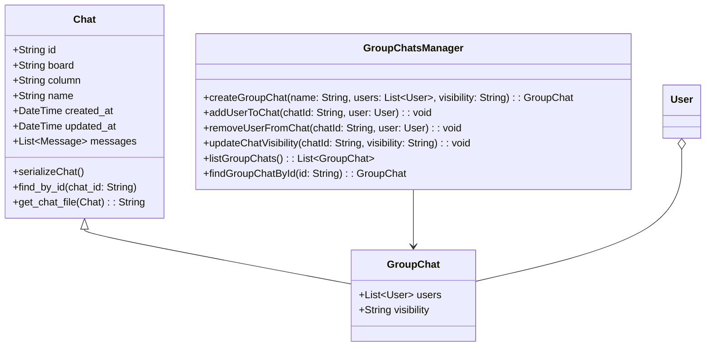
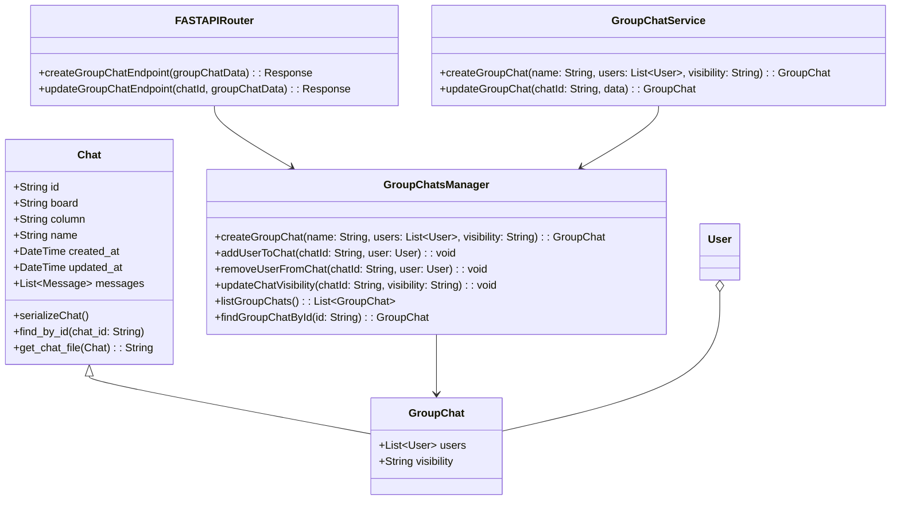

# [[{"id": "0997c63b-85d5-4a08-a860-84a352e20b95", "doc_id": null, "project_id": null, "parent_id": null, "status": "", "tags": [], "file_list": [], "profiles": ["analyst"], "name": "Channel Manager", "created_at": "2025-04-16 07:26:34.781262", "updated_at": "2025-04-16T14:05:50.207859", "mode": "task", "kanban_id": "", "column_id": "", "board": "Channels", "column": "Backlog", "chat_index": 0, "live_url": "", "branch": "", "file_path": "/home/codx-junior/codx-junior/api/.codx/tasks/Channels/Backlog/Channel Manager.0997c63b-85d5-4a08-a860-84a352e20b95.md", "model": ""}]]
## [[{"doc_id": "98f92be4-2a02-49de-8d30-152446d1e4f6", "role": "user", "task_item": "", "hide": true, "improvement": false, "created_at": "2025-04-16 07:26:34.779869", "updated_at": "2025-04-16T13:56:25.095Z", "images": [], "files": [], "meta_data": {}, "profiles": []}]]
We need a GroupChats manager for teams
A GroupChat will extend Chat and add users list and visibility (public, private)
We must manage a collection of GroupChat as they were slack channels where multiple users can chat and sahre information
## [[{"doc_id": "97099113-ac72-4467-8c56-82a513629aa0", "role": "assistant", "task_item": "analysis", "hide": true, "improvement": false, "created_at": "2025-04-16 07:26:34.779869", "updated_at": "2025-04-16 07:26:34.779903", "images": [], "files": ["/codx/junior/chat_manager.py"], "meta_data": {"time_taken": 24.71785020828247, "first_chunk_time_taken": 7.392829895019531, "model": "gpt-4o"}, "profiles": ["analyst"]}]]
### GroupChats Manager Architecture for `codx-api`

#### Overview

The `GroupChats` manager is an extension to the existing chat functionality within the `codx-api`. It aims to manage group chats, akin to channels in Slack, enhancing collaboration among team members. Each `GroupChat` will manage a collection of user messages, track visibility, and maintain a list of participants. The `GroupChat` enhances the current `Chat` class by introducing additional fields and functionality.

#### Key Components

1. **GroupChat Class**:
   - Extends the existing `Chat` class.
   - Adds a `users` list to maintain participants.
   - Adds a `visibility` attribute with options `public` or `private`.

2. **GroupChats Manager**:
   - Responsible for creating, updating, and managing `GroupChat` instances.
   - Provides APIs to add/remove users, change visibility, and manage chat messages.

#### High-Level Design

Below is a high-level architecture diagram illustrating interaction within the `GroupChats` module:



#### Process for Managing Group Chats

1. **Create GroupChat**:
   - Initialize a `GroupChat` instance extending the `Chat` functionality.
   - Assign a unique identifier, initial list of users, and set visibility.

2. **Manage Users in GroupChat**:
   - Functionality for adding and removing users from a specific chat.
   - Ensure user list is updated and notifications are sent where applicable.

3. **Change Visibility**:
   - Ability to toggle a `GroupChat` between `public` and `private`.
   - Implement visibility constraints, ensuring only authorized users can make changes.

4. **Message Management**:
   - Use existing message functionalities from `Chat`.
   - Maintain message integrity across users, ensuring synchronization.

5. **Listing and Finding GroupChats**:
   - Provide methods to list all available `GroupChat` instances.
   - Search and retrieve specific `GroupChat` details using identifiers.

#### Task Example

```md
### Objective
- Develop the GroupChat module based on the existing Chat class.
- Implement user management and visibility functions.

### Requirements
- Enable creation of group chats with initial users and visibility flags.
- Support dynamic user addition and removal from group chats.

### Acceptance Criteria
- A GroupChat can be created with a list of users and a visibility flag.
- Users can be successfully added and removed from chats.
- Visibility of a group chat can be toggled between public and private.

### Definition of Done
Task will be considered done once all list entries are checked
 * [] GroupChat class extending Chat is created
 * [] Users can be added and removed in GroupChat
 * [] Visibility toggle feature is implemented
 * [] GroupChats can be listed and retrieved
 * [] Test cases covering all functionalities are passed
```
## [[{"doc_id": "45c9fd59-20ae-42a6-bc2b-2532c8080302", "role": "user", "task_item": "", "hide": true, "improvement": false, "created_at": "2025-04-16 07:26:34.779869", "updated_at": "2025-04-16 07:26:34.779903", "images": [], "files": [], "meta_data": {}, "profiles": []}]]
For the group_chats we need:
 * FASTAPI router for endpoints: create, update
 * service for managing the logic
 * data model 


## [[{"doc_id": "c15391b3-579d-414c-b3a9-5923722a10b9", "role": "assistant", "task_item": "analysis", "hide": false, "improvement": false, "created_at": "2025-04-16 07:26:34.779869", "updated_at": "2025-04-16T14:05:49.885Z", "images": [], "files": [], "meta_data": {"time_taken": 17.98902916908264, "first_chunk_time_taken": 8.098212957382202, "model": "gpt-4o"}, "profiles": []}]]
### GroupChats Manager Architecture for `codx-api`

#### Overview

The `GroupChats` manager is an extension to the existing chat functionality within the `codx-api`. It aims to manage group chats, akin to channels in Slack, enhancing collaboration among team members. Each `GroupChat` will manage a collection of user messages, track visibility, and maintain a list of participants. The `GroupChat` enhances the current `Chat` class by introducing additional fields and functionality.

#### Key Components

1. **GroupChat Class**:
- Extends the existing `Chat` class.
- Adds a `users` list to maintain participants.
- Adds a `visibility` attribute with options `public` or `private`.

2. **GroupChats Manager**:
- Responsible for creating, updating, and managing `GroupChat` instances.
- Provides APIs to add/remove users, change visibility, and manage chat messages.

3. **FASTAPI Router**:
- Exposes endpoints to create and update group chats.
- Provides a RESTful interface for interacting with group chats.

4. **Service Layer**:
- Implements the business logic for handling group chat operations.
- Manages data persistence and retrieval.

5. **Data Model**:
- Defines the structure of the `GroupChat` entity.
- Ensures data consistency and integrity.

#### High-Level Design

Below is a high-level architecture diagram illustrating interaction within the `GroupChats` module:



#### Process for Managing Group Chats

1. **Create GroupChat**:
- Initialize a `GroupChat` instance extending the `Chat` functionality.
- Assign a unique identifier, initial list of users, and set visibility.

2. **Manage Users in GroupChat**:
- Functionality for adding and removing users from a specific chat.
- Ensure user list is updated and notifications are sent where applicable.

3. **Change Visibility**:
- Ability to toggle a `GroupChat` between `public` and `private`.
- Implement visibility constraints, ensuring only authorized users can make changes.

4. **Message Management**:
- Use existing message functionalities from `Chat`.
- Maintain message integrity across users, ensuring synchronization.

5. **Listing and Finding GroupChats**:
- Provide methods to list all available `GroupChat` instances.
- Search and retrieve specific `GroupChat` details using identifiers.

6. **FASTAPI Endpoints**:
- Create group chat through a POST request.
- Update group chat details with a PUT/PATCH request.
- Ensure endpoints are secured and validated.

### Objective
- Develop the GroupChat module based on the existing Chat class.
- Implement user management and visibility functions.

### Requirements
- Enable creation of group chats with initial users and visibility flags.
- Support dynamic user addition and removal from group chats.

### Acceptance Criteria
- A GroupChat can be created with a list of users and a visibility flag.
- Users can be successfully added and removed from chats.
- Visibility of a group chat can be toggled between public and private.

### Definition of Done
Task will be considered done once all list entries are checked
* [] GroupChat class extending Chat is created
* [] Users can be added and removed in GroupChat
* [] Visibility toggle feature is implemented
* [] GroupChats can be listed and retrieved
* [] FASTAPI endpoints for creation and update are implemented
* [] Test cases covering all functionalities are passed

