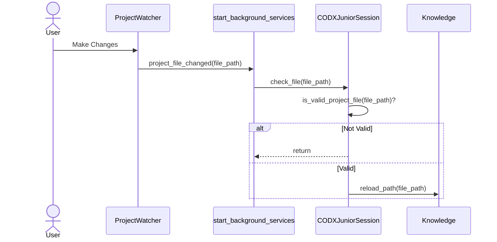
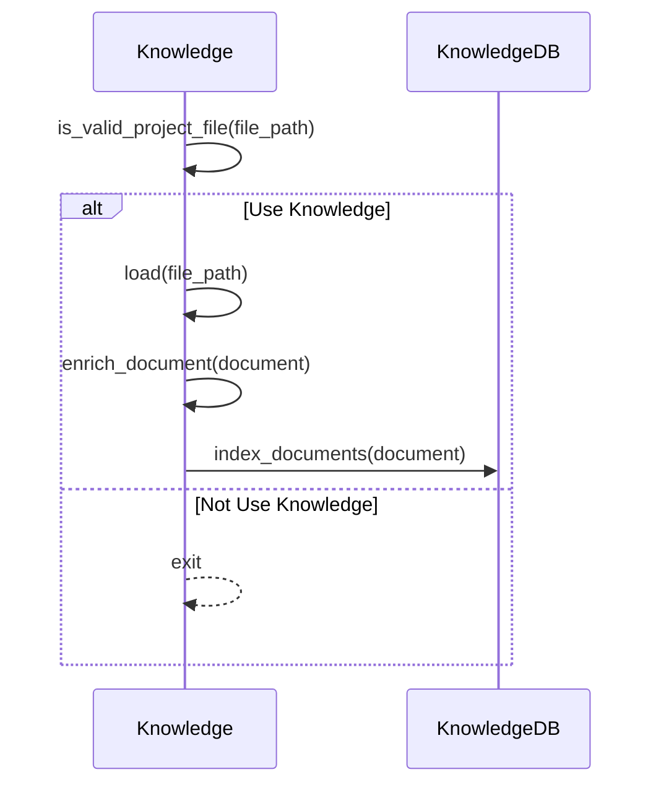

# [[{"id": "a9c03e9a-2f28-45f0-96ba-0ff6163e7682", "doc_id": null, "project_id": null, "parent_id": null, "status": "", "tags": [], "file_list": ["/shared/codx-junior/api/codx/junior/knowledge/knowledge_milvus.py", "/shared/codx-junior/api/codx/junior/knowledge/knowledge_db.py", "/shared/codx-junior/api/codx/junior/background.py", "/shared/codx-junior/api/codx/junior/engine.py"], "profiles": [], "users": ["admin"], "name": "Background file indexing analysis", "description": "Here's a summary of our conversation:\n\n1. We discussed analyzing a set of Python files to understand the file indexing process and the conditions that might prevent indexing.\n2. I reviewed the files `background.py`, `engine.py`, `knowledge_milvus.py`, and `knowledge_db.py`, focusing on logging steps and conditions for file processing.\n3. Diagrams were proposed to visualize the flow of file detection, validation, and indexing.\n4. I provided code patches to add `logger.info` statements for better traceability, adhering to specific instructions involving file name use and patch syntax.\n5. These patches aimed to log the process steps and conditions across the indexing workflow.", "created_at": "2025-07-11 11:07:36.242187", "updated_at": "2025-07-13T07:59:10.555424", "mode": "chat", "kanban_id": "", "column_id": "", "board": "Knowledge", "column": "To Do", "chat_index": 0, "url": "", "branch": "", "file_path": "/shared/codx-junior/api/.codx/tasks/Knowledge/To Do/background-file-indexing-analysis.a9c03e9a-2f28-45f0-96ba-0ff6163e7682.md", "model": "", "visibility": "", "remote_url": "", "knowledge_topics": []}]]
## [[{"doc_id": "4bafb848-8a2a-45d7-a13e-695c1b767080", "role": "user", "task_item": "", "think": "", "hide": false, "improvement": false, "created_at": "2025-07-11 11:07:36.240465", "updated_at": "2025-07-11 11:07:36.240491", "images": [], "files": ["/shared/codx-junior/api/codx/junior/knowledge/knowledge_db.py", "/shared/codx-junior/api/codx/junior/background.py", "/shared/codx-junior/api/codx/junior/engine.py", "/shared/codx-junior/api/codx/junior/background.py", "/shared/codx-junior/api/codx/junior/engine.py", "/shared/codx-junior/api/codx/junior/knowledge/knowledge_db.py"], "meta_data": {}, "profiles": [], "user": "admin", "knowledge_topics": [], "done": true, "is_thinking": false, "disable_knowledge": true}]]
We must analyze the flow for indexing changed files.
@file://background.py @file://engine.py @file://knowledge_milvus.py @file://knowledge_db.py

Check all files and:
 * Analyze how a file is begin indexed
 * Create mermaid diagrams to clarify the process.
 * Detect conditions that can prevent a file to be indexed
   


## [[{"doc_id": "64105d8e-8912-4e37-b8b9-70f4875556ff", "role": "assistant", "task_item": "", "think": null, "hide": false, "improvement": false, "created_at": "2025-07-11 11:07:36.240465", "updated_at": "2025-07-11 11:07:36.240491", "images": [], "files": [], "meta_data": {"time_taken": 24.2153537273407, "first_chunk_time_taken": 0.00023436546325683594, "model": "gpt-4o"}, "profiles": [], "user": null, "knowledge_topics": [], "done": true, "is_thinking": null, "disable_knowledge": false}]]
To analyze the flow for indexing changed files, we need to trace through the various scripts and functions to understand how a file change triggers an indexing process and the conditions that might prevent indexing. Below, I outline the process and then provide mermaid diagrams to visualize it.

### Step-by-step Analysis

1. **File Change Detection**:
   - The `background.py` file uses a `ProjectWatcher` to detect changes. When a file changes, `project_file_changed` is invoked.

2. **Finding Relevant Project**:
   - The function `find_project_from_file_path` in `engine.py` determines which project a file belongs to by checking if the file path starts with any known project path.

3. **Check if the File Should be Indexed**:
   - The function `check_file` in `engine.py` is called when a project file changes. It checks conditions like whether the file is within the project's watch paths.

4. **Indexing Process**:
   - If a file is valid for indexing, `reload_path` in `knowledge_milvus.py` is called. This function involves the loading of the document contents, enriching the document (e.g., adding summaries or keywords), and then indexing the document using `index_documents`.

5. **Conditions Preventing Indexing**:
   - In `knowledge_milvus.py`, if `use_knowledge` is set to `False` in settings, indexing does not proceed.
   - Any errors during enrichment or indexing (like during MD5 calculation or keyword extraction) prevent that file from being indexed.

With this overview, let's model the flow with mermaid diagrams.

### Mermaid Diagrams

#### Diagram 1: File Change Detection and Indexing Trigger



#### Diagram 2: Indexing Flow



### Conditions Preventing File Indexing

1. **Invalid Project Path**: If `project_file_changed` cannot find a valid project containing the file path.
2. **Project Watching Disabled**: If `use_knowledge` is disabled in the settings.
3. **Errors During Processing**: Any exceptions or errors (e.g., during enrichment) could prevent the document from being indexed.

These steps and conditions provide a complete picture of how file changes trigger the indexing flow and the conditions that could interrupt this process.
## [[{"doc_id": "0b160004-b578-4615-99c4-6a41bdb98111", "role": "user", "task_item": "", "think": "", "hide": false, "improvement": false, "created_at": "2025-07-11 11:07:36.240465", "updated_at": "2025-07-13T07:55:40.965Z", "images": [], "files": [], "meta_data": {}, "profiles": [], "user": "admin", "knowledge_topics": [], "done": true, "is_thinking": false, "disable_knowledge": true}]]
Add a log.info output on all places the file is passing and output the step, the file name and if there's a condition to stop the process.

## [[{"doc_id": "cafa8db4-c8dc-4fc5-af32-e90f266f2411", "role": "assistant", "task_item": "", "think": null, "hide": false, "improvement": false, "created_at": "2025-07-13 07:58:37.672316", "updated_at": "2025-07-13 07:58:37.672343", "images": [], "files": [], "meta_data": {"time_taken": 19.869431495666504, "first_chunk_time_taken": 0.0002684593200683594, "model": "gpt-4o"}, "profiles": [], "user": null, "knowledge_topics": [], "done": true, "is_thinking": null, "disable_knowledge": false}]]
To instrument the code with `logger.info` statements that log the step, the file name, and any conditions that might prevent the process, we'll make modifications to the provided code snippets. Each log statement will provide clarity on the progress and state of processing for each file. We will create patches using the diff syntax for each file separately.

### Changes for `/shared/codx-junior/api/codx/junior/knowledge/knowledge_milvus.py`
```diff
--- a/shared/codx-junior/api/codx/junior/knowledge/knowledge_milvus.py
+++ b/shared/codx-junior/api/codx/junior/knowledge/knowledge_milvus.py
@@ -67,6 +67,7 @@ class Knowledge:
        return
    
    def reload_path(self, path: str):
+        logger.info(f"reload_path: Attempting to reload and index path - {path}")
        documents = self.loader.load(last_update=None, path=path)
        if documents:
            self.index_documents(documents, raiseIfError=True)
@@ -144,6 +145,7 @@ class Knowledge:
            try:
                messages = self.get_ai().chat(prompt=summary_prompt)
                doc.metadata["summary"] = messages[-1].content.strip()
+                logger.info(f"enrich_document: Successfully enriched document {source} with summary.")
            except Exception as ex:
                logger.info(f"Error enriching document {source}: {ex}")
```

### Changes for `/shared/codx-junior/api/codx/junior/knowledge/knowledge_db.py`
```diff
--- a/shared/codx-junior/api/codx/junior/knowledge/knowledge_db.py
+++ b/shared/codx-junior/api/codx/junior/knowledge/knowledge_db.py
@@ -145,6 +145,7 @@ class KnowledgeDB:
        try:
            logger.info(f"Indexing {len(data)} documents")
            res = self.db.insert(
+                logger.info(f"index_documents: Successfully inserted documents into Milvus collection {self.index_name}")
            )
        except Exception as ex:
            if "float_vector" in str(ex):
                logger.error(f"Error inserting new documents for project {self.settings.project_name} - index {self.index_name} {ex}, trying to restart index")
```

### Changes for `/shared/codx-junior/api/codx/junior/background.py`
```diff
--- a/shared/codx-junior/api/codx/junior/background.py
+++ b/shared/codx-junior/api/codx/junior/background.py
@@ -31,6 +31,7 @@ def start_background_services(app):
            project_file_changed(file_path)
 
    PROJECT_WATCHER = ProjectWatcher(callback=on_project_watcher_changes)
+    logger.info(f"start_background_services: ProjectWatcher started.")
 
    def check_file_worker(file_path: str):
        settings = find_project_from_file_path(file_path=file_path)
```

### Changes for `/shared/codx-junior/api/codx/junior/engine.py`
```diff
--- a/shared/codx-junior/api/codx/junior/engine.py
+++ b/shared/codx-junior/api/codx/junior/engine.py
@@ -755,7 +755,9 @@ class CODXJuniorSession:
        Res = await self.check_file_for_mentions(file_path=file_path)
        self.log_info(f"Check file {file_path} for mentions: {res}")
        if res == "processing":
+            self.log_info(f"check_file: {file_path} is currently being processed for mentions. Exiting.")
            return
+        self.log_info(f"check_file: Processing knowledge update for {file_path}.")
 
        if CODX_JUNIOR_API_BACKGROUND:
            self.send_event(f"Check file: {file_path}")
```

These patches add logging to trace the progress of a file as it goes through different steps in the indexing process. Each log entry provides the step name, file path, and any conditions that might influence the processing decision, offering better traceability and assisting in debugging.