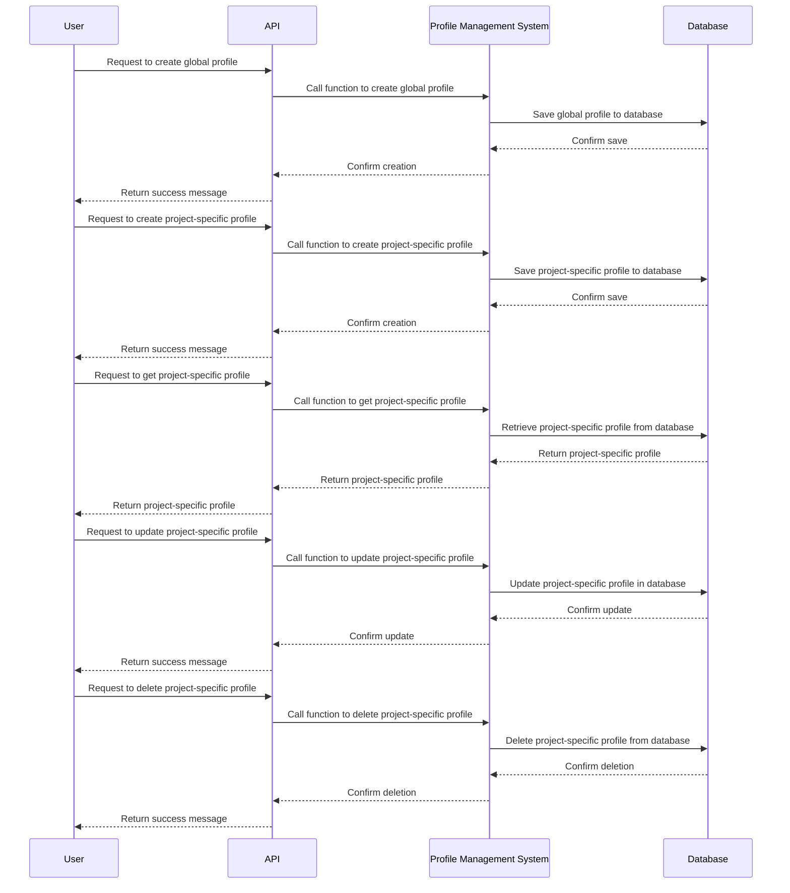
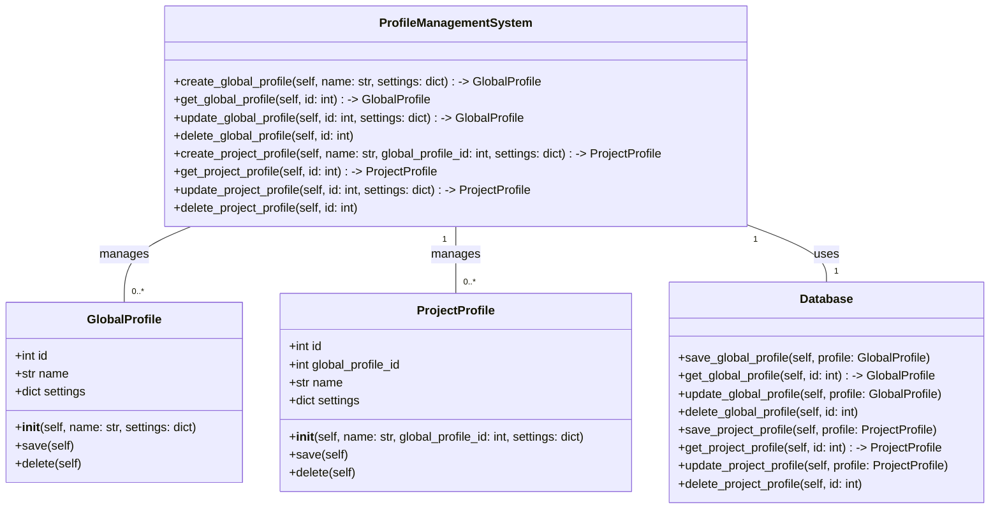

# [[{"id": "c9633b35-8761-4a6b-ae8d-6a6b85078dfc", "doc_id": null, "project_id": null, "parent_id": null, "status": "", "tags": [], "file_list": [], "profiles": ["analyst"], "users": [], "name": "Global Profiles", "created_at": "2025-05-17 16:38:20.714857", "updated_at": "2025-05-18T08:26:37.451214", "mode": "chat", "kanban_id": "", "column_id": "", "board": "Profiles", "column": "Profiles", "chat_index": 0, "url": "", "branch": "", "file_path": "/home/codx-junior/codx-junior/api/.codx/tasks/Profiles/Profiles/global-profiles.c9633b35-8761-4a6b-ae8d-6a6b85078dfc.md", "model": "", "visibility": ""}]]
## [[{"doc_id": "3951dcf8-3f73-457e-aaf1-a6001a0bbf8c", "role": "user", "task_item": "", "hide": false, "improvement": false, "created_at": "2025-05-17 16:38:20.713199", "updated_at": "2025-05-17 16:38:20.713239", "images": [], "files": [], "meta_data": {}, "profiles": [], "user": "admin"}]]
Nowadays profiles are defined for each project, we must allow to have "global" profiles that can be used on any project, and override in the project.
## [[{"doc_id": "e452fb4c-5c6c-477b-98ed-7cd40289bd3b", "role": "assistant", "task_item": "", "hide": false, "improvement": false, "created_at": "2025-05-18 08:25:28.543728", "updated_at": "2025-05-18 08:25:28.543767", "images": [], "files": ["/codx/junior/engine.py", "/codx/junior/app.py", "/codx/junior/knowledge/knowledge_db.py"], "meta_data": {"time_taken": 53.83984398841858, "first_chunk_time_taken": 50.789668560028076, "model": "openai/mercury-coder-small"}, "profiles": ["analyst"], "user": null}]]
### Software Architect Profile Definition for `codx-api`

#### Profile Overview
The Software Architect (SA) is responsible for designing the architectural blueprint of the `codx-api` project. This includes structuring the project into distinct modules and functionalities that align with the overall business goals and technical requirements. The SA ensures that the architecture supports scalability, maintainability, and performance.

#### Key Responsibilities
1. **Architectural Design**: Define the architecture of the `codx-api` project, ensuring the separation of concerns between the API, services, and data models.

2. **Module Definition**: Break down user requirements into logical modules or components. Each module should have a clear responsibility and interface with other modules harmoniously.

3. **Functional Partitioning**: Identify functionalities within each module, detailing how they align with user requirements and project goals.

4. **Cross-Module Communication**: Design and define the communication protocols between modules, whether through RESTful APIs, message queues, or other methods, depending on the architecture style adopted (e.g., microservices, monolithic).

5. **Technology Selection**: Make informed decisions about technology stacks and tools that best fit the project requirements, factoring in constraints such as scalability, team expertise, and budget.

6. **Performance and Scalability**: Design architecture that can scale with increased loads and ensure performance optimization strategies are incorporated from the start.

7. **Security and Compliance**: Ensure that architecture follows best practices for security, includes authentication, authorization, and data protection principles, and complies with relevant regulations.

8. **Documentation**: Maintain high-level architectural documentation to guide both current development and future project scaling.

9. **Task Generation and Delegation**: Provide detailed task descriptions for software developers, specifying what needs to be implemented for each module and functionality in the project.

10. **Continuous Improvement**: Regularly review system architecture to identify opportunities for improvement and refactoring for increased efficiency and maintainability.

#### Process for Handling User Requests & Generating Tasks
1. **Requirement Analysis**:
   - Gather and clarify user requirements.
   - Use domain-driven design principles to understand the core domain and subdomains relevant to the project.

2. **High-Level Design**:
   - Draft an initial high-level architecture diagram that outlines the entire system layout, showing the interaction between various modules and components.
   - Define the boundaries of each module (e.g., API, services, data models).

3. **Module & Functionality Breakdown**:
   - Split each user request into one or more functional modules.
   - Within each module, identify specific functionalities that need to be implemented.

4. **Task Generation for Developers**:
   - Create a set of tasks for each module and functionality. Each task should have:
     - **Objective**: The main goal of what needs to be achieved.
     - **Requirements**: Conditions or criteria required for the task.
     - **Acceptance Criteria**: Conditions under which the task will be considered successfully completed.
     - **Definition of Done**: A checklist that needs to be satisfied for a task to be marked as complete.
     - Use diagrams like class diagrams or sequence diagrams to illustrate complex interactions when necessary.

5. **Feedback & Iteration**:
   - Work iteratively, allowing for feedback from stakeholders and the development team to refine requirements and architecture continuously.
   - Adjust the architecture to improve the design based on feedback and project evolution.

### Task Generation for Implementing Global Profiles

#### Objective
To implement global profiles that can be used across multiple projects and can be overridden by project-specific profiles.

#### Requirements
1. **Profile Management System**: Develop a system to manage global and project-specific profiles.
2. **Profile Inheritance**: Ensure that project-specific profiles can inherit settings from global profiles.
3. **Override Mechanism**: Allow project-specific profiles to override global profile settings.
4. **API Endpoints**: Create API endpoints to manage global and project-specific profiles.
5. **Database Schema**: Update the database schema to support global and project-specific profiles.

#### Acceptance Criteria
1. **Global Profile Creation**: Users can create and manage global profiles.
2. **Project-Specific Profile Creation**: Users can create and manage project-specific profiles.
3. **Inheritance and Override**: Project-specific profiles inherit settings from global profiles but can override them.
4. **API Endpoints**: API endpoints for creating, reading, updating, and deleting global and project-specific profiles work correctly.
5. **Database Integrity**: The database schema supports global and project-specific profiles without conflicts.

#### Definition of Done
1. **Code Implementation**: All required code changes are implemented and tested.
2. **API Documentation**: API documentation is updated to reflect new endpoints and usage.
3. **Testing**: Unit tests and integration tests are written and passed.
4. **Deployment**: The changes are deployed to the production environment.
5. **User Feedback**: Feedback from users is collected and addressed.

### Detailed Tasks

1. **Update Database Schema**
   - **Objective**: Add tables for global and project-specific profiles.
   - **Requirements**:
     - Create a `global_profiles` table.
     - Create a `project_profiles` table with a foreign key to `global_profiles`.
   - **Acceptance Criteria**:
     - The `global_profiles` table exists and has the necessary fields.
     - The `project_profiles` table exists and has the necessary fields, including a foreign key to `global_profiles`.
   - **Definition of Done**:
     - Database migration scripts are created and executed.
     - The database schema is verified.

2. **Develop Profile Management System**
   - **Objective**: Implement the logic for managing global and project-specific profiles.
   - **Requirements**:
     - Implement functions to create, read, update, and delete global profiles.
     - Implement functions to create, read, update, and delete project-specific profiles.
     - Implement inheritance and override logic.
   - **Acceptance Criteria**:
     - Functions for managing global profiles work correctly.
     - Functions for managing project-specific profiles work correctly.
     - Inheritance and override logic is implemented and tested.
   - **Definition of Done**:
     - Code for profile management is implemented and tested.
     - Unit tests for profile management are written and passed.

3. **Create API Endpoints**
   - **Objective**: Develop API endpoints for managing global and project-specific profiles.
   - **Requirements**:
     - Create endpoints for creating, reading, updating, and deleting global profiles.
     - Create endpoints for creating, reading, updating, and deleting project-specific profiles.
   - **Acceptance Criteria**:
     - API endpoints for global profiles work correctly.
     - API endpoints for project-specific profiles work correctly.
   - **Definition of Done**:
     - API endpoints are implemented and tested.
     - Integration tests for API endpoints are written and passed.

4. **Update Documentation**
   - **Objective**: Update API documentation to reflect new endpoints and usage.
   - **Requirements**:
     - Add documentation for new API endpoints.
     - Update existing documentation to reflect changes in profile management.
   - **Acceptance Criteria**:
     - Documentation is clear and accurate.
   - **Definition of Done**:
     - Documentation is updated and reviewed.

5. **Testing and Deployment**
   - **Objective**: Test and deploy the changes.
   - **Requirements**:
     - Write unit tests and integration tests.
     - Deploy the changes to the production environment.
   - **Acceptance Criteria**:
     - All tests pass.
     - Changes are deployed without issues.
   - **Definition of Done**:
     - Tests are written and passed.
     - Changes are deployed and verified.

6. **User Feedback**
   - **Objective**: Collect and address user feedback.
   - **Requirements**:
     - Collect feedback from users.
     - Address any issues or suggestions.
   - **Acceptance Criteria**:
     - Feedback is collected and documented.
     - Issues are addressed.
   - **Definition of Done**:
     - Feedback is collected and reviewed.
     - Issues are resolved.

### Sequence Diagram

### Class Diagram

### Conclusion
By following the above steps and tasks, we can successfully implement global profiles that can be used across multiple projects and can be overridden by project-specific profiles. This will enhance the flexibility and scalability of the `codx-api` project.