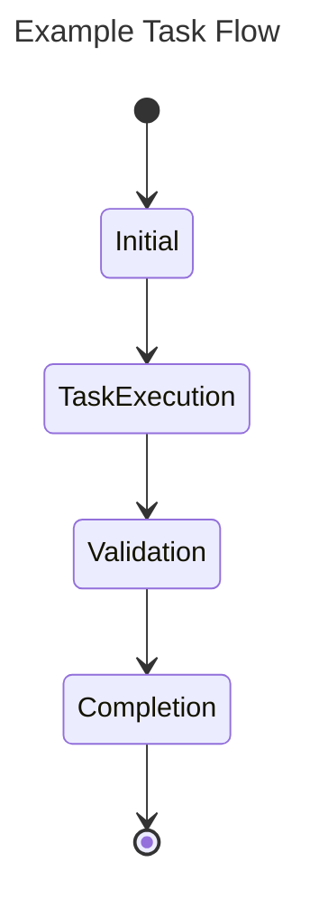

This document serves as a comprehensive guide for agents on how to effectively perform a coding task. Ensure all sections are thoroughly completed to facilitate understanding and execution.

## Task

- **Name:** Provide the name of the task.
- **Description:** Offer a concise yet comprehensive description of the task to be accomplished.

## Objectives

Clearly outline the objectives of the task. These objectives will be evaluated to confirm the task's successful completion. Ensure they are specific, measurable, and relevant to the task.

## Tests

Detail the list of tests that need to be conducted to validate the completion of the task. Each test should be described in a way that makes it easy to understand what is being tested and the expected outcome.

## Flow

Define the task flow using a mermaid diagram. This diagram should illustrate the steps the agent must follow to successfully complete the task. Ensure clarity in each step and include all necessary tools and methods available to the agent.

### Available Tools

Agents can utilize the following tools during the task:

- **search(query: str) -> List[Document]:** This function allows agents to perform a RAG (Retrieve and Generate) search within the project's knowledge base. It will return a list of documents and relevant information that agents can use to execute the task.
  
- **code(patch: str) -> bool:** This function allows agents to execute code changes. Agents must provide a file patch in the form of a diff. A boolean will be returned, indicating whether the patch was successfully applied.

### Example Task Flow

