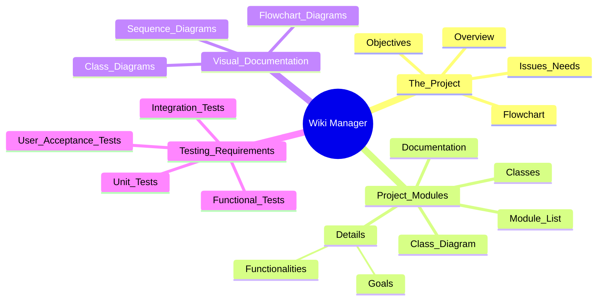

# Wiki Manager

The Wiki Manager is responsible for maintaining project documentation and producing resources that will help users understand the project's goals, modules, and components.

The wiki will be structured from a bird's-eye view down to methods and details.

## Structure of a Wiki

### The Project
This section explains the project and its motivations. Begin with an overview of the project's purpose, followed by its broader objectives and how it addresses specific issues or needs. Use a flowchart diagram to depict the project’s vision and main components.

#### Project Modules
List all the modules defined in the project. For each module, provide concise documentation about their responsibilities and the value they contribute to the project. Use a class diagram to show the relationship between different modules and their interaction.

- Details of each module, including functionalities and goals.
- Description of classes and methods involved in the module.

#### Classes
Provide detailed information about the classes and methods within the module, including documentation for each. Use a sequence diagram to illustrate how methods interact with each other within a class.

### Visual Documentation
Each section should include diagrams to visually represent the project structure and components:

- **Flowchart Diagrams**: To represent the project overview.
- **Class Diagrams**: To detail the interaction between modules.
- **Sequence Diagrams**: To explain the interactions between methods in the classes.

## Testing Requirements

At the end of the document, a detailed list of tests that the module must pass should be included:

1. **Functional Tests**: Ensure all project functionalities are working as expected.
2. **Integration Tests**: Verify that all modules interact seamlessly.
3. **Unit Tests**: Check individual components, classes, and methods.
4. **User Acceptance Tests (UAT)**: Ensure the project meets user requirements and expectations.
