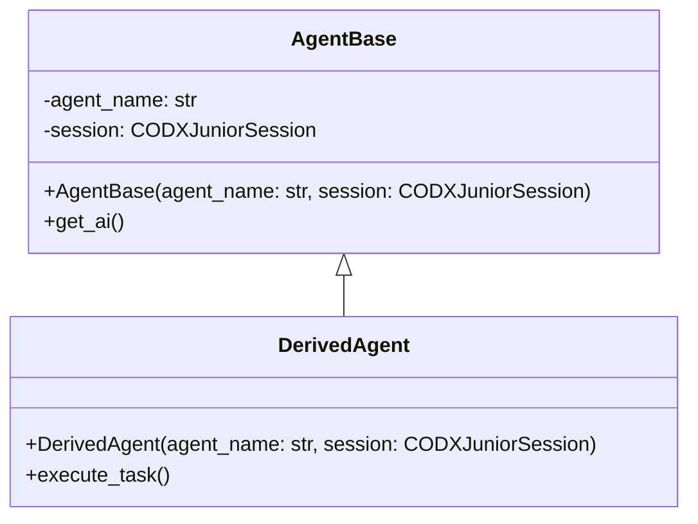

# Agents

## Overview

In the `codx-junior` project, agents serve as fundamental components responsible for various AI-driven tasks. They provide a structured way to interact with the capabilities of the AI models, offering a unified interface for handling complex operations.

## Key Components

### AgentBase Class

The `AgentBase` class is a foundational element of the `codx-junior` project, serving as the base class for all agent implementations. It defines a common interface and set of functionalities that all agents must possess.

- **Initialization**: This class requires an `agent_name` and a `CODXJuniorSession` instance at initialization. The `agent_name` aids in identifying and logging, while the session provides context management.

    ```python
    def __init__(self, agent_name: str, session: CODXJuniorSession):
        self.agent_name = agent_name
        self.session = session
        logger.info(f"Agent {self.agent_name} initialized with session: {self.session.settings.project_name}")
    ```
  
- **AI Access**: The `get_ai()` method retrieves the AI instance from the session, facilitating direct interaction with AI functionalities.

    ```python
    def get_ai(self):
        return self.session.get_ai()
    ```

- **Logging**: The class uses Python's built-in `logging` library to log significant events, such as initialization, which aids in troubleshooting and monitoring.

### UML Diagram

Here's a simplified representation of how agents are structured, highlighting the critical parts of their lifecycle and interactions:



### Extending an Agent

To extend the `AgentBase` class, create a new class inheriting from `AgentBase` and implement specific methods required for the new agent’s functionality. Ensure to customize the initialization to meet the new requirements:

```python
class CustomAgent(AgentBase):
    def __init__(self, agent_name: str, session: CODXJuniorSession):
        super().__init__(agent_name, session)
        # Additional initialization steps

    def execute_task(self):
        ai_model = self.get_ai()
        # Execute specific tasks using ai_model
```

### Practical Usage

When creating a new agent, adhere to the following steps:
1. **Inherit** from `AgentBase`.
2. **Initialize** with an appropriate agent name and session.
3. **Implement** necessary methods that leverage the `get_ai()` method. 

This approach ensures consistency across agents and simplifies the management of AI-related operations within the project.

### Accessing the Repository

For a comprehensive understanding and for contributions, visit the [codx-junior GitHub repository](https://github.com/gbrian/codx-junior.git). Here, you can explore the complete codebase, raise issues, and propose enhancements.