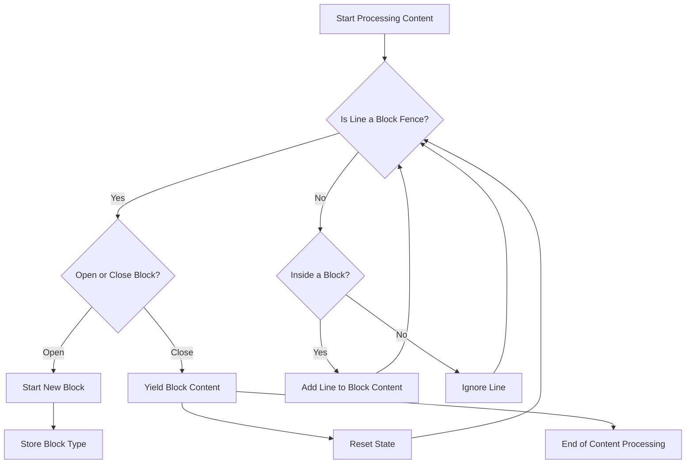

# Utilities

The `utils.py` file in the `codx-api` project plays a supportive role by providing utility functions that are used across various components of the system. These utilities streamline code operations, especially those involving document processing and function tracing.

## Overview

The `utils.py` module contains functions that facilitate the extraction of function names, transformation of documents into contextual representations, and parsing of content blocks. These functions contribute towards making the AI systems more efficient in handling documentation and logging tasks.

### Key Functions and Functionalities

- **Function Tracing**: 
  - `curr_fn()`: This function is a simple utility to obtain the name of the current function being executed. It utilizes Python's `inspect` module to trace back and fetch the function name from the call stack. This can be particularly useful for logging or debugging purposes.

- **Document Processing**: 
  - `document_to_context(doc)`: This function converts a document into a structured context format. It extracts metadata such as analysis and language, and wraps the document content for inclusion in the context string. This transformation is essential for applications that require document content in a contextual or formatted form, such as when preparing documents for display or further processing.

- **Content Block Extraction**: 
  - `extract_blocks(content)`: This function processes a chunk of content to separate it into individual blocks, based on coding-like fences (e.g., "```"). It identifies the type of block (language or descriptor) and stores the content within these blocks, yielding them for further use in the system. This can help in contexts where content is structured into multiple code or text blocks, such as documentation or script files.

### Example Usage

#### Function Tracing Example

```python
def example_usage():
    print(f"The current function is: {curr_fn()}")

example_usage()
# Output: The current function is: example_usage
```

#### Document to Context Example

```python
class MockDocument:
    def __init__(self, metadata, page_content):
        self.metadata = metadata
        self.page_content = page_content

doc = MockDocument(
    metadata={'analysis': 'Some analysis', 'language': 'python', 'source': 'source.py'},
    page_content='print("Hello, World!")'
)

context = document_to_context(doc)
print(context)
# Output:
# Some analysis
# ```python
# /absolute/path/to/source.py
# print("Hello, World!")
# ```
```

#### Content Block Extraction Example

```python
content = '''
Here is some description.
```python
def hello():
    print("Hello, World!")
```
More description here.
```json
{"key": "value"}
```
'''

blocks = list(extract_blocks(content))
for block in blocks:
    print(f"Block Type: {block['type']}")
    print(block['content'])
# Output:
# Block Type: python
# def hello():
#     print("Hello, World!")
#
# Block Type: json
# {"key": "value"}
```

### Diagram Example

Below is a mermaid diagram that illustrates how `extract_blocks` processes content into different components:



These utilities are crucial in the overall functionality and structure of the `codx-api`, optimizing tasks that are repeatable and simplifying complex processes. For further details on code usage, refer to the project's [repository](https://github.com/gbrian/codx-junior.git).