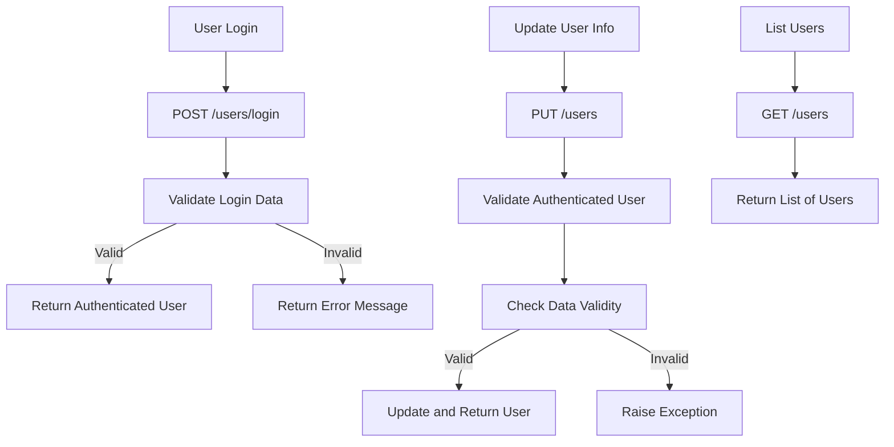

# User Management Integration

## Overview

The `codx-api` now includes user management capabilities, allowing for secure authentication and user information management. This update introduces endpoints for user login, updating user information, and listing users. These functionalities are critical for maintaining secure and personalized interactions with the `codx-api`.

## Key Endpoints

- **`POST /users/login`**
  - **Description**: Authenticates a user based on the provided login details.
  - **Returns**: The authenticated user object if the credentials are valid; otherwise, an error message.

- **`PUT /users`**
  - **Description**: Updates the authenticated user's information.
  - **Returns**: The updated user object if the operation is successful; otherwise, an error message.

- **`GET /users`**
  - **Description**: Retrieves a list of all users.
  - **Returns**: A list of user objects.

## Code Structure and Modules

- **`users.py`**
  - This module is part of the `codx.junior.api` package and handles user-related operations such as login, updating information, and listing users.
  - Core functions involve using the `UserSecurityManager` to manage user data and ensure secure authentication and updates.

### Workflow of User Management Operations

The following mermaid diagram illustrates the flow of operations for handling user management through the API:



### Example Usage

Authenticate a user with login details:
```http
POST /users/login HTTP/1.1
Host: api.example.com
Content-Type: application/json

{
  "username": "john_doe",
  "password": "secure_password123"
}
```

Update authenticated user information:
```http
PUT /users HTTP/1.1
Host: api.example.com
Content-Type: application/json

{
  "username": "john_doe",
  "email": "john@example.com",
  "full_name": "John Doe"
}
```

Retrieve a list of users:
```http
GET /users HTTP/1.1
Host: api.example.com
```

## Additional Notes

- **Logging**: The system uses Python's logging module to track user-related activities, aiding in debugging and monitoring.
- **Security**: User authentication is mandatory for sensitive operations to safeguard user data.
- **Extensibility**: The user management module can be expanded with more functionalities such as roles and permissions to enhance user access control.

For more details on the codebase and integration instructions, visit the [repository](https://github.com/gbrian/codx-junior.git).