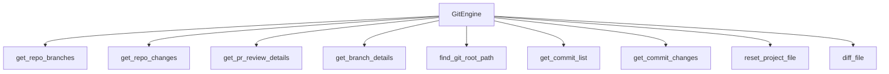

# GitEngine – Wiki Documentation

## Overview

`GitEngine` is a sub-engine of codx-junior responsible for all Git repository interactions, including branch management, diff computation, commit inspection, and pull-request (PR) review detail generation. It is initialized with a reference to a `CODXJuniorSession` and delegates configuration to `session.settings`.

---

## Architecture



---

## Initialization

```python
GitEngine(session: CODXJuniorSession)
```

The engine requires a `CODXJuniorSession` instance. Project settings are accessed via the `settings` property, which proxies `session.settings`.

---

## Internal Helpers

### `_sanitize_branch_name(branch: str) -> str`

Cleans raw branch names returned by git commands by removing common prefixes such as `* ` (current branch marker) and `+ ` (worktree marker). If a space remains after stripping, only the last token is kept. This method is called internally before any git operation that accepts a branch name.

### `_get_file_last_modification(file_path: str) -> Optional[str]`

Returns the last file-system modification time of a file as an ISO 8601 string. Relative paths are resolved against `settings.abs_project_path`. Returns `None` if the file does not exist.

### `_get_git_root_for_file(file_path: str) -> str`

Traverses parent directories of the given file to locate the nearest `.git` directory. This supports mono-repos and sub-projects. Falls back to `find_git_root_path()` if no `.git` directory is found during traversal.

---

## Public Methods

### Repository Structure

#### `find_git_root_path() -> str`

Returns the absolute path of the Git repository root. If the current project is flagged as the git root via `settings.is_git_root`, that path is returned directly. Otherwise, the method walks parent projects (via `find_project_parents`) until it finds one marked as the git root.

#### `get_repo_branches() -> list`

Returns a sorted, deduplicated list of all local and remote branch names. Both `git branch` and `git branch -r` are called; each result is sanitized via `_sanitize_branch_name`.

#### `get_project_branches() -> dict`

Returns a dictionary containing:

| Key | Description |
|---|---|
| `branches` | Result of `get_repo_branches()` |
| `repo_tree` | Full repo tree from `get_repo_tree()` |

#### `get_repo_tree() -> list`

Builds a complete repository tree by iterating over all branches and collecting their commits and changed files via `get_branch_details`. Each entry in the returned list contains `branch_name`, `author`, `date`, and a `commits` list.

#### `get_branch_details(branch_name: str) -> dict`

Uses `git log -g` to extract commit history for a branch without checking it out. Each commit entry is enriched with the list of changed files, and each file includes a `last_modification` timestamp. Returns a dict with `commits` and `parent_branch` (the hash of the oldest commit found).

#### `get_project_current_branch() -> str`

Returns the name of the currently checked-out branch via `git branch --show-current`.

#### `get_project_parent_branch() -> str`

Inspects the reflog of the current branch to determine the branch it was created from. Returns an empty string if no "Created from" entry is found in the reflog.

---

### Commit Operations

#### `get_commit_list(branch: str = None, limit: int = 50) -> list`

Returns a structured list of up to `limit` commits for the given branch (defaults to `HEAD`). Each entry contains:

| Field | Description |
|---|---|
| `commit` | Full commit hash |
| `short_commit` | First 8 characters of the hash |
| `author` | Dict with `name` and `email` |
| `date` | ISO date string |
| `message` | Commit subject |
| `label` | `{short_hash} - {message[:60]}` for display purposes |

#### `get_project_branch_commits(branch: str) -> dict`

Returns raw git log output for a branch as `{"commits": <raw_string>}`.

#### `get_branch_commits(from_branch: str, repo_path: str) -> list`

Returns a structured commit list for a branch relative to a given `repo_path`. Similar to `get_commit_list` but uses a caller-provided working directory.

#### `get_commit_changes(from_commit: str, to_commit: str) -> dict`

Returns file-level diffs and metadata between two commit hashes. The returned dictionary mirrors the shape of `get_repo_changes` and includes:

| Key | Description |
|---|---|
| `diff` | Full `git diff` output |
| `stat` | `git diff --shortstat` output |
| `git_diff_cmd` | The command used |
| `local_changes` | Always `{}` for commit comparisons |
| `repo_path` | Git root path |
| `pr_details` | Output of `get_pr_review_details_by_commits` |
| `commits` | Always `[]` (placeholder) |
| `branch_file_and_commits` | Per-file diffs and commit history |
| `compare_type` | Fixed value `"commit"` |
| `from_commit` / `to_commit` | The input commit hashes |

---

### Diff Operations

#### `diff_file(path: str, content: str, from_branch: str = None, to_branch: str = None) -> dict`

Computes a diff for a single file. Two modes are supported:

- **Branch mode** (`from_branch` and `to_branch` both provided): Runs `git diff {from_branch}..{to_branch} -- {path}` and `git diff --shortstat` for statistics.
- **Content mode** (default): Compares the current file on disk against the provided `content` string using `git diff --no-index`.

Returns a dict with `diff` and `stats` keys.

> **Note:** When using content mode, the `from_branch` and `to_branch` parameters are ignored. For branch-based file diffs, both parameters must be supplied.

#### `get_project_changes(parent_branch: str = None) -> dict`

Returns the diff between the current working tree and a reference branch. Defaults to `HEAD@{1}` if no `parent_branch` is provided. Returns `{"diff": ..., "stats": ...}`.

---

### Branch Change / PR Operations

#### `get_repo_changes(from_branch: str, to_branch: str) -> dict`

The primary method for comparing two branches. Returns a comprehensive dict including:

| Key | Description |
|---|---|
| `diff` | Full diff output |
| `stat` | Short statistics |
| `git_diff_cmd` | Command used to produce the diff |
| `local_changes` | Uncommitted local changes (if branches differ) |
| `repo_path` | Git root path |
| `pr_details` | Output of `get_pr_review_details` |
| `commits` | Always `[]` (placeholder) |
| `branch_file_and_commits` | Per-file diffs, commits, and last modification times |
| `compare_type` | Fixed value `"branch"` |

When `from_branch != to_branch`, local uncommitted changes (from `git status -s`) are also collected and merged into `branch_file_and_commits`.

#### `get_pr_review_details(from_branch: str, to_branch: str) -> list`

Fetches both branches from origin then runs `git diff --name-status` to enumerate changed files. For each file it collects:

- `file_name`
- `status`: `"new"`, `"deleted"`, or `"modified"`
- `diff`: Full patch
- `commits`: One-line commit list
- `last_modification`: ISO 8601 timestamp

Lines without a tab separator are silently skipped to prevent unpacking errors.

#### `get_pr_review_details_by_commits(from_commit: str, to_commit: str) -> list`

Same structure as `get_pr_review_details` but operates on commit hashes instead of branch names. Does not perform any `git fetch`.

---

### File Operations

#### `reset_project_file(file_path: str) -> None`

Runs `git reset {file_path}` using the Git root resolved by `_get_git_root_for_file`. Useful for unstaging a file.

#### `get_file_content_from_branch(file_path: str, branch: str) -> str`

Returns the content of a file from a specific branch using `git show "{branch}:{file_path}"` without requiring a checkout. Automatically normalizes the file path to be relative to the Git root. Returns an empty string if the file does not exist in the given branch, detected by checking for keywords like `"fatal"`, `"does not exist"`, or `"exists on disk, but not in"` in the combined stdout/stderr output.

---

## Summary of Return Shapes

| Method | Return Type | Key Fields |
|---|---|---|
| `get_repo_branches` | `list[str]` | Sorted branch names |
| `get_commit_list` | `list[dict]` | `commit`, `author`, `date`, `message`, `label` |
| `get_repo_changes` | `dict` | `diff`, `stat`, `branch_file_and_commits`, `pr_details` |
| `get_commit_changes` | `dict` | Same shape as `get_repo_changes` + `from_commit`, `to_commit` |
| `get_pr_review_details` | `list[dict]` | `file_name`, `status`, `diff`, `commits`, `last_modification` |
| `diff_file` | `dict` | `diff`, `stats` |
| `get_project_changes` | `dict` | `diff`, `stats` |
| `get_file_content_from_branch` | `str` | Raw file content |

## Dependencies
**Imports from:** codx/junior/project/project_discover.py, codx/junior/utils/utils.py, codx/junior/engine/session.py
**Imported by:** codx/junior/engine/session.py