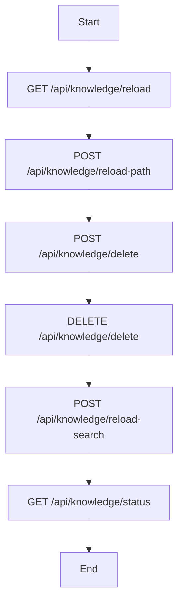
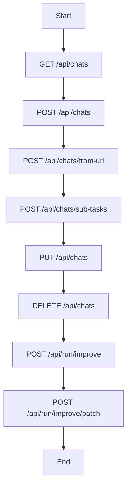
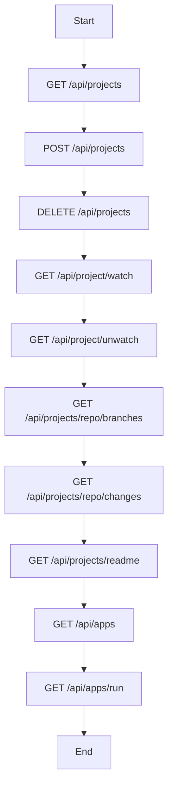
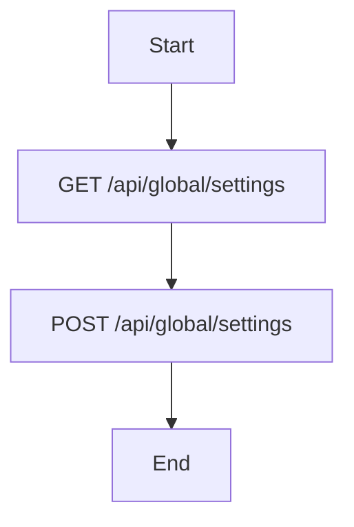
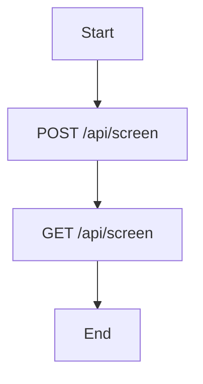
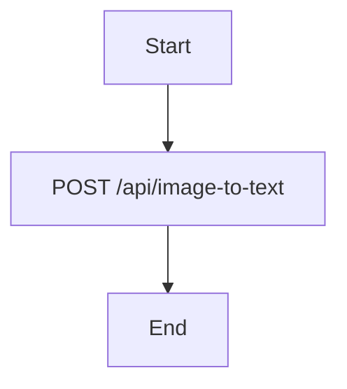
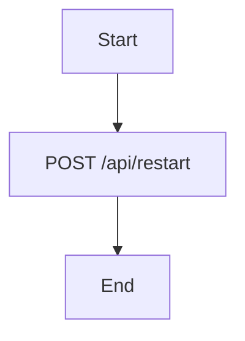

# Application

## Overview

The `codx-api` project is a FastAPI-based application designed to provide a comprehensive set of APIs for various functionalities such as knowledge management, chat management, project management, and more. The application is built with Python and leverages several libraries including Flask, SocketIO, and FastAPI to create a robust and scalable backend service.

## Key Features

1. **Knowledge Management**
   - **Reload Knowledge**: Allows reloading knowledge from specified paths.
   - **Delete Knowledge**: Provides endpoints to delete specific knowledge sources or all knowledge.
   - **Search Knowledge**: Enables searching within the knowledge base.
   - **Keyword Extraction**: Extracts keywords from documents for better organization and searchability.

2. **Chat Management**
   - **Create Chat**: Creates a new chat session.
   - **Save Chat**: Saves the chat session to the database.
   - **Delete Chat**: Deletes a chat session.
   - **Improve Code**: Improves existing code based on chat sessions.
   - **Generate Tasks**: Generates tasks from chat sessions.

3. **Project Management**
   - **List Projects**: Retrieves a list of projects associated with a user.
   - **Create Project**: Creates a new project.
   - **Delete Project**: Deletes an existing project.
   - **Watch/Unwatch Project**: Toggles watching/unwatching a project for real-time updates.
   - **Get Project Branches**: Retrieves branches of a project's repository.
   - **Get Project Changes**: Retrieves changes in the project's repository.
   - **Get Project README**: Retrieves the README file of a project.
   - **Run App**: Runs a specified application within the project.

4. **Global Settings**
   - **Read Global Settings**: Reads global settings for the application.
   - **Write Global Settings**: Writes global settings to the application.

5. **Logs Management**
   - **List Logs**: Lists available logs.
   - **Tail Log**: Retrieves the last few lines of a log file.

6. **Screen Management**
   - **Set Screen Resolution**: Sets the screen resolution.
   - **Get Screen Resolution**: Retrieves the current screen resolution.

7. **Image to Text Conversion**
   - **Convert Image to Text**: Converts an image to text using OCR technology.

8. **Restart API**
   - **Restart API**: Restarts the API server.

## API Endpoints

### Knowledge Management

- **GET /api/knowledge/reload**
  - Reloads knowledge from the default path.
- **POST /api/knowledge/reload-path**
  - Reloads knowledge from a specified path.
- **POST /api/knowledge/delete**
  - Deletes specific knowledge sources.
- **DELETE /api/knowledge/delete**
  - Deletes all knowledge.
- **POST /api/knowledge/reload-search**
  - Searches within the knowledge base.
- **GET /api/knowledge/status**
  - Checks the status of the knowledge base.

### Chat Management

- **GET /api/chats**
  - Lists all chat sessions.
- **POST /api/chats**
  - Creates a new chat session.
- **POST /api/chats/from-url**
  - Initializes a chat session from a URL.
- **POST /api/chats/sub-tasks**
  - Generates tasks from a chat session.
- **PUT /api/chats**
  - Saves a chat session.
- **DELETE /api/chats**
  - Deletes a chat session.
- **POST /api/run/improve**
  - Improves existing code based on a chat session.
- **POST /api/run/improve/patch**
  - Applies patches to improve existing code.

### Project Management

- **GET /api/projects**
  - Lists all projects associated with a user.
- **POST /api/projects**
  - Creates a new project.
- **DELETE /api/projects**
  - Deletes an existing project.
- **GET /api/project/watch**
  - Starts watching a project for real-time updates.
- **GET /api/project/unwatch**
  - Stops watching a project.
- **GET /api/projects/repo/branches**
  - Retrieves branches of a project's repository.
- **GET /api/projects/repo/changes**
  - Retrieves changes in the project's repository.
- **GET /api/projects/readme**
  - Retrieves the README file of a project.
- **GET /api/apps**
  - Lists all applications within a project.
- **GET /api/apps/run**
  - Runs a specified application within the project.

### Global Settings

- **GET /api/global/settings**
  - Reads global settings.
- **POST /api/global/settings**
  - Writes global settings.

### Logs Management

- **GET /api/logs**
  - Lists available logs.
- **GET /api/logs/{log_name}**
  - Retrieves the last few lines of a log file.

### Screen Management

- **POST /api/screen**
  - Sets the screen resolution.
- **GET /api/screen**
  - Retrieves the current screen resolution.

### Image to Text Conversion

- **POST /api/image-to-text**
  - Converts an image to text.

### Restart API

- **POST /api/restart**
  - Restarts the API server.

## Example Usage

### Reloading Knowledge

To reload knowledge from a specific path:

```http
POST /api/knowledge/reload-path
Content-Type: application/json

{
  "path": "/path/to/knowledge"
}
```

### Creating a Chat Session

To create a new chat session:

```http
POST /api/chats
Content-Type: application/json

{
  "chat_id": "12345",
  "messages": [
    {
      "text": "Hello, how are you?",
      "sender": "user"
    }
  ]
}
```

### Getting Project Branches

To get branches of a project's repository:

```http
GET /api/projects/repo/branches
```

### Running an Application

To run a specified application within a project:

```http
GET /api/apps/run?app=my_app
```

### Setting Screen Resolution

To set the screen resolution:

```http
POST /api/screen
Content-Type: application/json

{
  "resolution": "1920x1080"
}
```

### Converting an Image to Text

To convert an image to text:

```http
POST /api/image-to-text
Content-Type: multipart/form-data

file: <image_file>
```

### Restarting the API Server

To restart the API server:

```http
POST /api/restart
```

## Mermaid Diagrams

### Knowledge Management Flow



### Chat Management Flow



### Project Management Flow



### Global Settings Flow



### Logs Management Flow

```mermaid
graph TD
    A[Start] --> B[GET /api/logs]
    B --> C[GET /api/logs/{log_name}]
    C --> D[End]
```

### Screen Management Flow



### Image to Text Conversion Flow



### Restarting the API Server Flow



This documentation provides a comprehensive overview of the `codx-api` project, including its key features, API endpoints, example usage, and visual diagrams to help understand the flow of data and operations.