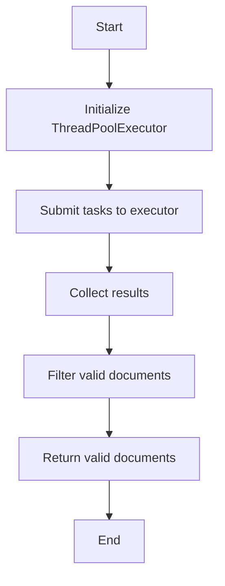
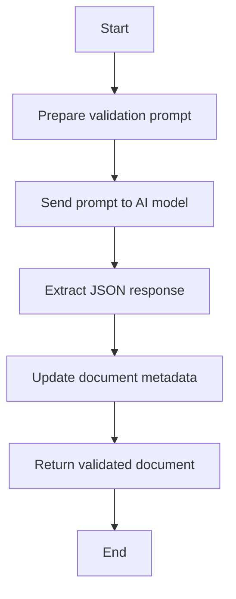

# Context

The `context.py` file in the `codx-junior` project contains several classes and functions that are crucial for handling and validating context data, particularly in the context of API interactions and document analysis. Below is a detailed breakdown of the key components:

## Classes

### AICodeValidateResponse
This class represents the response from an AI model when validating code changes. It includes:
- `new_content`: The full generated content that will overwrite the source file.

### AICodeChange
This class represents a change to be made to a file. It includes:
- `change_type`: The type of change (e.g., new, update, delete, delete_file).
- `file_path`: The path to the file.
- `existing_content`: The existing content to be changed, if applicable.
- `new_content`: The new content to be applied, if applicable.

### AICodePatch
This class represents a patch to be applied to a file. It includes:
- `file_path`: The path to the file.
- `patch`: The file patch with the changes to be applied.
- `description`: A brief human-friendly description of the change.

### AICodeGerator
This class represents a generator for code changes and patches. It includes:
- `code_changes`: A list of `AICodeChange` objects.
- `code_patches`: A list of `AICodePatch` objects.

### AIRAGDocument
This class represents a document found by the RAG (Retrieval-Augmented Generation) system. It includes:
- `file_id`: The unique identifier for the document.
- `file_path`: The path to the document file.
- `content`: The content of the document.
- `score`: The relevance score of the document (0 to 1).

### AIRAGValidate
This class represents a validation request for user requests and the documents found. It includes:
- `user_request`: The user's request.
- `documents`: A list of `AIRAGDocument` objects.

### AIDocValidateResponse
This class represents the response from an AI model when validating a document. It includes:
- `score`: The relevance score of the document (0 to 1).
- `analysis`: An explanation of why the document is relevant for the user's request.

## Functions

### parallel_validate_contexts
This function validates a list of documents using a ThreadPoolExecutor to parallelize the validation process. It includes:
- `prompt`: The user's request.
- `documents`: A list of documents to be validated.
- `settings`: The settings for the CODX Junior system.

### ai_validate_context
This function validates a single document using an AI model. It includes:
- `ai`: The AI model.
- `prompt`: The user's request.
- `doc`: The document to be validated.
- `retry_count`: The number of retries for validation.

### find_relevant_documents
This function finds relevant documents based on a query. It includes:
- `query`: The user's query.
- `settings`: The settings for the CODX Junior system.
- `ignore_documents`: A list of documents to ignore.
- `ai_validate`: A flag indicating whether to validate the documents using an AI model.

### extract_folders_from_files
This function extracts folders from a list of files. It includes:
- `files`: A list of files.

### generate_markdown_tree
This function generates a markdown tree structure from a list of files. It includes:
- `files`: A list of files.

## Usage Examples

### Example of Using `parallel_validate_contexts`
```python
from codx.junior.api.codx.junior.context import parallel_validate_contexts, CODXJuniorSettings

settings = CODXJuniorSettings(project_name="my_project", project_path="/path/to/project")
documents = [doc1, doc2, doc3]  # List of documents
prompt = "Find relevant documents for this query"

valid_documents = parallel_validate_contexts(prompt, documents, settings)
print(valid_documents)
```

### Example of Using `find_relevant_documents`
```python
from codx.junior.api.codx.junior.context import find_relevant_documents, CODXJuniorSettings

settings = CODXJuniorSettings(project_name="my_project", project_path="/path/to/project")
query = "Find relevant documents for this query"

relevant_documents, file_list = find_relevant_documents(query, settings)
print(relevant_documents)
print(file_list)
```

### Example of Using `generate_markdown_tree`
```python
from codx.junior.api.codx.junior.context import generate_markdown_tree

files = ["/path/to/file1.txt", "/path/to/file2.txt"]
markdown_tree = generate_markdown_tree(files)
print(markdown_tree)
```

## Mermaid Diagrams

### Parallel Validation Process


### Document Validation Process


These diagrams provide a visual representation of the processes involved in validating contexts and finding relevant documents.