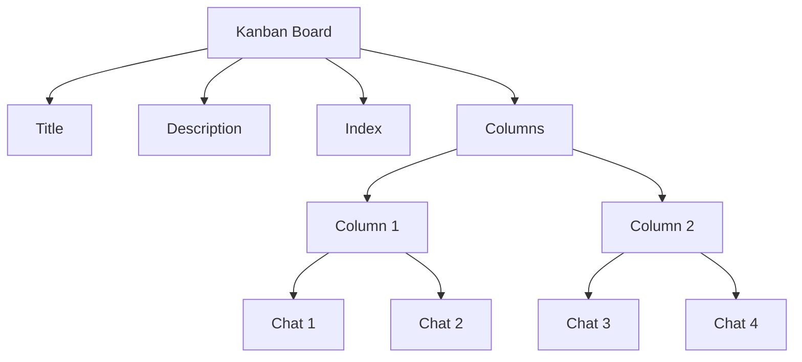
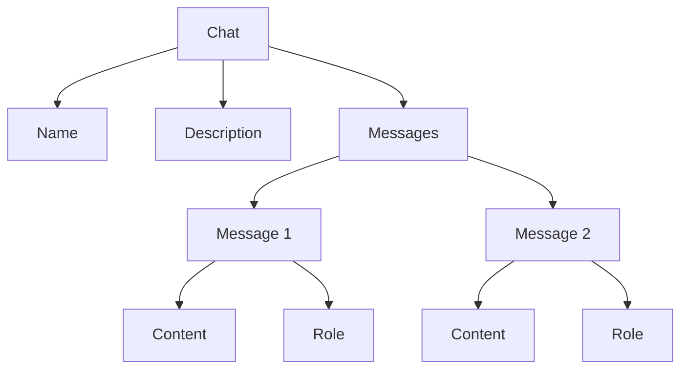

# Database

The `db.py` file in the `codx-junior` project contains the database models and the database management system (DBMS) for handling data storage and retrieval. The file defines several Pydantic models and a class `CODXJuniorDB` that manages the interaction with the database using TinyDB.

## Models

### MessageTaskItem
This enum defines the task items that can be associated with a message.

```python
class MessageTaskItem(Enum):
    SUMMARY = "summary"
```

### Message
The `Message` model represents a message in the chat system. It includes fields such as `doc_id`, `role`, `task_item`, `content`, `think`, `hide`, `improvement`, `created_at`, `updated_at`, `images`, `files`, `meta_data`, `profiles`, `user`, `knowledge_topics`, `done`, and `is_thinking`.

```python
class Message(BaseModel):
    doc_id: Optional[str] = Field(default=None)
    role: str = Field(default='')
    task_item: str = Field(default='')
    content: str = Field(default='')
    think: Optional[str] = Field(default='')
    hide: bool = Field(default=False)
    improvement: bool = Field(default=False)
    created_at: str = Field(default=str(datetime.now()))
    updated_at: str = Field(default=str(datetime.now()))
    images: List[str] = Field(default=[])
    files: List[str] = Field(default=[])
    meta_data: Optional[dict] = Field(default={})
    profiles: List[str] = Field(default=[])
    user: Optional[str] = Field(default=None)
    knowledge_topics: List[str] = Field(description="This message will be indexed for knowledge and tagged with this topics", default=[])
    done: Optional[bool] = Field(default=True, description="Indicates if user is done writing")
    is_thinking: Optional[bool] = Field(default=False)
```

### Chat
The `Chat` model represents a chat session. It includes fields such as `id`, `doc_id`, `project_id`, `parent_id`, `status`, `tags`, `file_list`, `profiles`, `users`, `name`, `description`, `messages`, `created_at`, `updated_at`, `mode`, `kanban_id`, `column_id`, `board`, `column`, `chat_index`, `url`, `branch`, `file_path`, `model`, `visibility`, and `knowledge_topics`.

```python
class Chat(BaseModel):
    id: Optional[str] = Field(default=None)
    doc_id: Optional[str] = Field(default=None)
    project_id: Optional[str] = Field(default=None, description="Defines the project which this chat belongs")
    parent_id: Optional[str] = Field(default=None, description="Parent chat")
    status: str = Field(default='')
    tags: List[str] = Field(default=[], description="Informative set of tags")
    file_list: List[str] = Field(default=[])
    profiles: List[str] = Field(default=[])
    users: List[str] = Field(default=[])
    name: str = Field(default='')
    description: str = Field(default='')
    messages: List[Message] = Field(default=[])
    created_at: str = Field(default=str(datetime.now()))
    updated_at: str = Field(default=str(datetime.now()))
    mode: str = Field(default='chat')
    kanban_id: str = Field(default='')
    column_id: str = Field(default='')
    board: str = Field(default='')
    column: str = Field(default='')
    chat_index: Optional[int] = Field(default=0)
    url: str = Field(default='')
    branch: str = Field(default='')
    file_path: str = Field(default='')
    model: Optional[str] = Field(default='')
    visibility: Optional[str] = Field(default='')
    knowledge_topics: List[str] = Field(description="This chat will be indexed for knowledge and tagged with this topics", default=[])
```

### KanbanColumn
The `KanbanColumn` model represents a column in a Kanban board. It includes fields such as `doc_id`, `title`, `color`, and `index`.

```python
class KanbanColumn(BaseModel):
    doc_id: Optional[str] = Field(default=None)
    title: str = Field(default=None)
    color: Optional[str]
    index: int = Field(default=0)
```

### Kanban
The `Kanban` model represents a Kanban board. It includes fields such as `doc_id`, `title`, `description`, `index`, `columns`, `created_at`, and `updated_at`.

```python
class Kanban(BaseModel):
    doc_id: Optional[str] = Field(default=None)
    title: str = Field(default=None)
    description: Optional[str]
    index: int = Field(default=0)
    columns: Optional[List[KanbanColumn]] = Field(default=[])
    created_at: str = Field(default=str(datetime.now()))
    updated_at: str = Field(default=str(datetime.now()))
```

## Database Management System (DBMS)

### CODXJuniorDB
The `CODXJuniorDB` class manages the interaction with the database using TinyDB. It provides methods to initialize the client, reset the database, save and retrieve Kanban boards, and save and retrieve chats.

```python
PROJECT_DATABASES = {}

class CODXJuniorDB:
    def __init__(self, settings: CODXJuniorSettings):
        self.settings = settings
        self.index_name = re.sub('[^a-zA-Z0-9\._]', '', slugify(self.settings.codx_path))
        self.db_path = f"{self.settings.codx_path}/{self.index_name}.db.json"
        self.client = PROJECT_DATABASES.get(self.settings.project_path, None)
        if not self.client:
            self.init_client()
        self.kanban_table = self.client.table('kanban', cache_size=0)
        self.column_table = self.client.table('column', cache_size=0)
        self.chat_table = self.client.table('chat', cache_size=0)

    def init_client(self):
        if self.client is None:
            logger.info(f"Connected to database: {self.settings.project_path}")
            self.client = TinyDB(self.db_path, sort_keys=True, indent=4, separators=(',', ': '))
            PROJECT_DATABASES[self.settings.project_path] = self.client
        
    def reset(self):
        logger.info(f"Reseting DB {self.settings.project_path}")
        if os.path.exists(self.db_path):
            os.remove(self.db_path)
            PROJECT_DATABASES[self.settings.project_path] = None
            self.init_client()

    def save_kanban(self, kanban: Kanban):
        """Save a kanban to the database, if kanban has not doc_id, create a new one"""
        if not kanban.doc_id:
            kanban.doc_id = str(uuid.uuid4())
            kanban.created_at = str(datetime.now())
            kanban.updated_at = str(datetime.now())
            self.kanban_table.insert(kanban.model_dump())            
        else:
            kanban.updated_at = str(datetime.now())
            self.kanban_table.update(kanban.model_dump(), where('doc_id') == kanban.doc_id)
        return self.get_kanban(kanban.doc_id)

    def get_kanban(self, kanban_id: str):
        return Kanban(**self.kanban_table.get(where('doc_id') == kanban_id))

    def get_all_kankan(self):
        return [Kanban(**kanban) for kanban in self.kanban_table.all()]

    def get_kanban_chats(self, kanban_id: str, column_id: str):
        """Load all chats from a column of a kanban"""
        return [Chat(**chat) for chat in self.chat_table.search(where('kanban_id') == kanban_id 
                                    and where('column_id') == column_id)]
    def get_chat(self, chat_id: str):
        return Chat(**self.chat_table.get(where('doc_id') == chat_id))

    def save_chat(self, chat: Chat):
        """Save a chat to the database, if chat has not doc_id, create a new one"""
        if not chat.doc_id:
            chat.doc_id = str(uuid.uuid4())
            chat.created_at = str(datetime.now())
            chat.updated_at = str(datetime.now())
            self.chat_table.insert(chat.model_dump())
        else:
            chat.updated_at = str(datetime.now())
            self.chat_table.update(chat.model_dump(), where('doc_id') == chat.doc_id)
```

## Usage Examples

### Saving a Kanban Board
To save a Kanban board, you can create an instance of the `Kanban` model and pass it to the `save_kanban` method of the `CODXJuniorDB` class.

```python
from codx.junior.db import CODXJuniorDB, Kanban

settings = CODXJuniorSettings(codx_path='/path/to/codx', project_path='/path/to/project')
db = CODXJuniorDB(settings)

kanban = Kanban(title="Project Management", description="Kanban board for project management")
saved_kanban = db.save_kanban(kanban)
print(saved_kanban)
```

### Retrieving a Kanban Board
To retrieve a Kanban board, you can use the `get_kanban` method of the `CODXJuniorDB` class.

```python
kanban_id = saved_kanban.doc_id
retrieved_kanban = db.get_kanban(kanban_id)
print(retrieved_kanban)
```

### Saving a Chat
To save a chat, you can create an instance of the `Chat` model and pass it to the `save_chat` method of the `CODXJuniorDB` class.

```python
from codx.junior.db import CODXJuniorDB, Chat

chat = Chat(name="Meeting Notes", description="Notes from the daily meeting")
saved_chat = db.save_chat(chat)
print(saved_chat)
```

### Retrieving a Chat
To retrieve a chat, you can use the `get_chat` method of the `CODXJuniorDB` class.

```python
chat_id = saved_chat.doc_id
retrieved_chat = db.get_chat(chat_id)
print(retrieved_chat)
```

## Mermaid Diagrams

### Kanban Board Structure


### Chat Structure


This documentation provides a clear overview of the database models and the database management system in the `codx-junior` project.