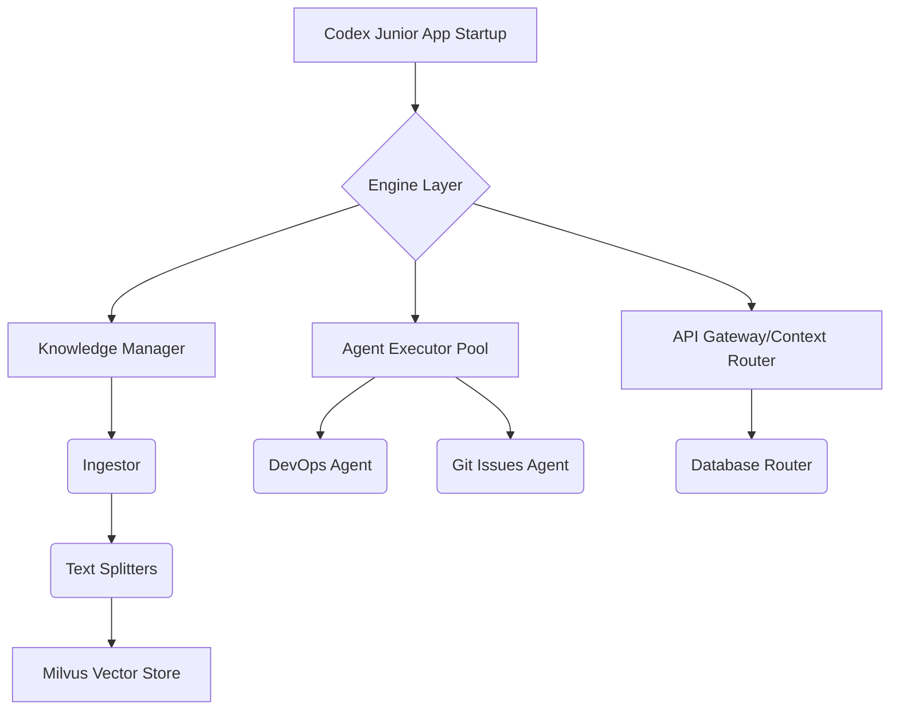

# AI Knowledge Agent Core
## Overview
This framework provides a sophisticated backend for building and managing advanced AI agents and automated workflows. It serves as the central hub responsible for orchestrating interactions between various Large Language Models, specialized domain agents (such as DevOps or Git automation), and external APIs.

The core functionality implemented within this module is highly comprehensive, including:

*   **Robust Knowledge Ingestion:** Handling and processing diverse forms of data (code, documentation, wikis) for context building.
*   **Retrieval-Augmented Generation (RAG):** Implementing advanced search and retrieval mechanisms to ground LLM responses in specific enterprise knowledge.
*   **Structured Process Execution:** Allowing agents to interact with and execute processes across various enterprise tools and APIs.

The structure supports modularity, facilitating the addition of new models, specialized tool interactions, and knowledge sources without modifying core components.

## Files in Domain

This core domain includes a wide range of files covering networking, internal logic, agent definitions, knowledge management, chatting features, and utility functions:

**/home/codx-junior-projects/codx-junior/api/README.md**
*General documentation for the API.*

**/home/codx-junior-projects/codx-junior/api/codx/junior/agents/base_agent.py**
*Defines the base structure and abstract methods for all specialized AI agents.*

**/home/codx-junior-projects/codx-junior/api/codx/junior/agents/devops_agent.py**
*Implementation for an agent specializing in DevOps tasks and workflows.*

**/home/codx-junior-projects/codx-junior/api/codx/junior/agents/git\_issues\_agent.py**
*Agent dedicated to managing project issues related to Git sources.*

**/home/codx-junior-projects/codx-junior/api/codx/junior/ai/\_\_init\__.py**
*Initialization package for the AI integration layer.*

**/home/codx-junior-projects/codx-junior/api/codx/junior/ai/ai.py**
*Core utilities and abstract interfaces for interacting with different LLMs.*

**/home/codx-junior-projects/codx-junior/api/codx/junior/ai/llmfactory.py**
*Factory pattern responsible for instantiating various Large Language Model clients.*

**/home/codx-junior-projects/codx-junior/api/codx/junior/ai/ollama.py**
*Interface implementation for connecting to and utilizing the Ollama local LLM platform.*

**/home/codx-junior-projects/codx-junior/api/codx/junior/ai/openai\_ai.py**
*API adapter for OpenAI models (e.g., GPT series).*

**/home/codx-junior-projects/codx-junior/api/codx/junior/ai/utils.py**
*General helper functions specific to AI process flow and data handling.*

**/home/codx-junior-projects/codx-junior/api/codx/junior/api/chatGPTLikeApi.py**
*Simulation or compatibility layer for APIs resembling ChatGPT's structure.*

**/home/codx-junior-projects/codx-junior/api/codx/junior/api/db\_router.py**
*Handles routing and abstraction for database interactions (e.g., SELECT, UPDATE).*

**/home/codx-junior-projects/codx-junior/api/codx/junior/api/file\_finder.py**
*Utility class for searching and locating files within the project structure.*

**/home/codx-junior-projects/codx-junior/api/codx/junior/api/github.py**
*Client wrapper for interacting with GitHub API services (pull requests, repositories).*

**/home/codx-junior-projects/codx-junior/api/codx/junior/api/global\_settings.py**
*Central configuration module for global environmental settings.*

**/home/codx-junior-projects/codx-junior/api/codx/junior/api/users.py**
*API utilities related to user management and authentication.*

**/home/codx-junior-projects/codx-junior/api/codx/junior/api/wiki.py**
*High-level API for interacting with the Wiki module.*

**/home/codx-junior-projects/codx-junior/api/codx/junior/app.py**
*The main application entry point, often handling initialization and request reception.*

**/home/codx-junior-projects/codx-junior/api/codx/junior/background.py**
*Module for managing background tasks (e.g., scheduled web scraping, periodic updates).*

**/home/codx-junior-projects/codx-junior/api/codx/junior/changes/change\_manager.py**
*Manages change detection and lifecycle of code modifications.*

**/home/codx-junior-projects/codx-junior/api/codx/junior/changes/watch\_project\_file\_changes.py**
*Mechanism for monitoring specific file changes in the project directory.*

**/home/codx-junior-projects/codx-junior/api/codx/junior/chat/chat\_engine.py**
*The core logic engine for processing conversation turns and generating responses.*

**/home/codx-junior-projects/codx-junior/api/codx/junior/chat/chat\_export.py**
*Utility to export chat history or session logs.*

**/home/codx-junior-projects/codx-junior/api/codx/junior/chat\_manager.py**
*Manages the state and context of multiple user chat sessions.*

**/home/codx-junior-projects/codx-junior/api/codx/junior/context.py**
*Handles the accumulation, management, and retrieval of session context data.*

**/home/codx-junior-projects/codx-junior/api/codx/junior/db.py**
*Database access layer and abstraction utilities (e.g., connection pooling).*

**/home/codx-junior-projects/codx-junior/api/codx/junior/engine.py**
*The central orchestration engine that directs workflow between agents, knowledge systems, and APIs.*

**/home/codx-junior-projects/codx-junior/api/codx/junior/events/event\_manager.py**
*System responsible for publishing and listening to internal domain events (Event Bus).*

*(... [Files under /file_manager/*] ...)*
**/home/codx-junior-projects/codx-junior/api/codx/junior/globals.py**
*Global constants and state storage.*

***Knowledge Management Subsystem (`/knowledge`)***
**/home/codx-junior-projects/codx-junior/api/codx/junior/knowledge/README.md**
*Documentation for the knowledge base ingestion and retrieval system.*
**(Special Prompts)**: `code_to_chunks.md`, `enrich_document.md`, etc.
**/home/codx-junior-projects/codx-junior/api/codx/junior/knowledge/knowledge\_code\_splitter.py**
*Tool for splitting large amounts of code into manageable chunks.*
**/home/codx-junior-projects/codx-junior/api/codx/junior/knowledge/knowledge\_code\_to\_dcouments.py**
*Process to convert raw codebases into structured documents for indexing.*
**/home/codx-junior-projects/codx-junior/api/codx/junior/knowledge/knowledge\_db.py**
*Handles interactions with the underlying vector database (e.g., Milvus).*
**(Storage)**: `milvus.py`
**/home/codx-junior-projects/codx-junior/api/codx/junior/knowledge/knowledge\_loader.py**
*Core utility for loading data from various sources into the knowledge system.*
**/home/codx-junior-projects/codx-junior/api/codx/junior/knowledge/knowledge\_milvus.py**
*Specific integration layer for Milvus vector database usage.*
**(Other processors)**: `knowledge_qa_splitter.py`, `knowledge_splitter.py` (General chunking and processing logic).

***Model & Profile Subsystem (`/model` and `/profiles`)***
**/home/codx-junior-projects/codx-junior/api/codx/junior/model/model.py**
*Core data model definitions for agents, sessions, and users.*
**/home/codx-junior-projects/codx-junior/api/codx/junior/model/user.py**
*Specific model definition for user profiles and identity.*

***Workflow & Project Subsystem (`/project`)***
**/home/codx-junior-projects/codx-junior/api/codx/junior/project/project\_discover.py**
*Manages the discovery of available projects or repositories.*
**/home/codx-junior-projects/codx-junior/api/codx/junior/project/project\_manager.py**
*Central logic for managing project context, scope, and interactions.*

***UI & Misc Subsystem***
*(... [Various miscellaneous utils: logger, metrics, wallet, etc.] ...)*

## Dependencies

Since this file list represents a high-level *core framework*, explicit dependencies are internal (module imports). The entire domain relies on strong foundational libraries for its functionality.

*   **AI Interaction:** Requires external LLM SDKs (e.g., OpenAI Python library) and specialized local model runners (Ollama integration).
*   **Vector Database:** Depends heavily on a modern vector storage solution, explicitly using **Milvus**.
*   **Asynchronous/Web Communication:** Relies on SIO (Socket I/O) for real-time communication and background task management.
*   **Persistence:** Requires an ORM or database connection layer to manage structured data (`db.py`).

## Used By

(None listed in the provided context.)

## Entry Points

The following files are designed as primary access points or core components that initiate domain logic, allowing external systems or the main application loop to begin processing workflows:

*   **/home/codx-junior-projects/codx-junior/api/README.md** (Documentation Gateway)
*   **/home/codx-junior-projects/codx-junior/api/codx/junior/agents/base\_agent.py** (Agent Template Use)
*   **/home/codx-junior-projects/codx-junior/api/codx/junior/agents/devops\_agent.py** (Specific Agent Access)
*   **/home/codx-junior-projects/codx-junior/api/codx/junior/agents/git\_issues\_agent.py** (Specific Agent Access)
*   **/home/codx-junior-projects/codx-junior/api/codx/junior/ai/\_\_init\__.py** (AI Core Package Entry)