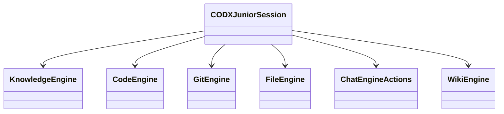

# CODXJuniorSession — Engine Session Module

## Overview

`CODXJuniorSession` is the main orchestration class for the codx-junior engine. It acts as the central coordinator that initializes, manages, and delegates to a set of specialized sub-engine modules. All high-level operations — from chat management and knowledge indexing to code generation and git operations — are accessible through this single session object.

---

## Architecture

The session follows a delegation pattern, where `CODXJuniorSession` owns instances of each sub-engine and exposes their functionality through its own public interface.

---

## Initialization

The session is created with optional parameters:

| Parameter  | Type                  | Description                                      |
|------------|-----------------------|--------------------------------------------------|
| `settings` | `CODXJuniorSettings`  | Project settings object                          |
| `codx_path`| `str`                 | Path to the `.codx` project directory            |
| `channel`  | `SessionChannel`      | Communication channel for real-time events       |
| `user`     | `CodxUser`            | The authenticated user for this session          |

If `settings` is not provided, it is loaded automatically from `{codx_path}/project.json`.

Upon initialization, the following sub-engines are instantiated:

- `KnowledgeEngine`
- `CodeEngine`
- `GitEngine`
- `FileEngine`
- `ChatEngineActions`
- `WikiEngine`

Additionally, `EventManager` and `AudioManager` are initialized for event handling and audio processing respectively.

---

## Core Session Methods

### `update_last_access_time()`
Updates the `last_access_time` on settings to the current datetime.

### `switch_project(project_id: str) → CODXJuniorSession`
Switches the current session to a different project identified by `project_id`. Returns the current session if the ID matches or is not found.

### `delete_project()`
Permanently removes the project directory using `shutil.rmtree`.

### `coder_open_file(file_name: str) → dict`
Opens a file in the code-server editor. Resolves relative paths against the project's absolute path.

### `chat_action(chat, event)` *(context manager)*
Wraps a chat operation with start/done/error event notifications via `EventManager`.

### Logging helpers
- `log_info(msg, *args)` — Logs at INFO level, prefixed with the project name.
- `log_error(msg, *args)` — Logs at ERROR level, prefixed with the project name.
- `log_exception(msg, *args)` — Logs exceptions, prefixed with the project name.

---

## Manager Factories

The session provides factory methods to create supporting manager objects:

| Method                                      | Returns           | Description                          |
|---------------------------------------------|-------------------|--------------------------------------|
| `get_mention_manager()`                     | `MentionManager`  | Manages `@mention` parsing           |
| `get_chat_manager()`                        | `ChatManager`     | Manages chat persistence             |
| `get_profile_manager(settings?)`            | `ProfileManager`  | Manages project profiles             |
| `get_ai(llm_model?)`                        | `AI`              | Returns an AI instance               |
| `get_knowledge()`                           | `Knowledge`       | Returns a Knowledge (Milvus) instance|
| `get_wiki()`                                | `WikiManager`     | Returns a wiki manager               |
| `get_browser()`                             | `Browser`         | Returns a browser utility            |
| `get_git_engine()`                          | `GitEngine`       | Returns the git sub-engine           |

---

## Chat Management

Chat operations are managed via the `ChatManager` factory.

| Method                                         | Description                                        |
|------------------------------------------------|----------------------------------------------------|
| `load_chat(board, chat_name)`                  | Load a chat by board and name                      |
| `list_chats(from_date?)`                       | List all chats, optionally filtered by date        |
| `save_chat(chat, chat_only?)`                  | Persist a chat object                              |
| `delete_chat(chat_id)`                         | Delete a chat by ID                                |
| `find_chat(chat_id, owner_project_id)`         | Find a chat, switching projects if needed          |

---

## Profile Management

Profiles define reusable AI configurations at the project level.

| Method                              | Description                              |
|-------------------------------------|------------------------------------------|
| `list_profiles()`                   | List all available profiles              |
| `save_profile(profile)`             | Persist a profile                        |
| `read_profile(profile_name)`        | Read a specific profile by name          |
| `delete_profile(profile_name)`      | Delete a profile by name                 |
| `get_project_profile()`             | Return the reserved `"project"` profile  |
| `watch_project(watching)`           | Enable/disable project file watching     |

---

## Mention Utilities

Methods for parsing and resolving `@mention` references in query strings:

| Method                                    | Description                                      |
|-------------------------------------------|--------------------------------------------------|
| `extract_query_mentions(query)`           | Extract raw mention strings from a query         |
| `find_projects_by_mentions(mentions)`     | Resolve mentions to project objects              |
| `find_profiles_by_mentions(mentions)`     | Resolve mentions to profile objects              |
| `get_query_mentions(query)`               | Get all mentions from a query string             |

---

## Knowledge Operations

All knowledge operations are delegated to `KnowledgeEngine`.

| Method                                                                   | Description                                              |
|--------------------------------------------------------------------------|----------------------------------------------------------|
| `knowledge_search(knowledge_search)`                                     | Perform a vector knowledge search                        |
| `delete_knowledge_source(sources)`                                       | Delete indexed documents by source paths                 |
| `index_knowledge_source(sources)`                                        | Index documents by source paths                          |
| `delete_knowledge()`                                                     | Reset all knowledge                                      |
| `check_knowledge_status()`                                               | Return current knowledge index status                    |
| `get_knowledge_files()`                                                  | Return list of indexed files                             |
| `find_project_documents(query)`                                          | Find relevant project documents for a query              |
| `project_search(query)`                                                  | Search knowledge for a query string                      |
| `select_afefcted_documents_from_knowledge(chat, ai, query, ...)`         | Select documents relevant to a query using AI            |
| `extract_tags(doc)`                                                      | Extract tags/keywords from a document                    |
| `get_keywords(query)`                                                    | Get keywords for a query                                 |
| `create_knowledge_search_query(query)`                                   | Convert free text into a structured search query         |
| `process_project_changes()`                                              | Process pending project file changes for indexing        |
| `process_project_mentions()`                                             | Process pending project file mention checks              |
| `get_project_dependencies()`                                             | Return child and dependency projects                     |
| `get_all_search_projects()`                                              | Return all projects relevant for search                  |

---

## Code Operations

All code operations are delegated to `CodeEngine`.

| Method                                                          | Description                                            |
|-----------------------------------------------------------------|--------------------------------------------------------|
| `excute_bash_code(chat, code_block_info)`                       | Execute a bash code block                              |
| `generate_code(chat, code_block_info)`                          | Generate or apply code from a code block               |
| `improve_existing_code_patch(chat, code_generator)`             | Apply a patch-based code improvement                   |
| `generate_full_file_content(file_path, partial_content)`        | Expand partial content into a complete file            |
| `improve_existing_code(chat, apply_changes?)`                   | Use AI to improve existing code                        |
| `get_ai_code_generator_changes(response)`                       | Parse an AI response into a code generator object      |
| `apply_improve_code_changes(code_generator, chat?)`             | Apply AI-generated changes to project files            |
| `change_file_with_instructions(instruction_list, file_path, content)` | Rewrite a file following a list of instructions |
| `project_script_test()`                                         | Run the project test script and return output          |
| `apply_patch(patch)`                                            | Apply a git-style patch to the project                 |
| `extract_changes(content)`                                      | Extract change objects from AI response content        |
| `change_file(context_documents, query, file_path, org_content, save_changes?)` | Rewrite a file based on context and query |

---

## Chat Engine Actions

High-level conversational operations are delegated to `ChatEngineActions`.

| Method                                                              | Description                                            |
|---------------------------------------------------------------------|--------------------------------------------------------|
| `init_chat_from_url(chat)`                                          | Initialize a chat by downloading and parsing a URL     |
| `chat_search(chat_id, query)`                                       | Search knowledge and respond within a chat context     |
| `api_chat_with_project(profile_name, messages)`                     | Chat via the external API                              |
| `chat_with_project(chat_id?, owner_project_id?, chat?, ...)`        | Core chat method using AI and knowledge                |
| `summarize_chat(chat, instructions?)`                               | Summarize a chat conversation                          |
| `generate_tasks(chat, instructions?)`                               | Generate sub-tasks from a chat                         |
| `get_chat_analysis_parents(chat)`                                   | Collect parent chat messages for context analysis      |
| `convert_message(m)`                                                | Convert a DB Message to a LangChain message object     |

---

## File Operations

All file system operations are delegated to `FileEngine`.

| Method                                                        | Description                                              |
|---------------------------------------------------------------|----------------------------------------------------------|
| `parse_file_line(file, base_path)`                            | Parse a file entry into a structured dict                |
| `read_directory(path)`                                        | List contents of a directory                             |
| `get_project_file_path(path)`                                 | Resolve a path to an absolute project path               |
| `read_file(path)`                                             | Read a project file and return its content               |
| `diff_file(path, content, from_branch?, to_branch?)`          | Diff a file against provided content                     |
| `diff_file_comments(path, content, comments?)`                | Diff a file with inline comments                         |
| `process_project_file_before_saving(file_path, content)`      | Apply file profiles to content before saving             |
| `apply_file_profile(file_path, content, profile)`             | Apply a single file profile to content                   |
| `get_valid_project_file_path(file_path)`                      | Validate and resolve a file path                         |
| `write_project_file(file_path, content, process?)`            | Write content to a project file                          |
| `reset_project_file(file_path)`                               | Reset a file to its last committed state (via git)       |
| `search_files(search)`                                        | Search for files whose paths match a string              |
| `get_wiki_file(file_path)`                                    | Read a wiki file and return its content                  |
| `get_readme()`                                                | Read the project README                                  |
| `api_image_to_text(image_bytes)`                              | Convert image bytes to text via OCR                      |

---

## Git Operations

All git operations are delegated to `GitEngine`.

| Method                                             | Description                                             |
|----------------------------------------------------|---------------------------------------------------------|
| `get_repo_branches()`                              | Return all git branches                                 |
| `get_project_branches()`                           | Return branches and repo tree                           |
| `get_project_branch_commits(branch)`               | Return commits for a given branch                       |
| `find_git_root_path()`                             | Find the root path of the git repository                |
| `get_repo_changes(from_branch, to_branch)`         | Return file changes between two branches                |
| `get_branch_commits(from_branch, repo_path)`       | Return commits for a branch                             |
| `get_repo_tree()`                                  | Return full repo tree with all branches and commits     |
| `get_branch_details(branch_name)`                  | Return detailed commit info for a branch                |
| `get_project_current_branch()`                     | Return current git branch name                          |
| `get_project_parent_branch()`                      | Return the parent branch of the current branch          |
| `get_project_changes(parent_branch?)`              | Return diff between current state and a parent branch   |
| `build_code_changes_summary(force?)`               | Build a summary of code changes                         |
| `get_pr_review_details(from_branch, to_branch)`    | Return PR review details between two branches           |

---

## Wiki Operations

Wiki operations are delegated to `WikiEngine`.

| Method                               | Description                                        |
|--------------------------------------|----------------------------------------------------|
| `process_wiki_changes()`             | Process pending wiki changes                       |
| `update_wiki(file_path)`             | Update the wiki based on a changed file            |
| `update_project_profile(file_path)`  | Deprecated: Update project profile from a file     |

---

## Miscellaneous

| Method                      | Description                                                  |
|-----------------------------|--------------------------------------------------------------|
| `check_project()`           | Check and fix the project knowledge loader via `KnowledgeLoader` |
| `run_app(app_name)`         | Run a named application from the global `APPS_COMMANDS` map  |
| `get_project_apps()`        | Return available project applications from global `APPS`     |

## Dependencies
**Imports from:** codx/junior/ai/__init__.py, codx/junior/chat_manager.py, codx/junior/context.py, codx/junior/db.py, codx/junior/events/event_manager.py, codx/junior/knowledge/knowledge_keywords.py, codx/junior/knowledge/knowledge_milvus.py, codx/junior/mentions/mention_manager.py, codx/junior/model/model.py, codx/junior/profiles/profile_manager.py, codx/junior/profiling/profiler.py, codx/junior/project/project_discover.py, codx/junior/settings.py, codx/junior/sio/session_channel.py, codx/junior/utils/chat_utils.py, codx/junior/utils/utils.py, codx/junior/whisper/audio_manager.py, codx/junior/engine/knowledge_engine.py, codx/junior/engine/code_engine.py, codx/junior/engine/git_engine.py, codx/junior/engine/file_engine.py, codx/junior/engine/chat_engine_actions.py, codx/junior/engine/wiki_engine.py, codx/junior/wiki/wiki_manager.py, codx/junior/knowledge/knowledge_loader.py, codx/junior/globals.py
**Imported by:** codx/junior/api/knowledge.py, codx/junior/engine.py, codx/junior/engine/__init__.py, codx/junior/engine/chat_engine_actions.py, codx/junior/engine/code_engine.py, codx/junior/engine/file_engine.py, codx/junior/engine/git_engine.py, codx/junior/engine/knowledge_engine.py, codx/junior/engine/wiki_engine.py