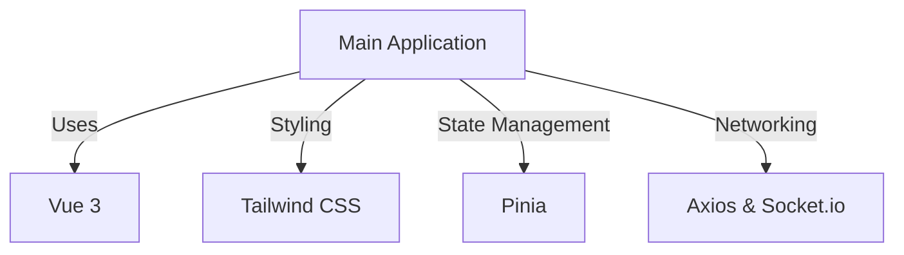

# codx-junior-UI

## Overview
The codx-junior-UI is a client-side application built using modern web technologies. It includes a development server setup, build scripts, and various dependencies for handling UI and state management.

## Key Features
- Utilizes `Vue` for the UI framework.
- Supports `TypeScript` for type safety.
- Implements `Vite` for fast builds and hot module replacement.

## Development Scripts
- `dev`: Starts the development server with Vite.
- `build`: Builds the project for production.
- `lint`: Lints the codebase using ESLint.
- `format`: Formats code using Prettier.

## Dependencies
- Key libraries include `axios`, `socket.io`, `tailwindcss`, and more for enhanced functionality and design.

## Architecture Overview

For more detailed information on specific configurations, refer to the [Detailed Configuration](./detailed-configuration.md) page.