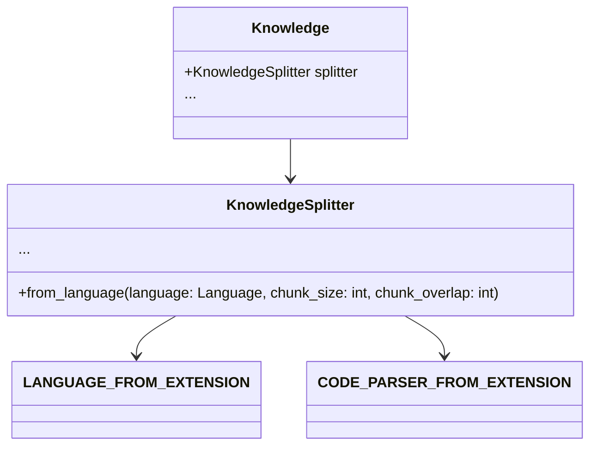

# Language and Code Parsing

## Overview

The `codx-api` project incorporates a robust system for managing and parsing code written in various programming languages. This is achieved through a combination of defined language and code parser mappings. These mappings are crucial for correctly processing, indexing, and manipulating different types of code files within the `Knowledge` management system.

## Key Mappings and Implementations

### File Extension to Language Mapping

The `LANGUAGE_FROM_EXTENSION` dictionary provides a mapping from file extensions to language identifiers. This is essential for configuring the appropriate processing techniques and AI models for each language. Here’s how the mappings are structured:

- **Python**: `.py` files are mapped to `python`.
- **Java**: `.java` files are mapped to `java`.
- **JavaScript**: `.js` files are mapped to `js`.
- **C++**: `.cpp` files are mapped to `cpp`.
- **Go**: `.go` files are mapped to `go`.
- **Ruby**: `.rb` files are mapped to `ruby`.
- **PHP**: `.php` files are mapped to `php`.
- **Swift**: `.swift` files are mapped to `swift`.
- **Kotlin**: `.kt` files are mapped to `kotlin`.
- **Rust**: `.rs` files are mapped to `rust`.
- **Shell**: `.sh` files are mapped to `shell`.
- **R**: `.r` files are mapped to `r`.
- **Perl**: `.pl` files are mapped to `perl`.
- **Scala**: `.scala` files are mapped to `scala`.
- **TypeScript**: `.ts` files are mapped to `ts`.
- **Markdown**: `.md` files are mapped to `markdown`.
- **Text**: `.txt` files are mapped to `text`.
- **HTML**: `.html` and `.cshtml` files are mapped to `html`.
- **CSharp**: `.cs` files are mapped to `csharp`.
- **JSON**: `.json` files are mapped to `js`.

### File Extension to Code Parser Mapping

The `CODE_PARSER_FROM_EXTENSION` dictionary is similar to `LANGUAGE_FROM_EXTENSION` but emphasizes parsing capabilities for each file type, defining which parsers should be employed based on the file extension. This is especially useful in the document enrichment process, where specific parsing strategies are essential for accurate data extraction and indexing.

## Enhanced Features and Usage

### Language Identification and Parsing

By utilizing these mappings, the `KnowledgeSplitter` and related classes can accurately identify and process documents based on their language. This enables language-specific operations, such as syntax-aware splitting, enrichment, and indexing.

### Example Usage

Users can leverage these mappings in the `Knowledge` class to manage and manipulate code documents efficiently. For example:

```python
from codx.junior.knowledge.settings import LANGUAGE_FROM_EXTENSION

file_extension = "py"
language = LANGUAGE_FROM_EXTENSION.get(file_extension)
print(f"The language for '.{file_extension}' files is: {language}")
```

In this example, the Python file extension `.py` is mapped to the `python` language, informing processing and analysis methods about the appropriate handling protocols.

## Class Diagram



In summary, these mappings are crucial for ensuring that code files are processed with the correct syntax rules and enrichment techniques, promoting efficient document management and indexing within the `codx-api` project.