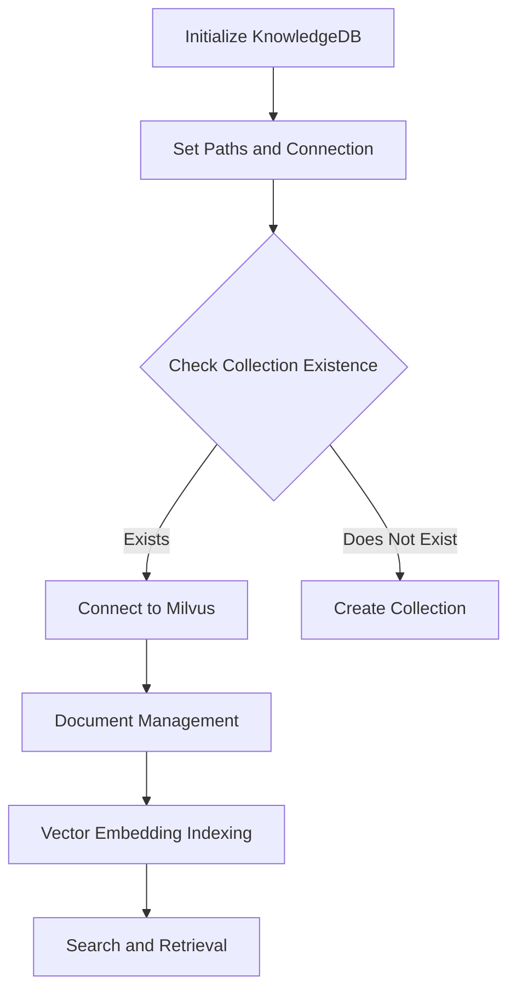

# Codx Junior API Wiki

## Knowledge Database Management

The `KnowledgeDB` module within the Codx Junior API provides an interface for managing a database of document embeddings, enabling efficient code search and retrieval. This module leverages vector embeddings for robust and scalable document indexing and retrieval.

### Overview

The `KnowledgeDB` class incorporates connection handling, document indexing, and search functionalities. It interfaces with a database (Milvus) to manage document embeddings, which is crucial for efficient querying of stored code documents. 

### Key Components

- **Database Connection and Initialization**: Establishes a connection to Milvus, a high-efficiency vector database, ensuring the collection is initialized for embedding storage.
- **Document Management**: Includes methods to get, save, update, index, and delete documents and associated metadata.
- **Search Capabilities**: Leverages vector search to retrieve documents based on similarity measures, enhancing the precision of the search engine.
- **Logging and Error Management**: Implements logging for tracking operations and error handling for database interactions.

### Core Functionalities

#### Database Connection

The `KnowledgeDB` class initializes by setting up paths, establishing a connection to the Milvus database, and creating the necessary collection if it does not exist.

#### Document Management

- **get_all_files**: Retrieves all file records storing metadata and content information.
- **save_all_files**: Persists all file information, ensuring the database state is up-to-date.
- **update_all_file**: Updates metadata for all documents coming from a specific source and recalculates content checksums.
- **index_documents**: Converts document content into vector embeddings and indexes them in the database for fast retrieval.

#### Search Functionalities

- **search**: Conducts vector-based searches within the database to match and retrieve documents whose content is semantically similar to the submitted query.
- **search_in_source**: Retrieves documents based on their source metadata and the query string.

### Example Usage

For indexing and searching documents:

```python
knowledge_db = KnowledgeDB(settings)
knowledge_db.index_documents(documents=your_documents)

search_results = knowledge_db.search("Example search query")
for document in search_results:
    print(document.page_content)
```

This example demonstrates how to index documents and perform search queries to retrieve content.

### Architectural Flow

Below is a mermaid diagram depicting the flow of the document management within the Milvus database:



The diagram outlines the process beginning with initialization and moving through connection, management, and search functionalities.

### Additional Resources

For further details or to contribute, please refer to the [codx-junior GitHub repository](https://github.com/gbrian/codx-junior.git). The repository offers extensive documentation and source code essential for understanding and extending the Codx Junior API’s capabilities.