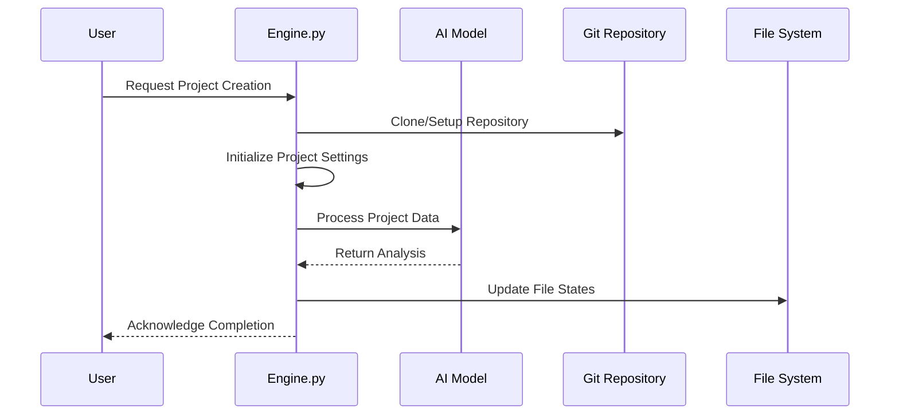

# Engine

The `engine.py` file is a core component of the `codx-junior` project, handling various functionalities crucial for project management and automation within the Codx ecosystem. The following sections highlight the main features, functions, and utilities offered by this file.

## Key Sections and Features

### 1. Imports and Dependencies

The script utilizes a wide range of Python standard libraries and third-party packages, enhancing its capabilities:
- **os, logging, subprocess:** Handle system interaction, logging, and process management.
- **requests:** Manages HTTP requests, crucial for fetching data from URLs.
- **langchain.schema:** Provides structures for AI messaging and document handling.
- **codx.junior.utils, settings, profiling:** Offer utility functions, configuration management, and performance profiling.
- **Markdown It:** Usage of markdown conversion for rendering detailed information.

### 2. Project Management Functions

- **create_project:** Clones or initializes Git repositories, sets project settings, and manages user permissions.
- **delete_project:** Removes project data, ensuring orphaned project directories are cleaned up.
- **find_project functions:** Various helper functions to search and retrieve projects based on path, ID, or name.

### 3. Project and File Operations

- **coder_open_file:** Opens files in a code server environment, allowing for in-editor exploration.
- **read_directory & read_file:** Manage filesystem operations, reading and parsing files for display or processing.
- **write_project_file:** Saves file contents after pre-processing through profiles, ensuring quality and adherence to standards.

### 4. Session Management

- **CODXJuniorSession class:** Central to managing user sessions, project interactions, and event handling. Provides logging, notifications, and AI integrations.
- **switch_project:** Switches contexts when interacting with different projects.

### 5. AI Integrations

- **get_ai:** Retrieves AI models tailored for specific tasks like chat or code generation. 
- **chat_with_project:** Manages AI-based project interactions, using chat models for task refinement, instructions, and response generation.

### 6. Knowledge Management

- **Knowledge class instances:** Handles document and knowledge retrieval, optimized using relevant document searches.
- **reload_knowledge:** Refreshes knowledge base, important for synchronizing changes and ensuring current information availability.

### 7. Code Execution and Validation

- **excute_bash_code & generate_code:** Handle code snippet execution and error handling, applying patches where necessary.
- **build_code_changes_summary:** Generates summaries of code differences between branches, aiding in project tracking and review.

### 8. Security and User Management

- **UserSecurityManager:** Ensures project data access is adequately secured and managed based on user permissions.

### Diagram: Main Workflow

The core functionalities encapsulated within [`engine.py`](https://github.com/gbrian/codx-junior.git/blob/main/codx-junior/api/codx/junior/engine.py) provide a backbone for efficient handling of projects, file management, and integrating AI workflows to augment development pipelines. As a cornerstone script, it combines utility from multiple sources, ensuring seamless project experience and accurate data handling within the Codx ecosystem.