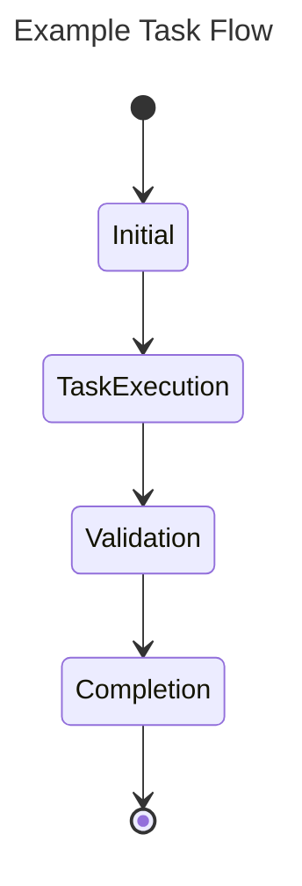

# Agent Coding Task Guide

This document outlines the process for agents to effectively complete coding tasks. Adhering to these guidelines will ensure clarity and successful execution.

## Task

*   **Name:** [To be provided]
*   **Description:** [A concise and comprehensive description of the task to be accomplished.]

## Objectives

Clearly defined objectives are crucial for task completion validation. Ensure objectives are specific, measurable, achievable, relevant, and time-bound (SMART).

## Tests

A detailed list of tests is required to validate the successful completion of the task. Each test should clearly articulate what is being tested and the expected outcome.

## Flow

The task flow should be illustrated using a Mermaid diagram. This visual representation should detail the steps an agent must follow, including any necessary tools and methods.

### Available Tools

Agents have access to the following tools:

*   **`search(query: str) -> List[Document]`**: This function enables RAG (Retrieve and Generate) searches within the project's knowledge base, returning relevant documents and information.
*   **`code(patch: str) -> bool`**: This function allows agents to execute code changes by providing a file patch in diff format. It returns a boolean indicating the success of the patch application.

### Example Task Flow

