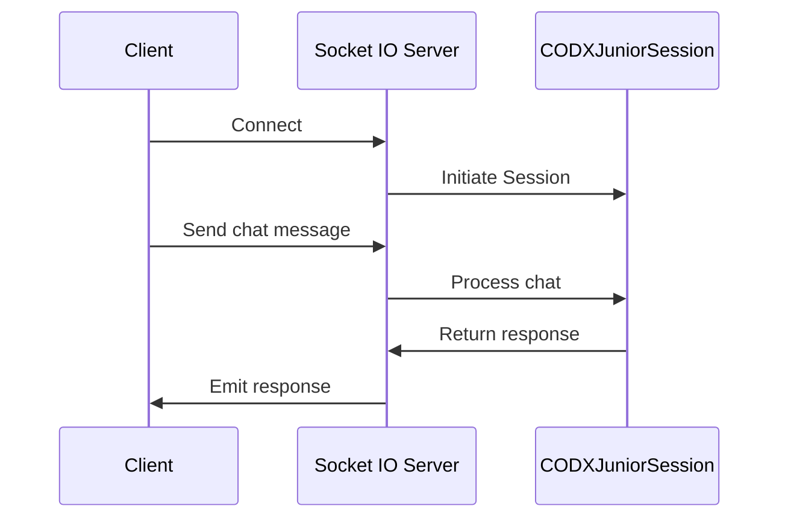

# SIO

## Introduction

The `SIO` module in the `codx-api` project plays a pivotal role in managing socket input/output operations, with a specific focus on handling diverse socket events and allowing interaction with the project via real-time communications.

## Overview of Latest Changes

The recent code updates have introduced various socket event handlers and auxiliary functionalities that enhance the socket server capabilities. This documentation covers key additions and modifications to the module's architecture and usage.

## Socket Server Setup

The `socketio.AsyncServer` is initialized to set up a server capable of handling asynchronous operations, with cors allowed for all origins (`cors_allowed_origins='*'`) and using the ASGI mode:

```python
sio = socketio.AsyncServer(cors_allowed_origins='*', async_mode='asgi')
```

The server leverages a thread pool executor (`SIO_POOL`) to manage blocking I/O operations, ensuring responsiveness by using `ThreadPoolExecutor(max_workers=10)`.

## Event Handlers

### Connection Management

- **Connect Event**: Triggers when a new client connects, logging the event, and adding the client to the active users list.
- **Disconnect Event**: Handles client disconnection, logging the event, removing the client from the active users list, and notifying remaining users.

### Error Handling

The `error` event handler logs any socket errors:

```python
@sio.on("error")
async def error():
    logger.error(f"Socket error")
```

### Ping Event

A `codx-junior-ping` event to verify connectivity returns a simple boolean response:

```python
@sio.on("codx-junior-ping")
async def io_ping(sid, data: dict = None):
    return True
```

### Session Channels and User Management

The module manages users and sessions using the `SessionChannel` class to send updates about the current online users:

```python
@sio.on("codx-junior-login")
def io_login(sid, data: dict):
    USERS[sid] = data
    channel = SessionChannel(sio=sio, sid=sid)
    channel.send_event('codx-junior-online-users', USERS)
    return USERS
```

### Chat Events

Chat-related functionalities are enhanced with these handlers:

- **codx-junior-chat**: Processes chat messages asynchronously, integrating with the `CODXJuniorSession` to handle project-specific interactions.
- **codx-junior-subtasks**: Generates and processes subtasks based on chat instructions.

### Code Improvement and Generation

The module adds capability for on-the-fly code improvements and task generation:

- **codx-junior-improve**: Improves existing project code and saves chat.
- **codx-junior-generate-tasks**: Facilitates task generation within the chat context.
- **codx-junior-improve-patch**: Handles code patch improvements using AI-assisted code generators.
- **codx-junior-generate-code**: Initiates code generation tasks.

### AI Model Interaction

AI model handling is added through:

```python
@sio.on("codx-junior-ai-load-model")
@sio_api_endpoint
async def sio_ai_load_model(sid, data: dict):
    AIManager().load_model(model=data["model"])
```

This function loads AI models dynamically based on the provided data.

## Usage Example

The following example illustrates how to handle a simple connection and chat interaction using the `SIO` module:

```python
from codx.junior.sio.session_channel import SessionChannel

# Assume a valid sio instance is available
sio_instance = ...

# Establish a new session channel for user identification
session_channel = SessionChannel(sio=sio_instance, sid="session123")

# User login
user_data = {"username": "john_doe"}
session_channel.send_event('codx-junior-login', user_data)

# Handling chat message
chat_data = {"chat": {"name": "project_discussion"}, "message": "Let's start the discussion"}
await sio_instance.emit('codx-junior-chat', chat_data, room=session_channel.sid)
```

## Sequence Diagram

Here's a diagram for the key interaction sequence using the SIO module:



This documentation provides a comprehensive overview of new features and integrations within the `SIO` module, enabling you to utilize enhanced functionalities such as real-time user management, chat handling, and AI interactions in your projects.