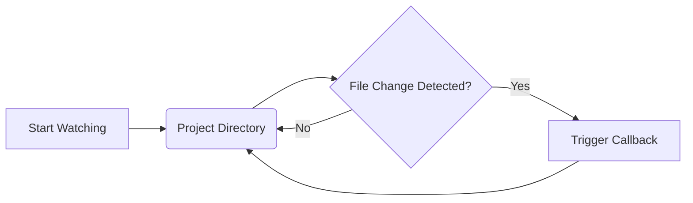

# codx-api Documentation

## Overview

This wiki provides detailed documentation for the `codx-junior` project. It covers the key components like the `main.py` file, which serves as the entry point for the application, managing logging and initializing the Flask app. Additionally, it details the `ProjectWatcher` class, and recent updates include a new module for question answering over code using LangChain, broadening the project's capabilities.

## Logging Configuration

The `main.py` file's logging setup has been refined for better log structure, essential for debugging and monitoring.

### Key Features

- **Level**: Set to `DEBUG` for comprehensive logs.
- **Format**: Includes timestamp, log level, logger name, line number, and message.
- **Date Format**: Uses `YYYY-MM-DD HH:MM:SS`.
- **Handlers**: Uses `StreamHandler` for real-time console logging.

## Application Initialization

In `main.py`, the Flask application from `codx.junior.app` is initialized seamlessly.

### Core Components

- **Module Import**: Brings in `app` directly from `codx.junior.app`.
- **App Instantiation**: The `app` becomes the central application instance.
- **Logging**: Captures any alterations to logging format for runtime tracking.

## Project Watcher

The `ProjectWatcher` class is a critical component responsible for monitoring file changes in project directories using the `watchdog` library.

### Usage

To start watching a directory:
```python
watcher = ProjectWatcher()
watcher.start_watching('/path/to/project', callback_function)
```

To stop watching a directory:
```python
watcher.stop_watching('/path/to/project')
```

### Diagram


### Examples

The `ProjectWatcher` is particularly useful in development environments where tracking changes in real-time triggers automated tasks like testing and deployment.

## Question Answering Over Code

With the integration of LangChain, the project now features a sophisticated pipeline for question answering (QA) over code. This process adapts strategies used in document QA for code specificity.

### Quickstart

1. **Install Libraries**:

   ```bash
   pip install openai tiktoken chromadb langchain
   ```

2. **Environment Setup**:

   Set OPENAI_API_KEY via environment variables or a `.env` file.

3. **Load Python Code**:

   Leverage LangChain's `GenericLoader` and `LanguageParser` to load Python files as documents for processing.

   ```python
   loader = GenericLoader.from_filesystem(
       "/path/to/repo",
       glob="**/*",
       suffixes=[".py"],
       parser=LanguageParser(language=Language.PYTHON, parser_threshold=500)
   )
   documents = loader.load()
   ```

4. **Document Splitting**:

   Using `RecursiveCharacterTextSplitter`, split the code document for embedding purposes.

   ```python
   from langchain.text_splitter import RecursiveCharacterTextSplitter
   
   python_splitter = RecursiveCharacterTextSplitter.from_language(
       language=Language.PYTHON, chunk_size=2000, chunk_overlap=200
   )
   texts = python_splitter.split_documents(documents)
   ```

5. **RetrievalQA**:

   Embed documents and utilize `Chroma` for storing and retrieving based on semantic content.

   ```python
   from langchain.embeddings.openai import OpenAIEmbeddings
   from langchain.vectorstores import Chroma

   db = Chroma.from_documents(texts, OpenAIEmbeddings(disallowed_special=()))
   retriever = db.as_retriever(search_type="mmr", search_kwargs={"k": 8})
   ```

6. **Conversational Retrieval**:

   Set up a conversational retrieval chain with a language model for interactive querying.

   ```python
   from langchain.chains import ConversationalRetrievalChain
   from langchain.chat_models import ChatOpenAI

   llm = ChatOpenAI(model_name="gpt-4")
   qa = ConversationalRetrievalChain.from_llm(llm, retriever=retriever)
   
   question = "How can I initialize a ReAct agent?"
   result = qa(question)
   print(result["answer"])
   ```

### Enhanced Capabilities

This setup not only simplifies managing code repositories but also enhances understanding through advanced natural language querying mechanisms.

## Usage Guide

Deploy the application by running `main.py` to initiate the Flask development server. Access the app through a web browser or tools like `curl`.

### Example

```shell
$ python /home/codx-junior/codx-junior/api/codx/junior/main.py
```

This documentation reflects the latest enhancements and features in the `codx-junior` project, aiming to guide developers in efficient project management and application maintenance.