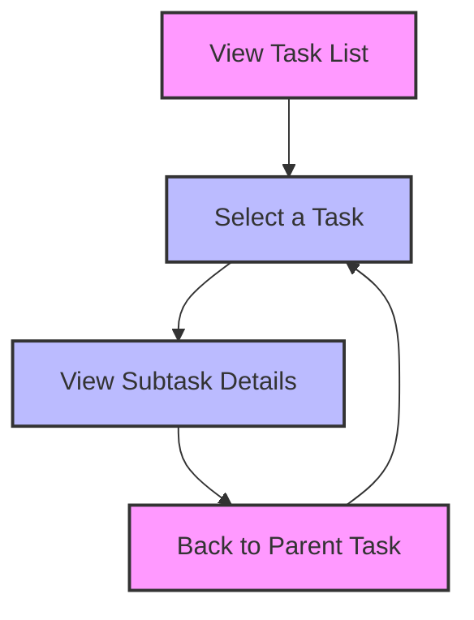

# [[{"id": "8a72b30a-daa5-404c-a191-e9f20907c4ff", "doc_id": null, "project_id": null, "parent_id": null, "status": "", "tags": [], "file_list": [], "check_lists": [], "profiles": ["analyst"], "users": [], "name": "task go back", "description": "", "created_at": "2025-04-22 07:14:35.823760", "updated_at": "2025-08-30T13:56:31.701869", "mode": "chat", "kanban_id": "", "column_id": "", "board": "Bugs", "column": "Completed", "chat_index": 0, "url": "", "branch": "", "file_path": "/home/codx-junior/codx-junior/client/.codx/tasks/Bugs/Backlog/task-go-back.8a72b30a-daa5-404c-a191-e9f20907c4ff.md", "llm_model": "", "visibility": "", "remote_url": "", "knowledge_topics": []}]]
## [[{"doc_id": "09882eb3-ee2f-4338-a4eb-f3fbea9f9c6a", "role": "assistant", "task_item": "analysis", "think": "", "hide": false, "is_answer": false, "improvement": false, "created_at": "2025-04-22 07:14:35.822009", "updated_at": "2025-04-22 07:14:35.822038", "images": [], "files": ["/src/components/kanban/Kanban.vue"], "meta_data": {"time_taken": 10.87285327911377, "first_chunk_time_taken": 7.317506551742554, "model": "gpt-4o"}, "profiles": ["analyst"], "user": null, "knowledge_topics": [], "done": true, "is_thinking": false, "disable_knowledge": false, "read_by": []}]]
```md
### Navigate Back to Parent Task

**Objective:**
- Implement a feature that allows users to easily navigate back to the parent task from the current task in the Kanban component.

**Requirements:**
- Add a visible button or link in the task view that guides users back to the parent task.
- The navigation should maintain user context, ensuring that any unsaved changes are handled appropriately.
- Ensure the feature is accessible and user-friendly across different devices, especially mobile.

**Examples:**
- Users should see a "Back to Parent Task" button when viewing a subtask.
- Example flow: User clicks on a task > Views subtask details > Clicks "Back to Parent Task" > Returns to parent task view.

**Acceptance Criteria:**
- When viewing a subtask, a button or link labeled "Back to Parent Task" should be visible.
- Clicking this button/link should navigate the user back to the parent task.
- The feature should function correctly and maintain any changes made before navigation on both desktop and mobile.

**Additional Notes:**
- Consider using breadcrumbs for hierarchical navigation to provide users with an overview of their current location within the task hierarchy.

**Mermaid Diagram:**

```