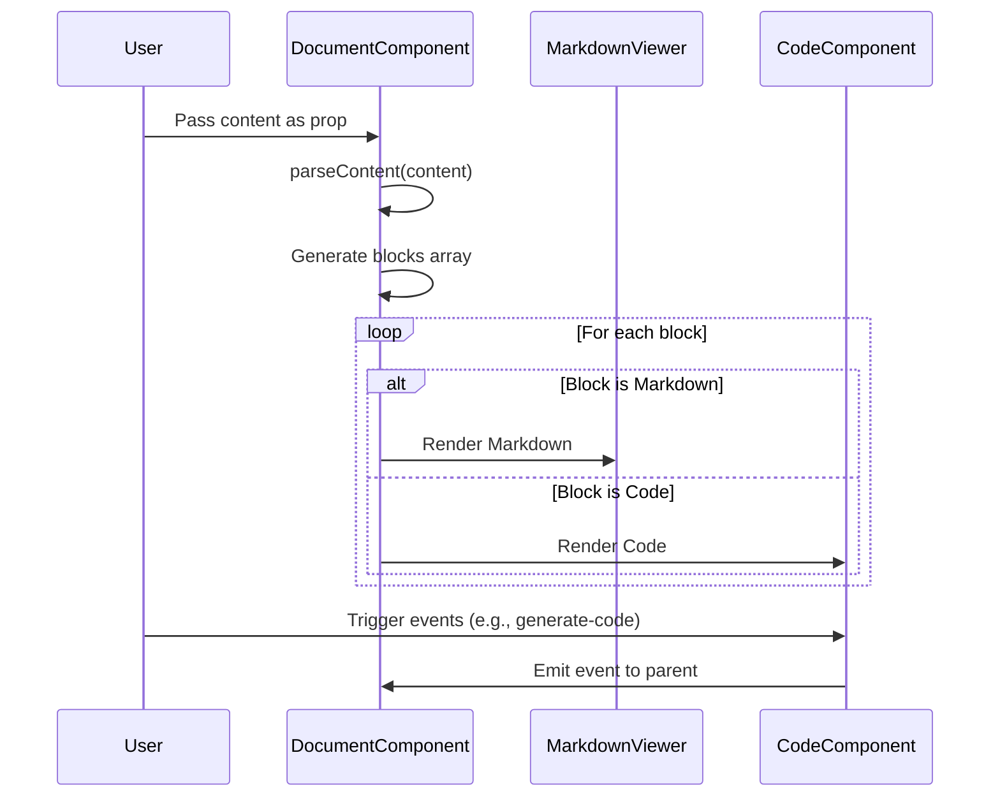

# [[{"id": "1c9a8abe-8ed7-41f5-a062-b1e5a13700dc", "doc_id": null, "project_id": null, "parent_id": null, "message_id": null, "status": "", "tags": [], "file_list": ["/shared/codx-junior/client/src/components/document/Document.vue"], "check_lists": [], "profiles": [], "users": ["admin"], "name": "Document", "pinned": false, "description": "The user is requesting documentation for a component, including the generation of a wiki with a Mermaid sequence diagram. They want an explanation of the component at the top and a footer with suggestions at the end. Additionally, they have provided specific instructions for formatting file content by including the file name after the code block extension.", "created_at": "2025-09-24 04:39:10.176801", "updated_at": "2025-09-24T05:33:25.860996", "mode": "task", "kanban_id": "", "column_id": "", "board": "Document viewer", "column": "Doing", "chat_index": 0, "url": "", "branch": "", "file_path": "/shared/codx-junior/client/.codx/tasks/Document viewer/Doing/document.1c9a8abe-8ed7-41f5-a062-b1e5a13700dc.md", "llm_model": "", "visibility": "", "remote_url": "", "knowledge_topics": [], "chat_links": [], "pr_view": {}}]]
## [[{"doc_id": "d5f75c46-a523-49aa-9837-9c4118561d35", "role": "user", "task_item": "", "think": "", "hide": true, "is_answer": false, "improvement": false, "created_at": "2025-09-24 04:39:10.174264", "updated_at": "2025-09-24 04:39:10.174290", "images": [], "files": [], "meta_data": {}, "profiles": [], "user": "admin", "knowledge_topics": [], "done": true, "is_thinking": false, "disable_knowledge": true, "read_by": []}]]
Document renders a content. A document can have multiple types of contents: markdown, code, diff view, ... each section starts with a fence "```[type] [file_name]" and ends with "```"  like in:
```js a_javascript_file.js
console.log("hello world")
```


Document content may have texts and blocks. For texts and "md or markdown" blocks use MarkDownViewer component, use Code component for the others

Document will split content and use markdown for those parts not starting 
## [[{"doc_id": "d50d0cc9-560c-4c9a-a37a-58726547ea2a", "role": "assistant", "task_item": "analysis", "think": null, "hide": true, "is_answer": false, "improvement": false, "created_at": "2025-09-24 04:39:10.174264", "updated_at": "2025-09-24 04:39:10.174290", "images": [], "files": [], "meta_data": {"time_taken": 26.251684188842773, "first_chunk_time_taken": 0.0002067089080810547, "model": "openai/gpt-4o"}, "profiles": [], "user": null, "knowledge_topics": [], "done": true, "is_thinking": false, "disable_knowledge": false, "read_by": []}]]
It looks like you are trying to render content in a Vue component that can handle multiple types of content, such as markdown, code, and others. The `Document.vue` component will split the content and use the `MarkdownViewer` component for text and markdown blocks, while using the `Code` component for other types of content. Let's implement this logic in the `Document.vue` file.

Here's an updated version of the `Document.vue` component:

```vue /shared/codx-junior/client/src/components/document/Document.vue
<script setup>
import { computed } from 'vue';
import MarkdownViewer from '../MarkdownViewer.vue';
import Code from '../Code.vue';

// Define a function to parse the content into an array of objects with type and content
function parseContent(content) {
  const blocks = [];
  const lines = content.split('\n');
  let currentType = 'markdown'; // Default type
  let currentContent = [];
  let currentFileName = '';

  lines.forEach(line => {
    const match = line.match(/^```(\w+)\s*(.*)$/);
    if (match) {
      // If there is a match, it means a new block is starting
      if (currentContent.length > 0) {
        blocks.push({
          type: currentType,
          content: currentContent.join('\n'),
          fileName: currentFileName
        });
      }
      currentType = match[1];
      currentFileName = match[2];
      currentContent = [];
    } else if (line === '```') {
      // End of a block
      if (currentContent.length > 0) {
        blocks.push({
          type: currentType,
          content: currentContent.join('\n'),
          fileName: currentFileName
        });
      }
      currentType = 'markdown'; // Reset to default type
      currentContent = [];
      currentFileName = '';
    } else {
      currentContent.push(line);
    }
  });

  // Push the last block if any content is left
  if (currentContent.length > 0) {
    blocks.push({
      type: currentType,
      content: currentContent.join('\n'),
      fileName: currentFileName
    });
  }

  return blocks;
}

const props = defineProps(['content']);
const parsedBlocks = computed(() => parseContent(props.content));
</script>

<template>
  <div class="flex flex-col">
    <div v-for="(block, index) in parsedBlocks" :key="index">
      <MarkdownViewer v-if="block.type === 'markdown' || block.type === 'md'" :content="block.content" />
      <Code v-else :content="block.content" :language="block.type" :fileName="block.fileName" />
    </div>
  </div>
</template>

<script>
export default {
  props: ['content']
}
</script>
```

### Explanation:
- **Content Parsing**: The content is split into blocks based on the "```" fences. Each block is identified by its type (e.g., `js`, `html`, `markdown`).
- **Components Usage**:
  - `MarkdownViewer` is used for text and markdown blocks.
  - `Code` is used for other types of blocks.
- **File Names**: If a file name is provided after the type in the fence, it is stored and passed to the `Code` component.
## [[{"doc_id": "02a9b162-6155-4fb4-9292-e71f9f7353a0", "role": "user", "task_item": "", "think": "", "hide": true, "is_answer": false, "improvement": false, "created_at": "2025-09-24 04:39:10.174264", "updated_at": "2025-09-24 04:39:10.174290", "images": [], "files": [], "meta_data": {}, "profiles": [], "user": "admin", "knowledge_topics": [], "done": true, "is_thinking": false, "disable_knowledge": true, "read_by": []}]]
Use "options" mode to define the vue component
## [[{"doc_id": "17e2052b-8228-4faf-81b0-029d8e0c2f6f", "role": "assistant", "task_item": "analysis", "think": null, "hide": true, "is_answer": false, "improvement": false, "created_at": "2025-09-24 04:39:10.174264", "updated_at": "2025-09-24 04:39:10.174290", "images": [], "files": [], "meta_data": {"time_taken": 20.71062731742859, "first_chunk_time_taken": 0.00019502639770507812, "model": "openai/gpt-4o"}, "profiles": [], "user": null, "knowledge_topics": [], "done": true, "is_thinking": false, "disable_knowledge": false, "read_by": []}]]
```vue /shared/codx-junior/client/src/components/document/Document.vue
<script>
import { computed, defineComponent } from 'vue';
import MarkdownViewer from '../MarkdownViewer.vue';
import Code from '../Code.vue';

// Define a function to parse the content into an array of objects with type and content
function parseContent(content) {
  const blocks = [];
  const lines = content.split('\n');
  let currentType = 'markdown'; // Default type
  let currentContent = [];
  let currentFileName = '';

  lines.forEach(line => {
    const match = line.match(/^```(\w+)\s*(.*)$/);
    if (match) {
      // If there is a match, it means a new block is starting
      if (currentContent.length > 0) {
        blocks.push({
          type: currentType,
          content: currentContent.join('\n'),
          fileName: currentFileName
        });
      }
      currentType = match[1];
      currentFileName = match[2];
      currentContent = [];
    } else if (line === '```') {
      // End of a block
      if (currentContent.length > 0) {
        blocks.push({
          type: currentType,
          content: currentContent.join('\n'),
          fileName: currentFileName
        });
      }
      currentType = 'markdown'; // Reset to default type
      currentContent = [];
      currentFileName = '';
    } else {
      currentContent.push(line);
    }
  });

  // Push the last block if any content is left
  if (currentContent.length > 0) {
    blocks.push({
      type: currentType,
      content: currentContent.join('\n'),
      fileName: currentFileName
    });
  }

  return blocks;
}

export default defineComponent({
  components: {
    MarkdownViewer,
    Code
  },
  props: ['content'],
  setup(props) {
    const parsedBlocks = computed(() => parseContent(props.content));
    return { parsedBlocks };
  }
});
</script>

<template>
  <div class="flex flex-col">
    <div v-for="(block, index) in parsedBlocks" :key="index">
      <MarkdownViewer v-if="block.type === 'markdown' || block.type === 'md'" :content="block.content" />
      <Code v-else :content="block.content" :language="block.type" :fileName="block.fileName" />
    </div>
  </div>
</template>
```
## [[{"doc_id": "10e4a709-dedd-419c-8579-18bad7005eb0", "role": "user", "task_item": "", "think": "", "hide": true, "is_answer": false, "improvement": false, "created_at": "2025-09-24 04:39:10.174264", "updated_at": "2025-09-24 04:39:10.174290", "images": [], "files": [], "meta_data": {}, "profiles": [], "user": "admin", "knowledge_topics": [], "done": true, "is_thinking": false, "disable_knowledge": true, "read_by": []}]]
Document the component, generate a wiki with  a mermaid sequence diagram to this document. In the top explain about the component and at the end add a footer with suggestions
## [[{"doc_id": "43bfb0bf-ab2d-4ca7-8269-545fef607664", "role": "ai", "task_item": "", "think": "", "hide": true, "is_answer": false, "improvement": false, "created_at": "2025-09-24 04:39:10.174264", "updated_at": "2025-09-24 04:39:10.174290", "images": [], "files": [], "meta_data": {}, "profiles": [], "user": null, "knowledge_topics": [], "done": true, "is_thinking": false, "disable_knowledge": false, "read_by": []}]]
Error processing fetch_webpage:
'coroutine' object is not subscriptable
## [[{"doc_id": "4d9746a3-30f2-43b2-a5ea-377996b66736", "role": "assistant", "task_item": "analysis", "think": null, "hide": false, "is_answer": false, "improvement": false, "created_at": "2025-09-24 04:39:10.174264", "updated_at": "2025-09-24 04:39:10.174290", "images": [], "files": [], "meta_data": {"time_taken": 10.74704647064209, "first_chunk_time_taken": 0.0001933574676513672, "model": "openai/gpt-4o"}, "profiles": [], "user": null, "knowledge_topics": [], "done": true, "is_thinking": false, "disable_knowledge": false, "read_by": []}]]
## Document Component Wiki

### Overview

The `Document.vue` component is a versatile Vue.js component designed to render and manage content blocks. It supports both Markdown and code content, allowing dynamic display and interaction with different types of data. The component leverages other components like `MarkdownViewer` and `Code` to render specific content types.

### Component Structure

- **Template**: The template section of the component uses a `v-for` directive to iterate over content blocks. Each block is rendered conditionally based on its type using `MarkdownViewer` for markdown content and `Code` for code content.

- **Script Setup**: 
  - Imports necessary Vue functions and components.
  - Defines the `parseContent` function to process raw content into structured blocks.
  - Exports the component with props and computed properties.

- **Script**: 
  - `parseContent(content)`: A function that parses the input content into an array of objects, each representing a block with its type, content, and renderer.
  - `blocks()`: A computed property that returns the parsed blocks of content using the `parseContent` function.

### Sequence Diagram

Below is a Mermaid sequence diagram that illustrates the interaction flow when the component is used:



### Footer

#### Suggestions for Improvement

1. **Enhance Error Handling**: Implement error handling within the `parseContent` function to manage unexpected content formats gracefully.
   
2. **Performance Optimization**: Consider optimizing the rendering process for large content by implementing lazy loading or virtual scrolling.
   
3. **Extend Functionality**: Introduce support for additional content types or renderers, such as images or videos, to increase the component's versatility.