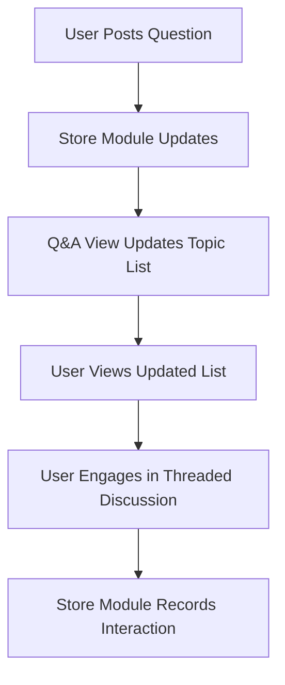
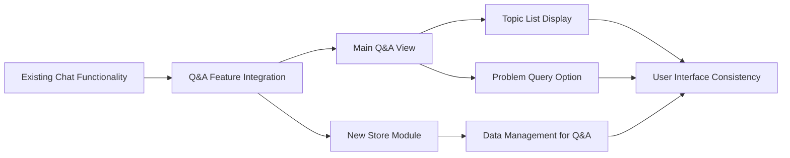

# [[{"id": "7964d90a-5b32-4b1d-9396-3e8e82eb6fb7", "doc_id": null, "parent_id": "3615dc39-e5c8-424d-8066-df09a412f67f", "status": "", "tags": [], "file_list": [], "profiles": ["analyst"], "name": "Design User Interface for Question and Answer Posting", "created_at": "2025-02-06 11:44:16.796758", "updated_at": "2025-02-06T13:47:09.412740", "mode": "task", "kanban_id": "", "column_id": "", "board": "Knowledge so-ish", "column": "Doing", "chat_index": 0, "live_url": "", "branch": "", "file_path": "/usr/local/codx-junior/client/.codx/tasks/Knowledge so-ish/Doing/Design User Interface for Question and Answer Posting.7964d90a-5b32-4b1d-9396-3e8e82eb6fb7.md"}]]
## [[{"doc_id": "8b190aea-32ea-4c0d-869f-b8018295624f", "role": "assistant", "task_item": "analysis", "hide": false, "improvement": false, "created_at": "2025-02-06 12:41:20.491016", "updated_at": "2025-02-06 12:41:20.491047", "images": [], "files": []}]]
### Enhance Chat Functionality for Q&A

**Objective:**
- Develop a feature within the chat framework that enables users to post and organize questions and answers efficiently.

**Requirements:**
- Integrate the Q&A feature into the existing chat functionality.
- Design the interface to be user-friendly and intuitive.
- Ensure the design aligns with the current design language of the application.
- Utilize existing UI components to maintain consistency across the application.

**Examples:**
- A user should be able to post a question in the chat and receive answers that are threaded or linked directly to that question for easy navigation and organization.

**Acceptance Criteria:**
- Users can successfully post questions and receive answers within the chat.
- The interface is intuitive, requiring minimal learning for users to navigate the Q&A feature.
- Visual consistency with the rest of the application is maintained.
- The feature is tested and confirmed to function without disrupting existing chat operations.

**Additional Notes:**
- Consider the potential need for moderation tools to manage the quality and relevance of questions and answers.
- Explore the possibility of incorporating tagging or categorization for easy retrieval of past questions and answers.
## [[{"doc_id": "f67962c6-83d2-4f82-b896-7bf4e30d885a", "role": "assistant", "task_item": "", "hide": false, "improvement": false, "created_at": "2025-02-06 11:44:16.795124", "updated_at": "2025-02-06 11:44:16.795176", "images": [], "files": []}]]
Leverage the current chat functionality to allow questions and answers to be posted and organized. Implement a user-friendly interface for posting and answering questions within the chat framework. The interface should be intuitive and align with the existing design language of the application. Consider using existing UI components to maintain consistency.
## [[{"doc_id": "5b5ea888-01cc-4b88-aaea-d3d64df120b4", "role": "user", "task_item": "", "hide": false, "improvement": false, "created_at": "2025-02-06 12:41:20.491016", "updated_at": "2025-02-06 12:41:20.491047", "images": [], "files": []}]]
* We'll need a new store module to manage the QA chats.
* Main QA view will show a list of topics based on their last activity, showing title, number of sub tasks (sub topics), last update date
* And the option to ask about a problem 
## [[{"doc_id": "fac0104e-1f66-4831-80c9-fe26e63020c9", "role": "assistant", "task_item": "analysis", "hide": false, "improvement": false, "created_at": "2025-02-06 12:41:20.491016", "updated_at": "2025-02-06 12:41:20.491047", "images": [], "files": []}]]
### Enhance Chat Functionality for Q&A

**Objective:**
- Develop a feature within the chat framework that enables users to post and organize questions and answers efficiently.

**Requirements:**
- Integrate the Q&A feature into the existing chat functionality.
- Implement a new store module to manage the Q&A chats.
- Design the main Q&A view to display a list of topics based on their last activity, including the title, number of sub-topics, and the last update date.
- Provide an option for users to ask about a problem directly within the Q&A view.
- Ensure the interface is user-friendly and aligns with the current design language of the application.
- Utilize existing UI components to maintain consistency across the application.

**Examples:**
- A user should be able to post a question in the chat and receive answers that are threaded or linked directly to that question for easy navigation and organization.
- The main Q&A view should resemble a forum-like structure, showing active topics and allowing users to dive into specific discussions.

**Acceptance Criteria:**
- Users can successfully post questions and receive answers within the chat.
- The main Q&A view accurately displays topics based on their last activity and relevant details.
- Users can easily navigate and post queries about specific problems.
- The interface is intuitive, requiring minimal learning for users to navigate the Q&A feature.
- Visual consistency with the rest of the application is maintained.
- The feature is tested and confirmed to function without disrupting existing chat operations.

**Additional Notes:**
- Consider the potential need for moderation tools to manage the quality and relevance of questions and answers.
- Explore the possibility of incorporating tagging or categorization for easy retrieval of past questions and answers.
## [[{"doc_id": "d4482584-6ed9-448c-a6b6-ddacd3bcaab0", "role": "user", "task_item": "", "hide": false, "improvement": false, "created_at": "2025-02-06 12:41:20.491016", "updated_at": "2025-02-06 12:41:20.491047", "images": [], "files": []}]]
Review task an update with current project status
## [[{"doc_id": "920127b2-539b-4864-9e4b-36be59b0836c", "role": "assistant", "task_item": "analysis", "hide": false, "improvement": false, "created_at": "2025-02-06 12:41:20.491016", "updated_at": "2025-02-06 12:41:20.491047", "images": [], "files": []}]]
### Enhance Chat Functionality for Q&A

**Objective:**
- Develop a feature within the chat framework that enables users to post and organize questions and answers efficiently.

**Requirements:**
- Integrate the Q&A feature into the existing chat functionality.
- Implement a new store module to manage the Q&A chats.
- Design the main Q&A view to display a list of topics based on their last activity, including the title, number of sub-topics, and the last update date.
- Provide an option for users to ask about a problem directly within the Q&A view.
- Ensure the interface is user-friendly and aligns with the current design language of the application.
- Utilize existing UI components to maintain consistency across the application.

**Examples:**
- A user should be able to post a question in the chat and receive answers that are threaded or linked directly to that question for easy navigation and organization.
- The main Q&A view should resemble a forum-like structure, showing active topics and allowing users to dive into specific discussions.

**Acceptance Criteria:**
- Users can successfully post questions and receive answers within the chat.
- The main Q&A view accurately displays topics based on their last activity and relevant details.
- Users can easily navigate and post queries about specific problems.
- The interface is intuitive, requiring minimal learning for users to navigate the Q&A feature.
- Visual consistency with the rest of the application is maintained.
- The feature is tested and confirmed to function without disrupting existing chat operations.

**Additional Notes:**
- Consider the potential need for moderation tools to manage the quality and relevance of questions and answers.
- Explore the possibility of incorporating tagging or categorization for easy retrieval of past questions and answers.

**Project Status:**
- Initial analysis for the feature is complete.
- Design mockups for the main Q&A view are underway.
- The creation of the new store module is in the planning phase.
- Discussions on moderation tools
## [[{"doc_id": "985bc190-3192-41e5-b73f-3fa739d7e1ae", "role": "user", "task_item": "", "hide": false, "improvement": false, "created_at": "2025-02-06 12:41:20.491016", "updated_at": "2025-02-06 12:41:20.491047", "images": [], "files": []}]]
Add mermaid diagrams
## [[{"doc_id": "b87019aa-7d39-4099-97ac-39178ec5b32e", "role": "assistant", "task_item": "analysis", "hide": false, "improvement": false, "created_at": "2025-02-06 12:41:20.491016", "updated_at": "2025-02-06 12:41:20.491047", "images": [], "files": []}]]
### Enhance Chat Functionality for Q&A

**Objective:**
- Develop a feature within the chat framework that enables users to post and organize questions and answers efficiently.

**Requirements:**
- Integrate the Q&A feature into the existing chat functionality.
- Implement a new store module to manage the Q&A chats.
- Design the main Q&A view to display a list of topics based on their last activity, including the title, number of sub-topics, and the last update date.
- Provide an option for users to ask about a problem directly within the Q&A view.
- Ensure the interface is user-friendly and aligns with the current design language of the application.
- Utilize existing UI components to maintain consistency across the application.

**Examples:**
- A user should be able to post a question in the chat and receive answers that are threaded or linked directly to that question for easy navigation and organization.
- The main Q&A view should resemble a forum-like structure, showing active topics and allowing users to dive into specific discussions.

**Acceptance Criteria:**
- Users can successfully post questions and receive answers within the chat.
- The main Q&A view accurately displays topics based on their last activity and relevant details.
- Users can easily navigate and post queries about specific problems.
- The interface is intuitive, requiring minimal learning for users to navigate the Q&A feature.
- Visual consistency with the rest of the application is maintained.
- The feature is tested and confirmed to function without disrupting existing chat operations.

**Additional Notes:**
- Consider the potential need for moderation tools to manage the quality and relevance of questions and answers.
- Explore the possibility of incorporating tagging or categorization for easy retrieval of past questions and answers.

**Project Status:**
- Initial analysis for the feature is complete.
- Design mockups for the main Q&A view are underway.
- The creation of the new store module is in the planning phase.
- Discussions on moderation tools are ongoing.

**Mermaid Diagram:**

This mermaid diagram illustrates the flow of interaction from the user posting a question to the system updating
## [[{"doc_id": "3c271796-61f8-48b6-b9df-342a2b3ff156", "role": "user", "task_item": "", "hide": false, "improvement": false, "created_at": "2025-02-06 12:41:20.491016", "updated_at": "2025-02-06 12:41:20.491047", "images": [], "files": []}]]
Create a dependency diagram instead, showing existing and new elements and their dependencies

## [[{"doc_id": "0ed9f16a-dfda-402e-b2d1-5be3a11018a3", "role": "assistant", "task_item": "analysis", "hide": false, "improvement": false, "created_at": "2025-02-06 12:41:20.491016", "updated_at": "2025-02-06 12:41:20.491047", "images": [], "files": []}]]
### Enhance Chat Functionality for Q&A

**Objective:**
- Develop a feature within the chat framework that enables users to post and organize questions and answers efficiently.

**Requirements:**
- Integrate the Q&A feature into the existing chat functionality.
- Implement a new store module to manage the Q&A chats.
- Design the main Q&A view to display a list of topics based on their last activity, including the title, number of sub-topics, and the last update date.
- Provide an option for users to ask about a problem directly within the Q&A view.
- Ensure the interface is user-friendly and aligns with the current design language of the application.
- Utilize existing UI components to maintain consistency across the application.

**Examples:**
- A user should be able to post a question in the chat and receive answers that are threaded or linked directly to that question for easy navigation and organization.
- The main Q&A view should resemble a forum-like structure, showing active topics and allowing users to dive into specific discussions.

**Acceptance Criteria:**
- Users can successfully post questions and receive answers within the chat.
- The main Q&A view accurately displays topics based on their last activity and relevant details.
- Users can easily navigate and post queries about specific problems.
- The interface is intuitive, requiring minimal learning for users to navigate the Q&A feature.
- Visual consistency with the rest of the application is maintained.
- The feature is tested and confirmed to function without disrupting existing chat operations.

**Additional Notes:**
- Consider the potential need for moderation tools to manage the quality and relevance of questions and answers.
- Explore the possibility of incorporating tagging or categorization for easy retrieval of past questions and answers.

**Project Status:**
- Initial analysis for the feature is complete.
- Design mockups for the main Q&A view are underway.
- The creation of the new store module is in the planning phase.
- Discussions on moderation tools are ongoing.

**Mermaid Diagram (Dependency):**

This mermaid diagram represents the dependencies between existing and new components for the enhanced chat functionality. The existing chat functionality serves as the foundation for integrating the new Q&A feature, which relies on both the store module and the main Q&A view to manage and display data effectively.