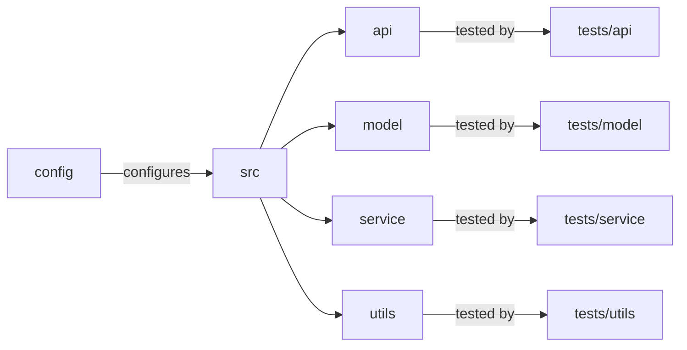

# [[{"id": "f276194d-dd4f-4a6a-b37b-af332f3fbf8a", "doc_id": null, "project_id": null, "parent_id": "61903aa8-c27e-441e-942d-f5747e7d3e32", "status": "", "tags": [], "file_list": [], "profiles": [], "users": [], "name": "Task 1: Define Project Structure", "description": "In this conversation, we discussed organizing the `codx-llm-factory` project by mirroring the main application structure within the `src/` directory and corresponding `tests/` directory. We emphasized creating subdirectories for each major component, including `api/`, `model/`, `service/`, and `utils/`, each with specific base files for their respective functionalities. The project aims to enhance clarity, maintainability, and comprehensive coverage, featuring a REST API for fine-tuning Language Learning Models and supporting advanced search capabilities. Lastly, we highlighted utilizing Python best practices and documentation standards throughout the setup.", "created_at": "2025-07-11 07:03:25.899691", "updated_at": "2025-07-11T08:19:48.729924", "mode": "chat", "kanban_id": "", "column_id": "", "board": "ROADMAP", "column": "Backlog", "chat_index": 0, "url": "", "branch": "", "file_path": "", "model": "", "visibility": "", "remote_url": "", "knowledge_topics": []}]]
## [[{"doc_id": "f9eae504-8f52-4cd0-b36c-3e17d3167500", "role": "user", "task_item": "", "think": "", "hide": true, "improvement": false, "created_at": "2025-07-11 07:03:25.894749", "updated_at": "2025-07-11 07:03:25.894831", "images": [], "files": ["/README.md"], "meta_data": {}, "profiles": [], "user": null, "knowledge_topics": [], "done": true, "is_thinking": false, "disable_knowledge": false}]]
 
                    ```xml
                    <context>
                    # Project Structure and Testing Organization

To enhance clarity and maintenance in the `codx-llm-factory` project, organize tests within the `tests` directory to mirror the main application structure. This involves creating subdirectories for each major component (API, model, service, utils), helping ensure comprehensive coverage and alignment with the corresponding module functionalities.

## Proposed Directory Structure

```plaintext
codx-llm-factory/
│
├── README.md
├── CONTRIBUTING.md
├── LICENSE.md
├── pyproject.toml
├── config/
│   ├── config.yaml
│   └── ...
├── src/
│   ├── __init__.py
│   ├── api/
│   │   ├── __init__.py
│   │   ├── endpoints.py
│   │   └── utils.py
│   ├── model/
│   │   ├── __init__.py
│   │   ├── fine_tuning.py
│   │   ├── search.py
│   │   └── rag.py
│   ├── service/
│   │   ├── __init__.py
│   │   ├── main.py
│   │   └── utils.py
│   ├── utils/
│   │   ├── __init__.py
│   │   ├── file_operations.py
│   │   └── logging.py
│   └── __main__.py
└── tests/
    ├── __init__.py
    ├── api/
    │   ├── __init__.py
    │   └── test_endpoints.py
    ├── model/
    │   ├── __init__.py
    │   ├── test_fine_tuning.py
    │   ├── test_search.py
    │   └── test_rag.py
    ├── service/
    │   ├── __init__.py
    │   └── test_main.py
    └── utils/
        ├── __init__.py
        ├── test_file_operations.py
        └── test_logging.py
```



This approach ensures a scalable, maintainable project with a straightforward setup for developers.

**Keywords**: Project structure, Testing, Codx-llm-factory, API, Model, Service, Utils, Maintenance, Clarity, Comprehensive Coverage, Python
                    </context>

                    <task>
                    Organize the main application structure under the src directory in the repository. Create the following subdirectories and base files: api for API-related code with endpoints.py and utils.py, model with fine_tuning.py, search.py, and rag.py for model-related operations, service with main.py and utils.py for service operations, and utils with file_operations.py and logging.py for utility functions. Ensure src has an __init__.py and __main__.py files.
                    </task>
                    ```
                    
                    Given the "context" improve the "task" description.
                    Return a detailed task description
                    Add all important information
                    Generate a clear and easy redeable description 
                    
## [[{"doc_id": "a79333ed-e418-4af8-a26d-6050a0bc878c", "role": "assistant", "task_item": "", "think": null, "hide": false, "improvement": false, "created_at": "2025-07-11 07:03:25.894749", "updated_at": "2025-07-11 07:03:25.894831", "images": [], "files": ["/README.md"], "meta_data": {"time_taken": 32.70715689659119, "first_chunk_time_taken": 0.002177715301513672, "model": "gpt-4o"}, "profiles": [], "user": null, "knowledge_topics": [], "done": true, "is_thinking": null, "disable_knowledge": false}]]
### Task Description: Organize the Application Structure for `codx-llm-factory`

To streamline the development and maintenance of the `codx-llm-factory` project, we need to organize the main application structure under the `src/` directory. This structure should reflect the key components of the project — APIs, models, services, and utility functions. The goal is to enhance clarity, maintainability, and comprehensive coverage across all functionalities. Follow the detailed steps below to set up the directory and file structure:

#### Steps to Organize the Application Structure:

1. **Create the Main Source Directory:**
   - Ensure a `src/` directory exists at the root of your project repository. This will be the main directory where all source code is stored.

2. **Set Up Subdirectories and Base Files:**

   - **API Component:**
     - Create a subdirectory named `api/` within the `src/` directory.
     - Inside the `api/` directory, add the following files:
       - `endpoints.py`: This file will contain the API endpoints allowing interaction with the service.
       - `utils.py`: Include any utility functions specific to API operations.

   - **Model Component:**
     - Create a subdirectory named `model/` inside the `src/` directory. This folder will contain all files related to model operations.
     - Add the following Python files:
       - `fine_tuning.py`: Code for fine-tuning the Language Learning Models (LLMs).
       - `search.py`: Implement model search operations within this file.
       - `rag.py`: Dedicated to Retrieval-Augmented Generation functionalities.

   - **Service Component:**
     - Create a subdirectory named `service/` within `src/`.
     - Include the following files:
       - `main.py`: This will be the primary script for running the service.
       - `utils.py`: Contains common utility functions needed for service operations.

   - **Utils Component:**
     - Create a `utils/` subdirectory within `src/`.
     - Add the following files:
       - `file_operations.py`: For managing file-related operations.
       - `logging.py`: To handle all logging operations and configurations.

3. **Initialize the Source Directory:**
   - In the root of the `src/` directory, add an `__init__.py` file for package initialization.
   - Include a `__main__.py` file to enable the entire package execution as a standalone program.

4. **General Guidelines:**
   - Ensure all Python files are properly initialized with any necessary libraries or frameworks.
   - Maintain clear and concise documentation within each script, highlighting the purpose and key functionalities.
   - Follow Python coding standards and best practices throughout the implementation.

This structured approach ensures that each component of the application is organized logically, aiding in scalability and easing the workflow for developers involved in the project.