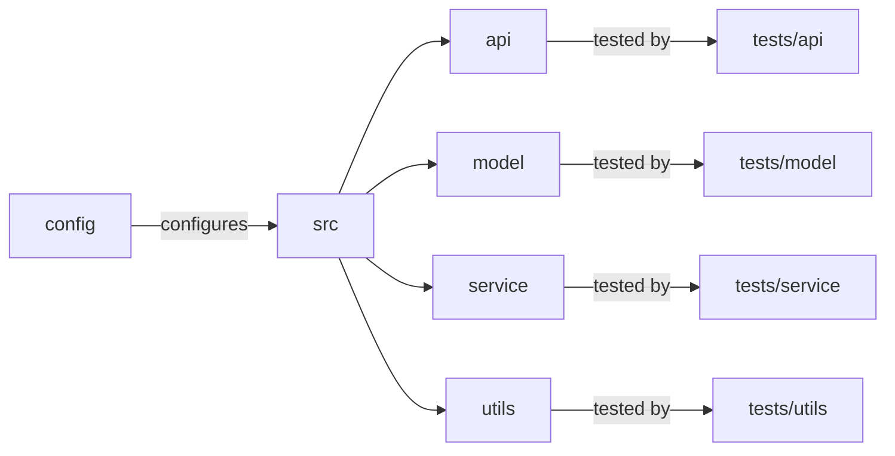

# [[{"id": "f1b92b5b-4406-4b8f-af8b-6006ba69f843", "doc_id": null, "project_id": null, "parent_id": "61903aa8-c27e-441e-942d-f5747e7d3e32", "status": "", "tags": [], "file_list": [], "profiles": [], "users": [], "name": "Task 2: Configure Testing Framework", "description": "In this conversation, we explored the setup of a testing framework using `pytest` for the `codx-llm-factory` project. The goal was to organize the `tests` directory to mirror the main application structure with subdirectories for `api`, `model`, `service`, and `utils`. Each subdirectory would have an `__init__.py` file and specific test files like `test_endpoints.py` and `test_fine_tuning.py`. Basic test cases were suggested as starting points for each module. This organized approach ensures maintainability and comprehensive testing coverage for the project.", "created_at": "2025-07-11 07:03:25.899691", "updated_at": "2025-07-11T08:20:14.295952", "mode": "chat", "kanban_id": "", "column_id": "", "board": "ROADMAP", "column": "Backlog", "chat_index": 0, "url": "", "branch": "", "file_path": "", "model": "", "visibility": "", "remote_url": "", "knowledge_topics": []}]]
## [[{"doc_id": "5ff7a0d3-11ff-4d0a-bba0-ac55ce7beede", "role": "user", "task_item": "", "think": "", "hide": true, "improvement": false, "created_at": "2025-07-11 07:03:25.894749", "updated_at": "2025-07-11 07:03:25.894831", "images": [], "files": ["/README.md"], "meta_data": {}, "profiles": [], "user": null, "knowledge_topics": [], "done": true, "is_thinking": false, "disable_knowledge": false}]]
 
                    ```xml
                    <context>
                    # Project Structure and Testing Organization

To enhance clarity and maintenance in the `codx-llm-factory` project, organize tests within the `tests` directory to mirror the main application structure. This involves creating subdirectories for each major component (API, model, service, utils), helping ensure comprehensive coverage and alignment with the corresponding module functionalities.

## Proposed Directory Structure

```plaintext
codx-llm-factory/
│
├── README.md
├── CONTRIBUTING.md
├── LICENSE.md
├── pyproject.toml
├── config/
│   ├── config.yaml
│   └── ...
├── src/
│   ├── __init__.py
│   ├── api/
│   │   ├── __init__.py
│   │   ├── endpoints.py
│   │   └── utils.py
│   ├── model/
│   │   ├── __init__.py
│   │   ├── fine_tuning.py
│   │   ├── search.py
│   │   └── rag.py
│   ├── service/
│   │   ├── __init__.py
│   │   ├── main.py
│   │   └── utils.py
│   ├── utils/
│   │   ├── __init__.py
│   │   ├── file_operations.py
│   │   └── logging.py
│   └── __main__.py
└── tests/
    ├── __init__.py
    ├── api/
    │   ├── __init__.py
    │   └── test_endpoints.py
    ├── model/
    │   ├── __init__.py
    │   ├── test_fine_tuning.py
    │   ├── test_search.py
    │   └── test_rag.py
    ├── service/
    │   ├── __init__.py
    │   └── test_main.py
    └── utils/
        ├── __init__.py
        ├── test_file_operations.py
        └── test_logging.py
```



This approach ensures a scalable, maintainable project with a straightforward setup for developers.

**Keywords**: Project structure, Testing, Codx-llm-factory, API, Model, Service, Utils, Maintenance, Clarity, Comprehensive Coverage, Python
                    </context>

                    <task>
                    Set up a testing framework such as pytest for the project. Organize the testing structure within a 'tests' directory to mirror the application structure. Create subdirectories for api, model, service, and utils. Add __init__.py in each folder. Implement test_endpoints.py under the api directory, test_fine_tuning.py, test_search.py, and test_rag.py under the model directory, test_main.py under the service directory, and test_file_operations.py and test_logging.py under the utils directory.
                    </task>
                    ```
                    
                    Given the "context" improve the "task" description.
                    Return a detailed task description
                    Add all important information
                    Generate a clear and easy redeable description 
                    
## [[{"doc_id": "d8465810-e09d-4db5-a3ae-b50a8cc28624", "role": "assistant", "task_item": "", "think": null, "hide": false, "improvement": false, "created_at": "2025-07-11 07:03:25.894749", "updated_at": "2025-07-11 07:03:25.894831", "images": [], "files": [], "meta_data": {"time_taken": 21.657011032104492, "first_chunk_time_taken": 0.0018687248229980469, "model": "gpt-4o"}, "profiles": [], "user": null, "knowledge_topics": [], "done": true, "is_thinking": null, "disable_knowledge": false}]]
```plaintext
## Task: Set Up a Testing Framework for codx-llm-factory

In the `codx-llm-factory` project, it's essential to ensure robust testing to maintain code quality and functionality. The goal is to set up a comprehensive testing framework using `pytest` that mirrors the structure of the main application code. Here's a step-by-step guide to achieve this.

### Step 1: Install pytest

First, ensure that `pytest` is installed in your development environment. You can install `pytest` using pip:

```bash
pip install pytest
```

### Step 2: Organize the Testing Structure

Create a `tests` directory in the root of your project. This directory will mirror the application structure to promote clarity and ease of maintenance. Follow these steps to set up the directory structure:

1. **Create Directory Structure:**
    - Inside the `tests` directory, create subdirectories corresponding to each major component of your application: `api`, `model`, `service`, and `utils`.

2. **Add `__init__.py` Files:**
    - Within each subdirectory, add an `__init__.py` file. This file can be empty, but its presence helps Python recognize the directory as a package, allowing for cleaner imports if necessary.

3. **Create Test Files:**
   - **API Tests:**
       - Create `test_endpoints.py` inside the `tests/api` directory. This will contain tests for the `endpoints.py` module in your application.
   - **Model Tests:**
       - Create `test_fine_tuning.py`, `test_search.py`, and `test_rag.py` inside the `tests/model` directory. These files will respectively contain tests for the `fine_tuning.py`, `search.py`, and `rag.py` modules.
   - **Service Tests:**
       - Create `test_main.py` inside the `tests/service` directory. This file will test the functionalities found in `main.py`.
   - **Utils Tests:**
       - Create `test_file_operations.py` and `test_logging.py` inside the `tests/utils` directory to test `file_operations.py` and `logging.py`.

### Step 3: Implement Basic Tests

For each test file, start by implementing basic test cases to ensure initial functionality. Here are some examples:

- **For `test_endpoints.py`:**

    ```python
    def test_example_endpoint():
        # Example test for an API endpoint
        assert True  # Replace with your actual test logic
    ```

- **For `test_fine_tuning.py`:**

    ```python
    def test_fine_tuning_process():
        # Example test for fine-tuning
        assert True  # Replace with your actual test logic
    ```

- And similarly for each respective test file.

### Step 4: Run the Tests

With the test structure in place and sample tests written, execute the tests using `pytest`:

```bash
pytest tests
```

Ensure that all tests pass or identify areas that need attention. Expand each test file with more comprehensive cases as you enhance your application.

### Conclusion

By following these steps, you'll create a well-organized testing setup that aligns with the structure of your main application code. This organization will make it easier to develop, maintain, and expand the `codx-llm-factory` project while ensuring thorough testing coverage.
```