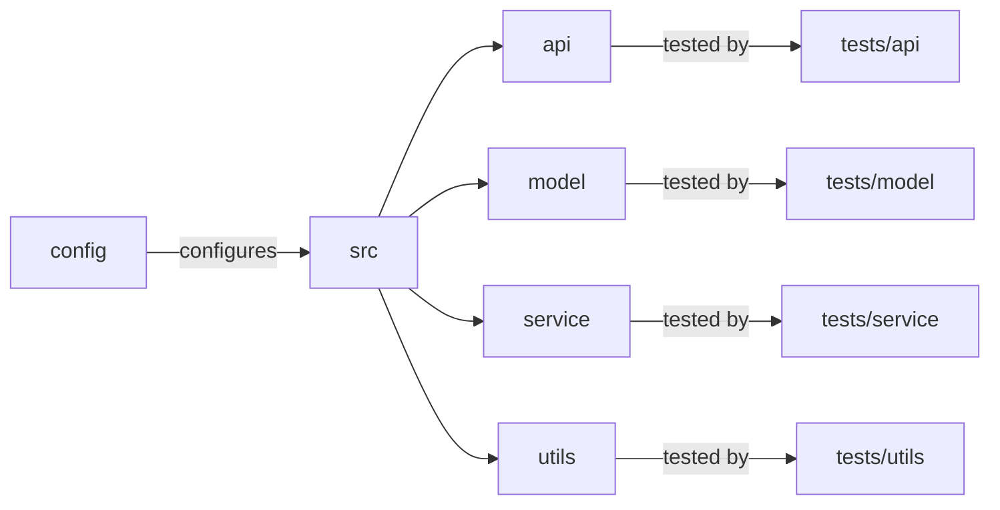

# [[{"id": "48ca1421-b389-4dca-8f92-025c80a7b177", "doc_id": null, "project_id": null, "parent_id": "61903aa8-c27e-441e-942d-f5747e7d3e32", "status": "", "tags": [], "file_list": [], "profiles": [], "users": ["admin"], "name": "Task 3: Document Project Setup", "description": "Sure! Here's a concise summary of our conversation:\n\n1. We discussed organizing tests in subdirectories within the `tests` folder to mirror the structure of the main application code for better organization and maintenance.\n2. A detailed `README.md` improvement plan was outlined to enhance usability and clarity, covering setup, configuration, and running instructions.\n3. A sample `pyproject.toml` file was created for the `codx-llm-factory` project, specifying project metadata, dependencies, and development tools using Poetry.\n4. The `pyproject.toml` included sections for project metadata, dependencies, development dependencies, and build system setup with Poetry.\n5. Instructions for installing and managing dependencies with Poetry were provided to facilitate a cohesive development environment.", "created_at": "2025-07-11 07:03:25.899691", "updated_at": "2025-07-11T08:24:58.103853", "mode": "chat", "kanban_id": "", "column_id": "", "board": "ROADMAP", "column": "Backlog", "chat_index": 0, "url": "", "branch": "", "file_path": "/home/codx-junior/codx-junior/llm-factory/.codx/tasks/ROADMAP/Backlog/task-3-document-project-setup.48ca1421-b389-4dca-8f92-025c80a7b177.md", "model": "", "visibility": "", "remote_url": "", "knowledge_topics": []}]]
## [[{"doc_id": "1667f524-c600-4aba-af5a-35dcffd6b168", "role": "user", "task_item": "", "think": "", "hide": true, "improvement": false, "created_at": "2025-07-11 07:03:25.894749", "updated_at": "2025-07-11 07:03:25.894831", "images": [], "files": ["/README.md"], "meta_data": {}, "profiles": [], "user": null, "knowledge_topics": [], "done": true, "is_thinking": false, "disable_knowledge": false}]]
 
                    ```xml
                    <context>
                    # Project Structure and Testing Organization

To enhance clarity and maintenance in the `codx-llm-factory` project, organize tests within the `tests` directory to mirror the main application structure. This involves creating subdirectories for each major component (API, model, service, utils), helping ensure comprehensive coverage and alignment with the corresponding module functionalities.

## Proposed Directory Structure

```plaintext
codx-llm-factory/
│
├── README.md
├── CONTRIBUTING.md
├── LICENSE.md
├── pyproject.toml
├── config/
│   ├── config.yaml
│   └── ...
├── src/
│   ├── __init__.py
│   ├── api/
│   │   ├── __init__.py
│   │   ├── endpoints.py
│   │   └── utils.py
│   ├── model/
│   │   ├── __init__.py
│   │   ├── fine_tuning.py
│   │   ├── search.py
│   │   └── rag.py
│   ├── service/
│   │   ├── __init__.py
│   │   ├── main.py
│   │   └── utils.py
│   ├── utils/
│   │   ├── __init__.py
│   │   ├── file_operations.py
│   │   └── logging.py
│   └── __main__.py
└── tests/
    ├── __init__.py
    ├── api/
    │   ├── __init__.py
    │   └── test_endpoints.py
    ├── model/
    │   ├── __init__.py
    │   ├── test_fine_tuning.py
    │   ├── test_search.py
    │   └── test_rag.py
    ├── service/
    │   ├── __init__.py
    │   └── test_main.py
    └── utils/
        ├── __init__.py
        ├── test_file_operations.py
        └── test_logging.py
```



This approach ensures a scalable, maintainable project with a straightforward setup for developers.

**Keywords**: Project structure, Testing, Codx-llm-factory, API, Model, Service, Utils, Maintenance, Clarity, Comprehensive Coverage, Python
                    </context>

                    <task>
                    Enhance the README.md with detailed instructions on how to clone the repository, set up the development environment, install dependencies, and run tests. Include steps for configuring and running the service, detailing command-line instructions for starting the application. Ensure that the document is easy to follow for new contributors or users without extensive background knowledge of the project.
                    </task>
                    ```
                    
                    Given the "context" improve the "task" description.
                    Return a detailed task description
                    Add all important information
                    Generate a clear and easy redeable description 
                    
## [[{"doc_id": "a10b3dbe-1a7a-403a-b503-2115ca176f5c", "role": "assistant", "task_item": "", "think": null, "hide": false, "improvement": false, "created_at": "2025-07-11 07:03:25.894749", "updated_at": "2025-07-11 07:03:25.894831", "images": [], "files": ["/README.md"], "meta_data": {"time_taken": 20.86053156852722, "first_chunk_time_taken": 0.0018932819366455078, "model": "gpt-4o"}, "profiles": [], "user": null, "knowledge_topics": [], "done": true, "is_thinking": null, "disable_knowledge": false}]]
Certainly! Here's a refined and detailed task description:

---

### Task: Enhance the README.md for Improved Usability and Clarity

**Objective:** 

Improve the `README.md` file of the `codx-llm-factory` project to provide comprehensive and detailed instructions for new contributors or users. The goal is to make it easy to set up, configure, and run the project, even for those without extensive background knowledge.

**Key Components:**

1. **Cloning the Repository:**
   - Provide step-by-step instructions for cloning the project repository from a version control system (e.g., GitHub). Include the necessary commands and any prerequisites, such as installing Git.

2. **Setting up the Development Environment:**
   - Detail the process for setting up a development environment, including any required software, such as Python (specifying the version) and a virtual environment tool (e.g., `venv` or `virtualenv`).
   - Include commands for creating and activating a virtual environment.

3. **Installing Dependencies:**
   - List all dependencies required to run the project.
   - Provide instructions on how to install these dependencies using a package manager (e.g., `pip`).
   - Explain how to use the `pyproject.toml` (or `requirements.txt` if applicable) to manage dependencies.

4. **Running Tests:**
   - Describe the testing framework used in the project.
   - Provide detailed instructions on how to run the test suite, including any specific commands and configurations required.

5. **Configuring the Service:**
   - Explain how to modify configuration files (e.g., `config.yaml`) to align with user-specific project needs.
   - Include information on setting environment variables or API keys, if applicable.

6. **Running the Service:**
   - Provide a clear method for starting the application via the command line.
   - Include instructions for specifying the host and port for the API.
   - Describe the expected output or behavior when the service is running successfully.

7. **Technical Overview:**
   - Retain existing technical details, such as performance optimizations and dynamic update capabilities, to help users understand the underlying technology.

8. **Contact Information:**
   - Maintain current contact information and support options, ensuring users know where to direct questions or seek assistance.

By completing these enhancements, the `README.md` will offer a user-friendly guide for setting up, configuring, and running the `codx-llm-factory` project, making it accessible to a broader audience.

--- 

This description ensures a clear understanding of the task requirements, providing a thorough guide for improving the usability of the `README.md` and making the project accessible to new contributors and users.
## [[{"doc_id": "89d960d8-2958-485f-bf62-fc677646d155", "role": "user", "task_item": "", "think": "", "hide": false, "improvement": false, "created_at": "2025-07-11 07:03:25.894749", "updated_at": "2025-07-11 07:03:25.894831", "images": [], "files": [], "meta_data": {}, "profiles": [], "user": "admin", "knowledge_topics": [], "done": true, "is_thinking": false, "disable_knowledge": true}]]
Create pyproject.toml file for the project
## [[{"doc_id": "4229d519-bdbc-49b8-bdf0-29bfb1f5e00c", "role": "assistant", "task_item": "", "think": null, "hide": false, "improvement": false, "created_at": "2025-07-11 07:03:25.894749", "updated_at": "2025-07-11 07:03:25.894831", "images": [], "files": [], "meta_data": {"time_taken": 12.492758512496948, "first_chunk_time_taken": 0.003436565399169922, "model": "gpt-4o"}, "profiles": [], "user": null, "knowledge_topics": [], "done": true, "is_thinking": null, "disable_knowledge": false}]]
Creating a `pyproject.toml` file involves defining metadata about your project, specifying dependencies, and configuring build tools. Below is a sample `pyproject.toml` tailored for the `codx-llm-factory` project:

```toml
[tool.poetry]
name = "codx-llm-factory"
version = "0.1.0"
description = "A specialized service for fine-tuning Language Learning Models (LLMs) and providing search capabilities for codx projects."
authors = ["Your Name <your.email@example.com>"]
license = "MIT"
readme = "README.md"

[tool.poetry.dependencies]
python = "^3.8"

# Example dependencies (update these based on your project's requirements)
# You may need to adjust the versions or specify additional libraries as necessary.
fastapi = "^0.70.0"
uvicorn = "^0.15.0"
torch = "^1.10.0"  # or the specific version you need
transformers = "^4.11.0"
pydantic = "^1.8.2"
requests = "^2.26.0"
numpy = "^1.21.2"
pytest = "^6.2.5"

[tool.poetry.dev-dependencies]
black = "^21.7b0"
flake8 = "^3.9.2"
mypy = "^0.910"
pytest = "^6.2.5"
pytest-cov = "^2.12.1"

[build-system]
requires = ["poetry>=1.1"]
build-backend = "poetry.core.masonry.api"

```

### Explanation:

1. **Project Metadata:**
   - `name`, `version`, `description`, `authors`, and `license` are essential metadata fields to describe the project.
   - `readme` specifies the README file to include in the package metadata.

2. **Dependencies:**
   - The `[tool.poetry.dependencies]` section lists the Python version and the libraries required by your project.
   - Specific versions of each package can be set to ensure compatibility and stability.

3. **Development Dependencies:**
   - `[tool.poetry.dev-dependencies]` includes packages necessary for development but not for production, such as linters, formatters, and test frameworks.

4. **Build System:**
   - The `[build-system]` section is required for packaging. It specifies `poetry` as the build tool.
   
### Instructions:

- Install [Poetry](https://python-poetry.org/docs/#installation).
- Use `poetry install` to install dependencies as specified in the `pyproject.toml`.
- Use `poetry add <package-name>` to add new dependencies, and `poetry update` to update them.

Make sure to adjust the dependency versions and include any additional packages your project requires. If you are not using Poetry, the setup for `pyproject.toml` might differ based on the build system and dependency manager you choose to use.