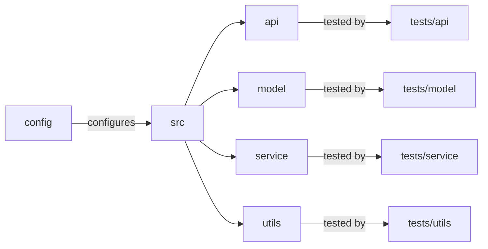

# [[{"id": "b7379a25-7625-469d-9731-476644670813", "doc_id": null, "project_id": null, "parent_id": "61903aa8-c27e-441e-942d-f5747e7d3e32", "status": "", "tags": [], "file_list": [], "profiles": [], "users": [], "name": "Task 4: Create and Review CONTRIBUTING Guide", "description": "In this conversation, we discussed organizing the `codx-llm-factory` project structure and tests for clarity and maintenance. The proposed directory includes subdirectories for major components like API, model, service, and utils. We also explored drafting a `CONTRIBUTING.md` document, outlining coding standards, commit message conventions, branch naming, and pull request processes to encourage collaboration. Emphasizing clear guidelines and resources will help improve the project and foster a positive community environment.", "created_at": "2025-07-11 07:03:25.899691", "updated_at": "2025-07-11T08:21:01.440179", "mode": "chat", "kanban_id": "", "column_id": "", "board": "ROADMAP", "column": "Backlog", "chat_index": 0, "url": "", "branch": "", "file_path": "", "model": "", "visibility": "", "remote_url": "", "knowledge_topics": []}]]
## [[{"doc_id": "4938ed7a-dd6d-4ff0-b37a-6651c1b531da", "role": "user", "task_item": "", "think": "", "hide": true, "improvement": false, "created_at": "2025-07-11 07:03:25.894749", "updated_at": "2025-07-11 07:03:25.894831", "images": [], "files": ["/README.md"], "meta_data": {}, "profiles": [], "user": null, "knowledge_topics": [], "done": true, "is_thinking": false, "disable_knowledge": false}]]
 
                    ```xml
                    <context>
                    # Project Structure and Testing Organization

To enhance clarity and maintenance in the `codx-llm-factory` project, organize tests within the `tests` directory to mirror the main application structure. This involves creating subdirectories for each major component (API, model, service, utils), helping ensure comprehensive coverage and alignment with the corresponding module functionalities.

## Proposed Directory Structure

```plaintext
codx-llm-factory/
│
├── README.md
├── CONTRIBUTING.md
├── LICENSE.md
├── pyproject.toml
├── config/
│   ├── config.yaml
│   └── ...
├── src/
│   ├── __init__.py
│   ├── api/
│   │   ├── __init__.py
│   │   ├── endpoints.py
│   │   └── utils.py
│   ├── model/
│   │   ├── __init__.py
│   │   ├── fine_tuning.py
│   │   ├── search.py
│   │   └── rag.py
│   ├── service/
│   │   ├── __init__.py
│   │   ├── main.py
│   │   └── utils.py
│   ├── utils/
│   │   ├── __init__.py
│   │   ├── file_operations.py
│   │   └── logging.py
│   └── __main__.py
└── tests/
    ├── __init__.py
    ├── api/
    │   ├── __init__.py
    │   └── test_endpoints.py
    ├── model/
    │   ├── __init__.py
    │   ├── test_fine_tuning.py
    │   ├── test_search.py
    │   └── test_rag.py
    ├── service/
    │   ├── __init__.py
    │   └── test_main.py
    └── utils/
        ├── __init__.py
        ├── test_file_operations.py
        └── test_logging.py
```



This approach ensures a scalable, maintainable project with a straightforward setup for developers.

**Keywords**: Project structure, Testing, Codx-llm-factory, API, Model, Service, Utils, Maintenance, Clarity, Comprehensive Coverage, Python
                    </context>

                    <task>
                    Draft and finalize a CONTRIBUTING.md document outlining the guidelines for contributing to the project. Specify coding standards, commit message conventions, branch naming strategies, and the process for submitting pull requests. Encourage contribution and provide resources on key areas where the project could improve. Make sure this document is clear, concise, and encourages collaboration.
                    </task>
                    ```
                    
                    Given the "context" improve the "task" description.
                    Return a detailed task description
                    Add all important information
                    Generate a clear and easy redeable description 
                    
## [[{"doc_id": "6144c31c-e89c-46d7-a607-c468107c1f2c", "role": "assistant", "task_item": "", "think": null, "hide": false, "improvement": false, "created_at": "2025-07-11 07:03:25.894749", "updated_at": "2025-07-11 07:03:25.894831", "images": [], "files": [], "meta_data": {"time_taken": 21.030297994613647, "first_chunk_time_taken": 0.0023107528686523438, "model": "gpt-4o"}, "profiles": [], "user": null, "knowledge_topics": [], "done": true, "is_thinking": null, "disable_knowledge": false}]]
### Task Description: Drafting and Finalizing the CONTRIBUTING.md Document for the codx-llm-factory Project

In the context of enhancing clarity and maintainability within the `codx-llm-factory` project, your task is to create a comprehensive `CONTRIBUTING.md` document. This document will serve as a guide for contributors looking to make meaningful contributions to the project. It should outline critical guidelines and processes to facilitate seamless collaboration and maintain high standards across the codebase. Here is a detailed breakdown of what the `CONTRIBUTING.md` should include:

1. **Introduction**
   - Briefly describe the purpose of the `codx-llm-factory` project and how contributors can help improve it.
   - Emphasize the importance of maintaining a structured and well-organized project, reflecting the organized structure of the test suite.

2. **Coding Standards**
   - Define the coding conventions to be followed, such as PEP 8 for Python.
   - Specify practices for maintaining readability and consistency, such as naming conventions for variables, functions, and classes.

3. **Commit Message Conventions**
   - Outline the format for commit messages to maintain clarity and purpose in historical changes. 
   - Use a conventional commits style, which might include types (e.g., `feat`, `fix`, `docs`, `style`, `refactor`, `test`, `chore`), a short description, and an optional extended description.

4. **Branch Naming Strategy**
   - Provide guidelines on how branches should be named, reflecting their purpose and context (e.g., `feature/`, `bugfix/`, `hotfix/`, `release/`).
   - Mention any branch protection rules if applicable.

5. **Pull Request Process**
   - Detail the step-by-step process for submitting a pull request, from forking the repository to making changes and submitting.
   - Encourage thorough documentation and testing before submission. All new code should include relevant unit tests within the `tests` directory.
   - Provide tips on how to write a descriptive pull request summary.

6. **Review and Approval Process**
   - Explain the procedure used for reviewing contributions and who will be responsible for approvals.
   - Encourage constructive feedback and collaboration in review.

7. **Areas for Improvement**
   - Highlight key areas where the project could benefit from contributions, such as improving model fine-tuning techniques, enhancing the REST API, or expanding the test suite.

8. **Encouraging Collaboration and Providing Resources**
   - Encourage respectful, inclusive collaboration among contributors.
   - Offer resources or links to documentation, tutorials, or code examples to help new contributors understand the project and the technologies it uses.

9. **Code of Conduct**
   - Include a brief mention of adherence to a Code of Conduct and link to it to ensure respectful and positive interactions within the community.

By creating a clear, detailed, and welcoming `CONTRIBUTING.md` file, you will help nurture a collaborative environment that encourages contributions while maintaining the high standards necessary for the project's success.