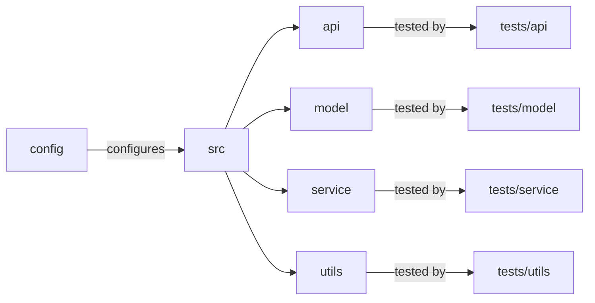

# [[{"id": "8c04603b-ba7c-4f14-833c-c0702b15660e", "doc_id": null, "project_id": null, "parent_id": "61903aa8-c27e-441e-942d-f5747e7d3e32", "status": "", "tags": [], "file_list": [], "profiles": [], "users": [], "name": "Task 5: Implement Integration with REST API", "description": "The conversation outlines the task of organizing the `codx-llm-factory` project structure to align its tests with main application components, and specifies the development of two API endpoints. These endpoints, `/fine-tune` and `/chat`, are intended to handle model fine-tuning requests and enable interactive model conversations, respectively. Detailed instructions focus on implementation, request handling, response formatting, and extensive testing. Documentation updates and performance optimization are also emphasized. Lastly, the task aims to enhance the project\u2019s functionality to support dynamic AI enhancements for codx projects.", "created_at": "2025-07-11 07:03:25.899691", "updated_at": "2025-07-11T08:21:30.870622", "mode": "chat", "kanban_id": "", "column_id": "", "board": "ROADMAP", "column": "Backlog", "chat_index": 0, "url": "", "branch": "", "file_path": "", "model": "", "visibility": "", "remote_url": "", "knowledge_topics": []}]]
## [[{"doc_id": "51e7abdd-a997-4782-8ee5-302d24e3363d", "role": "user", "task_item": "", "think": "", "hide": true, "improvement": false, "created_at": "2025-07-11 07:03:25.894749", "updated_at": "2025-07-11 07:03:25.894831", "images": [], "files": ["/README.md"], "meta_data": {}, "profiles": [], "user": null, "knowledge_topics": [], "done": true, "is_thinking": false, "disable_knowledge": false}]]
 
                    ```xml
                    <context>
                    # Project Structure and Testing Organization

To enhance clarity and maintenance in the `codx-llm-factory` project, organize tests within the `tests` directory to mirror the main application structure. This involves creating subdirectories for each major component (API, model, service, utils), helping ensure comprehensive coverage and alignment with the corresponding module functionalities.

## Proposed Directory Structure

```plaintext
codx-llm-factory/
│
├── README.md
├── CONTRIBUTING.md
├── LICENSE.md
├── pyproject.toml
├── config/
│   ├── config.yaml
│   └── ...
├── src/
│   ├── __init__.py
│   ├── api/
│   │   ├── __init__.py
│   │   ├── endpoints.py
│   │   └── utils.py
│   ├── model/
│   │   ├── __init__.py
│   │   ├── fine_tuning.py
│   │   ├── search.py
│   │   └── rag.py
│   ├── service/
│   │   ├── __init__.py
│   │   ├── main.py
│   │   └── utils.py
│   ├── utils/
│   │   ├── __init__.py
│   │   ├── file_operations.py
│   │   └── logging.py
│   └── __main__.py
└── tests/
    ├── __init__.py
    ├── api/
    │   ├── __init__.py
    │   └── test_endpoints.py
    ├── model/
    │   ├── __init__.py
    │   ├── test_fine_tuning.py
    │   ├── test_search.py
    │   └── test_rag.py
    ├── service/
    │   ├── __init__.py
    │   └── test_main.py
    └── utils/
        ├── __init__.py
        ├── test_file_operations.py
        └── test_logging.py
```



This approach ensures a scalable, maintainable project with a straightforward setup for developers.

**Keywords**: Project structure, Testing, Codx-llm-factory, API, Model, Service, Utils, Maintenance, Clarity, Comprehensive Coverage, Python
                    </context>

                    <task>
                    Develop the API endpoints specified in the documentation, ensuring proper routes, request handling, and response formats. Implement '/fine-tune' POST endpoint to handle model fine-tuning requests and '/chat' POST endpoint to facilitate OpenAI-compatible model interactions. Ensure endpoints are well-documented internally with docstrings and that they are tested for robustness and performance.
                    </task>
                    ```
                    
                    Given the "context" improve the "task" description.
                    Return a detailed task description
                    Add all important information
                    Generate a clear and easy redeable description 
                    
## [[{"doc_id": "7a325da3-ddd1-4fc5-a7ab-a1026e66b070", "role": "assistant", "task_item": "", "think": null, "hide": false, "improvement": false, "created_at": "2025-07-11 07:03:25.894749", "updated_at": "2025-07-11 07:03:25.894831", "images": [], "files": ["/README.md"], "meta_data": {"time_taken": 25.431641340255737, "first_chunk_time_taken": 0.004801511764526367, "model": "gpt-4o"}, "profiles": [], "user": null, "knowledge_topics": [], "done": true, "is_thinking": null, "disable_knowledge": false}]]

### Task: Develop and Implement API Endpoints for Codx-LLM-Factory

Based on the provided context and requirements of the `codx-llm-factory` project, your task is to develop and implement two key API endpoints that align with the project's goal of fine-tuning Language Learning Models (LLMs) and providing interactive chat capabilities. This involves working with the existing project structure to ensure seamless integration and functionality.

#### Key Objectives:

1. **Implement '/fine-tune' POST Endpoint**:
   - **Purpose**: To initiate the fine-tuning process for a specific project.
   - **Route & Method**: `/fine-tune` using `POST` method.
   - **Request Handling**:
     - Accept parameters such as project ID or name to identify the specific project.
     - Trigger the creation of a fine-tuned model based on the project's base branch.
   - **Response Format**:
     - Provide clear feedback to the client, indicating the success or failure of the fine-tuning initiation.
     - Include relevant details in the response, such as process ID or expected time for completion.
   - **Internal Documentation**:
     - Document using comprehensive docstrings, outlining method parameters, processing steps, and response structure.
   - **Testing**:
     - Ensure endpoint robustness by testing different scenarios and inputs.
     - Validate performance benchmarks ensuring efficient resource utilization.

2. **Implement '/chat' POST Endpoint**:
   - **Purpose**: To facilitate interactions with the fine-tuned models using an OpenAI-compatible interface.
   - **Route & Method**: `/chat` using `POST` method.
   - **Request Handling**:
     - Manage conversation initiation by accepting user queries.
     - Process inquiries through the fine-tuned model for meaningful responses.
   - **Response Format**:
     - Structured response to include the model's reply to the query, maintaining a conversational flow.
     - Ensure compatibility with OpenAI standard interfaces, delivering an intuitive interaction experience.
   - **Internal Documentation**:
     - Elaborate using docstrings, detailing parameters accepted from requests and the structure of model responses.
   - **Testing**:
     - Conduct extensive tests to ensure accurate and relevant responses from the model.
     - Address edge cases where inputs might be malformed or ambiguous.

#### Additional Considerations:

- **Project Structure & Alignment**:
  - Implement these endpoints in the `src/api/endpoints.py` file to align with the established project structure.
  - Ensure that the related test files (`tests/api/test_endpoints.py`) are updated with comprehensive test scenarios reflecting endpoint functionalities.

- **Maintaining System Integrity & Performance**:
  - Optimize code to maintain low response times despite numerous concurrent requests.
  - Continuously monitor and log endpoint interactions to improve service reliability and user satisfaction.

- **Documentation**:
  - Update the project’s main documentation (`README.md`) with detailed instructions on how these endpoints can be accessed and used by external clients, including any necessary API key or authentication details needed for secure access.

Completing this task will solidify the API’s ability to provide dynamic model fine-tuning and interactive capabilities within codx projects, ensuring cutting-edge AI assistance tailored to specific project needs.